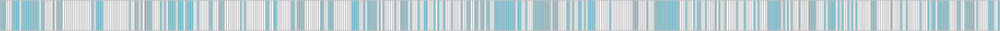

DRAFT DRAFT DRAFT

# An Extensive Benchmark of C (and Some C++) Hash Tables

**Jackson Allan** · ?? May 2024

## Introduction: Why Another Hash-Table Benchmark?

Although thorough hash-table benchmarks have [already](https://martin.ankerl.com/2022/08/27/hashmap-bench-01/) [been](https://tessil.github.io/2016/08/29/benchmark-hopscotch-map.html) [published](https://attractivechaos.wordpress.com/2018/01/13/revisiting-hash-table-performance/) by others in recent years, I have decided to contribute another benchmarking suite for several reasons. Firstly, the existing publications concentrate on C++ tables, whereas there is little coverage of C tables. Consequently, C programmers tend to be directed towards older, well-known libraries despite the existence of newer libraries that may offer superior performance. Secondly, the results reported by the existing benchmarks are mostly cumulative, so they do not clearly show how the tables tested perform under specific conditions such as the table's [load factor](https://xlinux.nist.gov/dads/HTML/loadfactor.html). Moreover, some existing benchmarks test only one key type or bucket size, which makes it hard to draw general conclusions about a given table's performance. The final motivation is a personal interest: I recently released a novel generic table in C (via [Verstable](https://github.com/JacksonAllan/Verstable) and [CC](https://github.com/JacksonAllan/CC)'s cc_map) and would like to showcase how it measures up against both the leading C++ tables and other tables available in the C landscape.

Click [here](#results) to skip to the results.

## Benchmarking Setup

The benchmarks include three hash table configurations designed to measure the tables' performance under diverse conditions:

* The _32-bit integer key, 32-bit value_ benchmarks test how the tables perform when the key hash and comparison functions are cheap, traversing buckets is cheap (i.e. does not cause many cache misses), and moving key-value pairs is cheap. These benchmarks disadvantage tables that store metadata in a separate array because doing so necessarily causes at least one extra cache miss per lookup.

* The _64-bit integer key, 448-bit value_ benchmarks test how the tables perform when the hash and comparison function are cheap, traversing buckets is expensive (one cache miss per bucket on architectures with 64-byte cache lines), and moving key-value pairs is expensive. These benchmarks disadvantage tables that do not store metadata in a separate array (or do so but access the buckets array with every probe anyway to check the key) and that move key-value pairs around often (e.g. [Robin Hood](https://www.sebastiansylvan.com/post/robin-hood-hashing-should-be-your-default-hash-table-implementation) hash tables).

* The _16-char c-string key, 64-bit value_ benchmarks test how the tables perform when the hash and comparison functions are expensive. These benchmarks disadvantage tables that lack a metadata mechanism to limit key comparisons or that rehash keys often.

All maps are configured to use the same hash functions, namely the [MurmurHash3 finalizer](https://zimbry.blogspot.com/2011/09/better-bit-mixing-improving-on.html) for integer keys and [FNV-1a](https://en.wikipedia.org/wiki/Fowler%E2%80%93Noll%E2%80%93Vo_hash_function) for string keys.

The maximum load factor for all maps is set to 0.875. Hence, and because all the tables tested—except for std::unordered_map under GCC—grow by doubling the bucket count once the maximum load factor is reached, the benchmark results show the performance of each table across the load-factor range of approximately 0.44 (the troughs in the graphs) to 0.875 (the peaks). I chose this maximum because it is relatively high and several tables with hard-coded, non-customizable maximum load factors (namely absl::flat_hash_map and boost::unordered_flat_map) use it.

The integer key data set consists of sequential integers shuffled randomly. The string-key data set consists of sequential `NULL`-terminated strings shuffled randomly.

The code was compiled in C++ using GCC 12.1, via MinGW-w64, with `-O3` and `-DNDEBUG`. The benchmarks were run on an AMD Ryzen 7 5800H with the frequency locked at 90%.

As for the benchmarks themselves, they consist of the following:

* _Total time to insert_ N _nonexisting keys_: In this benchmark, N unique keys are inserted into the table. At even intervals during this process, the total time elapsed since the beginning of the benchmark is recorded. Hence, the results of this benchmark are cumulative, unlike those of all the other benchmarks below.

* _Total time to erase 1,000 existing keys with N keys in the map_: In this benchmark, N unique keys are inserted into the table. At even intervals during this process, 1,000 keys are erased, and the time taken to complete this operation is recorded. These keys consist of a randomly selected 1,000-key sequence within the sequence of keys already inserted. After the keys are erased, they are reinserted into the map before the process of inserting unique keys continues.

* _Time to replace 1,000 existing keys with N keys in the map_. In this benchmark, N unique keys are inserted into the table. At even intervals during this process, 1,000 keys are reinserted, and the time taken to complete this operation is recorded. These keys consist of a randomly selected 1,000-key sequence within the sequence of keys already inserted.

* _Time to erase 1,000 nonexisting keys with N keys in the map_. In this benchmark, N unique keys are inserted into the table. At even intervals during this process, the erase function is called for 1,000 keys that have not been inserted, and the time taken to complete this operation is recorded. These keys consist of a randomly selected 1,000-key sequence within a separate sequence of keys that are never inserted.

* _Time to look up 1,000 existing keys with N keys in the map_. In this benchmark, N unique keys are inserted into the table. At even intervals during this process, 1,000 keys are looked up, and the time taken to complete this operation is recorded. These keys consist of a randomly selected 1,000-key sequence within the sequence of keys already inserted.

* _Time to look up 1,000 nonexisting keys with N keys in the map_. In this benchmark, N unique keys are inserted into the table. At even intervals during this process, the lookup function is called for 1,000 keys that have not been inserted, and the time taken to complete this operation is recorded. These keys consist of a randomly selected 1,000-key sequence within a separate sequence of keys that are never inserted.

* _Time to iterate over 5,000 keys with N keys in the maps_. In this benchmark, N unique keys are inserted into the table. At even intervals during this process, 5,000 keys in the table are iterated over, and the time taken to complete this operation is recorded. The position where the iteration begins is found by looking up a random key from the sequence of keys already inserted.

Of the aforementioned benchmarks, _Total time to erase 1,000 existing keys with N keys in the map_, _Time to replace 1,000 existing keys with N keys in the map_, _Time to erase 1,000 nonexisting keys with N keys in the map_, _Time to look up 1,000 existing keys with N keys in the map_, and _Time to look up 1,000 nonexisting keys with N keys in the map_ are performed side-by-side as part of the same process of inserting N unique keys.

This benchmarking setup has some limitations. Firstly, the range of load factors tested is—as previously mentioned—approximately 0.44 to 0.875. Hence, the results do not show the performance at lower load factors. As some of the tables have default maximum load factors as low as 0.5, they are being measured mostly outside the load factor range in which their authors intended them to operate. Secondly, the benchmarks do not measure memory usage. However, the memory usage of each [open-addressing](https://en.wikipedia.org/wiki/Hash_table#Open_addressing) table, at least, can be estimated based on the maximum load factor it can reasonably tolerate and the size of the metadata it stores per bucket. Thirdly, although the choice of the MurmurHash3 finalizer as the integer hash function ensures that all the tables compete on equal footing and none are impaired by a weak hash function, it may disadvantage tables that can tolerate a fast but weak hash function (e.g. the default integer hash function for std::unordered_map is usually an [identity function](https://en.wikipedia.org/wiki/Identity_function), whereas ankerl::unordered_dense, absl::flat_hash_map, boost::unordered_flat_map, and CC's cc_map, and Verstable all require or benefit from hash functions that provide entropy across all bits of the hash code). Finally, the benchmarks do little to show the cumulative impact of tombstones on the performance of the tables that rely on them when erasures are frequent.

The complete code of the benchmarks is available [here](https://github.com/JacksonAllan/c_cpp_hash_tables_benchmark).

## Hash Tables Benchmarked

### C++ Tables

* [ankerl::unordered_dense](https://github.com/martinus/unordered_dense) v4.1.2: This table employs Robin Hood hashing, which is an open-addressing variant that moves keys around to keep their displacements from the buckets to which they hash as constant as possible. However, it makes two additions to the Robin Hood design. Firstly, rather than storing key-value pairs inside the table's buckets, it stores them contiguously in a separate array. The table buckets store indices into this array. Secondly, it stores an 8-bit fragment of each key's hash code to limit the need to compare keys directly. This table is the successor to an [earlier table from the same author](https://github.com/martinus/robin-hood-hashing), which I have excluded from the published benchmarks because it is deprecated and proved to be inferior in my earlier testing.

* [absl::flat_hash_map](https://github.com/abseil/abseil-cpp) v20240116.2: Developed by Google, this table is thoroughly documented via [the Abseil website](https://abseil.io/about/design/swisstables) and [two](https://www.youtube.com/watch?v=ncHmEUmJZf4) [presentations](https://www.youtube.com/watch?v=JZE3_0qvrMg). It is an open-addressing table that stores a 7-bit fragment of each key's hash code in a separate array and uses [SIMD](https://en.wikipedia.org/wiki/Single_instruction,_multiple_data) instructions to scan this array for potential key matches 16 buckets at a time. It relies on tombstones for erasure.

* [boost::unordered_flat_map](https://www.boost.org) v1.83.0: This table, too, is an open-addressing table that stores hash-code fragments in a separate array and uses SIMD instructions to scan them for potential key matches multiple buckets at a time. However, it differs from absl::flat_hash_map in several important ways. Firstly, keys are hashed not to individual buckets but to 15-bucket groups, which fill up contiguously from one end to the other:

  <table cellpadding="0" cellspacing="0">
  <tr><td>boost</td><td></td></tr>
  <tr><td>absl</td><td></td></tr>
  <tr><td colspan="2">Clustering of key-value pairs in boost::unordered_flat_map vs absl::flat_hash_map at a load factor of 0.4375.</td></tr>
  </table>

  Secondly, the hash-code fragments [consist of 7.99 bits](https://bannalia.blogspot.com/2022/11/inside-boostunorderedflatmap.html) rather than 7 bits. Thirdly, instead of tombstones, the table uses a group-level bloom filter that its authors call an "overflow byte", which also accelerates lookups of nonexisting keys (I consider this mechanism "tombstone-like" because erasures still leave a residual impact on the table's performance and cause more frequent full-table rehashing). The above details and more are documented via a [presentation](https://www.youtube.com/watch?v=Rg8MZ5pJIJA).

* [ska::bytell_hash_map](https://github.com/skarupke/flat_hash_map/blob/master/bytell_hash_map.hpp): This table is the [culmination](https://probablydance.com/2018/05/28/a-new-fast-hash-table-in-response-to-googles-new-fast-hash-table) of its author's experiments with various hash table designs, including Robin Hood and SIMD-accelerated tables. It is documented most thoroughly by a [presentation](https://www.youtube.com/watch?v=M2fKMP47slQ) he delivered. The table is a hybrid of open addressing and [separate chaining](https://en.wikipedia.org/wiki/Hash_table#Separate_chaining). Keys overflowing from one bucket are stored in otherwise vacant buckets of the flat buckets array and chained together using 7-bit "jump distances" (indices into a hard-coded array of possible distances, in terms of buckets, to the next key in the chain). It shares similarities with an older technique called [coalesced hashing](https://en.wikipedia.org/wiki/Coalesced_hashing), except that the chains do not coalesce. Unfortunately, this hash-table library appears to be unmaintained.

* [std::unordered_map](https://en.cppreference.com/w/cpp/container/unordered_map) from GCC 12.1: This is the go-to hash table for many developers because it is part of C++'s standard library. While implementations may differ in their minor details, the constraints imposed by the C++ Standard effectively dictate that this table uses node-based separate chaining, rather than open addressing.

* [tsl::robin_map](https://github.com/Tessil/robin-map) v1.3.0: This is another popular Robin Hood table. Unlike ankerl::unordered_dense, it stores key-value pairs, displacements, and (under some conditions) hash codes together inside the buckets array. It is therefore a more conventional implementation of Robin Hood hashing.

### C Tables

* cc_map from [CC](https://github.com/JacksonAllan/CC) v1.1.0: This table implements Verstable within the constraints of CC's API. See [below](#verstable_description) for more details.

* hmap from [STC](https://github.com/stclib/STC) v5.0 beta 4: This table is an open-addressing table using linear probing. However, it stores a 7-bit fragment of each key's hash code in a separate array to limit direct key comparisons. One unusual feature of this table is that it does not rely on tombstones; rather, an erasure at a given bucket involves shifting subsequent key-value pairs whose probe sequences include that bucket backward to fill the gap. This technique is commonly used by Robin Hood tables but not conventional linear-probing tables.

* khash from [klib](https://github.com/attractivechaos/klib) v0.2.8: This is a very popular open-addressing table that uses quadratic probing by default. It stores keys and values in two separate arrays (in addition to a third metadata array), rather than interspersed together in one buckets array. This choice conserves memory by eliminating padding bytes, but it means that lookups of existing keys necessarily entail extra cache misses.

* DICT_OA_DEF2 from [M\*LIB](https://github.com/P-p-H-d/mlib) v0.7.2: This is another open-addressing table using quadratic probing. Its standout quality is that instead of storing per-bucket metadata, it requires users to reserve two keys to mark empty buckets and tombstones. Hence, the table can often store data more densely and, therefore, in a more cache-friendly manner. For the benchmarks involving integer keys, I have opted to reserve two integer values to act as these sentinels (rather than manually pairing each key with a byte flag) in order to allow the table to take advantage of this feature. However, when configured thusly, this table cannot technically accommodate the full range of keys that the other tables can accommodate.

* hm and sh from [stb_ds](https://github.com/nothings/stb/blob/master/stb_ds.h) v0.67: This is yet another open-addressing table using quadratic probing. Its remarkable feature, when it comes to performance, is that—like ankerl::unordered_dense—it stores key-value pairs not directly in the hash-table buckets but contiguously in a separate array. This table is also split between one implementation for string keys and another implementation for keys of all other data types. Unfortunately, it offers little flexibility: to customize the hash functions, comparison functions, and maximum load factor, I had to modify the library header. Nevertheless, I decided to include this library in the benchmarks because of its immense popularity.

* [uthash](https://troydhanson.github.io/uthash) v2.3.0: This is the oldest and perhaps most popular table included in the benchmarks. Like std::unordered_map, it is a node-based, separate-chaining table. Compared to the other tables, the functionality it provides is rudimentary, with users having to write much of the scaffolding themselves. It is also the only [intrusive](https://stackoverflow.com/questions/5004162/what-does-it-mean-for-a-data-structure-to-be-intrusive) hash table included in these benchmarks.

* [Verstable](https://github.com/JacksonAllan/Verstable) v????: Like ska::bytell_hash_map, this table is a hybrid of open addressing and separate chaining that stores keys overflowing from one bucket in otherwise vacant buckets of the flat buckets array. However, rather than chaining key-value pairs using a 7-bit index into an array of "jump distances", it does so using an 11-bit integer denoting quadratic displacement. It also stores a 4-bit fragment of each key's hash code to limit key comparisons. Hence, it uses two bytes of metadata per bucket, rather than the one byte used by ska::bytell_hash_map.

## Results

Below are the resulting graphs—each corresponding to one of the aforementioned benchmarks—for [0 to 20,000,000 keys](result_2024-04-29T21_23_43_20_000_000.html).

As the benchmarks were repeated 14 times, each data point shown in the graphs represents the average of 10 recordings (I excluded the two highest and two lowest recordings to limit the effect of outliers and any background processing).

The graphs are interactive. Hover over a table's label to highlight the associated plot, and click it to toggle the plot's visibility. The graphs automatically scale to the visible plots.

<svg xmlns='http://www.w3.org/2000/svg' xmlns:xlink='http://www.w3.org/1999/xlink' width='100%' viewBox='0 0 1002 618' style='background-color: white;'>
  
  <foreignObject x='0' y='0' width='100%' height='100%'>
    

      
32-bit integer key, 32-bit value: Total time to insert N nonexisting keys

      

      <input id='Plot0Checkbox' type='checkbox' checked='true'/><label for='Plot0Checkbox'>ankerl</label>
      <input id='Plot1Checkbox' type='checkbox' checked='true'/><label for='Plot1Checkbox'>absl</label>
      <input id='Plot2Checkbox' type='checkbox' checked='true'/><label for='Plot2Checkbox'>boost</label>
      <input id='Plot3Checkbox' type='checkbox' checked='true'/><label for='Plot3Checkbox'>ska</label>
      <input id='Plot4Checkbox' type='checkbox' checked='true'/><label for='Plot4Checkbox'>std</label>
      <input id='Plot5Checkbox' type='checkbox' checked='true'/><label for='Plot5Checkbox'>tsl</label>
      <input id='Plot6Checkbox' type='checkbox' checked='true'/><label for='Plot6Checkbox'>CC</label>
      <input id='Plot7Checkbox' type='checkbox' checked='true'/><label for='Plot7Checkbox'>STC</label>
      <input id='Plot8Checkbox' type='checkbox' checked='true'/><label for='Plot8Checkbox'>klib</label>
      <input id='Plot9Checkbox' type='checkbox' checked='true'/><label for='Plot9Checkbox'>M*LIB</label>
      <input id='Plot10Checkbox' type='checkbox' checked='true'/><label for='Plot10Checkbox'>stb_ds</label>
      <input id='Plot11Checkbox' type='checkbox' checked='true'/><label for='Plot11Checkbox'>uthash</label>
      <input id='Plot12Checkbox' type='checkbox' checked='true'/><label for='Plot12Checkbox'>Verstable</label>
      

      <svg xmlns='http://www.w3.org/2000/svg' xmlns:xlink='http://www.w3.org/1999/xlink' class='innerSVG'>
        <line class='axis' x1='18' x2='18' y1='0' y2='540'/>
        <line class='axis' x1='18' x2='990' y1='540' y2='540'/>
        <text class='axisLabel' x='6' y='270' alignment-baseline='middle' text-anchor='middle' transform='rotate(-90,6,270)'>Linear time from zero &#10230;</text>
        <text class='axisLabel' x='504' y='558' alignment-baseline='middle' text-anchor='middle'>N keys</text>
        <line x1='212' x2='212' y1='540' y2='542' stroke='black'/>
        <text x='212' y='548' alignment-baseline='middle' text-anchor='middle' style='font: 12px sans-serif;'>4,000,000</text>
        <line x1='406' x2='406' y1='540' y2='542' stroke='black'/>
        <text x='406' y='548' alignment-baseline='middle' text-anchor='middle' style='font: 12px sans-serif;'>8,000,000</text>
        <line x1='601' x2='601' y1='540' y2='542' stroke='black'/>
        <text x='601' y='548' alignment-baseline='middle' text-anchor='middle' style='font: 12px sans-serif;'>12,000,000</text>
        <line x1='795' x2='795' y1='540' y2='542' stroke='black'/>
        <text x='795' y='548' alignment-baseline='middle' text-anchor='middle' style='font: 12px sans-serif;'>16,000,000</text>
        <g>
          <polyline id='Plot0Line' class='plotLine' vector-effect='non-scaling-stroke' points='50000,2726 100000,5321 150000,8943.5 200000,10499.2 250000,14941.4 300000,16702 350000,18085.5 400000,19537.2 450000,21298.3 500000,27743.4 550000,29654.5 600000,30760.9 650000,32045.7 700000,33376.8 750000,34783.6 800000,36330 850000,38027.3 900000,39932.7 950000,53802.9 1000000,55090.6 1050000,58319.9 1100000,60436.5 1150000,62411.9 1200000,64324.9 1250000,66108.1 1300000,67841.6 1350000,69560.5 1400000,71268.5 1450000,72998 1500000,74786.2 1550000,76628.3 1600000,78646.7 1650000,80839.8 1700000,83046.4 1750000,85291.4 1800000,87672 1850000,122319 1900000,124274 1950000,126316 2000000,128328 2050000,130358 2100000,136042 2150000,138449 2200000,140845 2250000,143132 2300000,145399 2350000,147658 2400000,149940 2450000,152266 2500000,154639 2550000,157188 2600000,159770 2650000,162383 2700000,165036 2750000,167770 2800000,170551 2850000,173544 2900000,176564 2950000,179664 3000000,182830 3050000,186074 3100000,189543 3150000,193016 3200000,196561 3250000,200194 3300000,204013 3350000,207961 3400000,211921 3450000,215983 3500000,220287 3550000,224692 3600000,229220 3650000,233928 3700000,314109 3750000,316378 3800000,318634 3850000,320904 3900000,323185 3950000,325469 4000000,327799 4050000,330209 4100000,332560 4150000,334926 4200000,344120 4250000,346729 4300000,349277 4350000,351769 4400000,354263 4450000,356781 4500000,359330 4550000,361948 4600000,364527 4650000,367138 4700000,369785 4750000,372442 4800000,375152 4850000,377969 4900000,380750 4950000,383571 5000000,386422 5050000,389332 5100000,392308 5150000,395330 5200000,398357 5250000,401460 5300000,404597 5350000,407852 5400000,411124 5450000,414432 5500000,417784 5550000,421205 5600000,424747 5650000,428311 5700000,431916 5750000,435610 5800000,439441 5850000,443290 5900000,447167 5950000,451112 6000000,455158 6050000,459288 6100000,463450 6150000,467673 6200000,472098 6250000,476512 6300000,481007 6350000,485593 6400000,490258 6450000,494897 6500000,499611 6550000,504496 6600000,509328 6650000,514205 6700000,519274 6750000,524310 6800000,529423 6850000,534726 6900000,539974 6950000,545305 7000000,550778 7050000,556281 7100000,561887 7150000,567699 7200000,573468 7250000,579451 7300000,585568 7350000,756727 7400000,759108 7450000,761483 7500000,763857 7550000,766306 7600000,768740 7650000,771152 7700000,773561 7750000,775981 7800000,778400 7850000,780833 7900000,783362 7950000,785832 8000000,788294 8050000,790764 8100000,793244 8150000,795734 8200000,798293 8250000,800830 8300000,803351 8350000,805878 8400000,821513 8450000,824197 8500000,826811 8550000,829473 8600000,832079 8650000,834695 8700000,837303 8750000,839944 8800000,842585 8850000,845310 8900000,848001 8950000,850739 9000000,853446 9050000,856175 9100000,858910 9150000,861735 9200000,864524 9250000,867328 9300000,870136 9350000,872967 9400000,875849 9450000,878762 9500000,881654 9550000,884559 9600000,887469 9650000,890400 9700000,893406 9750000,896412 9800000,899445 9850000,902472 9900000,905529 9950000,908630 10000000,911741 10050000,914959 10100000,918182 10150000,921360 10200000,924643 10250000,927898 10300000,931141 10350000,934411 10400000,937710 10450000,941119 10500000,944498 10550000,947894 10600000,951303 10650000,954820 10700000,958304 10750000,961817 10800000,965340 10850000,968902 10900000,972602 10950000,976305 11000000,979981 11050000,983705 11100000,987480 11150000,991285 11200000,995110 11250000,998956 11300000,1.00293e+06 11350000,1.00691e+06 11400000,1.0109e+06 11450000,1.01487e+06 11500000,1.019e+06 11550000,1.02312e+06 11600000,1.02727e+06 11650000,1.03145e+06 11700000,1.03575e+06 11750000,1.04006e+06 11800000,1.04438e+06 11850000,1.04876e+06 11900000,1.05318e+06 11950000,1.05762e+06 12000000,1.06206e+06 12050000,1.06665e+06 12100000,1.07122e+06 12150000,1.07584e+06 12200000,1.08054e+06 12250000,1.08525e+06 12300000,1.08998e+06 12350000,1.09479e+06 12400000,1.09962e+06 12450000,1.10449e+06 12500000,1.10938e+06 12550000,1.11439e+06 12600000,1.11937e+06 12650000,1.12436e+06 12700000,1.12946e+06 12750000,1.13454e+06 12800000,1.13966e+06 12850000,1.14488e+06 12900000,1.15043e+06 12950000,1.15566e+06 13000000,1.16101e+06 13050000,1.16633e+06 13100000,1.17168e+06 13150000,1.17713e+06 13200000,1.18253e+06 13250000,1.18797e+06 13300000,1.19351e+06 13350000,1.19902e+06 13400000,1.20461e+06 13450000,1.21024e+06 13500000,1.21586e+06 13550000,1.2216e+06 13600000,1.2273e+06 13650000,1.23307e+06 13700000,1.23894e+06 13750000,1.24475e+06 13800000,1.25061e+06 13850000,1.25658e+06 13900000,1.2625e+06 13950000,1.26855e+06 14000000,1.27457e+06 14050000,1.28062e+06 14100000,1.28683e+06 14150000,1.29299e+06 14200000,1.29928e+06 14250000,1.30559e+06 14300000,1.31191e+06 14350000,1.31842e+06 14400000,1.32486e+06 14450000,1.33148e+06 14500000,1.33806e+06 14550000,1.34476e+06 14600000,1.35159e+06 14650000,1.35844e+06 14700000,1.70742e+06 14750000,1.70988e+06 14800000,1.71234e+06 14850000,1.71481e+06 14900000,1.71727e+06 14950000,1.71975e+06 15000000,1.72228e+06 15050000,1.72475e+06 15100000,1.72722e+06 15150000,1.7297e+06 15200000,1.73219e+06 15250000,1.73468e+06 15300000,1.7372e+06 15350000,1.73972e+06 15400000,1.74222e+06 15450000,1.74472e+06 15500000,1.74724e+06 15550000,1.74975e+06 15600000,1.75231e+06 15650000,1.75483e+06 15700000,1.75735e+06 15750000,1.75989e+06 15800000,1.76241e+06 15850000,1.76497e+06 15900000,1.76754e+06 15950000,1.7701e+06 16000000,1.77266e+06 16050000,1.77521e+06 16100000,1.77778e+06 16150000,1.78036e+06 16200000,1.78294e+06 16250000,1.78557e+06 16300000,1.78814e+06 16350000,1.79072e+06 16400000,1.79333e+06 16450000,1.79594e+06 16500000,1.79857e+06 16550000,1.80119e+06 16600000,1.80381e+06 16650000,1.80643e+06 16700000,1.80906e+06 16750000,1.8117e+06 16800000,1.84042e+06 16850000,1.84315e+06 16900000,1.84588e+06 16950000,1.84857e+06 17000000,1.85125e+06 17050000,1.85393e+06 17100000,1.85662e+06 17150000,1.85933e+06 17200000,1.86207e+06 17250000,1.86477e+06 17300000,1.8675e+06 17350000,1.87022e+06 17400000,1.87299e+06 17450000,1.87572e+06 17500000,1.87851e+06 17550000,1.88126e+06 17600000,1.88402e+06 17650000,1.88676e+06 17700000,1.88954e+06 17750000,1.89234e+06 17800000,1.89513e+06 17850000,1.89795e+06 17900000,1.90072e+06 17950000,1.90357e+06 18000000,1.9064e+06 18050000,1.90927e+06 18100000,1.9121e+06 18150000,1.91494e+06 18200000,1.91776e+06 18250000,1.92064e+06 18300000,1.92351e+06 18350000,1.92645e+06 18400000,1.92934e+06 18450000,1.93221e+06 18500000,1.93512e+06 18550000,1.93805e+06 18600000,1.94103e+06 18650000,1.94396e+06 18700000,1.9469e+06 18750000,1.94988e+06 18800000,1.95285e+06 18850000,1.95585e+06 18900000,1.95885e+06 18950000,1.96183e+06 19000000,1.96484e+06 19050000,1.96787e+06 19100000,1.97092e+06 19150000,1.97397e+06 19200000,1.97699e+06 19250000,1.98004e+06 19300000,1.98311e+06 19350000,1.98623e+06 19400000,1.98933e+06 19450000,1.99245e+06 19500000,1.99554e+06 19550000,1.99866e+06 19600000,2.00182e+06 19650000,2.00503e+06 19700000,2.00817e+06 19750000,2.01134e+06 19800000,2.01451e+06 19850000,2.01771e+06 19900000,2.02093e+06 19950000,2.02413e+06 20000000,2.02733e+06 '/>
          <polyline id='Plot1Line' class='plotLine' vector-effect='non-scaling-stroke' points='50000,2098.5 100000,4259.8 150000,7515.1 200000,8178.2 250000,12396 300000,13060.6 350000,13744.1 400000,14500.3 450000,15499.6 500000,23147.4 550000,23940.4 600000,24645.1 650000,25305.7 700000,25952.7 750000,26613 800000,27308.6 850000,28083.7 900000,29012.1 950000,45298.7 1000000,46603.5 1050000,47761 1100000,48824.5 1150000,49853 1200000,50834.6 1250000,51800.9 1300000,52753 1350000,53695.2 1400000,54634.9 1450000,55578.1 1500000,56528.5 1550000,57493.7 1600000,58484.9 1650000,59505.6 1700000,60578.4 1750000,61723 1800000,62981.8 1850000,93540.9 1900000,95406.5 1950000,96915.7 2000000,98231 2050000,99476.5 2100000,100682 2150000,101876 2200000,103063 2250000,104255 2300000,105448 2350000,106642 2400000,107879 2450000,109133 2500000,110364 2550000,111614 2600000,112863 2650000,114097 2700000,115326 2750000,116549 2800000,117775 2850000,119002 2900000,120238 2950000,121479 3000000,122737 3050000,124051 3100000,125357 3150000,126676 3200000,128023 3250000,129372 3300000,130717 3350000,132081 3400000,133467 3450000,134887 3500000,136344 3550000,137852 3600000,139450 3650000,141116 3700000,200860 3750000,203146 3800000,205270 3850000,207277 3900000,209191 3950000,211039 4000000,212851 4050000,214612 4100000,216327 4150000,218000 4200000,219672 4250000,221321 4300000,223005 4350000,224649 4400000,226292 4450000,227924 4500000,229554 4550000,231173 4600000,232794 4650000,234452 4700000,236107 4750000,237751 4800000,239401 4850000,241042 4900000,242688 4950000,244322 5000000,245975 5050000,247610 5100000,249289 5150000,250967 5200000,252628 5250000,254342 5300000,256018 5350000,257703 5400000,259368 5450000,261043 5500000,262707 5550000,264385 5600000,266077 5650000,267772 5700000,269496 5750000,271240 5800000,272960 5850000,274661 5900000,276372 5950000,278072 6000000,279776 6050000,281504 6100000,283321 6150000,285053 6200000,286830 6250000,288575 6300000,290309 6350000,292050 6400000,293788 6450000,295543 6500000,297333 6550000,299131 6600000,300935 6650000,302737 6700000,304542 6750000,306342 6800000,308168 6850000,309993 6900000,311875 6950000,313745 7000000,315641 7050000,317537 7100000,319450 7150000,321346 7200000,323254 7250000,325154 7300000,327083 7350000,441555 7400000,444312 7450000,446977 7500000,449581 7550000,452104 7600000,454590 7650000,457018 7700000,459401 7750000,461740 7800000,464042 7850000,466350 7900000,468678 7950000,470946 8000000,473224 8050000,475492 8100000,477760 8150000,480012 8200000,482261 8250000,484581 8300000,486875 8350000,489145 8400000,491407 8450000,493686 8500000,495974 8550000,498258 8600000,500582 8650000,502848 8700000,505166 8750000,507493 8800000,509765 8850000,512016 8900000,514273 8950000,516554 9000000,518840 9050000,521103 9100000,523355 9150000,525609 9200000,527847 9250000,530115 9300000,532373 9350000,534634 9400000,536884 9450000,539120 9500000,541371 9550000,543617 9600000,545899 9650000,548156 9700000,550450 9750000,552729 9800000,555000 9850000,557272 9900000,559542 9950000,561878 10000000,564198 10050000,566508 10100000,568874 10150000,571234 10200000,573538 10250000,575874 10300000,578276 10350000,580647 10400000,583082 10450000,585428 10500000,587760 10550000,590112 10600000,592503 10650000,594912 10700000,597303 10750000,599759 10800000,602126 10850000,604477 10900000,606831 10950000,609324 11000000,611859 11050000,614327 11100000,616799 11150000,619245 11200000,621615 11250000,623987 11300000,626356 11350000,628710 11400000,631054 11450000,633363 11500000,635705 11550000,638063 11600000,640394 11650000,642762 11700000,645085 11750000,647406 11800000,649730 11850000,652049 11900000,654405 11950000,656730 12000000,659083 12050000,661448 12100000,663770 12150000,666115 12200000,668489 12250000,670824 12300000,673191 12350000,675553 12400000,677928 12450000,680271 12500000,682612 12550000,685022 12600000,687387 12650000,689795 12700000,692185 12750000,694571 12800000,696981 12850000,699449 12900000,701844 12950000,704263 13000000,706677 13050000,709078 13100000,711513 13150000,713942 13200000,716377 13250000,718790 13300000,721287 13350000,723761 13400000,726221 13450000,728712 13500000,731200 13550000,733677 13600000,736199 13650000,738698 13700000,741197 13750000,743723 13800000,746249 13850000,748778 13900000,751327 13950000,753883 14000000,756435 14050000,759023 14100000,761588 14150000,764166 14200000,766768 14250000,769355 14300000,771936 14350000,774533 14400000,777112 14450000,779711 14500000,782315 14550000,784918 14600000,787555 14650000,790179 14700000,1.01693e+06 14750000,1.01996e+06 14800000,1.02286e+06 14850000,1.02571e+06 14900000,1.02853e+06 14950000,1.03132e+06 15000000,1.03408e+06 15050000,1.03682e+06 15100000,1.0395e+06 15150000,1.04217e+06 15200000,1.04485e+06 15250000,1.04751e+06 15300000,1.05015e+06 15350000,1.05272e+06 15400000,1.05529e+06 15450000,1.05789e+06 15500000,1.06047e+06 15550000,1.06304e+06 15600000,1.06559e+06 15650000,1.06814e+06 15700000,1.07067e+06 15750000,1.07324e+06 15800000,1.07579e+06 15850000,1.07832e+06 15900000,1.08087e+06 15950000,1.08342e+06 16000000,1.08594e+06 16050000,1.08849e+06 16100000,1.09103e+06 16150000,1.09356e+06 16200000,1.09609e+06 16250000,1.09862e+06 16300000,1.10112e+06 16350000,1.10365e+06 16400000,1.10617e+06 16450000,1.10869e+06 16500000,1.1112e+06 16550000,1.11373e+06 16600000,1.11624e+06 16650000,1.11875e+06 16700000,1.12129e+06 16750000,1.12381e+06 16800000,1.12632e+06 16850000,1.12884e+06 16900000,1.13134e+06 16950000,1.13386e+06 17000000,1.13638e+06 17050000,1.1389e+06 17100000,1.14142e+06 17150000,1.14399e+06 17200000,1.1465e+06 17250000,1.14903e+06 17300000,1.15157e+06 17350000,1.15411e+06 17400000,1.15663e+06 17450000,1.15916e+06 17500000,1.16167e+06 17550000,1.16418e+06 17600000,1.1667e+06 17650000,1.16922e+06 17700000,1.17177e+06 17750000,1.1743e+06 17800000,1.1768e+06 17850000,1.17931e+06 17900000,1.18183e+06 17950000,1.18433e+06 18000000,1.1869e+06 18050000,1.18943e+06 18100000,1.19195e+06 18150000,1.19447e+06 18200000,1.19699e+06 18250000,1.19953e+06 18300000,1.20207e+06 18350000,1.20465e+06 18400000,1.20717e+06 18450000,1.20969e+06 18500000,1.21221e+06 18550000,1.21474e+06 18600000,1.21727e+06 18650000,1.21985e+06 18700000,1.22253e+06 18750000,1.22509e+06 18800000,1.22761e+06 18850000,1.23013e+06 18900000,1.23267e+06 18950000,1.23521e+06 19000000,1.23772e+06 19050000,1.24025e+06 19100000,1.24277e+06 19150000,1.2453e+06 19200000,1.24782e+06 19250000,1.25043e+06 19300000,1.25301e+06 19350000,1.25554e+06 19400000,1.25806e+06 19450000,1.26059e+06 19500000,1.26318e+06 19550000,1.26575e+06 19600000,1.26843e+06 19650000,1.27096e+06 19700000,1.2735e+06 19750000,1.27606e+06 19800000,1.2786e+06 19850000,1.28121e+06 19900000,1.28378e+06 19950000,1.28632e+06 20000000,1.28886e+06 '/>
          <polyline id='Plot2Line' class='plotLine' vector-effect='non-scaling-stroke' points='50000,1773.2 100000,3457.1 150000,5987.4 200000,6773.8 250000,10640.1 300000,11359 350000,12133.2 400000,13060.9 450000,14332.4 500000,20627.7 550000,21467.2 600000,22213 650000,22916.5 700000,23629.2 750000,24387.7 800000,25246.9 850000,26261.4 900000,27474.6 950000,38293.8 1000000,39672.1 1050000,40797.7 1100000,41844.1 1150000,42854.9 1200000,43832.2 1250000,44787.3 1300000,45729.1 1350000,46681.7 1400000,47729.5 1450000,48774.9 1500000,49834.7 1550000,50911.5 1600000,52026.1 1650000,53193.1 1700000,54433.6 1750000,55770.6 1800000,57209.2 1850000,58828.6 1900000,79213.5 1950000,81019 2000000,82538.3 2050000,83919.7 2100000,85247.5 2150000,86543.3 2200000,87820.2 2250000,89093.8 2300000,90368.3 2350000,91647.5 2400000,92934.6 2450000,94322.3 2500000,95690.1 2550000,97059.7 2600000,98401.9 2650000,99733.8 2700000,101061 2750000,102390 2800000,103738 2850000,105093 2900000,106461 2950000,107843 3000000,109252 3050000,110759 3100000,112229 3150000,113713 3200000,115209 3250000,116720 3300000,118266 3350000,119839 3400000,121459 3450000,123127 3500000,124857 3550000,126728 3600000,128600 3650000,130547 3700000,132613 3750000,171387 3800000,173849 3850000,176046 3900000,178074 3950000,180001 4000000,181865 4050000,183701 4100000,185502 4150000,187288 4200000,189166 4250000,190992 4300000,192806 4350000,194612 4400000,196402 4450000,198182 4500000,199963 4550000,201745 4600000,203568 4650000,205447 4700000,207286 4750000,209184 4800000,211074 4850000,212959 4900000,214756 4950000,216563 5000000,218400 5050000,220382 5100000,222284 5150000,224160 5200000,226018 5250000,227865 5300000,229697 5350000,231525 5400000,233360 5450000,235250 5500000,237133 5550000,239005 5600000,240881 5650000,242761 5700000,244614 5750000,246468 5800000,248343 5850000,250247 5900000,252208 5950000,254157 6000000,256110 6050000,258056 6100000,259990 6150000,261926 6200000,263877 6250000,265832 6300000,267838 6350000,269835 6400000,271830 6450000,273824 6500000,275816 6550000,277777 6600000,279749 6650000,281735 6700000,283767 6750000,285760 6800000,287734 6850000,289671 6900000,291602 6950000,293556 7000000,295531 7050000,297549 7100000,299623 7150000,301717 7200000,303821 7250000,305980 7300000,308188 7350000,310473 7400000,312849 7450000,315332 7500000,390720 7550000,393489 7600000,396068 7650000,398567 7700000,400992 7750000,403402 7800000,405816 7850000,408249 7900000,410685 7950000,413115 8000000,415546 8050000,417953 8100000,420363 8150000,422818 8200000,425240 8250000,427630 8300000,430032 8350000,432447 8400000,434860 8450000,437252 8500000,439722 8550000,442156 8600000,444577 8650000,446998 8700000,449397 8750000,451797 8800000,454214 8850000,456696 8900000,459177 8950000,461581 9000000,463972 9050000,466366 9100000,468785 9150000,471270 9200000,473782 9250000,476259 9300000,478685 9350000,481124 9400000,483598 9450000,486130 9500000,488597 9550000,491046 9600000,493486 9650000,495906 9700000,498332 9750000,500782 9800000,503209 9850000,505646 9900000,508084 9950000,510513 10000000,512936 10050000,515415 10100000,517894 10150000,520341 10200000,522785 10250000,525205 10300000,527646 10350000,530088 10400000,532542 10450000,534968 10500000,537423 10550000,539877 10600000,542316 10650000,544816 10700000,547375 10750000,549884 10800000,552371 10850000,554832 10900000,557312 10950000,559790 11000000,562305 11050000,564772 11100000,567253 11150000,569760 11200000,572226 11250000,574742 11300000,577279 11350000,579793 11400000,582318 11450000,584855 11500000,587360 11550000,589896 11600000,592441 11650000,595023 11700000,597572 11750000,600125 11800000,602670 11850000,605276 11900000,607875 11950000,610466 12000000,613044 12050000,615651 12100000,618233 12150000,620842 12200000,623483 12250000,626116 12300000,628751 12350000,631400 12400000,634019 12450000,636679 12500000,639406 12550000,642066 12600000,644748 12650000,647468 12700000,650164 12750000,652872 12800000,655658 12850000,658378 12900000,661083 12950000,663869 13000000,666617 13050000,669435 13100000,672241 13150000,675017 13200000,677808 13250000,680579 13300000,683375 13350000,686160 13400000,688894 13450000,691617 13500000,694342 13550000,697100 13600000,699912 13650000,702680 13700000,705402 13750000,708081 13800000,710791 13850000,713515 13900000,716246 13950000,718935 14000000,721614 14050000,724281 14100000,726983 14150000,729774 14200000,732536 14250000,735301 14300000,738060 14350000,740832 14400000,743673 14450000,746552 14500000,749396 14550000,752345 14600000,755269 14650000,758280 14700000,761468 14750000,764540 14800000,767640 14850000,770789 14900000,774027 14950000,922630 15000000,925730 15050000,928737 15100000,931660 15150000,934540 15200000,937398 15250000,940235 15300000,943054 15350000,945901 15400000,948728 15450000,951543 15500000,954345 15550000,957132 15600000,959940 15650000,962720 15700000,965491 15750000,968277 15800000,971048 15850000,973814 15900000,976596 15950000,979378 16000000,982142 16050000,984901 16100000,987654 16150000,990406 16200000,993172 16250000,995930 16300000,998704 16350000,1.00147e+06 16400000,1.00422e+06 16450000,1.00697e+06 16500000,1.00976e+06 16550000,1.01251e+06 16600000,1.01527e+06 16650000,1.01803e+06 16700000,1.02078e+06 16750000,1.02354e+06 16800000,1.0263e+06 16850000,1.02906e+06 16900000,1.03182e+06 16950000,1.03458e+06 17000000,1.03734e+06 17050000,1.04009e+06 17100000,1.04292e+06 17150000,1.0457e+06 17200000,1.04847e+06 17250000,1.05123e+06 17300000,1.05398e+06 17350000,1.05676e+06 17400000,1.05951e+06 17450000,1.06227e+06 17500000,1.06503e+06 17550000,1.06779e+06 17600000,1.07054e+06 17650000,1.0733e+06 17700000,1.07605e+06 17750000,1.0788e+06 17800000,1.08155e+06 17850000,1.08432e+06 17900000,1.08706e+06 17950000,1.08983e+06 18000000,1.09259e+06 18050000,1.09536e+06 18100000,1.09811e+06 18150000,1.10086e+06 18200000,1.10366e+06 18250000,1.10643e+06 18300000,1.10919e+06 18350000,1.11196e+06 18400000,1.11471e+06 18450000,1.11748e+06 18500000,1.12024e+06 18550000,1.12302e+06 18600000,1.12582e+06 18650000,1.12872e+06 18700000,1.13154e+06 18750000,1.13433e+06 18800000,1.1371e+06 18850000,1.13987e+06 18900000,1.14264e+06 18950000,1.1454e+06 19000000,1.14816e+06 19050000,1.15094e+06 19100000,1.15369e+06 19150000,1.15645e+06 19200000,1.15921e+06 19250000,1.16196e+06 19300000,1.16472e+06 19350000,1.1675e+06 19400000,1.17025e+06 19450000,1.17302e+06 19500000,1.17578e+06 19550000,1.17854e+06 19600000,1.18131e+06 19650000,1.1841e+06 19700000,1.18687e+06 19750000,1.18966e+06 19800000,1.19243e+06 19850000,1.19519e+06 19900000,1.19798e+06 19950000,1.20076e+06 20000000,1.20356e+06 '/>
          <polyline id='Plot3Line' class='plotLine' vector-effect='non-scaling-stroke' points='50000,3160.2 100000,6157.7 150000,9859.8 200000,11766.8 250000,17401.2 300000,18670.1 350000,20126.4 400000,21847.6 450000,23931 500000,31479.7 550000,32789.2 600000,34133 650000,35545.8 700000,37073.7 750000,38726.5 800000,40546 850000,42559.3 900000,44793.9 950000,59757.8 1000000,61857.5 1050000,63959.5 1100000,66005.1 1150000,68046.2 1200000,70072.3 1250000,72097.4 1300000,74155.8 1350000,76264.4 1400000,78641.7 1450000,81220.5 1500000,83752.1 1550000,86271.6 1600000,88899.9 1650000,91652.1 1700000,94804 1750000,98096.9 1800000,101357 1850000,130469 1900000,133254 1950000,136011 2000000,138779 2050000,141686 2100000,144530 2150000,147389 2200000,150268 2250000,153174 2300000,156160 2350000,159275 2400000,162356 2450000,165485 2500000,168665 2550000,171984 2600000,175438 2650000,178870 2700000,182367 2750000,185934 2800000,189747 2850000,193590 2900000,197448 2950000,201417 3000000,205686 3050000,209885 3100000,214190 3150000,218602 3200000,223315 3250000,228060 3300000,232894 3350000,238106 3400000,243277 3450000,248585 3500000,254284 3550000,259944 3600000,265893 3650000,272163 3700000,327559 3750000,330829 3800000,334044 3850000,337253 3900000,340453 3950000,343704 4000000,346977 4050000,350218 4100000,353487 4150000,356775 4200000,360135 4250000,363513 4300000,366934 4350000,370325 4400000,373735 4450000,377253 4500000,380707 4550000,384190 4600000,387718 4650000,391381 4700000,395012 4750000,398627 4800000,402292 4850000,406027 4900000,409824 4950000,413613 5000000,417425 5050000,421445 5100000,425453 5150000,429433 5200000,433456 5250000,437558 5300000,441719 5350000,445911 5400000,450119 5450000,454474 5500000,458835 5550000,463246 5600000,467720 5650000,472434 5700000,477054 5750000,481740 5800000,486588 5850000,491448 5900000,496296 5950000,501287 6000000,506342 6050000,511446 6100000,516686 6150000,522016 6200000,527366 6250000,532848 6300000,538367 6350000,543951 6400000,549749 6450000,555544 6500000,561439 6550000,567463 6600000,573535 6650000,579759 6700000,586095 6750000,592491 6800000,599114 6850000,605711 6900000,612499 6950000,619372 7000000,626367 7050000,633463 7100000,640663 7150000,648042 7200000,655514 7250000,663293 7300000,671134 7350000,780390 7400000,783860 7450000,787275 7500000,790672 7550000,794047 7600000,797458 7650000,800858 7700000,804233 7750000,807621 7800000,811029 7850000,814456 7900000,817878 7950000,821312 8000000,824754 8050000,828219 8100000,831724 8150000,835191 8200000,838666 8250000,842155 8300000,845701 8350000,849241 8400000,852766 8450000,856315 8500000,859889 8550000,863491 8600000,867065 8650000,870659 8700000,874286 8750000,877937 8800000,881595 8850000,885251 8900000,888938 8950000,892674 9000000,896419 9050000,900164 9100000,903911 9150000,907718 9200000,911500 9250000,915283 9300000,919102 9350000,922972 9400000,926852 9450000,930729 9500000,934618 9550000,938562 9600000,942501 9650000,946451 9700000,950424 9750000,954480 9800000,958521 9850000,962574 9900000,966656 9950000,970765 10000000,974899 10050000,979025 10100000,983229 10150000,987466 10200000,991712 10250000,995963 10300000,1.00023e+06 10350000,1.00456e+06 10400000,1.00889e+06 10450000,1.01327e+06 10500000,1.01767e+06 10550000,1.0221e+06 10600000,1.02653e+06 10650000,1.03101e+06 10700000,1.03553e+06 10750000,1.04004e+06 10800000,1.0446e+06 10850000,1.0492e+06 10900000,1.05386e+06 10950000,1.05852e+06 11000000,1.06322e+06 11050000,1.06796e+06 11100000,1.07271e+06 11150000,1.07753e+06 11200000,1.0824e+06 11250000,1.08726e+06 11300000,1.09216e+06 11350000,1.09711e+06 11400000,1.10212e+06 11450000,1.10714e+06 11500000,1.11224e+06 11550000,1.11735e+06 11600000,1.12251e+06 11650000,1.12778e+06 11700000,1.13299e+06 11750000,1.13828e+06 11800000,1.14362e+06 11850000,1.149e+06 11900000,1.1544e+06 11950000,1.15987e+06 12000000,1.16535e+06 12050000,1.17085e+06 12100000,1.17648e+06 12150000,1.18208e+06 12200000,1.18779e+06 12250000,1.1935e+06 12300000,1.19925e+06 12350000,1.20508e+06 12400000,1.21097e+06 12450000,1.2169e+06 12500000,1.22287e+06 12550000,1.22888e+06 12600000,1.23497e+06 12650000,1.24111e+06 12700000,1.24726e+06 12750000,1.25349e+06 12800000,1.25978e+06 12850000,1.26611e+06 12900000,1.27256e+06 12950000,1.279e+06 13000000,1.28552e+06 13050000,1.29205e+06 13100000,1.29866e+06 13150000,1.30531e+06 13200000,1.31204e+06 13250000,1.31885e+06 13300000,1.32567e+06 13350000,1.33258e+06 13400000,1.33954e+06 13450000,1.34658e+06 13500000,1.35361e+06 13550000,1.36074e+06 13600000,1.36794e+06 13650000,1.37515e+06 13700000,1.38245e+06 13750000,1.38977e+06 13800000,1.3972e+06 13850000,1.40469e+06 13900000,1.41223e+06 13950000,1.41988e+06 14000000,1.42767e+06 14050000,1.43546e+06 14100000,1.44332e+06 14150000,1.45125e+06 14200000,1.45931e+06 14250000,1.46739e+06 14300000,1.47562e+06 14350000,1.48383e+06 14400000,1.49214e+06 14450000,1.50056e+06 14500000,1.509e+06 14550000,1.51757e+06 14600000,1.52628e+06 14650000,1.53508e+06 14700000,1.74637e+06 14750000,1.74998e+06 14800000,1.7535e+06 14850000,1.75697e+06 14900000,1.76043e+06 14950000,1.76389e+06 15000000,1.76738e+06 15050000,1.77085e+06 15100000,1.77429e+06 15150000,1.77774e+06 15200000,1.78122e+06 15250000,1.7847e+06 15300000,1.78819e+06 15350000,1.79166e+06 15400000,1.79514e+06 15450000,1.79865e+06 15500000,1.80214e+06 15550000,1.80563e+06 15600000,1.80914e+06 15650000,1.81264e+06 15700000,1.81617e+06 15750000,1.81968e+06 15800000,1.82319e+06 15850000,1.82674e+06 15900000,1.83028e+06 15950000,1.83383e+06 16000000,1.83737e+06 16050000,1.84092e+06 16100000,1.84447e+06 16150000,1.84806e+06 16200000,1.85161e+06 16250000,1.85518e+06 16300000,1.85877e+06 16350000,1.86241e+06 16400000,1.86603e+06 16450000,1.86962e+06 16500000,1.87324e+06 16550000,1.87685e+06 16600000,1.88049e+06 16650000,1.88411e+06 16700000,1.88775e+06 16750000,1.89139e+06 16800000,1.89514e+06 16850000,1.89911e+06 16900000,1.90279e+06 16950000,1.90649e+06 17000000,1.91019e+06 17050000,1.91386e+06 17100000,1.91755e+06 17150000,1.92128e+06 17200000,1.92502e+06 17250000,1.92873e+06 17300000,1.93245e+06 17350000,1.9362e+06 17400000,1.93996e+06 17450000,1.94372e+06 17500000,1.94746e+06 17550000,1.95125e+06 17600000,1.95501e+06 17650000,1.95882e+06 17700000,1.96264e+06 17750000,1.96646e+06 17800000,1.97027e+06 17850000,1.97412e+06 17900000,1.97793e+06 17950000,1.98177e+06 18000000,1.98563e+06 18050000,1.9895e+06 18100000,1.99336e+06 18150000,1.99726e+06 18200000,2.00112e+06 18250000,2.00505e+06 18300000,2.00893e+06 18350000,2.01285e+06 18400000,2.01681e+06 18450000,2.02076e+06 18500000,2.02469e+06 18550000,2.02866e+06 18600000,2.03261e+06 18650000,2.0366e+06 18700000,2.04057e+06 18750000,2.04458e+06 18800000,2.04855e+06 18850000,2.0526e+06 18900000,2.0566e+06 18950000,2.06062e+06 19000000,2.06463e+06 19050000,2.06868e+06 19100000,2.07274e+06 19150000,2.0768e+06 19200000,2.08089e+06 19250000,2.085e+06 19300000,2.08908e+06 19350000,2.09321e+06 19400000,2.09737e+06 19450000,2.1015e+06 19500000,2.10565e+06 19550000,2.1098e+06 19600000,2.11399e+06 19650000,2.11819e+06 19700000,2.12241e+06 19750000,2.1266e+06 19800000,2.13086e+06 19850000,2.1351e+06 19900000,2.13935e+06 19950000,2.14364e+06 20000000,2.14794e+06 '/>
          <polyline id='Plot4Line' class='plotLine' vector-effect='non-scaling-stroke' points='50000,5116.3 100000,10021.9 150000,14051.6 200000,19600.3 250000,23016.3 300000,26862.9 350000,37916.6 400000,42487.5 450000,47966 500000,54533.7 550000,61719.9 600000,69698.5 650000,108780 700000,116894 750000,125318 800000,134244 850000,143588 900000,153378 950000,163612 1000000,174101 1050000,185035 1100000,196479 1150000,208194 1200000,220432 1250000,233003 1300000,325118 1350000,335599 1400000,346258 1450000,357169 1500000,368228 1550000,379493 1600000,390952 1650000,402616 1700000,414539 1750000,426653 1800000,438880 1850000,451387 1900000,464117 1950000,477048 2000000,490442 2050000,504010 2100000,517590 2150000,531345 2200000,545151 2250000,559146 2300000,573275 2350000,587534 2400000,601983 2450000,616732 2500000,631512 2550000,646487 2600000,843294 2650000,855198 2700000,867077 2750000,878987 2800000,890987 2850000,903108 2900000,915282 2950000,927618 3000000,940090 3050000,952577 3100000,965234 3150000,977946 3200000,990761 3250000,1.00372e+06 3300000,1.01672e+06 3350000,1.02986e+06 3400000,1.0431e+06 3450000,1.05642e+06 3500000,1.06985e+06 3550000,1.08339e+06 3600000,1.097e+06 3650000,1.11067e+06 3700000,1.12452e+06 3750000,1.13843e+06 3800000,1.15245e+06 3850000,1.16655e+06 3900000,1.18077e+06 3950000,1.19511e+06 4000000,1.20948e+06 4050000,1.22395e+06 4100000,1.2385e+06 4150000,1.25311e+06 4200000,1.26781e+06 4250000,1.28273e+06 4300000,1.29771e+06 4350000,1.31275e+06 4400000,1.32796e+06 4450000,1.34328e+06 4500000,1.35868e+06 4550000,1.37414e+06 4600000,1.38957e+06 4650000,1.40511e+06 4700000,1.4208e+06 4750000,1.43652e+06 4800000,1.45236e+06 4850000,1.46827e+06 4900000,1.48428e+06 4950000,1.50046e+06 5000000,1.51665e+06 5050000,1.53293e+06 5100000,1.5493e+06 5150000,1.5658e+06 5200000,1.58225e+06 5250000,1.99168e+06 5300000,2.00442e+06 5350000,2.01714e+06 5400000,2.02984e+06 5450000,2.04263e+06 5500000,2.0556e+06 5550000,2.06848e+06 5600000,2.0814e+06 5650000,2.09449e+06 5700000,2.10755e+06 5750000,2.12058e+06 5800000,2.13369e+06 5850000,2.147e+06 5900000,2.16021e+06 5950000,2.17341e+06 6000000,2.18676e+06 6050000,2.20016e+06 6100000,2.21363e+06 6150000,2.22714e+06 6200000,2.24067e+06 6250000,2.25423e+06 6300000,2.26787e+06 6350000,2.2816e+06 6400000,2.29533e+06 6450000,2.30916e+06 6500000,2.32306e+06 6550000,2.33696e+06 6600000,2.35084e+06 6650000,2.36485e+06 6700000,2.37891e+06 6750000,2.39299e+06 6800000,2.4071e+06 6850000,2.42123e+06 6900000,2.43558e+06 6950000,2.44991e+06 7000000,2.46437e+06 7050000,2.47889e+06 7100000,2.49331e+06 7150000,2.5079e+06 7200000,2.52256e+06 7250000,2.53736e+06 7300000,2.55203e+06 7350000,2.56689e+06 7400000,2.58172e+06 7450000,2.59663e+06 7500000,2.61152e+06 7550000,2.62658e+06 7600000,2.64167e+06 7650000,2.65685e+06 7700000,2.67206e+06 7750000,2.68731e+06 7800000,2.70253e+06 7850000,2.7178e+06 7900000,2.73318e+06 7950000,2.7486e+06 8000000,2.76412e+06 8050000,2.77956e+06 8100000,2.79519e+06 8150000,2.81065e+06 8200000,2.82623e+06 8250000,2.84185e+06 8300000,2.85755e+06 8350000,2.87331e+06 8400000,2.88903e+06 8450000,2.90469e+06 8500000,2.9204e+06 8550000,2.93616e+06 8600000,2.95201e+06 8650000,2.96799e+06 8700000,2.98389e+06 8750000,2.99991e+06 8800000,3.01597e+06 8850000,3.03207e+06 8900000,3.04804e+06 8950000,3.06418e+06 9000000,3.08045e+06 9050000,3.09669e+06 9100000,3.113e+06 9150000,3.12935e+06 9200000,3.14576e+06 9250000,3.16224e+06 9300000,3.17864e+06 9350000,3.19515e+06 9400000,3.21169e+06 9450000,3.2283e+06 9500000,3.24496e+06 9550000,3.26165e+06 9600000,3.27834e+06 9650000,3.29517e+06 9700000,3.31198e+06 9750000,3.32891e+06 9800000,3.34589e+06 9850000,3.3629e+06 9900000,3.38e+06 9950000,3.39708e+06 10000000,3.41407e+06 10050000,3.4312e+06 10100000,3.4485e+06 10150000,3.46584e+06 10200000,3.48319e+06 10250000,3.50052e+06 10300000,3.51785e+06 10350000,3.53518e+06 10400000,3.55264e+06 10450000,3.57014e+06 10500000,3.5877e+06 10550000,3.60529e+06 10600000,3.62293e+06 10650000,4.46474e+06 10700000,4.47819e+06 10750000,4.49165e+06 10800000,4.50498e+06 10850000,4.51843e+06 10900000,4.53187e+06 10950000,4.54542e+06 11000000,4.55907e+06 11050000,4.57264e+06 11100000,4.58622e+06 11150000,4.59983e+06 11200000,4.61341e+06 11250000,4.62712e+06 11300000,4.64081e+06 11350000,4.65452e+06 11400000,4.66831e+06 11450000,4.68208e+06 11500000,4.69587e+06 11550000,4.70979e+06 11600000,4.72368e+06 11650000,4.73763e+06 11700000,4.75167e+06 11750000,4.76565e+06 11800000,4.77965e+06 11850000,4.79367e+06 11900000,4.80778e+06 11950000,4.82183e+06 12000000,4.83599e+06 12050000,4.85011e+06 12100000,4.8643e+06 12150000,4.87848e+06 12200000,4.89268e+06 12250000,4.90687e+06 12300000,4.92114e+06 12350000,4.93545e+06 12400000,4.94976e+06 12450000,4.96403e+06 12500000,4.97842e+06 12550000,4.99288e+06 12600000,5.00728e+06 12650000,5.02173e+06 12700000,5.03624e+06 12750000,5.0507e+06 12800000,5.06521e+06 12850000,5.07973e+06 12900000,5.09431e+06 12950000,5.10892e+06 13000000,5.12353e+06 13050000,5.13821e+06 13100000,5.15287e+06 13150000,5.16761e+06 13200000,5.18239e+06 13250000,5.19729e+06 13300000,5.21194e+06 13350000,5.22669e+06 13400000,5.24154e+06 13450000,5.25637e+06 13500000,5.27121e+06 13550000,5.28607e+06 13600000,5.30093e+06 13650000,5.31588e+06 13700000,5.33082e+06 13750000,5.34582e+06 13800000,5.36093e+06 13850000,5.37593e+06 13900000,5.39099e+06 13950000,5.40606e+06 14000000,5.4212e+06 14050000,5.43631e+06 14100000,5.45148e+06 14150000,5.46668e+06 14200000,5.48194e+06 14250000,5.49724e+06 14300000,5.51253e+06 14350000,5.5278e+06 14400000,5.54308e+06 14450000,5.55842e+06 14500000,5.57375e+06 14550000,5.58905e+06 14600000,5.60449e+06 14650000,5.61995e+06 14700000,5.6354e+06 14750000,5.65093e+06 14800000,5.66646e+06 14850000,5.68204e+06 14900000,5.69758e+06 14950000,5.71319e+06 15000000,5.72887e+06 15050000,5.74448e+06 15100000,5.76016e+06 15150000,5.77585e+06 15200000,5.79159e+06 15250000,5.80739e+06 15300000,5.82311e+06 15350000,5.83888e+06 15400000,5.85475e+06 15450000,5.87058e+06 15500000,5.88641e+06 15550000,5.9023e+06 15600000,5.91815e+06 15650000,5.93403e+06 15700000,5.94994e+06 15750000,5.96582e+06 15800000,5.9819e+06 15850000,5.99787e+06 15900000,6.01392e+06 15950000,6.03e+06 16000000,6.04606e+06 16050000,6.06211e+06 16100000,6.07827e+06 16150000,6.09444e+06 16200000,6.1106e+06 16250000,6.12681e+06 16300000,6.14311e+06 16350000,6.15946e+06 16400000,6.17574e+06 16450000,6.19202e+06 16500000,6.20843e+06 16550000,6.22484e+06 16600000,6.24125e+06 16650000,6.25765e+06 16700000,6.27413e+06 16750000,6.29063e+06 16800000,6.30708e+06 16850000,6.32362e+06 16900000,6.34017e+06 16950000,6.35676e+06 17000000,6.37332e+06 17050000,6.38989e+06 17100000,6.40653e+06 17150000,6.42322e+06 17200000,6.43992e+06 17250000,6.4566e+06 17300000,6.4734e+06 17350000,6.49035e+06 17400000,6.50715e+06 17450000,6.52394e+06 17500000,6.54072e+06 17550000,6.55759e+06 17600000,6.57447e+06 17650000,6.59132e+06 17700000,6.60826e+06 17750000,6.62526e+06 17800000,6.64229e+06 17850000,6.65926e+06 17900000,6.67623e+06 17950000,6.69329e+06 18000000,6.71033e+06 18050000,6.72737e+06 18100000,6.74449e+06 18150000,6.76158e+06 18200000,6.77874e+06 18250000,6.7959e+06 18300000,6.81312e+06 18350000,6.83033e+06 18400000,6.84755e+06 18450000,6.86497e+06 18500000,6.88225e+06 18550000,6.89954e+06 18600000,6.91688e+06 18650000,6.93433e+06 18700000,6.95176e+06 18750000,6.96922e+06 18800000,6.98665e+06 18850000,7.00407e+06 18900000,7.02152e+06 18950000,7.03909e+06 19000000,7.05658e+06 19050000,7.07407e+06 19100000,7.09174e+06 19150000,7.10929e+06 19200000,7.12685e+06 19250000,7.1446e+06 19300000,7.16228e+06 19350000,7.17993e+06 19400000,7.1976e+06 19450000,7.21532e+06 19500000,7.2331e+06 19550000,7.25083e+06 19600000,7.2688e+06 19650000,7.28678e+06 19700000,7.30468e+06 19750000,7.32255e+06 19800000,7.34045e+06 19850000,7.35828e+06 19900000,7.3762e+06 19950000,7.39418e+06 20000000,7.41212e+06 '/>
          <polyline id='Plot5Line' class='plotLine' vector-effect='non-scaling-stroke' points='50000,4884.6 100000,7824.9 150000,11153.7 200000,13118.9 250000,18305.5 300000,19474.1 350000,20911.2 400000,22805.7 450000,25843.9 500000,32697.7 550000,34294.9 600000,35821.1 650000,37321.5 700000,38925.9 750000,40703.1 800000,42797.3 850000,45406.7 900000,49137.1 950000,61773.3 1000000,63827.5 1050000,65878.9 1100000,67990.3 1150000,70166 1200000,72416.5 1250000,74740.9 1300000,77184 1350000,79917.4 1400000,82745.3 1450000,85694 1500000,88820 1550000,92163.2 1600000,95899.5 1650000,99881.9 1700000,104186 1750000,109059 1800000,114876 1850000,139474 1900000,141879 1950000,144236 2000000,146614 2050000,149027 2100000,151461 2150000,153949 2200000,156536 2250000,159182 2300000,161885 2350000,164649 2400000,167486 2450000,170391 2500000,173504 2550000,176651 2600000,179883 2650000,183230 2700000,186648 2750000,190271 2800000,193996 2850000,197846 2900000,201809 2950000,206008 3000000,210355 3050000,214776 3100000,219424 3150000,224250 3200000,229217 3250000,234415 3300000,239857 3350000,245484 3400000,251485 3450000,257675 3500000,264173 3550000,271148 3600000,278604 3650000,286804 3700000,330307 3750000,332833 3800000,335351 3850000,337878 3900000,340413 3950000,342984 4000000,345604 4050000,348224 4100000,350856 4150000,353518 4200000,356192 4250000,358943 4300000,361741 4350000,364546 4400000,367385 4450000,370282 4500000,373201 4550000,376244 4600000,379240 4650000,382266 4700000,385328 4750000,388461 4800000,391748 4850000,394992 4900000,398293 4950000,401689 5000000,405131 5050000,408638 5100000,412200 5150000,415814 5200000,419447 5250000,423230 5300000,427021 5350000,430917 5400000,434865 5450000,438932 5500000,443055 5550000,447183 5600000,451414 5650000,455837 5700000,460238 5750000,464732 5800000,469438 5850000,474145 5900000,478917 5950000,483847 6000000,488888 6050000,493926 6100000,499134 6150000,504436 6200000,509813 6250000,515298 6300000,520942 6350000,526590 6400000,532388 6450000,538321 6500000,544293 6550000,550473 6600000,556704 6650000,563064 6700000,569561 6750000,576164 6800000,583000 6850000,589936 6900000,597082 6950000,604331 7000000,611871 7050000,619600 7100000,627525 7150000,635687 7200000,644186 7250000,652998 7300000,662251 7350000,748265 7400000,751032 7450000,753696 7500000,756287 7550000,758888 7600000,761491 7650000,764124 7700000,766882 7750000,769698 7800000,772395 7850000,775103 7900000,777842 7950000,780543 8000000,783269 8050000,786046 8100000,788799 8150000,791542 8200000,794314 8250000,797105 8300000,799944 8350000,802805 8400000,805654 8450000,808472 8500000,811360 8550000,814279 8600000,817211 8650000,820118 8700000,823062 8750000,826016 8800000,829019 8850000,832048 8900000,835064 8950000,838095 9000000,841161 9050000,844268 9100000,847394 9150000,850532 9200000,853694 9250000,856858 9300000,860061 9350000,863313 9400000,866596 9450000,869881 9500000,873183 9550000,876548 9600000,879939 9650000,883332 9700000,886751 9750000,890238 9800000,893719 9850000,897267 9900000,901076 9950000,904748 10000000,908382 10050000,912053 10100000,915701 10150000,919437 10200000,923213 10250000,927037 10300000,930851 10350000,934672 10400000,938592 10450000,942536 10500000,946518 10550000,950550 10600000,954609 10650000,958710 10700000,962852 10750000,967034 10800000,971238 10850000,975478 10900000,979735 10950000,984046 11000000,988526 11050000,992980 11100000,997410 11150000,1.00193e+06 11200000,1.00653e+06 11250000,1.01115e+06 11300000,1.01591e+06 11350000,1.02067e+06 11400000,1.02544e+06 11450000,1.03026e+06 11500000,1.03515e+06 11550000,1.04004e+06 11600000,1.04498e+06 11650000,1.04998e+06 11700000,1.05506e+06 11750000,1.06016e+06 11800000,1.06533e+06 11850000,1.07058e+06 11900000,1.07587e+06 11950000,1.08116e+06 12000000,1.08651e+06 12050000,1.0919e+06 12100000,1.09735e+06 12150000,1.10285e+06 12200000,1.1084e+06 12250000,1.11404e+06 12300000,1.11969e+06 12350000,1.12544e+06 12400000,1.13126e+06 12450000,1.13705e+06 12500000,1.14295e+06 12550000,1.14892e+06 12600000,1.15492e+06 12650000,1.16098e+06 12700000,1.16707e+06 12750000,1.17323e+06 12800000,1.17949e+06 12850000,1.18578e+06 12900000,1.1921e+06 12950000,1.19851e+06 13000000,1.20496e+06 13050000,1.21149e+06 13100000,1.21804e+06 13150000,1.22466e+06 13200000,1.23134e+06 13250000,1.23809e+06 13300000,1.24491e+06 13350000,1.25178e+06 13400000,1.25876e+06 13450000,1.26574e+06 13500000,1.27284e+06 13550000,1.28004e+06 13600000,1.28732e+06 13650000,1.29463e+06 13700000,1.30202e+06 13750000,1.30953e+06 13800000,1.31714e+06 13850000,1.32489e+06 13900000,1.33266e+06 13950000,1.34054e+06 14000000,1.34854e+06 14050000,1.35663e+06 14100000,1.36485e+06 14150000,1.3732e+06 14200000,1.38171e+06 14250000,1.39033e+06 14300000,1.3991e+06 14350000,1.40809e+06 14400000,1.41714e+06 14450000,1.42639e+06 14500000,1.43574e+06 14550000,1.44541e+06 14600000,1.45526e+06 14650000,1.4653e+06 14700000,1.62912e+06 14750000,1.63191e+06 14800000,1.6346e+06 14850000,1.63725e+06 14900000,1.63988e+06 14950000,1.64251e+06 15000000,1.64517e+06 15050000,1.64783e+06 15100000,1.65057e+06 15150000,1.65325e+06 15200000,1.65593e+06 15250000,1.65861e+06 15300000,1.6613e+06 15350000,1.66401e+06 15400000,1.66673e+06 15450000,1.66944e+06 15500000,1.67215e+06 15550000,1.67485e+06 15600000,1.67758e+06 15650000,1.68036e+06 15700000,1.68308e+06 15750000,1.68582e+06 15800000,1.68859e+06 15850000,1.69134e+06 15900000,1.69412e+06 15950000,1.69692e+06 16000000,1.69972e+06 16050000,1.70251e+06 16100000,1.70529e+06 16150000,1.70814e+06 16200000,1.71098e+06 16250000,1.71381e+06 16300000,1.71664e+06 16350000,1.71948e+06 16400000,1.72232e+06 16450000,1.72519e+06 16500000,1.7281e+06 16550000,1.73099e+06 16600000,1.73386e+06 16650000,1.73674e+06 16700000,1.73965e+06 16750000,1.74258e+06 16800000,1.7455e+06 16850000,1.74845e+06 16900000,1.75139e+06 16950000,1.75433e+06 17000000,1.75728e+06 17050000,1.76028e+06 17100000,1.76326e+06 17150000,1.76625e+06 17200000,1.76922e+06 17250000,1.77222e+06 17300000,1.77528e+06 17350000,1.77832e+06 17400000,1.78135e+06 17450000,1.78437e+06 17500000,1.78742e+06 17550000,1.79055e+06 17600000,1.79364e+06 17650000,1.79672e+06 17700000,1.79978e+06 17750000,1.80289e+06 17800000,1.80604e+06 17850000,1.80917e+06 17900000,1.81232e+06 17950000,1.81546e+06 18000000,1.81863e+06 18050000,1.82184e+06 18100000,1.82501e+06 18150000,1.8282e+06 18200000,1.8314e+06 18250000,1.83463e+06 18300000,1.8379e+06 18350000,1.84112e+06 18400000,1.84438e+06 18450000,1.84766e+06 18500000,1.85095e+06 18550000,1.85425e+06 18600000,1.85757e+06 18650000,1.86087e+06 18700000,1.86422e+06 18750000,1.86757e+06 18800000,1.87094e+06 18850000,1.87431e+06 18900000,1.87769e+06 18950000,1.88109e+06 19000000,1.88453e+06 19050000,1.88796e+06 19100000,1.8914e+06 19150000,1.89484e+06 19200000,1.89831e+06 19250000,1.90184e+06 19300000,1.90535e+06 19350000,1.90886e+06 19400000,1.91237e+06 19450000,1.91592e+06 19500000,1.91948e+06 19550000,1.92303e+06 19600000,1.92664e+06 19650000,1.93026e+06 19700000,1.93389e+06 19750000,1.93756e+06 19800000,1.94126e+06 19850000,1.94494e+06 19900000,1.94869e+06 19950000,1.95239e+06 20000000,1.95611e+06 '/>
          <polyline id='Plot6Line' class='plotLine' vector-effect='non-scaling-stroke' points='50000,2725.5 100000,5002.7 150000,8027.1 200000,9442.9 250000,14036 300000,15129.7 350000,16578.9 400000,18073.1 450000,19705.4 500000,26170.3 550000,27194.3 600000,28235.2 650000,29324.4 700000,30509.6 750000,31889.8 800000,33370.2 850000,34991.3 900000,36779.8 950000,49127.2 1000000,50584.1 1050000,51886.4 1100000,53149.3 1150000,54398.8 1200000,55670.6 1250000,56985.5 1300000,58346.3 1350000,59776.9 1400000,61285.2 1450000,62957 1500000,64724.4 1550000,66537.7 1600000,68438 1650000,70434.3 1700000,72525.3 1750000,74725.5 1800000,77033.3 1850000,100479 1900000,102428 1950000,104270 2000000,106024 2050000,107757 2100000,109569 2150000,111367 2200000,113167 2250000,114956 2300000,116757 2350000,118571 2400000,120399 2450000,122229 2500000,124062 2550000,126087 2600000,128036 2650000,129994 2700000,131920 2750000,133870 2800000,135870 2850000,137885 2900000,139961 2950000,142186 3000000,144414 3050000,146665 3100000,148949 3150000,151316 3200000,153754 3250000,156299 3300000,159041 3350000,161747 3400000,164492 3450000,167294 3500000,170163 3550000,173187 3600000,176250 3650000,179378 3700000,223865 3750000,226125 3800000,228307 3850000,230461 3900000,232611 3950000,234798 4000000,237020 4050000,239224 4100000,241451 4150000,243667 4200000,245880 4250000,248113 4300000,250405 4350000,252761 4400000,255066 4450000,257387 4500000,259696 4550000,262037 4600000,264396 4650000,266819 4700000,269225 4750000,271640 4800000,274083 4850000,276529 4900000,278989 4950000,281478 5000000,284083 5050000,286630 5100000,289202 5150000,291765 5200000,294334 5250000,296973 5300000,299664 5350000,302319 5400000,304989 5450000,307654 5500000,310316 5550000,313058 5600000,315842 5650000,318599 5700000,321348 5750000,324131 5800000,326917 5850000,329847 5900000,332737 5950000,335646 6000000,338604 6050000,341548 6100000,344627 6150000,347782 6200000,350894 6250000,354012 6300000,357147 6350000,360408 6400000,363698 6450000,366993 6500000,370350 6550000,373722 6600000,377275 6650000,380790 6700000,384283 6750000,387830 6800000,391494 6850000,395189 6900000,398862 6950000,402617 7000000,406478 7050000,410432 7100000,414327 7150000,418273 7200000,422337 7250000,426489 7300000,430601 7350000,518236 7400000,520715 7450000,523244 7500000,525756 7550000,528238 7600000,530714 7650000,533196 7700000,535645 7750000,538090 7800000,540524 7850000,542967 7900000,545427 7950000,547915 8000000,550390 8050000,552861 8100000,555331 8150000,557813 8200000,560308 8250000,562834 8300000,565346 8350000,567852 8400000,570376 8450000,572888 8500000,575428 8550000,578006 8600000,580583 8650000,583146 8700000,585716 8750000,588286 8800000,590875 8850000,593518 8900000,596170 8950000,598815 9000000,601473 9050000,604099 9100000,606764 9150000,609476 9200000,612175 9250000,614887 9300000,617570 9350000,620279 9400000,622989 9450000,625799 9500000,628584 9550000,631396 9600000,634195 9650000,637004 9700000,639854 9750000,642720 9800000,645577 9850000,648433 9900000,651281 9950000,654159 10000000,657130 10050000,660085 10100000,663018 10150000,665953 10200000,668926 10250000,671951 10300000,674986 10350000,678024 10400000,681060 10450000,684116 10500000,687215 10550000,690431 10600000,693590 10650000,696730 10700000,699909 10750000,703091 10800000,706364 10850000,709607 10900000,712851 10950000,716119 11000000,719465 11050000,722853 11100000,726222 11150000,729580 11200000,732977 11250000,736431 11300000,739923 11350000,743412 11400000,746920 11450000,750503 11500000,754166 11550000,757747 11600000,761351 11650000,765014 11700000,768756 11750000,772489 11800000,776222 11850000,779991 11900000,783865 11950000,787713 12000000,791592 12050000,795491 12100000,799472 12150000,803458 12200000,807444 12250000,811482 12300000,815627 12350000,819772 12400000,823919 12450000,828106 12500000,832365 12550000,836619 12600000,840877 12650000,845283 12700000,849700 12750000,854093 12800000,858526 12850000,863074 12900000,867595 12950000,872134 13000000,876812 13050000,881524 13100000,886234 13150000,890917 13200000,895718 13250000,900538 13300000,905387 13350000,910355 13400000,915269 13450000,920254 13500000,925291 13550000,930358 13600000,935430 13650000,940630 13700000,945884 13750000,951090 13800000,956442 13850000,961789 13900000,967138 13950000,972615 14000000,978094 14050000,983575 14100000,989150 14150000,994748 14200000,1.00037e+06 14250000,1.00613e+06 14300000,1.01184e+06 14350000,1.01773e+06 14400000,1.02361e+06 14450000,1.02946e+06 14500000,1.0355e+06 14550000,1.04152e+06 14600000,1.04753e+06 14650000,1.05364e+06 14700000,1.22587e+06 14750000,1.22871e+06 14800000,1.23134e+06 14850000,1.2339e+06 14900000,1.23645e+06 14950000,1.23896e+06 15000000,1.2415e+06 15050000,1.244e+06 15100000,1.24651e+06 15150000,1.24904e+06 15200000,1.25159e+06 15250000,1.25415e+06 15300000,1.25669e+06 15350000,1.2592e+06 15400000,1.26173e+06 15450000,1.26427e+06 15500000,1.26683e+06 15550000,1.26938e+06 15600000,1.27193e+06 15650000,1.2745e+06 15700000,1.27707e+06 15750000,1.27966e+06 15800000,1.28226e+06 15850000,1.28488e+06 15900000,1.28746e+06 15950000,1.29005e+06 16000000,1.29266e+06 16050000,1.29529e+06 16100000,1.2979e+06 16150000,1.30054e+06 16200000,1.30317e+06 16250000,1.30578e+06 16300000,1.30841e+06 16350000,1.31104e+06 16400000,1.31368e+06 16450000,1.31648e+06 16500000,1.31919e+06 16550000,1.32185e+06 16600000,1.32452e+06 16650000,1.32717e+06 16700000,1.32986e+06 16750000,1.33254e+06 16800000,1.33523e+06 16850000,1.33791e+06 16900000,1.34059e+06 16950000,1.34329e+06 17000000,1.34601e+06 17050000,1.34875e+06 17100000,1.35149e+06 17150000,1.3542e+06 17200000,1.35696e+06 17250000,1.35969e+06 17300000,1.36243e+06 17350000,1.36519e+06 17400000,1.36795e+06 17450000,1.37069e+06 17500000,1.37347e+06 17550000,1.37629e+06 17600000,1.37909e+06 17650000,1.38187e+06 17700000,1.38466e+06 17750000,1.38742e+06 17800000,1.39023e+06 17850000,1.39304e+06 17900000,1.39586e+06 17950000,1.39868e+06 18000000,1.40151e+06 18050000,1.40435e+06 18100000,1.4072e+06 18150000,1.41009e+06 18200000,1.41296e+06 18250000,1.4158e+06 18300000,1.41867e+06 18350000,1.42154e+06 18400000,1.42445e+06 18450000,1.42736e+06 18500000,1.43024e+06 18550000,1.43314e+06 18600000,1.43607e+06 18650000,1.43902e+06 18700000,1.44198e+06 18750000,1.44491e+06 18800000,1.44786e+06 18850000,1.45082e+06 18900000,1.45378e+06 18950000,1.4568e+06 19000000,1.4598e+06 19050000,1.46278e+06 19100000,1.46576e+06 19150000,1.46876e+06 19200000,1.4718e+06 19250000,1.47483e+06 19300000,1.47784e+06 19350000,1.48088e+06 19400000,1.48395e+06 19450000,1.48697e+06 19500000,1.49006e+06 19550000,1.49313e+06 19600000,1.49622e+06 19650000,1.49932e+06 19700000,1.5024e+06 19750000,1.50554e+06 19800000,1.50866e+06 19850000,1.51181e+06 19900000,1.51496e+06 19950000,1.5181e+06 20000000,1.52124e+06 '/>
          <polyline id='Plot7Line' class='plotLine' vector-effect='non-scaling-stroke' points='50000,4780.7 100000,6491 150000,8661.1 200000,9883 250000,13204.4 300000,14247.5 350000,15518.7 400000,16966.3 450000,18471.4 500000,23209.3 550000,24168.5 600000,25166.1 650000,26218.8 700000,27368.1 750000,28552.7 800000,29817.7 850000,31216.4 900000,32839.7 950000,41425.3 1000000,42576.2 1050000,43638.8 1100000,44716.5 1150000,45823.5 1200000,47015.8 1250000,48251.1 1300000,49494.2 1350000,50779.9 1400000,52108.5 1450000,53474.5 1500000,54889.6 1550000,56354.9 1600000,57879.2 1650000,59480.3 1700000,61165.6 1750000,63034.4 1800000,65096.7 1850000,81493.6 1900000,83049.7 1950000,84461.9 2000000,85784 2050000,87055.8 2100000,88317.9 2150000,89590.5 2200000,90874.5 2250000,92185.6 2300000,93556.8 2350000,95012.5 2400000,96446 2450000,97898.6 2500000,99349 2550000,100830 2600000,102330 2650000,103863 2700000,105421 2750000,107005 2800000,108653 2850000,110421 2900000,112175 2950000,113947 3000000,115752 3050000,117578 3100000,119440 3150000,121355 3200000,123326 3250000,125426 3300000,127570 3350000,129796 3400000,132088 3450000,134454 3500000,136920 3550000,139497 3600000,142362 3650000,145355 3700000,176116 3750000,178040 3800000,179815 3850000,181502 3900000,183151 3950000,184788 4000000,186412 4050000,188100 4100000,189751 4150000,191415 4200000,193103 4250000,194778 4300000,196468 4350000,198166 4400000,199876 4450000,201594 4500000,203433 4550000,205278 4600000,207139 4650000,209006 4700000,210854 4750000,212717 4800000,214582 4850000,216471 4900000,218413 4950000,220549 5000000,222690 5050000,224698 5100000,226730 5150000,228765 5200000,230811 5250000,232889 5300000,235026 5350000,237193 5400000,239362 5450000,241553 5500000,243732 5550000,245912 5600000,248125 5650000,250418 5700000,252752 5750000,255081 5800000,257424 5850000,259760 5900000,262126 5950000,264509 6000000,267032 6050000,269547 6100000,272073 6150000,274609 6200000,277174 6250000,279771 6300000,282482 6350000,285183 6400000,287901 6450000,290667 6500000,293427 6550000,296256 6600000,299242 6650000,302265 6700000,305286 6750000,308335 6800000,311414 6850000,314602 6900000,317834 6950000,321093 7000000,324420 7050000,327821 7100000,331293 7150000,334844 7200000,338464 7250000,342206 7300000,346066 7350000,405728 7400000,408030 7450000,410287 7500000,412387 7550000,414439 7600000,416468 7650000,418487 7700000,420505 7750000,422566 7800000,424614 7850000,426641 7900000,428667 7950000,430686 8000000,432707 8050000,434780 8100000,436879 8150000,438973 8200000,441084 8250000,443164 8300000,445301 8350000,447414 8400000,449550 8450000,451736 8500000,453950 8550000,456187 8600000,458390 8650000,460582 8700000,462788 8750000,465004 8800000,467268 8850000,469563 8900000,471861 8950000,474158 9000000,476450 9050000,478764 9100000,481138 9150000,483590 9200000,486011 9250000,488429 9300000,490821 9350000,493230 9400000,495678 9450000,498154 9500000,500620 9550000,503101 9600000,505628 9650000,508162 9700000,510692 9750000,513262 9800000,515826 9850000,518398 9900000,520989 9950000,523572 10000000,526195 10050000,528845 10100000,531495 10150000,534163 10200000,536838 10250000,539518 10300000,542210 10350000,544935 10400000,547696 10450000,550438 10500000,553217 10550000,556029 10600000,558820 10650000,561669 10700000,564514 10750000,567371 10800000,570239 10850000,573117 10900000,576027 10950000,578975 11000000,581913 11050000,584878 11100000,587852 11150000,590845 11200000,593874 11250000,596912 11300000,600015 11350000,603103 11400000,606222 11450000,609408 11500000,612602 11550000,615799 11600000,618976 11650000,622192 11700000,625442 11750000,628681 11800000,631953 11850000,635220 11900000,638527 11950000,641840 12000000,645207 12050000,648564 12100000,651935 12150000,655318 12200000,658731 12250000,662147 12300000,665545 12350000,669037 12400000,672551 12450000,676051 12500000,679614 12550000,683219 12600000,686833 12650000,690472 12700000,694124 12750000,697764 12800000,701459 12850000,705161 12900000,708882 12950000,712585 13000000,716328 13050000,720096 13100000,723881 13150000,727683 13200000,731488 13250000,735356 13300000,739214 13350000,743138 13400000,747054 13450000,751027 13500000,755003 13550000,759058 13600000,763121 13650000,767205 13700000,771307 13750000,775459 13800000,779646 13850000,783857 13900000,788119 13950000,792398 14000000,796717 14050000,801076 14100000,805493 14150000,809955 14200000,814472 14250000,819050 14300000,823656 14350000,828342 14400000,833048 14450000,837872 14500000,842721 14550000,847691 14600000,852711 14650000,857786 14700000,974504 14750000,976859 14800000,979109 14850000,981361 14900000,983613 14950000,985836 15000000,988076 15050000,990291 15100000,992526 15150000,994746 15200000,997021 15250000,999281 15300000,1.00152e+06 15350000,1.00375e+06 15400000,1.006e+06 15450000,1.00825e+06 15500000,1.0105e+06 15550000,1.01276e+06 15600000,1.01503e+06 15650000,1.01732e+06 15700000,1.01957e+06 15750000,1.02185e+06 15800000,1.02415e+06 15850000,1.02644e+06 15900000,1.02876e+06 15950000,1.03109e+06 16000000,1.03344e+06 16050000,1.03575e+06 16100000,1.03807e+06 16150000,1.04041e+06 16200000,1.04276e+06 16250000,1.0451e+06 16300000,1.04746e+06 16350000,1.04982e+06 16400000,1.05218e+06 16450000,1.05456e+06 16500000,1.05694e+06 16550000,1.05935e+06 16600000,1.06178e+06 16650000,1.06422e+06 16700000,1.06664e+06 16750000,1.06907e+06 16800000,1.07153e+06 16850000,1.07399e+06 16900000,1.07645e+06 16950000,1.07895e+06 17000000,1.08145e+06 17050000,1.08394e+06 17100000,1.08648e+06 17150000,1.089e+06 17200000,1.09153e+06 17250000,1.09413e+06 17300000,1.09673e+06 17350000,1.09933e+06 17400000,1.10191e+06 17450000,1.10448e+06 17500000,1.10708e+06 17550000,1.10972e+06 17600000,1.11237e+06 17650000,1.115e+06 17700000,1.11766e+06 17750000,1.12032e+06 17800000,1.12295e+06 17850000,1.12564e+06 17900000,1.12834e+06 17950000,1.13106e+06 18000000,1.13375e+06 18050000,1.13647e+06 18100000,1.13921e+06 18150000,1.14195e+06 18200000,1.14468e+06 18250000,1.14744e+06 18300000,1.15022e+06 18350000,1.15299e+06 18400000,1.1558e+06 18450000,1.15863e+06 18500000,1.16145e+06 18550000,1.16424e+06 18600000,1.16707e+06 18650000,1.16991e+06 18700000,1.17281e+06 18750000,1.17567e+06 18800000,1.17855e+06 18850000,1.18145e+06 18900000,1.18438e+06 18950000,1.18733e+06 19000000,1.19029e+06 19050000,1.19326e+06 19100000,1.1962e+06 19150000,1.19913e+06 19200000,1.20213e+06 19250000,1.20516e+06 19300000,1.2082e+06 19350000,1.21125e+06 19400000,1.2143e+06 19450000,1.2174e+06 19500000,1.22048e+06 19550000,1.22356e+06 19600000,1.22663e+06 19650000,1.22974e+06 19700000,1.23287e+06 19750000,1.23604e+06 19800000,1.23922e+06 19850000,1.24243e+06 19900000,1.24565e+06 19950000,1.24883e+06 20000000,1.25202e+06 '/>
          <polyline id='Plot8Line' class='plotLine' vector-effect='non-scaling-stroke' points='50000,2182.6 100000,4366.3 150000,7460.9 200000,8580.4 250000,13293.4 300000,14307.2 350000,15520.7 400000,16886.8 450000,18314.4 500000,25082.3 550000,25953.1 600000,26889.1 650000,27892 700000,28978.9 750000,30138.3 800000,31436.5 850000,32826.2 900000,34294.4 950000,47508.9 1000000,48707.2 1050000,49883.1 1100000,51041.1 1150000,52201.5 1200000,53361.6 1250000,54542.8 1300000,55752.6 1350000,56997.6 1400000,58264.6 1450000,59560.7 1500000,60885.8 1550000,62255.7 1600000,63730.9 1650000,65219.1 1700000,66708.6 1750000,68226.8 1800000,69811.9 1850000,95562 1900000,97235.7 1950000,98798 2000000,100321 2050000,101851 2100000,103399 2150000,104963 2200000,106553 2250000,108170 2300000,109892 2350000,111610 2400000,113347 2450000,115067 2500000,116803 2550000,118555 2600000,120328 2650000,122132 2700000,123973 2750000,125917 2800000,127900 2850000,129860 2900000,131799 2950000,133742 3000000,135715 3050000,137704 3100000,139734 3150000,141939 3200000,144077 3250000,146220 3300000,148367 3350000,150563 3400000,152801 3450000,155106 3500000,157573 3550000,160018 3600000,162537 3650000,165094 3700000,216362 3750000,218402 3800000,220355 3850000,222231 3900000,224122 3950000,225973 4000000,227824 4050000,229698 4100000,231574 4150000,233488 4200000,235412 4250000,237377 4300000,239305 4350000,241276 4400000,243235 4450000,245195 4500000,247185 4550000,249184 4600000,251221 4650000,253315 4700000,255378 4750000,257492 4800000,259603 4850000,261708 4900000,263836 4950000,265996 5000000,268206 5050000,270395 5100000,272636 5150000,274874 5200000,277091 5250000,279324 5300000,281600 5350000,283910 5400000,286202 5450000,288538 5500000,290874 5550000,293210 5600000,295601 5650000,298030 5700000,300496 5750000,302967 5800000,305475 5850000,307986 5900000,310536 5950000,313132 6000000,315833 6050000,318516 6100000,321225 6150000,323976 6200000,326803 6250000,329662 6300000,332591 6350000,335540 6400000,338549 6450000,341598 6500000,344701 6550000,347924 6600000,351162 6650000,354434 6700000,357782 6750000,361237 6800000,364779 6850000,368337 6900000,371977 6950000,375681 7000000,379598 7050000,383527 7100000,387502 7150000,391536 7200000,395761 7250000,400023 7300000,404374 7350000,507176 7400000,509770 7450000,512256 7500000,514668 7550000,517009 7600000,519316 7650000,521554 7700000,523748 7750000,525925 7800000,528088 7850000,530236 7900000,532364 7950000,534494 8000000,536600 8050000,538696 8100000,540797 8150000,542904 8200000,545020 8250000,547143 8300000,549256 8350000,551397 8400000,553522 8450000,555628 8500000,557762 8550000,559923 8600000,562081 8650000,564216 8700000,566456 8750000,568629 8800000,570820 8850000,573016 8900000,575223 8950000,577451 9000000,579677 9050000,581950 9100000,584199 9150000,586454 9200000,588735 9250000,591014 9300000,593307 9350000,595617 9400000,597963 9450000,600272 9500000,602725 9550000,605120 9600000,607541 9650000,609965 9700000,612380 9750000,614823 9800000,617231 9850000,619649 9900000,622074 9950000,624498 10000000,626934 10050000,629402 10100000,631862 10150000,634300 10200000,636804 10250000,639278 10300000,641782 10350000,644301 10400000,646851 10450000,649382 10500000,651932 10550000,654496 10600000,657102 10650000,659744 10700000,662414 10750000,665058 10800000,667724 10850000,670387 10900000,673077 10950000,675789 11000000,678561 11050000,681315 11100000,684091 11150000,686878 11200000,689722 11250000,692562 11300000,695492 11350000,698390 11400000,701288 11450000,704196 11500000,707116 11550000,710092 11600000,713082 11650000,716106 11700000,719124 11750000,722179 11800000,725299 11850000,728415 11900000,731584 11950000,734743 12000000,737956 12050000,741227 12100000,744503 12150000,747812 12200000,751138 12250000,754538 12300000,757983 12350000,761443 12400000,764935 12450000,768434 12500000,772076 12550000,775746 12600000,779420 12650000,783105 12700000,786871 12750000,790697 12800000,794540 12850000,798409 12900000,802341 12950000,806326 13000000,810343 13050000,814390 13100000,818472 13150000,822557 13200000,826636 13250000,830760 13300000,834896 13350000,839068 13400000,843248 13450000,847543 13500000,851831 13550000,856153 13600000,860539 13650000,864959 13700000,869360 13750000,873830 13800000,878479 13850000,883148 13900000,887845 13950000,892609 14000000,897400 14050000,902134 14100000,906883 14150000,911701 14200000,916589 14250000,921555 14300000,926533 14350000,931574 14400000,936660 14450000,941807 14500000,947032 14550000,952362 14600000,957714 14650000,963135 14700000,1.16486e+06 14750000,1.16772e+06 14800000,1.17054e+06 14850000,1.17332e+06 14900000,1.17611e+06 14950000,1.17893e+06 15000000,1.18162e+06 15050000,1.18427e+06 15100000,1.18692e+06 15150000,1.18952e+06 15200000,1.19216e+06 15250000,1.19473e+06 15300000,1.19729e+06 15350000,1.1999e+06 15400000,1.20249e+06 15450000,1.20503e+06 15500000,1.20756e+06 15550000,1.21007e+06 15600000,1.21261e+06 15650000,1.21512e+06 15700000,1.21766e+06 15750000,1.22017e+06 15800000,1.22268e+06 15850000,1.22521e+06 15900000,1.22771e+06 15950000,1.23024e+06 16000000,1.23281e+06 16050000,1.23546e+06 16100000,1.23798e+06 16150000,1.24052e+06 16200000,1.24305e+06 16250000,1.24555e+06 16300000,1.24811e+06 16350000,1.25065e+06 16400000,1.25318e+06 16450000,1.25576e+06 16500000,1.25834e+06 16550000,1.26089e+06 16600000,1.26343e+06 16650000,1.266e+06 16700000,1.26858e+06 16750000,1.27114e+06 16800000,1.27369e+06 16850000,1.27622e+06 16900000,1.27877e+06 16950000,1.28141e+06 17000000,1.284e+06 17050000,1.28656e+06 17100000,1.28914e+06 17150000,1.29169e+06 17200000,1.29424e+06 17250000,1.29687e+06 17300000,1.29951e+06 17350000,1.30208e+06 17400000,1.3046e+06 17450000,1.30718e+06 17500000,1.30989e+06 17550000,1.31248e+06 17600000,1.31497e+06 17650000,1.31744e+06 17700000,1.3199e+06 17750000,1.32236e+06 17800000,1.32483e+06 17850000,1.32731e+06 17900000,1.3298e+06 17950000,1.33232e+06 18000000,1.33482e+06 18050000,1.33732e+06 18100000,1.33982e+06 18150000,1.34232e+06 18200000,1.34484e+06 18250000,1.34737e+06 18300000,1.3499e+06 18350000,1.35242e+06 18400000,1.35495e+06 18450000,1.3575e+06 18500000,1.36005e+06 18550000,1.36261e+06 18600000,1.36519e+06 18650000,1.36774e+06 18700000,1.3703e+06 18750000,1.37287e+06 18800000,1.37548e+06 18850000,1.37808e+06 18900000,1.38068e+06 18950000,1.38327e+06 19000000,1.38586e+06 19050000,1.38847e+06 19100000,1.39107e+06 19150000,1.3937e+06 19200000,1.39634e+06 19250000,1.39896e+06 19300000,1.40159e+06 19350000,1.40424e+06 19400000,1.40689e+06 19450000,1.40956e+06 19500000,1.41227e+06 19550000,1.41493e+06 19600000,1.41761e+06 19650000,1.42033e+06 19700000,1.42303e+06 19750000,1.42577e+06 19800000,1.42849e+06 19850000,1.43122e+06 19900000,1.43396e+06 19950000,1.43668e+06 20000000,1.43942e+06 '/>
          <polyline id='Plot9Line' class='plotLine' vector-effect='non-scaling-stroke' points='50000,2491.9 100000,4841.7 150000,7797.4 200000,9205.9 250000,13312.2 300000,14369.1 350000,15644.2 400000,17049.1 450000,18458.2 500000,24079.7 550000,24941.8 600000,25871.9 650000,26869.6 700000,27956.3 750000,29114 800000,30337 850000,31683.5 900000,33114.3 950000,44130.1 1000000,45293.5 1050000,46448.6 1100000,47751.5 1150000,49008 1200000,50209.9 1250000,51393.5 1300000,52581 1350000,53813.2 1400000,55084.2 1450000,56398.8 1500000,57757.3 1550000,59168.6 1600000,60623.9 1650000,62213.5 1700000,63963.5 1750000,65639 1800000,67322 1850000,90052.8 1900000,91834.3 1950000,93701.3 2000000,95622.5 2050000,97514.3 2100000,99460 2150000,101495 2200000,103490 2250000,105495 2300000,107560 2350000,109742 2400000,111992 2450000,114213 2500000,116466 2550000,118772 2600000,121148 2650000,123601 2700000,126223 2750000,128851 2800000,131489 2850000,134196 2900000,136941 2950000,139788 3000000,142837 3050000,145799 3100000,148786 3150000,151837 3200000,154965 3250000,158327 3300000,161584 3350000,164898 3400000,168288 3450000,171852 3500000,175544 3550000,179250 3600000,183086 3650000,187164 3700000,233409 3750000,235485 3800000,237578 3850000,239680 3900000,241798 3950000,243953 4000000,246115 4050000,248331 4100000,250548 4150000,252824 4200000,255084 4250000,257359 4300000,259655 4350000,261967 4400000,264336 4450000,266748 4500000,269210 4550000,271675 4600000,274154 4650000,276654 4700000,279193 4750000,281789 4800000,284460 4850000,287145 4900000,289861 4950000,292633 5000000,295476 5050000,298373 5100000,301320 5150000,304289 5200000,307270 5250000,310284 5300000,313383 5350000,316571 5400000,319730 5450000,322964 5500000,326260 5550000,329630 5600000,333054 5650000,336502 5700000,339947 5750000,343517 5800000,347177 5850000,350810 5900000,354494 5950000,358250 6000000,362122 6050000,365970 6100000,369833 6150000,373756 6200000,377832 6250000,381896 6300000,385961 6350000,390128 6400000,394361 6450000,398597 6500000,402856 6550000,407227 6600000,411700 6650000,416155 6700000,420722 6750000,425415 6800000,430141 6850000,434884 6900000,439720 6950000,444543 7000000,449381 7050000,454334 7100000,459376 7150000,464437 7200000,469683 7250000,475172 7300000,480602 7350000,573226 7400000,575433 7450000,577619 7500000,579821 7550000,582045 7600000,584270 7650000,586481 7700000,588715 7750000,590968 7800000,593228 7850000,595514 7900000,597824 7950000,600131 8000000,602463 8050000,604790 8100000,607137 8150000,609486 8200000,611873 8250000,614285 8300000,616669 8350000,619074 8400000,621525 8450000,623941 8500000,626403 8550000,628903 8600000,631428 8650000,633942 8700000,636446 8750000,638970 8800000,641506 8850000,644049 8900000,646650 8950000,649257 9000000,651885 9050000,654513 9100000,657169 9150000,659855 9200000,662624 9250000,665362 9300000,668063 9350000,670843 9400000,673631 9450000,676501 9500000,679326 9550000,682183 9600000,685061 9650000,687985 9700000,690931 9750000,693974 9800000,696975 9850000,700002 9900000,703053 9950000,706123 10000000,709236 10050000,712314 10100000,715432 10150000,718604 10200000,721790 10250000,725110 10300000,728372 10350000,731692 10400000,735015 10450000,738367 10500000,741787 10550000,745237 10600000,748713 10650000,752208 10700000,755819 10750000,759456 10800000,763098 10850000,766778 10900000,770472 10950000,774234 11000000,778013 11050000,781781 11100000,785593 11150000,789512 11200000,793451 11250000,797619 11300000,801719 11350000,805799 11400000,809923 11450000,814030 11500000,818164 11550000,822343 11600000,826503 11650000,830737 11700000,834997 11750000,839317 11800000,843629 11850000,847944 11900000,852382 11950000,856788 12000000,861232 12050000,865699 12100000,870165 12150000,874658 12200000,879166 12250000,883800 12300000,888379 12350000,892993 12400000,897661 12450000,902325 12500000,907022 12550000,911756 12600000,916565 12650000,921360 12700000,926176 12750000,931066 12800000,935927 12850000,940812 12900000,945758 12950000,950723 13000000,955719 13050000,960772 13100000,965796 13150000,970815 13200000,975901 13250000,981005 13300000,986121 13350000,991299 13400000,996472 13450000,1.00166e+06 13500000,1.00692e+06 13550000,1.0122e+06 13600000,1.01752e+06 13650000,1.02305e+06 13700000,1.02839e+06 13750000,1.03377e+06 13800000,1.03926e+06 13850000,1.04472e+06 13900000,1.05023e+06 13950000,1.05579e+06 14000000,1.06137e+06 14050000,1.06699e+06 14100000,1.07269e+06 14150000,1.07843e+06 14200000,1.08422e+06 14250000,1.09003e+06 14300000,1.09589e+06 14350000,1.10188e+06 14400000,1.10784e+06 14450000,1.11388e+06 14500000,1.11996e+06 14550000,1.12611e+06 14600000,1.13236e+06 14650000,1.13868e+06 14700000,1.3192e+06 14750000,1.32156e+06 14800000,1.32381e+06 14850000,1.32605e+06 14900000,1.32832e+06 14950000,1.33057e+06 15000000,1.33286e+06 15050000,1.33513e+06 15100000,1.33744e+06 15150000,1.33971e+06 15200000,1.342e+06 15250000,1.3443e+06 15300000,1.34662e+06 15350000,1.34893e+06 15400000,1.35126e+06 15450000,1.35359e+06 15500000,1.35591e+06 15550000,1.35822e+06 15600000,1.36054e+06 15650000,1.36288e+06 15700000,1.36522e+06 15750000,1.36757e+06 15800000,1.36993e+06 15850000,1.37229e+06 15900000,1.37464e+06 15950000,1.37701e+06 16000000,1.3794e+06 16050000,1.38182e+06 16100000,1.38422e+06 16150000,1.38662e+06 16200000,1.38902e+06 16250000,1.39145e+06 16300000,1.39387e+06 16350000,1.3963e+06 16400000,1.39886e+06 16450000,1.40135e+06 16500000,1.4038e+06 16550000,1.40627e+06 16600000,1.40872e+06 16650000,1.41123e+06 16700000,1.41371e+06 16750000,1.41621e+06 16800000,1.41869e+06 16850000,1.42119e+06 16900000,1.42371e+06 16950000,1.42623e+06 17000000,1.4288e+06 17050000,1.43133e+06 17100000,1.43388e+06 17150000,1.43644e+06 17200000,1.43901e+06 17250000,1.4416e+06 17300000,1.4442e+06 17350000,1.44679e+06 17400000,1.44936e+06 17450000,1.45194e+06 17500000,1.45456e+06 17550000,1.4572e+06 17600000,1.45988e+06 17650000,1.46252e+06 17700000,1.46516e+06 17750000,1.46781e+06 17800000,1.47048e+06 17850000,1.47315e+06 17900000,1.47587e+06 17950000,1.47859e+06 18000000,1.4813e+06 18050000,1.48402e+06 18100000,1.48675e+06 18150000,1.48952e+06 18200000,1.49229e+06 18250000,1.49505e+06 18300000,1.49782e+06 18350000,1.50058e+06 18400000,1.50337e+06 18450000,1.50626e+06 18500000,1.50908e+06 18550000,1.5119e+06 18600000,1.51474e+06 18650000,1.51756e+06 18700000,1.52044e+06 18750000,1.52332e+06 18800000,1.52622e+06 18850000,1.52915e+06 18900000,1.53207e+06 18950000,1.535e+06 19000000,1.538e+06 19050000,1.54095e+06 19100000,1.54394e+06 19150000,1.54688e+06 19200000,1.54987e+06 19250000,1.5529e+06 19300000,1.55594e+06 19350000,1.55895e+06 19400000,1.562e+06 19450000,1.56504e+06 19500000,1.56819e+06 19550000,1.5713e+06 19600000,1.57439e+06 19650000,1.57756e+06 19700000,1.5807e+06 19750000,1.58396e+06 19800000,1.58717e+06 19850000,1.59037e+06 19900000,1.59358e+06 19950000,1.59678e+06 20000000,1.60005e+06 '/>
          <polyline id='Plot10Line' class='plotLine' vector-effect='non-scaling-stroke' points='50000,3171.2 100000,6419.2 150000,9829.8 200000,11690.3 250000,16424 300000,18328.5 350000,19839.4 400000,21463.6 450000,23355.4 500000,30655.9 550000,33510 600000,35614.6 650000,37607.3 700000,39536.6 750000,41520.7 800000,43594.1 850000,45834.2 900000,48515.7 950000,61766.4 1000000,64809.6 1050000,69028.1 1100000,72161.6 1150000,75345.9 1200000,78702.4 1250000,82134.1 1300000,85610.4 1350000,89177.5 1400000,92842.5 1450000,96732.7 1500000,100682 1550000,104662 1600000,108842 1650000,113238 1700000,117702 1750000,122412 1800000,127593 1850000,152781 1900000,156164 1950000,159622 2000000,163073 2050000,166556 2100000,172549 2150000,176281 2200000,180027 2250000,183827 2300000,187741 2350000,191758 2400000,195827 2450000,199933 2500000,204156 2550000,208456 2600000,212811 2650000,217227 2700000,221809 2750000,226445 2800000,231091 2850000,235906 2900000,240774 2950000,245676 3000000,250679 3050000,255780 3100000,260923 3150000,266183 3200000,271567 3250000,277002 3300000,282591 3350000,288302 3400000,294102 3450000,300140 3500000,306330 3550000,312685 3600000,319415 3650000,326418 3700000,371927 3750000,375527 3800000,379260 3850000,382932 3900000,386596 3950000,390266 4000000,394032 4050000,397794 4100000,401596 4150000,405433 4200000,414112 4250000,418080 4300000,422064 4350000,426108 4400000,430155 4450000,434261 4500000,438485 4550000,442695 4600000,446931 4650000,451219 4700000,455656 4750000,460312 4800000,464768 4850000,469294 4900000,473873 4950000,478491 5000000,483259 5050000,488037 5100000,492774 5150000,497582 5200000,502465 5250000,507312 5300000,512230 5350000,517283 5400000,522308 5450000,527375 5500000,532522 5550000,537650 5600000,542849 5650000,548150 5700000,553452 5750000,558777 5800000,564230 5850000,569650 5900000,575116 5950000,580706 6000000,586265 6050000,591886 6100000,597633 6150000,603350 6200000,609170 6250000,615045 6300000,620914 6350000,626897 6400000,632876 6450000,638932 6500000,645111 6550000,651272 6600000,657578 6650000,663954 6700000,670388 6750000,676982 6800000,683563 6850000,690320 6900000,697075 6950000,703990 7000000,711020 7050000,718148 7100000,725404 7150000,732792 7200000,740374 7250000,748102 7300000,756048 7350000,844794 7400000,848624 7450000,852288 7500000,855936 7550000,859654 7600000,863393 7650000,867124 7700000,870847 7750000,874621 7800000,878482 7850000,882278 7900000,886081 7950000,889921 8000000,893818 8050000,897705 8100000,901588 8150000,905504 8200000,909511 8250000,913665 8300000,917960 8350000,922006 8400000,935517 8450000,939606 8500000,943690 8550000,947800 8600000,951908 8650000,956118 8700000,960322 8750000,964523 8800000,968758 8850000,973086 8900000,977332 8950000,981624 9000000,986011 9050000,990415 9100000,994763 9150000,999156 9200000,1.00368e+06 9250000,1.00814e+06 9300000,1.01259e+06 9350000,1.01712e+06 9400000,1.02171e+06 9450000,1.02629e+06 9500000,1.03085e+06 9550000,1.03554e+06 9600000,1.04017e+06 9650000,1.04485e+06 9700000,1.04958e+06 9750000,1.05434e+06 9800000,1.0591e+06 9850000,1.06391e+06 9900000,1.06878e+06 9950000,1.07358e+06 10000000,1.07846e+06 10050000,1.08338e+06 10100000,1.08828e+06 10150000,1.09322e+06 10200000,1.09823e+06 10250000,1.10323e+06 10300000,1.10821e+06 10350000,1.11334e+06 10400000,1.11842e+06 10450000,1.12349e+06 10500000,1.12866e+06 10550000,1.13383e+06 10600000,1.139e+06 10650000,1.14426e+06 10700000,1.14952e+06 10750000,1.1548e+06 10800000,1.16014e+06 10850000,1.16544e+06 10900000,1.17078e+06 10950000,1.17619e+06 11000000,1.18159e+06 11050000,1.18702e+06 11100000,1.1925e+06 11150000,1.19797e+06 11200000,1.20347e+06 11250000,1.20902e+06 11300000,1.21459e+06 11350000,1.22015e+06 11400000,1.22579e+06 11450000,1.23143e+06 11500000,1.23712e+06 11550000,1.24281e+06 11600000,1.24851e+06 11650000,1.25427e+06 11700000,1.26003e+06 11750000,1.2658e+06 11800000,1.27163e+06 11850000,1.27745e+06 11900000,1.28336e+06 11950000,1.28926e+06 12000000,1.29516e+06 12050000,1.30119e+06 12100000,1.30715e+06 12150000,1.31314e+06 12200000,1.3192e+06 12250000,1.32524e+06 12300000,1.33133e+06 12350000,1.33745e+06 12400000,1.34357e+06 12450000,1.34975e+06 12500000,1.35593e+06 12550000,1.36216e+06 12600000,1.36838e+06 12650000,1.37464e+06 12700000,1.38097e+06 12750000,1.38726e+06 12800000,1.39367e+06 12850000,1.40006e+06 12900000,1.40649e+06 12950000,1.41295e+06 13000000,1.41941e+06 13050000,1.42596e+06 13100000,1.43249e+06 13150000,1.43909e+06 13200000,1.4458e+06 13250000,1.45244e+06 13300000,1.45928e+06 13350000,1.466e+06 13400000,1.47279e+06 13450000,1.47958e+06 13500000,1.48644e+06 13550000,1.49333e+06 13600000,1.50027e+06 13650000,1.50726e+06 13700000,1.51425e+06 13750000,1.52136e+06 13800000,1.52847e+06 13850000,1.53571e+06 13900000,1.5429e+06 13950000,1.55027e+06 14000000,1.55761e+06 14050000,1.56508e+06 14100000,1.57259e+06 14150000,1.5802e+06 14200000,1.58785e+06 14250000,1.59562e+06 14300000,1.60342e+06 14350000,1.61136e+06 14400000,1.61932e+06 14450000,1.62743e+06 14500000,1.63557e+06 14550000,1.64389e+06 14600000,1.65227e+06 14650000,1.6608e+06 14700000,1.85383e+06 14750000,1.85777e+06 14800000,1.86152e+06 14850000,1.86527e+06 14900000,1.86898e+06 14950000,1.87273e+06 15000000,1.87654e+06 15050000,1.88035e+06 15100000,1.88412e+06 15150000,1.88791e+06 15200000,1.89174e+06 15250000,1.89556e+06 15300000,1.89937e+06 15350000,1.90317e+06 15400000,1.90702e+06 15450000,1.91094e+06 15500000,1.91479e+06 15550000,1.91864e+06 15600000,1.92256e+06 15650000,1.92646e+06 15700000,1.93031e+06 15750000,1.9342e+06 15800000,1.93813e+06 15850000,1.94204e+06 15900000,1.94595e+06 15950000,1.94987e+06 16000000,1.95399e+06 16050000,1.95798e+06 16100000,1.96192e+06 16150000,1.96594e+06 16200000,1.96998e+06 16250000,1.974e+06 16300000,1.97799e+06 16350000,1.98201e+06 16400000,1.98606e+06 16450000,1.99011e+06 16500000,1.99414e+06 16550000,1.99825e+06 16600000,2.00232e+06 16650000,2.00643e+06 16700000,2.01054e+06 16750000,2.01469e+06 16800000,2.038e+06 16850000,2.04224e+06 16900000,2.04649e+06 16950000,2.05074e+06 17000000,2.055e+06 17050000,2.0593e+06 17100000,2.06359e+06 17150000,2.06792e+06 17200000,2.07225e+06 17250000,2.07659e+06 17300000,2.08094e+06 17350000,2.08532e+06 17400000,2.08966e+06 17450000,2.09403e+06 17500000,2.09845e+06 17550000,2.10284e+06 17600000,2.1072e+06 17650000,2.11156e+06 17700000,2.11593e+06 17750000,2.12031e+06 17800000,2.12469e+06 17850000,2.12913e+06 17900000,2.13355e+06 17950000,2.13802e+06 18000000,2.14246e+06 18050000,2.1469e+06 18100000,2.15134e+06 18150000,2.15584e+06 18200000,2.16032e+06 18250000,2.16481e+06 18300000,2.16936e+06 18350000,2.1739e+06 18400000,2.17848e+06 18450000,2.18303e+06 18500000,2.18765e+06 18550000,2.19231e+06 18600000,2.19694e+06 18650000,2.20157e+06 18700000,2.2062e+06 18750000,2.21084e+06 18800000,2.21555e+06 18850000,2.22024e+06 18900000,2.22495e+06 18950000,2.22963e+06 19000000,2.23438e+06 19050000,2.23914e+06 19100000,2.24387e+06 19150000,2.24863e+06 19200000,2.25344e+06 19250000,2.25825e+06 19300000,2.2631e+06 19350000,2.26792e+06 19400000,2.27275e+06 19450000,2.27758e+06 19500000,2.28242e+06 19550000,2.2873e+06 19600000,2.29218e+06 19650000,2.29709e+06 19700000,2.30208e+06 19750000,2.30701e+06 19800000,2.31196e+06 19850000,2.31693e+06 19900000,2.3219e+06 19950000,2.32685e+06 20000000,2.33187e+06 '/>
          <polyline id='Plot11Line' class='plotLine' vector-effect='non-scaling-stroke' points='50000,6825.5 100000,12974.1 150000,18195.2 200000,28145.4 250000,35383.4 300000,43841.4 350000,65542.5 400000,74669.3 450000,84653.4 500000,95331.5 550000,107026 600000,119861 650000,157397 700000,168689 750000,180136 800000,192005 850000,204366 900000,217299 950000,230798 1000000,244828 1050000,259454 1100000,274788 1150000,333837 1200000,345710 1250000,357845 1300000,370328 1350000,383153 1400000,396243 1450000,409566 1500000,423157 1550000,437009 1600000,451248 1650000,465755 1700000,480635 1750000,495876 1800000,511522 1850000,527402 1900000,543394 1950000,559615 2000000,659406 2050000,671887 2100000,684439 2150000,697160 2200000,709991 2250000,723075 2300000,736200 2350000,749431 2400000,762838 2450000,776496 2500000,790184 2550000,804016 2600000,818071 2650000,832284 2700000,846728 2750000,861164 2800000,875751 2850000,890568 2900000,905654 2950000,920737 3000000,936004 3050000,951430 3100000,966933 3150000,982755 3200000,998649 3250000,1.0146e+06 3300000,1.03076e+06 3350000,1.04719e+06 3400000,1.06375e+06 3450000,1.08038e+06 3500000,1.09713e+06 3550000,1.11408e+06 3600000,1.1312e+06 3650000,1.14838e+06 3700000,1.16564e+06 3750000,1.18311e+06 3800000,1.20091e+06 3850000,1.21871e+06 3900000,1.23665e+06 3950000,1.25473e+06 4000000,1.44743e+06 4050000,1.46108e+06 4100000,1.47475e+06 4150000,1.48853e+06 4200000,1.50232e+06 4250000,1.51625e+06 4300000,1.5302e+06 4350000,1.54419e+06 4400000,1.55833e+06 4450000,1.57264e+06 4500000,1.58696e+06 4550000,1.6014e+06 4600000,1.61593e+06 4650000,1.63057e+06 4700000,1.64541e+06 4750000,1.66014e+06 4800000,1.67486e+06 4850000,1.68978e+06 4900000,1.70475e+06 4950000,1.71972e+06 5000000,1.73479e+06 5050000,1.74995e+06 5100000,1.76523e+06 5150000,1.78056e+06 5200000,1.79594e+06 5250000,1.8114e+06 5300000,1.82695e+06 5350000,1.84263e+06 5400000,1.8583e+06 5450000,1.87412e+06 5500000,1.89009e+06 5550000,1.90614e+06 5600000,1.92219e+06 5650000,1.93833e+06 5700000,1.9545e+06 5750000,1.97085e+06 5800000,1.98729e+06 5850000,2.00374e+06 5900000,2.0203e+06 5950000,2.03697e+06 6000000,2.05386e+06 6050000,2.07065e+06 6100000,2.0876e+06 6150000,2.10459e+06 6200000,2.12163e+06 6250000,2.13899e+06 6300000,2.15632e+06 6350000,2.17359e+06 6400000,2.19096e+06 6450000,2.20844e+06 6500000,2.22595e+06 6550000,2.24362e+06 6600000,2.26135e+06 6650000,2.27907e+06 6700000,2.29693e+06 6750000,2.31481e+06 6800000,2.33267e+06 6850000,2.35077e+06 6900000,2.36902e+06 6950000,2.38718e+06 7000000,2.4055e+06 7050000,2.42396e+06 7100000,2.44236e+06 7150000,2.46097e+06 7200000,2.47959e+06 7250000,2.49822e+06 7300000,2.51693e+06 7350000,2.5359e+06 7400000,2.55473e+06 7450000,2.57373e+06 7500000,2.59279e+06 7550000,2.61193e+06 7600000,2.63106e+06 7650000,2.65035e+06 7700000,2.66969e+06 7750000,2.68907e+06 7800000,2.70859e+06 7850000,2.72814e+06 7900000,2.74766e+06 7950000,2.76727e+06 8000000,2.78704e+06 8050000,2.80681e+06 8100000,2.8267e+06 8150000,2.84659e+06 8200000,2.86653e+06 8250000,2.88665e+06 8300000,3.27902e+06 8350000,3.29401e+06 8400000,3.3092e+06 8450000,3.32439e+06 8500000,3.3396e+06 8550000,3.35491e+06 8600000,3.3703e+06 8650000,3.38567e+06 8700000,3.40122e+06 8750000,3.41673e+06 8800000,3.43225e+06 8850000,3.44782e+06 8900000,3.46353e+06 8950000,3.47927e+06 9000000,3.49507e+06 9050000,3.51088e+06 9100000,3.52674e+06 9150000,3.54271e+06 9200000,3.55882e+06 9250000,3.57478e+06 9300000,3.5909e+06 9350000,3.60708e+06 9400000,3.62313e+06 9450000,3.63938e+06 9500000,3.6556e+06 9550000,3.67185e+06 9600000,3.68829e+06 9650000,3.70473e+06 9700000,3.72114e+06 9750000,3.73766e+06 9800000,3.75416e+06 9850000,3.77076e+06 9900000,3.78741e+06 9950000,3.80408e+06 10000000,3.82074e+06 10050000,3.83744e+06 10100000,3.85433e+06 10150000,3.87123e+06 10200000,3.88818e+06 10250000,3.90514e+06 10300000,3.92214e+06 10350000,3.93923e+06 10400000,3.95642e+06 10450000,3.97356e+06 10500000,3.99055e+06 10550000,4.00781e+06 10600000,4.02519e+06 10650000,4.04238e+06 10700000,4.0597e+06 10750000,4.07715e+06 10800000,4.09461e+06 10850000,4.11211e+06 10900000,4.12956e+06 10950000,4.14699e+06 11000000,4.16463e+06 11050000,4.18233e+06 11100000,4.19996e+06 11150000,4.21754e+06 11200000,4.23528e+06 11250000,4.25306e+06 11300000,4.27102e+06 11350000,4.28887e+06 11400000,4.30679e+06 11450000,4.32481e+06 11500000,4.34295e+06 11550000,4.36091e+06 11600000,4.37907e+06 11650000,4.39749e+06 11700000,4.41592e+06 11750000,4.43459e+06 11800000,4.45335e+06 11850000,4.472e+06 11900000,4.49082e+06 11950000,4.50971e+06 12000000,4.5288e+06 12050000,4.54798e+06 12100000,4.56728e+06 12150000,4.58653e+06 12200000,4.60563e+06 12250000,4.62491e+06 12300000,4.64427e+06 12350000,4.66338e+06 12400000,4.68255e+06 12450000,4.70183e+06 12500000,4.72112e+06 12550000,4.74039e+06 12600000,4.75982e+06 12650000,4.77914e+06 12700000,4.79865e+06 12750000,4.81816e+06 12800000,4.83759e+06 12850000,4.8572e+06 12900000,4.87692e+06 12950000,4.89655e+06 13000000,4.91625e+06 13050000,4.93604e+06 13100000,4.95571e+06 13150000,4.97555e+06 13200000,4.99556e+06 13250000,5.01559e+06 13300000,5.03575e+06 13350000,5.05592e+06 13400000,5.07583e+06 13450000,5.09593e+06 13500000,5.1161e+06 13550000,5.13624e+06 13600000,5.15648e+06 13650000,5.1767e+06 13700000,5.19691e+06 13750000,5.21721e+06 13800000,5.2376e+06 13850000,5.25788e+06 13900000,5.27829e+06 13950000,5.29882e+06 14000000,5.31927e+06 14050000,5.33978e+06 14100000,5.36036e+06 14150000,5.38096e+06 14200000,5.40159e+06 14250000,5.42245e+06 14300000,5.44316e+06 14350000,5.46391e+06 14400000,5.48486e+06 14450000,5.50579e+06 14500000,5.5267e+06 14550000,5.54765e+06 14600000,5.56871e+06 14650000,5.58973e+06 14700000,5.61085e+06 14750000,5.63213e+06 14800000,5.6532e+06 14850000,5.67444e+06 14900000,5.69582e+06 14950000,5.71707e+06 15000000,5.73849e+06 15050000,5.75996e+06 15100000,5.78138e+06 15150000,5.80303e+06 15200000,5.82466e+06 15250000,5.84615e+06 15300000,5.86778e+06 15350000,5.88952e+06 15400000,5.91124e+06 15450000,5.93293e+06 15500000,5.95475e+06 15550000,5.97676e+06 15600000,5.99902e+06 15650000,6.02099e+06 15700000,6.74004e+06 15750000,6.75689e+06 15800000,6.77396e+06 15850000,6.79089e+06 15900000,6.80798e+06 15950000,6.8253e+06 16000000,6.84247e+06 16050000,6.85968e+06 16100000,6.87695e+06 16150000,6.89428e+06 16200000,6.91159e+06 16250000,6.92895e+06 16300000,6.94625e+06 16350000,6.96367e+06 16400000,6.98114e+06 16450000,6.99859e+06 16500000,7.01596e+06 16550000,7.03349e+06 16600000,7.05102e+06 16650000,7.06855e+06 16700000,7.08613e+06 16750000,7.10375e+06 16800000,7.12135e+06 16850000,7.13898e+06 16900000,7.15646e+06 16950000,7.17374e+06 17000000,7.19118e+06 17050000,7.20869e+06 17100000,7.2262e+06 17150000,7.24371e+06 17200000,7.26126e+06 17250000,7.27881e+06 17300000,7.29654e+06 17350000,7.31429e+06 17400000,7.33193e+06 17450000,7.34957e+06 17500000,7.36732e+06 17550000,7.3851e+06 17600000,7.4029e+06 17650000,7.42071e+06 17700000,7.43814e+06 17750000,7.45567e+06 17800000,7.47312e+06 17850000,7.49061e+06 17900000,7.50808e+06 17950000,7.52573e+06 18000000,7.54328e+06 18050000,7.56085e+06 18100000,7.57844e+06 18150000,7.59622e+06 18200000,7.61416e+06 18250000,7.63214e+06 18300000,7.65034e+06 18350000,7.6685e+06 18400000,7.6867e+06 18450000,7.70485e+06 18500000,7.72293e+06 18550000,7.74104e+06 18600000,7.75925e+06 18650000,7.77744e+06 18700000,7.7958e+06 18750000,7.81409e+06 18800000,7.83239e+06 18850000,7.85075e+06 18900000,7.86909e+06 18950000,7.88746e+06 19000000,7.90578e+06 19050000,7.9242e+06 19100000,7.94257e+06 19150000,7.96093e+06 19200000,7.97934e+06 19250000,7.99773e+06 19300000,8.0162e+06 19350000,8.03467e+06 19400000,8.05319e+06 19450000,8.07165e+06 19500000,8.09027e+06 19550000,8.10883e+06 19600000,8.12727e+06 19650000,8.14553e+06 19700000,8.16383e+06 19750000,8.18213e+06 19800000,8.20045e+06 19850000,8.2189e+06 19900000,8.23721e+06 19950000,8.25569e+06 20000000,8.27412e+06 '/>
          <polyline id='Plot12Line' class='plotLine' vector-effect='non-scaling-stroke' points='50000,4725.8 100000,6877.5 150000,9462.6 200000,10861.6 250000,14844.2 300000,16037.6 350000,17385.5 400000,18799.5 450000,20409.7 500000,25996.1 550000,27012.8 600000,28046.4 650000,29132.6 700000,30315.9 750000,31688.5 800000,33167 850000,34784.5 900000,36573 950000,47068 1000000,48520.3 1050000,49817.6 1100000,51074.3 1150000,52325.5 1200000,53602.4 1250000,54918.6 1300000,56277.9 1350000,57702.4 1400000,59198.8 1450000,60771.1 1500000,62513.1 1550000,64434.9 1600000,66395 1650000,68416.2 1700000,70495.7 1750000,72676.4 1800000,74956.9 1850000,94862.8 1900000,96854.8 1950000,98744.4 2000000,100529 2050000,102276 2100000,104018 2150000,105760 2200000,107513 2250000,109364 2300000,111278 2350000,113120 2400000,114968 2450000,116789 2500000,118608 2550000,120439 2600000,122291 2650000,124187 2700000,126234 2750000,128223 2800000,130212 2850000,132210 2900000,134268 2950000,136392 3000000,138559 3050000,140857 3100000,143192 3150000,145546 3200000,147962 3250000,150436 3300000,152978 3350000,155599 3400000,158485 3450000,161301 3500000,164157 3550000,167074 3600000,170054 3650000,173232 3700000,210454 3750000,212762 3800000,214978 3850000,217164 3900000,219450 3950000,221682 4000000,223880 4050000,226079 4100000,228281 4150000,230501 4200000,232722 4250000,235088 4300000,237388 4350000,239699 4400000,241996 4450000,244304 4500000,246615 4550000,248975 4600000,251527 4650000,253939 4700000,256346 4750000,258753 4800000,261190 4850000,263635 4900000,266217 4950000,268747 5000000,271278 5050000,273782 5100000,276318 5150000,278842 5200000,281420 5250000,284110 5300000,286722 5350000,289336 5400000,291967 5450000,294620 5500000,297359 5550000,300129 5600000,302851 5650000,305593 5700000,308332 5750000,311132 5800000,314091 5850000,317004 5900000,319902 5950000,322826 6000000,325782 6050000,328813 6100000,331926 6150000,334971 6200000,338052 6250000,341159 6300000,344407 6350000,347752 6400000,351023 6450000,354322 6500000,357674 6550000,361153 6600000,364631 6650000,368099 6700000,371571 6750000,375167 6800000,378879 6850000,382490 6900000,386122 6950000,389864 7000000,393737 7050000,397558 7100000,401419 7150000,405368 7200000,409482 7250000,413532 7300000,417596 7350000,490559 7400000,492967 7450000,495516 7500000,498062 7550000,500649 7600000,503176 7650000,505654 7700000,508138 7750000,510619 7800000,513086 7850000,515588 7900000,518108 7950000,520597 8000000,523086 8050000,525578 8100000,528074 8150000,530596 8200000,533137 8250000,535675 8300000,538197 8350000,540714 8400000,543257 8450000,545829 8500000,548407 8550000,551000 8600000,553568 8650000,556140 8700000,558728 8750000,561334 8800000,563978 8850000,566650 8900000,569282 8950000,571928 9000000,574584 9050000,577255 9100000,579962 9150000,582668 9200000,585366 9250000,588083 9300000,590788 9350000,593553 9400000,596330 9450000,599109 9500000,601856 9550000,604634 9600000,607434 9650000,610279 9700000,613134 9750000,615975 9800000,618832 9850000,621703 9900000,624614 9950000,627580 10000000,630493 10050000,633422 10100000,636352 10150000,639309 10200000,642326 10250000,645387 10300000,648392 10350000,651421 10400000,654484 10450000,657609 10500000,660797 10550000,663963 10600000,667107 10650000,670261 10700000,673516 10750000,676779 10800000,680000 10850000,683244 10900000,686547 10950000,689974 11000000,693342 11050000,696697 11100000,700077 11150000,703507 11200000,707032 11250000,710487 11300000,713992 11350000,717533 11400000,721174 11450000,724794 11500000,728383 11550000,731986 11600000,735679 11650000,739417 11700000,743136 11750000,746864 11800000,750685 11850000,754542 11900000,758374 11950000,762191 12000000,766152 12050000,770152 12100000,774102 12150000,778057 12200000,782119 12250000,786237 12300000,790328 12350000,794458 12400000,798722 12450000,802969 12500000,807205 12550000,811472 12600000,815875 12650000,820258 12700000,824668 12750000,829158 12800000,833677 12850000,838193 12900000,842728 12950000,847467 13000000,852150 13050000,856816 13100000,861632 13150000,866378 13200000,871126 13250000,876033 13300000,880992 13350000,885889 13400000,890866 13450000,895956 13500000,900961 13550000,906067 13600000,911291 13650000,916417 13700000,921621 13750000,926920 13800000,932213 13850000,937587 13900000,943064 13950000,948431 14000000,953918 14050000,959497 14100000,965004 14150000,970705 14200000,976380 14250000,982012 14300000,987768 14350000,993537 14400000,999352 14450000,1.00533e+06 14500000,1.01122e+06 14550000,1.01723e+06 14600000,1.02348e+06 14650000,1.02952e+06 14700000,1.17296e+06 14750000,1.17564e+06 14800000,1.17824e+06 14850000,1.1808e+06 14900000,1.18336e+06 14950000,1.18592e+06 15000000,1.18849e+06 15050000,1.19109e+06 15100000,1.19366e+06 15150000,1.19622e+06 15200000,1.19879e+06 15250000,1.20135e+06 15300000,1.20394e+06 15350000,1.20654e+06 15400000,1.20913e+06 15450000,1.21171e+06 15500000,1.21429e+06 15550000,1.21686e+06 15600000,1.21944e+06 15650000,1.22211e+06 15700000,1.22471e+06 15750000,1.22731e+06 15800000,1.22993e+06 15850000,1.23253e+06 15900000,1.23514e+06 15950000,1.23781e+06 16000000,1.24047e+06 16050000,1.24311e+06 16100000,1.24574e+06 16150000,1.24838e+06 16200000,1.25111e+06 16250000,1.25382e+06 16300000,1.25649e+06 16350000,1.25914e+06 16400000,1.26182e+06 16450000,1.2645e+06 16500000,1.26718e+06 16550000,1.26992e+06 16600000,1.27262e+06 16650000,1.27532e+06 16700000,1.27802e+06 16750000,1.28073e+06 16800000,1.28349e+06 16850000,1.28624e+06 16900000,1.28895e+06 16950000,1.2917e+06 17000000,1.29444e+06 17050000,1.2972e+06 17100000,1.3e+06 17150000,1.30279e+06 17200000,1.30557e+06 17250000,1.30836e+06 17300000,1.31111e+06 17350000,1.31392e+06 17400000,1.31674e+06 17450000,1.31956e+06 17500000,1.32237e+06 17550000,1.32519e+06 17600000,1.32803e+06 17650000,1.33089e+06 17700000,1.33374e+06 17750000,1.33655e+06 17800000,1.33939e+06 17850000,1.34223e+06 17900000,1.34509e+06 17950000,1.34799e+06 18000000,1.35087e+06 18050000,1.35375e+06 18100000,1.35661e+06 18150000,1.35951e+06 18200000,1.36243e+06 18250000,1.36534e+06 18300000,1.36824e+06 18350000,1.37114e+06 18400000,1.37405e+06 18450000,1.37703e+06 18500000,1.37998e+06 18550000,1.38295e+06 18600000,1.3859e+06 18650000,1.38886e+06 18700000,1.39185e+06 18750000,1.39485e+06 18800000,1.39785e+06 18850000,1.40086e+06 18900000,1.40384e+06 18950000,1.40687e+06 19000000,1.40995e+06 19050000,1.41297e+06 19100000,1.41601e+06 19150000,1.41904e+06 19200000,1.4221e+06 19250000,1.42519e+06 19300000,1.4283e+06 19350000,1.43137e+06 19400000,1.43446e+06 19450000,1.43754e+06 19500000,1.4407e+06 19550000,1.4438e+06 19600000,1.44692e+06 19650000,1.45005e+06 19700000,1.45319e+06 19750000,1.4564e+06 19800000,1.45957e+06 19850000,1.46277e+06 19900000,1.46595e+06 19950000,1.46916e+06 20000000,1.47243e+06 '/>
        </g>
      </svg>
    

  </foreignObject>
</svg>
<svg xmlns='http://www.w3.org/2000/svg' xmlns:xlink='http://www.w3.org/1999/xlink' width='100%' viewBox='0 0 1002 618' style='background-color: white;'>
  
  <foreignObject x='0' y='0' width='100%' height='100%'>
    

      
64-bit integer key, 448-bit value: Total time to insert N nonexisting keys

      

      <input id='Plot13Checkbox' type='checkbox' checked='true'/><label for='Plot13Checkbox'>ankerl</label>
      <input id='Plot14Checkbox' type='checkbox' checked='true'/><label for='Plot14Checkbox'>absl</label>
      <input id='Plot15Checkbox' type='checkbox' checked='true'/><label for='Plot15Checkbox'>boost</label>
      <input id='Plot16Checkbox' type='checkbox' checked='true'/><label for='Plot16Checkbox'>ska</label>
      <input id='Plot17Checkbox' type='checkbox' checked='true'/><label for='Plot17Checkbox'>std</label>
      <input id='Plot18Checkbox' type='checkbox' checked='true'/><label for='Plot18Checkbox'>tsl</label>
      <input id='Plot19Checkbox' type='checkbox' checked='true'/><label for='Plot19Checkbox'>CC</label>
      <input id='Plot20Checkbox' type='checkbox' checked='true'/><label for='Plot20Checkbox'>STC</label>
      <input id='Plot21Checkbox' type='checkbox' checked='true'/><label for='Plot21Checkbox'>klib</label>
      <input id='Plot22Checkbox' type='checkbox' checked='true'/><label for='Plot22Checkbox'>M*LIB</label>
      <input id='Plot23Checkbox' type='checkbox' checked='true'/><label for='Plot23Checkbox'>stb_ds</label>
      <input id='Plot24Checkbox' type='checkbox' checked='true'/><label for='Plot24Checkbox'>uthash</label>
      <input id='Plot25Checkbox' type='checkbox' checked='true'/><label for='Plot25Checkbox'>Verstable</label>
      

      <svg xmlns='http://www.w3.org/2000/svg' xmlns:xlink='http://www.w3.org/1999/xlink' class='innerSVG'>
        <line class='axis' x1='18' x2='18' y1='0' y2='540'/>
        <line class='axis' x1='18' x2='990' y1='540' y2='540'/>
        <text class='axisLabel' x='6' y='270' alignment-baseline='middle' text-anchor='middle' transform='rotate(-90,6,270)'>Linear time from zero &#10230;</text>
        <text class='axisLabel' x='504' y='558' alignment-baseline='middle' text-anchor='middle'>N keys</text>
        <line x1='212' x2='212' y1='540' y2='542' stroke='black'/>
        <text x='212' y='548' alignment-baseline='middle' text-anchor='middle' style='font: 12px sans-serif;'>4,000,000</text>
        <line x1='406' x2='406' y1='540' y2='542' stroke='black'/>
        <text x='406' y='548' alignment-baseline='middle' text-anchor='middle' style='font: 12px sans-serif;'>8,000,000</text>
        <line x1='601' x2='601' y1='540' y2='542' stroke='black'/>
        <text x='601' y='548' alignment-baseline='middle' text-anchor='middle' style='font: 12px sans-serif;'>12,000,000</text>
        <line x1='795' x2='795' y1='540' y2='542' stroke='black'/>
        <text x='795' y='548' alignment-baseline='middle' text-anchor='middle' style='font: 12px sans-serif;'>16,000,000</text>
        <g>
          <polyline id='Plot13Line' class='plotLine' vector-effect='non-scaling-stroke' points='50000,3918.6 100000,7559.1 150000,12299.8 200000,14154.7 250000,19885.9 300000,25095.2 350000,26792.6 400000,28550.3 450000,30701 500000,40076.1 550000,48759.3 600000,51117.1 650000,53131.6 700000,54996.9 750000,56787.3 800000,58632 850000,60643.1 900000,62991.5 950000,82274.3 1000000,84291.5 1050000,99162.2 1100000,102041 1150000,104606 1200000,107057 1250000,109513 1300000,112012 1350000,114493 1400000,116969 1450000,119464 1500000,121981 1550000,124542 1600000,127274 1650000,130120 1700000,133001 1750000,135996 1800000,139159 1850000,181937 1900000,184332 1950000,186760 2000000,189277 2050000,191791 2100000,219061 2150000,222266 2200000,225158 2250000,228028 2300000,230877 2350000,233708 2400000,236591 2450000,239468 2500000,242371 2550000,245314 2600000,248323 2650000,251398 2700000,254559 2750000,257777 2800000,261053 2850000,264412 2900000,267941 2950000,271570 3000000,275282 3050000,279051 3100000,282911 3150000,286902 3200000,290944 3250000,295055 3300000,299351 3350000,303797 3400000,308280 3450000,312875 3500000,317731 3550000,322683 3600000,327805 3650000,333284 3700000,424774 3750000,427458 3800000,430171 3850000,432883 3900000,435605 3950000,438352 4000000,441139 4050000,443931 4100000,446734 4150000,449539 4200000,502429 4250000,505893 4300000,508967 4350000,512014 4400000,515033 4450000,518084 4500000,521152 4550000,524194 4600000,527240 4650000,530306 4700000,533434 4750000,536579 4800000,539728 4850000,542905 4900000,546100 4950000,549383 5000000,552655 5050000,555979 5100000,559340 5150000,562735 5200000,566212 5250000,569694 5300000,573235 5350000,576843 5400000,580530 5450000,584251 5500000,588046 5550000,591876 5600000,595789 5650000,599767 5700000,603786 5750000,607874 5800000,612098 5850000,616342 5900000,620623 5950000,624978 6000000,629465 6050000,633954 6100000,638517 6150000,643204 6200000,647940 6250000,652729 6300000,657623 6350000,662541 6400000,667554 6450000,672662 6500000,677962 6550000,683288 6600000,688680 6650000,694187 6700000,699711 6750000,705540 6800000,711284 6850000,717207 6900000,723049 6950000,728943 7000000,734885 7050000,740955 7100000,747120 7150000,753408 7200000,759824 7250000,766338 7300000,773097 7350000,965362 7400000,968175 7450000,971004 7500000,973854 7550000,976689 7600000,979529 7650000,982378 7700000,985239 7750000,988190 7800000,991106 7850000,993997 7900000,996896 7950000,999784 8000000,1.00281e+06 8050000,1.00583e+06 8100000,1.00876e+06 8150000,1.01169e+06 8200000,1.01463e+06 8250000,1.01759e+06 8300000,1.02058e+06 8350000,1.02364e+06 8400000,1.12612e+06 8450000,1.12968e+06 8500000,1.13301e+06 8550000,1.13609e+06 8600000,1.13917e+06 8650000,1.14226e+06 8700000,1.14532e+06 8750000,1.14844e+06 8800000,1.15154e+06 8850000,1.15466e+06 8900000,1.15777e+06 8950000,1.16092e+06 9000000,1.16407e+06 9050000,1.16723e+06 9100000,1.17041e+06 9150000,1.17359e+06 9200000,1.17681e+06 9250000,1.18003e+06 9300000,1.18326e+06 9350000,1.18651e+06 9400000,1.18978e+06 9450000,1.19306e+06 9500000,1.19637e+06 9550000,1.19969e+06 9600000,1.20302e+06 9650000,1.20639e+06 9700000,1.20978e+06 9750000,1.21316e+06 9800000,1.2166e+06 9850000,1.22003e+06 9900000,1.22351e+06 9950000,1.22699e+06 10000000,1.23048e+06 10050000,1.23398e+06 10100000,1.23754e+06 10150000,1.24111e+06 10200000,1.24471e+06 10250000,1.24834e+06 10300000,1.25201e+06 10350000,1.25572e+06 10400000,1.25945e+06 10450000,1.26318e+06 10500000,1.26695e+06 10550000,1.27071e+06 10600000,1.27455e+06 10650000,1.27841e+06 10700000,1.28228e+06 10750000,1.28622e+06 10800000,1.29021e+06 10850000,1.29421e+06 10900000,1.29823e+06 10950000,1.30229e+06 11000000,1.30637e+06 11050000,1.31048e+06 11100000,1.31464e+06 11150000,1.31886e+06 11200000,1.32308e+06 11250000,1.32735e+06 11300000,1.33164e+06 11350000,1.33598e+06 11400000,1.34037e+06 11450000,1.34481e+06 11500000,1.3493e+06 11550000,1.35382e+06 11600000,1.35839e+06 11650000,1.36296e+06 11700000,1.36762e+06 11750000,1.37235e+06 11800000,1.37708e+06 11850000,1.38184e+06 11900000,1.38666e+06 11950000,1.3915e+06 12000000,1.39639e+06 12050000,1.4013e+06 12100000,1.40629e+06 12150000,1.41131e+06 12200000,1.41638e+06 12250000,1.4215e+06 12300000,1.42669e+06 12350000,1.43193e+06 12400000,1.43713e+06 12450000,1.44242e+06 12500000,1.44779e+06 12550000,1.45317e+06 12600000,1.4586e+06 12650000,1.46407e+06 12700000,1.46959e+06 12750000,1.47514e+06 12800000,1.48077e+06 12850000,1.48636e+06 12900000,1.49201e+06 12950000,1.49772e+06 13000000,1.50347e+06 13050000,1.50929e+06 13100000,1.51513e+06 13150000,1.52099e+06 13200000,1.5269e+06 13250000,1.53286e+06 13300000,1.53885e+06 13350000,1.54486e+06 13400000,1.55093e+06 13450000,1.55705e+06 13500000,1.56316e+06 13550000,1.56933e+06 13600000,1.57555e+06 13650000,1.58179e+06 13700000,1.58811e+06 13750000,1.59442e+06 13800000,1.6008e+06 13850000,1.60722e+06 13900000,1.61367e+06 13950000,1.62023e+06 14000000,1.6268e+06 14050000,1.63346e+06 14100000,1.64012e+06 14150000,1.64682e+06 14200000,1.65362e+06 14250000,1.66048e+06 14300000,1.66748e+06 14350000,1.67446e+06 14400000,1.68152e+06 14450000,1.68865e+06 14500000,1.69592e+06 14550000,1.70322e+06 14600000,1.71058e+06 14650000,1.71806e+06 14700000,2.10777e+06 14750000,2.11071e+06 14800000,2.11364e+06 14850000,2.11656e+06 14900000,2.11946e+06 14950000,2.12234e+06 15000000,2.12524e+06 15050000,2.12815e+06 15100000,2.1311e+06 15150000,2.13407e+06 15200000,2.13701e+06 15250000,2.13994e+06 15300000,2.14285e+06 15350000,2.14578e+06 15400000,2.14874e+06 15450000,2.15168e+06 15500000,2.15463e+06 15550000,2.15757e+06 15600000,2.16054e+06 15650000,2.16353e+06 15700000,2.16652e+06 15750000,2.16949e+06 15800000,2.17247e+06 15850000,2.17545e+06 15900000,2.17845e+06 15950000,2.18145e+06 16000000,2.18444e+06 16050000,2.18742e+06 16100000,2.19043e+06 16150000,2.19344e+06 16200000,2.19647e+06 16250000,2.19948e+06 16300000,2.20249e+06 16350000,2.20551e+06 16400000,2.20854e+06 16450000,2.21158e+06 16500000,2.21462e+06 16550000,2.21766e+06 16600000,2.22071e+06 16650000,2.22379e+06 16700000,2.22685e+06 16750000,2.22992e+06 16800000,2.43522e+06 16850000,2.43882e+06 16900000,2.4422e+06 16950000,2.44551e+06 17000000,2.44868e+06 17050000,2.45183e+06 17100000,2.45495e+06 17150000,2.45809e+06 17200000,2.46123e+06 17250000,2.46437e+06 17300000,2.46754e+06 17350000,2.4707e+06 17400000,2.47385e+06 17450000,2.47701e+06 17500000,2.48018e+06 17550000,2.48338e+06 17600000,2.48656e+06 17650000,2.48974e+06 17700000,2.49293e+06 17750000,2.49614e+06 17800000,2.49936e+06 17850000,2.50257e+06 17900000,2.50579e+06 17950000,2.50903e+06 18000000,2.51227e+06 18050000,2.5155e+06 18100000,2.51875e+06 18150000,2.52199e+06 18200000,2.52525e+06 18250000,2.52854e+06 18300000,2.53183e+06 18350000,2.53511e+06 18400000,2.53839e+06 18450000,2.5417e+06 18500000,2.54505e+06 18550000,2.54836e+06 18600000,2.55168e+06 18650000,2.55501e+06 18700000,2.55836e+06 18750000,2.56171e+06 18800000,2.56505e+06 18850000,2.56842e+06 18900000,2.5718e+06 18950000,2.57521e+06 19000000,2.57863e+06 19050000,2.58204e+06 19100000,2.58545e+06 19150000,2.58891e+06 19200000,2.59236e+06 19250000,2.59577e+06 19300000,2.59925e+06 19350000,2.60274e+06 19400000,2.60623e+06 19450000,2.6097e+06 19500000,2.61319e+06 19550000,2.6167e+06 19600000,2.62024e+06 19650000,2.62379e+06 19700000,2.62733e+06 19750000,2.6309e+06 19800000,2.63451e+06 19850000,2.63812e+06 19900000,2.64172e+06 19950000,2.64532e+06 20000000,2.64895e+06 '/>
          <polyline id='Plot14Line' class='plotLine' vector-effect='non-scaling-stroke' points='50000,7135.2 100000,12303.6 150000,21500.2 200000,23007.3 250000,39627.8 300000,41248.7 350000,42908.1 400000,44642.1 450000,46570.1 500000,79605.5 550000,81498.6 600000,83459.9 650000,85439.4 700000,87419.8 750000,89398.7 800000,91403.6 850000,93521.6 900000,95733.6 950000,159984 1000000,162120 1050000,164170 1100000,166216 1150000,168285 1200000,170358 1250000,172455 1300000,174562 1350000,176618 1400000,178664 1450000,180702 1500000,182753 1550000,184847 1600000,186996 1650000,189107 1700000,191290 1750000,193489 1800000,195736 1850000,323542 1900000,326405 1950000,329036 2000000,331530 2050000,333872 2100000,336147 2150000,338368 2200000,340564 2250000,342758 2300000,344973 2350000,347185 2400000,349351 2450000,351544 2500000,353666 2550000,355817 2600000,357967 2650000,360159 2700000,362351 2750000,364498 2800000,366673 2850000,368821 2900000,370980 2950000,373159 3000000,375383 3050000,377595 3100000,379772 3150000,381970 3200000,384180 3250000,386397 3300000,388645 3350000,390915 3400000,393200 3450000,395475 3500000,397787 3550000,400112 3600000,402485 3650000,404917 3700000,658346 3750000,661799 3800000,665092 3850000,668244 3900000,671223 3950000,674129 4000000,676982 4050000,679784 4100000,682576 4150000,685535 4200000,688382 4250000,691103 4300000,693881 4350000,696653 4400000,699367 4450000,702049 4500000,704726 4550000,707434 4600000,710162 4650000,712889 4700000,715572 4750000,718239 4800000,720905 4850000,723597 4900000,726318 4950000,729069 5000000,731729 5050000,734358 5100000,736980 5150000,739640 5200000,742297 5250000,744932 5300000,747540 5350000,750121 5400000,752712 5450000,755298 5500000,757904 5550000,760483 5600000,763046 5650000,765584 5700000,768135 5750000,770654 5800000,773170 5850000,775679 5900000,778152 5950000,780636 6000000,783095 6050000,785561 6100000,788017 6150000,790490 6200000,792928 6250000,795377 6300000,797807 6350000,800257 6400000,802707 6450000,805137 6500000,807588 6550000,810019 6600000,812458 6650000,814910 6700000,817404 6750000,819868 6800000,822334 6850000,825026 6900000,827663 6950000,830313 7000000,832940 7050000,835463 7100000,837977 7150000,840517 7200000,843057 7250000,845612 7300000,848211 7350000,1.29128e+06 7400000,1.29579e+06 7450000,1.29981e+06 7500000,1.30357e+06 7550000,1.30722e+06 7600000,1.31079e+06 7650000,1.31432e+06 7700000,1.31771e+06 7750000,1.32109e+06 7800000,1.32442e+06 7850000,1.32773e+06 7900000,1.33102e+06 7950000,1.33429e+06 8000000,1.33754e+06 8050000,1.34076e+06 8100000,1.344e+06 8150000,1.3472e+06 8200000,1.35043e+06 8250000,1.35364e+06 8300000,1.35685e+06 8350000,1.36005e+06 8400000,1.36324e+06 8450000,1.36641e+06 8500000,1.36959e+06 8550000,1.37276e+06 8600000,1.37595e+06 8650000,1.37911e+06 8700000,1.38228e+06 8750000,1.38545e+06 8800000,1.38863e+06 8850000,1.3918e+06 8900000,1.39495e+06 8950000,1.39812e+06 9000000,1.40128e+06 9050000,1.40446e+06 9100000,1.40763e+06 9150000,1.41079e+06 9200000,1.41396e+06 9250000,1.41714e+06 9300000,1.42032e+06 9350000,1.42349e+06 9400000,1.42663e+06 9450000,1.42977e+06 9500000,1.43292e+06 9550000,1.43607e+06 9600000,1.43922e+06 9650000,1.44237e+06 9700000,1.44552e+06 9750000,1.44868e+06 9800000,1.45182e+06 9850000,1.45493e+06 9900000,1.45803e+06 9950000,1.46115e+06 10000000,1.46428e+06 10050000,1.46743e+06 10100000,1.47053e+06 10150000,1.47364e+06 10200000,1.47678e+06 10250000,1.4799e+06 10300000,1.48304e+06 10350000,1.48616e+06 10400000,1.48927e+06 10450000,1.4924e+06 10500000,1.49553e+06 10550000,1.49867e+06 10600000,1.50179e+06 10650000,1.50492e+06 10700000,1.50806e+06 10750000,1.51122e+06 10800000,1.51435e+06 10850000,1.51749e+06 10900000,1.52063e+06 10950000,1.52377e+06 11000000,1.52693e+06 11050000,1.53008e+06 11100000,1.53323e+06 11150000,1.53639e+06 11200000,1.53955e+06 11250000,1.54272e+06 11300000,1.54588e+06 11350000,1.54905e+06 11400000,1.55221e+06 11450000,1.55538e+06 11500000,1.55855e+06 11550000,1.56172e+06 11600000,1.5649e+06 11650000,1.56808e+06 11700000,1.5713e+06 11750000,1.57449e+06 11800000,1.5777e+06 11850000,1.58091e+06 11900000,1.5841e+06 11950000,1.58732e+06 12000000,1.59051e+06 12050000,1.59373e+06 12100000,1.59696e+06 12150000,1.60019e+06 12200000,1.60342e+06 12250000,1.60665e+06 12300000,1.61013e+06 12350000,1.61368e+06 12400000,1.61714e+06 12450000,1.62042e+06 12500000,1.62369e+06 12550000,1.62696e+06 12600000,1.63024e+06 12650000,1.63353e+06 12700000,1.63685e+06 12750000,1.64015e+06 12800000,1.64344e+06 12850000,1.64674e+06 12900000,1.65004e+06 12950000,1.65334e+06 13000000,1.65667e+06 13050000,1.65998e+06 13100000,1.66332e+06 13150000,1.66667e+06 13200000,1.67001e+06 13250000,1.67336e+06 13300000,1.67673e+06 13350000,1.6801e+06 13400000,1.68347e+06 13450000,1.68684e+06 13500000,1.69023e+06 13550000,1.69362e+06 13600000,1.69704e+06 13650000,1.70048e+06 13700000,1.70394e+06 13750000,1.70737e+06 13800000,1.71081e+06 13850000,1.71426e+06 13900000,1.71774e+06 13950000,1.7212e+06 14000000,1.72466e+06 14050000,1.72818e+06 14100000,1.73171e+06 14150000,1.73525e+06 14200000,1.73875e+06 14250000,1.74229e+06 14300000,1.74615e+06 14350000,1.75006e+06 14400000,1.75373e+06 14450000,1.75734e+06 14500000,1.76094e+06 14550000,1.76457e+06 14600000,1.7682e+06 14650000,1.77177e+06 14700000,2.63998e+06 14750000,2.64592e+06 14800000,2.65121e+06 14850000,2.65599e+06 14900000,2.66044e+06 14950000,2.66459e+06 15000000,2.66865e+06 15050000,2.67267e+06 15100000,2.67667e+06 15150000,2.68057e+06 15200000,2.68446e+06 15250000,2.68836e+06 15300000,2.6922e+06 15350000,2.696e+06 15400000,2.6998e+06 15450000,2.70357e+06 15500000,2.70738e+06 15550000,2.71112e+06 15600000,2.71486e+06 15650000,2.71861e+06 15700000,2.72236e+06 15750000,2.72609e+06 15800000,2.72983e+06 15850000,2.73356e+06 15900000,2.73727e+06 15950000,2.74098e+06 16000000,2.74464e+06 16050000,2.74831e+06 16100000,2.75199e+06 16150000,2.75596e+06 16200000,2.75994e+06 16250000,2.76394e+06 16300000,2.76791e+06 16350000,2.77188e+06 16400000,2.77552e+06 16450000,2.77914e+06 16500000,2.78275e+06 16550000,2.7864e+06 16600000,2.79001e+06 16650000,2.79362e+06 16700000,2.79724e+06 16750000,2.80087e+06 16800000,2.80451e+06 16850000,2.80811e+06 16900000,2.81171e+06 16950000,2.81533e+06 17000000,2.81897e+06 17050000,2.82258e+06 17100000,2.82618e+06 17150000,2.8298e+06 17200000,2.83344e+06 17250000,2.83706e+06 17300000,2.84068e+06 17350000,2.84429e+06 17400000,2.84795e+06 17450000,2.85159e+06 17500000,2.85519e+06 17550000,2.85886e+06 17600000,2.86254e+06 17650000,2.86617e+06 17700000,2.86985e+06 17750000,2.87365e+06 17800000,2.87763e+06 17850000,2.88162e+06 17900000,2.88532e+06 17950000,2.88893e+06 18000000,2.89255e+06 18050000,2.8964e+06 18100000,2.90032e+06 18150000,2.90425e+06 18200000,2.90815e+06 18250000,2.91209e+06 18300000,2.91577e+06 18350000,2.91938e+06 18400000,2.92295e+06 18450000,2.92654e+06 18500000,2.93014e+06 18550000,2.93374e+06 18600000,2.93733e+06 18650000,2.94093e+06 18700000,2.94458e+06 18750000,2.94819e+06 18800000,2.95178e+06 18850000,2.95539e+06 18900000,2.95919e+06 18950000,2.96314e+06 19000000,2.96739e+06 19050000,2.97166e+06 19100000,2.97593e+06 19150000,2.98e+06 19200000,2.98365e+06 19250000,2.98728e+06 19300000,2.9909e+06 19350000,2.9945e+06 19400000,2.99812e+06 19450000,3.00173e+06 19500000,3.00532e+06 19550000,3.00895e+06 19600000,3.01256e+06 19650000,3.01617e+06 19700000,3.01978e+06 19750000,3.02338e+06 19800000,3.02698e+06 19850000,3.03058e+06 19900000,3.03419e+06 19950000,3.03781e+06 20000000,3.04141e+06 '/>
          <polyline id='Plot15Line' class='plotLine' vector-effect='non-scaling-stroke' points='50000,6302 100000,9658.2 150000,15458.2 200000,16862.2 250000,27147.3 300000,28502.3 350000,29840 400000,31402.3 450000,33189.2 500000,52319.1 550000,53898.6 600000,55436.8 650000,57000.8 700000,58623.5 750000,60305.3 800000,62095.7 850000,64106.9 900000,66217.8 950000,102053 1000000,104093 1050000,105837 1100000,107521 1150000,109245 1200000,111028 1250000,112779 1300000,114534 1350000,116300 1400000,118081 1450000,119894 1500000,121739 1550000,123614 1600000,125631 1650000,127659 1700000,129759 1750000,131954 1800000,134282 1850000,136828 1900000,205715 1950000,208259 2000000,210440 2050000,212434 2100000,214327 2150000,216190 2200000,218038 2250000,219934 2300000,221777 2350000,223616 2400000,225478 2450000,227318 2500000,229166 2550000,231027 2600000,232882 2650000,234786 2700000,236708 2750000,238595 2800000,240519 2850000,242432 2900000,244343 2950000,246280 3000000,248227 3050000,250226 3100000,252241 3150000,254258 3200000,256323 3250000,258399 3300000,260518 3350000,262680 3400000,264898 3450000,267239 3500000,269572 3550000,271974 3600000,274450 3650000,277040 3700000,279773 3750000,413621 3800000,417066 3850000,419914 3900000,422596 3950000,425143 4000000,427572 4050000,429941 4100000,432247 4150000,434514 4200000,436732 4250000,438950 4300000,441119 4350000,443257 4400000,445398 4450000,447522 4500000,449697 4550000,451828 4600000,454024 4650000,456216 4700000,458364 4750000,460499 4800000,462644 4850000,464786 4900000,466909 4950000,469059 5000000,471214 5050000,473391 5100000,475549 5150000,477706 5200000,479859 5250000,482041 5300000,484290 5350000,486550 5400000,488817 5450000,491062 5500000,493306 5550000,495529 5600000,497887 5650000,500185 5700000,502545 5750000,504828 5800000,507093 5850000,509356 5900000,511596 5950000,513876 6000000,516176 6050000,518501 6100000,520826 6150000,523162 6200000,525482 6250000,527797 6300000,530166 6350000,532562 6400000,534967 6450000,537350 6500000,539722 6550000,542090 6600000,544490 6650000,546933 6700000,549404 6750000,551833 6800000,554260 6850000,556682 6900000,559135 6950000,561591 7000000,564087 7050000,566664 7100000,569210 7150000,571800 7200000,574451 7250000,577162 7300000,579981 7350000,582862 7400000,585766 7450000,588764 7500000,853278 7550000,857192 7600000,860429 7650000,863535 7700000,866571 7750000,869571 7800000,872492 7850000,875388 7900000,878267 7950000,881162 8000000,884016 8050000,886835 8100000,889673 8150000,892500 8200000,895350 8250000,898168 8300000,901005 8350000,903826 8400000,906637 8450000,909477 8500000,912309 8550000,915148 8600000,917958 8650000,920795 8700000,923609 8750000,926472 8800000,929286 8850000,932135 8900000,934963 8950000,937798 9000000,940634 9050000,943520 9100000,946382 9150000,949217 9200000,952054 9250000,954902 9300000,957755 9350000,960605 9400000,963453 9450000,966294 9500000,969140 9550000,971973 9600000,974845 9650000,977693 9700000,980532 9750000,983369 9800000,986242 9850000,989107 9900000,991984 9950000,995003 10000000,998073 10050000,1.00097e+06 10100000,1.00387e+06 10150000,1.00679e+06 10200000,1.00967e+06 10250000,1.01254e+06 10300000,1.01543e+06 10350000,1.01835e+06 10400000,1.0213e+06 10450000,1.02421e+06 10500000,1.02711e+06 10550000,1.03001e+06 10600000,1.03294e+06 10650000,1.03587e+06 10700000,1.0388e+06 10750000,1.04172e+06 10800000,1.04463e+06 10850000,1.04755e+06 10900000,1.05048e+06 10950000,1.05345e+06 11000000,1.05637e+06 11050000,1.05931e+06 11100000,1.06225e+06 11150000,1.0652e+06 11200000,1.06818e+06 11250000,1.07113e+06 11300000,1.07407e+06 11350000,1.07704e+06 11400000,1.08004e+06 11450000,1.08305e+06 11500000,1.08608e+06 11550000,1.08907e+06 11600000,1.09207e+06 11650000,1.09506e+06 11700000,1.09807e+06 11750000,1.10113e+06 11800000,1.10415e+06 11850000,1.10717e+06 11900000,1.11019e+06 11950000,1.11325e+06 12000000,1.11632e+06 12050000,1.11935e+06 12100000,1.1224e+06 12150000,1.12545e+06 12200000,1.12854e+06 12250000,1.13166e+06 12300000,1.13474e+06 12350000,1.1378e+06 12400000,1.14088e+06 12450000,1.14398e+06 12500000,1.14712e+06 12550000,1.15022e+06 12600000,1.15332e+06 12650000,1.15642e+06 12700000,1.15956e+06 12750000,1.16273e+06 12800000,1.16588e+06 12850000,1.16901e+06 12900000,1.17217e+06 12950000,1.17534e+06 13000000,1.17854e+06 13050000,1.18171e+06 13100000,1.18487e+06 13150000,1.18806e+06 13200000,1.19127e+06 13250000,1.1945e+06 13300000,1.1977e+06 13350000,1.20089e+06 13400000,1.20411e+06 13450000,1.20732e+06 13500000,1.21058e+06 13550000,1.2138e+06 13600000,1.21703e+06 13650000,1.22033e+06 13700000,1.22361e+06 13750000,1.2269e+06 13800000,1.23024e+06 13850000,1.2336e+06 13900000,1.23702e+06 13950000,1.24046e+06 14000000,1.24395e+06 14050000,1.24743e+06 14100000,1.25095e+06 14150000,1.25452e+06 14200000,1.25819e+06 14250000,1.26193e+06 14300000,1.26576e+06 14350000,1.26963e+06 14400000,1.27358e+06 14450000,1.27761e+06 14500000,1.28165e+06 14550000,1.28576e+06 14600000,1.28995e+06 14650000,1.29425e+06 14700000,1.2986e+06 14750000,1.30303e+06 14800000,1.30762e+06 14850000,1.31221e+06 14900000,1.31683e+06 14950000,1.84108e+06 15000000,1.84618e+06 15050000,1.85067e+06 15100000,1.85483e+06 15150000,1.85869e+06 15200000,1.86247e+06 15250000,1.86613e+06 15300000,1.86971e+06 15350000,1.87327e+06 15400000,1.87679e+06 15450000,1.88027e+06 15500000,1.88366e+06 15550000,1.88704e+06 15600000,1.89038e+06 15650000,1.89372e+06 15700000,1.89701e+06 15750000,1.90029e+06 15800000,1.90357e+06 15850000,1.90682e+06 15900000,1.91009e+06 15950000,1.91336e+06 16000000,1.91659e+06 16050000,1.91985e+06 16100000,1.92308e+06 16150000,1.92628e+06 16200000,1.92951e+06 16250000,1.93272e+06 16300000,1.93593e+06 16350000,1.93917e+06 16400000,1.94236e+06 16450000,1.94555e+06 16500000,1.94878e+06 16550000,1.95202e+06 16600000,1.95523e+06 16650000,1.95842e+06 16700000,1.96164e+06 16750000,1.96485e+06 16800000,1.96807e+06 16850000,1.97127e+06 16900000,1.97447e+06 16950000,1.97772e+06 17000000,1.981e+06 17050000,1.98429e+06 17100000,1.98754e+06 17150000,1.99076e+06 17200000,1.994e+06 17250000,1.99733e+06 17300000,2.00058e+06 17350000,2.00382e+06 17400000,2.00707e+06 17450000,2.01029e+06 17500000,2.01353e+06 17550000,2.01679e+06 17600000,2.02002e+06 17650000,2.02322e+06 17700000,2.02646e+06 17750000,2.02972e+06 17800000,2.03294e+06 17850000,2.03616e+06 17900000,2.03936e+06 17950000,2.04257e+06 18000000,2.0458e+06 18050000,2.04902e+06 18100000,2.05223e+06 18150000,2.05542e+06 18200000,2.05865e+06 18250000,2.06188e+06 18300000,2.06507e+06 18350000,2.06828e+06 18400000,2.07148e+06 18450000,2.07472e+06 18500000,2.07794e+06 18550000,2.08114e+06 18600000,2.08435e+06 18650000,2.08755e+06 18700000,2.09078e+06 18750000,2.09407e+06 18800000,2.09729e+06 18850000,2.10049e+06 18900000,2.10371e+06 18950000,2.10697e+06 19000000,2.1102e+06 19050000,2.11341e+06 19100000,2.11661e+06 19150000,2.11981e+06 19200000,2.12307e+06 19250000,2.12627e+06 19300000,2.1295e+06 19350000,2.13272e+06 19400000,2.13591e+06 19450000,2.13914e+06 19500000,2.14237e+06 19550000,2.1456e+06 19600000,2.14883e+06 19650000,2.15205e+06 19700000,2.15531e+06 19750000,2.15855e+06 19800000,2.16179e+06 19850000,2.16503e+06 19900000,2.16826e+06 19950000,2.1715e+06 20000000,2.17471e+06 '/>
          <polyline id='Plot16Line' class='plotLine' vector-effect='non-scaling-stroke' points='50000,5163.2 100000,9635.1 150000,15889.1 200000,18488.6 250000,28939.2 300000,32215.1 350000,35629.6 400000,39255.5 450000,43409.2 500000,61571.6 550000,65522.2 600000,69510.7 650000,73759.8 700000,78295.1 750000,83165.3 800000,88206.3 850000,93634.6 900000,99747.6 950000,131938 1000000,136068 1050000,140300 1100000,144699 1150000,149142 1200000,153736 1250000,158598 1300000,163545 1350000,168635 1400000,174070 1450000,179626 1500000,185405 1550000,191536 1600000,197862 1650000,204532 1700000,211404 1750000,218640 1800000,226329 1850000,287488 1900000,291992 1950000,296402 2000000,300811 2050000,305239 2100000,309722 2150000,314370 2200000,318992 2250000,323689 2300000,328504 2350000,333390 2400000,338320 2450000,343381 2500000,348568 2550000,353775 2600000,359147 2650000,364620 2700000,370205 2750000,375963 2800000,381828 2850000,387778 2900000,393976 2950000,400227 3000000,406702 3050000,413325 3100000,420106 3150000,427095 3200000,434241 3250000,441620 3300000,449108 3350000,457008 3400000,464956 3450000,473353 3500000,481892 3550000,490748 3600000,499885 3650000,509427 3700000,624715 3750000,629492 3800000,634019 3850000,638499 3900000,643004 3950000,647471 4000000,651943 4050000,656484 4100000,661082 4150000,665652 4200000,670254 4250000,674950 4300000,679636 4350000,684344 4400000,689166 4450000,693988 4500000,698808 4550000,703728 4600000,708682 4650000,713647 4700000,718726 4750000,723798 4800000,728902 4850000,734097 4900000,739363 4950000,744632 5000000,750056 5050000,755464 5100000,760900 5150000,766468 5200000,772080 5250000,777773 5300000,783563 5350000,789348 5400000,795238 5450000,801164 5500000,807147 5550000,813228 5600000,819383 5650000,825618 5700000,831950 5750000,838309 5800000,844814 5850000,851368 5900000,858036 5950000,864810 6000000,871645 6050000,878582 6100000,885572 6150000,892746 6200000,899944 6250000,907313 6300000,914748 6350000,922347 6400000,930092 6450000,937865 6500000,945794 6550000,953813 6600000,962011 6650000,970307 6700000,978716 6750000,987378 6800000,996100 6850000,1.00498e+06 6900000,1.01406e+06 6950000,1.02324e+06 7000000,1.03252e+06 7050000,1.04203e+06 7100000,1.05167e+06 7150000,1.06151e+06 7200000,1.07153e+06 7250000,1.0818e+06 7300000,1.09224e+06 7350000,1.31732e+06 7400000,1.32343e+06 7450000,1.32869e+06 7500000,1.33373e+06 7550000,1.33865e+06 7600000,1.34345e+06 7650000,1.34814e+06 7700000,1.35285e+06 7750000,1.35749e+06 7800000,1.3621e+06 7850000,1.36671e+06 7900000,1.3713e+06 7950000,1.37591e+06 8000000,1.38052e+06 8050000,1.38514e+06 8100000,1.38976e+06 8150000,1.39438e+06 8200000,1.39907e+06 8250000,1.40375e+06 8300000,1.40841e+06 8350000,1.41313e+06 8400000,1.41782e+06 8450000,1.42256e+06 8500000,1.42733e+06 8550000,1.4321e+06 8600000,1.43691e+06 8650000,1.4417e+06 8700000,1.44654e+06 8750000,1.45139e+06 8800000,1.45626e+06 8850000,1.46118e+06 8900000,1.46608e+06 8950000,1.47105e+06 9000000,1.47603e+06 9050000,1.48099e+06 9100000,1.48599e+06 9150000,1.49104e+06 9200000,1.4961e+06 9250000,1.50118e+06 9300000,1.5063e+06 9350000,1.51143e+06 9400000,1.51657e+06 9450000,1.52176e+06 9500000,1.527e+06 9550000,1.53222e+06 9600000,1.53751e+06 9650000,1.54278e+06 9700000,1.54811e+06 9750000,1.55347e+06 9800000,1.55884e+06 9850000,1.56422e+06 9900000,1.56966e+06 9950000,1.57509e+06 10000000,1.58057e+06 10050000,1.58614e+06 10100000,1.59169e+06 10150000,1.59724e+06 10200000,1.60286e+06 10250000,1.6085e+06 10300000,1.61419e+06 10350000,1.61989e+06 10400000,1.62562e+06 10450000,1.63142e+06 10500000,1.63724e+06 10550000,1.64308e+06 10600000,1.64898e+06 10650000,1.65492e+06 10700000,1.66091e+06 10750000,1.66694e+06 10800000,1.67298e+06 10850000,1.67909e+06 10900000,1.68522e+06 10950000,1.69138e+06 11000000,1.69762e+06 11050000,1.70384e+06 11100000,1.71013e+06 11150000,1.71646e+06 11200000,1.72284e+06 11250000,1.72922e+06 11300000,1.73564e+06 11350000,1.74213e+06 11400000,1.74863e+06 11450000,1.7552e+06 11500000,1.76179e+06 11550000,1.76845e+06 11600000,1.77513e+06 11650000,1.78184e+06 11700000,1.78862e+06 11750000,1.79547e+06 11800000,1.80241e+06 11850000,1.8093e+06 11900000,1.81629e+06 11950000,1.82337e+06 12000000,1.83067e+06 12050000,1.83825e+06 12100000,1.84552e+06 12150000,1.85285e+06 12200000,1.86033e+06 12250000,1.86794e+06 12300000,1.87551e+06 12350000,1.88309e+06 12400000,1.8907e+06 12450000,1.89836e+06 12500000,1.90613e+06 12550000,1.91389e+06 12600000,1.92174e+06 12650000,1.92965e+06 12700000,1.93767e+06 12750000,1.94571e+06 12800000,1.95383e+06 12850000,1.96208e+06 12900000,1.97036e+06 12950000,1.97865e+06 13000000,1.98698e+06 13050000,1.99539e+06 13100000,2.00394e+06 13150000,2.01254e+06 13200000,2.02123e+06 13250000,2.02998e+06 13300000,2.03886e+06 13350000,2.04782e+06 13400000,2.0568e+06 13450000,2.06586e+06 13500000,2.07502e+06 13550000,2.08428e+06 13600000,2.09363e+06 13650000,2.10303e+06 13700000,2.11256e+06 13750000,2.12214e+06 13800000,2.13192e+06 13850000,2.14178e+06 13900000,2.15175e+06 13950000,2.16181e+06 14000000,2.17195e+06 14050000,2.18214e+06 14100000,2.1924e+06 14150000,2.20273e+06 14200000,2.21319e+06 14250000,2.22376e+06 14300000,2.23435e+06 14350000,2.24504e+06 14400000,2.25588e+06 14450000,2.26685e+06 14500000,2.27791e+06 14550000,2.28914e+06 14600000,2.30047e+06 14650000,2.31187e+06 14700000,2.7566e+06 14750000,2.7631e+06 14800000,2.76919e+06 14850000,2.77491e+06 14900000,2.78051e+06 14950000,2.786e+06 15000000,2.79139e+06 15050000,2.7967e+06 15100000,2.80193e+06 15150000,2.80709e+06 15200000,2.81218e+06 15250000,2.81722e+06 15300000,2.8222e+06 15350000,2.82719e+06 15400000,2.83213e+06 15450000,2.83706e+06 15500000,2.84196e+06 15550000,2.84684e+06 15600000,2.85167e+06 15650000,2.85647e+06 15700000,2.86128e+06 15750000,2.86608e+06 15800000,2.87085e+06 15850000,2.87565e+06 15900000,2.88041e+06 15950000,2.88522e+06 16000000,2.88999e+06 16050000,2.89477e+06 16100000,2.89961e+06 16150000,2.90439e+06 16200000,2.90922e+06 16250000,2.91403e+06 16300000,2.91886e+06 16350000,2.92368e+06 16400000,2.9285e+06 16450000,2.93336e+06 16500000,2.93821e+06 16550000,2.94307e+06 16600000,2.94794e+06 16650000,2.95281e+06 16700000,2.95767e+06 16750000,2.96257e+06 16800000,2.96747e+06 16850000,2.97235e+06 16900000,2.97723e+06 16950000,2.98212e+06 17000000,2.98703e+06 17050000,2.99192e+06 17100000,2.99685e+06 17150000,3.00177e+06 17200000,3.00669e+06 17250000,3.01163e+06 17300000,3.01657e+06 17350000,3.02154e+06 17400000,3.02653e+06 17450000,3.0315e+06 17500000,3.0365e+06 17550000,3.04149e+06 17600000,3.0465e+06 17650000,3.05151e+06 17700000,3.05654e+06 17750000,3.0616e+06 17800000,3.06663e+06 17850000,3.07169e+06 17900000,3.07676e+06 17950000,3.08186e+06 18000000,3.08696e+06 18050000,3.09207e+06 18100000,3.09717e+06 18150000,3.1023e+06 18200000,3.10745e+06 18250000,3.1126e+06 18300000,3.11775e+06 18350000,3.12293e+06 18400000,3.12809e+06 18450000,3.13329e+06 18500000,3.13847e+06 18550000,3.14368e+06 18600000,3.14893e+06 18650000,3.15422e+06 18700000,3.15946e+06 18750000,3.16472e+06 18800000,3.17e+06 18850000,3.17526e+06 18900000,3.18054e+06 18950000,3.18587e+06 19000000,3.19116e+06 19050000,3.1965e+06 19100000,3.20184e+06 19150000,3.20719e+06 19200000,3.21256e+06 19250000,3.21794e+06 19300000,3.22331e+06 19350000,3.22871e+06 19400000,3.23412e+06 19450000,3.23954e+06 19500000,3.24503e+06 19550000,3.25054e+06 19600000,3.25604e+06 19650000,3.26158e+06 19700000,3.26709e+06 19750000,3.27264e+06 19800000,3.27818e+06 19850000,3.28373e+06 19900000,3.28933e+06 19950000,3.29492e+06 20000000,3.3005e+06 '/>
          <polyline id='Plot17Line' class='plotLine' vector-effect='non-scaling-stroke' points='50000,7336.3 100000,13098.9 150000,18583.4 200000,29555.2 250000,37114.6 300000,46315.4 350000,75945 400000,85159.8 450000,95392.7 500000,106815 550000,119203 600000,132597 650000,195097 700000,206223 750000,217920 800000,230439 850000,243425 900000,256831 950000,270816 1000000,285204 1050000,300093 1100000,315456 1150000,331342 1200000,347578 1250000,364325 1300000,487885 1350000,501019 1400000,514292 1450000,527863 1500000,541746 1550000,555829 1600000,570160 1650000,584820 1700000,599684 1750000,614748 1800000,630079 1850000,645734 1900000,661514 1950000,677652 2000000,693931 2050000,710484 2100000,727176 2150000,744136 2200000,761287 2250000,778651 2300000,796235 2350000,814082 2400000,832073 2450000,850299 2500000,868768 2550000,887418 2600000,1.13292e+06 2650000,1.14708e+06 2700000,1.16145e+06 2750000,1.17601e+06 2800000,1.19063e+06 2850000,1.20544e+06 2900000,1.2204e+06 2950000,1.23545e+06 3000000,1.2507e+06 3050000,1.26608e+06 3100000,1.28154e+06 3150000,1.29723e+06 3200000,1.31302e+06 3250000,1.32895e+06 3300000,1.34496e+06 3350000,1.36111e+06 3400000,1.37739e+06 3450000,1.39372e+06 3500000,1.41026e+06 3550000,1.42689e+06 3600000,1.44369e+06 3650000,1.46061e+06 3700000,1.47759e+06 3750000,1.49473e+06 3800000,1.51194e+06 3850000,1.5293e+06 3900000,1.54676e+06 3950000,1.56429e+06 4000000,1.5834e+06 4050000,1.60131e+06 4100000,1.61918e+06 4150000,1.63713e+06 4200000,1.65519e+06 4250000,1.67349e+06 4300000,1.69176e+06 4350000,1.71029e+06 4400000,1.72953e+06 4450000,1.74845e+06 4500000,1.7673e+06 4550000,1.78636e+06 4600000,1.80558e+06 4650000,1.82475e+06 4700000,1.84414e+06 4750000,1.86363e+06 4800000,1.88308e+06 4850000,1.90281e+06 4900000,1.9225e+06 4950000,1.94243e+06 5000000,1.96252e+06 5050000,1.98265e+06 5100000,2.00298e+06 5150000,2.02326e+06 5200000,2.04375e+06 5250000,2.5365e+06 5300000,2.55216e+06 5350000,2.56795e+06 5400000,2.58377e+06 5450000,2.59977e+06 5500000,2.61575e+06 5550000,2.63189e+06 5600000,2.64805e+06 5650000,2.66428e+06 5700000,2.68058e+06 5750000,2.6969e+06 5800000,2.71333e+06 5850000,2.72979e+06 5900000,2.74639e+06 5950000,2.76299e+06 6000000,2.77968e+06 6050000,2.79656e+06 6100000,2.8134e+06 6150000,2.83042e+06 6200000,2.84738e+06 6250000,2.86471e+06 6300000,2.88214e+06 6350000,2.89946e+06 6400000,2.91703e+06 6450000,2.93486e+06 6500000,2.95284e+06 6550000,2.97112e+06 6600000,2.98918e+06 6650000,3.00737e+06 6700000,3.02543e+06 6750000,3.04364e+06 6800000,3.06192e+06 6850000,3.08012e+06 6900000,3.09849e+06 6950000,3.11679e+06 7000000,3.1353e+06 7050000,3.15392e+06 7100000,3.17246e+06 7150000,3.19109e+06 7200000,3.20973e+06 7250000,3.22864e+06 7300000,3.24749e+06 7350000,3.26629e+06 7400000,3.28531e+06 7450000,3.3045e+06 7500000,3.32375e+06 7550000,3.34296e+06 7600000,3.36222e+06 7650000,3.38167e+06 7700000,3.40104e+06 7750000,3.42068e+06 7800000,3.44039e+06 7850000,3.46035e+06 7900000,3.48008e+06 7950000,3.49986e+06 8000000,3.51995e+06 8050000,3.53985e+06 8100000,3.55987e+06 8150000,3.57999e+06 8200000,3.60021e+06 8250000,3.62042e+06 8300000,3.64058e+06 8350000,3.6611e+06 8400000,3.68154e+06 8450000,3.702e+06 8500000,3.72249e+06 8550000,3.74313e+06 8600000,3.76367e+06 8650000,3.78414e+06 8700000,3.8048e+06 8750000,3.8257e+06 8800000,3.84639e+06 8850000,3.86721e+06 8900000,3.88799e+06 8950000,3.90898e+06 9000000,3.93002e+06 9050000,3.951e+06 9100000,3.9723e+06 9150000,3.99343e+06 9200000,4.01466e+06 9250000,4.03586e+06 9300000,4.05732e+06 9350000,4.07867e+06 9400000,4.10004e+06 9450000,4.12163e+06 9500000,4.14326e+06 9550000,4.16503e+06 9600000,4.18665e+06 9650000,4.20843e+06 9700000,4.23034e+06 9750000,4.25217e+06 9800000,4.27414e+06 9850000,4.29638e+06 9900000,4.31837e+06 9950000,4.34053e+06 10000000,4.36271e+06 10050000,4.38507e+06 10100000,4.40736e+06 10150000,4.42981e+06 10200000,4.45233e+06 10250000,4.47477e+06 10300000,4.49732e+06 10350000,4.51987e+06 10400000,4.54256e+06 10450000,4.56528e+06 10500000,4.58792e+06 10550000,4.61074e+06 10600000,4.63354e+06 10650000,5.63147e+06 10700000,5.64927e+06 10750000,5.66713e+06 10800000,5.68503e+06 10850000,5.70288e+06 10900000,5.72082e+06 10950000,5.7389e+06 11000000,5.75698e+06 11050000,5.77515e+06 11100000,5.79319e+06 11150000,5.81139e+06 11200000,5.82953e+06 11250000,5.84775e+06 11300000,5.86602e+06 11350000,5.88432e+06 11400000,5.90269e+06 11450000,5.92109e+06 11500000,5.93955e+06 11550000,5.95799e+06 11600000,5.97638e+06 11650000,5.99502e+06 11700000,6.01365e+06 11750000,6.0324e+06 11800000,6.05111e+06 11850000,6.06981e+06 11900000,6.08865e+06 11950000,6.10739e+06 12000000,6.12626e+06 12050000,6.14511e+06 12100000,6.16397e+06 12150000,6.18298e+06 12200000,6.2019e+06 12250000,6.22109e+06 12300000,6.24016e+06 12350000,6.25927e+06 12400000,6.27845e+06 12450000,6.29753e+06 12500000,6.3168e+06 12550000,6.33609e+06 12600000,6.35539e+06 12650000,6.37471e+06 12700000,6.39398e+06 12750000,6.41342e+06 12800000,6.43283e+06 12850000,6.45227e+06 12900000,6.47184e+06 12950000,6.49134e+06 13000000,6.51087e+06 13050000,6.53025e+06 13100000,6.5496e+06 13150000,6.56912e+06 13200000,6.58866e+06 13250000,6.60823e+06 13300000,6.62775e+06 13350000,6.6475e+06 13400000,6.66712e+06 13450000,6.68702e+06 13500000,6.7068e+06 13550000,6.72672e+06 13600000,6.74664e+06 13650000,6.76644e+06 13700000,6.78647e+06 13750000,6.80653e+06 13800000,6.82653e+06 13850000,6.84665e+06 13900000,6.86668e+06 13950000,6.88679e+06 14000000,6.90692e+06 14050000,6.927e+06 14100000,6.94725e+06 14150000,6.9675e+06 14200000,6.98784e+06 14250000,7.00831e+06 14300000,7.0288e+06 14350000,7.04924e+06 14400000,7.06973e+06 14450000,7.09024e+06 14500000,7.11068e+06 14550000,7.13142e+06 14600000,7.15194e+06 14650000,7.1727e+06 14700000,7.19345e+06 14750000,7.21417e+06 14800000,7.23498e+06 14850000,7.25581e+06 14900000,7.27681e+06 14950000,7.2978e+06 15000000,7.3188e+06 15050000,7.33993e+06 15100000,7.36103e+06 15150000,7.38216e+06 15200000,7.40317e+06 15250000,7.4243e+06 15300000,7.4456e+06 15350000,7.46683e+06 15400000,7.4881e+06 15450000,7.50953e+06 15500000,7.53088e+06 15550000,7.55234e+06 15600000,7.57371e+06 15650000,7.59527e+06 15700000,7.61645e+06 15750000,7.63764e+06 15800000,7.65877e+06 15850000,7.67993e+06 15900000,7.70121e+06 15950000,7.72249e+06 16000000,7.74378e+06 16050000,7.76515e+06 16100000,7.78672e+06 16150000,7.80839e+06 16200000,7.82994e+06 16250000,7.85153e+06 16300000,7.8731e+06 16350000,7.89466e+06 16400000,7.91642e+06 16450000,7.93808e+06 16500000,7.95967e+06 16550000,7.98138e+06 16600000,8.00308e+06 16650000,8.02489e+06 16700000,8.04687e+06 16750000,8.06914e+06 16800000,8.09167e+06 16850000,8.11416e+06 16900000,8.1369e+06 16950000,8.15944e+06 17000000,8.18209e+06 17050000,8.20461e+06 17100000,8.22728e+06 17150000,8.25001e+06 17200000,8.27244e+06 17250000,8.29491e+06 17300000,8.31719e+06 17350000,8.33961e+06 17400000,8.36223e+06 17450000,8.38472e+06 17500000,8.40722e+06 17550000,8.42967e+06 17600000,8.45223e+06 17650000,8.47476e+06 17700000,8.49732e+06 17750000,8.51995e+06 17800000,8.5426e+06 17850000,8.56541e+06 17900000,8.58813e+06 17950000,8.61108e+06 18000000,8.63403e+06 18050000,8.65688e+06 18100000,8.67989e+06 18150000,8.70286e+06 18200000,8.72584e+06 18250000,8.74889e+06 18300000,8.77198e+06 18350000,8.79489e+06 18400000,8.81765e+06 18450000,8.84065e+06 18500000,8.86347e+06 18550000,8.88629e+06 18600000,8.90936e+06 18650000,8.93225e+06 18700000,8.95522e+06 18750000,8.97815e+06 18800000,9.00127e+06 18850000,9.02445e+06 18900000,9.04741e+06 18950000,9.07057e+06 19000000,9.09354e+06 19050000,9.11635e+06 19100000,9.13902e+06 19150000,9.16184e+06 19200000,9.18465e+06 19250000,9.20751e+06 19300000,9.23047e+06 19350000,9.25347e+06 19400000,9.27647e+06 19450000,9.29943e+06 19500000,9.3224e+06 19550000,9.34555e+06 19600000,9.36881e+06 19650000,9.39205e+06 19700000,9.41479e+06 19750000,9.43758e+06 19800000,9.46029e+06 19850000,9.48321e+06 19900000,9.50599e+06 19950000,9.52879e+06 20000000,9.55169e+06 '/>
          <polyline id='Plot18Line' class='plotLine' vector-effect='non-scaling-stroke' points='50000,5649.6 100000,10144.6 150000,18130.2 200000,20661.5 250000,35054.9 300000,37937 350000,41559.4 400000,46392.4 450000,53676.5 500000,77494.8 550000,80859.3 600000,84467.5 650000,88549.9 700000,93283.7 750000,98890.1 800000,105384 850000,113390 900000,123601 950000,168886 1000000,172268 1050000,175634 1100000,179205 1150000,182944 1200000,186934 1250000,191264 1300000,195874 1350000,200806 1400000,206205 1450000,211976 1500000,218242 1550000,225126 1600000,232621 1650000,240948 1700000,250168 1750000,260835 1800000,273381 1850000,362193 1900000,365818 1950000,369148 2000000,372507 2050000,376038 2100000,379586 2150000,383221 2200000,386985 2250000,390822 2300000,394922 2350000,399033 2400000,403314 2450000,407764 2500000,412306 2550000,417016 2600000,421864 2650000,426989 2700000,432278 2750000,437810 2800000,443593 2850000,449618 2900000,455874 2950000,462405 3000000,469279 3050000,476596 3100000,484100 3150000,492004 3200000,500243 3250000,509117 3300000,518366 3350000,528223 3400000,538682 3450000,549999 3500000,561992 3550000,575184 3600000,589626 3650000,605345 3700000,770065 3750000,773937 3800000,777440 3850000,780877 3900000,784311 3950000,787717 4000000,791127 4050000,794562 4100000,798114 4150000,801724 4200000,805368 4250000,809041 4300000,812780 4350000,816645 4400000,820498 4450000,824421 4500000,828356 4550000,832431 4600000,836539 4650000,840709 4700000,845026 4750000,849432 4800000,853899 4850000,858372 4900000,863046 4950000,867744 5000000,872583 5050000,877588 5100000,882630 5150000,887780 5200000,893097 5250000,898553 5300000,904075 5350000,909815 5400000,915703 5450000,921653 5500000,927764 5550000,933967 5600000,940400 5650000,946974 5700000,953624 5750000,960441 5800000,967334 5850000,974425 5900000,981488 5950000,988743 6000000,995985 6050000,1.00334e+06 6100000,1.01079e+06 6150000,1.01838e+06 6200000,1.02601e+06 6250000,1.03386e+06 6300000,1.04182e+06 6350000,1.04994e+06 6400000,1.05826e+06 6450000,1.06684e+06 6500000,1.07556e+06 6550000,1.08455e+06 6600000,1.09377e+06 6650000,1.10328e+06 6700000,1.11308e+06 6750000,1.12316e+06 6800000,1.13356e+06 6850000,1.14449e+06 6900000,1.15566e+06 6950000,1.16726e+06 7000000,1.1794e+06 7050000,1.19201e+06 7100000,1.20507e+06 7150000,1.2189e+06 7200000,1.2335e+06 7250000,1.24893e+06 7300000,1.26528e+06 7350000,1.589e+06 7400000,1.59396e+06 7450000,1.59802e+06 7500000,1.60187e+06 7550000,1.60555e+06 7600000,1.60919e+06 7650000,1.6128e+06 7700000,1.61638e+06 7750000,1.61997e+06 7800000,1.62354e+06 7850000,1.62715e+06 7900000,1.63074e+06 7950000,1.63437e+06 8000000,1.638e+06 8050000,1.64169e+06 8100000,1.64541e+06 8150000,1.64914e+06 8200000,1.65293e+06 8250000,1.65675e+06 8300000,1.6606e+06 8350000,1.66447e+06 8400000,1.66839e+06 8450000,1.67232e+06 8500000,1.67631e+06 8550000,1.68035e+06 8600000,1.6844e+06 8650000,1.68845e+06 8700000,1.69256e+06 8750000,1.69674e+06 8800000,1.70091e+06 8850000,1.7051e+06 8900000,1.70935e+06 8950000,1.71363e+06 9000000,1.71795e+06 9050000,1.72233e+06 9100000,1.7267e+06 9150000,1.73104e+06 9200000,1.73546e+06 9250000,1.73992e+06 9300000,1.74438e+06 9350000,1.74884e+06 9400000,1.75332e+06 9450000,1.7579e+06 9500000,1.7624e+06 9550000,1.76694e+06 9600000,1.77157e+06 9650000,1.77618e+06 9700000,1.78081e+06 9750000,1.78543e+06 9800000,1.7901e+06 9850000,1.79483e+06 9900000,1.79957e+06 9950000,1.80436e+06 10000000,1.80919e+06 10050000,1.81405e+06 10100000,1.81895e+06 10150000,1.82386e+06 10200000,1.82881e+06 10250000,1.83381e+06 10300000,1.83881e+06 10350000,1.84391e+06 10400000,1.8491e+06 10450000,1.8543e+06 10500000,1.85952e+06 10550000,1.86479e+06 10600000,1.8701e+06 10650000,1.87546e+06 10700000,1.88091e+06 10750000,1.88648e+06 10800000,1.892e+06 10850000,1.89763e+06 10900000,1.90328e+06 10950000,1.90902e+06 11000000,1.91478e+06 11050000,1.92063e+06 11100000,1.92658e+06 11150000,1.93258e+06 11200000,1.9386e+06 11250000,1.94473e+06 11300000,1.9509e+06 11350000,1.9571e+06 11400000,1.96342e+06 11450000,1.96986e+06 11500000,1.97633e+06 11550000,1.98288e+06 11600000,1.98955e+06 11650000,1.99623e+06 11700000,2.00308e+06 11750000,2.00989e+06 11800000,2.0168e+06 11850000,2.02375e+06 11900000,2.0308e+06 11950000,2.03795e+06 12000000,2.04516e+06 12050000,2.05247e+06 12100000,2.05991e+06 12150000,2.0674e+06 12200000,2.075e+06 12250000,2.08266e+06 12300000,2.09046e+06 12350000,2.09829e+06 12400000,2.10617e+06 12450000,2.11417e+06 12500000,2.12227e+06 12550000,2.13046e+06 12600000,2.13885e+06 12650000,2.14732e+06 12700000,2.15586e+06 12750000,2.16448e+06 12800000,2.17327e+06 12850000,2.18219e+06 12900000,2.19123e+06 12950000,2.20043e+06 13000000,2.20977e+06 13050000,2.2192e+06 13100000,2.22879e+06 13150000,2.23857e+06 13200000,2.24848e+06 13250000,2.25877e+06 13300000,2.26921e+06 13350000,2.27974e+06 13400000,2.29042e+06 13450000,2.30125e+06 13500000,2.3123e+06 13550000,2.32354e+06 13600000,2.33494e+06 13650000,2.34658e+06 13700000,2.35838e+06 13750000,2.37029e+06 13800000,2.38252e+06 13850000,2.3951e+06 13900000,2.40788e+06 13950000,2.42093e+06 14000000,2.43432e+06 14050000,2.44792e+06 14100000,2.46184e+06 14150000,2.47613e+06 14200000,2.49083e+06 14250000,2.50592e+06 14300000,2.52131e+06 14350000,2.53722e+06 14400000,2.55353e+06 14450000,2.57034e+06 14500000,2.58755e+06 14550000,2.60517e+06 14600000,2.62348e+06 14650000,2.64224e+06 14700000,3.28897e+06 14750000,3.29416e+06 14800000,3.29876e+06 14850000,3.30325e+06 14900000,3.30749e+06 14950000,3.31168e+06 15000000,3.31585e+06 15050000,3.31995e+06 15100000,3.32428e+06 15150000,3.329e+06 15200000,3.33308e+06 15250000,3.33717e+06 15300000,3.34138e+06 15350000,3.34556e+06 15400000,3.34975e+06 15450000,3.35401e+06 15500000,3.35818e+06 15550000,3.36237e+06 15600000,3.36652e+06 15650000,3.37074e+06 15700000,3.37494e+06 15750000,3.37914e+06 15800000,3.38331e+06 15850000,3.38748e+06 15900000,3.39161e+06 15950000,3.39574e+06 16000000,3.39967e+06 16050000,3.40362e+06 16100000,3.40756e+06 16150000,3.4115e+06 16200000,3.41543e+06 16250000,3.41936e+06 16300000,3.42329e+06 16350000,3.4272e+06 16400000,3.43112e+06 16450000,3.43502e+06 16500000,3.43895e+06 16550000,3.44291e+06 16600000,3.44687e+06 16650000,3.45081e+06 16700000,3.4548e+06 16750000,3.45881e+06 16800000,3.46278e+06 16850000,3.46677e+06 16900000,3.47082e+06 16950000,3.47486e+06 17000000,3.47886e+06 17050000,3.48292e+06 17100000,3.48697e+06 17150000,3.49105e+06 17200000,3.49513e+06 17250000,3.49921e+06 17300000,3.50336e+06 17350000,3.50749e+06 17400000,3.5116e+06 17450000,3.51573e+06 17500000,3.51993e+06 17550000,3.52411e+06 17600000,3.52829e+06 17650000,3.53248e+06 17700000,3.53673e+06 17750000,3.541e+06 17800000,3.54525e+06 17850000,3.54948e+06 17900000,3.55385e+06 17950000,3.55817e+06 18000000,3.56248e+06 18050000,3.56687e+06 18100000,3.57124e+06 18150000,3.57563e+06 18200000,3.58006e+06 18250000,3.58453e+06 18300000,3.58899e+06 18350000,3.59347e+06 18400000,3.59799e+06 18450000,3.60251e+06 18500000,3.60703e+06 18550000,3.61156e+06 18600000,3.61615e+06 18650000,3.62082e+06 18700000,3.6255e+06 18750000,3.6302e+06 18800000,3.63489e+06 18850000,3.63959e+06 18900000,3.64429e+06 18950000,3.64902e+06 19000000,3.65381e+06 19050000,3.65864e+06 19100000,3.66348e+06 19150000,3.66835e+06 19200000,3.67322e+06 19250000,3.67813e+06 19300000,3.68306e+06 19350000,3.68804e+06 19400000,3.69305e+06 19450000,3.69807e+06 19500000,3.70314e+06 19550000,3.70819e+06 19600000,3.71326e+06 19650000,3.71832e+06 19700000,3.72342e+06 19750000,3.72857e+06 19800000,3.73369e+06 19850000,3.73885e+06 19900000,3.74404e+06 19950000,3.74923e+06 20000000,3.75447e+06 '/>
          <polyline id='Plot19Line' class='plotLine' vector-effect='non-scaling-stroke' points='50000,4961.5 100000,8834.6 150000,14273 200000,16349 250000,25658.7 300000,27608 350000,29625.5 400000,32051.2 450000,34743.3 500000,51259 550000,53583.6 600000,55872 650000,58227.8 700000,60689.6 750000,63390.1 800000,66288.9 850000,69277.2 900000,72488.6 950000,103385 1000000,106209 1050000,108880 1100000,111628 1150000,114298 1200000,116928 1250000,119535 1300000,122152 1350000,124810 1400000,127583 1450000,130378 1500000,133220 1550000,136176 1600000,139268 1650000,142520 1700000,145858 1750000,149296 1800000,152871 1850000,211528 1900000,214912 1950000,218112 2000000,221523 2050000,224891 2100000,228080 2150000,231218 2200000,234401 2250000,237593 2300000,240740 2350000,243873 2400000,247018 2450000,250167 2500000,253322 2550000,256416 2600000,259511 2650000,262560 2700000,265617 2750000,268664 2800000,271709 2850000,274731 2900000,277748 2950000,280865 3000000,283966 3050000,287100 3100000,290265 3150000,293491 3200000,296778 3250000,300136 3300000,303524 3350000,306973 3400000,310516 3450000,314104 3500000,317809 3550000,321543 3600000,325369 3650000,329305 3700000,447614 3750000,451337 3800000,454827 3850000,458280 3900000,461680 3950000,465076 4000000,468515 4050000,471942 4100000,475395 4150000,478794 4200000,482231 4250000,485708 4300000,489221 4350000,492689 4400000,496134 4450000,499652 4500000,503154 4550000,506668 4600000,510132 4650000,513612 4700000,517118 4750000,520619 4800000,524105 4850000,527591 4900000,531122 4950000,534670 5000000,538200 5050000,541720 5100000,545244 5150000,548802 5200000,552380 5250000,555931 5300000,559460 5350000,563043 5400000,566658 5450000,570239 5500000,573808 5550000,577453 5600000,581111 5650000,584786 5700000,588438 5750000,592130 5800000,595874 5850000,599659 5900000,603412 5950000,607207 6000000,611071 6050000,614970 6100000,618873 6150000,622813 6200000,626801 6250000,630885 6300000,634960 6350000,639092 6400000,643320 6450000,647549 6500000,651779 6550000,656114 6600000,660511 6650000,664979 6700000,669436 6750000,674012 6800000,678647 6850000,683222 6900000,687940 6950000,692737 7000000,697568 7050000,702438 7100000,707458 7150000,712445 7200000,717526 7250000,722735 7300000,728111 7350000,959697 7400000,964021 7450000,968009 7500000,971760 7550000,975445 7600000,979057 7650000,982672 7700000,986257 7750000,989825 7800000,993400 7850000,996942 7900000,1.00049e+06 7950000,1.00408e+06 8000000,1.00764e+06 8050000,1.0112e+06 8100000,1.01476e+06 8150000,1.01833e+06 8200000,1.02191e+06 8250000,1.02553e+06 8300000,1.02912e+06 8350000,1.03272e+06 8400000,1.03635e+06 8450000,1.03996e+06 8500000,1.04357e+06 8550000,1.0472e+06 8600000,1.05085e+06 8650000,1.05449e+06 8700000,1.05814e+06 8750000,1.0618e+06 8800000,1.06549e+06 8850000,1.06917e+06 8900000,1.07289e+06 8950000,1.07658e+06 9000000,1.0803e+06 9050000,1.08402e+06 9100000,1.08777e+06 9150000,1.09151e+06 9200000,1.09524e+06 9250000,1.09902e+06 9300000,1.10276e+06 9350000,1.10654e+06 9400000,1.1103e+06 9450000,1.11412e+06 9500000,1.11791e+06 9550000,1.12173e+06 9600000,1.12551e+06 9650000,1.12937e+06 9700000,1.13321e+06 9750000,1.13702e+06 9800000,1.14085e+06 9850000,1.14472e+06 9900000,1.14861e+06 9950000,1.15249e+06 10000000,1.15637e+06 10050000,1.16028e+06 10100000,1.16418e+06 10150000,1.16809e+06 10200000,1.17204e+06 10250000,1.17602e+06 10300000,1.17995e+06 10350000,1.18392e+06 10400000,1.18792e+06 10450000,1.19197e+06 10500000,1.19603e+06 10550000,1.20004e+06 10600000,1.20411e+06 10650000,1.2082e+06 10700000,1.21227e+06 10750000,1.21634e+06 10800000,1.22053e+06 10850000,1.22473e+06 10900000,1.22895e+06 10950000,1.23315e+06 11000000,1.23739e+06 11050000,1.24168e+06 11100000,1.24595e+06 11150000,1.25025e+06 11200000,1.25461e+06 11250000,1.25903e+06 11300000,1.26341e+06 11350000,1.26788e+06 11400000,1.27232e+06 11450000,1.27679e+06 11500000,1.28131e+06 11550000,1.28584e+06 11600000,1.2904e+06 11650000,1.29495e+06 11700000,1.29971e+06 11750000,1.30458e+06 11800000,1.30943e+06 11850000,1.3143e+06 11900000,1.31909e+06 11950000,1.32393e+06 12000000,1.32875e+06 12050000,1.33368e+06 12100000,1.33864e+06 12150000,1.34365e+06 12200000,1.34873e+06 12250000,1.35384e+06 12300000,1.35894e+06 12350000,1.3641e+06 12400000,1.36923e+06 12450000,1.37438e+06 12500000,1.37965e+06 12550000,1.38494e+06 12600000,1.39023e+06 12650000,1.39557e+06 12700000,1.40096e+06 12750000,1.40638e+06 12800000,1.41192e+06 12850000,1.41746e+06 12900000,1.423e+06 12950000,1.42866e+06 13000000,1.4343e+06 13050000,1.44e+06 13100000,1.4458e+06 13150000,1.45161e+06 13200000,1.45748e+06 13250000,1.46341e+06 13300000,1.46934e+06 13350000,1.47536e+06 13400000,1.48141e+06 13450000,1.48746e+06 13500000,1.49372e+06 13550000,1.49993e+06 13600000,1.50625e+06 13650000,1.51261e+06 13700000,1.51901e+06 13750000,1.52545e+06 13800000,1.53192e+06 13850000,1.53852e+06 13900000,1.54512e+06 13950000,1.55178e+06 14000000,1.55851e+06 14050000,1.56524e+06 14100000,1.5721e+06 14150000,1.57897e+06 14200000,1.58598e+06 14250000,1.59296e+06 14300000,1.60013e+06 14350000,1.60728e+06 14400000,1.61448e+06 14450000,1.62176e+06 14500000,1.62908e+06 14550000,1.6365e+06 14600000,1.64401e+06 14650000,1.65155e+06 14700000,2.11774e+06 14750000,2.12236e+06 14800000,2.12686e+06 14850000,2.13121e+06 14900000,2.13534e+06 14950000,2.13944e+06 15000000,2.14353e+06 15050000,2.14758e+06 15100000,2.15142e+06 15150000,2.15516e+06 15200000,2.15889e+06 15250000,2.1626e+06 15300000,2.16628e+06 15350000,2.16996e+06 15400000,2.17363e+06 15450000,2.17732e+06 15500000,2.18096e+06 15550000,2.18462e+06 15600000,2.18827e+06 15650000,2.19193e+06 15700000,2.19558e+06 15750000,2.19922e+06 15800000,2.20287e+06 15850000,2.20652e+06 15900000,2.21015e+06 15950000,2.21377e+06 16000000,2.21741e+06 16050000,2.2211e+06 16100000,2.22477e+06 16150000,2.22842e+06 16200000,2.23211e+06 16250000,2.23586e+06 16300000,2.23962e+06 16350000,2.24329e+06 16400000,2.24695e+06 16450000,2.25063e+06 16500000,2.25433e+06 16550000,2.258e+06 16600000,2.26166e+06 16650000,2.26537e+06 16700000,2.26907e+06 16750000,2.27279e+06 16800000,2.27648e+06 16850000,2.28019e+06 16900000,2.28392e+06 16950000,2.28763e+06 17000000,2.29133e+06 17050000,2.29504e+06 17100000,2.29878e+06 17150000,2.30258e+06 17200000,2.30631e+06 17250000,2.31005e+06 17300000,2.31381e+06 17350000,2.31755e+06 17400000,2.32131e+06 17450000,2.32506e+06 17500000,2.32881e+06 17550000,2.33259e+06 17600000,2.33636e+06 17650000,2.34011e+06 17700000,2.34388e+06 17750000,2.34768e+06 17800000,2.35147e+06 17850000,2.35524e+06 17900000,2.35907e+06 17950000,2.36291e+06 18000000,2.36671e+06 18050000,2.37054e+06 18100000,2.37436e+06 18150000,2.3782e+06 18200000,2.38203e+06 18250000,2.38586e+06 18300000,2.38971e+06 18350000,2.39357e+06 18400000,2.39741e+06 18450000,2.40126e+06 18500000,2.40513e+06 18550000,2.40902e+06 18600000,2.41291e+06 18650000,2.41681e+06 18700000,2.4207e+06 18750000,2.42461e+06 18800000,2.42853e+06 18850000,2.43243e+06 18900000,2.43634e+06 18950000,2.44028e+06 19000000,2.44422e+06 19050000,2.44817e+06 19100000,2.45211e+06 19150000,2.45605e+06 19200000,2.46005e+06 19250000,2.46401e+06 19300000,2.46801e+06 19350000,2.47201e+06 19400000,2.47602e+06 19450000,2.48002e+06 19500000,2.48405e+06 19550000,2.48808e+06 19600000,2.49214e+06 19650000,2.49618e+06 19700000,2.50021e+06 19750000,2.50427e+06 19800000,2.50834e+06 19850000,2.51243e+06 19900000,2.51652e+06 19950000,2.52064e+06 20000000,2.52474e+06 '/>
          <polyline id='Plot20Line' class='plotLine' vector-effect='non-scaling-stroke' points='50000,4086.9 100000,7853.9 150000,12209.1 200000,13842.6 250000,21867.2 300000,23314.3 350000,24903.2 400000,26717.3 450000,29019 500000,42505.4 550000,44149.6 600000,45801.7 650000,47635.2 700000,49524.3 750000,51531.6 800000,53714.4 850000,56147.2 900000,59009.9 950000,83402.8 1000000,85287.8 1050000,87033.3 1100000,88775.8 1150000,90538.1 1200000,92337.9 1250000,94295.3 1300000,96335.1 1350000,98344 1400000,100348 1450000,102414 1500000,104569 1550000,106810 1600000,109188 1650000,111792 1700000,114482 1750000,117384 1800000,120570 1850000,166953 1900000,169371 1950000,171476 2000000,173525 2050000,175460 2100000,177367 2150000,179264 2200000,181148 2250000,183047 2300000,184975 2350000,186930 2400000,188980 2450000,190972 2500000,192981 2550000,195006 2600000,197042 2650000,199105 2700000,201191 2750000,203368 2800000,205576 2850000,207788 2900000,210023 2950000,212304 3000000,214620 3050000,216980 3100000,219465 3150000,221974 3200000,224530 3250000,227152 3300000,229834 3350000,232638 3400000,235607 3450000,238639 3500000,241773 3550000,245070 3600000,248567 3650000,252371 3700000,346674 3750000,349488 3800000,352005 3850000,354419 3900000,356765 3950000,359128 4000000,361520 4050000,363840 4100000,366165 4150000,368492 4200000,370848 4250000,373199 4300000,375591 4350000,378043 4400000,380471 4450000,382879 4500000,385303 4550000,387692 4600000,390108 4650000,392572 4700000,395023 4750000,397444 4800000,399942 4850000,402436 4900000,404894 4950000,407414 5000000,409944 5050000,412438 5100000,414925 5150000,417412 5200000,419907 5250000,422426 5300000,424959 5350000,427483 5400000,429986 5450000,432498 5500000,435029 5550000,437551 5600000,440112 5650000,442670 5700000,445221 5750000,447774 5800000,450368 5850000,452970 5900000,455600 5950000,458257 6000000,460919 6050000,463669 6100000,466464 6150000,469256 6200000,472144 6250000,475175 6300000,478200 6350000,481212 6400000,484250 6450000,487307 6500000,490424 6550000,493616 6600000,496785 6650000,499993 6700000,503236 6750000,506556 6800000,509900 6850000,513314 6900000,516815 6950000,520358 7000000,524105 7050000,527902 7100000,531754 7150000,535700 7200000,539826 7250000,544007 7300000,548296 7350000,734402 7400000,737979 7450000,741222 7500000,744200 7550000,747065 7600000,749883 7650000,752673 7700000,755439 7750000,758200 7800000,760930 7850000,763659 7900000,766350 7950000,769030 8000000,771717 8050000,774424 8100000,777126 8150000,779814 8200000,782504 8250000,785215 8300000,787907 8350000,790647 8400000,793360 8450000,796070 8500000,798807 8550000,801539 8600000,804298 8650000,807056 8700000,809825 8750000,812607 8800000,815365 8850000,818132 8900000,820953 8950000,823791 9000000,826630 9050000,829464 9100000,832311 9150000,835170 9200000,838082 9250000,840958 9300000,843853 9350000,846760 9400000,849660 9450000,852630 9500000,855552 9550000,858495 9600000,861458 9650000,864430 9700000,867434 9750000,870436 9800000,873437 9850000,876470 9900000,879500 9950000,882559 10000000,885608 10050000,888683 10100000,891761 10150000,894859 10200000,897976 10250000,901132 10300000,904270 10350000,907425 10400000,910613 10450000,913816 10500000,917051 10550000,920269 10600000,923486 10650000,926734 10700000,930001 10750000,933295 10800000,936581 10850000,939872 10900000,943187 10950000,946518 11000000,949840 11050000,953170 11100000,956530 11150000,959906 11200000,963271 11250000,966664 11300000,970053 11350000,973501 11400000,976978 11450000,980484 11500000,983960 11550000,987471 11600000,991038 11650000,994574 11700000,998143 11750000,1.00171e+06 11800000,1.0053e+06 11850000,1.00896e+06 11900000,1.01267e+06 11950000,1.01636e+06 12000000,1.02009e+06 12050000,1.02385e+06 12100000,1.02762e+06 12150000,1.03138e+06 12200000,1.03519e+06 12250000,1.039e+06 12300000,1.04281e+06 12350000,1.04663e+06 12400000,1.05044e+06 12450000,1.05429e+06 12500000,1.05813e+06 12550000,1.06199e+06 12600000,1.06586e+06 12650000,1.06974e+06 12700000,1.07363e+06 12750000,1.07754e+06 12800000,1.08146e+06 12850000,1.08541e+06 12900000,1.08939e+06 12950000,1.09336e+06 13000000,1.09737e+06 13050000,1.10139e+06 13100000,1.10544e+06 13150000,1.10952e+06 13200000,1.11364e+06 13250000,1.11778e+06 13300000,1.12196e+06 13350000,1.12615e+06 13400000,1.13048e+06 13450000,1.13482e+06 13500000,1.13917e+06 13550000,1.14361e+06 13600000,1.14805e+06 13650000,1.15249e+06 13700000,1.15697e+06 13750000,1.1615e+06 13800000,1.16608e+06 13850000,1.1707e+06 13900000,1.17539e+06 13950000,1.1801e+06 14000000,1.18485e+06 14050000,1.18963e+06 14100000,1.19445e+06 14150000,1.19929e+06 14200000,1.2042e+06 14250000,1.20915e+06 14300000,1.21413e+06 14350000,1.21917e+06 14400000,1.22423e+06 14450000,1.22939e+06 14500000,1.2346e+06 14550000,1.23988e+06 14600000,1.24525e+06 14650000,1.25067e+06 14700000,1.61894e+06 14750000,1.62275e+06 14800000,1.62629e+06 14850000,1.62973e+06 14900000,1.63297e+06 14950000,1.6361e+06 15000000,1.63919e+06 15050000,1.64224e+06 15100000,1.64526e+06 15150000,1.6483e+06 15200000,1.65135e+06 15250000,1.65433e+06 15300000,1.65731e+06 15350000,1.66027e+06 15400000,1.66324e+06 15450000,1.66621e+06 15500000,1.66914e+06 15550000,1.67207e+06 15600000,1.67499e+06 15650000,1.67792e+06 15700000,1.68087e+06 15750000,1.68381e+06 15800000,1.68671e+06 15850000,1.68963e+06 15900000,1.69254e+06 15950000,1.69547e+06 16000000,1.69838e+06 16050000,1.7013e+06 16100000,1.70422e+06 16150000,1.70712e+06 16200000,1.71004e+06 16250000,1.71297e+06 16300000,1.71591e+06 16350000,1.71886e+06 16400000,1.72179e+06 16450000,1.72472e+06 16500000,1.72769e+06 16550000,1.73063e+06 16600000,1.73359e+06 16650000,1.73654e+06 16700000,1.73952e+06 16750000,1.74254e+06 16800000,1.74554e+06 16850000,1.74851e+06 16900000,1.75153e+06 16950000,1.75453e+06 17000000,1.75757e+06 17050000,1.7606e+06 17100000,1.76365e+06 17150000,1.76669e+06 17200000,1.76974e+06 17250000,1.7728e+06 17300000,1.7759e+06 17350000,1.77897e+06 17400000,1.78207e+06 17450000,1.78518e+06 17500000,1.78831e+06 17550000,1.79142e+06 17600000,1.79455e+06 17650000,1.7977e+06 17700000,1.80088e+06 17750000,1.80406e+06 17800000,1.80725e+06 17850000,1.81041e+06 17900000,1.81364e+06 17950000,1.81683e+06 18000000,1.82006e+06 18050000,1.8233e+06 18100000,1.82652e+06 18150000,1.82978e+06 18200000,1.83307e+06 18250000,1.83636e+06 18300000,1.83968e+06 18350000,1.843e+06 18400000,1.84632e+06 18450000,1.84964e+06 18500000,1.85299e+06 18550000,1.85632e+06 18600000,1.85969e+06 18650000,1.86312e+06 18700000,1.86656e+06 18750000,1.87e+06 18800000,1.8734e+06 18850000,1.87682e+06 18900000,1.88024e+06 18950000,1.8837e+06 19000000,1.88717e+06 19050000,1.89062e+06 19100000,1.89409e+06 19150000,1.89761e+06 19200000,1.90111e+06 19250000,1.90463e+06 19300000,1.90816e+06 19350000,1.91172e+06 19400000,1.91531e+06 19450000,1.9189e+06 19500000,1.92249e+06 19550000,1.92611e+06 19600000,1.92972e+06 19650000,1.93333e+06 19700000,1.93696e+06 19750000,1.9406e+06 19800000,1.94422e+06 19850000,1.94788e+06 19900000,1.95157e+06 19950000,1.95523e+06 20000000,1.95892e+06 '/>
          <polyline id='Plot21Line' class='plotLine' vector-effect='non-scaling-stroke' points='50000,4908.9 100000,8283.4 150000,12901.2 200000,14330.5 250000,22752.8 300000,24340.6 350000,25876 400000,27477.2 450000,29251.4 500000,44707 550000,46766.5 600000,48836.5 650000,50765.9 700000,52643.3 750000,54489.2 800000,56355.1 850000,58298.8 900000,60331.2 950000,90160.3 1000000,92378.5 1050000,94647.9 1100000,96924.1 1150000,99185.2 1200000,101448 1250000,103734 1300000,106046 1350000,108387 1400000,110838 1450000,113253 1500000,115666 1550000,118109 1600000,120618 1650000,123227 1700000,125925 1750000,128786 1800000,131682 1850000,190124 1900000,192792 1950000,195280 2000000,197699 2050000,200106 2100000,202519 2150000,204966 2200000,207463 2250000,209935 2300000,212440 2350000,214950 2400000,217483 2450000,220034 2500000,222641 2550000,225259 2600000,227911 2650000,230599 2700000,233331 2750000,236143 2800000,239054 2850000,241929 2900000,244850 2950000,247800 3000000,250841 3050000,253989 3100000,257164 3150000,260410 3200000,263717 3250000,267142 3300000,270730 3350000,274366 3400000,278078 3450000,281903 3500000,285914 3550000,290098 3600000,294441 3650000,298991 3700000,415446 3750000,418609 3800000,421571 3850000,424378 3900000,427082 3950000,429740 4000000,432340 4050000,434919 4100000,437499 4150000,440069 4200000,442656 4250000,445271 4300000,447861 4350000,450459 4400000,453114 4450000,455769 4500000,458440 4550000,461134 4600000,463821 4650000,466505 4700000,469282 4750000,472037 4800000,474849 4850000,477707 4900000,480502 4950000,483272 5000000,486095 5050000,488947 5100000,491864 5150000,494797 5200000,497738 5250000,500709 5300000,503758 5350000,506780 5400000,509882 5450000,512952 5500000,516078 5550000,519260 5600000,522491 5650000,525778 5700000,529070 5750000,532417 5800000,535807 5850000,539276 5900000,542836 5950000,546435 6000000,550086 6050000,553839 6100000,557682 6150000,561548 6200000,565475 6250000,569520 6300000,573979 6350000,578268 6400000,582481 6450000,586795 6500000,591172 6550000,595617 6600000,600133 6650000,604742 6700000,609579 6750000,614417 6800000,619366 6850000,624401 6900000,629471 6950000,634661 7000000,639941 7050000,645242 7100000,650651 7150000,656177 7200000,661756 7250000,667521 7300000,673415 7350000,903702 7400000,907339 7450000,910803 7500000,914156 7550000,917394 7600000,920572 7650000,923681 7700000,926726 7750000,929692 7800000,932596 7850000,935497 7900000,938340 7950000,941163 8000000,943964 8050000,946753 8100000,949514 8150000,952280 8200000,955054 8250000,957826 8300000,960568 8350000,963291 8400000,966036 8450000,968801 8500000,971565 8550000,974323 8600000,977078 8650000,979844 8700000,982628 8750000,985433 8800000,988226 8850000,991025 8900000,993829 8950000,996671 9000000,999566 9050000,1.00241e+06 9100000,1.00527e+06 9150000,1.00815e+06 9200000,1.01102e+06 9250000,1.01393e+06 9300000,1.01685e+06 9350000,1.0198e+06 9400000,1.02274e+06 9450000,1.0257e+06 9500000,1.0287e+06 9550000,1.0317e+06 9600000,1.03475e+06 9650000,1.0378e+06 9700000,1.04086e+06 9750000,1.04397e+06 9800000,1.04707e+06 9850000,1.05021e+06 9900000,1.05336e+06 9950000,1.05652e+06 10000000,1.05974e+06 10050000,1.06295e+06 10100000,1.0662e+06 10150000,1.06947e+06 10200000,1.07275e+06 10250000,1.07606e+06 10300000,1.07935e+06 10350000,1.08267e+06 10400000,1.086e+06 10450000,1.08936e+06 10500000,1.09273e+06 10550000,1.09608e+06 10600000,1.09946e+06 10650000,1.10288e+06 10700000,1.10638e+06 10750000,1.10988e+06 10800000,1.1134e+06 10850000,1.11693e+06 10900000,1.12047e+06 10950000,1.124e+06 11000000,1.12754e+06 11050000,1.13106e+06 11100000,1.13461e+06 11150000,1.13815e+06 11200000,1.14175e+06 11250000,1.14532e+06 11300000,1.14893e+06 11350000,1.15253e+06 11400000,1.15614e+06 11450000,1.15979e+06 11500000,1.16342e+06 11550000,1.1671e+06 11600000,1.1708e+06 11650000,1.17451e+06 11700000,1.17823e+06 11750000,1.18197e+06 11800000,1.18575e+06 11850000,1.18957e+06 11900000,1.19339e+06 11950000,1.19726e+06 12000000,1.20114e+06 12050000,1.20507e+06 12100000,1.20901e+06 12150000,1.21297e+06 12200000,1.217e+06 12250000,1.22106e+06 12300000,1.22512e+06 12350000,1.22923e+06 12400000,1.23338e+06 12450000,1.23759e+06 12500000,1.24182e+06 12550000,1.2461e+06 12600000,1.2504e+06 12650000,1.25477e+06 12700000,1.25915e+06 12750000,1.26358e+06 12800000,1.26808e+06 12850000,1.27258e+06 12900000,1.27714e+06 12950000,1.28173e+06 13000000,1.28637e+06 13050000,1.29102e+06 13100000,1.29574e+06 13150000,1.30051e+06 13200000,1.30531e+06 13250000,1.31019e+06 13300000,1.31513e+06 13350000,1.3201e+06 13400000,1.32513e+06 13450000,1.33018e+06 13500000,1.3353e+06 13550000,1.34048e+06 13600000,1.34574e+06 13650000,1.35104e+06 13700000,1.3564e+06 13750000,1.36177e+06 13800000,1.36721e+06 13850000,1.37272e+06 13900000,1.37829e+06 13950000,1.38389e+06 14000000,1.38957e+06 14050000,1.3953e+06 14100000,1.40112e+06 14150000,1.40701e+06 14200000,1.41298e+06 14250000,1.419e+06 14300000,1.42511e+06 14350000,1.43132e+06 14400000,1.43764e+06 14450000,1.44403e+06 14500000,1.45047e+06 14550000,1.45698e+06 14600000,1.4636e+06 14650000,1.47037e+06 14700000,1.92732e+06 14750000,1.93118e+06 14800000,1.93491e+06 14850000,1.93857e+06 14900000,1.94215e+06 14950000,1.94572e+06 15000000,1.94926e+06 15050000,1.95271e+06 15100000,1.95611e+06 15150000,1.95948e+06 15200000,1.96286e+06 15250000,1.96616e+06 15300000,1.96947e+06 15350000,1.97274e+06 15400000,1.976e+06 15450000,1.97925e+06 15500000,1.98248e+06 15550000,1.98569e+06 15600000,1.9889e+06 15650000,1.99211e+06 15700000,1.99533e+06 15750000,1.99852e+06 15800000,2.00171e+06 15850000,2.00488e+06 15900000,2.00807e+06 15950000,2.01124e+06 16000000,2.0144e+06 16050000,2.01756e+06 16100000,2.02073e+06 16150000,2.02387e+06 16200000,2.02701e+06 16250000,2.03019e+06 16300000,2.03338e+06 16350000,2.03657e+06 16400000,2.03969e+06 16450000,2.04281e+06 16500000,2.04601e+06 16550000,2.0492e+06 16600000,2.0524e+06 16650000,2.05562e+06 16700000,2.05888e+06 16750000,2.0621e+06 16800000,2.06531e+06 16850000,2.06876e+06 16900000,2.07222e+06 16950000,2.0754e+06 17000000,2.0786e+06 17050000,2.08181e+06 17100000,2.085e+06 17150000,2.08822e+06 17200000,2.09142e+06 17250000,2.09466e+06 17300000,2.09787e+06 17350000,2.10109e+06 17400000,2.10433e+06 17450000,2.10756e+06 17500000,2.11079e+06 17550000,2.11404e+06 17600000,2.11728e+06 17650000,2.12059e+06 17700000,2.12387e+06 17750000,2.12714e+06 17800000,2.13042e+06 17850000,2.13367e+06 17900000,2.137e+06 17950000,2.14028e+06 18000000,2.14359e+06 18050000,2.14691e+06 18100000,2.15022e+06 18150000,2.15357e+06 18200000,2.15692e+06 18250000,2.16026e+06 18300000,2.16361e+06 18350000,2.16697e+06 18400000,2.17034e+06 18450000,2.17372e+06 18500000,2.17711e+06 18550000,2.1805e+06 18600000,2.18393e+06 18650000,2.18732e+06 18700000,2.19074e+06 18750000,2.19416e+06 18800000,2.19758e+06 18850000,2.20104e+06 18900000,2.20448e+06 18950000,2.20792e+06 19000000,2.21141e+06 19050000,2.21492e+06 19100000,2.21841e+06 19150000,2.22192e+06 19200000,2.22544e+06 19250000,2.22895e+06 19300000,2.23253e+06 19350000,2.23609e+06 19400000,2.23968e+06 19450000,2.2433e+06 19500000,2.2469e+06 19550000,2.25048e+06 19600000,2.25411e+06 19650000,2.25772e+06 19700000,2.26135e+06 19750000,2.26501e+06 19800000,2.26867e+06 19850000,2.27233e+06 19900000,2.276e+06 19950000,2.27971e+06 20000000,2.28343e+06 '/>
          <polyline id='Plot22Line' class='plotLine' vector-effect='non-scaling-stroke' points='50000,4522.1 100000,8836.7 150000,14741.7 200000,16841.7 250000,29270.7 300000,31522 350000,34248.2 400000,37448.6 450000,41494.3 500000,66380 550000,68806.1 600000,71475.5 650000,74513.8 700000,77946 750000,81887.8 800000,86137.3 850000,90869.9 900000,96383.7 950000,144880 1000000,147345 1050000,149869 1100000,152529 1150000,155339 1200000,158383 1250000,161586 1300000,165053 1350000,168725 1400000,172711 1450000,176933 1500000,181384 1550000,186067 1600000,191056 1650000,196308 1700000,201815 1750000,207754 1800000,214030 1850000,309106 1900000,311646 1950000,314238 2000000,316842 2050000,319477 2100000,322164 2150000,324903 2200000,327704 2250000,330628 2300000,333616 2350000,336706 2400000,339894 2450000,343196 2500000,346584 2550000,350110 2600000,353811 2650000,357623 2700000,361631 2750000,365705 2800000,369978 2850000,374392 2900000,379021 2950000,383751 3000000,388585 3050000,393636 3100000,398755 3150000,404026 3200000,409451 3250000,414968 3300000,420634 3350000,426518 3400000,432516 3450000,438705 3500000,445048 3550000,451636 3600000,458533 3650000,465633 3700000,659939 3750000,662638 3800000,665252 3850000,667862 3900000,670458 3950000,673142 4000000,675827 4050000,678482 4100000,681170 4150000,683914 4200000,686702 4250000,689550 4300000,692375 4350000,695220 4400000,698106 4450000,701031 4500000,704003 4550000,707079 4600000,710126 4650000,713211 4700000,716426 4750000,719662 4800000,723013 4850000,726341 4900000,729723 4950000,733203 5000000,736864 5050000,740502 5100000,744202 5150000,747972 5200000,751864 5250000,755784 5300000,759765 5350000,763818 5400000,768044 5450000,772342 5500000,776697 5550000,781160 5600000,785694 5650000,790262 5700000,794901 5750000,799711 5800000,804441 5850000,809319 5900000,814225 5950000,819389 6000000,824495 6050000,829663 6100000,834957 6150000,840295 6200000,845723 6250000,851197 6300000,856713 6350000,862356 6400000,868049 6450000,873785 6500000,879689 6550000,885592 6600000,891592 6650000,897698 6700000,903832 6750000,910098 6800000,916380 6850000,922760 6900000,929266 6950000,935801 7000000,942512 7050000,949272 7100000,956175 7150000,963171 7200000,970318 7250000,977625 7300000,985066 7350000,1.36845e+06 7400000,1.37166e+06 7450000,1.37463e+06 7500000,1.37754e+06 7550000,1.38034e+06 7600000,1.38308e+06 7650000,1.3858e+06 7700000,1.38849e+06 7750000,1.39118e+06 7800000,1.39387e+06 7850000,1.39657e+06 7900000,1.39926e+06 7950000,1.40195e+06 8000000,1.40465e+06 8050000,1.40736e+06 8100000,1.41008e+06 8150000,1.41281e+06 8200000,1.41555e+06 8250000,1.41831e+06 8300000,1.42108e+06 8350000,1.42387e+06 8400000,1.42668e+06 8450000,1.4295e+06 8500000,1.43234e+06 8550000,1.43519e+06 8600000,1.43805e+06 8650000,1.44093e+06 8700000,1.44383e+06 8750000,1.44676e+06 8800000,1.44968e+06 8850000,1.45264e+06 8900000,1.45561e+06 8950000,1.45861e+06 9000000,1.46165e+06 9050000,1.4647e+06 9100000,1.46777e+06 9150000,1.47087e+06 9200000,1.474e+06 9250000,1.47719e+06 9300000,1.48037e+06 9350000,1.48359e+06 9400000,1.48682e+06 9450000,1.49011e+06 9500000,1.49339e+06 9550000,1.49667e+06 9600000,1.50004e+06 9650000,1.50344e+06 9700000,1.50687e+06 9750000,1.51029e+06 9800000,1.51376e+06 9850000,1.51734e+06 9900000,1.52093e+06 9950000,1.52449e+06 10000000,1.5281e+06 10050000,1.53178e+06 10100000,1.5355e+06 10150000,1.53927e+06 10200000,1.54303e+06 10250000,1.54685e+06 10300000,1.55062e+06 10350000,1.55452e+06 10400000,1.55843e+06 10450000,1.56242e+06 10500000,1.56641e+06 10550000,1.57052e+06 10600000,1.57461e+06 10650000,1.57873e+06 10700000,1.58292e+06 10750000,1.58723e+06 10800000,1.59155e+06 10850000,1.59594e+06 10900000,1.60042e+06 10950000,1.60492e+06 11000000,1.6094e+06 11050000,1.61394e+06 11100000,1.61862e+06 11150000,1.62324e+06 11200000,1.62797e+06 11250000,1.63276e+06 11300000,1.63755e+06 11350000,1.64237e+06 11400000,1.64721e+06 11450000,1.65206e+06 11500000,1.6569e+06 11550000,1.66183e+06 11600000,1.66682e+06 11650000,1.67184e+06 11700000,1.67694e+06 11750000,1.68201e+06 11800000,1.68709e+06 11850000,1.69225e+06 11900000,1.69742e+06 11950000,1.70264e+06 12000000,1.70784e+06 12050000,1.71314e+06 12100000,1.71847e+06 12150000,1.7238e+06 12200000,1.72914e+06 12250000,1.73454e+06 12300000,1.74e+06 12350000,1.74549e+06 12400000,1.75101e+06 12450000,1.75661e+06 12500000,1.76217e+06 12550000,1.76779e+06 12600000,1.77346e+06 12650000,1.77914e+06 12700000,1.78484e+06 12750000,1.7906e+06 12800000,1.7964e+06 12850000,1.80225e+06 12900000,1.8081e+06 12950000,1.81399e+06 13000000,1.81994e+06 13050000,1.82587e+06 13100000,1.83186e+06 13150000,1.83791e+06 13200000,1.84399e+06 13250000,1.85012e+06 13300000,1.85628e+06 13350000,1.86247e+06 13400000,1.8687e+06 13450000,1.87494e+06 13500000,1.88127e+06 13550000,1.88762e+06 13600000,1.89403e+06 13650000,1.90049e+06 13700000,1.90697e+06 13750000,1.91348e+06 13800000,1.92004e+06 13850000,1.92667e+06 13900000,1.93334e+06 13950000,1.94003e+06 14000000,1.94682e+06 14050000,1.95361e+06 14100000,1.96052e+06 14150000,1.96743e+06 14200000,1.97443e+06 14250000,1.98151e+06 14300000,1.98862e+06 14350000,1.99581e+06 14400000,2.00305e+06 14450000,2.01036e+06 14500000,2.01772e+06 14550000,2.02517e+06 14600000,2.03269e+06 14650000,2.04036e+06 14700000,2.80135e+06 14750000,2.80478e+06 14800000,2.80806e+06 14850000,2.81125e+06 14900000,2.81439e+06 14950000,2.81748e+06 15000000,2.82054e+06 15050000,2.82351e+06 15100000,2.82642e+06 15150000,2.82932e+06 15200000,2.83219e+06 15250000,2.83506e+06 15300000,2.8379e+06 15350000,2.84071e+06 15400000,2.84352e+06 15450000,2.84632e+06 15500000,2.84912e+06 15550000,2.85192e+06 15600000,2.85471e+06 15650000,2.85748e+06 15700000,2.86028e+06 15750000,2.86307e+06 15800000,2.86587e+06 15850000,2.86868e+06 15900000,2.87145e+06 15950000,2.87425e+06 16000000,2.87702e+06 16050000,2.87982e+06 16100000,2.88262e+06 16150000,2.88542e+06 16200000,2.88822e+06 16250000,2.89101e+06 16300000,2.89382e+06 16350000,2.89663e+06 16400000,2.89946e+06 16450000,2.90227e+06 16500000,2.90509e+06 16550000,2.9079e+06 16600000,2.91074e+06 16650000,2.9136e+06 16700000,2.91645e+06 16750000,2.9193e+06 16800000,2.92214e+06 16850000,2.92501e+06 16900000,2.9279e+06 16950000,2.93079e+06 17000000,2.93368e+06 17050000,2.93657e+06 17100000,2.93945e+06 17150000,2.94235e+06 17200000,2.94527e+06 17250000,2.94823e+06 17300000,2.95118e+06 17350000,2.95411e+06 17400000,2.95708e+06 17450000,2.96006e+06 17500000,2.96306e+06 17550000,2.96605e+06 17600000,2.96903e+06 17650000,2.97204e+06 17700000,2.97508e+06 17750000,2.97811e+06 17800000,2.98116e+06 17850000,2.98418e+06 17900000,2.98727e+06 17950000,2.99032e+06 18000000,2.99342e+06 18050000,2.99653e+06 18100000,2.99962e+06 18150000,3.00274e+06 18200000,3.00588e+06 18250000,3.00901e+06 18300000,3.01213e+06 18350000,3.01528e+06 18400000,3.01843e+06 18450000,3.0216e+06 18500000,3.02482e+06 18550000,3.02803e+06 18600000,3.03124e+06 18650000,3.03448e+06 18700000,3.03772e+06 18750000,3.04098e+06 18800000,3.04425e+06 18850000,3.04754e+06 18900000,3.05082e+06 18950000,3.05412e+06 19000000,3.05748e+06 19050000,3.06084e+06 19100000,3.06419e+06 19150000,3.06753e+06 19200000,3.07095e+06 19250000,3.07436e+06 19300000,3.07784e+06 19350000,3.08132e+06 19400000,3.08484e+06 19450000,3.08837e+06 19500000,3.09186e+06 19550000,3.09538e+06 19600000,3.09891e+06 19650000,3.10245e+06 19700000,3.10606e+06 19750000,3.10967e+06 19800000,3.11325e+06 19850000,3.11687e+06 19900000,3.12055e+06 19950000,3.12424e+06 20000000,3.12796e+06 '/>
          <polyline id='Plot23Line' class='plotLine' vector-effect='non-scaling-stroke' points='50000,4620 100000,8645.8 150000,13025.5 200000,15135.2 250000,19820.4 300000,23853.1 350000,25599.2 400000,27482.3 450000,29642 500000,37537.3 550000,44986.9 600000,47821.7 650000,50553.4 700000,53155.2 750000,55778.4 800000,58505.5 850000,61374.6 900000,64744.2 950000,78322.6 1000000,81770.2 1050000,94488.7 1100000,98456.8 1150000,102152 1200000,105854 1250000,109706 1300000,113657 1350000,117618 1400000,121669 1450000,125916 1500000,130235 1550000,134609 1600000,139140 1650000,143967 1700000,148806 1750000,153927 1800000,159537 1850000,185024 1900000,188862 1950000,192660 2000000,196492 2050000,200404 2100000,223025 2150000,227624 2200000,231798 2250000,236039 2300000,240313 2350000,244603 2400000,248971 2450000,253481 2500000,257968 2550000,262505 2600000,267207 2650000,271924 2700000,276680 2750000,281589 2800000,286565 2850000,291571 2900000,296645 2950000,301867 3000000,307087 3050000,312450 3100000,317922 3150000,323417 3200000,329069 3250000,334807 3300000,340596 3350000,346641 3400000,352750 3450000,359050 3500000,365562 3550000,372252 3600000,379321 3650000,386597 3700000,432512 3750000,436488 3800000,440488 3850000,444445 3900000,448414 3950000,452510 4000000,456628 4050000,460702 4100000,464816 4150000,469149 4200000,511488 4250000,516429 4300000,520755 4350000,525072 4400000,529477 4450000,533991 4500000,538403 4550000,542883 4600000,547473 4650000,552160 4700000,556853 4750000,561583 4800000,566382 4850000,571141 4900000,575960 4950000,581070 5000000,585904 5050000,590804 5100000,595747 5150000,600754 5200000,605782 5250000,610899 5300000,616024 5350000,621154 5400000,626386 5450000,631666 5500000,636941 5550000,642313 5600000,647700 5650000,653110 5700000,658651 5750000,664156 5800000,669730 5850000,675376 5900000,680996 5950000,686751 6000000,692572 6050000,698426 6100000,704364 6150000,710268 6200000,716233 6250000,722539 6300000,728627 6350000,734784 6400000,740996 6450000,747259 6500000,753624 6550000,759995 6600000,766443 6650000,772974 6700000,779595 6750000,786322 6800000,793042 6850000,799978 6900000,806897 6950000,813978 7000000,821157 7050000,828437 7100000,835885 7150000,843443 7200000,851233 7250000,859201 7300000,867363 7350000,956728 7400000,960863 7450000,964863 7500000,968919 7550000,972980 7600000,977048 7650000,981098 7700000,985209 7750000,989377 7800000,993501 7850000,997674 7900000,1.00187e+06 7950000,1.00603e+06 8000000,1.01019e+06 8050000,1.0144e+06 8100000,1.01865e+06 8150000,1.02287e+06 8200000,1.02715e+06 8250000,1.03147e+06 8300000,1.03581e+06 8350000,1.04008e+06 8400000,1.12073e+06 8450000,1.12564e+06 8500000,1.13023e+06 8550000,1.13475e+06 8600000,1.13931e+06 8650000,1.14377e+06 8700000,1.14822e+06 8750000,1.15274e+06 8800000,1.15727e+06 8850000,1.16187e+06 8900000,1.16643e+06 8950000,1.17099e+06 9000000,1.17569e+06 9050000,1.18032e+06 9100000,1.18494e+06 9150000,1.18967e+06 9200000,1.19435e+06 9250000,1.19905e+06 9300000,1.20377e+06 9350000,1.20854e+06 9400000,1.21332e+06 9450000,1.21812e+06 9500000,1.22307e+06 9550000,1.22788e+06 9600000,1.23275e+06 9650000,1.23771e+06 9700000,1.24265e+06 9750000,1.24754e+06 9800000,1.25249e+06 9850000,1.25746e+06 9900000,1.26243e+06 9950000,1.26747e+06 10000000,1.27252e+06 10050000,1.27758e+06 10100000,1.2827e+06 10150000,1.28785e+06 10200000,1.29297e+06 10250000,1.29816e+06 10300000,1.30333e+06 10350000,1.30853e+06 10400000,1.31378e+06 10450000,1.31906e+06 10500000,1.32432e+06 10550000,1.32964e+06 10600000,1.33495e+06 10650000,1.34027e+06 10700000,1.34564e+06 10750000,1.35108e+06 10800000,1.35645e+06 10850000,1.36192e+06 10900000,1.36739e+06 10950000,1.37286e+06 11000000,1.37839e+06 11050000,1.38391e+06 11100000,1.38946e+06 11150000,1.39507e+06 11200000,1.40066e+06 11250000,1.4063e+06 11300000,1.41201e+06 11350000,1.41765e+06 11400000,1.42335e+06 11450000,1.4291e+06 11500000,1.43482e+06 11550000,1.44064e+06 11600000,1.44646e+06 11650000,1.45225e+06 11700000,1.45817e+06 11750000,1.46402e+06 11800000,1.46999e+06 11850000,1.47608e+06 11900000,1.48199e+06 11950000,1.48803e+06 12000000,1.49405e+06 12050000,1.50008e+06 12100000,1.50621e+06 12150000,1.51229e+06 12200000,1.5185e+06 12250000,1.52466e+06 12300000,1.53085e+06 12350000,1.5371e+06 12400000,1.54332e+06 12450000,1.54961e+06 12500000,1.55587e+06 12550000,1.56218e+06 12600000,1.56857e+06 12650000,1.57494e+06 12700000,1.58135e+06 12750000,1.58777e+06 12800000,1.59425e+06 12850000,1.60078e+06 12900000,1.6073e+06 12950000,1.61392e+06 13000000,1.62053e+06 13050000,1.62716e+06 13100000,1.63385e+06 13150000,1.64055e+06 13200000,1.64733e+06 13250000,1.65408e+06 13300000,1.66095e+06 13350000,1.66783e+06 13400000,1.67477e+06 13450000,1.68172e+06 13500000,1.68872e+06 13550000,1.69583e+06 13600000,1.70292e+06 13650000,1.71013e+06 13700000,1.71733e+06 13750000,1.72464e+06 13800000,1.73194e+06 13850000,1.73934e+06 13900000,1.74679e+06 13950000,1.75432e+06 14000000,1.76192e+06 14050000,1.76962e+06 14100000,1.77734e+06 14150000,1.78515e+06 14200000,1.79301e+06 14250000,1.80101e+06 14300000,1.80905e+06 14350000,1.81718e+06 14400000,1.82537e+06 14450000,1.83374e+06 14500000,1.84211e+06 14550000,1.85063e+06 14600000,1.85927e+06 14650000,1.86808e+06 14700000,2.06058e+06 14750000,2.06491e+06 14800000,2.06903e+06 14850000,2.07307e+06 14900000,2.07711e+06 14950000,2.08122e+06 15000000,2.08533e+06 15050000,2.08941e+06 15100000,2.09347e+06 15150000,2.09765e+06 15200000,2.10177e+06 15250000,2.10586e+06 15300000,2.10996e+06 15350000,2.11416e+06 15400000,2.11833e+06 15450000,2.12247e+06 15500000,2.12662e+06 15550000,2.13086e+06 15600000,2.135e+06 15650000,2.13917e+06 15700000,2.14341e+06 15750000,2.14764e+06 15800000,2.15181e+06 15850000,2.156e+06 15900000,2.16026e+06 15950000,2.16449e+06 16000000,2.16873e+06 16050000,2.17295e+06 16100000,2.17734e+06 16150000,2.18159e+06 16200000,2.18586e+06 16250000,2.19015e+06 16300000,2.19452e+06 16350000,2.19884e+06 16400000,2.20314e+06 16450000,2.20755e+06 16500000,2.21189e+06 16550000,2.21623e+06 16600000,2.22059e+06 16650000,2.22499e+06 16700000,2.22935e+06 16750000,2.23373e+06 16800000,2.39196e+06 16850000,2.39709e+06 16900000,2.40194e+06 16950000,2.40644e+06 17000000,2.41092e+06 17050000,2.41539e+06 17100000,2.41985e+06 17150000,2.42435e+06 17200000,2.42887e+06 17250000,2.43337e+06 17300000,2.43788e+06 17350000,2.44244e+06 17400000,2.44699e+06 17450000,2.45154e+06 17500000,2.45614e+06 17550000,2.46076e+06 17600000,2.46529e+06 17650000,2.46989e+06 17700000,2.47456e+06 17750000,2.47916e+06 17800000,2.48379e+06 17850000,2.48844e+06 17900000,2.49314e+06 17950000,2.49777e+06 18000000,2.50248e+06 18050000,2.5072e+06 18100000,2.51187e+06 18150000,2.51658e+06 18200000,2.52138e+06 18250000,2.52614e+06 18300000,2.53087e+06 18350000,2.53565e+06 18400000,2.54039e+06 18450000,2.54513e+06 18500000,2.54993e+06 18550000,2.55475e+06 18600000,2.55952e+06 18650000,2.56433e+06 18700000,2.56945e+06 18750000,2.57438e+06 18800000,2.57935e+06 18850000,2.58438e+06 18900000,2.58932e+06 18950000,2.59425e+06 19000000,2.59925e+06 19050000,2.6043e+06 19100000,2.60925e+06 19150000,2.61427e+06 19200000,2.61932e+06 19250000,2.62433e+06 19300000,2.62945e+06 19350000,2.63456e+06 19400000,2.63965e+06 19450000,2.64479e+06 19500000,2.64985e+06 19550000,2.65488e+06 19600000,2.65991e+06 19650000,2.665e+06 19700000,2.67006e+06 19750000,2.67513e+06 19800000,2.68026e+06 19850000,2.68534e+06 19900000,2.69046e+06 19950000,2.6956e+06 20000000,2.70073e+06 '/>
          <polyline id='Plot24Line' class='plotLine' vector-effect='non-scaling-stroke' points='50000,8697.4 100000,18329.4 150000,24904.7 200000,40041.5 250000,49254.5 300000,71330 350000,80898.3 400000,91059.8 450000,102155 500000,114211 550000,150175 600000,160912 650000,171871 700000,183375 750000,195442 800000,208026 850000,221179 900000,234787 950000,249082 1000000,263875 1050000,279300 1100000,295368 1150000,358783 1200000,371148 1250000,383796 1300000,396711 1350000,409843 1400000,423298 1450000,437022 1500000,451184 1550000,465574 1600000,480511 1650000,495732 1700000,511058 1750000,526732 1800000,542672 1850000,558899 1900000,575310 1950000,677489 2000000,690246 2050000,703065 2100000,715928 2150000,728962 2200000,742083 2250000,755220 2300000,768539 2350000,782129 2400000,795925 2450000,809788 2500000,823900 2550000,838134 2600000,852392 2650000,866815 2700000,881537 2750000,896377 2800000,911327 2850000,926386 2900000,941640 2950000,956986 3000000,972446 3050000,988222 3100000,1.00409e+06 3150000,1.02007e+06 3200000,1.03632e+06 3250000,1.05268e+06 3300000,1.06918e+06 3350000,1.08587e+06 3400000,1.10274e+06 3450000,1.1197e+06 3500000,1.13674e+06 3550000,1.15413e+06 3600000,1.33426e+06 3650000,1.34746e+06 3700000,1.3607e+06 3750000,1.37404e+06 3800000,1.38751e+06 3850000,1.40101e+06 3900000,1.41461e+06 3950000,1.4283e+06 4000000,1.44228e+06 4050000,1.4563e+06 4100000,1.47046e+06 4150000,1.48468e+06 4200000,1.49909e+06 4250000,1.51358e+06 4300000,1.52821e+06 4350000,1.5428e+06 4400000,1.55744e+06 4450000,1.57216e+06 4500000,1.58714e+06 4550000,1.60215e+06 4600000,1.61726e+06 4650000,1.6325e+06 4700000,1.64769e+06 4750000,1.66278e+06 4800000,1.67794e+06 4850000,1.69319e+06 4900000,1.7085e+06 4950000,1.7239e+06 5000000,1.73947e+06 5050000,1.75503e+06 5100000,1.77068e+06 5150000,1.78644e+06 5200000,1.80225e+06 5250000,1.81816e+06 5300000,1.8341e+06 5350000,1.85019e+06 5400000,1.86641e+06 5450000,1.88264e+06 5500000,1.89899e+06 5550000,1.9154e+06 5600000,1.93183e+06 5650000,1.94835e+06 5700000,1.96491e+06 5750000,1.98149e+06 5800000,1.99811e+06 5850000,2.01486e+06 5900000,2.03172e+06 5950000,2.04859e+06 6000000,2.06551e+06 6050000,2.08258e+06 6100000,2.09962e+06 6150000,2.11676e+06 6200000,2.13402e+06 6250000,2.15132e+06 6300000,2.16866e+06 6350000,2.18609e+06 6400000,2.20364e+06 6450000,2.22125e+06 6500000,2.51967e+06 6550000,2.53332e+06 6600000,2.54707e+06 6650000,2.56088e+06 6700000,2.57503e+06 6750000,2.58906e+06 6800000,2.60306e+06 6850000,2.61711e+06 6900000,2.63119e+06 6950000,2.6453e+06 7000000,2.65952e+06 7050000,2.67381e+06 7100000,2.68803e+06 7150000,2.70235e+06 7200000,2.71671e+06 7250000,2.73114e+06 7300000,2.74575e+06 7350000,2.76042e+06 7400000,2.77516e+06 7450000,2.78991e+06 7500000,2.8048e+06 7550000,2.81958e+06 7600000,2.83431e+06 7650000,2.84926e+06 7700000,2.8642e+06 7750000,2.87928e+06 7800000,2.89436e+06 7850000,2.90941e+06 7900000,2.92481e+06 7950000,2.94016e+06 8000000,2.95545e+06 8050000,2.97085e+06 8100000,2.98629e+06 8150000,3.00167e+06 8200000,3.01714e+06 8250000,3.03269e+06 8300000,3.04831e+06 8350000,3.06424e+06 8400000,3.08012e+06 8450000,3.09595e+06 8500000,3.11192e+06 8550000,3.12787e+06 8600000,3.14392e+06 8650000,3.15996e+06 8700000,3.17607e+06 8750000,3.19237e+06 8800000,3.20856e+06 8850000,3.22477e+06 8900000,3.24116e+06 8950000,3.25756e+06 9000000,3.274e+06 9050000,3.2904e+06 9100000,3.30688e+06 9150000,3.32332e+06 9200000,3.33982e+06 9250000,3.35644e+06 9300000,3.37301e+06 9350000,3.38961e+06 9400000,3.4062e+06 9450000,3.42298e+06 9500000,3.43973e+06 9550000,3.45651e+06 9600000,3.4734e+06 9650000,3.49031e+06 9700000,3.50732e+06 9750000,3.52424e+06 9800000,3.54125e+06 9850000,3.55827e+06 9900000,3.57539e+06 9950000,3.59264e+06 10000000,3.61e+06 10050000,3.62732e+06 10100000,3.64478e+06 10150000,3.66223e+06 10200000,3.67971e+06 10250000,3.6972e+06 10300000,3.71475e+06 10350000,3.7323e+06 10400000,3.74983e+06 10450000,3.76756e+06 10500000,3.78527e+06 10550000,3.80293e+06 10600000,3.82069e+06 10650000,3.83867e+06 10700000,3.85676e+06 10750000,3.87504e+06 10800000,3.8934e+06 10850000,3.91178e+06 10900000,3.93052e+06 10950000,3.94939e+06 11000000,3.96813e+06 11050000,3.98709e+06 11100000,4.00619e+06 11150000,4.02512e+06 11200000,4.04422e+06 11250000,4.06334e+06 11300000,4.08258e+06 11350000,4.10188e+06 11400000,4.12116e+06 11450000,4.1406e+06 11500000,4.1597e+06 11550000,4.17867e+06 11600000,4.19782e+06 11650000,4.21706e+06 11700000,4.2363e+06 11750000,4.25563e+06 11800000,4.27486e+06 11850000,4.29426e+06 11900000,4.31367e+06 11950000,4.33285e+06 12000000,4.35204e+06 12050000,4.37138e+06 12100000,4.39072e+06 12150000,4.41014e+06 12200000,4.42945e+06 12250000,4.44904e+06 12300000,4.4685e+06 12350000,4.48807e+06 12400000,4.50769e+06 12450000,4.52734e+06 12500000,4.54703e+06 12550000,4.56685e+06 12600000,4.58644e+06 12650000,4.6062e+06 12700000,4.62612e+06 12750000,4.64613e+06 12800000,4.6662e+06 12850000,4.68646e+06 12900000,4.7065e+06 12950000,5.2872e+06 13000000,5.30229e+06 13050000,5.31707e+06 13100000,5.33185e+06 13150000,5.34676e+06 13200000,5.3616e+06 13250000,5.37649e+06 13300000,5.39154e+06 13350000,5.40677e+06 13400000,5.42175e+06 13450000,5.43665e+06 13500000,5.45165e+06 13550000,5.46671e+06 13600000,5.48191e+06 13650000,5.49694e+06 13700000,5.51217e+06 13750000,5.52738e+06 13800000,5.54237e+06 13850000,5.55767e+06 13900000,5.57277e+06 13950000,5.58796e+06 14000000,5.60321e+06 14050000,5.61838e+06 14100000,5.63369e+06 14150000,5.64912e+06 14200000,5.66458e+06 14250000,5.68012e+06 14300000,5.69558e+06 14350000,5.71105e+06 14400000,5.72666e+06 14450000,5.74216e+06 14500000,5.75796e+06 14550000,5.7737e+06 14600000,5.78937e+06 14650000,5.80454e+06 14700000,5.81967e+06 14750000,5.83487e+06 14800000,5.85006e+06 14850000,5.86535e+06 14900000,5.88073e+06 14950000,5.89631e+06 15000000,5.91189e+06 15050000,5.92728e+06 15100000,5.94226e+06 15150000,5.9572e+06 15200000,5.97206e+06 15250000,5.98703e+06 15300000,6.00197e+06 15350000,6.01703e+06 15400000,6.03204e+06 15450000,6.047e+06 15500000,6.06186e+06 15550000,6.07655e+06 15600000,6.09123e+06 15650000,6.10592e+06 15700000,6.1208e+06 15750000,6.13566e+06 15800000,6.15067e+06 15850000,6.16554e+06 15900000,6.18028e+06 15950000,6.19514e+06 16000000,6.21016e+06 16050000,6.22518e+06 16100000,6.24045e+06 16150000,6.25565e+06 16200000,6.27076e+06 16250000,6.28583e+06 16300000,6.30097e+06 16350000,6.31613e+06 16400000,6.33127e+06 16450000,6.34641e+06 16500000,6.36165e+06 16550000,6.37705e+06 16600000,6.39235e+06 16650000,6.4076e+06 16700000,6.42305e+06 16750000,6.43883e+06 16800000,6.45421e+06 16850000,6.46964e+06 16900000,6.48509e+06 16950000,6.50047e+06 17000000,6.51604e+06 17050000,6.53153e+06 17100000,6.54695e+06 17150000,6.56233e+06 17200000,6.57769e+06 17250000,6.5932e+06 17300000,6.60873e+06 17350000,6.62428e+06 17400000,6.63993e+06 17450000,6.65555e+06 17500000,6.67125e+06 17550000,6.68688e+06 17600000,6.70252e+06 17650000,6.71818e+06 17700000,6.73394e+06 17750000,6.74996e+06 17800000,6.76571e+06 17850000,6.78156e+06 17900000,6.79757e+06 17950000,6.81342e+06 18000000,6.82951e+06 18050000,6.84567e+06 18100000,6.86177e+06 18150000,6.87799e+06 18200000,6.89414e+06 18250000,6.91015e+06 18300000,6.92622e+06 18350000,6.94225e+06 18400000,6.95853e+06 18450000,6.97464e+06 18500000,6.99099e+06 18550000,7.00731e+06 18600000,7.02369e+06 18650000,7.04003e+06 18700000,7.05643e+06 18750000,7.07289e+06 18800000,7.08926e+06 18850000,7.10578e+06 18900000,7.12222e+06 18950000,7.1388e+06 19000000,7.15542e+06 19050000,7.17193e+06 19100000,7.1889e+06 19150000,7.20573e+06 19200000,7.22269e+06 19250000,7.2395e+06 19300000,7.25642e+06 19350000,7.27334e+06 19400000,7.29045e+06 19450000,7.3076e+06 19500000,7.3248e+06 19550000,7.342e+06 19600000,7.35919e+06 19650000,7.37653e+06 19700000,7.39372e+06 19750000,7.41124e+06 19800000,7.42862e+06 19850000,7.44613e+06 19900000,7.4635e+06 19950000,7.48103e+06 20000000,7.49869e+06 '/>
          <polyline id='Plot25Line' class='plotLine' vector-effect='non-scaling-stroke' points='50000,6261.4 100000,10489.3 150000,16545 200000,18825 250000,28822.3 300000,31115.6 350000,33578.4 400000,36223.8 450000,39165.7 500000,56999.3 550000,59494.8 600000,62041.8 650000,64777.7 700000,67555.7 750000,70468.1 800000,73554.8 850000,76815.7 900000,80419.8 950000,113124 1000000,115977 1050000,118670 1100000,121317 1150000,123992 1200000,126796 1250000,129585 1300000,132411 1350000,135311 1400000,138289 1450000,141532 1500000,144722 1550000,147994 1600000,151369 1650000,154827 1700000,158536 1750000,162280 1800000,166122 1850000,227585 1900000,231013 1950000,234257 2000000,237408 2050000,240464 2100000,243491 2150000,246487 2200000,249494 2250000,252596 2300000,255615 2350000,258643 2400000,261645 2450000,264650 2500000,267766 2550000,270810 2600000,273865 2650000,276918 2700000,279996 2750000,283176 2800000,286337 2850000,289530 2900000,292744 2950000,296038 3000000,299427 3050000,302810 3100000,306257 3150000,309746 3200000,313357 3250000,316965 3300000,320627 3350000,324321 3400000,328150 3450000,332016 3500000,335913 3550000,339912 3600000,344006 3650000,348184 3700000,473894 3750000,477696 3800000,481301 3850000,484911 3900000,488477 3950000,491985 4000000,495458 4050000,498904 4100000,502398 4150000,505841 4200000,509293 4250000,512761 4300000,516302 4350000,519819 4400000,523328 4450000,526830 4500000,530363 4550000,533982 4600000,537520 4650000,541060 4700000,544617 4750000,548261 4800000,551866 4850000,555455 4900000,559052 4950000,562663 5000000,566349 5050000,569989 5100000,573613 5150000,577294 5200000,581063 5250000,584811 5300000,588508 5350000,592212 5400000,596012 5450000,599795 5500000,603547 5550000,607324 5600000,611216 5650000,615141 5700000,619008 5750000,622876 5800000,626859 5850000,630874 5900000,634822 5950000,638792 6000000,642898 6050000,647034 6100000,651122 6150000,655219 6200000,659550 6250000,663796 6300000,668001 6350000,672282 6400000,676770 6450000,681121 6500000,685491 6550000,690052 6600000,694574 6650000,699076 6700000,703700 6750000,708428 6800000,713055 6850000,717734 6900000,722671 6950000,727490 7000000,732347 7050000,737436 7100000,742488 7150000,747514 7200000,752773 7250000,758007 7300000,763253 7350000,1.00532e+06 7400000,1.01001e+06 7450000,1.01412e+06 7500000,1.01809e+06 7550000,1.02199e+06 7600000,1.02584e+06 7650000,1.02967e+06 7700000,1.0335e+06 7750000,1.03731e+06 7800000,1.04109e+06 7850000,1.04487e+06 7900000,1.04864e+06 7950000,1.05242e+06 8000000,1.0562e+06 8050000,1.05999e+06 8100000,1.06376e+06 8150000,1.06765e+06 8200000,1.07144e+06 8250000,1.07525e+06 8300000,1.07908e+06 8350000,1.0829e+06 8400000,1.08671e+06 8450000,1.09055e+06 8500000,1.0944e+06 8550000,1.09829e+06 8600000,1.10215e+06 8650000,1.10602e+06 8700000,1.10989e+06 8750000,1.1138e+06 8800000,1.11766e+06 8850000,1.12155e+06 8900000,1.12546e+06 8950000,1.12943e+06 9000000,1.13337e+06 9050000,1.13731e+06 9100000,1.14129e+06 9150000,1.14528e+06 9200000,1.14925e+06 9250000,1.15324e+06 9300000,1.15726e+06 9350000,1.16128e+06 9400000,1.16528e+06 9450000,1.16934e+06 9500000,1.17342e+06 9550000,1.1775e+06 9600000,1.18158e+06 9650000,1.18567e+06 9700000,1.1898e+06 9750000,1.19391e+06 9800000,1.19804e+06 9850000,1.20218e+06 9900000,1.20636e+06 9950000,1.21054e+06 10000000,1.21471e+06 10050000,1.21888e+06 10100000,1.22309e+06 10150000,1.2273e+06 10200000,1.23154e+06 10250000,1.23582e+06 10300000,1.2401e+06 10350000,1.24437e+06 10400000,1.24868e+06 10450000,1.25305e+06 10500000,1.25741e+06 10550000,1.26174e+06 10600000,1.26614e+06 10650000,1.27058e+06 10700000,1.27498e+06 10750000,1.2794e+06 10800000,1.28391e+06 10850000,1.28841e+06 10900000,1.29294e+06 10950000,1.29745e+06 11000000,1.30203e+06 11050000,1.3066e+06 11100000,1.31123e+06 11150000,1.3159e+06 11200000,1.32057e+06 11250000,1.32525e+06 11300000,1.32996e+06 11350000,1.33474e+06 11400000,1.33947e+06 11450000,1.34433e+06 11500000,1.34921e+06 11550000,1.35403e+06 11600000,1.35893e+06 11650000,1.36387e+06 11700000,1.36881e+06 11750000,1.3738e+06 11800000,1.37884e+06 11850000,1.38388e+06 11900000,1.38893e+06 11950000,1.39412e+06 12000000,1.39926e+06 12050000,1.40447e+06 12100000,1.40974e+06 12150000,1.415e+06 12200000,1.42031e+06 12250000,1.4257e+06 12300000,1.4311e+06 12350000,1.43652e+06 12400000,1.44198e+06 12450000,1.44746e+06 12500000,1.453e+06 12550000,1.45858e+06 12600000,1.46417e+06 12650000,1.46981e+06 12700000,1.47551e+06 12750000,1.48125e+06 12800000,1.48702e+06 12850000,1.49281e+06 12900000,1.49866e+06 12950000,1.50457e+06 13000000,1.51051e+06 13050000,1.51651e+06 13100000,1.52256e+06 13150000,1.52866e+06 13200000,1.53478e+06 13250000,1.54098e+06 13300000,1.54721e+06 13350000,1.55345e+06 13400000,1.55974e+06 13450000,1.56608e+06 13500000,1.57248e+06 13550000,1.57892e+06 13600000,1.5854e+06 13650000,1.59188e+06 13700000,1.59845e+06 13750000,1.60502e+06 13800000,1.61165e+06 13850000,1.61833e+06 13900000,1.62506e+06 13950000,1.63184e+06 14000000,1.63872e+06 14050000,1.64562e+06 14100000,1.65253e+06 14150000,1.65956e+06 14200000,1.66662e+06 14250000,1.67374e+06 14300000,1.68092e+06 14350000,1.68812e+06 14400000,1.69543e+06 14450000,1.70281e+06 14500000,1.71025e+06 14550000,1.71775e+06 14600000,1.72537e+06 14650000,1.73299e+06 14700000,2.22317e+06 14750000,2.22848e+06 14800000,2.23318e+06 14850000,2.23757e+06 14900000,2.24188e+06 14950000,2.24611e+06 15000000,2.25035e+06 15050000,2.2545e+06 15100000,2.25859e+06 15150000,2.26264e+06 15200000,2.26666e+06 15250000,2.27067e+06 15300000,2.2747e+06 15350000,2.27868e+06 15400000,2.28266e+06 15450000,2.28665e+06 15500000,2.29062e+06 15550000,2.29456e+06 15600000,2.29852e+06 15650000,2.30246e+06 15700000,2.30645e+06 15750000,2.31041e+06 15800000,2.31436e+06 15850000,2.31834e+06 15900000,2.32231e+06 15950000,2.32625e+06 16000000,2.33021e+06 16050000,2.33418e+06 16100000,2.33813e+06 16150000,2.34208e+06 16200000,2.34605e+06 16250000,2.35004e+06 16300000,2.35402e+06 16350000,2.358e+06 16400000,2.36198e+06 16450000,2.366e+06 16500000,2.37e+06 16550000,2.374e+06 16600000,2.37803e+06 16650000,2.38206e+06 16700000,2.38609e+06 16750000,2.39011e+06 16800000,2.39415e+06 16850000,2.39825e+06 16900000,2.40229e+06 16950000,2.40634e+06 17000000,2.41042e+06 17050000,2.41451e+06 17100000,2.41857e+06 17150000,2.42268e+06 17200000,2.42679e+06 17250000,2.4309e+06 17300000,2.435e+06 17350000,2.43909e+06 17400000,2.44324e+06 17450000,2.44735e+06 17500000,2.45147e+06 17550000,2.45561e+06 17600000,2.45977e+06 17650000,2.46398e+06 17700000,2.46819e+06 17750000,2.47237e+06 17800000,2.47656e+06 17850000,2.4807e+06 17900000,2.4849e+06 17950000,2.48909e+06 18000000,2.4933e+06 18050000,2.4975e+06 18100000,2.50173e+06 18150000,2.50592e+06 18200000,2.51014e+06 18250000,2.51436e+06 18300000,2.51858e+06 18350000,2.52285e+06 18400000,2.52707e+06 18450000,2.53131e+06 18500000,2.53557e+06 18550000,2.53988e+06 18600000,2.54415e+06 18650000,2.54844e+06 18700000,2.55275e+06 18750000,2.55706e+06 18800000,2.56136e+06 18850000,2.56568e+06 18900000,2.57002e+06 18950000,2.5744e+06 19000000,2.57873e+06 19050000,2.58307e+06 19100000,2.58743e+06 19150000,2.59176e+06 19200000,2.59615e+06 19250000,2.60058e+06 19300000,2.60499e+06 19350000,2.60935e+06 19400000,2.61376e+06 19450000,2.61818e+06 19500000,2.62258e+06 19550000,2.62699e+06 19600000,2.63145e+06 19650000,2.63588e+06 19700000,2.64031e+06 19750000,2.64475e+06 19800000,2.64922e+06 19850000,2.65368e+06 19900000,2.65816e+06 19950000,2.66267e+06 20000000,2.66719e+06 '/>
        </g>
      </svg>
    

  </foreignObject>
</svg>
<svg xmlns='http://www.w3.org/2000/svg' xmlns:xlink='http://www.w3.org/1999/xlink' width='100%' viewBox='0 0 1002 618' style='background-color: white;'>
  
  <foreignObject x='0' y='0' width='100%' height='100%'>
    

      
16-char c-string key, 64-bit value: Total time to insert N nonexisting keys

      

      <input id='Plot26Checkbox' type='checkbox' checked='true'/><label for='Plot26Checkbox'>ankerl</label>
      <input id='Plot27Checkbox' type='checkbox' checked='true'/><label for='Plot27Checkbox'>absl</label>
      <input id='Plot28Checkbox' type='checkbox' checked='true'/><label for='Plot28Checkbox'>boost</label>
      <input id='Plot29Checkbox' type='checkbox' checked='true'/><label for='Plot29Checkbox'>ska</label>
      <input id='Plot30Checkbox' type='checkbox' checked='true'/><label for='Plot30Checkbox'>std</label>
      <input id='Plot31Checkbox' type='checkbox' checked='true'/><label for='Plot31Checkbox'>tsl</label>
      <input id='Plot32Checkbox' type='checkbox' checked='true'/><label for='Plot32Checkbox'>CC</label>
      <input id='Plot33Checkbox' type='checkbox' checked='true'/><label for='Plot33Checkbox'>STC</label>
      <input id='Plot34Checkbox' type='checkbox' checked='true'/><label for='Plot34Checkbox'>klib</label>
      <input id='Plot35Checkbox' type='checkbox' checked='true'/><label for='Plot35Checkbox'>M*LIB</label>
      <input id='Plot36Checkbox' type='checkbox' checked='true'/><label for='Plot36Checkbox'>stb_ds</label>
      <input id='Plot37Checkbox' type='checkbox' checked='true'/><label for='Plot37Checkbox'>uthash</label>
      <input id='Plot38Checkbox' type='checkbox' checked='true'/><label for='Plot38Checkbox'>Verstable</label>
      

      <svg xmlns='http://www.w3.org/2000/svg' xmlns:xlink='http://www.w3.org/1999/xlink' class='innerSVG'>
        <line class='axis' x1='18' x2='18' y1='0' y2='540'/>
        <line class='axis' x1='18' x2='990' y1='540' y2='540'/>
        <text class='axisLabel' x='6' y='270' alignment-baseline='middle' text-anchor='middle' transform='rotate(-90,6,270)'>Linear time from zero &#10230;</text>
        <text class='axisLabel' x='504' y='558' alignment-baseline='middle' text-anchor='middle'>N keys</text>
        <line x1='212' x2='212' y1='540' y2='542' stroke='black'/>
        <text x='212' y='548' alignment-baseline='middle' text-anchor='middle' style='font: 12px sans-serif;'>4,000,000</text>
        <line x1='406' x2='406' y1='540' y2='542' stroke='black'/>
        <text x='406' y='548' alignment-baseline='middle' text-anchor='middle' style='font: 12px sans-serif;'>8,000,000</text>
        <line x1='601' x2='601' y1='540' y2='542' stroke='black'/>
        <text x='601' y='548' alignment-baseline='middle' text-anchor='middle' style='font: 12px sans-serif;'>12,000,000</text>
        <line x1='795' x2='795' y1='540' y2='542' stroke='black'/>
        <text x='795' y='548' alignment-baseline='middle' text-anchor='middle' style='font: 12px sans-serif;'>16,000,000</text>
        <g>
          <polyline id='Plot26Line' class='plotLine' vector-effect='non-scaling-stroke' points='50000,11021.1 100000,19313.7 150000,31638.2 200000,37459.4 250000,58568 300000,63634.6 350000,68864.2 400000,75444.1 450000,83026.2 500000,119637 550000,126225 600000,131409 650000,136748 700000,142455 750000,148775 800000,155802 850000,163550 900000,171367 950000,246186 1000000,251580 1050000,260347 1100000,266567 1150000,272363 1200000,278158 1250000,284091 1300000,290186 1350000,296493 1400000,303060 1450000,309948 1500000,317223 1550000,324807 1600000,332803 1650000,341064 1700000,349744 1750000,358652 1800000,367791 1850000,520850 1900000,526629 1950000,532498 2000000,538354 2050000,544292 2100000,556625 2150000,562928 2200000,569060 2250000,575240 2300000,581511 2350000,587797 2400000,594182 2450000,600674 2500000,607254 2550000,613948 2600000,620758 2650000,627748 2700000,634875 2750000,642192 2800000,649621 2850000,657369 2900000,665281 2950000,673440 3000000,681832 3050000,690456 3100000,699312 3150000,708342 3200000,717569 3250000,727062 3300000,736766 3350000,746545 3400000,756560 3450000,766697 3500000,776997 3550000,787524 3600000,798355 3650000,809298 3700000,1.11514e+06 3750000,1.12118e+06 3800000,1.12725e+06 3850000,1.13333e+06 3900000,1.13942e+06 3950000,1.14556e+06 4000000,1.15168e+06 4050000,1.15786e+06 4100000,1.16404e+06 4150000,1.17025e+06 4200000,1.18902e+06 4250000,1.19543e+06 4300000,1.20181e+06 4350000,1.2082e+06 4400000,1.2146e+06 4450000,1.22102e+06 4500000,1.2275e+06 4550000,1.23403e+06 4600000,1.24063e+06 4650000,1.24726e+06 4700000,1.25389e+06 4750000,1.26057e+06 4800000,1.26735e+06 4850000,1.27417e+06 4900000,1.28101e+06 4950000,1.28791e+06 5000000,1.29491e+06 5050000,1.30194e+06 5100000,1.30914e+06 5150000,1.31641e+06 5200000,1.32378e+06 5250000,1.33139e+06 5300000,1.33894e+06 5350000,1.34657e+06 5400000,1.35428e+06 5450000,1.36213e+06 5500000,1.37007e+06 5550000,1.3781e+06 5600000,1.38626e+06 5650000,1.39449e+06 5700000,1.40282e+06 5750000,1.41134e+06 5800000,1.41994e+06 5850000,1.42869e+06 5900000,1.43756e+06 5950000,1.44658e+06 6000000,1.45571e+06 6050000,1.46509e+06 6100000,1.47447e+06 6150000,1.48402e+06 6200000,1.49373e+06 6250000,1.50363e+06 6300000,1.51351e+06 6350000,1.52352e+06 6400000,1.53368e+06 6450000,1.544e+06 6500000,1.55441e+06 6550000,1.56487e+06 6600000,1.57545e+06 6650000,1.58615e+06 6700000,1.59687e+06 6750000,1.60778e+06 6800000,1.61873e+06 6850000,1.62982e+06 6900000,1.64098e+06 6950000,1.65226e+06 7000000,1.66367e+06 7050000,1.67535e+06 7100000,1.68707e+06 7150000,1.69892e+06 7200000,1.71085e+06 7250000,1.72283e+06 7300000,1.73492e+06 7350000,2.3546e+06 7400000,2.3608e+06 7450000,2.36702e+06 7500000,2.37324e+06 7550000,2.37948e+06 7600000,2.38575e+06 7650000,2.39199e+06 7700000,2.39827e+06 7750000,2.40454e+06 7800000,2.41082e+06 7850000,2.41713e+06 7900000,2.42343e+06 7950000,2.42974e+06 8000000,2.43607e+06 8050000,2.44242e+06 8100000,2.44878e+06 8150000,2.45513e+06 8200000,2.46155e+06 8250000,2.46795e+06 8300000,2.4744e+06 8350000,2.48085e+06 8400000,2.51242e+06 8450000,2.5191e+06 8500000,2.52563e+06 8550000,2.53219e+06 8600000,2.53876e+06 8650000,2.5453e+06 8700000,2.55187e+06 8750000,2.55847e+06 8800000,2.56507e+06 8850000,2.57179e+06 8900000,2.57844e+06 8950000,2.58512e+06 9000000,2.59179e+06 9050000,2.59855e+06 9100000,2.60528e+06 9150000,2.61202e+06 9200000,2.61882e+06 9250000,2.62563e+06 9300000,2.63244e+06 9350000,2.63926e+06 9400000,2.64614e+06 9450000,2.65301e+06 9500000,2.65995e+06 9550000,2.6669e+06 9600000,2.6739e+06 9650000,2.68095e+06 9700000,2.68799e+06 9750000,2.69508e+06 9800000,2.70216e+06 9850000,2.70935e+06 9900000,2.71652e+06 9950000,2.72377e+06 10000000,2.73104e+06 10050000,2.73834e+06 10100000,2.74566e+06 10150000,2.75306e+06 10200000,2.76047e+06 10250000,2.76794e+06 10300000,2.77548e+06 10350000,2.78303e+06 10400000,2.79061e+06 10450000,2.79825e+06 10500000,2.80597e+06 10550000,2.81375e+06 10600000,2.82156e+06 10650000,2.82942e+06 10700000,2.83732e+06 10750000,2.84531e+06 10800000,2.85333e+06 10850000,2.86139e+06 10900000,2.86952e+06 10950000,2.87767e+06 11000000,2.88598e+06 11050000,2.89434e+06 11100000,2.90263e+06 11150000,2.9111e+06 11200000,2.91966e+06 11250000,2.92833e+06 11300000,2.93702e+06 11350000,2.94575e+06 11400000,2.9545e+06 11450000,2.96342e+06 11500000,2.97237e+06 11550000,2.98135e+06 11600000,2.99043e+06 11650000,2.99957e+06 11700000,3.00874e+06 11750000,3.01815e+06 11800000,3.02744e+06 11850000,3.03689e+06 11900000,3.04643e+06 11950000,3.05603e+06 12000000,3.06569e+06 12050000,3.07545e+06 12100000,3.08522e+06 12150000,3.0951e+06 12200000,3.10508e+06 12250000,3.11512e+06 12300000,3.12509e+06 12350000,3.13519e+06 12400000,3.14538e+06 12450000,3.15559e+06 12500000,3.16597e+06 12550000,3.17634e+06 12600000,3.18681e+06 12650000,3.19742e+06 12700000,3.20807e+06 12750000,3.21869e+06 12800000,3.22945e+06 12850000,3.24024e+06 12900000,3.25108e+06 12950000,3.26201e+06 13000000,3.27299e+06 13050000,3.284e+06 13100000,3.29507e+06 13150000,3.3062e+06 13200000,3.31743e+06 13250000,3.32883e+06 13300000,3.34028e+06 13350000,3.35165e+06 13400000,3.36314e+06 13450000,3.37465e+06 13500000,3.3862e+06 13550000,3.39779e+06 13600000,3.40943e+06 13650000,3.42114e+06 13700000,3.4329e+06 13750000,3.44473e+06 13800000,3.45655e+06 13850000,3.46856e+06 13900000,3.48053e+06 13950000,3.49252e+06 14000000,3.50456e+06 14050000,3.51665e+06 14100000,3.5288e+06 14150000,3.54098e+06 14200000,3.55327e+06 14250000,3.56558e+06 14300000,3.57802e+06 14350000,3.59051e+06 14400000,3.60301e+06 14450000,3.61561e+06 14500000,3.62826e+06 14550000,3.64096e+06 14600000,3.65374e+06 14650000,3.6666e+06 14700000,4.91055e+06 14750000,4.91684e+06 14800000,4.92311e+06 14850000,4.9294e+06 14900000,4.93569e+06 14950000,4.94198e+06 15000000,4.94829e+06 15050000,4.9546e+06 15100000,4.96091e+06 15150000,4.96723e+06 15200000,4.97354e+06 15250000,4.9799e+06 15300000,4.98622e+06 15350000,4.99256e+06 15400000,4.99891e+06 15450000,5.00524e+06 15500000,5.01162e+06 15550000,5.01795e+06 15600000,5.02434e+06 15650000,5.0307e+06 15700000,5.03708e+06 15750000,5.04349e+06 15800000,5.04986e+06 15850000,5.05628e+06 15900000,5.06267e+06 15950000,5.06907e+06 16000000,5.0755e+06 16050000,5.0819e+06 16100000,5.08833e+06 16150000,5.09473e+06 16200000,5.10113e+06 16250000,5.10758e+06 16300000,5.11402e+06 16350000,5.1205e+06 16400000,5.12694e+06 16450000,5.13339e+06 16500000,5.13987e+06 16550000,5.14634e+06 16600000,5.15282e+06 16650000,5.15932e+06 16700000,5.16581e+06 16750000,5.17234e+06 16800000,5.2281e+06 16850000,5.2347e+06 16900000,5.24123e+06 16950000,5.24777e+06 17000000,5.25432e+06 17050000,5.2609e+06 17100000,5.26745e+06 17150000,5.27404e+06 17200000,5.28061e+06 17250000,5.28722e+06 17300000,5.29383e+06 17350000,5.30044e+06 17400000,5.30709e+06 17450000,5.31372e+06 17500000,5.32033e+06 17550000,5.327e+06 17600000,5.33366e+06 17650000,5.34031e+06 17700000,5.34744e+06 17750000,5.35422e+06 17800000,5.36096e+06 17850000,5.3677e+06 17900000,5.37448e+06 17950000,5.38125e+06 18000000,5.388e+06 18050000,5.39474e+06 18100000,5.40152e+06 18150000,5.40828e+06 18200000,5.41509e+06 18250000,5.42189e+06 18300000,5.42871e+06 18350000,5.43554e+06 18400000,5.44234e+06 18450000,5.4492e+06 18500000,5.45603e+06 18550000,5.46294e+06 18600000,5.46986e+06 18650000,5.47676e+06 18700000,5.48371e+06 18750000,5.49067e+06 18800000,5.49761e+06 18850000,5.50456e+06 18900000,5.51158e+06 18950000,5.51855e+06 19000000,5.52553e+06 19050000,5.53256e+06 19100000,5.53959e+06 19150000,5.54662e+06 19200000,5.5537e+06 19250000,5.56082e+06 19300000,5.56794e+06 19350000,5.57509e+06 19400000,5.5822e+06 19450000,5.58931e+06 19500000,5.59653e+06 19550000,5.60373e+06 19600000,5.61094e+06 19650000,5.61817e+06 19700000,5.62544e+06 19750000,5.6327e+06 19800000,5.63999e+06 19850000,5.64727e+06 19900000,5.65464e+06 19950000,5.66201e+06 20000000,5.66945e+06 '/>
          <polyline id='Plot27Line' class='plotLine' vector-effect='non-scaling-stroke' points='50000,11832.3 100000,20114.8 150000,32688.8 200000,38478.6 250000,60511 300000,66302.4 350000,72113 400000,78007 450000,84142.9 500000,123753 550000,129559 600000,135348 650000,141188 700000,147080 750000,152976 800000,159001 850000,165077 900000,171398 950000,243288 1000000,249145 1050000,254977 1100000,260757 1150000,266596 1200000,272424 1250000,278248 1300000,284148 1350000,290028 1400000,295944 1450000,301944 1500000,307947 1550000,313993 1600000,320059 1650000,326191 1700000,332437 1750000,338756 1800000,345287 1850000,483344 1900000,489829 1950000,495970 2000000,501961 2050000,507871 2100000,513760 2150000,519762 2200000,525679 2250000,531610 2300000,537583 2350000,543495 2400000,549494 2450000,555446 2500000,561399 2550000,567434 2600000,573411 2650000,579425 2700000,585460 2750000,591488 2800000,597598 2850000,603674 2900000,609815 2950000,615952 3000000,622056 3050000,628238 3100000,634398 3150000,640574 3200000,646823 3250000,653054 3300000,659396 3350000,665689 3400000,672060 3450000,678560 3500000,685026 3550000,691630 3600000,698270 3650000,705091 3700000,975168 3750000,981772 3800000,988301 3850000,994672 3900000,1.00101e+06 3950000,1.00728e+06 4000000,1.01351e+06 4050000,1.01975e+06 4100000,1.02598e+06 4150000,1.03226e+06 4200000,1.03854e+06 4250000,1.04481e+06 4300000,1.0511e+06 4350000,1.05736e+06 4400000,1.06363e+06 4450000,1.06987e+06 4500000,1.07612e+06 4550000,1.08237e+06 4600000,1.08863e+06 4650000,1.0949e+06 4700000,1.10116e+06 4750000,1.1074e+06 4800000,1.11368e+06 4850000,1.11996e+06 4900000,1.12624e+06 4950000,1.13253e+06 5000000,1.1388e+06 5050000,1.14511e+06 5100000,1.15138e+06 5150000,1.15768e+06 5200000,1.16399e+06 5250000,1.1703e+06 5300000,1.17663e+06 5350000,1.18297e+06 5400000,1.18931e+06 5450000,1.19563e+06 5500000,1.20194e+06 5550000,1.20829e+06 5600000,1.2146e+06 5650000,1.22095e+06 5700000,1.22727e+06 5750000,1.23361e+06 5800000,1.23997e+06 5850000,1.24636e+06 5900000,1.25274e+06 5950000,1.25911e+06 6000000,1.26547e+06 6050000,1.27184e+06 6100000,1.27821e+06 6150000,1.28457e+06 6200000,1.29096e+06 6250000,1.29737e+06 6300000,1.30381e+06 6350000,1.31026e+06 6400000,1.31671e+06 6450000,1.32317e+06 6500000,1.32966e+06 6550000,1.33616e+06 6600000,1.3427e+06 6650000,1.34923e+06 6700000,1.35579e+06 6750000,1.36235e+06 6800000,1.36896e+06 6850000,1.37559e+06 6900000,1.38225e+06 6950000,1.38896e+06 7000000,1.39566e+06 7050000,1.40242e+06 7100000,1.40918e+06 7150000,1.416e+06 7200000,1.42286e+06 7250000,1.42975e+06 7300000,1.43673e+06 7350000,1.96591e+06 7400000,1.97318e+06 7450000,1.98036e+06 7500000,1.98738e+06 7550000,1.99428e+06 7600000,2.00102e+06 7650000,2.00762e+06 7700000,2.0142e+06 7750000,2.02079e+06 7800000,2.02738e+06 7850000,2.03396e+06 7900000,2.04053e+06 7950000,2.04712e+06 8000000,2.05369e+06 8050000,2.06027e+06 8100000,2.06685e+06 8150000,2.07344e+06 8200000,2.08005e+06 8250000,2.08663e+06 8300000,2.09329e+06 8350000,2.09994e+06 8400000,2.10654e+06 8450000,2.11313e+06 8500000,2.11974e+06 8550000,2.12636e+06 8600000,2.13294e+06 8650000,2.13956e+06 8700000,2.14615e+06 8750000,2.15274e+06 8800000,2.15935e+06 8850000,2.16597e+06 8900000,2.1726e+06 8950000,2.1792e+06 9000000,2.1858e+06 9050000,2.1924e+06 9100000,2.19902e+06 9150000,2.20563e+06 9200000,2.21225e+06 9250000,2.21888e+06 9300000,2.22549e+06 9350000,2.23211e+06 9400000,2.23871e+06 9450000,2.24534e+06 9500000,2.25196e+06 9550000,2.25858e+06 9600000,2.26519e+06 9650000,2.27179e+06 9700000,2.27839e+06 9750000,2.285e+06 9800000,2.29162e+06 9850000,2.29821e+06 9900000,2.3048e+06 9950000,2.3114e+06 10000000,2.318e+06 10050000,2.3246e+06 10100000,2.3312e+06 10150000,2.33781e+06 10200000,2.34442e+06 10250000,2.35101e+06 10300000,2.35762e+06 10350000,2.3642e+06 10400000,2.37081e+06 10450000,2.3774e+06 10500000,2.384e+06 10550000,2.39058e+06 10600000,2.39716e+06 10650000,2.40378e+06 10700000,2.41037e+06 10750000,2.41698e+06 10800000,2.42359e+06 10850000,2.4302e+06 10900000,2.43688e+06 10950000,2.4435e+06 11000000,2.45015e+06 11050000,2.45676e+06 11100000,2.46345e+06 11150000,2.4701e+06 11200000,2.47676e+06 11250000,2.48344e+06 11300000,2.49009e+06 11350000,2.49676e+06 11400000,2.50343e+06 11450000,2.51012e+06 11500000,2.5168e+06 11550000,2.52348e+06 11600000,2.53018e+06 11650000,2.53687e+06 11700000,2.54357e+06 11750000,2.55028e+06 11800000,2.55699e+06 11850000,2.56371e+06 11900000,2.57041e+06 11950000,2.57715e+06 12000000,2.58388e+06 12050000,2.59064e+06 12100000,2.5974e+06 12150000,2.60422e+06 12200000,2.611e+06 12250000,2.61778e+06 12300000,2.62458e+06 12350000,2.63138e+06 12400000,2.63819e+06 12450000,2.64501e+06 12500000,2.65186e+06 12550000,2.65873e+06 12600000,2.66557e+06 12650000,2.67245e+06 12700000,2.67935e+06 12750000,2.68624e+06 12800000,2.69314e+06 12850000,2.70007e+06 12900000,2.70701e+06 12950000,2.71396e+06 13000000,2.72093e+06 13050000,2.7279e+06 13100000,2.73489e+06 13150000,2.74187e+06 13200000,2.74886e+06 13250000,2.75586e+06 13300000,2.76287e+06 13350000,2.7699e+06 13400000,2.77694e+06 13450000,2.78404e+06 13500000,2.79112e+06 13550000,2.79821e+06 13600000,2.80532e+06 13650000,2.81244e+06 13700000,2.81959e+06 13750000,2.82673e+06 13800000,2.83395e+06 13850000,2.84119e+06 13900000,2.84843e+06 13950000,2.85569e+06 14000000,2.86297e+06 14050000,2.87029e+06 14100000,2.87763e+06 14150000,2.88497e+06 14200000,2.89234e+06 14250000,2.89973e+06 14300000,2.90714e+06 14350000,2.91456e+06 14400000,2.92201e+06 14450000,2.92945e+06 14500000,2.93694e+06 14550000,2.94444e+06 14600000,2.95195e+06 14650000,2.9595e+06 14700000,4.00626e+06 14750000,4.01378e+06 14800000,4.02112e+06 14850000,4.0282e+06 14900000,4.03521e+06 14950000,4.04221e+06 15000000,4.04921e+06 15050000,4.05622e+06 15100000,4.06322e+06 15150000,4.0702e+06 15200000,4.07704e+06 15250000,4.08395e+06 15300000,4.09104e+06 15350000,4.09789e+06 15400000,4.10476e+06 15450000,4.1116e+06 15500000,4.11845e+06 15550000,4.1253e+06 15600000,4.13212e+06 15650000,4.13897e+06 15700000,4.14583e+06 15750000,4.15267e+06 15800000,4.15951e+06 15850000,4.16637e+06 15900000,4.17321e+06 15950000,4.18011e+06 16000000,4.18699e+06 16050000,4.19384e+06 16100000,4.20073e+06 16150000,4.20758e+06 16200000,4.21444e+06 16250000,4.22131e+06 16300000,4.22817e+06 16350000,4.23504e+06 16400000,4.24188e+06 16450000,4.24876e+06 16500000,4.25562e+06 16550000,4.26248e+06 16600000,4.26935e+06 16650000,4.27624e+06 16700000,4.28312e+06 16750000,4.28997e+06 16800000,4.29684e+06 16850000,4.30367e+06 16900000,4.31059e+06 16950000,4.31747e+06 17000000,4.32435e+06 17050000,4.33123e+06 17100000,4.33809e+06 17150000,4.34499e+06 17200000,4.35185e+06 17250000,4.35874e+06 17300000,4.36561e+06 17350000,4.37249e+06 17400000,4.37938e+06 17450000,4.38625e+06 17500000,4.39313e+06 17550000,4.40003e+06 17600000,4.40694e+06 17650000,4.41382e+06 17700000,4.42074e+06 17750000,4.42764e+06 17800000,4.43453e+06 17850000,4.44141e+06 17900000,4.44833e+06 17950000,4.45523e+06 18000000,4.46213e+06 18050000,4.46905e+06 18100000,4.47593e+06 18150000,4.48288e+06 18200000,4.48979e+06 18250000,4.49671e+06 18300000,4.50362e+06 18350000,4.51053e+06 18400000,4.5175e+06 18450000,4.52446e+06 18500000,4.53141e+06 18550000,4.53833e+06 18600000,4.54524e+06 18650000,4.55217e+06 18700000,4.55909e+06 18750000,4.56602e+06 18800000,4.57294e+06 18850000,4.57987e+06 18900000,4.58678e+06 18950000,4.59374e+06 19000000,4.60066e+06 19050000,4.60758e+06 19100000,4.61449e+06 19150000,4.62141e+06 19200000,4.62834e+06 19250000,4.63526e+06 19300000,4.64221e+06 19350000,4.64913e+06 19400000,4.65609e+06 19450000,4.66302e+06 19500000,4.66998e+06 19550000,4.67704e+06 19600000,4.68408e+06 19650000,4.69111e+06 19700000,4.69808e+06 19750000,4.70504e+06 19800000,4.71201e+06 19850000,4.71898e+06 19900000,4.72596e+06 19950000,4.73296e+06 20000000,4.73995e+06 '/>
          <polyline id='Plot28Line' class='plotLine' vector-effect='non-scaling-stroke' points='50000,12141.1 100000,20958.8 150000,33801.3 200000,40113 250000,61767.4 300000,68217 350000,74670.3 400000,81227.1 450000,88155.9 500000,125582 550000,132110 600000,138658 650000,145202 700000,151753 750000,158338 800000,164949 850000,171789 900000,179025 950000,247132 1000000,253578 1050000,260051 1100000,266566 1150000,273054 1200000,279546 1250000,286077 1300000,292579 1350000,299130 1400000,305669 1450000,312237 1500000,318825 1550000,325454 1600000,332149 1650000,338924 1700000,345853 1750000,352964 1800000,360403 1850000,368383 1900000,496915 1950000,503362 2000000,509744 2050000,516159 2100000,522581 2150000,528976 2200000,535416 2250000,541821 2300000,548248 2350000,554667 2400000,561086 2450000,567540 2500000,574001 2550000,580458 2600000,586901 2650000,593351 2700000,599859 2750000,606327 2800000,612844 2850000,619340 2900000,625867 2950000,632383 3000000,638905 3050000,645468 3100000,652073 3150000,658716 3200000,665351 3250000,672052 3300000,678794 3350000,685595 3400000,692483 3450000,699448 3500000,706555 3550000,713802 3600000,721339 3650000,729150 3700000,737342 3750000,987477 3800000,994002 3850000,1.00049e+06 3900000,1.00696e+06 3950000,1.01337e+06 4000000,1.01982e+06 4050000,1.02623e+06 4100000,1.03266e+06 4150000,1.03907e+06 4200000,1.04549e+06 4250000,1.05194e+06 4300000,1.05836e+06 4350000,1.06483e+06 4400000,1.07129e+06 4450000,1.07778e+06 4500000,1.08435e+06 4550000,1.09085e+06 4600000,1.09739e+06 4650000,1.10386e+06 4700000,1.11034e+06 4750000,1.11684e+06 4800000,1.12328e+06 4850000,1.12977e+06 4900000,1.13622e+06 4950000,1.14271e+06 5000000,1.14917e+06 5050000,1.15565e+06 5100000,1.16213e+06 5150000,1.16859e+06 5200000,1.1751e+06 5250000,1.18156e+06 5300000,1.18804e+06 5350000,1.19454e+06 5400000,1.20102e+06 5450000,1.20755e+06 5500000,1.21406e+06 5550000,1.22063e+06 5600000,1.22717e+06 5650000,1.23368e+06 5700000,1.24024e+06 5750000,1.24676e+06 5800000,1.25333e+06 5850000,1.25986e+06 5900000,1.26643e+06 5950000,1.273e+06 6000000,1.27956e+06 6050000,1.28618e+06 6100000,1.29278e+06 6150000,1.29942e+06 6200000,1.30602e+06 6250000,1.31264e+06 6300000,1.31928e+06 6350000,1.32594e+06 6400000,1.33267e+06 6450000,1.33936e+06 6500000,1.3461e+06 6550000,1.3528e+06 6600000,1.35954e+06 6650000,1.36633e+06 6700000,1.37311e+06 6750000,1.37995e+06 6800000,1.38678e+06 6850000,1.39365e+06 6900000,1.40054e+06 6950000,1.40751e+06 7000000,1.41448e+06 7050000,1.4216e+06 7100000,1.42882e+06 7150000,1.43616e+06 7200000,1.44364e+06 7250000,1.4513e+06 7300000,1.45921e+06 7350000,1.46732e+06 7400000,1.47565e+06 7450000,1.4842e+06 7500000,1.9763e+06 7550000,1.98299e+06 7600000,1.98967e+06 7650000,1.99631e+06 7700000,2.00293e+06 7750000,2.00956e+06 7800000,2.01617e+06 7850000,2.02282e+06 7900000,2.02944e+06 7950000,2.03608e+06 8000000,2.04269e+06 8050000,2.04939e+06 8100000,2.05608e+06 8150000,2.06272e+06 8200000,2.06938e+06 8250000,2.07601e+06 8300000,2.08266e+06 8350000,2.0893e+06 8400000,2.09591e+06 8450000,2.10257e+06 8500000,2.10923e+06 8550000,2.11593e+06 8600000,2.12267e+06 8650000,2.12934e+06 8700000,2.13599e+06 8750000,2.14262e+06 8800000,2.1493e+06 8850000,2.15596e+06 8900000,2.16265e+06 8950000,2.16932e+06 9000000,2.17597e+06 9050000,2.18266e+06 9100000,2.1893e+06 9150000,2.19598e+06 9200000,2.20262e+06 9250000,2.20931e+06 9300000,2.21597e+06 9350000,2.22262e+06 9400000,2.22932e+06 9450000,2.23598e+06 9500000,2.24264e+06 9550000,2.24931e+06 9600000,2.25598e+06 9650000,2.26268e+06 9700000,2.26934e+06 9750000,2.27604e+06 9800000,2.28268e+06 9850000,2.28939e+06 9900000,2.29609e+06 9950000,2.30276e+06 10000000,2.30946e+06 10050000,2.31613e+06 10100000,2.32283e+06 10150000,2.32951e+06 10200000,2.33618e+06 10250000,2.34287e+06 10300000,2.34957e+06 10350000,2.35627e+06 10400000,2.36295e+06 10450000,2.36969e+06 10500000,2.37635e+06 10550000,2.38305e+06 10600000,2.38976e+06 10650000,2.39645e+06 10700000,2.40317e+06 10750000,2.40989e+06 10800000,2.4166e+06 10850000,2.42328e+06 10900000,2.43001e+06 10950000,2.43671e+06 11000000,2.44342e+06 11050000,2.45016e+06 11100000,2.45685e+06 11150000,2.4636e+06 11200000,2.47031e+06 11250000,2.47705e+06 11300000,2.48378e+06 11350000,2.49052e+06 11400000,2.49728e+06 11450000,2.504e+06 11500000,2.51079e+06 11550000,2.51753e+06 11600000,2.52432e+06 11650000,2.53107e+06 11700000,2.53786e+06 11750000,2.54466e+06 11800000,2.55142e+06 11850000,2.55825e+06 11900000,2.56503e+06 11950000,2.57188e+06 12000000,2.57873e+06 12050000,2.58559e+06 12100000,2.5924e+06 12150000,2.59925e+06 12200000,2.60612e+06 12250000,2.61296e+06 12300000,2.61983e+06 12350000,2.62669e+06 12400000,2.63361e+06 12450000,2.64049e+06 12500000,2.64743e+06 12550000,2.65433e+06 12600000,2.66126e+06 12650000,2.66823e+06 12700000,2.67518e+06 12750000,2.6822e+06 12800000,2.68917e+06 12850000,2.69616e+06 12900000,2.70315e+06 12950000,2.71016e+06 13000000,2.71716e+06 13050000,2.72415e+06 13100000,2.73118e+06 13150000,2.7382e+06 13200000,2.74525e+06 13250000,2.75229e+06 13300000,2.75938e+06 13350000,2.76648e+06 13400000,2.77357e+06 13450000,2.78067e+06 13500000,2.78776e+06 13550000,2.79488e+06 13600000,2.80201e+06 13650000,2.80916e+06 13700000,2.8163e+06 13750000,2.82346e+06 13800000,2.83062e+06 13850000,2.83781e+06 13900000,2.84502e+06 13950000,2.85225e+06 14000000,2.85946e+06 14050000,2.8667e+06 14100000,2.87398e+06 14150000,2.88128e+06 14200000,2.88867e+06 14250000,2.89617e+06 14300000,2.90372e+06 14350000,2.91132e+06 14400000,2.91903e+06 14450000,2.92681e+06 14500000,2.93468e+06 14550000,2.94267e+06 14600000,2.95079e+06 14650000,2.95907e+06 14700000,2.96754e+06 14750000,2.97609e+06 14800000,2.98479e+06 14850000,2.99363e+06 14900000,3.00261e+06 14950000,3.98024e+06 15000000,3.98751e+06 15050000,3.99441e+06 15100000,4.00135e+06 15150000,4.00825e+06 15200000,4.01516e+06 15250000,4.02203e+06 15300000,4.02892e+06 15350000,4.03581e+06 15400000,4.04268e+06 15450000,4.04956e+06 15500000,4.05643e+06 15550000,4.06333e+06 15600000,4.07022e+06 15650000,4.0771e+06 15700000,4.08398e+06 15750000,4.09086e+06 15800000,4.09775e+06 15850000,4.10464e+06 15900000,4.11154e+06 15950000,4.11842e+06 16000000,4.12531e+06 16050000,4.13219e+06 16100000,4.1391e+06 16150000,4.14601e+06 16200000,4.15292e+06 16250000,4.15982e+06 16300000,4.16671e+06 16350000,4.17365e+06 16400000,4.18052e+06 16450000,4.18745e+06 16500000,4.19435e+06 16550000,4.20124e+06 16600000,4.20814e+06 16650000,4.21504e+06 16700000,4.22201e+06 16750000,4.22893e+06 16800000,4.23585e+06 16850000,4.24275e+06 16900000,4.24968e+06 16950000,4.25659e+06 17000000,4.26351e+06 17050000,4.27041e+06 17100000,4.27728e+06 17150000,4.28421e+06 17200000,4.29111e+06 17250000,4.29803e+06 17300000,4.30495e+06 17350000,4.31188e+06 17400000,4.31879e+06 17450000,4.3257e+06 17500000,4.33264e+06 17550000,4.33956e+06 17600000,4.34651e+06 17650000,4.35341e+06 17700000,4.36034e+06 17750000,4.36726e+06 17800000,4.37425e+06 17850000,4.38117e+06 17900000,4.38812e+06 17950000,4.39507e+06 18000000,4.40199e+06 18050000,4.40894e+06 18100000,4.41585e+06 18150000,4.42278e+06 18200000,4.42969e+06 18250000,4.43665e+06 18300000,4.44358e+06 18350000,4.45051e+06 18400000,4.45743e+06 18450000,4.46435e+06 18500000,4.47131e+06 18550000,4.47824e+06 18600000,4.48523e+06 18650000,4.49215e+06 18700000,4.49911e+06 18750000,4.50606e+06 18800000,4.51304e+06 18850000,4.51999e+06 18900000,4.52699e+06 18950000,4.53396e+06 19000000,4.54092e+06 19050000,4.5479e+06 19100000,4.55485e+06 19150000,4.56181e+06 19200000,4.5688e+06 19250000,4.57577e+06 19300000,4.58275e+06 19350000,4.58972e+06 19400000,4.5967e+06 19450000,4.60366e+06 19500000,4.61067e+06 19550000,4.61763e+06 19600000,4.62462e+06 19650000,4.63158e+06 19700000,4.63857e+06 19750000,4.64556e+06 19800000,4.65256e+06 19850000,4.65954e+06 19900000,4.66652e+06 19950000,4.67351e+06 20000000,4.68052e+06 '/>
          <polyline id='Plot29Line' class='plotLine' vector-effect='non-scaling-stroke' points='50000,14236.1 100000,25346.6 150000,43912.9 200000,52650 250000,88674.4 300000,96911.8 350000,105736 400000,115736 450000,127211 500000,190870 550000,199382 600000,208289 650000,217520 700000,227386 750000,237957 800000,249224 850000,261452 900000,274605 950000,394632 1000000,403378 1050000,412296 1100000,421377 1150000,430764 1200000,440331 1250000,450211 1300000,460510 1350000,471192 1400000,482205 1450000,493715 1500000,505846 1550000,518220 1600000,531070 1650000,544543 1700000,558583 1750000,573165 1800000,588363 1850000,820852 1900000,829883 1950000,838967 2000000,848094 2050000,857312 2100000,866683 2150000,876162 2200000,885776 2250000,895579 2300000,905468 2350000,915465 2400000,925644 2450000,935975 2500000,946461 2550000,957130 2600000,968027 2650000,979127 2700000,990466 2750000,1.00207e+06 2800000,1.01383e+06 2850000,1.02583e+06 2900000,1.0381e+06 2950000,1.05066e+06 3000000,1.06346e+06 3050000,1.07655e+06 3100000,1.08991e+06 3150000,1.10359e+06 3200000,1.11758e+06 3250000,1.13189e+06 3300000,1.14651e+06 3350000,1.16145e+06 3400000,1.17669e+06 3450000,1.19228e+06 3500000,1.20825e+06 3550000,1.2246e+06 3600000,1.24133e+06 3650000,1.25854e+06 3700000,1.70775e+06 3750000,1.7169e+06 3800000,1.72611e+06 3850000,1.73536e+06 3900000,1.74463e+06 3950000,1.75397e+06 4000000,1.76333e+06 4050000,1.7728e+06 4100000,1.78234e+06 4150000,1.7919e+06 4200000,1.80157e+06 4250000,1.81124e+06 4300000,1.821e+06 4350000,1.83087e+06 4400000,1.84075e+06 4450000,1.85075e+06 4500000,1.86079e+06 4550000,1.87087e+06 4600000,1.88105e+06 4650000,1.89134e+06 4700000,1.9017e+06 4750000,1.91215e+06 4800000,1.92267e+06 4850000,1.93325e+06 4900000,1.94392e+06 4950000,1.9547e+06 5000000,1.96555e+06 5050000,1.97654e+06 5100000,1.9876e+06 5150000,1.99874e+06 5200000,2.01003e+06 5250000,2.02145e+06 5300000,2.03297e+06 5350000,2.04453e+06 5400000,2.05626e+06 5450000,2.06809e+06 5500000,2.08003e+06 5550000,2.09217e+06 5600000,2.10442e+06 5650000,2.11682e+06 5700000,2.12933e+06 5750000,2.14196e+06 5800000,2.15488e+06 5850000,2.16776e+06 5900000,2.18081e+06 5950000,2.19396e+06 6000000,2.20735e+06 6050000,2.22078e+06 6100000,2.23437e+06 6150000,2.24809e+06 6200000,2.26205e+06 6250000,2.27618e+06 6300000,2.29041e+06 6350000,2.30483e+06 6400000,2.31943e+06 6450000,2.33423e+06 6500000,2.34912e+06 6550000,2.36428e+06 6600000,2.37952e+06 6650000,2.39495e+06 6700000,2.4106e+06 6750000,2.42639e+06 6800000,2.44242e+06 6850000,2.45855e+06 6900000,2.47487e+06 6950000,2.49134e+06 7000000,2.50812e+06 7050000,2.52508e+06 7100000,2.54224e+06 7150000,2.55963e+06 7200000,2.57718e+06 7250000,2.595e+06 7300000,2.61312e+06 7350000,3.50271e+06 7400000,3.51215e+06 7450000,3.52145e+06 7500000,3.5307e+06 7550000,3.53999e+06 7600000,3.54933e+06 7650000,3.55867e+06 7700000,3.56808e+06 7750000,3.57746e+06 7800000,3.5869e+06 7850000,3.59635e+06 7900000,3.60584e+06 7950000,3.6154e+06 8000000,3.62496e+06 8050000,3.63455e+06 8100000,3.64415e+06 8150000,3.65378e+06 8200000,3.66348e+06 8250000,3.67314e+06 8300000,3.6829e+06 8350000,3.69266e+06 8400000,3.70242e+06 8450000,3.71228e+06 8500000,3.72216e+06 8550000,3.73202e+06 8600000,3.74197e+06 8650000,3.75193e+06 8700000,3.76189e+06 8750000,3.77192e+06 8800000,3.78202e+06 8850000,3.79212e+06 8900000,3.80234e+06 8950000,3.81252e+06 9000000,3.82274e+06 9050000,3.83305e+06 9100000,3.84335e+06 9150000,3.85372e+06 9200000,3.86413e+06 9250000,3.87452e+06 9300000,3.88494e+06 9350000,3.89546e+06 9400000,3.90596e+06 9450000,3.91654e+06 9500000,3.92719e+06 9550000,3.93784e+06 9600000,3.94856e+06 9650000,3.95937e+06 9700000,3.97015e+06 9750000,3.98094e+06 9800000,3.99189e+06 9850000,4.00282e+06 9900000,4.01381e+06 9950000,4.02488e+06 10000000,4.036e+06 10050000,4.04719e+06 10100000,4.05838e+06 10150000,4.06966e+06 10200000,4.081e+06 10250000,4.09233e+06 10300000,4.10376e+06 10350000,4.11522e+06 10400000,4.12671e+06 10450000,4.13826e+06 10500000,4.14994e+06 10550000,4.16168e+06 10600000,4.1734e+06 10650000,4.18523e+06 10700000,4.19705e+06 10750000,4.20902e+06 10800000,4.221e+06 10850000,4.23305e+06 10900000,4.24519e+06 10950000,4.25741e+06 11000000,4.2696e+06 11050000,4.2819e+06 11100000,4.29429e+06 11150000,4.30671e+06 11200000,4.3192e+06 11250000,4.33178e+06 11300000,4.34442e+06 11350000,4.35706e+06 11400000,4.36981e+06 11450000,4.38268e+06 11500000,4.39563e+06 11550000,4.40857e+06 11600000,4.42158e+06 11650000,4.43472e+06 11700000,4.44795e+06 11750000,4.46126e+06 11800000,4.47459e+06 11850000,4.48797e+06 11900000,4.5015e+06 11950000,4.51508e+06 12000000,4.52874e+06 12050000,4.54253e+06 12100000,4.55635e+06 12150000,4.57024e+06 12200000,4.58424e+06 12250000,4.59825e+06 12300000,4.6123e+06 12350000,4.62645e+06 12400000,4.64078e+06 12450000,4.65513e+06 12500000,4.66951e+06 12550000,4.68397e+06 12600000,4.69865e+06 12650000,4.71337e+06 12700000,4.72815e+06 12750000,4.74301e+06 12800000,4.758e+06 12850000,4.77309e+06 12900000,4.78827e+06 12950000,4.80352e+06 13000000,4.81892e+06 13050000,4.83441e+06 13100000,4.84988e+06 13150000,4.86549e+06 13200000,4.88113e+06 13250000,4.89692e+06 13300000,4.91279e+06 13350000,4.92876e+06 13400000,4.94477e+06 13450000,4.96091e+06 13500000,4.97712e+06 13550000,4.99342e+06 13600000,5.00979e+06 13650000,5.02637e+06 13700000,5.04297e+06 13750000,5.05973e+06 13800000,5.07656e+06 13850000,5.09346e+06 13900000,5.11047e+06 13950000,5.12757e+06 14000000,5.14479e+06 14050000,5.16207e+06 14100000,5.17948e+06 14150000,5.19698e+06 14200000,5.21466e+06 14250000,5.23238e+06 14300000,5.25028e+06 14350000,5.26828e+06 14400000,5.28638e+06 14450000,5.30465e+06 14500000,5.32293e+06 14550000,5.34131e+06 14600000,5.35992e+06 14650000,5.37861e+06 14700000,7.14258e+06 14750000,7.15235e+06 14800000,7.16176e+06 14850000,7.17114e+06 14900000,7.18049e+06 14950000,7.18986e+06 15000000,7.19924e+06 15050000,7.20868e+06 15100000,7.21808e+06 15150000,7.2275e+06 15200000,7.23687e+06 15250000,7.24627e+06 15300000,7.25569e+06 15350000,7.26517e+06 15400000,7.27462e+06 15450000,7.28407e+06 15500000,7.29355e+06 15550000,7.30305e+06 15600000,7.31256e+06 15650000,7.32209e+06 15700000,7.3316e+06 15750000,7.34115e+06 15800000,7.35074e+06 15850000,7.36034e+06 15900000,7.36996e+06 15950000,7.37957e+06 16000000,7.38921e+06 16050000,7.39887e+06 16100000,7.40853e+06 16150000,7.41821e+06 16200000,7.42789e+06 16250000,7.43759e+06 16300000,7.44733e+06 16350000,7.45709e+06 16400000,7.46688e+06 16450000,7.47667e+06 16500000,7.48643e+06 16550000,7.49625e+06 16600000,7.50605e+06 16650000,7.5159e+06 16700000,7.52577e+06 16750000,7.53562e+06 16800000,7.54555e+06 16850000,7.55544e+06 16900000,7.56539e+06 16950000,7.57537e+06 17000000,7.58535e+06 17050000,7.59535e+06 17100000,7.60536e+06 17150000,7.61542e+06 17200000,7.62546e+06 17250000,7.63551e+06 17300000,7.64554e+06 17350000,7.65562e+06 17400000,7.66571e+06 17450000,7.67584e+06 17500000,7.68598e+06 17550000,7.69613e+06 17600000,7.7063e+06 17650000,7.71654e+06 17700000,7.72676e+06 17750000,7.73699e+06 17800000,7.74721e+06 17850000,7.75746e+06 17900000,7.76777e+06 17950000,7.77808e+06 18000000,7.7884e+06 18050000,7.79876e+06 18100000,7.80911e+06 18150000,7.81951e+06 18200000,7.82991e+06 18250000,7.84033e+06 18300000,7.85075e+06 18350000,7.86122e+06 18400000,7.87172e+06 18450000,7.88222e+06 18500000,7.89277e+06 18550000,7.90331e+06 18600000,7.91384e+06 18650000,7.92443e+06 18700000,7.93502e+06 18750000,7.94563e+06 18800000,7.9563e+06 18850000,7.96699e+06 18900000,7.97769e+06 18950000,7.98858e+06 19000000,7.99966e+06 19050000,8.01062e+06 19100000,8.02182e+06 19150000,8.03265e+06 19200000,8.04351e+06 19250000,8.05435e+06 19300000,8.06525e+06 19350000,8.07615e+06 19400000,8.08708e+06 19450000,8.09803e+06 19500000,8.10898e+06 19550000,8.11998e+06 19600000,8.13107e+06 19650000,8.14258e+06 19700000,8.15363e+06 19750000,8.16501e+06 19800000,8.17646e+06 19850000,8.18808e+06 19900000,8.19951e+06 19950000,8.21079e+06 20000000,8.22243e+06 '/>
          <polyline id='Plot30Line' class='plotLine' vector-effect='non-scaling-stroke' points='50000,14465.1 100000,25084.9 150000,34985 200000,47398.9 250000,58900.2 300000,71801.2 350000,99070.2 400000,113196 450000,127929 500000,143594 550000,160077 600000,177203 650000,235413 700000,251381 750000,267726 800000,284583 850000,301919 900000,319733 950000,337880 1000000,356492 1050000,375506 1100000,394950 1150000,414759 1200000,434998 1250000,455541 1300000,571937 1350000,589499 1400000,607123 1450000,625149 1500000,643311 1550000,661669 1600000,680228 1650000,698948 1700000,717898 1750000,737081 1800000,756588 1850000,776060 1900000,795819 1950000,815826 2000000,836025 2050000,856469 2100000,877001 2150000,897776 2200000,918805 2250000,940057 2300000,961478 2350000,983069 2400000,1.00477e+06 2450000,1.02666e+06 2500000,1.04882e+06 2550000,1.07118e+06 2600000,1.30131e+06 2650000,1.31971e+06 2700000,1.33816e+06 2750000,1.3568e+06 2800000,1.37554e+06 2850000,1.39442e+06 2900000,1.4134e+06 2950000,1.43245e+06 3000000,1.45155e+06 3050000,1.47075e+06 3100000,1.49027e+06 3150000,1.5098e+06 3200000,1.52935e+06 3250000,1.54902e+06 3300000,1.56889e+06 3350000,1.58882e+06 3400000,1.60895e+06 3450000,1.62913e+06 3500000,1.64958e+06 3550000,1.67024e+06 3600000,1.69077e+06 3650000,1.71169e+06 3700000,1.73256e+06 3750000,1.75348e+06 3800000,1.77444e+06 3850000,1.79553e+06 3900000,1.81669e+06 3950000,1.83781e+06 4000000,1.85916e+06 4050000,1.88057e+06 4100000,1.90201e+06 4150000,1.92365e+06 4200000,1.94527e+06 4250000,1.96716e+06 4300000,1.98896e+06 4350000,2.01116e+06 4400000,2.03346e+06 4450000,2.05577e+06 4500000,2.07804e+06 4550000,2.10053e+06 4600000,2.12319e+06 4650000,2.14602e+06 4700000,2.16879e+06 4750000,2.19167e+06 4800000,2.21477e+06 4850000,2.23779e+06 4900000,2.26099e+06 4950000,2.28431e+06 5000000,2.30752e+06 5050000,2.33086e+06 5100000,2.35443e+06 5150000,2.37805e+06 5200000,2.40293e+06 5250000,2.86781e+06 5300000,2.88702e+06 5350000,2.90617e+06 5400000,2.92553e+06 5450000,2.94492e+06 5500000,2.96434e+06 5550000,2.98381e+06 5600000,3.00339e+06 5650000,3.02299e+06 5700000,3.04282e+06 5750000,3.06286e+06 5800000,3.08267e+06 5850000,3.10267e+06 5900000,3.12264e+06 5950000,3.14283e+06 6000000,3.163e+06 6050000,3.18337e+06 6100000,3.20368e+06 6150000,3.22385e+06 6200000,3.2442e+06 6250000,3.26495e+06 6300000,3.28549e+06 6350000,3.30622e+06 6400000,3.32685e+06 6450000,3.34751e+06 6500000,3.36834e+06 6550000,3.38914e+06 6600000,3.41024e+06 6650000,3.43122e+06 6700000,3.45214e+06 6750000,3.47321e+06 6800000,3.49422e+06 6850000,3.51539e+06 6900000,3.53704e+06 6950000,3.55834e+06 7000000,3.57977e+06 7050000,3.60114e+06 7100000,3.62263e+06 7150000,3.64436e+06 7200000,3.66591e+06 7250000,3.68746e+06 7300000,3.70908e+06 7350000,3.73096e+06 7400000,3.753e+06 7450000,3.77479e+06 7500000,3.79676e+06 7550000,3.81871e+06 7600000,3.84089e+06 7650000,3.86305e+06 7700000,3.88562e+06 7750000,3.90801e+06 7800000,3.93031e+06 7850000,3.95265e+06 7900000,3.97504e+06 7950000,3.9975e+06 8000000,4.01985e+06 8050000,4.0425e+06 8100000,4.06536e+06 8150000,4.08801e+06 8200000,4.11089e+06 8250000,4.13363e+06 8300000,4.15653e+06 8350000,4.17935e+06 8400000,4.2021e+06 8450000,4.22497e+06 8500000,4.24778e+06 8550000,4.27063e+06 8600000,4.29358e+06 8650000,4.31652e+06 8700000,4.33962e+06 8750000,4.36268e+06 8800000,4.38593e+06 8850000,4.40921e+06 8900000,4.43242e+06 8950000,4.45579e+06 9000000,4.47921e+06 9050000,4.50248e+06 9100000,4.52603e+06 9150000,4.54961e+06 9200000,4.57333e+06 9250000,4.59702e+06 9300000,4.62074e+06 9350000,4.64452e+06 9400000,4.66839e+06 9450000,4.69232e+06 9500000,4.71611e+06 9550000,4.7401e+06 9600000,4.76423e+06 9650000,4.78823e+06 9700000,4.81247e+06 9750000,4.8366e+06 9800000,4.86078e+06 9850000,4.88499e+06 9900000,4.90934e+06 9950000,4.9337e+06 10000000,4.95815e+06 10050000,4.9826e+06 10100000,5.00704e+06 10150000,5.03164e+06 10200000,5.05615e+06 10250000,5.08074e+06 10300000,5.10537e+06 10350000,5.12994e+06 10400000,5.15466e+06 10450000,5.17926e+06 10500000,5.20401e+06 10550000,5.22881e+06 10600000,5.25356e+06 10650000,6.18331e+06 10700000,6.20371e+06 10750000,6.22411e+06 10800000,6.24444e+06 10850000,6.26479e+06 10900000,6.28528e+06 10950000,6.30577e+06 11000000,6.32623e+06 11050000,6.34697e+06 11100000,6.36755e+06 11150000,6.38822e+06 11200000,6.40892e+06 11250000,6.42955e+06 11300000,6.45033e+06 11350000,6.47119e+06 11400000,6.49205e+06 11450000,6.51294e+06 11500000,6.53394e+06 11550000,6.55499e+06 11600000,6.576e+06 11650000,6.59698e+06 11700000,6.61811e+06 11750000,6.63917e+06 11800000,6.66021e+06 11850000,6.68131e+06 11900000,6.70244e+06 11950000,6.7237e+06 12000000,6.74501e+06 12050000,6.76626e+06 12100000,6.78768e+06 12150000,6.809e+06 12200000,6.83029e+06 12250000,6.85167e+06 12300000,6.87301e+06 12350000,6.89439e+06 12400000,6.9158e+06 12450000,6.93728e+06 12500000,6.95886e+06 12550000,6.98045e+06 12600000,7.00207e+06 12650000,7.02365e+06 12700000,7.04554e+06 12750000,7.06735e+06 12800000,7.08915e+06 12850000,7.11091e+06 12900000,7.13265e+06 12950000,7.15441e+06 13000000,7.17627e+06 13050000,7.19804e+06 13100000,7.21984e+06 13150000,7.24185e+06 13200000,7.26387e+06 13250000,7.28589e+06 13300000,7.30788e+06 13350000,7.3299e+06 13400000,7.35194e+06 13450000,7.3741e+06 13500000,7.39623e+06 13550000,7.41836e+06 13600000,7.4406e+06 13650000,7.46288e+06 13700000,7.48506e+06 13750000,7.50737e+06 13800000,7.52968e+06 13850000,7.55207e+06 13900000,7.57453e+06 13950000,7.59699e+06 14000000,7.61944e+06 14050000,7.64188e+06 14100000,7.66435e+06 14150000,7.68682e+06 14200000,7.70933e+06 14250000,7.73195e+06 14300000,7.7546e+06 14350000,7.77757e+06 14400000,7.80103e+06 14450000,7.82376e+06 14500000,7.84656e+06 14550000,7.86934e+06 14600000,7.89205e+06 14650000,7.91492e+06 14700000,7.93782e+06 14750000,7.96073e+06 14800000,7.98358e+06 14850000,8.0065e+06 14900000,8.02952e+06 14950000,8.05257e+06 15000000,8.07577e+06 15050000,8.09905e+06 15100000,8.12208e+06 15150000,8.14531e+06 15200000,8.16852e+06 15250000,8.19171e+06 15300000,8.21496e+06 15350000,8.2382e+06 15400000,8.26155e+06 15450000,8.28499e+06 15500000,8.3083e+06 15550000,8.33167e+06 15600000,8.35517e+06 15650000,8.37853e+06 15700000,8.40194e+06 15750000,8.42544e+06 15800000,8.44901e+06 15850000,8.47258e+06 15900000,8.49603e+06 15950000,8.51965e+06 16000000,8.5432e+06 16050000,8.56674e+06 16100000,8.59052e+06 16150000,8.61425e+06 16200000,8.63806e+06 16250000,8.66195e+06 16300000,8.68572e+06 16350000,8.70956e+06 16400000,8.73342e+06 16450000,8.75734e+06 16500000,8.78136e+06 16550000,8.80535e+06 16600000,8.8293e+06 16650000,8.85335e+06 16700000,8.87745e+06 16750000,8.9016e+06 16800000,8.92566e+06 16850000,8.95007e+06 16900000,8.97433e+06 16950000,8.99857e+06 17000000,9.02279e+06 17050000,9.04701e+06 17100000,9.07128e+06 17150000,9.09565e+06 17200000,9.12013e+06 17250000,9.14455e+06 17300000,9.16905e+06 17350000,9.19347e+06 17400000,9.21799e+06 17450000,9.24242e+06 17500000,9.26706e+06 17550000,9.29165e+06 17600000,9.31622e+06 17650000,9.34086e+06 17700000,9.36543e+06 17750000,9.39014e+06 17800000,9.41494e+06 17850000,9.43973e+06 17900000,9.4645e+06 17950000,9.48922e+06 18000000,9.51409e+06 18050000,9.539e+06 18100000,9.56387e+06 18150000,9.58882e+06 18200000,9.61364e+06 18250000,9.63866e+06 18300000,9.66375e+06 18350000,9.68884e+06 18400000,9.71398e+06 18450000,9.73905e+06 18500000,9.76405e+06 18550000,9.78917e+06 18600000,9.81424e+06 18650000,9.83937e+06 18700000,9.86454e+06 18750000,9.88981e+06 18800000,9.91522e+06 18850000,9.94053e+06 18900000,9.96577e+06 18950000,9.99116e+06 19000000,1.00165e+07 19050000,1.00419e+07 19100000,1.00675e+07 19150000,1.00931e+07 19200000,1.01186e+07 19250000,1.01441e+07 19300000,1.01697e+07 19350000,1.01954e+07 19400000,1.02209e+07 19450000,1.02465e+07 19500000,1.02723e+07 19550000,1.02981e+07 19600000,1.03238e+07 19650000,1.03496e+07 19700000,1.03754e+07 19750000,1.04012e+07 19800000,1.0427e+07 19850000,1.04529e+07 19900000,1.04787e+07 19950000,1.05045e+07 20000000,1.05305e+07 '/>
          <polyline id='Plot31Line' class='plotLine' vector-effect='non-scaling-stroke' points='50000,12079.3 100000,20677.8 150000,29787.9 200000,38129.2 250000,51330.7 300000,58327.5 350000,66531.6 400000,76289.5 450000,89097.4 500000,104965 550000,112506 600000,120456 650000,129082 700000,138339 750000,148701 800000,160252 850000,173203 900000,188266 950000,213142 1000000,220802 1050000,228620 1100000,236694 1150000,244996 1200000,253645 1250000,262544 1300000,271881 1350000,281654 1400000,291986 1450000,302853 1500000,314298 1550000,326287 1600000,338992 1650000,352540 1700000,366998 1750000,382544 1800000,399515 1850000,442538 1900000,450274 1950000,458279 2000000,466204 2050000,474292 2100000,482449 2150000,490833 2200000,499200 2250000,507736 2300000,516422 2350000,525286 2400000,534303 2450000,543451 2500000,552824 2550000,562403 2600000,572255 2650000,582276 2700000,592553 2750000,603057 2800000,613946 2850000,625155 2900000,636638 2950000,648478 3000000,660643 3050000,673068 3100000,685766 3150000,698921 3200000,712490 3250000,726432 3300000,740826 3350000,755659 3400000,771097 3450000,787027 3500000,803672 3550000,821065 3600000,839428 3650000,858747 3700000,926540 3750000,934487 3800000,942473 3850000,950496 3900000,958600 3950000,966718 4000000,974949 4050000,983177 4100000,991434 4150000,999785 4200000,1.00818e+06 4250000,1.01666e+06 4300000,1.02518e+06 4350000,1.03378e+06 4400000,1.04248e+06 4450000,1.05124e+06 4500000,1.06009e+06 4550000,1.06903e+06 4600000,1.07804e+06 4650000,1.08712e+06 4700000,1.09631e+06 4750000,1.10564e+06 4800000,1.11501e+06 4850000,1.12442e+06 4900000,1.13403e+06 4950000,1.1437e+06 5000000,1.15351e+06 5050000,1.16336e+06 5100000,1.17341e+06 5150000,1.18358e+06 5200000,1.19382e+06 5250000,1.20425e+06 5300000,1.21473e+06 5350000,1.22542e+06 5400000,1.23622e+06 5450000,1.24716e+06 5500000,1.25828e+06 5550000,1.26952e+06 5600000,1.28099e+06 5650000,1.2925e+06 5700000,1.30416e+06 5750000,1.316e+06 5800000,1.32803e+06 5850000,1.34008e+06 5900000,1.35237e+06 5950000,1.36485e+06 6000000,1.37747e+06 6050000,1.39032e+06 6100000,1.40325e+06 6150000,1.41643e+06 6200000,1.42984e+06 6250000,1.44338e+06 6300000,1.45734e+06 6350000,1.4713e+06 6400000,1.48542e+06 6450000,1.49987e+06 6500000,1.51445e+06 6550000,1.52928e+06 6600000,1.54437e+06 6650000,1.55964e+06 6700000,1.57526e+06 6750000,1.59112e+06 6800000,1.60733e+06 6850000,1.62381e+06 6900000,1.64065e+06 6950000,1.65788e+06 7000000,1.67542e+06 7050000,1.6933e+06 7100000,1.71178e+06 7150000,1.73079e+06 7200000,1.75034e+06 7250000,1.77038e+06 7300000,1.79113e+06 7350000,1.91836e+06 7400000,1.92679e+06 7450000,1.93476e+06 7500000,1.94264e+06 7550000,1.95058e+06 7600000,1.95849e+06 7650000,1.96643e+06 7700000,1.97432e+06 7750000,1.98233e+06 7800000,1.99033e+06 7850000,1.99837e+06 7900000,2.00645e+06 7950000,2.0146e+06 8000000,2.02271e+06 8050000,2.03084e+06 8100000,2.03898e+06 8150000,2.04718e+06 8200000,2.05541e+06 8250000,2.06359e+06 8300000,2.07188e+06 8350000,2.08016e+06 8400000,2.08854e+06 8450000,2.09687e+06 8500000,2.10526e+06 8550000,2.11362e+06 8600000,2.1221e+06 8650000,2.13056e+06 8700000,2.13908e+06 8750000,2.14759e+06 8800000,2.1562e+06 8850000,2.16481e+06 8900000,2.17349e+06 8950000,2.1822e+06 9000000,2.19093e+06 9050000,2.19971e+06 9100000,2.20849e+06 9150000,2.21732e+06 9200000,2.22617e+06 9250000,2.23512e+06 9300000,2.24406e+06 9350000,2.25314e+06 9400000,2.2622e+06 9450000,2.27122e+06 9500000,2.28033e+06 9550000,2.28948e+06 9600000,2.29867e+06 9650000,2.30798e+06 9700000,2.31726e+06 9750000,2.32658e+06 9800000,2.33587e+06 9850000,2.34528e+06 9900000,2.35476e+06 9950000,2.36429e+06 10000000,2.37395e+06 10050000,2.38359e+06 10100000,2.39324e+06 10150000,2.40299e+06 10200000,2.41278e+06 10250000,2.42266e+06 10300000,2.43256e+06 10350000,2.44249e+06 10400000,2.45286e+06 10450000,2.463e+06 10500000,2.47316e+06 10550000,2.48345e+06 10600000,2.49376e+06 10650000,2.50403e+06 10700000,2.51448e+06 10750000,2.52499e+06 10800000,2.53554e+06 10850000,2.54617e+06 10900000,2.55684e+06 10950000,2.56757e+06 11000000,2.57843e+06 11050000,2.58933e+06 11100000,2.60032e+06 11150000,2.61144e+06 11200000,2.62264e+06 11250000,2.6338e+06 11300000,2.64508e+06 11350000,2.65645e+06 11400000,2.6679e+06 11450000,2.67994e+06 11500000,2.69178e+06 11550000,2.70358e+06 11600000,2.71537e+06 11650000,2.72726e+06 11700000,2.7392e+06 11750000,2.75126e+06 11800000,2.76341e+06 11850000,2.77558e+06 11900000,2.78786e+06 11950000,2.80023e+06 12000000,2.81258e+06 12050000,2.82514e+06 12100000,2.83779e+06 12150000,2.8504e+06 12200000,2.86316e+06 12250000,2.87602e+06 12300000,2.88902e+06 12350000,2.90208e+06 12400000,2.91517e+06 12450000,2.92844e+06 12500000,2.94183e+06 12550000,2.95525e+06 12600000,2.96881e+06 12650000,2.9825e+06 12700000,2.99621e+06 12750000,3.01007e+06 12800000,3.02398e+06 12850000,3.03805e+06 12900000,3.05214e+06 12950000,3.06632e+06 13000000,3.0807e+06 13050000,3.0952e+06 13100000,3.10979e+06 13150000,3.12449e+06 13200000,3.13932e+06 13250000,3.15419e+06 13300000,3.16926e+06 13350000,3.18443e+06 13400000,3.19989e+06 13450000,3.21535e+06 13500000,3.23099e+06 13550000,3.24683e+06 13600000,3.26276e+06 13650000,3.27891e+06 13700000,3.29508e+06 13750000,3.31145e+06 13800000,3.32802e+06 13850000,3.34469e+06 13900000,3.36154e+06 13950000,3.37859e+06 14000000,3.39588e+06 14050000,3.41336e+06 14100000,3.43111e+06 14150000,3.44897e+06 14200000,3.46712e+06 14250000,3.48554e+06 14300000,3.50401e+06 14350000,3.52285e+06 14400000,3.54187e+06 14450000,3.56125e+06 14500000,3.58088e+06 14550000,3.60091e+06 14600000,3.62129e+06 14650000,3.64223e+06 14700000,3.87748e+06 14750000,3.88648e+06 14800000,3.895e+06 14850000,3.90336e+06 14900000,3.91164e+06 14950000,3.91983e+06 15000000,3.92802e+06 15050000,3.93623e+06 15100000,3.94443e+06 15150000,3.95264e+06 15200000,3.96085e+06 15250000,3.96909e+06 15300000,3.97733e+06 15350000,3.98563e+06 15400000,3.99388e+06 15450000,4.00217e+06 15500000,4.01045e+06 15550000,4.01876e+06 15600000,4.02705e+06 15650000,4.03544e+06 15700000,4.04376e+06 15750000,4.05216e+06 15800000,4.06049e+06 15850000,4.0689e+06 15900000,4.0773e+06 15950000,4.08573e+06 16000000,4.09415e+06 16050000,4.10259e+06 16100000,4.11108e+06 16150000,4.11952e+06 16200000,4.12802e+06 16250000,4.13649e+06 16300000,4.14504e+06 16350000,4.15358e+06 16400000,4.16213e+06 16450000,4.17069e+06 16500000,4.17932e+06 16550000,4.18788e+06 16600000,4.19649e+06 16650000,4.20512e+06 16700000,4.21384e+06 16750000,4.22253e+06 16800000,4.2312e+06 16850000,4.23995e+06 16900000,4.24865e+06 16950000,4.25742e+06 17000000,4.26643e+06 17050000,4.27529e+06 17100000,4.28417e+06 17150000,4.29304e+06 17200000,4.30194e+06 17250000,4.31082e+06 17300000,4.31972e+06 17350000,4.32866e+06 17400000,4.33758e+06 17450000,4.3465e+06 17500000,4.35547e+06 17550000,4.36445e+06 17600000,4.37345e+06 17650000,4.38248e+06 17700000,4.39149e+06 17750000,4.40056e+06 17800000,4.4096e+06 17850000,4.41866e+06 17900000,4.42783e+06 17950000,4.43701e+06 18000000,4.44634e+06 18050000,4.45558e+06 18100000,4.46489e+06 18150000,4.47414e+06 18200000,4.48344e+06 18250000,4.49276e+06 18300000,4.50204e+06 18350000,4.51137e+06 18400000,4.52066e+06 18450000,4.52998e+06 18500000,4.53934e+06 18550000,4.54877e+06 18600000,4.55826e+06 18650000,4.56772e+06 18700000,4.57716e+06 18750000,4.58664e+06 18800000,4.5962e+06 18850000,4.60581e+06 18900000,4.61539e+06 18950000,4.62507e+06 19000000,4.63473e+06 19050000,4.64439e+06 19100000,4.65403e+06 19150000,4.6637e+06 19200000,4.67342e+06 19250000,4.68317e+06 19300000,4.69301e+06 19350000,4.70284e+06 19400000,4.71264e+06 19450000,4.72259e+06 19500000,4.73261e+06 19550000,4.74265e+06 19600000,4.75266e+06 19650000,4.76271e+06 19700000,4.77275e+06 19750000,4.78283e+06 19800000,4.79293e+06 19850000,4.80303e+06 19900000,4.81322e+06 19950000,4.82342e+06 20000000,4.83372e+06 '/>
          <polyline id='Plot32Line' class='plotLine' vector-effect='non-scaling-stroke' points='50000,11797 100000,20800.1 150000,36405.3 200000,42271.2 250000,74907.9 300000,79685.1 350000,85204.6 400000,92117.9 450000,101068 500000,159711 550000,164519 600000,169579 650000,175154 700000,181220 750000,188125 800000,196098 850000,205063 900000,214976 950000,327701 1000000,332659 1050000,337668 1100000,342769 1150000,348105 1200000,353549 1250000,359214 1300000,365197 1350000,371457 1400000,378136 1450000,385190 1500000,392792 1550000,400868 1600000,409483 1650000,418653 1700000,428371 1750000,438684 1800000,449438 1850000,670284 1900000,675538 1950000,680672 2000000,685942 2050000,691276 2100000,696630 2150000,702055 2200000,707621 2250000,713218 2300000,718951 2350000,724785 2400000,730670 2450000,736645 2500000,742790 2550000,749029 2600000,755436 2650000,761925 2700000,768570 2750000,775327 2800000,782302 2850000,789499 2900000,796878 2950000,804596 3000000,812451 3050000,820778 3100000,829284 3150000,838122 3200000,847262 3250000,856706 3300000,866528 3350000,876476 3400000,886799 3450000,897367 3500000,908177 3550000,919216 3600000,930477 3650000,941961 3700000,1.37321e+06 3750000,1.3786e+06 3800000,1.38401e+06 3850000,1.38944e+06 3900000,1.39495e+06 3950000,1.40049e+06 4000000,1.40603e+06 4050000,1.41163e+06 4100000,1.41726e+06 4150000,1.42291e+06 4200000,1.42863e+06 4250000,1.43439e+06 4300000,1.44022e+06 4350000,1.44608e+06 4400000,1.45202e+06 4450000,1.45804e+06 4500000,1.46405e+06 4550000,1.47008e+06 4600000,1.47622e+06 4650000,1.48243e+06 4700000,1.48864e+06 4750000,1.49503e+06 4800000,1.50137e+06 4850000,1.50781e+06 4900000,1.51437e+06 4950000,1.52094e+06 5000000,1.52762e+06 5050000,1.53426e+06 5100000,1.54101e+06 5150000,1.54782e+06 5200000,1.55472e+06 5250000,1.56176e+06 5300000,1.56885e+06 5350000,1.57605e+06 5400000,1.58332e+06 5450000,1.59067e+06 5500000,1.5981e+06 5550000,1.60569e+06 5600000,1.61338e+06 5650000,1.62112e+06 5700000,1.62891e+06 5750000,1.63687e+06 5800000,1.64482e+06 5850000,1.65293e+06 5900000,1.66114e+06 5950000,1.66958e+06 6000000,1.67814e+06 6050000,1.68682e+06 6100000,1.69562e+06 6150000,1.70455e+06 6200000,1.71363e+06 6250000,1.72294e+06 6300000,1.7323e+06 6350000,1.74195e+06 6400000,1.75165e+06 6450000,1.76155e+06 6500000,1.77157e+06 6550000,1.78172e+06 6600000,1.79194e+06 6650000,1.80235e+06 6700000,1.81301e+06 6750000,1.82378e+06 6800000,1.83461e+06 6850000,1.84559e+06 6900000,1.85667e+06 6950000,1.86787e+06 7000000,1.87933e+06 7050000,1.89099e+06 7100000,1.90267e+06 7150000,1.91479e+06 7200000,1.92716e+06 7250000,1.93966e+06 7300000,1.95184e+06 7350000,2.8084e+06 7400000,2.81398e+06 7450000,2.81938e+06 7500000,2.8248e+06 7550000,2.83038e+06 7600000,2.83586e+06 7650000,2.84131e+06 7700000,2.84679e+06 7750000,2.85226e+06 7800000,2.85776e+06 7850000,2.8633e+06 7900000,2.86885e+06 7950000,2.87445e+06 8000000,2.88005e+06 8050000,2.88568e+06 8100000,2.89131e+06 8150000,2.89698e+06 8200000,2.90265e+06 8250000,2.90833e+06 8300000,2.91405e+06 8350000,2.91976e+06 8400000,2.92553e+06 8450000,2.9313e+06 8500000,2.93713e+06 8550000,2.94296e+06 8600000,2.94878e+06 8650000,2.95465e+06 8700000,2.96058e+06 8750000,2.96654e+06 8800000,2.97252e+06 8850000,2.97849e+06 8900000,2.98447e+06 8950000,2.99049e+06 9000000,2.99656e+06 9050000,3.00266e+06 9100000,3.00879e+06 9150000,3.01498e+06 9200000,3.02115e+06 9250000,3.02738e+06 9300000,3.0336e+06 9350000,3.03986e+06 9400000,3.04616e+06 9450000,3.05252e+06 9500000,3.0589e+06 9550000,3.06533e+06 9600000,3.07172e+06 9650000,3.07817e+06 9700000,3.08464e+06 9750000,3.09111e+06 9800000,3.09767e+06 9850000,3.1042e+06 9900000,3.11086e+06 9950000,3.11747e+06 10000000,3.12418e+06 10050000,3.13092e+06 10100000,3.13768e+06 10150000,3.14453e+06 10200000,3.15132e+06 10250000,3.15822e+06 10300000,3.16512e+06 10350000,3.17213e+06 10400000,3.17913e+06 10450000,3.18617e+06 10500000,3.19333e+06 10550000,3.20054e+06 10600000,3.20777e+06 10650000,3.21496e+06 10700000,3.22228e+06 10750000,3.22965e+06 10800000,3.23712e+06 10850000,3.24454e+06 10900000,3.25204e+06 10950000,3.25958e+06 11000000,3.26714e+06 11050000,3.27481e+06 11100000,3.28262e+06 11150000,3.29043e+06 11200000,3.29836e+06 11250000,3.30634e+06 11300000,3.31441e+06 11350000,3.32252e+06 11400000,3.3306e+06 11450000,3.33878e+06 11500000,3.34701e+06 11550000,3.35534e+06 11600000,3.36379e+06 11650000,3.37232e+06 11700000,3.38094e+06 11750000,3.3896e+06 11800000,3.39824e+06 11850000,3.40693e+06 11900000,3.41578e+06 11950000,3.4247e+06 12000000,3.43358e+06 12050000,3.44267e+06 12100000,3.4518e+06 12150000,3.46103e+06 12200000,3.47026e+06 12250000,3.47965e+06 12300000,3.48914e+06 12350000,3.49869e+06 12400000,3.50845e+06 12450000,3.51826e+06 12500000,3.52811e+06 12550000,3.53802e+06 12600000,3.54801e+06 12650000,3.55817e+06 12700000,3.56839e+06 12750000,3.57864e+06 12800000,3.58904e+06 12850000,3.59952e+06 12900000,3.61023e+06 12950000,3.62084e+06 13000000,3.63152e+06 13050000,3.64227e+06 13100000,3.65322e+06 13150000,3.66417e+06 13200000,3.67528e+06 13250000,3.68641e+06 13300000,3.69781e+06 13350000,3.70923e+06 13400000,3.72061e+06 13450000,3.73217e+06 13500000,3.74388e+06 13550000,3.75568e+06 13600000,3.76746e+06 13650000,3.77935e+06 13700000,3.79129e+06 13750000,3.80337e+06 13800000,3.81549e+06 13850000,3.82777e+06 13900000,3.84012e+06 13950000,3.8525e+06 14000000,3.86502e+06 14050000,3.87758e+06 14100000,3.89025e+06 14150000,3.90307e+06 14200000,3.91591e+06 14250000,3.92885e+06 14300000,3.94187e+06 14350000,3.95498e+06 14400000,3.96809e+06 14450000,3.98131e+06 14500000,3.99458e+06 14550000,4.00791e+06 14600000,4.02142e+06 14650000,4.03496e+06 14700000,5.73173e+06 14750000,5.73761e+06 14800000,5.74324e+06 14850000,5.74886e+06 14900000,5.7545e+06 14950000,5.76017e+06 15000000,5.76583e+06 15050000,5.77146e+06 15100000,5.77712e+06 15150000,5.78278e+06 15200000,5.78849e+06 15250000,5.7942e+06 15300000,5.79995e+06 15350000,5.80569e+06 15400000,5.81142e+06 15450000,5.81714e+06 15500000,5.82293e+06 15550000,5.82868e+06 15600000,5.83445e+06 15650000,5.84025e+06 15700000,5.84606e+06 15750000,5.85188e+06 15800000,5.85768e+06 15850000,5.86351e+06 15900000,5.86937e+06 15950000,5.87523e+06 16000000,5.88112e+06 16050000,5.887e+06 16100000,5.89291e+06 16150000,5.89881e+06 16200000,5.90474e+06 16250000,5.91069e+06 16300000,5.91664e+06 16350000,5.92259e+06 16400000,5.92853e+06 16450000,5.93452e+06 16500000,5.94053e+06 16550000,5.94651e+06 16600000,5.95255e+06 16650000,5.9586e+06 16700000,5.96474e+06 16750000,5.97085e+06 16800000,5.97695e+06 16850000,5.98305e+06 16900000,5.98912e+06 16950000,5.99522e+06 17000000,6.00137e+06 17050000,6.00754e+06 17100000,6.01371e+06 17150000,6.01991e+06 17200000,6.02611e+06 17250000,6.03235e+06 17300000,6.03858e+06 17350000,6.04482e+06 17400000,6.05104e+06 17450000,6.05732e+06 17500000,6.06362e+06 17550000,6.06993e+06 17600000,6.07624e+06 17650000,6.08256e+06 17700000,6.08889e+06 17750000,6.09526e+06 17800000,6.10163e+06 17850000,6.10803e+06 17900000,6.11444e+06 17950000,6.12088e+06 18000000,6.12734e+06 18050000,6.1338e+06 18100000,6.14033e+06 18150000,6.14681e+06 18200000,6.15334e+06 18250000,6.15986e+06 18300000,6.16641e+06 18350000,6.17297e+06 18400000,6.17957e+06 18450000,6.18618e+06 18500000,6.1928e+06 18550000,6.19941e+06 18600000,6.20609e+06 18650000,6.2127e+06 18700000,6.21943e+06 18750000,6.22613e+06 18800000,6.23286e+06 18850000,6.23961e+06 18900000,6.24638e+06 18950000,6.2532e+06 19000000,6.25999e+06 19050000,6.26682e+06 19100000,6.27367e+06 19150000,6.28054e+06 19200000,6.2874e+06 19250000,6.29432e+06 19300000,6.30124e+06 19350000,6.30814e+06 19400000,6.31507e+06 19450000,6.32205e+06 19500000,6.32906e+06 19550000,6.33606e+06 19600000,6.34307e+06 19650000,6.35014e+06 19700000,6.35725e+06 19750000,6.36439e+06 19800000,6.37152e+06 19850000,6.37865e+06 19900000,6.38578e+06 19950000,6.39298e+06 20000000,6.40025e+06 '/>
          <polyline id='Plot33Line' class='plotLine' vector-effect='non-scaling-stroke' points='50000,11847.5 100000,20887.9 150000,33593.7 200000,40969.5 250000,64146.6 300000,70490 350000,77739.8 400000,85793.4 450000,94865.8 500000,132983 550000,139369 600000,146239 650000,153496 700000,161224 750000,169292 800000,177859 850000,186910 900000,196779 950000,266967 1000000,273431 1050000,280036 1100000,286888 1150000,293935 1200000,301224 1250000,308680 1300000,316382 1350000,324244 1400000,332354 1450000,340664 1500000,349198 1550000,357904 1600000,366908 1650000,376189 1700000,385837 1750000,395897 1800000,406502 1850000,540437 1900000,547251 1950000,554000 2000000,560798 2050000,567665 2100000,574601 2150000,581682 2200000,588814 2250000,596111 2300000,603566 2350000,611129 2400000,618775 2450000,626485 2500000,634345 2550000,642274 2600000,650368 2650000,658517 2700000,666796 2750000,675189 2800000,683671 2850000,692311 2900000,701044 2950000,709911 3000000,718867 3050000,727964 3100000,737119 3150000,746472 3200000,756003 3250000,765646 3300000,775486 3350000,785490 3400000,795687 3450000,806085 3500000,816788 3550000,827720 3600000,839055 3650000,850741 3700000,1.10849e+06 3750000,1.11564e+06 3800000,1.12273e+06 3850000,1.12986e+06 3900000,1.13695e+06 3950000,1.14411e+06 4000000,1.15136e+06 4050000,1.15858e+06 4100000,1.16589e+06 4150000,1.17326e+06 4200000,1.18075e+06 4250000,1.18826e+06 4300000,1.19585e+06 4350000,1.20344e+06 4400000,1.21119e+06 4450000,1.21893e+06 4500000,1.22677e+06 4550000,1.23465e+06 4600000,1.24264e+06 4650000,1.2507e+06 4700000,1.25885e+06 4750000,1.26711e+06 4800000,1.2754e+06 4850000,1.28371e+06 4900000,1.29214e+06 4950000,1.30065e+06 5000000,1.30925e+06 5050000,1.31788e+06 5100000,1.32657e+06 5150000,1.33544e+06 5200000,1.34432e+06 5250000,1.35324e+06 5300000,1.36213e+06 5350000,1.37117e+06 5400000,1.38024e+06 5450000,1.3893e+06 5500000,1.39847e+06 5550000,1.40762e+06 5600000,1.41689e+06 5650000,1.42613e+06 5700000,1.43544e+06 5750000,1.44481e+06 5800000,1.45418e+06 5850000,1.46359e+06 5900000,1.4731e+06 5950000,1.48273e+06 6000000,1.49243e+06 6050000,1.50216e+06 6100000,1.51195e+06 6150000,1.5218e+06 6200000,1.53173e+06 6250000,1.54171e+06 6300000,1.55177e+06 6350000,1.56191e+06 6400000,1.57214e+06 6450000,1.58248e+06 6500000,1.59289e+06 6550000,1.60337e+06 6600000,1.61402e+06 6650000,1.62465e+06 6700000,1.63535e+06 6750000,1.64611e+06 6800000,1.65699e+06 6850000,1.66796e+06 6900000,1.67909e+06 6950000,1.69032e+06 7000000,1.70172e+06 7050000,1.7132e+06 7100000,1.72491e+06 7150000,1.73684e+06 7200000,1.74894e+06 7250000,1.76121e+06 7300000,1.7737e+06 7350000,2.28023e+06 7400000,2.28758e+06 7450000,2.29476e+06 7500000,2.30197e+06 7550000,2.30917e+06 7600000,2.31638e+06 7650000,2.32358e+06 7700000,2.33077e+06 7750000,2.33808e+06 7800000,2.34552e+06 7850000,2.35276e+06 7900000,2.3601e+06 7950000,2.36743e+06 8000000,2.37476e+06 8050000,2.38211e+06 8100000,2.38947e+06 8150000,2.3969e+06 8200000,2.40431e+06 8250000,2.41175e+06 8300000,2.41919e+06 8350000,2.42672e+06 8400000,2.43428e+06 8450000,2.44185e+06 8500000,2.44945e+06 8550000,2.45705e+06 8600000,2.46471e+06 8650000,2.4724e+06 8700000,2.48009e+06 8750000,2.48781e+06 8800000,2.49559e+06 8850000,2.50341e+06 8900000,2.51124e+06 8950000,2.51909e+06 9000000,2.52697e+06 9050000,2.53493e+06 9100000,2.5429e+06 9150000,2.55088e+06 9200000,2.5589e+06 9250000,2.56697e+06 9300000,2.5751e+06 9350000,2.58323e+06 9400000,2.59138e+06 9450000,2.59956e+06 9500000,2.6078e+06 9550000,2.61618e+06 9600000,2.62453e+06 9650000,2.63293e+06 9700000,2.64136e+06 9750000,2.64975e+06 9800000,2.65825e+06 9850000,2.66675e+06 9900000,2.67534e+06 9950000,2.68398e+06 10000000,2.69266e+06 10050000,2.70137e+06 10100000,2.71011e+06 10150000,2.71887e+06 10200000,2.72768e+06 10250000,2.73652e+06 10300000,2.74536e+06 10350000,2.75431e+06 10400000,2.76323e+06 10450000,2.77222e+06 10500000,2.78128e+06 10550000,2.79036e+06 10600000,2.7995e+06 10650000,2.80861e+06 10700000,2.81781e+06 10750000,2.82702e+06 10800000,2.8363e+06 10850000,2.84557e+06 10900000,2.85492e+06 10950000,2.86425e+06 11000000,2.87364e+06 11050000,2.88314e+06 11100000,2.89263e+06 11150000,2.90217e+06 11200000,2.91178e+06 11250000,2.92136e+06 11300000,2.93104e+06 11350000,2.9407e+06 11400000,2.95037e+06 11450000,2.9601e+06 11500000,2.96983e+06 11550000,2.97961e+06 11600000,2.98943e+06 11650000,2.99927e+06 11700000,3.00921e+06 11750000,3.01916e+06 11800000,3.02912e+06 11850000,3.03912e+06 11900000,3.04915e+06 11950000,3.05921e+06 12000000,3.06929e+06 12050000,3.07943e+06 12100000,3.08963e+06 12150000,3.09982e+06 12200000,3.11017e+06 12250000,3.12056e+06 12300000,3.131e+06 12350000,3.14145e+06 12400000,3.15193e+06 12450000,3.16252e+06 12500000,3.17313e+06 12550000,3.18375e+06 12600000,3.19442e+06 12650000,3.20511e+06 12700000,3.21583e+06 12750000,3.22658e+06 12800000,3.23738e+06 12850000,3.24819e+06 12900000,3.25904e+06 12950000,3.26992e+06 13000000,3.28086e+06 13050000,3.29185e+06 13100000,3.30291e+06 13150000,3.314e+06 13200000,3.32511e+06 13250000,3.33624e+06 13300000,3.34745e+06 13350000,3.35874e+06 13400000,3.3701e+06 13450000,3.3815e+06 13500000,3.39299e+06 13550000,3.40451e+06 13600000,3.4161e+06 13650000,3.42774e+06 13700000,3.43947e+06 13750000,3.45153e+06 13800000,3.46384e+06 13850000,3.4762e+06 13900000,3.48825e+06 13950000,3.50038e+06 14000000,3.51254e+06 14050000,3.52476e+06 14100000,3.53711e+06 14150000,3.54946e+06 14200000,3.56193e+06 14250000,3.57448e+06 14300000,3.58707e+06 14350000,3.59982e+06 14400000,3.61263e+06 14450000,3.6256e+06 14500000,3.63861e+06 14550000,3.65178e+06 14600000,3.66506e+06 14650000,3.67853e+06 14700000,4.68272e+06 14750000,4.69046e+06 14800000,4.69801e+06 14850000,4.70557e+06 14900000,4.7131e+06 14950000,4.72068e+06 15000000,4.7282e+06 15050000,4.73577e+06 15100000,4.74334e+06 15150000,4.7509e+06 15200000,4.75851e+06 15250000,4.7661e+06 15300000,4.77373e+06 15350000,4.7814e+06 15400000,4.78906e+06 15450000,4.79672e+06 15500000,4.80438e+06 15550000,4.81202e+06 15600000,4.81977e+06 15650000,4.82754e+06 15700000,4.8353e+06 15750000,4.84309e+06 15800000,4.85089e+06 15850000,4.85872e+06 15900000,4.86656e+06 15950000,4.87436e+06 16000000,4.88221e+06 16050000,4.89012e+06 16100000,4.89797e+06 16150000,4.90588e+06 16200000,4.91382e+06 16250000,4.92171e+06 16300000,4.92967e+06 16350000,4.93758e+06 16400000,4.94555e+06 16450000,4.95362e+06 16500000,4.96169e+06 16550000,4.96965e+06 16600000,4.97776e+06 16650000,4.98587e+06 16700000,4.99415e+06 16750000,5.00239e+06 16800000,5.01061e+06 16850000,5.01874e+06 16900000,5.0269e+06 16950000,5.0351e+06 17000000,5.04338e+06 17050000,5.05164e+06 17100000,5.05994e+06 17150000,5.06828e+06 17200000,5.07657e+06 17250000,5.08496e+06 17300000,5.09331e+06 17350000,5.10168e+06 17400000,5.11003e+06 17450000,5.11848e+06 17500000,5.12696e+06 17550000,5.13542e+06 17600000,5.14391e+06 17650000,5.15252e+06 17700000,5.161e+06 17750000,5.16953e+06 17800000,5.17801e+06 17850000,5.18665e+06 17900000,5.19536e+06 17950000,5.20402e+06 18000000,5.21274e+06 18050000,5.22149e+06 18100000,5.23029e+06 18150000,5.23902e+06 18200000,5.24787e+06 18250000,5.2567e+06 18300000,5.2655e+06 18350000,5.27437e+06 18400000,5.28323e+06 18450000,5.29207e+06 18500000,5.30097e+06 18550000,5.30995e+06 18600000,5.31889e+06 18650000,5.32794e+06 18700000,5.33698e+06 18750000,5.34601e+06 18800000,5.35513e+06 18850000,5.36425e+06 18900000,5.37337e+06 18950000,5.38252e+06 19000000,5.39167e+06 19050000,5.40084e+06 19100000,5.41001e+06 19150000,5.41929e+06 19200000,5.42855e+06 19250000,5.43784e+06 19300000,5.44716e+06 19350000,5.45651e+06 19400000,5.46581e+06 19450000,5.47519e+06 19500000,5.48456e+06 19550000,5.49398e+06 19600000,5.50344e+06 19650000,5.51295e+06 19700000,5.52245e+06 19750000,5.53196e+06 19800000,5.54155e+06 19850000,5.55109e+06 19900000,5.56062e+06 19950000,5.57024e+06 20000000,5.57992e+06 '/>
          <polyline id='Plot34Line' class='plotLine' vector-effect='non-scaling-stroke' points='50000,12498.4 100000,22058.2 150000,34796.8 200000,42714.4 250000,68745.9 300000,75234.7 350000,82971.9 400000,91991.6 450000,103228 500000,149390 550000,155991 600000,163164 650000,170910 700000,179301 750000,188318 800000,198132 850000,209047 900000,221510 950000,311927 1000000,318472 1050000,325301 1100000,332413 1150000,339869 1200000,347579 1250000,355572 1300000,363906 1350000,372580 1400000,381622 1450000,390993 1500000,400751 1550000,410937 1600000,421586 1650000,432906 1700000,444977 1750000,457828 1800000,471925 1850000,643427 1900000,650067 1950000,656795 2000000,663707 2050000,670714 2100000,677922 2150000,685171 2200000,692658 2250000,700273 2300000,708124 2350000,716082 2400000,724223 2450000,732479 2500000,740886 2550000,749439 2600000,758186 2650000,767066 2700000,776140 2750000,785388 2800000,794808 2850000,804472 2900000,814287 2950000,824359 3000000,834694 3050000,845285 3100000,856042 3150000,867156 3200000,878496 3250000,890142 3300000,902330 3350000,914916 3400000,927781 3450000,941132 3500000,955052 3550000,969567 3600000,984812 3650000,1.00078e+06 3700000,1.32776e+06 3750000,1.33488e+06 3800000,1.34194e+06 3850000,1.34901e+06 3900000,1.3561e+06 3950000,1.36332e+06 4000000,1.37059e+06 4050000,1.37783e+06 4100000,1.38516e+06 4150000,1.39257e+06 4200000,1.40013e+06 4250000,1.4077e+06 4300000,1.41537e+06 4350000,1.42307e+06 4400000,1.43094e+06 4450000,1.43885e+06 4500000,1.44681e+06 4550000,1.45483e+06 4600000,1.46295e+06 4650000,1.47116e+06 4700000,1.47939e+06 4750000,1.4878e+06 4800000,1.49628e+06 4850000,1.50477e+06 4900000,1.51346e+06 4950000,1.52219e+06 5000000,1.53103e+06 5050000,1.5399e+06 5100000,1.54884e+06 5150000,1.55806e+06 5200000,1.56718e+06 5250000,1.57644e+06 5300000,1.58578e+06 5350000,1.59519e+06 5400000,1.60472e+06 5450000,1.6143e+06 5500000,1.62405e+06 5550000,1.63382e+06 5600000,1.64367e+06 5650000,1.65372e+06 5700000,1.6638e+06 5750000,1.67402e+06 5800000,1.68433e+06 5850000,1.6947e+06 5900000,1.70519e+06 5950000,1.71587e+06 6000000,1.72666e+06 6050000,1.73753e+06 6100000,1.74856e+06 6150000,1.7598e+06 6200000,1.77114e+06 6250000,1.78256e+06 6300000,1.79418e+06 6350000,1.8059e+06 6400000,1.81778e+06 6450000,1.82989e+06 6500000,1.84215e+06 6550000,1.85466e+06 6600000,1.86732e+06 6650000,1.88018e+06 6700000,1.89327e+06 6750000,1.90662e+06 6800000,1.9204e+06 6850000,1.93415e+06 6900000,1.94823e+06 6950000,1.9626e+06 7000000,1.97727e+06 7050000,1.99218e+06 7100000,2.00751e+06 7150000,2.02325e+06 7200000,2.03957e+06 7250000,2.05632e+06 7300000,2.07343e+06 7350000,2.7201e+06 7400000,2.72722e+06 7450000,2.73421e+06 7500000,2.74119e+06 7550000,2.74822e+06 7600000,2.75527e+06 7650000,2.7623e+06 7700000,2.76927e+06 7750000,2.77629e+06 7800000,2.78335e+06 7850000,2.79041e+06 7900000,2.7975e+06 7950000,2.80461e+06 8000000,2.81177e+06 8050000,2.81891e+06 8100000,2.82609e+06 8150000,2.83331e+06 8200000,2.84058e+06 8250000,2.84784e+06 8300000,2.85515e+06 8350000,2.86254e+06 8400000,2.86996e+06 8450000,2.87743e+06 8500000,2.88496e+06 8550000,2.89247e+06 8600000,2.9001e+06 8650000,2.90789e+06 8700000,2.91559e+06 8750000,2.92328e+06 8800000,2.93109e+06 8850000,2.93884e+06 8900000,2.94665e+06 8950000,2.95445e+06 9000000,2.96237e+06 9050000,2.97027e+06 9100000,2.97824e+06 9150000,2.98625e+06 9200000,2.99429e+06 9250000,3.00243e+06 9300000,3.01049e+06 9350000,3.01864e+06 9400000,3.02686e+06 9450000,3.03508e+06 9500000,3.04342e+06 9550000,3.05177e+06 9600000,3.06018e+06 9650000,3.06861e+06 9700000,3.07706e+06 9750000,3.08551e+06 9800000,3.094e+06 9850000,3.10257e+06 9900000,3.1112e+06 9950000,3.11984e+06 10000000,3.12856e+06 10050000,3.13731e+06 10100000,3.14612e+06 10150000,3.15503e+06 10200000,3.16388e+06 10250000,3.1728e+06 10300000,3.18176e+06 10350000,3.19081e+06 10400000,3.19987e+06 10450000,3.20898e+06 10500000,3.21818e+06 10550000,3.22741e+06 10600000,3.23665e+06 10650000,3.24591e+06 10700000,3.25527e+06 10750000,3.26469e+06 10800000,3.27415e+06 10850000,3.28366e+06 10900000,3.2932e+06 10950000,3.30276e+06 11000000,3.31239e+06 11050000,3.32206e+06 11100000,3.33182e+06 11150000,3.34161e+06 11200000,3.35153e+06 11250000,3.36144e+06 11300000,3.37141e+06 11350000,3.38147e+06 11400000,3.39152e+06 11450000,3.4016e+06 11500000,3.41174e+06 11550000,3.42195e+06 11600000,3.43223e+06 11650000,3.4426e+06 11700000,3.45307e+06 11750000,3.46359e+06 11800000,3.47417e+06 11850000,3.48476e+06 11900000,3.49542e+06 11950000,3.50617e+06 12000000,3.51694e+06 12050000,3.52781e+06 12100000,3.5388e+06 12150000,3.54978e+06 12200000,3.56084e+06 12250000,3.57203e+06 12300000,3.58327e+06 12350000,3.59455e+06 12400000,3.60594e+06 12450000,3.61741e+06 12500000,3.62894e+06 12550000,3.64057e+06 12600000,3.65232e+06 12650000,3.66412e+06 12700000,3.676e+06 12750000,3.68801e+06 12800000,3.70007e+06 12850000,3.71223e+06 12900000,3.72444e+06 12950000,3.73677e+06 13000000,3.7492e+06 13050000,3.76181e+06 13100000,3.77452e+06 13150000,3.78728e+06 13200000,3.80013e+06 13250000,3.81305e+06 13300000,3.82613e+06 13350000,3.83932e+06 13400000,3.85264e+06 13450000,3.86613e+06 13500000,3.87973e+06 13550000,3.8935e+06 13600000,3.90738e+06 13650000,3.92134e+06 13700000,3.93544e+06 13750000,3.94968e+06 13800000,3.96414e+06 13850000,3.97877e+06 13900000,3.99354e+06 13950000,4.00847e+06 14000000,4.02361e+06 14050000,4.03887e+06 14100000,4.05437e+06 14150000,4.06995e+06 14200000,4.08584e+06 14250000,4.10192e+06 14300000,4.11809e+06 14350000,4.13455e+06 14400000,4.15119e+06 14450000,4.16818e+06 14500000,4.18528e+06 14550000,4.20268e+06 14600000,4.22029e+06 14650000,4.23813e+06 14700000,5.51818e+06 14750000,5.52577e+06 14800000,5.53321e+06 14850000,5.5407e+06 14900000,5.54813e+06 14950000,5.55556e+06 15000000,5.56295e+06 15050000,5.57039e+06 15100000,5.57784e+06 15150000,5.58532e+06 15200000,5.59282e+06 15250000,5.60035e+06 15300000,5.6079e+06 15350000,5.61546e+06 15400000,5.62305e+06 15450000,5.63059e+06 15500000,5.63818e+06 15550000,5.64581e+06 15600000,5.65347e+06 15650000,5.66117e+06 15700000,5.66889e+06 15750000,5.67663e+06 15800000,5.68434e+06 15850000,5.69209e+06 15900000,5.69989e+06 15950000,5.70777e+06 16000000,5.71561e+06 16050000,5.72346e+06 16100000,5.73135e+06 16150000,5.73922e+06 16200000,5.74716e+06 16250000,5.75514e+06 16300000,5.76314e+06 16350000,5.77115e+06 16400000,5.77913e+06 16450000,5.78722e+06 16500000,5.79529e+06 16550000,5.80333e+06 16600000,5.81139e+06 16650000,5.8195e+06 16700000,5.8277e+06 16750000,5.83586e+06 16800000,5.84401e+06 16850000,5.85222e+06 16900000,5.86043e+06 16950000,5.86863e+06 17000000,5.87687e+06 17050000,5.88515e+06 17100000,5.89344e+06 17150000,5.90179e+06 17200000,5.9101e+06 17250000,5.91845e+06 17300000,5.92673e+06 17350000,5.93508e+06 17400000,5.94344e+06 17450000,5.95182e+06 17500000,5.96023e+06 17550000,5.96863e+06 17600000,5.97704e+06 17650000,5.98548e+06 17700000,5.99391e+06 17750000,6.0024e+06 17800000,6.01088e+06 17850000,6.0194e+06 17900000,6.02797e+06 17950000,6.0365e+06 18000000,6.04512e+06 18050000,6.05373e+06 18100000,6.06246e+06 18150000,6.07112e+06 18200000,6.07986e+06 18250000,6.08864e+06 18300000,6.09741e+06 18350000,6.10619e+06 18400000,6.11497e+06 18450000,6.1238e+06 18500000,6.13267e+06 18550000,6.14159e+06 18600000,6.1505e+06 18650000,6.1594e+06 18700000,6.16838e+06 18750000,6.17731e+06 18800000,6.18632e+06 18850000,6.19536e+06 18900000,6.2044e+06 18950000,6.2135e+06 19000000,6.22256e+06 19050000,6.23177e+06 19100000,6.241e+06 19150000,6.25023e+06 19200000,6.25949e+06 19250000,6.26878e+06 19300000,6.27816e+06 19350000,6.28755e+06 19400000,6.29689e+06 19450000,6.3063e+06 19500000,6.31565e+06 19550000,6.32509e+06 19600000,6.33452e+06 19650000,6.34401e+06 19700000,6.35349e+06 19750000,6.36308e+06 19800000,6.37256e+06 19850000,6.38204e+06 19900000,6.39152e+06 19950000,6.40112e+06 20000000,6.41078e+06 '/>
          <polyline id='Plot35Line' class='plotLine' vector-effect='non-scaling-stroke' points='50000,12438.7 100000,21999.5 150000,35423.1 200000,43640.7 250000,69701.3 300000,76722.7 350000,84860.4 400000,94373.8 450000,106139 500000,150272 550000,157854 600000,165852 650000,174504 700000,183720 750000,193854 800000,204951 850000,217386 900000,231409 950000,314775 1000000,322464 1050000,330484 1100000,338668 1150000,347248 1200000,356012 1250000,365282 1300000,374897 1350000,384916 1400000,395404 1450000,406302 1500000,417756 1550000,429618 1600000,442108 1650000,455399 1700000,469363 1750000,484296 1800000,500567 1850000,661878 1900000,669702 1950000,677691 2000000,685790 2050000,694024 2100000,702384 2150000,710946 2200000,719614 2250000,728474 2300000,737595 2350000,746810 2400000,756215 2450000,765818 2500000,775668 2550000,785688 2600000,795929 2650000,806370 2700000,817069 2750000,827952 2800000,839067 2850000,850484 2900000,862094 2950000,873984 3000000,886163 3050000,898673 3100000,911403 3150000,924509 3200000,937881 3250000,951612 3300000,965786 3350000,980299 3400000,995275 3450000,1.01072e+06 3500000,1.02674e+06 3550000,1.04347e+06 3600000,1.06092e+06 3650000,1.07916e+06 3700000,1.38785e+06 3750000,1.39589e+06 3800000,1.40395e+06 3850000,1.41214e+06 3900000,1.42037e+06 3950000,1.42872e+06 4000000,1.43713e+06 4050000,1.44559e+06 4100000,1.45407e+06 4150000,1.4629e+06 4200000,1.47157e+06 4250000,1.48035e+06 4300000,1.48922e+06 4350000,1.49813e+06 4400000,1.50718e+06 4450000,1.51634e+06 4500000,1.52557e+06 4550000,1.53489e+06 4600000,1.5443e+06 4650000,1.55386e+06 4700000,1.56341e+06 4750000,1.57322e+06 4800000,1.58305e+06 4850000,1.59296e+06 4900000,1.60305e+06 4950000,1.61324e+06 5000000,1.6236e+06 5050000,1.63397e+06 5100000,1.64454e+06 5150000,1.65516e+06 5200000,1.66591e+06 5250000,1.67678e+06 5300000,1.68777e+06 5350000,1.69896e+06 5400000,1.71021e+06 5450000,1.72153e+06 5500000,1.73307e+06 5550000,1.74467e+06 5600000,1.75642e+06 5650000,1.76831e+06 5700000,1.78028e+06 5750000,1.79248e+06 5800000,1.80475e+06 5850000,1.81713e+06 5900000,1.82965e+06 5950000,1.84239e+06 6000000,1.85522e+06 6050000,1.86816e+06 6100000,1.88126e+06 6150000,1.89455e+06 6200000,1.90803e+06 6250000,1.92158e+06 6300000,1.93537e+06 6350000,1.94928e+06 6400000,1.96335e+06 6450000,1.97769e+06 6500000,1.99215e+06 6550000,2.0071e+06 6600000,2.02202e+06 6650000,2.03709e+06 6700000,2.05239e+06 6750000,2.06793e+06 6800000,2.08372e+06 6850000,2.09971e+06 6900000,2.11604e+06 6950000,2.13268e+06 7000000,2.14958e+06 7050000,2.16676e+06 7100000,2.18432e+06 7150000,2.20232e+06 7200000,2.22077e+06 7250000,2.23963e+06 7300000,2.25893e+06 7350000,2.86235e+06 7400000,2.87062e+06 7450000,2.87858e+06 7500000,2.88661e+06 7550000,2.89463e+06 7600000,2.90276e+06 7650000,2.91085e+06 7700000,2.91899e+06 7750000,2.92716e+06 7800000,2.93535e+06 7850000,2.94358e+06 7900000,2.95186e+06 7950000,2.96018e+06 8000000,2.96852e+06 8050000,2.97689e+06 8100000,2.98526e+06 8150000,2.99371e+06 8200000,3.00217e+06 8250000,3.01067e+06 8300000,3.01918e+06 8350000,3.02779e+06 8400000,3.03645e+06 8450000,3.04516e+06 8500000,3.05393e+06 8550000,3.06269e+06 8600000,3.07153e+06 8650000,3.0804e+06 8700000,3.08933e+06 8750000,3.09824e+06 8800000,3.10727e+06 8850000,3.11627e+06 8900000,3.12535e+06 8950000,3.13445e+06 9000000,3.14364e+06 9050000,3.15284e+06 9100000,3.16211e+06 9150000,3.17142e+06 9200000,3.18081e+06 9250000,3.19028e+06 9300000,3.19973e+06 9350000,3.20925e+06 9400000,3.21883e+06 9450000,3.22844e+06 9500000,3.23814e+06 9550000,3.24789e+06 9600000,3.25767e+06 9650000,3.26753e+06 9700000,3.27747e+06 9750000,3.28736e+06 9800000,3.29731e+06 9850000,3.30734e+06 9900000,3.31742e+06 9950000,3.32754e+06 10000000,3.33778e+06 10050000,3.34804e+06 10100000,3.3584e+06 10150000,3.3688e+06 10200000,3.37921e+06 10250000,3.38977e+06 10300000,3.40035e+06 10350000,3.41106e+06 10400000,3.42179e+06 10450000,3.43263e+06 10500000,3.44351e+06 10550000,3.45446e+06 10600000,3.46543e+06 10650000,3.47649e+06 10700000,3.48761e+06 10750000,3.49879e+06 10800000,3.51003e+06 10850000,3.52135e+06 10900000,3.53274e+06 10950000,3.54408e+06 11000000,3.55554e+06 11050000,3.56707e+06 11100000,3.57868e+06 11150000,3.59035e+06 11200000,3.60217e+06 11250000,3.61401e+06 11300000,3.62593e+06 11350000,3.63791e+06 11400000,3.64986e+06 11450000,3.66188e+06 11500000,3.67396e+06 11550000,3.68614e+06 11600000,3.69845e+06 11650000,3.71082e+06 11700000,3.72332e+06 11750000,3.73586e+06 11800000,3.74847e+06 11850000,3.76105e+06 11900000,3.77373e+06 11950000,3.78651e+06 12000000,3.79935e+06 12050000,3.81226e+06 12100000,3.82533e+06 12150000,3.83839e+06 12200000,3.85153e+06 12250000,3.86479e+06 12300000,3.87808e+06 12350000,3.8915e+06 12400000,3.905e+06 12450000,3.91869e+06 12500000,3.93258e+06 12550000,3.9467e+06 12600000,3.9606e+06 12650000,3.9745e+06 12700000,3.98845e+06 12750000,4.00253e+06 12800000,4.01667e+06 12850000,4.03095e+06 12900000,4.04527e+06 12950000,4.05966e+06 13000000,4.07417e+06 13050000,4.08882e+06 13100000,4.10358e+06 13150000,4.11841e+06 13200000,4.13332e+06 13250000,4.1483e+06 13300000,4.16344e+06 13350000,4.17867e+06 13400000,4.194e+06 13450000,4.20949e+06 13500000,4.2251e+06 13550000,4.24088e+06 13600000,4.25678e+06 13650000,4.27274e+06 13700000,4.28884e+06 13750000,4.30509e+06 13800000,4.32146e+06 13850000,4.33801e+06 13900000,4.3547e+06 13950000,4.37153e+06 14000000,4.3886e+06 14050000,4.40575e+06 14100000,4.42313e+06 14150000,4.44064e+06 14200000,4.45841e+06 14250000,4.47635e+06 14300000,4.49443e+06 14350000,4.51277e+06 14400000,4.53123e+06 14450000,4.54999e+06 14500000,4.56887e+06 14550000,4.58802e+06 14600000,4.60758e+06 14650000,4.62724e+06 14700000,5.84607e+06 14750000,5.85454e+06 14800000,5.86284e+06 14850000,5.87115e+06 14900000,5.87947e+06 14950000,5.88779e+06 15000000,5.89612e+06 15050000,5.90448e+06 15100000,5.91286e+06 15150000,5.92126e+06 15200000,5.9297e+06 15250000,5.93814e+06 15300000,5.94664e+06 15350000,5.95515e+06 15400000,5.96365e+06 15450000,5.97211e+06 15500000,5.98061e+06 15550000,5.98916e+06 15600000,5.99772e+06 15650000,6.00632e+06 15700000,6.01495e+06 15750000,6.02357e+06 15800000,6.0322e+06 15850000,6.04087e+06 15900000,6.04958e+06 15950000,6.05825e+06 16000000,6.06699e+06 16050000,6.07574e+06 16100000,6.08453e+06 16150000,6.09328e+06 16200000,6.10208e+06 16250000,6.11093e+06 16300000,6.11977e+06 16350000,6.12867e+06 16400000,6.13753e+06 16450000,6.14647e+06 16500000,6.15543e+06 16550000,6.16437e+06 16600000,6.17334e+06 16650000,6.1823e+06 16700000,6.19138e+06 16750000,6.20044e+06 16800000,6.20953e+06 16850000,6.21864e+06 16900000,6.22775e+06 16950000,6.23688e+06 17000000,6.24604e+06 17050000,6.25546e+06 17100000,6.26472e+06 17150000,6.27399e+06 17200000,6.28323e+06 17250000,6.29255e+06 17300000,6.30182e+06 17350000,6.31118e+06 17400000,6.32051e+06 17450000,6.3299e+06 17500000,6.33934e+06 17550000,6.34879e+06 17600000,6.35824e+06 17650000,6.36775e+06 17700000,6.37723e+06 17750000,6.38676e+06 17800000,6.39631e+06 17850000,6.4059e+06 17900000,6.41556e+06 17950000,6.42519e+06 18000000,6.43487e+06 18050000,6.44458e+06 18100000,6.45438e+06 18150000,6.46413e+06 18200000,6.47394e+06 18250000,6.4838e+06 18300000,6.49362e+06 18350000,6.50348e+06 18400000,6.51337e+06 18450000,6.52323e+06 18500000,6.53318e+06 18550000,6.54312e+06 18600000,6.55314e+06 18650000,6.56317e+06 18700000,6.57322e+06 18750000,6.58327e+06 18800000,6.59338e+06 18850000,6.60356e+06 18900000,6.61375e+06 18950000,6.62398e+06 19000000,6.63424e+06 19050000,6.64446e+06 19100000,6.65471e+06 19150000,6.66506e+06 19200000,6.67544e+06 19250000,6.68577e+06 19300000,6.69621e+06 19350000,6.70668e+06 19400000,6.71707e+06 19450000,6.72753e+06 19500000,6.73798e+06 19550000,6.74852e+06 19600000,6.75911e+06 19650000,6.76975e+06 19700000,6.78035e+06 19750000,6.791e+06 19800000,6.80175e+06 19850000,6.81242e+06 19900000,6.82305e+06 19950000,6.83388e+06 20000000,6.84477e+06 '/>
          <polyline id='Plot36Line' class='plotLine' vector-effect='non-scaling-stroke' points='50000,10702 100000,18525.1 150000,25873.3 200000,32777.3 250000,41587.1 300000,47736.7 350000,54276.2 400000,61676.4 450000,69728.1 500000,81013.4 550000,88213 600000,94512.4 650000,101312 700000,108583 750000,116396 800000,124537 850000,133144 900000,142083 950000,159755 1000000,165936 1050000,174783 1100000,181414 1150000,188310 1200000,195496 1250000,203007 1300000,210943 1350000,219212 1400000,227835 1450000,236781 1500000,245964 1550000,255434 1600000,265106 1650000,275117 1700000,285351 1750000,295890 1800000,306979 1850000,337381 1900000,343894 1950000,350399 2000000,356985 2050000,363685 2100000,375265 2150000,382299 2200000,389367 2250000,396682 2300000,404145 2350000,411872 2400000,419708 2450000,427751 2500000,435986 2550000,444501 2600000,453170 2650000,462043 2700000,471140 2750000,480415 2800000,489967 2850000,499592 2900000,509424 2950000,519471 3000000,529581 3050000,539916 3100000,550383 3150000,560991 3200000,571771 3250000,582714 3300000,593747 3350000,604982 3400000,616486 3450000,628104 3500000,639914 3550000,652041 3600000,664512 3650000,677273 3700000,727852 3750000,734458 3800000,741152 3850000,747841 3900000,754618 3950000,761405 4000000,768339 4050000,775209 4100000,782190 4150000,789267 4200000,805875 4250000,813375 4300000,820737 4350000,828144 4400000,835681 4450000,843270 4500000,851022 4550000,858871 4600000,866818 4650000,874884 4700000,883089 4750000,891329 4800000,899710 4850000,908146 4900000,916780 4950000,925546 5000000,934403 5050000,943335 5100000,952365 5150000,961568 5200000,970836 5250000,980368 5300000,989945 5350000,999819 5400000,1.00986e+06 5450000,1.01981e+06 5500000,1.02976e+06 5550000,1.0398e+06 5600000,1.0499e+06 5650000,1.06009e+06 5700000,1.0704e+06 5750000,1.08076e+06 5800000,1.09125e+06 5850000,1.10175e+06 5900000,1.11242e+06 5950000,1.12315e+06 6000000,1.13392e+06 6050000,1.14484e+06 6100000,1.15575e+06 6150000,1.16684e+06 6200000,1.17803e+06 6250000,1.18923e+06 6300000,1.20051e+06 6350000,1.21187e+06 6400000,1.22328e+06 6450000,1.2348e+06 6500000,1.24638e+06 6550000,1.25807e+06 6600000,1.26985e+06 6650000,1.28169e+06 6700000,1.29362e+06 6750000,1.30566e+06 6800000,1.31779e+06 6850000,1.33e+06 6900000,1.34238e+06 6950000,1.35489e+06 7000000,1.3675e+06 7050000,1.38023e+06 7100000,1.39317e+06 7150000,1.4063e+06 7200000,1.41962e+06 7250000,1.43311e+06 7300000,1.44677e+06 7350000,1.54076e+06 7400000,1.54751e+06 7450000,1.55408e+06 7500000,1.56067e+06 7550000,1.56731e+06 7600000,1.57394e+06 7650000,1.58061e+06 7700000,1.58731e+06 7750000,1.59401e+06 7800000,1.60077e+06 7850000,1.60752e+06 7900000,1.61434e+06 7950000,1.62115e+06 8000000,1.62804e+06 8050000,1.63493e+06 8100000,1.64188e+06 8150000,1.64884e+06 8200000,1.65579e+06 8250000,1.6628e+06 8300000,1.66986e+06 8350000,1.67701e+06 8400000,1.70315e+06 8450000,1.71039e+06 8500000,1.7176e+06 8550000,1.72485e+06 8600000,1.73218e+06 8650000,1.73959e+06 8700000,1.74704e+06 8750000,1.75446e+06 8800000,1.76192e+06 8850000,1.76943e+06 8900000,1.77705e+06 8950000,1.78464e+06 9000000,1.79237e+06 9050000,1.80007e+06 9100000,1.80788e+06 9150000,1.81568e+06 9200000,1.82355e+06 9250000,1.83152e+06 9300000,1.83953e+06 9350000,1.84756e+06 9400000,1.85565e+06 9450000,1.86373e+06 9500000,1.87193e+06 9550000,1.88017e+06 9600000,1.88851e+06 9650000,1.89692e+06 9700000,1.90531e+06 9750000,1.91383e+06 9800000,1.92229e+06 9850000,1.93091e+06 9900000,1.93954e+06 9950000,1.94823e+06 10000000,1.95709e+06 10050000,1.96594e+06 10100000,1.9749e+06 10150000,1.98393e+06 10200000,1.99293e+06 10250000,2.00202e+06 10300000,2.01126e+06 10350000,2.02047e+06 10400000,2.02969e+06 10450000,2.03905e+06 10500000,2.04838e+06 10550000,2.0579e+06 10600000,2.06749e+06 10650000,2.07703e+06 10700000,2.08663e+06 10750000,2.0963e+06 10800000,2.1061e+06 10850000,2.11583e+06 10900000,2.12567e+06 10950000,2.13555e+06 11000000,2.14544e+06 11050000,2.15551e+06 11100000,2.16562e+06 11150000,2.17575e+06 11200000,2.18593e+06 11250000,2.1962e+06 11300000,2.20656e+06 11350000,2.21692e+06 11400000,2.22734e+06 11450000,2.23776e+06 11500000,2.24826e+06 11550000,2.25876e+06 11600000,2.26935e+06 11650000,2.27999e+06 11700000,2.2907e+06 11750000,2.30141e+06 11800000,2.31219e+06 11850000,2.32304e+06 11900000,2.33392e+06 11950000,2.3448e+06 12000000,2.35574e+06 12050000,2.36679e+06 12100000,2.37784e+06 12150000,2.38889e+06 12200000,2.40002e+06 12250000,2.41115e+06 12300000,2.42235e+06 12350000,2.43361e+06 12400000,2.44488e+06 12450000,2.4562e+06 12500000,2.46761e+06 12550000,2.47905e+06 12600000,2.49055e+06 12650000,2.50204e+06 12700000,2.51359e+06 12750000,2.52521e+06 12800000,2.53683e+06 12850000,2.54851e+06 12900000,2.5602e+06 12950000,2.57198e+06 13000000,2.58378e+06 13050000,2.59561e+06 13100000,2.6075e+06 13150000,2.61946e+06 13200000,2.63145e+06 13250000,2.64342e+06 13300000,2.65549e+06 13350000,2.66761e+06 13400000,2.67982e+06 13450000,2.69198e+06 13500000,2.70421e+06 13550000,2.71654e+06 13600000,2.72891e+06 13650000,2.74141e+06 13700000,2.75388e+06 13750000,2.76644e+06 13800000,2.77906e+06 13850000,2.79174e+06 13900000,2.80451e+06 13950000,2.81732e+06 14000000,2.83021e+06 14050000,2.84321e+06 14100000,2.85625e+06 14150000,2.86937e+06 14200000,2.88255e+06 14250000,2.89582e+06 14300000,2.90914e+06 14350000,2.9226e+06 14400000,2.93615e+06 14450000,2.94981e+06 14500000,2.96355e+06 14550000,2.97743e+06 14600000,2.99142e+06 14650000,3.00554e+06 14700000,3.20539e+06 14750000,3.21237e+06 14800000,3.21917e+06 14850000,3.22607e+06 14900000,3.23289e+06 14950000,3.2398e+06 15000000,3.24663e+06 15050000,3.25354e+06 15100000,3.26049e+06 15150000,3.26741e+06 15200000,3.27441e+06 15250000,3.28138e+06 15300000,3.28839e+06 15350000,3.29538e+06 15400000,3.30237e+06 15450000,3.3094e+06 15500000,3.31643e+06 15550000,3.3235e+06 15600000,3.33055e+06 15650000,3.33766e+06 15700000,3.34474e+06 15750000,3.35188e+06 15800000,3.359e+06 15850000,3.36618e+06 15900000,3.37336e+06 15950000,3.38053e+06 16000000,3.38765e+06 16050000,3.39488e+06 16100000,3.40214e+06 16150000,3.40937e+06 16200000,3.41668e+06 16250000,3.42394e+06 16300000,3.43127e+06 16350000,3.43859e+06 16400000,3.44596e+06 16450000,3.45334e+06 16500000,3.46081e+06 16550000,3.46821e+06 16600000,3.47573e+06 16650000,3.48319e+06 16700000,3.49081e+06 16750000,3.49837e+06 16800000,3.54428e+06 16850000,3.55199e+06 16900000,3.55966e+06 16950000,3.56729e+06 17000000,3.57501e+06 17050000,3.58268e+06 17100000,3.59043e+06 17150000,3.59817e+06 17200000,3.60592e+06 17250000,3.61371e+06 17300000,3.62149e+06 17350000,3.62927e+06 17400000,3.63713e+06 17450000,3.645e+06 17500000,3.65295e+06 17550000,3.66089e+06 17600000,3.66884e+06 17650000,3.67686e+06 17700000,3.6849e+06 17750000,3.69294e+06 17800000,3.701e+06 17850000,3.7091e+06 17900000,3.71727e+06 17950000,3.72547e+06 18000000,3.73366e+06 18050000,3.74193e+06 18100000,3.75016e+06 18150000,3.75841e+06 18200000,3.76673e+06 18250000,3.77507e+06 18300000,3.78346e+06 18350000,3.79185e+06 18400000,3.80031e+06 18450000,3.80878e+06 18500000,3.81731e+06 18550000,3.82579e+06 18600000,3.83433e+06 18650000,3.84293e+06 18700000,3.85154e+06 18750000,3.86011e+06 18800000,3.86886e+06 18850000,3.8776e+06 18900000,3.88632e+06 18950000,3.89511e+06 19000000,3.9039e+06 19050000,3.91274e+06 19100000,3.92159e+06 19150000,3.9305e+06 19200000,3.93934e+06 19250000,3.9483e+06 19300000,3.95728e+06 19350000,3.96632e+06 19400000,3.97525e+06 19450000,3.98427e+06 19500000,3.99333e+06 19550000,4.00246e+06 19600000,4.01163e+06 19650000,4.02087e+06 19700000,4.03014e+06 19750000,4.03944e+06 19800000,4.04878e+06 19850000,4.05806e+06 19900000,4.06738e+06 19950000,4.07675e+06 20000000,4.08618e+06 '/>
          <polyline id='Plot37Line' class='plotLine' vector-effect='non-scaling-stroke' points='50000,15324.6 100000,27256.8 150000,40642.5 200000,58682.1 250000,73388.3 300000,98185.9 350000,113486 400000,129618 450000,146606 500000,184522 550000,201205 600000,217756 650000,234666 700000,251927 750000,269616 800000,287895 850000,306788 900000,326261 950000,346202 1000000,366688 1050000,387645 1100000,409219 1150000,431384 1200000,505699 1250000,524274 1300000,542767 1350000,561472 1400000,580435 1450000,599664 1500000,619245 1550000,639196 1600000,659356 1650000,679974 1700000,700751 1750000,721654 1800000,742930 1850000,764426 1900000,786179 1950000,808388 2000000,830761 2050000,853310 2100000,876278 2150000,984424 2200000,1.00296e+06 2250000,1.0217e+06 2300000,1.04057e+06 2350000,1.05956e+06 2400000,1.07865e+06 2450000,1.09798e+06 2500000,1.11735e+06 2550000,1.13696e+06 2600000,1.15669e+06 2650000,1.17658e+06 2700000,1.19664e+06 2750000,1.21684e+06 2800000,1.23714e+06 2850000,1.25767e+06 2900000,1.27834e+06 2950000,1.29915e+06 3000000,1.32015e+06 3050000,1.34123e+06 3100000,1.36247e+06 3150000,1.38388e+06 3200000,1.40541e+06 3250000,1.42706e+06 3300000,1.44887e+06 3350000,1.47093e+06 3400000,1.493e+06 3450000,1.51527e+06 3500000,1.53773e+06 3550000,1.56039e+06 3600000,1.73343e+06 3650000,1.75227e+06 3700000,1.77105e+06 3750000,1.78982e+06 3800000,1.80881e+06 3850000,1.82782e+06 3900000,1.8468e+06 3950000,1.86603e+06 4000000,1.88531e+06 4050000,1.90457e+06 4100000,1.92389e+06 4150000,1.94332e+06 4200000,1.96284e+06 4250000,1.98244e+06 4300000,2.00212e+06 4350000,2.02184e+06 4400000,2.04174e+06 4450000,2.06165e+06 4500000,2.08162e+06 4550000,2.10174e+06 4600000,2.12192e+06 4650000,2.14221e+06 4700000,2.16254e+06 4750000,2.18301e+06 4800000,2.20335e+06 4850000,2.22384e+06 4900000,2.24448e+06 4950000,2.26521e+06 5000000,2.28597e+06 5050000,2.30676e+06 5100000,2.32754e+06 5150000,2.34852e+06 5200000,2.36955e+06 5250000,2.39063e+06 5300000,2.41174e+06 5350000,2.43301e+06 5400000,2.45467e+06 5450000,2.47601e+06 5500000,2.49765e+06 5550000,2.51932e+06 5600000,2.54135e+06 5650000,2.5635e+06 5700000,2.58573e+06 5750000,2.60804e+06 5800000,2.63005e+06 5850000,2.65211e+06 5900000,2.6742e+06 5950000,2.69645e+06 6000000,2.71884e+06 6050000,2.74124e+06 6100000,2.76371e+06 6150000,2.78627e+06 6200000,2.80886e+06 6250000,2.83158e+06 6300000,2.8544e+06 6350000,2.87725e+06 6400000,2.90018e+06 6450000,2.92326e+06 6500000,2.94635e+06 6550000,2.96954e+06 6600000,2.99285e+06 6650000,3.01613e+06 6700000,3.03959e+06 6750000,3.06309e+06 6800000,3.08667e+06 6850000,3.11032e+06 6900000,3.13409e+06 6950000,3.15785e+06 7000000,3.18173e+06 7050000,3.20566e+06 7100000,3.22974e+06 7150000,3.25398e+06 7200000,3.27823e+06 7250000,3.30246e+06 7300000,3.32678e+06 7350000,3.35122e+06 7400000,3.37577e+06 7450000,3.40039e+06 7500000,3.42509e+06 7550000,3.44992e+06 7600000,3.47466e+06 7650000,3.83716e+06 7700000,3.85765e+06 7750000,3.87804e+06 7800000,3.89859e+06 7850000,3.91922e+06 7900000,3.93978e+06 7950000,3.96046e+06 8000000,3.98119e+06 8050000,4.00192e+06 8100000,4.02275e+06 8150000,4.04366e+06 8200000,4.06458e+06 8250000,4.08556e+06 8300000,4.10659e+06 8350000,4.12763e+06 8400000,4.14887e+06 8450000,4.1701e+06 8500000,4.19127e+06 8550000,4.21255e+06 8600000,4.23391e+06 8650000,4.25518e+06 8700000,4.2766e+06 8750000,4.29808e+06 8800000,4.31948e+06 8850000,4.34103e+06 8900000,4.36262e+06 8950000,4.38421e+06 9000000,4.40592e+06 9050000,4.42764e+06 9100000,4.44941e+06 9150000,4.47128e+06 9200000,4.49315e+06 9250000,4.51501e+06 9300000,4.537e+06 9350000,4.55903e+06 9400000,4.5811e+06 9450000,4.60308e+06 9500000,4.62529e+06 9550000,4.64743e+06 9600000,4.66963e+06 9650000,4.6919e+06 9700000,4.71426e+06 9750000,4.73653e+06 9800000,4.75891e+06 9850000,4.78136e+06 9900000,4.80375e+06 9950000,4.82634e+06 10000000,4.849e+06 10050000,4.87147e+06 10100000,4.89416e+06 10150000,4.91692e+06 10200000,4.93958e+06 10250000,4.96257e+06 10300000,4.98553e+06 10350000,5.00837e+06 10400000,5.03137e+06 10450000,5.05439e+06 10500000,5.07732e+06 10550000,5.1004e+06 10600000,5.12355e+06 10650000,5.14656e+06 10700000,5.16978e+06 10750000,5.19301e+06 10800000,5.21624e+06 10850000,5.23956e+06 10900000,5.26297e+06 10950000,5.28631e+06 11000000,5.31e+06 11050000,5.334e+06 11100000,5.35792e+06 11150000,5.38199e+06 11200000,5.40601e+06 11250000,5.43009e+06 11300000,5.45409e+06 11350000,5.47813e+06 11400000,5.50224e+06 11450000,5.52624e+06 11500000,5.55021e+06 11550000,5.57418e+06 11600000,5.5981e+06 11650000,5.62213e+06 11700000,5.64653e+06 11750000,5.67102e+06 11800000,5.69568e+06 11850000,5.72016e+06 11900000,5.74451e+06 11950000,5.76903e+06 12000000,5.79356e+06 12050000,5.81796e+06 12100000,5.84248e+06 12150000,5.867e+06 12200000,5.89151e+06 12250000,5.91616e+06 12300000,5.94089e+06 12350000,5.96553e+06 12400000,5.99024e+06 12450000,6.01506e+06 12500000,6.03984e+06 12550000,6.06471e+06 12600000,6.08967e+06 12650000,6.11451e+06 12700000,6.13945e+06 12750000,6.16447e+06 12800000,6.18947e+06 12850000,6.21463e+06 12900000,6.23972e+06 12950000,6.2649e+06 13000000,6.29015e+06 13050000,6.31553e+06 13100000,6.34091e+06 13150000,6.36631e+06 13200000,6.39173e+06 13250000,6.41717e+06 13300000,6.44277e+06 13350000,6.46841e+06 13400000,6.49398e+06 13450000,6.5196e+06 13500000,6.54538e+06 13550000,6.57118e+06 13600000,6.597e+06 13650000,6.62291e+06 13700000,6.64895e+06 13750000,6.67477e+06 13800000,6.70091e+06 13850000,6.72708e+06 13900000,6.75312e+06 13950000,6.77926e+06 14000000,6.80538e+06 14050000,6.83143e+06 14100000,6.85769e+06 14150000,6.88394e+06 14200000,6.91017e+06 14250000,6.9365e+06 14300000,7.5802e+06 14350000,7.60139e+06 14400000,7.6228e+06 14450000,7.64432e+06 14500000,7.66582e+06 14550000,7.68734e+06 14600000,7.70888e+06 14650000,7.73038e+06 14700000,7.75195e+06 14750000,7.7736e+06 14800000,7.79519e+06 14850000,7.81685e+06 14900000,7.83851e+06 14950000,7.8602e+06 15000000,7.88184e+06 15050000,7.90363e+06 15100000,7.9254e+06 15150000,7.94716e+06 15200000,7.96903e+06 15250000,7.99085e+06 15300000,8.01273e+06 15350000,8.03472e+06 15400000,8.05663e+06 15450000,8.07858e+06 15500000,8.10057e+06 15550000,8.1226e+06 15600000,8.14465e+06 15650000,8.16678e+06 15700000,8.18908e+06 15750000,8.21124e+06 15800000,8.23343e+06 15850000,8.25564e+06 15900000,8.27786e+06 15950000,8.30013e+06 16000000,8.32239e+06 16050000,8.3446e+06 16100000,8.36691e+06 16150000,8.38928e+06 16200000,8.41156e+06 16250000,8.434e+06 16300000,8.45649e+06 16350000,8.47892e+06 16400000,8.50148e+06 16450000,8.52403e+06 16500000,8.54659e+06 16550000,8.56914e+06 16600000,8.59179e+06 16650000,8.61431e+06 16700000,8.63693e+06 16750000,8.6596e+06 16800000,8.68236e+06 16850000,8.70506e+06 16900000,8.72788e+06 16950000,8.75065e+06 17000000,8.77349e+06 17050000,8.79635e+06 17100000,8.81918e+06 17150000,8.84212e+06 17200000,8.86501e+06 17250000,8.88801e+06 17300000,8.91091e+06 17350000,8.93393e+06 17400000,8.9569e+06 17450000,8.97991e+06 17500000,9.00301e+06 17550000,9.02604e+06 17600000,9.0492e+06 17650000,9.07237e+06 17700000,9.09552e+06 17750000,9.11868e+06 17800000,9.14205e+06 17850000,9.16532e+06 17900000,9.18875e+06 17950000,9.21226e+06 18000000,9.23574e+06 18050000,9.25921e+06 18100000,9.28277e+06 18150000,9.30633e+06 18200000,9.32986e+06 18250000,9.3534e+06 18300000,9.37697e+06 18350000,9.40055e+06 18400000,9.42423e+06 18450000,9.44788e+06 18500000,9.47149e+06 18550000,9.49522e+06 18600000,9.51896e+06 18650000,9.54274e+06 18700000,9.56663e+06 18750000,9.59044e+06 18800000,9.61399e+06 18850000,9.63763e+06 18900000,9.66114e+06 18950000,9.68468e+06 19000000,9.70834e+06 19050000,9.73206e+06 19100000,9.75575e+06 19150000,9.77936e+06 19200000,9.80308e+06 19250000,9.8268e+06 19300000,9.8506e+06 19350000,9.87438e+06 19400000,9.8981e+06 19450000,9.92184e+06 19500000,9.94567e+06 19550000,9.96968e+06 19600000,9.99377e+06 19650000,1.00181e+07 19700000,1.00424e+07 19750000,1.00666e+07 19800000,1.00907e+07 19850000,1.0115e+07 19900000,1.01389e+07 19950000,1.0163e+07 20000000,1.01872e+07 '/>
          <polyline id='Plot38Line' class='plotLine' vector-effect='non-scaling-stroke' points='50000,10896.8 100000,19211 150000,31361.5 200000,37204.3 250000,59921.2 300000,64626.3 350000,70041.8 400000,76924.8 450000,85848.6 500000,123629 550000,128395 600000,133366 650000,138741 700000,144766 750000,151569 800000,159536 850000,168460 900000,178407 950000,249563 1000000,254464 1050000,259354 1100000,264325 1150000,269556 1200000,274858 1250000,280425 1300000,286282 1350000,292360 1400000,298876 1450000,305819 1500000,313326 1550000,321359 1600000,329893 1650000,339042 1700000,348754 1750000,359026 1800000,369820 1850000,507864 1900000,512952 1950000,518014 2000000,523116 2050000,528284 2100000,533513 2150000,538804 2200000,544204 2250000,549711 2300000,555283 2350000,561027 2400000,566840 2450000,572686 2500000,578678 2550000,584801 2600000,591049 2650000,597448 2700000,603959 2750000,610661 2800000,617510 2850000,624572 2900000,631902 2950000,639527 3000000,647340 3050000,655641 3100000,664119 3150000,672899 3200000,681996 3250000,691385 3300000,701121 3350000,711109 3400000,721414 3450000,731966 3500000,742759 3550000,753836 3600000,765096 3650000,776591 3700000,1.04072e+06 3750000,1.04605e+06 3800000,1.05138e+06 3850000,1.05676e+06 3900000,1.06218e+06 3950000,1.06763e+06 4000000,1.07308e+06 4050000,1.07859e+06 4100000,1.08412e+06 4150000,1.08966e+06 4200000,1.09527e+06 4250000,1.10091e+06 4300000,1.10655e+06 4350000,1.1123e+06 4400000,1.11807e+06 4450000,1.12391e+06 4500000,1.12978e+06 4550000,1.13567e+06 4600000,1.14164e+06 4650000,1.14768e+06 4700000,1.15373e+06 4750000,1.15993e+06 4800000,1.16614e+06 4850000,1.17246e+06 4900000,1.17886e+06 4950000,1.18527e+06 5000000,1.1918e+06 5050000,1.19829e+06 5100000,1.20487e+06 5150000,1.21153e+06 5200000,1.21828e+06 5250000,1.22515e+06 5300000,1.23209e+06 5350000,1.23911e+06 5400000,1.24627e+06 5450000,1.25345e+06 5500000,1.26082e+06 5550000,1.2682e+06 5600000,1.27565e+06 5650000,1.28328e+06 5700000,1.291e+06 5750000,1.29884e+06 5800000,1.30672e+06 5850000,1.31471e+06 5900000,1.32286e+06 5950000,1.3312e+06 6000000,1.33967e+06 6050000,1.34823e+06 6100000,1.35694e+06 6150000,1.36578e+06 6200000,1.37476e+06 6250000,1.38402e+06 6300000,1.39334e+06 6350000,1.40292e+06 6400000,1.41257e+06 6450000,1.4224e+06 6500000,1.43235e+06 6550000,1.44247e+06 6600000,1.4527e+06 6650000,1.4631e+06 6700000,1.4737e+06 6750000,1.48447e+06 6800000,1.49528e+06 6850000,1.50624e+06 6900000,1.51735e+06 6950000,1.52853e+06 7000000,1.53995e+06 7050000,1.5519e+06 7100000,1.56366e+06 7150000,1.57549e+06 7200000,1.58745e+06 7250000,1.59951e+06 7300000,1.61167e+06 7350000,2.13069e+06 7400000,2.13617e+06 7450000,2.14147e+06 7500000,2.14681e+06 7550000,2.15218e+06 7600000,2.15754e+06 7650000,2.16288e+06 7700000,2.16832e+06 7750000,2.1737e+06 7800000,2.17911e+06 7850000,2.18454e+06 7900000,2.18999e+06 7950000,2.19549e+06 8000000,2.20097e+06 8050000,2.20647e+06 8100000,2.212e+06 8150000,2.21753e+06 8200000,2.22309e+06 8250000,2.22868e+06 8300000,2.23425e+06 8350000,2.23985e+06 8400000,2.24552e+06 8450000,2.25115e+06 8500000,2.25685e+06 8550000,2.26258e+06 8600000,2.2683e+06 8650000,2.27406e+06 8700000,2.27984e+06 8750000,2.28564e+06 8800000,2.29153e+06 8850000,2.29735e+06 8900000,2.30323e+06 8950000,2.30913e+06 9000000,2.31506e+06 9050000,2.32104e+06 9100000,2.32701e+06 9150000,2.33305e+06 9200000,2.33908e+06 9250000,2.34518e+06 9300000,2.35131e+06 9350000,2.35743e+06 9400000,2.36358e+06 9450000,2.36975e+06 9500000,2.37598e+06 9550000,2.38225e+06 9600000,2.38851e+06 9650000,2.39482e+06 9700000,2.40115e+06 9750000,2.40745e+06 9800000,2.41386e+06 9850000,2.42026e+06 9900000,2.42675e+06 9950000,2.43323e+06 10000000,2.43978e+06 10050000,2.44636e+06 10100000,2.45301e+06 10150000,2.4597e+06 10200000,2.46636e+06 10250000,2.47311e+06 10300000,2.47992e+06 10350000,2.48675e+06 10400000,2.49366e+06 10450000,2.50057e+06 10500000,2.50762e+06 10550000,2.51473e+06 10600000,2.52184e+06 10650000,2.52893e+06 10700000,2.5361e+06 10750000,2.54337e+06 10800000,2.55069e+06 10850000,2.55799e+06 10900000,2.56534e+06 10950000,2.57277e+06 11000000,2.5802e+06 11050000,2.58777e+06 11100000,2.59546e+06 11150000,2.60314e+06 11200000,2.61089e+06 11250000,2.61876e+06 11300000,2.62667e+06 11350000,2.63465e+06 11400000,2.64259e+06 11450000,2.65063e+06 11500000,2.6587e+06 11550000,2.66692e+06 11600000,2.67519e+06 11650000,2.68357e+06 11700000,2.69205e+06 11750000,2.7006e+06 11800000,2.70915e+06 11850000,2.71777e+06 11900000,2.72651e+06 11950000,2.73531e+06 12000000,2.74416e+06 12050000,2.75312e+06 12100000,2.76218e+06 12150000,2.77128e+06 12200000,2.78045e+06 12250000,2.78977e+06 12300000,2.79921e+06 12350000,2.80876e+06 12400000,2.81832e+06 12450000,2.82802e+06 12500000,2.83781e+06 12550000,2.84765e+06 12600000,2.85753e+06 12650000,2.86754e+06 12700000,2.87766e+06 12750000,2.88785e+06 12800000,2.89818e+06 12850000,2.90858e+06 12900000,2.91896e+06 12950000,2.92943e+06 13000000,2.94008e+06 13050000,2.95083e+06 13100000,2.96173e+06 13150000,2.97266e+06 13200000,2.98376e+06 13250000,2.99487e+06 13300000,3.00637e+06 13350000,3.01786e+06 13400000,3.0293e+06 13450000,3.04086e+06 13500000,3.05248e+06 13550000,3.06425e+06 13600000,3.07601e+06 13650000,3.08784e+06 13700000,3.09977e+06 13750000,3.11183e+06 13800000,3.12403e+06 13850000,3.13627e+06 13900000,3.14857e+06 13950000,3.16091e+06 14000000,3.17341e+06 14050000,3.18601e+06 14100000,3.19872e+06 14150000,3.21153e+06 14200000,3.22437e+06 14250000,3.2373e+06 14300000,3.25028e+06 14350000,3.26335e+06 14400000,3.27648e+06 14450000,3.2898e+06 14500000,3.30312e+06 14550000,3.31655e+06 14600000,3.33008e+06 14650000,3.34364e+06 14700000,4.37809e+06 14750000,4.38384e+06 14800000,4.38937e+06 14850000,4.3949e+06 14900000,4.40041e+06 14950000,4.40598e+06 15000000,4.4115e+06 15050000,4.41702e+06 15100000,4.42258e+06 15150000,4.42814e+06 15200000,4.43371e+06 15250000,4.43934e+06 15300000,4.44496e+06 15350000,4.45056e+06 15400000,4.4562e+06 15450000,4.4618e+06 15500000,4.46746e+06 15550000,4.47316e+06 15600000,4.4788e+06 15650000,4.48449e+06 15700000,4.49018e+06 15750000,4.49586e+06 15800000,4.50156e+06 15850000,4.50725e+06 15900000,4.51299e+06 15950000,4.51876e+06 16000000,4.52454e+06 16050000,4.53029e+06 16100000,4.53609e+06 16150000,4.54188e+06 16200000,4.5477e+06 16250000,4.55353e+06 16300000,4.55935e+06 16350000,4.5652e+06 16400000,4.57108e+06 16450000,4.57694e+06 16500000,4.58283e+06 16550000,4.58868e+06 16600000,4.5946e+06 16650000,4.60053e+06 16700000,4.6066e+06 16750000,4.61254e+06 16800000,4.6185e+06 16850000,4.62446e+06 16900000,4.63043e+06 16950000,4.63637e+06 17000000,4.64242e+06 17050000,4.64845e+06 17100000,4.65448e+06 17150000,4.66058e+06 17200000,4.66663e+06 17250000,4.67275e+06 17300000,4.67883e+06 17350000,4.68492e+06 17400000,4.69104e+06 17450000,4.69718e+06 17500000,4.70334e+06 17550000,4.70949e+06 17600000,4.71566e+06 17650000,4.72187e+06 17700000,4.72805e+06 17750000,4.7343e+06 17800000,4.74053e+06 17850000,4.74677e+06 17900000,4.75306e+06 17950000,4.75932e+06 18000000,4.76564e+06 18050000,4.77193e+06 18100000,4.7783e+06 18150000,4.78465e+06 18200000,4.791e+06 18250000,4.79742e+06 18300000,4.80382e+06 18350000,4.81024e+06 18400000,4.81671e+06 18450000,4.82314e+06 18500000,4.82965e+06 18550000,4.83609e+06 18600000,4.84259e+06 18650000,4.84907e+06 18700000,4.8556e+06 18750000,4.86215e+06 18800000,4.86871e+06 18850000,4.87532e+06 18900000,4.88191e+06 18950000,4.88857e+06 19000000,4.89523e+06 19050000,4.90191e+06 19100000,4.90862e+06 19150000,4.91533e+06 19200000,4.92203e+06 19250000,4.92877e+06 19300000,4.93553e+06 19350000,4.94232e+06 19400000,4.9491e+06 19450000,4.95591e+06 19500000,4.96275e+06 19550000,4.96963e+06 19600000,4.97649e+06 19650000,4.98342e+06 19700000,4.99038e+06 19750000,4.99735e+06 19800000,5.00433e+06 19850000,5.01131e+06 19900000,5.0183e+06 19950000,5.02534e+06 20000000,5.03246e+06 '/>
        </g>
      </svg>
    

  </foreignObject>
</svg>
<svg xmlns='http://www.w3.org/2000/svg' xmlns:xlink='http://www.w3.org/1999/xlink' width='100%' viewBox='0 0 1002 618' style='background-color: white;'>
  
  <foreignObject x='0' y='0' width='100%' height='100%'>
    

      
32-bit integer key, 32-bit value: Time to erase 1,000 existing keys with N keys in the map

      

      <input id='Plot39Checkbox' type='checkbox' checked='true'/><label for='Plot39Checkbox'>ankerl</label>
      <input id='Plot40Checkbox' type='checkbox' checked='true'/><label for='Plot40Checkbox'>absl</label>
      <input id='Plot41Checkbox' type='checkbox' checked='true'/><label for='Plot41Checkbox'>boost</label>
      <input id='Plot42Checkbox' type='checkbox' checked='true'/><label for='Plot42Checkbox'>ska</label>
      <input id='Plot43Checkbox' type='checkbox' checked='true'/><label for='Plot43Checkbox'>std</label>
      <input id='Plot44Checkbox' type='checkbox' checked='true'/><label for='Plot44Checkbox'>tsl</label>
      <input id='Plot45Checkbox' type='checkbox' checked='true'/><label for='Plot45Checkbox'>CC</label>
      <input id='Plot46Checkbox' type='checkbox' checked='true'/><label for='Plot46Checkbox'>STC</label>
      <input id='Plot47Checkbox' type='checkbox' checked='true'/><label for='Plot47Checkbox'>klib</label>
      <input id='Plot48Checkbox' type='checkbox' checked='true'/><label for='Plot48Checkbox'>M*LIB</label>
      <input id='Plot49Checkbox' type='checkbox' checked='true'/><label for='Plot49Checkbox'>stb_ds</label>
      <input id='Plot50Checkbox' type='checkbox' checked='true'/><label for='Plot50Checkbox'>uthash</label>
      <input id='Plot51Checkbox' type='checkbox' checked='true'/><label for='Plot51Checkbox'>Verstable</label>
      

      <svg xmlns='http://www.w3.org/2000/svg' xmlns:xlink='http://www.w3.org/1999/xlink' class='innerSVG'>
        <line class='axis' x1='18' x2='18' y1='0' y2='540'/>
        <line class='axis' x1='18' x2='990' y1='540' y2='540'/>
        <text class='axisLabel' x='6' y='270' alignment-baseline='middle' text-anchor='middle' transform='rotate(-90,6,270)'>Linear time from zero &#10230;</text>
        <text class='axisLabel' x='504' y='558' alignment-baseline='middle' text-anchor='middle'>N keys</text>
        <line x1='212' x2='212' y1='540' y2='542' stroke='black'/>
        <text x='212' y='548' alignment-baseline='middle' text-anchor='middle' style='font: 12px sans-serif;'>4,000,000</text>
        <line x1='406' x2='406' y1='540' y2='542' stroke='black'/>
        <text x='406' y='548' alignment-baseline='middle' text-anchor='middle' style='font: 12px sans-serif;'>8,000,000</text>
        <line x1='601' x2='601' y1='540' y2='542' stroke='black'/>
        <text x='601' y='548' alignment-baseline='middle' text-anchor='middle' style='font: 12px sans-serif;'>12,000,000</text>
        <line x1='795' x2='795' y1='540' y2='542' stroke='black'/>
        <text x='795' y='548' alignment-baseline='middle' text-anchor='middle' style='font: 12px sans-serif;'>16,000,000</text>
        <g>
          <polyline id='Plot39Line' class='plotLine' vector-effect='non-scaling-stroke' points='50000,46910 100000,47050 150000,33510 200000,49690 250000,27380 300000,33010 350000,34780 400000,42070 450000,57420 500000,23400 550000,25330 600000,29360 650000,32120 700000,34850 750000,39020 800000,42820 850000,48660 900000,58810 950000,24900 1000000,29250 1050000,68050 1100000,43760 1150000,41190 1200000,41920 1250000,39910 1300000,41900 1350000,40850 1400000,40830 1450000,43600 1500000,44960 1550000,50360 1600000,52360 1650000,53400 1700000,56590 1750000,61290 1800000,67380 1850000,43950 1900000,42910 1950000,44820 2000000,42530 2050000,45030 2100000,59080 2150000,53910 2200000,51180 2250000,50110 2300000,50340 2350000,51430 2400000,50580 2450000,53850 2500000,55750 2550000,56730 2600000,58060 2650000,58910 2700000,60730 2750000,63510 2800000,64570 2850000,65750 2900000,68570 2950000,68730 3000000,73590 3050000,74800 3100000,76110 3150000,78490 3200000,80050 3250000,83990 3300000,85540 3350000,89700 3400000,91770 3450000,96230 3500000,98870 3550000,104080 3600000,113080 3650000,116500 3700000,51940 3750000,49730 3800000,49070 3850000,48390 3900000,50910 3950000,50090 4000000,50570 4050000,51350 4100000,51760 4150000,51990 4200000,60170 4250000,55720 4300000,55560 4350000,54290 4400000,55470 4450000,56020 4500000,56760 4550000,56520 4600000,57630 4650000,59060 4700000,60100 4750000,58790 4800000,60710 4850000,60410 4900000,60770 4950000,64900 5000000,63060 5050000,64200 5100000,65900 5150000,65600 5200000,68180 5250000,68210 5300000,69850 5350000,71280 5400000,70250 5450000,73030 5500000,75530 5550000,76070 5600000,76230 5650000,78140 5700000,77970 5750000,79830 5800000,82350 5850000,82340 5900000,84110 5950000,84150 6000000,85990 6050000,88070 6100000,89660 6150000,91740 6200000,91640 6250000,92420 6300000,94750 6350000,96680 6400000,99400 6450000,99970 6500000,99950 6550000,102100 6600000,104670 6650000,106500 6700000,110610 6750000,110860 6800000,112470 6850000,113300 6900000,117150 6950000,117840 7000000,124240 7050000,122090 7100000,125820 7150000,129610 7200000,132810 7250000,136630 7300000,138960 7350000,56170 7400000,53250 7450000,51920 7500000,52010 7550000,52030 7600000,53680 7650000,52780 7700000,52930 7750000,52620 7800000,53310 7850000,53280 7900000,54080 7950000,53990 8000000,54370 8050000,54100 8100000,54530 8150000,54970 8200000,55160 8250000,55590 8300000,55410 8350000,55660 8400000,61050 8450000,59190 8500000,58460 8550000,57240 8600000,58040 8650000,58130 8700000,58410 8750000,57900 8800000,59520 8850000,59480 8900000,59050 8950000,60080 9000000,59920 9050000,60810 9100000,60650 9150000,61070 9200000,61090 9250000,61330 9300000,61480 9350000,62310 9400000,64450 9450000,63200 9500000,63470 9550000,63890 9600000,64310 9650000,65830 9700000,65790 9750000,66020 9800000,65450 9850000,67790 9900000,67370 9950000,68460 10000000,68870 10050000,69470 10100000,69580 10150000,71100 10200000,69740 10250000,70190 10300000,71500 10350000,72560 10400000,72260 10450000,73470 10500000,73630 10550000,74560 10600000,74820 10650000,75660 10700000,75860 10750000,76400 10800000,79850 10850000,77780 10900000,77950 10950000,79300 11000000,79520 11050000,80640 11100000,80830 11150000,81790 11200000,82210 11250000,82300 11300000,83540 11350000,84840 11400000,85240 11450000,85770 11500000,86050 11550000,87590 11600000,87480 11650000,88530 11700000,90060 11750000,90490 11800000,91280 11850000,91470 11900000,92110 11950000,92980 12000000,95010 12050000,94890 12100000,95650 12150000,96650 12200000,97340 12250000,99450 12300000,99130 12350000,99840 12400000,101450 12450000,102820 12500000,101780 12550000,103250 12600000,104530 12650000,105530 12700000,106370 12750000,108340 12800000,109110 12850000,109380 12900000,110040 12950000,109780 13000000,112760 13050000,110800 13100000,112490 13150000,112900 13200000,116780 13250000,118400 13300000,118600 13350000,117440 13400000,121330 13450000,121020 13500000,120040 13550000,122460 13600000,125590 13650000,126740 13700000,127470 13750000,129520 13800000,126930 13850000,131400 13900000,132410 13950000,134250 14000000,135300 14050000,138140 14100000,140070 14150000,139330 14200000,140720 14250000,142250 14300000,143280 14350000,144620 14400000,149120 14450000,151450 14500000,149780 14550000,153100 14600000,153820 14650000,161230 14700000,57050 14750000,54820 14800000,53640 14850000,53640 14900000,53910 14950000,54230 15000000,54640 15050000,54760 15100000,54290 15150000,53720 15200000,54320 15250000,54990 15300000,54010 15350000,55360 15400000,55500 15450000,55250 15500000,55400 15550000,55680 15600000,55820 15650000,55460 15700000,55080 15750000,55500 15800000,56240 15850000,56220 15900000,56320 15950000,55720 16000000,56250 16050000,56440 16100000,56120 16150000,56870 16200000,57190 16250000,57510 16300000,56640 16350000,56770 16400000,56420 16450000,58020 16500000,56950 16550000,58290 16600000,57370 16650000,57700 16700000,58020 16750000,57720 16800000,62760 16850000,59830 16900000,59070 16950000,59800 17000000,59840 17050000,59720 17100000,59120 17150000,59880 17200000,60450 17250000,59190 17300000,60720 17350000,60200 17400000,60860 17450000,60320 17500000,60480 17550000,60630 17600000,60510 17650000,61660 17700000,61230 17750000,61600 17800000,62060 17850000,61770 17900000,61970 17950000,62130 18000000,62610 18050000,62270 18100000,63690 18150000,62510 18200000,63350 18250000,63530 18300000,63710 18350000,63380 18400000,62870 18450000,64270 18500000,64140 18550000,64450 18600000,64130 18650000,64560 18700000,66060 18750000,66260 18800000,66240 18850000,66080 18900000,65710 18950000,66450 19000000,66460 19050000,66740 19100000,65430 19150000,66360 19200000,67160 19250000,67370 19300000,67340 19350000,68150 19400000,67650 19450000,69000 19500000,68710 19550000,68970 19600000,68900 19650000,68630 19700000,69790 19750000,68720 19800000,69920 19850000,71280 19900000,70610 19950000,71160 20000000,71370 '/>
          <polyline id='Plot40Line' class='plotLine' vector-effect='non-scaling-stroke' points='50000,16890 100000,17290 150000,14440 200000,17850 250000,15640 300000,15810 350000,17020 400000,18780 450000,23710 500000,23510 550000,19150 600000,16580 650000,15670 700000,15660 750000,16370 800000,16800 850000,17600 900000,19570 950000,45780 1000000,36540 1050000,34060 1100000,32360 1150000,29020 1200000,30110 1250000,27800 1300000,26990 1350000,27470 1400000,25840 1450000,25890 1500000,28010 1550000,28120 1600000,27490 1650000,29780 1700000,29660 1750000,30320 1800000,30440 1850000,64680 1900000,51750 1950000,45530 2000000,42980 2050000,40180 2100000,39520 2150000,39040 2200000,38820 2250000,39180 2300000,39060 2350000,39220 2400000,39000 2450000,39290 2500000,39030 2550000,38230 2600000,38080 2650000,38690 2700000,39020 2750000,38950 2800000,39540 2850000,39360 2900000,39640 2950000,39980 3000000,39540 3050000,39900 3100000,39620 3150000,39710 3200000,39850 3250000,39910 3300000,40110 3350000,40180 3400000,40500 3450000,40490 3500000,40250 3550000,40070 3600000,40260 3650000,40080 3700000,72690 3750000,65440 3800000,62030 3850000,58230 3900000,55940 3950000,55790 4000000,55410 4050000,52930 4100000,52280 4150000,51220 4200000,50960 4250000,50970 4300000,50710 4350000,50420 4400000,51010 4450000,50770 4500000,50910 4550000,50630 4600000,50810 4650000,50520 4700000,50440 4750000,51020 4800000,50930 4850000,51300 4900000,51380 4950000,51510 5000000,51160 5050000,50610 5100000,51010 5150000,50610 5200000,50650 5250000,51480 5300000,51170 5350000,50710 5400000,50490 5450000,50400 5500000,50420 5550000,50900 5600000,50890 5650000,50860 5700000,50730 5750000,51240 5800000,51180 5850000,50940 5900000,51250 5950000,50520 6000000,51040 6050000,50900 6100000,51510 6150000,51290 6200000,51090 6250000,50600 6300000,50330 6350000,50210 6400000,49870 6450000,49890 6500000,50050 6550000,49310 6600000,50080 6650000,49980 6700000,50150 6750000,49270 6800000,48930 6850000,48630 6900000,49130 6950000,48730 7000000,48470 7050000,48280 7100000,47540 7150000,49440 7200000,47930 7250000,47020 7300000,44740 7350000,82790 7400000,78150 7450000,75690 7500000,74380 7550000,72140 7600000,70670 7650000,68540 7700000,67180 7750000,67020 7800000,67700 7850000,67340 7900000,66640 7950000,65960 8000000,67020 8050000,66180 8100000,65530 8150000,65720 8200000,65660 8250000,65860 8300000,65640 8350000,65370 8400000,65580 8450000,64940 8500000,65550 8550000,65290 8600000,65190 8650000,65650 8700000,65440 8750000,65300 8800000,65640 8850000,65740 8900000,65710 8950000,65470 9000000,65070 9050000,65460 9100000,65800 9150000,65510 9200000,65230 9250000,64850 9300000,65680 9350000,65050 9400000,65240 9450000,65510 9500000,65380 9550000,65760 9600000,65150 9650000,65640 9700000,65820 9750000,65010 9800000,65290 9850000,65180 9900000,65000 9950000,65360 10000000,65780 10050000,65820 10100000,65440 10150000,65390 10200000,65350 10250000,65430 10300000,65750 10350000,65340 10400000,65250 10450000,65120 10500000,65270 10550000,64990 10600000,66430 10650000,65280 10700000,65110 10750000,64530 10800000,65350 10850000,64960 10900000,65100 10950000,65060 11000000,65000 11050000,64890 11100000,64820 11150000,64450 11200000,66400 11250000,64940 11300000,65160 11350000,64800 11400000,64710 11450000,64070 11500000,63660 11550000,64070 11600000,64470 11650000,64710 11700000,64850 11750000,64210 11800000,63880 11850000,63540 11900000,64050 11950000,63760 12000000,63670 12050000,64080 12100000,63570 12150000,66900 12200000,64140 12250000,64550 12300000,63710 12350000,64070 12400000,64010 12450000,64020 12500000,63710 12550000,63640 12600000,63330 12650000,63550 12700000,63390 12750000,63240 12800000,63490 12850000,63170 12900000,63480 12950000,63360 13000000,63450 13050000,62440 13100000,62730 13150000,62730 13200000,62870 13250000,62940 13300000,62730 13350000,62950 13400000,62440 13450000,62610 13500000,62540 13550000,61650 13600000,62240 13650000,61800 13700000,61870 13750000,61150 13800000,60840 13850000,61180 13900000,61240 13950000,60800 14000000,60420 14050000,60910 14100000,60170 14150000,59510 14200000,59710 14250000,59000 14300000,59520 14350000,57670 14400000,57780 14450000,58950 14500000,57160 14550000,58990 14600000,56330 14650000,56410 14700000,89160 14750000,83220 14800000,83050 14850000,80360 14900000,77940 14950000,77450 15000000,76550 15050000,76070 15100000,75210 15150000,75040 15200000,74820 15250000,73840 15300000,73240 15350000,73690 15400000,73620 15450000,72810 15500000,73130 15550000,73640 15600000,73050 15650000,72850 15700000,72440 15750000,72850 15800000,72540 15850000,73000 15900000,72790 15950000,72840 16000000,72690 16050000,72130 16100000,72810 16150000,72360 16200000,72470 16250000,72520 16300000,71980 16350000,71840 16400000,72120 16450000,72030 16500000,72580 16550000,72320 16600000,72940 16650000,72290 16700000,72460 16750000,71850 16800000,72000 16850000,72200 16900000,71940 16950000,71630 17000000,71900 17050000,72340 17100000,71780 17150000,72170 17200000,71470 17250000,71780 17300000,71760 17350000,71840 17400000,71830 17450000,71830 17500000,71850 17550000,72080 17600000,71780 17650000,71760 17700000,71510 17750000,71950 17800000,72150 17850000,71820 17900000,71870 17950000,71760 18000000,71290 18050000,72040 18100000,72300 18150000,71960 18200000,71840 18250000,72300 18300000,72660 18350000,72410 18400000,72570 18450000,71770 18500000,71380 18550000,72120 18600000,72020 18650000,71760 18700000,72320 18750000,71570 18800000,71780 18850000,72000 18900000,72200 18950000,71680 19000000,71750 19050000,72090 19100000,71710 19150000,71730 19200000,72300 19250000,72040 19300000,71840 19350000,72210 19400000,72500 19450000,71850 19500000,71740 19550000,72280 19600000,71980 19650000,71730 19700000,71630 19750000,71750 19800000,72010 19850000,71740 19900000,72130 19950000,71980 20000000,71700 '/>
          <polyline id='Plot41Line' class='plotLine' vector-effect='non-scaling-stroke' points='50000,7230 100000,8190 150000,8320 200000,8460 250000,8820 300000,8920 350000,8750 400000,8740 450000,9260 500000,15900 550000,12670 600000,10390 650000,9100 700000,8730 750000,8660 800000,8440 850000,9170 900000,8880 950000,26270 1000000,21550 1050000,19820 1100000,16670 1150000,18120 1200000,16700 1250000,15370 1300000,18620 1350000,17350 1400000,18550 1450000,18100 1500000,17880 1550000,17650 1600000,17550 1650000,17170 1700000,17540 1750000,17630 1800000,18350 1850000,18770 1900000,31770 1950000,29510 2000000,26790 2050000,26520 2100000,26170 2150000,26130 2200000,26120 2250000,26110 2300000,25720 2350000,26550 2400000,26800 2450000,26850 2500000,26370 2550000,26320 2600000,24650 2650000,26280 2700000,25970 2750000,26100 2800000,25800 2850000,26360 2900000,26410 2950000,27930 3000000,27450 3050000,27440 3100000,26870 3150000,26700 3200000,26880 3250000,26400 3300000,26080 3350000,26770 3400000,26530 3450000,26730 3500000,26390 3550000,27030 3600000,26670 3650000,26510 3700000,26300 3750000,38000 3800000,38940 3850000,36450 3900000,34200 3950000,32650 4000000,33890 4050000,32730 4100000,33510 4150000,33930 4200000,33120 4250000,33270 4300000,32790 4350000,32980 4400000,33380 4450000,33010 4500000,33460 4550000,33030 4600000,34280 4650000,33300 4700000,32440 4750000,32760 4800000,32170 4850000,33090 4900000,32880 4950000,33860 5000000,34060 5050000,33550 5100000,33120 5150000,33730 5200000,33170 5250000,33360 5300000,33220 5350000,33160 5400000,34480 5450000,33520 5500000,33420 5550000,33470 5600000,33590 5650000,32530 5700000,33360 5750000,32950 5800000,34090 5850000,34090 5900000,35170 5950000,32870 6000000,34540 6050000,32980 6100000,33180 6150000,35980 6200000,32340 6250000,33750 6300000,34490 6350000,34900 6400000,32120 6450000,33950 6500000,32340 6550000,32370 6600000,31790 6650000,31540 6700000,34140 6750000,31140 6800000,29680 6850000,31020 6900000,29180 6950000,29670 7000000,29470 7050000,29230 7100000,28750 7150000,30770 7200000,29670 7250000,30850 7300000,29910 7350000,29710 7400000,32540 7450000,28560 7500000,45500 7550000,44340 7600000,42570 7650000,41870 7700000,41120 7750000,40770 7800000,40480 7850000,39860 7900000,40430 7950000,39810 8000000,39950 8050000,40080 8100000,39890 8150000,40210 8200000,40070 8250000,40850 8300000,38940 8350000,39380 8400000,39770 8450000,41010 8500000,39510 8550000,39050 8600000,38970 8650000,39850 8700000,39300 8750000,39090 8800000,40510 8850000,39120 8900000,40290 8950000,39860 9000000,40100 9050000,39090 9100000,40860 9150000,39600 9200000,40450 9250000,39900 9300000,40010 9350000,40560 9400000,40170 9450000,39240 9500000,40890 9550000,40490 9600000,39170 9650000,39160 9700000,40990 9750000,39270 9800000,39350 9850000,40320 9900000,39490 9950000,39170 10000000,39170 10050000,39360 10100000,39810 10150000,40170 10200000,40570 10250000,38960 10300000,40130 10350000,40440 10400000,40310 10450000,40750 10500000,40430 10550000,39580 10600000,41670 10650000,39400 10700000,40060 10750000,40930 10800000,41640 10850000,40850 10900000,39760 10950000,40550 11000000,39830 11050000,39260 11100000,40040 11150000,38620 11200000,40890 11250000,41410 11300000,40810 11350000,39270 11400000,40530 11450000,40050 11500000,40360 11550000,38560 11600000,40130 11650000,39440 11700000,40420 11750000,40650 11800000,40960 11850000,41850 11900000,39170 11950000,39170 12000000,40760 12050000,39600 12100000,40250 12150000,41160 12200000,39870 12250000,40650 12300000,38710 12350000,38090 12400000,39330 12450000,42210 12500000,39470 12550000,40140 12600000,39640 12650000,39020 12700000,40040 12750000,41140 12800000,42450 12850000,40220 12900000,39060 12950000,41510 13000000,38000 13050000,38550 13100000,39410 13150000,38870 13200000,42040 13250000,40050 13300000,41870 13350000,37750 13400000,39440 13450000,37670 13500000,37150 13550000,36270 13600000,36760 13650000,35910 13700000,36850 13750000,34900 13800000,35790 13850000,34900 13900000,34300 13950000,36020 14000000,34110 14050000,33340 14100000,32830 14150000,33270 14200000,36810 14250000,34080 14300000,34290 14350000,35240 14400000,36380 14450000,33780 14500000,33110 14550000,33400 14600000,35880 14650000,34930 14700000,33210 14750000,37490 14800000,34660 14850000,32210 14900000,32450 14950000,45840 15000000,45220 15050000,46200 15100000,45430 15150000,44620 15200000,43540 15250000,45130 15300000,43760 15350000,44830 15400000,43970 15450000,43530 15500000,42680 15550000,43440 15600000,43390 15650000,43420 15700000,42710 15750000,43690 15800000,44530 15850000,44710 15900000,43410 15950000,44030 16000000,43410 16050000,44900 16100000,42950 16150000,45170 16200000,44340 16250000,42520 16300000,44330 16350000,42930 16400000,44790 16450000,43770 16500000,43760 16550000,45530 16600000,44170 16650000,44120 16700000,43330 16750000,43440 16800000,43130 16850000,42800 16900000,43750 16950000,43210 17000000,43520 17050000,42550 17100000,42700 17150000,44610 17200000,43480 17250000,42960 17300000,44520 17350000,42560 17400000,43970 17450000,44260 17500000,44430 17550000,44790 17600000,42810 17650000,43780 17700000,44290 17750000,43220 17800000,44240 17850000,44620 17900000,43300 17950000,43170 18000000,43670 18050000,43430 18100000,44390 18150000,44190 18200000,42570 18250000,42970 18300000,43450 18350000,44250 18400000,44160 18450000,43550 18500000,44870 18550000,43110 18600000,44330 18650000,42880 18700000,44760 18750000,45300 18800000,42990 18850000,43210 18900000,43500 18950000,44150 19000000,43830 19050000,42990 19100000,44420 19150000,43270 19200000,43820 19250000,45080 19300000,43150 19350000,44900 19400000,45540 19450000,43380 19500000,43670 19550000,44860 19600000,45070 19650000,44510 19700000,44760 19750000,43360 19800000,43710 19850000,44370 19900000,44530 19950000,44480 20000000,44640 '/>
          <polyline id='Plot42Line' class='plotLine' vector-effect='non-scaling-stroke' points='50000,18510 100000,19320 150000,16770 200000,19610 250000,14370 300000,13930 350000,14630 400000,16820 450000,17820 500000,15160 550000,14740 600000,14270 650000,14620 700000,15350 750000,15970 800000,16300 850000,17680 900000,16950 950000,27750 1000000,25720 1050000,24180 1100000,25020 1150000,23970 1200000,23450 1250000,23110 1300000,23360 1350000,22970 1400000,25470 1450000,24490 1500000,24450 1550000,25380 1600000,25200 1650000,26730 1700000,28240 1750000,26710 1800000,26480 1850000,32980 1900000,34410 1950000,33310 2000000,32470 2050000,33590 2100000,32880 2150000,33420 2200000,32930 2250000,32530 2300000,33810 2350000,32880 2400000,33460 2450000,34310 2500000,34530 2550000,35620 2600000,34750 2650000,35450 2700000,34440 2750000,36190 2800000,35630 2850000,37250 2900000,35610 2950000,37590 3000000,38380 3050000,37400 3100000,36890 3150000,39750 3200000,39210 3250000,39140 3300000,39560 3350000,40260 3400000,40840 3450000,43140 3500000,42280 3550000,41920 3600000,42480 3650000,42360 3700000,37930 3750000,38900 3800000,38880 3850000,37890 3900000,38370 3950000,37890 4000000,37720 4050000,38120 4100000,38120 4150000,37820 4200000,37790 4250000,37880 4300000,37250 4350000,38050 4400000,38740 4450000,39130 4500000,38240 4550000,38810 4600000,37690 4650000,38850 4700000,39220 4750000,39120 4800000,40510 4850000,39140 4900000,41620 4950000,39190 5000000,39190 5050000,41160 5100000,40150 5150000,40300 5200000,40940 5250000,40640 5300000,41160 5350000,40560 5400000,41980 5450000,42100 5500000,42110 5550000,41160 5600000,40340 5650000,40580 5700000,43520 5750000,42980 5800000,42240 5850000,42660 5900000,43050 5950000,44680 6000000,42400 6050000,41100 6100000,42540 6150000,43820 6200000,43450 6250000,43510 6300000,45630 6350000,43720 6400000,43550 6450000,43950 6500000,45160 6550000,45560 6600000,45180 6650000,45130 6700000,47770 6750000,48630 6800000,45460 6850000,47590 6900000,48470 6950000,48010 7000000,47100 7050000,47960 7100000,46830 7150000,52760 7200000,55050 7250000,52260 7300000,51810 7350000,42870 7400000,42060 7450000,41590 7500000,40190 7550000,39750 7600000,39970 7650000,40590 7700000,39790 7750000,39810 7800000,39580 7850000,40720 7900000,39960 7950000,40400 8000000,40230 8050000,39480 8100000,40530 8150000,40880 8200000,40360 8250000,40220 8300000,40030 8350000,39940 8400000,40940 8450000,40830 8500000,41240 8550000,40700 8600000,41480 8650000,40380 8700000,40430 8750000,40470 8800000,41180 8850000,41460 8900000,40740 8950000,41590 9000000,41500 9050000,40210 9100000,41110 9150000,40470 9200000,40910 9250000,41780 9300000,41730 9350000,40650 9400000,41910 9450000,42140 9500000,41180 9550000,41360 9600000,41850 9650000,42080 9700000,42170 9750000,42610 9800000,42880 9850000,41850 9900000,41250 9950000,43180 10000000,43840 10050000,43150 10100000,42510 10150000,42840 10200000,43800 10250000,42570 10300000,44240 10350000,41940 10400000,44070 10450000,42540 10500000,44930 10550000,42070 10600000,44850 10650000,44090 10700000,44830 10750000,43450 10800000,43530 10850000,44830 10900000,42770 10950000,44700 11000000,44600 11050000,44030 11100000,44270 11150000,45170 11200000,46820 11250000,45370 11300000,43680 11350000,47080 11400000,44240 11450000,45130 11500000,47460 11550000,46100 11600000,44260 11650000,45670 11700000,45790 11750000,45080 11800000,46840 11850000,44950 11900000,45110 11950000,46210 12000000,44400 12050000,45670 12100000,46780 12150000,48260 12200000,47090 12250000,47630 12300000,45940 12350000,48220 12400000,47430 12450000,48150 12500000,46470 12550000,46940 12600000,49620 12650000,47440 12700000,46290 12750000,44600 12800000,46750 12850000,47390 12900000,47030 12950000,45730 13000000,48480 13050000,49170 13100000,47340 13150000,47870 13200000,50530 13250000,47460 13300000,49190 13350000,47660 13400000,50710 13450000,50770 13500000,48870 13550000,51520 13600000,47090 13650000,49380 13700000,51260 13750000,47950 13800000,53260 13850000,54080 13900000,50520 13950000,51720 14000000,48650 14050000,50350 14100000,50640 14150000,50670 14200000,52650 14250000,50590 14300000,52330 14350000,52420 14400000,52470 14450000,52030 14500000,55990 14550000,51880 14600000,52380 14650000,52850 14700000,45870 14750000,41810 14800000,42660 14850000,40770 14900000,41630 14950000,40070 15000000,41260 15050000,40180 15100000,40180 15150000,39600 15200000,41880 15250000,39970 15300000,40920 15350000,40250 15400000,40820 15450000,40370 15500000,40690 15550000,41770 15600000,40750 15650000,40570 15700000,41010 15750000,42150 15800000,40620 15850000,42110 15900000,40780 15950000,40760 16000000,40620 16050000,40900 16100000,41870 16150000,41680 16200000,41240 16250000,41310 16300000,40630 16350000,41870 16400000,40910 16450000,41870 16500000,42110 16550000,41700 16600000,42140 16650000,41140 16700000,41170 16750000,41890 16800000,41210 16850000,41400 16900000,41160 16950000,41250 17000000,41950 17050000,41760 17100000,41210 17150000,41470 17200000,41040 17250000,41690 17300000,42020 17350000,42390 17400000,42100 17450000,42500 17500000,41880 17550000,41140 17600000,42240 17650000,41760 17700000,42100 17750000,42070 17800000,42260 17850000,41740 17900000,44020 17950000,42720 18000000,43130 18050000,41380 18100000,42020 18150000,42530 18200000,42080 18250000,41960 18300000,41890 18350000,41990 18400000,43850 18450000,41780 18500000,42660 18550000,41440 18600000,43690 18650000,43580 18700000,44050 18750000,42840 18800000,43630 18850000,42200 18900000,42930 18950000,43600 19000000,42750 19050000,43490 19100000,43540 19150000,42340 19200000,44660 19250000,44360 19300000,42890 19350000,42470 19400000,43930 19450000,43570 19500000,43770 19550000,43000 19600000,43410 19650000,43590 19700000,42970 19750000,43490 19800000,43000 19850000,45350 19900000,46140 19950000,43160 20000000,44950 '/>
          <polyline id='Plot43Line' class='plotLine' vector-effect='non-scaling-stroke' points='50000,63040 100000,69130 150000,70010 200000,55770 250000,62900 300000,63930 350000,86610 400000,104880 450000,125880 500000,132510 550000,149860 600000,146800 650000,182370 700000,204920 750000,199450 800000,223920 850000,217920 900000,210800 950000,188090 1000000,202760 1050000,240750 1100000,209100 1150000,228690 1200000,215590 1250000,252420 1300000,266190 1350000,270960 1400000,267150 1450000,273640 1500000,242290 1550000,249580 1600000,229600 1650000,272150 1700000,271470 1750000,269990 1800000,299670 1850000,278270 1900000,290230 1950000,281260 2000000,280210 2050000,293450 2100000,270550 2150000,292850 2200000,302290 2250000,245500 2300000,282420 2350000,252320 2400000,290810 2450000,250740 2500000,296050 2550000,294710 2600000,289080 2650000,298460 2700000,287800 2750000,295020 2800000,310030 2850000,294790 2900000,300590 2950000,300760 3000000,311230 3050000,290160 3100000,296390 3150000,316390 3200000,305840 3250000,299480 3300000,286660 3350000,271560 3400000,274430 3450000,287850 3500000,297150 3550000,271910 3600000,270210 3650000,260690 3700000,292610 3750000,310390 3800000,274010 3850000,283240 3900000,320620 3950000,307050 4000000,302910 4050000,327780 4100000,295840 4150000,306800 4200000,276420 4250000,275440 4300000,321790 4350000,289970 4400000,286930 4450000,306350 4500000,307250 4550000,320870 4600000,288780 4650000,267870 4700000,285530 4750000,269930 4800000,256390 4850000,299610 4900000,297060 4950000,337340 5000000,297270 5050000,307460 5100000,293660 5150000,277300 5200000,311760 5250000,330390 5300000,307700 5350000,330170 5400000,313380 5450000,310740 5500000,305530 5550000,321470 5600000,313140 5650000,309460 5700000,335900 5750000,315670 5800000,318510 5850000,321320 5900000,306510 5950000,325850 6000000,305620 6050000,321260 6100000,313720 6150000,318470 6200000,329360 6250000,328920 6300000,319360 6350000,343550 6400000,293580 6450000,325300 6500000,325150 6550000,326640 6600000,350400 6650000,317220 6700000,291030 6750000,307740 6800000,326770 6850000,328550 6900000,301130 6950000,322860 7000000,298710 7050000,324420 7100000,326920 7150000,320550 7200000,326250 7250000,264500 7300000,308180 7350000,281040 7400000,303050 7450000,337410 7500000,303750 7550000,331890 7600000,283770 7650000,310790 7700000,292230 7750000,284650 7800000,310690 7850000,291170 7900000,298250 7950000,321000 8000000,289390 8050000,304030 8100000,314170 8150000,299740 8200000,298260 8250000,281900 8300000,315210 8350000,296110 8400000,305170 8450000,318880 8500000,308780 8550000,336370 8600000,301540 8650000,344370 8700000,322130 8750000,316850 8800000,316480 8850000,330160 8900000,307090 8950000,281430 9000000,296470 9050000,321950 9100000,293270 9150000,301060 9200000,291760 9250000,283920 9300000,321760 9350000,320690 9400000,259560 9450000,329350 9500000,327520 9550000,287200 9600000,328860 9650000,301510 9700000,295860 9750000,317190 9800000,334610 9850000,314220 9900000,287120 9950000,327270 10000000,308620 10050000,313130 10100000,332750 10150000,331210 10200000,301930 10250000,339480 10300000,291880 10350000,275960 10400000,293850 10450000,316070 10500000,296560 10550000,341540 10600000,297570 10650000,333910 10700000,339090 10750000,310730 10800000,347690 10850000,324220 10900000,321940 10950000,338050 11000000,321740 11050000,316690 11100000,303950 11150000,322980 11200000,328980 11250000,299430 11300000,319560 11350000,342900 11400000,327540 11450000,322250 11500000,342690 11550000,304720 11600000,320300 11650000,339570 11700000,319110 11750000,321710 11800000,319150 11850000,334580 11900000,323280 11950000,328380 12000000,308410 12050000,310600 12100000,330760 12150000,329190 12200000,335850 12250000,337120 12300000,327830 12350000,346350 12400000,318090 12450000,320010 12500000,334300 12550000,304080 12600000,332240 12650000,324390 12700000,323610 12750000,337660 12800000,309860 12850000,306150 12900000,322170 12950000,303020 13000000,309300 13050000,288320 13100000,314830 13150000,347130 13200000,355830 13250000,292610 13300000,359090 13350000,323980 13400000,292510 13450000,318160 13500000,332150 13550000,322560 13600000,268350 13650000,321120 13700000,320870 13750000,332210 13800000,313030 13850000,329520 13900000,302660 13950000,321830 14000000,330690 14050000,330880 14100000,316950 14150000,329700 14200000,332330 14250000,320450 14300000,325750 14350000,334970 14400000,328510 14450000,309960 14500000,320230 14550000,326060 14600000,330410 14650000,321220 14700000,318100 14750000,324460 14800000,324270 14850000,314450 14900000,309680 14950000,313600 15000000,316930 15050000,274000 15100000,324970 15150000,310580 15200000,295970 15250000,295970 15300000,350800 15350000,322120 15400000,336240 15450000,304460 15500000,303490 15550000,337730 15600000,320410 15650000,313320 15700000,301500 15750000,341380 15800000,322030 15850000,321960 15900000,302500 15950000,285810 16000000,290190 16050000,329420 16100000,324660 16150000,332110 16200000,301550 16250000,312700 16300000,298980 16350000,348380 16400000,311590 16450000,308520 16500000,317790 16550000,295110 16600000,343850 16650000,288470 16700000,331780 16750000,305670 16800000,312510 16850000,359470 16900000,302770 16950000,316500 17000000,302010 17050000,314550 17100000,284110 17150000,325660 17200000,337320 17250000,285690 17300000,301440 17350000,353910 17400000,336120 17450000,305830 17500000,279100 17550000,330520 17600000,316020 17650000,324280 17700000,285530 17750000,305550 17800000,318190 17850000,341260 17900000,286810 17950000,314890 18000000,342570 18050000,310150 18100000,322670 18150000,288630 18200000,337090 18250000,317930 18300000,328090 18350000,325700 18400000,323750 18450000,329910 18500000,305000 18550000,321630 18600000,324360 18650000,330110 18700000,348640 18750000,305190 18800000,299390 18850000,308360 18900000,296390 18950000,330170 19000000,348320 19050000,294510 19100000,332620 19150000,340340 19200000,333800 19250000,319110 19300000,318270 19350000,297710 19400000,319010 19450000,284570 19500000,346490 19550000,343960 19600000,299720 19650000,330660 19700000,323640 19750000,335480 19800000,330880 19850000,349810 19900000,345260 19950000,318670 20000000,341190 '/>
          <polyline id='Plot44Line' class='plotLine' vector-effect='non-scaling-stroke' points='50000,35070 100000,37290 150000,24660 200000,37790 250000,19320 300000,20520 350000,24890 400000,32060 450000,45350 500000,25720 550000,22070 600000,23140 650000,24270 700000,26220 750000,29190 800000,32390 850000,37910 900000,46580 950000,33350 1000000,33750 1050000,32970 1100000,32920 1150000,33600 1200000,34750 1250000,36010 1300000,41290 1350000,42980 1400000,45050 1450000,46740 1500000,50750 1550000,56110 1600000,58190 1650000,61620 1700000,66570 1750000,76130 1800000,79530 1850000,39970 1900000,40200 1950000,39460 2000000,38860 2050000,39230 2100000,40030 2150000,40410 2200000,41690 2250000,42360 2300000,43450 2350000,44180 2400000,48560 2450000,47820 2500000,49840 2550000,50040 2600000,53680 2650000,55280 2700000,56670 2750000,58580 2800000,60880 2850000,63980 2900000,65020 2950000,67430 3000000,69730 3050000,72870 3100000,73150 3150000,77230 3200000,81460 3250000,82090 3300000,86120 3350000,90500 3400000,93400 3450000,97890 3500000,99860 3550000,106570 3600000,111520 3650000,118290 3700000,42920 3750000,43190 3800000,42160 3850000,41480 3900000,41500 3950000,42190 4000000,42110 4050000,43150 4100000,43300 4150000,44000 4200000,44460 4250000,45170 4300000,45440 4350000,46130 4400000,46220 4450000,47270 4500000,48120 4550000,48690 4600000,50170 4650000,50110 4700000,51270 4750000,51260 4800000,52250 4850000,52930 4900000,53520 4950000,53850 5000000,56130 5050000,57720 5100000,57470 5150000,60220 5200000,59580 5250000,60490 5300000,61490 5350000,61850 5400000,64350 5450000,67150 5500000,66580 5550000,66830 5600000,68840 5650000,70190 5700000,73770 5750000,74270 5800000,75850 5850000,77220 5900000,76830 5950000,81070 6000000,81780 6050000,82640 6100000,84360 6150000,85680 6200000,87600 6250000,89650 6300000,90080 6350000,93310 6400000,93840 6450000,96590 6500000,97200 6550000,98620 6600000,100070 6650000,103150 6700000,103720 6750000,107400 6800000,108280 6850000,110600 6900000,113240 6950000,116210 7000000,116140 7050000,120630 7100000,124540 7150000,126820 7200000,131400 7250000,136930 7300000,140630 7350000,49020 7400000,44800 7450000,43670 7500000,43220 7550000,43110 7600000,42900 7650000,43410 7700000,43780 7750000,43860 7800000,44250 7850000,44460 7900000,44320 7950000,45130 8000000,44680 8050000,44310 8100000,44730 8150000,45480 8200000,45470 8250000,46040 8300000,45950 8350000,46790 8400000,46860 8450000,47060 8500000,47880 8550000,48350 8600000,47830 8650000,48470 8700000,48480 8750000,49400 8800000,48580 8850000,49380 8900000,50510 8950000,50360 9000000,50670 9050000,50550 9100000,52110 9150000,51510 9200000,53070 9250000,52350 9300000,53140 9350000,54520 9400000,54420 9450000,55620 9500000,53990 9550000,55550 9600000,55480 9650000,56540 9700000,56020 9750000,56190 9800000,56560 9850000,57350 9900000,58080 9950000,59390 10000000,60350 10050000,60870 10100000,59670 10150000,60480 10200000,62080 10250000,61790 10300000,62700 10350000,61490 10400000,64730 10450000,63570 10500000,65030 10550000,65300 10600000,66390 10650000,67580 10700000,67680 10750000,69070 10800000,69320 10850000,69400 10900000,71250 10950000,70640 11000000,71870 11050000,71070 11100000,72410 11150000,74700 11200000,73580 11250000,73260 11300000,74910 11350000,76590 11400000,78900 11450000,77590 11500000,81000 11550000,80530 11600000,79530 11650000,81720 11700000,84420 11750000,81930 11800000,84190 11850000,85770 11900000,86800 11950000,87380 12000000,87800 12050000,89340 12100000,89560 12150000,90180 12200000,92340 12250000,92800 12300000,93660 12350000,92890 12400000,93490 12450000,97350 12500000,97370 12550000,98550 12600000,99870 12650000,100040 12700000,102840 12750000,101770 12800000,102140 12850000,103380 12900000,104590 12950000,106550 13000000,106110 13050000,107160 13100000,107690 13150000,110620 13200000,110690 13250000,109490 13300000,111590 13350000,113540 13400000,115440 13450000,114480 13500000,115660 13550000,116220 13600000,116200 13650000,119470 13700000,120570 13750000,118730 13800000,121190 13850000,122510 13900000,123640 13950000,125930 14000000,126800 14050000,128170 14100000,130680 14150000,130070 14200000,132930 14250000,134290 14300000,138670 14350000,137490 14400000,139800 14450000,143290 14500000,146380 14550000,147540 14600000,150200 14650000,152740 14700000,51360 14750000,44600 14800000,43520 14850000,43440 14900000,43850 14950000,44050 15000000,43230 15050000,43790 15100000,43910 15150000,44380 15200000,44010 15250000,44410 15300000,44220 15350000,44320 15400000,45220 15450000,45090 15500000,45350 15550000,44660 15600000,44960 15650000,44770 15700000,45440 15750000,46080 15800000,46070 15850000,46210 15900000,45920 15950000,46560 16000000,46720 16050000,47240 16100000,46670 16150000,46620 16200000,47170 16250000,46550 16300000,46530 16350000,46620 16400000,47630 16450000,47210 16500000,46750 16550000,47910 16600000,47600 16650000,47970 16700000,48860 16750000,48290 16800000,48680 16850000,47910 16900000,47930 16950000,49060 17000000,48750 17050000,49680 17100000,50050 17150000,49490 17200000,49320 17250000,50080 17300000,50360 17350000,50150 17400000,50050 17450000,49900 17500000,50090 17550000,50570 17600000,50820 17650000,51070 17700000,52070 17750000,51790 17800000,52600 17850000,53290 17900000,51330 17950000,52330 18000000,52020 18050000,52540 18100000,53170 18150000,52960 18200000,52870 18250000,53330 18300000,54060 18350000,52750 18400000,54240 18450000,54270 18500000,54110 18550000,55680 18600000,54590 18650000,55990 18700000,56240 18750000,55100 18800000,55480 18850000,56750 18900000,57190 18950000,56460 19000000,56170 19050000,57550 19100000,57920 19150000,57250 19200000,57640 19250000,58190 19300000,57960 19350000,58380 19400000,58580 19450000,58960 19500000,59010 19550000,59690 19600000,60020 19650000,60570 19700000,61220 19750000,60640 19800000,61300 19850000,62480 19900000,60900 19950000,60690 20000000,62030 '/>
          <polyline id='Plot45Line' class='plotLine' vector-effect='non-scaling-stroke' points='50000,15550 100000,15770 150000,14160 200000,16250 250000,13540 300000,14860 350000,15070 400000,14590 450000,15260 500000,18380 550000,15650 600000,14060 650000,13960 700000,14890 750000,14770 800000,15070 850000,15470 900000,16090 950000,29220 1000000,24440 1050000,23160 1100000,21850 1150000,20920 1200000,21150 1250000,20850 1300000,21040 1350000,21130 1400000,23310 1450000,23170 1500000,23390 1550000,23470 1600000,23450 1650000,23840 1700000,24410 1750000,24770 1800000,25930 1850000,34330 1900000,35150 1950000,31840 2000000,32010 2050000,31820 2100000,31400 2150000,30380 2200000,30810 2250000,30760 2300000,30850 2350000,30650 2400000,34970 2450000,30930 2500000,30180 2550000,28860 2600000,29350 2650000,29270 2700000,29170 2750000,29070 2800000,29670 2850000,29060 2900000,28850 2950000,28610 3000000,29120 3050000,28970 3100000,29360 3150000,30440 3200000,29440 3250000,29410 3300000,29680 3350000,30070 3400000,29810 3450000,30380 3500000,30510 3550000,31000 3600000,31190 3650000,31230 3700000,41050 3750000,40150 3800000,38760 3850000,38580 3900000,38770 3950000,38470 4000000,38470 4050000,38640 4100000,39120 4150000,39590 4200000,38440 4250000,38280 4300000,38280 4350000,38430 4400000,38350 4450000,39080 4500000,38790 4550000,37900 4600000,38780 4650000,38580 4700000,38910 4750000,38330 4800000,38460 4850000,37030 4900000,37870 4950000,38030 5000000,37900 5050000,38360 5100000,37470 5150000,37720 5200000,36800 5250000,37630 5300000,38300 5350000,37390 5400000,36910 5450000,36420 5500000,36830 5550000,37280 5600000,36940 5650000,36670 5700000,36230 5750000,35690 5800000,35920 5850000,35570 5900000,36420 5950000,36050 6000000,35770 6050000,36330 6100000,36170 6150000,36720 6200000,36040 6250000,35470 6300000,36070 6350000,36560 6400000,37640 6450000,35900 6500000,36340 6550000,36670 6600000,36500 6650000,36310 6700000,36360 6750000,36350 6800000,36380 6850000,36690 6900000,36980 6950000,36730 7000000,37730 7050000,36990 7100000,37840 7150000,37630 7200000,37870 7250000,36700 7300000,37170 7350000,43140 7400000,45860 7450000,45330 7500000,44930 7550000,44020 7600000,43100 7650000,43610 7700000,42940 7750000,43060 7800000,42390 7850000,43150 7900000,42900 7950000,42970 8000000,43170 8050000,42450 8100000,42930 8150000,43440 8200000,43290 8250000,43080 8300000,43680 8350000,42540 8400000,43370 8450000,43160 8500000,42460 8550000,43240 8600000,42840 8650000,42960 8700000,42670 8750000,42990 8800000,42380 8850000,42710 8900000,42990 8950000,42620 9000000,43840 9050000,43380 9100000,43470 9150000,43240 9200000,43610 9250000,43420 9300000,42800 9350000,43050 9400000,42740 9450000,42830 9500000,43020 9550000,42970 9600000,42700 9650000,43340 9700000,43400 9750000,42800 9800000,42320 9850000,41970 9900000,42550 9950000,42710 10000000,43170 10050000,42310 10100000,43340 10150000,43290 10200000,43440 10250000,43460 10300000,42420 10350000,43700 10400000,42880 10450000,42720 10500000,43370 10550000,43420 10600000,42560 10650000,44070 10700000,43280 10750000,42810 10800000,42380 10850000,42810 10900000,44190 10950000,42900 11000000,42740 11050000,42900 11100000,43660 11150000,43760 11200000,42810 11250000,42490 11300000,43920 11350000,42740 11400000,42860 11450000,42570 11500000,43130 11550000,44550 11600000,43230 11650000,43210 11700000,43530 11750000,43230 11800000,42730 11850000,43280 11900000,43230 11950000,43930 12000000,43300 12050000,43690 12100000,43980 12150000,44570 12200000,43910 12250000,44320 12300000,43800 12350000,43240 12400000,43680 12450000,44410 12500000,45910 12550000,45120 12600000,44320 12650000,44230 12700000,43990 12750000,44390 12800000,44770 12850000,43980 12900000,45000 12950000,44350 13000000,45360 13050000,45790 13100000,45010 13150000,45500 13200000,45250 13250000,45820 13300000,45660 13350000,45860 13400000,46470 13450000,45060 13500000,46420 13550000,46130 13600000,46810 13650000,45870 13700000,45780 13750000,46630 13800000,47220 13850000,46220 13900000,45850 13950000,45430 14000000,46800 14050000,46740 14100000,46660 14150000,48040 14200000,47700 14250000,47250 14300000,47110 14350000,47040 14400000,46350 14450000,47160 14500000,46880 14550000,48510 14600000,48030 14650000,47190 14700000,51080 14750000,46950 14800000,45720 14850000,45740 14900000,45900 14950000,45120 15000000,45680 15050000,45330 15100000,44610 15150000,45260 15200000,45030 15250000,45400 15300000,44920 15350000,44670 15400000,44990 15450000,44640 15500000,45390 15550000,44810 15600000,44980 15650000,45190 15700000,44890 15750000,45070 15800000,45390 15850000,45330 15900000,45330 15950000,45780 16000000,44940 16050000,44690 16100000,45020 16150000,45150 16200000,45260 16250000,45110 16300000,45000 16350000,45330 16400000,45620 16450000,45670 16500000,45510 16550000,44900 16600000,45470 16650000,45970 16700000,45280 16750000,45220 16800000,45510 16850000,45100 16900000,45390 16950000,45440 17000000,46000 17050000,46230 17100000,45350 17150000,45650 17200000,45690 17250000,45410 17300000,45490 17350000,45520 17400000,46120 17450000,45450 17500000,45310 17550000,45340 17600000,45630 17650000,45130 17700000,46010 17750000,45200 17800000,45920 17850000,44850 17900000,46050 17950000,45890 18000000,46220 18050000,46590 18100000,46500 18150000,45760 18200000,46030 18250000,47040 18300000,46050 18350000,46790 18400000,46130 18450000,46590 18500000,47060 18550000,45710 18600000,45440 18650000,46260 18700000,46010 18750000,45460 18800000,46230 18850000,45680 18900000,45910 18950000,45330 19000000,45500 19050000,46030 19100000,45530 19150000,46670 19200000,46160 19250000,46790 19300000,46810 19350000,46240 19400000,46480 19450000,46620 19500000,46130 19550000,45540 19600000,47970 19650000,46180 19700000,46810 19750000,46020 19800000,45940 19850000,46340 19900000,46930 19950000,45400 20000000,45720 '/>
          <polyline id='Plot46Line' class='plotLine' vector-effect='non-scaling-stroke' points='50000,66450 100000,70390 150000,41750 200000,72490 250000,34450 300000,41640 350000,54170 400000,75320 450000,126870 500000,39610 550000,38580 600000,37510 650000,41450 700000,46580 750000,52470 800000,64060 850000,80200 900000,115380 950000,52370 1000000,47400 1050000,45620 1100000,46250 1150000,45120 1200000,49670 1250000,53910 1300000,53000 1350000,56230 1400000,57100 1450000,62570 1500000,64170 1550000,71810 1600000,78300 1650000,89950 1700000,100800 1750000,126820 1800000,140970 1850000,70950 1900000,58040 1950000,55740 2000000,56870 2050000,57380 2100000,56760 2150000,58250 2200000,59500 2250000,61130 2300000,63470 2350000,61900 2400000,66080 2450000,65680 2500000,70380 2550000,70490 2600000,69780 2650000,74380 2700000,78850 2750000,82400 2800000,85600 2850000,86000 2900000,90560 2950000,91230 3000000,96690 3050000,99500 3100000,102550 3150000,107440 3200000,115080 3250000,118410 3300000,120850 3350000,128470 3400000,137420 3450000,146920 3500000,154810 3550000,164950 3600000,180560 3650000,198030 3700000,67550 3750000,65520 3800000,65190 3850000,64060 3900000,64010 3950000,63590 4000000,64980 4050000,65240 4100000,66740 4150000,67660 4200000,68280 4250000,69200 4300000,70300 4350000,73210 4400000,69750 4450000,70890 4500000,72200 4550000,70240 4600000,73400 4650000,74340 4700000,76400 4750000,76660 4800000,80550 4850000,80600 4900000,81200 4950000,82530 5000000,82120 5050000,82920 5100000,86640 5150000,87720 5200000,86120 5250000,88520 5300000,90040 5350000,93270 5400000,93030 5450000,94390 5500000,95750 5550000,95610 5600000,95280 5650000,99730 5700000,98390 5750000,100320 5800000,104550 5850000,93720 5900000,108710 5950000,109110 6000000,110210 6050000,112590 6100000,119980 6150000,120030 6200000,122180 6250000,125760 6300000,123650 6350000,128310 6400000,129970 6450000,133820 6500000,135570 6550000,141200 6600000,143530 6650000,149200 6700000,151180 6750000,157100 6800000,158200 6850000,169360 6900000,164460 6950000,175760 7000000,172320 7050000,182500 7100000,193070 7150000,195970 7200000,202110 7250000,212750 7300000,219950 7350000,84070 7400000,73260 7450000,73630 7500000,71210 7550000,71500 7600000,70530 7650000,70720 7700000,71550 7750000,74240 7800000,72800 7850000,74190 7900000,74140 7950000,72340 8000000,74800 8050000,75300 8100000,73740 8150000,76370 8200000,73440 8250000,77570 8300000,76740 8350000,75990 8400000,75600 8450000,77790 8500000,79470 8550000,78710 8600000,79660 8650000,78120 8700000,79620 8750000,78810 8800000,80770 8850000,80630 8900000,80900 8950000,82790 9000000,83620 9050000,83030 9100000,85300 9150000,85320 9200000,84550 9250000,86340 9300000,86060 9350000,86700 9400000,90370 9450000,90170 9500000,89130 9550000,89800 9600000,90010 9650000,91050 9700000,87590 9750000,90740 9800000,89310 9850000,92620 9900000,92770 9950000,93020 10000000,94750 10050000,95290 10100000,93850 10150000,95680 10200000,95440 10250000,94840 10300000,99470 10350000,97120 10400000,99770 10450000,94350 10500000,103560 10550000,103420 10600000,99700 10650000,103010 10700000,102140 10750000,102640 10800000,103300 10850000,105850 10900000,108740 10950000,106050 11000000,106420 11050000,110360 11100000,108770 11150000,109750 11200000,112600 11250000,112860 11300000,112760 11350000,112830 11400000,116090 11450000,114180 11500000,114430 11550000,117180 11600000,118980 11650000,117930 11700000,119250 11750000,118430 11800000,123860 11850000,123670 11900000,123720 11950000,124630 12000000,125300 12050000,127320 12100000,128550 12150000,122060 12200000,129790 12250000,128360 12300000,128760 12350000,132660 12400000,135960 12450000,135020 12500000,133260 12550000,140130 12600000,141130 12650000,139330 12700000,145300 12750000,137770 12800000,149080 12850000,145120 12900000,147360 12950000,145740 13000000,149400 13050000,151750 13100000,146320 13150000,151490 13200000,160280 13250000,163700 13300000,162270 13350000,162870 13400000,162960 13450000,171130 13500000,167080 13550000,169590 13600000,175650 13650000,177020 13700000,177920 13750000,182400 13800000,183340 13850000,189090 13900000,182910 13950000,192400 14000000,196870 14050000,198210 14100000,206630 14150000,203570 14200000,210070 14250000,214180 14300000,219310 14350000,217560 14400000,225140 14450000,226760 14500000,234680 14550000,235920 14600000,238820 14650000,245760 14700000,80290 14750000,73890 14800000,80130 14850000,76940 14900000,74330 14950000,76840 15000000,76980 15050000,76550 15100000,75250 15150000,75150 15200000,76510 15250000,73110 15300000,77180 15350000,77400 15400000,76510 15450000,79180 15500000,79600 15550000,81900 15600000,74810 15650000,78890 15700000,78870 15750000,78270 15800000,78100 15850000,78490 15900000,80840 15950000,83380 16000000,76480 16050000,79050 16100000,79860 16150000,77980 16200000,82740 16250000,82290 16300000,80930 16350000,84640 16400000,82680 16450000,76190 16500000,81160 16550000,80050 16600000,87000 16650000,83200 16700000,83500 16750000,82410 16800000,84650 16850000,82540 16900000,84720 16950000,83960 17000000,88120 17050000,82510 17100000,83360 17150000,85420 17200000,88250 17250000,88920 17300000,85860 17350000,85810 17400000,89970 17450000,89880 17500000,86340 17550000,87520 17600000,90470 17650000,89740 17700000,90140 17750000,88360 17800000,89860 17850000,90720 17900000,92330 17950000,93050 18000000,86270 18050000,89590 18100000,88000 18150000,92080 18200000,90640 18250000,91300 18300000,97080 18350000,92160 18400000,95030 18450000,91500 18500000,95990 18550000,90850 18600000,93110 18650000,98310 18700000,93980 18750000,96420 18800000,89750 18850000,95650 18900000,97020 18950000,99440 19000000,100810 19050000,98150 19100000,100430 19150000,96310 19200000,100490 19250000,100610 19300000,101010 19350000,100310 19400000,102360 19450000,99180 19500000,99780 19550000,101880 19600000,100930 19650000,100270 19700000,99870 19750000,104350 19800000,103100 19850000,104280 19900000,105040 19950000,104910 20000000,103650 '/>
          <polyline id='Plot47Line' class='plotLine' vector-effect='non-scaling-stroke' points='50000,15960 100000,11660 150000,11250 200000,13490 250000,11930 300000,14960 350000,15410 400000,17380 450000,13930 500000,12110 550000,9380 600000,9490 650000,11550 700000,12640 750000,11560 800000,13410 850000,14360 900000,17990 950000,21300 1000000,20560 1050000,19010 1100000,17460 1150000,17790 1200000,16080 1250000,16020 1300000,14820 1350000,16410 1400000,15190 1450000,14360 1500000,16340 1550000,15660 1600000,13810 1650000,14200 1700000,13940 1750000,14990 1800000,13470 1850000,29720 1900000,28620 1950000,27410 2000000,26600 2050000,28170 2100000,29410 2150000,28200 2200000,27580 2250000,29880 2300000,26460 2350000,26370 2400000,27540 2450000,26930 2500000,26350 2550000,28780 2600000,28520 2650000,26620 2700000,27130 2750000,24820 2800000,30570 2850000,27590 2900000,29080 2950000,25560 3000000,28420 3050000,24090 3100000,24260 3150000,27010 3200000,31630 3250000,27660 3300000,28160 3350000,25990 3400000,23740 3450000,22120 3500000,26510 3550000,21890 3600000,23320 3650000,21570 3700000,36330 3750000,33120 3800000,32970 3850000,33230 3900000,32480 3950000,33940 4000000,32310 4050000,32130 4100000,33560 4150000,33300 4200000,34070 4250000,32240 4300000,32580 4350000,31790 4400000,33390 4450000,34210 4500000,34890 4550000,33030 4600000,35560 4650000,34370 4700000,34440 4750000,33210 4800000,32990 4850000,35750 4900000,33750 4950000,31090 5000000,34350 5050000,33670 5100000,32350 5150000,37110 5200000,33670 5250000,33250 5300000,33160 5350000,34820 5400000,34280 5450000,34900 5500000,36970 5550000,34740 5600000,36820 5650000,33380 5700000,36060 5750000,33780 5800000,36220 5850000,29550 5900000,38840 5950000,35560 6000000,34910 6050000,36540 6100000,32700 6150000,37570 6200000,31490 6250000,33120 6300000,37330 6350000,35450 6400000,42200 6450000,36330 6500000,41960 6550000,32780 6600000,39230 6650000,32500 6700000,42020 6750000,34150 6800000,33810 6850000,41390 6900000,40390 6950000,39430 7000000,39000 7050000,42180 7100000,35890 7150000,49750 7200000,44680 7250000,45150 7300000,48040 7350000,44950 7400000,39610 7450000,38470 7500000,37890 7550000,37240 7600000,37360 7650000,37280 7700000,37670 7750000,37200 7800000,37030 7850000,36500 7900000,34860 7950000,36070 8000000,36080 8050000,35040 8100000,37970 8150000,34950 8200000,34260 8250000,35590 8300000,36050 8350000,35410 8400000,34360 8450000,36990 8500000,36780 8550000,34780 8600000,34550 8650000,35800 8700000,36200 8750000,35130 8800000,34700 8850000,37200 8900000,37640 8950000,35650 9000000,36970 9050000,36150 9100000,36640 9150000,34930 9200000,36540 9250000,36650 9300000,36820 9350000,36010 9400000,37540 9450000,36040 9500000,34910 9550000,36790 9600000,35690 9650000,36830 9700000,36460 9750000,38560 9800000,38640 9850000,38190 9900000,35430 9950000,36400 10000000,37390 10050000,36560 10100000,35450 10150000,40000 10200000,42030 10250000,35830 10300000,36350 10350000,34360 10400000,35400 10450000,36550 10500000,39560 10550000,36550 10600000,40010 10650000,38200 10700000,34350 10750000,41050 10800000,39910 10850000,39010 10900000,37250 10950000,36350 11000000,39990 11050000,36140 11100000,39930 11150000,41060 11200000,37330 11250000,40790 11300000,42580 11350000,40080 11400000,39410 11450000,41670 11500000,40560 11550000,39630 11600000,43240 11650000,39380 11700000,38570 11750000,44060 11800000,38340 11850000,47570 11900000,41460 11950000,38950 12000000,37370 12050000,37970 12100000,43050 12150000,35580 12200000,37480 12250000,41750 12300000,46100 12350000,37220 12400000,38120 12450000,39840 12500000,45340 12550000,37420 12600000,38130 12650000,43440 12700000,42200 12750000,37200 12800000,41500 12850000,46280 12900000,42740 12950000,40220 13000000,42480 13050000,46260 13100000,38480 13150000,45700 13200000,43990 13250000,40170 13300000,46830 13350000,43230 13400000,41060 13450000,38320 13500000,52560 13550000,48810 13600000,48000 13650000,47190 13700000,50800 13750000,45650 13800000,43310 13850000,45950 13900000,54650 13950000,52070 14000000,39840 14050000,52910 14100000,39790 14150000,45110 14200000,38900 14250000,36670 14300000,47010 14350000,42490 14400000,44830 14450000,50870 14500000,45360 14550000,59800 14600000,42200 14650000,52910 14700000,49160 14750000,45490 14800000,43470 14850000,43070 14900000,41530 14950000,42060 15000000,41730 15050000,40650 15100000,40230 15150000,41630 15200000,40970 15250000,40120 15300000,39540 15350000,40400 15400000,39380 15450000,38250 15500000,39910 15550000,37980 15600000,39520 15650000,38430 15700000,37560 15750000,38200 15800000,39510 15850000,39640 15900000,38110 15950000,37280 16000000,36590 16050000,39700 16100000,39180 16150000,39710 16200000,38970 16250000,37990 16300000,38230 16350000,38670 16400000,38700 16450000,39250 16500000,37840 16550000,37520 16600000,38210 16650000,39140 16700000,38280 16750000,38160 16800000,37250 16850000,39990 16900000,37430 16950000,39220 17000000,38700 17050000,36200 17100000,40150 17150000,37280 17200000,39470 17250000,38750 17300000,37640 17350000,37860 17400000,37400 17450000,38010 17500000,39390 17550000,38180 17600000,38300 17650000,38930 17700000,42030 17750000,39290 17800000,36490 17850000,38300 17900000,38820 17950000,39550 18000000,38030 18050000,39460 18100000,37100 18150000,37000 18200000,37630 18250000,38710 18300000,39940 18350000,38880 18400000,38260 18450000,37740 18500000,37860 18550000,38360 18600000,38890 18650000,36780 18700000,38100 18750000,37540 18800000,36080 18850000,39010 18900000,37410 18950000,39750 19000000,39340 19050000,38100 19100000,39350 19150000,38100 19200000,36600 19250000,37170 19300000,37590 19350000,39470 19400000,38870 19450000,38490 19500000,36930 19550000,38110 19600000,38310 19650000,38120 19700000,43850 19750000,41210 19800000,37580 19850000,41300 19900000,35260 19950000,38810 20000000,37700 '/>
          <polyline id='Plot48Line' class='plotLine' vector-effect='non-scaling-stroke' points='50000,12430 100000,9830 150000,10050 200000,15510 250000,7750 300000,11840 350000,11030 400000,8840 450000,13240 500000,8980 550000,8860 600000,9200 650000,10510 700000,9920 750000,13780 800000,10600 850000,12230 900000,13750 950000,13250 1000000,12950 1050000,14250 1100000,13830 1150000,12950 1200000,13130 1250000,12540 1300000,14460 1350000,13300 1400000,10480 1450000,10870 1500000,17080 1550000,15630 1600000,13010 1650000,15680 1700000,12830 1750000,11620 1800000,16200 1850000,21150 1900000,21300 1950000,20670 2000000,22280 2050000,20430 2100000,22250 2150000,22430 2200000,20770 2250000,23160 2300000,23180 2350000,21530 2400000,24330 2450000,21640 2500000,21820 2550000,24280 2600000,24160 2650000,24300 2700000,23550 2750000,22390 2800000,24990 2850000,23500 2900000,23350 2950000,22670 3000000,28630 3050000,22120 3100000,23660 3150000,25240 3200000,24970 3250000,27120 3300000,23960 3350000,21570 3400000,39980 3450000,34140 3500000,30340 3550000,24190 3600000,26710 3650000,36710 3700000,23780 3750000,25320 3800000,24310 3850000,23880 3900000,23680 3950000,23330 4000000,25450 4050000,25480 4100000,26310 4150000,24670 4200000,25030 4250000,24430 4300000,24850 4350000,25820 4400000,24250 4450000,23710 4500000,25490 4550000,24290 4600000,26000 4650000,25750 4700000,25740 4750000,27130 4800000,24240 4850000,27240 4900000,27460 4950000,29420 5000000,25800 5050000,26960 5100000,27700 5150000,25160 5200000,24460 5250000,26580 5300000,26080 5350000,27910 5400000,26630 5450000,27060 5500000,29590 5550000,31210 5600000,25830 5650000,24300 5700000,27170 5750000,25840 5800000,32760 5850000,27160 5900000,27690 5950000,30670 6000000,27120 6050000,29600 6100000,28530 6150000,34780 6200000,29760 6250000,35630 6300000,32920 6350000,30050 6400000,25700 6450000,32740 6500000,25550 6550000,27530 6600000,34720 6650000,36600 6700000,27060 6750000,26530 6800000,32870 6850000,34370 6900000,39370 6950000,31630 7000000,30760 7050000,38550 7100000,33950 7150000,44350 7200000,45960 7250000,38940 7300000,36500 7350000,29780 7400000,27110 7450000,26290 7500000,25960 7550000,25820 7600000,27120 7650000,26920 7700000,26470 7750000,27650 7800000,25520 7850000,26330 7900000,26800 7950000,26630 8000000,25230 8050000,26590 8100000,27200 8150000,27380 8200000,27880 8250000,26050 8300000,26120 8350000,27370 8400000,26180 8450000,27060 8500000,26620 8550000,26200 8600000,25660 8650000,26330 8700000,25700 8750000,26450 8800000,25210 8850000,24650 8900000,26340 8950000,25810 9000000,25880 9050000,27880 9100000,26960 9150000,26170 9200000,27910 9250000,27010 9300000,27710 9350000,27130 9400000,28780 9450000,27090 9500000,25150 9550000,28540 9600000,26440 9650000,24780 9700000,27150 9750000,26630 9800000,26450 9850000,34830 9900000,26180 9950000,29360 10000000,29020 10050000,26720 10100000,31300 10150000,29040 10200000,27510 10250000,27110 10300000,27670 10350000,26620 10400000,27540 10450000,31950 10500000,27780 10550000,27860 10600000,25650 10650000,28240 10700000,27600 10750000,27550 10800000,30870 10850000,29130 10900000,28700 10950000,28790 11000000,27460 11050000,26180 11100000,30890 11150000,29430 11200000,27720 11250000,28940 11300000,28240 11350000,33990 11400000,26180 11450000,31350 11500000,26560 11550000,28300 11600000,28010 11650000,31960 11700000,27600 11750000,28810 11800000,33150 11850000,32520 11900000,28460 11950000,29420 12000000,29970 12050000,35620 12100000,33810 12150000,31740 12200000,35930 12250000,40180 12300000,35050 12350000,36560 12400000,43570 12450000,26730 12500000,31290 12550000,31400 12600000,37880 12650000,37390 12700000,30740 12750000,34010 12800000,30620 12850000,36670 12900000,36200 12950000,37480 13000000,36800 13050000,34710 13100000,34030 13150000,27810 13200000,29780 13250000,34940 13300000,31390 13350000,46370 13400000,38100 13450000,34900 13500000,36850 13550000,42380 13600000,34140 13650000,46560 13700000,34760 13750000,30450 13800000,35630 13850000,30320 13900000,34670 13950000,36910 14000000,37090 14050000,41060 14100000,40340 14150000,42950 14200000,38190 14250000,26260 14300000,29730 14350000,31020 14400000,43730 14450000,31760 14500000,46050 14550000,42120 14600000,36380 14650000,55450 14700000,32350 14750000,28320 14800000,25940 14850000,28290 14900000,27460 14950000,28580 15000000,27460 15050000,26940 15100000,28380 15150000,27100 15200000,26170 15250000,26500 15300000,26690 15350000,26980 15400000,26980 15450000,27740 15500000,27870 15550000,27580 15600000,26960 15650000,25620 15700000,26760 15750000,26940 15800000,25270 15850000,27590 15900000,27320 15950000,27050 16000000,26910 16050000,27740 16100000,27470 16150000,26250 16200000,26870 16250000,30820 16300000,27120 16350000,27550 16400000,28310 16450000,26840 16500000,28960 16550000,30210 16600000,26550 16650000,26960 16700000,26370 16750000,26390 16800000,26620 16850000,28470 16900000,28010 16950000,28050 17000000,27140 17050000,27220 17100000,30490 17150000,26980 17200000,28110 17250000,27570 17300000,27020 17350000,26930 17400000,25730 17450000,28820 17500000,28240 17550000,26360 17600000,27690 17650000,26690 17700000,27990 17750000,27180 17800000,27740 17850000,28210 17900000,27510 17950000,26630 18000000,29000 18050000,27330 18100000,28510 18150000,27350 18200000,29170 18250000,30980 18300000,28190 18350000,27810 18400000,25530 18450000,26430 18500000,26510 18550000,27300 18600000,26330 18650000,31140 18700000,27850 18750000,26460 18800000,25610 18850000,31300 18900000,26950 18950000,28730 19000000,28300 19050000,29670 19100000,27540 19150000,26310 19200000,27970 19250000,28060 19300000,26420 19350000,27040 19400000,28310 19450000,27070 19500000,27030 19550000,28370 19600000,32270 19650000,30040 19700000,30780 19750000,26070 19800000,29520 19850000,26620 19900000,27290 19950000,28100 20000000,27110 '/>
          <polyline id='Plot49Line' class='plotLine' vector-effect='non-scaling-stroke' points='50000,56010 100000,62340 150000,50940 200000,56860 250000,45210 300000,40130 350000,42710 400000,47950 450000,61000 500000,69430 550000,61280 600000,56150 650000,54290 700000,52640 750000,56270 800000,58640 850000,70340 900000,69950 950000,90390 1000000,89680 1050000,105120 1100000,88490 1150000,92350 1200000,93310 1250000,90230 1300000,94490 1350000,93000 1400000,96270 1450000,92710 1500000,97100 1550000,96940 1600000,106240 1650000,101760 1700000,103340 1750000,109150 1800000,108220 1850000,114520 1900000,110080 1950000,108070 2000000,109250 2050000,110140 2100000,116410 2150000,111260 2200000,109820 2250000,113560 2300000,115530 2350000,113820 2400000,114930 2450000,118120 2500000,111200 2550000,111850 2600000,118190 2650000,118880 2700000,117090 2750000,120130 2800000,117180 2850000,122770 2900000,119270 2950000,124720 3000000,121370 3050000,125170 3100000,122230 3150000,119100 3200000,127830 3250000,126760 3300000,123330 3350000,133190 3400000,126400 3450000,128770 3500000,136950 3550000,133880 3600000,139880 3650000,145630 3700000,118090 3750000,119010 3800000,122270 3850000,120680 3900000,121410 3950000,118730 4000000,123720 4050000,120420 4100000,119460 4150000,124850 4200000,132040 4250000,122470 4300000,124730 4350000,125150 4400000,120750 4450000,122610 4500000,128010 4550000,129520 4600000,123960 4650000,124550 4700000,124290 4750000,126090 4800000,128210 4850000,125240 4900000,127090 4950000,123040 5000000,129120 5050000,130890 5100000,129430 5150000,131000 5200000,125860 5250000,131960 5300000,127840 5350000,127650 5400000,127040 5450000,137890 5500000,130220 5550000,132800 5600000,134950 5650000,126810 5700000,128620 5750000,132840 5800000,133360 5850000,134450 5900000,129630 5950000,134550 6000000,142080 6050000,134870 6100000,135490 6150000,135170 6200000,135670 6250000,140900 6300000,141240 6350000,143070 6400000,133450 6450000,135600 6500000,134990 6550000,150410 6600000,136130 6650000,139170 6700000,143250 6750000,140300 6800000,148860 6850000,144330 6900000,145570 6950000,138240 7000000,147780 7050000,145620 7100000,160680 7150000,149310 7200000,152890 7250000,160990 7300000,167820 7350000,143920 7400000,127610 7450000,125390 7500000,126090 7550000,124540 7600000,125740 7650000,126890 7700000,124840 7750000,124590 7800000,126910 7850000,126330 7900000,127020 7950000,125680 8000000,128460 8050000,127750 8100000,126640 8150000,126920 8200000,131700 8250000,127850 8300000,124650 8350000,128870 8400000,137710 8450000,129410 8500000,128770 8550000,125850 8600000,126710 8650000,129280 8700000,127330 8750000,125820 8800000,130900 8850000,127030 8900000,129520 8950000,127640 9000000,128170 9050000,129220 9100000,128490 9150000,130190 9200000,130010 9250000,132430 9300000,130340 9350000,130570 9400000,131460 9450000,127830 9500000,132540 9550000,131460 9600000,130660 9650000,135270 9700000,137970 9750000,134200 9800000,133280 9850000,136170 9900000,135260 9950000,131860 10000000,137350 10050000,130210 10100000,131970 10150000,133480 10200000,131510 10250000,140130 10300000,130890 10350000,133060 10400000,132540 10450000,134010 10500000,134690 10550000,135800 10600000,137860 10650000,137280 10700000,136710 10750000,134500 10800000,138980 10850000,135770 10900000,137940 10950000,133610 11000000,136790 11050000,132740 11100000,135720 11150000,135820 11200000,134890 11250000,133540 11300000,140930 11350000,145700 11400000,137190 11450000,134750 11500000,144610 11550000,136390 11600000,141010 11650000,132870 11700000,140230 11750000,137210 11800000,143270 11850000,144420 11900000,132890 11950000,138530 12000000,140540 12050000,139470 12100000,148340 12150000,139370 12200000,145620 12250000,141100 12300000,133920 12350000,151720 12400000,142990 12450000,152750 12500000,145050 12550000,146900 12600000,143530 12650000,148430 12700000,143130 12750000,142310 12800000,139950 12850000,145550 12900000,152180 12950000,150860 13000000,150030 13050000,143610 13100000,153110 13150000,150550 13200000,154270 13250000,143970 13300000,143560 13350000,147700 13400000,154680 13450000,150310 13500000,149720 13550000,154270 13600000,149270 13650000,147020 13700000,161660 13750000,146780 13800000,161880 13850000,149440 13900000,155850 13950000,148770 14000000,157880 14050000,166450 14100000,165510 14150000,150250 14200000,154730 14250000,152330 14300000,157390 14350000,155700 14400000,172390 14450000,159980 14500000,161950 14550000,155800 14600000,160430 14650000,167720 14700000,153880 14750000,131100 14800000,128930 14850000,128580 14900000,127590 14950000,127080 15000000,129150 15050000,129290 15100000,127880 15150000,127860 15200000,129850 15250000,127770 15300000,127750 15350000,128320 15400000,128570 15450000,128700 15500000,129860 15550000,129760 15600000,130080 15650000,131900 15700000,129240 15750000,130540 15800000,129040 15850000,130840 15900000,130660 15950000,129820 16000000,130080 16050000,131470 16100000,129770 16150000,128380 16200000,128390 16250000,128970 16300000,130360 16350000,129660 16400000,132120 16450000,132350 16500000,134260 16550000,134140 16600000,131660 16650000,130070 16700000,129160 16750000,130300 16800000,134860 16850000,133850 16900000,132540 16950000,131740 17000000,130280 17050000,132030 17100000,130640 17150000,131910 17200000,129630 17250000,130470 17300000,134280 17350000,135140 17400000,131890 17450000,130040 17500000,129790 17550000,136180 17600000,135140 17650000,129790 17700000,131880 17750000,130100 17800000,136570 17850000,131940 17900000,135650 17950000,132930 18000000,132690 18050000,136790 18100000,133760 18150000,132460 18200000,134600 18250000,134810 18300000,131620 18350000,130040 18400000,136070 18450000,134720 18500000,136910 18550000,134770 18600000,136230 18650000,135750 18700000,139610 18750000,131290 18800000,129720 18850000,136990 18900000,136640 18950000,138300 19000000,137390 19050000,135990 19100000,140550 19150000,138300 19200000,132950 19250000,135210 19300000,141210 19350000,139640 19400000,139660 19450000,134380 19500000,139070 19550000,140910 19600000,136470 19650000,133250 19700000,135520 19750000,134430 19800000,134390 19850000,141970 19900000,134180 19950000,141090 20000000,138380 '/>
          <polyline id='Plot50Line' class='plotLine' vector-effect='non-scaling-stroke' points='50000,54760 100000,56530 150000,65680 200000,90670 250000,112220 300000,123580 350000,138360 400000,137760 450000,118640 500000,143910 550000,150610 600000,155610 650000,145850 700000,172080 750000,166640 800000,181280 850000,181150 900000,189320 950000,157000 1000000,192950 1050000,202780 1100000,220780 1150000,178530 1200000,177340 1250000,176930 1300000,186490 1350000,193870 1400000,192160 1450000,176380 1500000,181640 1550000,204780 1600000,206770 1650000,218230 1700000,206520 1750000,180060 1800000,166970 1850000,203170 1900000,208570 1950000,198020 2000000,177680 2050000,175510 2100000,191560 2150000,192610 2200000,178590 2250000,200030 2300000,201030 2350000,201850 2400000,208350 2450000,173430 2500000,186480 2550000,190400 2600000,206850 2650000,199720 2700000,196490 2750000,227750 2800000,194340 2850000,192100 2900000,184610 2950000,194440 3000000,222640 3050000,212030 3100000,212410 3150000,245790 3200000,211140 3250000,214680 3300000,207520 3350000,206410 3400000,217120 3450000,236320 3500000,225730 3550000,229290 3600000,268090 3650000,233670 3700000,241110 3750000,242440 3800000,218680 3850000,211220 3900000,262190 3950000,252080 4000000,197170 4050000,174630 4100000,177150 4150000,199120 4200000,187080 4250000,196910 4300000,202660 4350000,196550 4400000,210550 4450000,199890 4500000,211830 4550000,201720 4600000,189050 4650000,171910 4700000,202120 4750000,195310 4800000,211400 4850000,212240 4900000,222540 4950000,194440 5000000,202310 5050000,236100 5100000,201150 5150000,199540 5200000,221330 5250000,213820 5300000,220940 5350000,215250 5400000,212190 5450000,230470 5500000,224700 5550000,201490 5600000,213010 5650000,225230 5700000,208750 5750000,195300 5800000,236770 5850000,181300 5900000,176240 5950000,211930 6000000,222030 6050000,214510 6100000,230460 6150000,203370 6200000,216900 6250000,218010 6300000,249610 6350000,252570 6400000,224710 6450000,251870 6500000,228310 6550000,206350 6600000,216630 6650000,224310 6700000,232090 6750000,218030 6800000,232140 6850000,242230 6900000,238990 6950000,226270 7000000,254980 7050000,242350 7100000,221600 7150000,258460 7200000,233830 7250000,245290 7300000,256130 7350000,240830 7400000,247910 7450000,232640 7500000,230710 7550000,261690 7600000,236500 7650000,231510 7700000,251070 7750000,258230 7800000,287580 7850000,271410 7900000,242180 7950000,235250 8000000,216830 8050000,257330 8100000,279740 8150000,242730 8200000,254680 8250000,257880 8300000,198770 8350000,194130 8400000,202490 8450000,193390 8500000,206470 8550000,201610 8600000,204750 8650000,209840 8700000,211450 8750000,202470 8800000,206810 8850000,185050 8900000,199580 8950000,211650 9000000,194240 9050000,222220 9100000,215220 9150000,202140 9200000,203110 9250000,197040 9300000,216630 9350000,199290 9400000,220600 9450000,213420 9500000,210810 9550000,206660 9600000,206100 9650000,214630 9700000,202280 9750000,220250 9800000,216260 9850000,206110 9900000,227080 9950000,225080 10000000,187560 10050000,222470 10100000,203420 10150000,214850 10200000,188660 10250000,210330 10300000,223980 10350000,219940 10400000,226580 10450000,196470 10500000,213160 10550000,218670 10600000,212420 10650000,228700 10700000,250330 10750000,234540 10800000,231430 10850000,241520 10900000,216790 10950000,235360 11000000,197330 11050000,230170 11100000,249250 11150000,205920 11200000,219770 11250000,199950 11300000,239850 11350000,240370 11400000,225730 11450000,252730 11500000,221630 11550000,223180 11600000,209500 11650000,206930 11700000,222300 11750000,231160 11800000,235040 11850000,206670 11900000,218680 11950000,243150 12000000,208840 12050000,219280 12100000,220760 12150000,206980 12200000,250960 12250000,227040 12300000,231970 12350000,251510 12400000,231740 12450000,219110 12500000,231470 12550000,237920 12600000,252040 12650000,233420 12700000,256670 12750000,233380 12800000,243260 12850000,251140 12900000,254290 12950000,249680 13000000,248630 13050000,261000 13100000,245860 13150000,251790 13200000,202710 13250000,249190 13300000,240130 13350000,211470 13400000,246430 13450000,222430 13500000,234870 13550000,239060 13600000,195320 13650000,222970 13700000,245620 13750000,254040 13800000,269370 13850000,240460 13900000,248210 13950000,240560 14000000,229900 14050000,222060 14100000,259010 14150000,251870 14200000,246730 14250000,234610 14300000,239670 14350000,239480 14400000,281380 14450000,260610 14500000,231300 14550000,224510 14600000,263610 14650000,255100 14700000,242710 14750000,257300 14800000,279570 14850000,224240 14900000,223680 14950000,249340 15000000,275940 15050000,258720 15100000,264290 15150000,221860 15200000,248800 15250000,263860 15300000,278040 15350000,261600 15400000,258020 15450000,243760 15500000,283540 15550000,250460 15600000,247640 15650000,222590 15700000,228090 15750000,191450 15800000,207060 15850000,203590 15900000,199230 15950000,207750 16000000,209260 16050000,193270 16100000,210980 16150000,210320 16200000,195950 16250000,209390 16300000,201780 16350000,207800 16400000,203120 16450000,201710 16500000,210310 16550000,212420 16600000,202530 16650000,209280 16700000,194390 16750000,205040 16800000,204780 16850000,217810 16900000,211810 16950000,208740 17000000,196290 17050000,195730 17100000,182910 17150000,188680 17200000,209330 17250000,196770 17300000,215250 17350000,213480 17400000,211140 17450000,197080 17500000,201070 17550000,203700 17600000,213760 17650000,203210 17700000,212740 17750000,209770 17800000,214340 17850000,194890 17900000,229890 17950000,203510 18000000,220380 18050000,218410 18100000,202760 18150000,225540 18200000,205210 18250000,210350 18300000,225480 18350000,219360 18400000,196890 18450000,221230 18500000,211520 18550000,207660 18600000,223730 18650000,220770 18700000,217300 18750000,219830 18800000,209620 18850000,213400 18900000,213200 18950000,199860 19000000,207070 19050000,198270 19100000,215310 19150000,218130 19200000,228290 19250000,188870 19300000,219310 19350000,221500 19400000,218110 19450000,220700 19500000,244200 19550000,233030 19600000,226940 19650000,225600 19700000,211790 19750000,209630 19800000,207610 19850000,238260 19900000,215850 19950000,222630 20000000,221850 '/>
          <polyline id='Plot51Line' class='plotLine' vector-effect='non-scaling-stroke' points='50000,15660 100000,15760 150000,14050 200000,16510 250000,13870 300000,14460 350000,17610 400000,16280 450000,15720 500000,18160 550000,14880 600000,13670 650000,13300 700000,13690 750000,14060 800000,15460 850000,15390 900000,16160 950000,27440 1000000,24160 1050000,22850 1100000,21850 1150000,20700 1200000,20840 1250000,20460 1300000,21330 1350000,21880 1400000,21640 1450000,22580 1500000,22780 1550000,24140 1600000,24290 1650000,24540 1700000,24530 1750000,24360 1800000,25280 1850000,34220 1900000,35160 1950000,32330 2000000,31750 2050000,29920 2100000,30950 2150000,30660 2200000,30760 2250000,30940 2300000,30650 2350000,30660 2400000,30530 2450000,29280 2500000,29250 2550000,29080 2600000,29560 2650000,29270 2700000,30720 2750000,29530 2800000,29250 2850000,28530 2900000,28710 2950000,28380 3000000,28820 3050000,29130 3100000,29630 3150000,29390 3200000,29550 3250000,28830 3300000,29700 3350000,29700 3400000,30860 3450000,30400 3500000,30410 3550000,30330 3600000,30940 3650000,31690 3700000,39040 3750000,39990 3800000,39390 3850000,38730 3900000,38930 3950000,38560 4000000,38500 4050000,38600 4100000,38220 4150000,38460 4200000,38370 4250000,38690 4300000,38630 4350000,37790 4400000,38020 4450000,37760 4500000,37950 4550000,38140 4600000,38640 4650000,38380 4700000,38340 4750000,37950 4800000,37710 4850000,37450 4900000,38970 4950000,37420 5000000,36940 5050000,37730 5100000,36610 5150000,37000 5200000,37090 5250000,37410 5300000,37140 5350000,36400 5400000,36600 5450000,36470 5500000,36500 5550000,36460 5600000,36250 5650000,36270 5700000,36080 5750000,36120 5800000,36620 5850000,36250 5900000,36020 5950000,36440 6000000,36160 6050000,36800 6100000,35920 6150000,36370 6200000,35160 6250000,35280 6300000,36360 6350000,36430 6400000,35980 6450000,35870 6500000,36360 6550000,36030 6600000,35620 6650000,36640 6700000,36330 6750000,36470 6800000,36870 6850000,36880 6900000,37010 6950000,36510 7000000,36990 7050000,36220 7100000,36440 7150000,37710 7200000,36950 7250000,36850 7300000,36650 7350000,41700 7400000,44210 7450000,45060 7500000,44260 7550000,43870 7600000,43870 7650000,43380 7700000,43010 7750000,43210 7800000,42620 7850000,42700 7900000,43020 7950000,42000 8000000,42610 8050000,42410 8100000,42690 8150000,42330 8200000,42120 8250000,42240 8300000,42770 8350000,42640 8400000,42130 8450000,42460 8500000,42430 8550000,42120 8600000,41940 8650000,42330 8700000,42180 8750000,42870 8800000,42010 8850000,43270 8900000,42690 8950000,42390 9000000,41860 9050000,42830 9100000,42550 9150000,42580 9200000,42660 9250000,42040 9300000,42150 9350000,41880 9400000,43230 9450000,42170 9500000,42330 9550000,42300 9600000,43050 9650000,42710 9700000,43720 9750000,42150 9800000,41530 9850000,42380 9900000,43540 9950000,42800 10000000,42440 10050000,42700 10100000,42760 10150000,42830 10200000,41940 10250000,41740 10300000,42220 10350000,41960 10400000,43190 10450000,43060 10500000,42630 10550000,42240 10600000,42560 10650000,42770 10700000,42110 10750000,42210 10800000,43530 10850000,42420 10900000,43890 10950000,41980 11000000,42000 11050000,42250 11100000,41940 11150000,43090 11200000,42140 11250000,42270 11300000,42660 11350000,42840 11400000,42900 11450000,42640 11500000,42750 11550000,43810 11600000,42160 11650000,42720 11700000,43070 11750000,43790 11800000,43050 11850000,42780 11900000,42830 11950000,43400 12000000,43110 12050000,42550 12100000,43350 12150000,43910 12200000,44070 12250000,43120 12300000,43090 12350000,42970 12400000,43520 12450000,44550 12500000,44730 12550000,43590 12600000,44380 12650000,43300 12700000,43760 12750000,44850 12800000,45170 12850000,43940 12900000,45910 12950000,45160 13000000,44640 13050000,45390 13100000,43510 13150000,44420 13200000,44810 13250000,46620 13300000,44030 13350000,43920 13400000,44390 13450000,44960 13500000,44690 13550000,45620 13600000,45560 13650000,45300 13700000,45740 13750000,44800 13800000,45970 13850000,45220 13900000,46000 13950000,46590 14000000,46220 14050000,46890 14100000,46090 14150000,46930 14200000,45720 14250000,46530 14300000,48020 14350000,45980 14400000,46420 14450000,46230 14500000,47200 14550000,47510 14600000,47010 14650000,46820 14700000,49100 14750000,46340 14800000,45370 14850000,45250 14900000,44390 14950000,44640 15000000,44850 15050000,44800 15100000,44000 15150000,45760 15200000,44410 15250000,44480 15300000,44710 15350000,44480 15400000,44630 15450000,44530 15500000,44650 15550000,44750 15600000,44780 15650000,44340 15700000,44540 15750000,44450 15800000,44410 15850000,44420 15900000,45110 15950000,45250 16000000,44210 16050000,44880 16100000,44600 16150000,44740 16200000,46050 16250000,45710 16300000,44970 16350000,44930 16400000,45450 16450000,45500 16500000,44980 16550000,44420 16600000,44950 16650000,45430 16700000,44870 16750000,45970 16800000,45660 16850000,44420 16900000,44970 16950000,46810 17000000,45290 17050000,45450 17100000,45270 17150000,45600 17200000,45190 17250000,45440 17300000,45440 17350000,45050 17400000,45120 17450000,45010 17500000,46090 17550000,45470 17600000,45900 17650000,44750 17700000,44670 17750000,45690 17800000,45850 17850000,45090 17900000,45450 17950000,45930 18000000,45580 18050000,44960 18100000,46200 18150000,46340 18200000,45720 18250000,45130 18300000,45800 18350000,46910 18400000,45560 18450000,46120 18500000,45640 18550000,45590 18600000,46130 18650000,46440 18700000,45330 18750000,44790 18800000,45490 18850000,45520 18900000,45690 18950000,46740 19000000,45030 19050000,46480 19100000,46050 19150000,45350 19200000,44840 19250000,45530 19300000,45540 19350000,45600 19400000,45890 19450000,46160 19500000,45620 19550000,45760 19600000,45740 19650000,45930 19700000,44810 19750000,45750 19800000,45860 19850000,45580 19900000,46240 19950000,46240 20000000,45440 '/>
        </g>
      </svg>
    

  </foreignObject>
</svg>
<svg xmlns='http://www.w3.org/2000/svg' xmlns:xlink='http://www.w3.org/1999/xlink' width='100%' viewBox='0 0 1002 618' style='background-color: white;'>
  
  <foreignObject x='0' y='0' width='100%' height='100%'>
    

      
64-bit integer key, 448-bit value: Time to erase 1,000 existing keys with N keys in the map

      

      <input id='Plot52Checkbox' type='checkbox' checked='true'/><label for='Plot52Checkbox'>ankerl</label>
      <input id='Plot53Checkbox' type='checkbox' checked='true'/><label for='Plot53Checkbox'>absl</label>
      <input id='Plot54Checkbox' type='checkbox' checked='true'/><label for='Plot54Checkbox'>boost</label>
      <input id='Plot55Checkbox' type='checkbox' checked='true'/><label for='Plot55Checkbox'>ska</label>
      <input id='Plot56Checkbox' type='checkbox' checked='true'/><label for='Plot56Checkbox'>std</label>
      <input id='Plot57Checkbox' type='checkbox' checked='true'/><label for='Plot57Checkbox'>tsl</label>
      <input id='Plot58Checkbox' type='checkbox' checked='true'/><label for='Plot58Checkbox'>CC</label>
      <input id='Plot59Checkbox' type='checkbox' checked='true'/><label for='Plot59Checkbox'>STC</label>
      <input id='Plot60Checkbox' type='checkbox' checked='true'/><label for='Plot60Checkbox'>klib</label>
      <input id='Plot61Checkbox' type='checkbox' checked='true'/><label for='Plot61Checkbox'>M*LIB</label>
      <input id='Plot62Checkbox' type='checkbox' checked='true'/><label for='Plot62Checkbox'>stb_ds</label>
      <input id='Plot63Checkbox' type='checkbox' checked='true'/><label for='Plot63Checkbox'>uthash</label>
      <input id='Plot64Checkbox' type='checkbox' checked='true'/><label for='Plot64Checkbox'>Verstable</label>
      

      <svg xmlns='http://www.w3.org/2000/svg' xmlns:xlink='http://www.w3.org/1999/xlink' class='innerSVG'>
        <line class='axis' x1='18' x2='18' y1='0' y2='540'/>
        <line class='axis' x1='18' x2='990' y1='540' y2='540'/>
        <text class='axisLabel' x='6' y='270' alignment-baseline='middle' text-anchor='middle' transform='rotate(-90,6,270)'>Linear time from zero &#10230;</text>
        <text class='axisLabel' x='504' y='558' alignment-baseline='middle' text-anchor='middle'>N keys</text>
        <line x1='212' x2='212' y1='540' y2='542' stroke='black'/>
        <text x='212' y='548' alignment-baseline='middle' text-anchor='middle' style='font: 12px sans-serif;'>4,000,000</text>
        <line x1='406' x2='406' y1='540' y2='542' stroke='black'/>
        <text x='406' y='548' alignment-baseline='middle' text-anchor='middle' style='font: 12px sans-serif;'>8,000,000</text>
        <line x1='601' x2='601' y1='540' y2='542' stroke='black'/>
        <text x='601' y='548' alignment-baseline='middle' text-anchor='middle' style='font: 12px sans-serif;'>12,000,000</text>
        <line x1='795' x2='795' y1='540' y2='542' stroke='black'/>
        <text x='795' y='548' alignment-baseline='middle' text-anchor='middle' style='font: 12px sans-serif;'>16,000,000</text>
        <g>
          <polyline id='Plot52Line' class='plotLine' vector-effect='non-scaling-stroke' points='50000,48170 100000,50730 150000,37860 200000,52520 250000,25440 300000,40600 350000,37990 400000,44350 450000,60100 500000,27080 550000,53070 600000,46410 650000,40880 700000,40430 750000,41350 800000,45270 850000,51130 900000,59380 950000,38930 1000000,42540 1050000,113460 1100000,58880 1150000,54320 1200000,50480 1250000,52900 1300000,52550 1350000,54430 1400000,54430 1450000,56330 1500000,57740 1550000,60700 1600000,62020 1650000,64400 1700000,66470 1750000,71800 1800000,80810 1850000,50020 1900000,52110 1950000,52540 2000000,54460 2050000,54990 2100000,112930 2150000,64290 2200000,62940 2250000,62550 2300000,62230 2350000,63370 2400000,63080 2450000,62890 2500000,64790 2550000,64820 2600000,68140 2650000,69410 2700000,69000 2750000,71250 2800000,72540 2850000,75350 2900000,76610 2950000,78100 3000000,80040 3050000,83230 3100000,84660 3150000,87980 3200000,90400 3250000,93430 3300000,94490 3350000,97160 3400000,101200 3450000,106550 3500000,110440 3550000,116490 3600000,121240 3650000,127830 3700000,57450 3750000,59050 3800000,57420 3850000,58520 3900000,58820 3950000,58720 4000000,59290 4050000,59260 4100000,59950 4150000,61670 4200000,116670 4250000,67960 4300000,66860 4350000,65590 4400000,66510 4450000,66230 4500000,66850 4550000,65910 4600000,66180 4650000,67730 4700000,67020 4750000,68370 4800000,68910 4850000,69230 4900000,70330 4950000,70720 5000000,71230 5050000,73000 5100000,73850 5150000,73700 5200000,75830 5250000,76730 5300000,77950 5350000,79320 5400000,80480 5450000,81780 5500000,81960 5550000,84270 5600000,85780 5650000,85140 5700000,87300 5750000,87850 5800000,90260 5850000,92610 5900000,92500 5950000,94230 6000000,96290 6050000,96990 6100000,97680 6150000,100120 6200000,100230 6250000,103670 6300000,103320 6350000,105940 6400000,106340 6450000,109850 6500000,110820 6550000,114370 6600000,115960 6650000,118840 6700000,118620 6750000,120840 6800000,123550 6850000,131000 6900000,128550 6950000,131320 7000000,135170 7050000,141360 7100000,141750 7150000,145580 7200000,149070 7250000,153560 7300000,159050 7350000,59110 7400000,61070 7450000,60590 7500000,60730 7550000,60220 7600000,60690 7650000,60920 7700000,60760 7750000,61330 7800000,61650 7850000,61840 7900000,62460 7950000,62680 8000000,63000 8050000,62190 8100000,63310 8150000,63950 8200000,64600 8250000,64050 8300000,64720 8350000,64810 8400000,121640 8450000,74320 8500000,67640 8550000,67200 8600000,66720 8650000,66150 8700000,67240 8750000,67250 8800000,67530 8850000,68450 8900000,66880 8950000,68470 9000000,69620 9050000,69700 9100000,69850 9150000,70150 9200000,69640 9250000,69940 9300000,71270 9350000,70650 9400000,72160 9450000,72250 9500000,72020 9550000,71620 9600000,72610 9650000,74060 9700000,73590 9750000,74140 9800000,75000 9850000,74430 9900000,75260 9950000,77240 10000000,76040 10050000,77380 10100000,76620 10150000,78380 10200000,79340 10250000,79260 10300000,78720 10350000,79820 10400000,80130 10450000,80840 10500000,81390 10550000,81710 10600000,83050 10650000,83420 10700000,83940 10750000,85690 10800000,85730 10850000,85800 10900000,84530 10950000,87900 11000000,87450 11050000,88370 11100000,88380 11150000,88870 11200000,92260 11250000,91880 11300000,92580 11350000,92570 11400000,93580 11450000,92680 11500000,94760 11550000,95820 11600000,96930 11650000,96420 11700000,97770 11750000,98310 11800000,98660 11850000,100580 11900000,100260 11950000,101440 12000000,103400 12050000,103920 12100000,104470 12150000,105280 12200000,105620 12250000,106490 12300000,109920 12350000,108630 12400000,108370 12450000,110340 12500000,112050 12550000,113110 12600000,115070 12650000,115340 12700000,115230 12750000,117260 12800000,116800 12850000,120230 12900000,122420 12950000,121470 13000000,122040 13050000,124360 13100000,122120 13150000,125450 13200000,126040 13250000,125420 13300000,125330 13350000,132330 13400000,131740 13450000,134490 13500000,133450 13550000,132430 13600000,135460 13650000,140540 13700000,139880 13750000,137390 13800000,143710 13850000,140080 13900000,149430 13950000,146970 14000000,149380 14050000,147460 14100000,149380 14150000,150120 14200000,152600 14250000,155090 14300000,156550 14350000,159650 14400000,160390 14450000,161470 14500000,161590 14550000,166410 14600000,165770 14650000,170700 14700000,62020 14750000,61830 14800000,61200 14850000,60830 14900000,61880 14950000,61540 15000000,61810 15050000,61830 15100000,62380 15150000,62010 15200000,62670 15250000,62150 15300000,62940 15350000,62650 15400000,63440 15450000,63430 15500000,63390 15550000,63590 15600000,63550 15650000,62600 15700000,62900 15750000,62570 15800000,63190 15850000,64630 15900000,63970 15950000,63870 16000000,64760 16050000,64850 16100000,64170 16150000,64300 16200000,64820 16250000,64840 16300000,65320 16350000,64690 16400000,64840 16450000,65870 16500000,65240 16550000,65690 16600000,66780 16650000,66360 16700000,66070 16750000,66700 16800000,132610 16850000,74280 16900000,73980 16950000,71690 17000000,68160 17050000,69290 17100000,68400 17150000,68970 17200000,68630 17250000,68040 17300000,67870 17350000,68470 17400000,69020 17450000,69160 17500000,68480 17550000,68860 17600000,69660 17650000,69830 17700000,69760 17750000,70200 17800000,70730 17850000,70620 17900000,69550 17950000,71220 18000000,71220 18050000,70990 18100000,71100 18150000,71440 18200000,71360 18250000,71650 18300000,70180 18350000,71700 18400000,71810 18450000,72020 18500000,71470 18550000,72860 18600000,73340 18650000,73520 18700000,73130 18750000,73700 18800000,74120 18850000,73920 18900000,74480 18950000,73750 19000000,74460 19050000,74060 19100000,74910 19150000,74460 19200000,74520 19250000,75750 19300000,75390 19350000,76340 19400000,76660 19450000,76060 19500000,75840 19550000,75860 19600000,77050 19650000,77390 19700000,77770 19750000,77210 19800000,77350 19850000,78340 19900000,78210 19950000,79150 20000000,79020 '/>
          <polyline id='Plot53Line' class='plotLine' vector-effect='non-scaling-stroke' points='50000,18690 100000,25520 150000,34390 200000,29210 250000,41480 300000,34330 350000,35380 400000,38800 450000,38400 500000,45770 550000,44610 600000,46150 650000,45240 700000,46010 750000,44200 800000,45010 850000,44700 900000,43640 950000,56560 1000000,49670 1050000,50250 1100000,49550 1150000,48980 1200000,49860 1250000,47730 1300000,47480 1350000,47760 1400000,48070 1450000,47960 1500000,47430 1550000,47630 1600000,47730 1650000,47310 1700000,47200 1750000,46730 1800000,46360 1850000,78180 1900000,64180 1950000,60020 2000000,57270 2050000,55200 2100000,53030 2150000,51610 2200000,52500 2250000,51870 2300000,51420 2350000,51220 2400000,52200 2450000,50270 2500000,50360 2550000,51000 2600000,50460 2650000,51030 2700000,50380 2750000,50390 2800000,50590 2850000,50130 2900000,50430 2950000,50170 3000000,50610 3050000,50440 3100000,50090 3150000,50630 3200000,50170 3250000,50340 3300000,49940 3350000,49880 3400000,49190 3450000,49250 3500000,48460 3550000,49800 3600000,47680 3650000,46810 3700000,85870 3750000,78140 3800000,75060 3850000,71670 3900000,67330 3950000,67230 4000000,64730 4050000,62900 4100000,62310 4150000,60280 4200000,60440 4250000,61260 4300000,59340 4350000,60860 4400000,59810 4450000,60120 4500000,59870 4550000,58890 4600000,58920 4650000,58690 4700000,58510 4750000,58600 4800000,58340 4850000,57750 4900000,57840 4950000,57700 5000000,57400 5050000,57170 5100000,57020 5150000,56900 5200000,55860 5250000,56150 5300000,55710 5350000,56490 5400000,55770 5450000,55310 5500000,55050 5550000,55090 5600000,53880 5650000,54730 5700000,54760 5750000,53940 5800000,54240 5850000,54100 5900000,53680 5950000,53950 6000000,53050 6050000,53300 6100000,53390 6150000,55150 6200000,54000 6250000,53800 6300000,53650 6350000,55000 6400000,54570 6450000,54000 6500000,53760 6550000,54000 6600000,54040 6650000,53700 6700000,52940 6750000,54350 6800000,52880 6850000,52750 6900000,52710 6950000,52020 7000000,51290 7050000,51470 7100000,51660 7150000,50660 7200000,50120 7250000,50590 7300000,49820 7350000,107910 7400000,96170 7450000,87210 7500000,82890 7550000,80820 7600000,79900 7650000,77640 7700000,76440 7750000,75330 7800000,74250 7850000,74370 7900000,73700 7950000,72930 8000000,72410 8050000,71270 8100000,71550 8150000,71770 8200000,70350 8250000,71250 8300000,71300 8350000,70710 8400000,70710 8450000,70380 8500000,70320 8550000,70350 8600000,69800 8650000,69930 8700000,70210 8750000,70570 8800000,70210 8850000,70800 8900000,70320 8950000,71180 9000000,70130 9050000,69620 9100000,70990 9150000,71080 9200000,70560 9250000,70020 9300000,70680 9350000,70750 9400000,70540 9450000,69920 9500000,69740 9550000,69930 9600000,69270 9650000,69310 9700000,69110 9750000,69280 9800000,69190 9850000,69450 9900000,69400 9950000,71650 10000000,69810 10050000,69980 10100000,70220 10150000,69470 10200000,70240 10250000,69880 10300000,70310 10350000,69620 10400000,70520 10450000,69500 10500000,69860 10550000,69650 10600000,69630 10650000,69780 10700000,69230 10750000,68960 10800000,69530 10850000,69580 10900000,69600 10950000,69380 11000000,69000 11050000,69200 11100000,69690 11150000,69210 11200000,70270 11250000,69790 11300000,69630 11350000,69580 11400000,69070 11450000,69930 11500000,69520 11550000,69990 11600000,69580 11650000,69630 11700000,69690 11750000,68780 11800000,69570 11850000,69470 11900000,69770 11950000,69330 12000000,70010 12050000,69950 12100000,69640 12150000,70350 12200000,70110 12250000,69500 12300000,69990 12350000,69510 12400000,69890 12450000,69920 12500000,69610 12550000,70110 12600000,69820 12650000,69630 12700000,69610 12750000,70050 12800000,69340 12850000,69890 12900000,69700 12950000,69230 13000000,69730 13050000,69080 13100000,69540 13150000,69360 13200000,68580 13250000,69250 13300000,69170 13350000,69790 13400000,68960 13450000,68960 13500000,69780 13550000,68860 13600000,68870 13650000,69150 13700000,69530 13750000,67970 13800000,68210 13850000,68860 13900000,68170 13950000,67560 14000000,67400 14050000,68450 14100000,67640 14150000,67150 14200000,66220 14250000,66200 14300000,65670 14350000,64910 14400000,65510 14450000,64920 14500000,65040 14550000,63660 14600000,62950 14650000,65480 14700000,127930 14750000,108900 14800000,102200 14850000,97520 14900000,95870 14950000,91800 15000000,89140 15050000,91500 15100000,88200 15150000,87080 15200000,85530 15250000,85190 15300000,84520 15350000,84900 15400000,84640 15450000,82650 15500000,82630 15550000,81950 15600000,80830 15650000,81990 15700000,82240 15750000,81590 15800000,80920 15850000,80770 15900000,80920 15950000,80170 16000000,80030 16050000,80490 16100000,79760 16150000,79350 16200000,79740 16250000,79170 16300000,78870 16350000,79240 16400000,78740 16450000,78680 16500000,79130 16550000,78400 16600000,78840 16650000,79050 16700000,78940 16750000,78600 16800000,79470 16850000,79180 16900000,79600 16950000,79840 17000000,81250 17050000,79230 17100000,78870 17150000,78960 17200000,78860 17250000,78960 17300000,78790 17350000,78750 17400000,78710 17450000,79050 17500000,78930 17550000,78550 17600000,78780 17650000,78710 17700000,79320 17750000,79110 17800000,79560 17850000,78990 17900000,78980 17950000,79270 18000000,79290 18050000,79550 18100000,79020 18150000,78930 18200000,79100 18250000,78970 18300000,78520 18350000,79490 18400000,79810 18450000,79270 18500000,79050 18550000,79870 18600000,79330 18650000,79540 18700000,79050 18750000,79810 18800000,79370 18850000,80710 18900000,79200 18950000,79370 19000000,78980 19050000,79170 19100000,79070 19150000,79610 19200000,78900 19250000,78950 19300000,78560 19350000,79130 19400000,78720 19450000,78910 19500000,78680 19550000,78630 19600000,78330 19650000,78190 19700000,78740 19750000,78750 19800000,78700 19850000,78770 19900000,78370 19950000,78400 20000000,78740 '/>
          <polyline id='Plot54Line' class='plotLine' vector-effect='non-scaling-stroke' points='50000,10060 100000,14870 150000,22280 200000,20920 250000,30400 300000,29860 350000,22770 400000,29210 450000,28320 500000,33060 550000,35170 600000,29440 650000,34200 700000,30260 750000,31690 800000,33480 850000,35150 900000,32330 950000,42380 1000000,35280 1050000,36220 1100000,36390 1150000,35650 1200000,36510 1250000,35740 1300000,36960 1350000,37130 1400000,37400 1450000,36880 1500000,37320 1550000,36720 1600000,37320 1650000,36170 1700000,34970 1750000,34490 1800000,35330 1850000,33560 1900000,49740 1950000,42720 2000000,40230 2050000,38610 2100000,37050 2150000,37480 2200000,35930 2250000,37090 2300000,36810 2350000,36950 2400000,37300 2450000,36960 2500000,37420 2550000,38620 2600000,37370 2650000,36500 2700000,37700 2750000,37590 2800000,37200 2850000,37330 2900000,38290 2950000,38720 3000000,39110 3050000,36890 3100000,38150 3150000,37600 3200000,37620 3250000,36470 3300000,36820 3350000,38690 3400000,37110 3450000,37310 3500000,38100 3550000,34200 3600000,35300 3650000,34200 3700000,37480 3750000,63120 3800000,52360 3850000,49000 3900000,47470 3950000,45930 4000000,45310 4050000,41390 4100000,43590 4150000,41200 4200000,43300 4250000,42330 4300000,42630 4350000,42160 4400000,41510 4450000,42010 4500000,40850 4550000,39780 4600000,41300 4650000,41280 4700000,43710 4750000,41000 4800000,41780 4850000,40940 4900000,41460 4950000,40690 5000000,41710 5050000,40460 5100000,42760 5150000,42190 5200000,41530 5250000,42110 5300000,42180 5350000,41380 5400000,42800 5450000,41850 5500000,41920 5550000,42100 5600000,41270 5650000,40690 5700000,41400 5750000,41740 5800000,40400 5850000,41410 5900000,41870 5950000,42140 6000000,41470 6050000,40970 6100000,42290 6150000,41800 6200000,41580 6250000,42240 6300000,40320 6350000,41160 6400000,40300 6450000,39480 6500000,40810 6550000,38170 6600000,40110 6650000,39130 6700000,37660 6750000,40680 6800000,38680 6850000,38010 6900000,38290 6950000,35690 7000000,40350 7050000,35800 7100000,38440 7150000,36040 7200000,35490 7250000,35500 7300000,37720 7350000,34850 7400000,35900 7450000,37190 7500000,65280 7550000,55920 7600000,53960 7650000,52730 7700000,51890 7750000,51560 7800000,51950 7850000,51850 7900000,50740 7950000,51570 8000000,51600 8050000,51350 8100000,49540 8150000,50580 8200000,51580 8250000,51500 8300000,51800 8350000,50980 8400000,50070 8450000,51530 8500000,51570 8550000,50060 8600000,51830 8650000,51520 8700000,50420 8750000,51520 8800000,51840 8850000,51070 8900000,51030 8950000,51370 9000000,49760 9050000,50190 9100000,50390 9150000,51690 9200000,51450 9250000,51740 9300000,50860 9350000,49350 9400000,51500 9450000,51930 9500000,51570 9550000,51840 9600000,51290 9650000,49500 9700000,52060 9750000,52420 9800000,51240 9850000,52390 9900000,51390 9950000,51650 10000000,51860 10050000,52280 10100000,52130 10150000,51950 10200000,51230 10250000,50650 10300000,51690 10350000,52430 10400000,52020 10450000,51680 10500000,50520 10550000,51040 10600000,51740 10650000,51390 10700000,51210 10750000,51660 10800000,51730 10850000,50690 10900000,51210 10950000,50830 11000000,51470 11050000,50430 11100000,50590 11150000,50750 11200000,50810 11250000,51720 11300000,49980 11350000,51400 11400000,50820 11450000,50560 11500000,49980 11550000,51130 11600000,50680 11650000,48520 11700000,50980 11750000,52190 11800000,50490 11850000,50230 11900000,50150 11950000,50590 12000000,50710 12050000,49690 12100000,50460 12150000,49760 12200000,49960 12250000,50010 12300000,51170 12350000,50820 12400000,50750 12450000,49850 12500000,50900 12550000,51070 12600000,50070 12650000,51020 12700000,50660 12750000,49360 12800000,52110 12850000,50120 12900000,51230 12950000,51810 13000000,49870 13050000,50910 13100000,50410 13150000,48130 13200000,50190 13250000,49500 13300000,47700 13350000,49390 13400000,52080 13450000,46080 13500000,46240 13550000,48050 13600000,47770 13650000,45530 13700000,45410 13750000,48200 13800000,46590 13850000,45550 13900000,50460 13950000,47190 14000000,49380 14050000,46020 14100000,50250 14150000,46280 14200000,44610 14250000,48120 14300000,51780 14350000,50050 14400000,53770 14450000,47000 14500000,53560 14550000,47900 14600000,48390 14650000,48400 14700000,52080 14750000,48470 14800000,52540 14850000,49690 14900000,51200 14950000,66650 15000000,67830 15050000,61140 15100000,60530 15150000,59820 15200000,58370 15250000,58440 15300000,57450 15350000,56140 15400000,55870 15450000,57190 15500000,56730 15550000,57670 15600000,56660 15650000,56870 15700000,55010 15750000,57070 15800000,55970 15850000,56410 15900000,55220 15950000,56170 16000000,55630 16050000,56110 16100000,55600 16150000,55670 16200000,53620 16250000,55960 16300000,55900 16350000,55510 16400000,53710 16450000,56410 16500000,55660 16550000,55390 16600000,55780 16650000,56120 16700000,54610 16750000,55720 16800000,55130 16850000,54740 16900000,55630 16950000,56700 17000000,56340 17050000,56510 17100000,56040 17150000,55570 17200000,55170 17250000,56700 17300000,55680 17350000,56110 17400000,56200 17450000,55440 17500000,56090 17550000,55380 17600000,54650 17650000,56740 17700000,54450 17750000,56430 17800000,55800 17850000,55590 17900000,55410 17950000,55980 18000000,56130 18050000,55990 18100000,56120 18150000,55530 18200000,54700 18250000,56480 18300000,56220 18350000,55100 18400000,53760 18450000,53720 18500000,55380 18550000,56300 18600000,54460 18650000,55440 18700000,56010 18750000,54570 18800000,56220 18850000,55910 18900000,54950 18950000,56300 19000000,56190 19050000,56150 19100000,55980 19150000,55360 19200000,57120 19250000,54220 19300000,56310 19350000,56000 19400000,56500 19450000,55620 19500000,55480 19550000,54250 19600000,56490 19650000,56640 19700000,55390 19750000,53820 19800000,55140 19850000,55790 19900000,56560 19950000,55640 20000000,56520 '/>
          <polyline id='Plot55Line' class='plotLine' vector-effect='non-scaling-stroke' points='50000,23690 100000,24830 150000,27690 200000,25520 250000,41010 300000,37970 350000,39310 400000,40040 450000,39690 500000,49610 550000,47960 600000,48660 650000,49670 700000,52010 750000,51770 800000,50970 850000,53650 900000,50540 950000,55040 1000000,52810 1050000,52820 1100000,53610 1150000,55110 1200000,56390 1250000,56820 1300000,57610 1350000,57310 1400000,58150 1450000,58040 1500000,58760 1550000,58900 1600000,58560 1650000,60560 1700000,59800 1750000,60720 1800000,60640 1850000,65990 1900000,55820 1950000,56060 2000000,56310 2050000,56380 2100000,57300 2150000,56880 2200000,57770 2250000,58160 2300000,57870 2350000,57940 2400000,59250 2450000,58910 2500000,58900 2550000,60160 2600000,60280 2650000,60400 2700000,61990 2750000,61110 2800000,60700 2850000,62820 2900000,62650 2950000,62340 3000000,63450 3050000,63420 3100000,62250 3150000,64430 3200000,64120 3250000,64560 3300000,65050 3350000,65010 3400000,64240 3450000,65880 3500000,65710 3550000,66610 3600000,63760 3650000,64640 3700000,68360 3750000,62340 3800000,60140 3850000,57990 3900000,57220 3950000,57640 4000000,57240 4050000,57650 4100000,57140 4150000,57720 4200000,58060 4250000,57410 4300000,59440 4350000,58070 4400000,60240 4450000,58960 4500000,59140 4550000,58950 4600000,59670 4650000,59470 4700000,60580 4750000,61130 4800000,60540 4850000,60210 4900000,61480 4950000,61620 5000000,61350 5050000,61260 5100000,61070 5150000,62040 5200000,62830 5250000,63940 5300000,62620 5350000,62950 5400000,62490 5450000,63330 5500000,63710 5550000,63530 5600000,62880 5650000,64450 5700000,64300 5750000,63640 5800000,65800 5850000,64500 5900000,66180 5950000,65010 6000000,68020 6050000,65210 6100000,68920 6150000,68280 6200000,66380 6250000,66400 6300000,68000 6350000,68360 6400000,67030 6450000,67150 6500000,70000 6550000,68290 6600000,70090 6650000,68900 6700000,67760 6750000,68440 6800000,71430 6850000,68660 6900000,69830 6950000,69980 7000000,70240 7050000,71200 7100000,71320 7150000,68960 7200000,70610 7250000,74120 7300000,69700 7350000,79610 7400000,69450 7450000,66150 7500000,63660 7550000,62140 7600000,61390 7650000,60010 7700000,59870 7750000,59210 7800000,59560 7850000,59030 7900000,59280 7950000,58790 8000000,58240 8050000,59000 8100000,59110 8150000,59080 8200000,58490 8250000,58980 8300000,59070 8350000,60180 8400000,59730 8450000,59630 8500000,60400 8550000,59570 8600000,60680 8650000,59870 8700000,59650 8750000,61310 8800000,61030 8850000,61450 8900000,61010 8950000,59820 9000000,61180 9050000,61930 9100000,60890 9150000,61420 9200000,61580 9250000,60620 9300000,62400 9350000,61760 9400000,61110 9450000,62330 9500000,61250 9550000,62150 9600000,61090 9650000,61560 9700000,63030 9750000,62500 9800000,62340 9850000,61940 9900000,62110 9950000,63610 10000000,63250 10050000,63440 10100000,63130 10150000,63530 10200000,62430 10250000,63380 10300000,62890 10350000,63990 10400000,63400 10450000,64170 10500000,63550 10550000,64010 10600000,65510 10650000,65110 10700000,65010 10750000,63880 10800000,65200 10850000,65680 10900000,65530 10950000,64820 11000000,65890 11050000,66280 11100000,64420 11150000,65820 11200000,66840 11250000,66510 11300000,67800 11350000,65340 11400000,66500 11450000,66520 11500000,67820 11550000,66560 11600000,67360 11650000,67930 11700000,67850 11750000,67910 11800000,69240 11850000,68130 11900000,69500 11950000,68920 12000000,69390 12050000,69250 12100000,67950 12150000,69500 12200000,70560 12250000,68450 12300000,71060 12350000,71910 12400000,69420 12450000,70330 12500000,70960 12550000,69000 12600000,68900 12650000,71870 12700000,70650 12750000,70060 12800000,69680 12850000,70020 12900000,71010 12950000,69760 13000000,69300 13050000,69430 13100000,74450 13150000,71910 13200000,72460 13250000,70520 13300000,70570 13350000,73080 13400000,73850 13450000,73550 13500000,71220 13550000,71570 13600000,74950 13650000,73110 13700000,72580 13750000,71900 13800000,74340 13850000,73090 13900000,72480 13950000,71200 14000000,73070 14050000,76280 14100000,74640 14150000,75740 14200000,75040 14250000,75320 14300000,73710 14350000,75530 14400000,70560 14450000,73950 14500000,74510 14550000,72890 14600000,74660 14650000,75720 14700000,83220 14750000,81150 14800000,72700 14850000,70570 14900000,69150 14950000,69710 15000000,68660 15050000,66860 15100000,66020 15150000,66720 15200000,65310 15250000,64360 15300000,65190 15350000,63710 15400000,63830 15450000,63040 15500000,62470 15550000,62430 15600000,61670 15650000,61790 15700000,61140 15750000,61110 15800000,60800 15850000,60590 15900000,60820 15950000,59440 16000000,60140 16050000,60830 16100000,60970 16150000,61430 16200000,61710 16250000,62080 16300000,62200 16350000,60890 16400000,61120 16450000,61340 16500000,60700 16550000,60420 16600000,60580 16650000,60630 16700000,60270 16750000,60740 16800000,60000 16850000,60290 16900000,61780 16950000,61960 17000000,60970 17050000,61550 17100000,60340 17150000,61320 17200000,61620 17250000,60250 17300000,61510 17350000,61050 17400000,61300 17450000,61600 17500000,61640 17550000,62410 17600000,61130 17650000,61250 17700000,61940 17750000,61630 17800000,62720 17850000,61550 17900000,61390 17950000,61140 18000000,63360 18050000,61810 18100000,61650 18150000,61410 18200000,62160 18250000,63320 18300000,61440 18350000,62940 18400000,63290 18450000,61940 18500000,62300 18550000,63680 18600000,63660 18650000,62730 18700000,62520 18750000,64210 18800000,63420 18850000,63440 18900000,63460 18950000,64650 19000000,63900 19050000,64590 19100000,63580 19150000,63210 19200000,63550 19250000,64000 19300000,61970 19350000,65030 19400000,64620 19450000,64830 19500000,63250 19550000,63980 19600000,68630 19650000,64640 19700000,63290 19750000,64150 19800000,63160 19850000,64400 19900000,63890 19950000,65870 20000000,63310 '/>
          <polyline id='Plot56Line' class='plotLine' vector-effect='non-scaling-stroke' points='50000,78220 100000,85810 150000,91430 200000,144370 250000,162660 300000,177620 350000,224840 400000,232680 450000,210790 500000,256920 550000,238510 600000,258350 650000,280020 700000,289000 750000,283320 800000,300520 850000,292470 900000,285100 950000,264430 1000000,291350 1050000,302410 1100000,315570 1150000,302140 1200000,304330 1250000,309550 1300000,331900 1350000,323060 1400000,354600 1450000,334600 1500000,334870 1550000,325930 1600000,313980 1650000,341040 1700000,322970 1750000,312470 1800000,324800 1850000,320920 1900000,314630 1950000,319780 2000000,322860 2050000,344680 2100000,322070 2150000,297630 2200000,342870 2250000,327440 2300000,335180 2350000,323640 2400000,324220 2450000,351630 2500000,319720 2550000,373950 2600000,343170 2650000,366220 2700000,334130 2750000,337330 2800000,351560 2850000,340600 2900000,361560 2950000,352750 3000000,333230 3050000,308530 3100000,349260 3150000,357430 3200000,331500 3250000,358810 3300000,355800 3350000,327480 3400000,332900 3450000,357540 3500000,318750 3550000,355020 3600000,364210 3650000,363250 3700000,354670 3750000,338920 3800000,376020 3850000,364900 3900000,356490 3950000,351080 4000000,310080 4050000,342960 4100000,347980 4150000,338460 4200000,336450 4250000,333770 4300000,341140 4350000,342370 4400000,326670 4450000,382890 4500000,344860 4550000,358540 4600000,335330 4650000,343900 4700000,322180 4750000,368350 4800000,323320 4850000,355150 4900000,326950 4950000,330660 5000000,340620 5050000,312960 5100000,378400 5150000,358840 5200000,365160 5250000,348110 5300000,355290 5350000,347410 5400000,346870 5450000,378680 5500000,355660 5550000,361900 5600000,360330 5650000,357350 5700000,359490 5750000,355560 5800000,354200 5850000,357460 5900000,357220 5950000,368070 6000000,357720 6050000,366340 6100000,364300 6150000,331960 6200000,355720 6250000,335530 6300000,381560 6350000,370470 6400000,381540 6450000,346450 6500000,375770 6550000,366220 6600000,359270 6650000,360230 6700000,336230 6750000,334960 6800000,366560 6850000,369740 6900000,385080 6950000,366370 7000000,342230 7050000,370450 7100000,301560 7150000,325270 7200000,363180 7250000,368420 7300000,318870 7350000,361390 7400000,351240 7450000,337890 7500000,350310 7550000,338720 7600000,312000 7650000,346480 7700000,354450 7750000,338120 7800000,373050 7850000,357180 7900000,405690 7950000,365420 8000000,353260 8050000,360890 8100000,360400 8150000,363500 8200000,358450 8250000,349730 8300000,349770 8350000,362520 8400000,343800 8450000,364160 8500000,347920 8550000,363140 8600000,366750 8650000,339960 8700000,368590 8750000,357740 8800000,355610 8850000,340320 8900000,346210 8950000,373050 9000000,311500 9050000,383940 9100000,375430 9150000,372390 9200000,367100 9250000,348020 9300000,327770 9350000,412190 9400000,345990 9450000,373360 9500000,370320 9550000,321990 9600000,356790 9650000,366820 9700000,389730 9750000,329450 9800000,374020 9850000,333490 9900000,347580 9950000,343580 10000000,423990 10050000,365780 10100000,380150 10150000,346570 10200000,340060 10250000,366890 10300000,358800 10350000,351080 10400000,382760 10450000,339740 10500000,375590 10550000,353750 10600000,347160 10650000,351290 10700000,366210 10750000,375380 10800000,359350 10850000,363500 10900000,366170 10950000,363600 11000000,373050 11050000,369350 11100000,379730 11150000,344560 11200000,371120 11250000,375200 11300000,366310 11350000,379030 11400000,371280 11450000,375330 11500000,354410 11550000,360830 11600000,382960 11650000,378040 11700000,371660 11750000,370150 11800000,380650 11850000,376390 11900000,371320 11950000,376330 12000000,347040 12050000,376970 12100000,373840 12150000,335650 12200000,360500 12250000,345820 12300000,380610 12350000,367650 12400000,369410 12450000,349470 12500000,359800 12550000,378840 12600000,361660 12650000,370220 12700000,361210 12750000,381940 12800000,336730 12850000,384630 12900000,391170 12950000,394010 13000000,381100 13050000,377970 13100000,383570 13150000,351270 13200000,365310 13250000,361270 13300000,345050 13350000,363910 13400000,359440 13450000,324790 13500000,395030 13550000,363650 13600000,366910 13650000,379960 13700000,387260 13750000,368200 13800000,366000 13850000,357340 13900000,355700 13950000,358760 14000000,348900 14050000,364160 14100000,369320 14150000,367210 14200000,381480 14250000,310190 14300000,377620 14350000,362520 14400000,385080 14450000,382220 14500000,344940 14550000,366710 14600000,370640 14650000,363110 14700000,333920 14750000,361520 14800000,359930 14850000,371410 14900000,355890 14950000,381490 15000000,362330 15050000,386370 15100000,340060 15150000,370250 15200000,338940 15250000,368000 15300000,366050 15350000,342320 15400000,338610 15450000,372920 15500000,342430 15550000,353320 15600000,363200 15650000,350640 15700000,381150 15750000,360070 15800000,398260 15850000,363820 15900000,374490 15950000,385540 16000000,359570 16050000,382060 16100000,403140 16150000,357380 16200000,385530 16250000,386260 16300000,346490 16350000,372490 16400000,373220 16450000,360520 16500000,374450 16550000,336440 16600000,316300 16650000,402470 16700000,346330 16750000,381910 16800000,377210 16850000,353960 16900000,376810 16950000,390570 17000000,352990 17050000,386800 17100000,363610 17150000,376230 17200000,389310 17250000,353570 17300000,345320 17350000,359180 17400000,386520 17450000,348310 17500000,375940 17550000,359720 17600000,389400 17650000,356350 17700000,367400 17750000,401340 17800000,380890 17850000,358120 17900000,371280 17950000,385800 18000000,355010 18050000,397190 18100000,349970 18150000,368980 18200000,362570 18250000,350690 18300000,382460 18350000,405030 18400000,373420 18450000,389740 18500000,361730 18550000,415410 18600000,372870 18650000,386320 18700000,397810 18750000,371840 18800000,367400 18850000,355060 18900000,353510 18950000,437980 19000000,340040 19050000,401110 19100000,371770 19150000,350860 19200000,376300 19250000,350510 19300000,360340 19350000,370200 19400000,394160 19450000,400090 19500000,365230 19550000,366530 19600000,380540 19650000,358150 19700000,384500 19750000,426190 19800000,370820 19850000,384270 19900000,411470 19950000,360340 20000000,422710 '/>
          <polyline id='Plot57Line' class='plotLine' vector-effect='non-scaling-stroke' points='50000,49350 100000,49080 150000,36920 200000,57350 250000,56260 300000,57280 350000,75650 400000,102790 450000,155820 500000,65630 550000,67920 600000,72130 650000,80700 700000,92700 750000,107620 800000,127990 850000,155820 900000,219050 950000,69820 1000000,66350 1050000,68980 1100000,70790 1150000,76150 1200000,80690 1250000,85760 1300000,87420 1350000,94920 1400000,101000 1450000,110600 1500000,119370 1550000,130470 1600000,142610 1650000,157270 1700000,177080 1750000,209440 1800000,246330 1850000,83450 1900000,68340 1950000,67040 2000000,68400 2050000,70540 2100000,72120 2150000,75900 2200000,74540 2250000,76720 2300000,77920 2350000,81980 2400000,84990 2450000,87150 2500000,89370 2550000,91520 2600000,93120 2650000,97000 2700000,100890 2750000,104970 2800000,112100 2850000,114560 2900000,117020 2950000,124090 3000000,129090 3050000,135530 3100000,141540 3150000,147510 3200000,154690 3250000,162600 3300000,173980 3350000,185400 3400000,196820 3450000,214550 3500000,230410 3550000,254280 3600000,274120 3650000,305920 3700000,88040 3750000,72850 3800000,69330 3850000,69120 3900000,69980 3950000,69800 4000000,70480 4050000,71470 4100000,72210 4150000,74350 4200000,73360 4250000,74770 4300000,74770 4350000,75870 4400000,78340 4450000,80220 4500000,81210 4550000,81860 4600000,83180 4650000,84330 4700000,86020 4750000,86800 4800000,87760 4850000,87720 4900000,88800 4950000,92620 5000000,94120 5050000,95460 5100000,97990 5150000,98660 5200000,102780 5250000,104330 5300000,104270 5350000,106370 5400000,111490 5450000,111680 5500000,113370 5550000,116960 5600000,117410 5650000,121330 5700000,120090 5750000,123820 5800000,125070 5850000,127630 5900000,130470 5950000,130600 6000000,136910 6050000,135740 6100000,141750 6150000,143290 6200000,147070 6250000,147440 6300000,152440 6350000,151680 6400000,156470 6450000,160870 6500000,164910 6550000,166820 6600000,173610 6650000,176770 6700000,181880 6750000,186820 6800000,194270 6850000,202190 6900000,209400 6950000,221310 7000000,227690 7050000,237100 7100000,252840 7150000,258850 7200000,272940 7250000,292330 7300000,311740 7350000,167900 7400000,85170 7450000,77330 7500000,74200 7550000,72570 7600000,73250 7650000,73620 7700000,73580 7750000,72500 7800000,71840 7850000,71140 7900000,72510 7950000,74120 8000000,74500 8050000,75630 8100000,74180 8150000,76830 8200000,76500 8250000,77790 8300000,77640 8350000,79610 8400000,78650 8450000,79730 8500000,79530 8550000,80200 8600000,80780 8650000,82950 8700000,81760 8750000,83360 8800000,84550 8850000,84330 8900000,83980 8950000,83920 9000000,86380 9050000,86650 9100000,85670 9150000,87240 9200000,87890 9250000,87320 9300000,90110 9350000,87980 9400000,86960 9450000,91260 9500000,90330 9550000,89370 9600000,90180 9650000,91590 9700000,90900 9750000,93160 9800000,92470 9850000,92850 9900000,91590 9950000,94020 10000000,94250 10050000,93930 10100000,94680 10150000,95280 10200000,95750 10250000,97250 10300000,96830 10350000,98070 10400000,100060 10450000,99560 10500000,101070 10550000,99580 10600000,102740 10650000,101820 10700000,103300 10750000,106700 10800000,105840 10850000,105910 10900000,108100 10950000,108310 11000000,111450 11050000,111890 11100000,110850 11150000,113460 11200000,114100 11250000,115960 11300000,117840 11350000,117270 11400000,118780 11450000,120170 11500000,120570 11550000,122010 11600000,124370 11650000,124680 11700000,125560 11750000,126810 11800000,128510 11850000,130550 11900000,130060 11950000,132590 12000000,135120 12050000,137880 12100000,136930 12150000,143560 12200000,138950 12250000,141950 12300000,145290 12350000,147630 12400000,149070 12450000,152060 12500000,154140 12550000,153660 12600000,157850 12650000,159370 12700000,159100 12750000,163030 12800000,165320 12850000,167050 12900000,171690 12950000,173840 13000000,176780 13050000,178420 13100000,181180 13150000,182890 13200000,185550 13250000,189990 13300000,193360 13350000,197120 13400000,197480 13450000,202670 13500000,201950 13550000,210090 13600000,211780 13650000,215920 13700000,220900 13750000,225970 13800000,231100 13850000,235940 13900000,236650 13950000,241540 14000000,247270 14050000,254650 14100000,256160 14150000,268340 14200000,272220 14250000,276000 14300000,285220 14350000,295410 14400000,299460 14450000,315360 14500000,322550 14550000,331230 14600000,336750 14650000,348460 14700000,145620 14750000,91600 14800000,88270 14850000,81240 14900000,80270 14950000,80200 15000000,80660 15050000,78610 15100000,78200 15150000,78250 15200000,77840 15250000,76340 15300000,77080 15350000,76200 15400000,78600 15450000,78660 15500000,77160 15550000,77520 15600000,77810 15650000,76330 15700000,78330 15750000,77480 15800000,78010 15850000,77470 15900000,79520 15950000,79020 16000000,78360 16050000,78380 16100000,77700 16150000,78870 16200000,77730 16250000,78230 16300000,77110 16350000,78110 16400000,78610 16450000,78120 16500000,76420 16550000,78880 16600000,78030 16650000,78140 16700000,79640 16750000,77220 16800000,79820 16850000,79530 16900000,80120 16950000,79690 17000000,80110 17050000,80240 17100000,80700 17150000,81450 17200000,81390 17250000,82880 17300000,82280 17350000,82700 17400000,81680 17450000,82860 17500000,83440 17550000,81860 17600000,82970 17650000,83560 17700000,82820 17750000,84330 17800000,83790 17850000,85310 17900000,84220 17950000,83370 18000000,85550 18050000,84970 18100000,86500 18150000,87680 18200000,86020 18250000,85130 18300000,88950 18350000,87470 18400000,87930 18450000,88510 18500000,88110 18550000,88040 18600000,89780 18650000,88470 18700000,88780 18750000,88470 18800000,90650 18850000,91050 18900000,91280 18950000,91890 19000000,92590 19050000,94120 19100000,92830 19150000,92800 19200000,94390 19250000,92540 19300000,92630 19350000,95320 19400000,95990 19450000,96450 19500000,98390 19550000,95680 19600000,96740 19650000,97480 19700000,97800 19750000,98090 19800000,98200 19850000,98950 19900000,100390 19950000,101780 20000000,100980 '/>
          <polyline id='Plot58Line' class='plotLine' vector-effect='non-scaling-stroke' points='50000,17310 100000,20440 150000,26740 200000,24990 250000,31300 300000,29630 350000,28950 400000,32720 450000,32650 500000,38680 550000,34650 600000,33930 650000,34280 700000,36700 750000,35570 800000,35900 850000,36640 900000,34560 950000,47210 1000000,42180 1050000,40890 1100000,40580 1150000,39810 1200000,39560 1250000,39520 1300000,39940 1350000,38500 1400000,37820 1450000,37470 1500000,37630 1550000,37880 1600000,36960 1650000,37590 1700000,38280 1750000,39180 1800000,38540 1850000,58760 1900000,49130 1950000,47830 2000000,46300 2050000,46010 2100000,47380 2150000,46440 2200000,45790 2250000,45850 2300000,45310 2350000,45350 2400000,45720 2450000,44490 2500000,43580 2550000,42730 2600000,42270 2650000,39770 2700000,40430 2750000,41050 2800000,40350 2850000,40110 2900000,40160 2950000,38920 3000000,39310 3050000,39430 3100000,40080 3150000,39490 3200000,38690 3250000,38290 3300000,39160 3350000,39650 3400000,39650 3450000,39940 3500000,39350 3550000,39690 3600000,39700 3650000,39920 3700000,65070 3750000,55700 3800000,53250 3850000,51780 3900000,53360 3950000,51530 4000000,50740 4050000,50180 4100000,50500 4150000,50680 4200000,50680 4250000,50220 4300000,50950 4350000,50940 4400000,50740 4450000,50970 4500000,50650 4550000,49990 4600000,50050 4650000,50140 4700000,49440 4750000,49480 4800000,48830 4850000,49410 4900000,48750 4950000,49790 5000000,48960 5050000,48730 5100000,49900 5150000,48490 5200000,47740 5250000,48000 5300000,47840 5350000,47790 5400000,47190 5450000,46900 5500000,46820 5550000,46960 5600000,46910 5650000,46000 5700000,46020 5750000,46550 5800000,46640 5850000,46420 5900000,46990 5950000,47590 6000000,46650 6050000,45910 6100000,47320 6150000,47320 6200000,47030 6250000,46500 6300000,47870 6350000,48140 6400000,46850 6450000,47660 6500000,47640 6550000,47600 6600000,47490 6650000,48460 6700000,48030 6750000,47530 6800000,48490 6850000,47960 6900000,48580 6950000,48780 7000000,49820 7050000,49590 7100000,49570 7150000,49580 7200000,49540 7250000,49670 7300000,50520 7350000,103500 7400000,66010 7450000,59700 7500000,57870 7550000,56330 7600000,54920 7650000,54510 7700000,54070 7750000,53720 7800000,52920 7850000,53380 7900000,53090 7950000,52930 8000000,53300 8050000,53430 8100000,53120 8150000,52980 8200000,52950 8250000,52780 8300000,53350 8350000,53780 8400000,52830 8450000,52010 8500000,52870 8550000,51710 8600000,52880 8650000,52720 8700000,53110 8750000,53300 8800000,52790 8850000,53140 8900000,53150 8950000,52890 9000000,52490 9050000,52860 9100000,52970 9150000,53840 9200000,53240 9250000,53160 9300000,53600 9350000,52840 9400000,53570 9450000,52700 9500000,53200 9550000,53360 9600000,54060 9650000,53220 9700000,53290 9750000,53140 9800000,53130 9850000,54000 9900000,53330 9950000,53440 10000000,53250 10050000,52780 10100000,53260 10150000,53970 10200000,53830 10250000,53710 10300000,53720 10350000,54240 10400000,52910 10450000,54460 10500000,54120 10550000,53210 10600000,53820 10650000,53630 10700000,53780 10750000,54270 10800000,54260 10850000,53680 10900000,53170 10950000,53740 11000000,53440 11050000,54620 11100000,53400 11150000,53290 11200000,53630 11250000,53980 11300000,53510 11350000,54390 11400000,54040 11450000,54510 11500000,54770 11550000,54660 11600000,55590 11650000,55060 11700000,54560 11750000,54620 11800000,55450 11850000,54950 11900000,54710 11950000,55180 12000000,54890 12050000,56190 12100000,56210 12150000,56000 12200000,56100 12250000,56390 12300000,55970 12350000,56870 12400000,56090 12450000,55890 12500000,57300 12550000,57090 12600000,58090 12650000,57190 12700000,57050 12750000,57090 12800000,57800 12850000,57460 12900000,57060 12950000,57480 13000000,58320 13050000,57770 13100000,59310 13150000,58510 13200000,57660 13250000,59410 13300000,59230 13350000,59390 13400000,59480 13450000,60000 13500000,59830 13550000,59340 13600000,60250 13650000,59770 13700000,60330 13750000,59840 13800000,60470 13850000,60560 13900000,60910 13950000,60800 14000000,60490 14050000,60340 14100000,61800 14150000,61980 14200000,62460 14250000,62730 14300000,62440 14350000,62430 14400000,62170 14450000,62260 14500000,63240 14550000,62710 14600000,63000 14650000,62240 14700000,73540 14750000,69630 14800000,67140 14850000,63460 14900000,61440 14950000,60340 15000000,59650 15050000,59510 15100000,59040 15150000,58780 15200000,57780 15250000,58030 15300000,57630 15350000,57050 15400000,57350 15450000,56630 15500000,56880 15550000,56130 15600000,55470 15650000,55340 15700000,56100 15750000,55430 15800000,55910 15850000,55420 15900000,56500 15950000,55890 16000000,55650 16050000,55120 16100000,56230 16150000,55340 16200000,55690 16250000,54860 16300000,54780 16350000,55480 16400000,54890 16450000,54740 16500000,55320 16550000,54540 16600000,55020 16650000,54880 16700000,55470 16750000,55320 16800000,55710 16850000,55270 16900000,55370 16950000,54940 17000000,54940 17050000,54720 17100000,54800 17150000,54620 17200000,55940 17250000,55420 17300000,55450 17350000,55960 17400000,55270 17450000,55440 17500000,55780 17550000,55740 17600000,55230 17650000,55400 17700000,55930 17750000,55600 17800000,55590 17850000,56610 17900000,55620 17950000,55740 18000000,55760 18050000,55780 18100000,55730 18150000,55320 18200000,56290 18250000,56230 18300000,57000 18350000,55910 18400000,56460 18450000,56920 18500000,57190 18550000,55920 18600000,56980 18650000,55890 18700000,56420 18750000,56050 18800000,55940 18850000,55990 18900000,56420 18950000,57200 19000000,55960 19050000,55700 19100000,56900 19150000,55820 19200000,56020 19250000,56960 19300000,57540 19350000,56630 19400000,56380 19450000,57200 19500000,56450 19550000,56780 19600000,56660 19650000,57140 19700000,57140 19750000,57440 19800000,57600 19850000,57380 19900000,57380 19950000,57100 20000000,57350 '/>
          <polyline id='Plot59Line' class='plotLine' vector-effect='non-scaling-stroke' points='50000,84210 100000,92080 150000,70040 200000,106450 250000,62960 300000,77500 350000,91860 400000,139940 450000,241790 500000,79170 550000,76580 600000,94110 650000,107630 700000,116370 750000,121780 800000,159920 850000,205400 900000,250710 950000,89690 1000000,83050 1050000,84850 1100000,89040 1150000,98780 1200000,100390 1250000,106970 1300000,114400 1350000,118950 1400000,128210 1450000,138350 1500000,140110 1550000,162480 1600000,172450 1650000,187440 1700000,214130 1750000,246540 1800000,286000 1850000,102160 1900000,91920 1950000,89730 2000000,88940 2050000,91050 2100000,90320 2150000,93380 2200000,96850 2250000,96750 2300000,101520 2350000,102150 2400000,104730 2450000,108710 2500000,109910 2550000,114370 2600000,122470 2650000,121260 2700000,121920 2750000,126040 2800000,126850 2850000,139100 2900000,148070 2950000,150880 3000000,158120 3050000,157890 3100000,166780 3150000,174150 3200000,186260 3250000,187000 3300000,195400 3350000,207900 3400000,222460 3450000,240120 3500000,250660 3550000,274480 3600000,298710 3650000,332230 3700000,119760 3750000,97660 3800000,95270 3850000,94410 3900000,95450 3950000,94770 4000000,95750 4050000,99320 4100000,103110 4150000,99650 4200000,101710 4250000,100180 4300000,101680 4350000,104130 4400000,106900 4450000,103740 4500000,109950 4550000,106300 4600000,110080 4650000,113760 4700000,115300 4750000,114630 4800000,114830 4850000,117120 4900000,115990 4950000,122900 5000000,120750 5050000,124870 5100000,123330 5150000,122330 5200000,124200 5250000,128160 5300000,130600 5350000,131350 5400000,132100 5450000,134500 5500000,134160 5550000,137650 5600000,131420 5650000,137280 5700000,139970 5750000,145620 5800000,148430 5850000,147100 5900000,144180 5950000,150040 6000000,147660 6050000,159560 6100000,160680 6150000,158270 6200000,164810 6250000,168800 6300000,170290 6350000,170450 6400000,178930 6450000,179260 6500000,178550 6550000,190510 6600000,193280 6650000,191900 6700000,203380 6750000,208850 6800000,215630 6850000,217970 6900000,233400 6950000,233660 7000000,245850 7050000,254580 7100000,248230 7150000,274820 7200000,284800 7250000,292020 7300000,312400 7350000,209670 7400000,122910 7450000,111220 7500000,106850 7550000,104290 7600000,102980 7650000,102450 7700000,104510 7750000,104810 7800000,101110 7850000,104520 7900000,101610 7950000,106050 8000000,104640 8050000,100410 8100000,107960 8150000,103650 8200000,107580 8250000,108380 8300000,106660 8350000,106920 8400000,104710 8450000,103920 8500000,103780 8550000,108320 8600000,110300 8650000,109290 8700000,109300 8750000,110490 8800000,112420 8850000,107060 8900000,113230 8950000,113350 9000000,112630 9050000,115000 9100000,111490 9150000,115510 9200000,114190 9250000,114590 9300000,116550 9350000,119670 9400000,120320 9450000,118690 9500000,117660 9550000,119200 9600000,122770 9650000,116880 9700000,121340 9750000,122050 9800000,123870 9850000,125580 9900000,127370 9950000,125250 10000000,122560 10050000,126760 10100000,131400 10150000,125610 10200000,128730 10250000,129480 10300000,131800 10350000,132620 10400000,129460 10450000,129570 10500000,134320 10550000,135470 10600000,137490 10650000,136020 10700000,137910 10750000,137810 10800000,138570 10850000,141620 10900000,142310 10950000,142110 11000000,139310 11050000,146130 11100000,141640 11150000,147930 11200000,145640 11250000,146290 11300000,148350 11350000,149870 11400000,153220 11450000,150430 11500000,154790 11550000,156150 11600000,157100 11650000,154700 11700000,157760 11750000,159610 11800000,162890 11850000,159210 11900000,165900 11950000,165920 12000000,166230 12050000,168180 12100000,167970 12150000,170050 12200000,172940 12250000,171890 12300000,174770 12350000,175220 12400000,177460 12450000,179360 12500000,179310 12550000,183230 12600000,176280 12650000,187710 12700000,184130 12750000,187420 12800000,193470 12850000,192160 12900000,198880 12950000,197750 13000000,202650 13050000,204730 13100000,204780 13150000,209550 13200000,212310 13250000,214050 13300000,214230 13350000,220980 13400000,217220 13450000,221520 13500000,227190 13550000,230520 13600000,235150 13650000,232330 13700000,241400 13750000,231190 13800000,246150 13850000,248760 13900000,256060 13950000,254550 14000000,260560 14050000,262270 14100000,266700 14150000,274440 14200000,278070 14250000,282890 14300000,295860 14350000,292810 14400000,297250 14450000,307310 14500000,310090 14550000,322680 14600000,324170 14650000,329720 14700000,181180 14750000,126660 14800000,130810 14850000,124600 14900000,114680 14950000,113760 15000000,112080 15050000,110130 15100000,110820 15150000,107250 15200000,109890 15250000,111300 15300000,110270 15350000,108430 15400000,107840 15450000,109610 15500000,109950 15550000,108600 15600000,113470 15650000,112750 15700000,109250 15750000,109100 15800000,109780 15850000,107470 15900000,108490 15950000,109020 16000000,105860 16050000,112340 16100000,112370 16150000,109090 16200000,109220 16250000,111500 16300000,114410 16350000,116110 16400000,112650 16450000,112770 16500000,114330 16550000,107180 16600000,110930 16650000,114680 16700000,117950 16750000,116000 16800000,116080 16850000,113120 16900000,114770 16950000,113860 17000000,115910 17050000,119930 17100000,118190 17150000,113700 17200000,114950 17250000,119540 17300000,117510 17350000,118680 17400000,118360 17450000,120180 17500000,118110 17550000,119950 17600000,124480 17650000,119200 17700000,120370 17750000,121000 17800000,123020 17850000,122920 17900000,124280 17950000,117720 18000000,123540 18050000,123860 18100000,126550 18150000,123680 18200000,128310 18250000,128720 18300000,125450 18350000,129660 18400000,126810 18450000,127950 18500000,130960 18550000,132440 18600000,129420 18650000,127320 18700000,122530 18750000,130320 18800000,130680 18850000,129840 18900000,125630 18950000,131900 19000000,130590 19050000,135120 19100000,129190 19150000,130120 19200000,133120 19250000,133200 19300000,137250 19350000,131980 19400000,134200 19450000,135030 19500000,132330 19550000,134120 19600000,136850 19650000,135660 19700000,138960 19750000,140540 19800000,138540 19850000,140860 19900000,140310 19950000,140310 20000000,136170 '/>
          <polyline id='Plot60Line' class='plotLine' vector-effect='non-scaling-stroke' points='50000,18890 100000,17970 150000,13950 200000,18140 250000,22730 300000,16810 350000,12210 400000,15030 450000,14840 500000,27530 550000,25200 600000,20650 650000,18590 700000,14420 750000,15160 800000,15160 850000,19420 900000,16910 950000,32730 1000000,34030 1050000,31890 1100000,28570 1150000,29260 1200000,29720 1250000,29070 1300000,33510 1350000,31700 1400000,28280 1450000,26550 1500000,23890 1550000,25580 1600000,31530 1650000,28700 1700000,24530 1750000,26110 1800000,29820 1850000,41800 1900000,36460 1950000,35420 2000000,33400 2050000,35300 2100000,36690 2150000,34540 2200000,34460 2250000,34090 2300000,32160 2350000,34850 2400000,35050 2450000,37250 2500000,37520 2550000,36790 2600000,32790 2650000,35690 2700000,32300 2750000,37380 2800000,32910 2850000,31790 2900000,34380 2950000,33070 3000000,35690 3050000,33180 3100000,36610 3150000,36590 3200000,31750 3250000,43050 3300000,39900 3350000,43920 3400000,38760 3450000,32700 3500000,32840 3550000,35140 3600000,33390 3650000,44610 3700000,44860 3750000,41610 3800000,41200 3850000,38870 3900000,36140 3950000,37720 4000000,38150 4050000,38330 4100000,38300 4150000,37690 4200000,34980 4250000,37960 4300000,36660 4350000,36440 4400000,39040 4450000,41870 4500000,36900 4550000,38760 4600000,38280 4650000,35850 4700000,36730 4750000,40360 4800000,35930 4850000,34830 4900000,34820 4950000,34050 5000000,40420 5050000,40850 5100000,42990 5150000,34360 5200000,36000 5250000,37080 5300000,39040 5350000,37770 5400000,36590 5450000,38320 5500000,40430 5550000,36840 5600000,39970 5650000,39900 5700000,45490 5750000,40660 5800000,34750 5850000,38440 5900000,41740 5950000,40550 6000000,44960 6050000,42780 6100000,40240 6150000,45510 6200000,45050 6250000,43270 6300000,36340 6350000,43330 6400000,45690 6450000,44330 6500000,38880 6550000,56780 6600000,45000 6650000,46930 6700000,41510 6750000,53470 6800000,44600 6850000,38390 6900000,45160 6950000,39070 7000000,38150 7050000,51560 7100000,56120 7150000,57370 7200000,49970 7250000,44630 7300000,44500 7350000,51070 7400000,43200 7450000,43230 7500000,44630 7550000,44100 7600000,42340 7650000,42130 7700000,40150 7750000,40960 7800000,38910 7850000,40000 7900000,38490 7950000,40350 8000000,37860 8050000,39680 8100000,39250 8150000,38540 8200000,38570 8250000,37550 8300000,39350 8350000,40500 8400000,39480 8450000,40180 8500000,39460 8550000,38980 8600000,40790 8650000,39380 8700000,38350 8750000,39200 8800000,38070 8850000,40160 8900000,43060 8950000,39090 9000000,38210 9050000,42150 9100000,39900 9150000,39690 9200000,37910 9250000,39510 9300000,39950 9350000,43480 9400000,37750 9450000,43830 9500000,38740 9550000,37730 9600000,41280 9650000,40630 9700000,37720 9750000,42350 9800000,39360 9850000,37900 9900000,38910 9950000,41920 10000000,39690 10050000,38600 10100000,44420 10150000,39030 10200000,35980 10250000,40160 10300000,48030 10350000,37040 10400000,42950 10450000,41860 10500000,37670 10550000,43450 10600000,38520 10650000,44500 10700000,43930 10750000,43220 10800000,44220 10850000,42470 10900000,38730 10950000,43400 11000000,46640 11050000,40920 11100000,43740 11150000,43530 11200000,41410 11250000,39570 11300000,47200 11350000,41450 11400000,43370 11450000,45730 11500000,41240 11550000,43840 11600000,42380 11650000,41180 11700000,39930 11750000,39700 11800000,48500 11850000,48360 11900000,39990 11950000,51870 12000000,46630 12050000,43510 12100000,52360 12150000,57150 12200000,45240 12250000,35980 12300000,51780 12350000,47300 12400000,41790 12450000,50330 12500000,50050 12550000,40400 12600000,55850 12650000,45090 12700000,45800 12750000,46260 12800000,44760 12850000,54420 12900000,59540 12950000,46590 13000000,55940 13050000,45530 13100000,47210 13150000,61810 13200000,50890 13250000,55000 13300000,38820 13350000,46660 13400000,43270 13450000,48720 13500000,46100 13550000,48050 13600000,41910 13650000,43040 13700000,48720 13750000,53910 13800000,54550 13850000,46140 13900000,54830 13950000,39850 14000000,44290 14050000,54240 14100000,59280 14150000,43860 14200000,50300 14250000,49220 14300000,63880 14350000,61200 14400000,57890 14450000,42930 14500000,52540 14550000,71840 14600000,46950 14650000,58030 14700000,53370 14750000,47970 14800000,46700 14850000,47170 14900000,44030 14950000,43360 15000000,44200 15050000,43010 15100000,43300 15150000,44210 15200000,41910 15250000,43300 15300000,45720 15350000,40850 15400000,43960 15450000,43250 15500000,43520 15550000,43670 15600000,44520 15650000,43970 15700000,44030 15750000,43540 15800000,42740 15850000,40750 15900000,40830 15950000,42330 16000000,43700 16050000,42510 16100000,40040 16150000,40470 16200000,41450 16250000,41410 16300000,41330 16350000,41450 16400000,40540 16450000,45130 16500000,40830 16550000,41130 16600000,43080 16650000,42560 16700000,42460 16750000,42650 16800000,41570 16850000,43610 16900000,42710 16950000,41630 17000000,39610 17050000,41740 17100000,41970 17150000,42570 17200000,43700 17250000,43220 17300000,41330 17350000,42450 17400000,40850 17450000,40960 17500000,44450 17550000,40800 17600000,40150 17650000,41560 17700000,41910 17750000,43730 17800000,44310 17850000,41120 17900000,41420 17950000,41630 18000000,41490 18050000,41450 18100000,43290 18150000,42780 18200000,43140 18250000,42540 18300000,41510 18350000,39960 18400000,40740 18450000,41040 18500000,41880 18550000,40520 18600000,44420 18650000,40850 18700000,42480 18750000,42440 18800000,49370 18850000,41930 18900000,41250 18950000,41710 19000000,44480 19050000,42460 19100000,39990 19150000,37060 19200000,45460 19250000,44710 19300000,42470 19350000,40490 19400000,42250 19450000,43630 19500000,44650 19550000,40120 19600000,40420 19650000,45120 19700000,47500 19750000,38250 19800000,42440 19850000,45510 19900000,46030 19950000,49630 20000000,45960 '/>
          <polyline id='Plot61Line' class='plotLine' vector-effect='non-scaling-stroke' points='50000,13780 100000,17850 150000,17950 200000,18180 250000,23770 300000,26680 350000,24900 400000,32050 450000,38200 500000,32850 550000,33480 600000,32280 650000,33850 700000,39390 750000,38130 800000,36160 850000,36230 900000,40980 950000,35580 1000000,35650 1050000,35140 1100000,34750 1150000,35030 1200000,36440 1250000,36880 1300000,36450 1350000,44100 1400000,36420 1450000,44150 1500000,38080 1550000,46280 1600000,36260 1650000,43160 1700000,42630 1750000,38840 1800000,50550 1850000,38430 1900000,34730 1950000,34290 2000000,36190 2050000,37030 2100000,36650 2150000,38520 2200000,36460 2250000,35070 2300000,38290 2350000,36450 2400000,35120 2450000,37950 2500000,35890 2550000,38340 2600000,37990 2650000,42740 2700000,38720 2750000,38080 2800000,44620 2850000,38650 2900000,37490 2950000,43690 3000000,36540 3050000,38310 3100000,47770 3150000,44420 3200000,40600 3250000,41050 3300000,55310 3350000,44170 3400000,53180 3450000,44900 3500000,61680 3550000,40610 3600000,49760 3650000,37860 3700000,41880 3750000,39510 3800000,37350 3850000,38140 3900000,37500 3950000,37870 4000000,37590 4050000,39250 4100000,35700 4150000,36220 4200000,39850 4250000,40200 4300000,38670 4350000,37860 4400000,36980 4450000,36980 4500000,36560 4550000,36010 4600000,37480 4650000,37340 4700000,40240 4750000,37770 4800000,37750 4850000,35560 4900000,36610 4950000,37610 5000000,43990 5050000,37830 5100000,39310 5150000,39360 5200000,40680 5250000,43400 5300000,42160 5350000,45370 5400000,39000 5450000,41760 5500000,47440 5550000,40090 5600000,37310 5650000,39270 5700000,41410 5750000,38270 5800000,38900 5850000,39550 5900000,37210 5950000,46880 6000000,44430 6050000,49130 6100000,38430 6150000,40600 6200000,52520 6250000,46080 6300000,54580 6350000,38680 6400000,39330 6450000,45480 6500000,45890 6550000,46480 6600000,43830 6650000,55100 6700000,48180 6750000,43070 6800000,46340 6850000,60780 6900000,40110 6950000,51180 7000000,47510 7050000,41020 7100000,43010 7150000,46610 7200000,51840 7250000,39590 7300000,43540 7350000,52830 7400000,46040 7450000,42060 7500000,39240 7550000,37780 7600000,35290 7650000,36320 7700000,37320 7750000,36930 7800000,37130 7850000,40140 7900000,35910 7950000,38680 8000000,37990 8050000,38280 8100000,39770 8150000,40670 8200000,41400 8250000,38210 8300000,39590 8350000,35130 8400000,37330 8450000,38550 8500000,37220 8550000,39480 8600000,39300 8650000,39580 8700000,43260 8750000,39740 8800000,42840 8850000,39600 8900000,40620 8950000,40930 9000000,35360 9050000,40090 9100000,39390 9150000,35840 9200000,39910 9250000,41230 9300000,41950 9350000,42510 9400000,41470 9450000,44610 9500000,38360 9550000,44260 9600000,40650 9650000,40850 9700000,39380 9750000,37260 9800000,42610 9850000,43910 9900000,41930 9950000,38080 10000000,43400 10050000,39250 10100000,44930 10150000,39030 10200000,43190 10250000,44920 10300000,40040 10350000,43620 10400000,43620 10450000,45410 10500000,39970 10550000,42350 10600000,49880 10650000,40720 10700000,42710 10750000,39650 10800000,44090 10850000,43240 10900000,42750 10950000,40160 11000000,53710 11050000,44180 11100000,43270 11150000,48880 11200000,52070 11250000,43550 11300000,45090 11350000,39420 11400000,46740 11450000,42220 11500000,44180 11550000,50510 11600000,47370 11650000,45020 11700000,42510 11750000,47940 11800000,41390 11850000,47620 11900000,49830 11950000,48250 12000000,47570 12050000,51160 12100000,49050 12150000,47480 12200000,44460 12250000,55740 12300000,55760 12350000,53540 12400000,49080 12450000,52820 12500000,45900 12550000,58220 12600000,47480 12650000,46500 12700000,49140 12750000,59450 12800000,50400 12850000,47010 12900000,48920 12950000,42230 13000000,55110 13050000,60400 13100000,52730 13150000,54110 13200000,46300 13250000,51280 13300000,51990 13350000,54780 13400000,55130 13450000,59990 13500000,55550 13550000,48260 13600000,48230 13650000,52960 13700000,58200 13750000,41420 13800000,53960 13850000,58050 13900000,64540 13950000,58700 14000000,50780 14050000,55240 14100000,57520 14150000,53380 14200000,61360 14250000,67230 14300000,41130 14350000,67420 14400000,61540 14450000,54330 14500000,52800 14550000,60410 14600000,55950 14650000,59900 14700000,56600 14750000,48970 14800000,46050 14850000,44180 14900000,44470 14950000,43370 15000000,42970 15050000,42820 15100000,42450 15150000,41940 15200000,42050 15250000,39840 15300000,41840 15350000,40380 15400000,38230 15450000,35590 15500000,40630 15550000,40940 15600000,43260 15650000,40260 15700000,41780 15750000,43990 15800000,40840 15850000,39310 15900000,40040 15950000,39850 16000000,42420 16050000,37880 16100000,41090 16150000,40390 16200000,43260 16250000,38280 16300000,41090 16350000,40120 16400000,43290 16450000,42360 16500000,40990 16550000,39830 16600000,43020 16650000,41760 16700000,42360 16750000,42120 16800000,40700 16850000,44310 16900000,41400 16950000,41970 17000000,42750 17050000,43470 17100000,42090 17150000,43790 17200000,41990 17250000,43490 17300000,38340 17350000,40210 17400000,42440 17450000,44490 17500000,42100 17550000,42300 17600000,42060 17650000,41200 17700000,43040 17750000,40730 17800000,43760 17850000,47070 17900000,42690 17950000,42860 18000000,43710 18050000,44840 18100000,43350 18150000,42690 18200000,48180 18250000,45530 18300000,40760 18350000,47150 18400000,42820 18450000,43720 18500000,43790 18550000,43210 18600000,44980 18650000,44560 18700000,44290 18750000,46970 18800000,45030 18850000,46650 18900000,46260 18950000,48510 19000000,44970 19050000,44840 19100000,45790 19150000,46030 19200000,45460 19250000,49510 19300000,45270 19350000,47910 19400000,47230 19450000,46910 19500000,46540 19550000,46440 19600000,47130 19650000,46420 19700000,48710 19750000,45630 19800000,48940 19850000,44030 19900000,44390 19950000,43220 20000000,50590 '/>
          <polyline id='Plot62Line' class='plotLine' vector-effect='non-scaling-stroke' points='50000,70990 100000,69940 150000,62550 200000,77820 250000,50250 300000,53590 350000,57640 400000,61850 450000,70310 500000,77400 550000,82150 600000,79000 650000,75930 700000,73130 750000,75910 800000,78030 850000,84500 900000,85200 950000,106170 1000000,103850 1050000,196740 1100000,108600 1150000,106440 1200000,108390 1250000,108360 1300000,108960 1350000,107300 1400000,115330 1450000,113110 1500000,113820 1550000,115030 1600000,120810 1650000,116670 1700000,121610 1750000,125740 1800000,124540 1850000,119640 1900000,122150 1950000,123940 2000000,122220 2050000,123680 2100000,231380 2150000,126130 2200000,126640 2250000,126210 2300000,124960 2350000,126970 2400000,129670 2450000,130800 2500000,133260 2550000,128920 2600000,128310 2650000,133850 2700000,133840 2750000,132730 2800000,135460 2850000,134920 2900000,133230 2950000,133830 3000000,135670 3050000,137170 3100000,141050 3150000,139590 3200000,139780 3250000,140990 3300000,140920 3350000,139120 3400000,145050 3450000,147990 3500000,145640 3550000,149800 3600000,156610 3650000,150640 3700000,131920 3750000,128590 3800000,130140 3850000,129450 3900000,128680 3950000,130320 4000000,130590 4050000,131780 4100000,132510 4150000,132720 4200000,255460 4250000,136530 4300000,134200 4350000,134480 4400000,133800 4450000,135640 4500000,133580 4550000,137250 4600000,135840 4650000,134970 4700000,136910 4750000,138110 4800000,136150 4850000,135840 4900000,137190 4950000,139870 5000000,138100 5050000,140500 5100000,144020 5150000,141920 5200000,141860 5250000,143840 5300000,143640 5350000,142800 5400000,145910 5450000,142320 5500000,141580 5550000,147510 5600000,145250 5650000,143060 5700000,147340 5750000,147570 5800000,150950 5850000,149720 5900000,145140 5950000,152520 6000000,150560 6050000,150040 6100000,148860 6150000,153360 6200000,150890 6250000,145790 6300000,152620 6350000,147090 6400000,155120 6450000,155110 6500000,154050 6550000,154300 6600000,156640 6650000,157490 6700000,155350 6750000,155650 6800000,155660 6850000,155430 6900000,157430 6950000,159690 7000000,156830 7050000,158930 7100000,161260 7150000,159930 7200000,158470 7250000,169610 7300000,161560 7350000,159730 7400000,134710 7450000,135490 7500000,133850 7550000,133580 7600000,135600 7650000,136080 7700000,135760 7750000,136110 7800000,134840 7850000,134310 7900000,136210 7950000,134290 8000000,134990 8050000,136360 8100000,137360 8150000,136240 8200000,136750 8250000,138900 8300000,135830 8350000,134860 8400000,228220 8450000,149240 8500000,137640 8550000,138820 8600000,137460 8650000,137740 8700000,139390 8750000,136930 8800000,137000 8850000,140170 8900000,137010 8950000,138360 9000000,138480 9050000,140750 9100000,142270 9150000,143690 9200000,142160 9250000,144360 9300000,143560 9350000,143950 9400000,142770 9450000,140830 9500000,144920 9550000,143200 9600000,141780 9650000,148300 9700000,146840 9750000,146940 9800000,147180 9850000,143600 9900000,144950 9950000,143880 10000000,146230 10050000,144000 10100000,145440 10150000,144780 10200000,150750 10250000,143630 10300000,147230 10350000,145370 10400000,144520 10450000,145880 10500000,147320 10550000,151980 10600000,145020 10650000,143920 10700000,151720 10750000,147340 10800000,147800 10850000,149680 10900000,149430 10950000,153080 11000000,147430 11050000,149690 11100000,150330 11150000,148340 11200000,147010 11250000,153680 11300000,156090 11350000,150180 11400000,149530 11450000,148390 11500000,154430 11550000,152780 11600000,157410 11650000,160050 11700000,152190 11750000,153890 11800000,152240 11850000,158480 11900000,156820 11950000,158340 12000000,149950 12050000,154790 12100000,157340 12150000,153980 12200000,155000 12250000,153190 12300000,154640 12350000,152860 12400000,154890 12450000,155010 12500000,154120 12550000,158780 12600000,164060 12650000,156870 12700000,159350 12750000,155370 12800000,155630 12850000,161930 12900000,154080 12950000,159080 13000000,159310 13050000,165120 13100000,163870 13150000,156530 13200000,158960 13250000,164370 13300000,164720 13350000,170720 13400000,168580 13450000,161570 13500000,163260 13550000,167000 13600000,166160 13650000,172010 13700000,169680 13750000,164050 13800000,164530 13850000,163860 13900000,173240 13950000,168790 14000000,170760 14050000,166550 14100000,171140 14150000,176320 14200000,165410 14250000,165210 14300000,173700 14350000,164320 14400000,167930 14450000,183700 14500000,173180 14550000,166930 14600000,174440 14650000,177270 14700000,167120 14750000,138680 14800000,134720 14850000,136920 14900000,138530 14950000,137700 15000000,137470 15050000,136420 15100000,136560 15150000,137260 15200000,135480 15250000,138530 15300000,138170 15350000,135530 15400000,139740 15450000,138630 15500000,137790 15550000,138070 15600000,137020 15650000,138820 15700000,136820 15750000,140190 15800000,139470 15850000,138690 15900000,139050 15950000,138450 16000000,140000 16050000,139080 16100000,138110 16150000,137800 16200000,139080 16250000,141060 16300000,138140 16350000,140550 16400000,141260 16450000,141460 16500000,140950 16550000,138210 16600000,142970 16650000,142130 16700000,137170 16750000,141990 16800000,172890 16850000,151190 16900000,150280 16950000,141230 17000000,140150 17050000,141550 17100000,142110 17150000,142580 17200000,140630 17250000,140980 17300000,139990 17350000,140540 17400000,145710 17450000,142680 17500000,144170 17550000,141780 17600000,143810 17650000,140820 17700000,144770 17750000,142180 17800000,142730 17850000,143570 17900000,143390 17950000,144470 18000000,145320 18050000,144770 18100000,140720 18150000,145920 18200000,145390 18250000,145080 18300000,142300 18350000,144830 18400000,147110 18450000,147130 18500000,145570 18550000,145190 18600000,146540 18650000,148290 18700000,147870 18750000,143470 18800000,142530 18850000,143810 18900000,144300 18950000,147570 19000000,143490 19050000,151640 19100000,147930 19150000,152580 19200000,149080 19250000,146130 19300000,149020 19350000,151130 19400000,147420 19450000,146180 19500000,148960 19550000,144830 19600000,147370 19650000,150480 19700000,148150 19750000,146220 19800000,148010 19850000,146600 19900000,146570 19950000,148800 20000000,147860 '/>
          <polyline id='Plot63Line' class='plotLine' vector-effect='non-scaling-stroke' points='50000,53470 100000,76450 150000,106980 200000,117330 250000,124260 300000,138810 350000,157070 400000,154710 450000,172780 500000,158590 550000,167440 600000,162420 650000,176350 700000,158770 750000,163030 800000,161240 850000,185110 900000,182390 950000,176150 1000000,195180 1050000,228750 1100000,230900 1150000,204680 1200000,174920 1250000,175460 1300000,199110 1350000,178740 1400000,196550 1450000,181450 1500000,203290 1550000,218330 1600000,224510 1650000,232590 1700000,194400 1750000,230540 1800000,203880 1850000,232550 1900000,231520 1950000,167740 2000000,180180 2050000,197050 2100000,191870 2150000,200020 2200000,189780 2250000,200320 2300000,192110 2350000,188590 2400000,189440 2450000,194940 2500000,201770 2550000,222880 2600000,198330 2650000,202010 2700000,199590 2750000,214660 2800000,220030 2850000,210560 2900000,220120 2950000,209570 3000000,195930 3050000,224240 3100000,227860 3150000,219640 3200000,238860 3250000,224470 3300000,217950 3350000,241920 3400000,228740 3450000,229720 3500000,247260 3550000,241160 3600000,181590 3650000,176230 3700000,182340 3750000,181570 3800000,188170 3850000,183820 3900000,181010 3950000,187990 4000000,205990 4050000,202470 4100000,207190 4150000,208060 4200000,186460 4250000,193940 4300000,196160 4350000,201870 4400000,214410 4450000,199720 4500000,186770 4550000,211790 4600000,209580 4650000,200940 4700000,198470 4750000,217800 4800000,198740 4850000,221790 4900000,198460 4950000,206410 5000000,197470 5050000,226750 5100000,208590 5150000,215610 5200000,212790 5250000,210530 5300000,196460 5350000,252450 5400000,226710 5450000,194260 5500000,209260 5550000,233720 5600000,207620 5650000,212000 5700000,203640 5750000,201660 5800000,184880 5850000,215250 5900000,235190 5950000,246110 6000000,229420 6050000,244800 6100000,206040 6150000,235870 6200000,250380 6250000,228380 6300000,244710 6350000,236970 6400000,216300 6450000,240520 6500000,219190 6550000,195580 6600000,185900 6650000,203840 6700000,183880 6750000,183190 6800000,197140 6850000,201220 6900000,190840 6950000,185490 7000000,191820 7050000,185080 7100000,192110 7150000,202090 7200000,185590 7250000,200020 7300000,192790 7350000,201680 7400000,171660 7450000,193410 7500000,198740 7550000,196370 7600000,196910 7650000,195930 7700000,184720 7750000,194270 7800000,198080 7850000,198990 7900000,209850 7950000,199150 8000000,202730 8050000,193790 8100000,186680 8150000,181950 8200000,200580 8250000,205660 8300000,187810 8350000,200570 8400000,211850 8450000,233030 8500000,203650 8550000,194800 8600000,192220 8650000,206750 8700000,220550 8750000,195540 8800000,198690 8850000,211190 8900000,200480 8950000,228290 9000000,196620 9050000,229730 9100000,194660 9150000,208060 9200000,192700 9250000,210840 9300000,224710 9350000,202960 9400000,214830 9450000,197080 9500000,218570 9550000,210950 9600000,201920 9650000,224990 9700000,200350 9750000,192320 9800000,201670 9850000,197930 9900000,228540 9950000,219100 10000000,210960 10050000,220240 10100000,213780 10150000,215200 10200000,236370 10250000,209800 10300000,223980 10350000,235840 10400000,223000 10450000,227510 10500000,220070 10550000,216550 10600000,224960 10650000,247630 10700000,249590 10750000,225610 10800000,240970 10850000,227350 10900000,226880 10950000,226060 11000000,200520 11050000,243530 11100000,192970 11150000,231240 11200000,219670 11250000,239140 11300000,219370 11350000,238870 11400000,206070 11450000,254090 11500000,220740 11550000,227020 11600000,256860 11650000,253550 11700000,234000 11750000,220120 11800000,225570 11850000,213000 11900000,215280 11950000,226700 12000000,257590 12050000,224650 12100000,243960 12150000,241900 12200000,243710 12250000,219750 12300000,236970 12350000,222190 12400000,234910 12450000,241520 12500000,243800 12550000,220440 12600000,235600 12650000,233830 12700000,237350 12750000,239170 12800000,240330 12850000,242480 12900000,245620 12950000,207840 13000000,183970 13050000,193810 13100000,204160 13150000,208250 13200000,202010 13250000,195440 13300000,209620 13350000,201970 13400000,202540 13450000,194850 13500000,205520 13550000,197870 13600000,199060 13650000,195990 13700000,192970 13750000,209540 13800000,197600 13850000,205790 13900000,220060 13950000,202700 14000000,192920 14050000,194100 14100000,207260 14150000,191490 14200000,193680 14250000,198480 14300000,214640 14350000,210440 14400000,217230 14450000,204940 14500000,214140 14550000,220840 14600000,192340 14650000,191330 14700000,222370 14750000,220840 14800000,217640 14850000,215060 14900000,212010 14950000,205780 15000000,226300 15050000,204270 15100000,203630 15150000,229670 15200000,203670 15250000,192400 15300000,210850 15350000,231590 15400000,229460 15450000,227870 15500000,228030 15550000,221070 15600000,209040 15650000,216330 15700000,213170 15750000,212490 15800000,224500 15850000,245430 15900000,215270 15950000,228370 16000000,208490 16050000,208640 16100000,228300 16150000,225360 16200000,204170 16250000,239620 16300000,208790 16350000,211220 16400000,222260 16450000,245460 16500000,223430 16550000,219890 16600000,219020 16650000,230460 16700000,222960 16750000,222440 16800000,226020 16850000,234150 16900000,225270 16950000,209790 17000000,207660 17050000,224790 17100000,218400 17150000,233810 17200000,239110 17250000,220190 17300000,218210 17350000,222370 17400000,253430 17450000,209390 17500000,214740 17550000,230830 17600000,205700 17650000,236570 17700000,235390 17750000,221530 17800000,224440 17850000,209580 17900000,240760 17950000,226160 18000000,266760 18050000,234360 18100000,226810 18150000,233920 18200000,224510 18250000,238730 18300000,246580 18350000,233950 18400000,234230 18450000,228030 18500000,228150 18550000,255670 18600000,217670 18650000,215170 18700000,213370 18750000,235460 18800000,234600 18850000,219330 18900000,246450 18950000,237160 19000000,219140 19050000,234770 19100000,242170 19150000,239550 19200000,234200 19250000,230700 19300000,226760 19350000,236240 19400000,237780 19450000,231560 19500000,240370 19550000,255520 19600000,243100 19650000,255180 19700000,237050 19750000,250870 19800000,235160 19850000,260930 19900000,236050 19950000,258100 20000000,284590 '/>
          <polyline id='Plot64Line' class='plotLine' vector-effect='non-scaling-stroke' points='50000,16850 100000,19610 150000,26130 200000,15610 250000,28480 300000,27480 350000,27290 400000,29840 450000,30120 500000,33370 550000,32220 600000,32330 650000,31970 700000,31670 750000,32640 800000,33020 850000,33540 900000,34610 950000,40260 1000000,36040 1050000,34110 1100000,34300 1150000,34170 1200000,34180 1250000,33680 1300000,34000 1350000,34380 1400000,34030 1450000,34800 1500000,34470 1550000,34770 1600000,34870 1650000,35340 1700000,35360 1750000,35690 1800000,35960 1850000,49870 1900000,42870 1950000,40960 2000000,39810 2050000,39270 2100000,38180 2150000,38500 2200000,39070 2250000,38100 2300000,37820 2350000,37500 2400000,37520 2450000,37760 2500000,36850 2550000,36490 2600000,36370 2650000,35800 2700000,36500 2750000,35580 2800000,35340 2850000,35410 2900000,35410 2950000,35830 3000000,35580 3050000,35900 3100000,36150 3150000,35670 3200000,35950 3250000,36260 3300000,36280 3350000,36530 3400000,37120 3450000,36720 3500000,37010 3550000,36390 3600000,37230 3650000,36950 3700000,57310 3750000,48380 3800000,46580 3850000,46060 3900000,45070 3950000,44290 4000000,44670 4050000,44500 4100000,44260 4150000,44100 4200000,43410 4250000,43990 4300000,43850 4350000,43790 4400000,43950 4450000,44140 4500000,43970 4550000,43260 4600000,43580 4650000,43190 4700000,43420 4750000,43050 4800000,43790 4850000,43410 4900000,43140 4950000,43560 5000000,43530 5050000,42680 5100000,42620 5150000,42430 5200000,42820 5250000,42510 5300000,42450 5350000,43330 5400000,42870 5450000,42350 5500000,41860 5550000,42490 5600000,42860 5650000,41660 5700000,41720 5750000,43240 5800000,42660 5850000,41700 5900000,41840 5950000,42440 6000000,42990 6050000,42460 6100000,42320 6150000,43000 6200000,42340 6250000,42820 6300000,43610 6350000,43020 6400000,43370 6450000,43980 6500000,44600 6550000,43860 6600000,44630 6650000,44640 6700000,45090 6750000,44140 6800000,44800 6850000,45640 6900000,46020 6950000,45240 7000000,46170 7050000,46350 7100000,45600 7150000,46440 7200000,46130 7250000,46100 7300000,46880 7350000,97630 7400000,57970 7450000,53200 7500000,51620 7550000,50350 7600000,49350 7650000,48840 7700000,48710 7750000,48240 7800000,48260 7850000,48710 7900000,48720 7950000,48480 8000000,49080 8050000,48800 8100000,47960 8150000,48850 8200000,48150 8250000,48640 8300000,49090 8350000,48940 8400000,48890 8450000,48440 8500000,48490 8550000,47820 8600000,47660 8650000,48530 8700000,49420 8750000,48650 8800000,49230 8850000,48730 8900000,48820 8950000,48980 9000000,49110 9050000,49520 9100000,48740 9150000,48460 9200000,49410 9250000,48920 9300000,49300 9350000,49080 9400000,49750 9450000,48760 9500000,48840 9550000,49440 9600000,48950 9650000,49300 9700000,49220 9750000,48770 9800000,49170 9850000,49530 9900000,48940 9950000,49000 10000000,48930 10050000,49130 10100000,48670 10150000,49480 10200000,49430 10250000,49190 10300000,49430 10350000,49890 10400000,49100 10450000,49900 10500000,49780 10550000,49400 10600000,49810 10650000,49730 10700000,49660 10750000,49530 10800000,49460 10850000,49380 10900000,49090 10950000,49290 11000000,49240 11050000,49680 11100000,49310 11150000,49840 11200000,49510 11250000,50130 11300000,50390 11350000,49630 11400000,49830 11450000,49650 11500000,50620 11550000,49810 11600000,50260 11650000,50630 11700000,51360 11750000,51340 11800000,50720 11850000,51310 11900000,51500 11950000,51840 12000000,51880 12050000,51180 12100000,52340 12150000,52090 12200000,52150 12250000,51900 12300000,51700 12350000,52350 12400000,52400 12450000,51540 12500000,53890 12550000,52610 12600000,53170 12650000,53020 12700000,53690 12750000,56840 12800000,54600 12850000,54710 12900000,54720 12950000,54760 13000000,54990 13050000,55100 13100000,55830 13150000,55380 13200000,55450 13250000,55810 13300000,54160 13350000,55990 13400000,56500 13450000,55470 13500000,57230 13550000,55630 13600000,54960 13650000,57150 13700000,55570 13750000,57300 13800000,57070 13850000,59270 13900000,57370 13950000,58480 14000000,58600 14050000,58560 14100000,57490 14150000,57880 14200000,58880 14250000,58850 14300000,59790 14350000,59310 14400000,59410 14450000,58920 14500000,58960 14550000,59440 14600000,59440 14650000,60150 14700000,107560 14750000,73760 14800000,66930 14850000,69420 14900000,67340 14950000,66930 15000000,55310 15050000,54150 15100000,54250 15150000,54010 15200000,54100 15250000,53640 15300000,52870 15350000,52020 15400000,52520 15450000,51790 15500000,51950 15550000,51640 15600000,51590 15650000,51670 15700000,51690 15750000,51980 15800000,51280 15850000,51390 15900000,51370 15950000,51860 16000000,51370 16050000,51560 16100000,51110 16150000,51850 16200000,51040 16250000,50980 16300000,52140 16350000,51130 16400000,50970 16450000,51320 16500000,51220 16550000,51010 16600000,50630 16650000,51040 16700000,51120 16750000,51430 16800000,51220 16850000,51420 16900000,51860 16950000,51490 17000000,51600 17050000,51150 17100000,51330 17150000,51720 17200000,51100 17250000,50920 17300000,52230 17350000,52080 17400000,50830 17450000,51200 17500000,52180 17550000,51540 17600000,51890 17650000,51050 17700000,50890 17750000,51450 17800000,51810 17850000,51590 17900000,52030 17950000,51030 18000000,52570 18050000,51660 18100000,52220 18150000,52030 18200000,51430 18250000,52060 18300000,52220 18350000,51920 18400000,52520 18450000,52000 18500000,51900 18550000,53030 18600000,52190 18650000,52320 18700000,52030 18750000,52180 18800000,51140 18850000,51950 18900000,52230 18950000,52820 19000000,52910 19050000,52560 19100000,52670 19150000,51980 19200000,51670 19250000,52710 19300000,51990 19350000,52590 19400000,53100 19450000,52890 19500000,51930 19550000,53230 19600000,52510 19650000,53450 19700000,52600 19750000,53650 19800000,53220 19850000,52720 19900000,53600 19950000,54170 20000000,53070 '/>
        </g>
      </svg>
    

  </foreignObject>
</svg>
<svg xmlns='http://www.w3.org/2000/svg' xmlns:xlink='http://www.w3.org/1999/xlink' width='100%' viewBox='0 0 1002 618' style='background-color: white;'>
  
  <foreignObject x='0' y='0' width='100%' height='100%'>
    

      
16-char c-string key, 64-bit value: Time to erase 1,000 existing keys with N keys in the map

      

      <input id='Plot65Checkbox' type='checkbox' checked='true'/><label for='Plot65Checkbox'>ankerl</label>
      <input id='Plot66Checkbox' type='checkbox' checked='true'/><label for='Plot66Checkbox'>absl</label>
      <input id='Plot67Checkbox' type='checkbox' checked='true'/><label for='Plot67Checkbox'>boost</label>
      <input id='Plot68Checkbox' type='checkbox' checked='true'/><label for='Plot68Checkbox'>ska</label>
      <input id='Plot69Checkbox' type='checkbox' checked='true'/><label for='Plot69Checkbox'>std</label>
      <input id='Plot70Checkbox' type='checkbox' checked='true'/><label for='Plot70Checkbox'>tsl</label>
      <input id='Plot71Checkbox' type='checkbox' checked='true'/><label for='Plot71Checkbox'>CC</label>
      <input id='Plot72Checkbox' type='checkbox' checked='true'/><label for='Plot72Checkbox'>STC</label>
      <input id='Plot73Checkbox' type='checkbox' checked='true'/><label for='Plot73Checkbox'>klib</label>
      <input id='Plot74Checkbox' type='checkbox' checked='true'/><label for='Plot74Checkbox'>M*LIB</label>
      <input id='Plot75Checkbox' type='checkbox' checked='true'/><label for='Plot75Checkbox'>stb_ds</label>
      <input id='Plot76Checkbox' type='checkbox' checked='true'/><label for='Plot76Checkbox'>uthash</label>
      <input id='Plot77Checkbox' type='checkbox' checked='true'/><label for='Plot77Checkbox'>Verstable</label>
      

      <svg xmlns='http://www.w3.org/2000/svg' xmlns:xlink='http://www.w3.org/1999/xlink' class='innerSVG'>
        <line class='axis' x1='18' x2='18' y1='0' y2='540'/>
        <line class='axis' x1='18' x2='990' y1='540' y2='540'/>
        <text class='axisLabel' x='6' y='270' alignment-baseline='middle' text-anchor='middle' transform='rotate(-90,6,270)'>Linear time from zero &#10230;</text>
        <text class='axisLabel' x='504' y='558' alignment-baseline='middle' text-anchor='middle'>N keys</text>
        <line x1='212' x2='212' y1='540' y2='542' stroke='black'/>
        <text x='212' y='548' alignment-baseline='middle' text-anchor='middle' style='font: 12px sans-serif;'>4,000,000</text>
        <line x1='406' x2='406' y1='540' y2='542' stroke='black'/>
        <text x='406' y='548' alignment-baseline='middle' text-anchor='middle' style='font: 12px sans-serif;'>8,000,000</text>
        <line x1='601' x2='601' y1='540' y2='542' stroke='black'/>
        <text x='601' y='548' alignment-baseline='middle' text-anchor='middle' style='font: 12px sans-serif;'>12,000,000</text>
        <line x1='795' x2='795' y1='540' y2='542' stroke='black'/>
        <text x='795' y='548' alignment-baseline='middle' text-anchor='middle' style='font: 12px sans-serif;'>16,000,000</text>
        <g>
          <polyline id='Plot65Line' class='plotLine' vector-effect='non-scaling-stroke' points='50000,103990 100000,101520 150000,124610 200000,134170 250000,133300 300000,153670 350000,142810 400000,163930 450000,194730 500000,152800 550000,150330 600000,162250 650000,163110 700000,158960 750000,171430 800000,178990 850000,182230 900000,199010 950000,155030 1000000,158210 1050000,218440 1100000,161510 1150000,166470 1200000,171270 1250000,171160 1300000,176080 1350000,179840 1400000,184140 1450000,189930 1500000,192370 1550000,195510 1600000,198950 1650000,204780 1700000,209250 1750000,213760 1800000,224790 1850000,157620 1900000,159690 1950000,161310 2000000,162380 2050000,163070 2100000,220730 2150000,164630 2200000,169710 2250000,168540 2300000,170650 2350000,174930 2400000,176880 2450000,179330 2500000,182820 2550000,184290 2600000,187600 2650000,190840 2700000,195240 2750000,199970 2800000,203670 2850000,206570 2900000,210580 2950000,212590 3000000,216150 3050000,222120 3100000,226980 3150000,228690 3200000,232250 3250000,237140 3300000,246050 3350000,238970 3400000,248370 3450000,255950 3500000,259160 3550000,264320 3600000,273900 3650000,277070 3700000,162960 3750000,161890 3800000,161500 3850000,164870 3900000,164860 3950000,165520 4000000,164720 4050000,165420 4100000,168120 4150000,169090 4200000,183460 4250000,169970 4300000,170270 4350000,173740 4400000,172370 4450000,176300 4500000,176740 4550000,180640 4600000,178660 4650000,178400 4700000,181910 4750000,184010 4800000,183630 4850000,187990 4900000,188670 4950000,191510 5000000,191330 5050000,193000 5100000,197400 5150000,201030 5200000,201440 5250000,202390 5300000,202940 5350000,205780 5400000,207650 5450000,209940 5500000,213710 5550000,215080 5600000,220390 5650000,220310 5700000,221500 5750000,224000 5800000,225210 5850000,228630 5900000,231410 5950000,232740 6000000,233590 6050000,238150 6100000,240930 6150000,244690 6200000,244440 6250000,245930 6300000,248590 6350000,249410 6400000,256410 6450000,252750 6500000,256070 6550000,260120 6600000,257940 6650000,261760 6700000,269120 6750000,267970 6800000,269490 6850000,274050 6900000,276380 6950000,279090 7000000,282310 7050000,280590 7100000,289430 7150000,292150 7200000,291190 7250000,291850 7300000,299590 7350000,168900 7400000,167380 7450000,165060 7500000,166190 7550000,164430 7600000,165500 7650000,164920 7700000,166080 7750000,168020 7800000,166680 7850000,167490 7900000,169700 7950000,168990 8000000,169380 8050000,168380 8100000,170450 8150000,170110 8200000,169880 8250000,170640 8300000,174160 8350000,172730 8400000,188570 8450000,174570 8500000,181220 8550000,176420 8600000,174420 8650000,175610 8700000,176300 8750000,178280 8800000,179370 8850000,180060 8900000,179110 8950000,180280 9000000,179260 9050000,181110 9100000,181980 9150000,183830 9200000,184310 9250000,184320 9300000,184470 9350000,185270 9400000,185250 9450000,189450 9500000,191070 9550000,188000 9600000,192410 9650000,191680 9700000,195260 9750000,190730 9800000,193690 9850000,195030 9900000,195850 9950000,197030 10000000,198630 10050000,196740 10100000,200290 10150000,200220 10200000,201420 10250000,201940 10300000,202250 10350000,205230 10400000,202340 10450000,208140 10500000,208740 10550000,208290 10600000,211520 10650000,211280 10700000,212440 10750000,213900 10800000,216320 10850000,213800 10900000,214010 10950000,219130 11000000,216800 11050000,222400 11100000,220520 11150000,223270 11200000,222220 11250000,224980 11300000,227400 11350000,227440 11400000,230960 11450000,228780 11500000,230520 11550000,234250 11600000,234510 11650000,234510 11700000,235010 11750000,237740 11800000,238650 11850000,238920 11900000,241120 11950000,239820 12000000,244240 12050000,242260 12100000,244850 12150000,246130 12200000,251590 12250000,251290 12300000,252130 12350000,251810 12400000,251080 12450000,254530 12500000,253380 12550000,253910 12600000,259660 12650000,259630 12700000,258690 12750000,263590 12800000,261870 12850000,262920 12900000,265660 12950000,267250 13000000,266890 13050000,267700 13100000,271100 13150000,275070 13200000,270330 13250000,272820 13300000,275720 13350000,276780 13400000,273640 13450000,275230 13500000,279460 13550000,280940 13600000,284300 13650000,289690 13700000,286300 13750000,289270 13800000,289860 13850000,290700 13900000,295290 13950000,299890 14000000,297140 14050000,298970 14100000,303800 14150000,300040 14200000,304850 14250000,304570 14300000,312770 14350000,320690 14400000,317590 14450000,314750 14500000,326870 14550000,322010 14600000,318200 14650000,325480 14700000,170400 14750000,170350 14800000,170650 14850000,169270 14900000,168920 14950000,170140 15000000,168290 15050000,168690 15100000,168220 15150000,169910 15200000,171240 15250000,169190 15300000,172280 15350000,170050 15400000,171380 15450000,170060 15500000,170220 15550000,171710 15600000,171580 15650000,170700 15700000,172100 15750000,171840 15800000,170420 15850000,172560 15900000,172550 15950000,172240 16000000,171010 16050000,173550 16100000,174490 16150000,174350 16200000,173270 16250000,174490 16300000,174740 16350000,176270 16400000,174700 16450000,175130 16500000,174960 16550000,175660 16600000,175060 16650000,175840 16700000,176450 16750000,178730 16800000,191690 16850000,180330 16900000,179530 16950000,179710 17000000,177060 17050000,181230 17100000,181210 17150000,179580 17200000,180140 17250000,180360 17300000,180450 17350000,180600 17400000,180240 17450000,181170 17500000,181430 17550000,182570 17600000,182890 17650000,182900 17700000,182120 17750000,182380 17800000,182660 17850000,183390 17900000,182300 17950000,184930 18000000,183520 18050000,184180 18100000,184600 18150000,186420 18200000,184960 18250000,186180 18300000,185830 18350000,188290 18400000,188320 18450000,188020 18500000,186960 18550000,188890 18600000,190170 18650000,188580 18700000,189250 18750000,191250 18800000,191240 18850000,192570 18900000,190750 18950000,194050 19000000,192150 19050000,194860 19100000,193500 19150000,193220 19200000,192030 19250000,195800 19300000,196530 19350000,195620 19400000,193090 19450000,195040 19500000,197580 19550000,196600 19600000,198660 19650000,199090 19700000,199310 19750000,201180 19800000,196990 19850000,197810 19900000,201740 19950000,201650 20000000,201590 '/>
          <polyline id='Plot66Line' class='plotLine' vector-effect='non-scaling-stroke' points='50000,58850 100000,74840 150000,110260 200000,125260 250000,129260 300000,135210 350000,137770 400000,139920 450000,131870 500000,137900 550000,143590 600000,143270 650000,143320 700000,142110 750000,144750 800000,143970 850000,143910 900000,143920 950000,153520 1000000,144300 1050000,143030 1100000,144020 1150000,142820 1200000,143700 1250000,141190 1300000,142890 1350000,144600 1400000,144080 1450000,144610 1500000,145260 1550000,144930 1600000,146800 1650000,144800 1700000,145430 1750000,145010 1800000,147070 1850000,173610 1900000,156400 1950000,149220 2000000,147190 2050000,146970 2100000,146000 2150000,145330 2200000,145290 2250000,145820 2300000,146390 2350000,145830 2400000,146210 2450000,146980 2500000,146460 2550000,146380 2600000,146180 2650000,147780 2700000,146190 2750000,146570 2800000,146940 2850000,149430 2900000,153080 2950000,148250 3000000,147760 3050000,148690 3100000,147500 3150000,150360 3200000,147720 3250000,149280 3300000,148190 3350000,149220 3400000,150260 3450000,147130 3500000,147200 3550000,146390 3600000,146230 3650000,147320 3700000,178870 3750000,167830 3800000,162970 3850000,159860 3900000,158190 3950000,156290 4000000,155650 4050000,155150 4100000,155390 4150000,155550 4200000,155210 4250000,155060 4300000,155170 4350000,155400 4400000,155550 4450000,155470 4500000,154880 4550000,154170 4600000,154480 4650000,155620 4700000,154430 4750000,154530 4800000,154920 4850000,154890 4900000,154250 4950000,155120 5000000,154590 5050000,154960 5100000,154670 5150000,154160 5200000,155200 5250000,155320 5300000,155620 5350000,155450 5400000,154280 5450000,156720 5500000,155950 5550000,154390 5600000,154930 5650000,153330 5700000,154400 5750000,153370 5800000,153550 5850000,153020 5900000,155110 5950000,153510 6000000,153050 6050000,153190 6100000,152890 6150000,152860 6200000,152370 6250000,151290 6300000,152910 6350000,152920 6400000,151360 6450000,151390 6500000,152380 6550000,152250 6600000,150670 6650000,151680 6700000,152730 6750000,152820 6800000,151710 6850000,150970 6900000,152070 6950000,151990 7000000,150910 7050000,151020 7100000,152050 7150000,150700 7200000,149170 7250000,148080 7300000,152210 7350000,201490 7400000,181050 7450000,175690 7500000,171920 7550000,171140 7600000,167150 7650000,164690 7700000,165380 7750000,165440 7800000,165300 7850000,166400 7900000,164850 7950000,165580 8000000,164230 8050000,165620 8100000,165390 8150000,165050 8200000,164350 8250000,164510 8300000,165010 8350000,165430 8400000,165330 8450000,165030 8500000,165690 8550000,164690 8600000,164060 8650000,164880 8700000,163890 8750000,164410 8800000,163920 8850000,164930 8900000,164330 8950000,164430 9000000,164060 9050000,164840 9100000,164020 9150000,164090 9200000,164110 9250000,164130 9300000,164670 9350000,164540 9400000,164060 9450000,163640 9500000,164730 9550000,164080 9600000,163870 9650000,163900 9700000,163330 9750000,164310 9800000,163440 9850000,163940 9900000,163180 9950000,163880 10000000,164550 10050000,163470 10100000,163480 10150000,163590 10200000,163520 10250000,162530 10300000,163660 10350000,163670 10400000,163360 10450000,163750 10500000,163130 10550000,163050 10600000,163050 10650000,162840 10700000,163300 10750000,164500 10800000,163460 10850000,163390 10900000,164220 10950000,163420 11000000,163390 11050000,163260 11100000,163060 11150000,163310 11200000,163620 11250000,163810 11300000,162800 11350000,163620 11400000,162960 11450000,164420 11500000,164570 11550000,163210 11600000,163650 11650000,163800 11700000,163480 11750000,164060 11800000,164120 11850000,163700 11900000,164230 11950000,164410 12000000,164060 12050000,164340 12100000,164670 12150000,163870 12200000,164240 12250000,165390 12300000,164640 12350000,165120 12400000,164110 12450000,167710 12500000,164640 12550000,163770 12600000,164870 12650000,164830 12700000,164920 12750000,165620 12800000,165120 12850000,164240 12900000,164420 12950000,165510 13000000,165350 13050000,165680 13100000,164490 13150000,165230 13200000,166070 13250000,164960 13300000,165930 13350000,165200 13400000,165470 13450000,166510 13500000,166590 13550000,166790 13600000,166590 13650000,168190 13700000,164080 13750000,168020 13800000,163840 13850000,164060 13900000,164400 13950000,165930 14000000,166330 14050000,164310 14100000,163800 14150000,166180 14200000,164720 14250000,162820 14300000,164180 14350000,164960 14400000,162620 14450000,164680 14500000,162360 14550000,166660 14600000,163160 14650000,160990 14700000,206090 14750000,188230 14800000,179320 14850000,175640 14900000,173530 14950000,172740 15000000,173310 15050000,173360 15100000,173340 15150000,171600 15200000,170990 15250000,170540 15300000,170720 15350000,171600 15400000,170630 15450000,171240 15500000,170840 15550000,170710 15600000,170880 15650000,171400 15700000,170720 15750000,169830 15800000,170470 15850000,170520 15900000,170910 15950000,170370 16000000,170670 16050000,170530 16100000,170920 16150000,170390 16200000,170820 16250000,171750 16300000,170710 16350000,170910 16400000,170700 16450000,170750 16500000,170010 16550000,170740 16600000,169940 16650000,170560 16700000,170510 16750000,171380 16800000,170750 16850000,171210 16900000,170800 16950000,170310 17000000,170450 17050000,170130 17100000,171310 17150000,170590 17200000,170430 17250000,170270 17300000,173230 17350000,171130 17400000,170470 17450000,170370 17500000,170760 17550000,171490 17600000,170520 17650000,170920 17700000,170340 17750000,169770 17800000,170390 17850000,170410 17900000,171330 17950000,171530 18000000,170290 18050000,170440 18100000,170530 18150000,170700 18200000,170890 18250000,170350 18300000,171140 18350000,170790 18400000,170790 18450000,171360 18500000,170430 18550000,170670 18600000,170820 18650000,170840 18700000,171110 18750000,171330 18800000,173280 18850000,170660 18900000,172070 18950000,171750 19000000,171190 19050000,170770 19100000,170720 19150000,171290 19200000,171320 19250000,171540 19300000,172500 19350000,171350 19400000,171040 19450000,171840 19500000,171490 19550000,170700 19600000,170510 19650000,170860 19700000,171710 19750000,171370 19800000,171710 19850000,171140 19900000,171420 19950000,170420 20000000,170900 '/>
          <polyline id='Plot67Line' class='plotLine' vector-effect='non-scaling-stroke' points='50000,50890 100000,61930 150000,88510 200000,111920 250000,117070 300000,125580 350000,119790 400000,113970 450000,128050 500000,127100 550000,130330 600000,133870 650000,131400 700000,130580 750000,128290 800000,132600 850000,132970 900000,134320 950000,133220 1000000,131850 1050000,127430 1100000,132470 1150000,132400 1200000,132500 1250000,133110 1300000,133440 1350000,132420 1400000,133780 1450000,134300 1500000,134220 1550000,134000 1600000,134710 1650000,134560 1700000,137660 1750000,139840 1800000,140210 1850000,138360 1900000,134590 1950000,134630 2000000,134090 2050000,134930 2100000,134810 2150000,133660 2200000,134810 2250000,133880 2300000,133510 2350000,133480 2400000,136130 2450000,136010 2500000,134700 2550000,135090 2600000,134950 2650000,132940 2700000,135580 2750000,136410 2800000,134940 2850000,134110 2900000,134440 2950000,135860 3000000,136130 3050000,136550 3100000,137720 3150000,128080 3200000,136160 3250000,140030 3300000,138890 3350000,137780 3400000,137270 3450000,139020 3500000,138040 3550000,139240 3600000,141320 3650000,139360 3700000,141470 3750000,137630 3800000,138640 3850000,134600 3900000,138020 3950000,137910 4000000,136610 4050000,134620 4100000,136280 4150000,135780 4200000,136780 4250000,137650 4300000,136920 4350000,136010 4400000,138400 4450000,136250 4500000,136570 4550000,136330 4600000,135700 4650000,140590 4700000,138820 4750000,136960 4800000,137400 4850000,137690 4900000,135580 4950000,138030 5000000,137370 5050000,140810 5100000,138880 5150000,137440 5200000,139540 5250000,138960 5300000,137290 5350000,139950 5400000,138580 5450000,137420 5500000,137680 5550000,141480 5600000,138970 5650000,138000 5700000,140740 5750000,140580 5800000,137810 5850000,140720 5900000,137020 5950000,142190 6000000,139210 6050000,141900 6100000,141400 6150000,137680 6200000,139710 6250000,141010 6300000,139700 6350000,139280 6400000,139330 6450000,138340 6500000,140150 6550000,139990 6600000,138000 6650000,138620 6700000,139820 6750000,140900 6800000,142860 6850000,140270 6900000,141950 6950000,141850 7000000,139110 7050000,142140 7100000,141220 7150000,140620 7200000,145210 7250000,144530 7300000,141460 7350000,145930 7400000,143760 7450000,142610 7500000,140720 7550000,139540 7600000,139810 7650000,139990 7700000,138100 7750000,140040 7800000,141040 7850000,141220 7900000,141170 7950000,139050 8000000,144060 8050000,140080 8100000,143100 8150000,138670 8200000,139030 8250000,138860 8300000,136150 8350000,143280 8400000,139600 8450000,139590 8500000,137920 8550000,137540 8600000,144110 8650000,140530 8700000,139770 8750000,142400 8800000,142410 8850000,140860 8900000,139030 8950000,138930 9000000,140390 9050000,141650 9100000,139170 9150000,140950 9200000,140320 9250000,144250 9300000,137000 9350000,143900 9400000,146090 9450000,143130 9500000,140680 9550000,138710 9600000,139280 9650000,141430 9700000,140850 9750000,143910 9800000,142260 9850000,140060 9900000,137730 9950000,145920 10000000,138820 10050000,143750 10100000,144740 10150000,148190 10200000,141230 10250000,147340 10300000,143910 10350000,145420 10400000,143980 10450000,143540 10500000,136970 10550000,140920 10600000,146010 10650000,142710 10700000,146680 10750000,142970 10800000,144290 10850000,142550 10900000,145650 10950000,144060 11000000,144700 11050000,140720 11100000,144130 11150000,145260 11200000,142960 11250000,145350 11300000,145010 11350000,144350 11400000,143010 11450000,137800 11500000,140470 11550000,144800 11600000,145350 11650000,148450 11700000,146410 11750000,142350 11800000,142420 11850000,142810 11900000,145600 11950000,146920 12000000,146240 12050000,140740 12100000,144070 12150000,147440 12200000,144660 12250000,140820 12300000,143280 12350000,143670 12400000,147390 12450000,144120 12500000,142830 12550000,142720 12600000,148490 12650000,140440 12700000,143620 12750000,145470 12800000,145840 12850000,144270 12900000,145760 12950000,142340 13000000,142650 13050000,143660 13100000,147120 13150000,140940 13200000,142840 13250000,143920 13300000,144180 13350000,149990 13400000,139850 13450000,141350 13500000,141250 13550000,143580 13600000,144790 13650000,147570 13700000,147380 13750000,148070 13800000,143200 13850000,146660 13900000,137510 13950000,147210 14000000,147850 14050000,146380 14100000,144350 14150000,141130 14200000,143900 14250000,151360 14300000,154310 14350000,144590 14400000,147560 14450000,149820 14500000,145930 14550000,151270 14600000,149240 14650000,158660 14700000,150770 14750000,153820 14800000,150080 14850000,148870 14900000,156380 14950000,159480 15000000,146390 15050000,146360 15100000,144340 15150000,140940 15200000,145350 15250000,135840 15300000,137750 15350000,140830 15400000,142210 15450000,146650 15500000,141070 15550000,142720 15600000,145010 15650000,147040 15700000,138410 15750000,143870 15800000,146090 15850000,145990 15900000,146630 15950000,147350 16000000,146960 16050000,143790 16100000,143820 16150000,140580 16200000,147220 16250000,141430 16300000,142180 16350000,141440 16400000,150240 16450000,142620 16500000,143890 16550000,147040 16600000,144760 16650000,143750 16700000,141120 16750000,139530 16800000,141670 16850000,143820 16900000,143140 16950000,144110 17000000,144690 17050000,145180 17100000,142850 17150000,144000 17200000,144660 17250000,141520 17300000,149700 17350000,143430 17400000,143700 17450000,142800 17500000,142490 17550000,147140 17600000,145320 17650000,146940 17700000,145420 17750000,143330 17800000,143930 17850000,146890 17900000,141630 17950000,143350 18000000,139760 18050000,145060 18100000,143930 18150000,141770 18200000,146030 18250000,146370 18300000,147640 18350000,145950 18400000,148720 18450000,144740 18500000,145380 18550000,145340 18600000,141710 18650000,147190 18700000,150650 18750000,143140 18800000,139990 18850000,145540 18900000,145990 18950000,143360 19000000,141360 19050000,143860 19100000,146100 19150000,144060 19200000,149590 19250000,145270 19300000,146040 19350000,145310 19400000,141050 19450000,145970 19500000,146190 19550000,143350 19600000,149500 19650000,148190 19700000,150390 19750000,149770 19800000,147910 19850000,145090 19900000,148410 19950000,148350 20000000,142390 '/>
          <polyline id='Plot68Line' class='plotLine' vector-effect='non-scaling-stroke' points='50000,63400 100000,72230 150000,104540 200000,113980 250000,126100 300000,134540 350000,140420 400000,136290 450000,147050 500000,149230 550000,144920 600000,144460 650000,151460 700000,153310 750000,165610 800000,150060 850000,173130 900000,153910 950000,142240 1000000,146720 1050000,148940 1100000,151560 1150000,147630 1200000,162040 1250000,162470 1300000,155870 1350000,162790 1400000,154660 1450000,157550 1500000,156760 1550000,174420 1600000,173590 1650000,161310 1700000,175260 1750000,182450 1800000,177320 1850000,153950 1900000,163270 1950000,153460 2000000,157370 2050000,153700 2100000,155200 2150000,152730 2200000,161500 2250000,159090 2300000,154640 2350000,164240 2400000,164180 2450000,161190 2500000,163700 2550000,165880 2600000,162860 2650000,174420 2700000,167070 2750000,159050 2800000,172400 2850000,154110 2900000,175260 2950000,164780 3000000,167770 3050000,162840 3100000,175100 3150000,165780 3200000,187280 3250000,188330 3300000,177490 3350000,172450 3400000,180030 3450000,176070 3500000,182570 3550000,164820 3600000,183630 3650000,180750 3700000,161210 3750000,157390 3800000,157010 3850000,152730 3900000,155760 3950000,154890 4000000,155560 4050000,155540 4100000,155370 4150000,155600 4200000,165980 4250000,164470 4300000,162370 4350000,165490 4400000,159960 4450000,167410 4500000,162850 4550000,160750 4600000,160780 4650000,166520 4700000,161370 4750000,164630 4800000,160670 4850000,165040 4900000,157270 4950000,158490 5000000,164750 5050000,149490 5100000,166370 5150000,158620 5200000,151990 5250000,175340 5300000,169600 5350000,170290 5400000,163890 5450000,161170 5500000,167820 5550000,171580 5600000,180500 5650000,170460 5700000,176690 5750000,183710 5800000,177410 5850000,179260 5900000,166150 5950000,171580 6000000,168350 6050000,186610 6100000,182540 6150000,168820 6200000,163940 6250000,169870 6300000,162790 6350000,167980 6400000,171570 6450000,174730 6500000,167040 6550000,183860 6600000,183760 6650000,174560 6700000,195500 6750000,192210 6800000,200720 6850000,179560 6900000,192040 6950000,201830 7000000,175420 7050000,184650 7100000,208480 7150000,190990 7200000,195140 7250000,193530 7300000,209030 7350000,164440 7400000,154650 7450000,158310 7500000,159260 7550000,160700 7600000,158870 7650000,156050 7700000,154800 7750000,157250 7800000,159610 7850000,158370 7900000,161680 7950000,165780 8000000,153710 8050000,162120 8100000,157190 8150000,163320 8200000,154130 8250000,163080 8300000,161640 8350000,155260 8400000,166570 8450000,161820 8500000,154610 8550000,166990 8600000,157080 8650000,157480 8700000,165180 8750000,157180 8800000,165760 8850000,166770 8900000,171240 8950000,156010 9000000,156330 9050000,174510 9100000,162390 9150000,164250 9200000,163680 9250000,153650 9300000,169160 9350000,157730 9400000,165980 9450000,176660 9500000,172900 9550000,155000 9600000,173880 9650000,167020 9700000,161380 9750000,157320 9800000,169710 9850000,171700 9900000,170210 9950000,175600 10000000,156620 10050000,188040 10100000,169980 10150000,166220 10200000,162650 10250000,174970 10300000,168710 10350000,178450 10400000,163530 10450000,164740 10500000,174800 10550000,172190 10600000,168050 10650000,171870 10700000,152950 10750000,181830 10800000,180540 10850000,155890 10900000,168780 10950000,159560 11000000,177520 11050000,164130 11100000,176640 11150000,174060 11200000,180510 11250000,164770 11300000,189230 11350000,162880 11400000,182470 11450000,157660 11500000,176730 11550000,170060 11600000,178590 11650000,183870 11700000,175620 11750000,170950 11800000,176740 11850000,183590 11900000,181620 11950000,176470 12000000,169390 12050000,179400 12100000,196650 12150000,197950 12200000,177950 12250000,173260 12300000,162200 12350000,187180 12400000,167270 12450000,196900 12500000,173000 12550000,171860 12600000,194550 12650000,178500 12700000,172290 12750000,193940 12800000,171520 12850000,180350 12900000,189320 12950000,177780 13000000,185770 13050000,196810 13100000,190970 13150000,198410 13200000,182890 13250000,174950 13300000,184220 13350000,160560 13400000,181520 13450000,187960 13500000,196070 13550000,186370 13600000,174940 13650000,171500 13700000,191120 13750000,196020 13800000,182860 13850000,179620 13900000,207490 13950000,197980 14000000,180230 14050000,198860 14100000,197680 14150000,185370 14200000,190230 14250000,204480 14300000,201190 14350000,197610 14400000,181480 14450000,188490 14500000,183930 14550000,176740 14600000,182900 14650000,191780 14700000,174400 14750000,159270 14800000,158540 14850000,155590 14900000,151110 14950000,157840 15000000,162120 15050000,160630 15100000,158890 15150000,160160 15200000,160440 15250000,155700 15300000,157990 15350000,159230 15400000,161260 15450000,159070 15500000,151630 15550000,153990 15600000,150760 15650000,169160 15700000,147910 15750000,159390 15800000,169650 15850000,162610 15900000,157040 15950000,168270 16000000,156940 16050000,152720 16100000,153730 16150000,155550 16200000,156390 16250000,156430 16300000,165120 16350000,159390 16400000,156440 16450000,172430 16500000,157230 16550000,169370 16600000,171720 16650000,164230 16700000,167130 16750000,160450 16800000,176170 16850000,165420 16900000,159180 16950000,161040 17000000,165550 17050000,155440 17100000,162630 17150000,164980 17200000,164010 17250000,162750 17300000,166470 17350000,166930 17400000,169740 17450000,167200 17500000,174330 17550000,169530 17600000,169680 17650000,162700 17700000,164320 17750000,162060 17800000,162710 17850000,159870 17900000,165310 17950000,154550 18000000,157270 18050000,167550 18100000,159290 18150000,174930 18200000,173910 18250000,165380 18300000,164610 18350000,162220 18400000,173650 18450000,163080 18500000,162960 18550000,172720 18600000,174130 18650000,174920 18700000,160370 18750000,180910 18800000,172590 18850000,167770 18900000,174220 18950000,167280 19000000,181210 19050000,174510 19100000,177620 19150000,154620 19200000,169200 19250000,164630 19300000,160890 19350000,167220 19400000,171230 19450000,159250 19500000,173530 19550000,172570 19600000,185070 19650000,175340 19700000,167550 19750000,165490 19800000,179470 19850000,165600 19900000,177260 19950000,162780 20000000,163260 '/>
          <polyline id='Plot69Line' class='plotLine' vector-effect='non-scaling-stroke' points='50000,132950 100000,141080 150000,201040 200000,211480 250000,241110 300000,264130 350000,311210 400000,282740 450000,316170 500000,304900 550000,340250 600000,328720 650000,366150 700000,346150 750000,392960 800000,400550 850000,379910 900000,405300 950000,386180 1000000,375720 1050000,373590 1100000,392200 1150000,356330 1200000,384860 1250000,420960 1300000,415800 1350000,419710 1400000,421390 1450000,411380 1500000,410910 1550000,427210 1600000,411970 1650000,427470 1700000,406860 1750000,399890 1800000,414330 1850000,413480 1900000,450330 1950000,416670 2000000,375840 2050000,408020 2100000,431820 2150000,404200 2200000,426540 2250000,422680 2300000,379540 2350000,368580 2400000,416990 2450000,433300 2500000,436290 2550000,423830 2600000,451650 2650000,424520 2700000,433730 2750000,453190 2800000,427110 2850000,461160 2900000,421340 2950000,421500 3000000,464270 3050000,449930 3100000,408570 3150000,453160 3200000,452440 3250000,413700 3300000,421590 3350000,412050 3400000,413300 3450000,442200 3500000,416200 3550000,436630 3600000,417840 3650000,403430 3700000,460340 3750000,448990 3800000,416770 3850000,435570 3900000,407840 3950000,439640 4000000,427990 4050000,412580 4100000,423260 4150000,439370 4200000,432670 4250000,412400 4300000,463450 4350000,422200 4400000,430650 4450000,454700 4500000,431070 4550000,417540 4600000,427680 4650000,425620 4700000,402090 4750000,446620 4800000,437180 4850000,406510 4900000,433680 4950000,423020 5000000,415950 5050000,406220 5100000,434830 5150000,454330 5200000,427870 5250000,438730 5300000,458570 5350000,454370 5400000,451700 5450000,454990 5500000,454690 5550000,462200 5600000,449100 5650000,436560 5700000,461220 5750000,424160 5800000,436160 5850000,450110 5900000,434460 5950000,454370 6000000,450380 6050000,461680 6100000,457700 6150000,447420 6200000,446230 6250000,442840 6300000,447420 6350000,422400 6400000,432450 6450000,420960 6500000,452040 6550000,446320 6600000,443840 6650000,455220 6700000,461500 6750000,429830 6800000,408730 6850000,427280 6900000,427470 6950000,441660 7000000,463220 7050000,464340 7100000,458830 7150000,448980 7200000,445250 7250000,411820 7300000,472700 7350000,445720 7400000,428300 7450000,448140 7500000,450260 7550000,439650 7600000,437220 7650000,464670 7700000,423410 7750000,444480 7800000,387700 7850000,444290 7900000,438540 7950000,395750 8000000,461520 8050000,412480 8100000,435680 8150000,458250 8200000,426280 8250000,424790 8300000,446160 8350000,435900 8400000,458100 8450000,452610 8500000,434660 8550000,440860 8600000,468420 8650000,426260 8700000,425900 8750000,429340 8800000,417490 8850000,420630 8900000,463910 8950000,463020 9000000,460340 9050000,443500 9100000,417100 9150000,462860 9200000,433960 9250000,432520 9300000,479960 9350000,422220 9400000,441790 9450000,407840 9500000,460280 9550000,455110 9600000,459130 9650000,453940 9700000,455260 9750000,450100 9800000,444830 9850000,434860 9900000,443260 9950000,444520 10000000,438220 10050000,431270 10100000,414010 10150000,446000 10200000,446700 10250000,434690 10300000,483940 10350000,461830 10400000,460900 10450000,451660 10500000,465460 10550000,465110 10600000,447960 10650000,449090 10700000,458990 10750000,456340 10800000,433530 10850000,434250 10900000,445070 10950000,487290 11000000,462380 11050000,455670 11100000,456440 11150000,453790 11200000,455010 11250000,466120 11300000,474340 11350000,458380 11400000,469830 11450000,451810 11500000,488040 11550000,437420 11600000,479800 11650000,462880 11700000,428520 11750000,452070 11800000,462930 11850000,479640 11900000,457560 11950000,431300 12000000,437600 12050000,486210 12100000,437580 12150000,445150 12200000,433700 12250000,456050 12300000,452360 12350000,452750 12400000,458120 12450000,446450 12500000,444210 12550000,445840 12600000,466300 12650000,441170 12700000,454420 12750000,469250 12800000,468460 12850000,453260 12900000,448760 12950000,441390 13000000,443370 13050000,450500 13100000,432110 13150000,453550 13200000,466860 13250000,445750 13300000,423740 13350000,465470 13400000,459880 13450000,414490 13500000,450130 13550000,449540 13600000,441700 13650000,452540 13700000,478340 13750000,446440 13800000,461610 13850000,444670 13900000,471610 13950000,463970 14000000,437890 14050000,468930 14100000,442570 14150000,453970 14200000,479660 14250000,451370 14300000,461520 14350000,437750 14400000,454140 14450000,436500 14500000,442130 14550000,453180 14600000,453280 14650000,435490 14700000,441380 14750000,419910 14800000,407090 14850000,488820 14900000,433600 14950000,446780 15000000,463540 15050000,439500 15100000,468610 15150000,462540 15200000,457500 15250000,503920 15300000,446280 15350000,415310 15400000,462970 15450000,476340 15500000,450010 15550000,435590 15600000,495060 15650000,470150 15700000,415230 15750000,463160 15800000,478000 15850000,437980 15900000,455830 15950000,463700 16000000,490320 16050000,433590 16100000,418170 16150000,473500 16200000,462990 16250000,401180 16300000,436210 16350000,482300 16400000,433870 16450000,440220 16500000,443600 16550000,455790 16600000,444620 16650000,408010 16700000,431030 16750000,451320 16800000,473290 16850000,411240 16900000,457750 16950000,472630 17000000,420120 17050000,457900 17100000,499360 17150000,461540 17200000,426690 17250000,465640 17300000,448710 17350000,451610 17400000,458300 17450000,452430 17500000,480330 17550000,448640 17600000,452510 17650000,462650 17700000,444510 17750000,435300 17800000,436220 17850000,410520 17900000,457870 17950000,440000 18000000,502970 18050000,444070 18100000,451070 18150000,438200 18200000,480680 18250000,434460 18300000,437350 18350000,438310 18400000,487310 18450000,440050 18500000,459200 18550000,436920 18600000,436860 18650000,426730 18700000,441830 18750000,465850 18800000,461650 18850000,457260 18900000,425070 18950000,416440 19000000,426960 19050000,440420 19100000,453010 19150000,443080 19200000,449350 19250000,506940 19300000,434540 19350000,419170 19400000,447600 19450000,429020 19500000,495130 19550000,462470 19600000,441580 19650000,445450 19700000,448890 19750000,457520 19800000,412590 19850000,443700 19900000,424450 19950000,447500 20000000,416830 '/>
          <polyline id='Plot70Line' class='plotLine' vector-effect='non-scaling-stroke' points='50000,101050 100000,124760 150000,117740 200000,175950 250000,146810 300000,157160 350000,182250 400000,222300 450000,271050 500000,155350 550000,165170 600000,172210 650000,182320 700000,206600 750000,223710 800000,244270 850000,270920 900000,308770 950000,169960 1000000,163250 1050000,170090 1100000,172450 1150000,181500 1200000,184280 1250000,193780 1300000,205050 1350000,211720 1400000,224130 1450000,234320 1500000,243240 1550000,255520 1600000,267140 1650000,282200 1700000,295720 1750000,317450 1800000,344270 1850000,170810 1900000,166560 1950000,167310 2000000,168720 2050000,173230 2100000,174820 2150000,174640 2200000,182320 2250000,182550 2300000,188670 2350000,191220 2400000,194780 2450000,196270 2500000,203260 2550000,206170 2600000,208140 2650000,214200 2700000,219650 2750000,224320 2800000,230780 2850000,235690 2900000,242090 2950000,248070 3000000,251820 3050000,260700 3100000,266680 3150000,275120 3200000,281180 3250000,285000 3300000,293830 3350000,302020 3400000,310000 3450000,318850 3500000,331940 3550000,347660 3600000,361620 3650000,373460 3700000,174070 3750000,171620 3800000,170950 3850000,170630 3900000,173380 3950000,173630 4000000,176000 4050000,174320 4100000,180010 4150000,180020 4200000,178910 4250000,186020 4300000,184200 4350000,185530 4400000,186200 4450000,188080 4500000,189250 4550000,188790 4600000,191230 4650000,194620 4700000,196960 4750000,197090 4800000,200760 4850000,203440 4900000,204610 4950000,204970 5000000,207740 5050000,212990 5100000,212410 5150000,215860 5200000,216740 5250000,217180 5300000,224230 5350000,223800 5400000,226880 5450000,232090 5500000,233960 5550000,235630 5600000,237420 5650000,239190 5700000,245650 5750000,250750 5800000,251280 5850000,254340 5900000,259130 5950000,261490 6000000,262060 6050000,265380 6100000,270530 6150000,271950 6200000,276380 6250000,277430 6300000,282550 6350000,288520 6400000,293630 6450000,296180 6500000,297440 6550000,304450 6600000,312730 6650000,312650 6700000,321070 6750000,321790 6800000,324570 6850000,329730 6900000,338210 6950000,339280 7000000,345890 7050000,354890 7100000,360830 7150000,366900 7200000,382490 7250000,388120 7300000,399820 7350000,211660 7400000,170250 7450000,167830 7500000,167890 7550000,168940 7600000,170750 7650000,168830 7700000,168490 7750000,169250 7800000,171410 7850000,171340 7900000,172670 7950000,173070 8000000,173230 8050000,172620 8100000,172220 8150000,175340 8200000,176340 8250000,176300 8300000,176850 8350000,178600 8400000,180650 8450000,177280 8500000,181870 8550000,179150 8600000,181490 8650000,180380 8700000,182370 8750000,185750 8800000,186730 8850000,188150 8900000,185130 8950000,186240 9000000,185190 9050000,189120 9100000,187690 9150000,187890 9200000,188480 9250000,191530 9300000,190810 9350000,191300 9400000,195560 9450000,195120 9500000,192460 9550000,194180 9600000,196700 9650000,199330 9700000,199740 9750000,201520 9800000,204870 9850000,206400 9900000,204170 9950000,202770 10000000,202400 10050000,201440 10100000,209440 10150000,209610 10200000,204770 10250000,211530 10300000,214740 10350000,213910 10400000,214170 10450000,214200 10500000,214610 10550000,217480 10600000,219850 10650000,220850 10700000,227070 10750000,221530 10800000,225740 10850000,229060 10900000,228840 10950000,225300 11000000,228890 11050000,234940 11100000,230330 11150000,232360 11200000,237450 11250000,236800 11300000,242240 11350000,243280 11400000,241820 11450000,244360 11500000,245420 11550000,245030 11600000,248910 11650000,249780 11700000,251720 11750000,250910 11800000,251540 11850000,258450 11900000,253640 11950000,262360 12000000,259260 12050000,264720 12100000,259480 12150000,263480 12200000,268720 12250000,270630 12300000,270880 12350000,272640 12400000,271810 12450000,277390 12500000,279730 12550000,281450 12600000,279300 12650000,283080 12700000,285130 12750000,285230 12800000,289180 12850000,294340 12900000,294510 12950000,295620 13000000,293760 13050000,298950 13100000,301200 13150000,301760 13200000,301020 13250000,307970 13300000,308560 13350000,312360 13400000,310090 13450000,313230 13500000,316120 13550000,319370 13600000,323450 13650000,327010 13700000,322410 13750000,333460 13800000,334950 13850000,339220 13900000,338130 13950000,342780 14000000,344820 14050000,348750 14100000,353400 14150000,355990 14200000,363820 14250000,364930 14300000,368560 14350000,371970 14400000,375490 14450000,383360 14500000,389670 14550000,399100 14600000,398910 14650000,404240 14700000,205050 14750000,180800 14800000,175040 14850000,175420 14900000,175270 14950000,175180 15000000,176180 15050000,176700 15100000,176820 15150000,175770 15200000,176510 15250000,177360 15300000,175670 15350000,176170 15400000,175900 15450000,176230 15500000,177480 15550000,180620 15600000,179470 15650000,177850 15700000,179110 15750000,181300 15800000,178190 15850000,180390 15900000,179320 15950000,178870 16000000,181020 16050000,182420 16100000,180790 16150000,180780 16200000,179800 16250000,183170 16300000,180510 16350000,181510 16400000,183620 16450000,183450 16500000,182500 16550000,182390 16600000,185690 16650000,184240 16700000,185740 16750000,183690 16800000,190720 16850000,188380 16900000,185280 16950000,187360 17000000,186620 17050000,185780 17100000,189800 17150000,187590 17200000,188910 17250000,192480 17300000,192410 17350000,187060 17400000,189990 17450000,189690 17500000,193560 17550000,192910 17600000,192700 17650000,195570 17700000,189560 17750000,192700 17800000,198470 17850000,192770 17900000,195310 17950000,193550 18000000,196380 18050000,195770 18100000,203840 18150000,195140 18200000,195690 18250000,203850 18300000,200980 18350000,199530 18400000,198590 18450000,201260 18500000,203520 18550000,205450 18600000,202420 18650000,199950 18700000,205090 18750000,205780 18800000,203410 18850000,203940 18900000,202790 18950000,205480 19000000,204970 19050000,207100 19100000,207190 19150000,206540 19200000,209620 19250000,207530 19300000,211290 19350000,207530 19400000,210560 19450000,216070 19500000,211000 19550000,213220 19600000,214060 19650000,213030 19700000,213740 19750000,212370 19800000,216280 19850000,217550 19900000,214020 19950000,214600 20000000,213610 '/>
          <polyline id='Plot71Line' class='plotLine' vector-effect='non-scaling-stroke' points='50000,55560 100000,71950 150000,102810 200000,100230 250000,117430 300000,121790 350000,130440 400000,131050 450000,133040 500000,129750 550000,129890 600000,130510 650000,132720 700000,134540 750000,134570 800000,134960 850000,138290 900000,137010 950000,133700 1000000,132470 1050000,127160 1100000,133430 1150000,132680 1200000,134050 1250000,134770 1300000,133920 1350000,135420 1400000,135170 1450000,136270 1500000,137050 1550000,137760 1600000,138930 1650000,139180 1700000,138910 1750000,139620 1800000,140550 1850000,137760 1900000,132760 1950000,133470 2000000,135290 2050000,133600 2100000,135710 2150000,135620 2200000,134810 2250000,134900 2300000,135510 2350000,134450 2400000,136920 2450000,135560 2500000,137040 2550000,139230 2600000,137270 2650000,138580 2700000,137540 2750000,139200 2800000,137660 2850000,140210 2900000,139070 2950000,141720 3000000,139670 3050000,143250 3100000,142280 3150000,141700 3200000,140910 3250000,141730 3300000,142000 3350000,143630 3400000,142740 3450000,144340 3500000,143620 3550000,143590 3600000,145090 3650000,144350 3700000,139230 3750000,136070 3800000,138320 3850000,136870 3900000,138180 3950000,136230 4000000,137650 4050000,137570 4100000,138710 4150000,137030 4200000,137780 4250000,138790 4300000,141150 4350000,137480 4400000,139430 4450000,139160 4500000,138640 4550000,139420 4600000,139110 4650000,137660 4700000,138420 4750000,141690 4800000,137390 4850000,138250 4900000,139840 4950000,138240 5000000,137160 5050000,143460 5100000,138890 5150000,140710 5200000,140510 5250000,141250 5300000,142660 5350000,139340 5400000,141450 5450000,140340 5500000,141600 5550000,140050 5600000,145630 5650000,145660 5700000,139780 5750000,141230 5800000,142520 5850000,141900 5900000,142430 5950000,143220 6000000,143960 6050000,143100 6100000,143360 6150000,145530 6200000,145640 6250000,144610 6300000,144670 6350000,146350 6400000,146230 6450000,143320 6500000,146070 6550000,147210 6600000,146630 6650000,146470 6700000,147280 6750000,149500 6800000,146560 6850000,148150 6900000,150430 6950000,150000 7000000,147980 7050000,147630 7100000,149870 7150000,150300 7200000,151580 7250000,146120 7300000,149110 7350000,161430 7400000,140900 7450000,138910 7500000,139430 7550000,139010 7600000,137430 7650000,139160 7700000,137740 7750000,138630 7800000,139520 7850000,137630 7900000,140110 7950000,137760 8000000,137190 8050000,139220 8100000,139290 8150000,139790 8200000,138270 8250000,139930 8300000,140090 8350000,142850 8400000,141400 8450000,140090 8500000,140480 8550000,138790 8600000,138600 8650000,139550 8700000,140390 8750000,141910 8800000,138650 8850000,140230 8900000,142990 8950000,141100 9000000,139250 9050000,139390 9100000,142100 9150000,138240 9200000,140920 9250000,141790 9300000,141060 9350000,141840 9400000,140690 9450000,143410 9500000,142020 9550000,144000 9600000,138630 9650000,140560 9700000,141540 9750000,141030 9800000,142380 9850000,141830 9900000,143390 9950000,142610 10000000,143990 10050000,139760 10100000,141900 10150000,140840 10200000,142410 10250000,142880 10300000,139980 10350000,140180 10400000,143910 10450000,143680 10500000,144970 10550000,144450 10600000,142410 10650000,141800 10700000,142260 10750000,143530 10800000,146790 10850000,143220 10900000,145140 10950000,142110 11000000,147690 11050000,146650 11100000,144310 11150000,148420 11200000,146450 11250000,148140 11300000,148130 11350000,145460 11400000,148640 11450000,144130 11500000,147040 11550000,144740 11600000,146010 11650000,146380 11700000,149430 11750000,144640 11800000,144920 11850000,146730 11900000,145190 11950000,147070 12000000,148730 12050000,145070 12100000,145250 12150000,146140 12200000,146640 12250000,145530 12300000,150780 12350000,148860 12400000,150110 12450000,147980 12500000,146870 12550000,148780 12600000,150650 12650000,147130 12700000,148870 12750000,150590 12800000,152620 12850000,151560 12900000,151640 12950000,151610 13000000,152980 13050000,151570 13100000,146320 13150000,150350 13200000,149970 13250000,151710 13300000,152420 13350000,150740 13400000,158110 13450000,152240 13500000,151210 13550000,150640 13600000,152160 13650000,150470 13700000,151090 13750000,152690 13800000,153700 13850000,157050 13900000,156340 13950000,152120 14000000,153860 14050000,151060 14100000,155740 14150000,153770 14200000,153670 14250000,155760 14300000,156920 14350000,154160 14400000,152800 14450000,153650 14500000,152580 14550000,156660 14600000,155130 14650000,158900 14700000,169340 14750000,145580 14800000,144340 14850000,142260 14900000,142750 14950000,141090 15000000,142330 15050000,144170 15100000,143600 15150000,144220 15200000,145500 15250000,139740 15300000,142320 15350000,141340 15400000,141640 15450000,142540 15500000,140510 15550000,142450 15600000,142480 15650000,139660 15700000,141710 15750000,139970 15800000,141230 15850000,141740 15900000,141810 15950000,142350 16000000,139630 16050000,139840 16100000,142920 16150000,139480 16200000,142010 16250000,141520 16300000,142590 16350000,142900 16400000,142150 16450000,143630 16500000,142200 16550000,141590 16600000,140230 16650000,145850 16700000,142410 16750000,145290 16800000,141440 16850000,142780 16900000,142190 16950000,142600 17000000,144030 17050000,143500 17100000,144230 17150000,146540 17200000,143270 17250000,144890 17300000,142090 17350000,145340 17400000,144380 17450000,143990 17500000,145710 17550000,141900 17600000,143960 17650000,144860 17700000,145750 17750000,144380 17800000,142440 17850000,144430 17900000,144040 17950000,143600 18000000,145250 18050000,146390 18100000,146070 18150000,146420 18200000,143210 18250000,144840 18300000,142460 18350000,147680 18400000,146490 18450000,142900 18500000,146770 18550000,143480 18600000,144810 18650000,147470 18700000,144630 18750000,146370 18800000,146180 18850000,145290 18900000,146320 18950000,145570 19000000,145050 19050000,144800 19100000,144240 19150000,146230 19200000,147300 19250000,147080 19300000,146680 19350000,151920 19400000,147600 19450000,150740 19500000,146180 19550000,145510 19600000,147450 19650000,146230 19700000,147930 19750000,144830 19800000,144630 19850000,145340 19900000,146970 19950000,144220 20000000,145070 '/>
          <polyline id='Plot72Line' class='plotLine' vector-effect='non-scaling-stroke' points='50000,377810 100000,435150 150000,276060 200000,671010 250000,260090 300000,297560 350000,423460 400000,760990 450000,1.81969e+06 500000,288430 550000,328260 600000,348770 650000,415940 700000,492710 750000,589790 800000,858750 850000,1.13946e+06 900000,1.8643e+06 950000,283430 1000000,294680 1050000,307760 1100000,340060 1150000,335720 1200000,398040 1250000,390170 1300000,426400 1350000,481600 1400000,534200 1450000,609880 1500000,593650 1550000,709510 1600000,832830 1650000,950590 1700000,1.18468e+06 1750000,1.50899e+06 1800000,1.96905e+06 1850000,306790 1900000,288670 1950000,308790 2000000,317460 2050000,314680 2100000,314740 2150000,343820 2200000,352630 2250000,368400 2300000,377490 2350000,384630 2400000,391630 2450000,415340 2500000,435000 2550000,452860 2600000,457430 2650000,491820 2700000,509140 2750000,527500 2800000,533600 2850000,588650 2900000,581460 2950000,639040 3000000,671090 3050000,680980 3100000,771040 3150000,803880 3200000,823380 3250000,929370 3300000,973870 3350000,1.08209e+06 3400000,1.26816e+06 3450000,1.35042e+06 3500000,1.40529e+06 3550000,1.73922e+06 3600000,1.97809e+06 3650000,2.28331e+06 3700000,294230 3750000,309910 3800000,312390 3850000,321110 3900000,320650 3950000,315800 4000000,312830 4050000,325590 4100000,350560 4150000,345180 4200000,347040 4250000,357420 4300000,360170 4350000,362300 4400000,367540 4450000,378350 4500000,376410 4550000,390020 4600000,395750 4650000,404270 4700000,410830 4750000,422800 4800000,401340 4850000,425440 4900000,421570 4950000,447040 5000000,439980 5050000,459950 5100000,457200 5150000,466570 5200000,482690 5250000,508420 5300000,508650 5350000,504100 5400000,509290 5450000,511430 5500000,566250 5550000,536420 5600000,547060 5650000,602130 5700000,610420 5750000,555850 5800000,601010 5850000,653120 5900000,657690 5950000,698600 6000000,722010 6050000,734240 6100000,717270 6150000,773350 6200000,779470 6250000,813590 6300000,836360 6350000,917750 6400000,886230 6450000,942880 6500000,1.00311e+06 6550000,1.04808e+06 6600000,1.04951e+06 6650000,990870 6700000,1.196e+06 6750000,1.20129e+06 6800000,1.28893e+06 6850000,1.35772e+06 6900000,1.49847e+06 6950000,1.49285e+06 7000000,1.5903e+06 7050000,1.67587e+06 7100000,1.81147e+06 7150000,1.95862e+06 7200000,2.06491e+06 7250000,2.23194e+06 7300000,2.42232e+06 7350000,332240 7400000,293280 7450000,301460 7500000,313870 7550000,313380 7600000,304540 7650000,312710 7700000,307230 7750000,305970 7800000,324490 7850000,321890 7900000,324180 7950000,325290 8000000,325700 8050000,331960 8100000,318530 8150000,339460 8200000,334790 8250000,332720 8300000,346380 8350000,349070 8400000,354300 8450000,349420 8500000,345740 8550000,359580 8600000,366660 8650000,369800 8700000,367280 8750000,368340 8800000,342210 8850000,379650 8900000,368020 8950000,371290 9000000,379510 9050000,365450 9100000,377420 9150000,387100 9200000,390600 9250000,396560 9300000,384070 9350000,401930 9400000,406810 9450000,396130 9500000,408590 9550000,405870 9600000,382250 9650000,420350 9700000,415110 9750000,415230 9800000,419160 9850000,423880 9900000,431990 9950000,432330 10000000,447600 10050000,447020 10100000,452360 10150000,440310 10200000,450480 10250000,472290 10300000,455920 10350000,473900 10400000,479230 10450000,465530 10500000,484500 10550000,491070 10600000,492540 10650000,498340 10700000,498740 10750000,513340 10800000,507740 10850000,510710 10900000,523510 10950000,529630 11000000,542430 11050000,518710 11100000,547360 11150000,537730 11200000,566440 11250000,565970 11300000,566570 11350000,577120 11400000,583120 11450000,617370 11500000,611400 11550000,572310 11600000,602730 11650000,634700 11700000,642130 11750000,622110 11800000,629710 11850000,656520 11900000,677890 11950000,667350 12000000,711580 12050000,697840 12100000,710590 12150000,683280 12200000,695770 12250000,750490 12300000,770940 12350000,758290 12400000,779150 12450000,754330 12500000,804750 12550000,805660 12600000,825690 12650000,863050 12700000,870590 12750000,878980 12800000,817060 12850000,925330 12900000,904190 12950000,948150 13000000,880500 13050000,944970 13100000,1.0038e+06 13150000,1.01801e+06 13200000,970450 13250000,1.0234e+06 13300000,1.03173e+06 13350000,1.13994e+06 13400000,1.09613e+06 13450000,1.16468e+06 13500000,1.16137e+06 13550000,1.17184e+06 13600000,1.22737e+06 13650000,1.25539e+06 13700000,1.29542e+06 13750000,1.3243e+06 13800000,1.37115e+06 13850000,1.40948e+06 13900000,1.48591e+06 13950000,1.43176e+06 14000000,1.46816e+06 14050000,1.54748e+06 14100000,1.67029e+06 14150000,1.61378e+06 14200000,1.75102e+06 14250000,1.78872e+06 14300000,1.87471e+06 14350000,1.94119e+06 14400000,1.97196e+06 14450000,2.06552e+06 14500000,2.13132e+06 14550000,2.22449e+06 14600000,2.31833e+06 14650000,2.39452e+06 14700000,347620 14750000,311690 14800000,324460 14850000,311490 14900000,325840 14950000,325850 15000000,335760 15050000,326500 15100000,323300 15150000,326450 15200000,331720 15250000,328710 15300000,310830 15350000,329510 15400000,335480 15450000,336400 15500000,321050 15550000,334190 15600000,338520 15650000,334040 15700000,339870 15750000,332530 15800000,334510 15850000,341830 15900000,344360 15950000,337440 16000000,354060 16050000,337650 16100000,342070 16150000,356240 16200000,361940 16250000,351210 16300000,340000 16350000,348340 16400000,358930 16450000,359280 16500000,354310 16550000,357310 16600000,370030 16650000,363730 16700000,363730 16750000,368230 16800000,356760 16850000,356140 16900000,355080 16950000,367790 17000000,378200 17050000,364860 17100000,371750 17150000,383970 17200000,380200 17250000,389270 17300000,369140 17350000,376480 17400000,365820 17450000,383850 17500000,389670 17550000,378860 17600000,397270 17650000,381520 17700000,401850 17750000,380240 17800000,400350 17850000,383160 17900000,381280 17950000,400230 18000000,389280 18050000,409280 18100000,393500 18150000,409850 18200000,405840 18250000,396960 18300000,421480 18350000,401980 18400000,403070 18450000,424440 18500000,407060 18550000,412420 18600000,413880 18650000,424030 18700000,424060 18750000,423300 18800000,403560 18850000,408390 18900000,420430 18950000,439690 19000000,445640 19050000,417360 19100000,440280 19150000,444020 19200000,415980 19250000,414030 19300000,432860 19350000,438760 19400000,457430 19450000,448340 19500000,447180 19550000,436150 19600000,467150 19650000,469990 19700000,440220 19750000,449830 19800000,466580 19850000,466200 19900000,450250 19950000,453600 20000000,469530 '/>
          <polyline id='Plot73Line' class='plotLine' vector-effect='non-scaling-stroke' points='50000,68000 100000,61940 150000,90920 200000,105040 250000,121330 300000,124080 350000,129080 400000,146720 450000,144250 500000,147500 550000,146440 600000,151820 650000,145380 700000,151650 750000,161690 800000,149380 850000,152740 900000,135800 950000,144630 1000000,154940 1050000,158700 1100000,152010 1150000,149950 1200000,158050 1250000,164770 1300000,159140 1350000,172340 1400000,155720 1450000,152990 1500000,176780 1550000,155250 1600000,176790 1650000,149160 1700000,171290 1750000,167760 1800000,191720 1850000,153240 1900000,161840 1950000,160860 2000000,162220 2050000,155010 2100000,153190 2150000,163640 2200000,147170 2250000,151790 2300000,166870 2350000,179470 2400000,153510 2450000,155880 2500000,171610 2550000,155820 2600000,164520 2650000,153110 2700000,169060 2750000,193000 2800000,172260 2850000,187610 2900000,179070 2950000,178090 3000000,161830 3050000,176210 3100000,184520 3150000,153430 3200000,189090 3250000,182220 3300000,204810 3350000,180860 3400000,186860 3450000,183180 3500000,183600 3550000,188130 3600000,183670 3650000,228480 3700000,146110 3750000,155390 3800000,154940 3850000,160640 3900000,143770 3950000,159960 4000000,165760 4050000,168020 4100000,155670 4150000,165650 4200000,148990 4250000,158510 4300000,160000 4350000,165330 4400000,166460 4450000,169980 4500000,165270 4550000,155120 4600000,171460 4650000,172280 4700000,168330 4750000,169590 4800000,179150 4850000,174850 4900000,167190 4950000,180500 5000000,161530 5050000,189690 5100000,167550 5150000,163960 5200000,167790 5250000,169650 5300000,168420 5350000,178990 5400000,168980 5450000,176180 5500000,180290 5550000,188940 5600000,171730 5650000,184590 5700000,208890 5750000,178570 5800000,184810 5850000,170850 5900000,195860 5950000,187300 6000000,173110 6050000,174460 6100000,184000 6150000,183160 6200000,177830 6250000,162220 6300000,196810 6350000,190650 6400000,196740 6450000,178810 6500000,206480 6550000,176570 6600000,197410 6650000,191890 6700000,201610 6750000,189640 6800000,181890 6850000,172260 6900000,208020 6950000,211240 7000000,212180 7050000,205690 7100000,192640 7150000,247030 7200000,205410 7250000,218370 7300000,204500 7350000,168120 7400000,164730 7450000,160050 7500000,164380 7550000,149570 7600000,155670 7650000,162770 7700000,164310 7750000,159610 7800000,153040 7850000,160880 7900000,164780 7950000,169340 8000000,168990 8050000,165220 8100000,170910 8150000,163030 8200000,170940 8250000,169790 8300000,164400 8350000,170320 8400000,167230 8450000,150870 8500000,162880 8550000,171130 8600000,168030 8650000,169400 8700000,180610 8750000,157990 8800000,166970 8850000,178010 8900000,173820 8950000,169210 9000000,161800 9050000,178620 9100000,185250 9150000,159770 9200000,171050 9250000,177320 9300000,154650 9350000,162500 9400000,184140 9450000,168260 9500000,169250 9550000,158280 9600000,182190 9650000,172550 9700000,171470 9750000,175530 9800000,172350 9850000,170780 9900000,171100 9950000,169770 10000000,156390 10050000,174570 10100000,182480 10150000,185640 10200000,177560 10250000,181820 10300000,171430 10350000,178750 10400000,172400 10450000,169400 10500000,176590 10550000,166190 10600000,187750 10650000,177730 10700000,184990 10750000,189130 10800000,169230 10850000,172950 10900000,176210 10950000,173310 11000000,161940 11050000,190490 11100000,188060 11150000,169690 11200000,170850 11250000,176120 11300000,177280 11350000,198090 11400000,162340 11450000,184560 11500000,179960 11550000,192910 11600000,189890 11650000,162190 11700000,188050 11750000,179170 11800000,174590 11850000,197470 11900000,183800 11950000,164870 12000000,172780 12050000,189330 12100000,177900 12150000,215110 12200000,187360 12250000,185370 12300000,204680 12350000,191100 12400000,185520 12450000,173810 12500000,195640 12550000,195540 12600000,183200 12650000,194150 12700000,199970 12750000,186780 12800000,191130 12850000,175000 12900000,185370 12950000,160090 13000000,188130 13050000,187130 13100000,195290 13150000,173530 13200000,181430 13250000,207630 13300000,210650 13350000,188580 13400000,217500 13450000,201460 13500000,185410 13550000,206470 13600000,195360 13650000,185000 13700000,179470 13750000,185420 13800000,213870 13850000,179950 13900000,212290 13950000,221700 14000000,209390 14050000,221810 14100000,213740 14150000,216350 14200000,225440 14250000,186360 14300000,215200 14350000,206640 14400000,190790 14450000,187840 14500000,190760 14550000,243700 14600000,171620 14650000,218850 14700000,177780 14750000,171850 14800000,161940 14850000,166980 14900000,169970 14950000,159350 15000000,145780 15050000,169020 15100000,164960 15150000,171120 15200000,160350 15250000,159650 15300000,153690 15350000,167220 15400000,169760 15450000,159820 15500000,178150 15550000,161230 15600000,174820 15650000,166510 15700000,169500 15750000,150540 15800000,176850 15850000,170180 15900000,184190 15950000,159300 16000000,150480 16050000,162860 16100000,167010 16150000,159220 16200000,161860 16250000,163340 16300000,172700 16350000,161170 16400000,159690 16450000,168150 16500000,158540 16550000,168680 16600000,159960 16650000,171630 16700000,164080 16750000,164990 16800000,154360 16850000,160470 16900000,162340 16950000,155200 17000000,161750 17050000,171990 17100000,167830 17150000,169880 17200000,174430 17250000,170640 17300000,171070 17350000,161620 17400000,160280 17450000,170620 17500000,169300 17550000,169190 17600000,171560 17650000,173560 17700000,173020 17750000,172980 17800000,173720 17850000,154020 17900000,166440 17950000,180730 18000000,168290 18050000,173070 18100000,173530 18150000,169620 18200000,184810 18250000,189880 18300000,165110 18350000,173440 18400000,176180 18450000,171770 18500000,155260 18550000,167840 18600000,173790 18650000,166830 18700000,161610 18750000,186250 18800000,179280 18850000,166890 18900000,174350 18950000,177000 19000000,183990 19050000,171240 19100000,191930 19150000,170930 19200000,186610 19250000,176330 19300000,188100 19350000,178100 19400000,163300 19450000,174460 19500000,177270 19550000,185350 19600000,171170 19650000,171670 19700000,173920 19750000,184270 19800000,176390 19850000,170320 19900000,189480 19950000,172770 20000000,178140 '/>
          <polyline id='Plot74Line' class='plotLine' vector-effect='non-scaling-stroke' points='50000,62850 100000,63940 150000,90580 200000,103160 250000,123410 300000,134100 350000,131540 400000,146620 450000,157740 500000,145040 550000,142360 600000,146730 650000,149490 700000,169840 750000,161240 800000,164320 850000,171740 900000,163390 950000,154480 1000000,154860 1050000,159030 1100000,160600 1150000,153080 1200000,161600 1250000,161660 1300000,160310 1350000,165390 1400000,170850 1450000,177660 1500000,172370 1550000,172400 1600000,184800 1650000,180830 1700000,185910 1750000,189440 1800000,216880 1850000,165230 1900000,157450 1950000,162460 2000000,163830 2050000,158710 2100000,154070 2150000,157710 2200000,170340 2250000,161970 2300000,152440 2350000,165480 2400000,164220 2450000,177950 2500000,168000 2550000,174410 2600000,165680 2650000,173050 2700000,167540 2750000,185820 2800000,176470 2850000,165740 2900000,189290 2950000,171840 3000000,160320 3050000,198530 3100000,188830 3150000,185050 3200000,182740 3250000,203570 3300000,190860 3350000,195000 3400000,180180 3450000,208200 3500000,218000 3550000,216230 3600000,206530 3650000,223040 3700000,163460 3750000,157750 3800000,164860 3850000,157620 3900000,163190 3950000,162790 4000000,161870 4050000,176130 4100000,165180 4150000,166070 4200000,165280 4250000,165190 4300000,168780 4350000,167200 4400000,167860 4450000,168830 4500000,160360 4550000,175780 4600000,168020 4650000,171010 4700000,182040 4750000,166730 4800000,187960 4850000,177790 4900000,161610 4950000,172240 5000000,185900 5050000,162910 5100000,179420 5150000,181870 5200000,173480 5250000,178570 5300000,191930 5350000,182350 5400000,185430 5450000,179060 5500000,178900 5550000,182610 5600000,193110 5650000,179320 5700000,182590 5750000,214850 5800000,178870 5850000,176420 5900000,183380 5950000,181870 6000000,186990 6050000,185990 6100000,185230 6150000,189100 6200000,187540 6250000,190550 6300000,194350 6350000,190890 6400000,180560 6450000,202180 6500000,192200 6550000,193000 6600000,187660 6650000,200550 6700000,187280 6750000,192460 6800000,196890 6850000,180160 6900000,204070 6950000,205750 7000000,182400 7050000,192320 7100000,187680 7150000,187970 7200000,206620 7250000,214250 7300000,230800 7350000,177040 7400000,163910 7450000,165030 7500000,159230 7550000,160060 7600000,163660 7650000,168970 7700000,159450 7750000,163340 7800000,160260 7850000,169670 7900000,163760 7950000,165850 8000000,163170 8050000,165640 8100000,163660 8150000,162060 8200000,165840 8250000,168670 8300000,160880 8350000,168810 8400000,166600 8450000,169870 8500000,166660 8550000,165260 8600000,167290 8650000,169180 8700000,168520 8750000,168000 8800000,165330 8850000,162140 8900000,176180 8950000,172810 9000000,169700 9050000,166000 9100000,177170 9150000,175730 9200000,166690 9250000,186980 9300000,161530 9350000,179170 9400000,178280 9450000,171540 9500000,167540 9550000,156930 9600000,165790 9650000,182620 9700000,170910 9750000,163890 9800000,167020 9850000,169020 9900000,165590 9950000,187850 10000000,167520 10050000,156780 10100000,184570 10150000,179690 10200000,172050 10250000,171420 10300000,175800 10350000,168410 10400000,177690 10450000,181040 10500000,172420 10550000,169160 10600000,175810 10650000,166500 10700000,184850 10750000,179120 10800000,176630 10850000,188370 10900000,168500 10950000,176410 11000000,183240 11050000,194490 11100000,187910 11150000,175540 11200000,177760 11250000,181280 11300000,174390 11350000,189500 11400000,173020 11450000,163730 11500000,186910 11550000,161180 11600000,183190 11650000,193900 11700000,174160 11750000,197830 11800000,185150 11850000,183370 11900000,174020 11950000,176750 12000000,207820 12050000,181700 12100000,175430 12150000,207020 12200000,216530 12250000,179280 12300000,181910 12350000,184260 12400000,215550 12450000,173790 12500000,174670 12550000,178670 12600000,197190 12650000,180090 12700000,168870 12750000,180910 12800000,219240 12850000,176790 12900000,204170 12950000,193520 13000000,179100 13050000,187780 13100000,196720 13150000,168000 13200000,190330 13250000,190620 13300000,169080 13350000,201180 13400000,182640 13450000,197590 13500000,186900 13550000,196640 13600000,211630 13650000,178030 13700000,235890 13750000,187150 13800000,208180 13850000,183610 13900000,200870 13950000,189120 14000000,218000 14050000,175350 14100000,202260 14150000,224850 14200000,177050 14250000,181270 14300000,199420 14350000,178250 14400000,177840 14450000,164980 14500000,211100 14550000,201270 14600000,201990 14650000,226230 14700000,174610 14750000,170830 14800000,166490 14850000,171100 14900000,172310 14950000,166670 15000000,169880 15050000,166200 15100000,166040 15150000,162030 15200000,167160 15250000,167360 15300000,173990 15350000,165500 15400000,172680 15450000,169490 15500000,161780 15550000,175320 15600000,163700 15650000,167810 15700000,159380 15750000,164170 15800000,174090 15850000,163360 15900000,174530 15950000,167960 16000000,171140 16050000,171170 16100000,173630 16150000,169380 16200000,164480 16250000,159960 16300000,168980 16350000,172990 16400000,170110 16450000,172850 16500000,165700 16550000,166760 16600000,172040 16650000,170250 16700000,162390 16750000,163580 16800000,168940 16850000,171610 16900000,161210 16950000,164040 17000000,175800 17050000,170000 17100000,170190 17150000,184230 17200000,168510 17250000,169870 17300000,167840 17350000,172060 17400000,167770 17450000,171470 17500000,181460 17550000,171270 17600000,168240 17650000,169870 17700000,162720 17750000,162770 17800000,172060 17850000,179550 17900000,182880 17950000,161020 18000000,173490 18050000,175180 18100000,176780 18150000,170380 18200000,180820 18250000,184650 18300000,190000 18350000,168320 18400000,184130 18450000,185010 18500000,188070 18550000,178990 18600000,177030 18650000,168000 18700000,172040 18750000,179420 18800000,177340 18850000,167890 18900000,175310 18950000,173470 19000000,180940 19050000,185670 19100000,176390 19150000,169400 19200000,174300 19250000,170320 19300000,175420 19350000,185850 19400000,166740 19450000,163580 19500000,180590 19550000,190620 19600000,184380 19650000,195990 19700000,181490 19750000,168060 19800000,184880 19850000,178720 19900000,185430 19950000,174980 20000000,198040 '/>
          <polyline id='Plot75Line' class='plotLine' vector-effect='non-scaling-stroke' points='50000,126900 100000,153740 150000,166260 200000,173040 250000,179410 300000,181970 350000,183410 400000,193290 450000,202420 500000,217140 550000,213050 600000,213740 650000,210950 700000,218070 750000,214930 800000,222970 850000,215850 900000,226850 950000,235370 1000000,237920 1050000,258300 1100000,246070 1150000,242060 1200000,240070 1250000,243580 1300000,243910 1350000,244480 1400000,250770 1450000,249330 1500000,259010 1550000,252350 1600000,252590 1650000,257420 1700000,261640 1750000,263920 1800000,268450 1850000,251480 1900000,250960 1950000,250810 2000000,251190 2050000,259560 2100000,273340 2150000,253160 2200000,254090 2250000,254570 2300000,258740 2350000,257290 2400000,261130 2450000,261750 2500000,260880 2550000,262970 2600000,267500 2650000,261890 2700000,263020 2750000,265450 2800000,267840 2850000,272360 2900000,270750 2950000,270810 3000000,270250 3050000,273150 3100000,276550 3150000,276400 3200000,275300 3250000,275430 3300000,277410 3350000,282600 3400000,280400 3450000,277340 3500000,284900 3550000,297390 3600000,291680 3650000,299290 3700000,256220 3750000,259490 3800000,261700 3850000,257140 3900000,260670 3950000,261120 4000000,261060 4050000,261610 4100000,261340 4150000,264840 4200000,286160 4250000,264200 4300000,264660 4350000,266190 4400000,263450 4450000,265740 4500000,265510 4550000,266120 4600000,266830 4650000,272120 4700000,265650 4750000,271330 4800000,268330 4850000,271970 4900000,268640 4950000,269910 5000000,270950 5050000,269890 5100000,271580 5150000,275550 5200000,276610 5250000,277640 5300000,275960 5350000,276400 5400000,277020 5450000,274410 5500000,277180 5550000,277320 5600000,279540 5650000,276640 5700000,280170 5750000,280650 5800000,281090 5850000,284620 5900000,282500 5950000,281950 6000000,282680 6050000,287960 6100000,288320 6150000,286260 6200000,294620 6250000,289200 6300000,280500 6350000,290430 6400000,291570 6450000,287780 6500000,289630 6550000,291950 6600000,297140 6650000,289210 6700000,292770 6750000,304150 6800000,291490 6850000,303620 6900000,303280 6950000,299590 7000000,297450 7050000,304300 7100000,306080 7150000,304520 7200000,301320 7250000,303450 7300000,305030 7350000,279440 7400000,264570 7450000,262640 7500000,264710 7550000,261750 7600000,262740 7650000,262730 7700000,262420 7750000,262680 7800000,263680 7850000,263100 7900000,265640 7950000,264830 8000000,264480 8050000,265210 8100000,264930 8150000,266670 8200000,264340 8250000,266040 8300000,265860 8350000,266190 8400000,285580 8450000,275090 8500000,269480 8550000,268470 8600000,270540 8650000,270170 8700000,269060 8750000,268520 8800000,266600 8850000,270860 8900000,270810 8950000,271740 9000000,271950 9050000,274980 9100000,270660 9150000,272360 9200000,271410 9250000,272630 9300000,271130 9350000,273450 9400000,273060 9450000,273170 9500000,272460 9550000,276000 9600000,276000 9650000,272640 9700000,278290 9750000,278170 9800000,274130 9850000,278120 9900000,279700 9950000,278120 10000000,277650 10050000,277760 10100000,277250 10150000,281230 10200000,280820 10250000,277750 10300000,280270 10350000,278930 10400000,278100 10450000,284870 10500000,284560 10550000,279530 10600000,286530 10650000,279410 10700000,279110 10750000,280330 10800000,282730 10850000,286800 10900000,285440 10950000,284840 11000000,280960 11050000,284510 11100000,285540 11150000,288140 11200000,282780 11250000,288330 11300000,289770 11350000,286090 11400000,283090 11450000,287500 11500000,282160 11550000,290980 11600000,285980 11650000,285190 11700000,283430 11750000,288150 11800000,286950 11850000,285000 11900000,285660 11950000,286560 12000000,290770 12050000,288700 12100000,292330 12150000,285220 12200000,290890 12250000,291560 12300000,294020 12350000,289370 12400000,289330 12450000,293320 12500000,290080 12550000,286880 12600000,295850 12650000,294220 12700000,293650 12750000,297290 12800000,294520 12850000,290910 12900000,298830 12950000,293910 13000000,295070 13050000,297530 13100000,294810 13150000,292800 13200000,304340 13250000,296160 13300000,294150 13350000,296950 13400000,306980 13450000,311110 13500000,297200 13550000,301230 13600000,304190 13650000,310200 13700000,310310 13750000,304300 13800000,308050 13850000,298880 13900000,307670 13950000,311750 14000000,310380 14050000,311220 14100000,311680 14150000,299810 14200000,300810 14250000,319360 14300000,315450 14350000,315190 14400000,309990 14450000,306040 14500000,304180 14550000,317540 14600000,306560 14650000,308040 14700000,285550 14750000,269970 14800000,269780 14850000,265810 14900000,266820 14950000,267040 15000000,269120 15050000,268630 15100000,270320 15150000,270220 15200000,270020 15250000,269990 15300000,267020 15350000,269300 15400000,270550 15450000,268820 15500000,267820 15550000,268730 15600000,270850 15650000,270460 15700000,271400 15750000,271540 15800000,271110 15850000,268810 15900000,271080 15950000,270330 16000000,268390 16050000,270210 16100000,272560 16150000,272610 16200000,273380 16250000,271810 16300000,272100 16350000,274010 16400000,272340 16450000,273930 16500000,272560 16550000,279050 16600000,270190 16650000,276730 16700000,272080 16750000,277010 16800000,288230 16850000,272730 16900000,273940 16950000,275860 17000000,274560 17050000,273360 17100000,274900 17150000,274880 17200000,274340 17250000,274440 17300000,273790 17350000,275140 17400000,275360 17450000,276280 17500000,274090 17550000,276370 17600000,275710 17650000,275400 17700000,277690 17750000,275590 17800000,277920 17850000,284140 17900000,277780 17950000,279730 18000000,279690 18050000,279870 18100000,276540 18150000,277420 18200000,277410 18250000,276490 18300000,277520 18350000,278230 18400000,277570 18450000,278620 18500000,279310 18550000,277900 18600000,281470 18650000,284470 18700000,281320 18750000,278190 18800000,282700 18850000,280540 18900000,284140 18950000,281260 19000000,279000 19050000,279380 19100000,286530 19150000,278910 19200000,279530 19250000,285000 19300000,281710 19350000,287110 19400000,283730 19450000,284560 19500000,280590 19550000,280730 19600000,282560 19650000,282840 19700000,281590 19750000,289440 19800000,285870 19850000,284820 19900000,283050 19950000,284900 20000000,284650 '/>
          <polyline id='Plot76Line' class='plotLine' vector-effect='non-scaling-stroke' points='50000,111850 100000,155210 150000,195580 200000,232220 250000,235260 300000,257600 350000,255120 400000,255320 450000,230990 500000,325190 550000,226930 600000,261250 650000,261910 700000,290480 750000,294970 800000,303170 850000,300070 900000,296740 950000,307500 1000000,257650 1050000,364910 1100000,310860 1150000,318880 1200000,336000 1250000,313600 1300000,290710 1350000,310390 1400000,294550 1450000,316870 1500000,316200 1550000,313130 1600000,294540 1650000,331490 1700000,326070 1750000,315070 1800000,326610 1850000,346080 1900000,347640 1950000,374880 2000000,353450 2050000,354610 2100000,373380 2150000,302950 2200000,309980 2250000,324080 2300000,325130 2350000,302430 2400000,322470 2450000,341470 2500000,322930 2550000,327360 2600000,323160 2650000,332880 2700000,323280 2750000,319200 2800000,337080 2850000,320440 2900000,345320 2950000,327030 3000000,329790 3050000,355500 3100000,352480 3150000,322030 3200000,345060 3250000,335010 3300000,326550 3350000,335360 3400000,322720 3450000,362570 3500000,355890 3550000,357520 3600000,337010 3650000,315250 3700000,300830 3750000,305970 3800000,314750 3850000,310800 3900000,337610 3950000,318650 4000000,319770 4050000,321170 4100000,294640 4150000,329990 4200000,304700 4250000,321460 4300000,302470 4350000,335970 4400000,331620 4450000,309300 4500000,313180 4550000,328950 4600000,306270 4650000,309670 4700000,328780 4750000,320830 4800000,350700 4850000,328600 4900000,314450 4950000,305250 5000000,322350 5050000,323570 5100000,318390 5150000,335670 5200000,329640 5250000,336850 5300000,323830 5350000,322570 5400000,342800 5450000,343990 5500000,321260 5550000,354940 5600000,330440 5650000,342840 5700000,326620 5750000,339100 5800000,323630 5850000,324610 5900000,329570 5950000,329360 6000000,332280 6050000,320970 6100000,355060 6150000,312610 6200000,345090 6250000,363550 6300000,351830 6350000,344780 6400000,332040 6450000,345790 6500000,339090 6550000,382490 6600000,331030 6650000,351290 6700000,379180 6750000,340690 6800000,363100 6850000,370830 6900000,357470 6950000,328880 7000000,359640 7050000,364890 7100000,368830 7150000,389170 7200000,371820 7250000,335910 7300000,393610 7350000,352290 7400000,365380 7450000,335740 7500000,339380 7550000,333570 7600000,353020 7650000,318280 7700000,322960 7750000,321760 7800000,311990 7850000,346730 7900000,333010 7950000,314520 8000000,316140 8050000,334770 8100000,322030 8150000,311580 8200000,315700 8250000,339630 8300000,319600 8350000,347340 8400000,338430 8450000,304000 8500000,317470 8550000,331600 8600000,354980 8650000,338760 8700000,338380 8750000,339490 8800000,335170 8850000,325930 8900000,309510 8950000,335060 9000000,324630 9050000,349930 9100000,322620 9150000,314350 9200000,324980 9250000,338750 9300000,351730 9350000,351430 9400000,325500 9450000,311630 9500000,337440 9550000,349510 9600000,357820 9650000,335400 9700000,355260 9750000,332550 9800000,320500 9850000,337410 9900000,350880 9950000,337210 10000000,343120 10050000,349690 10100000,341520 10150000,331140 10200000,335930 10250000,324580 10300000,317900 10350000,322920 10400000,337740 10450000,342140 10500000,370240 10550000,321980 10600000,343560 10650000,327280 10700000,351250 10750000,351580 10800000,366360 10850000,363570 10900000,328780 10950000,360270 11000000,335950 11050000,334780 11100000,336020 11150000,351220 11200000,331540 11250000,342020 11300000,349740 11350000,368150 11400000,345950 11450000,347440 11500000,373050 11550000,353310 11600000,344590 11650000,361500 11700000,353730 11750000,350160 11800000,360750 11850000,388210 11900000,373360 11950000,341890 12000000,359780 12050000,363360 12100000,386790 12150000,352450 12200000,369120 12250000,365580 12300000,350670 12350000,360370 12400000,397200 12450000,371070 12500000,387920 12550000,357760 12600000,348550 12650000,350850 12700000,384650 12750000,365610 12800000,349990 12850000,356710 12900000,373000 12950000,358410 13000000,389210 13050000,361020 13100000,376300 13150000,355550 13200000,375050 13250000,364310 13300000,399430 13350000,348510 13400000,361480 13450000,363540 13500000,410320 13550000,392190 13600000,392020 13650000,387630 13700000,340760 13750000,366390 13800000,369800 13850000,377940 13900000,372820 13950000,372390 14000000,355700 14050000,386200 14100000,384830 14150000,379670 14200000,369130 14250000,416680 14300000,315610 14350000,328270 14400000,338510 14450000,304440 14500000,327350 14550000,327910 14600000,315160 14650000,325080 14700000,318930 14750000,329930 14800000,338300 14850000,332330 14900000,321020 14950000,319890 15000000,316890 15050000,311390 15100000,310050 15150000,322410 15200000,325940 15250000,315790 15300000,328000 15350000,330960 15400000,310640 15450000,308920 15500000,314140 15550000,334740 15600000,315820 15650000,338170 15700000,340830 15750000,330090 15800000,340200 15850000,328840 15900000,314390 15950000,310590 16000000,325180 16050000,339790 16100000,323240 16150000,322450 16200000,313380 16250000,347950 16300000,330260 16350000,325180 16400000,325460 16450000,327570 16500000,324470 16550000,335230 16600000,343610 16650000,324890 16700000,340260 16750000,342090 16800000,333580 16850000,362160 16900000,314500 16950000,320640 17000000,340470 17050000,333450 17100000,326550 17150000,349500 17200000,344740 17250000,349130 17300000,333570 17350000,340790 17400000,354580 17450000,341500 17500000,341750 17550000,336560 17600000,322510 17650000,344010 17700000,330940 17750000,335020 17800000,337760 17850000,335390 17900000,336470 17950000,351400 18000000,341430 18050000,335140 18100000,341780 18150000,351010 18200000,326390 18250000,330020 18300000,327340 18350000,346420 18400000,334420 18450000,360560 18500000,337180 18550000,323170 18600000,355530 18650000,352000 18700000,341800 18750000,328940 18800000,330440 18850000,336990 18900000,354130 18950000,349220 19000000,365620 19050000,356160 19100000,333170 19150000,339030 19200000,320970 19250000,323720 19300000,337110 19350000,330840 19400000,326980 19450000,351420 19500000,338990 19550000,338480 19600000,338740 19650000,361000 19700000,376450 19750000,360560 19800000,348640 19850000,367550 19900000,352180 19950000,351950 20000000,353410 '/>
          <polyline id='Plot77Line' class='plotLine' vector-effect='non-scaling-stroke' points='50000,53730 100000,58920 150000,98960 200000,102110 250000,114870 300000,125380 350000,129060 400000,126580 450000,134490 500000,128970 550000,131100 600000,131920 650000,131960 700000,132390 750000,133950 800000,135410 850000,136000 900000,138510 950000,133000 1000000,132690 1050000,132760 1100000,132990 1150000,130380 1200000,134380 1250000,134080 1300000,135470 1350000,134520 1400000,136160 1450000,137200 1500000,136530 1550000,137530 1600000,139230 1650000,139060 1700000,138640 1750000,140400 1800000,140040 1850000,137000 1900000,134090 1950000,134550 2000000,134320 2050000,136070 2100000,134310 2150000,137340 2200000,134680 2250000,134820 2300000,135120 2350000,134750 2400000,135900 2450000,137280 2500000,136680 2550000,137930 2600000,136400 2650000,136610 2700000,138350 2750000,137990 2800000,137400 2850000,136710 2900000,139550 2950000,139360 3000000,140530 3050000,141030 3100000,141610 3150000,139220 3200000,142430 3250000,142020 3300000,141040 3350000,144660 3400000,142520 3450000,141590 3500000,144090 3550000,144320 3600000,142970 3650000,143810 3700000,138260 3750000,136490 3800000,138020 3850000,136440 3900000,136600 3950000,140240 4000000,136400 4050000,137540 4100000,139340 4150000,136990 4200000,136380 4250000,137750 4300000,136140 4350000,139780 4400000,137550 4450000,139030 4500000,137180 4550000,141400 4600000,136660 4650000,140000 4700000,141780 4750000,138700 4800000,139070 4850000,138540 4900000,139700 4950000,139690 5000000,140470 5050000,139670 5100000,139070 5150000,139790 5200000,143220 5250000,142570 5300000,140260 5350000,141890 5400000,140950 5450000,141010 5500000,142180 5550000,141400 5600000,142070 5650000,143500 5700000,142600 5750000,145420 5800000,145180 5850000,143740 5900000,143680 5950000,141860 6000000,140580 6050000,145750 6100000,142510 6150000,143470 6200000,143510 6250000,144920 6300000,145690 6350000,147020 6400000,144710 6450000,144440 6500000,147910 6550000,145720 6600000,147360 6650000,146570 6700000,146950 6750000,148430 6800000,145300 6850000,148050 6900000,146590 6950000,148120 7000000,148270 7050000,149660 7100000,147480 7150000,148060 7200000,151240 7250000,148040 7300000,148030 7350000,164460 7400000,139190 7450000,138730 7500000,136620 7550000,136890 7600000,137460 7650000,138950 7700000,138550 7750000,138740 7800000,137180 7850000,137590 7900000,138440 7950000,138970 8000000,137720 8050000,137890 8100000,138910 8150000,140300 8200000,139720 8250000,137470 8300000,139470 8350000,140490 8400000,139100 8450000,139150 8500000,139100 8550000,140600 8600000,140170 8650000,140320 8700000,139390 8750000,139260 8800000,141400 8850000,140340 8900000,139720 8950000,141420 9000000,141080 9050000,138410 9100000,137520 9150000,141260 9200000,139320 9250000,140730 9300000,138980 9350000,139810 9400000,140650 9450000,143190 9500000,141510 9550000,140880 9600000,144090 9650000,143720 9700000,141690 9750000,141830 9800000,141510 9850000,142370 9900000,139870 9950000,143400 10000000,141390 10050000,145710 10100000,143550 10150000,142720 10200000,145400 10250000,140870 10300000,143600 10350000,140330 10400000,146270 10450000,144420 10500000,142460 10550000,141680 10600000,142110 10650000,141730 10700000,143660 10750000,143690 10800000,146790 10850000,146130 10900000,146330 10950000,148060 11000000,144050 11050000,147820 11100000,145170 11150000,145640 11200000,145430 11250000,146940 11300000,148210 11350000,145200 11400000,145140 11450000,146660 11500000,146770 11550000,145680 11600000,144220 11650000,147470 11700000,149240 11750000,145600 11800000,150220 11850000,147810 11900000,149930 11950000,146890 12000000,150900 12050000,146740 12100000,143850 12150000,147840 12200000,149370 12250000,151320 12300000,148780 12350000,152140 12400000,145020 12450000,153640 12500000,147610 12550000,148890 12600000,146270 12650000,150660 12700000,149030 12750000,150060 12800000,147890 12850000,148420 12900000,147330 12950000,148330 13000000,152010 13050000,148040 13100000,149660 13150000,150830 13200000,153640 13250000,148140 13300000,155750 13350000,150780 13400000,150000 13450000,149990 13500000,150360 13550000,148170 13600000,155370 13650000,150470 13700000,156110 13750000,149430 13800000,151600 13850000,154490 13900000,152570 13950000,152900 14000000,148870 14050000,152350 14100000,160050 14150000,153890 14200000,157540 14250000,153960 14300000,151560 14350000,154050 14400000,154270 14450000,152350 14500000,155350 14550000,157410 14600000,153880 14650000,152710 14700000,167020 14750000,145300 14800000,142450 14850000,141570 14900000,142010 14950000,139950 15000000,141830 15050000,143640 15100000,143650 15150000,142600 15200000,141660 15250000,141510 15300000,144420 15350000,139880 15400000,142030 15450000,142030 15500000,141920 15550000,141470 15600000,141600 15650000,142710 15700000,141200 15750000,143460 15800000,141850 15850000,140750 15900000,140550 15950000,140970 16000000,143250 16050000,142920 16100000,143320 16150000,141620 16200000,141240 16250000,143230 16300000,143640 16350000,142900 16400000,143170 16450000,140450 16500000,145440 16550000,140520 16600000,142370 16650000,142590 16700000,142760 16750000,143820 16800000,145580 16850000,144190 16900000,146790 16950000,142230 17000000,146620 17050000,141860 17100000,144140 17150000,142050 17200000,144020 17250000,143150 17300000,144080 17350000,144580 17400000,146100 17450000,146920 17500000,144080 17550000,144720 17600000,143780 17650000,144340 17700000,145320 17750000,143630 17800000,143520 17850000,147810 17900000,144290 17950000,142740 18000000,142330 18050000,143740 18100000,144260 18150000,149370 18200000,144500 18250000,147750 18300000,146480 18350000,144760 18400000,143370 18450000,144910 18500000,143010 18550000,145920 18600000,147810 18650000,145630 18700000,145320 18750000,146460 18800000,142200 18850000,144870 18900000,144650 18950000,146780 19000000,146100 19050000,142590 19100000,146380 19150000,145160 19200000,144120 19250000,144840 19300000,144380 19350000,145300 19400000,144130 19450000,148710 19500000,144260 19550000,143370 19600000,150500 19650000,143540 19700000,145060 19750000,150420 19800000,152950 19850000,146450 19900000,149620 19950000,150650 20000000,149760 '/>
        </g>
      </svg>
    

  </foreignObject>
</svg>
<svg xmlns='http://www.w3.org/2000/svg' xmlns:xlink='http://www.w3.org/1999/xlink' width='100%' viewBox='0 0 1002 618' style='background-color: white;'>
  
  <foreignObject x='0' y='0' width='100%' height='100%'>
    

      
32-bit integer key, 32-bit value: Time to replace 1,000 existing keys with N keys in the map

      

      <input id='Plot78Checkbox' type='checkbox' checked='true'/><label for='Plot78Checkbox'>ankerl</label>
      <input id='Plot79Checkbox' type='checkbox' checked='true'/><label for='Plot79Checkbox'>absl</label>
      <input id='Plot80Checkbox' type='checkbox' checked='true'/><label for='Plot80Checkbox'>boost</label>
      <input id='Plot81Checkbox' type='checkbox' checked='true'/><label for='Plot81Checkbox'>ska</label>
      <input id='Plot82Checkbox' type='checkbox' checked='true'/><label for='Plot82Checkbox'>std</label>
      <input id='Plot83Checkbox' type='checkbox' checked='true'/><label for='Plot83Checkbox'>tsl</label>
      <input id='Plot84Checkbox' type='checkbox' checked='true'/><label for='Plot84Checkbox'>CC</label>
      <input id='Plot85Checkbox' type='checkbox' checked='true'/><label for='Plot85Checkbox'>STC</label>
      <input id='Plot86Checkbox' type='checkbox' checked='true'/><label for='Plot86Checkbox'>klib</label>
      <input id='Plot87Checkbox' type='checkbox' checked='true'/><label for='Plot87Checkbox'>M*LIB</label>
      <input id='Plot88Checkbox' type='checkbox' checked='true'/><label for='Plot88Checkbox'>stb_ds</label>
      <input id='Plot89Checkbox' type='checkbox' checked='true'/><label for='Plot89Checkbox'>uthash</label>
      <input id='Plot90Checkbox' type='checkbox' checked='true'/><label for='Plot90Checkbox'>Verstable</label>
      

      <svg xmlns='http://www.w3.org/2000/svg' xmlns:xlink='http://www.w3.org/1999/xlink' class='innerSVG'>
        <line class='axis' x1='18' x2='18' y1='0' y2='540'/>
        <line class='axis' x1='18' x2='990' y1='540' y2='540'/>
        <text class='axisLabel' x='6' y='270' alignment-baseline='middle' text-anchor='middle' transform='rotate(-90,6,270)'>Linear time from zero &#10230;</text>
        <text class='axisLabel' x='504' y='558' alignment-baseline='middle' text-anchor='middle'>N keys</text>
        <line x1='212' x2='212' y1='540' y2='542' stroke='black'/>
        <text x='212' y='548' alignment-baseline='middle' text-anchor='middle' style='font: 12px sans-serif;'>4,000,000</text>
        <line x1='406' x2='406' y1='540' y2='542' stroke='black'/>
        <text x='406' y='548' alignment-baseline='middle' text-anchor='middle' style='font: 12px sans-serif;'>8,000,000</text>
        <line x1='601' x2='601' y1='540' y2='542' stroke='black'/>
        <text x='601' y='548' alignment-baseline='middle' text-anchor='middle' style='font: 12px sans-serif;'>12,000,000</text>
        <line x1='795' x2='795' y1='540' y2='542' stroke='black'/>
        <text x='795' y='548' alignment-baseline='middle' text-anchor='middle' style='font: 12px sans-serif;'>16,000,000</text>
        <g>
          <polyline id='Plot78Line' class='plotLine' vector-effect='non-scaling-stroke' points='50000,20620 100000,21620 150000,16990 200000,22130 250000,14990 300000,17180 350000,17370 400000,18470 450000,21380 500000,12900 550000,13960 600000,15160 650000,16070 700000,17070 750000,17770 800000,18870 850000,20520 900000,22190 950000,17010 1000000,19490 1050000,58460 1100000,31590 1150000,30230 1200000,27760 1250000,25780 1300000,24440 1350000,23360 1400000,23010 1450000,22690 1500000,23330 1550000,25350 1600000,26220 1650000,26120 1700000,25830 1750000,26920 1800000,27520 1850000,34720 1900000,34330 1950000,34390 2000000,34960 2050000,34210 2100000,43750 2150000,40370 2200000,38050 2250000,36310 2300000,35640 2350000,35640 2400000,35910 2450000,36150 2500000,36000 2550000,37330 2600000,37100 2650000,36920 2700000,37000 2750000,38450 2800000,38580 2850000,38700 2900000,38900 2950000,39660 3000000,41130 3050000,41710 3100000,41820 3150000,43130 3200000,43200 3250000,45400 3300000,45810 3350000,47310 3400000,49100 3450000,50850 3500000,52520 3550000,53630 3600000,58130 3650000,57800 3700000,40280 3750000,39820 3800000,39820 3850000,40020 3900000,40420 3950000,39940 4000000,40290 4050000,40270 4100000,39830 4150000,40450 4200000,45600 4250000,43130 4300000,41420 4350000,41480 4400000,40830 4450000,40990 4500000,40840 4550000,41240 4600000,41360 4650000,40780 4700000,41850 4750000,41650 4800000,41640 4850000,41770 4900000,42070 4950000,42090 5000000,42060 5050000,41960 5100000,42170 5150000,42700 5200000,42480 5250000,42860 5300000,43000 5350000,42990 5400000,43330 5450000,43640 5500000,43600 5550000,43610 5600000,43970 5650000,44640 5700000,44590 5750000,44830 5800000,45250 5850000,45690 5900000,46090 5950000,46100 6000000,46860 6050000,46760 6100000,46930 6150000,47810 6200000,48130 6250000,48880 6300000,49480 6350000,51190 6400000,51770 6450000,52470 6500000,53360 6550000,53450 6600000,54960 6650000,55380 6700000,57120 6750000,59510 6800000,59360 6850000,61240 6900000,60430 6950000,62220 7000000,64340 7050000,67140 7100000,66870 7150000,68230 7200000,69120 7250000,70560 7300000,71360 7350000,43100 7400000,42550 7450000,42640 7500000,42670 7550000,42290 7600000,42660 7650000,42690 7700000,42310 7750000,42530 7800000,42650 7850000,43170 7900000,42770 7950000,42450 8000000,42840 8050000,43280 8100000,43330 8150000,43070 8200000,42910 8250000,42810 8300000,42870 8350000,42860 8400000,46630 8450000,45550 8500000,44590 8550000,43380 8600000,43520 8650000,43350 8700000,43700 8750000,43360 8800000,43300 8850000,43060 8900000,43740 8950000,43390 9000000,43400 9050000,44030 9100000,44230 9150000,44250 9200000,43780 9250000,44280 9300000,44280 9350000,44140 9400000,43780 9450000,43740 9500000,44460 9550000,44480 9600000,44180 9650000,44630 9700000,44720 9750000,44000 9800000,44330 9850000,44250 9900000,44700 9950000,44840 10000000,44620 10050000,45000 10100000,45090 10150000,45220 10200000,45150 10250000,44860 10300000,45220 10350000,44970 10400000,45690 10450000,45470 10500000,45710 10550000,45530 10600000,45880 10650000,45540 10700000,45900 10750000,46140 10800000,45720 10850000,46260 10900000,46080 10950000,46030 11000000,46400 11050000,46190 11100000,46350 11150000,46550 11200000,46780 11250000,46510 11300000,47150 11350000,47120 11400000,47300 11450000,47590 11500000,47350 11550000,47360 11600000,47920 11650000,47860 11700000,48790 11750000,48540 11800000,48740 11850000,48890 11900000,48870 11950000,49340 12000000,49650 12050000,49480 12100000,50140 12150000,49730 12200000,50380 12250000,50690 12300000,51530 12350000,51260 12400000,51140 12450000,51870 12500000,52070 12550000,51750 12600000,52920 12650000,54300 12700000,54220 12750000,54290 12800000,54940 12850000,54980 12900000,55100 12950000,57380 13000000,56900 13050000,56640 13100000,57880 13150000,57880 13200000,58190 13250000,59910 13300000,59340 13350000,61090 13400000,60230 13450000,61090 13500000,62690 13550000,61250 13600000,64080 13650000,63380 13700000,64650 13750000,65010 13800000,66040 13850000,66730 13900000,67490 13950000,68140 14000000,69890 14050000,71090 14100000,68920 14150000,72450 14200000,71970 14250000,72720 14300000,74540 14350000,74700 14400000,74010 14450000,75900 14500000,77560 14550000,78930 14600000,79670 14650000,81070 14700000,44760 14750000,44460 14800000,43850 14850000,43840 14900000,44210 14950000,44360 15000000,44080 15050000,44010 15100000,44030 15150000,43660 15200000,44300 15250000,44410 15300000,43730 15350000,43760 15400000,44440 15450000,44300 15500000,43930 15550000,43950 15600000,44390 15650000,43950 15700000,44130 15750000,44300 15800000,44090 15850000,44630 15900000,45140 15950000,44820 16000000,44670 16050000,44090 16100000,44590 16150000,44630 16200000,44820 16250000,44260 16300000,44440 16350000,44710 16400000,44860 16450000,44370 16500000,44340 16550000,44490 16600000,44980 16650000,44830 16700000,44860 16750000,44510 16800000,48570 16850000,46070 16900000,45590 16950000,45760 17000000,44770 17050000,44790 17100000,45300 17150000,45490 17200000,44820 17250000,44790 17300000,45040 17350000,45460 17400000,44880 17450000,44920 17500000,45300 17550000,45270 17600000,45140 17650000,44970 17700000,45740 17750000,45220 17800000,45230 17850000,45380 17900000,45390 17950000,45730 18000000,45390 18050000,45310 18100000,45170 18150000,45050 18200000,45290 18250000,45420 18300000,46100 18350000,45580 18400000,45390 18450000,45220 18500000,45380 18550000,45730 18600000,45770 18650000,45900 18700000,45600 18750000,45790 18800000,45760 18850000,45850 18900000,45490 18950000,45270 19000000,45930 19050000,45500 19100000,45630 19150000,45720 19200000,45860 19250000,45760 19300000,45880 19350000,45590 19400000,45660 19450000,46040 19500000,45900 19550000,46490 19600000,45990 19650000,46140 19700000,46310 19750000,45940 19800000,46430 19850000,46510 19900000,45980 19950000,46040 20000000,46380 '/>
          <polyline id='Plot79Line' class='plotLine' vector-effect='non-scaling-stroke' points='50000,6900 100000,7720 150000,8860 200000,9090 250000,10090 300000,9860 350000,9730 400000,10420 450000,10200 500000,18390 550000,12930 600000,11280 650000,9920 700000,9820 750000,9310 800000,9310 850000,9050 900000,11710 950000,33970 1000000,27000 1050000,25340 1100000,24010 1150000,22710 1200000,21110 1250000,21560 1300000,17920 1350000,20250 1400000,20270 1450000,19010 1500000,19570 1550000,20850 1600000,21230 1650000,20960 1700000,20660 1750000,21500 1800000,21500 1850000,49340 1900000,37800 1950000,33630 2000000,30850 2050000,29900 2100000,29130 2150000,29340 2200000,29430 2250000,29610 2300000,29530 2350000,29360 2400000,29190 2450000,29520 2500000,29260 2550000,29470 2600000,29410 2650000,29370 2700000,27920 2750000,31290 2800000,29470 2850000,29730 2900000,29700 2950000,29410 3000000,29270 3050000,29250 3100000,29210 3150000,27780 3200000,29650 3250000,29470 3300000,29620 3350000,29660 3400000,29430 3450000,29410 3500000,29340 3550000,29220 3600000,29370 3650000,29820 3700000,55450 3750000,49920 3800000,46150 3850000,43080 3900000,42800 3950000,41520 4000000,40680 4050000,38900 4100000,38370 4150000,37930 4200000,37560 4250000,38390 4300000,38070 4350000,38160 4400000,38240 4450000,37920 4500000,38230 4550000,38100 4600000,38190 4650000,38290 4700000,38550 4750000,38290 4800000,38400 4850000,37440 4900000,38100 4950000,37840 5000000,38270 5050000,38190 5100000,38440 5150000,38050 5200000,38040 5250000,37680 5300000,37920 5350000,38290 5400000,37910 5450000,37820 5500000,38340 5550000,37950 5600000,37850 5650000,38040 5700000,38050 5750000,38060 5800000,38480 5850000,38620 5900000,38030 5950000,38110 6000000,37830 6050000,37920 6100000,37660 6150000,38190 6200000,38220 6250000,37770 6300000,38190 6350000,37940 6400000,38590 6450000,37350 6500000,38020 6550000,37790 6600000,38580 6650000,37940 6700000,37680 6750000,37140 6800000,37190 6850000,36790 6900000,36820 6950000,38200 7000000,37440 7050000,36320 7100000,36700 7150000,35450 7200000,33830 7250000,34880 7300000,34440 7350000,64460 7400000,59560 7450000,57370 7500000,55820 7550000,54980 7600000,52810 7650000,50770 7700000,50830 7750000,50410 7800000,49680 7850000,49740 7900000,50130 7950000,50230 8000000,49980 8050000,49800 8100000,49700 8150000,49780 8200000,50020 8250000,49940 8300000,49780 8350000,49510 8400000,49260 8450000,50110 8500000,49610 8550000,49500 8600000,49440 8650000,49650 8700000,49790 8750000,49690 8800000,50030 8850000,49960 8900000,49270 8950000,49720 9000000,49250 9050000,49780 9100000,49320 9150000,49760 9200000,49960 9250000,49730 9300000,49400 9350000,49500 9400000,49400 9450000,49270 9500000,48970 9550000,49110 9600000,49240 9650000,49770 9700000,49900 9750000,48690 9800000,49160 9850000,48730 9900000,49270 9950000,49110 10000000,48950 10050000,49070 10100000,49010 10150000,49150 10200000,49570 10250000,49020 10300000,49380 10350000,49310 10400000,48920 10450000,49230 10500000,48920 10550000,49180 10600000,49210 10650000,49130 10700000,49280 10750000,48810 10800000,48740 10850000,48940 10900000,49560 10950000,49370 11000000,48770 11050000,48800 11100000,48640 11150000,48520 11200000,48480 11250000,48880 11300000,48660 11350000,47940 11400000,48720 11450000,48270 11500000,48670 11550000,48450 11600000,48420 11650000,48250 11700000,48100 11750000,48300 11800000,48250 11850000,47610 11900000,47690 11950000,48010 12000000,48000 12050000,48190 12100000,47860 12150000,47690 12200000,48160 12250000,47690 12300000,47830 12350000,47760 12400000,47760 12450000,47410 12500000,47680 12550000,47740 12600000,47880 12650000,47590 12700000,47480 12750000,48240 12800000,47710 12850000,47150 12900000,47340 12950000,47040 13000000,47020 13050000,47390 13100000,47650 13150000,47370 13200000,46860 13250000,47050 13300000,46470 13350000,47090 13400000,46760 13450000,46820 13500000,47030 13550000,46710 13600000,45980 13650000,47100 13700000,47600 13750000,46630 13800000,46240 13850000,45890 13900000,46830 13950000,46240 14000000,46150 14050000,45670 14100000,45590 14150000,45710 14200000,44950 14250000,45040 14300000,46990 14350000,44550 14400000,44790 14450000,43470 14500000,43920 14550000,43010 14600000,43330 14650000,42600 14700000,68880 14750000,64090 14800000,62960 14850000,60630 14900000,58850 14950000,59180 15000000,57810 15050000,57960 15100000,57450 15150000,57010 15200000,56720 15250000,56880 15300000,56500 15350000,56180 15400000,56390 15450000,56410 15500000,56010 15550000,55960 15600000,55590 15650000,55590 15700000,55880 15750000,55690 15800000,55860 15850000,55660 15900000,55210 15950000,55430 16000000,55440 16050000,54920 16100000,55070 16150000,55260 16200000,55490 16250000,55460 16300000,55310 16350000,54960 16400000,54940 16450000,54900 16500000,55270 16550000,54910 16600000,55060 16650000,54990 16700000,55180 16750000,55470 16800000,54680 16850000,55190 16900000,55480 16950000,55360 17000000,55130 17050000,55200 17100000,55100 17150000,55770 17200000,55590 17250000,55140 17300000,55000 17350000,54700 17400000,55450 17450000,55090 17500000,54970 17550000,54680 17600000,54860 17650000,55190 17700000,54700 17750000,54980 17800000,54810 17850000,54570 17900000,55300 17950000,54880 18000000,55310 18050000,54870 18100000,54750 18150000,55380 18200000,54690 18250000,55130 18300000,54850 18350000,54850 18400000,55160 18450000,54930 18500000,54940 18550000,54800 18600000,55200 18650000,55000 18700000,55680 18750000,55320 18800000,54980 18850000,55440 18900000,54810 18950000,54820 19000000,54870 19050000,55330 19100000,54890 19150000,54970 19200000,54750 19250000,54780 19300000,54860 19350000,56040 19400000,54590 19450000,55330 19500000,54730 19550000,55000 19600000,55130 19650000,54720 19700000,54830 19750000,54580 19800000,54450 19850000,55110 19900000,54080 19950000,54840 20000000,54570 '/>
          <polyline id='Plot80Line' class='plotLine' vector-effect='non-scaling-stroke' points='50000,7610 100000,6870 150000,7160 200000,7230 250000,8020 300000,8060 350000,8560 400000,7860 450000,9130 500000,15170 550000,11080 600000,9130 650000,8290 700000,7930 750000,7910 800000,7070 850000,7460 900000,8140 950000,25040 1000000,20510 1050000,17160 1100000,18360 1150000,15620 1200000,16510 1250000,15350 1300000,16290 1350000,16100 1400000,16490 1450000,16430 1500000,16380 1550000,16120 1600000,15750 1650000,15790 1700000,16040 1750000,17070 1800000,17090 1850000,19110 1900000,29860 1950000,28490 2000000,26770 2050000,25350 2100000,25650 2150000,25310 2200000,25650 2250000,23740 2300000,25510 2350000,25390 2400000,25970 2450000,25800 2500000,25910 2550000,25530 2600000,25270 2650000,25710 2700000,25320 2750000,25910 2800000,25660 2850000,25620 2900000,25800 2950000,25830 3000000,25650 3050000,25590 3100000,25670 3150000,25730 3200000,26730 3250000,25780 3300000,25400 3350000,25630 3400000,25740 3450000,26930 3500000,25260 3550000,26190 3600000,25840 3650000,26010 3700000,28750 3750000,35510 3800000,37530 3850000,34890 3900000,32060 3950000,31950 4000000,31960 4050000,31910 4100000,31970 4150000,32090 4200000,31750 4250000,32710 4300000,32270 4350000,31910 4400000,31460 4450000,32090 4500000,32250 4550000,31990 4600000,31160 4650000,32100 4700000,32070 4750000,31510 4800000,32430 4850000,31660 4900000,32750 4950000,31690 5000000,32900 5050000,33070 5100000,32410 5150000,31790 5200000,32260 5250000,32290 5300000,31810 5350000,33430 5400000,31910 5450000,31740 5500000,33260 5550000,32300 5600000,34360 5650000,31500 5700000,33230 5750000,33080 5800000,33190 5850000,32930 5900000,32590 5950000,33210 6000000,33110 6050000,32530 6100000,31900 6150000,33260 6200000,34310 6250000,33860 6300000,33610 6350000,31200 6400000,31860 6450000,31590 6500000,31320 6550000,33510 6600000,31680 6650000,32200 6700000,29530 6750000,30490 6800000,30070 6850000,29800 6900000,29650 6950000,29000 7000000,28640 7050000,28180 7100000,29870 7150000,29250 7200000,30390 7250000,29070 7300000,29450 7350000,28650 7400000,32440 7450000,28330 7500000,42870 7550000,42120 7600000,39920 7650000,39470 7700000,38930 7750000,38050 7800000,38590 7850000,38350 7900000,37710 7950000,38740 8000000,39160 8050000,38100 8100000,38830 8150000,38370 8200000,37870 8250000,37780 8300000,38810 8350000,38210 8400000,37980 8450000,38740 8500000,38610 8550000,38960 8600000,39030 8650000,38610 8700000,37570 8750000,38140 8800000,38820 8850000,38240 8900000,38520 8950000,38110 9000000,37380 9050000,37580 9100000,38310 9150000,38380 9200000,37880 9250000,37560 9300000,39360 9350000,37940 9400000,38350 9450000,37960 9500000,38500 9550000,37820 9600000,38370 9650000,37850 9700000,38080 9750000,37450 9800000,38660 9850000,37400 9900000,40070 9950000,38050 10000000,39300 10050000,38120 10100000,40310 10150000,39260 10200000,38980 10250000,39230 10300000,38720 10350000,38710 10400000,38360 10450000,40130 10500000,38270 10550000,40030 10600000,39300 10650000,39770 10700000,39170 10750000,39530 10800000,38500 10850000,38590 10900000,38350 10950000,37750 11000000,38060 11050000,38800 11100000,38960 11150000,38350 11200000,38170 11250000,39660 11300000,38670 11350000,39800 11400000,38750 11450000,39240 11500000,39870 11550000,39820 11600000,38490 11650000,37930 11700000,41630 11750000,39080 11800000,38270 11850000,38860 11900000,39290 11950000,40090 12000000,38020 12050000,37420 12100000,38380 12150000,39250 12200000,39400 12250000,40450 12300000,39180 12350000,37320 12400000,38810 12450000,39130 12500000,36720 12550000,40460 12600000,38510 12650000,38000 12700000,36500 12750000,39990 12800000,37260 12850000,39190 12900000,37930 12950000,37210 13000000,37410 13050000,37790 13100000,35650 13150000,36070 13200000,36190 13250000,39010 13300000,36030 13350000,36480 13400000,36950 13450000,35780 13500000,36700 13550000,37250 13600000,35160 13650000,34970 13700000,33120 13750000,33870 13800000,32470 13850000,32050 13900000,35840 13950000,33180 14000000,34760 14050000,33970 14100000,31620 14150000,32450 14200000,34440 14250000,32550 14300000,36390 14350000,34410 14400000,30480 14450000,32470 14500000,33410 14550000,31270 14600000,31450 14650000,34090 14700000,31150 14750000,33260 14800000,31100 14850000,32490 14900000,34350 14950000,46200 15000000,44700 15050000,44490 15100000,43320 15150000,43640 15200000,43500 15250000,43000 15300000,43030 15350000,43430 15400000,43130 15450000,42870 15500000,42730 15550000,42080 15600000,42770 15650000,43200 15700000,42250 15750000,43210 15800000,42740 15850000,42530 15900000,42530 15950000,42520 16000000,41980 16050000,42070 16100000,42120 16150000,42350 16200000,42530 16250000,42690 16300000,42650 16350000,40980 16400000,41210 16450000,43060 16500000,42170 16550000,43110 16600000,42220 16650000,41860 16700000,42850 16750000,41600 16800000,43350 16850000,43380 16900000,43180 16950000,41620 17000000,42870 17050000,40980 17100000,42540 17150000,42850 17200000,43580 17250000,42210 17300000,42540 17350000,42810 17400000,41970 17450000,41990 17500000,41390 17550000,42770 17600000,41600 17650000,43470 17700000,42500 17750000,42180 17800000,41980 17850000,42570 17900000,41410 17950000,43030 18000000,42100 18050000,42470 18100000,42430 18150000,41200 18200000,42560 18250000,40880 18300000,42770 18350000,44060 18400000,43350 18450000,41080 18500000,41520 18550000,42780 18600000,42800 18650000,41790 18700000,42100 18750000,41870 18800000,42530 18850000,41910 18900000,41960 18950000,42060 19000000,41940 19050000,42740 19100000,41790 19150000,42660 19200000,42980 19250000,42100 19300000,43480 19350000,42650 19400000,43780 19450000,41070 19500000,41880 19550000,41630 19600000,44890 19650000,43040 19700000,42630 19750000,41970 19800000,43380 19850000,44410 19900000,42790 19950000,44380 20000000,42920 '/>
          <polyline id='Plot81Line' class='plotLine' vector-effect='non-scaling-stroke' points='50000,12600 100000,12780 150000,10370 200000,13250 250000,7360 300000,8470 350000,9170 400000,8830 450000,9840 500000,10110 550000,9370 600000,9730 650000,9530 700000,8960 750000,10500 800000,9150 850000,10990 900000,11680 950000,20520 1000000,20030 1050000,19140 1100000,19170 1150000,16600 1200000,16230 1250000,16530 1300000,17340 1350000,17370 1400000,19970 1450000,17190 1500000,18420 1550000,18300 1600000,19160 1650000,20220 1700000,18560 1750000,19620 1800000,17710 1850000,24490 1900000,27360 1950000,26140 2000000,26380 2050000,26180 2100000,25540 2150000,25820 2200000,26720 2250000,27820 2300000,26820 2350000,27480 2400000,26550 2450000,24190 2500000,27420 2550000,26530 2600000,25370 2650000,24450 2700000,27970 2750000,27460 2800000,27030 2850000,27570 2900000,26060 2950000,30580 3000000,28170 3050000,28330 3100000,29420 3150000,26740 3200000,28230 3250000,29120 3300000,28840 3350000,26400 3400000,30850 3450000,29890 3500000,27780 3550000,28340 3600000,29790 3650000,31930 3700000,30630 3750000,31660 3800000,32510 3850000,31270 3900000,31230 3950000,31290 4000000,31180 4050000,29840 4100000,32180 4150000,31190 4200000,30270 4250000,32210 4300000,30180 4350000,30890 4400000,31660 4450000,31200 4500000,30520 4550000,29790 4600000,30460 4650000,31490 4700000,30470 4750000,32370 4800000,31110 4850000,30440 4900000,30300 4950000,32270 5000000,29900 5050000,31550 5100000,30560 5150000,32510 5200000,31970 5250000,29870 5300000,33260 5350000,31550 5400000,29850 5450000,30890 5500000,29550 5550000,30440 5600000,31810 5650000,29190 5700000,31950 5750000,30900 5800000,31170 5850000,32650 5900000,29460 5950000,32740 6000000,32410 6050000,31670 6100000,30760 6150000,32690 6200000,34410 6250000,33830 6300000,32220 6350000,29290 6400000,31210 6450000,32910 6500000,33890 6550000,31580 6600000,30670 6650000,37840 6700000,32490 6750000,34840 6800000,33950 6850000,35120 6900000,31070 6950000,29350 7000000,35580 7050000,34560 7100000,30670 7150000,34490 7200000,36780 7250000,33140 7300000,37480 7350000,32350 7400000,34110 7450000,34530 7500000,33880 7550000,32770 7600000,32830 7650000,33310 7700000,32670 7750000,34190 7800000,32030 7850000,32530 7900000,32230 7950000,32690 8000000,34330 8050000,32830 8100000,32280 8150000,31520 8200000,31330 8250000,32700 8300000,33050 8350000,32510 8400000,33010 8450000,34160 8500000,33510 8550000,32930 8600000,31590 8650000,32250 8700000,31660 8750000,32230 8800000,31970 8850000,33130 8900000,34310 8950000,30790 9000000,33200 9050000,33730 9100000,32470 9150000,32900 9200000,32710 9250000,33390 9300000,32780 9350000,31850 9400000,32950 9450000,32820 9500000,31790 9550000,32760 9600000,30260 9650000,31370 9700000,32610 9750000,30860 9800000,33140 9850000,33080 9900000,33230 9950000,31970 10000000,33720 10050000,32850 10100000,30570 10150000,32190 10200000,34430 10250000,33550 10300000,34590 10350000,33500 10400000,32210 10450000,32890 10500000,35410 10550000,33120 10600000,34530 10650000,34640 10700000,33880 10750000,32160 10800000,33550 10850000,32940 10900000,32160 10950000,30690 11000000,31280 11050000,32460 11100000,32230 11150000,31570 11200000,32770 11250000,33430 11300000,33990 11350000,31580 11400000,32830 11450000,32600 11500000,33630 11550000,31920 11600000,34770 11650000,36050 11700000,33940 11750000,30790 11800000,31970 11850000,32700 11900000,32680 11950000,33110 12000000,31880 12050000,35170 12100000,33880 12150000,31410 12200000,35130 12250000,34040 12300000,33930 12350000,31810 12400000,36280 12450000,33100 12500000,32140 12550000,35750 12600000,34720 12650000,34000 12700000,35080 12750000,33020 12800000,35510 12850000,33630 12900000,30730 12950000,36550 13000000,31510 13050000,37670 13100000,36660 13150000,32280 13200000,34020 13250000,37610 13300000,33080 13350000,34170 13400000,34530 13450000,33170 13500000,31460 13550000,33090 13600000,31160 13650000,32470 13700000,37840 13750000,32300 13800000,33580 13850000,35620 13900000,36770 13950000,33560 14000000,35330 14050000,35100 14100000,33520 14150000,37590 14200000,35320 14250000,35460 14300000,36500 14350000,33010 14400000,34330 14450000,36780 14500000,35800 14550000,34560 14600000,40570 14650000,38130 14700000,37900 14750000,34850 14800000,35770 14850000,33320 14900000,33560 14950000,34170 15000000,32140 15050000,32680 15100000,32680 15150000,32410 15200000,31740 15250000,33540 15300000,32980 15350000,32790 15400000,31330 15450000,32520 15500000,31940 15550000,32370 15600000,33460 15650000,32390 15700000,31930 15750000,32220 15800000,31990 15850000,32860 15900000,32710 15950000,32830 16000000,33390 16050000,33060 16100000,32560 16150000,31230 16200000,33540 16250000,33150 16300000,33070 16350000,33380 16400000,34130 16450000,32920 16500000,32920 16550000,32410 16600000,32780 16650000,32530 16700000,32540 16750000,34370 16800000,33090 16850000,32490 16900000,33360 16950000,31470 17000000,33160 17050000,33090 17100000,34170 17150000,32080 17200000,34600 17250000,33690 17300000,32940 17350000,33940 17400000,34740 17450000,33750 17500000,32850 17550000,35080 17600000,33290 17650000,32670 17700000,33790 17750000,33500 17800000,33400 17850000,34830 17900000,33580 17950000,33150 18000000,33110 18050000,34020 18100000,35590 18150000,33200 18200000,34890 18250000,32930 18300000,33060 18350000,33590 18400000,31730 18450000,32800 18500000,32600 18550000,35210 18600000,33180 18650000,35960 18700000,34380 18750000,32320 18800000,34540 18850000,32700 18900000,34010 18950000,35340 19000000,33900 19050000,33550 19100000,34560 19150000,32540 19200000,35210 19250000,34760 19300000,33850 19350000,32030 19400000,33140 19450000,37330 19500000,33770 19550000,33380 19600000,35240 19650000,32530 19700000,33140 19750000,32740 19800000,33510 19850000,32590 19900000,32340 19950000,33580 20000000,33770 '/>
          <polyline id='Plot82Line' class='plotLine' vector-effect='non-scaling-stroke' points='50000,18500 100000,18690 150000,20690 200000,15340 250000,19170 300000,18070 350000,25730 400000,30960 450000,39320 500000,34640 550000,39630 600000,37630 650000,48420 700000,46210 750000,54070 800000,54790 850000,54680 900000,53820 950000,60470 1000000,58170 1050000,58200 1100000,53030 1150000,58850 1200000,62330 1250000,69720 1300000,61820 1350000,62010 1400000,62640 1450000,63270 1500000,61430 1550000,64700 1600000,65320 1650000,65600 1700000,64030 1750000,63370 1800000,67010 1850000,64340 1900000,63540 1950000,72190 2000000,64350 2050000,63600 2100000,62890 2150000,65000 2200000,65180 2250000,60050 2300000,66940 2350000,70730 2400000,62670 2450000,67480 2500000,66130 2550000,68730 2600000,67070 2650000,67680 2700000,68240 2750000,67210 2800000,66270 2850000,66880 2900000,67390 2950000,68540 3000000,68270 3050000,68120 3100000,68580 3150000,69010 3200000,70930 3250000,69820 3300000,64790 3350000,68450 3400000,67640 3450000,68910 3500000,69130 3550000,71790 3600000,68290 3650000,64190 3700000,66710 3750000,72780 3800000,72550 3850000,74830 3900000,71750 3950000,77370 4000000,73120 4050000,75360 4100000,74370 4150000,71710 4200000,69030 4250000,73040 4300000,71880 4350000,75530 4400000,75800 4450000,72570 4500000,78110 4550000,77360 4600000,70880 4650000,79620 4700000,67860 4750000,71890 4800000,79790 4850000,77590 4900000,71390 4950000,78160 5000000,80790 5050000,75790 5100000,76170 5150000,70270 5200000,71750 5250000,70210 5300000,68580 5350000,69160 5400000,69160 5450000,69180 5500000,71260 5550000,68790 5600000,70940 5650000,70560 5700000,70180 5750000,70480 5800000,69700 5850000,71230 5900000,71070 5950000,70690 6000000,72570 6050000,67890 6100000,68230 6150000,68300 6200000,71740 6250000,72960 6300000,67720 6350000,73730 6400000,73680 6450000,64440 6500000,67490 6550000,70650 6600000,73080 6650000,74280 6700000,75390 6750000,72200 6800000,72230 6850000,68680 6900000,74820 6950000,70650 7000000,72360 7050000,71400 7100000,65060 7150000,73150 7200000,73940 7250000,70280 7300000,74170 7350000,69870 7400000,72010 7450000,74640 7500000,74760 7550000,75270 7600000,68830 7650000,75260 7700000,76460 7750000,77150 7800000,72560 7850000,76990 7900000,71250 7950000,79900 8000000,72650 8050000,79660 8100000,70330 8150000,74000 8200000,79970 8250000,77160 8300000,70660 8350000,68700 8400000,68270 8450000,70620 8500000,67620 8550000,77680 8600000,74050 8650000,78570 8700000,70550 8750000,74640 8800000,74550 8850000,75130 8900000,75290 8950000,75150 9000000,70990 9050000,80200 9100000,82460 9150000,77820 9200000,84950 9250000,73890 9300000,75990 9350000,76450 9400000,72510 9450000,76620 9500000,82580 9550000,72680 9600000,76810 9650000,76950 9700000,76130 9750000,79140 9800000,85350 9850000,80090 9900000,78410 9950000,78720 10000000,79500 10050000,86030 10100000,66340 10150000,86630 10200000,70750 10250000,81030 10300000,72320 10350000,82180 10400000,81660 10450000,78800 10500000,68370 10550000,82940 10600000,78930 10650000,72640 10700000,70780 10750000,70620 10800000,70630 10850000,69960 10900000,71120 10950000,71250 11000000,70600 11050000,68860 11100000,70680 11150000,72460 11200000,72570 11250000,70910 11300000,68840 11350000,72070 11400000,72380 11450000,71690 11500000,72100 11550000,67940 11600000,71620 11650000,72820 11700000,73230 11750000,74260 11800000,71930 11850000,73690 11900000,73040 11950000,73380 12000000,73100 12050000,74240 12100000,71390 12150000,73870 12200000,74680 12250000,74020 12300000,73470 12350000,73480 12400000,66510 12450000,69760 12500000,74650 12550000,70260 12600000,74630 12650000,72420 12700000,72670 12750000,72760 12800000,74830 12850000,74830 12900000,74220 12950000,66900 13000000,75340 13050000,74060 13100000,74020 13150000,72850 13200000,68880 13250000,75700 13300000,73530 13350000,74400 13400000,74540 13450000,68710 13500000,74910 13550000,76600 13600000,72220 13650000,73440 13700000,73380 13750000,75620 13800000,71740 13850000,71130 13900000,76480 13950000,66890 14000000,76000 14050000,71440 14100000,76030 14150000,77370 14200000,71330 14250000,69100 14300000,74380 14350000,74280 14400000,74160 14450000,76460 14500000,76870 14550000,72680 14600000,79290 14650000,77000 14700000,76080 14750000,70640 14800000,71210 14850000,78360 14900000,74950 14950000,73730 15000000,74920 15050000,65510 15100000,77920 15150000,71750 15200000,78360 15250000,74630 15300000,80190 15350000,78500 15400000,68940 15450000,76650 15500000,71860 15550000,71410 15600000,66590 15650000,78570 15700000,76910 15750000,70350 15800000,76690 15850000,72680 15900000,76010 15950000,71510 16000000,76200 16050000,64810 16100000,78460 16150000,73130 16200000,73070 16250000,71260 16300000,78210 16350000,74580 16400000,69220 16450000,79490 16500000,79030 16550000,81370 16600000,75330 16650000,67900 16700000,72040 16750000,76090 16800000,81200 16850000,79880 16900000,76270 16950000,72440 17000000,66480 17050000,82540 17100000,72000 17150000,73990 17200000,79030 17250000,76620 17300000,77270 17350000,86430 17400000,74610 17450000,79640 17500000,81410 17550000,75350 17600000,76250 17650000,76640 17700000,78980 17750000,77690 17800000,85240 17850000,73180 17900000,80390 17950000,64660 18000000,75080 18050000,73570 18100000,76900 18150000,78370 18200000,71560 18250000,77290 18300000,76380 18350000,75800 18400000,73780 18450000,69520 18500000,82460 18550000,84340 18600000,81120 18650000,77130 18700000,70370 18750000,68770 18800000,78890 18850000,80580 18900000,70050 18950000,77290 19000000,77820 19050000,79430 19100000,85750 19150000,76660 19200000,68910 19250000,82490 19300000,73050 19350000,73000 19400000,79250 19450000,74720 19500000,80100 19550000,80400 19600000,81810 19650000,82100 19700000,74470 19750000,78920 19800000,72390 19850000,75400 19900000,86590 19950000,82890 20000000,75680 '/>
          <polyline id='Plot83Line' class='plotLine' vector-effect='non-scaling-stroke' points='50000,18480 100000,18870 150000,13670 200000,19080 250000,10720 300000,12020 350000,13240 400000,15900 450000,19660 500000,16950 550000,14760 600000,13480 650000,13730 700000,13870 750000,15030 800000,16350 850000,17940 900000,20220 950000,22650 1000000,22320 1050000,21800 1100000,21220 1150000,21410 1200000,21670 1250000,22980 1300000,23540 1350000,24640 1400000,25330 1450000,26600 1500000,27120 1550000,28920 1600000,30010 1650000,31450 1700000,33980 1750000,36950 1800000,39790 1850000,27460 1900000,27730 1950000,26480 2000000,25590 2050000,25600 2100000,25590 2150000,26210 2200000,26370 2250000,25890 2300000,26010 2350000,25730 2400000,27960 2450000,27070 2500000,27900 2550000,28190 2600000,28620 2650000,29840 2700000,29540 2750000,30350 2800000,30440 2850000,32120 2900000,32280 2950000,32880 3000000,33830 3050000,34810 3100000,35470 3150000,36090 3200000,38760 3250000,39040 3300000,40420 3350000,42660 3400000,44820 3450000,46570 3500000,48730 3550000,52470 3600000,57470 3650000,58440 3700000,28850 3750000,29200 3800000,27850 3850000,27980 3900000,27810 3950000,27850 4000000,27940 4050000,27830 4100000,28270 4150000,28750 4200000,28580 4250000,28340 4300000,28610 4350000,28650 4400000,29070 4450000,28780 4500000,28960 4550000,29400 4600000,30000 4650000,30020 4700000,30210 4750000,29550 4800000,29560 4850000,30190 4900000,30310 4950000,31010 5000000,30810 5050000,30800 5100000,31790 5150000,30850 5200000,31570 5250000,32670 5300000,32990 5350000,32290 5400000,33260 5450000,33690 5500000,32950 5550000,33340 5600000,33080 5650000,33730 5700000,33940 5750000,34540 5800000,34570 5850000,35240 5900000,35890 5950000,36130 6000000,36360 6050000,36880 6100000,37720 6150000,38630 6200000,38400 6250000,38860 6300000,39480 6350000,39410 6400000,42140 6450000,40760 6500000,42660 6550000,43950 6600000,44480 6650000,45130 6700000,46690 6750000,47360 6800000,49880 6850000,50890 6900000,52090 6950000,53030 7000000,56390 7050000,58760 7100000,61730 7150000,63920 7200000,66230 7250000,68670 7300000,71270 7350000,33790 7400000,31080 7450000,29590 7500000,29520 7550000,29170 7600000,28810 7650000,29760 7700000,29120 7750000,28910 7800000,29200 7850000,29570 7900000,29400 7950000,29170 8000000,29430 8050000,29360 8100000,29480 8150000,29410 8200000,31940 8250000,29650 8300000,30030 8350000,29570 8400000,29470 8450000,29430 8500000,29830 8550000,29660 8600000,29450 8650000,30400 8700000,30340 8750000,30070 8800000,29980 8850000,30710 8900000,30420 8950000,30290 9000000,30260 9050000,29730 9100000,30100 9150000,30560 9200000,31060 9250000,30850 9300000,30490 9350000,30690 9400000,31400 9450000,31060 9500000,30760 9550000,31400 9600000,31620 9650000,31270 9700000,31480 9750000,31580 9800000,31580 9850000,31440 9900000,32020 9950000,31890 10000000,32020 10050000,31790 10100000,31840 10150000,32080 10200000,32740 10250000,32450 10300000,32800 10350000,33100 10400000,33410 10450000,33490 10500000,33260 10550000,32460 10600000,33180 10650000,34160 10700000,33980 10750000,33710 10800000,34260 10850000,34290 10900000,34580 10950000,34580 11000000,35900 11050000,34480 11100000,35040 11150000,34210 11200000,35170 11250000,35520 11300000,35860 11350000,35900 11400000,35360 11450000,35870 11500000,36350 11550000,36510 11600000,36510 11650000,36560 11700000,36830 11750000,37210 11800000,38020 11850000,37480 11900000,37810 11950000,38030 12000000,38510 12050000,38780 12100000,39040 12150000,38460 12200000,38650 12250000,39470 12300000,39680 12350000,39680 12400000,40650 12450000,40600 12500000,41310 12550000,41210 12600000,41380 12650000,42470 12700000,42640 12750000,41890 12800000,43030 12850000,43950 12900000,43840 12950000,44650 13000000,45080 13050000,45380 13100000,46630 13150000,47490 13200000,47620 13250000,48180 13300000,48590 13350000,49840 13400000,49340 13450000,50720 13500000,52520 13550000,52940 13600000,52280 13650000,54310 13700000,54040 13750000,54230 13800000,54980 13850000,57500 13900000,59080 13950000,59370 14000000,59180 14050000,62510 14100000,62300 14150000,65270 14200000,65330 14250000,67990 14300000,68310 14350000,70420 14400000,71080 14450000,72310 14500000,75210 14550000,75130 14600000,75990 14650000,75850 14700000,36350 14750000,30290 14800000,29620 14850000,29870 14900000,29660 14950000,29590 15000000,29910 15050000,30160 15100000,29580 15150000,29930 15200000,29510 15250000,30000 15300000,29710 15350000,29710 15400000,29650 15450000,29650 15500000,29950 15550000,29710 15600000,29530 15650000,29730 15700000,30100 15750000,29610 15800000,29590 15850000,29850 15900000,29610 15950000,30020 16000000,29960 16050000,30250 16100000,29950 16150000,30090 16200000,30180 16250000,30260 16300000,30240 16350000,30180 16400000,29780 16450000,30600 16500000,29980 16550000,30240 16600000,30340 16650000,30090 16700000,30000 16750000,30780 16800000,29860 16850000,29760 16900000,30100 16950000,30820 17000000,30620 17050000,30580 17100000,30820 17150000,31800 17200000,30310 17250000,30430 17300000,30940 17350000,30490 17400000,30800 17450000,31250 17500000,31140 17550000,30710 17600000,30860 17650000,30390 17700000,31030 17750000,30830 17800000,31770 17850000,31430 17900000,31440 17950000,31200 18000000,31180 18050000,31650 18100000,30900 18150000,31340 18200000,31830 18250000,31090 18300000,32050 18350000,31420 18400000,31380 18450000,31930 18500000,31490 18550000,31640 18600000,32000 18650000,31150 18700000,31900 18750000,31470 18800000,31490 18850000,31310 18900000,31200 18950000,31650 19000000,32400 19050000,31800 19100000,31940 19150000,32150 19200000,31500 19250000,32000 19300000,31920 19350000,31850 19400000,31570 19450000,31600 19500000,32740 19550000,32640 19600000,33040 19650000,32310 19700000,32640 19750000,33080 19800000,32030 19850000,32270 19900000,32810 19950000,33000 20000000,32880 '/>
          <polyline id='Plot84Line' class='plotLine' vector-effect='non-scaling-stroke' points='50000,10060 100000,9930 150000,9050 200000,10130 250000,9840 300000,11440 350000,10470 400000,8890 450000,8850 500000,15630 550000,12910 600000,10260 650000,10150 700000,9990 750000,10190 800000,9740 850000,9570 900000,11270 950000,24360 1000000,21060 1050000,19120 1100000,17950 1150000,17980 1200000,18500 1250000,18010 1300000,17770 1350000,18020 1400000,19510 1450000,18730 1500000,19570 1550000,18940 1600000,18760 1650000,19740 1700000,18710 1750000,19770 1800000,20800 1850000,31190 1900000,30600 1950000,28520 2000000,27980 2050000,27910 2100000,28160 2150000,26730 2200000,26920 2250000,27180 2300000,27320 2350000,26370 2400000,27440 2450000,27230 2500000,25610 2550000,25530 2600000,25500 2650000,25270 2700000,26240 2750000,25800 2800000,25790 2850000,25430 2900000,23970 2950000,25560 3000000,25560 3050000,24470 3100000,25180 3150000,25160 3200000,25060 3250000,25120 3300000,25210 3350000,24830 3400000,26930 3450000,24420 3500000,27320 3550000,25980 3600000,25460 3650000,25510 3700000,37090 3750000,36540 3800000,35340 3850000,34720 3900000,34950 3950000,34740 4000000,33780 4050000,34110 4100000,33820 4150000,35170 4200000,33600 4250000,34770 4300000,34770 4350000,34040 4400000,34990 4450000,33900 4500000,34410 4550000,31770 4600000,33020 4650000,32740 4700000,32810 4750000,33970 4800000,33900 4850000,32000 4900000,32150 4950000,33160 5000000,33550 5050000,32370 5100000,31540 5150000,32110 5200000,32020 5250000,31510 5300000,32150 5350000,31740 5400000,32210 5450000,32970 5500000,31880 5550000,29590 5600000,31010 5650000,32800 5700000,30730 5750000,29560 5800000,31700 5850000,30390 5900000,30810 5950000,29640 6000000,31840 6050000,31750 6100000,30830 6150000,31360 6200000,29810 6250000,28950 6300000,30620 6350000,32230 6400000,31360 6450000,30050 6500000,31480 6550000,30980 6600000,29590 6650000,31960 6700000,30310 6750000,32610 6800000,31500 6850000,32970 6900000,31690 6950000,30020 7000000,30170 7050000,30450 7100000,31470 7150000,31760 7200000,30400 7250000,30000 7300000,31770 7350000,39310 7400000,39420 7450000,41650 7500000,41350 7550000,39010 7600000,38020 7650000,37950 7700000,37420 7750000,37860 7800000,38080 7850000,38150 7900000,37640 7950000,40160 8000000,39530 8050000,37890 8100000,39580 8150000,38260 8200000,37870 8250000,38280 8300000,39600 8350000,39660 8400000,37650 8450000,38970 8500000,38160 8550000,38240 8600000,39250 8650000,37980 8700000,38350 8750000,38270 8800000,39270 8850000,37880 8900000,36640 8950000,37730 9000000,38180 9050000,38590 9100000,37460 9150000,37920 9200000,37710 9250000,38290 9300000,35550 9350000,37820 9400000,37440 9450000,38390 9500000,37270 9550000,36770 9600000,37300 9650000,38760 9700000,38140 9750000,36240 9800000,37460 9850000,36460 9900000,35790 9950000,38140 10000000,37540 10050000,35690 10100000,36070 10150000,36960 10200000,36600 10250000,37140 10300000,35600 10350000,37630 10400000,35290 10450000,36640 10500000,35810 10550000,35720 10600000,37820 10650000,36500 10700000,37180 10750000,35160 10800000,35800 10850000,37210 10900000,37590 10950000,34060 11000000,33680 11050000,35680 11100000,34420 11150000,35670 11200000,36160 11250000,36440 11300000,33780 11350000,35710 11400000,36960 11450000,36930 11500000,37300 11550000,36260 11600000,35350 11650000,37620 11700000,36910 11750000,33780 11800000,35440 11850000,38900 11900000,36600 11950000,38380 12000000,33480 12050000,34000 12100000,34330 12150000,34710 12200000,33790 12250000,34170 12300000,38240 12350000,33890 12400000,36220 12450000,33390 12500000,35660 12550000,35260 12600000,36000 12650000,36490 12700000,35520 12750000,36080 12800000,36470 12850000,36960 12900000,36720 12950000,35520 13000000,37620 13050000,35550 13100000,37900 13150000,34560 13200000,34840 13250000,37620 13300000,36040 13350000,36610 13400000,35170 13450000,36260 13500000,34910 13550000,37230 13600000,38100 13650000,36970 13700000,37540 13750000,35830 13800000,40400 13850000,35480 13900000,37200 13950000,33510 14000000,38890 14050000,34740 14100000,39650 14150000,39670 14200000,37000 14250000,37830 14300000,35460 14350000,35950 14400000,37570 14450000,36250 14500000,36690 14550000,35620 14600000,38580 14650000,37360 14700000,46790 14750000,41860 14800000,40540 14850000,40610 14900000,39820 14950000,40600 15000000,40400 15050000,39850 15100000,39210 15150000,41140 15200000,40040 15250000,40720 15300000,40180 15350000,41320 15400000,39680 15450000,41610 15500000,40100 15550000,40160 15600000,39890 15650000,40160 15700000,41450 15750000,41010 15800000,39580 15850000,41240 15900000,39720 15950000,39550 16000000,38980 16050000,38680 16100000,40790 16150000,41260 16200000,40360 16250000,40360 16300000,40510 16350000,40890 16400000,39600 16450000,39400 16500000,39960 16550000,41080 16600000,39240 16650000,41240 16700000,39800 16750000,38320 16800000,40440 16850000,38210 16900000,38750 16950000,41650 17000000,39580 17050000,38810 17100000,40680 17150000,41260 17200000,39670 17250000,41070 17300000,40510 17350000,39310 17400000,39590 17450000,40400 17500000,39700 17550000,40960 17600000,40890 17650000,39510 17700000,39440 17750000,39680 17800000,39810 17850000,39620 17900000,39020 17950000,40980 18000000,39000 18050000,38100 18100000,39170 18150000,39680 18200000,39520 18250000,40770 18300000,40720 18350000,41430 18400000,39670 18450000,40390 18500000,40010 18550000,38910 18600000,39550 18650000,40200 18700000,40070 18750000,38270 18800000,37190 18850000,38350 18900000,39480 18950000,39470 19000000,39930 19050000,39450 19100000,41620 19150000,40490 19200000,38930 19250000,40070 19300000,38460 19350000,36950 19400000,38740 19450000,39770 19500000,36880 19550000,41720 19600000,39660 19650000,39340 19700000,38500 19750000,39610 19800000,39120 19850000,39120 19900000,39910 19950000,38490 20000000,40090 '/>
          <polyline id='Plot85Line' class='plotLine' vector-effect='non-scaling-stroke' points='50000,15420 100000,17430 150000,11770 200000,15500 250000,10990 300000,12220 350000,13080 400000,15300 450000,14110 500000,16490 550000,14950 600000,13530 650000,12620 700000,11430 750000,10040 800000,13810 850000,16430 900000,13730 950000,25650 1000000,23040 1050000,19320 1100000,19900 1150000,18290 1200000,19540 1250000,19540 1300000,19730 1350000,18500 1400000,20140 1450000,20560 1500000,19140 1550000,18040 1600000,21660 1650000,20410 1700000,22250 1750000,20530 1800000,26110 1850000,30870 1900000,30720 1950000,28630 2000000,27050 2050000,27010 2100000,27490 2150000,26710 2200000,26890 2250000,27970 2300000,27460 2350000,28870 2400000,26640 2450000,27140 2500000,28530 2550000,28420 2600000,27830 2650000,28790 2700000,29100 2750000,31320 2800000,28790 2850000,30020 2900000,32010 2950000,29080 3000000,27350 3050000,28950 3100000,30990 3150000,29950 3200000,30060 3250000,31820 3300000,30670 3350000,31980 3400000,31290 3450000,31270 3500000,31450 3550000,34870 3600000,34990 3650000,29540 3700000,34800 3750000,35030 3800000,32890 3850000,33560 3900000,34200 3950000,32940 4000000,34010 4050000,32960 4100000,32890 4150000,32510 4200000,33500 4250000,32460 4300000,32490 4350000,34260 4400000,33890 4450000,32170 4500000,32910 4550000,33830 4600000,34000 4650000,32950 4700000,31890 4750000,32010 4800000,32870 4850000,33940 4900000,33090 4950000,35320 5000000,35080 5050000,33480 5100000,36180 5150000,31710 5200000,32650 5250000,33660 5300000,32530 5350000,34520 5400000,32560 5450000,33910 5500000,32160 5550000,31950 5600000,34440 5650000,36100 5700000,36630 5750000,33270 5800000,37410 5850000,34990 5900000,37070 5950000,34070 6000000,37350 6050000,31990 6100000,36850 6150000,35480 6200000,36770 6250000,37820 6300000,37490 6350000,36220 6400000,34510 6450000,34020 6500000,37970 6550000,37550 6600000,34050 6650000,38540 6700000,33620 6750000,35120 6800000,34610 6850000,44760 6900000,35520 6950000,39320 7000000,37160 7050000,35380 7100000,35700 7150000,38450 7200000,41500 7250000,35630 7300000,37200 7350000,41650 7400000,38990 7450000,38240 7500000,36520 7550000,36310 7600000,36570 7650000,37720 7700000,37300 7750000,37720 7800000,36490 7850000,37110 7900000,36090 7950000,36040 8000000,37080 8050000,37290 8100000,39320 8150000,37970 8200000,37030 8250000,35760 8300000,36850 8350000,35250 8400000,38280 8450000,36380 8500000,37080 8550000,36610 8600000,38340 8650000,37520 8700000,36100 8750000,35550 8800000,37350 8850000,36690 8900000,36410 8950000,36840 9000000,39780 9050000,36210 9100000,36330 9150000,35880 9200000,37640 9250000,37450 9300000,37050 9350000,37320 9400000,36690 9450000,37880 9500000,37020 9550000,37690 9600000,38540 9650000,38340 9700000,36280 9750000,38790 9800000,38220 9850000,39250 9900000,36560 9950000,35130 10000000,38360 10050000,38340 10100000,36570 10150000,37720 10200000,38540 10250000,36150 10300000,38420 10350000,37750 10400000,36290 10450000,36190 10500000,38750 10550000,38420 10600000,37510 10650000,38970 10700000,36530 10750000,38600 10800000,40680 10850000,36300 10900000,38530 10950000,37400 11000000,38870 11050000,39510 11100000,41870 11150000,38220 11200000,40150 11250000,39790 11300000,38920 11350000,36850 11400000,39050 11450000,41170 11500000,38370 11550000,38150 11600000,38870 11650000,36480 11700000,36670 11750000,36490 11800000,40840 11850000,37920 11900000,37770 11950000,38990 12000000,44830 12050000,39390 12100000,39700 12150000,40910 12200000,38730 12250000,41320 12300000,41270 12350000,38670 12400000,37250 12450000,39900 12500000,37420 12550000,39690 12600000,37860 12650000,38480 12700000,41470 12750000,42420 12800000,37690 12850000,36740 12900000,45320 12950000,43270 13000000,39860 13050000,37570 13100000,41650 13150000,42300 13200000,39660 13250000,42930 13300000,44340 13350000,36190 13400000,37330 13450000,38790 13500000,38670 13550000,40440 13600000,43930 13650000,37590 13700000,38910 13750000,46580 13800000,43450 13850000,46020 13900000,46050 13950000,43790 14000000,48720 14050000,40190 14100000,44600 14150000,41130 14200000,38790 14250000,43390 14300000,40670 14350000,35260 14400000,43830 14450000,49230 14500000,39310 14550000,45650 14600000,44520 14650000,46090 14700000,43780 14750000,42520 14800000,41300 14850000,39820 14900000,41690 14950000,40470 15000000,41510 15050000,40680 15100000,41540 15150000,39060 15200000,40570 15250000,41340 15300000,41180 15350000,40530 15400000,40900 15450000,39540 15500000,40040 15550000,40640 15600000,39570 15650000,40750 15700000,40080 15750000,41210 15800000,39980 15850000,39280 15900000,40750 15950000,40020 16000000,40560 16050000,41030 16100000,39880 16150000,41240 16200000,40340 16250000,41890 16300000,39900 16350000,41500 16400000,39470 16450000,39660 16500000,38490 16550000,39750 16600000,40320 16650000,38770 16700000,40250 16750000,41010 16800000,40380 16850000,39720 16900000,41250 16950000,39350 17000000,38870 17050000,40810 17100000,39820 17150000,38320 17200000,39950 17250000,39980 17300000,39750 17350000,40680 17400000,40020 17450000,39320 17500000,40590 17550000,38520 17600000,41200 17650000,42350 17700000,39420 17750000,40040 17800000,38600 17850000,40680 17900000,40140 17950000,39340 18000000,37980 18050000,39150 18100000,39590 18150000,40260 18200000,38700 18250000,38120 18300000,39290 18350000,38350 18400000,39220 18450000,41310 18500000,41830 18550000,40360 18600000,40510 18650000,39090 18700000,39850 18750000,41690 18800000,40830 18850000,40340 18900000,41730 18950000,38290 19000000,39900 19050000,39320 19100000,41400 19150000,40380 19200000,39030 19250000,39180 19300000,38130 19350000,40940 19400000,42550 19450000,39870 19500000,38890 19550000,43270 19600000,41450 19650000,39740 19700000,42060 19750000,40610 19800000,38980 19850000,40080 19900000,41940 19950000,38680 20000000,38450 '/>
          <polyline id='Plot86Line' class='plotLine' vector-effect='non-scaling-stroke' points='50000,17650 100000,16370 150000,15350 200000,17750 250000,11680 300000,13260 350000,15170 400000,12880 450000,14700 500000,12780 550000,11040 600000,11130 650000,11620 700000,13290 750000,10190 800000,12780 850000,14820 900000,17140 950000,28040 1000000,23250 1050000,20460 1100000,20650 1150000,18340 1200000,18600 1250000,16690 1300000,16820 1350000,19530 1400000,20850 1450000,19620 1500000,15460 1550000,16850 1600000,15520 1650000,23550 1700000,18260 1750000,20450 1800000,19940 1850000,40630 1900000,38320 1950000,34870 2000000,33320 2050000,34320 2100000,34800 2150000,34230 2200000,34710 2250000,34160 2300000,35230 2350000,35510 2400000,34660 2450000,36370 2500000,35830 2550000,33290 2600000,33960 2650000,36780 2700000,34580 2750000,37400 2800000,36960 2850000,38220 2900000,36180 2950000,35850 3000000,32210 3050000,29950 3100000,36410 3150000,27730 3200000,29530 3250000,29670 3300000,30240 3350000,32410 3400000,32930 3450000,32140 3500000,27490 3550000,35870 3600000,29840 3650000,33800 3700000,48180 3750000,43770 3800000,44750 3850000,44080 3900000,44280 3950000,44120 4000000,45370 4050000,43720 4100000,44640 4150000,42290 4200000,43200 4250000,43450 4300000,44640 4350000,44470 4400000,43710 4450000,46560 4500000,43910 4550000,46440 4600000,44520 4650000,42270 4700000,43890 4750000,45080 4800000,42370 4850000,44850 4900000,43500 4950000,43250 5000000,42970 5050000,43050 5100000,42990 5150000,45920 5200000,45600 5250000,44070 5300000,44300 5350000,46930 5400000,44920 5450000,41960 5500000,46700 5550000,45500 5600000,44500 5650000,48400 5700000,44500 5750000,45990 5800000,41790 5850000,41950 5900000,47880 5950000,42830 6000000,41400 6050000,45950 6100000,45240 6150000,47770 6200000,49340 6250000,46570 6300000,49980 6350000,43900 6400000,47090 6450000,47090 6500000,42380 6550000,51120 6600000,52380 6650000,51250 6700000,46630 6750000,44810 6800000,51720 6850000,44210 6900000,47970 6950000,49080 7000000,48620 7050000,55230 7100000,45040 7150000,46620 7200000,41380 7250000,54850 7300000,45760 7350000,57490 7400000,54440 7450000,52470 7500000,52210 7550000,50620 7600000,50770 7650000,50740 7700000,48920 7750000,50070 7800000,50370 7850000,49560 7900000,51420 7950000,50830 8000000,50140 8050000,49660 8100000,50070 8150000,50240 8200000,50100 8250000,47700 8300000,49420 8350000,48530 8400000,49480 8450000,48510 8500000,50430 8550000,49970 8600000,47890 8650000,47060 8700000,46910 8750000,48960 8800000,50300 8850000,49530 8900000,52870 8950000,52450 9000000,51760 9050000,47350 9100000,50990 9150000,48930 9200000,52190 9250000,49330 9300000,48440 9350000,47370 9400000,50140 9450000,51280 9500000,53750 9550000,47950 9600000,48230 9650000,46500 9700000,51140 9750000,51900 9800000,50650 9850000,47080 9900000,47460 9950000,50600 10000000,50110 10050000,47970 10100000,45540 10150000,50290 10200000,48620 10250000,49500 10300000,55900 10350000,47930 10400000,49840 10450000,51170 10500000,49660 10550000,53960 10600000,46800 10650000,47900 10700000,48280 10750000,52270 10800000,50340 10850000,54700 10900000,49690 10950000,50050 11000000,50330 11050000,46460 11100000,48010 11150000,47930 11200000,52090 11250000,48970 11300000,47730 11350000,48040 11400000,45720 11450000,50220 11500000,51240 11550000,50670 11600000,54080 11650000,51700 11700000,45690 11750000,48860 11800000,48940 11850000,48980 11900000,51470 11950000,49020 12000000,44730 12050000,52130 12100000,55410 12150000,50310 12200000,57410 12250000,58970 12300000,52510 12350000,47640 12400000,49810 12450000,48120 12500000,48670 12550000,54470 12600000,53630 12650000,48370 12700000,45050 12750000,50450 12800000,55190 12850000,49620 12900000,47020 12950000,49210 13000000,50470 13050000,46560 13100000,50280 13150000,50890 13200000,48000 13250000,52530 13300000,55460 13350000,55890 13400000,52350 13450000,50510 13500000,52070 13550000,54060 13600000,54840 13650000,48350 13700000,48890 13750000,47840 13800000,51530 13850000,52810 13900000,55150 13950000,52410 14000000,67980 14050000,51910 14100000,60200 14150000,57700 14200000,50320 14250000,58050 14300000,59120 14350000,58860 14400000,49750 14450000,61630 14500000,57920 14550000,50100 14600000,58370 14650000,55000 14700000,60970 14750000,56090 14800000,58700 14850000,59010 14900000,56910 14950000,56850 15000000,55520 15050000,54420 15100000,52730 15150000,55690 15200000,53880 15250000,53210 15300000,51510 15350000,54220 15400000,53890 15450000,53330 15500000,52660 15550000,52630 15600000,54220 15650000,52680 15700000,53760 15750000,52540 15800000,53190 15850000,52680 15900000,53740 15950000,52890 16000000,52690 16050000,51480 16100000,53590 16150000,51740 16200000,50670 16250000,51750 16300000,50580 16350000,53050 16400000,49760 16450000,53330 16500000,52320 16550000,51570 16600000,51540 16650000,50210 16700000,52610 16750000,51140 16800000,54510 16850000,51510 16900000,52610 16950000,50780 17000000,52830 17050000,50720 17100000,53250 17150000,49980 17200000,50480 17250000,51930 17300000,52280 17350000,49570 17400000,52990 17450000,52600 17500000,50880 17550000,51660 17600000,51450 17650000,56130 17700000,53480 17750000,51540 17800000,52350 17850000,50920 17900000,48540 17950000,51910 18000000,51510 18050000,51230 18100000,52480 18150000,51640 18200000,53150 18250000,48480 18300000,53350 18350000,51810 18400000,54020 18450000,51580 18500000,50520 18550000,49810 18600000,51230 18650000,50260 18700000,55350 18750000,50870 18800000,55800 18850000,52140 18900000,53640 18950000,55440 19000000,53890 19050000,53980 19100000,51550 19150000,51820 19200000,51950 19250000,53350 19300000,54850 19350000,50790 19400000,50580 19450000,49710 19500000,52870 19550000,53710 19600000,52090 19650000,51980 19700000,52810 19750000,48920 19800000,51900 19850000,55720 19900000,54720 19950000,52570 20000000,53610 '/>
          <polyline id='Plot87Line' class='plotLine' vector-effect='non-scaling-stroke' points='50000,10010 100000,12660 150000,10310 200000,14320 250000,8910 300000,9170 350000,8320 400000,13150 450000,7910 500000,7310 550000,7660 600000,8280 650000,7700 700000,11470 750000,13740 800000,11030 850000,9390 900000,12240 950000,13100 1000000,11410 1050000,12820 1100000,13810 1150000,12870 1200000,11930 1250000,11990 1300000,10840 1350000,13350 1400000,13760 1450000,14890 1500000,15950 1550000,13480 1600000,15030 1650000,15110 1700000,16610 1750000,13850 1800000,15710 1850000,20170 1900000,20160 1950000,20840 2000000,21320 2050000,18230 2100000,20890 2150000,21380 2200000,19960 2250000,19780 2300000,20430 2350000,22350 2400000,20700 2450000,20100 2500000,22950 2550000,21590 2600000,23190 2650000,25300 2700000,21170 2750000,24870 2800000,26220 2850000,25980 2900000,24170 2950000,21920 3000000,23900 3050000,20970 3100000,24190 3150000,22580 3200000,25000 3250000,22990 3300000,27560 3350000,21530 3400000,28900 3450000,28810 3500000,27400 3550000,24570 3600000,24780 3650000,21900 3700000,23640 3750000,23840 3800000,24640 3850000,22270 3900000,22870 3950000,24040 4000000,24060 4050000,23680 4100000,23590 4150000,24240 4200000,24690 4250000,23460 4300000,25040 4350000,24570 4400000,24010 4450000,22350 4500000,24340 4550000,24360 4600000,23100 4650000,24110 4700000,25910 4750000,28890 4800000,24720 4850000,24810 4900000,25660 4950000,26190 5000000,27430 5050000,25090 5100000,29480 5150000,25050 5200000,22960 5250000,26640 5300000,27130 5350000,31020 5400000,25560 5450000,27340 5500000,28000 5550000,26180 5600000,31460 5650000,24020 5700000,25800 5750000,30620 5800000,31300 5850000,26470 5900000,27040 5950000,28990 6000000,31420 6050000,29030 6100000,27480 6150000,27390 6200000,25210 6250000,33360 6300000,26680 6350000,34330 6400000,29440 6450000,26870 6500000,39250 6550000,34830 6600000,31150 6650000,26820 6700000,31530 6750000,29740 6800000,37650 6850000,36250 6900000,35430 6950000,37750 7000000,30470 7050000,47790 7100000,53180 7150000,35370 7200000,35000 7250000,29860 7300000,37320 7350000,28230 7400000,25250 7450000,26140 7500000,25780 7550000,26910 7600000,24690 7650000,26430 7700000,25980 7750000,26030 7800000,26320 7850000,24860 7900000,24900 7950000,26840 8000000,25680 8050000,25090 8100000,26020 8150000,24320 8200000,27080 8250000,25910 8300000,25900 8350000,25290 8400000,25820 8450000,24850 8500000,25910 8550000,24690 8600000,25460 8650000,24610 8700000,25420 8750000,27900 8800000,27100 8850000,24670 8900000,27970 8950000,30170 9000000,25940 9050000,26330 9100000,25250 9150000,25490 9200000,26940 9250000,27290 9300000,26720 9350000,24980 9400000,25520 9450000,26220 9500000,28790 9550000,25220 9600000,27620 9650000,26960 9700000,25020 9750000,23320 9800000,27230 9850000,27720 9900000,26600 9950000,28950 10000000,27290 10050000,25420 10100000,26710 10150000,26830 10200000,27950 10250000,25190 10300000,27910 10350000,26930 10400000,29530 10450000,31680 10500000,24830 10550000,26720 10600000,28840 10650000,28780 10700000,28250 10750000,26980 10800000,28450 10850000,29890 10900000,26930 10950000,25060 11000000,29670 11050000,26740 11100000,28970 11150000,28890 11200000,36230 11250000,29140 11300000,28990 11350000,28800 11400000,28790 11450000,26440 11500000,31390 11550000,31800 11600000,30650 11650000,25420 11700000,29380 11750000,28000 11800000,26090 11850000,29940 11900000,30430 11950000,32760 12000000,34090 12050000,32840 12100000,32230 12150000,29380 12200000,31220 12250000,31970 12300000,32530 12350000,31050 12400000,34700 12450000,30340 12500000,44300 12550000,29900 12600000,31890 12650000,27000 12700000,35770 12750000,32600 12800000,35690 12850000,30120 12900000,35290 12950000,28230 13000000,26890 13050000,39000 13100000,40190 13150000,34740 13200000,29200 13250000,35790 13300000,27130 13350000,48490 13400000,40090 13450000,38990 13500000,36180 13550000,38490 13600000,33320 13650000,26580 13700000,29730 13750000,26730 13800000,32440 13850000,46570 13900000,31800 13950000,33810 14000000,31730 14050000,32990 14100000,38220 14150000,28430 14200000,38530 14250000,26160 14300000,26900 14350000,30040 14400000,31850 14450000,47170 14500000,38250 14550000,37300 14600000,32730 14650000,31040 14700000,31260 14750000,27000 14800000,27380 14850000,26330 14900000,26170 14950000,27160 15000000,25860 15050000,26190 15100000,28030 15150000,25610 15200000,27460 15250000,26430 15300000,27930 15350000,26130 15400000,27040 15450000,25850 15500000,26350 15550000,25940 15600000,27240 15650000,26010 15700000,25370 15750000,26950 15800000,26640 15850000,26100 15900000,26130 15950000,26270 16000000,26090 16050000,27250 16100000,25630 16150000,26110 16200000,27000 16250000,26360 16300000,25110 16350000,25500 16400000,25620 16450000,26390 16500000,27850 16550000,24900 16600000,28110 16650000,25760 16700000,24960 16750000,25600 16800000,27730 16850000,26420 16900000,26690 16950000,26130 17000000,29640 17050000,26050 17100000,26890 17150000,28050 17200000,25510 17250000,25330 17300000,28710 17350000,29340 17400000,25650 17450000,25270 17500000,26610 17550000,26610 17600000,25820 17650000,26360 17700000,26280 17750000,26730 17800000,26310 17850000,30780 17900000,27140 17950000,26820 18000000,28940 18050000,27000 18100000,30190 18150000,29070 18200000,28670 18250000,29160 18300000,27340 18350000,26280 18400000,26330 18450000,26520 18500000,25280 18550000,29140 18600000,27360 18650000,26250 18700000,32710 18750000,28020 18800000,26000 18850000,24790 18900000,26560 18950000,27000 19000000,25400 19050000,26370 19100000,29300 19150000,28010 19200000,25840 19250000,28320 19300000,26250 19350000,25790 19400000,24760 19450000,25460 19500000,27090 19550000,31920 19600000,26900 19650000,26320 19700000,27970 19750000,29570 19800000,28490 19850000,27170 19900000,27500 19950000,29670 20000000,27480 '/>
          <polyline id='Plot88Line' class='plotLine' vector-effect='non-scaling-stroke' points='50000,26930 100000,34300 150000,22340 200000,26460 250000,24510 300000,18430 350000,20330 400000,20020 450000,22080 500000,38890 550000,33120 600000,29840 650000,27770 700000,28580 750000,31540 800000,28910 850000,31040 900000,28300 950000,49480 1000000,48790 1050000,73500 1100000,49040 1150000,50920 1200000,48380 1250000,52500 1300000,48130 1350000,52290 1400000,52050 1450000,48900 1500000,54500 1550000,53750 1600000,52740 1650000,50570 1700000,56450 1750000,56240 1800000,53230 1850000,58890 1900000,58460 1950000,56850 2000000,58270 2050000,59140 2100000,61090 2150000,57860 2200000,58740 2250000,58970 2300000,58540 2350000,58730 2400000,59400 2450000,59050 2500000,58290 2550000,61980 2600000,63960 2650000,61450 2700000,58610 2750000,58310 2800000,61730 2850000,60810 2900000,65120 2950000,67040 3000000,65890 3050000,68250 3100000,61620 3150000,67200 3200000,66600 3250000,63100 3300000,82380 3350000,74360 3400000,64820 3450000,69520 3500000,64620 3550000,64730 3600000,67480 3650000,75100 3700000,64080 3750000,62170 3800000,62860 3850000,61780 3900000,61790 3950000,64000 4000000,61090 4050000,61740 4100000,62370 4150000,60590 4200000,67720 4250000,63010 4300000,64330 4350000,62390 4400000,63100 4450000,64120 4500000,62490 4550000,64450 4600000,61460 4650000,62100 4700000,64660 4750000,64970 4800000,64050 4850000,60960 4900000,63850 4950000,61670 5000000,63430 5050000,60880 5100000,63870 5150000,69990 5200000,67690 5250000,63560 5300000,64150 5350000,63460 5400000,64510 5450000,67720 5500000,65870 5550000,63200 5600000,64150 5650000,67900 5700000,65060 5750000,65870 5800000,67020 5850000,63240 5900000,70060 5950000,68090 6000000,71040 6050000,70610 6100000,66790 6150000,68480 6200000,65700 6250000,76780 6300000,67020 6350000,80180 6400000,68880 6450000,76310 6500000,66180 6550000,76960 6600000,74630 6650000,82160 6700000,71980 6750000,69560 6800000,83740 6850000,77100 6900000,71020 6950000,69820 7000000,80270 7050000,87260 7100000,74610 7150000,69670 7200000,69270 7250000,86610 7300000,78180 7350000,75910 7400000,64750 7450000,64680 7500000,64510 7550000,65100 7600000,63170 7650000,64490 7700000,65560 7750000,65060 7800000,65190 7850000,64530 7900000,64410 7950000,63250 8000000,64040 8050000,62610 8100000,64370 8150000,64610 8200000,65140 8250000,67360 8300000,64500 8350000,66290 8400000,73590 8450000,64930 8500000,64260 8550000,63760 8600000,65110 8650000,65480 8700000,65230 8750000,66670 8800000,65880 8850000,65800 8900000,64390 8950000,64330 9000000,66600 9050000,66560 9100000,65340 9150000,65830 9200000,64390 9250000,67690 9300000,65860 9350000,65870 9400000,68710 9450000,65200 9500000,66900 9550000,68460 9600000,63520 9650000,65370 9700000,64830 9750000,67210 9800000,71710 9850000,70060 9900000,67940 9950000,63730 10000000,63380 10050000,74190 10100000,66200 10150000,67360 10200000,68300 10250000,68700 10300000,69150 10350000,69060 10400000,71020 10450000,67070 10500000,67450 10550000,69850 10600000,71620 10650000,65350 10700000,70530 10750000,66670 10800000,64450 10850000,71100 10900000,69380 10950000,74610 11000000,68930 11050000,67590 11100000,67190 11150000,71610 11200000,63800 11250000,69040 11300000,69490 11350000,67800 11400000,68300 11450000,75580 11500000,65930 11550000,65090 11600000,65670 11650000,68600 11700000,76240 11750000,71340 11800000,68750 11850000,69550 11900000,71120 11950000,69780 12000000,68720 12050000,72680 12100000,65830 12150000,76190 12200000,72520 12250000,79100 12300000,69490 12350000,71620 12400000,64190 12450000,77040 12500000,78590 12550000,71080 12600000,81090 12650000,71410 12700000,78400 12750000,70780 12800000,66900 12850000,67940 12900000,71940 12950000,74050 13000000,80730 13050000,81570 13100000,82710 13150000,74690 13200000,71500 13250000,81380 13300000,75660 13350000,74570 13400000,72740 13450000,81530 13500000,83590 13550000,85160 13600000,89440 13650000,69590 13700000,81500 13750000,76490 13800000,76360 13850000,69630 13900000,76550 13950000,73250 14000000,76920 14050000,78870 14100000,83310 14150000,74650 14200000,83830 14250000,77980 14300000,77180 14350000,80950 14400000,85850 14450000,88970 14500000,77920 14550000,80410 14600000,80880 14650000,80840 14700000,80300 14750000,64700 14800000,67210 14850000,66100 14900000,66200 14950000,65810 15000000,64580 15050000,64960 15100000,64810 15150000,64720 15200000,65360 15250000,66430 15300000,63980 15350000,65770 15400000,64170 15450000,65820 15500000,65400 15550000,65570 15600000,65320 15650000,64790 15700000,64620 15750000,65230 15800000,67640 15850000,64800 15900000,65130 15950000,65520 16000000,64970 16050000,66040 16100000,66200 16150000,65700 16200000,64900 16250000,65990 16300000,65080 16350000,64730 16400000,64560 16450000,64820 16500000,66820 16550000,64880 16600000,65920 16650000,64800 16700000,65030 16750000,70640 16800000,66700 16850000,67630 16900000,65000 16950000,64530 17000000,64040 17050000,66480 17100000,64420 17150000,65680 17200000,69640 17250000,65070 17300000,68990 17350000,65540 17400000,64770 17450000,65470 17500000,65160 17550000,65650 17600000,70220 17650000,66130 17700000,66740 17750000,68140 17800000,65240 17850000,67540 17900000,67900 17950000,71240 18000000,64670 18050000,65910 18100000,66640 18150000,66850 18200000,65960 18250000,69850 18300000,69760 18350000,68140 18400000,65480 18450000,67040 18500000,67260 18550000,71390 18600000,68870 18650000,68430 18700000,70190 18750000,65970 18800000,64660 18850000,69830 18900000,64170 18950000,65330 19000000,67780 19050000,64320 19100000,68050 19150000,67090 19200000,67040 19250000,64470 19300000,65550 19350000,70680 19400000,69060 19450000,65790 19500000,66450 19550000,69020 19600000,68710 19650000,73200 19700000,65900 19750000,71240 19800000,68920 19850000,65130 19900000,69760 19950000,66510 20000000,71310 '/>
          <polyline id='Plot89Line' class='plotLine' vector-effect='non-scaling-stroke' points='50000,27310 100000,30250 150000,28130 200000,47430 250000,62920 300000,81520 350000,76050 400000,71290 450000,80410 500000,100800 550000,80660 600000,112910 650000,92370 700000,82520 750000,82950 800000,103790 850000,108610 900000,97890 950000,80370 1000000,81950 1050000,98370 1100000,146870 1150000,80740 1200000,77830 1250000,79890 1300000,73100 1350000,86480 1400000,94090 1450000,83710 1500000,90440 1550000,110020 1600000,86280 1650000,93210 1700000,108170 1750000,123520 1800000,119690 1850000,108260 1900000,105940 1950000,86890 2000000,85980 2050000,79160 2100000,93720 2150000,91630 2200000,81600 2250000,90700 2300000,87120 2350000,87300 2400000,103600 2450000,106640 2500000,97720 2550000,88230 2600000,93510 2650000,82410 2700000,93680 2750000,85650 2800000,93550 2850000,89470 2900000,102340 2950000,102890 3000000,93990 3050000,89240 3100000,109340 3150000,113870 3200000,102460 3250000,124660 3300000,90950 3350000,103830 3400000,103340 3450000,108070 3500000,123750 3550000,96630 3600000,114540 3650000,108160 3700000,97370 3750000,109620 3800000,122010 3850000,162260 3900000,135050 3950000,142230 4000000,88010 4050000,84820 4100000,81980 4150000,106780 4200000,87420 4250000,104250 4300000,96300 4350000,88910 4400000,101540 4450000,90230 4500000,88260 4550000,90340 4600000,82010 4650000,97040 4700000,97430 4750000,93390 4800000,88080 4850000,101970 4900000,86830 4950000,95850 5000000,100620 5050000,103100 5100000,93220 5150000,103070 5200000,97990 5250000,89390 5300000,97150 5350000,94310 5400000,100540 5450000,92810 5500000,95060 5550000,109930 5600000,96040 5650000,108030 5700000,103980 5750000,103390 5800000,86220 5850000,109520 5900000,109740 5950000,92340 6000000,105640 6050000,108200 6100000,114510 6150000,88070 6200000,96230 6250000,99470 6300000,118590 6350000,117310 6400000,110170 6450000,113910 6500000,119230 6550000,120210 6600000,112020 6650000,123280 6700000,109800 6750000,133050 6800000,132450 6850000,113040 6900000,128820 6950000,113160 7000000,102340 7050000,116710 7100000,109710 7150000,156540 7200000,145080 7250000,109260 7300000,151570 7350000,116190 7400000,132560 7450000,129390 7500000,140880 7550000,124130 7600000,123210 7650000,140670 7700000,136940 7750000,118730 7800000,117580 7850000,100670 7900000,156660 7950000,136880 8000000,134560 8050000,123230 8100000,125230 8150000,166140 8200000,130080 8250000,113720 8300000,97110 8350000,102920 8400000,90580 8450000,106030 8500000,91980 8550000,92240 8600000,91240 8650000,89060 8700000,96030 8750000,102420 8800000,99020 8850000,86060 8900000,83520 8950000,96820 9000000,98170 9050000,94040 9100000,83100 9150000,91160 9200000,80850 9250000,101360 9300000,96620 9350000,76450 9400000,85200 9450000,94050 9500000,89460 9550000,88970 9600000,113380 9650000,88110 9700000,103510 9750000,105770 9800000,106150 9850000,83170 9900000,79720 9950000,91870 10000000,88920 10050000,91150 10100000,82620 10150000,108540 10200000,121550 10250000,92000 10300000,111020 10350000,102240 10400000,93220 10450000,109590 10500000,95740 10550000,98240 10600000,90690 10650000,86270 10700000,105110 10750000,97770 10800000,106720 10850000,94210 10900000,112520 10950000,117370 11000000,99320 11050000,118830 11100000,113950 11150000,97000 11200000,101130 11250000,99720 11300000,106220 11350000,98760 11400000,93640 11450000,96920 11500000,114170 11550000,95520 11600000,129020 11650000,109830 11700000,115000 11750000,118070 11800000,94930 11850000,104450 11900000,109050 11950000,101330 12000000,106420 12050000,115610 12100000,114180 12150000,100630 12200000,91160 12250000,129310 12300000,100470 12350000,91590 12400000,108470 12450000,119130 12500000,104450 12550000,107510 12600000,118330 12650000,122580 12700000,123040 12750000,101370 12800000,101740 12850000,109220 12900000,130250 12950000,117510 13000000,123270 13050000,115600 13100000,107970 13150000,109340 13200000,102840 13250000,131200 13300000,105580 13350000,123160 13400000,122810 13450000,121880 13500000,115650 13550000,131580 13600000,117610 13650000,106640 13700000,122410 13750000,110160 13800000,120240 13850000,102420 13900000,136170 13950000,127820 14000000,127070 14050000,107300 14100000,102940 14150000,115230 14200000,133640 14250000,115620 14300000,104900 14350000,103830 14400000,105720 14450000,132190 14500000,115040 14550000,126390 14600000,114700 14650000,146950 14700000,121950 14750000,111630 14800000,127190 14850000,101010 14900000,123870 14950000,96960 15000000,118320 15050000,127930 15100000,98330 15150000,110320 15200000,115870 15250000,129990 15300000,140360 15350000,109180 15400000,132840 15450000,123650 15500000,106440 15550000,128300 15600000,112700 15650000,104500 15700000,92680 15750000,91340 15800000,86730 15850000,89600 15900000,97800 15950000,86570 16000000,81860 16050000,85320 16100000,94150 16150000,95660 16200000,99350 16250000,95370 16300000,84490 16350000,90590 16400000,88290 16450000,81690 16500000,107590 16550000,86280 16600000,85330 16650000,88670 16700000,97650 16750000,98310 16800000,100490 16850000,88140 16900000,101030 16950000,87760 17000000,81490 17050000,82290 17100000,88230 17150000,96590 17200000,90360 17250000,89020 17300000,110970 17350000,100160 17400000,95810 17450000,104580 17500000,91280 17550000,108280 17600000,89780 17650000,88100 17700000,91770 17750000,79670 17800000,90260 17850000,88790 17900000,100380 17950000,107860 18000000,91840 18050000,85830 18100000,106860 18150000,101730 18200000,79060 18250000,105530 18300000,86820 18350000,93750 18400000,107490 18450000,111230 18500000,92870 18550000,92830 18600000,94940 18650000,94700 18700000,87970 18750000,104840 18800000,100350 18850000,98700 18900000,96000 18950000,91570 19000000,111760 19050000,88990 19100000,88740 19150000,78700 19200000,102960 19250000,90690 19300000,108980 19350000,100360 19400000,93320 19450000,108830 19500000,94110 19550000,105690 19600000,98800 19650000,114560 19700000,89360 19750000,96120 19800000,101140 19850000,95190 19900000,105500 19950000,105770 20000000,125980 '/>
          <polyline id='Plot90Line' class='plotLine' vector-effect='non-scaling-stroke' points='50000,9230 100000,9730 150000,8800 200000,10890 250000,10960 300000,9650 350000,12500 400000,12040 450000,10360 500000,15850 550000,10930 600000,9700 650000,9050 700000,10210 750000,9230 800000,9910 850000,9690 900000,10140 950000,24350 1000000,22730 1050000,19790 1100000,20790 1150000,18990 1200000,18990 1250000,18980 1300000,18840 1350000,18360 1400000,19350 1450000,20220 1500000,20300 1550000,20610 1600000,20330 1650000,20180 1700000,20270 1750000,20930 1800000,20710 1850000,30280 1900000,33740 1950000,30440 2000000,29050 2050000,28870 2100000,28940 2150000,29080 2200000,29180 2250000,28460 2300000,28640 2350000,28410 2400000,27980 2450000,28140 2500000,27600 2550000,27630 2600000,28050 2650000,27160 2700000,27050 2750000,26780 2800000,26940 2850000,26660 2900000,27080 2950000,27170 3000000,26860 3050000,26630 3100000,26040 3150000,27080 3200000,27590 3250000,26690 3300000,27240 3350000,27400 3400000,27180 3450000,26300 3500000,27820 3550000,27540 3600000,27460 3650000,28210 3700000,39370 3750000,38760 3800000,38440 3850000,36150 3900000,35570 3950000,36590 4000000,36100 4050000,35830 4100000,35530 4150000,35750 4200000,34430 4250000,35170 4300000,35950 4350000,36580 4400000,36470 4450000,35170 4500000,35410 4550000,35280 4600000,35520 4650000,36230 4700000,35700 4750000,35410 4800000,35160 4850000,35570 4900000,35120 4950000,35700 5000000,35100 5050000,35020 5100000,34000 5150000,34050 5200000,33840 5250000,34730 5300000,32990 5350000,33710 5400000,32870 5450000,33820 5500000,32530 5550000,32150 5600000,33410 5650000,32550 5700000,31540 5750000,32610 5800000,32820 5850000,30830 5900000,30660 5950000,32020 6000000,34090 6050000,33330 6100000,32760 6150000,31290 6200000,32720 6250000,33180 6300000,32120 6350000,31650 6400000,31410 6450000,33380 6500000,31390 6550000,32880 6600000,32730 6650000,33570 6700000,32140 6750000,31390 6800000,32100 6850000,34190 6900000,32870 6950000,32160 7000000,33150 7050000,33740 7100000,31840 7150000,33590 7200000,30620 7250000,32620 7300000,31990 7350000,38590 7400000,41300 7450000,41990 7500000,41510 7550000,41550 7600000,40740 7650000,42190 7700000,40040 7750000,41090 7800000,40610 7850000,40500 7900000,40750 7950000,40770 8000000,39540 8050000,41190 8100000,39930 8150000,39930 8200000,40110 8250000,40300 8300000,39710 8350000,40050 8400000,39540 8450000,41100 8500000,39940 8550000,40090 8600000,40230 8650000,40360 8700000,40160 8750000,39250 8800000,41940 8850000,39100 8900000,38870 8950000,40600 9000000,40110 9050000,40970 9100000,38180 9150000,39550 9200000,38440 9250000,40610 9300000,38460 9350000,40100 9400000,39330 9450000,39940 9500000,40230 9550000,39590 9600000,39390 9650000,39930 9700000,38860 9750000,40180 9800000,37990 9850000,37760 9900000,38870 9950000,38700 10000000,38840 10050000,39220 10100000,39140 10150000,38530 10200000,38230 10250000,38700 10300000,37330 10350000,40840 10400000,37610 10450000,38970 10500000,38190 10550000,37130 10600000,41090 10650000,38270 10700000,39450 10750000,36330 10800000,36380 10850000,37030 10900000,39680 10950000,37020 11000000,38350 11050000,37330 11100000,38270 11150000,36540 11200000,38620 11250000,39000 11300000,37250 11350000,37440 11400000,34330 11450000,37830 11500000,38660 11550000,38420 11600000,37890 11650000,38360 11700000,38960 11750000,38060 11800000,37960 11850000,36520 11900000,39270 11950000,38010 12000000,40280 12050000,38790 12100000,38020 12150000,37950 12200000,35540 12250000,38170 12300000,38440 12350000,36740 12400000,39380 12450000,37160 12500000,38230 12550000,38940 12600000,39460 12650000,37040 12700000,37890 12750000,37310 12800000,37130 12850000,36580 12900000,36720 12950000,37050 13000000,36310 13050000,38810 13100000,39130 13150000,37950 13200000,39510 13250000,41430 13300000,40140 13350000,36680 13400000,36880 13450000,36670 13500000,40790 13550000,40290 13600000,41230 13650000,38480 13700000,35570 13750000,42000 13800000,41020 13850000,38200 13900000,37730 13950000,36610 14000000,41300 14050000,39920 14100000,40780 14150000,39180 14200000,39630 14250000,39830 14300000,37150 14350000,40870 14400000,41670 14450000,37600 14500000,38250 14550000,37810 14600000,38200 14650000,40340 14700000,44730 14750000,44250 14800000,43670 14850000,43160 14900000,41850 14950000,42710 15000000,42520 15050000,42790 15100000,42170 15150000,41390 15200000,43750 15250000,41460 15300000,42800 15350000,43260 15400000,41020 15450000,41710 15500000,41880 15550000,43960 15600000,41850 15650000,42700 15700000,42190 15750000,43440 15800000,41910 15850000,42890 15900000,42210 15950000,42280 16000000,42950 16050000,42140 16100000,43150 16150000,42270 16200000,40630 16250000,42260 16300000,41430 16350000,42430 16400000,41190 16450000,42630 16500000,42970 16550000,42760 16600000,42030 16650000,41760 16700000,40800 16750000,41270 16800000,41750 16850000,41760 16900000,41030 16950000,41930 17000000,41140 17050000,42750 17100000,41290 17150000,41520 17200000,40870 17250000,43480 17300000,41150 17350000,43430 17400000,42900 17450000,42570 17500000,39910 17550000,42020 17600000,45050 17650000,42950 17700000,42650 17750000,41840 17800000,41680 17850000,40590 17900000,41900 17950000,42270 18000000,42500 18050000,41330 18100000,42690 18150000,40110 18200000,42190 18250000,41010 18300000,41220 18350000,41660 18400000,41690 18450000,42180 18500000,41010 18550000,41770 18600000,42240 18650000,41690 18700000,41340 18750000,40690 18800000,40710 18850000,43470 18900000,39510 18950000,41680 19000000,41220 19050000,42410 19100000,41000 19150000,42130 19200000,41240 19250000,40710 19300000,42270 19350000,40870 19400000,42770 19450000,40600 19500000,41540 19550000,42560 19600000,42490 19650000,42510 19700000,40570 19750000,40400 19800000,41540 19850000,39120 19900000,41250 19950000,44190 20000000,40730 '/>
        </g>
      </svg>
    

  </foreignObject>
</svg>
<svg xmlns='http://www.w3.org/2000/svg' xmlns:xlink='http://www.w3.org/1999/xlink' width='100%' viewBox='0 0 1002 618' style='background-color: white;'>
  
  <foreignObject x='0' y='0' width='100%' height='100%'>
    

      
64-bit integer key, 448-bit value: Time to replace 1,000 existing keys with N keys in the map

      

      <input id='Plot91Checkbox' type='checkbox' checked='true'/><label for='Plot91Checkbox'>ankerl</label>
      <input id='Plot92Checkbox' type='checkbox' checked='true'/><label for='Plot92Checkbox'>absl</label>
      <input id='Plot93Checkbox' type='checkbox' checked='true'/><label for='Plot93Checkbox'>boost</label>
      <input id='Plot94Checkbox' type='checkbox' checked='true'/><label for='Plot94Checkbox'>ska</label>
      <input id='Plot95Checkbox' type='checkbox' checked='true'/><label for='Plot95Checkbox'>std</label>
      <input id='Plot96Checkbox' type='checkbox' checked='true'/><label for='Plot96Checkbox'>tsl</label>
      <input id='Plot97Checkbox' type='checkbox' checked='true'/><label for='Plot97Checkbox'>CC</label>
      <input id='Plot98Checkbox' type='checkbox' checked='true'/><label for='Plot98Checkbox'>STC</label>
      <input id='Plot99Checkbox' type='checkbox' checked='true'/><label for='Plot99Checkbox'>klib</label>
      <input id='Plot100Checkbox' type='checkbox' checked='true'/><label for='Plot100Checkbox'>M*LIB</label>
      <input id='Plot101Checkbox' type='checkbox' checked='true'/><label for='Plot101Checkbox'>stb_ds</label>
      <input id='Plot102Checkbox' type='checkbox' checked='true'/><label for='Plot102Checkbox'>uthash</label>
      <input id='Plot103Checkbox' type='checkbox' checked='true'/><label for='Plot103Checkbox'>Verstable</label>
      

      <svg xmlns='http://www.w3.org/2000/svg' xmlns:xlink='http://www.w3.org/1999/xlink' class='innerSVG'>
        <line class='axis' x1='18' x2='18' y1='0' y2='540'/>
        <line class='axis' x1='18' x2='990' y1='540' y2='540'/>
        <text class='axisLabel' x='6' y='270' alignment-baseline='middle' text-anchor='middle' transform='rotate(-90,6,270)'>Linear time from zero &#10230;</text>
        <text class='axisLabel' x='504' y='558' alignment-baseline='middle' text-anchor='middle'>N keys</text>
        <line x1='212' x2='212' y1='540' y2='542' stroke='black'/>
        <text x='212' y='548' alignment-baseline='middle' text-anchor='middle' style='font: 12px sans-serif;'>4,000,000</text>
        <line x1='406' x2='406' y1='540' y2='542' stroke='black'/>
        <text x='406' y='548' alignment-baseline='middle' text-anchor='middle' style='font: 12px sans-serif;'>8,000,000</text>
        <line x1='601' x2='601' y1='540' y2='542' stroke='black'/>
        <text x='601' y='548' alignment-baseline='middle' text-anchor='middle' style='font: 12px sans-serif;'>12,000,000</text>
        <line x1='795' x2='795' y1='540' y2='542' stroke='black'/>
        <text x='795' y='548' alignment-baseline='middle' text-anchor='middle' style='font: 12px sans-serif;'>16,000,000</text>
        <g>
          <polyline id='Plot91Line' class='plotLine' vector-effect='non-scaling-stroke' points='50000,22820 100000,23250 150000,20640 200000,23940 250000,14080 300000,25180 350000,18980 400000,20260 450000,23440 500000,15920 550000,37450 600000,29830 650000,24760 700000,20300 750000,20210 800000,20870 850000,22330 900000,24050 950000,26560 1000000,31640 1050000,88660 1100000,42700 1150000,37220 1200000,35330 1250000,33890 1300000,33330 1350000,31270 1400000,31670 1450000,31460 1500000,30940 1550000,32880 1600000,32590 1650000,33140 1700000,33560 1750000,35130 1800000,36910 1850000,38610 1900000,39320 1950000,40720 2000000,40820 2050000,41400 2100000,89800 2150000,47970 2200000,47630 2250000,45930 2300000,44670 2350000,43290 2400000,42450 2450000,42340 2500000,42340 2550000,41670 2600000,42090 2650000,41470 2700000,41590 2750000,42200 2800000,42760 2850000,42620 2900000,42990 2950000,43080 3000000,43440 3050000,44910 3100000,44650 3150000,45070 3200000,47710 3250000,48670 3300000,49660 3350000,51610 3400000,52610 3450000,53750 3500000,55820 3550000,59470 3600000,61220 3650000,62670 3700000,46280 3750000,45580 3800000,47120 3850000,46160 3900000,47160 3950000,47080 4000000,47010 4050000,47290 4100000,47060 4150000,46380 4200000,96780 4250000,51640 4300000,50610 4350000,49580 4400000,48160 4450000,48040 4500000,47920 4550000,47130 4600000,47930 4650000,47390 4700000,47310 4750000,47470 4800000,47120 4850000,47360 4900000,47200 4950000,47100 5000000,47030 5050000,47400 5100000,47260 5150000,47510 5200000,47590 5250000,47450 5300000,47460 5350000,48450 5400000,47950 5450000,47690 5500000,47540 5550000,48090 5600000,48050 5650000,48220 5700000,48180 5750000,48440 5800000,49300 5850000,49300 5900000,49060 5950000,49950 6000000,50700 6050000,50000 6100000,50890 6150000,51010 6200000,51430 6250000,52130 6300000,54450 6350000,53460 6400000,54470 6450000,55630 6500000,56250 6550000,58270 6600000,57990 6650000,59130 6700000,60040 6750000,62140 6800000,63510 6850000,63980 6900000,65400 6950000,68840 7000000,69560 7050000,70550 7100000,73850 7150000,72730 7200000,75040 7250000,77770 7300000,77100 7350000,47370 7400000,49030 7450000,48960 7500000,49600 7550000,49430 7600000,49060 7650000,49230 7700000,49570 7750000,49500 7800000,48920 7850000,49760 7900000,49950 7950000,49900 8000000,49450 8050000,50230 8100000,49300 8150000,49490 8200000,49870 8250000,49780 8300000,49970 8350000,49380 8400000,102090 8450000,57050 8500000,51170 8550000,51090 8600000,51070 8650000,50690 8700000,50670 8750000,50350 8800000,49700 8850000,50120 8900000,49840 8950000,49650 9000000,49890 9050000,50380 9100000,50370 9150000,50280 9200000,49640 9250000,49630 9300000,50590 9350000,50090 9400000,49510 9450000,50660 9500000,50230 9550000,49740 9600000,50110 9650000,50530 9700000,49710 9750000,49690 9800000,49220 9850000,50340 9900000,50090 9950000,50100 10000000,49970 10050000,49870 10100000,50180 10150000,49840 10200000,49950 10250000,51090 10300000,50440 10350000,50180 10400000,50490 10450000,49970 10500000,50490 10550000,49880 10600000,50940 10650000,50610 10700000,50780 10750000,50440 10800000,50430 10850000,50970 10900000,50060 10950000,50730 11000000,50820 11050000,51580 11100000,51050 11150000,50860 11200000,51600 11250000,51600 11300000,51570 11350000,51510 11400000,51600 11450000,55130 11500000,51490 11550000,51790 11600000,51800 11650000,52150 11700000,51680 11750000,53010 11800000,52540 11850000,52800 11900000,52700 11950000,53340 12000000,53340 12050000,53250 12100000,53660 12150000,53910 12200000,53720 12250000,54650 12300000,54680 12350000,54380 12400000,55760 12450000,55430 12500000,55550 12550000,56480 12600000,56780 12650000,58090 12700000,57780 12750000,57630 12800000,58670 12850000,59020 12900000,58870 12950000,60090 13000000,59230 13050000,60930 13100000,61690 13150000,62190 13200000,62070 13250000,62200 13300000,64340 13350000,65610 13400000,64740 13450000,67820 13500000,67190 13550000,67520 13600000,68850 13650000,68540 13700000,69870 13750000,70710 13800000,72070 13850000,71830 13900000,72960 13950000,72740 14000000,74760 14050000,78480 14100000,77900 14150000,77390 14200000,76500 14250000,79560 14300000,81150 14350000,80580 14400000,81990 14450000,82500 14500000,83460 14550000,84920 14600000,86070 14650000,84760 14700000,50850 14750000,50310 14800000,50660 14850000,50470 14900000,51040 14950000,51210 15000000,50740 15050000,50700 15100000,51560 15150000,50100 15200000,50910 15250000,51430 15300000,50900 15350000,50980 15400000,51230 15450000,51810 15500000,51540 15550000,52030 15600000,50300 15650000,50700 15700000,50290 15750000,51440 15800000,51190 15850000,50510 15900000,51590 15950000,51560 16000000,51480 16050000,51020 16100000,50380 16150000,51020 16200000,51700 16250000,51380 16300000,51630 16350000,51440 16400000,50870 16450000,50930 16500000,51540 16550000,51040 16600000,51020 16650000,51610 16700000,51550 16750000,50910 16800000,100340 16850000,58100 16900000,57400 16950000,54040 17000000,51740 17050000,51900 17100000,51970 17150000,51380 17200000,51520 17250000,51880 17300000,50920 17350000,50960 17400000,51290 17450000,51280 17500000,51370 17550000,51480 17600000,50450 17650000,51360 17700000,50720 17750000,51560 17800000,51600 17850000,51320 17900000,51620 17950000,51000 18000000,51160 18050000,51530 18100000,51520 18150000,51790 18200000,50820 18250000,51780 18300000,51950 18350000,52030 18400000,51170 18450000,51120 18500000,51350 18550000,51680 18600000,51620 18650000,51880 18700000,51820 18750000,51120 18800000,51540 18850000,51220 18900000,51100 18950000,52060 19000000,51410 19050000,51270 19100000,51870 19150000,51470 19200000,50700 19250000,51670 19300000,51400 19350000,52350 19400000,50950 19450000,51430 19500000,51750 19550000,51330 19600000,51340 19650000,51630 19700000,51460 19750000,51380 19800000,51810 19850000,51370 19900000,51270 19950000,51310 20000000,52340 '/>
          <polyline id='Plot92Line' class='plotLine' vector-effect='non-scaling-stroke' points='50000,11020 100000,18440 150000,24000 200000,26570 250000,32670 300000,27110 350000,30860 400000,30950 450000,30840 500000,35740 550000,34210 600000,35960 650000,36510 700000,34210 750000,35660 800000,35850 850000,35280 900000,33730 950000,43980 1000000,39350 1050000,37160 1100000,39580 1150000,40570 1200000,39800 1250000,38300 1300000,38480 1350000,38380 1400000,38890 1450000,38450 1500000,38110 1550000,38140 1600000,38740 1650000,38220 1700000,37750 1750000,37450 1800000,37240 1850000,61560 1900000,50820 1950000,48030 2000000,45920 2050000,44490 2100000,43140 2150000,42520 2200000,42730 2250000,42720 2300000,42070 2350000,41530 2400000,41220 2450000,41240 2500000,41130 2550000,41120 2600000,40810 2650000,41000 2700000,40660 2750000,40550 2800000,41210 2850000,41060 2900000,40490 2950000,40130 3000000,40720 3050000,40230 3100000,40570 3150000,40070 3200000,40780 3250000,41240 3300000,40840 3350000,40110 3400000,40030 3450000,40700 3500000,39080 3550000,38600 3600000,37940 3650000,37400 3700000,70000 3750000,62620 3800000,60850 3850000,59290 3900000,56740 3950000,54190 4000000,52810 4050000,53000 4100000,51930 4150000,50420 4200000,50700 4250000,50320 4300000,49760 4350000,51420 4400000,49900 4450000,51050 4500000,50020 4550000,49350 4600000,48670 4650000,47160 4700000,47460 4750000,47070 4800000,46880 4850000,46730 4900000,46690 4950000,46090 5000000,45770 5050000,45630 5100000,45570 5150000,45540 5200000,44680 5250000,45540 5300000,44520 5350000,44300 5400000,43940 5450000,43490 5500000,43770 5550000,43230 5600000,44060 5650000,43380 5700000,43440 5750000,43770 5800000,43910 5850000,43700 5900000,43540 5950000,43270 6000000,43070 6050000,43510 6100000,43110 6150000,43040 6200000,42970 6250000,42850 6300000,43030 6350000,43290 6400000,42990 6450000,43190 6500000,43310 6550000,43520 6600000,43270 6650000,43730 6700000,42500 6750000,43220 6800000,42200 6850000,42440 6900000,42230 6950000,42090 7000000,41210 7050000,41260 7100000,40420 7150000,41200 7200000,40300 7250000,38750 7300000,43000 7350000,90120 7400000,75920 7450000,72430 7500000,67640 7550000,65710 7600000,64700 7650000,62260 7700000,62460 7750000,61860 7800000,61700 7850000,60110 7900000,60110 7950000,59000 8000000,59530 8050000,59160 8100000,59040 8150000,58780 8200000,58850 8250000,59160 8300000,58280 8350000,58700 8400000,58260 8450000,59110 8500000,58740 8550000,58030 8600000,59210 8650000,58710 8700000,57690 8750000,58060 8800000,57790 8850000,58270 8900000,57730 8950000,58440 9000000,57990 9050000,58220 9100000,57540 9150000,57920 9200000,57800 9250000,57350 9300000,57300 9350000,57370 9400000,57480 9450000,57560 9500000,57350 9550000,57270 9600000,57380 9650000,57270 9700000,57110 9750000,57180 9800000,57650 9850000,57200 9900000,57630 9950000,57400 10000000,57140 10050000,56960 10100000,57430 10150000,56740 10200000,57170 10250000,57610 10300000,57200 10350000,56960 10400000,57430 10450000,56770 10500000,57640 10550000,57510 10600000,57140 10650000,56650 10700000,57070 10750000,57080 10800000,56630 10850000,56820 10900000,57140 10950000,56790 11000000,56920 11050000,57260 11100000,56420 11150000,56650 11200000,56750 11250000,57090 11300000,57180 11350000,56810 11400000,57160 11450000,57070 11500000,56680 11550000,57340 11600000,57380 11650000,57370 11700000,57710 11750000,57600 11800000,56970 11850000,57200 11900000,57610 11950000,57550 12000000,57080 12050000,56970 12100000,56950 12150000,57640 12200000,57220 12250000,57160 12300000,57390 12350000,57250 12400000,57170 12450000,57210 12500000,57250 12550000,57020 12600000,56530 12650000,57110 12700000,57310 12750000,56310 12800000,57020 12850000,56600 12900000,56600 12950000,57150 13000000,56310 13050000,56190 13100000,56720 13150000,56270 13200000,56690 13250000,57370 13300000,56870 13350000,56660 13400000,55570 13450000,56650 13500000,56260 13550000,56000 13600000,55830 13650000,55310 13700000,55950 13750000,55900 13800000,56040 13850000,56660 13900000,56320 13950000,55330 14000000,55410 14050000,55480 14100000,54440 14150000,55530 14200000,55010 14250000,53880 14300000,53570 14350000,52520 14400000,53060 14450000,51630 14500000,51780 14550000,51770 14600000,52480 14650000,53700 14700000,90860 14750000,86760 14800000,82960 14850000,77320 14900000,76600 14950000,73080 15000000,71960 15050000,71700 15100000,69610 15150000,70470 15200000,68580 15250000,67210 15300000,67070 15350000,67250 15400000,68200 15450000,81570 15500000,81600 15550000,68550 15600000,68680 15650000,67270 15700000,66620 15750000,66740 15800000,69080 15850000,68090 15900000,67370 15950000,65600 16000000,66230 16050000,64700 16100000,64650 16150000,64950 16200000,64170 16250000,65370 16300000,64240 16350000,64470 16400000,64420 16450000,64080 16500000,65650 16550000,65670 16600000,65150 16650000,65390 16700000,64580 16750000,65130 16800000,64590 16850000,64750 16900000,67740 16950000,65160 17000000,65670 17050000,65490 17100000,65380 17150000,64170 17200000,64980 17250000,64580 17300000,65140 17350000,64800 17400000,65700 17450000,64680 17500000,63910 17550000,63820 17600000,64770 17650000,65080 17700000,65060 17750000,64820 17800000,65460 17850000,64540 17900000,64990 17950000,65010 18000000,63940 18050000,64170 18100000,64440 18150000,64120 18200000,63890 18250000,63890 18300000,65770 18350000,65670 18400000,65040 18450000,64940 18500000,64760 18550000,64100 18600000,63880 18650000,64940 18700000,64330 18750000,64250 18800000,64480 18850000,65210 18900000,65960 18950000,64630 19000000,64290 19050000,63390 19100000,64910 19150000,64380 19200000,64870 19250000,64210 19300000,64400 19350000,64920 19400000,63870 19450000,64710 19500000,64140 19550000,63840 19600000,63630 19650000,64620 19700000,65160 19750000,64030 19800000,64190 19850000,64300 19900000,65230 19950000,63640 20000000,65300 '/>
          <polyline id='Plot93Line' class='plotLine' vector-effect='non-scaling-stroke' points='50000,9210 100000,14920 150000,24190 200000,17720 250000,27060 300000,26190 350000,26550 400000,26350 450000,27910 500000,31660 550000,29270 600000,29140 650000,31530 700000,32700 750000,30870 800000,33160 850000,31780 900000,29540 950000,43660 1000000,34860 1050000,33010 1100000,33600 1150000,32070 1200000,33900 1250000,33620 1300000,30930 1350000,33300 1400000,33060 1450000,33750 1500000,33060 1550000,34260 1600000,34420 1650000,33800 1700000,33140 1750000,32120 1800000,32910 1850000,31770 1900000,50220 1950000,41030 2000000,37300 2050000,36320 2100000,34300 2150000,34980 2200000,33940 2250000,34110 2300000,34300 2350000,34680 2400000,34390 2450000,33990 2500000,35700 2550000,34740 2600000,34800 2650000,35220 2700000,35310 2750000,35560 2800000,37230 2850000,35010 2900000,34260 2950000,35440 3000000,35740 3050000,35350 3100000,35800 3150000,35290 3200000,36000 3250000,34620 3300000,35240 3350000,34670 3400000,33650 3450000,33490 3500000,36990 3550000,35200 3600000,33220 3650000,33610 3700000,34070 3750000,63930 3800000,49850 3850000,50030 3900000,45670 3950000,44460 4000000,42460 4050000,42430 4100000,41430 4150000,40270 4200000,40730 4250000,39810 4300000,40110 4350000,39390 4400000,39310 4450000,38750 4500000,39320 4550000,39850 4600000,39470 4650000,40060 4700000,40000 4750000,39230 4800000,38650 4850000,38710 4900000,39060 4950000,39750 5000000,40020 5050000,39850 5100000,40240 5150000,40270 5200000,39160 5250000,40760 5300000,39880 5350000,41420 5400000,39690 5450000,40490 5500000,40340 5550000,39720 5600000,39830 5650000,40260 5700000,40230 5750000,39540 5800000,39170 5850000,39580 5900000,40560 5950000,39490 6000000,39640 6050000,39350 6100000,41030 6150000,39900 6200000,39050 6250000,38430 6300000,39580 6350000,38360 6400000,39450 6450000,37900 6500000,36790 6550000,39330 6600000,38380 6650000,36650 6700000,37000 6750000,36020 6800000,35460 6850000,37050 6900000,33470 6950000,34580 7000000,34720 7050000,34570 7100000,39710 7150000,33020 7200000,34730 7250000,39240 7300000,33370 7350000,37110 7400000,32870 7450000,32920 7500000,65040 7550000,57570 7600000,53710 7650000,53940 7700000,53320 7750000,52920 7800000,51180 7850000,52470 7900000,51190 7950000,51900 8000000,50290 8050000,50510 8100000,50920 8150000,49760 8200000,51730 8250000,48460 8300000,50440 8350000,50380 8400000,50660 8450000,50860 8500000,50900 8550000,49670 8600000,50820 8650000,49250 8700000,50880 8750000,51230 8800000,50570 8850000,51220 8900000,50340 8950000,50410 9000000,50210 9050000,50550 9100000,50790 9150000,50210 9200000,51680 9250000,50620 9300000,50190 9350000,51270 9400000,50140 9450000,51040 9500000,50680 9550000,50340 9600000,50670 9650000,50730 9700000,50180 9750000,51350 9800000,50110 9850000,51080 9900000,49390 9950000,51430 10000000,50620 10050000,47850 10100000,50050 10150000,50210 10200000,49870 10250000,50430 10300000,50300 10350000,50860 10400000,50720 10450000,49990 10500000,50800 10550000,51490 10600000,50680 10650000,50590 10700000,51110 10750000,49850 10800000,51780 10850000,49770 10900000,51200 10950000,50170 11000000,50190 11050000,50140 11100000,50910 11150000,50970 11200000,51310 11250000,49920 11300000,50930 11350000,50720 11400000,50990 11450000,49390 11500000,49970 11550000,47520 11600000,49650 11650000,50910 11700000,50150 11750000,48230 11800000,49340 11850000,50580 11900000,49510 11950000,49030 12000000,48960 12050000,49270 12100000,48680 12150000,50320 12200000,50170 12250000,49090 12300000,49640 12350000,49640 12400000,49030 12450000,49460 12500000,48450 12550000,49420 12600000,51740 12650000,49320 12700000,49380 12750000,49810 12800000,48970 12850000,48780 12900000,46050 12950000,47010 13000000,47860 13050000,48670 13100000,47900 13150000,46570 13200000,48490 13250000,48400 13300000,46830 13350000,47750 13400000,46020 13450000,48630 13500000,46110 13550000,46520 13600000,47060 13650000,47840 13700000,43300 13750000,43210 13800000,45480 13850000,44640 13900000,43550 13950000,43650 14000000,42990 14050000,44580 14100000,43640 14150000,44870 14200000,44880 14250000,46030 14300000,45360 14350000,50210 14400000,45350 14450000,45050 14500000,44550 14550000,49410 14600000,47600 14650000,46960 14700000,49890 14750000,47370 14800000,48450 14850000,48940 14900000,54820 14950000,132800 15000000,68300 15050000,68020 15100000,61180 15150000,60880 15200000,59630 15250000,59880 15300000,59600 15350000,58710 15400000,57360 15450000,56720 15500000,57390 15550000,56750 15600000,57720 15650000,58240 15700000,57840 15750000,56070 15800000,56250 15850000,56370 15900000,57730 15950000,57370 16000000,57800 16050000,55410 16100000,56770 16150000,56210 16200000,56810 16250000,56020 16300000,57310 16350000,56620 16400000,55410 16450000,55940 16500000,57150 16550000,57070 16600000,55620 16650000,56720 16700000,56310 16750000,56480 16800000,57030 16850000,57180 16900000,55040 16950000,54900 17000000,55570 17050000,55450 17100000,56050 17150000,55800 17200000,57150 17250000,52690 17300000,54260 17350000,57340 17400000,56680 17450000,56410 17500000,56500 17550000,57400 17600000,56220 17650000,57070 17700000,56650 17750000,56890 17800000,56210 17850000,56160 17900000,56710 17950000,57120 18000000,56810 18050000,56580 18100000,55520 18150000,56260 18200000,55480 18250000,56170 18300000,55010 18350000,56940 18400000,55520 18450000,56010 18500000,55880 18550000,56920 18600000,56160 18650000,53270 18700000,56210 18750000,56370 18800000,56220 18850000,56150 18900000,55980 18950000,55080 19000000,55250 19050000,54520 19100000,55450 19150000,56740 19200000,56080 19250000,56900 19300000,56600 19350000,55280 19400000,56660 19450000,53250 19500000,55690 19550000,55910 19600000,56300 19650000,56370 19700000,56220 19750000,56920 19800000,57580 19850000,55670 19900000,57420 19950000,56790 20000000,57610 '/>
          <polyline id='Plot94Line' class='plotLine' vector-effect='non-scaling-stroke' points='50000,14670 100000,14470 150000,23260 200000,19520 250000,31110 300000,30840 350000,32910 400000,35550 450000,32160 500000,42330 550000,38810 600000,41070 650000,42320 700000,43430 750000,41210 800000,41870 850000,45110 900000,44000 950000,46630 1000000,42890 1050000,44320 1100000,46740 1150000,43250 1200000,42730 1250000,46260 1300000,48010 1350000,50040 1400000,47160 1450000,43460 1500000,47010 1550000,45500 1600000,46510 1650000,49760 1700000,49510 1750000,51760 1800000,45580 1850000,54680 1900000,46070 1950000,44910 2000000,48890 2050000,47180 2100000,44980 2150000,47280 2200000,45470 2250000,47450 2300000,43700 2350000,47400 2400000,47820 2450000,48690 2500000,47040 2550000,49940 2600000,45970 2650000,50390 2700000,46800 2750000,48660 2800000,48450 2850000,49940 2900000,50520 2950000,47070 3000000,46270 3050000,54050 3100000,50610 3150000,50750 3200000,50240 3250000,44450 3300000,44360 3350000,51780 3400000,51500 3450000,55430 3500000,51910 3550000,49680 3600000,51890 3650000,57640 3700000,57110 3750000,51640 3800000,47000 3850000,49300 3900000,46050 3950000,48020 4000000,45800 4050000,46750 4100000,47050 4150000,46910 4200000,48500 4250000,44190 4300000,47350 4350000,47470 4400000,45710 4450000,47640 4500000,49080 4550000,49380 4600000,49960 4650000,44570 4700000,51760 4750000,52420 4800000,49910 4850000,49930 4900000,50450 4950000,46640 5000000,48280 5050000,48680 5100000,47140 5150000,52640 5200000,50390 5250000,48490 5300000,48390 5350000,50050 5400000,53280 5450000,45870 5500000,54120 5550000,47790 5600000,49970 5650000,48670 5700000,51060 5750000,50290 5800000,51350 5850000,48700 5900000,52120 5950000,52020 6000000,50620 6050000,55720 6100000,48170 6150000,52620 6200000,52930 6250000,51080 6300000,51460 6350000,53130 6400000,55450 6450000,47670 6500000,46370 6550000,53390 6600000,54660 6650000,54820 6700000,51100 6750000,53560 6800000,52880 6850000,50800 6900000,53250 6950000,51300 7000000,51000 7050000,53580 7100000,48300 7150000,58280 7200000,47640 7250000,52650 7300000,49290 7350000,73080 7400000,60790 7450000,58150 7500000,52890 7550000,49480 7600000,50260 7650000,48670 7700000,47350 7750000,47090 7800000,49660 7850000,50950 7900000,50610 7950000,51220 8000000,49200 8050000,47170 8100000,51430 8150000,50420 8200000,49760 8250000,49400 8300000,47490 8350000,48840 8400000,47780 8450000,47300 8500000,49040 8550000,48270 8600000,50820 8650000,48480 8700000,50030 8750000,48260 8800000,51470 8850000,47990 8900000,48090 8950000,48720 9000000,51190 9050000,47320 9100000,50240 9150000,48310 9200000,48010 9250000,49670 9300000,49920 9350000,49950 9400000,48030 9450000,48560 9500000,52790 9550000,51630 9600000,52890 9650000,49280 9700000,48490 9750000,51500 9800000,48530 9850000,48620 9900000,51210 9950000,51530 10000000,47800 10050000,51190 10100000,48670 10150000,52190 10200000,51130 10250000,51140 10300000,50860 10350000,51140 10400000,49950 10450000,50190 10500000,53780 10550000,51560 10600000,49890 10650000,52740 10700000,52390 10750000,52700 10800000,51000 10850000,54580 10900000,53530 10950000,50830 11000000,53740 11050000,51510 11100000,53820 11150000,52230 11200000,53830 11250000,49350 11300000,55220 11350000,54150 11400000,54880 11450000,53000 11500000,50310 11550000,50030 11600000,51820 11650000,54860 11700000,51900 11750000,53020 11800000,53830 11850000,55680 11900000,51900 11950000,56170 12000000,52670 12050000,56900 12100000,53470 12150000,53730 12200000,55240 12250000,52560 12300000,50810 12350000,54650 12400000,52080 12450000,54770 12500000,54920 12550000,50640 12600000,55720 12650000,56910 12700000,54060 12750000,49080 12800000,50490 12850000,53170 12900000,54980 12950000,56740 13000000,56210 13050000,55770 13100000,58460 13150000,53770 13200000,57690 13250000,52550 13300000,55880 13350000,53510 13400000,58190 13450000,52750 13500000,55070 13550000,57700 13600000,55250 13650000,53860 13700000,50560 13750000,49280 13800000,56230 13850000,53780 13900000,57300 13950000,53210 14000000,51290 14050000,61040 14100000,54970 14150000,52260 14200000,52330 14250000,48640 14300000,63860 14350000,57860 14400000,51960 14450000,60850 14500000,52920 14550000,58900 14600000,57350 14650000,56850 14700000,73090 14750000,67620 14800000,63100 14850000,58320 14900000,59640 14950000,58120 15000000,56360 15050000,55280 15100000,56210 15150000,56850 15200000,54700 15250000,54640 15300000,51470 15350000,53850 15400000,54730 15450000,51480 15500000,50110 15550000,50650 15600000,51050 15650000,47130 15700000,49480 15750000,51050 15800000,50160 15850000,49620 15900000,48810 15950000,45140 16000000,49280 16050000,49170 16100000,47940 16150000,48400 16200000,46790 16250000,49770 16300000,49020 16350000,49170 16400000,47830 16450000,50870 16500000,49600 16550000,47300 16600000,50730 16650000,48110 16700000,48710 16750000,47610 16800000,50110 16850000,47030 16900000,47090 16950000,50450 17000000,50890 17050000,50490 17100000,48020 17150000,47770 17200000,48710 17250000,48850 17300000,48540 17350000,50470 17400000,50850 17450000,50270 17500000,49710 17550000,48540 17600000,48220 17650000,50650 17700000,49510 17750000,49030 17800000,48410 17850000,51160 17900000,46940 17950000,51410 18000000,50180 18050000,48750 18100000,48280 18150000,50490 18200000,48260 18250000,47860 18300000,49940 18350000,46050 18400000,49720 18450000,49070 18500000,48870 18550000,51180 18600000,50110 18650000,48700 18700000,49680 18750000,53010 18800000,48290 18850000,47260 18900000,53590 18950000,52240 19000000,49050 19050000,50460 19100000,53630 19150000,47370 19200000,50490 19250000,51230 19300000,51180 19350000,49670 19400000,48740 19450000,47950 19500000,49760 19550000,49200 19600000,52490 19650000,49230 19700000,50970 19750000,48710 19800000,55290 19850000,49840 19900000,48930 19950000,50480 20000000,52170 '/>
          <polyline id='Plot95Line' class='plotLine' vector-effect='non-scaling-stroke' points='50000,21360 100000,24210 150000,32930 200000,44710 250000,52160 300000,58990 350000,58600 400000,66060 450000,62330 500000,79580 550000,76930 600000,80880 650000,72410 700000,74050 750000,71830 800000,75220 850000,76300 900000,82310 950000,80160 1000000,83180 1050000,86140 1100000,87390 1150000,88430 1200000,88750 1250000,86960 1300000,81030 1350000,80990 1400000,82630 1450000,82190 1500000,83920 1550000,82570 1600000,83250 1650000,81360 1700000,87410 1750000,84660 1800000,83740 1850000,88270 1900000,91870 1950000,88640 2000000,90120 2050000,92390 2100000,90290 2150000,91670 2200000,96550 2250000,88450 2300000,85870 2350000,86850 2400000,100480 2450000,99060 2500000,83040 2550000,89290 2600000,84020 2650000,83210 2700000,86920 2750000,83450 2800000,87400 2850000,86570 2900000,88400 2950000,84590 3000000,85070 3050000,88770 3100000,86510 3150000,89630 3200000,88130 3250000,88510 3300000,90830 3350000,85600 3400000,90760 3450000,88720 3500000,78850 3550000,89850 3600000,92660 3650000,81710 3700000,92800 3750000,94180 3800000,94560 3850000,85480 3900000,82100 3950000,87270 4000000,93660 4050000,84230 4100000,87180 4150000,91910 4200000,81970 4250000,91320 4300000,97210 4350000,90390 4400000,91970 4450000,86860 4500000,99330 4550000,96780 4600000,100090 4650000,90070 4700000,95330 4750000,97540 4800000,95010 4850000,103610 4900000,88660 4950000,93430 5000000,95290 5050000,96720 5100000,107800 5150000,91810 5200000,95270 5250000,87960 5300000,85970 5350000,85670 5400000,85240 5450000,87550 5500000,87120 5550000,88800 5600000,85670 5650000,86440 5700000,87350 5750000,87380 5800000,86680 5850000,89840 5900000,90370 5950000,88900 6000000,87760 6050000,90290 6100000,86880 6150000,92270 6200000,83310 6250000,84050 6300000,86380 6350000,88160 6400000,85540 6450000,85250 6500000,89300 6550000,86900 6600000,93020 6650000,87020 6700000,85450 6750000,91000 6800000,88560 6850000,88460 6900000,91190 6950000,81390 7000000,92880 7050000,96610 7100000,89720 7150000,85690 7200000,91270 7250000,87700 7300000,93000 7350000,95620 7400000,92530 7450000,92140 7500000,87030 7550000,95010 7600000,88150 7650000,90650 7700000,88180 7750000,91240 7800000,87940 7850000,86830 7900000,98880 7950000,85290 8000000,97750 8050000,92470 8100000,98540 8150000,90870 8200000,94590 8250000,92390 8300000,92800 8350000,98160 8400000,100360 8450000,92610 8500000,100650 8550000,103720 8600000,101700 8650000,95510 8700000,89380 8750000,90000 8800000,88740 8850000,100810 8900000,88330 8950000,94490 9000000,91540 9050000,92150 9100000,99860 9150000,86510 9200000,86480 9250000,94560 9300000,108280 9350000,104830 9400000,92530 9450000,95240 9500000,97090 9550000,99070 9600000,96460 9650000,87560 9700000,100390 9750000,103020 9800000,95530 9850000,97260 9900000,98510 9950000,92350 10000000,99340 10050000,99630 10100000,105430 10150000,97350 10200000,93540 10250000,98770 10300000,102220 10350000,100600 10400000,85500 10450000,90660 10500000,104120 10550000,101350 10600000,95740 10650000,88810 10700000,88140 10750000,86960 10800000,89550 10850000,88530 10900000,87700 10950000,88350 11000000,89060 11050000,87740 11100000,88060 11150000,88470 11200000,90100 11250000,89610 11300000,91560 11350000,86960 11400000,90830 11450000,90150 11500000,88980 11550000,91400 11600000,88880 11650000,86870 11700000,86620 11750000,90180 11800000,91860 11850000,89690 11900000,87460 11950000,89430 12000000,90160 12050000,91000 12100000,92280 12150000,91140 12200000,90340 12250000,90760 12300000,91250 12350000,89720 12400000,91530 12450000,91770 12500000,88150 12550000,92770 12600000,90960 12650000,93520 12700000,92410 12750000,94010 12800000,91910 12850000,92450 12900000,93990 12950000,93210 13000000,90840 13050000,83500 13100000,86000 13150000,96260 13200000,93670 13250000,92720 13300000,85490 13350000,94270 13400000,92070 13450000,93050 13500000,93390 13550000,92230 13600000,85660 13650000,90820 13700000,96810 13750000,90670 13800000,94550 13850000,93150 13900000,89610 13950000,97650 14000000,92350 14050000,95940 14100000,92960 14150000,87160 14200000,91480 14250000,96890 14300000,89960 14350000,92470 14400000,91570 14450000,92000 14500000,94320 14550000,92240 14600000,88390 14650000,95900 14700000,101200 14750000,89330 14800000,91050 14850000,95990 14900000,94940 14950000,93440 15000000,94210 15050000,96430 15100000,99510 15150000,95280 15200000,99960 15250000,97330 15300000,99720 15350000,94520 15400000,98270 15450000,91060 15500000,95410 15550000,98410 15600000,97180 15650000,89620 15700000,102770 15750000,97240 15800000,85230 15850000,99850 15900000,100080 15950000,93690 16000000,97820 16050000,88360 16100000,101860 16150000,101240 16200000,96430 16250000,101610 16300000,91740 16350000,100630 16400000,88480 16450000,86200 16500000,93560 16550000,91880 16600000,102550 16650000,98050 16700000,96380 16750000,88300 16800000,99860 16850000,101410 16900000,90810 16950000,103800 17000000,102270 17050000,97100 17100000,93090 17150000,105880 17200000,88380 17250000,94190 17300000,100390 17350000,98470 17400000,97530 17450000,98290 17500000,102540 17550000,102940 17600000,106950 17650000,102230 17700000,106670 17750000,89780 17800000,92810 17850000,102650 17900000,92960 17950000,101460 18000000,97310 18050000,105420 18100000,101760 18150000,107170 18200000,96360 18250000,96090 18300000,106470 18350000,99760 18400000,103420 18450000,98680 18500000,98320 18550000,106380 18600000,105730 18650000,113730 18700000,100730 18750000,95360 18800000,98670 18850000,106190 18900000,95560 18950000,95630 19000000,97600 19050000,103420 19100000,109420 19150000,110350 19200000,109130 19250000,96230 19300000,93520 19350000,95000 19400000,101210 19450000,109000 19500000,102520 19550000,106490 19600000,109280 19650000,97560 19700000,113330 19750000,101440 19800000,102390 19850000,104590 19900000,107860 19950000,102700 20000000,100660 '/>
          <polyline id='Plot96Line' class='plotLine' vector-effect='non-scaling-stroke' points='50000,21500 100000,21840 150000,21520 200000,27380 250000,35780 300000,34710 350000,38940 400000,51630 450000,75450 500000,41380 550000,37610 600000,39740 650000,42660 700000,47190 750000,52460 800000,60820 850000,76370 900000,96090 950000,46740 1000000,39560 1050000,39870 1100000,39340 1150000,41700 1200000,42870 1250000,45340 1300000,45550 1350000,47920 1400000,50000 1450000,52680 1500000,57060 1550000,61490 1600000,66460 1650000,73410 1700000,82280 1750000,94670 1800000,105300 1850000,55570 1900000,43180 1950000,39700 2000000,39410 2050000,39680 2100000,39940 2150000,40080 2200000,40600 2250000,41770 2300000,41690 2350000,43110 2400000,43050 2450000,44090 2500000,46490 2550000,45190 2600000,46070 2650000,47890 2700000,49780 2750000,50900 2800000,52950 2850000,53760 2900000,56610 2950000,57220 3000000,59500 3050000,62360 3100000,65480 3150000,68600 3200000,71680 3250000,77430 3300000,82360 3350000,85790 3400000,94280 3450000,99740 3500000,106630 3550000,113820 3600000,119390 3650000,125630 3700000,58190 3750000,45800 3800000,42410 3850000,41360 3900000,40720 3950000,39860 4000000,40520 4050000,40560 4100000,41030 4150000,41250 4200000,40530 4250000,40350 4300000,41010 4350000,42250 4400000,42110 4450000,43720 4500000,43080 4550000,42920 4600000,42920 4650000,44160 4700000,44210 4750000,44860 4800000,45870 4850000,46340 4900000,47920 4950000,47750 5000000,48640 5050000,48560 5100000,48780 5150000,50380 5200000,51590 5250000,50580 5300000,52840 5350000,53480 5400000,54030 5450000,55000 5500000,56770 5550000,57860 5600000,58260 5650000,60050 5700000,59440 5750000,60420 5800000,60160 5850000,62380 5900000,63250 5950000,63850 6000000,64340 6050000,65900 6100000,68910 6150000,69260 6200000,67580 6250000,66940 6300000,71530 6350000,72250 6400000,72950 6450000,73950 6500000,74820 6550000,77430 6600000,79740 6650000,82270 6700000,83840 6750000,87030 6800000,90010 6850000,92080 6900000,94410 6950000,100340 7000000,102920 7050000,102860 7100000,109030 7150000,111930 7200000,115400 7250000,121540 7300000,125290 7350000,105410 7400000,57180 7450000,49150 7500000,47230 7550000,45660 7600000,43360 7650000,43570 7700000,44840 7750000,44710 7800000,42270 7850000,43190 7900000,43430 7950000,42810 8000000,43570 8050000,44050 8100000,44890 8150000,43910 8200000,43900 8250000,43940 8300000,44730 8350000,44360 8400000,46120 8450000,45740 8500000,45870 8550000,45180 8600000,45900 8650000,45830 8700000,47170 8750000,46740 8800000,46720 8850000,47310 8900000,47100 8950000,48660 9000000,48760 9050000,47300 9100000,47720 9150000,47820 9200000,48470 9250000,47860 9300000,50310 9350000,47480 9400000,48410 9450000,47550 9500000,48460 9550000,48230 9600000,48130 9650000,47510 9700000,48050 9750000,46930 9800000,47560 9850000,49020 9900000,47710 9950000,47580 10000000,47780 10050000,47420 10100000,48300 10150000,48370 10200000,47960 10250000,47310 10300000,48420 10350000,49320 10400000,48200 10450000,49110 10500000,50070 10550000,49460 10600000,49620 10650000,50360 10700000,50040 10750000,51250 10800000,50800 10850000,51170 10900000,51730 10950000,52990 11000000,53870 11050000,52850 11100000,53480 11150000,54150 11200000,54420 11250000,54920 11300000,55590 11350000,56280 11400000,57000 11450000,56530 11500000,56860 11550000,58040 11600000,58680 11650000,59030 11700000,59120 11750000,60120 11800000,60740 11850000,61220 11900000,61890 11950000,61840 12000000,63430 12050000,63030 12100000,64080 12150000,65800 12200000,66670 12250000,66570 12300000,67830 12350000,67740 12400000,67840 12450000,68510 12500000,70320 12550000,71890 12600000,72450 12650000,74350 12700000,74730 12750000,74090 12800000,77040 12850000,77620 12900000,76660 12950000,79640 13000000,79430 13050000,80940 13100000,83780 13150000,84960 13200000,84360 13250000,86940 13300000,86590 13350000,88130 13400000,91730 13450000,92050 13500000,94000 13550000,95050 13600000,95630 13650000,96910 13700000,101590 13750000,100400 13800000,105040 13850000,106120 13900000,106590 13950000,109860 14000000,113380 14050000,111380 14100000,116620 14150000,117930 14200000,122160 14250000,124740 14300000,125310 14350000,123590 14400000,130270 14450000,131740 14500000,134640 14550000,140030 14600000,148090 14650000,147800 14700000,93770 14750000,61170 14800000,57010 14850000,52720 14900000,51130 14950000,50510 15000000,51420 15050000,49840 15100000,49440 15150000,49390 15200000,49450 15250000,49950 15300000,49380 15350000,49400 15400000,49540 15450000,48800 15500000,49420 15550000,49610 15600000,49280 15650000,49590 15700000,49140 15750000,49850 15800000,50520 15850000,50210 15900000,49660 15950000,50700 16000000,49170 16050000,49380 16100000,48920 16150000,49280 16200000,48260 16250000,48390 16300000,49660 16350000,48430 16400000,47000 16450000,48040 16500000,48230 16550000,47600 16600000,46360 16650000,46530 16700000,47640 16750000,46320 16800000,44650 16850000,46740 16900000,46550 16950000,45940 17000000,46210 17050000,46000 17100000,46640 17150000,45670 17200000,46290 17250000,45760 17300000,46070 17350000,45410 17400000,46240 17450000,45390 17500000,47060 17550000,45750 17600000,46340 17650000,44690 17700000,45020 17750000,46820 17800000,44580 17850000,46310 17900000,45110 17950000,46130 18000000,47650 18050000,45750 18100000,46060 18150000,45740 18200000,46690 18250000,46240 18300000,45890 18350000,46020 18400000,45590 18450000,47580 18500000,46130 18550000,46880 18600000,46930 18650000,48570 18700000,48100 18750000,47760 18800000,48780 18850000,49040 18900000,48280 18950000,49170 19000000,49190 19050000,47800 19100000,48260 19150000,47500 19200000,49220 19250000,49010 19300000,48810 19350000,49290 19400000,49600 19450000,49910 19500000,49330 19550000,50480 19600000,49490 19650000,49420 19700000,49140 19750000,51050 19800000,50210 19850000,51070 19900000,50390 19950000,52110 20000000,52330 '/>
          <polyline id='Plot97Line' class='plotLine' vector-effect='non-scaling-stroke' points='50000,12390 100000,16320 150000,23640 200000,21790 250000,27720 300000,27750 350000,27790 400000,28300 450000,29570 500000,37270 550000,32400 600000,33650 650000,33030 700000,33770 750000,32940 800000,31380 850000,33420 900000,32590 950000,45960 1000000,41580 1050000,40050 1100000,38480 1150000,38280 1200000,36440 1250000,36230 1300000,38450 1350000,35170 1400000,35500 1450000,35050 1500000,35270 1550000,35580 1600000,36790 1650000,36090 1700000,34640 1750000,36570 1800000,35060 1850000,58080 1900000,47960 1950000,45720 2000000,44550 2050000,43450 2100000,45520 2150000,44290 2200000,44960 2250000,45780 2300000,43310 2350000,44300 2400000,43520 2450000,43880 2500000,45280 2550000,39490 2600000,41860 2650000,38490 2700000,41000 2750000,37940 2800000,36640 2850000,38050 2900000,37980 2950000,36240 3000000,38800 3050000,37970 3100000,37200 3150000,35930 3200000,37050 3250000,38440 3300000,36910 3350000,38560 3400000,34930 3450000,38220 3500000,36380 3550000,35630 3600000,38180 3650000,37530 3700000,65050 3750000,54150 3800000,53550 3850000,46660 3900000,51250 3950000,51090 4000000,48150 4050000,50630 4100000,46340 4150000,45660 4200000,46770 4250000,48090 4300000,50960 4350000,46620 4400000,47300 4450000,48990 4500000,45330 4550000,47890 4600000,49460 4650000,47630 4700000,48470 4750000,47190 4800000,47430 4850000,48680 4900000,47230 4950000,48410 5000000,44300 5050000,46780 5100000,47130 5150000,45260 5200000,44680 5250000,44860 5300000,45890 5350000,46680 5400000,44650 5450000,42540 5500000,44280 5550000,42380 5600000,41970 5650000,43810 5700000,43360 5750000,41310 5800000,45650 5850000,43830 5900000,45130 5950000,42280 6000000,43100 6050000,47210 6100000,42220 6150000,42720 6200000,40500 6250000,46150 6300000,41060 6350000,42590 6400000,45500 6450000,46110 6500000,45130 6550000,43130 6600000,45340 6650000,43020 6700000,42800 6750000,46860 6800000,44140 6850000,43270 6900000,44760 6950000,45090 7000000,44710 7050000,42620 7100000,44600 7150000,46430 7200000,45400 7250000,45600 7300000,47350 7350000,85070 7400000,65810 7450000,58200 7500000,56210 7550000,57360 7600000,55630 7650000,54310 7700000,54520 7750000,53310 7800000,52310 7850000,54300 7900000,52030 7950000,51410 8000000,53720 8050000,52330 8100000,53050 8150000,50860 8200000,51260 8250000,49290 8300000,54940 8350000,53720 8400000,51020 8450000,53060 8500000,49760 8550000,49030 8600000,50740 8650000,50650 8700000,49950 8750000,50690 8800000,51460 8850000,50990 8900000,48370 8950000,50170 9000000,49850 9050000,52770 9100000,53710 9150000,51100 9200000,48660 9250000,49620 9300000,51370 9350000,50010 9400000,52560 9450000,49270 9500000,47890 9550000,53270 9600000,49630 9650000,49970 9700000,52040 9750000,50560 9800000,51510 9850000,49820 9900000,49440 9950000,47310 10000000,51180 10050000,52210 10100000,52190 10150000,49760 10200000,49100 10250000,52830 10300000,49770 10350000,51070 10400000,47710 10450000,49220 10500000,49770 10550000,48100 10600000,49630 10650000,51960 10700000,51950 10750000,47270 10800000,51060 10850000,47960 10900000,50520 10950000,50940 11000000,49990 11050000,49350 11100000,49780 11150000,48640 11200000,50000 11250000,45650 11300000,48470 11350000,49330 11400000,51670 11450000,50850 11500000,52750 11550000,48240 11600000,51410 11650000,46820 11700000,49260 11750000,50860 11800000,50860 11850000,52230 11900000,49220 11950000,50180 12000000,50330 12050000,51190 12100000,50340 12150000,50800 12200000,50280 12250000,53740 12300000,51290 12350000,53450 12400000,53850 12450000,50560 12500000,53730 12550000,49420 12600000,52100 12650000,49150 12700000,51960 12750000,52890 12800000,53770 12850000,53920 12900000,50740 12950000,54780 13000000,50000 13050000,50300 13100000,50580 13150000,49960 13200000,54190 13250000,58770 13300000,51440 13350000,52590 13400000,50920 13450000,52040 13500000,53180 13550000,52520 13600000,54400 13650000,53530 13700000,52970 13750000,59050 13800000,51750 13850000,56400 13900000,54090 13950000,52030 14000000,53340 14050000,54820 14100000,54060 14150000,54200 14200000,51470 14250000,58240 14300000,55870 14350000,52500 14400000,56200 14450000,53820 14500000,56110 14550000,56040 14600000,58560 14650000,60290 14700000,75080 14750000,70080 14800000,68880 14850000,65460 14900000,62330 14950000,59850 15000000,59920 15050000,59500 15100000,60760 15150000,58410 15200000,59340 15250000,55660 15300000,56430 15350000,56590 15400000,55860 15450000,55090 15500000,56100 15550000,55180 15600000,57910 15650000,53550 15700000,54650 15750000,54070 15800000,54460 15850000,51880 15900000,52150 15950000,52540 16000000,52760 16050000,55040 16100000,51390 16150000,55700 16200000,55690 16250000,55980 16300000,51100 16350000,54650 16400000,52880 16450000,52890 16500000,55630 16550000,52110 16600000,52410 16650000,53890 16700000,51950 16750000,51960 16800000,53930 16850000,52960 16900000,51200 16950000,51590 17000000,52070 17050000,55400 17100000,52860 17150000,52070 17200000,52040 17250000,51710 17300000,52530 17350000,51830 17400000,50890 17450000,55780 17500000,53310 17550000,52700 17600000,52240 17650000,51210 17700000,53510 17750000,50350 17800000,52890 17850000,53220 17900000,50100 17950000,53210 18000000,54940 18050000,53240 18100000,53040 18150000,52720 18200000,54850 18250000,55660 18300000,52600 18350000,54660 18400000,54210 18450000,57710 18500000,50750 18550000,53140 18600000,53330 18650000,54830 18700000,55730 18750000,53590 18800000,52910 18850000,55180 18900000,53600 18950000,53110 19000000,54520 19050000,53530 19100000,51350 19150000,53170 19200000,51140 19250000,54290 19300000,53360 19350000,52530 19400000,55310 19450000,55310 19500000,56370 19550000,53960 19600000,52320 19650000,53450 19700000,53950 19750000,55270 19800000,53730 19850000,52800 19900000,51560 19950000,55170 20000000,56680 '/>
          <polyline id='Plot98Line' class='plotLine' vector-effect='non-scaling-stroke' points='50000,15490 100000,21680 150000,24690 200000,26290 250000,28430 300000,22460 350000,28750 400000,32220 450000,38290 500000,36390 550000,32790 600000,39710 650000,35800 700000,36800 750000,39260 800000,42230 850000,40870 900000,47980 950000,41300 1000000,40630 1050000,37130 1100000,36390 1150000,39850 1200000,42910 1250000,39940 1300000,41620 1350000,40000 1400000,39990 1450000,41470 1500000,39040 1550000,44090 1600000,41150 1650000,42270 1700000,44670 1750000,42850 1800000,53820 1850000,51740 1900000,41170 1950000,37080 2000000,38820 2050000,38310 2100000,41050 2150000,43170 2200000,40150 2250000,42270 2300000,41180 2350000,44690 2400000,41940 2450000,44040 2500000,47100 2550000,49090 2600000,41460 2650000,43020 2700000,50180 2750000,45240 2800000,39440 2850000,43580 2900000,51450 2950000,46020 3000000,47250 3050000,44420 3100000,45620 3150000,53890 3200000,50110 3250000,42580 3300000,51430 3350000,43580 3400000,46890 3450000,41570 3500000,54580 3550000,52270 3600000,52200 3650000,49760 3700000,57340 3750000,48060 3800000,43610 3850000,41570 3900000,45660 3950000,36650 4000000,40810 4050000,48590 4100000,42690 4150000,43200 4200000,46520 4250000,44290 4300000,42850 4350000,44090 4400000,46890 4450000,42150 4500000,46580 4550000,39710 4600000,43280 4650000,40850 4700000,45390 4750000,42960 4800000,44790 4850000,48340 4900000,49730 4950000,44580 5000000,51590 5050000,46660 5100000,43830 5150000,45640 5200000,47240 5250000,47460 5300000,47890 5350000,45030 5400000,42500 5450000,47300 5500000,48450 5550000,54810 5600000,45860 5650000,47000 5700000,51380 5750000,46150 5800000,48820 5850000,52770 5900000,43610 5950000,48750 6000000,43480 6050000,46530 6100000,49230 6150000,44660 6200000,57000 6250000,50270 6300000,47250 6350000,53590 6400000,48410 6450000,53160 6500000,48770 6550000,49600 6600000,46670 6650000,47530 6700000,51070 6750000,50200 6800000,50140 6850000,50000 6900000,52060 6950000,45340 7000000,55340 7050000,51100 7100000,52300 7150000,55500 7200000,54860 7250000,56580 7300000,55440 7350000,115040 7400000,58860 7450000,57490 7500000,56310 7550000,52780 7600000,52560 7650000,46880 7700000,49930 7750000,47640 7800000,48530 7850000,46280 7900000,50230 7950000,43990 8000000,49160 8050000,44540 8100000,51550 8150000,50730 8200000,46300 8250000,49960 8300000,47150 8350000,48020 8400000,47200 8450000,49230 8500000,45880 8550000,48830 8600000,43310 8650000,45760 8700000,47940 8750000,44640 8800000,46410 8850000,42000 8900000,47690 8950000,46180 9000000,43420 9050000,47550 9100000,48270 9150000,46140 9200000,49680 9250000,48440 9300000,45830 9350000,50890 9400000,54650 9450000,49140 9500000,53160 9550000,48860 9600000,44950 9650000,46050 9700000,45020 9750000,49800 9800000,53470 9850000,41480 9900000,45240 9950000,50130 10000000,47880 10050000,50730 10100000,45960 10150000,49030 10200000,51230 10250000,49740 10300000,47840 10350000,45600 10400000,55860 10450000,43430 10500000,50010 10550000,52810 10600000,49730 10650000,48770 10700000,54380 10750000,50470 10800000,50340 10850000,52620 10900000,51660 10950000,55720 11000000,55270 11050000,48840 11100000,46050 11150000,54720 11200000,49150 11250000,51520 11300000,55490 11350000,53230 11400000,49600 11450000,47350 11500000,54580 11550000,51040 11600000,54260 11650000,54890 11700000,46860 11750000,49290 11800000,55080 11850000,51750 11900000,50140 11950000,56280 12000000,55660 12050000,62600 12100000,52660 12150000,53050 12200000,50720 12250000,49040 12300000,60780 12350000,55540 12400000,54310 12450000,53200 12500000,50920 12550000,51150 12600000,50290 12650000,62130 12700000,54870 12750000,52160 12800000,48930 12850000,57660 12900000,52960 12950000,54120 13000000,53710 13050000,55710 13100000,60440 13150000,60080 13200000,60950 13250000,55980 13300000,51500 13350000,52710 13400000,50090 13450000,62570 13500000,61350 13550000,62910 13600000,58610 13650000,55120 13700000,54290 13750000,49700 13800000,52790 13850000,60030 13900000,53860 13950000,46740 14000000,58400 14050000,57530 14100000,50340 14150000,55050 14200000,48160 14250000,63920 14300000,56610 14350000,50820 14400000,61370 14450000,50130 14500000,69260 14550000,67240 14600000,60740 14650000,59020 14700000,91570 14750000,70160 14800000,68980 14850000,65460 14900000,58210 14950000,53930 15000000,56130 15050000,58990 15100000,59020 15150000,53650 15200000,57420 15250000,57110 15300000,51830 15350000,49490 15400000,55230 15450000,52320 15500000,51830 15550000,53140 15600000,51450 15650000,52770 15700000,49140 15750000,51720 15800000,51870 15850000,51300 15900000,50660 15950000,47780 16000000,53720 16050000,50200 16100000,50400 16150000,44960 16200000,45400 16250000,54320 16300000,49500 16350000,52260 16400000,48900 16450000,47480 16500000,52210 16550000,46100 16600000,49360 16650000,50240 16700000,49340 16750000,48370 16800000,47700 16850000,48770 16900000,49190 16950000,51160 17000000,51970 17050000,54140 17100000,48670 17150000,47800 17200000,50190 17250000,52040 17300000,50050 17350000,48430 17400000,48670 17450000,48200 17500000,49390 17550000,50920 17600000,46590 17650000,50710 17700000,51940 17750000,51630 17800000,51340 17850000,48820 17900000,50470 17950000,53100 18000000,55140 18050000,54000 18100000,49350 18150000,53980 18200000,52070 18250000,50250 18300000,51380 18350000,51990 18400000,53290 18450000,51000 18500000,50550 18550000,47400 18600000,50890 18650000,48730 18700000,52510 18750000,54900 18800000,55830 18850000,50700 18900000,48430 18950000,55010 19000000,51820 19050000,53230 19100000,51620 19150000,47260 19200000,51690 19250000,48930 19300000,54130 19350000,51150 19400000,47920 19450000,53070 19500000,46220 19550000,59370 19600000,52930 19650000,50380 19700000,53770 19750000,51900 19800000,50630 19850000,50570 19900000,49340 19950000,52320 20000000,51320 '/>
          <polyline id='Plot99Line' class='plotLine' vector-effect='non-scaling-stroke' points='50000,20890 100000,16290 150000,21430 200000,22260 250000,34130 300000,25450 350000,21770 400000,22400 450000,26290 500000,44160 550000,37320 600000,34990 650000,30260 700000,26990 750000,28490 800000,26780 850000,27400 900000,28310 950000,53960 1000000,48150 1050000,47390 1100000,45810 1150000,44890 1200000,46930 1250000,46060 1300000,43650 1350000,45560 1400000,42810 1450000,39880 1500000,41550 1550000,42290 1600000,38300 1650000,41010 1700000,39320 1750000,37360 1800000,34630 1850000,69080 1900000,58140 1950000,56200 2000000,55720 2050000,52050 2100000,52420 2150000,50490 2200000,52590 2250000,57600 2300000,54890 2350000,51230 2400000,55090 2450000,49320 2500000,49620 2550000,60440 2600000,48520 2650000,51640 2700000,51580 2750000,49400 2800000,51350 2850000,52950 2900000,50950 2950000,52100 3000000,50890 3050000,49170 3100000,54280 3150000,64490 3200000,51540 3250000,50790 3300000,53750 3350000,56970 3400000,65670 3450000,54250 3500000,58560 3550000,56460 3600000,57550 3650000,57100 3700000,68080 3750000,66300 3800000,63290 3850000,57620 3900000,62060 3950000,59910 4000000,55350 4050000,56180 4100000,57740 4150000,58360 4200000,52950 4250000,58180 4300000,56130 4350000,57440 4400000,55050 4450000,60000 4500000,53530 4550000,57430 4600000,51670 4650000,57580 4700000,54990 4750000,54390 4800000,56280 4850000,61520 4900000,57380 4950000,59840 5000000,57970 5050000,51200 5100000,59670 5150000,61360 5200000,57860 5250000,60030 5300000,60930 5350000,58120 5400000,54370 5450000,57380 5500000,50730 5550000,59860 5600000,64200 5650000,53140 5700000,64510 5750000,50170 5800000,63020 5850000,55590 5900000,61970 5950000,63090 6000000,57890 6050000,59870 6100000,68740 6150000,57130 6200000,54640 6250000,62360 6300000,58810 6350000,54280 6400000,60250 6450000,62170 6500000,63700 6550000,64000 6600000,60430 6650000,56500 6700000,61830 6750000,51790 6800000,68110 6850000,65520 6900000,64730 6950000,64230 7000000,74600 7050000,71420 7100000,52470 7150000,54170 7200000,61110 7250000,64070 7300000,66060 7350000,76040 7400000,72910 7450000,69090 7500000,71200 7550000,62250 7600000,66670 7650000,63830 7700000,62050 7750000,62930 7800000,62740 7850000,60850 7900000,61280 7950000,56340 8000000,57750 8050000,57610 8100000,57180 8150000,60730 8200000,59360 8250000,58900 8300000,60110 8350000,58990 8400000,63420 8450000,59030 8500000,58050 8550000,55690 8600000,60300 8650000,64780 8700000,60420 8750000,62460 8800000,63740 8850000,56730 8900000,61720 8950000,60640 9000000,59180 9050000,64150 9100000,62150 9150000,59330 9200000,56610 9250000,62350 9300000,65080 9350000,56890 9400000,59100 9450000,58190 9500000,58440 9550000,65420 9600000,60910 9650000,58290 9700000,62950 9750000,56630 9800000,63770 9850000,64210 9900000,65000 9950000,63680 10000000,66420 10050000,54440 10100000,61610 10150000,63730 10200000,60680 10250000,58790 10300000,60770 10350000,55930 10400000,65900 10450000,61080 10500000,58740 10550000,63970 10600000,57510 10650000,59450 10700000,53670 10750000,61750 10800000,57420 10850000,61700 10900000,67330 10950000,57770 11000000,54680 11050000,54320 11100000,56020 11150000,60770 11200000,66800 11250000,63880 11300000,69690 11350000,57250 11400000,64630 11450000,55100 11500000,59670 11550000,62820 11600000,65610 11650000,53370 11700000,68590 11750000,72180 11800000,57150 11850000,64480 11900000,63680 11950000,63950 12000000,62490 12050000,57830 12100000,59000 12150000,62400 12200000,63640 12250000,62840 12300000,70160 12350000,60150 12400000,62060 12450000,66310 12500000,60400 12550000,63670 12600000,72130 12650000,57360 12700000,59690 12750000,56320 12800000,68050 12850000,62320 12900000,68750 12950000,54790 13000000,62450 13050000,67060 13100000,65700 13150000,55380 13200000,57720 13250000,61590 13300000,61490 13350000,73880 13400000,66580 13450000,60810 13500000,67380 13550000,66250 13600000,64210 13650000,65490 13700000,58580 13750000,69950 13800000,57190 13850000,65910 13900000,56290 13950000,68390 14000000,60280 14050000,57880 14100000,62530 14150000,61510 14200000,94840 14250000,68860 14300000,84300 14350000,63210 14400000,59580 14450000,69930 14500000,58350 14550000,74450 14600000,58620 14650000,73870 14700000,86460 14750000,70700 14800000,71900 14850000,69330 14900000,69880 14950000,69140 15000000,66910 15050000,62860 15100000,65130 15150000,67220 15200000,69880 15250000,65600 15300000,63420 15350000,64000 15400000,65190 15450000,65350 15500000,59170 15550000,68360 15600000,62690 15650000,65230 15700000,64420 15750000,68970 15800000,63200 15850000,65800 15900000,62400 15950000,58170 16000000,69600 16050000,61230 16100000,62170 16150000,65220 16200000,62990 16250000,64300 16300000,63730 16350000,64270 16400000,68590 16450000,65480 16500000,66900 16550000,67560 16600000,60780 16650000,62650 16700000,63390 16750000,68160 16800000,67510 16850000,61070 16900000,66140 16950000,75020 17000000,61110 17050000,62200 17100000,65930 17150000,65640 17200000,61570 17250000,67270 17300000,68150 17350000,63360 17400000,65720 17450000,58530 17500000,64900 17550000,67120 17600000,62960 17650000,64230 17700000,68950 17750000,62530 17800000,65540 17850000,66540 17900000,61250 17950000,63120 18000000,61680 18050000,71060 18100000,65410 18150000,67220 18200000,65510 18250000,65470 18300000,63100 18350000,68080 18400000,64480 18450000,62350 18500000,63980 18550000,66470 18600000,67360 18650000,68830 18700000,63670 18750000,59600 18800000,60930 18850000,65320 18900000,65690 18950000,68850 19000000,65740 19050000,59470 19100000,64110 19150000,60640 19200000,65800 19250000,62760 19300000,66040 19350000,62700 19400000,64350 19450000,61580 19500000,74440 19550000,64250 19600000,65830 19650000,67350 19700000,65260 19750000,69610 19800000,68050 19850000,67710 19900000,64160 19950000,63170 20000000,67880 '/>
          <polyline id='Plot100Line' class='plotLine' vector-effect='non-scaling-stroke' points='50000,15220 100000,16060 150000,17910 200000,21140 250000,24180 300000,30530 350000,31650 400000,34170 450000,30780 500000,31030 550000,32190 600000,35420 650000,37390 700000,36650 750000,35460 800000,50820 850000,44650 900000,42020 950000,35430 1000000,35090 1050000,38210 1100000,33540 1150000,37390 1200000,40590 1250000,40170 1300000,39520 1350000,44030 1400000,38740 1450000,40450 1500000,45350 1550000,38950 1600000,40680 1650000,45680 1700000,58750 1750000,39160 1800000,45100 1850000,40320 1900000,40030 1950000,38450 2000000,38130 2050000,35500 2100000,39280 2150000,39210 2200000,39210 2250000,40560 2300000,40140 2350000,39460 2400000,44610 2450000,39780 2500000,42930 2550000,45470 2600000,40850 2650000,42820 2700000,46540 2750000,37550 2800000,42530 2850000,41270 2900000,38550 2950000,41570 3000000,50060 3050000,50920 3100000,37860 3150000,43600 3200000,55170 3250000,47450 3300000,47230 3350000,45090 3400000,44920 3450000,56890 3500000,51730 3550000,47270 3600000,51890 3650000,46510 3700000,44420 3750000,38610 3800000,40610 3850000,38120 3900000,42430 3950000,38680 4000000,38320 4050000,39180 4100000,38990 4150000,40160 4200000,40960 4250000,36960 4300000,37030 4350000,42010 4400000,40570 4450000,39070 4500000,40230 4550000,40910 4600000,40590 4650000,39160 4700000,42080 4750000,43680 4800000,43970 4850000,41280 4900000,40390 4950000,41270 5000000,40770 5050000,41910 5100000,44660 5150000,39990 5200000,43680 5250000,43560 5300000,41900 5350000,39550 5400000,39100 5450000,37400 5500000,45290 5550000,46330 5600000,42810 5650000,46410 5700000,41250 5750000,51860 5800000,46340 5850000,47360 5900000,50020 5950000,39220 6000000,39530 6050000,41320 6100000,49890 6150000,44260 6200000,51530 6250000,52220 6300000,53390 6350000,51200 6400000,43330 6450000,44540 6500000,49940 6550000,57440 6600000,52580 6650000,50670 6700000,49470 6750000,49450 6800000,47610 6850000,52910 6900000,47310 6950000,40490 7000000,48200 7050000,54690 7100000,55630 7150000,62250 7200000,61560 7250000,50860 7300000,49730 7350000,55990 7400000,49030 7450000,46910 7500000,45450 7550000,42780 7600000,40360 7650000,37140 7700000,41420 7750000,41480 7800000,39760 7850000,40570 7900000,39450 7950000,40080 8000000,41710 8050000,42150 8100000,41610 8150000,40630 8200000,40730 8250000,42880 8300000,37400 8350000,38610 8400000,42440 8450000,40760 8500000,45210 8550000,39120 8600000,42060 8650000,44060 8700000,42290 8750000,43180 8800000,40670 8850000,40980 8900000,46050 8950000,43570 9000000,41100 9050000,39700 9100000,40050 9150000,39610 9200000,41470 9250000,41260 9300000,42830 9350000,42750 9400000,41130 9450000,41510 9500000,37940 9550000,41960 9600000,36960 9650000,41920 9700000,38820 9750000,38500 9800000,40570 9850000,42540 9900000,40190 9950000,41620 10000000,38650 10050000,43950 10100000,45380 10150000,43140 10200000,49320 10250000,42780 10300000,41910 10350000,41470 10400000,45010 10450000,40040 10500000,43710 10550000,41230 10600000,48090 10650000,43290 10700000,45590 10750000,48020 10800000,40670 10850000,42140 10900000,42310 10950000,46880 11000000,40630 11050000,49190 11100000,44760 11150000,44800 11200000,45730 11250000,41750 11300000,42520 11350000,45450 11400000,45950 11450000,42680 11500000,41460 11550000,47090 11600000,45460 11650000,49350 11700000,49500 11750000,50550 11800000,46580 11850000,52040 11900000,43680 11950000,48520 12000000,42400 12050000,41760 12100000,50780 12150000,39160 12200000,44330 12250000,42540 12300000,46230 12350000,49590 12400000,52170 12450000,45680 12500000,49850 12550000,45900 12600000,48860 12650000,41750 12700000,42350 12750000,54070 12800000,45450 12850000,46480 12900000,43550 12950000,56010 13000000,61370 13050000,53650 13100000,47390 13150000,50810 13200000,53230 13250000,45560 13300000,45560 13350000,44060 13400000,62100 13450000,44060 13500000,43090 13550000,57010 13600000,50030 13650000,44960 13700000,49270 13750000,50950 13800000,65290 13850000,42090 13900000,45550 13950000,40300 14000000,47030 14050000,49170 14100000,57170 14150000,49300 14200000,44880 14250000,51890 14300000,55730 14350000,69090 14400000,59560 14450000,47500 14500000,57100 14550000,45660 14600000,51250 14650000,62260 14700000,59110 14750000,52640 14800000,48180 14850000,48780 14900000,45040 14950000,45340 15000000,46730 15050000,42290 15100000,46110 15150000,46300 15200000,43960 15250000,40610 15300000,40660 15350000,43180 15400000,41940 15450000,42820 15500000,44670 15550000,41350 15600000,42130 15650000,42010 15700000,42320 15750000,42830 15800000,42840 15850000,43660 15900000,44030 15950000,45380 16000000,42640 16050000,44400 16100000,39690 16150000,43240 16200000,40080 16250000,43370 16300000,42380 16350000,44380 16400000,42890 16450000,40790 16500000,42980 16550000,39370 16600000,40860 16650000,39310 16700000,38880 16750000,40710 16800000,41910 16850000,38450 16900000,38440 16950000,44000 17000000,43000 17050000,44510 17100000,45390 17150000,42080 17200000,39080 17250000,42740 17300000,41510 17350000,39600 17400000,44700 17450000,40550 17500000,41130 17550000,39050 17600000,43740 17650000,42320 17700000,38680 17750000,42110 17800000,43280 17850000,44130 17900000,41590 17950000,34940 18000000,41750 18050000,45730 18100000,42800 18150000,40440 18200000,35290 18250000,41890 18300000,39190 18350000,42720 18400000,42650 18450000,41310 18500000,38890 18550000,42820 18600000,44380 18650000,43870 18700000,38950 18750000,42500 18800000,39620 18850000,42650 18900000,42090 18950000,41930 19000000,42880 19050000,40190 19100000,39700 19150000,44070 19200000,43870 19250000,45000 19300000,44200 19350000,41350 19400000,43400 19450000,40920 19500000,42180 19550000,44070 19600000,43720 19650000,40150 19700000,42240 19750000,41570 19800000,40280 19850000,43630 19900000,42720 19950000,46840 20000000,43090 '/>
          <polyline id='Plot101Line' class='plotLine' vector-effect='non-scaling-stroke' points='50000,30470 100000,25200 150000,24120 200000,26800 250000,21550 300000,22870 350000,23410 400000,24650 450000,27970 500000,41750 550000,40640 600000,38750 650000,36320 700000,34430 750000,35570 800000,35350 850000,41810 900000,36990 950000,57880 1000000,56800 1050000,111630 1100000,58170 1150000,54040 1200000,55630 1250000,52570 1300000,52090 1350000,54710 1400000,58330 1450000,60340 1500000,56550 1550000,70410 1600000,55440 1650000,60930 1700000,68610 1750000,59280 1800000,62840 1850000,62670 1900000,64270 1950000,64580 2000000,63900 2050000,64500 2100000,130820 2150000,67170 2200000,63750 2250000,62070 2300000,67220 2350000,61960 2400000,64160 2450000,62180 2500000,63460 2550000,65900 2600000,66550 2650000,61680 2700000,66840 2750000,65130 2800000,65100 2850000,61410 2900000,69510 2950000,62790 3000000,65320 3050000,64090 3100000,69470 3150000,80380 3200000,73990 3250000,61880 3300000,60740 3350000,73920 3400000,66590 3450000,78880 3500000,77060 3550000,64730 3600000,90470 3650000,81240 3700000,70640 3750000,67520 3800000,67650 3850000,67190 3900000,67580 3950000,66800 4000000,66130 4050000,66780 4100000,66560 4150000,66460 4200000,145030 4250000,68350 4300000,65730 4350000,67920 4400000,67230 4450000,69500 4500000,68610 4550000,67600 4600000,68630 4650000,68800 4700000,70250 4750000,66700 4800000,71050 4850000,67520 4900000,68590 4950000,71250 5000000,66210 5050000,70170 5100000,69000 5150000,70580 5200000,67530 5250000,66630 5300000,73160 5350000,71720 5400000,65490 5450000,70300 5500000,72160 5550000,73890 5600000,74080 5650000,70190 5700000,71010 5750000,77650 5800000,72760 5850000,79210 5900000,68040 5950000,71700 6000000,68130 6050000,72530 6100000,73120 6150000,72970 6200000,68250 6250000,77630 6300000,66780 6350000,72640 6400000,66340 6450000,74180 6500000,85710 6550000,93760 6600000,67880 6650000,77690 6700000,77790 6750000,78990 6800000,88560 6850000,72070 6900000,80350 6950000,72170 7000000,75330 7050000,67650 7100000,88800 7150000,80990 7200000,84850 7250000,77060 7300000,85550 7350000,80630 7400000,72780 7450000,68900 7500000,68800 7550000,69440 7600000,70540 7650000,69390 7700000,70190 7750000,69280 7800000,69920 7850000,69080 7900000,70230 7950000,69780 8000000,68390 8050000,70130 8100000,69470 8150000,70490 8200000,69980 8250000,72130 8300000,69460 8350000,68620 8400000,159960 8450000,78940 8500000,69410 8550000,67860 8600000,70290 8650000,70370 8700000,69420 8750000,70640 8800000,70210 8850000,70880 8900000,68310 8950000,67730 9000000,69380 9050000,67580 9100000,69250 9150000,68510 9200000,69800 9250000,71340 9300000,69650 9350000,68050 9400000,69700 9450000,70170 9500000,68890 9550000,67550 9600000,74610 9650000,69730 9700000,69570 9750000,67970 9800000,76010 9850000,70480 9900000,69010 9950000,67060 10000000,72940 10050000,68280 10100000,73800 10150000,70750 10200000,69560 10250000,66880 10300000,66540 10350000,71490 10400000,66560 10450000,75960 10500000,68080 10550000,72660 10600000,68480 10650000,66720 10700000,73610 10750000,74440 10800000,70110 10850000,67470 10900000,66090 10950000,79670 11000000,77050 11050000,75540 11100000,78360 11150000,67540 11200000,68320 11250000,66090 11300000,69640 11350000,75060 11400000,66800 11450000,71930 11500000,69330 11550000,85860 11600000,78080 11650000,77400 11700000,70050 11750000,75600 11800000,76680 11850000,74300 11900000,82730 11950000,77950 12000000,71910 12050000,70330 12100000,77930 12150000,68200 12200000,78150 12250000,74780 12300000,64980 12350000,72400 12400000,78290 12450000,75720 12500000,83920 12550000,81940 12600000,88170 12650000,87820 12700000,81700 12750000,84970 12800000,70220 12850000,82080 12900000,70220 12950000,81060 13000000,82860 13050000,74520 13100000,85780 13150000,79390 13200000,86440 13250000,79470 13300000,88720 13350000,86670 13400000,72090 13450000,75820 13500000,85420 13550000,71500 13600000,77630 13650000,78620 13700000,78520 13750000,78800 13800000,73640 13850000,75670 13900000,80600 13950000,84700 14000000,66620 14050000,84940 14100000,78450 14150000,92410 14200000,89150 14250000,71140 14300000,78740 14350000,84920 14400000,86280 14450000,84800 14500000,86970 14550000,80740 14600000,96610 14650000,84670 14700000,89370 14750000,75330 14800000,70640 14850000,70460 14900000,72040 14950000,74460 15000000,72070 15050000,70320 15100000,72910 15150000,69940 15200000,70100 15250000,69860 15300000,69990 15350000,71170 15400000,70440 15450000,69650 15500000,69020 15550000,69080 15600000,70760 15650000,70250 15700000,70950 15750000,68950 15800000,71850 15850000,70690 15900000,71040 15950000,71250 16000000,72690 16050000,69110 16100000,68650 16150000,72780 16200000,69370 16250000,69090 16300000,70740 16350000,70110 16400000,69070 16450000,68180 16500000,68430 16550000,68950 16600000,70480 16650000,70610 16700000,68990 16750000,70460 16800000,97930 16850000,78370 16900000,74700 16950000,68650 17000000,68150 17050000,73480 17100000,69340 17150000,69170 17200000,72910 17250000,68730 17300000,71870 17350000,70750 17400000,70260 17450000,72040 17500000,70400 17550000,68870 17600000,69470 17650000,68360 17700000,69560 17750000,71700 17800000,69760 17850000,70860 17900000,67970 17950000,72460 18000000,68420 18050000,68920 18100000,71280 18150000,70250 18200000,68200 18250000,69630 18300000,71160 18350000,69100 18400000,75320 18450000,72280 18500000,71040 18550000,70540 18600000,70220 18650000,69270 18700000,70710 18750000,72040 18800000,72640 18850000,69580 18900000,69380 18950000,75020 19000000,73040 19050000,75360 19100000,69900 19150000,78860 19200000,68710 19250000,73150 19300000,76030 19350000,70360 19400000,68260 19450000,70710 19500000,73910 19550000,74890 19600000,71740 19650000,69210 19700000,74410 19750000,69140 19800000,72570 19850000,69630 19900000,69890 19950000,69780 20000000,70800 '/>
          <polyline id='Plot102Line' class='plotLine' vector-effect='non-scaling-stroke' points='50000,43400 100000,40030 150000,59140 200000,69810 250000,65220 300000,92450 350000,72280 400000,92910 450000,59520 500000,92840 550000,91570 600000,81910 650000,91040 700000,91140 750000,87990 800000,79130 850000,114350 900000,98560 950000,126020 1000000,115140 1050000,143020 1100000,110720 1150000,90790 1200000,92310 1250000,106840 1300000,86500 1350000,95300 1400000,80800 1450000,92180 1500000,108690 1550000,100940 1600000,108340 1650000,114440 1700000,119430 1750000,103630 1800000,125270 1850000,123560 1900000,97700 1950000,97860 2000000,98370 2050000,95930 2100000,105810 2150000,93750 2200000,108450 2250000,103570 2300000,110790 2350000,111300 2400000,90180 2450000,107620 2500000,97060 2550000,99550 2600000,103360 2650000,112270 2700000,95990 2750000,114480 2800000,95520 2850000,129500 2900000,113360 2950000,120950 3000000,103410 3050000,118190 3100000,124740 3150000,113070 3200000,106780 3250000,97600 3300000,115350 3350000,132560 3400000,115110 3450000,132750 3500000,130900 3550000,109150 3600000,101390 3650000,92270 3700000,91560 3750000,100370 3800000,96310 3850000,107480 3900000,100620 3950000,104540 4000000,98280 4050000,98810 4100000,98230 4150000,94590 4200000,103280 4250000,97180 4300000,100260 4350000,107880 4400000,89040 4450000,84360 4500000,101860 4550000,94460 4600000,99760 4650000,92130 4700000,99910 4750000,116950 4800000,99810 4850000,101670 4900000,96630 4950000,112610 5000000,108730 5050000,103610 5100000,107760 5150000,104030 5200000,100780 5250000,91460 5300000,120880 5350000,114690 5400000,110330 5450000,120290 5500000,101150 5550000,116580 5600000,121650 5650000,109440 5700000,112270 5750000,100290 5800000,108530 5850000,116470 5900000,123500 5950000,97730 6000000,128680 6050000,103080 6100000,124850 6150000,103990 6200000,116150 6250000,105340 6300000,102740 6350000,116490 6400000,109670 6450000,122430 6500000,117290 6550000,93150 6600000,99600 6650000,92020 6700000,91310 6750000,99950 6800000,99410 6850000,100520 6900000,87480 6950000,93250 7000000,96690 7050000,100400 7100000,105390 7150000,105060 7200000,113300 7250000,107060 7300000,108830 7350000,96300 7400000,98170 7450000,88240 7500000,102120 7550000,94000 7600000,102730 7650000,105530 7700000,102520 7750000,106660 7800000,95740 7850000,103000 7900000,110300 7950000,92850 8000000,99560 8050000,104660 8100000,97360 8150000,107550 8200000,110520 8250000,112680 8300000,92450 8350000,104420 8400000,110120 8450000,96780 8500000,101370 8550000,101590 8600000,106670 8650000,108490 8700000,91980 8750000,104870 8800000,101950 8850000,97120 8900000,97530 8950000,96100 9000000,107150 9050000,108910 9100000,100990 9150000,113900 9200000,122790 9250000,90340 9300000,107890 9350000,116710 9400000,95010 9450000,106760 9500000,111050 9550000,109220 9600000,116070 9650000,95650 9700000,116020 9750000,108870 9800000,111450 9850000,104530 9900000,116520 9950000,109020 10000000,110360 10050000,103860 10100000,109810 10150000,114040 10200000,119520 10250000,116140 10300000,114470 10350000,100610 10400000,108100 10450000,110520 10500000,105260 10550000,119660 10600000,121740 10650000,119010 10700000,130940 10750000,121120 10800000,115580 10850000,100430 10900000,116950 10950000,122970 11000000,115160 11050000,127220 11100000,110250 11150000,116050 11200000,113960 11250000,107380 11300000,95420 11350000,120780 11400000,136880 11450000,122720 11500000,116740 11550000,137400 11600000,111850 11650000,125810 11700000,110650 11750000,115680 11800000,127040 11850000,123350 11900000,117630 11950000,133270 12000000,129330 12050000,99100 12100000,128990 12150000,122100 12200000,124440 12250000,125720 12300000,119500 12350000,134920 12400000,123450 12450000,112890 12500000,137810 12550000,128100 12600000,137110 12650000,114040 12700000,125650 12750000,122520 12800000,135450 12850000,118690 12900000,129720 12950000,106570 13000000,97960 13050000,111700 13100000,101310 13150000,88260 13200000,102980 13250000,99190 13300000,96340 13350000,102690 13400000,102520 13450000,100610 13500000,106690 13550000,95240 13600000,97200 13650000,106260 13700000,93610 13750000,100870 13800000,105930 13850000,107180 13900000,107100 13950000,100910 14000000,106110 14050000,100490 14100000,111120 14150000,112290 14200000,101860 14250000,97840 14300000,103350 14350000,107630 14400000,112480 14450000,98410 14500000,106680 14550000,111600 14600000,100650 14650000,105700 14700000,104980 14750000,97100 14800000,109980 14850000,101650 14900000,109250 14950000,85380 15000000,90110 15050000,103500 15100000,111370 15150000,99780 15200000,110570 15250000,112130 15300000,94950 15350000,105130 15400000,100240 15450000,111330 15500000,108600 15550000,104440 15600000,116220 15650000,107380 15700000,106080 15750000,109720 15800000,101650 15850000,117180 15900000,113790 15950000,105560 16000000,98100 16050000,109360 16100000,95490 16150000,116310 16200000,119690 16250000,115390 16300000,111730 16350000,111320 16400000,107260 16450000,108050 16500000,111560 16550000,106080 16600000,107640 16650000,105520 16700000,117010 16750000,107420 16800000,110550 16850000,112530 16900000,89370 16950000,101290 17000000,97930 17050000,103930 17100000,106940 17150000,108770 17200000,119970 17250000,127790 17300000,122120 17350000,96260 17400000,113960 17450000,98870 17500000,111340 17550000,121240 17600000,111270 17650000,113070 17700000,120530 17750000,107560 17800000,110050 17850000,98950 17900000,98340 17950000,129100 18000000,116370 18050000,115900 18100000,124410 18150000,106120 18200000,122440 18250000,113440 18300000,119620 18350000,108560 18400000,103310 18450000,113870 18500000,114000 18550000,113200 18600000,111710 18650000,120800 18700000,125720 18750000,107410 18800000,117180 18850000,118120 18900000,114080 18950000,122820 19000000,125860 19050000,106920 19100000,129830 19150000,101670 19200000,119870 19250000,108370 19300000,128440 19350000,128360 19400000,109850 19450000,121790 19500000,108810 19550000,117140 19600000,102410 19650000,111420 19700000,130260 19750000,113480 19800000,132970 19850000,123650 19900000,115710 19950000,132180 20000000,109160 '/>
          <polyline id='Plot103Line' class='plotLine' vector-effect='non-scaling-stroke' points='50000,15470 100000,19570 150000,30270 200000,24460 250000,35830 300000,35790 350000,35150 400000,33410 450000,36390 500000,36920 550000,40170 600000,41540 650000,39370 700000,39110 750000,40580 800000,42170 850000,43630 900000,41650 950000,48260 1000000,42790 1050000,44470 1100000,43740 1150000,43590 1200000,43090 1250000,43540 1300000,42790 1350000,43160 1400000,42900 1450000,45200 1500000,44050 1550000,43920 1600000,45280 1650000,46480 1700000,45870 1750000,45650 1800000,44350 1850000,62590 1900000,53880 1950000,49870 2000000,47320 2050000,48350 2100000,48530 2150000,47420 2200000,47360 2250000,44910 2300000,47930 2350000,47320 2400000,47380 2450000,46920 2500000,47140 2550000,45210 2600000,47130 2650000,47470 2700000,45470 2750000,45090 2800000,46190 2850000,46500 2900000,46200 2950000,45190 3000000,43580 3050000,46190 3100000,47450 3150000,45690 3200000,47340 3250000,45690 3300000,48040 3350000,47140 3400000,46430 3450000,46760 3500000,47780 3550000,46150 3600000,45920 3650000,49420 3700000,70610 3750000,59280 3800000,53870 3850000,55260 3900000,54610 3950000,54940 4000000,50930 4050000,54450 4100000,51970 4150000,51090 4200000,53750 4250000,51240 4300000,54000 4350000,55570 4400000,51440 4450000,51580 4500000,50310 4550000,51410 4600000,52410 4650000,53730 4700000,52020 4750000,51820 4800000,50090 4850000,51060 4900000,51550 4950000,51510 5000000,52530 5050000,49680 5100000,54780 5150000,50270 5200000,51000 5250000,50220 5300000,49060 5350000,52910 5400000,50750 5450000,50130 5500000,52590 5550000,48930 5600000,49960 5650000,49720 5700000,49850 5750000,50430 5800000,48470 5850000,53410 5900000,53410 5950000,50920 6000000,47760 6050000,52610 6100000,49740 6150000,53540 6200000,52800 6250000,55460 6300000,51780 6350000,49400 6400000,52390 6450000,54320 6500000,53450 6550000,52320 6600000,52430 6650000,51620 6700000,54580 6750000,56020 6800000,53520 6850000,54310 6900000,55630 6950000,53010 7000000,53500 7050000,51200 7100000,55080 7150000,57100 7200000,58470 7250000,59630 7300000,50840 7350000,110730 7400000,72140 7450000,65000 7500000,63660 7550000,64140 7600000,60960 7650000,60260 7700000,58630 7750000,57540 7800000,56820 7850000,57120 7900000,56480 7950000,55380 8000000,58910 8050000,59210 8100000,56970 8150000,54760 8200000,56960 8250000,58510 8300000,57910 8350000,57730 8400000,57440 8450000,55970 8500000,55790 8550000,57610 8600000,54900 8650000,54730 8700000,54330 8750000,56150 8800000,58320 8850000,57600 8900000,57500 8950000,58010 9000000,57740 9050000,57840 9100000,58540 9150000,57920 9200000,56200 9250000,54980 9300000,58400 9350000,54780 9400000,53610 9450000,58530 9500000,61660 9550000,57300 9600000,56190 9650000,54910 9700000,54980 9750000,57020 9800000,56750 9850000,59920 9900000,58040 9950000,56040 10000000,55800 10050000,59010 10100000,58260 10150000,58270 10200000,56470 10250000,59630 10300000,55640 10350000,58200 10400000,59430 10450000,59460 10500000,58440 10550000,58620 10600000,59180 10650000,57340 10700000,59280 10750000,57490 10800000,58320 10850000,58660 10900000,57650 10950000,56590 11000000,58200 11050000,57270 11100000,60230 11150000,61020 11200000,61040 11250000,62080 11300000,61980 11350000,59700 11400000,60860 11450000,57830 11500000,55250 11550000,63230 11600000,55310 11650000,59310 11700000,63370 11750000,60930 11800000,61380 11850000,59430 11900000,59100 11950000,59810 12000000,58450 12050000,63240 12100000,65110 12150000,65590 12200000,62230 12250000,61570 12300000,58660 12350000,59970 12400000,64090 12450000,62060 12500000,62130 12550000,61070 12600000,62760 12650000,61330 12700000,60300 12750000,65830 12800000,65340 12850000,64620 12900000,65640 12950000,67760 13000000,62190 13050000,63250 13100000,63950 13150000,64630 13200000,64680 13250000,61850 13300000,63570 13350000,68020 13400000,64580 13450000,66810 13500000,69260 13550000,65720 13600000,64110 13650000,68270 13700000,69460 13750000,65200 13800000,68960 13850000,65570 13900000,66840 13950000,62780 14000000,66790 14050000,66200 14100000,64750 14150000,67190 14200000,70890 14250000,70570 14300000,77540 14350000,69930 14400000,73530 14450000,71110 14500000,69920 14550000,71600 14600000,72300 14650000,73640 14700000,113290 14750000,83820 14800000,75550 14850000,73330 14900000,70130 14950000,69180 15000000,66810 15050000,66700 15100000,66860 15150000,66470 15200000,65850 15250000,63910 15300000,62520 15350000,64210 15400000,66020 15450000,62490 15500000,62350 15550000,63350 15600000,62870 15650000,62080 15700000,61770 15750000,61190 15800000,59450 15850000,62910 15900000,62930 15950000,62630 16000000,62180 16050000,63290 16100000,60870 16150000,60820 16200000,59530 16250000,62080 16300000,61690 16350000,59040 16400000,59130 16450000,60570 16500000,62250 16550000,62050 16600000,62590 16650000,57690 16700000,58990 16750000,58960 16800000,60320 16850000,59970 16900000,61910 16950000,58270 17000000,58110 17050000,58420 17100000,63640 17150000,60130 17200000,62050 17250000,60440 17300000,59950 17350000,62940 17400000,61440 17450000,61900 17500000,60300 17550000,58200 17600000,60980 17650000,60600 17700000,62560 17750000,63060 17800000,61200 17850000,59190 17900000,61220 17950000,59690 18000000,59970 18050000,61190 18100000,61310 18150000,62940 18200000,59460 18250000,61530 18300000,59160 18350000,63960 18400000,62040 18450000,61850 18500000,60170 18550000,60710 18600000,62280 18650000,62780 18700000,59910 18750000,60700 18800000,58240 18850000,59650 18900000,59800 18950000,62420 19000000,61840 19050000,60370 19100000,62460 19150000,59190 19200000,63980 19250000,60910 19300000,60060 19350000,60260 19400000,59960 19450000,63180 19500000,60710 19550000,60460 19600000,62930 19650000,64860 19700000,61960 19750000,63120 19800000,60030 19850000,58080 19900000,61640 19950000,61460 20000000,62570 '/>
        </g>
      </svg>
    

  </foreignObject>
</svg>
<svg xmlns='http://www.w3.org/2000/svg' xmlns:xlink='http://www.w3.org/1999/xlink' width='100%' viewBox='0 0 1002 618' style='background-color: white;'>
  
  <foreignObject x='0' y='0' width='100%' height='100%'>
    

      
16-char c-string key, 64-bit value: Time to replace 1,000 existing keys with N keys in the map

      

      <input id='Plot104Checkbox' type='checkbox' checked='true'/><label for='Plot104Checkbox'>ankerl</label>
      <input id='Plot105Checkbox' type='checkbox' checked='true'/><label for='Plot105Checkbox'>absl</label>
      <input id='Plot106Checkbox' type='checkbox' checked='true'/><label for='Plot106Checkbox'>boost</label>
      <input id='Plot107Checkbox' type='checkbox' checked='true'/><label for='Plot107Checkbox'>ska</label>
      <input id='Plot108Checkbox' type='checkbox' checked='true'/><label for='Plot108Checkbox'>std</label>
      <input id='Plot109Checkbox' type='checkbox' checked='true'/><label for='Plot109Checkbox'>tsl</label>
      <input id='Plot110Checkbox' type='checkbox' checked='true'/><label for='Plot110Checkbox'>CC</label>
      <input id='Plot111Checkbox' type='checkbox' checked='true'/><label for='Plot111Checkbox'>STC</label>
      <input id='Plot112Checkbox' type='checkbox' checked='true'/><label for='Plot112Checkbox'>klib</label>
      <input id='Plot113Checkbox' type='checkbox' checked='true'/><label for='Plot113Checkbox'>M*LIB</label>
      <input id='Plot114Checkbox' type='checkbox' checked='true'/><label for='Plot114Checkbox'>stb_ds</label>
      <input id='Plot115Checkbox' type='checkbox' checked='true'/><label for='Plot115Checkbox'>uthash</label>
      <input id='Plot116Checkbox' type='checkbox' checked='true'/><label for='Plot116Checkbox'>Verstable</label>
      

      <svg xmlns='http://www.w3.org/2000/svg' xmlns:xlink='http://www.w3.org/1999/xlink' class='innerSVG'>
        <line class='axis' x1='18' x2='18' y1='0' y2='540'/>
        <line class='axis' x1='18' x2='990' y1='540' y2='540'/>
        <text class='axisLabel' x='6' y='270' alignment-baseline='middle' text-anchor='middle' transform='rotate(-90,6,270)'>Linear time from zero &#10230;</text>
        <text class='axisLabel' x='504' y='558' alignment-baseline='middle' text-anchor='middle'>N keys</text>
        <line x1='212' x2='212' y1='540' y2='542' stroke='black'/>
        <text x='212' y='548' alignment-baseline='middle' text-anchor='middle' style='font: 12px sans-serif;'>4,000,000</text>
        <line x1='406' x2='406' y1='540' y2='542' stroke='black'/>
        <text x='406' y='548' alignment-baseline='middle' text-anchor='middle' style='font: 12px sans-serif;'>8,000,000</text>
        <line x1='601' x2='601' y1='540' y2='542' stroke='black'/>
        <text x='601' y='548' alignment-baseline='middle' text-anchor='middle' style='font: 12px sans-serif;'>12,000,000</text>
        <line x1='795' x2='795' y1='540' y2='542' stroke='black'/>
        <text x='795' y='548' alignment-baseline='middle' text-anchor='middle' style='font: 12px sans-serif;'>16,000,000</text>
        <g>
          <polyline id='Plot104Line' class='plotLine' vector-effect='non-scaling-stroke' points='50000,61290 100000,64160 150000,96240 200000,100800 250000,97480 300000,123570 350000,123100 400000,122330 450000,140610 500000,111160 550000,124540 600000,127530 650000,127300 700000,125480 750000,125890 800000,129630 850000,136630 900000,140240 950000,127120 1000000,126960 1050000,178100 1100000,125430 1150000,126180 1200000,128840 1250000,129590 1300000,130030 1350000,129990 1400000,131120 1450000,131380 1500000,132980 1550000,135310 1600000,139630 1650000,140350 1700000,143620 1750000,148140 1800000,152030 1850000,128180 1900000,128590 1950000,129010 2000000,128930 2050000,129960 2100000,169950 2150000,128340 2200000,130140 2250000,130420 2300000,130170 2350000,130900 2400000,131090 2450000,130450 2500000,131110 2550000,131520 2600000,131900 2650000,131550 2700000,132940 2750000,132780 2800000,133250 2850000,133430 2900000,134260 2950000,134020 3000000,135160 3050000,136010 3100000,136600 3150000,137780 3200000,140330 3250000,142390 3300000,142550 3350000,144700 3400000,147580 3450000,151200 3500000,154090 3550000,159160 3600000,164180 3650000,165830 3700000,130710 3750000,130390 3800000,132430 3850000,130620 3900000,131820 3950000,131110 4000000,131370 4050000,131600 4100000,131290 4150000,132120 4200000,149860 4250000,131290 4300000,131490 4350000,131970 4400000,131910 4450000,132080 4500000,133510 4550000,133220 4600000,133390 4650000,132990 4700000,133650 4750000,133730 4800000,133820 4850000,133840 4900000,134060 4950000,134510 5000000,134400 5050000,134230 5100000,134170 5150000,134430 5200000,135550 5250000,134640 5300000,135120 5350000,135550 5400000,135680 5450000,136260 5500000,135720 5550000,136300 5600000,136580 5650000,136610 5700000,136210 5750000,137360 5800000,136580 5850000,137710 5900000,138020 5950000,138040 6000000,138830 6050000,138350 6100000,138950 6150000,139880 6200000,140590 6250000,140150 6300000,140990 6350000,141660 6400000,143070 6450000,143690 6500000,144960 6550000,145930 6600000,146860 6650000,148260 6700000,149880 6750000,150680 6800000,153610 6850000,153180 6900000,158980 6950000,159720 7000000,162590 7050000,164220 7100000,170550 7150000,170860 7200000,172880 7250000,178650 7300000,177940 7350000,133100 7400000,132020 7450000,132710 7500000,132250 7550000,131860 7600000,132770 7650000,132460 7700000,133120 7750000,132200 7800000,133280 7850000,132520 7900000,132940 7950000,132430 8000000,132660 8050000,132900 8100000,133360 8150000,133300 8200000,133450 8250000,133150 8300000,133520 8350000,133980 8400000,149450 8450000,132830 8500000,133440 8550000,133500 8600000,133320 8650000,133340 8700000,133800 8750000,133850 8800000,133440 8850000,134670 8900000,133770 8950000,133600 9000000,134330 9050000,134920 9100000,135750 9150000,134630 9200000,134800 9250000,134500 9300000,134270 9350000,136000 9400000,134740 9450000,134760 9500000,135370 9550000,134990 9600000,135190 9650000,135890 9700000,136410 9750000,136360 9800000,135650 9850000,135750 9900000,135950 9950000,136220 10000000,136070 10050000,136690 10100000,135990 10150000,137390 10200000,136110 10250000,136110 10300000,136470 10350000,136720 10400000,136290 10450000,136620 10500000,136160 10550000,137550 10600000,137460 10650000,137120 10700000,136900 10750000,137220 10800000,137570 10850000,137570 10900000,137470 10950000,137920 11000000,138790 11050000,138490 11100000,138390 11150000,139070 11200000,139050 11250000,138360 11300000,138610 11350000,139180 11400000,139590 11450000,139440 11500000,138890 11550000,139170 11600000,143680 11650000,140390 11700000,140240 11750000,140210 11800000,139400 11850000,140770 11900000,140510 11950000,140800 12000000,142430 12050000,141200 12100000,140910 12150000,141880 12200000,141770 12250000,141790 12300000,141240 12350000,143050 12400000,143360 12450000,143130 12500000,144260 12550000,143010 12600000,143670 12650000,144630 12700000,145000 12750000,145450 12800000,147330 12850000,146210 12900000,146900 12950000,149380 13000000,146790 13050000,147220 13100000,148120 13150000,155970 13200000,150370 13250000,150590 13300000,155190 13350000,153720 13400000,152620 13450000,156600 13500000,154690 13550000,155040 13600000,153330 13650000,156430 13700000,161870 13750000,163040 13800000,165960 13850000,166510 13900000,167340 13950000,164150 14000000,169410 14050000,169980 14100000,172930 14150000,175660 14200000,171840 14250000,176830 14300000,176170 14350000,179470 14400000,181560 14450000,180140 14500000,184270 14550000,186220 14600000,187100 14650000,186980 14700000,134060 14750000,132950 14800000,133240 14850000,132580 14900000,132800 14950000,133430 15000000,132880 15050000,134140 15100000,133860 15150000,133830 15200000,133780 15250000,133620 15300000,133640 15350000,133530 15400000,133130 15450000,134200 15500000,133670 15550000,133380 15600000,134190 15650000,133720 15700000,133490 15750000,133500 15800000,134030 15850000,133770 15900000,133360 15950000,134460 16000000,134180 16050000,134140 16100000,133080 16150000,133610 16200000,133380 16250000,133850 16300000,133690 16350000,133670 16400000,134020 16450000,133890 16500000,134310 16550000,134660 16600000,134400 16650000,134300 16700000,134640 16750000,134260 16800000,146670 16850000,134690 16900000,133540 16950000,134180 17000000,133830 17050000,133990 17100000,133960 17150000,134280 17200000,134410 17250000,134570 17300000,134820 17350000,134550 17400000,134320 17450000,135230 17500000,135300 17550000,134220 17600000,134290 17650000,134790 17700000,134640 17750000,134870 17800000,134920 17850000,134360 17900000,136430 17950000,134780 18000000,134730 18050000,134620 18100000,134660 18150000,135120 18200000,135750 18250000,134670 18300000,135080 18350000,135300 18400000,134770 18450000,135500 18500000,135090 18550000,135620 18600000,137290 18650000,135260 18700000,135870 18750000,135190 18800000,135170 18850000,135790 18900000,135240 18950000,135750 19000000,135520 19050000,135310 19100000,135750 19150000,135820 19200000,136760 19250000,135550 19300000,136140 19350000,135430 19400000,135890 19450000,136260 19500000,135750 19550000,135970 19600000,136010 19650000,136080 19700000,135920 19750000,135950 19800000,136290 19850000,135770 19900000,136160 19950000,136310 20000000,136250 '/>
          <polyline id='Plot105Line' class='plotLine' vector-effect='non-scaling-stroke' points='50000,50380 100000,60640 150000,92340 200000,87200 250000,104830 300000,121590 350000,117770 400000,123280 450000,126970 500000,133070 550000,131510 600000,130910 650000,128980 700000,132110 750000,133520 800000,132400 850000,133310 900000,134070 950000,141940 1000000,136190 1050000,134460 1100000,133570 1150000,133220 1200000,133040 1250000,132930 1300000,133940 1350000,131260 1400000,133560 1450000,133310 1500000,133790 1550000,134660 1600000,134860 1650000,134130 1700000,135030 1750000,135750 1800000,136840 1850000,157610 1900000,146290 1950000,140850 2000000,137990 2050000,138370 2100000,138050 2150000,137600 2200000,137060 2250000,138360 2300000,137170 2350000,137030 2400000,137240 2450000,137470 2500000,137560 2550000,137170 2600000,138740 2650000,139460 2700000,138200 2750000,139480 2800000,138460 2850000,138570 2900000,138540 2950000,139020 3000000,138070 3050000,137610 3100000,139120 3150000,137910 3200000,138490 3250000,138880 3300000,137190 3350000,138870 3400000,138220 3450000,140760 3500000,140620 3550000,139820 3600000,139470 3650000,139230 3700000,165400 3750000,161290 3800000,155150 3850000,152280 3900000,150790 3950000,148900 4000000,147800 4050000,148980 4100000,148860 4150000,148820 4200000,148310 4250000,148650 4300000,147980 4350000,148250 4400000,147650 4450000,148040 4500000,147750 4550000,148890 4600000,147700 4650000,148230 4700000,148250 4750000,147680 4800000,148000 4850000,147550 4900000,146990 4950000,147630 5000000,148940 5050000,148350 5100000,149870 5150000,148490 5200000,148070 5250000,148710 5300000,147640 5350000,146900 5400000,146740 5450000,147050 5500000,146850 5550000,146010 5600000,146150 5650000,145820 5700000,145930 5750000,145910 5800000,145510 5850000,144850 5900000,144780 5950000,143430 6000000,144010 6050000,143780 6100000,143880 6150000,143060 6200000,143140 6250000,142550 6300000,142930 6350000,143080 6400000,141530 6450000,141900 6500000,142540 6550000,141750 6600000,141950 6650000,141800 6700000,140890 6750000,141090 6800000,142290 6850000,142630 6900000,142840 6950000,141970 7000000,142040 7050000,141910 7100000,141430 7150000,141520 7200000,143380 7250000,142290 7300000,144650 7350000,192160 7400000,176790 7450000,171990 7500000,168650 7550000,164280 7600000,162270 7650000,161790 7700000,161340 7750000,160520 7800000,161320 7850000,160400 7900000,159990 7950000,160420 8000000,159450 8050000,159860 8100000,159690 8150000,159740 8200000,158930 8250000,160290 8300000,158810 8350000,159240 8400000,158710 8450000,158760 8500000,159440 8550000,159640 8600000,159090 8650000,157520 8700000,159570 8750000,159020 8800000,158450 8850000,158740 8900000,159030 8950000,158150 9000000,157480 9050000,157890 9100000,158030 9150000,157430 9200000,157610 9250000,158230 9300000,157860 9350000,157060 9400000,157220 9450000,158490 9500000,157510 9550000,157000 9600000,157240 9650000,156960 9700000,156400 9750000,158020 9800000,156700 9850000,156680 9900000,157310 9950000,156380 10000000,156890 10050000,156630 10100000,157060 10150000,156130 10200000,157390 10250000,157260 10300000,160060 10350000,156860 10400000,158080 10450000,157060 10500000,156810 10550000,156950 10600000,156840 10650000,156760 10700000,156920 10750000,157800 10800000,157010 10850000,156940 10900000,157230 10950000,157770 11000000,157320 11050000,157130 11100000,157060 11150000,158140 11200000,157830 11250000,157960 11300000,158940 11350000,157900 11400000,157670 11450000,157850 11500000,158270 11550000,157650 11600000,159140 11650000,156620 11700000,159280 11750000,158230 11800000,157480 11850000,157130 11900000,156470 11950000,157670 12000000,157080 12050000,157370 12100000,157010 12150000,157340 12200000,157850 12250000,157390 12300000,158010 12350000,158070 12400000,157610 12450000,158150 12500000,156960 12550000,158000 12600000,157560 12650000,156940 12700000,157950 12750000,157050 12800000,159190 12850000,157420 12900000,157750 12950000,156860 13000000,158430 13050000,157270 13100000,158960 13150000,156690 13200000,157980 13250000,159180 13300000,158330 13350000,158470 13400000,158690 13450000,158140 13500000,157150 13550000,157440 13600000,156640 13650000,157860 13700000,157570 13750000,156580 13800000,158500 13850000,157260 13900000,157750 13950000,158120 14000000,159070 14050000,158350 14100000,157770 14150000,157390 14200000,157410 14250000,156560 14300000,156520 14350000,157010 14400000,157930 14450000,157110 14500000,155990 14550000,155840 14600000,157260 14650000,155430 14700000,193040 14750000,181990 14800000,172450 14850000,169840 14900000,169610 14950000,169250 15000000,168140 15050000,167550 15100000,168030 15150000,167040 15200000,166480 15250000,167180 15300000,166670 15350000,166970 15400000,167290 15450000,166790 15500000,166440 15550000,166450 15600000,166250 15650000,166500 15700000,166770 15750000,166680 15800000,166510 15850000,166650 15900000,166630 15950000,167000 16000000,166800 16050000,166440 16100000,166640 16150000,166660 16200000,166410 16250000,166700 16300000,166290 16350000,167000 16400000,166480 16450000,166830 16500000,165960 16550000,166540 16600000,166220 16650000,166320 16700000,166910 16750000,166670 16800000,166630 16850000,166370 16900000,166590 16950000,166570 17000000,166700 17050000,166830 17100000,166620 17150000,166890 17200000,166850 17250000,166380 17300000,166680 17350000,166470 17400000,166980 17450000,166800 17500000,166230 17550000,166540 17600000,166870 17650000,166200 17700000,166340 17750000,166910 17800000,166740 17850000,166590 17900000,166450 17950000,167470 18000000,167810 18050000,167230 18100000,167130 18150000,167690 18200000,168250 18250000,167650 18300000,166430 18350000,166460 18400000,167260 18450000,166950 18500000,166210 18550000,166230 18600000,166740 18650000,166890 18700000,167240 18750000,167400 18800000,166970 18850000,166710 18900000,166710 18950000,166930 19000000,166800 19050000,166620 19100000,166240 19150000,166630 19200000,166690 19250000,167670 19300000,166900 19350000,166990 19400000,166650 19450000,167110 19500000,166980 19550000,166460 19600000,167330 19650000,166030 19700000,167180 19750000,167350 19800000,166930 19850000,166380 19900000,168060 19950000,166900 20000000,166380 '/>
          <polyline id='Plot106Line' class='plotLine' vector-effect='non-scaling-stroke' points='50000,50510 100000,61280 150000,99520 200000,93780 250000,114050 300000,125430 350000,125460 400000,116750 450000,126630 500000,127040 550000,130290 600000,131540 650000,131770 700000,132530 750000,132590 800000,132550 850000,134710 900000,133980 950000,133720 1000000,131970 1050000,133150 1100000,132580 1150000,133260 1200000,133610 1250000,133020 1300000,129180 1350000,132880 1400000,133850 1450000,134160 1500000,132640 1550000,134200 1600000,136090 1650000,134780 1700000,135660 1750000,136490 1800000,141750 1850000,139340 1900000,134670 1950000,136980 2000000,134750 2050000,133850 2100000,135070 2150000,133630 2200000,133280 2250000,135760 2300000,135250 2350000,135390 2400000,135490 2450000,135350 2500000,135320 2550000,134710 2600000,135600 2650000,136160 2700000,135320 2750000,135740 2800000,134840 2850000,136650 2900000,135970 2950000,136000 3000000,135240 3050000,136160 3100000,136720 3150000,135850 3200000,137380 3250000,135590 3300000,137830 3350000,137380 3400000,139570 3450000,137920 3500000,140350 3550000,139670 3600000,139660 3650000,142200 3700000,146580 3750000,140520 3800000,134690 3850000,136130 3900000,137670 3950000,135670 4000000,135520 4050000,135560 4100000,135470 4150000,136760 4200000,135580 4250000,136190 4300000,136400 4350000,136880 4400000,138290 4450000,135720 4500000,137400 4550000,137250 4600000,136590 4650000,138150 4700000,137510 4750000,137170 4800000,140430 4850000,136380 4900000,137570 4950000,137830 5000000,139500 5050000,139410 5100000,138090 5150000,136010 5200000,138850 5250000,136040 5300000,139080 5350000,136030 5400000,140300 5450000,138080 5500000,140290 5550000,139070 5600000,138960 5650000,135760 5700000,136420 5750000,137640 5800000,139830 5850000,140790 5900000,138390 5950000,140430 6000000,140160 6050000,137630 6100000,138400 6150000,137890 6200000,141270 6250000,140830 6300000,137850 6350000,136760 6400000,137820 6450000,139050 6500000,140800 6550000,142700 6600000,141170 6650000,139580 6700000,139370 6750000,139530 6800000,139160 6850000,141130 6900000,141920 6950000,140370 7000000,142400 7050000,140590 7100000,141570 7150000,142240 7200000,141600 7250000,145430 7300000,142910 7350000,143190 7400000,144870 7450000,141960 7500000,145340 7550000,140150 7600000,141180 7650000,139400 7700000,137230 7750000,139870 7800000,142430 7850000,139250 7900000,141920 7950000,139850 8000000,140460 8050000,142120 8100000,139090 8150000,140210 8200000,140930 8250000,140390 8300000,138210 8350000,143770 8400000,138180 8450000,140280 8500000,143200 8550000,140990 8600000,138070 8650000,137970 8700000,135070 8750000,140120 8800000,140130 8850000,135720 8900000,143820 8950000,141170 9000000,141380 9050000,142070 9100000,139750 9150000,144450 9200000,138320 9250000,139300 9300000,140670 9350000,142630 9400000,140780 9450000,140150 9500000,140020 9550000,144620 9600000,139930 9650000,142690 9700000,138810 9750000,143320 9800000,143640 9850000,141980 9900000,142810 9950000,138740 10000000,139020 10050000,139430 10100000,143260 10150000,138650 10200000,140320 10250000,144880 10300000,142410 10350000,139980 10400000,139580 10450000,145940 10500000,144590 10550000,140330 10600000,142500 10650000,142940 10700000,147620 10750000,145690 10800000,142110 10850000,142770 10900000,141820 10950000,142400 11000000,141300 11050000,146460 11100000,142720 11150000,144810 11200000,142970 11250000,143240 11300000,143110 11350000,143920 11400000,141750 11450000,142840 11500000,141190 11550000,140680 11600000,141750 11650000,141090 11700000,144110 11750000,140710 11800000,144940 11850000,142400 11900000,148220 11950000,142720 12000000,144680 12050000,145830 12100000,140570 12150000,141750 12200000,140120 12250000,147700 12300000,144710 12350000,145620 12400000,140350 12450000,146220 12500000,146260 12550000,149310 12600000,144310 12650000,140330 12700000,146550 12750000,144360 12800000,143740 12850000,146500 12900000,140620 12950000,139920 13000000,142720 13050000,149280 13100000,143360 13150000,143780 13200000,146130 13250000,147220 13300000,147210 13350000,147210 13400000,150250 13450000,145570 13500000,140060 13550000,143780 13600000,141200 13650000,143940 13700000,142200 13750000,146940 13800000,146240 13850000,147760 13900000,145190 13950000,146540 14000000,142670 14050000,149630 14100000,142730 14150000,144020 14200000,143570 14250000,145410 14300000,146500 14350000,147430 14400000,147080 14450000,150620 14500000,151730 14550000,147580 14600000,148580 14650000,151100 14700000,148920 14750000,146390 14800000,152650 14850000,154980 14900000,152390 14950000,164640 15000000,140530 15050000,144530 15100000,139710 15150000,138990 15200000,141580 15250000,143980 15300000,145670 15350000,143230 15400000,146430 15450000,139720 15500000,144430 15550000,143950 15600000,142870 15650000,141820 15700000,146900 15750000,142070 15800000,144370 15850000,143470 15900000,147100 15950000,142280 16000000,143620 16050000,137950 16100000,143710 16150000,142890 16200000,145000 16250000,141940 16300000,141900 16350000,138770 16400000,144590 16450000,142990 16500000,146730 16550000,146230 16600000,142880 16650000,143140 16700000,141110 16750000,145880 16800000,143760 16850000,146510 16900000,147940 16950000,146370 17000000,141340 17050000,147060 17100000,140560 17150000,142270 17200000,143040 17250000,145900 17300000,141430 17350000,146780 17400000,149300 17450000,147560 17500000,145180 17550000,141970 17600000,144410 17650000,144390 17700000,145600 17750000,146350 17800000,144520 17850000,141280 17900000,145700 17950000,148750 18000000,145590 18050000,148750 18100000,147610 18150000,146840 18200000,142550 18250000,147800 18300000,143960 18350000,145750 18400000,145460 18450000,145410 18500000,140730 18550000,146880 18600000,146860 18650000,145080 18700000,145520 18750000,148080 18800000,148980 18850000,147930 18900000,150260 18950000,144220 19000000,148010 19050000,142810 19100000,151800 19150000,147340 19200000,146760 19250000,142740 19300000,141080 19350000,150600 19400000,143800 19450000,146100 19500000,148270 19550000,146040 19600000,151460 19650000,143620 19700000,147570 19750000,144330 19800000,143590 19850000,145580 19900000,147120 19950000,145310 20000000,147420 '/>
          <polyline id='Plot107Line' class='plotLine' vector-effect='non-scaling-stroke' points='50000,60850 100000,62330 150000,95970 200000,112350 250000,124880 300000,133960 350000,134660 400000,136420 450000,146480 500000,140920 550000,144430 600000,141920 650000,144540 700000,142300 750000,149420 800000,148310 850000,156760 900000,150530 950000,150540 1000000,143130 1050000,141360 1100000,146370 1150000,149760 1200000,153430 1250000,144830 1300000,152910 1350000,153310 1400000,148700 1450000,158440 1500000,154710 1550000,155790 1600000,163200 1650000,160150 1700000,161310 1750000,157150 1800000,166040 1850000,149380 1900000,155190 1950000,145720 2000000,152240 2050000,149420 2100000,153850 2150000,153600 2200000,145150 2250000,153540 2300000,153520 2350000,146400 2400000,148410 2450000,155020 2500000,157810 2550000,154460 2600000,155030 2650000,152210 2700000,153340 2750000,153560 2800000,161000 2850000,154750 2900000,157280 2950000,154290 3000000,159860 3050000,157510 3100000,168060 3150000,153600 3200000,157210 3250000,163350 3300000,173610 3350000,166740 3400000,165280 3450000,160260 3500000,165560 3550000,174720 3600000,157470 3650000,171160 3700000,149260 3750000,155470 3800000,141400 3850000,153040 3900000,156570 3950000,149430 4000000,146320 4050000,150880 4100000,147080 4150000,153440 4200000,158710 4250000,153340 4300000,151410 4350000,151110 4400000,156980 4450000,154350 4500000,159330 4550000,160340 4600000,155180 4650000,157670 4700000,150150 4750000,160580 4800000,161640 4850000,156390 4900000,159880 4950000,159560 5000000,157720 5050000,154230 5100000,155810 5150000,164020 5200000,159590 5250000,157480 5300000,160060 5350000,154300 5400000,156910 5450000,165410 5500000,159320 5550000,154180 5600000,154750 5650000,171060 5700000,156970 5750000,158300 5800000,167960 5850000,165830 5900000,156690 5950000,159530 6000000,160150 6050000,162790 6100000,160650 6150000,163370 6200000,163060 6250000,171410 6300000,166570 6350000,157840 6400000,164540 6450000,172070 6500000,170770 6550000,164080 6600000,174190 6650000,169830 6700000,165630 6750000,170960 6800000,171070 6850000,164720 6900000,177060 6950000,171330 7000000,161250 7050000,176910 7100000,168940 7150000,177360 7200000,165980 7250000,176380 7300000,170810 7350000,160560 7400000,152300 7450000,154970 7500000,151220 7550000,147400 7600000,151750 7650000,154450 7700000,150240 7750000,156880 7800000,154020 7850000,158060 7900000,152840 7950000,151990 8000000,150270 8050000,154280 8100000,153480 8150000,154570 8200000,156540 8250000,152510 8300000,155430 8350000,151610 8400000,150540 8450000,153290 8500000,155600 8550000,154040 8600000,151880 8650000,160540 8700000,158190 8750000,156150 8800000,151690 8850000,164030 8900000,160260 8950000,155230 9000000,152290 9050000,158680 9100000,159570 9150000,149900 9200000,153990 9250000,160680 9300000,165650 9350000,159390 9400000,152170 9450000,154750 9500000,164480 9550000,154370 9600000,151070 9650000,162290 9700000,157540 9750000,164230 9800000,158810 9850000,153270 9900000,161780 9950000,152020 10000000,151990 10050000,158360 10100000,160490 10150000,162700 10200000,161990 10250000,158660 10300000,168370 10350000,158160 10400000,160520 10450000,162620 10500000,158090 10550000,161870 10600000,169560 10650000,155710 10700000,165440 10750000,166540 10800000,164290 10850000,166620 10900000,162530 10950000,163670 11000000,166270 11050000,171960 11100000,159780 11150000,164060 11200000,163590 11250000,159600 11300000,163880 11350000,167100 11400000,164500 11450000,166210 11500000,164460 11550000,160570 11600000,164570 11650000,166440 11700000,166240 11750000,158900 11800000,168540 11850000,173220 11900000,164300 11950000,165450 12000000,167490 12050000,165490 12100000,160770 12150000,167700 12200000,160970 12250000,166210 12300000,157530 12350000,164450 12400000,165010 12450000,166580 12500000,164610 12550000,166710 12600000,172720 12650000,161280 12700000,171000 12750000,161030 12800000,167830 12850000,173810 12900000,162450 12950000,170480 13000000,171610 13050000,171470 13100000,163690 13150000,176060 13200000,164490 13250000,172440 13300000,173020 13350000,168210 13400000,157520 13450000,160900 13500000,163370 13550000,165160 13600000,170920 13650000,173400 13700000,171720 13750000,165790 13800000,176910 13850000,170850 13900000,173270 13950000,170030 14000000,172580 14050000,163900 14100000,168690 14150000,175430 14200000,164010 14250000,169620 14300000,180950 14350000,171610 14400000,180740 14450000,180520 14500000,179680 14550000,163680 14600000,185360 14650000,169360 14700000,168290 14750000,155300 14800000,156250 14850000,157360 14900000,154240 14950000,158680 15000000,156920 15050000,149930 15100000,149670 15150000,149590 15200000,152760 15250000,156870 15300000,158210 15350000,151350 15400000,154670 15450000,158030 15500000,156600 15550000,159350 15600000,157880 15650000,158740 15700000,149270 15750000,155650 15800000,155070 15850000,153240 15900000,157730 15950000,156370 16000000,147730 16050000,151190 16100000,156480 16150000,156810 16200000,156340 16250000,157880 16300000,157760 16350000,159130 16400000,158560 16450000,157980 16500000,155110 16550000,155920 16600000,165840 16650000,150890 16700000,150400 16750000,159340 16800000,155580 16850000,157420 16900000,154730 16950000,156510 17000000,156480 17050000,153090 17100000,158970 17150000,154520 17200000,165930 17250000,155500 17300000,159150 17350000,153180 17400000,154720 17450000,150980 17500000,154180 17550000,157080 17600000,152920 17650000,160100 17700000,158960 17750000,160010 17800000,158090 17850000,158060 17900000,158850 17950000,163610 18000000,159370 18050000,157230 18100000,163300 18150000,156920 18200000,158940 18250000,162500 18300000,155480 18350000,149780 18400000,165020 18450000,162170 18500000,158640 18550000,159950 18600000,162360 18650000,159060 18700000,158500 18750000,154220 18800000,163380 18850000,163740 18900000,160680 18950000,158500 19000000,158700 19050000,157040 19100000,166820 19150000,162130 19200000,158020 19250000,163400 19300000,152030 19350000,158100 19400000,160010 19450000,159550 19500000,161490 19550000,160380 19600000,158760 19650000,150240 19700000,158180 19750000,159890 19800000,163790 19850000,164150 19900000,160020 19950000,162840 20000000,164870 '/>
          <polyline id='Plot108Line' class='plotLine' vector-effect='non-scaling-stroke' points='50000,65670 100000,88970 150000,108210 200000,121440 250000,135700 300000,143080 350000,154730 400000,166340 450000,168820 500000,174720 550000,176320 600000,174770 650000,175930 700000,180960 750000,182700 800000,184300 850000,180540 900000,183510 950000,177340 1000000,185200 1050000,189480 1100000,189330 1150000,186490 1200000,187690 1250000,185210 1300000,193760 1350000,190280 1400000,185290 1450000,196180 1500000,197410 1550000,196750 1600000,196150 1650000,196560 1700000,198080 1750000,199530 1800000,201900 1850000,185390 1900000,202320 1950000,197900 2000000,197030 2050000,204410 2100000,204870 2150000,200590 2200000,209890 2250000,199060 2300000,193790 2350000,205850 2400000,209420 2450000,198850 2500000,216630 2550000,189500 2600000,198260 2650000,198160 2700000,198920 2750000,198900 2800000,199730 2850000,202300 2900000,200970 2950000,200380 3000000,204050 3050000,204180 3100000,203680 3150000,197770 3200000,199260 3250000,205590 3300000,206090 3350000,206580 3400000,205950 3450000,200880 3500000,204690 3550000,201440 3600000,201800 3650000,203230 3700000,194900 3750000,210930 3800000,208830 3850000,200540 3900000,219700 3950000,211160 4000000,212920 4050000,209380 4100000,209180 4150000,207340 4200000,197540 4250000,214920 4300000,219580 4350000,203860 4400000,215350 4450000,213510 4500000,204970 4550000,211370 4600000,203640 4650000,211630 4700000,213410 4750000,198580 4800000,204530 4850000,220980 4900000,210900 4950000,205160 5000000,207580 5050000,201190 5100000,207410 5150000,211280 5200000,218100 5250000,205570 5300000,203370 5350000,200570 5400000,202860 5450000,202440 5500000,204230 5550000,204530 5600000,203840 5650000,201660 5700000,206870 5750000,206450 5800000,206060 5850000,204110 5900000,199070 5950000,208290 6000000,206060 6050000,205780 6100000,199570 6150000,196750 6200000,207650 6250000,203660 6300000,206400 6350000,210570 6400000,210920 6450000,209880 6500000,207480 6550000,210270 6600000,200830 6650000,208300 6700000,201100 6750000,201620 6800000,213050 6850000,211030 6900000,203800 6950000,210660 7000000,205230 7050000,213530 7100000,208900 7150000,198860 7200000,201740 7250000,215640 7300000,195330 7350000,206820 7400000,209640 7450000,194900 7500000,211540 7550000,200110 7600000,204950 7650000,209720 7700000,217900 7750000,218240 7800000,202360 7850000,216260 7900000,217700 7950000,216870 8000000,206670 8050000,211060 8100000,213480 8150000,208910 8200000,206410 8250000,208310 8300000,213940 8350000,211470 8400000,221700 8450000,217710 8500000,221430 8550000,207730 8600000,211910 8650000,212650 8700000,211900 8750000,200370 8800000,202630 8850000,214410 8900000,223740 8950000,212290 9000000,213220 9050000,217290 9100000,214380 9150000,209780 9200000,215490 9250000,219450 9300000,218780 9350000,220800 9400000,214890 9450000,221730 9500000,217490 9550000,210040 9600000,203490 9650000,213990 9700000,216120 9750000,222140 9800000,211360 9850000,201140 9900000,206750 9950000,203050 10000000,223930 10050000,207930 10100000,214840 10150000,208490 10200000,212080 10250000,207530 10300000,212810 10350000,207340 10400000,207030 10450000,202220 10500000,230210 10550000,224680 10600000,220450 10650000,208300 10700000,206560 10750000,204700 10800000,207240 10850000,205980 10900000,206560 10950000,207060 11000000,208700 11050000,208940 11100000,205340 11150000,205430 11200000,205860 11250000,208280 11300000,208500 11350000,207750 11400000,209240 11450000,208520 11500000,207290 11550000,206960 11600000,207680 11650000,210640 11700000,209500 11750000,210390 11800000,208790 11850000,207390 11900000,204060 11950000,211470 12000000,209060 12050000,209750 12100000,209150 12150000,210510 12200000,209870 12250000,211850 12300000,209230 12350000,204060 12400000,206430 12450000,208880 12500000,212010 12550000,208200 12600000,206610 12650000,207490 12700000,207700 12750000,213710 12800000,206640 12850000,214610 12900000,207060 12950000,208640 13000000,213230 13050000,205150 13100000,208750 13150000,209830 13200000,213980 13250000,209410 13300000,212080 13350000,215330 13400000,207710 13450000,198110 13500000,213860 13550000,209680 13600000,205470 13650000,211540 13700000,215770 13750000,216910 13800000,214370 13850000,201000 13900000,191190 13950000,205150 14000000,212000 14050000,210100 14100000,216170 14150000,204560 14200000,211130 14250000,217960 14300000,212160 14350000,205510 14400000,219000 14450000,207510 14500000,218310 14550000,203460 14600000,213580 14650000,200330 14700000,212200 14750000,203590 14800000,207940 14850000,204790 14900000,207450 14950000,205410 15000000,205350 15050000,215100 15100000,220750 15150000,206110 15200000,206030 15250000,202390 15300000,212220 15350000,218200 15400000,218540 15450000,219840 15500000,201820 15550000,206130 15600000,215070 15650000,218420 15700000,217980 15750000,214130 15800000,215200 15850000,215890 15900000,207990 15950000,206870 16000000,223300 16050000,204860 16100000,224020 16150000,216260 16200000,204720 16250000,213090 16300000,201910 16350000,226420 16400000,223540 16450000,223040 16500000,222950 16550000,206140 16600000,212400 16650000,214440 16700000,218050 16750000,208430 16800000,214650 16850000,210360 16900000,206220 16950000,218410 17000000,218910 17050000,215880 17100000,217700 17150000,212520 17200000,218360 17250000,212810 17300000,205010 17350000,209830 17400000,221500 17450000,204470 17500000,224390 17550000,212540 17600000,219620 17650000,213440 17700000,217620 17750000,222540 17800000,201650 17850000,209040 17900000,225150 17950000,209310 18000000,225960 18050000,211990 18100000,211000 18150000,222780 18200000,202910 18250000,201880 18300000,216050 18350000,214340 18400000,211800 18450000,223210 18500000,221960 18550000,211350 18600000,225490 18650000,220340 18700000,212230 18750000,219720 18800000,217810 18850000,216490 18900000,227830 18950000,211630 19000000,206990 19050000,206840 19100000,213410 19150000,212130 19200000,215020 19250000,208780 19300000,222070 19350000,233970 19400000,209570 19450000,228470 19500000,229270 19550000,220790 19600000,215750 19650000,210500 19700000,219200 19750000,221510 19800000,214560 19850000,221260 19900000,214460 19950000,218980 20000000,230780 '/>
          <polyline id='Plot109Line' class='plotLine' vector-effect='non-scaling-stroke' points='50000,77300 100000,97660 150000,118480 200000,127230 250000,141720 300000,147040 350000,155630 400000,172470 450000,194050 500000,152320 550000,155210 600000,159730 650000,167780 700000,174520 750000,188410 800000,191830 850000,202320 900000,219480 950000,151660 1000000,156470 1050000,159200 1100000,163300 1150000,164640 1200000,170120 1250000,171700 1300000,175950 1350000,182090 1400000,183880 1450000,189750 1500000,194240 1550000,201220 1600000,205980 1650000,211460 1700000,219670 1750000,229110 1800000,239590 1850000,163500 1900000,159950 1950000,160030 2000000,161410 2050000,165120 2100000,164500 2150000,167480 2200000,165700 2250000,169380 2300000,170310 2350000,172120 2400000,173590 2450000,177790 2500000,176330 2550000,179020 2600000,181770 2650000,183410 2700000,186130 2750000,188060 2800000,189020 2850000,192760 2900000,198340 2950000,196430 3000000,199760 3050000,204040 3100000,210000 3150000,209620 3200000,215350 3250000,216770 3300000,225930 3350000,225260 3400000,231880 3450000,237180 3500000,238510 3550000,246270 3600000,248630 3650000,258990 3700000,164820 3750000,164100 3800000,161660 3850000,164990 3900000,165160 3950000,164260 4000000,164740 4050000,166800 4100000,168850 4150000,168650 4200000,169810 4250000,168790 4300000,171210 4350000,174080 4400000,170890 4450000,171720 4500000,173490 4550000,175240 4600000,173710 4650000,175380 4700000,175760 4750000,179100 4800000,178770 4850000,180440 4900000,182350 4950000,180440 5000000,183720 5050000,183700 5100000,184860 5150000,187550 5200000,189150 5250000,187860 5300000,191200 5350000,190260 5400000,191370 5450000,193750 5500000,194340 5550000,198730 5600000,196310 5650000,198620 5700000,197190 5750000,202380 5800000,202090 5850000,202690 5900000,203860 5950000,206930 6000000,208310 6050000,208600 6100000,213430 6150000,214290 6200000,215340 6250000,215800 6300000,218270 6350000,218620 6400000,222370 6450000,222610 6500000,225820 6550000,227950 6600000,229210 6650000,230990 6700000,233810 6750000,237040 6800000,239100 6850000,239300 6900000,244120 6950000,246140 7000000,248890 7050000,249520 7100000,253050 7150000,256850 7200000,262300 7250000,265770 7300000,272800 7350000,205250 7400000,162440 7450000,162950 7500000,162890 7550000,162640 7600000,163560 7650000,162090 7700000,166030 7750000,164150 7800000,163910 7850000,166510 7900000,164840 7950000,165530 8000000,165520 8050000,168420 8100000,167560 8150000,168320 8200000,168220 8250000,167470 8300000,168140 8350000,167010 8400000,171090 8450000,167050 8500000,170740 8550000,168810 8600000,170960 8650000,169280 8700000,169760 8750000,170020 8800000,172150 8850000,172620 8900000,172520 8950000,171840 9000000,174700 9050000,173600 9100000,176000 9150000,173350 9200000,173760 9250000,174340 9300000,173350 9350000,176370 9400000,178610 9450000,178900 9500000,177670 9550000,178060 9600000,178250 9650000,178360 9700000,180370 9750000,180570 9800000,178820 9850000,180220 9900000,180700 9950000,180930 10000000,181770 10050000,181860 10100000,184430 10150000,185220 10200000,185000 10250000,185020 10300000,187010 10350000,185010 10400000,187110 10450000,187070 10500000,186140 10550000,190170 10600000,187140 10650000,189190 10700000,189940 10750000,188890 10800000,190080 10850000,191910 10900000,192870 10950000,192610 11000000,192130 11050000,194740 11100000,196730 11150000,195420 11200000,194960 11250000,196550 11300000,196370 11350000,197890 11400000,199590 11450000,198960 11500000,201060 11550000,201520 11600000,199520 11650000,201880 11700000,202940 11750000,203050 11800000,203800 11850000,203700 11900000,207190 11950000,205440 12000000,209160 12050000,207830 12100000,209750 12150000,208720 12200000,209070 12250000,209540 12300000,209560 12350000,210810 12400000,212370 12450000,214010 12500000,214600 12550000,215050 12600000,216600 12650000,217090 12700000,219640 12750000,219420 12800000,218930 12850000,219490 12900000,222690 12950000,220690 13000000,221650 13050000,222750 13100000,224710 13150000,225480 13200000,227900 13250000,229550 13300000,229560 13350000,231910 13400000,231920 13450000,232280 13500000,235020 13550000,234490 13600000,237470 13650000,238310 13700000,238620 13750000,240740 13800000,241210 13850000,243900 13900000,243720 13950000,244820 14000000,247700 14050000,247190 14100000,249300 14150000,250380 14200000,250860 14250000,254650 14300000,255860 14350000,258260 14400000,261250 14450000,260860 14500000,263480 14550000,263930 14600000,266000 14650000,269040 14700000,196970 14750000,174910 14800000,170510 14850000,167480 14900000,168470 14950000,169150 15000000,168630 15050000,168270 15100000,167490 15150000,166520 15200000,167740 15250000,171080 15300000,169580 15350000,168260 15400000,170060 15450000,169640 15500000,168600 15550000,168310 15600000,167470 15650000,171990 15700000,171020 15750000,169330 15800000,171440 15850000,173170 15900000,170410 15950000,170230 16000000,171030 16050000,172720 16100000,171440 16150000,171430 16200000,170400 16250000,174060 16300000,170450 16350000,171770 16400000,172490 16450000,171910 16500000,174510 16550000,172790 16600000,173160 16650000,172140 16700000,172250 16750000,174510 16800000,173340 16850000,172950 16900000,177080 16950000,176440 17000000,177260 17050000,177490 17100000,172900 17150000,177400 17200000,179480 17250000,173980 17300000,178240 17350000,177600 17400000,175370 17450000,178300 17500000,177490 17550000,178420 17600000,181090 17650000,178990 17700000,176670 17750000,180700 17800000,183130 17850000,182020 17900000,179290 17950000,181080 18000000,179150 18050000,179160 18100000,179310 18150000,184650 18200000,180620 18250000,179180 18300000,180360 18350000,181810 18400000,180480 18450000,179290 18500000,180940 18550000,184900 18600000,181940 18650000,182350 18700000,183020 18750000,183840 18800000,181670 18850000,181000 18900000,183610 18950000,182620 19000000,183190 19050000,181710 19100000,183670 19150000,186350 19200000,187570 19250000,185530 19300000,184830 19350000,185250 19400000,184590 19450000,184560 19500000,185610 19550000,187690 19600000,187860 19650000,188070 19700000,187390 19750000,191980 19800000,188040 19850000,188160 19900000,188470 19950000,190390 20000000,190810 '/>
          <polyline id='Plot110Line' class='plotLine' vector-effect='non-scaling-stroke' points='50000,51510 100000,54600 150000,79100 200000,92190 250000,114900 300000,124640 350000,119960 400000,123510 450000,130250 500000,128090 550000,120430 600000,132650 650000,131620 700000,132950 750000,130150 800000,132710 850000,134150 900000,134190 950000,129750 1000000,131280 1050000,131680 1100000,132240 1150000,130900 1200000,132310 1250000,132750 1300000,133630 1350000,134150 1400000,134760 1450000,135300 1500000,136380 1550000,136220 1600000,136850 1650000,138710 1700000,137240 1750000,138410 1800000,138610 1850000,134500 1900000,136140 1950000,132460 2000000,132080 2050000,132800 2100000,132540 2150000,133150 2200000,133130 2250000,133540 2300000,135260 2350000,132300 2400000,135070 2450000,133890 2500000,134460 2550000,135410 2600000,136590 2650000,133900 2700000,136420 2750000,138060 2800000,137920 2850000,135660 2900000,138790 2950000,138650 3000000,139410 3050000,138380 3100000,139670 3150000,142590 3200000,138070 3250000,139640 3300000,138660 3350000,141030 3400000,140190 3450000,141040 3500000,141460 3550000,140970 3600000,143310 3650000,143190 3700000,136930 3750000,137310 3800000,133600 3850000,134860 3900000,135550 3950000,134900 4000000,134340 4050000,136860 4100000,135380 4150000,135280 4200000,135600 4250000,137900 4300000,137990 4350000,135800 4400000,137140 4450000,136750 4500000,136520 4550000,138510 4600000,136630 4650000,138340 4700000,136950 4750000,136670 4800000,136950 4850000,136430 4900000,137850 4950000,139820 5000000,138170 5050000,138870 5100000,137990 5150000,138100 5200000,138100 5250000,141260 5300000,141680 5350000,139390 5400000,140130 5450000,140390 5500000,141340 5550000,137520 5600000,140880 5650000,139670 5700000,137900 5750000,143150 5800000,142410 5850000,139740 5900000,140180 5950000,138550 6000000,143380 6050000,139050 6100000,141830 6150000,140970 6200000,142370 6250000,145310 6300000,141060 6350000,140350 6400000,142990 6450000,142830 6500000,148200 6550000,142730 6600000,144410 6650000,142220 6700000,144610 6750000,141170 6800000,141520 6850000,143860 6900000,144080 6950000,146690 7000000,144910 7050000,141750 7100000,145730 7150000,146560 7200000,147930 7250000,143240 7300000,145930 7350000,158540 7400000,138390 7450000,136440 7500000,136390 7550000,136960 7600000,138500 7650000,136870 7700000,136340 7750000,136830 7800000,135750 7850000,137380 7900000,140060 7950000,136670 8000000,139000 8050000,138740 8100000,138180 8150000,138030 8200000,138130 8250000,135730 8300000,139920 8350000,135220 8400000,137520 8450000,137170 8500000,136080 8550000,137520 8600000,137760 8650000,141020 8700000,138890 8750000,137910 8800000,138470 8850000,136690 8900000,138420 8950000,137500 9000000,138720 9050000,137060 9100000,138330 9150000,139370 9200000,137450 9250000,138520 9300000,136870 9350000,141240 9400000,139180 9450000,139250 9500000,137900 9550000,140910 9600000,140480 9650000,137240 9700000,138700 9750000,141020 9800000,138520 9850000,141410 9900000,138550 9950000,139560 10000000,138450 10050000,145850 10100000,143100 10150000,143210 10200000,138020 10250000,140080 10300000,140280 10350000,138060 10400000,139230 10450000,142790 10500000,142580 10550000,141180 10600000,139520 10650000,141290 10700000,140640 10750000,137770 10800000,138530 10850000,144070 10900000,141890 10950000,142980 11000000,139340 11050000,141140 11100000,140380 11150000,142720 11200000,144760 11250000,141500 11300000,144130 11350000,141040 11400000,140730 11450000,140540 11500000,143880 11550000,144670 11600000,141740 11650000,142240 11700000,144880 11750000,144360 11800000,141530 11850000,146410 11900000,144080 11950000,142500 12000000,144280 12050000,140580 12100000,146580 12150000,145290 12200000,144450 12250000,144550 12300000,144030 12350000,146790 12400000,148460 12450000,147660 12500000,143790 12550000,144090 12600000,151910 12650000,147490 12700000,141690 12750000,147250 12800000,145390 12850000,145750 12900000,143690 12950000,144930 13000000,148420 13050000,147740 13100000,145340 13150000,143270 13200000,145530 13250000,147680 13300000,146640 13350000,144460 13400000,152660 13450000,150430 13500000,149520 13550000,149400 13600000,149640 13650000,147750 13700000,143580 13750000,148990 13800000,144520 13850000,147440 13900000,146430 13950000,146610 14000000,146740 14050000,150610 14100000,149670 14150000,149730 14200000,151170 14250000,147880 14300000,147280 14350000,147450 14400000,152190 14450000,149340 14500000,148270 14550000,155180 14600000,148230 14650000,150180 14700000,162520 14750000,141730 14800000,137280 14850000,141300 14900000,139760 14950000,141200 15000000,137990 15050000,139240 15100000,140730 15150000,139690 15200000,139290 15250000,142460 15300000,137660 15350000,140690 15400000,140670 15450000,138220 15500000,140810 15550000,138210 15600000,139120 15650000,138960 15700000,138010 15750000,141150 15800000,140230 15850000,138530 15900000,141050 15950000,139120 16000000,141620 16050000,142120 16100000,142010 16150000,140390 16200000,138010 16250000,141280 16300000,140830 16350000,141350 16400000,140190 16450000,139920 16500000,138160 16550000,138460 16600000,141120 16650000,142100 16700000,141500 16750000,141110 16800000,139320 16850000,145510 16900000,139230 16950000,142320 17000000,143220 17050000,139820 17100000,139740 17150000,136670 17200000,140590 17250000,145640 17300000,140910 17350000,141410 17400000,140600 17450000,142610 17500000,141840 17550000,140220 17600000,143050 17650000,141050 17700000,145390 17750000,138850 17800000,140890 17850000,141730 17900000,146380 17950000,141870 18000000,143670 18050000,141950 18100000,141410 18150000,141500 18200000,143720 18250000,144990 18300000,142690 18350000,140120 18400000,142670 18450000,146870 18500000,143640 18550000,144000 18600000,139710 18650000,143530 18700000,141350 18750000,139870 18800000,145650 18850000,144210 18900000,143000 18950000,147690 19000000,139830 19050000,142680 19100000,143210 19150000,144170 19200000,142140 19250000,141100 19300000,142750 19350000,141900 19400000,145680 19450000,139150 19500000,141980 19550000,140270 19600000,146250 19650000,140800 19700000,146850 19750000,142610 19800000,140970 19850000,147180 19900000,145230 19950000,141340 20000000,143250 '/>
          <polyline id='Plot111Line' class='plotLine' vector-effect='non-scaling-stroke' points='50000,64580 100000,68000 150000,99810 200000,109780 250000,125370 300000,122960 350000,132430 400000,139710 450000,140560 500000,141280 550000,146010 600000,143850 650000,147130 700000,150410 750000,146140 800000,156100 850000,156180 900000,166200 950000,143180 1000000,150680 1050000,148120 1100000,147510 1150000,144460 1200000,147910 1250000,154700 1300000,150400 1350000,149290 1400000,160330 1450000,156950 1500000,165600 1550000,165260 1600000,161740 1650000,161900 1700000,165320 1750000,161210 1800000,165540 1850000,150950 1900000,147780 1950000,149230 2000000,142990 2050000,157670 2100000,156810 2150000,155540 2200000,156230 2250000,159540 2300000,154550 2350000,154010 2400000,165160 2450000,153920 2500000,158630 2550000,159840 2600000,158910 2650000,158040 2700000,161950 2750000,162860 2800000,163560 2850000,151080 2900000,155220 2950000,166550 3000000,151920 3050000,151410 3100000,163500 3150000,171110 3200000,156090 3250000,160840 3300000,174110 3350000,171690 3400000,176930 3450000,193500 3500000,167630 3550000,166800 3600000,160870 3650000,174880 3700000,154750 3750000,152200 3800000,154200 3850000,151260 3900000,157820 3950000,156730 4000000,159640 4050000,155710 4100000,156640 4150000,156790 4200000,156520 4250000,156150 4300000,150860 4350000,156740 4400000,156280 4450000,153660 4500000,154490 4550000,153140 4600000,169290 4650000,156580 4700000,161450 4750000,143390 4800000,166960 4850000,156160 4900000,159860 4950000,166280 5000000,162500 5050000,161380 5100000,161520 5150000,161300 5200000,167870 5250000,166380 5300000,160360 5350000,165400 5400000,154780 5450000,163390 5500000,162460 5550000,169720 5600000,180430 5650000,166320 5700000,167600 5750000,173810 5800000,164820 5850000,163700 5900000,185620 5950000,167290 6000000,164160 6050000,167210 6100000,174270 6150000,151230 6200000,159350 6250000,173390 6300000,154490 6350000,173830 6400000,168870 6450000,171790 6500000,163220 6550000,183090 6600000,165340 6650000,173730 6700000,179710 6750000,172420 6800000,161030 6850000,174240 6900000,183330 6950000,169510 7000000,172810 7050000,180160 7100000,161550 7150000,160680 7200000,188580 7250000,181930 7300000,188550 7350000,169180 7400000,150560 7450000,158500 7500000,151470 7550000,156200 7600000,153370 7650000,150320 7700000,153580 7750000,147050 7800000,149250 7850000,152380 7900000,157070 7950000,151720 8000000,148920 8050000,158400 8100000,156460 8150000,141720 8200000,158040 8250000,152110 8300000,152740 8350000,149240 8400000,153250 8450000,147720 8500000,156080 8550000,156370 8600000,157100 8650000,151150 8700000,155910 8750000,153660 8800000,156490 8850000,163220 8900000,148530 8950000,162430 9000000,153930 9050000,160660 9100000,161740 9150000,157460 9200000,162720 9250000,155160 9300000,158690 9350000,161820 9400000,163500 9450000,157390 9500000,159200 9550000,164300 9600000,157020 9650000,150930 9700000,147750 9750000,158910 9800000,161430 9850000,160810 9900000,156320 9950000,159800 10000000,159050 10050000,155620 10100000,159240 10150000,158530 10200000,157010 10250000,161480 10300000,162110 10350000,163860 10400000,161070 10450000,166720 10500000,153860 10550000,162680 10600000,162070 10650000,152690 10700000,160140 10750000,168400 10800000,165590 10850000,172940 10900000,165190 10950000,165880 11000000,170790 11050000,175420 11100000,160390 11150000,172820 11200000,164470 11250000,160300 11300000,172080 11350000,157060 11400000,160230 11450000,157440 11500000,171780 11550000,174010 11600000,162950 11650000,174100 11700000,165070 11750000,177020 11800000,161870 11850000,168980 11900000,169050 11950000,166780 12000000,175080 12050000,179040 12100000,175200 12150000,164700 12200000,161060 12250000,162150 12300000,174280 12350000,174420 12400000,166690 12450000,160260 12500000,163760 12550000,169760 12600000,173390 12650000,163010 12700000,157050 12750000,165430 12800000,162220 12850000,175430 12900000,162360 12950000,174700 13000000,180970 13050000,173330 13100000,172990 13150000,165990 13200000,174770 13250000,172610 13300000,172540 13350000,163690 13400000,166810 13450000,174280 13500000,164190 13550000,169240 13600000,178840 13650000,174720 13700000,174880 13750000,163920 13800000,174350 13850000,168020 13900000,184960 13950000,175110 14000000,173120 14050000,192530 14100000,179830 14150000,184990 14200000,174260 14250000,172630 14300000,178370 14350000,172710 14400000,201840 14450000,187070 14500000,169760 14550000,171680 14600000,169690 14650000,175050 14700000,186670 14750000,159520 14800000,154040 14850000,156860 14900000,159360 14950000,160500 15000000,156690 15050000,159560 15100000,161070 15150000,155040 15200000,159430 15250000,160810 15300000,152310 15350000,154210 15400000,152840 15450000,159960 15500000,163960 15550000,155210 15600000,156420 15650000,149680 15700000,156970 15750000,147990 15800000,155200 15850000,157030 15900000,164020 15950000,149620 16000000,156350 16050000,162270 16100000,153980 16150000,153130 16200000,154900 16250000,164060 16300000,148150 16350000,171500 16400000,157130 16450000,165110 16500000,159460 16550000,164180 16600000,168920 16650000,169550 16700000,155560 16750000,151020 16800000,160380 16850000,160620 16900000,148990 16950000,157800 17000000,168640 17050000,164650 17100000,156810 17150000,162240 17200000,162880 17250000,161100 17300000,157930 17350000,167910 17400000,152960 17450000,159790 17500000,164750 17550000,157000 17600000,158210 17650000,161240 17700000,167540 17750000,155100 17800000,158830 17850000,160270 17900000,166810 17950000,162330 18000000,161630 18050000,155370 18100000,159950 18150000,165790 18200000,152360 18250000,163300 18300000,161050 18350000,162670 18400000,166210 18450000,159890 18500000,169060 18550000,161980 18600000,157990 18650000,154350 18700000,156720 18750000,159930 18800000,159040 18850000,165540 18900000,173700 18950000,168060 19000000,165640 19050000,159530 19100000,163810 19150000,171950 19200000,155690 19250000,172020 19300000,160970 19350000,164980 19400000,175590 19450000,165130 19500000,162690 19550000,158890 19600000,156810 19650000,158570 19700000,164320 19750000,155210 19800000,165620 19850000,163660 19900000,168020 19950000,165790 20000000,156550 '/>
          <polyline id='Plot112Line' class='plotLine' vector-effect='non-scaling-stroke' points='50000,62830 100000,66880 150000,85540 200000,111050 250000,124380 300000,130510 350000,138820 400000,137990 450000,153320 500000,143480 550000,152460 600000,157300 650000,162280 700000,153490 750000,158840 800000,145770 850000,152520 900000,169890 950000,144230 1000000,148330 1050000,153220 1100000,158830 1150000,164090 1200000,153800 1250000,170990 1300000,166340 1350000,155620 1400000,175600 1450000,153350 1500000,154200 1550000,162840 1600000,175730 1650000,168470 1700000,181130 1750000,176550 1800000,190410 1850000,158310 1900000,170780 1950000,161930 2000000,157730 2050000,163330 2100000,155740 2150000,152590 2200000,171970 2250000,164680 2300000,166620 2350000,173350 2400000,168610 2450000,162890 2500000,168210 2550000,159600 2600000,184610 2650000,164700 2700000,185460 2750000,176520 2800000,178420 2850000,171720 2900000,168830 2950000,181860 3000000,165960 3050000,176150 3100000,183780 3150000,192260 3200000,191330 3250000,194770 3300000,167230 3350000,173770 3400000,169820 3450000,176940 3500000,204390 3550000,193360 3600000,175410 3650000,208520 3700000,164750 3750000,146620 3800000,152140 3850000,163370 3900000,166050 3950000,168910 4000000,152280 4050000,164340 4100000,168380 4150000,160050 4200000,174120 4250000,171340 4300000,152180 4350000,174910 4400000,156420 4450000,170970 4500000,177950 4550000,163020 4600000,170910 4650000,175180 4700000,177660 4750000,167810 4800000,174460 4850000,166340 4900000,168450 4950000,188470 5000000,177030 5050000,177200 5100000,200850 5150000,179600 5200000,177840 5250000,156710 5300000,182330 5350000,185430 5400000,162490 5450000,176620 5500000,183390 5550000,165390 5600000,185610 5650000,190130 5700000,178520 5750000,183300 5800000,181880 5850000,182200 5900000,193160 5950000,183830 6000000,175750 6050000,189610 6100000,193790 6150000,178880 6200000,193170 6250000,174330 6300000,184760 6350000,205580 6400000,171500 6450000,204530 6500000,202090 6550000,186320 6600000,192890 6650000,206810 6700000,173620 6750000,198660 6800000,219750 6850000,194100 6900000,211530 6950000,210260 7000000,216620 7050000,210080 7100000,195010 7150000,185350 7200000,203920 7250000,213830 7300000,212070 7350000,171030 7400000,173210 7450000,149660 7500000,162890 7550000,166590 7600000,162260 7650000,167360 7700000,165620 7750000,168510 7800000,171410 7850000,158820 7900000,168410 7950000,167270 8000000,166180 8050000,162610 8100000,159790 8150000,169490 8200000,171210 8250000,173370 8300000,161140 8350000,173800 8400000,169120 8450000,159280 8500000,174080 8550000,177920 8600000,167800 8650000,180310 8700000,160100 8750000,163660 8800000,183870 8850000,169090 8900000,168860 8950000,177860 9000000,174360 9050000,168650 9100000,157380 9150000,164860 9200000,179800 9250000,186870 9300000,177270 9350000,176440 9400000,172380 9450000,171340 9500000,156520 9550000,169910 9600000,163160 9650000,164650 9700000,176910 9750000,176680 9800000,178990 9850000,161110 9900000,170730 9950000,175750 10000000,164860 10050000,183260 10100000,179050 10150000,170690 10200000,179670 10250000,175180 10300000,172280 10350000,188040 10400000,167930 10450000,192620 10500000,172790 10550000,181250 10600000,181140 10650000,187860 10700000,182920 10750000,186190 10800000,193710 10850000,171450 10900000,175560 10950000,181800 11000000,171030 11050000,163060 11100000,180120 11150000,178900 11200000,175650 11250000,195790 11300000,173910 11350000,174650 11400000,166140 11450000,171560 11500000,189900 11550000,193790 11600000,171830 11650000,191960 11700000,195400 11750000,188390 11800000,199560 11850000,186550 11900000,170480 11950000,179370 12000000,194280 12050000,178400 12100000,182020 12150000,163620 12200000,190750 12250000,175290 12300000,180720 12350000,188460 12400000,179160 12450000,206580 12500000,176250 12550000,199130 12600000,190480 12650000,167260 12700000,210360 12750000,192830 12800000,188570 12850000,192920 12900000,214930 12950000,202560 13000000,201560 13050000,188920 13100000,182680 13150000,180730 13200000,200640 13250000,200110 13300000,169450 13350000,182210 13400000,180890 13450000,168120 13500000,192750 13550000,186300 13600000,191140 13650000,220260 13700000,201060 13750000,230740 13800000,188910 13850000,228940 13900000,197680 13950000,200040 14000000,201960 14050000,204470 14100000,196290 14150000,192060 14200000,192800 14250000,197370 14300000,212260 14350000,203460 14400000,190520 14450000,212720 14500000,227270 14550000,209040 14600000,236180 14650000,239050 14700000,163340 14750000,168500 14800000,165380 14850000,175880 14900000,166520 14950000,166450 15000000,168870 15050000,168530 15100000,162090 15150000,165030 15200000,180360 15250000,175420 15300000,171850 15350000,175510 15400000,172830 15450000,167000 15500000,162950 15550000,173950 15600000,159410 15650000,166590 15700000,168430 15750000,161030 15800000,182210 15850000,175130 15900000,174040 15950000,166360 16000000,173200 16050000,177820 16100000,183500 16150000,161540 16200000,182480 16250000,172270 16300000,167840 16350000,159940 16400000,173710 16450000,174190 16500000,165580 16550000,188130 16600000,160550 16650000,182110 16700000,183520 16750000,172720 16800000,185290 16850000,179650 16900000,168280 16950000,171390 17000000,161790 17050000,167710 17100000,179640 17150000,164500 17200000,154370 17250000,182470 17300000,167650 17350000,169570 17400000,173260 17450000,178860 17500000,171480 17550000,176540 17600000,187750 17650000,163870 17700000,167970 17750000,186480 17800000,179080 17850000,178260 17900000,168870 17950000,172320 18000000,180530 18050000,166470 18100000,173880 18150000,170690 18200000,172460 18250000,189000 18300000,174960 18350000,164740 18400000,193660 18450000,189900 18500000,173700 18550000,175020 18600000,197590 18650000,186240 18700000,176460 18750000,183160 18800000,172160 18850000,185310 18900000,182770 18950000,195030 19000000,169080 19050000,177610 19100000,186700 19150000,197980 19200000,181570 19250000,182750 19300000,188810 19350000,171730 19400000,175200 19450000,193800 19500000,194190 19550000,170180 19600000,171090 19650000,164050 19700000,192410 19750000,197890 19800000,186280 19850000,178230 19900000,195090 19950000,162680 20000000,167370 '/>
          <polyline id='Plot113Line' class='plotLine' vector-effect='non-scaling-stroke' points='50000,70740 100000,67920 150000,93240 200000,106190 250000,111710 300000,130910 350000,140130 400000,142690 450000,152510 500000,146410 550000,149420 600000,145910 650000,155220 700000,162850 750000,157890 800000,156600 850000,181480 900000,181550 950000,155060 1000000,151790 1050000,153710 1100000,158860 1150000,159420 1200000,156740 1250000,156570 1300000,174230 1350000,163730 1400000,163890 1450000,172930 1500000,168360 1550000,161620 1600000,170860 1650000,187040 1700000,159540 1750000,182470 1800000,191760 1850000,154850 1900000,157740 1950000,162420 2000000,165270 2050000,159500 2100000,161470 2150000,170910 2200000,160770 2250000,163240 2300000,169050 2350000,158760 2400000,169290 2450000,177800 2500000,164800 2550000,167100 2600000,186020 2650000,177940 2700000,179950 2750000,182830 2800000,185830 2850000,165250 2900000,167230 2950000,178860 3000000,186950 3050000,203870 3100000,164810 3150000,208670 3200000,175480 3250000,180380 3300000,207270 3350000,191250 3400000,179620 3450000,182170 3500000,181240 3550000,192020 3600000,177720 3650000,197610 3700000,165220 3750000,167050 3800000,163870 3850000,166360 3900000,160620 3950000,164180 4000000,162330 4050000,167220 4100000,167990 4150000,168910 4200000,165490 4250000,167940 4300000,181060 4350000,159370 4400000,171300 4450000,186500 4500000,164170 4550000,164900 4600000,173810 4650000,168550 4700000,171440 4750000,165160 4800000,171530 4850000,164060 4900000,172490 4950000,164230 5000000,172160 5050000,165130 5100000,168080 5150000,191640 5200000,173000 5250000,185320 5300000,184180 5350000,178440 5400000,170540 5450000,194210 5500000,172610 5550000,176410 5600000,182460 5650000,168750 5700000,192290 5750000,182690 5800000,193670 5850000,192520 5900000,199490 5950000,179950 6000000,196620 6050000,197910 6100000,175910 6150000,185020 6200000,190780 6250000,191480 6300000,180470 6350000,186870 6400000,183020 6450000,194350 6500000,204020 6550000,207110 6600000,195940 6650000,189150 6700000,203050 6750000,193410 6800000,208820 6850000,185660 6900000,220100 6950000,241750 7000000,183690 7050000,189470 7100000,195620 7150000,188880 7200000,185280 7250000,218220 7300000,213430 7350000,170180 7400000,163410 7450000,164940 7500000,164950 7550000,165360 7600000,160980 7650000,159550 7700000,160330 7750000,165630 7800000,159080 7850000,158850 7900000,166270 7950000,162670 8000000,155710 8050000,161210 8100000,157530 8150000,169410 8200000,168990 8250000,160500 8300000,169720 8350000,167170 8400000,169540 8450000,167160 8500000,162500 8550000,168220 8600000,160970 8650000,167950 8700000,169120 8750000,173030 8800000,171320 8850000,170310 8900000,159690 8950000,169130 9000000,168690 9050000,166630 9100000,164540 9150000,169830 9200000,164680 9250000,171500 9300000,180820 9350000,171570 9400000,199190 9450000,166620 9500000,167950 9550000,168800 9600000,167040 9650000,169590 9700000,160830 9750000,165710 9800000,154750 9850000,186240 9900000,165520 9950000,161500 10000000,168300 10050000,169150 10100000,173080 10150000,179560 10200000,181580 10250000,162740 10300000,188940 10350000,187970 10400000,179370 10450000,174680 10500000,188010 10550000,198900 10600000,181050 10650000,190910 10700000,192240 10750000,179610 10800000,160230 10850000,169650 10900000,185300 10950000,186720 11000000,196000 11050000,177610 11100000,182720 11150000,183920 11200000,173370 11250000,203070 11300000,188350 11350000,168100 11400000,169930 11450000,171980 11500000,160400 11550000,178870 11600000,200640 11650000,177650 11700000,182160 11750000,175980 11800000,169570 11850000,193770 11900000,184780 11950000,159750 12000000,176960 12050000,185520 12100000,174550 12150000,211540 12200000,178450 12250000,193880 12300000,199030 12350000,202210 12400000,175060 12450000,205020 12500000,177070 12550000,176840 12600000,178690 12650000,190190 12700000,181900 12750000,199820 12800000,188430 12850000,196680 12900000,182000 12950000,218740 13000000,193760 13050000,184520 13100000,164920 13150000,181450 13200000,182720 13250000,186120 13300000,188780 13350000,213820 13400000,209040 13450000,194240 13500000,203270 13550000,208570 13600000,182490 13650000,190620 13700000,204320 13750000,171890 13800000,201470 13850000,206800 13900000,195310 13950000,220900 14000000,192940 14050000,194700 14100000,184620 14150000,210030 14200000,210120 14250000,168890 14300000,210970 14350000,204770 14400000,230080 14450000,209260 14500000,199570 14550000,213290 14600000,224140 14650000,226940 14700000,171660 14750000,169370 14800000,168360 14850000,171720 14900000,169200 14950000,172480 15000000,169850 15050000,171610 15100000,169660 15150000,159380 15200000,173350 15250000,168520 15300000,166260 15350000,166230 15400000,170700 15450000,162320 15500000,175000 15550000,170100 15600000,159150 15650000,170380 15700000,166020 15750000,171810 15800000,164340 15850000,164090 15900000,170620 15950000,174390 16000000,173380 16050000,168630 16100000,167020 16150000,164410 16200000,167790 16250000,173700 16300000,177380 16350000,174070 16400000,163480 16450000,175340 16500000,172950 16550000,174360 16600000,176820 16650000,168100 16700000,175420 16750000,167520 16800000,176110 16850000,175140 16900000,179930 16950000,167500 17000000,171420 17050000,177530 17100000,168250 17150000,168980 17200000,175230 17250000,172030 17300000,174990 17350000,169890 17400000,178940 17450000,172920 17500000,167290 17550000,176160 17600000,171390 17650000,178060 17700000,163110 17750000,165040 17800000,180210 17850000,176160 17900000,172260 17950000,181730 18000000,167830 18050000,177350 18100000,168930 18150000,192330 18200000,160500 18250000,170940 18300000,174780 18350000,176390 18400000,176430 18450000,168550 18500000,164800 18550000,181710 18600000,176070 18650000,180930 18700000,171130 18750000,177380 18800000,169450 18850000,178820 18900000,167660 18950000,180710 19000000,171740 19050000,180700 19100000,168970 19150000,162430 19200000,192510 19250000,172860 19300000,186740 19350000,172920 19400000,163440 19450000,165250 19500000,166130 19550000,179180 19600000,192310 19650000,177090 19700000,173230 19750000,178100 19800000,170830 19850000,173840 19900000,173800 19950000,182010 20000000,180810 '/>
          <polyline id='Plot114Line' class='plotLine' vector-effect='non-scaling-stroke' points='50000,60960 100000,80130 150000,83720 200000,118470 250000,125580 300000,119150 350000,125090 400000,128960 450000,132310 500000,125410 550000,129640 600000,130160 650000,135750 700000,132260 750000,131520 800000,137260 850000,143120 900000,142690 950000,128950 1000000,130110 1050000,138770 1100000,129950 1150000,133910 1200000,134790 1250000,135210 1300000,136330 1350000,134520 1400000,138470 1450000,144750 1500000,144320 1550000,142210 1600000,150800 1650000,154320 1700000,147130 1750000,150180 1800000,173490 1850000,136240 1900000,131740 1950000,131180 2000000,133170 2050000,132460 2100000,144110 2150000,135280 2200000,133720 2250000,142130 2300000,134690 2350000,134520 2400000,133890 2450000,143510 2500000,142070 2550000,135450 2600000,152980 2650000,147990 2700000,143830 2750000,140140 2800000,142880 2850000,146480 2900000,141870 2950000,149710 3000000,140630 3050000,151810 3100000,146910 3150000,150210 3200000,161510 3250000,150370 3300000,161150 3350000,173930 3400000,148190 3450000,169090 3500000,161070 3550000,152250 3600000,185450 3650000,179180 3700000,134240 3750000,135070 3800000,134590 3850000,133370 3900000,134530 3950000,135150 4000000,138070 4050000,136640 4100000,134880 4150000,135550 4200000,146450 4250000,136580 4300000,135520 4350000,143330 4400000,135830 4450000,138640 4500000,141160 4550000,138330 4600000,137640 4650000,137130 4700000,141100 4750000,142400 4800000,145930 4850000,138730 4900000,137500 4950000,143400 5000000,146100 5050000,149500 5100000,137130 5150000,139450 5200000,136660 5250000,142720 5300000,154070 5350000,138490 5400000,139870 5450000,154140 5500000,156860 5550000,152810 5600000,143070 5650000,144120 5700000,167010 5750000,172360 5800000,146680 5850000,145810 5900000,144900 5950000,147890 6000000,153090 6050000,147870 6100000,144190 6150000,152940 6200000,157920 6250000,170980 6300000,139110 6350000,150770 6400000,163920 6450000,162500 6500000,151200 6550000,148330 6600000,156550 6650000,172500 6700000,157340 6750000,165380 6800000,162830 6850000,158320 6900000,180420 6950000,173280 7000000,194600 7050000,177830 7100000,158000 7150000,189510 7200000,142220 7250000,157170 7300000,154990 7350000,155860 7400000,134040 7450000,135860 7500000,134740 7550000,135080 7600000,137420 7650000,135180 7700000,138090 7750000,134990 7800000,135550 7850000,136440 7900000,134780 7950000,134330 8000000,135580 8050000,135280 8100000,135190 8150000,134820 8200000,135720 8250000,137550 8300000,135060 8350000,136290 8400000,151340 8450000,137570 8500000,138920 8550000,135780 8600000,138080 8650000,137180 8700000,135610 8750000,137380 8800000,138050 8850000,141400 8900000,139560 8950000,141590 9000000,141990 9050000,140400 9100000,138490 9150000,137050 9200000,135950 9250000,138590 9300000,136160 9350000,138190 9400000,146440 9450000,136110 9500000,139100 9550000,136970 9600000,141160 9650000,144980 9700000,138900 9750000,146030 9800000,140200 9850000,140130 9900000,143590 9950000,140850 10000000,150080 10050000,159930 10100000,148180 10150000,140920 10200000,145170 10250000,139590 10300000,144040 10350000,138180 10400000,139000 10450000,150420 10500000,139920 10550000,156300 10600000,140480 10650000,150000 10700000,141540 10750000,150210 10800000,141800 10850000,150550 10900000,156670 10950000,147710 11000000,149110 11050000,157180 11100000,146620 11150000,152520 11200000,145650 11250000,138000 11300000,146980 11350000,139310 11400000,148980 11450000,149350 11500000,149350 11550000,147770 11600000,150490 11650000,147220 11700000,161830 11750000,147250 11800000,145340 11850000,159630 11900000,159230 11950000,150420 12000000,155130 12050000,163970 12100000,138620 12150000,150480 12200000,139480 12250000,158000 12300000,139840 12350000,156850 12400000,164440 12450000,147240 12500000,163070 12550000,143910 12600000,159120 12650000,144770 12700000,164370 12750000,156840 12800000,162680 12850000,142170 12900000,150820 12950000,155160 13000000,154080 13050000,155810 13100000,161260 13150000,146120 13200000,154750 13250000,178530 13300000,173390 13350000,166350 13400000,160600 13450000,161140 13500000,163880 13550000,168820 13600000,143630 13650000,148860 13700000,169520 13750000,163300 13800000,145130 13850000,159910 13900000,155220 13950000,148010 14000000,160300 14050000,173860 14100000,184040 14150000,178230 14200000,144630 14250000,181960 14300000,166370 14350000,161710 14400000,165960 14450000,179830 14500000,160080 14550000,172370 14600000,166770 14650000,145180 14700000,148580 14750000,137860 14800000,135580 14850000,136250 14900000,136720 14950000,136130 15000000,137980 15050000,135490 15100000,136860 15150000,135380 15200000,134920 15250000,135760 15300000,137870 15350000,137300 15400000,136470 15450000,137050 15500000,137390 15550000,137030 15600000,136160 15650000,136200 15700000,137250 15750000,136350 15800000,136950 15850000,137240 15900000,136780 15950000,137170 16000000,139170 16050000,136380 16100000,137350 16150000,135760 16200000,137000 16250000,139000 16300000,135820 16350000,138660 16400000,139010 16450000,137070 16500000,140030 16550000,137040 16600000,137420 16650000,137200 16700000,137350 16750000,139230 16800000,144790 16850000,136460 16900000,138490 16950000,137040 17000000,138960 17050000,136850 17100000,140860 17150000,138770 17200000,137340 17250000,137520 17300000,139110 17350000,139710 17400000,144190 17450000,139930 17500000,140720 17550000,142210 17600000,139140 17650000,142330 17700000,143030 17750000,139260 17800000,141730 17850000,142040 17900000,138870 17950000,142590 18000000,139850 18050000,152760 18100000,141720 18150000,139490 18200000,142330 18250000,141030 18300000,137960 18350000,141250 18400000,141580 18450000,145810 18500000,141570 18550000,147770 18600000,139750 18650000,144700 18700000,147310 18750000,144590 18800000,140770 18850000,146780 18900000,142050 18950000,138880 19000000,141980 19050000,143530 19100000,142150 19150000,141960 19200000,145560 19250000,152850 19300000,153660 19350000,138430 19400000,140770 19450000,145690 19500000,148030 19550000,143890 19600000,144000 19650000,137470 19700000,152340 19750000,146650 19800000,152670 19850000,148690 19900000,156030 19950000,152850 20000000,142660 '/>
          <polyline id='Plot115Line' class='plotLine' vector-effect='non-scaling-stroke' points='50000,79880 100000,119450 150000,126060 200000,150320 250000,161250 300000,159530 350000,150640 400000,177930 450000,160190 500000,210140 550000,174360 600000,162310 650000,170550 700000,191270 750000,197980 800000,181620 850000,178490 900000,195110 950000,194670 1000000,230890 1050000,183640 1100000,192220 1150000,231340 1200000,205830 1250000,179970 1300000,163460 1350000,187260 1400000,190480 1450000,203870 1500000,199700 1550000,193080 1600000,185480 1650000,226420 1700000,214950 1750000,203310 1800000,225000 1850000,235920 1900000,215520 1950000,228160 2000000,237990 2050000,223700 2100000,225070 2150000,197190 2200000,191570 2250000,186670 2300000,199010 2350000,188780 2400000,185540 2450000,194890 2500000,175200 2550000,204000 2600000,186400 2650000,177810 2700000,223490 2750000,215090 2800000,190060 2850000,232000 2900000,208030 2950000,186010 3000000,217800 3050000,197380 3100000,225820 3150000,217430 3200000,207520 3250000,220680 3300000,224440 3350000,245750 3400000,210790 3450000,231080 3500000,230110 3550000,213220 3600000,195180 3650000,192360 3700000,203500 3750000,187200 3800000,182800 3850000,172150 3900000,172200 3950000,183000 4000000,196060 4050000,183860 4100000,192310 4150000,203140 4200000,206600 4250000,179610 4300000,200220 4350000,186250 4400000,200020 4450000,186550 4500000,196290 4550000,205470 4600000,196500 4650000,200140 4700000,199580 4750000,196030 4800000,208760 4850000,199710 4900000,197790 4950000,208740 5000000,198270 5050000,199840 5100000,192200 5150000,207690 5200000,213420 5250000,214450 5300000,221180 5350000,200010 5400000,211260 5450000,198840 5500000,212170 5550000,216360 5600000,222290 5650000,203030 5700000,215650 5750000,224190 5800000,214480 5850000,226060 5900000,224730 5950000,212830 6000000,213750 6050000,214650 6100000,223300 6150000,219720 6200000,213710 6250000,208870 6300000,222930 6350000,216250 6400000,225840 6450000,208590 6500000,227180 6550000,206750 6600000,208380 6650000,231310 6700000,249270 6750000,239670 6800000,209670 6850000,249270 6900000,210650 6950000,229660 7000000,205820 7050000,240530 7100000,211620 7150000,215820 7200000,206850 7250000,234470 7300000,238260 7350000,194420 7400000,229440 7450000,200710 7500000,235450 7550000,225900 7600000,275270 7650000,185700 7700000,199810 7750000,196680 7800000,187600 7850000,192330 7900000,179320 7950000,199110 8000000,187590 8050000,199390 8100000,198580 8150000,200480 8200000,201630 8250000,189050 8300000,206300 8350000,206790 8400000,217810 8450000,184380 8500000,204850 8550000,203010 8600000,184520 8650000,209330 8700000,205420 8750000,202230 8800000,211470 8850000,198150 8900000,196020 8950000,214090 9000000,194380 9050000,215780 9100000,197970 9150000,198860 9200000,210740 9250000,216280 9300000,206710 9350000,215900 9400000,202710 9450000,212220 9500000,196480 9550000,223600 9600000,196190 9650000,221870 9700000,195010 9750000,206760 9800000,208890 9850000,209270 9900000,220790 9950000,220380 10000000,206850 10050000,223800 10100000,218720 10150000,219940 10200000,203470 10250000,226290 10300000,216410 10350000,209550 10400000,216970 10450000,218150 10500000,206320 10550000,214230 10600000,207710 10650000,207480 10700000,216090 10750000,222170 10800000,220490 10850000,201760 10900000,185160 10950000,219860 11000000,218010 11050000,204270 11100000,211840 11150000,218890 11200000,210190 11250000,204020 11300000,223510 11350000,218310 11400000,232650 11450000,244160 11500000,214170 11550000,220120 11600000,219600 11650000,224070 11700000,243340 11750000,217950 11800000,206990 11850000,218070 11900000,218680 11950000,239450 12000000,215860 12050000,239620 12100000,218570 12150000,208420 12200000,221330 12250000,224330 12300000,233240 12350000,195540 12400000,224000 12450000,218080 12500000,254920 12550000,224930 12600000,223200 12650000,222610 12700000,215420 12750000,248320 12800000,222880 12850000,224220 12900000,228950 12950000,213300 13000000,266130 13050000,244590 13100000,208120 13150000,225750 13200000,217910 13250000,227160 13300000,203950 13350000,234430 13400000,250990 13450000,227340 13500000,227500 13550000,238270 13600000,250300 13650000,229690 13700000,229700 13750000,233290 13800000,238220 13850000,235410 13900000,232160 13950000,217280 14000000,197770 14050000,226550 14100000,242500 14150000,245460 14200000,223150 14250000,228360 14300000,192240 14350000,198160 14400000,183190 14450000,209070 14500000,182540 14550000,203570 14600000,192190 14650000,200190 14700000,207180 14750000,190500 14800000,213940 14850000,195520 14900000,201760 14950000,193490 15000000,201670 15050000,206610 15100000,193520 15150000,185440 15200000,177670 15250000,190580 15300000,202550 15350000,196890 15400000,191770 15450000,180290 15500000,199790 15550000,201840 15600000,195430 15650000,186010 15700000,196330 15750000,202730 15800000,192430 15850000,191060 15900000,196540 15950000,190360 16000000,201830 16050000,201360 16100000,183580 16150000,208510 16200000,191020 16250000,205520 16300000,204110 16350000,208320 16400000,194360 16450000,204940 16500000,199030 16550000,190760 16600000,186630 16650000,208240 16700000,199070 16750000,206860 16800000,201400 16850000,197270 16900000,185230 16950000,190500 17000000,184790 17050000,210260 17100000,202490 17150000,185070 17200000,193820 17250000,189280 17300000,206580 17350000,181540 17400000,200470 17450000,200780 17500000,196420 17550000,205580 17600000,184400 17650000,225710 17700000,211300 17750000,195100 17800000,213440 17850000,202300 17900000,196220 17950000,205600 18000000,199970 18050000,197100 18100000,222450 18150000,198260 18200000,200240 18250000,204560 18300000,200130 18350000,217710 18400000,206300 18450000,217100 18500000,195040 18550000,200880 18600000,196740 18650000,188590 18700000,200640 18750000,225020 18800000,225360 18850000,228550 18900000,189120 18950000,208290 19000000,221590 19050000,206480 19100000,207790 19150000,215350 19200000,206590 19250000,222190 19300000,219450 19350000,210410 19400000,195720 19450000,206060 19500000,209850 19550000,233360 19600000,208800 19650000,205360 19700000,205870 19750000,199190 19800000,233340 19850000,207640 19900000,200810 19950000,217110 20000000,212080 '/>
          <polyline id='Plot116Line' class='plotLine' vector-effect='non-scaling-stroke' points='50000,53810 100000,58440 150000,101030 200000,92900 250000,112540 300000,119910 350000,125880 400000,131390 450000,130640 500000,128820 550000,131590 600000,131580 650000,123290 700000,132990 750000,133490 800000,134380 850000,135830 900000,134660 950000,130950 1000000,132500 1050000,132320 1100000,132230 1150000,131650 1200000,133360 1250000,133190 1300000,132960 1350000,133180 1400000,134820 1450000,135730 1500000,135340 1550000,136440 1600000,138500 1650000,139310 1700000,138920 1750000,139470 1800000,140270 1850000,133610 1900000,132810 1950000,133860 2000000,132540 2050000,134450 2100000,134600 2150000,132690 2200000,132500 2250000,134650 2300000,133590 2350000,132830 2400000,135940 2450000,136380 2500000,136010 2550000,134860 2600000,136780 2650000,135890 2700000,137960 2750000,136320 2800000,137050 2850000,138120 2900000,138400 2950000,138130 3000000,139340 3050000,140590 3100000,138630 3150000,139820 3200000,140090 3250000,141090 3300000,139790 3350000,141730 3400000,139560 3450000,141550 3500000,142990 3550000,141330 3600000,141250 3650000,140780 3700000,137320 3750000,137910 3800000,136340 3850000,136370 3900000,134710 3950000,135580 4000000,136080 4050000,137510 4100000,137590 4150000,135960 4200000,136910 4250000,136790 4300000,135620 4350000,137270 4400000,136410 4450000,143210 4500000,136490 4550000,136870 4600000,136570 4650000,138620 4700000,139530 4750000,137530 4800000,137970 4850000,140440 4900000,136170 4950000,137650 5000000,139260 5050000,140870 5100000,138890 5150000,138640 5200000,140100 5250000,141770 5300000,136860 5350000,138240 5400000,139360 5450000,140600 5500000,138790 5550000,140660 5600000,138400 5650000,140210 5700000,141860 5750000,140370 5800000,140550 5850000,142500 5900000,141470 5950000,140540 6000000,138990 6050000,141200 6100000,142460 6150000,139820 6200000,142270 6250000,141190 6300000,141180 6350000,142430 6400000,144780 6450000,144910 6500000,143280 6550000,141560 6600000,144480 6650000,143380 6700000,143120 6750000,144380 6800000,150120 6850000,144110 6900000,142350 6950000,144440 7000000,144030 7050000,148130 7100000,146800 7150000,144640 7200000,143490 7250000,144180 7300000,149440 7350000,160440 7400000,140830 7450000,138690 7500000,137130 7550000,136540 7600000,137680 7650000,136990 7700000,136170 7750000,136990 7800000,138810 7850000,136900 7900000,136060 7950000,137890 8000000,141170 8050000,138160 8100000,137800 8150000,140910 8200000,140790 8250000,138800 8300000,138340 8350000,138760 8400000,137920 8450000,138030 8500000,138680 8550000,141240 8600000,137770 8650000,139170 8700000,138790 8750000,140440 8800000,140780 8850000,136950 8900000,136940 8950000,140920 9000000,138540 9050000,138340 9100000,142770 9150000,137940 9200000,138840 9250000,138410 9300000,139210 9350000,139880 9400000,140420 9450000,138600 9500000,139850 9550000,140890 9600000,137540 9650000,140270 9700000,141930 9750000,138110 9800000,139760 9850000,138100 9900000,140050 9950000,140670 10000000,140900 10050000,141850 10100000,142500 10150000,143500 10200000,139450 10250000,145070 10300000,139030 10350000,141720 10400000,139760 10450000,139850 10500000,138300 10550000,140540 10600000,140030 10650000,142390 10700000,143000 10750000,142500 10800000,139980 10850000,139530 10900000,145200 10950000,143580 11000000,142950 11050000,140950 11100000,142930 11150000,144690 11200000,142780 11250000,139380 11300000,146250 11350000,143300 11400000,143470 11450000,144030 11500000,143980 11550000,146770 11600000,143780 11650000,143780 11700000,144240 11750000,143970 11800000,142050 11850000,145020 11900000,141880 11950000,144660 12000000,144940 12050000,144730 12100000,142200 12150000,143100 12200000,146510 12250000,141310 12300000,149180 12350000,149410 12400000,144130 12450000,144570 12500000,141900 12550000,142390 12600000,148040 12650000,144450 12700000,146640 12750000,147160 12800000,149450 12850000,146060 12900000,151350 12950000,149800 13000000,148790 13050000,147320 13100000,146740 13150000,144620 13200000,148730 13250000,143970 13300000,145520 13350000,153150 13400000,146290 13450000,145760 13500000,150320 13550000,143970 13600000,147870 13650000,144480 13700000,149000 13750000,147600 13800000,144780 13850000,150230 13900000,145500 13950000,147770 14000000,147660 14050000,146110 14100000,148120 14150000,147000 14200000,150770 14250000,151810 14300000,150700 14350000,150330 14400000,154930 14450000,152340 14500000,150740 14550000,153980 14600000,151300 14650000,151560 14700000,165470 14750000,142960 14800000,139220 14850000,141510 14900000,140630 14950000,140080 15000000,140430 15050000,138420 15100000,138940 15150000,141310 15200000,139050 15250000,138620 15300000,141060 15350000,139780 15400000,139050 15450000,139950 15500000,140410 15550000,137230 15600000,140720 15650000,138000 15700000,138870 15750000,141730 15800000,139890 15850000,138810 15900000,141160 15950000,142560 16000000,142330 16050000,140260 16100000,140500 16150000,141580 16200000,143130 16250000,140030 16300000,140300 16350000,140830 16400000,142840 16450000,142220 16500000,143750 16550000,143250 16600000,141310 16650000,141880 16700000,139840 16750000,140040 16800000,139640 16850000,138980 16900000,140900 16950000,142250 17000000,143160 17050000,143270 17100000,139900 17150000,145410 17200000,142330 17250000,141200 17300000,138930 17350000,141060 17400000,140450 17450000,143310 17500000,139580 17550000,142140 17600000,143880 17650000,142620 17700000,141620 17750000,140500 17800000,141420 17850000,142630 17900000,141120 17950000,140940 18000000,142140 18050000,146150 18100000,143760 18150000,144940 18200000,140090 18250000,144720 18300000,142630 18350000,141930 18400000,141730 18450000,142900 18500000,147240 18550000,143530 18600000,140560 18650000,142850 18700000,144600 18750000,141140 18800000,146130 18850000,143550 18900000,145460 18950000,144880 19000000,141640 19050000,144250 19100000,143950 19150000,143350 19200000,141940 19250000,142650 19300000,143140 19350000,145360 19400000,142850 19450000,145420 19500000,144820 19550000,143760 19600000,143650 19650000,141110 19700000,142590 19750000,144340 19800000,143780 19850000,144600 19900000,147750 19950000,141490 20000000,145960 '/>
        </g>
      </svg>
    

  </foreignObject>
</svg>
<svg xmlns='http://www.w3.org/2000/svg' xmlns:xlink='http://www.w3.org/1999/xlink' width='100%' viewBox='0 0 1002 618' style='background-color: white;'>
  
  <foreignObject x='0' y='0' width='100%' height='100%'>
    

      
32-bit integer key, 32-bit value: Time to erase 1,000 nonexisting keys with N keys in the map

      

      <input id='Plot117Checkbox' type='checkbox' checked='true'/><label for='Plot117Checkbox'>ankerl</label>
      <input id='Plot118Checkbox' type='checkbox' checked='true'/><label for='Plot118Checkbox'>absl</label>
      <input id='Plot119Checkbox' type='checkbox' checked='true'/><label for='Plot119Checkbox'>boost</label>
      <input id='Plot120Checkbox' type='checkbox' checked='true'/><label for='Plot120Checkbox'>ska</label>
      <input id='Plot121Checkbox' type='checkbox' checked='true'/><label for='Plot121Checkbox'>std</label>
      <input id='Plot122Checkbox' type='checkbox' checked='true'/><label for='Plot122Checkbox'>tsl</label>
      <input id='Plot123Checkbox' type='checkbox' checked='true'/><label for='Plot123Checkbox'>CC</label>
      <input id='Plot124Checkbox' type='checkbox' checked='true'/><label for='Plot124Checkbox'>STC</label>
      <input id='Plot125Checkbox' type='checkbox' checked='true'/><label for='Plot125Checkbox'>klib</label>
      <input id='Plot126Checkbox' type='checkbox' checked='true'/><label for='Plot126Checkbox'>M*LIB</label>
      <input id='Plot127Checkbox' type='checkbox' checked='true'/><label for='Plot127Checkbox'>stb_ds</label>
      <input id='Plot128Checkbox' type='checkbox' checked='true'/><label for='Plot128Checkbox'>uthash</label>
      <input id='Plot129Checkbox' type='checkbox' checked='true'/><label for='Plot129Checkbox'>Verstable</label>
      

      <svg xmlns='http://www.w3.org/2000/svg' xmlns:xlink='http://www.w3.org/1999/xlink' class='innerSVG'>
        <line class='axis' x1='18' x2='18' y1='0' y2='540'/>
        <line class='axis' x1='18' x2='990' y1='540' y2='540'/>
        <text class='axisLabel' x='6' y='270' alignment-baseline='middle' text-anchor='middle' transform='rotate(-90,6,270)'>Linear time from zero &#10230;</text>
        <text class='axisLabel' x='504' y='558' alignment-baseline='middle' text-anchor='middle'>N keys</text>
        <line x1='212' x2='212' y1='540' y2='542' stroke='black'/>
        <text x='212' y='548' alignment-baseline='middle' text-anchor='middle' style='font: 12px sans-serif;'>4,000,000</text>
        <line x1='406' x2='406' y1='540' y2='542' stroke='black'/>
        <text x='406' y='548' alignment-baseline='middle' text-anchor='middle' style='font: 12px sans-serif;'>8,000,000</text>
        <line x1='601' x2='601' y1='540' y2='542' stroke='black'/>
        <text x='601' y='548' alignment-baseline='middle' text-anchor='middle' style='font: 12px sans-serif;'>12,000,000</text>
        <line x1='795' x2='795' y1='540' y2='542' stroke='black'/>
        <text x='795' y='548' alignment-baseline='middle' text-anchor='middle' style='font: 12px sans-serif;'>16,000,000</text>
        <g>
          <polyline id='Plot117Line' class='plotLine' vector-effect='non-scaling-stroke' points='50000,19440 100000,19720 150000,13860 200000,18500 250000,11760 300000,13180 350000,14210 400000,15500 450000,18120 500000,10490 550000,11370 600000,12180 650000,12710 700000,13580 750000,14470 800000,15600 850000,16830 900000,18820 950000,14850 1000000,14910 1050000,28280 1100000,22180 1150000,21600 1200000,20040 1250000,19140 1300000,18890 1350000,18110 1400000,18410 1450000,18160 1500000,18680 1550000,20380 1600000,21420 1650000,20820 1700000,21350 1750000,22150 1800000,23220 1850000,25310 1900000,23900 1950000,23810 2000000,23860 2050000,23820 2100000,28630 2150000,28540 2200000,26200 2250000,25010 2300000,24980 2350000,24740 2400000,24890 2450000,25160 2500000,25820 2550000,25870 2600000,26210 2650000,26520 2700000,26670 2750000,27540 2800000,27680 2850000,28220 2900000,28670 2950000,29370 3000000,30010 3050000,30700 3100000,30730 3150000,31850 3200000,32150 3250000,33140 3300000,34720 3350000,35170 3400000,37320 3450000,38170 3500000,41220 3550000,43000 3600000,45230 3650000,46920 3700000,27290 3750000,27130 3800000,26510 3850000,26830 3900000,26850 3950000,27060 4000000,26730 4050000,26350 4100000,26860 4150000,26550 4200000,29600 4250000,28840 4300000,28090 4350000,27310 4400000,27050 4450000,27550 4500000,27540 4550000,27510 4600000,27540 4650000,28180 4700000,27840 4750000,27970 4800000,28250 4850000,28330 4900000,28750 4950000,28530 5000000,28560 5050000,28830 5100000,29350 5150000,29230 5200000,29740 5250000,29690 5300000,29730 5350000,30010 5400000,30260 5450000,30630 5500000,30470 5550000,30870 5600000,30940 5650000,31510 5700000,31510 5750000,31860 5800000,32430 5850000,32440 5900000,32890 5950000,33230 6000000,33190 6050000,33530 6100000,34200 6150000,34420 6200000,35330 6250000,35740 6300000,35780 6350000,36460 6400000,36960 6450000,37080 6500000,39020 6550000,39260 6600000,39190 6650000,38970 6700000,41480 6750000,41960 6800000,43750 6850000,44060 6900000,45260 6950000,46810 7000000,49890 7050000,52140 7100000,52480 7150000,53640 7200000,56850 7250000,57730 7300000,58050 7350000,29270 7400000,28410 7450000,28310 7500000,28240 7550000,28020 7600000,28590 7650000,28250 7700000,28110 7750000,27600 7800000,27980 7850000,28260 7900000,28290 7950000,28350 8000000,28120 8050000,28370 8100000,28310 8150000,28290 8200000,28150 8250000,28480 8300000,28540 8350000,28740 8400000,30710 8450000,30270 8500000,29240 8550000,28870 8600000,28930 8650000,28650 8700000,28980 8750000,28760 8800000,28910 8850000,28820 8900000,28760 8950000,29000 9000000,28980 9050000,29060 9100000,29310 9150000,29650 9200000,29290 9250000,29150 9300000,29400 9350000,29240 9400000,29410 9450000,29320 9500000,29690 9550000,29570 9600000,29580 9650000,29720 9700000,29630 9750000,29930 9800000,29890 9850000,30290 9900000,30280 9950000,30110 10000000,30540 10050000,30200 10100000,30480 10150000,30620 10200000,30550 10250000,30570 10300000,31070 10350000,30840 10400000,31010 10450000,31150 10500000,31160 10550000,31360 10600000,31550 10650000,31290 10700000,31640 10750000,31430 10800000,31490 10850000,31920 10900000,31900 10950000,32080 11000000,32090 11050000,32400 11100000,32250 11150000,32580 11200000,32800 11250000,32660 11300000,32850 11350000,33290 11400000,33580 11450000,33440 11500000,33810 11550000,33720 11600000,33980 11650000,34080 11700000,34220 11750000,34480 11800000,34670 11850000,34870 11900000,35050 11950000,34730 12000000,35640 12050000,35250 12100000,35790 12150000,35890 12200000,35880 12250000,36050 12300000,36780 12350000,36960 12400000,37490 12450000,37780 12500000,38090 12550000,38380 12600000,37830 12650000,37790 12700000,38370 12750000,37900 12800000,38700 12850000,39760 12900000,40500 12950000,40280 13000000,41030 13050000,40930 13100000,41630 13150000,41180 13200000,43060 13250000,43270 13300000,43850 13350000,43580 13400000,44880 13450000,46000 13500000,47540 13550000,45620 13600000,45700 13650000,47230 13700000,47740 13750000,47770 13800000,48950 13850000,51690 13900000,50300 13950000,52270 14000000,53860 14050000,54910 14100000,54090 14150000,57940 14200000,57430 14250000,59990 14300000,57830 14350000,60530 14400000,62350 14450000,60210 14500000,63880 14550000,63380 14600000,63090 14650000,64910 14700000,30070 14750000,29500 14800000,29240 14850000,28940 14900000,28870 14950000,29020 15000000,28710 15050000,28980 15100000,29210 15150000,29040 15200000,28890 15250000,28770 15300000,29020 15350000,29030 15400000,29140 15450000,29150 15500000,29120 15550000,29060 15600000,28970 15650000,29100 15700000,29150 15750000,29290 15800000,29370 15850000,29120 15900000,29030 15950000,28810 16000000,29300 16050000,29310 16100000,29310 16150000,29450 16200000,28950 16250000,28980 16300000,29280 16350000,29240 16400000,29120 16450000,29370 16500000,29100 16550000,29530 16600000,29340 16650000,29420 16700000,29260 16750000,29540 16800000,31980 16850000,30610 16900000,30200 16950000,30040 17000000,29940 17050000,29460 17100000,30180 17150000,29350 17200000,29880 17250000,29920 17300000,29590 17350000,29730 17400000,29540 17450000,29870 17500000,30010 17550000,29690 17600000,30160 17650000,29890 17700000,30080 17750000,29800 17800000,29850 17850000,29700 17900000,29790 17950000,30020 18000000,30200 18050000,29800 18100000,29900 18150000,30050 18200000,29660 18250000,30140 18300000,30720 18350000,30300 18400000,29930 18450000,30340 18500000,29880 18550000,30200 18600000,30030 18650000,30330 18700000,30110 18750000,30420 18800000,30440 18850000,30200 18900000,30110 18950000,30190 19000000,30350 19050000,30460 19100000,30330 19150000,30570 19200000,30560 19250000,30580 19300000,30420 19350000,30600 19400000,30530 19450000,30490 19500000,30570 19550000,30760 19600000,30720 19650000,30520 19700000,30570 19750000,30890 19800000,30780 19850000,30920 19900000,31100 19950000,30910 20000000,31080 '/>
          <polyline id='Plot118Line' class='plotLine' vector-effect='non-scaling-stroke' points='50000,10310 100000,9950 150000,6580 200000,9590 250000,6470 300000,6700 350000,7670 400000,10320 450000,16580 500000,6520 550000,6150 600000,6120 650000,6420 700000,6580 750000,7510 800000,8750 850000,11020 900000,15020 950000,14320 1000000,8970 1050000,8140 1100000,7730 1150000,7710 1200000,7710 1250000,7630 1300000,7840 1350000,7830 1400000,8320 1450000,8670 1500000,9110 1550000,9640 1600000,10880 1650000,11890 1700000,13050 1750000,14830 1800000,17000 1850000,24380 1900000,16300 1950000,12390 2000000,10890 2050000,10460 2100000,9890 2150000,9870 2200000,9950 2250000,9970 2300000,10400 2350000,10360 2400000,10470 2450000,10400 2500000,10610 2550000,10850 2600000,10820 2650000,11000 2700000,11430 2750000,11940 2800000,11680 2850000,12070 2900000,12090 2950000,11960 3000000,12540 3050000,12550 3100000,13460 3150000,13980 3200000,14190 3250000,14730 3300000,15320 3350000,15590 3400000,16700 3450000,17580 3500000,18570 3550000,19330 3600000,20850 3650000,22310 3700000,27430 3750000,22990 3800000,21410 3850000,19200 3900000,18360 3950000,17860 4000000,17110 4050000,16480 4100000,16700 4150000,16030 4200000,15780 4250000,16360 4300000,15970 4350000,15810 4400000,15670 4450000,16060 4500000,16070 4550000,16630 4600000,16350 4650000,16220 4700000,16610 4750000,16650 4800000,16370 4850000,15930 4900000,16500 4950000,16650 5000000,16700 5050000,16340 5100000,16720 5150000,16680 5200000,16290 5250000,16790 5300000,16890 5350000,16680 5400000,17230 5450000,17220 5500000,17000 5550000,17490 5600000,17240 5650000,17580 5700000,17480 5750000,18270 5800000,18190 5850000,17650 5900000,18260 5950000,18070 6000000,18570 6050000,18320 6100000,18460 6150000,19100 6200000,19130 6250000,19330 6300000,19410 6350000,19370 6400000,19440 6450000,19870 6500000,20300 6550000,20390 6600000,20590 6650000,20900 6700000,20950 6750000,21590 6800000,21930 6850000,21950 6900000,22960 6950000,23550 7000000,23340 7050000,23410 7100000,23720 7150000,24460 7200000,25020 7250000,25560 7300000,26270 7350000,31610 7400000,28960 7450000,27720 7500000,26740 7550000,26200 7600000,24710 7650000,24200 7700000,24330 7750000,23940 7800000,23470 7850000,23540 7900000,23330 7950000,23440 8000000,23290 8050000,23650 8100000,23310 8150000,23360 8200000,23430 8250000,23190 8300000,23080 8350000,23660 8400000,23380 8450000,23540 8500000,23290 8550000,23600 8600000,23510 8650000,23320 8700000,23460 8750000,23950 8800000,23710 8850000,23400 8900000,23490 8950000,23430 9000000,23780 9050000,23760 9100000,23630 9150000,23690 9200000,24020 9250000,23460 9300000,24020 9350000,23570 9400000,24030 9450000,23560 9500000,24000 9550000,23880 9600000,23740 9650000,23710 9700000,23720 9750000,24000 9800000,24220 9850000,24260 9900000,23810 9950000,23630 10000000,24260 10050000,23940 10100000,23630 10150000,23900 10200000,24520 10250000,24030 10300000,24090 10350000,23740 10400000,23570 10450000,24400 10500000,23670 10550000,24210 10600000,23710 10650000,24210 10700000,23940 10750000,24100 10800000,24000 10850000,24520 10900000,24240 10950000,24420 11000000,24330 11050000,24380 11100000,24490 11150000,24450 11200000,24450 11250000,24270 11300000,24560 11350000,24080 11400000,24640 11450000,24400 11500000,24640 11550000,24600 11600000,24470 11650000,24720 11700000,24980 11750000,24600 11800000,24840 11850000,24530 11900000,24800 11950000,24680 12000000,24920 12050000,25150 12100000,24900 12150000,25330 12200000,25250 12250000,25010 12300000,25260 12350000,25470 12400000,25460 12450000,25370 12500000,25430 12550000,25430 12600000,25710 12650000,26310 12700000,26040 12750000,26260 12800000,25880 12850000,25940 12900000,25940 12950000,26200 13000000,26350 13050000,26780 13100000,26670 13150000,26540 13200000,27050 13250000,26630 13300000,27230 13350000,27740 13400000,27560 13450000,27810 13500000,27500 13550000,28270 13600000,28080 13650000,28630 13700000,29740 13750000,29100 13800000,29880 13850000,29820 13900000,30180 13950000,30340 14000000,29880 14050000,31060 14100000,30740 14150000,31380 14200000,31290 14250000,32160 14300000,31850 14350000,32660 14400000,32630 14450000,32590 14500000,33590 14550000,33570 14600000,34010 14650000,34520 14700000,32470 14750000,31370 14800000,30440 14850000,28940 14900000,28920 14950000,28620 15000000,28280 15050000,27720 15100000,27620 15150000,27950 15200000,27260 15250000,27310 15300000,27430 15350000,26840 15400000,27060 15450000,27380 15500000,27130 15550000,27120 15600000,27020 15650000,26840 15700000,27020 15750000,26630 15800000,27140 15850000,26950 15900000,26830 15950000,27020 16000000,26680 16050000,26540 16100000,26810 16150000,26820 16200000,26580 16250000,26670 16300000,27070 16350000,27060 16400000,26840 16450000,26440 16500000,27110 16550000,26720 16600000,26580 16650000,26940 16700000,26660 16750000,26760 16800000,26380 16850000,26870 16900000,27020 16950000,26670 17000000,26610 17050000,26730 17100000,26530 17150000,26890 17200000,26890 17250000,26710 17300000,26780 17350000,26540 17400000,26830 17450000,26510 17500000,26470 17550000,26570 17600000,26980 17650000,27000 17700000,26880 17750000,26560 17800000,26620 17850000,26560 17900000,27140 17950000,26860 18000000,26970 18050000,26720 18100000,26920 18150000,26720 18200000,26640 18250000,26890 18300000,27100 18350000,26890 18400000,26890 18450000,26990 18500000,26990 18550000,27050 18600000,27070 18650000,27090 18700000,26560 18750000,27190 18800000,26820 18850000,27370 18900000,27020 18950000,26550 19000000,27310 19050000,27180 19100000,27010 19150000,26770 19200000,27220 19250000,27420 19300000,27400 19350000,27040 19400000,26980 19450000,27260 19500000,27290 19550000,27150 19600000,27310 19650000,27180 19700000,27250 19750000,27300 19800000,27230 19850000,27500 19900000,27540 19950000,27470 20000000,27450 '/>
          <polyline id='Plot119Line' class='plotLine' vector-effect='non-scaling-stroke' points='50000,6770 100000,7030 150000,5830 200000,7240 250000,5720 300000,5760 350000,6390 400000,7460 450000,11060 500000,5470 550000,5150 600000,5060 650000,5270 700000,5440 750000,5760 800000,6350 850000,7490 900000,9730 950000,15860 1000000,7080 1050000,5820 1100000,5600 1150000,5880 1200000,5700 1250000,5700 1300000,5900 1350000,6350 1400000,6410 1450000,6330 1500000,6530 1550000,6920 1600000,7140 1650000,7680 1700000,8280 1750000,9600 1800000,10940 1850000,12990 1900000,18000 1950000,13110 2000000,9980 2050000,8500 2100000,8290 2150000,7410 2200000,7670 2250000,7660 2300000,7610 2350000,7800 2400000,8400 2450000,8320 2500000,8260 2550000,7990 2600000,7880 2650000,7900 2700000,8380 2750000,8260 2800000,8530 2850000,8710 2900000,8560 2950000,8890 3000000,9100 3050000,9240 3100000,9150 3150000,9520 3200000,9480 3250000,9630 3300000,9930 3350000,10100 3400000,10440 3450000,11370 3500000,12130 3550000,12580 3600000,13300 3650000,14800 3700000,15820 3750000,22390 3800000,21560 3850000,18900 3900000,17140 3950000,15950 4000000,15410 4050000,15340 4100000,15500 4150000,15130 4200000,14920 4250000,14480 4300000,14360 4350000,14460 4400000,14400 4450000,14340 4500000,14920 4550000,14820 4600000,14760 4650000,14870 4700000,14530 4750000,14630 4800000,14410 4850000,14230 4900000,14660 4950000,15250 5000000,15250 5050000,14710 5100000,14480 5150000,14880 5200000,14350 5250000,14600 5300000,14810 5350000,15100 5400000,15250 5450000,15230 5500000,14810 5550000,14920 5600000,15010 5650000,15180 5700000,15250 5750000,15680 5800000,15500 5850000,15420 5900000,15380 5950000,14800 6000000,15250 6050000,14810 6100000,15590 6150000,15600 6200000,15190 6250000,15700 6300000,14930 6350000,15170 6400000,14830 6450000,14710 6500000,14650 6550000,14890 6600000,14600 6650000,14740 6700000,13960 6750000,13200 6800000,13290 6850000,12800 6900000,13410 6950000,13180 7000000,13510 7050000,13530 7100000,14220 7150000,14630 7200000,15110 7250000,15920 7300000,16430 7350000,17040 7400000,18350 7450000,19030 7500000,25900 7550000,25150 7600000,23860 7650000,22710 7700000,23250 7750000,22720 7800000,22300 7850000,21830 7900000,21680 7950000,22090 8000000,21940 8050000,22050 8100000,22030 8150000,21610 8200000,21760 8250000,21510 8300000,22020 8350000,21760 8400000,21690 8450000,21470 8500000,21190 8550000,21520 8600000,21940 8650000,21410 8700000,21670 8750000,21650 8800000,21850 8850000,21350 8900000,21380 8950000,21500 9000000,21730 9050000,21470 9100000,21590 9150000,21680 9200000,21320 9250000,21230 9300000,21620 9350000,21290 9400000,21380 9450000,21370 9500000,21190 9550000,21650 9600000,21790 9650000,21520 9700000,21600 9750000,21680 9800000,21640 9850000,21860 9900000,22000 9950000,21670 10000000,21680 10050000,22000 10100000,21800 10150000,21760 10200000,21860 10250000,21930 10300000,21730 10350000,21760 10400000,21490 10450000,21980 10500000,21810 10550000,22060 10600000,22080 10650000,21340 10700000,21620 10750000,21960 10800000,22040 10850000,21830 10900000,21890 10950000,21770 11000000,21580 11050000,22130 11100000,22050 11150000,21630 11200000,21760 11250000,22170 11300000,21990 11350000,21930 11400000,21950 11450000,22020 11500000,22060 11550000,22000 11600000,21880 11650000,22140 11700000,22410 11750000,22270 11800000,22200 11850000,21690 11900000,22050 11950000,21940 12000000,22070 12050000,22120 12100000,22430 12150000,22020 12200000,22320 12250000,22150 12300000,22380 12350000,21760 12400000,22180 12450000,22200 12500000,21830 12550000,22050 12600000,21880 12650000,21870 12700000,21650 12750000,21800 12800000,21500 12850000,21820 12900000,21900 12950000,21710 13000000,21720 13050000,21840 13100000,21520 13150000,21540 13200000,21160 13250000,21310 13300000,21060 13350000,21290 13400000,21220 13450000,22000 13500000,20850 13550000,20620 13600000,20720 13650000,20660 13700000,20040 13750000,20150 13800000,19940 13850000,19310 13900000,19970 13950000,19750 14000000,19480 14050000,19780 14100000,19690 14150000,19830 14200000,19660 14250000,20130 14300000,20550 14350000,20430 14400000,20370 14450000,20510 14500000,21180 14550000,21110 14600000,21710 14650000,21280 14700000,21940 14750000,23390 14800000,22340 14850000,24250 14900000,24300 14950000,27820 15000000,26690 15050000,26300 15100000,26050 15150000,26100 15200000,25840 15250000,25800 15300000,25450 15350000,25750 15400000,25690 15450000,25630 15500000,25460 15550000,25610 15600000,25440 15650000,25440 15700000,25530 15750000,25460 15800000,25200 15850000,25490 15900000,25070 15950000,25380 16000000,25060 16050000,25310 16100000,25080 16150000,25100 16200000,25270 16250000,25410 16300000,25090 16350000,25150 16400000,25140 16450000,25210 16500000,24950 16550000,24890 16600000,24930 16650000,24960 16700000,25190 16750000,25060 16800000,25390 16850000,25050 16900000,25340 16950000,25090 17000000,24800 17050000,25010 17100000,25430 17150000,25030 17200000,24950 17250000,25330 17300000,24910 17350000,25470 17400000,24830 17450000,25170 17500000,25260 17550000,25200 17600000,24750 17650000,24940 17700000,25050 17750000,24930 17800000,25130 17850000,25100 17900000,24860 17950000,24900 18000000,25250 18050000,25080 18100000,25240 18150000,24970 18200000,24880 18250000,25200 18300000,25220 18350000,25540 18400000,25350 18450000,24810 18500000,24860 18550000,25330 18600000,25440 18650000,24840 18700000,25010 18750000,24780 18800000,25130 18850000,24930 18900000,25030 18950000,25050 19000000,25270 19050000,25140 19100000,25200 19150000,25200 19200000,25170 19250000,25160 19300000,25290 19350000,24830 19400000,25230 19450000,24950 19500000,25010 19550000,24760 19600000,25390 19650000,25270 19700000,25280 19750000,25420 19800000,25310 19850000,25320 19900000,24890 19950000,25780 20000000,25040 '/>
          <polyline id='Plot120Line' class='plotLine' vector-effect='non-scaling-stroke' points='50000,19720 100000,20510 150000,13560 200000,15290 250000,11610 300000,11340 350000,11860 400000,12620 450000,13190 500000,11730 550000,11410 600000,11380 650000,11630 700000,11880 750000,12460 800000,12540 850000,12760 900000,13180 950000,21300 1000000,20130 1050000,19430 1100000,18910 1150000,18420 1200000,18200 1250000,17660 1300000,17780 1350000,18860 1400000,20030 1450000,19150 1500000,18590 1550000,18850 1600000,19130 1650000,21090 1700000,20640 1750000,20120 1800000,19840 1850000,26150 1900000,26740 1950000,26180 2000000,26130 2050000,25780 2100000,25720 2150000,25810 2200000,25600 2250000,26510 2300000,26070 2350000,25970 2400000,26040 2450000,26170 2500000,27030 2550000,26540 2600000,26450 2650000,26630 2700000,26790 2750000,26860 2800000,27080 2850000,27200 2900000,27480 2950000,27080 3000000,27630 3050000,27470 3100000,28170 3150000,27870 3200000,27790 3250000,28700 3300000,28600 3350000,28470 3400000,29110 3450000,28940 3500000,29480 3550000,29750 3600000,29720 3650000,30110 3700000,30220 3750000,31260 3800000,30600 3850000,31040 3900000,30490 3950000,29910 4000000,29830 4050000,30130 4100000,29980 4150000,30410 4200000,29990 4250000,29810 4300000,30100 4350000,30070 4400000,30090 4450000,30120 4500000,30050 4550000,29680 4600000,30080 4650000,29800 4700000,30000 4750000,30600 4800000,30200 4850000,30140 4900000,30270 4950000,30140 5000000,30280 5050000,30000 5100000,30350 5150000,30410 5200000,30240 5250000,30350 5300000,30130 5350000,30460 5400000,30450 5450000,30520 5500000,30770 5550000,30800 5600000,30550 5650000,30800 5700000,30800 5750000,30620 5800000,30740 5850000,30720 5900000,30650 5950000,30760 6000000,30970 6050000,30960 6100000,31550 6150000,31430 6200000,31260 6250000,31550 6300000,31500 6350000,31480 6400000,31860 6450000,32010 6500000,31600 6550000,32110 6600000,32010 6650000,32590 6700000,32170 6750000,32420 6800000,32690 6850000,32580 6900000,33110 6950000,32840 7000000,33110 7050000,33260 7100000,33030 7150000,33220 7200000,33180 7250000,33310 7300000,33630 7350000,32580 7400000,33600 7450000,32870 7500000,32370 7550000,32130 7600000,31730 7650000,31860 7700000,31960 7750000,32050 7800000,31610 7850000,31910 7900000,31790 7950000,31800 8000000,32200 8050000,31830 8100000,31610 8150000,31750 8200000,31810 8250000,31860 8300000,31550 8350000,31890 8400000,32210 8450000,32110 8500000,31940 8550000,31730 8600000,32110 8650000,31840 8700000,31670 8750000,31980 8800000,31890 8850000,31920 8900000,32150 8950000,32210 9000000,32040 9050000,32030 9100000,32240 9150000,32280 9200000,31980 9250000,32350 9300000,32280 9350000,31810 9400000,31880 9450000,31930 9500000,31760 9550000,31670 9600000,31970 9650000,31660 9700000,32160 9750000,32320 9800000,32510 9850000,32020 9900000,32170 9950000,32100 10000000,32060 10050000,32030 10100000,32280 10150000,31940 10200000,32300 10250000,31970 10300000,31930 10350000,32380 10400000,31880 10450000,31850 10500000,32310 10550000,32010 10600000,32060 10650000,32410 10700000,32110 10750000,32110 10800000,32540 10850000,32250 10900000,32450 10950000,32030 11000000,32120 11050000,32400 11100000,32120 11150000,32510 11200000,32490 11250000,32320 11300000,32310 11350000,32320 11400000,32770 11450000,32520 11500000,32440 11550000,32670 11600000,32630 11650000,32610 11700000,32920 11750000,32870 11800000,32690 11850000,32410 11900000,32930 11950000,32920 12000000,32780 12050000,33320 12100000,32870 12150000,33140 12200000,33030 12250000,32960 12300000,33360 12350000,33070 12400000,33050 12450000,33180 12500000,33110 12550000,33160 12600000,33610 12650000,32950 12700000,33280 12750000,32970 12800000,33620 12850000,33790 12900000,33700 12950000,33750 13000000,33870 13050000,33510 13100000,34010 13150000,33610 13200000,34020 13250000,33770 13300000,34230 13350000,34030 13400000,33730 13450000,34110 13500000,34340 13550000,34070 13600000,34090 13650000,34240 13700000,34410 13750000,34020 13800000,34270 13850000,34370 13900000,34700 13950000,34520 14000000,34490 14050000,34510 14100000,34770 14150000,34750 14200000,34970 14250000,35070 14300000,35030 14350000,34920 14400000,35320 14450000,34990 14500000,35460 14550000,35510 14600000,35430 14650000,35370 14700000,37720 14750000,34850 14800000,34120 14850000,32950 14900000,32790 14950000,32710 15000000,32810 15050000,32630 15100000,32760 15150000,32610 15200000,32360 15250000,32870 15300000,32490 15350000,32760 15400000,32600 15450000,32460 15500000,32750 15550000,32810 15600000,33000 15650000,32700 15700000,32540 15750000,32820 15800000,32580 15850000,32880 15900000,32720 15950000,32800 16000000,32680 16050000,32680 16100000,32530 16150000,32690 16200000,32840 16250000,33070 16300000,32670 16350000,32810 16400000,32440 16450000,33050 16500000,33060 16550000,32830 16600000,33000 16650000,32810 16700000,32770 16750000,32680 16800000,32660 16850000,32730 16900000,32460 16950000,32560 17000000,32860 17050000,32850 17100000,32960 17150000,32930 17200000,32830 17250000,32830 17300000,32810 17350000,32620 17400000,32560 17450000,32440 17500000,32720 17550000,33060 17600000,32620 17650000,32930 17700000,32800 17750000,32940 17800000,32800 17850000,32840 17900000,32920 17950000,32890 18000000,32920 18050000,32720 18100000,32860 18150000,33390 18200000,33340 18250000,33100 18300000,32470 18350000,33320 18400000,32940 18450000,32900 18500000,32960 18550000,32990 18600000,33220 18650000,33240 18700000,32990 18750000,33050 18800000,33020 18850000,32990 18900000,33170 18950000,32970 19000000,33200 19050000,32680 19100000,33130 19150000,33020 19200000,32810 19250000,32890 19300000,32920 19350000,33240 19400000,32950 19450000,32780 19500000,32960 19550000,32820 19600000,32970 19650000,32970 19700000,33140 19750000,32970 19800000,33360 19850000,32800 19900000,33490 19950000,33210 20000000,32890 '/>
          <polyline id='Plot121Line' class='plotLine' vector-effect='non-scaling-stroke' points='50000,24910 100000,23910 150000,30460 200000,20880 250000,24830 300000,29690 350000,31850 400000,39490 450000,48620 500000,52460 550000,60290 600000,65540 650000,61820 700000,62950 750000,66380 800000,68400 850000,71920 900000,74190 950000,77150 1000000,79780 1050000,84110 1100000,84230 1150000,88130 1200000,91510 1250000,95100 1300000,76200 1350000,76930 1400000,77600 1450000,79190 1500000,80140 1550000,81070 1600000,83190 1650000,85000 1700000,85080 1750000,86850 1800000,87830 1850000,90050 1900000,91830 1950000,91910 2000000,93880 2050000,95140 2100000,96970 2150000,97210 2200000,98330 2250000,100340 2300000,102640 2350000,104430 2400000,104500 2450000,106580 2500000,109360 2550000,108760 2600000,84700 2650000,81950 2700000,83840 2750000,85110 2800000,84790 2850000,85320 2900000,86040 2950000,87190 3000000,87000 3050000,89260 3100000,89090 3150000,89390 3200000,90240 3250000,91160 3300000,92380 3350000,91500 3400000,93000 3450000,94280 3500000,94760 3550000,96650 3600000,96780 3650000,96420 3700000,97060 3750000,98270 3800000,99190 3850000,99230 3900000,100730 3950000,99890 4000000,100800 4050000,102300 4100000,102380 4150000,104570 4200000,102700 4250000,104380 4300000,104800 4350000,105450 4400000,106610 4450000,106830 4500000,107830 4550000,107630 4600000,107990 4650000,109460 4700000,109680 4750000,110680 4800000,112470 4850000,111420 4900000,113590 4950000,113090 5000000,113670 5050000,114630 5100000,114680 5150000,115870 5200000,116260 5250000,88970 5300000,87460 5350000,87220 5400000,86640 5450000,87520 5500000,87390 5550000,89100 5600000,88910 5650000,89450 5700000,89210 5750000,88980 5800000,88770 5850000,92090 5900000,90790 5950000,91980 6000000,92430 6050000,92030 6100000,92490 6150000,93300 6200000,93460 6250000,93150 6300000,93850 6350000,94200 6400000,94590 6450000,94640 6500000,93980 6550000,96160 6600000,96350 6650000,96270 6700000,95740 6750000,96810 6800000,97370 6850000,96890 6900000,97090 6950000,97050 7000000,97160 7050000,98600 7100000,99220 7150000,99510 7200000,98760 7250000,99500 7300000,98740 7350000,98950 7400000,99200 7450000,99350 7500000,100340 7550000,102160 7600000,101380 7650000,101370 7700000,101690 7750000,103290 7800000,103040 7850000,102250 7900000,105580 7950000,104580 8000000,105590 8050000,104750 8100000,103660 8150000,105730 8200000,105750 8250000,106260 8300000,105680 8350000,106280 8400000,106400 8450000,106740 8500000,107180 8550000,107060 8600000,108030 8650000,107470 8700000,107760 8750000,110370 8800000,109170 8850000,109700 8900000,110920 8950000,110320 9000000,112080 9050000,111310 9100000,111500 9150000,111180 9200000,113330 9250000,111730 9300000,112700 9350000,113530 9400000,113560 9450000,113850 9500000,115070 9550000,113940 9600000,115280 9650000,114240 9700000,115850 9750000,115440 9800000,114090 9850000,116520 9900000,115980 9950000,116670 10000000,117320 10050000,118480 10100000,117490 10150000,116600 10200000,119480 10250000,118850 10300000,117750 10350000,118330 10400000,119690 10450000,120010 10500000,119690 10550000,120100 10600000,120990 10650000,92530 10700000,91000 10750000,88840 10800000,89510 10850000,90070 10900000,89470 10950000,89450 11000000,90220 11050000,90190 11100000,91700 11150000,90290 11200000,92030 11250000,90850 11300000,91240 11350000,91910 11400000,91940 11450000,91910 11500000,92560 11550000,92790 11600000,92980 11650000,92880 11700000,93400 11750000,92690 11800000,92960 11850000,93400 11900000,93830 11950000,92950 12000000,94150 12050000,93420 12100000,93060 12150000,93750 12200000,93810 12250000,94930 12300000,94140 12350000,94760 12400000,95060 12450000,94300 12500000,95800 12550000,95100 12600000,95640 12650000,95310 12700000,96310 12750000,94910 12800000,96010 12850000,96010 12900000,95910 12950000,97270 13000000,97210 13050000,96500 13100000,97720 13150000,97730 13200000,97800 13250000,97650 13300000,97270 13350000,98400 13400000,96960 13450000,98150 13500000,98990 13550000,97710 13600000,98790 13650000,99450 13700000,98820 13750000,98580 13800000,98230 13850000,98520 13900000,100010 13950000,100880 14000000,99940 14050000,100240 14100000,100580 14150000,100850 14200000,101210 14250000,101150 14300000,99950 14350000,101210 14400000,101640 14450000,100520 14500000,101770 14550000,101600 14600000,101710 14650000,103070 14700000,103330 14750000,102150 14800000,102430 14850000,102060 14900000,103350 14950000,103650 15000000,102400 15050000,103150 15100000,103690 15150000,104970 15200000,104170 15250000,104350 15300000,104430 15350000,104620 15400000,103960 15450000,104970 15500000,104210 15550000,103640 15600000,105390 15650000,105500 15700000,105850 15750000,105240 15800000,106440 15850000,106200 15900000,105380 15950000,106050 16000000,107100 16050000,106260 16100000,105840 16150000,107060 16200000,106510 16250000,106770 16300000,107290 16350000,106800 16400000,107610 16450000,107370 16500000,107740 16550000,108120 16600000,108680 16650000,108400 16700000,107440 16750000,108690 16800000,108630 16850000,108840 16900000,108220 16950000,110370 17000000,111780 17050000,109630 17100000,110390 17150000,109500 17200000,109970 17250000,109320 17300000,109480 17350000,110170 17400000,111140 17450000,110700 17500000,111870 17550000,111260 17600000,110770 17650000,111480 17700000,112380 17750000,112820 17800000,111770 17850000,111980 17900000,111890 17950000,112920 18000000,112880 18050000,110990 18100000,112110 18150000,112170 18200000,111930 18250000,113520 18300000,113100 18350000,112360 18400000,113270 18450000,113880 18500000,112330 18550000,113740 18600000,114790 18650000,115000 18700000,114590 18750000,114940 18800000,115450 18850000,114790 18900000,114920 18950000,115520 19000000,117050 19050000,115690 19100000,115720 19150000,116320 19200000,117370 19250000,116290 19300000,115670 19350000,116560 19400000,116010 19450000,116090 19500000,117210 19550000,116960 19600000,116950 19650000,117630 19700000,117780 19750000,117100 19800000,119080 19850000,118100 19900000,118260 19950000,118150 20000000,116890 '/>
          <polyline id='Plot122Line' class='plotLine' vector-effect='non-scaling-stroke' points='50000,23250 100000,23080 150000,16470 200000,20260 250000,13470 300000,13320 350000,14790 400000,16800 450000,20190 500000,19840 550000,17170 600000,15900 650000,15540 700000,15250 750000,15840 800000,17020 850000,18690 900000,20660 950000,25270 1000000,24390 1050000,23770 1100000,23870 1150000,23870 1200000,24120 1250000,24940 1300000,25470 1350000,26340 1400000,26960 1450000,27240 1500000,28250 1550000,31290 1600000,30950 1650000,31920 1700000,33550 1750000,37480 1800000,39680 1850000,28920 1900000,29180 1950000,27690 2000000,27140 2050000,27310 2100000,27490 2150000,28190 2200000,28210 2250000,28220 2300000,28540 2350000,28550 2400000,28790 2450000,29550 2500000,29730 2550000,29880 2600000,30210 2650000,31070 2700000,31290 2750000,32070 2800000,32030 2850000,32700 2900000,33490 2950000,33950 3000000,34270 3050000,35410 3100000,35890 3150000,37240 3200000,38620 3250000,38620 3300000,40370 3350000,42620 3400000,44000 3450000,47180 3500000,48900 3550000,50520 3600000,57050 3650000,58820 3700000,30490 3750000,31160 3800000,29300 3850000,29800 3900000,29690 3950000,29400 4000000,29720 4050000,29550 4100000,30040 4150000,30190 4200000,30090 4250000,29910 4300000,30100 4350000,30280 4400000,30780 4450000,30530 4500000,30570 4550000,30750 4600000,30650 4650000,31270 4700000,31450 4750000,31470 4800000,31430 4850000,31640 4900000,31980 4950000,32280 5000000,32240 5050000,32570 5100000,32610 5150000,32780 5200000,33000 5250000,33290 5300000,33550 5350000,33760 5400000,34110 5450000,34020 5500000,34880 5550000,34590 5600000,34850 5650000,35530 5700000,35340 5750000,35950 5800000,36200 5850000,36630 5900000,36860 5950000,36790 6000000,37650 6050000,37400 6100000,38210 6150000,39270 6200000,38890 6250000,39190 6300000,40430 6350000,41090 6400000,41490 6450000,41810 6500000,44180 6550000,43390 6600000,44240 6650000,46400 6700000,46680 6750000,48820 6800000,48790 6850000,50720 6900000,52820 6950000,53700 7000000,56750 7050000,59190 7100000,58510 7150000,63200 7200000,65330 7250000,66580 7300000,69310 7350000,38070 7400000,32650 7450000,30990 7500000,30730 7550000,30490 7600000,30810 7650000,30820 7700000,30750 7750000,30750 7800000,30640 7850000,30700 7900000,30500 7950000,31330 8000000,30770 8050000,30950 8100000,30910 8150000,31100 8200000,31660 8250000,31170 8300000,31250 8350000,31410 8400000,31100 8450000,31750 8500000,31600 8550000,31680 8600000,31450 8650000,31570 8700000,31450 8750000,31760 8800000,31780 8850000,31900 8900000,31850 8950000,31760 9000000,31970 9050000,32180 9100000,32000 9150000,31990 9200000,32280 9250000,32160 9300000,32520 9350000,32660 9400000,32380 9450000,32840 9500000,32930 9550000,32910 9600000,32570 9650000,33410 9700000,32970 9750000,32960 9800000,32700 9850000,33180 9900000,33490 9950000,33420 10000000,33690 10050000,33630 10100000,33940 10150000,33840 10200000,34110 10250000,34020 10300000,33970 10350000,34890 10400000,34370 10450000,34450 10500000,34620 10550000,34510 10600000,34920 10650000,35050 10700000,35270 10750000,35320 10800000,35430 10850000,35380 10900000,35870 10950000,36240 11000000,36390 11050000,36130 11100000,36220 11150000,35940 11200000,36770 11250000,36750 11300000,36560 11350000,37380 11400000,36850 11450000,37370 11500000,37750 11550000,37210 11600000,37730 11650000,37830 11700000,37780 11750000,37800 11800000,38680 11850000,39140 11900000,38720 11950000,38890 12000000,38970 12050000,39200 12100000,40060 12150000,39490 12200000,39870 12250000,40700 12300000,39920 12350000,40760 12400000,41130 12450000,41050 12500000,41380 12550000,41900 12600000,42100 12650000,42290 12700000,42700 12750000,43930 12800000,43070 12850000,44150 12900000,44530 12950000,44720 13000000,44790 13050000,46490 13100000,46100 13150000,46980 13200000,48390 13250000,46760 13300000,48110 13350000,48770 13400000,49620 13450000,51450 13500000,51080 13550000,51790 13600000,54160 13650000,54090 13700000,53900 13750000,55350 13800000,56950 13850000,57550 13900000,58480 13950000,60170 14000000,62240 14050000,59920 14100000,62350 14150000,64410 14200000,65580 14250000,67570 14300000,68310 14350000,69750 14400000,70230 14450000,73370 14500000,73000 14550000,74370 14600000,74190 14650000,77760 14700000,37940 14750000,32140 14800000,31180 14850000,30850 14900000,30830 14950000,31260 15000000,31060 15050000,30850 15100000,31010 15150000,31140 15200000,30950 15250000,30800 15300000,30960 15350000,31190 15400000,31150 15450000,31310 15500000,31170 15550000,31540 15600000,31290 15650000,31260 15700000,31430 15750000,31200 15800000,31460 15850000,31480 15900000,31460 15950000,31360 16000000,31130 16050000,31400 16100000,31750 16150000,31660 16200000,31890 16250000,31810 16300000,31750 16350000,31520 16400000,31540 16450000,32110 16500000,31880 16550000,31870 16600000,31740 16650000,31700 16700000,31850 16750000,31770 16800000,32070 16850000,32140 16900000,31970 16950000,31910 17000000,31860 17050000,32100 17100000,32280 17150000,32450 17200000,32200 17250000,32010 17300000,32170 17350000,32220 17400000,32640 17450000,32320 17500000,32470 17550000,32380 17600000,32800 17650000,32730 17700000,32790 17750000,32550 17800000,32570 17850000,32640 17900000,32650 17950000,32770 18000000,33080 18050000,32860 18100000,33190 18150000,32710 18200000,32420 18250000,32830 18300000,33000 18350000,32930 18400000,32760 18450000,33200 18500000,32970 18550000,33120 18600000,33450 18650000,33190 18700000,33150 18750000,33180 18800000,32960 18850000,33050 18900000,33290 18950000,33430 19000000,33520 19050000,33570 19100000,33350 19150000,33420 19200000,33510 19250000,33410 19300000,33380 19350000,34050 19400000,33420 19450000,34030 19500000,33960 19550000,33710 19600000,33680 19650000,33630 19700000,33850 19750000,34140 19800000,34310 19850000,34180 19900000,34200 19950000,34160 20000000,34220 '/>
          <polyline id='Plot123Line' class='plotLine' vector-effect='non-scaling-stroke' points='50000,12700 100000,15500 150000,11740 200000,12850 250000,10760 300000,12210 350000,11430 400000,11120 450000,11470 500000,10660 550000,9590 600000,9960 650000,10080 700000,10670 750000,10780 800000,11160 850000,11560 900000,11840 950000,18100 1000000,13800 1050000,11520 1100000,11040 1150000,10590 1200000,10490 1250000,10740 1300000,11090 1350000,11190 1400000,11300 1450000,11650 1500000,11670 1550000,11890 1600000,11840 1650000,12260 1700000,12210 1750000,12510 1800000,12730 1850000,22290 1900000,20190 1950000,18490 2000000,18020 2050000,17470 2100000,17040 2150000,16940 2200000,16590 2250000,16270 2300000,15930 2350000,15580 2400000,16190 2450000,15530 2500000,15080 2550000,14360 2600000,14160 2650000,13690 2700000,13610 2750000,13540 2800000,13820 2850000,13430 2900000,12860 2950000,12870 3000000,12860 3050000,12970 3100000,13580 3150000,13180 3200000,13310 3250000,13310 3300000,13190 3350000,13400 3400000,13980 3450000,13670 3500000,13720 3550000,13700 3600000,13870 3650000,14020 3700000,24470 3750000,23480 3800000,22910 3850000,22130 3900000,22350 3950000,22040 4000000,21740 4050000,21910 4100000,22890 4150000,22390 4200000,22000 4250000,21730 4300000,21900 4350000,22030 4400000,22060 4450000,21910 4500000,21810 4550000,21590 4600000,21470 4650000,21290 4700000,21420 4750000,21580 4800000,21330 4850000,21280 4900000,21370 4950000,21090 5000000,21400 5050000,21170 5100000,21310 5150000,20960 5200000,20540 5250000,20520 5300000,20960 5350000,20230 5400000,20170 5450000,19740 5500000,19980 5550000,19730 5600000,19510 5650000,19910 5700000,19270 5750000,19390 5800000,19320 5850000,19160 5900000,19020 5950000,18820 6000000,18550 6050000,18840 6100000,19440 6150000,18980 6200000,19230 6250000,18760 6300000,19070 6350000,18500 6400000,18730 6450000,19040 6500000,18680 6550000,19160 6600000,18790 6650000,18540 6700000,18500 6750000,19120 6800000,18870 6850000,18830 6900000,18890 6950000,19290 7000000,18960 7050000,18830 7100000,18960 7150000,19550 7200000,18950 7250000,19210 7300000,18900 7350000,26770 7400000,25830 7450000,25850 7500000,25440 7550000,25520 7600000,24900 7650000,24690 7700000,24680 7750000,24590 7800000,24800 7850000,24700 7900000,24290 7950000,24670 8000000,24450 8050000,24470 8100000,24480 8150000,24550 8200000,24240 8250000,24200 8300000,24310 8350000,24560 8400000,24230 8450000,24500 8500000,24280 8550000,24860 8600000,24510 8650000,24600 8700000,24610 8750000,24650 8800000,24490 8850000,24060 8900000,24610 8950000,24410 9000000,24430 9050000,24250 9100000,24430 9150000,24530 9200000,24570 9250000,24340 9300000,24330 9350000,24470 9400000,24320 9450000,24580 9500000,24920 9550000,24710 9600000,24360 9650000,24240 9700000,24400 9750000,24460 9800000,24200 9850000,24470 9900000,24350 9950000,24600 10000000,24380 10050000,24380 10100000,24290 10150000,24320 10200000,24600 10250000,24630 10300000,24980 10350000,24660 10400000,24080 10450000,24060 10500000,24470 10550000,24510 10600000,24260 10650000,24320 10700000,24510 10750000,24610 10800000,24520 10850000,24230 10900000,24630 10950000,24880 11000000,24750 11050000,24340 11100000,24590 11150000,24670 11200000,24680 11250000,24560 11300000,24510 11350000,24670 11400000,24650 11450000,24840 11500000,24890 11550000,24610 11600000,24780 11650000,24980 11700000,24610 11750000,24930 11800000,24880 11850000,24750 11900000,24670 11950000,24780 12000000,25340 12050000,24840 12100000,25110 12150000,25410 12200000,25420 12250000,25090 12300000,25310 12350000,25230 12400000,25140 12450000,25490 12500000,25240 12550000,25850 12600000,25290 12650000,25400 12700000,25580 12750000,25500 12800000,25660 12850000,25630 12900000,25680 12950000,25760 13000000,25860 13050000,25960 13100000,25840 13150000,25960 13200000,26060 13250000,26040 13300000,25940 13350000,26340 13400000,26230 13450000,25790 13500000,26220 13550000,26190 13600000,26280 13650000,26540 13700000,26420 13750000,26300 13800000,26400 13850000,26190 13900000,26440 13950000,26660 14000000,26600 14050000,26960 14100000,26760 14150000,26720 14200000,26970 14250000,26740 14300000,26800 14350000,27240 14400000,26900 14450000,26890 14500000,27080 14550000,27170 14600000,27530 14650000,27050 14700000,29100 14750000,27020 14800000,26600 14850000,25970 14900000,26100 14950000,26020 15000000,25930 15050000,25720 15100000,25850 15150000,25740 15200000,26080 15250000,25720 15300000,26110 15350000,26020 15400000,25920 15450000,25890 15500000,26050 15550000,25870 15600000,26070 15650000,25880 15700000,25920 15750000,26040 15800000,26110 15850000,26250 15900000,25950 15950000,25960 16000000,25780 16050000,25950 16100000,25800 16150000,25740 16200000,25860 16250000,26150 16300000,26130 16350000,26000 16400000,26130 16450000,25810 16500000,26050 16550000,26300 16600000,26100 16650000,25670 16700000,26110 16750000,26020 16800000,26300 16850000,26170 16900000,26040 16950000,26080 17000000,26050 17050000,26010 17100000,26050 17150000,26020 17200000,26230 17250000,26070 17300000,26200 17350000,26180 17400000,26300 17450000,26150 17500000,25820 17550000,26440 17600000,25990 17650000,26040 17700000,26110 17750000,26310 17800000,26300 17850000,26400 17900000,26230 17950000,26210 18000000,26090 18050000,26270 18100000,26100 18150000,26150 18200000,26170 18250000,26450 18300000,26130 18350000,25730 18400000,26590 18450000,26110 18500000,26270 18550000,26300 18600000,26320 18650000,26200 18700000,26230 18750000,26330 18800000,25960 18850000,26380 18900000,26130 18950000,26130 19000000,26260 19050000,26270 19100000,26450 19150000,26190 19200000,26480 19250000,26350 19300000,26340 19350000,26690 19400000,26200 19450000,26660 19500000,26450 19550000,26270 19600000,26380 19650000,26660 19700000,26400 19750000,26400 19800000,26290 19850000,26720 19900000,26240 19950000,26560 20000000,26500 '/>
          <polyline id='Plot124Line' class='plotLine' vector-effect='non-scaling-stroke' points='50000,25930 100000,27140 150000,21730 200000,29210 250000,18760 300000,22170 350000,26190 400000,31380 450000,46230 500000,18210 550000,18370 600000,19410 650000,21060 700000,22390 750000,24450 800000,27080 850000,30590 900000,39950 950000,24400 1000000,20250 1050000,19610 1100000,19850 1150000,20640 1200000,21570 1250000,22800 1300000,23870 1350000,24950 1400000,25430 1450000,26810 1500000,28050 1550000,29330 1600000,31030 1650000,32980 1700000,36010 1750000,42630 1800000,46880 1850000,36200 1900000,27560 1950000,24730 2000000,23590 2050000,23310 2100000,22820 2150000,23480 2200000,23900 2250000,24380 2300000,25610 2350000,26140 2400000,26450 2450000,26720 2500000,26880 2550000,27560 2600000,28640 2650000,28900 2700000,29670 2750000,31050 2800000,32240 2850000,32150 2900000,33510 2950000,33850 3000000,34560 3050000,35830 3100000,37170 3150000,38390 3200000,40560 3250000,42680 3300000,43900 3350000,44950 3400000,47330 3450000,49910 3500000,53980 3550000,57180 3600000,62060 3650000,65600 3700000,36850 3750000,33920 3800000,31550 3850000,30840 3900000,30180 3950000,29930 4000000,30410 4050000,30390 4100000,30330 4150000,29720 4200000,30340 4250000,30340 4300000,31220 4350000,31730 4400000,31980 4450000,32600 4500000,32440 4550000,32290 4600000,33210 4650000,33670 4700000,33940 4750000,34800 4800000,35280 4850000,35760 4900000,35910 4950000,35770 5000000,36290 5050000,36370 5100000,36970 5150000,38660 5200000,38830 5250000,38760 5300000,38800 5350000,38920 5400000,39990 5450000,40330 5500000,42080 5550000,42150 5600000,42890 5650000,43310 5700000,43700 5750000,43870 5800000,45310 5850000,45660 5900000,46410 5950000,46610 6000000,46620 6050000,47300 6100000,47730 6150000,48760 6200000,50700 6250000,49940 6300000,51650 6350000,51810 6400000,53840 6450000,54480 6500000,55050 6550000,55970 6600000,56310 6650000,58770 6700000,59930 6750000,60820 6800000,61490 6850000,64780 6900000,65980 6950000,66470 7000000,68190 7050000,71010 7100000,72200 7150000,76980 7200000,77250 7250000,79970 7300000,83210 7350000,42240 7400000,40420 7450000,38580 7500000,37820 7550000,37140 7600000,37290 7650000,37300 7700000,37680 7750000,37880 7800000,37400 7850000,37380 7900000,38060 7950000,37910 8000000,37600 8050000,38920 8100000,39410 8150000,38530 8200000,38510 8250000,39160 8300000,39650 8350000,39080 8400000,39730 8450000,40270 8500000,40000 8550000,39700 8600000,40520 8650000,40760 8700000,41040 8750000,41310 8800000,41530 8850000,41480 8900000,41110 8950000,42530 9000000,42650 9050000,43390 9100000,43650 9150000,43510 9200000,43890 9250000,45140 9300000,44310 9350000,44540 9400000,45540 9450000,45510 9500000,44990 9550000,46110 9600000,47040 9650000,46240 9700000,47870 9750000,48060 9800000,46590 9850000,47320 9900000,48060 9950000,47900 10000000,48870 10050000,48230 10100000,48170 10150000,49900 10200000,49930 10250000,50740 10300000,50030 10350000,50840 10400000,51880 10450000,52670 10500000,51890 10550000,52390 10600000,53410 10650000,52710 10700000,53270 10750000,54530 10800000,53850 10850000,54990 10900000,53770 10950000,54700 11000000,55080 11050000,56830 11100000,55780 11150000,56930 11200000,56570 11250000,57770 11300000,57240 11350000,57970 11400000,58860 11450000,57210 11500000,58170 11550000,60060 11600000,60470 11650000,60390 11700000,60870 11750000,62510 11800000,61380 11850000,61620 11900000,61770 11950000,62260 12000000,62870 12050000,63520 12100000,63570 12150000,64320 12200000,64780 12250000,65620 12300000,66890 12350000,66290 12400000,65660 12450000,67610 12500000,68100 12550000,67900 12600000,67830 12650000,68750 12700000,68610 12750000,69380 12800000,68700 12850000,71240 12900000,71080 12950000,71600 13000000,71840 13050000,72450 13100000,71700 13150000,73060 13200000,72670 13250000,73960 13300000,74880 13350000,75300 13400000,75670 13450000,75780 13500000,76820 13550000,78460 13600000,79340 13650000,78680 13700000,80790 13750000,81170 13800000,81960 13850000,82910 13900000,84050 13950000,84850 14000000,86140 14050000,85690 14100000,88070 14150000,91180 14200000,91510 14250000,92850 14300000,92300 14350000,95280 14400000,95080 14450000,97980 14500000,98990 14550000,100130 14600000,103980 14650000,104690 14700000,45300 14750000,43420 14800000,43220 14850000,42840 14900000,42570 14950000,42000 15000000,42490 15050000,41920 15100000,41450 15150000,42230 15200000,42030 15250000,42750 15300000,41800 15350000,41490 15400000,42150 15450000,42550 15500000,42620 15550000,42460 15600000,42570 15650000,41770 15700000,42890 15750000,42550 15800000,42480 15850000,43500 15900000,43340 15950000,42980 16000000,43400 16050000,43370 16100000,43010 16150000,43920 16200000,43400 16250000,43380 16300000,43690 16350000,44770 16400000,43590 16450000,42920 16500000,44140 16550000,44380 16600000,44820 16650000,45480 16700000,44370 16750000,45480 16800000,46280 16850000,45190 16900000,45830 16950000,46410 17000000,46070 17050000,45150 17100000,46330 17150000,47620 17200000,47130 17250000,46950 17300000,47270 17350000,46630 17400000,47830 17450000,47810 17500000,46820 17550000,47370 17600000,48950 17650000,47830 17700000,48010 17750000,49040 17800000,48800 17850000,49590 17900000,49050 17950000,49400 18000000,49530 18050000,50530 18100000,50330 18150000,51850 18200000,51070 18250000,51480 18300000,50490 18350000,49890 18400000,50380 18450000,51310 18500000,53480 18550000,51810 18600000,51540 18650000,52380 18700000,51970 18750000,52160 18800000,53370 18850000,52970 18900000,54260 18950000,53150 19000000,52300 19050000,54570 19100000,54330 19150000,53560 19200000,54450 19250000,55990 19300000,55550 19350000,54840 19400000,55480 19450000,57200 19500000,58670 19550000,56230 19600000,57850 19650000,56860 19700000,57250 19750000,56280 19800000,57530 19850000,57040 19900000,58610 19950000,58760 20000000,57290 '/>
          <polyline id='Plot125Line' class='plotLine' vector-effect='non-scaling-stroke' points='50000,20330 100000,21770 150000,17970 200000,22030 250000,16750 300000,18980 350000,21010 400000,21570 450000,24530 500000,15130 550000,15380 600000,16410 650000,17580 700000,19130 750000,20580 800000,21760 850000,23260 900000,26030 950000,20930 1000000,20020 1050000,19340 1100000,18710 1150000,18770 1200000,19100 1250000,19150 1300000,19860 1350000,20560 1400000,22560 1450000,22410 1500000,22470 1550000,22710 1600000,23160 1650000,23750 1700000,24380 1750000,25740 1800000,27240 1850000,28650 1900000,24990 1950000,24550 2000000,24430 2050000,25100 2100000,25430 2150000,25400 2200000,25780 2250000,26210 2300000,27170 2350000,27600 2400000,27970 2450000,29650 2500000,29480 2550000,29900 2600000,30760 2650000,31760 2700000,32630 2750000,33230 2800000,35260 2850000,35080 2900000,35210 2950000,36020 3000000,36120 3050000,36380 3100000,37100 3150000,39430 3200000,37680 3250000,38580 3300000,38760 3350000,39670 3400000,42410 3450000,42720 3500000,43620 3550000,43860 3600000,45050 3650000,47020 3700000,35820 3750000,29850 3800000,28440 3850000,28490 3900000,28280 3950000,28870 4000000,30660 4050000,29510 4100000,29790 4150000,28940 4200000,29920 4250000,29970 4300000,30450 4350000,30900 4400000,31250 4450000,31010 4500000,31290 4550000,31790 4600000,31680 4650000,32420 4700000,32700 4750000,33150 4800000,33300 4850000,33970 4900000,34190 4950000,35060 5000000,34920 5050000,35930 5100000,35840 5150000,36590 5200000,38030 5250000,37980 5300000,38860 5350000,39650 5400000,40860 5450000,40100 5500000,41600 5550000,41400 5600000,41930 5650000,43560 5700000,43560 5750000,44270 5800000,44160 5850000,45460 5900000,46070 5950000,47670 6000000,48100 6050000,49010 6100000,50040 6150000,51670 6200000,52580 6250000,51750 6300000,51490 6350000,53660 6400000,55760 6450000,54880 6500000,56780 6550000,57550 6600000,57840 6650000,60220 6700000,59800 6750000,62220 6800000,64270 6850000,65200 6900000,65430 6950000,68940 7000000,69580 7050000,70750 7100000,72750 7150000,74690 7200000,76410 7250000,76650 7300000,80660 7350000,45310 7400000,40930 7450000,38720 7500000,36540 7550000,34990 7600000,34550 7650000,33230 7700000,32740 7750000,32630 7800000,32050 7850000,32540 7900000,31590 7950000,32230 8000000,31870 8050000,32210 8100000,31960 8150000,32490 8200000,33000 8250000,32480 8300000,32660 8350000,33250 8400000,32500 8450000,32850 8500000,32540 8550000,33280 8600000,33210 8650000,33440 8700000,33340 8750000,33770 8800000,34020 8850000,34050 8900000,34460 8950000,35630 9000000,34760 9050000,34780 9100000,35090 9150000,35390 9200000,35490 9250000,35950 9300000,35590 9350000,35810 9400000,36200 9450000,36600 9500000,36390 9550000,37010 9600000,37130 9650000,36760 9700000,37190 9750000,37540 9800000,37560 9850000,38680 9900000,38020 9950000,39570 10000000,38760 10050000,39580 10100000,39300 10150000,40240 10200000,39940 10250000,39820 10300000,40010 10350000,41630 10400000,41880 10450000,42420 10500000,42260 10550000,43250 10600000,42850 10650000,42560 10700000,44300 10750000,44020 10800000,44300 10850000,44790 10900000,45480 10950000,46460 11000000,47310 11050000,48220 11100000,47260 11150000,48220 11200000,47240 11250000,48890 11300000,50060 11350000,50480 11400000,50660 11450000,51710 11500000,52310 11550000,54400 11600000,52930 11650000,54390 11700000,54610 11750000,55060 11800000,55440 11850000,56470 11900000,57400 11950000,58180 12000000,57110 12050000,57370 12100000,59130 12150000,58970 12200000,59970 12250000,60760 12300000,60350 12350000,61690 12400000,62180 12450000,63490 12500000,62850 12550000,64300 12600000,65530 12650000,66510 12700000,64610 12750000,67980 12800000,67730 12850000,67030 12900000,67220 12950000,67400 13000000,68590 13050000,68930 13100000,70970 13150000,68960 13200000,70940 13250000,70580 13300000,71610 13350000,72410 13400000,73200 13450000,74560 13500000,74960 13550000,76460 13600000,76510 13650000,76490 13700000,79340 13750000,78350 13800000,79290 13850000,80290 13900000,82830 13950000,81790 14000000,83070 14050000,85050 14100000,84570 14150000,86510 14200000,87160 14250000,85780 14300000,89920 14350000,88440 14400000,89270 14450000,91900 14500000,92400 14550000,94860 14600000,95320 14650000,95870 14700000,49750 14750000,47060 14800000,46630 14850000,45300 14900000,44610 14950000,43830 15000000,43130 15050000,42390 15100000,41960 15150000,40880 15200000,41300 15250000,40560 15300000,40310 15350000,39670 15400000,39890 15450000,38890 15500000,39490 15550000,39280 15600000,39150 15650000,38410 15700000,37790 15750000,38710 15800000,38320 15850000,38020 15900000,38100 15950000,37560 16000000,38140 16050000,37890 16100000,38390 16150000,37800 16200000,37490 16250000,37290 16300000,37250 16350000,37450 16400000,38120 16450000,37760 16500000,37170 16550000,37870 16600000,37560 16650000,37200 16700000,38230 16750000,37890 16800000,37360 16850000,37560 16900000,37360 16950000,37280 17000000,37620 17050000,37730 17100000,37870 17150000,37330 17200000,37480 17250000,37390 17300000,37710 17350000,37960 17400000,38210 17450000,38190 17500000,37930 17550000,37940 17600000,38040 17650000,38160 17700000,38370 17750000,38150 17800000,39240 17850000,38540 17900000,38350 17950000,37880 18000000,38940 18050000,38570 18100000,38330 18150000,38900 18200000,39170 18250000,39150 18300000,39640 18350000,39850 18400000,39520 18450000,39860 18500000,39990 18550000,39850 18600000,40940 18650000,40730 18700000,40510 18750000,40560 18800000,40420 18850000,40260 18900000,40410 18950000,41210 19000000,40130 19050000,40400 19100000,41100 19150000,41710 19200000,40630 19250000,41950 19300000,41290 19350000,41100 19400000,41340 19450000,41490 19500000,42070 19550000,43350 19600000,42790 19650000,43460 19700000,43310 19750000,42950 19800000,42410 19850000,43860 19900000,44140 19950000,44330 20000000,44100 '/>
          <polyline id='Plot126Line' class='plotLine' vector-effect='non-scaling-stroke' points='50000,26850 100000,28220 150000,19880 200000,26420 250000,17280 300000,18860 350000,21460 400000,24750 450000,27030 500000,14090 550000,14580 600000,15640 650000,16560 700000,18000 750000,19900 800000,22930 850000,26000 900000,27640 950000,19310 1000000,17880 1050000,18660 1100000,20050 1150000,19430 1200000,18530 1250000,18890 1300000,19670 1350000,19940 1400000,20790 1450000,22320 1500000,23510 1550000,25420 1600000,26570 1650000,32280 1700000,31070 1750000,30450 1800000,32610 1850000,30170 1900000,28180 1950000,28190 2000000,27780 2050000,28320 2100000,28740 2150000,28880 2200000,29910 2250000,30110 2300000,30730 2350000,31610 2400000,32650 2450000,33760 2500000,34810 2550000,35660 2600000,35980 2650000,38330 2700000,39840 2750000,41950 2800000,42590 2850000,45340 2900000,46900 2950000,47940 3000000,49630 3050000,51220 3100000,52230 3150000,54250 3200000,55590 3250000,56690 3300000,58530 3350000,59560 3400000,62430 3450000,63860 3500000,68850 3550000,69010 3600000,72460 3650000,75930 3700000,34710 3750000,31670 3800000,31880 3850000,31040 3900000,31270 3950000,32090 4000000,32140 4050000,31900 4100000,32790 4150000,32600 4200000,33180 4250000,33160 4300000,33140 4350000,33930 4400000,34560 4450000,35360 4500000,35450 4550000,36500 4600000,36470 4650000,37010 4700000,37650 4750000,38190 4800000,39000 4850000,39220 4900000,41020 4950000,41570 5000000,41840 5050000,42090 5100000,43310 5150000,45660 5200000,44850 5250000,47560 5300000,47260 5350000,49680 5400000,49750 5450000,51380 5500000,53410 5550000,54960 5600000,54820 5650000,55900 5700000,57110 5750000,58930 5800000,58990 5850000,60050 5900000,63060 5950000,61960 6000000,64970 6050000,66980 6100000,66630 6150000,68420 6200000,69140 6250000,70770 6300000,71190 6350000,71720 6400000,73220 6450000,74000 6500000,76120 6550000,76980 6600000,78780 6650000,80670 6700000,81310 6750000,81240 6800000,82510 6850000,83960 6900000,83950 6950000,86290 7000000,88270 7050000,88770 7100000,91630 7150000,92600 7200000,94690 7250000,96870 7300000,100170 7350000,37400 7400000,33910 7450000,33580 7500000,33140 7550000,33390 7600000,33610 7650000,33280 7700000,33580 7750000,34370 7800000,34080 7850000,33850 7900000,33950 7950000,34140 8000000,34320 8050000,34880 8100000,34590 8150000,34210 8200000,34600 8250000,34500 8300000,34950 8350000,35460 8400000,35110 8450000,35530 8500000,35610 8550000,35860 8600000,36470 8650000,37090 8700000,37100 8750000,37860 8800000,37320 8850000,37780 8900000,38020 8950000,37950 9000000,39310 9050000,39000 9100000,39080 9150000,38980 9200000,40180 9250000,40170 9300000,39970 9350000,40300 9400000,41380 9450000,41620 9500000,42290 9550000,42290 9600000,43480 9650000,43150 9700000,43230 9750000,44830 9800000,44900 9850000,45270 9900000,46070 9950000,46030 10000000,46600 10050000,47920 10100000,48530 10150000,48630 10200000,49120 10250000,48510 10300000,49510 10350000,50030 10400000,49280 10450000,50390 10500000,51090 10550000,52760 10600000,52290 10650000,52730 10700000,52680 10750000,53600 10800000,54640 10850000,55130 10900000,55200 10950000,55530 11000000,58730 11050000,59620 11100000,58890 11150000,59590 11200000,60270 11250000,61630 11300000,63470 11350000,62640 11400000,64960 11450000,64640 11500000,64520 11550000,65900 11600000,67900 11650000,70090 11700000,69040 11750000,69540 11800000,70850 11850000,72110 11900000,69280 11950000,72110 12000000,73190 12050000,73410 12100000,76030 12150000,76970 12200000,77280 12250000,76290 12300000,77490 12350000,76900 12400000,79160 12450000,80440 12500000,79120 12550000,81550 12600000,81950 12650000,82870 12700000,83730 12750000,83320 12800000,84710 12850000,84990 12900000,86420 12950000,86760 13000000,86350 13050000,86510 13100000,87750 13150000,89560 13200000,89550 13250000,90360 13300000,90680 13350000,90740 13400000,91380 13450000,93910 13500000,93020 13550000,94410 13600000,94910 13650000,97070 13700000,97700 13750000,97060 13800000,97450 13850000,98590 13900000,101460 13950000,100270 14000000,100920 14050000,103400 14100000,104030 14150000,105080 14200000,105110 14250000,106870 14300000,107180 14350000,109000 14400000,108030 14450000,109500 14500000,111490 14550000,112470 14600000,114980 14650000,115510 14700000,40290 14750000,34320 14800000,33240 14850000,34040 14900000,34160 14950000,33640 15000000,33970 15050000,33650 15100000,33810 15150000,34120 15200000,33920 15250000,34200 15300000,33850 15350000,34470 15400000,33610 15450000,34740 15500000,34390 15550000,34610 15600000,34150 15650000,35120 15700000,34730 15750000,34330 15800000,34740 15850000,35110 15900000,34940 15950000,35400 16000000,35440 16050000,35810 16100000,34880 16150000,35750 16200000,35650 16250000,35330 16300000,35930 16350000,35460 16400000,35550 16450000,35780 16500000,36140 16550000,37070 16600000,36880 16650000,36210 16700000,36840 16750000,37050 16800000,37370 16850000,37390 16900000,37080 16950000,37510 17000000,37320 17050000,37260 17100000,38000 17150000,38190 17200000,38200 17250000,38040 17300000,38020 17350000,38080 17400000,38570 17450000,38660 17500000,38880 17550000,38350 17600000,38690 17650000,38860 17700000,39540 17750000,39370 17800000,40460 17850000,38890 17900000,39690 17950000,40230 18000000,39540 18050000,40810 18100000,40870 18150000,40160 18200000,40210 18250000,40640 18300000,41500 18350000,41490 18400000,42520 18450000,42180 18500000,42260 18550000,41200 18600000,41650 18650000,41260 18700000,42480 18750000,42690 18800000,43040 18850000,43300 18900000,43950 18950000,43600 19000000,42900 19050000,43890 19100000,44150 19150000,43970 19200000,44400 19250000,45340 19300000,45860 19350000,46540 19400000,45320 19450000,45750 19500000,45230 19550000,46480 19600000,47130 19650000,46690 19700000,46040 19750000,46980 19800000,48700 19850000,47260 19900000,48090 19950000,48730 20000000,48370 '/>
          <polyline id='Plot127Line' class='plotLine' vector-effect='non-scaling-stroke' points='50000,40400 100000,40160 150000,28930 200000,35590 250000,25950 300000,24560 350000,26520 400000,29170 450000,35250 500000,37570 550000,35210 600000,33530 650000,31850 700000,32370 750000,33950 800000,35680 850000,42460 900000,43170 950000,46000 1000000,46180 1050000,49350 1100000,47640 1150000,51330 1200000,50870 1250000,52760 1300000,54960 1350000,57760 1400000,58030 1450000,60040 1500000,62510 1550000,69670 1600000,68280 1650000,70490 1700000,74590 1750000,79710 1800000,85580 1850000,52380 1900000,50800 1950000,51560 2000000,52710 2050000,54210 2100000,57170 2150000,55550 2200000,56460 2250000,57330 2300000,57930 2350000,59760 2400000,61720 2450000,62750 2500000,63050 2550000,65170 2600000,65790 2650000,68070 2700000,68610 2750000,68960 2800000,71010 2850000,72810 2900000,73730 2950000,76160 3000000,77710 3050000,76880 3100000,80580 3150000,82190 3200000,84200 3250000,86090 3300000,91990 3350000,91110 3400000,94320 3450000,96600 3500000,99570 3550000,104160 3600000,109360 3650000,116220 3700000,54830 3750000,53640 3800000,53910 3850000,54410 3900000,55000 3950000,56090 4000000,55200 4050000,56340 4100000,57170 4150000,58160 4200000,62130 4250000,58810 4300000,59800 4350000,60070 4400000,60720 4450000,62500 4500000,62770 4550000,61680 4600000,63390 4650000,64110 4700000,64510 4750000,66390 4800000,66950 4850000,66610 4900000,67750 4950000,68790 5000000,68600 5050000,70280 5100000,69710 5150000,71620 5200000,71570 5250000,72480 5300000,74090 5350000,73860 5400000,75410 5450000,75680 5500000,78020 5550000,75910 5600000,78120 5650000,79280 5700000,78630 5750000,80310 5800000,82240 5850000,82340 5900000,84280 5950000,84430 6000000,85350 6050000,87640 6100000,86460 6150000,89870 6200000,90390 6250000,90970 6300000,92210 6350000,93560 6400000,94500 6450000,95830 6500000,97190 6550000,98760 6600000,99730 6650000,101570 6700000,101980 6750000,104140 6800000,105570 6850000,106870 6900000,108650 6950000,110650 7000000,114110 7050000,113950 7100000,117410 7150000,119790 7200000,122730 7250000,126230 7300000,129250 7350000,63330 7400000,55420 7450000,55100 7500000,55300 7550000,56280 7600000,55390 7650000,56260 7700000,56600 7750000,56750 7800000,57000 7850000,57920 7900000,57600 7950000,57200 8000000,58100 8050000,58330 8100000,58880 8150000,58720 8200000,59320 8250000,59200 8300000,60280 8350000,60940 8400000,62650 8450000,61810 8500000,60980 8550000,60770 8600000,62080 8650000,62470 8700000,62060 8750000,64550 8800000,62600 8850000,63990 8900000,63280 8950000,63770 9000000,64710 9050000,64580 9100000,66020 9150000,65960 9200000,65680 9250000,66540 9300000,66820 9350000,66580 9400000,67000 9450000,68830 9500000,67200 9550000,67550 9600000,68790 9650000,68790 9700000,68990 9750000,69310 9800000,69970 9850000,70920 9900000,71680 9950000,72440 10000000,70870 10050000,72220 10100000,71980 10150000,72800 10200000,73930 10250000,74430 10300000,73040 10350000,73430 10400000,75190 10450000,74850 10500000,76100 10550000,75500 10600000,76260 10650000,77410 10700000,77090 10750000,78080 10800000,78740 10850000,79170 10900000,79060 10950000,79740 11000000,79160 11050000,80020 11100000,80840 11150000,81210 11200000,81550 11250000,83360 11300000,83330 11350000,83360 11400000,83920 11450000,86560 11500000,85300 11550000,86810 11600000,85240 11650000,85750 11700000,87730 11750000,86840 11800000,88330 11850000,88880 11900000,88980 11950000,90910 12000000,90180 12050000,91650 12100000,91550 12150000,91870 12200000,95020 12250000,94060 12300000,94010 12350000,94190 12400000,94330 12450000,94770 12500000,95020 12550000,98400 12600000,99280 12650000,99110 12700000,98960 12750000,99780 12800000,99970 12850000,101480 12900000,102730 12950000,102980 13000000,102810 13050000,104010 13100000,103330 13150000,104360 13200000,104700 13250000,107020 13300000,105630 13350000,108350 13400000,108860 13450000,109370 13500000,110190 13550000,111260 13600000,112580 13650000,113150 13700000,113830 13750000,114630 13800000,116310 13850000,116750 13900000,117550 13950000,118060 14000000,121520 14050000,121240 14100000,123040 14150000,123130 14200000,125510 14250000,126520 14300000,128940 14350000,129250 14400000,130550 14450000,132080 14500000,134060 14550000,135060 14600000,135990 14650000,137500 14700000,68810 14750000,56250 14800000,56570 14850000,56730 14900000,57180 14950000,56450 15000000,56980 15050000,56150 15100000,56670 15150000,56650 15200000,56940 15250000,57490 15300000,57490 15350000,57090 15400000,57660 15450000,57960 15500000,57620 15550000,57550 15600000,58220 15650000,58280 15700000,58450 15750000,58710 15800000,59200 15850000,58690 15900000,58630 15950000,58790 16000000,59180 16050000,58520 16100000,59130 16150000,59870 16200000,59570 16250000,59850 16300000,61470 16350000,60370 16400000,60380 16450000,61460 16500000,61160 16550000,61180 16600000,61800 16650000,61290 16700000,62640 16750000,62170 16800000,63450 16850000,62700 16900000,62360 16950000,61910 17000000,62950 17050000,63150 17100000,63550 17150000,62340 17200000,63200 17250000,63370 17300000,63530 17350000,63170 17400000,63650 17450000,63830 17500000,64190 17550000,64720 17600000,64380 17650000,64050 17700000,64460 17750000,65530 17800000,64740 17850000,65980 17900000,66570 17950000,66780 18000000,65840 18050000,66660 18100000,65960 18150000,66180 18200000,66290 18250000,67160 18300000,67760 18350000,68010 18400000,67570 18450000,69050 18500000,67010 18550000,68360 18600000,68610 18650000,69410 18700000,68560 18750000,69520 18800000,69730 18850000,69110 18900000,69700 18950000,69620 19000000,70040 19050000,70750 19100000,70450 19150000,71370 19200000,70870 19250000,71320 19300000,71380 19350000,70810 19400000,71870 19450000,71150 19500000,71460 19550000,71780 19600000,72300 19650000,72060 19700000,73380 19750000,73420 19800000,73030 19850000,73380 19900000,74170 19950000,73340 20000000,74040 '/>
          <polyline id='Plot128Line' class='plotLine' vector-effect='non-scaling-stroke' points='50000,24180 100000,24610 150000,31190 200000,35950 250000,44630 300000,53270 350000,51940 400000,52310 450000,57370 500000,61300 550000,67750 600000,74700 650000,59630 700000,59470 750000,61440 800000,65450 850000,66270 900000,69880 950000,72400 1000000,77250 1050000,78940 1100000,81840 1150000,61770 1200000,61490 1250000,62270 1300000,63690 1350000,65970 1400000,67130 1450000,67260 1500000,69320 1550000,71120 1600000,72890 1650000,74560 1700000,75580 1750000,76320 1800000,78110 1850000,79840 1900000,81370 1950000,83370 2000000,62210 2050000,60100 2100000,61310 2150000,62450 2200000,62400 2250000,63910 2300000,65280 2350000,64090 2400000,65460 2450000,68660 2500000,66680 2550000,67930 2600000,69710 2650000,69360 2700000,70880 2750000,72270 2800000,71310 2850000,71880 2900000,73660 2950000,73870 3000000,74210 3050000,75760 3100000,76030 3150000,76460 3200000,78430 3250000,77090 3300000,78780 3350000,79040 3400000,80070 3450000,80320 3500000,81480 3550000,82310 3600000,82200 3650000,83330 3700000,84700 3750000,84530 3800000,85850 3850000,84900 3900000,86750 3950000,87500 4000000,64300 4050000,62530 4100000,63440 4150000,63450 4200000,63160 4250000,64180 4300000,64650 4350000,64820 4400000,64930 4450000,66660 4500000,65810 4550000,66310 4600000,66980 4650000,66760 4700000,68200 4750000,68740 4800000,68160 4850000,68790 4900000,69550 4950000,68690 5000000,69560 5050000,70460 5100000,69720 5150000,71020 5200000,71340 5250000,71890 5300000,71820 5350000,72790 5400000,72250 5450000,72560 5500000,73560 5550000,73670 5600000,72600 5650000,74830 5700000,75770 5750000,74410 5800000,75830 5850000,77110 5900000,76260 5950000,76720 6000000,77710 6050000,77230 6100000,78120 6150000,78910 6200000,77730 6250000,78790 6300000,79960 6350000,78520 6400000,79550 6450000,79920 6500000,80230 6550000,80890 6600000,80980 6650000,81790 6700000,81630 6750000,82200 6800000,83190 6850000,82420 6900000,83740 6950000,83380 7000000,84410 7050000,85150 7100000,84620 7150000,84760 7200000,84880 7250000,85000 7300000,86450 7350000,86150 7400000,86970 7450000,87030 7500000,87430 7550000,87500 7600000,87740 7650000,88010 7700000,88810 7750000,90040 7800000,89480 7850000,89550 7900000,89960 7950000,90030 8000000,90960 8050000,90590 8100000,91530 8150000,92400 8200000,92770 8250000,92120 8300000,67000 8350000,64890 8400000,65450 8450000,65760 8500000,65110 8550000,65260 8600000,67270 8650000,66330 8700000,66430 8750000,67200 8800000,66460 8850000,67890 8900000,67650 8950000,67260 9000000,66880 9050000,67560 9100000,68610 9150000,68250 9200000,68910 9250000,68980 9300000,68790 9350000,69100 9400000,68600 9450000,69190 9500000,68660 9550000,69970 9600000,69530 9650000,70110 9700000,70800 9750000,69690 9800000,70500 9850000,70770 9900000,70750 9950000,72040 10000000,71190 10050000,71240 10100000,72080 10150000,73260 10200000,72070 10250000,71500 10300000,73450 10350000,72870 10400000,71980 10450000,74070 10500000,73520 10550000,73450 10600000,73440 10650000,73680 10700000,74170 10750000,74960 10800000,74320 10850000,74490 10900000,74670 10950000,74490 11000000,74760 11050000,75370 11100000,76120 11150000,75590 11200000,76390 11250000,76140 11300000,76030 11350000,77040 11400000,76900 11450000,76850 11500000,77950 11550000,77060 11600000,76940 11650000,77360 11700000,77590 11750000,77900 11800000,78300 11850000,77450 11900000,79280 11950000,79400 12000000,79020 12050000,79020 12100000,79510 12150000,79990 12200000,78870 12250000,80110 12300000,80700 12350000,79100 12400000,81030 12450000,80850 12500000,79900 12550000,81490 12600000,80520 12650000,80170 12700000,80120 12750000,82060 12800000,80770 12850000,80860 12900000,82840 12950000,81540 13000000,81940 13050000,82400 13100000,82370 13150000,82860 13200000,83210 13250000,82460 13300000,82890 13350000,83670 13400000,84270 13450000,83630 13500000,84500 13550000,84670 13600000,83970 13650000,84930 13700000,85650 13750000,84780 13800000,85990 13850000,85060 13900000,86210 13950000,86130 14000000,84460 14050000,85260 14100000,87250 14150000,86540 14200000,85870 14250000,86900 14300000,87310 14350000,86570 14400000,87020 14450000,88420 14500000,87650 14550000,87220 14600000,88890 14650000,87620 14700000,88220 14750000,88550 14800000,88390 14850000,90180 14900000,89670 14950000,88790 15000000,89440 15050000,90040 15100000,89780 15150000,89960 15200000,91030 15250000,91080 15300000,90200 15350000,90140 15400000,91040 15450000,90370 15500000,91310 15550000,91900 15600000,91180 15650000,91640 15700000,70950 15750000,64820 15800000,65040 15850000,65790 15900000,66030 15950000,65930 16000000,66460 16050000,65700 16100000,66410 16150000,65900 16200000,66320 16250000,67190 16300000,66350 16350000,67220 16400000,66610 16450000,67750 16500000,67450 16550000,67340 16600000,67540 16650000,67000 16700000,68400 16750000,68350 16800000,69370 16850000,67930 16900000,67940 16950000,68100 17000000,68790 17050000,69110 17100000,68900 17150000,68820 17200000,68860 17250000,69140 17300000,69810 17350000,69390 17400000,69220 17450000,69960 17500000,69370 17550000,68600 17600000,69760 17650000,69910 17700000,70430 17750000,69630 17800000,70280 17850000,70140 17900000,70710 17950000,70420 18000000,71210 18050000,70540 18100000,70560 18150000,71410 18200000,71080 18250000,70790 18300000,71470 18350000,71950 18400000,72150 18450000,72060 18500000,71190 18550000,71560 18600000,72280 18650000,72000 18700000,72160 18750000,72070 18800000,71400 18850000,72910 18900000,73060 18950000,72400 19000000,72480 19050000,73980 19100000,72830 19150000,73570 19200000,72950 19250000,73790 19300000,73240 19350000,74570 19400000,74240 19450000,73860 19500000,75330 19550000,74550 19600000,74530 19650000,74160 19700000,75030 19750000,74780 19800000,75120 19850000,75400 19900000,74290 19950000,75150 20000000,74910 '/>
          <polyline id='Plot129Line' class='plotLine' vector-effect='non-scaling-stroke' points='50000,12400 100000,13980 150000,11920 200000,13620 250000,10390 300000,11190 350000,12530 400000,12180 450000,11470 500000,10140 550000,9280 600000,9600 650000,9920 700000,10150 750000,10710 800000,11370 850000,11280 900000,11630 950000,16780 1000000,13460 1050000,11620 1100000,10600 1150000,10340 1200000,10390 1250000,10420 1300000,10500 1350000,10800 1400000,10880 1450000,11060 1500000,11730 1550000,11610 1600000,11820 1650000,11960 1700000,12040 1750000,12520 1800000,12170 1850000,20380 1900000,19540 1950000,17710 2000000,16870 2050000,16450 2100000,16070 2150000,16360 2200000,16460 2250000,15890 2300000,15820 2350000,15290 2400000,15110 2450000,14680 2500000,14320 2550000,14060 2600000,14090 2650000,13500 2700000,13160 2750000,12960 2800000,12840 2850000,12340 2900000,12500 2950000,13110 3000000,12770 3050000,12830 3100000,12460 3150000,12960 3200000,12990 3250000,13410 3300000,13170 3350000,13260 3400000,13330 3450000,13280 3500000,13860 3550000,13650 3600000,13770 3650000,13900 3700000,23780 3750000,22630 3800000,21190 3850000,20870 3900000,20720 3950000,21020 4000000,21050 4050000,21440 4100000,21090 4150000,21210 4200000,20920 4250000,20830 4300000,20850 4350000,21230 4400000,20930 4450000,20830 4500000,20770 4550000,20540 4600000,20720 4650000,21420 4700000,21230 4750000,21010 4800000,20860 4850000,20760 4900000,20410 4950000,20980 5000000,20330 5050000,20490 5100000,20160 5150000,20460 5200000,20070 5250000,20600 5300000,20310 5350000,20040 5400000,19750 5450000,19290 5500000,19930 5550000,19370 5600000,19090 5650000,18960 5700000,19160 5750000,19360 5800000,19050 5850000,18890 5900000,18440 5950000,18560 6000000,19330 6050000,19200 6100000,19010 6150000,18590 6200000,18520 6250000,19240 6300000,18520 6350000,18330 6400000,18420 6450000,18830 6500000,18600 6550000,18360 6600000,18270 6650000,18630 6700000,18910 6750000,18330 6800000,18380 6850000,18820 6900000,19030 6950000,18730 7000000,18320 7050000,18690 7100000,18680 7150000,18790 7200000,18560 7250000,19230 7300000,18620 7350000,25050 7400000,24480 7450000,24590 7500000,24310 7550000,23920 7600000,23650 7650000,24010 7700000,23720 7750000,23620 7800000,23940 7850000,23280 7900000,23390 7950000,23290 8000000,23280 8050000,23410 8100000,23410 8150000,23280 8200000,23320 8250000,23370 8300000,23640 8350000,23360 8400000,23340 8450000,23400 8500000,23080 8550000,23460 8600000,23300 8650000,23370 8700000,23380 8750000,23590 8800000,23400 8850000,23270 8900000,23290 8950000,23440 9000000,22900 9050000,23200 9100000,23380 9150000,23640 9200000,23670 9250000,23670 9300000,23170 9350000,23480 9400000,23540 9450000,23510 9500000,23580 9550000,23420 9600000,23710 9650000,23690 9700000,23770 9750000,23580 9800000,23360 9850000,23560 9900000,23790 9950000,23660 10000000,23630 10050000,23560 10100000,23820 10150000,24120 10200000,24240 10250000,23700 10300000,23710 10350000,23770 10400000,24040 10450000,23980 10500000,23930 10550000,23870 10600000,24550 10650000,24070 10700000,24090 10750000,23980 10800000,24150 10850000,23770 10900000,23950 10950000,24170 11000000,23950 11050000,24010 11100000,23840 11150000,24500 11200000,24020 11250000,24350 11300000,24440 11350000,24210 11400000,24170 11450000,24220 11500000,24580 11550000,24040 11600000,24610 11650000,24370 11700000,24440 11750000,24600 11800000,24710 11850000,24460 11900000,24520 11950000,24520 12000000,24380 12050000,24820 12100000,24410 12150000,24560 12200000,25010 12250000,24790 12300000,24630 12350000,24680 12400000,24640 12450000,24750 12500000,24910 12550000,25020 12600000,25490 12650000,25060 12700000,24750 12750000,25170 12800000,24610 12850000,24940 12900000,25100 12950000,25110 13000000,25240 13050000,25400 13100000,25200 13150000,25460 13200000,25340 13250000,25340 13300000,25270 13350000,25580 13400000,25710 13450000,25910 13500000,25550 13550000,25790 13600000,25530 13650000,25910 13700000,25850 13750000,25930 13800000,25830 13850000,25720 13900000,25870 13950000,26060 14000000,25950 14050000,26010 14100000,25990 14150000,26090 14200000,26140 14250000,26100 14300000,25970 14350000,26200 14400000,26180 14450000,26110 14500000,26260 14550000,26310 14600000,26550 14650000,26280 14700000,26270 14750000,25170 14800000,25410 14850000,25210 14900000,24600 14950000,25090 15000000,24480 15050000,24670 15100000,24760 15150000,24700 15200000,25100 15250000,24540 15300000,24590 15350000,24390 15400000,25110 15450000,24530 15500000,24570 15550000,24720 15600000,24390 15650000,24660 15700000,24660 15750000,24840 15800000,24820 15850000,24350 15900000,24630 15950000,24590 16000000,25160 16050000,24620 16100000,24880 16150000,24640 16200000,24840 16250000,25070 16300000,24480 16350000,24860 16400000,24800 16450000,25030 16500000,24910 16550000,24960 16600000,24630 16650000,24710 16700000,24900 16750000,24840 16800000,24860 16850000,24740 16900000,24880 16950000,24890 17000000,24980 17050000,24790 17100000,25080 17150000,24990 17200000,25040 17250000,25000 17300000,25000 17350000,25330 17400000,24790 17450000,25230 17500000,24910 17550000,25080 17600000,25070 17650000,24980 17700000,24640 17750000,25170 17800000,25400 17850000,24910 17900000,25440 17950000,25140 18000000,25340 18050000,25110 18100000,25340 18150000,25440 18200000,25060 18250000,25520 18300000,25380 18350000,25020 18400000,25760 18450000,25520 18500000,25280 18550000,25410 18600000,25370 18650000,25020 18700000,25510 18750000,25370 18800000,25130 18850000,25420 18900000,25210 18950000,25420 19000000,25370 19050000,25810 19100000,25650 19150000,25530 19200000,25460 19250000,25200 19300000,25910 19350000,25700 19400000,25390 19450000,25670 19500000,25450 19550000,25430 19600000,25270 19650000,25550 19700000,25690 19750000,25280 19800000,26030 19850000,25490 19900000,25880 19950000,25910 20000000,26030 '/>
        </g>
      </svg>
    

  </foreignObject>
</svg>
<svg xmlns='http://www.w3.org/2000/svg' xmlns:xlink='http://www.w3.org/1999/xlink' width='100%' viewBox='0 0 1002 618' style='background-color: white;'>
  
  <foreignObject x='0' y='0' width='100%' height='100%'>
    

      
64-bit integer key, 448-bit value: Time to erase 1,000 nonexisting keys with N keys in the map

      

      <input id='Plot130Checkbox' type='checkbox' checked='true'/><label for='Plot130Checkbox'>ankerl</label>
      <input id='Plot131Checkbox' type='checkbox' checked='true'/><label for='Plot131Checkbox'>absl</label>
      <input id='Plot132Checkbox' type='checkbox' checked='true'/><label for='Plot132Checkbox'>boost</label>
      <input id='Plot133Checkbox' type='checkbox' checked='true'/><label for='Plot133Checkbox'>ska</label>
      <input id='Plot134Checkbox' type='checkbox' checked='true'/><label for='Plot134Checkbox'>std</label>
      <input id='Plot135Checkbox' type='checkbox' checked='true'/><label for='Plot135Checkbox'>tsl</label>
      <input id='Plot136Checkbox' type='checkbox' checked='true'/><label for='Plot136Checkbox'>CC</label>
      <input id='Plot137Checkbox' type='checkbox' checked='true'/><label for='Plot137Checkbox'>STC</label>
      <input id='Plot138Checkbox' type='checkbox' checked='true'/><label for='Plot138Checkbox'>klib</label>
      <input id='Plot139Checkbox' type='checkbox' checked='true'/><label for='Plot139Checkbox'>M*LIB</label>
      <input id='Plot140Checkbox' type='checkbox' checked='true'/><label for='Plot140Checkbox'>stb_ds</label>
      <input id='Plot141Checkbox' type='checkbox' checked='true'/><label for='Plot141Checkbox'>uthash</label>
      <input id='Plot142Checkbox' type='checkbox' checked='true'/><label for='Plot142Checkbox'>Verstable</label>
      

      <svg xmlns='http://www.w3.org/2000/svg' xmlns:xlink='http://www.w3.org/1999/xlink' class='innerSVG'>
        <line class='axis' x1='18' x2='18' y1='0' y2='540'/>
        <line class='axis' x1='18' x2='990' y1='540' y2='540'/>
        <text class='axisLabel' x='6' y='270' alignment-baseline='middle' text-anchor='middle' transform='rotate(-90,6,270)'>Linear time from zero &#10230;</text>
        <text class='axisLabel' x='504' y='558' alignment-baseline='middle' text-anchor='middle'>N keys</text>
        <line x1='212' x2='212' y1='540' y2='542' stroke='black'/>
        <text x='212' y='548' alignment-baseline='middle' text-anchor='middle' style='font: 12px sans-serif;'>4,000,000</text>
        <line x1='406' x2='406' y1='540' y2='542' stroke='black'/>
        <text x='406' y='548' alignment-baseline='middle' text-anchor='middle' style='font: 12px sans-serif;'>8,000,000</text>
        <line x1='601' x2='601' y1='540' y2='542' stroke='black'/>
        <text x='601' y='548' alignment-baseline='middle' text-anchor='middle' style='font: 12px sans-serif;'>12,000,000</text>
        <line x1='795' x2='795' y1='540' y2='542' stroke='black'/>
        <text x='795' y='548' alignment-baseline='middle' text-anchor='middle' style='font: 12px sans-serif;'>16,000,000</text>
        <g>
          <polyline id='Plot130Line' class='plotLine' vector-effect='non-scaling-stroke' points='50000,19460 100000,18960 150000,16270 200000,19070 250000,11450 300000,18940 350000,14870 400000,16090 450000,19110 500000,13720 550000,24680 600000,21350 650000,18560 700000,16450 750000,16060 800000,16410 850000,17410 900000,19480 950000,21460 1000000,21650 1050000,54210 1100000,27360 1150000,24800 1200000,24060 1250000,23380 1300000,23480 1350000,23180 1400000,23230 1450000,23500 1500000,24110 1550000,25460 1600000,25460 1650000,25410 1700000,26020 1750000,27250 1800000,29840 1850000,25950 1900000,26360 1950000,26790 2000000,26570 2050000,27010 2100000,54890 2150000,30140 2200000,29620 2250000,28670 2300000,28470 2350000,28160 2400000,27880 2450000,27850 2500000,27480 2550000,27910 2600000,28260 2650000,28320 2700000,28250 2750000,28870 2800000,29750 2850000,29720 2900000,29920 2950000,30640 3000000,31270 3050000,31730 3100000,31990 3150000,32800 3200000,33730 3250000,34970 3300000,34870 3350000,36860 3400000,37800 3450000,39200 3500000,40460 3550000,44750 3600000,45980 3650000,48270 3700000,30100 3750000,29360 3800000,29130 3850000,29050 3900000,29500 3950000,29410 4000000,29210 4050000,29690 4100000,29450 4150000,29440 4200000,58900 4250000,32300 4300000,31190 4350000,30750 4400000,30580 4450000,30180 4500000,30070 4550000,30140 4600000,30050 4650000,29980 4700000,29700 4750000,30060 4800000,29970 4850000,30070 4900000,30320 4950000,30110 5000000,30670 5050000,30360 5100000,30750 5150000,31220 5200000,30980 5250000,31440 5300000,30990 5350000,31390 5400000,32050 5450000,32200 5500000,32370 5550000,32760 5600000,32960 5650000,32590 5700000,33030 5750000,33460 5800000,33830 5850000,33690 5900000,34030 5950000,34610 6000000,34590 6050000,35610 6100000,35730 6150000,35850 6200000,36710 6250000,36990 6300000,37740 6350000,37710 6400000,38470 6450000,39580 6500000,39100 6550000,40240 6600000,41060 6650000,42180 6700000,40880 6750000,42950 6800000,43780 6850000,45700 6900000,48260 6950000,47880 7000000,50130 7050000,51410 7100000,55380 7150000,55910 7200000,57230 7250000,60920 7300000,61900 7350000,30550 7400000,31290 7450000,30480 7500000,30900 7550000,30890 7600000,30720 7650000,30700 7700000,30980 7750000,30530 7800000,30880 7850000,30840 7900000,30980 7950000,30700 8000000,30900 8050000,30880 8100000,30990 8150000,30960 8200000,30960 8250000,30950 8300000,31250 8350000,30960 8400000,62090 8450000,35750 8500000,32150 8550000,31900 8600000,31820 8650000,31700 8700000,31490 8750000,31300 8800000,31420 8850000,31380 8900000,31340 8950000,31210 9000000,31430 9050000,31310 9100000,31370 9150000,31480 9200000,31170 9250000,31240 9300000,31450 9350000,31610 9400000,31650 9450000,31920 9500000,31500 9550000,31730 9600000,31970 9650000,31690 9700000,31810 9750000,31600 9800000,31650 9850000,32020 9900000,31810 9950000,32080 10000000,31970 10050000,32240 10100000,32220 10150000,32060 10200000,32260 10250000,32150 10300000,32820 10350000,32270 10400000,33060 10450000,32630 10500000,32890 10550000,32890 10600000,32970 10650000,32760 10700000,33280 10750000,33520 10800000,33360 10850000,34100 10900000,33780 10950000,34180 11000000,33680 11050000,33780 11100000,34500 11150000,34160 11200000,34160 11250000,34480 11300000,34790 11350000,34570 11400000,34710 11450000,35250 11500000,35170 11550000,35790 11600000,35890 11650000,35860 11700000,35500 11750000,35900 11800000,36140 11850000,36390 11900000,36380 11950000,36820 12000000,36720 12050000,37390 12100000,37000 12150000,37290 12200000,37440 12250000,37470 12300000,37820 12350000,38530 12400000,38620 12450000,38760 12500000,38690 12550000,38710 12600000,38910 12650000,39740 12700000,39920 12750000,40660 12800000,40270 12850000,40620 12900000,41080 12950000,41270 13000000,41110 13050000,41810 13100000,41920 13150000,42970 13200000,43290 13250000,43480 13300000,45240 13350000,44880 13400000,45440 13450000,46560 13500000,47090 13550000,46970 13600000,49080 13650000,48130 13700000,49600 13750000,51420 13800000,52120 13850000,50210 13900000,52800 13950000,54080 14000000,54970 14050000,57040 14100000,58220 14150000,59860 14200000,59740 14250000,60010 14300000,58880 14350000,63030 14400000,66080 14450000,66510 14500000,66220 14550000,65910 14600000,68200 14650000,68780 14700000,32610 14750000,31980 14800000,31340 14850000,31600 14900000,31670 14950000,31680 15000000,31710 15050000,31870 15100000,32330 15150000,32110 15200000,31880 15250000,31850 15300000,31720 15350000,32340 15400000,31740 15450000,31380 15500000,31890 15550000,31690 15600000,31490 15650000,31530 15700000,31780 15750000,32230 15800000,31510 15850000,32070 15900000,31930 15950000,31510 16000000,31750 16050000,31960 16100000,31980 16150000,31470 16200000,31990 16250000,31500 16300000,31740 16350000,31830 16400000,31890 16450000,31810 16500000,31950 16550000,31860 16600000,32130 16650000,32000 16700000,32040 16750000,31630 16800000,61410 16850000,35860 16900000,35470 16950000,34230 17000000,32230 17050000,32310 17100000,32190 17150000,32350 17200000,32430 17250000,32280 17300000,31860 17350000,32220 17400000,32180 17450000,31860 17500000,32160 17550000,32110 17600000,32150 17650000,32340 17700000,32400 17750000,32070 17800000,32170 17850000,32320 17900000,32100 17950000,32270 18000000,31910 18050000,32180 18100000,32500 18150000,32330 18200000,32010 18250000,32040 18300000,32420 18350000,32340 18400000,32360 18450000,32050 18500000,32000 18550000,32450 18600000,32480 18650000,32030 18700000,32470 18750000,32970 18800000,32480 18850000,32180 18900000,32460 18950000,32770 19000000,32830 19050000,32400 19100000,32610 19150000,32280 19200000,32920 19250000,32920 19300000,32900 19350000,32820 19400000,32990 19450000,32710 19500000,32880 19550000,33020 19600000,32700 19650000,32820 19700000,32990 19750000,33110 19800000,32820 19850000,32590 19900000,33280 19950000,33300 20000000,33200 '/>
          <polyline id='Plot131Line' class='plotLine' vector-effect='non-scaling-stroke' points='50000,10250 100000,11160 150000,8920 200000,11540 250000,10040 300000,9600 350000,10790 400000,13550 450000,20180 500000,11460 550000,10990 600000,11620 650000,12000 700000,12970 750000,13990 800000,16260 850000,18140 900000,22660 950000,19210 1000000,12730 1050000,12060 1100000,12130 1150000,12820 1200000,12380 1250000,12760 1300000,13350 1350000,13660 1400000,14540 1450000,14870 1500000,15050 1550000,16200 1600000,16870 1650000,18390 1700000,19930 1750000,21720 1800000,24380 1850000,30210 1900000,22640 1950000,18960 2000000,16850 2050000,15200 2100000,14240 2150000,14200 2200000,14330 2250000,13940 2300000,13970 2350000,14040 2400000,14030 2450000,14350 2500000,14880 2550000,14580 2600000,14710 2650000,15130 2700000,14980 2750000,15150 2800000,15320 2850000,15840 2900000,16320 2950000,16460 3000000,16460 3050000,17350 3100000,17450 3150000,18010 3200000,18730 3250000,19150 3300000,19440 3350000,20390 3400000,21200 3450000,22010 3500000,23410 3550000,23790 3600000,25290 3650000,27440 3700000,33110 3750000,30450 3800000,28310 3850000,27720 3900000,26630 3950000,24430 4000000,23460 4050000,23420 4100000,22670 4150000,22250 4200000,21560 4250000,21740 4300000,21950 4350000,22370 4400000,22030 4450000,22310 4500000,21590 4550000,21090 4600000,20580 4650000,20500 4700000,19400 4750000,19520 4800000,19180 4850000,19040 4900000,18990 4950000,18250 5000000,19080 5050000,18860 5100000,18220 5150000,18900 5200000,18430 5250000,18340 5300000,17860 5350000,17610 5400000,17620 5450000,17850 5500000,17680 5550000,17380 5600000,17990 5650000,18520 5700000,18090 5750000,18520 5800000,18730 5850000,18550 5900000,18340 5950000,17850 6000000,18690 6050000,18770 6100000,18960 6150000,19400 6200000,19540 6250000,19580 6300000,19720 6350000,19680 6400000,20210 6450000,20380 6500000,21360 6550000,20530 6600000,21490 6650000,22110 6700000,21760 6750000,22890 6800000,22790 6850000,22820 6900000,23910 6950000,24350 7000000,24300 7050000,25470 7100000,25800 7150000,26640 7200000,27240 7250000,27560 7300000,28630 7350000,38180 7400000,35160 7450000,34030 7500000,32740 7550000,31770 7600000,31100 7650000,30390 7700000,30090 7750000,29460 7800000,29500 7850000,29350 7900000,28900 7950000,28720 8000000,28750 8050000,28480 8100000,28380 8150000,28420 8200000,28050 8250000,28070 8300000,27950 8350000,28040 8400000,27760 8450000,28070 8500000,27890 8550000,27880 8600000,28290 8650000,27890 8700000,28030 8750000,27840 8800000,28200 8850000,27890 8900000,27760 8950000,28130 9000000,28320 9050000,27820 9100000,27480 9150000,27720 9200000,27730 9250000,27610 9300000,27700 9350000,27510 9400000,27670 9450000,27440 9500000,27570 9550000,27810 9600000,27780 9650000,27500 9700000,27720 9750000,27550 9800000,27690 9850000,27380 9900000,27280 9950000,27580 10000000,27690 10050000,27890 10100000,27830 10150000,27690 10200000,27990 10250000,27830 10300000,28320 10350000,27910 10400000,27870 10450000,28170 10500000,27940 10550000,28250 10600000,28180 10650000,28690 10700000,27790 10750000,28450 10800000,27900 10850000,28330 10900000,27980 10950000,28270 11000000,28520 11050000,28730 11100000,28470 11150000,28350 11200000,28530 11250000,28700 11300000,28680 11350000,28560 11400000,28680 11450000,28930 11500000,28640 11550000,29220 11600000,29340 11650000,28650 11700000,29090 11750000,29270 11800000,29070 11850000,29350 11900000,29240 11950000,29120 12000000,29240 12050000,29490 12100000,29800 12150000,29380 12200000,29720 12250000,29890 12300000,30140 12350000,30190 12400000,29980 12450000,30550 12500000,30670 12550000,30770 12600000,30980 12650000,30400 12700000,30550 12750000,30940 12800000,31000 12850000,31120 12900000,31350 12950000,30930 13000000,30900 13050000,31190 13100000,31670 13150000,31980 13200000,32570 13250000,32020 13300000,32460 13350000,32190 13400000,32770 13450000,32570 13500000,32870 13550000,33490 13600000,33510 13650000,33820 13700000,33920 13750000,34600 13800000,34400 13850000,35170 13900000,34850 13950000,35360 14000000,35740 14050000,36320 14100000,36240 14150000,36700 14200000,37480 14250000,36820 14300000,37560 14350000,38900 14400000,37940 14450000,38770 14500000,39320 14550000,40070 14600000,41340 14650000,41880 14700000,40050 14750000,38500 14800000,37900 14850000,35570 14900000,34980 14950000,33880 15000000,33950 15050000,33850 15100000,33250 15150000,33470 15200000,32880 15250000,32280 15300000,32610 15350000,32760 15400000,32680 15450000,38770 15500000,38540 15550000,33440 15600000,33390 15650000,33100 15700000,33070 15750000,32650 15800000,32940 15850000,32940 15900000,33450 15950000,31980 16000000,32170 16050000,32210 16100000,31800 16150000,32120 16200000,31880 16250000,31900 16300000,31970 16350000,32360 16400000,31880 16450000,32190 16500000,31960 16550000,32200 16600000,32150 16650000,31620 16700000,32300 16750000,32250 16800000,32600 16850000,32520 16900000,32050 16950000,31860 17000000,32310 17050000,32100 17100000,32320 17150000,31880 17200000,32100 17250000,32110 17300000,32150 17350000,32500 17400000,32750 17450000,32300 17500000,32060 17550000,32540 17600000,32160 17650000,31980 17700000,32020 17750000,32090 17800000,32350 17850000,32060 17900000,32310 17950000,31690 18000000,31990 18050000,32250 18100000,32810 18150000,32130 18200000,32150 18250000,32210 18300000,31910 18350000,32750 18400000,32710 18450000,32590 18500000,32430 18550000,32670 18600000,32650 18650000,32460 18700000,32570 18750000,32610 18800000,32580 18850000,32950 18900000,32400 18950000,32710 19000000,32410 19050000,32200 19100000,32390 19150000,32720 19200000,32350 19250000,32460 19300000,32300 19350000,32670 19400000,32330 19450000,32550 19500000,32510 19550000,32220 19600000,32740 19650000,32810 19700000,32570 19750000,32700 19800000,32940 19850000,32550 19900000,32560 19950000,32830 20000000,32780 '/>
          <polyline id='Plot132Line' class='plotLine' vector-effect='non-scaling-stroke' points='50000,7170 100000,7480 150000,6880 200000,7800 250000,7740 300000,6470 350000,7360 400000,8940 450000,12340 500000,9070 550000,7650 600000,8200 650000,8410 700000,8660 750000,9610 800000,10430 850000,11300 900000,14590 950000,19430 1000000,10260 1050000,8580 1100000,8360 1150000,8600 1200000,8700 1250000,8940 1300000,8920 1350000,9180 1400000,9210 1450000,9830 1500000,10640 1550000,10320 1600000,10980 1650000,11340 1700000,12080 1750000,13590 1800000,15090 1850000,17820 1900000,22210 1950000,17600 2000000,14010 2050000,11660 2100000,10550 2150000,10070 2200000,10110 2250000,9700 2300000,9110 2350000,9430 2400000,9440 2450000,9910 2500000,9570 2550000,10210 2600000,10000 2650000,9970 2700000,10250 2750000,10010 2800000,10140 2850000,10170 2900000,10490 2950000,10740 3000000,10880 3050000,11130 3100000,11180 3150000,11500 3200000,11890 3250000,11690 3300000,11970 3350000,12210 3400000,12880 3450000,13780 3500000,14350 3550000,14680 3600000,15590 3650000,16960 3700000,18450 3750000,28680 3800000,23470 3850000,21660 3900000,20110 3950000,18990 4000000,17960 4050000,16900 4100000,16240 4150000,15670 4200000,15470 4250000,15200 4300000,14960 4350000,15080 4400000,14420 4450000,14870 4500000,14440 4550000,14090 4600000,14280 4650000,14320 4700000,14570 4750000,14520 4800000,14420 4850000,14580 4900000,14550 4950000,14870 5000000,14870 5050000,14880 5100000,14830 5150000,14710 5200000,14480 5250000,15060 5300000,14870 5350000,14790 5400000,14970 5450000,14820 5500000,15150 5550000,14880 5600000,14920 5650000,15130 5700000,14420 5750000,14700 5800000,14580 5850000,14750 5900000,14950 5950000,15040 6000000,15310 6050000,14750 6100000,14870 6150000,14980 6200000,14650 6250000,15130 6300000,15140 6350000,15100 6400000,15460 6450000,15010 6500000,15000 6550000,15220 6600000,15070 6650000,14580 6700000,14610 6750000,14650 6800000,14510 6850000,14320 6900000,14110 6950000,13960 7000000,14320 7050000,14820 7100000,15260 7150000,15880 7200000,16440 7250000,16600 7300000,17820 7350000,18460 7400000,18710 7450000,20710 7500000,29970 7550000,25450 7600000,24540 7650000,23990 7700000,24160 7750000,23290 7800000,22940 7850000,22860 7900000,22540 7950000,22200 8000000,22660 8050000,22500 8100000,22250 8150000,22420 8200000,22620 8250000,22180 8300000,22190 8350000,22130 8400000,22480 8450000,22110 8500000,22140 8550000,22490 8600000,22200 8650000,22050 8700000,21990 8750000,22170 8800000,22070 8850000,22200 8900000,22190 8950000,22080 9000000,22300 9050000,22520 9100000,22380 9150000,22290 9200000,22300 9250000,22120 9300000,22490 9350000,22650 9400000,22200 9450000,22480 9500000,22510 9550000,22310 9600000,22850 9650000,22520 9700000,22350 9750000,22380 9800000,22860 9850000,22480 9900000,22350 9950000,22320 10000000,22290 10050000,22750 10100000,22260 10150000,22800 10200000,21930 10250000,22530 10300000,22530 10350000,22270 10400000,22620 10450000,22510 10500000,22120 10550000,23750 10600000,22870 10650000,22710 10700000,22520 10750000,22570 10800000,22850 10850000,22750 10900000,22610 10950000,22580 11000000,22300 11050000,22770 11100000,22750 11150000,23070 11200000,22850 11250000,22640 11300000,22770 11350000,23050 11400000,22690 11450000,22740 11500000,22520 11550000,22380 11600000,22680 11650000,22790 11700000,22780 11750000,22760 11800000,22570 11850000,22260 11900000,22600 11950000,22320 12000000,22280 12050000,22560 12100000,22750 12150000,22630 12200000,22220 12250000,22700 12300000,22580 12350000,22930 12400000,22480 12450000,22720 12500000,22820 12550000,22930 12600000,22890 12650000,23040 12700000,22380 12750000,22640 12800000,22630 12850000,22710 12900000,22660 12950000,22210 13000000,22500 13050000,22600 13100000,22860 13150000,22300 13200000,22180 13250000,22500 13300000,22210 13350000,22500 13400000,22020 13450000,22120 13500000,22160 13550000,22380 13600000,22070 13650000,22420 13700000,22190 13750000,21640 13800000,22260 13850000,22110 13900000,22210 13950000,22300 14000000,22060 14050000,22970 14100000,22910 14150000,22870 14200000,23090 14250000,23240 14300000,23430 14350000,24320 14400000,24480 14450000,24950 14500000,25240 14550000,25620 14600000,26370 14650000,26730 14700000,27120 14750000,27440 14800000,28110 14850000,29150 14900000,29760 14950000,60300 15000000,31190 15050000,30560 15100000,28100 15150000,27360 15200000,27000 15250000,27000 15300000,27310 15350000,26590 15400000,26340 15450000,26950 15500000,26200 15550000,26050 15600000,26610 15650000,26320 15700000,26020 15750000,26230 15800000,25910 15850000,25980 15900000,26430 15950000,25700 16000000,25860 16050000,25740 16100000,25960 16150000,25580 16200000,25910 16250000,25660 16300000,26010 16350000,25830 16400000,25790 16450000,26000 16500000,26000 16550000,25390 16600000,25780 16650000,25940 16700000,25590 16750000,25640 16800000,25840 16850000,26060 16900000,26220 16950000,25670 17000000,25810 17050000,26060 17100000,25990 17150000,26030 17200000,26350 17250000,26350 17300000,26030 17350000,25420 17400000,26050 17450000,25950 17500000,25660 17550000,25590 17600000,25950 17650000,26000 17700000,25930 17750000,26250 17800000,25740 17850000,25960 17900000,25890 17950000,26090 18000000,26120 18050000,26190 18100000,25740 18150000,25380 18200000,25910 18250000,25730 18300000,25920 18350000,25720 18400000,25700 18450000,25730 18500000,25820 18550000,25690 18600000,25610 18650000,25550 18700000,26080 18750000,25820 18800000,25940 18850000,25740 18900000,26130 18950000,26100 19000000,25980 19050000,25940 19100000,26020 19150000,25960 19200000,26230 19250000,25990 19300000,25840 19350000,25890 19400000,26120 19450000,26120 19500000,25910 19550000,25760 19600000,25980 19650000,26040 19700000,25980 19750000,26250 19800000,26400 19850000,26030 19900000,26100 19950000,26460 20000000,26370 '/>
          <polyline id='Plot133Line' class='plotLine' vector-effect='non-scaling-stroke' points='50000,30820 100000,16370 150000,19980 200000,16360 250000,27520 300000,26130 350000,25000 400000,23880 450000,23240 500000,33840 550000,32090 600000,32230 650000,32350 700000,32480 750000,31620 800000,31000 850000,30780 900000,29040 950000,36500 1000000,35320 1050000,35810 1100000,35920 1150000,35620 1200000,36350 1250000,35860 1300000,35810 1350000,36550 1400000,35600 1450000,36130 1500000,36960 1550000,35870 1600000,36280 1650000,35760 1700000,35450 1750000,35440 1800000,35160 1850000,44640 1900000,37550 1950000,37450 2000000,37710 2050000,37700 2100000,37280 2150000,37500 2200000,38320 2250000,37990 2300000,37990 2350000,38070 2400000,38070 2450000,38320 2500000,38180 2550000,38690 2600000,38590 2650000,38530 2700000,38380 2750000,38680 2800000,38970 2850000,38790 2900000,38740 2950000,38900 3000000,38960 3050000,39050 3100000,39390 3150000,39370 3200000,39100 3250000,39390 3300000,39000 3350000,39290 3400000,39370 3450000,39280 3500000,38940 3550000,39430 3600000,39280 3650000,39230 3700000,45420 3750000,41570 3800000,39820 3850000,39030 3900000,38260 3950000,38540 4000000,38520 4050000,38650 4100000,38630 4150000,38930 4200000,38800 4250000,38660 4300000,38680 4350000,38740 4400000,38820 4450000,38800 4500000,39090 4550000,39310 4600000,39180 4650000,39360 4700000,39330 4750000,39190 4800000,39300 4850000,39270 4900000,39200 4950000,39600 5000000,39500 5050000,39830 5100000,39700 5150000,39620 5200000,40000 5250000,39800 5300000,40000 5350000,40120 5400000,40100 5450000,40120 5500000,39800 5550000,40490 5600000,39790 5650000,40840 5700000,40290 5750000,40140 5800000,40390 5850000,40650 5900000,40320 5950000,40620 6000000,40580 6050000,40860 6100000,40850 6150000,40770 6200000,40590 6250000,40990 6300000,41260 6350000,40830 6400000,40870 6450000,41340 6500000,41180 6550000,41020 6600000,41120 6650000,41180 6700000,41680 6750000,41490 6800000,41900 6850000,41510 6900000,41360 6950000,42110 7000000,41950 7050000,42220 7100000,42230 7150000,41740 7200000,42120 7250000,42410 7300000,42220 7350000,55930 7400000,48370 7450000,46480 7500000,44520 7550000,42920 7600000,41600 7650000,41060 7700000,40280 7750000,39810 7800000,39750 7850000,39400 7900000,39740 7950000,39690 8000000,39500 8050000,39280 8100000,39720 8150000,39570 8200000,39330 8250000,39500 8300000,39430 8350000,39680 8400000,40410 8450000,39670 8500000,39870 8550000,40060 8600000,39550 8650000,39790 8700000,39740 8750000,39650 8800000,39750 8850000,39730 8900000,39860 8950000,39820 9000000,40100 9050000,40160 9100000,39940 9150000,40170 9200000,40090 9250000,40100 9300000,39830 9350000,40080 9400000,39850 9450000,40360 9500000,40270 9550000,40390 9600000,39850 9650000,40250 9700000,40520 9750000,40370 9800000,40310 9850000,40440 9900000,41030 9950000,40290 10000000,40860 10050000,41040 10100000,41030 10150000,41270 10200000,40610 10250000,40830 10300000,41150 10350000,40810 10400000,41140 10450000,40820 10500000,41200 10550000,41280 10600000,40860 10650000,41010 10700000,41350 10750000,41380 10800000,41230 10850000,41370 10900000,41520 10950000,41650 11000000,41210 11050000,42040 11100000,41150 11150000,41590 11200000,41700 11250000,41570 11300000,41980 11350000,41190 11400000,41680 11450000,41660 11500000,41780 11550000,41420 11600000,41720 11650000,42090 11700000,41620 11750000,41470 11800000,41610 11850000,41690 11900000,41850 11950000,41600 12000000,41740 12050000,41770 12100000,42620 12150000,42240 12200000,41840 12250000,42000 12300000,41990 12350000,42210 12400000,42400 12450000,42250 12500000,42050 12550000,42190 12600000,42140 12650000,42470 12700000,41800 12750000,42210 12800000,42100 12850000,42100 12900000,42020 12950000,42410 13000000,42130 13050000,42210 13100000,42700 13150000,42090 13200000,42070 13250000,42390 13300000,42200 13350000,42540 13400000,42520 13450000,42320 13500000,43040 13550000,42780 13600000,42750 13650000,42800 13700000,42440 13750000,43010 13800000,42430 13850000,42500 13900000,42910 13950000,42860 14000000,42780 14050000,43100 14100000,43050 14150000,43100 14200000,42700 14250000,43100 14300000,43020 14350000,43250 14400000,43480 14450000,43500 14500000,43760 14550000,43930 14600000,43810 14650000,44150 14700000,58070 14750000,56780 14800000,51140 14850000,49890 14900000,48960 14950000,47720 15000000,47310 15050000,46130 15100000,46070 15150000,45090 15200000,44310 15250000,43600 15300000,43650 15350000,42960 15400000,42700 15450000,42310 15500000,42050 15550000,41500 15600000,41830 15650000,41860 15700000,41090 15750000,40420 15800000,41040 15850000,40790 15900000,40860 15950000,40350 16000000,40550 16050000,40600 16100000,40620 16150000,40340 16200000,40530 16250000,40610 16300000,40510 16350000,40360 16400000,40050 16450000,40550 16500000,40500 16550000,40110 16600000,40790 16650000,40030 16700000,40130 16750000,40380 16800000,40570 16850000,40010 16900000,40320 16950000,40210 17000000,40450 17050000,40320 17100000,40040 17150000,39960 17200000,40570 17250000,40100 17300000,40110 17350000,40480 17400000,40600 17450000,40490 17500000,40310 17550000,40320 17600000,40260 17650000,40480 17700000,40290 17750000,40520 17800000,40500 17850000,40320 17900000,40330 17950000,40780 18000000,40320 18050000,40480 18100000,40550 18150000,40250 18200000,40300 18250000,40480 18300000,40650 18350000,40670 18400000,40730 18450000,40860 18500000,40550 18550000,40410 18600000,41170 18650000,40980 18700000,40860 18750000,40880 18800000,40380 18850000,40660 18900000,40710 18950000,40720 19000000,40730 19050000,40310 19100000,40360 19150000,40860 19200000,40920 19250000,41000 19300000,40920 19350000,41170 19400000,41040 19450000,40910 19500000,41070 19550000,41040 19600000,40940 19650000,41120 19700000,41050 19750000,41090 19800000,40490 19850000,40970 19900000,41060 19950000,41190 20000000,41860 '/>
          <polyline id='Plot134Line' class='plotLine' vector-effect='non-scaling-stroke' points='50000,25910 100000,29280 150000,43870 200000,50100 250000,66600 300000,81120 350000,70490 400000,77120 450000,85350 500000,89710 550000,97240 600000,103970 650000,81840 700000,84270 750000,88360 800000,89780 850000,96250 900000,97780 950000,100070 1000000,104480 1050000,108510 1100000,112480 1150000,113450 1200000,117910 1250000,117760 1300000,89500 1350000,91510 1400000,93290 1450000,94490 1500000,96070 1550000,98410 1600000,100110 1650000,100100 1700000,103930 1750000,103930 1800000,106180 1850000,108340 1900000,109170 1950000,111370 2000000,112630 2050000,114630 2100000,115900 2150000,118510 2200000,118550 2250000,119630 2300000,120730 2350000,123950 2400000,123980 2450000,125950 2500000,127650 2550000,129290 2600000,94940 2650000,92970 2700000,95530 2750000,94820 2800000,97470 2850000,98280 2900000,98640 2950000,99020 3000000,100040 3050000,99500 3100000,101190 3150000,102970 3200000,103140 3250000,104700 3300000,105810 3350000,105870 3400000,106780 3450000,108650 3500000,109410 3550000,108230 3600000,110300 3650000,111190 3700000,111160 3750000,111970 3800000,112760 3850000,113530 3900000,115210 3950000,114810 4000000,115360 4050000,117060 4100000,117150 4150000,116880 4200000,119120 4250000,119220 4300000,119670 4350000,121680 4400000,123850 4450000,122690 4500000,123360 4550000,124540 4600000,125700 4650000,126020 4700000,125560 4750000,125460 4800000,127400 4850000,129550 4900000,129380 4950000,129440 5000000,129880 5050000,130800 5100000,130970 5150000,132860 5200000,133910 5250000,97930 5300000,94880 5350000,96400 5400000,97210 5450000,96890 5500000,97030 5550000,98430 5600000,100440 5650000,99100 5700000,100410 5750000,99530 5800000,100460 5850000,101410 5900000,101450 5950000,101890 6000000,101920 6050000,101190 6100000,103410 6150000,104090 6200000,104870 6250000,103580 6300000,105810 6350000,105030 6400000,105450 6450000,105400 6500000,106440 6550000,106240 6600000,106450 6650000,106790 6700000,107750 6750000,108160 6800000,108540 6850000,107460 6900000,109580 6950000,110050 7000000,109560 7050000,109990 7100000,110810 7150000,112820 7200000,112720 7250000,112690 7300000,113570 7350000,114030 7400000,113750 7450000,113270 7500000,113620 7550000,113750 7600000,115690 7650000,115360 7700000,115610 7750000,116900 7800000,116370 7850000,116120 7900000,117620 7950000,118890 8000000,117570 8050000,118270 8100000,118210 8150000,119340 8200000,118080 8250000,119810 8300000,118670 8350000,119660 8400000,121410 8450000,122780 8500000,122130 8550000,122060 8600000,121360 8650000,121700 8700000,122520 8750000,121120 8800000,123250 8850000,126100 8900000,124980 8950000,124300 9000000,124030 9050000,124770 9100000,126730 9150000,126540 9200000,126570 9250000,127070 9300000,127020 9350000,128120 9400000,128680 9450000,128780 9500000,129000 9550000,129670 9600000,129490 9650000,129640 9700000,128310 9750000,132870 9800000,131190 9850000,130630 9900000,132740 9950000,132080 10000000,131540 10050000,132900 10100000,132320 10150000,132170 10200000,133700 10250000,133520 10300000,135250 10350000,135640 10400000,135510 10450000,136460 10500000,136270 10550000,135680 10600000,136080 10650000,98840 10700000,98480 10750000,98570 10800000,100200 10850000,100310 10900000,100770 10950000,100070 11000000,100640 11050000,100090 11100000,102310 11150000,101560 11200000,101930 11250000,102290 11300000,102250 11350000,101760 11400000,101970 11450000,101500 11500000,100940 11550000,102540 11600000,103390 11650000,103430 11700000,103350 11750000,105050 11800000,103220 11850000,104380 11900000,104280 11950000,104490 12000000,106330 12050000,104720 12100000,105670 12150000,106810 12200000,105060 12250000,106610 12300000,105270 12350000,105410 12400000,107080 12450000,106320 12500000,108830 12550000,108010 12600000,107440 12650000,108850 12700000,109070 12750000,108480 12800000,108850 12850000,109260 12900000,109050 12950000,110360 13000000,109800 13050000,111050 13100000,110240 13150000,112590 13200000,110550 13250000,110590 13300000,110760 13350000,110520 13400000,112770 13450000,112570 13500000,111500 13550000,111320 13600000,111740 13650000,111880 13700000,113590 13750000,113600 13800000,113110 13850000,112490 13900000,113220 13950000,115180 14000000,116320 14050000,113660 14100000,115710 14150000,115630 14200000,115530 14250000,117090 14300000,114870 14350000,117300 14400000,115390 14450000,116000 14500000,117400 14550000,116450 14600000,116570 14650000,118370 14700000,116920 14750000,116170 14800000,117950 14850000,118540 14900000,119460 14950000,118230 15000000,119300 15050000,118820 15100000,120500 15150000,119100 15200000,119560 15250000,119510 15300000,120200 15350000,120250 15400000,121610 15450000,122020 15500000,119920 15550000,120750 15600000,120460 15650000,120990 15700000,122050 15750000,121050 15800000,121740 15850000,122130 15900000,122810 15950000,123650 16000000,122980 16050000,122590 16100000,122550 16150000,124020 16200000,124890 16250000,126000 16300000,124930 16350000,124520 16400000,125270 16450000,125400 16500000,124460 16550000,126450 16600000,125370 16650000,125860 16700000,125470 16750000,126700 16800000,126050 16850000,126230 16900000,128580 16950000,127620 17000000,128690 17050000,128690 17100000,128630 17150000,128710 17200000,128610 17250000,128410 17300000,127690 17350000,128370 17400000,129080 17450000,129560 17500000,128980 17550000,130580 17600000,130170 17650000,131110 17700000,130380 17750000,132020 17800000,131400 17850000,132540 17900000,131690 17950000,132440 18000000,133130 18050000,132230 18100000,132900 18150000,134570 18200000,133670 18250000,132640 18300000,132680 18350000,132860 18400000,135590 18450000,134860 18500000,135560 18550000,133990 18600000,134550 18650000,134700 18700000,134920 18750000,134780 18800000,134200 18850000,134960 18900000,135210 18950000,136100 19000000,135330 19050000,136630 19100000,137550 19150000,138330 19200000,138950 19250000,137480 19300000,136890 19350000,138310 19400000,137620 19450000,137420 19500000,137850 19550000,138500 19600000,138020 19650000,139390 19700000,139080 19750000,140030 19800000,141780 19850000,141090 19900000,140280 19950000,141230 20000000,141980 '/>
          <polyline id='Plot135Line' class='plotLine' vector-effect='non-scaling-stroke' points='50000,33280 100000,22520 150000,23290 200000,27400 250000,34460 300000,33730 350000,37820 400000,49810 450000,67930 500000,39270 550000,38180 600000,37640 650000,40170 700000,44450 750000,49960 800000,56670 850000,66080 900000,83260 950000,41990 1000000,39670 1050000,38780 1100000,39200 1150000,39960 1200000,41240 1250000,40940 1300000,42820 1350000,44790 1400000,46810 1450000,49980 1500000,52130 1550000,56900 1600000,60620 1650000,66090 1700000,71750 1750000,80000 1800000,89220 1850000,51110 1900000,40620 1950000,39080 2000000,38350 2050000,38930 2100000,39330 2150000,39860 2200000,39570 2250000,40450 2300000,41100 2350000,41460 2400000,41950 2450000,42730 2500000,43280 2550000,43560 2600000,44820 2650000,46700 2700000,45870 2750000,48050 2800000,50050 2850000,51330 2900000,52130 2950000,54910 3000000,56230 3050000,58030 3100000,59970 3150000,62760 3200000,65210 3250000,66860 3300000,71250 3350000,76280 3400000,80790 3450000,83500 3500000,89620 3550000,94790 3600000,99380 3650000,104610 3700000,55180 3750000,44230 3800000,41450 3850000,39590 3900000,39200 3950000,39770 4000000,39580 4050000,40160 4100000,39960 4150000,40140 4200000,40140 4250000,40390 4300000,40870 4350000,41070 4400000,40860 4450000,41280 4500000,41330 4550000,41210 4600000,42350 4650000,42530 4700000,43300 4750000,43230 4800000,43210 4850000,44000 4900000,44640 4950000,44710 5000000,46090 5050000,46010 5100000,47100 5150000,48070 5200000,48130 5250000,48900 5300000,49480 5350000,50260 5400000,51350 5450000,52320 5500000,53130 5550000,54460 5600000,54220 5650000,55190 5700000,55330 5750000,57290 5800000,56780 5850000,57430 5900000,58320 5950000,58840 6000000,59420 6050000,59570 6100000,61270 6150000,61100 6200000,62410 6250000,62670 6300000,65660 6350000,65570 6400000,64260 6450000,67150 6500000,68330 6550000,68030 6600000,72020 6650000,71790 6700000,73800 6750000,74880 6800000,79030 6850000,80160 6900000,83390 6950000,85400 7000000,85540 7050000,89210 7100000,95260 7150000,94480 7200000,97320 7250000,102040 7300000,105450 7350000,96480 7400000,53990 7450000,47390 7500000,45270 7550000,43350 7600000,42590 7650000,42310 7700000,42190 7750000,41370 7800000,41350 7850000,41820 7900000,41450 7950000,41610 8000000,41900 8050000,42140 8100000,42870 8150000,42790 8200000,42720 8250000,44500 8300000,43900 8350000,43560 8400000,43620 8450000,43920 8500000,44050 8550000,44550 8600000,44430 8650000,44630 8700000,44880 8750000,45040 8800000,45440 8850000,45600 8900000,45730 8950000,46480 9000000,46530 9050000,46510 9100000,46020 9150000,46890 9200000,46850 9250000,46760 9300000,47120 9350000,46430 9400000,46380 9450000,46010 9500000,45450 9550000,46080 9600000,45640 9650000,45070 9700000,45610 9750000,45610 9800000,45860 9850000,46280 9900000,45650 9950000,45020 10000000,46000 10050000,45350 10100000,45320 10150000,45940 10200000,45630 10250000,46190 10300000,46100 10350000,45830 10400000,46280 10450000,47110 10500000,47330 10550000,47620 10600000,47940 10650000,47600 10700000,48200 10750000,48120 10800000,48680 10850000,49000 10900000,49040 10950000,48690 11000000,50340 11050000,49940 11100000,50800 11150000,50960 11200000,51260 11250000,52200 11300000,51410 11350000,52280 11400000,53050 11450000,53330 11500000,53700 11550000,54400 11600000,53980 11650000,55480 11700000,55000 11750000,55230 11800000,55610 11850000,56310 11900000,56880 11950000,57160 12000000,56860 12050000,58440 12100000,59980 12150000,59930 12200000,60940 12250000,60740 12300000,61480 12350000,60980 12400000,63010 12450000,61910 12500000,63270 12550000,63900 12600000,64330 12650000,65070 12700000,66700 12750000,68340 12800000,68700 12850000,67710 12900000,69500 12950000,69620 13000000,71050 13050000,71840 13100000,73840 13150000,75910 13200000,77950 13250000,74690 13300000,76860 13350000,77900 13400000,76980 13450000,81040 13500000,81910 13550000,81760 13600000,84520 13650000,85300 13700000,85790 13750000,88150 13800000,91630 13850000,92360 13900000,93180 13950000,93310 14000000,93220 14050000,97580 14100000,101800 14150000,102430 14200000,103100 14250000,105340 14300000,109100 14350000,108780 14400000,109500 14450000,113950 14500000,116300 14550000,118390 14600000,119910 14650000,124130 14700000,87250 14750000,58650 14800000,54790 14850000,50360 14900000,48930 14950000,48490 15000000,48370 15050000,48130 15100000,48170 15150000,47780 15200000,47320 15250000,48530 15300000,47130 15350000,47670 15400000,47630 15450000,47120 15500000,47560 15550000,47910 15600000,47590 15650000,47900 15700000,48120 15750000,47400 15800000,47890 15850000,47890 15900000,48170 15950000,47790 16000000,48020 16050000,47180 16100000,47760 16150000,47370 16200000,47770 16250000,46920 16300000,46730 16350000,46750 16400000,46440 16450000,46150 16500000,45820 16550000,45790 16600000,45400 16650000,45600 16700000,45290 16750000,45020 16800000,45190 16850000,45140 16900000,44040 16950000,44800 17000000,43940 17050000,44960 17100000,44560 17150000,44220 17200000,44190 17250000,44520 17300000,44360 17350000,44490 17400000,44700 17450000,44500 17500000,43610 17550000,43670 17600000,44180 17650000,44750 17700000,43850 17750000,44010 17800000,44580 17850000,44510 17900000,45020 17950000,44730 18000000,44770 18050000,44810 18100000,44930 18150000,44680 18200000,45110 18250000,44970 18300000,45030 18350000,45190 18400000,45000 18450000,45580 18500000,45750 18550000,45640 18600000,45710 18650000,45660 18700000,45470 18750000,45190 18800000,46130 18850000,45560 18900000,46530 18950000,46590 19000000,45780 19050000,46530 19100000,46280 19150000,46550 19200000,46670 19250000,47090 19300000,46800 19350000,47110 19400000,47040 19450000,47170 19500000,47190 19550000,46880 19600000,47340 19650000,48030 19700000,47740 19750000,48070 19800000,48990 19850000,47980 19900000,48360 19950000,48220 20000000,48590 '/>
          <polyline id='Plot136Line' class='plotLine' vector-effect='non-scaling-stroke' points='50000,14300 100000,13520 150000,12620 200000,13470 250000,13630 300000,11150 350000,11770 400000,12840 450000,13560 500000,16280 550000,12780 600000,12040 650000,12160 700000,13090 750000,13120 800000,13640 850000,13660 900000,14340 950000,22100 1000000,19120 1050000,17480 1100000,16780 1150000,15560 1200000,14440 1250000,14370 1300000,13930 1350000,13270 1400000,13220 1450000,13340 1500000,13630 1550000,14340 1600000,14120 1650000,14140 1700000,14490 1750000,14880 1800000,14830 1850000,27240 1900000,23320 1950000,22420 2000000,21930 2050000,21690 2100000,21720 2150000,21700 2200000,21260 2250000,21180 2300000,20870 2350000,20770 2400000,20580 2450000,20410 2500000,19750 2550000,19040 2600000,18910 2650000,17890 2700000,16900 2750000,15840 2800000,15730 2850000,14640 2900000,14440 2950000,14410 3000000,14760 3050000,15000 3100000,14880 3150000,14450 3200000,14540 3250000,14850 3300000,14540 3350000,15070 3400000,15000 3450000,15120 3500000,15070 3550000,15080 3600000,15230 3650000,15520 3700000,28840 3750000,25240 3800000,25540 3850000,24890 3900000,24530 3950000,24810 4000000,24590 4050000,24190 4100000,24750 4150000,24240 4200000,24140 4250000,24540 4300000,24070 4350000,24240 4400000,24110 4450000,24110 4500000,24040 4550000,24110 4600000,24000 4650000,24110 4700000,23920 4750000,23800 4800000,23320 4850000,23620 4900000,23510 4950000,23530 5000000,23280 5050000,23580 5100000,23070 5150000,22820 5200000,22860 5250000,22660 5300000,22500 5350000,22420 5400000,22120 5450000,22220 5500000,22090 5550000,22020 5600000,21580 5650000,21950 5700000,21850 5750000,21600 5800000,21840 5850000,21460 5900000,21960 5950000,21410 6000000,21700 6050000,22100 6100000,22270 6150000,21190 6200000,21450 6250000,21470 6300000,21490 6350000,21310 6400000,21430 6450000,21830 6500000,21870 6550000,21860 6600000,21990 6650000,21820 6700000,21890 6750000,21530 6800000,21720 6850000,21640 6900000,21730 6950000,21760 7000000,21650 7050000,21970 7100000,22040 7150000,21770 7200000,22270 7250000,21930 7300000,22060 7350000,36770 7400000,29740 7450000,27070 7500000,26950 7550000,26430 7600000,26430 7650000,26200 7700000,26210 7750000,25750 7800000,25730 7850000,25790 7900000,25890 7950000,25590 8000000,25680 8050000,25660 8100000,26300 8150000,25940 8200000,25790 8250000,25790 8300000,25900 8350000,26080 8400000,25570 8450000,25550 8500000,25950 8550000,25650 8600000,26010 8650000,25850 8700000,26410 8750000,25940 8800000,25730 8850000,25660 8900000,25920 8950000,26000 9000000,26290 9050000,25740 9100000,26120 9150000,26210 9200000,25670 9250000,25800 9300000,25950 9350000,25740 9400000,26030 9450000,26060 9500000,25950 9550000,25920 9600000,26080 9650000,26250 9700000,26060 9750000,26420 9800000,25930 9850000,26260 9900000,26230 9950000,26030 10000000,26210 10050000,26180 10100000,26230 10150000,26230 10200000,26570 10250000,26120 10300000,26300 10350000,26030 10400000,26260 10450000,26080 10500000,26340 10550000,26200 10600000,26040 10650000,26120 10700000,26390 10750000,26310 10800000,26320 10850000,26620 10900000,26060 10950000,26490 11000000,26160 11050000,26490 11100000,26540 11150000,26550 11200000,26210 11250000,26520 11300000,26490 11350000,26300 11400000,26310 11450000,26690 11500000,26830 11550000,26670 11600000,26730 11650000,26920 11700000,26570 11750000,26850 11800000,26530 11850000,26520 11900000,26740 11950000,26930 12000000,26940 12050000,26630 12100000,27090 12150000,26800 12200000,27100 12250000,27010 12300000,27270 12350000,27480 12400000,27730 12450000,27430 12500000,27280 12550000,27460 12600000,27540 12650000,27530 12700000,27630 12750000,27460 12800000,27440 12850000,27640 12900000,27600 12950000,27790 13000000,28160 13050000,28250 13100000,28330 13150000,27970 13200000,28160 13250000,28420 13300000,27880 13350000,28420 13400000,28440 13450000,28290 13500000,28160 13550000,28330 13600000,28420 13650000,28580 13700000,28770 13750000,28750 13800000,28580 13850000,28910 13900000,29050 13950000,28960 14000000,29160 14050000,28450 14100000,28980 14150000,28670 14200000,28980 14250000,28940 14300000,29480 14350000,29620 14400000,28900 14450000,29220 14500000,29820 14550000,29320 14600000,29790 14650000,29560 14700000,33690 14750000,31380 14800000,30160 14850000,28630 14900000,28240 14950000,27720 15000000,27880 15050000,27650 15100000,27990 15150000,27570 15200000,27650 15250000,27430 15300000,27270 15350000,27230 15400000,27240 15450000,27410 15500000,26820 15550000,27120 15600000,26900 15650000,26770 15700000,27160 15750000,27190 15800000,27000 15850000,26850 15900000,27200 15950000,26820 16000000,27000 16050000,27040 16100000,27240 16150000,27330 16200000,27300 16250000,26940 16300000,27320 16350000,27210 16400000,27040 16450000,27030 16500000,27040 16550000,27080 16600000,27100 16650000,26910 16700000,27240 16750000,27350 16800000,27050 16850000,26900 16900000,27000 16950000,27140 17000000,26990 17050000,27160 17100000,27040 17150000,26920 17200000,27130 17250000,27130 17300000,27260 17350000,27030 17400000,27140 17450000,27210 17500000,26880 17550000,27150 17600000,27210 17650000,27520 17700000,27100 17750000,27330 17800000,27430 17850000,27730 17900000,27340 17950000,27440 18000000,27210 18050000,27500 18100000,27250 18150000,27590 18200000,27290 18250000,27760 18300000,27470 18350000,27680 18400000,27970 18450000,27930 18500000,27670 18550000,27700 18600000,27670 18650000,27530 18700000,27670 18750000,27490 18800000,27680 18850000,27620 18900000,27660 18950000,27620 19000000,27570 19050000,27630 19100000,27630 19150000,27920 19200000,27940 19250000,27800 19300000,27680 19350000,27580 19400000,27930 19450000,27420 19500000,27800 19550000,27840 19600000,27840 19650000,27870 19700000,27730 19750000,27870 19800000,28130 19850000,28010 19900000,28370 19950000,27810 20000000,28250 '/>
          <polyline id='Plot137Line' class='plotLine' vector-effect='non-scaling-stroke' points='50000,30790 100000,28270 150000,24930 200000,33320 250000,22820 300000,24560 350000,29060 400000,35690 450000,52630 500000,25450 550000,25670 600000,28170 650000,30100 700000,32650 750000,36170 800000,41290 850000,48540 900000,61150 950000,31520 1000000,26960 1050000,26570 1100000,27600 1150000,28650 1200000,29460 1250000,30670 1300000,31490 1350000,33080 1400000,34670 1450000,36550 1500000,39120 1550000,41780 1600000,44040 1650000,47110 1700000,52960 1750000,56600 1800000,67720 1850000,43570 1900000,33220 1950000,30660 2000000,29810 2050000,29400 2100000,29190 2150000,29640 2200000,30070 2250000,30610 2300000,31080 2350000,31800 2400000,31940 2450000,32540 2500000,32870 2550000,33520 2600000,35730 2650000,35720 2700000,36320 2750000,37030 2800000,37790 2850000,38050 2900000,39420 2950000,41200 3000000,41930 3050000,42560 3100000,44340 3150000,45760 3200000,46850 3250000,49650 3300000,51100 3350000,52460 3400000,55000 3450000,57640 3500000,61610 3550000,65190 3600000,68860 3650000,73480 3700000,48150 3750000,42800 3800000,37330 3850000,36940 3900000,36130 3950000,35890 4000000,36190 4050000,37030 4100000,36670 4150000,36810 4200000,37100 4250000,36880 4300000,36920 4350000,37400 4400000,38410 4450000,39150 4500000,38400 4550000,37660 4600000,39100 4650000,38490 4700000,39600 4750000,40280 4800000,39910 4850000,39910 4900000,40250 4950000,40500 5000000,42420 5050000,42110 5100000,41370 5150000,42250 5200000,41900 5250000,42900 5300000,42790 5350000,43760 5400000,42770 5450000,43960 5500000,43060 5550000,44380 5600000,43930 5650000,45070 5700000,44550 5750000,45270 5800000,45610 5850000,46510 5900000,46950 5950000,47280 6000000,48330 6050000,48780 6100000,49640 6150000,49580 6200000,50210 6250000,50700 6300000,51800 6350000,51920 6400000,53170 6450000,55290 6500000,54760 6550000,56220 6600000,57380 6650000,57960 6700000,59670 6750000,60000 6800000,61900 6850000,62800 6900000,63610 6950000,65080 7000000,66810 7050000,68950 7100000,71510 7150000,73160 7200000,74590 7250000,76910 7300000,80060 7350000,96440 7400000,53830 7450000,47020 7500000,45010 7550000,44510 7600000,44000 7650000,43200 7700000,43290 7750000,43300 7800000,42280 7850000,42830 7900000,42370 7950000,42450 8000000,42120 8050000,41780 8100000,42740 8150000,42540 8200000,42310 8250000,42570 8300000,43380 8350000,43290 8400000,42730 8450000,42830 8500000,42780 8550000,43860 8600000,43780 8650000,42850 8700000,44460 8750000,45220 8800000,45780 8850000,44880 8900000,45090 8950000,45560 9000000,45950 9050000,45090 9100000,45990 9150000,46570 9200000,46450 9250000,47270 9300000,46670 9350000,47100 9400000,47200 9450000,47610 9500000,48190 9550000,48580 9600000,48910 9650000,48660 9700000,49250 9750000,49950 9800000,51380 9850000,51440 9900000,51720 9950000,52010 10000000,52770 10050000,52900 10100000,52990 10150000,52390 10200000,53360 10250000,53730 10300000,54380 10350000,55460 10400000,55080 10450000,53730 10500000,54880 10550000,54720 10600000,55280 10650000,57680 10700000,56130 10750000,56480 10800000,56380 10850000,57460 10900000,57130 10950000,58640 11000000,57650 11050000,58600 11100000,58270 11150000,60580 11200000,59830 11250000,60300 11300000,60640 11350000,61400 11400000,61170 11450000,61410 11500000,60790 11550000,61300 11600000,62340 11650000,63280 11700000,62760 11750000,62510 11800000,64120 11850000,64110 11900000,64440 11950000,63600 12000000,65260 12050000,66360 12100000,65800 12150000,65870 12200000,67540 12250000,66380 12300000,67480 12350000,67660 12400000,68210 12450000,69550 12500000,69730 12550000,69580 12600000,70530 12650000,69830 12700000,71290 12750000,71560 12800000,70630 12850000,70850 12900000,72650 12950000,73120 13000000,72580 13050000,73260 13100000,74270 13150000,73630 13200000,75780 13250000,75400 13300000,76630 13350000,76340 13400000,77720 13450000,77970 13500000,79400 13550000,78740 13600000,79300 13650000,80410 13700000,81280 13750000,82220 13800000,82520 13850000,83090 13900000,84310 13950000,85510 14000000,85440 14050000,86740 14100000,89600 14150000,89070 14200000,90670 14250000,90750 14300000,92340 14350000,93040 14400000,94870 14450000,95730 14500000,96950 14550000,99430 14600000,100100 14650000,102910 14700000,79720 14750000,57680 14800000,55500 14850000,54160 14900000,49380 14950000,48780 15000000,48040 15050000,48190 15100000,47900 15150000,47550 15200000,47280 15250000,46680 15300000,46800 15350000,46860 15400000,46790 15450000,46380 15500000,46290 15550000,45490 15600000,45700 15650000,44820 15700000,46360 15750000,46140 15800000,47080 15850000,45890 15900000,45430 15950000,45750 16000000,46390 16050000,45320 16100000,46120 16150000,46580 16200000,45760 16250000,46510 16300000,46960 16350000,46950 16400000,46910 16450000,47690 16500000,46660 16550000,47190 16600000,48890 16650000,48470 16700000,47110 16750000,46980 16800000,47680 16850000,48600 16900000,48370 16950000,48260 17000000,48210 17050000,47370 17100000,47950 17150000,48910 17200000,50300 17250000,48960 17300000,49460 17350000,49740 17400000,49620 17450000,50290 17500000,49840 17550000,51430 17600000,49570 17650000,51050 17700000,51750 17750000,51850 17800000,51270 17850000,51250 17900000,51960 17950000,52220 18000000,52780 18050000,53050 18100000,52550 18150000,53060 18200000,52160 18250000,53260 18300000,54750 18350000,52860 18400000,53850 18450000,54220 18500000,56620 18550000,54880 18600000,55790 18650000,55370 18700000,55890 18750000,56450 18800000,56900 18850000,56230 18900000,57350 18950000,58110 19000000,57460 19050000,55800 19100000,58450 19150000,58420 19200000,59260 19250000,59160 19300000,58830 19350000,62670 19400000,59290 19450000,58840 19500000,59930 19550000,58720 19600000,62410 19650000,60310 19700000,61480 19750000,60490 19800000,62530 19850000,60970 19900000,61500 19950000,64150 20000000,62050 '/>
          <polyline id='Plot138Line' class='plotLine' vector-effect='non-scaling-stroke' points='50000,26930 100000,22170 150000,19740 200000,24460 250000,22670 300000,18990 350000,19200 400000,22480 450000,26950 500000,26780 550000,25640 600000,24630 650000,24020 700000,23570 750000,23410 800000,24120 850000,25720 900000,29400 950000,30380 1000000,29230 1050000,28820 1100000,29480 1150000,30460 1200000,32850 1250000,35110 1300000,37250 1350000,38980 1400000,39030 1450000,40240 1500000,41980 1550000,42800 1600000,45360 1650000,46170 1700000,47130 1750000,49410 1800000,51790 1850000,42770 1900000,34560 1950000,32130 2000000,32360 2050000,32100 2100000,32750 2150000,32670 2200000,33590 2250000,35200 2300000,35880 2350000,37340 2400000,37870 2450000,39170 2500000,41440 2550000,42400 2600000,42830 2650000,44900 2700000,45780 2750000,47510 2800000,47480 2850000,50260 2900000,50390 2950000,51600 3000000,52690 3050000,54040 3100000,56690 3150000,56440 3200000,57720 3250000,60120 3300000,63600 3350000,64090 3400000,66690 3450000,69220 3500000,73980 3550000,75610 3600000,79180 3650000,86210 3700000,47170 3750000,42880 3800000,38960 3850000,36420 3900000,35550 3950000,34910 4000000,33850 4050000,34140 4100000,34220 4150000,34100 4200000,33910 4250000,35240 4300000,35580 4350000,35770 4400000,36450 4450000,36820 4500000,36480 4550000,37560 4600000,37680 4650000,38540 4700000,39160 4750000,40190 4800000,40550 4850000,41110 4900000,42670 4950000,43400 5000000,43820 5050000,44060 5100000,46280 5150000,46120 5200000,47930 5250000,48080 5300000,48460 5350000,50170 5400000,50550 5450000,51990 5500000,52750 5550000,53480 5600000,55330 5650000,54910 5700000,56150 5750000,57640 5800000,58890 5850000,58720 5900000,60000 5950000,62600 6000000,63140 6050000,65470 6100000,65050 6150000,67300 6200000,68420 6250000,68090 6300000,70200 6350000,73810 6400000,74010 6450000,75630 6500000,76930 6550000,78160 6600000,80860 6650000,81890 6700000,82290 6750000,85080 6800000,85760 6850000,86840 6900000,87730 6950000,90130 7000000,89930 7050000,91730 7100000,93690 7150000,95100 7200000,96540 7250000,98790 7300000,100660 7350000,54260 7400000,49310 7450000,47830 7500000,45310 7550000,44160 7600000,43710 7650000,42010 7700000,42100 7750000,40550 7800000,40500 7850000,39870 7900000,39030 7950000,38310 8000000,38230 8050000,38150 8100000,38250 8150000,37850 8200000,37640 8250000,38030 8300000,37830 8350000,37730 8400000,38190 8450000,37930 8500000,37530 8550000,38020 8600000,37720 8650000,38260 8700000,38980 8750000,38960 8800000,39260 8850000,39130 8900000,39600 8950000,39940 9000000,40540 9050000,40600 9100000,40460 9150000,40480 9200000,41320 9250000,41040 9300000,42040 9350000,42260 9400000,43570 9450000,43770 9500000,42520 9550000,45000 9600000,44620 9650000,46040 9700000,46250 9750000,46830 9800000,47660 9850000,47650 9900000,47050 9950000,47370 10000000,46950 10050000,49130 10100000,49360 10150000,49250 10200000,49580 10250000,50090 10300000,51440 10350000,49730 10400000,50040 10450000,51450 10500000,52440 10550000,51870 10600000,52500 10650000,51910 10700000,52680 10750000,52870 10800000,54160 10850000,54740 10900000,55460 10950000,56090 11000000,55980 11050000,57830 11100000,56890 11150000,57240 11200000,56870 11250000,57960 11300000,58370 11350000,59770 11400000,59870 11450000,60960 11500000,60890 11550000,61590 11600000,61450 11650000,62960 11700000,62080 11750000,64260 11800000,65000 11850000,64420 11900000,66920 11950000,65680 12000000,66560 12050000,68170 12100000,68590 12150000,68330 12200000,68340 12250000,69590 12300000,70000 12350000,71980 12400000,72680 12450000,72450 12500000,72980 12550000,73810 12600000,74090 12650000,75750 12700000,76220 12750000,76730 12800000,77850 12850000,78550 12900000,78530 12950000,80370 13000000,81490 13050000,81170 13100000,82460 13150000,84680 13200000,84890 13250000,85920 13300000,86000 13350000,86810 13400000,88300 13450000,89710 13500000,89780 13550000,90790 13600000,91170 13650000,93670 13700000,94770 13750000,93630 13800000,96510 13850000,95650 13900000,96770 13950000,99080 14000000,98740 14050000,100970 14100000,101230 14150000,103300 14200000,102860 14250000,106340 14300000,105290 14350000,107790 14400000,109840 14450000,109670 14500000,111810 14550000,113460 14600000,115840 14650000,115590 14700000,57640 14750000,51580 14800000,50190 14850000,49660 14900000,48820 14950000,48200 15000000,48020 15050000,47560 15100000,47010 15150000,46860 15200000,46240 15250000,46080 15300000,45770 15350000,45930 15400000,45560 15450000,45270 15500000,45630 15550000,45390 15600000,44570 15650000,44820 15700000,44710 15750000,45160 15800000,44350 15850000,44160 15900000,44030 15950000,44300 16000000,43750 16050000,43650 16100000,44010 16150000,44300 16200000,43640 16250000,43700 16300000,44300 16350000,43840 16400000,44580 16450000,44320 16500000,43970 16550000,44830 16600000,44700 16650000,44760 16700000,45170 16750000,44610 16800000,44790 16850000,44710 16900000,44500 16950000,44790 17000000,45120 17050000,45080 17100000,45340 17150000,45600 17200000,46640 17250000,46340 17300000,46860 17350000,46050 17400000,46120 17450000,47460 17500000,46810 17550000,47180 17600000,46520 17650000,47610 17700000,46980 17750000,46640 17800000,47830 17850000,47980 17900000,48420 17950000,48440 18000000,48840 18050000,48210 18100000,48060 18150000,48680 18200000,48930 18250000,49660 18300000,50860 18350000,50760 18400000,50160 18450000,49810 18500000,50800 18550000,50760 18600000,51900 18650000,52500 18700000,51320 18750000,50440 18800000,53480 18850000,53260 18900000,54170 18950000,53960 19000000,53920 19050000,54480 19100000,53900 19150000,56460 19200000,54500 19250000,54310 19300000,56410 19350000,54750 19400000,56800 19450000,57710 19500000,56600 19550000,56110 19600000,57230 19650000,56330 19700000,58210 19750000,58990 19800000,60990 19850000,59390 19900000,59320 19950000,58660 20000000,60830 '/>
          <polyline id='Plot139Line' class='plotLine' vector-effect='non-scaling-stroke' points='50000,29630 100000,28450 150000,31210 200000,37720 250000,36830 300000,44120 350000,49020 400000,62300 450000,87360 500000,43900 550000,43230 600000,47450 650000,52370 700000,60190 750000,67630 800000,79010 850000,92420 900000,104660 950000,43710 1000000,43940 1050000,44720 1100000,46700 1150000,48300 1200000,50490 1250000,52880 1300000,56560 1350000,60290 1400000,65500 1450000,71090 1500000,77030 1550000,84360 1600000,89050 1650000,93710 1700000,100980 1750000,107620 1800000,117250 1850000,46860 1900000,43420 1950000,43350 2000000,44840 2050000,45490 2100000,46020 2150000,46800 2200000,48780 2250000,49220 2300000,49890 2350000,52240 2400000,51880 2450000,54260 2500000,55730 2550000,58230 2600000,59690 2650000,61730 2700000,64680 2750000,68350 2800000,69200 2850000,73470 2900000,77230 2950000,80440 3000000,82760 3050000,88060 3100000,89500 3150000,90910 3200000,95150 3250000,98380 3300000,100930 3350000,103870 3400000,106790 3450000,110540 3500000,114050 3550000,117990 3600000,122210 3650000,128920 3700000,49770 3750000,45180 3800000,44330 3850000,44380 3900000,44150 3950000,45090 4000000,45330 4050000,45090 4100000,46600 4150000,46290 4200000,46220 4250000,47130 4300000,47700 4350000,47820 4400000,48620 4450000,49940 4500000,50350 4550000,50530 4600000,51690 4650000,51880 4700000,52930 4750000,53630 4800000,54000 4850000,54190 4900000,55940 4950000,56760 5000000,57490 5050000,60610 5100000,60010 5150000,60370 5200000,61950 5250000,64260 5300000,67590 5350000,67040 5400000,70000 5450000,69330 5500000,71780 5550000,74340 5600000,75100 5650000,77550 5700000,78900 5750000,80280 5800000,82300 5850000,82490 5900000,83850 5950000,85550 6000000,86840 6050000,89650 6100000,89450 6150000,91850 6200000,93970 6250000,94260 6300000,97520 6350000,98490 6400000,100770 6450000,100210 6500000,103420 6550000,103790 6600000,105930 6650000,105990 6700000,108900 6750000,109010 6800000,111970 6850000,112220 6900000,115810 6950000,116940 7000000,117950 7050000,120190 7100000,123090 7150000,124660 7200000,126750 7250000,128930 7300000,131410 7350000,62240 7400000,52920 7450000,50070 7500000,49040 7550000,46500 7600000,46090 7650000,46290 7700000,45510 7750000,45820 7800000,45200 7850000,45530 7900000,45690 7950000,46450 8000000,45650 8050000,45820 8100000,46310 8150000,46490 8200000,46710 8250000,45830 8300000,46180 8350000,47120 8400000,46650 8450000,47390 8500000,47810 8550000,48100 8600000,48010 8650000,48440 8700000,48870 8750000,48490 8800000,49480 8850000,49370 8900000,50260 8950000,50700 9000000,51280 9050000,51290 9100000,51780 9150000,51920 9200000,52700 9250000,52210 9300000,52730 9350000,53650 9400000,54940 9450000,54870 9500000,54800 9550000,55500 9600000,55850 9650000,54940 9700000,55830 9750000,56230 9800000,57520 9850000,57850 9900000,58590 9950000,57930 10000000,58910 10050000,60810 10100000,60070 10150000,60480 10200000,61010 10250000,62330 10300000,62030 10350000,64150 10400000,64490 10450000,65360 10500000,67260 10550000,66000 10600000,66880 10650000,66950 10700000,67560 10750000,68860 10800000,69140 10850000,71310 10900000,70240 10950000,71870 11000000,73200 11050000,73410 11100000,73880 11150000,74520 11200000,75940 11250000,78270 11300000,77530 11350000,78690 11400000,80050 11450000,79560 11500000,81780 11550000,82550 11600000,82350 11650000,83940 11700000,84150 11750000,84240 11800000,85330 11850000,88850 11900000,88650 11950000,89860 12000000,90530 12050000,90050 12100000,88900 12150000,91370 12200000,93780 12250000,94310 12300000,94040 12350000,95440 12400000,96010 12450000,95860 12500000,98270 12550000,96950 12600000,99460 12650000,100860 12700000,99790 12750000,100710 12800000,101680 12850000,102220 12900000,102550 12950000,103330 13000000,102670 13050000,104100 13100000,105180 13150000,105690 13200000,106600 13250000,108620 13300000,109460 13350000,109770 13400000,108820 13450000,111330 13500000,111100 13550000,111310 13600000,112520 13650000,113990 13700000,115340 13750000,116030 13800000,116770 13850000,117900 13900000,118210 13950000,118880 14000000,120950 14050000,120210 14100000,123120 14150000,122100 14200000,125090 14250000,125000 14300000,125680 14350000,127210 14400000,128070 14450000,129110 14500000,130830 14550000,132420 14600000,131370 14650000,135290 14700000,63690 14750000,55280 14800000,53280 14850000,51360 14900000,50850 14950000,49650 15000000,49750 15050000,48270 15100000,47960 15150000,47520 15200000,47450 15250000,47420 15300000,47100 15350000,47290 15400000,47520 15450000,47230 15500000,47060 15550000,47510 15600000,46810 15650000,47190 15700000,47320 15750000,47230 15800000,47840 15850000,47740 15900000,47340 15950000,47850 16000000,47340 16050000,46730 16100000,47250 16150000,47390 16200000,48450 16250000,47420 16300000,47870 16350000,47680 16400000,47840 16450000,47790 16500000,48240 16550000,47860 16600000,48610 16650000,48100 16700000,48420 16750000,48230 16800000,48140 16850000,48010 16900000,48450 16950000,48300 17000000,48740 17050000,49410 17100000,49370 17150000,49720 17200000,49210 17250000,48890 17300000,49990 17350000,49150 17400000,50010 17450000,50650 17500000,50020 17550000,49560 17600000,50330 17650000,50490 17700000,50680 17750000,49500 17800000,50770 17850000,50970 17900000,51580 17950000,50290 18000000,50580 18050000,51910 18100000,51280 18150000,51760 18200000,52380 18250000,52260 18300000,52840 18350000,53200 18400000,53100 18450000,53240 18500000,53800 18550000,54460 18600000,53210 18650000,53330 18700000,53740 18750000,54470 18800000,54390 18850000,53980 18900000,54530 18950000,55180 19000000,55990 19050000,55020 19100000,55410 19150000,56390 19200000,56540 19250000,56930 19300000,58090 19350000,57050 19400000,58480 19450000,58720 19500000,57410 19550000,58070 19600000,58020 19650000,59420 19700000,58040 19750000,58800 19800000,59380 19850000,59070 19900000,59430 19950000,59440 20000000,60400 '/>
          <polyline id='Plot140Line' class='plotLine' vector-effect='non-scaling-stroke' points='50000,41410 100000,36160 150000,29520 200000,39720 250000,22990 300000,25940 350000,27120 400000,29830 450000,36300 500000,39870 550000,43440 600000,41040 650000,38620 700000,39360 750000,40050 800000,42240 850000,50140 900000,50160 950000,53810 1000000,53400 1050000,98020 1100000,56040 1150000,54790 1200000,57370 1250000,57920 1300000,57830 1350000,59490 1400000,62800 1450000,63190 1500000,65220 1550000,70490 1600000,70710 1650000,73530 1700000,78480 1750000,82320 1800000,88200 1850000,60540 1900000,60490 1950000,60560 2000000,60860 2050000,61220 2100000,115590 2150000,64800 2200000,63310 2250000,63200 2300000,64640 2350000,65650 2400000,66800 2450000,67030 2500000,67590 2550000,68350 2600000,69930 2650000,70540 2700000,71090 2750000,74010 2800000,74410 2850000,75770 2900000,76550 2950000,78550 3000000,79690 3050000,81400 3100000,83240 3150000,85730 3200000,87470 3250000,88560 3300000,90300 3350000,92460 3400000,95990 3450000,101110 3500000,103220 3550000,107230 3600000,112180 3650000,117790 3700000,65940 3750000,64420 3800000,63420 3850000,63510 3900000,63890 3950000,65090 4000000,64720 4050000,64660 4100000,65430 4150000,65940 4200000,125200 4250000,67300 4300000,66710 4350000,67460 4400000,66960 4450000,67520 4500000,68070 4550000,69170 4600000,68670 4650000,69500 4700000,69950 4750000,70290 4800000,70680 4850000,70980 4900000,71500 4950000,72820 5000000,73080 5050000,73690 5100000,74440 5150000,74700 5200000,75450 5250000,76350 5300000,77030 5350000,76900 5400000,78560 5450000,78870 5500000,79060 5550000,79380 5600000,80190 5650000,82100 5700000,82580 5750000,82970 5800000,83970 5850000,85200 5900000,86150 5950000,87770 6000000,87160 6050000,88760 6100000,88930 6150000,90030 6200000,92250 6250000,93020 6300000,94900 6350000,94010 6400000,96940 6450000,101480 6500000,98410 6550000,100550 6600000,101160 6650000,101900 6700000,104490 6750000,105260 6800000,107280 6850000,108520 6900000,111870 6950000,113920 7000000,115280 7050000,115810 7100000,119000 7150000,122610 7200000,125230 7250000,128570 7300000,129920 7350000,78430 7400000,65500 7450000,66080 7500000,65280 7550000,65970 7600000,65940 7650000,66090 7700000,66150 7750000,66850 7800000,66480 7850000,66770 7900000,67160 7950000,67360 8000000,66930 8050000,67250 8100000,67110 8150000,67930 8200000,67160 8250000,68150 8300000,67600 8350000,68270 8400000,135680 8450000,75120 8500000,69580 8550000,68670 8600000,68460 8650000,69080 8700000,68900 8750000,69620 8800000,69720 8850000,70180 8900000,70550 8950000,70040 9000000,70810 9050000,71160 9100000,71600 9150000,71600 9200000,71900 9250000,71960 9300000,71830 9350000,72620 9400000,74330 9450000,73080 9500000,73270 9550000,73770 9600000,74410 9650000,73610 9700000,74970 9750000,74430 9800000,74680 9850000,75250 9900000,75150 9950000,75460 10000000,77440 10050000,76210 10100000,77820 10150000,77670 10200000,77040 10250000,77470 10300000,78550 10350000,78600 10400000,78540 10450000,79040 10500000,79080 10550000,79850 10600000,79390 10650000,80280 10700000,80500 10750000,80920 10800000,82210 10850000,81260 10900000,82220 10950000,83390 11000000,86480 11050000,82900 11100000,83700 11150000,85420 11200000,84480 11250000,85760 11300000,84910 11350000,85810 11400000,86120 11450000,87480 11500000,86940 11550000,88180 11600000,87450 11650000,91800 11700000,89780 11750000,90050 11800000,90410 11850000,92210 11900000,91970 11950000,92870 12000000,91900 12050000,92970 12100000,92520 12150000,94210 12200000,94760 12250000,94570 12300000,95290 12350000,97460 12400000,96660 12450000,98120 12500000,99820 12550000,99820 12600000,98660 12650000,97550 12700000,99380 12750000,101660 12800000,103140 12850000,102250 12900000,101990 12950000,105120 13000000,103640 13050000,104390 13100000,104240 13150000,106070 13200000,106750 13250000,110790 13300000,109170 13350000,110110 13400000,109360 13450000,110340 13500000,112550 13550000,110510 13600000,112260 13650000,114490 13700000,114140 13750000,116080 13800000,117300 13850000,118060 13900000,118990 13950000,120340 14000000,121970 14050000,122660 14100000,123700 14150000,124210 14200000,127390 14250000,126160 14300000,132780 14350000,131030 14400000,132480 14450000,134570 14500000,136690 14550000,136200 14600000,137580 14650000,140000 14700000,83070 14750000,69830 14800000,66440 14850000,66170 14900000,66820 14950000,67380 15000000,66650 15050000,67510 15100000,66580 15150000,66960 15200000,67020 15250000,67880 15300000,68140 15350000,67300 15400000,67250 15450000,67370 15500000,67310 15550000,67820 15600000,68240 15650000,67780 15700000,67390 15750000,68050 15800000,68130 15850000,68360 15900000,68140 15950000,68920 16000000,68400 16050000,68360 16100000,68220 16150000,69010 16200000,68530 16250000,68360 16300000,70380 16350000,68950 16400000,68720 16450000,69120 16500000,72460 16550000,69030 16600000,69310 16650000,69980 16700000,69780 16750000,69580 16800000,96120 16850000,77110 16900000,73350 16950000,69550 17000000,69890 17050000,70570 17100000,70560 17150000,70260 17200000,70640 17250000,70860 17300000,71870 17350000,70880 17400000,71080 17450000,71110 17500000,70590 17550000,71410 17600000,71080 17650000,71250 17700000,71980 17750000,71550 17800000,72120 17850000,72460 17900000,72180 17950000,72600 18000000,72100 18050000,72390 18100000,72910 18150000,72580 18200000,73310 18250000,72800 18300000,72600 18350000,73370 18400000,73510 18450000,73010 18500000,74270 18550000,72790 18600000,73900 18650000,74090 18700000,74200 18750000,74490 18800000,74220 18850000,74410 18900000,74150 18950000,74670 19000000,75970 19050000,75260 19100000,75160 19150000,74700 19200000,74920 19250000,75710 19300000,75550 19350000,76130 19400000,76650 19450000,76770 19500000,76370 19550000,76560 19600000,77380 19650000,76150 19700000,77190 19750000,77040 19800000,77180 19850000,76770 19900000,78630 19950000,76430 20000000,78020 '/>
          <polyline id='Plot141Line' class='plotLine' vector-effect='non-scaling-stroke' points='50000,34650 100000,30660 150000,44970 200000,49830 250000,58110 300000,57140 350000,54020 400000,58770 450000,64530 500000,70340 550000,63170 600000,57710 650000,59820 700000,62740 750000,66170 800000,69290 850000,72430 900000,74610 950000,78050 1000000,80840 1050000,87720 1100000,87300 1150000,64520 1200000,64470 1250000,64960 1300000,66490 1350000,68160 1400000,70370 1450000,71750 1500000,72340 1550000,74680 1600000,75630 1650000,76930 1700000,78760 1750000,81120 1800000,81070 1850000,84700 1900000,85430 1950000,63810 2000000,62130 2050000,62610 2100000,63820 2150000,64710 2200000,65420 2250000,65880 2300000,67050 2350000,67690 2400000,67810 2450000,67650 2500000,69330 2550000,70020 2600000,70960 2650000,71430 2700000,71990 2750000,72290 2800000,72780 2850000,74680 2900000,74980 2950000,75080 3000000,75950 3050000,77760 3100000,77620 3150000,78450 3200000,79120 3250000,79700 3300000,81550 3350000,82250 3400000,81110 3450000,82110 3500000,82920 3550000,83850 3600000,66780 3650000,61320 3700000,62770 3750000,62640 3800000,62680 3850000,63770 3900000,63830 3950000,63870 4000000,63810 4050000,64460 4100000,64630 4150000,64710 4200000,66100 4250000,66170 4300000,66000 4350000,66740 4400000,66550 4450000,67780 4500000,67900 4550000,68320 4600000,69260 4650000,69250 4700000,69620 4750000,69760 4800000,69330 4850000,71030 4900000,71440 4950000,70860 5000000,71440 5050000,71380 5100000,72530 5150000,73000 5200000,73590 5250000,73000 5300000,73980 5350000,74040 5400000,74290 5450000,74760 5500000,74810 5550000,75780 5600000,75860 5650000,76370 5700000,76450 5750000,78120 5800000,77720 5850000,77850 5900000,78150 5950000,78410 6000000,78340 6050000,78780 6100000,79320 6150000,80010 6200000,80810 6250000,80540 6300000,81760 6350000,81590 6400000,81970 6450000,81330 6500000,68700 6550000,60470 6600000,60770 6650000,61630 6700000,60980 6750000,61560 6800000,62020 6850000,62130 6900000,62490 6950000,63160 7000000,63140 7050000,63450 7100000,62780 7150000,63620 7200000,63830 7250000,64350 7300000,64270 7350000,64480 7400000,64600 7450000,65270 7500000,64340 7550000,64780 7600000,66330 7650000,65240 7700000,65520 7750000,66360 7800000,66180 7850000,66550 7900000,66930 7950000,66810 8000000,66790 8050000,67070 8100000,67620 8150000,67660 8200000,66680 8250000,68350 8300000,68040 8350000,68560 8400000,68630 8450000,69070 8500000,69640 8550000,69540 8600000,69260 8650000,69610 8700000,69320 8750000,69620 8800000,69570 8850000,70760 8900000,71190 8950000,71030 9000000,71730 9050000,70970 9100000,72370 9150000,71600 9200000,72350 9250000,71920 9300000,72770 9350000,72060 9400000,73150 9450000,72780 9500000,73480 9550000,73930 9600000,73130 9650000,74020 9700000,74920 9750000,74780 9800000,73810 9850000,74470 9900000,75180 9950000,75280 10000000,75720 10050000,74910 10100000,75750 10150000,76390 10200000,76090 10250000,76080 10300000,76620 10350000,76460 10400000,76540 10450000,77630 10500000,77600 10550000,77350 10600000,77700 10650000,78150 10700000,77790 10750000,77600 10800000,78040 10850000,78290 10900000,78750 10950000,78400 11000000,80770 11050000,80460 11100000,79600 11150000,80180 11200000,79750 11250000,80350 11300000,80730 11350000,79700 11400000,80190 11450000,80350 11500000,80970 11550000,80570 11600000,81870 11650000,81800 11700000,81830 11750000,82110 11800000,82830 11850000,81410 11900000,82370 11950000,83130 12000000,83810 12050000,83650 12100000,84780 12150000,82460 12200000,83300 12250000,84730 12300000,85630 12350000,84580 12400000,85180 12450000,85260 12500000,85540 12550000,86170 12600000,86710 12650000,85540 12700000,85140 12750000,85470 12800000,86850 12850000,87630 12900000,87330 12950000,68350 13000000,64340 13050000,66460 13100000,66800 13150000,66850 13200000,67370 13250000,67630 13300000,67180 13350000,67650 13400000,67070 13450000,67700 13500000,67950 13550000,67990 13600000,68230 13650000,68140 13700000,68310 13750000,68610 13800000,69060 13850000,68760 13900000,69610 13950000,68520 14000000,69420 14050000,69820 14100000,70700 14150000,69050 14200000,69560 14250000,69350 14300000,69970 14350000,69630 14400000,70420 14450000,70980 14500000,70710 14550000,70920 14600000,70790 14650000,71070 14700000,71000 14750000,71750 14800000,70900 14850000,71040 14900000,72260 14950000,70730 15000000,71460 15050000,72610 15100000,71730 15150000,74120 15200000,71880 15250000,74750 15300000,72770 15350000,73000 15400000,73110 15450000,72810 15500000,73000 15550000,73860 15600000,74580 15650000,73040 15700000,73590 15750000,73940 15800000,73520 15850000,73600 15900000,74420 15950000,75270 16000000,74100 16050000,75620 16100000,75320 16150000,74680 16200000,74550 16250000,75190 16300000,75420 16350000,75410 16400000,76390 16450000,75670 16500000,76240 16550000,76310 16600000,76390 16650000,75790 16700000,76520 16750000,76400 16800000,77330 16850000,76770 16900000,77350 16950000,76680 17000000,77700 17050000,76920 17100000,78130 17150000,78340 17200000,78010 17250000,77380 17300000,77860 17350000,77300 17400000,79030 17450000,77660 17500000,78230 17550000,78080 17600000,77610 17650000,79420 17700000,78470 17750000,79740 17800000,79160 17850000,78600 17900000,79130 17950000,79370 18000000,79480 18050000,79920 18100000,79600 18150000,79350 18200000,80620 18250000,79550 18300000,79450 18350000,79580 18400000,80670 18450000,81510 18500000,80980 18550000,80820 18600000,81350 18650000,81060 18700000,81140 18750000,82000 18800000,82400 18850000,81790 18900000,81820 18950000,82670 19000000,82660 19050000,81060 19100000,82670 19150000,82600 19200000,82280 19250000,83450 19300000,83490 19350000,84250 19400000,83120 19450000,83640 19500000,83210 19550000,83600 19600000,83040 19650000,84210 19700000,83410 19750000,83950 19800000,84720 19850000,85790 19900000,84600 19950000,85370 20000000,85510 '/>
          <polyline id='Plot142Line' class='plotLine' vector-effect='non-scaling-stroke' points='50000,13460 100000,13800 150000,13900 200000,12420 250000,13190 300000,11750 350000,12100 400000,12790 450000,13570 500000,14880 550000,11830 600000,12160 650000,12700 700000,12730 750000,13160 800000,13640 850000,14450 900000,14450 950000,20840 1000000,16280 1050000,14220 1100000,13080 1150000,13030 1200000,12790 1250000,12640 1300000,12790 1350000,13110 1400000,13550 1450000,13630 1500000,13970 1550000,13920 1600000,14390 1650000,14830 1700000,14740 1750000,14570 1800000,15110 1850000,26180 1900000,23780 1950000,20070 2000000,19290 2050000,18640 2100000,17890 2150000,18170 2200000,17790 2250000,16970 2300000,16590 2350000,16370 2400000,16270 2450000,15890 2500000,15700 2550000,15260 2600000,14600 2650000,14420 2700000,14130 2750000,14120 2800000,14170 2850000,14180 2900000,14110 2950000,13990 3000000,14280 3050000,14050 3100000,14710 3150000,14390 3200000,14590 3250000,14840 3300000,14920 3350000,14890 3400000,15140 3450000,14970 3500000,15060 3550000,15530 3600000,15630 3650000,15340 3700000,27710 3750000,24640 3800000,23670 3850000,22990 3900000,23090 3950000,22560 4000000,22600 4050000,22330 4100000,22280 4150000,22230 4200000,22230 4250000,22450 4300000,22300 4350000,21930 4400000,22200 4450000,22050 4500000,21750 4550000,21690 4600000,21110 4650000,21450 4700000,21870 4750000,21510 4800000,21250 4850000,21480 4900000,21840 4950000,21770 5000000,21290 5050000,21300 5100000,21060 5150000,21320 5200000,20930 5250000,20730 5300000,20870 5350000,20730 5400000,20860 5450000,20570 5500000,20930 5550000,20990 5600000,20680 5650000,20490 5700000,20890 5750000,20470 5800000,20350 5850000,20700 5900000,20980 5950000,20420 6000000,20870 6050000,20640 6100000,20750 6150000,20470 6200000,20870 6250000,20970 6300000,21320 6350000,20720 6400000,21290 6450000,20990 6500000,20560 6550000,20540 6600000,20940 6650000,20540 6700000,21120 6750000,21520 6800000,21200 6850000,20740 6900000,21610 6950000,21170 7000000,20990 7050000,21770 7100000,21610 7150000,20640 7200000,21580 7250000,21440 7300000,21240 7350000,35440 7400000,28430 7450000,26030 7500000,26080 7550000,25750 7600000,25500 7650000,25460 7700000,25340 7750000,25210 7800000,25120 7850000,25080 7900000,25320 7950000,25220 8000000,24910 8050000,24880 8100000,24950 8150000,24530 8200000,24980 8250000,25000 8300000,24940 8350000,24760 8400000,24600 8450000,24830 8500000,24860 8550000,24910 8600000,25040 8650000,24960 8700000,24820 8750000,25260 8800000,24920 8850000,25310 8900000,25200 8950000,24820 9000000,25190 9050000,25090 9100000,24870 9150000,24960 9200000,25180 9250000,24970 9300000,25160 9350000,25000 9400000,24910 9450000,25290 9500000,25400 9550000,25200 9600000,24930 9650000,25580 9700000,25180 9750000,25410 9800000,25540 9850000,25650 9900000,25320 9950000,25490 10000000,25660 10050000,25390 10100000,25920 10150000,25470 10200000,25850 10250000,25510 10300000,25430 10350000,25810 10400000,25440 10450000,25570 10500000,25710 10550000,25650 10600000,25510 10650000,25310 10700000,25400 10750000,25430 10800000,25560 10850000,26140 10900000,26080 10950000,25430 11000000,26000 11050000,25920 11100000,25990 11150000,26040 11200000,26280 11250000,25860 11300000,25980 11350000,26350 11400000,26150 11450000,25900 11500000,26170 11550000,26200 11600000,26570 11650000,26360 11700000,26340 11750000,26500 11800000,26590 11850000,26270 11900000,26380 11950000,26550 12000000,26770 12050000,26460 12100000,26530 12150000,26710 12200000,27310 12250000,26880 12300000,27140 12350000,26710 12400000,26830 12450000,26800 12500000,27160 12550000,27030 12600000,27290 12650000,27060 12700000,27380 12750000,27450 12800000,27540 12850000,27460 12900000,27360 12950000,27620 13000000,28000 13050000,27730 13100000,27750 13150000,27620 13200000,27990 13250000,27640 13300000,27950 13350000,27680 13400000,27810 13450000,28170 13500000,28380 13550000,28270 13600000,28140 13650000,28400 13700000,28690 13750000,28260 13800000,28070 13850000,28380 13900000,28550 13950000,28390 14000000,28450 14050000,28560 14100000,28450 14150000,29020 14200000,28650 14250000,29010 14300000,29030 14350000,29240 14400000,29450 14450000,29940 14500000,29490 14550000,29910 14600000,29380 14650000,29970 14700000,37220 14750000,31970 14800000,28050 14850000,27720 14900000,27490 14950000,27200 15000000,27290 15050000,26840 15100000,27390 15150000,26780 15200000,26680 15250000,26820 15300000,26900 15350000,26650 15400000,26660 15450000,27010 15500000,26240 15550000,26690 15600000,26880 15650000,26500 15700000,26770 15750000,27210 15800000,26250 15850000,26550 15900000,26690 15950000,26790 16000000,26600 16050000,26330 16100000,26590 16150000,26510 16200000,26410 16250000,26580 16300000,26420 16350000,26560 16400000,26680 16450000,26410 16500000,26540 16550000,26640 16600000,26420 16650000,26790 16700000,26690 16750000,26460 16800000,26470 16850000,26340 16900000,26630 16950000,26440 17000000,26820 17050000,26490 17100000,26710 17150000,26170 17200000,26990 17250000,26500 17300000,26620 17350000,26650 17400000,26630 17450000,26870 17500000,26730 17550000,26910 17600000,26990 17650000,26820 17700000,26760 17750000,26900 17800000,26890 17850000,26880 17900000,26780 17950000,26740 18000000,26840 18050000,26990 18100000,26730 18150000,26930 18200000,27020 18250000,27310 18300000,26790 18350000,26770 18400000,26560 18450000,26890 18500000,27250 18550000,27250 18600000,27130 18650000,27130 18700000,27210 18750000,26940 18800000,27010 18850000,27100 18900000,26930 18950000,27080 19000000,27490 19050000,27560 19100000,27290 19150000,27100 19200000,27150 19250000,27520 19300000,27190 19350000,27150 19400000,27410 19450000,27200 19500000,27440 19550000,27160 19600000,27410 19650000,27030 19700000,27460 19750000,27510 19800000,27890 19850000,27580 19900000,27420 19950000,27290 20000000,27650 '/>
        </g>
      </svg>
    

  </foreignObject>
</svg>
<svg xmlns='http://www.w3.org/2000/svg' xmlns:xlink='http://www.w3.org/1999/xlink' width='100%' viewBox='0 0 1002 618' style='background-color: white;'>
  
  <foreignObject x='0' y='0' width='100%' height='100%'>
    

      
16-char c-string key, 64-bit value: Time to erase 1,000 nonexisting keys with N keys in the map

      

      <input id='Plot143Checkbox' type='checkbox' checked='true'/><label for='Plot143Checkbox'>ankerl</label>
      <input id='Plot144Checkbox' type='checkbox' checked='true'/><label for='Plot144Checkbox'>absl</label>
      <input id='Plot145Checkbox' type='checkbox' checked='true'/><label for='Plot145Checkbox'>boost</label>
      <input id='Plot146Checkbox' type='checkbox' checked='true'/><label for='Plot146Checkbox'>ska</label>
      <input id='Plot147Checkbox' type='checkbox' checked='true'/><label for='Plot147Checkbox'>std</label>
      <input id='Plot148Checkbox' type='checkbox' checked='true'/><label for='Plot148Checkbox'>tsl</label>
      <input id='Plot149Checkbox' type='checkbox' checked='true'/><label for='Plot149Checkbox'>CC</label>
      <input id='Plot150Checkbox' type='checkbox' checked='true'/><label for='Plot150Checkbox'>STC</label>
      <input id='Plot151Checkbox' type='checkbox' checked='true'/><label for='Plot151Checkbox'>klib</label>
      <input id='Plot152Checkbox' type='checkbox' checked='true'/><label for='Plot152Checkbox'>M*LIB</label>
      <input id='Plot153Checkbox' type='checkbox' checked='true'/><label for='Plot153Checkbox'>stb_ds</label>
      <input id='Plot154Checkbox' type='checkbox' checked='true'/><label for='Plot154Checkbox'>uthash</label>
      <input id='Plot155Checkbox' type='checkbox' checked='true'/><label for='Plot155Checkbox'>Verstable</label>
      

      <svg xmlns='http://www.w3.org/2000/svg' xmlns:xlink='http://www.w3.org/1999/xlink' class='innerSVG'>
        <line class='axis' x1='18' x2='18' y1='0' y2='540'/>
        <line class='axis' x1='18' x2='990' y1='540' y2='540'/>
        <text class='axisLabel' x='6' y='270' alignment-baseline='middle' text-anchor='middle' transform='rotate(-90,6,270)'>Linear time from zero &#10230;</text>
        <text class='axisLabel' x='504' y='558' alignment-baseline='middle' text-anchor='middle'>N keys</text>
        <line x1='212' x2='212' y1='540' y2='542' stroke='black'/>
        <text x='212' y='548' alignment-baseline='middle' text-anchor='middle' style='font: 12px sans-serif;'>4,000,000</text>
        <line x1='406' x2='406' y1='540' y2='542' stroke='black'/>
        <text x='406' y='548' alignment-baseline='middle' text-anchor='middle' style='font: 12px sans-serif;'>8,000,000</text>
        <line x1='601' x2='601' y1='540' y2='542' stroke='black'/>
        <text x='601' y='548' alignment-baseline='middle' text-anchor='middle' style='font: 12px sans-serif;'>12,000,000</text>
        <line x1='795' x2='795' y1='540' y2='542' stroke='black'/>
        <text x='795' y='548' alignment-baseline='middle' text-anchor='middle' style='font: 12px sans-serif;'>16,000,000</text>
        <g>
          <polyline id='Plot143Line' class='plotLine' vector-effect='non-scaling-stroke' points='50000,92270 100000,85450 150000,67930 200000,84820 250000,65750 300000,66490 350000,69970 400000,83360 450000,119520 500000,69070 550000,73800 600000,71120 650000,71180 700000,71380 750000,75390 800000,84020 850000,99280 900000,121740 950000,74910 1000000,75280 1050000,105410 1100000,78170 1150000,76720 1200000,76680 1250000,76510 1300000,77280 1350000,77540 1400000,78840 1450000,78920 1500000,82270 1550000,84870 1600000,90390 1650000,95240 1700000,104880 1750000,114140 1800000,124760 1850000,79350 1900000,79130 1950000,79730 2000000,79030 2050000,79530 2100000,99660 2150000,81480 2200000,79930 2250000,81110 2300000,80950 2350000,81100 2400000,81670 2450000,81410 2500000,81790 2550000,81740 2600000,82780 2650000,82600 2700000,83490 2750000,83520 2800000,84460 2850000,85130 2900000,86090 2950000,87400 3000000,88560 3050000,90380 3100000,91820 3150000,93250 3200000,96930 3250000,100180 3300000,103050 3350000,105930 3400000,110840 3450000,114420 3500000,120710 3550000,125570 3600000,134110 3650000,137970 3700000,81680 3750000,81890 3800000,81970 3850000,81460 3900000,81540 3950000,82120 4000000,81300 4050000,82190 4100000,81960 4150000,82500 4200000,94430 4250000,84240 4300000,83760 4350000,82980 4400000,83420 4450000,83310 4500000,83500 4550000,84190 4600000,83700 4650000,84710 4700000,83890 4750000,84050 4800000,84710 4850000,84650 4900000,84530 4950000,84760 5000000,85320 5050000,85450 5100000,86380 5150000,85630 5200000,86630 5250000,86030 5300000,86340 5350000,86880 5400000,87360 5450000,87450 5500000,87540 5550000,87900 5600000,88280 5650000,88720 5700000,89040 5750000,89660 5800000,89830 5850000,89800 5900000,90870 5950000,91110 6000000,91930 6050000,92460 6100000,94040 6150000,94570 6200000,95650 6250000,96810 6300000,98080 6350000,98680 6400000,100590 6450000,101200 6500000,103300 6550000,105640 6600000,107470 6650000,108370 6700000,112810 6750000,114720 6800000,116490 6850000,118460 6900000,121020 6950000,123620 7000000,128320 7050000,127290 7100000,136070 7150000,139110 7200000,139640 7250000,139980 7300000,148030 7350000,84210 7400000,83440 7450000,83810 7500000,84000 7550000,83570 7600000,83900 7650000,83800 7700000,84430 7750000,84000 7800000,84120 7850000,83750 7900000,83750 7950000,84550 8000000,84540 8050000,84150 8100000,84160 8150000,84750 8200000,84520 8250000,84430 8300000,84740 8350000,84130 8400000,94150 8450000,85820 8500000,85090 8550000,85040 8600000,85300 8650000,85360 8700000,85030 8750000,85140 8800000,85070 8850000,85460 8900000,85060 8950000,85240 9000000,85470 9050000,85670 9100000,86100 9150000,85990 9200000,86230 9250000,85630 9300000,86580 9350000,86030 9400000,86290 9450000,86260 9500000,86460 9550000,86060 9600000,87240 9650000,87050 9700000,87290 9750000,87060 9800000,86410 9850000,87130 9900000,87180 9950000,87930 10000000,87330 10050000,87680 10100000,88270 10150000,87950 10200000,87720 10250000,88100 10300000,88460 10350000,88470 10400000,88080 10450000,89140 10500000,88790 10550000,89370 10600000,88740 10650000,89410 10700000,89390 10750000,89810 10800000,89800 10850000,89240 10900000,90120 10950000,89710 11000000,91490 11050000,90450 11100000,91090 11150000,91040 11200000,91280 11250000,91230 11300000,91370 11350000,91590 11400000,91350 11450000,92380 11500000,92390 11550000,92550 11600000,93620 11650000,92900 11700000,93700 11750000,93310 11800000,94050 11850000,93620 11900000,94990 11950000,95320 12000000,95620 12050000,95320 12100000,95150 12150000,95900 12200000,98040 12250000,96190 12300000,97820 12350000,97240 12400000,98860 12450000,100300 12500000,99740 12550000,99500 12600000,101490 12650000,101010 12700000,102000 12750000,102990 12800000,103400 12850000,105150 12900000,105140 12950000,107490 13000000,109540 13050000,110110 13100000,110430 13150000,112980 13200000,111030 13250000,114150 13300000,114110 13350000,114880 13400000,115880 13450000,118320 13500000,119330 13550000,120750 13600000,122610 13650000,123720 13700000,122060 13750000,122440 13800000,124400 13850000,127720 13900000,130050 13950000,129600 14000000,132470 14050000,134400 14100000,136130 14150000,137210 14200000,138370 14250000,139510 14300000,145390 14350000,140180 14400000,145720 14450000,143490 14500000,146510 14550000,148840 14600000,154280 14650000,152760 14700000,84490 14750000,83930 14800000,83890 14850000,83510 14900000,84030 14950000,83580 15000000,83420 15050000,83870 15100000,83960 15150000,83970 15200000,84260 15250000,84140 15300000,84210 15350000,84000 15400000,84580 15450000,84360 15500000,84310 15550000,84870 15600000,84600 15650000,84580 15700000,84790 15750000,84750 15800000,84690 15850000,84620 15900000,84690 15950000,84670 16000000,84140 16050000,84910 16100000,84690 16150000,84830 16200000,84380 16250000,84740 16300000,84700 16350000,85430 16400000,85580 16450000,85230 16500000,84580 16550000,85220 16600000,85320 16650000,85330 16700000,85120 16750000,85170 16800000,93740 16850000,85650 16900000,84980 16950000,85720 17000000,85190 17050000,85410 17100000,85650 17150000,85390 17200000,85800 17250000,85700 17300000,85370 17350000,85870 17400000,85750 17450000,85410 17500000,85700 17550000,86050 17600000,86010 17650000,85850 17700000,85820 17750000,85900 17800000,85880 17850000,86140 17900000,86260 17950000,86060 18000000,85700 18050000,85850 18100000,86500 18150000,86510 18200000,86150 18250000,86350 18300000,86070 18350000,86560 18400000,86850 18450000,86060 18500000,86640 18550000,87340 18600000,87250 18650000,86460 18700000,87080 18750000,86590 18800000,86730 18850000,86550 18900000,86280 18950000,87080 19000000,87510 19050000,87140 19100000,87990 19150000,87020 19200000,87580 19250000,87090 19300000,87340 19350000,87400 19400000,87430 19450000,87080 19500000,86990 19550000,87210 19600000,87840 19650000,87590 19700000,87950 19750000,87600 19800000,87460 19850000,87620 19900000,87930 19950000,87720 20000000,88010 '/>
          <polyline id='Plot144Line' class='plotLine' vector-effect='non-scaling-stroke' points='50000,75290 100000,68150 150000,68950 200000,71460 250000,69820 300000,70780 350000,71890 400000,75110 450000,81040 500000,71240 550000,70950 600000,71500 650000,71810 700000,73020 750000,74750 800000,76560 850000,78640 900000,85410 950000,75160 1000000,72340 1050000,71730 1100000,72150 1150000,71650 1200000,72540 1250000,72350 1300000,73340 1350000,74270 1400000,74460 1450000,75170 1500000,76230 1550000,77340 1600000,78410 1650000,79480 1700000,81010 1750000,84570 1800000,86970 1850000,83560 1900000,78330 1950000,75150 2000000,73810 2050000,73410 2100000,73640 2150000,73510 2200000,73520 2250000,73610 2300000,74730 2350000,74840 2400000,74650 2450000,75060 2500000,75420 2550000,75700 2600000,75960 2650000,76020 2700000,76620 2750000,79410 2800000,77110 2850000,77590 2900000,77130 2950000,77970 3000000,78620 3050000,78680 3100000,79050 3150000,79530 3200000,81400 3250000,80920 3300000,82020 3350000,82840 3400000,84290 3450000,84510 3500000,86340 3550000,87130 3600000,89220 3650000,92020 3700000,87460 3750000,83780 3800000,80150 3850000,79180 3900000,78870 3950000,78670 4000000,78770 4050000,78280 4100000,78350 4150000,78250 4200000,78560 4250000,78260 4300000,77890 4350000,79140 4400000,78890 4450000,78990 4500000,79140 4550000,78570 4600000,78910 4650000,78800 4700000,79460 4750000,79630 4800000,79280 4850000,79520 4900000,79940 4950000,79440 5000000,80400 5050000,79070 5100000,80690 5150000,80330 5200000,80180 5250000,80440 5300000,80310 5350000,80520 5400000,79790 5450000,79990 5500000,80500 5550000,80080 5600000,80740 5650000,80350 5700000,80400 5750000,80670 5800000,81010 5850000,80930 5900000,81200 5950000,81200 6000000,80920 6050000,81090 6100000,81260 6150000,81210 6200000,82180 6250000,82580 6300000,80780 6350000,82190 6400000,81620 6450000,82450 6500000,82980 6550000,83330 6600000,82680 6650000,83670 6700000,85210 6750000,84720 6800000,85530 6850000,85890 6900000,85900 6950000,87400 7000000,87790 7050000,88610 7100000,88290 7150000,90360 7200000,90200 7250000,91880 7300000,92440 7350000,93530 7400000,91930 7450000,90210 7500000,87170 7550000,86120 7600000,84500 7650000,84780 7700000,83830 7750000,84580 7800000,84400 7850000,84340 7900000,84170 7950000,83870 8000000,83910 8050000,83900 8100000,84560 8150000,83200 8200000,83880 8250000,84690 8300000,83390 8350000,83850 8400000,83730 8450000,83680 8500000,84150 8550000,84000 8600000,83880 8650000,83510 8700000,84830 8750000,84600 8800000,84560 8850000,83820 8900000,83650 8950000,83410 9000000,84390 9050000,84080 9100000,83650 9150000,83790 9200000,83320 9250000,84890 9300000,83730 9350000,83880 9400000,84690 9450000,84270 9500000,84350 9550000,84040 9600000,83270 9650000,83670 9700000,84090 9750000,84660 9800000,84710 9850000,84200 9900000,84640 9950000,84340 10000000,84810 10050000,84500 10100000,84670 10150000,84700 10200000,84630 10250000,84900 10300000,85360 10350000,85280 10400000,85440 10450000,85390 10500000,85600 10550000,85300 10600000,85520 10650000,85190 10700000,84920 10750000,86490 10800000,84920 10850000,85670 10900000,85950 10950000,86810 11000000,86790 11050000,86520 11100000,86640 11150000,87400 11200000,87210 11250000,87890 11300000,86720 11350000,86840 11400000,86920 11450000,87550 11500000,87070 11550000,87990 11600000,88040 11650000,87200 11700000,88280 11750000,87210 11800000,87680 11850000,87490 11900000,88240 11950000,88520 12000000,87880 12050000,88370 12100000,87940 12150000,88640 12200000,88540 12250000,88610 12300000,88970 12350000,89870 12400000,89720 12450000,89860 12500000,89960 12550000,90210 12600000,90120 12650000,90190 12700000,90620 12750000,90770 12800000,92120 12850000,91790 12900000,91430 12950000,90860 13000000,90890 13050000,91740 13100000,92180 13150000,92490 13200000,92510 13250000,92860 13300000,93780 13350000,94030 13400000,94470 13450000,94050 13500000,94170 13550000,94350 13600000,95540 13650000,95990 13700000,95600 13750000,95390 13800000,95570 13850000,96140 13900000,96520 13950000,96620 14000000,98510 14050000,98740 14100000,98890 14150000,98810 14200000,99090 14250000,100010 14300000,100740 14350000,100260 14400000,101050 14450000,101750 14500000,101980 14550000,102950 14600000,103110 14650000,102880 14700000,97110 14750000,95780 14800000,90190 14850000,89220 14900000,88650 14950000,89690 15000000,88310 15050000,88460 15100000,88980 15150000,87870 15200000,87890 15250000,88770 15300000,87960 15350000,88050 15400000,87710 15450000,88090 15500000,87980 15550000,88070 15600000,87260 15650000,88470 15700000,88310 15750000,88540 15800000,88280 15850000,88900 15900000,87510 15950000,88160 16000000,88230 16050000,88320 16100000,88930 16150000,88470 16200000,88810 16250000,88520 16300000,88370 16350000,88100 16400000,88630 16450000,88170 16500000,88660 16550000,87810 16600000,88110 16650000,88910 16700000,88540 16750000,87960 16800000,89210 16850000,89200 16900000,89180 16950000,88190 17000000,88130 17050000,88690 17100000,88490 17150000,88770 17200000,89520 17250000,88590 17300000,88440 17350000,87710 17400000,89300 17450000,88270 17500000,89140 17550000,88960 17600000,90240 17650000,88990 17700000,89380 17750000,88740 17800000,89800 17850000,89200 17900000,89600 17950000,89050 18000000,90160 18050000,89610 18100000,89090 18150000,90430 18200000,90860 18250000,89290 18300000,89590 18350000,90190 18400000,89690 18450000,89920 18500000,88660 18550000,90270 18600000,89750 18650000,89470 18700000,90490 18750000,89680 18800000,89360 18850000,90550 18900000,89210 18950000,90220 19000000,90060 19050000,89980 19100000,90490 19150000,89660 19200000,89940 19250000,90800 19300000,89870 19350000,89870 19400000,89990 19450000,89900 19500000,90330 19550000,90380 19600000,89660 19650000,90930 19700000,90780 19750000,91440 19800000,90160 19850000,89840 19900000,92730 19950000,90890 20000000,90570 '/>
          <polyline id='Plot145Line' class='plotLine' vector-effect='non-scaling-stroke' points='50000,74950 100000,67980 150000,67970 200000,69430 250000,69030 300000,69060 350000,69680 400000,70350 450000,73590 500000,69050 550000,69500 600000,69750 650000,69490 700000,70080 750000,70280 800000,71050 850000,72710 900000,75500 950000,73000 1000000,69730 1050000,69710 1100000,68820 1150000,69190 1200000,69350 1250000,70150 1300000,70430 1350000,69890 1400000,71310 1450000,71040 1500000,71690 1550000,72150 1600000,72370 1650000,72820 1700000,73950 1750000,74980 1800000,76290 1850000,80250 1900000,73630 1950000,71880 2000000,70670 2050000,70300 2100000,69690 2150000,70170 2200000,70350 2250000,70200 2300000,70750 2350000,70270 2400000,71520 2450000,70790 2500000,71150 2550000,71860 2600000,71350 2650000,71780 2700000,71420 2750000,72040 2800000,71890 2850000,71970 2900000,72070 2950000,72500 3000000,72930 3050000,72560 3100000,73990 3150000,73030 3200000,73530 3250000,73800 3300000,74370 3350000,74170 3400000,74170 3450000,74440 3500000,76170 3550000,76620 3600000,77390 3650000,79890 3700000,81420 3750000,77780 3800000,75730 3850000,75220 3900000,74780 3950000,74040 4000000,73800 4050000,73940 4100000,73630 4150000,73570 4200000,73350 4250000,73590 4300000,73690 4350000,73150 4400000,73930 4450000,73720 4500000,74500 4550000,73890 4600000,73950 4650000,74270 4700000,74050 4750000,74520 4800000,74330 4850000,75150 4900000,74030 4950000,74180 5000000,74390 5050000,74740 5100000,74540 5150000,74630 5200000,74470 5250000,74410 5300000,74720 5350000,74640 5400000,74400 5450000,74230 5500000,75620 5550000,74220 5600000,74920 5650000,75490 5700000,74470 5750000,74470 5800000,74850 5850000,75320 5900000,74790 5950000,75110 6000000,74400 6050000,74780 6100000,74890 6150000,75110 6200000,75590 6250000,74960 6300000,75620 6350000,75580 6400000,75900 6450000,75290 6500000,75090 6550000,75400 6600000,75790 6650000,75480 6700000,75950 6750000,75350 6800000,75590 6850000,75930 6900000,75750 6950000,76500 7000000,76500 7050000,77070 7100000,76930 7150000,77880 7200000,78150 7250000,78890 7300000,79440 7350000,80120 7400000,80950 7450000,82910 7500000,81250 7550000,80870 7600000,79920 7650000,79170 7700000,79730 7750000,79310 7800000,79070 7850000,79740 7900000,79210 7950000,79400 8000000,78950 8050000,78630 8100000,78540 8150000,78380 8200000,78670 8250000,78570 8300000,79240 8350000,78750 8400000,79030 8450000,78640 8500000,78300 8550000,78800 8600000,79200 8650000,78900 8700000,78510 8750000,78340 8800000,78640 8850000,78090 8900000,78040 8950000,78780 9000000,78600 9050000,78690 9100000,78240 9150000,78190 9200000,78360 9250000,78890 9300000,78390 9350000,78460 9400000,78990 9450000,78850 9500000,80430 9550000,78640 9600000,78160 9650000,78180 9700000,78160 9750000,78520 9800000,78440 9850000,79220 9900000,78460 9950000,78880 10000000,78790 10050000,79130 10100000,78600 10150000,79480 10200000,78860 10250000,79090 10300000,79270 10350000,78850 10400000,79490 10450000,79380 10500000,79480 10550000,79030 10600000,79210 10650000,79640 10700000,79830 10750000,79200 10800000,79640 10850000,79010 10900000,79580 10950000,79310 11000000,79840 11050000,79630 11100000,79680 11150000,81200 11200000,79700 11250000,79890 11300000,80010 11350000,79500 11400000,79700 11450000,80150 11500000,79880 11550000,79920 11600000,79520 11650000,79830 11700000,79460 11750000,79600 11800000,80120 11850000,80190 11900000,80200 11950000,79800 12000000,80040 12050000,80200 12100000,80140 12150000,80730 12200000,80500 12250000,80790 12300000,80110 12350000,80170 12400000,80490 12450000,81760 12500000,81290 12550000,81520 12600000,81740 12650000,81420 12700000,81650 12750000,81130 12800000,81130 12850000,81650 12900000,81320 12950000,81820 13000000,81090 13050000,81610 13100000,81720 13150000,82230 13200000,81450 13250000,81620 13300000,81290 13350000,82430 13400000,81530 13450000,81360 13500000,81360 13550000,81560 13600000,82300 13650000,81500 13700000,81630 13750000,81350 13800000,82320 13850000,81440 13900000,81790 13950000,82950 14000000,82960 14050000,81970 14100000,83440 14150000,82880 14200000,82850 14250000,83200 14300000,83890 14350000,84290 14400000,85980 14450000,85670 14500000,86480 14550000,86180 14600000,87340 14650000,87990 14700000,89350 14750000,89480 14800000,90610 14850000,93470 14900000,92610 14950000,94180 15000000,84110 15050000,83720 15100000,83450 15150000,83830 15200000,83530 15250000,83360 15300000,83660 15350000,83390 15400000,83820 15450000,83260 15500000,83520 15550000,83010 15600000,83680 15650000,83540 15700000,83750 15750000,83360 15800000,83810 15850000,83620 15900000,83730 15950000,83230 16000000,83590 16050000,83130 16100000,83160 16150000,84170 16200000,84640 16250000,83860 16300000,84560 16350000,84570 16400000,83630 16450000,84090 16500000,84280 16550000,84170 16600000,84310 16650000,83890 16700000,84180 16750000,83850 16800000,84240 16850000,84050 16900000,84090 16950000,84180 17000000,84300 17050000,84430 17100000,84620 17150000,84440 17200000,84090 17250000,84950 17300000,84360 17350000,84560 17400000,84030 17450000,84540 17500000,84340 17550000,84550 17600000,84840 17650000,84500 17700000,84950 17750000,84150 17800000,84720 17850000,84400 17900000,85060 17950000,84860 18000000,85020 18050000,84610 18100000,84550 18150000,84440 18200000,84830 18250000,84280 18300000,85180 18350000,84630 18400000,84850 18450000,85330 18500000,85020 18550000,84920 18600000,85210 18650000,85040 18700000,84730 18750000,84700 18800000,85190 18850000,84720 18900000,85280 18950000,84980 19000000,84780 19050000,84630 19100000,85410 19150000,84350 19200000,85070 19250000,85100 19300000,84930 19350000,85500 19400000,84950 19450000,85430 19500000,84570 19550000,85640 19600000,85630 19650000,85240 19700000,85610 19750000,85530 19800000,85460 19850000,85020 19900000,85510 19950000,85560 20000000,84700 '/>
          <polyline id='Plot146Line' class='plotLine' vector-effect='non-scaling-stroke' points='50000,102460 100000,94040 150000,88930 200000,100620 250000,95400 300000,95960 350000,99260 400000,104620 450000,109770 500000,104350 550000,102840 600000,104000 650000,107560 700000,108970 750000,111760 800000,112990 850000,114860 900000,115710 950000,107720 1000000,108850 1050000,109310 1100000,110120 1150000,113430 1200000,112640 1250000,115200 1300000,118210 1350000,118330 1400000,118220 1450000,120310 1500000,120230 1550000,121790 1600000,122430 1650000,124080 1700000,124140 1750000,125230 1800000,126000 1850000,113850 1900000,114370 1950000,113010 2000000,113150 2050000,114390 2100000,115690 2150000,116510 2200000,116510 2250000,116330 2300000,117630 2350000,117560 2400000,117900 2450000,120830 2500000,121070 2550000,120710 2600000,122570 2650000,122620 2700000,122230 2750000,122780 2800000,125020 2850000,124550 2900000,127200 2950000,126400 3000000,127090 3050000,127060 3100000,128620 3150000,128140 3200000,128650 3250000,130130 3300000,130210 3350000,131700 3400000,131790 3450000,131470 3500000,132800 3550000,133200 3600000,134210 3650000,133820 3700000,114970 3750000,115510 3800000,114870 3850000,114680 3900000,115970 3950000,115550 4000000,116420 4050000,117220 4100000,116800 4150000,117760 4200000,118640 4250000,117820 4300000,119160 4350000,118640 4400000,119350 4450000,119800 4500000,120210 4550000,120370 4600000,120270 4650000,121690 4700000,121450 4750000,121990 4800000,123140 4850000,122640 4900000,122970 4950000,122800 5000000,123960 5050000,124520 5100000,123950 5150000,124460 5200000,125390 5250000,124980 5300000,125620 5350000,126240 5400000,126790 5450000,126850 5500000,126540 5550000,127250 5600000,128700 5650000,127860 5700000,128490 5750000,128680 5800000,128790 5850000,128920 5900000,129050 5950000,129880 6000000,130490 6050000,130560 6100000,130170 6150000,130480 6200000,132110 6250000,131380 6300000,132120 6350000,132610 6400000,132220 6450000,132450 6500000,132340 6550000,132910 6600000,134500 6650000,133620 6700000,134660 6750000,134310 6800000,134370 6850000,134470 6900000,135600 6950000,136770 7000000,135890 7050000,136190 7100000,137140 7150000,135960 7200000,136640 7250000,137110 7300000,137780 7350000,124870 7400000,116050 7450000,116600 7500000,115200 7550000,115810 7600000,117400 7650000,117110 7700000,118330 7750000,117230 7800000,117630 7850000,116510 7900000,117410 7950000,117710 8000000,117890 8050000,118490 8100000,118210 8150000,118720 8200000,118380 8250000,119530 8300000,117920 8350000,118840 8400000,119620 8450000,119320 8500000,120070 8550000,121300 8600000,119670 8650000,121450 8700000,120570 8750000,122060 8800000,121180 8850000,121810 8900000,122150 8950000,122130 9000000,121580 9050000,122840 9100000,123790 9150000,121850 9200000,121490 9250000,123190 9300000,122970 9350000,123590 9400000,122640 9450000,123180 9500000,123170 9550000,124210 9600000,125120 9650000,123930 9700000,124570 9750000,124590 9800000,125110 9850000,124410 9900000,125320 9950000,125190 10000000,125820 10050000,125970 10100000,126560 10150000,126290 10200000,126420 10250000,126470 10300000,126780 10350000,126470 10400000,125750 10450000,127670 10500000,128060 10550000,127690 10600000,127560 10650000,128020 10700000,127820 10750000,128900 10800000,128710 10850000,129090 10900000,128120 10950000,128580 11000000,129070 11050000,129650 11100000,129490 11150000,130090 11200000,128670 11250000,129700 11300000,129410 11350000,130150 11400000,130360 11450000,130400 11500000,130200 11550000,130690 11600000,131190 11650000,131260 11700000,130400 11750000,131520 11800000,132500 11850000,131870 11900000,132010 11950000,131820 12000000,131520 12050000,132260 12100000,132800 12150000,133430 12200000,132170 12250000,133250 12300000,133400 12350000,133770 12400000,133610 12450000,132880 12500000,133780 12550000,133870 12600000,134120 12650000,133600 12700000,134800 12750000,134140 12800000,134690 12850000,134540 12900000,134980 12950000,135420 13000000,134960 13050000,135400 13100000,136800 13150000,137470 13200000,135610 13250000,136340 13300000,136240 13350000,136250 13400000,137170 13450000,136830 13500000,135440 13550000,136700 13600000,137400 13650000,136660 13700000,137300 13750000,137780 13800000,137320 13850000,136860 13900000,138140 13950000,138430 14000000,137900 14050000,138010 14100000,138510 14150000,138450 14200000,138580 14250000,138300 14300000,139850 14350000,139610 14400000,138400 14450000,139210 14500000,139890 14550000,139220 14600000,140510 14650000,140670 14700000,126510 14750000,118510 14800000,116830 14850000,116850 14900000,116690 14950000,118020 15000000,116670 15050000,117530 15100000,118140 15150000,117500 15200000,117170 15250000,116880 15300000,117130 15350000,118490 15400000,118310 15450000,118320 15500000,118820 15550000,117900 15600000,118160 15650000,118430 15700000,118850 15750000,118980 15800000,118570 15850000,119770 15900000,119050 15950000,119110 16000000,120310 16050000,119860 16100000,119550 16150000,119450 16200000,120070 16250000,119750 16300000,119210 16350000,120660 16400000,120320 16450000,120240 16500000,120300 16550000,119790 16600000,122010 16650000,121640 16700000,120360 16750000,121140 16800000,120830 16850000,120740 16900000,120140 16950000,122910 17000000,120860 17050000,121950 17100000,121700 17150000,121120 17200000,120550 17250000,121170 17300000,121590 17350000,122320 17400000,121870 17450000,121800 17500000,122190 17550000,123120 17600000,122650 17650000,122990 17700000,122740 17750000,123440 17800000,122910 17850000,123480 17900000,123390 17950000,122460 18000000,123420 18050000,124810 18100000,124000 18150000,123600 18200000,124640 18250000,123840 18300000,123330 18350000,122860 18400000,123860 18450000,124590 18500000,123550 18550000,124770 18600000,123360 18650000,123540 18700000,124570 18750000,123860 18800000,124480 18850000,124560 18900000,124970 18950000,124770 19000000,124560 19050000,125180 19100000,125640 19150000,125610 19200000,126070 19250000,125500 19300000,126640 19350000,124700 19400000,125370 19450000,125910 19500000,125470 19550000,125570 19600000,126520 19650000,126690 19700000,125840 19750000,126350 19800000,125270 19850000,125760 19900000,126760 19950000,126970 20000000,127280 '/>
          <polyline id='Plot147Line' class='plotLine' vector-effect='non-scaling-stroke' points='50000,83150 100000,72020 150000,83020 200000,88010 250000,102820 300000,117550 350000,118270 400000,128640 450000,135680 500000,142690 550000,152240 600000,158740 650000,138230 700000,144830 750000,149330 800000,152750 850000,155640 900000,160280 950000,164960 1000000,167320 1050000,172280 1100000,174360 1150000,177920 1200000,181380 1250000,184440 1300000,151510 1350000,154990 1400000,156010 1450000,156940 1500000,161150 1550000,162180 1600000,165140 1650000,166310 1700000,169510 1750000,172740 1800000,174250 1850000,175550 1900000,178700 1950000,179160 2000000,180900 2050000,182470 2100000,184190 2150000,188140 2200000,189200 2250000,189940 2300000,191210 2350000,194610 2400000,196130 2450000,196890 2500000,198840 2550000,201550 2600000,162300 2650000,160190 2700000,162270 2750000,162900 2800000,162320 2850000,167390 2900000,167820 2950000,165940 3000000,168980 3050000,170180 3100000,170710 3150000,173190 3200000,169610 3250000,173390 3300000,173150 3350000,174890 3400000,176560 3450000,176260 3500000,179080 3550000,178500 3600000,180610 3650000,183320 3700000,181800 3750000,184660 3800000,185760 3850000,184840 3900000,187550 3950000,186270 4000000,188710 4050000,189390 4100000,189610 4150000,192670 4200000,192850 4250000,191240 4300000,195600 4350000,195690 4400000,198650 4450000,197930 4500000,196880 4550000,198620 4600000,199310 4650000,200290 4700000,200730 4750000,203840 4800000,202220 4850000,202030 4900000,205090 4950000,206680 5000000,207030 5050000,207200 5100000,206380 5150000,210500 5200000,210100 5250000,163720 5300000,165140 5350000,165100 5400000,165230 5450000,165470 5500000,166350 5550000,167380 5600000,167180 5650000,168610 5700000,170380 5750000,168930 5800000,170510 5850000,170380 5900000,170080 5950000,171200 6000000,171750 6050000,173410 6100000,172470 6150000,174710 6200000,174220 6250000,175410 6300000,175160 6350000,174910 6400000,175430 6450000,179150 6500000,177660 6550000,176760 6600000,179310 6650000,179570 6700000,178720 6750000,178110 6800000,179530 6850000,183640 6900000,180050 6950000,181550 7000000,182770 7050000,183050 7100000,183370 7150000,184630 7200000,184600 7250000,186100 7300000,185320 7350000,187290 7400000,186370 7450000,184510 7500000,187500 7550000,186080 7600000,190060 7650000,188130 7700000,191110 7750000,190220 7800000,190610 7850000,190350 7900000,189980 7950000,192600 8000000,193640 8050000,192070 8100000,193840 8150000,192530 8200000,194100 8250000,193180 8300000,193980 8350000,196140 8400000,195540 8450000,195530 8500000,196860 8550000,197150 8600000,198150 8650000,197520 8700000,198900 8750000,199610 8800000,198740 8850000,200480 8900000,202320 8950000,200100 9000000,201280 9050000,202120 9100000,200850 9150000,202870 9200000,201010 9250000,201700 9300000,204120 9350000,206890 9400000,203050 9450000,206670 9500000,205340 9550000,206080 9600000,206310 9650000,206460 9700000,206880 9750000,207920 9800000,207910 9850000,207700 9900000,208660 9950000,210610 10000000,211740 10050000,210570 10100000,210210 10150000,211160 10200000,211330 10250000,212500 10300000,210690 10350000,214210 10400000,214970 10450000,212830 10500000,214210 10550000,213360 10600000,213220 10650000,168930 10700000,167680 10750000,168910 10800000,168460 10850000,167810 10900000,168510 10950000,170590 11000000,169370 11050000,168850 11100000,169330 11150000,169850 11200000,170210 11250000,169750 11300000,171000 11350000,170690 11400000,172100 11450000,171010 11500000,172000 11550000,172240 11600000,173480 11650000,171880 11700000,172620 11750000,176500 11800000,172700 11850000,174200 11900000,174660 11950000,176490 12000000,175380 12050000,174340 12100000,173810 12150000,177690 12200000,175950 12250000,177120 12300000,175570 12350000,176080 12400000,176620 12450000,178020 12500000,178020 12550000,177070 12600000,177470 12650000,177840 12700000,179830 12750000,178100 12800000,179650 12850000,180970 12900000,178410 12950000,180040 13000000,178760 13050000,180150 13100000,180460 13150000,181960 13200000,180760 13250000,182350 13300000,181330 13350000,183030 13400000,181880 13450000,181800 13500000,182640 13550000,184110 13600000,183870 13650000,185300 13700000,183050 13750000,184740 13800000,183140 13850000,184820 13900000,185270 13950000,184040 14000000,184780 14050000,186970 14100000,185220 14150000,186810 14200000,186750 14250000,187230 14300000,187600 14350000,187010 14400000,189300 14450000,188660 14500000,188650 14550000,188070 14600000,186260 14650000,188990 14700000,190620 14750000,188990 14800000,189770 14850000,190160 14900000,189900 14950000,189330 15000000,192600 15050000,191030 15100000,191100 15150000,192050 15200000,192020 15250000,191720 15300000,191740 15350000,194130 15400000,193280 15450000,193700 15500000,191770 15550000,191470 15600000,194350 15650000,196620 15700000,195060 15750000,195210 15800000,194050 15850000,196400 15900000,195060 15950000,195760 16000000,196250 16050000,197390 16100000,197350 16150000,196040 16200000,196350 16250000,195560 16300000,200490 16350000,196990 16400000,197030 16450000,195700 16500000,198370 16550000,196990 16600000,197880 16650000,198390 16700000,200440 16750000,197710 16800000,198620 16850000,199430 16900000,199790 16950000,200520 17000000,201120 17050000,199450 17100000,198810 17150000,202770 17200000,202070 17250000,201570 17300000,202170 17350000,202460 17400000,203100 17450000,203200 17500000,201480 17550000,201600 17600000,201820 17650000,201450 17700000,203410 17750000,204620 17800000,202950 17850000,203990 17900000,204540 17950000,203420 18000000,202890 18050000,207820 18100000,204670 18150000,204890 18200000,206500 18250000,206680 18300000,206010 18350000,208130 18400000,205850 18450000,207470 18500000,207990 18550000,209080 18600000,208340 18650000,207740 18700000,208270 18750000,208030 18800000,209170 18850000,206210 18900000,209880 18950000,208420 19000000,210790 19050000,210950 19100000,209020 19150000,208830 19200000,210690 19250000,209550 19300000,210520 19350000,210130 19400000,210790 19450000,212130 19500000,211020 19550000,212230 19600000,212130 19650000,212310 19700000,213250 19750000,211850 19800000,215400 19850000,212960 19900000,213900 19950000,214600 20000000,214130 '/>
          <polyline id='Plot148Line' class='plotLine' vector-effect='non-scaling-stroke' points='50000,138560 100000,132930 150000,101460 200000,141750 250000,93330 300000,103770 350000,119080 400000,149040 450000,186180 500000,106870 550000,109370 600000,114790 650000,120920 700000,130170 750000,150650 800000,161670 850000,182740 900000,204660 950000,109470 1000000,110930 1050000,113210 1100000,114440 1150000,119510 1200000,121600 1250000,125520 1300000,130620 1350000,135340 1400000,140310 1450000,147930 1500000,156600 1550000,165320 1600000,174710 1650000,186260 1700000,197820 1750000,208110 1800000,231130 1850000,115090 1900000,112450 1950000,113080 2000000,113950 2050000,115750 2100000,117060 2150000,117760 2200000,121050 2250000,120530 2300000,122870 2350000,124660 2400000,126610 2450000,128300 2500000,129200 2550000,132140 2600000,133430 2650000,136910 2700000,140870 2750000,142560 2800000,147260 2850000,150580 2900000,154780 2950000,156750 3000000,160880 3050000,166210 3100000,173130 3150000,175100 3200000,184610 3250000,187360 3300000,196160 3350000,203030 3400000,208530 3450000,212140 3500000,222570 3550000,230550 3600000,238230 3650000,245530 3700000,117140 3750000,115610 3800000,115090 3850000,116470 3900000,117100 3950000,117030 4000000,118050 4050000,118820 4100000,120960 4150000,119540 4200000,121450 4250000,120590 4300000,123070 4350000,123910 4400000,122800 4450000,125770 4500000,126270 4550000,127680 4600000,127920 4650000,128090 4700000,130260 4750000,131260 4800000,132130 4850000,133300 4900000,134320 4950000,134960 5000000,135360 5050000,138150 5100000,138640 5150000,139020 5200000,140860 5250000,142210 5300000,141810 5350000,145560 5400000,144530 5450000,147430 5500000,151450 5550000,150160 5600000,153440 5650000,154510 5700000,158120 5750000,159520 5800000,158630 5850000,164490 5900000,167800 5950000,167870 6000000,171340 6050000,172750 6100000,177200 6150000,178950 6200000,180110 6250000,183140 6300000,185540 6350000,191590 6400000,191470 6450000,198750 6500000,197360 6550000,201600 6600000,207370 6650000,209510 6700000,209190 6750000,215700 6800000,217070 6850000,220110 6900000,224840 6950000,228330 7000000,232610 7050000,235630 7100000,243850 7150000,244170 7200000,249910 7250000,254510 7300000,259910 7350000,145540 7400000,114950 7450000,112840 7500000,112950 7550000,114320 7600000,115370 7650000,114580 7700000,115230 7750000,115100 7800000,115620 7850000,114630 7900000,116980 7950000,117090 8000000,117030 8050000,116960 8100000,118780 8150000,117930 8200000,117870 8250000,118670 8300000,118290 8350000,119250 8400000,118940 8450000,119650 8500000,120380 8550000,119190 8600000,121450 8650000,120970 8700000,121750 8750000,121130 8800000,122680 8850000,122440 8900000,123450 8950000,123190 9000000,123060 9050000,124300 9100000,125000 9150000,125090 9200000,125290 9250000,126250 9300000,126440 9350000,127830 9400000,126910 9450000,128700 9500000,127690 9550000,129530 9600000,130160 9650000,128760 9700000,130840 9750000,130800 9800000,130810 9850000,132890 9900000,133330 9950000,132340 10000000,133070 10050000,133480 10100000,134950 10150000,133950 10200000,134460 10250000,134510 10300000,136470 10350000,135550 10400000,137080 10450000,137750 10500000,138330 10550000,141090 10600000,139390 10650000,139660 10700000,140690 10750000,141770 10800000,143780 10850000,141540 10900000,142380 10950000,145660 11000000,144360 11050000,145880 11100000,147170 11150000,145670 11200000,147390 11250000,149210 11300000,148280 11350000,149440 11400000,150720 11450000,150590 11500000,154680 11550000,151190 11600000,152990 11650000,155160 11700000,157590 11750000,157560 11800000,157580 11850000,160560 11900000,162680 11950000,162790 12000000,163570 12050000,166050 12100000,165920 12150000,166850 12200000,169750 12250000,169410 12300000,171010 12350000,170380 12400000,172720 12450000,173290 12500000,176080 12550000,176650 12600000,177990 12650000,179920 12700000,182060 12750000,183190 12800000,184790 12850000,188020 12900000,188760 12950000,188590 13000000,191740 13050000,189750 13100000,194380 13150000,195080 13200000,197030 13250000,197450 13300000,201320 13350000,203730 13400000,208240 13450000,206170 13500000,212000 13550000,210140 13600000,213280 13650000,214760 13700000,218420 13750000,221420 13800000,220500 13850000,221890 13900000,224370 13950000,223240 14000000,229430 14050000,227930 14100000,232190 14150000,235030 14200000,234230 14250000,238340 14300000,242390 14350000,242580 14400000,245580 14450000,246280 14500000,251220 14550000,252400 14600000,252470 14650000,257790 14700000,149410 14750000,125100 14800000,120940 14850000,119810 14900000,119350 14950000,119200 15000000,118860 15050000,118740 15100000,118480 15150000,118570 15200000,119470 15250000,118390 15300000,119760 15350000,119500 15400000,119120 15450000,120060 15500000,119940 15550000,120770 15600000,119530 15650000,120210 15700000,120500 15750000,121110 15800000,120850 15850000,121290 15900000,121240 15950000,121060 16000000,121990 16050000,122480 16100000,122140 16150000,122490 16200000,123290 16250000,122570 16300000,123140 16350000,122240 16400000,122290 16450000,123970 16500000,122920 16550000,122890 16600000,123620 16650000,124740 16700000,124600 16750000,124010 16800000,124780 16850000,125080 16900000,124530 16950000,126250 17000000,125730 17050000,126780 17100000,125300 17150000,127350 17200000,127070 17250000,127480 17300000,126170 17350000,126660 17400000,127940 17450000,128060 17500000,127330 17550000,128900 17600000,128070 17650000,128330 17700000,128230 17750000,128840 17800000,129620 17850000,129660 17900000,130780 17950000,129860 18000000,129770 18050000,130980 18100000,131120 18150000,130500 18200000,131650 18250000,130900 18300000,131740 18350000,132150 18400000,132350 18450000,132160 18500000,132180 18550000,132650 18600000,134160 18650000,134000 18700000,134140 18750000,133620 18800000,132290 18850000,134760 18900000,135220 18950000,135180 19000000,135290 19050000,134520 19100000,135880 19150000,136370 19200000,137640 19250000,136380 19300000,137460 19350000,136110 19400000,138240 19450000,136890 19500000,138780 19550000,136550 19600000,139070 19650000,138680 19700000,139260 19750000,140940 19800000,140390 19850000,139080 19900000,141620 19950000,138920 20000000,140490 '/>
          <polyline id='Plot149Line' class='plotLine' vector-effect='non-scaling-stroke' points='50000,75470 100000,68080 150000,67930 200000,68830 250000,69270 300000,69000 350000,69770 400000,70230 450000,71020 500000,70270 550000,69480 600000,69250 650000,69770 700000,69730 750000,70720 800000,71000 850000,71070 900000,71940 950000,76010 1000000,72360 1050000,70890 1100000,70950 1150000,71100 1200000,70730 1250000,71120 1300000,70610 1350000,70790 1400000,71200 1450000,71280 1500000,71580 1550000,71380 1600000,71660 1650000,71990 1700000,73110 1750000,72440 1800000,73370 1850000,82280 1900000,79780 1950000,77970 2000000,77270 2050000,76520 2100000,76480 2150000,76140 2200000,75920 2250000,76810 2300000,76730 2350000,77050 2400000,76150 2450000,75990 2500000,76020 2550000,76130 2600000,75420 2650000,74660 2700000,74760 2750000,74670 2800000,73240 2850000,72950 2900000,73530 2950000,73180 3000000,72480 3050000,72850 3100000,73700 3150000,73630 3200000,73530 3250000,73540 3300000,74440 3350000,74240 3400000,74150 3450000,74930 3500000,74600 3550000,74610 3600000,75260 3650000,75420 3700000,83870 3750000,82780 3800000,82530 3850000,82300 3900000,81630 3950000,81450 4000000,81760 4050000,82420 4100000,81870 4150000,82030 4200000,82660 4250000,82190 4300000,83130 4350000,82840 4400000,82610 4450000,82000 4500000,82220 4550000,82310 4600000,82560 4650000,82510 4700000,82640 4750000,81840 4800000,82820 4850000,82500 4900000,82630 4950000,82410 5000000,82190 5050000,82340 5100000,82950 5150000,81890 5200000,83070 5250000,82100 5300000,81200 5350000,81540 5400000,81050 5450000,81340 5500000,80120 5550000,81130 5600000,80640 5650000,79740 5700000,80110 5750000,80820 5800000,79150 5850000,79490 5900000,80080 5950000,79310 6000000,79800 6050000,79060 6100000,79740 6150000,79580 6200000,78910 6250000,79150 6300000,79710 6350000,79970 6400000,80160 6450000,79720 6500000,80680 6550000,80700 6600000,81500 6650000,80890 6700000,81130 6750000,79730 6800000,80910 6850000,80910 6900000,80930 6950000,81110 7000000,80930 7050000,81670 7100000,81010 7150000,81100 7200000,80770 7250000,82310 7300000,81260 7350000,92370 7400000,84990 7450000,84330 7500000,84370 7550000,84390 7600000,84260 7650000,84400 7700000,83680 7750000,83690 7800000,84070 7850000,84720 7900000,83950 7950000,83800 8000000,83790 8050000,83870 8100000,84010 8150000,84380 8200000,84060 8250000,83840 8300000,84260 8350000,84260 8400000,83830 8450000,84010 8500000,84680 8550000,84150 8600000,83760 8650000,84290 8700000,83930 8750000,84390 8800000,84170 8850000,84270 8900000,83810 8950000,84610 9000000,84790 9050000,84000 9100000,84930 9150000,84490 9200000,84550 9250000,84980 9300000,84110 9350000,84160 9400000,84640 9450000,85180 9500000,85020 9550000,84610 9600000,84750 9650000,85660 9700000,84530 9750000,85040 9800000,84940 9850000,85070 9900000,83930 9950000,83710 10000000,84850 10050000,84900 10100000,84930 10150000,85380 10200000,85060 10250000,85490 10300000,84970 10350000,85590 10400000,85890 10450000,85390 10500000,85630 10550000,84530 10600000,85570 10650000,84760 10700000,85150 10750000,85080 10800000,84920 10850000,85070 10900000,84810 10950000,85810 11000000,84360 11050000,85380 11100000,85140 11150000,85130 11200000,85250 11250000,85290 11300000,84540 11350000,85070 11400000,85470 11450000,85010 11500000,84720 11550000,85170 11600000,85770 11650000,85190 11700000,85120 11750000,85260 11800000,86280 11850000,85760 11900000,85220 11950000,85730 12000000,85750 12050000,85440 12100000,85530 12150000,85780 12200000,85770 12250000,85880 12300000,85210 12350000,85890 12400000,86010 12450000,86370 12500000,86080 12550000,85350 12600000,85780 12650000,86150 12700000,86220 12750000,86510 12800000,87230 12850000,86120 12900000,86460 12950000,86670 13000000,86900 13050000,86660 13100000,87330 13150000,87350 13200000,87110 13250000,86550 13300000,87280 13350000,87280 13400000,87350 13450000,87320 13500000,87460 13550000,87250 13600000,87200 13650000,87360 13700000,87690 13750000,87640 13800000,87200 13850000,87570 13900000,87880 13950000,87520 14000000,88450 14050000,88260 14100000,87720 14150000,87280 14200000,88030 14250000,88240 14300000,88290 14350000,88310 14400000,88120 14450000,88350 14500000,88610 14550000,88980 14600000,89060 14650000,88490 14700000,95390 14750000,87010 14800000,86610 14850000,86510 14900000,86700 14950000,86070 15000000,85880 15050000,86250 15100000,86050 15150000,86510 15200000,86270 15250000,86770 15300000,86780 15350000,86590 15400000,86130 15450000,86200 15500000,86370 15550000,86530 15600000,86060 15650000,85910 15700000,86900 15750000,87040 15800000,86140 15850000,86540 15900000,86230 15950000,87190 16000000,86680 16050000,86590 16100000,87140 16150000,87030 16200000,86860 16250000,87000 16300000,86960 16350000,86660 16400000,86390 16450000,88040 16500000,87310 16550000,86560 16600000,87120 16650000,87500 16700000,87340 16750000,86650 16800000,87720 16850000,87410 16900000,87660 16950000,87520 17000000,88050 17050000,87100 17100000,87490 17150000,87980 17200000,86890 17250000,87650 17300000,87380 17350000,87710 17400000,88380 17450000,87530 17500000,87910 17550000,87990 17600000,87960 17650000,88320 17700000,87550 17750000,87330 17800000,88170 17850000,88170 17900000,88570 17950000,87540 18000000,87240 18050000,87940 18100000,88550 18150000,87500 18200000,87970 18250000,88360 18300000,87930 18350000,87750 18400000,88450 18450000,87500 18500000,88250 18550000,88360 18600000,88140 18650000,87660 18700000,88210 18750000,88700 18800000,88300 18850000,88520 18900000,88110 18950000,88320 19000000,88090 19050000,87980 19100000,88630 19150000,88780 19200000,89030 19250000,87970 19300000,88960 19350000,88380 19400000,88550 19450000,88280 19500000,88740 19550000,88930 19600000,89050 19650000,88250 19700000,88770 19750000,89160 19800000,88780 19850000,88700 19900000,89110 19950000,89100 20000000,88490 '/>
          <polyline id='Plot150Line' class='plotLine' vector-effect='non-scaling-stroke' points='50000,148740 100000,147890 150000,120950 200000,157400 250000,107600 300000,125150 350000,146340 400000,160720 450000,189890 500000,111900 550000,118790 600000,129970 650000,137400 700000,148990 750000,157920 800000,168710 850000,183380 900000,203010 950000,116140 1000000,115780 1050000,118900 1100000,125270 1150000,128800 1200000,134060 1250000,139440 1300000,143290 1350000,148080 1400000,154650 1450000,159190 1500000,163760 1550000,170370 1600000,177460 1650000,183590 1700000,191240 1750000,200180 1800000,214850 1850000,126710 1900000,122060 1950000,119470 2000000,121490 2050000,123090 2100000,123960 2150000,126350 2200000,127760 2250000,130210 2300000,132690 2350000,137150 2400000,138230 2450000,142670 2500000,144710 2550000,148670 2600000,150740 2650000,154250 2700000,156110 2750000,157710 2800000,160460 2850000,163590 2900000,165470 2950000,169290 3000000,172590 3050000,173620 3100000,178150 3150000,183890 3200000,185990 3250000,188640 3300000,192480 3350000,195680 3400000,201070 3450000,207570 3500000,211630 3550000,218240 3600000,227270 3650000,236520 3700000,132190 3750000,130770 3800000,127940 3850000,128530 3900000,128210 3950000,128640 4000000,130270 4050000,131840 4100000,133270 4150000,133670 4200000,134750 4250000,137600 4300000,138430 4350000,141010 4400000,141580 4450000,142430 4500000,144720 4550000,146060 4600000,147410 4650000,150100 4700000,154680 4750000,150660 4800000,153180 4850000,155460 4900000,156590 4950000,158380 5000000,160580 5050000,161650 5100000,163520 5150000,164720 5200000,166450 5250000,165740 5300000,167660 5350000,168240 5400000,169220 5450000,171170 5500000,172120 5550000,173130 5600000,174840 5650000,174820 5700000,174690 5750000,177590 5800000,176660 5850000,180250 5900000,184870 5950000,182300 6000000,184580 6050000,183940 6100000,187570 6150000,185490 6200000,186570 6250000,192600 6300000,190020 6350000,194900 6400000,193040 6450000,196990 6500000,198020 6550000,201470 6600000,201370 6650000,205550 6700000,208790 6750000,209500 6800000,210690 6850000,214610 6900000,219200 6950000,220000 7000000,223300 7050000,226830 7100000,234410 7150000,234910 7200000,237350 7250000,242940 7300000,248080 7350000,150170 7400000,133250 7450000,130990 7500000,131280 7550000,131160 7600000,130880 7650000,132330 7700000,131770 7750000,131500 7800000,130490 7850000,131870 7900000,132160 7950000,132440 8000000,133330 8050000,132250 8100000,134540 8150000,135210 8200000,135400 8250000,136880 8300000,135300 8350000,136630 8400000,136800 8450000,140180 8500000,138230 8550000,139630 8600000,136800 8650000,140030 8700000,142570 8750000,141710 8800000,142210 8850000,143010 8900000,144680 8950000,144150 9000000,144400 9050000,146190 9100000,145200 9150000,146380 9200000,150740 9250000,146830 9300000,149310 9350000,148180 9400000,153390 9450000,151680 9500000,152250 9550000,152540 9600000,155390 9650000,155770 9700000,159030 9750000,157230 9800000,158970 9850000,159820 9900000,159550 9950000,159570 10000000,162300 10050000,161930 10100000,161900 10150000,161650 10200000,164270 10250000,168570 10300000,165590 10350000,167420 10400000,168250 10450000,167530 10500000,170970 10550000,170840 10600000,171790 10650000,172610 10700000,171690 10750000,177240 10800000,176340 10850000,176810 10900000,176400 10950000,179490 11000000,178020 11050000,178350 11100000,179150 11150000,181380 11200000,181130 11250000,183630 11300000,184540 11350000,185060 11400000,186180 11450000,187400 11500000,188880 11550000,187630 11600000,186940 11650000,191330 11700000,193200 11750000,192710 11800000,191650 11850000,194640 11900000,194400 11950000,197110 12000000,196650 12050000,197220 12100000,196000 12150000,199200 12200000,197970 12250000,199730 12300000,200210 12350000,200700 12400000,202600 12450000,201730 12500000,205230 12550000,204570 12600000,206080 12650000,207250 12700000,206270 12750000,209550 12800000,210070 12850000,210460 12900000,210420 12950000,211120 13000000,212850 13050000,213970 13100000,214610 13150000,216850 13200000,218000 13250000,219990 13300000,219570 13350000,219070 13400000,220260 13450000,221380 13500000,226120 13550000,226510 13600000,226330 13650000,229860 13700000,230890 13750000,230120 13800000,232160 13850000,233290 13900000,237060 13950000,237250 14000000,237050 14050000,241060 14100000,240470 14150000,242880 14200000,244010 14250000,249080 14300000,247280 14350000,250550 14400000,253200 14450000,255760 14500000,259170 14550000,262320 14600000,263790 14650000,265310 14700000,154000 14750000,140290 14800000,137480 14850000,137570 14900000,139620 14950000,139180 15000000,139720 15050000,140500 15100000,140570 15150000,140030 15200000,140620 15250000,140030 15300000,138890 15350000,138700 15400000,142220 15450000,143980 15500000,141720 15550000,142170 15600000,143680 15650000,142530 15700000,144060 15750000,143510 15800000,142090 15850000,145130 15900000,143740 15950000,143310 16000000,144010 16050000,144210 16100000,144320 16150000,147060 16200000,145930 16250000,147590 16300000,147010 16350000,147000 16400000,148530 16450000,148250 16500000,146940 16550000,151850 16600000,149520 16650000,150940 16700000,150010 16750000,153260 16800000,152520 16850000,151670 16900000,152780 16950000,153230 17000000,154540 17050000,154780 17100000,155570 17150000,153330 17200000,156740 17250000,156250 17300000,156020 17350000,158040 17400000,160400 17450000,155860 17500000,158980 17550000,158570 17600000,160560 17650000,162710 17700000,162710 17750000,159890 17800000,161150 17850000,160930 17900000,160170 17950000,162060 18000000,163070 18050000,161470 18100000,165440 18150000,166140 18200000,164850 18250000,167500 18300000,168020 18350000,166650 18400000,167060 18450000,167380 18500000,166190 18550000,168180 18600000,169930 18650000,170170 18700000,169640 18750000,169410 18800000,170850 18850000,172650 18900000,170870 18950000,173600 19000000,173540 19050000,172960 19100000,174020 19150000,173080 19200000,173330 19250000,177450 19300000,176090 19350000,176040 19400000,175940 19450000,176210 19500000,181130 19550000,175700 19600000,177130 19650000,176760 19700000,182290 19750000,179150 19800000,180000 19850000,181210 19900000,180810 19950000,181730 20000000,182400 '/>
          <polyline id='Plot151Line' class='plotLine' vector-effect='non-scaling-stroke' points='50000,169460 100000,160780 150000,127720 200000,183160 250000,115510 300000,136750 350000,160930 400000,195490 450000,263770 500000,122360 550000,130160 600000,141880 650000,151770 700000,167040 750000,181350 800000,201770 850000,228440 900000,276790 950000,121780 1000000,124890 1050000,130160 1100000,136320 1150000,140240 1200000,148090 1250000,154160 1300000,160760 1350000,167850 1400000,176610 1450000,184580 1500000,191460 1550000,202530 1600000,215260 1650000,228420 1700000,244070 1750000,268620 1800000,298960 1850000,131860 1900000,127660 1950000,131130 2000000,132040 2050000,133520 2100000,134720 2150000,140620 2200000,141840 2250000,144990 2300000,149060 2350000,151310 2400000,155440 2450000,157890 2500000,162600 2550000,164530 2600000,167490 2650000,174070 2700000,177080 2750000,181740 2800000,186260 2850000,188410 2900000,193780 2950000,196770 3000000,202430 3050000,209620 3100000,216600 3150000,220490 3200000,226520 3250000,233070 3300000,244140 3350000,250330 3400000,261420 3450000,272530 3500000,283590 3550000,295550 3600000,312290 3650000,332780 3700000,140590 3750000,138610 3800000,134830 3850000,134890 3900000,135150 3950000,136080 4000000,135810 4050000,137220 4100000,139300 4150000,139330 4200000,141870 4250000,143890 4300000,145050 4350000,147690 4400000,147640 4450000,148930 4500000,148820 4550000,154600 4600000,153910 4650000,158350 4700000,157310 4750000,160330 4800000,163000 4850000,162910 4900000,166090 4950000,166840 5000000,169190 5050000,168890 5100000,172520 5150000,174000 5200000,176480 5250000,179120 5300000,180100 5350000,180700 5400000,184510 5450000,186760 5500000,190130 5550000,190290 5600000,191690 5650000,196110 5700000,196740 5750000,199470 5800000,201520 5850000,204750 5900000,205340 5950000,208050 6000000,212490 6050000,215250 6100000,217680 6150000,218360 6200000,223720 6250000,229010 6300000,233090 6350000,233900 6400000,238200 6450000,240420 6500000,243500 6550000,248200 6600000,252640 6650000,257950 6700000,262210 6750000,264320 6800000,272620 6850000,280950 6900000,285240 6950000,291080 7000000,301920 7050000,304700 7100000,312680 7150000,323160 7200000,328930 7250000,340910 7300000,353640 7350000,147240 7400000,140260 7450000,139320 7500000,137490 7550000,136750 7600000,135300 7650000,135080 7700000,134420 7750000,134930 7800000,135870 7850000,135310 7900000,136360 7950000,135410 8000000,135370 8050000,136190 8100000,137490 8150000,136280 8200000,139420 8250000,139130 8300000,140380 8350000,139910 8400000,143400 8450000,141500 8500000,143070 8550000,143480 8600000,144650 8650000,143660 8700000,144990 8750000,144780 8800000,148490 8850000,147500 8900000,148850 8950000,148410 9000000,149940 9050000,152110 9100000,152770 9150000,153630 9200000,154100 9250000,154650 9300000,156390 9350000,155940 9400000,157120 9450000,157780 9500000,159340 9550000,160310 9600000,163140 9650000,159850 9700000,163440 9750000,162760 9800000,164460 9850000,162980 9900000,167220 9950000,166920 10000000,164810 10050000,168210 10100000,168920 10150000,172560 10200000,170660 10250000,173650 10300000,174840 10350000,173690 10400000,175730 10450000,179140 10500000,178790 10550000,178390 10600000,178170 10650000,179610 10700000,181660 10750000,182570 10800000,183940 10850000,185350 10900000,184440 10950000,188530 11000000,188400 11050000,190510 11100000,189270 11150000,191150 11200000,193790 11250000,192730 11300000,193620 11350000,194540 11400000,194720 11450000,197700 11500000,200350 11550000,200190 11600000,204100 11650000,204660 11700000,203790 11750000,205650 11800000,205950 11850000,208880 11900000,210990 11950000,210660 12000000,213750 12050000,213340 12100000,215560 12150000,218330 12200000,219540 12250000,218380 12300000,220860 12350000,223110 12400000,225360 12450000,225490 12500000,229160 12550000,229390 12600000,230710 12650000,233830 12700000,235880 12750000,238710 12800000,239660 12850000,241090 12900000,245200 12950000,246430 13000000,248390 13050000,250080 13100000,252930 13150000,256210 13200000,257210 13250000,260490 13300000,262140 13350000,263770 13400000,263720 13450000,269470 13500000,272430 13550000,275020 13600000,278950 13650000,278070 13700000,280970 13750000,288630 13800000,290780 13850000,292240 13900000,295760 13950000,297980 14000000,302890 14050000,306550 14100000,309090 14150000,316260 14200000,318060 14250000,324010 14300000,324400 14350000,333660 14400000,335780 14450000,342770 14500000,342430 14550000,352290 14600000,357340 14650000,360010 14700000,156050 14750000,148660 14800000,149090 14850000,146840 14900000,145950 14950000,145740 15000000,145520 15050000,146010 15100000,145280 15150000,145540 15200000,145520 15250000,146120 15300000,144450 15350000,147500 15400000,147510 15450000,147380 15500000,147360 15550000,147240 15600000,146980 15650000,149150 15700000,149330 15750000,150770 15800000,150430 15850000,150280 15900000,150720 15950000,151700 16000000,149930 16050000,150280 16100000,152640 16150000,150840 16200000,150870 16250000,151490 16300000,154890 16350000,154700 16400000,151780 16450000,153720 16500000,151670 16550000,154690 16600000,155700 16650000,156590 16700000,156960 16750000,156020 16800000,156600 16850000,157610 16900000,157980 16950000,154730 17000000,157840 17050000,157690 17100000,157950 17150000,156640 17200000,159170 17250000,160410 17300000,159560 17350000,158440 17400000,159550 17450000,162110 17500000,163140 17550000,162160 17600000,162720 17650000,164240 17700000,162620 17750000,162590 17800000,165380 17850000,165750 17900000,165710 17950000,166100 18000000,166180 18050000,163450 18100000,166520 18150000,166310 18200000,169320 18250000,168470 18300000,168940 18350000,170990 18400000,169220 18450000,168110 18500000,168090 18550000,170910 18600000,171700 18650000,173580 18700000,173620 18750000,173290 18800000,172890 18850000,173440 18900000,174520 18950000,175660 19000000,173910 19050000,174520 19100000,177250 19150000,172920 19200000,177600 19250000,178320 19300000,179860 19350000,180160 19400000,178660 19450000,179120 19500000,180740 19550000,182870 19600000,180780 19650000,184220 19700000,182760 19750000,184560 19800000,185760 19850000,183040 19900000,183430 19950000,186660 20000000,186300 '/>
          <polyline id='Plot152Line' class='plotLine' vector-effect='non-scaling-stroke' points='50000,168260 100000,159680 150000,122950 200000,175270 250000,110690 300000,131370 350000,157910 400000,190320 450000,253990 500000,123070 550000,131270 600000,152470 650000,157240 700000,176450 750000,189610 800000,210750 850000,240870 900000,285650 950000,128010 1000000,132660 1050000,135660 1100000,142290 1150000,150030 1200000,155630 1250000,163990 1300000,174190 1350000,182670 1400000,189850 1450000,201430 1500000,213850 1550000,223350 1600000,233800 1650000,250220 1700000,267270 1750000,286410 1800000,312670 1850000,133090 1900000,133780 1950000,137850 2000000,138840 2050000,143300 2100000,143660 2150000,147230 2200000,151220 2250000,153460 2300000,158450 2350000,161280 2400000,164730 2450000,170120 2500000,172990 2550000,177280 2600000,185460 2650000,190010 2700000,195100 2750000,198610 2800000,204990 2850000,207810 2900000,212780 2950000,218790 3000000,223590 3050000,230770 3100000,238400 3150000,246090 3200000,251700 3250000,259240 3300000,266310 3350000,271960 3400000,282280 3450000,294170 3500000,306990 3550000,321870 3600000,335360 3650000,352930 3700000,137810 3750000,137690 3800000,139290 3850000,139780 3900000,141600 3950000,143580 4000000,143510 4050000,146010 4100000,146110 4150000,149020 4200000,147350 4250000,151550 4300000,153780 4350000,157910 4400000,158290 4450000,159120 4500000,160690 4550000,166210 4600000,164110 4650000,165210 4700000,169330 4750000,171580 4800000,173590 4850000,174210 4900000,178220 4950000,180630 5000000,183340 5050000,184170 5100000,187400 5150000,189480 5200000,193310 5250000,195240 5300000,200570 5350000,201860 5400000,204370 5450000,205020 5500000,209520 5550000,215310 5600000,213960 5650000,217410 5700000,221540 5750000,222560 5800000,226090 5850000,227440 5900000,232260 5950000,236270 6000000,238700 6050000,240420 6100000,244010 6150000,247970 6200000,248960 6250000,253160 6300000,254560 6350000,261800 6400000,264480 6450000,267610 6500000,272080 6550000,275160 6600000,279560 6650000,282160 6700000,287960 6750000,291400 6800000,300000 6850000,302450 6900000,309750 6950000,314020 7000000,322170 7050000,325610 7100000,334540 7150000,341880 7200000,351730 7250000,362560 7300000,373400 7350000,143880 7400000,137140 7450000,136610 7500000,136590 7550000,136230 7600000,136720 7650000,138730 7700000,139370 7750000,142180 7800000,141830 7850000,140450 7900000,143100 7950000,143210 8000000,142490 8050000,143390 8100000,144230 8150000,145600 8200000,144810 8250000,145710 8300000,147650 8350000,149650 8400000,148720 8450000,150110 8500000,148610 8550000,149110 8600000,151050 8650000,151460 8700000,154470 8750000,153980 8800000,159010 8850000,155290 8900000,156300 8950000,158420 9000000,157360 9050000,159130 9100000,159130 9150000,162720 9200000,165160 9250000,162250 9300000,165290 9350000,167850 9400000,168510 9450000,168720 9500000,170560 9550000,168240 9600000,172480 9650000,171400 9700000,174460 9750000,174580 9800000,173900 9850000,175240 9900000,175010 9950000,182170 10000000,180630 10050000,183150 10100000,186630 10150000,185590 10200000,184180 10250000,186250 10300000,188720 10350000,193260 10400000,192600 10450000,193220 10500000,197340 10550000,193630 10600000,197570 10650000,199470 10700000,206700 10750000,201350 10800000,202990 10850000,202000 10900000,206140 10950000,207170 11000000,209140 11050000,210770 11100000,211960 11150000,213500 11200000,214490 11250000,215820 11300000,218680 11350000,219380 11400000,221370 11450000,219680 11500000,225580 11550000,225570 11600000,227260 11650000,229580 11700000,231920 11750000,234240 11800000,231960 11850000,234720 11900000,234140 11950000,241150 12000000,239640 12050000,239890 12100000,244120 12150000,243180 12200000,242040 12250000,248410 12300000,245640 12350000,251370 12400000,252160 12450000,250810 12500000,253810 12550000,257960 12600000,255680 12650000,258230 12700000,261070 12750000,263400 12800000,269140 12850000,264720 12900000,268710 12950000,270610 13000000,275880 13050000,276050 13100000,276150 13150000,279520 13200000,279460 13250000,285530 13300000,283420 13350000,288580 13400000,289210 13450000,290000 13500000,293240 13550000,295310 13600000,297870 13650000,300090 13700000,302250 13750000,305390 13800000,309600 13850000,314190 13900000,316180 13950000,320310 14000000,322510 14050000,323120 14100000,324360 14150000,329690 14200000,333470 14250000,340800 14300000,342860 14350000,344660 14400000,350660 14450000,354220 14500000,363460 14550000,364950 14600000,371480 14650000,375320 14700000,147810 14750000,143100 14800000,141730 14850000,142420 14900000,142320 14950000,143150 15000000,143150 15050000,141650 15100000,144810 15150000,144490 15200000,144090 15250000,144690 15300000,144390 15350000,146620 15400000,147090 15450000,147190 15500000,144760 15550000,144910 15600000,146600 15650000,148270 15700000,148380 15750000,147440 15800000,148090 15850000,148630 15900000,151420 15950000,148170 16000000,148690 16050000,150190 16100000,150660 16150000,151350 16200000,151080 16250000,151250 16300000,152570 16350000,153490 16400000,152450 16450000,153870 16500000,152910 16550000,154380 16600000,154420 16650000,156480 16700000,156070 16750000,156320 16800000,158410 16850000,157060 16900000,157270 16950000,159880 17000000,160790 17050000,157660 17100000,159040 17150000,159720 17200000,159680 17250000,160300 17300000,160250 17350000,162320 17400000,160970 17450000,162000 17500000,164080 17550000,164750 17600000,164820 17650000,165850 17700000,163390 17750000,163710 17800000,164900 17850000,166590 17900000,168260 17950000,170550 18000000,168740 18050000,169020 18100000,173290 18150000,172980 18200000,172680 18250000,170380 18300000,172350 18350000,172340 18400000,174840 18450000,174890 18500000,175460 18550000,176040 18600000,176730 18650000,177930 18700000,176010 18750000,177480 18800000,176980 18850000,178170 18900000,176420 18950000,179670 19000000,181330 19050000,179790 19100000,183050 19150000,183890 19200000,184230 19250000,181840 19300000,184190 19350000,182690 19400000,184990 19450000,190510 19500000,186780 19550000,189600 19600000,189580 19650000,191590 19700000,190650 19750000,192580 19800000,189500 19850000,195830 19900000,191530 19950000,193930 20000000,191970 '/>
          <polyline id='Plot153Line' class='plotLine' vector-effect='non-scaling-stroke' points='50000,151230 100000,137080 150000,107000 200000,138110 250000,91570 300000,109340 350000,126100 400000,142220 450000,153790 500000,102780 550000,109140 600000,115550 650000,123660 700000,131860 750000,142200 800000,148470 850000,157330 900000,163730 950000,112810 1000000,112310 1050000,126820 1100000,118810 1150000,121190 1200000,126400 1250000,130480 1300000,136310 1350000,141960 1400000,148470 1450000,154200 1500000,159310 1550000,163270 1600000,176120 1650000,176380 1700000,179990 1750000,188230 1800000,196360 1850000,120240 1900000,116890 1950000,117700 2000000,118650 2050000,119920 2100000,133060 2150000,124030 2200000,125120 2250000,128310 2300000,128370 2350000,131030 2400000,135280 2450000,138000 2500000,139420 2550000,140690 2600000,146620 2650000,148250 2700000,155250 2750000,155120 2800000,156600 2850000,163560 2900000,166700 2950000,171570 3000000,174140 3050000,174230 3100000,176440 3150000,185610 3200000,188110 3250000,189880 3300000,192400 3350000,199120 3400000,201030 3450000,205970 3500000,208340 3550000,213300 3600000,220810 3650000,226740 3700000,120850 3750000,121240 3800000,120750 3850000,120890 3900000,123010 3950000,121700 4000000,124930 4050000,123990 4100000,124760 4150000,126020 4200000,136590 4250000,128850 4300000,127820 4350000,130810 4400000,131070 4450000,132870 4500000,132870 4550000,135010 4600000,136960 4650000,138210 4700000,139140 4750000,139560 4800000,143300 4850000,143640 4900000,146190 4950000,146900 5000000,148420 5050000,149850 5100000,153850 5150000,155540 5200000,154870 5250000,155900 5300000,158480 5350000,163150 5400000,162710 5450000,163330 5500000,166650 5550000,169720 5600000,169310 5650000,173200 5700000,174050 5750000,174930 5800000,178560 5850000,181140 5900000,178150 5950000,184800 6000000,188230 6050000,185970 6100000,190230 6150000,189600 6200000,194520 6250000,191700 6300000,196920 6350000,198470 6400000,199990 6450000,201710 6500000,202580 6550000,205560 6600000,205080 6650000,208530 6700000,208920 6750000,210630 6800000,212130 6850000,216360 6900000,219540 6950000,220980 7000000,222730 7050000,223990 7100000,227280 7150000,232530 7200000,235210 7250000,237120 7300000,241570 7350000,133270 7400000,120220 7450000,121250 7500000,120170 7550000,120800 7600000,119770 7650000,122270 7700000,121430 7750000,121080 7800000,122190 7850000,123390 7900000,122880 7950000,122780 8000000,124210 8050000,123350 8100000,124240 8150000,123770 8200000,124670 8250000,124960 8300000,126420 8350000,126000 8400000,134030 8450000,126710 8500000,127660 8550000,128940 8600000,130100 8650000,128380 8700000,129920 8750000,130740 8800000,131080 8850000,130980 8900000,133340 8950000,132090 9000000,132470 9050000,133200 9100000,135780 9150000,135970 9200000,135400 9250000,135940 9300000,139740 9350000,137710 9400000,136830 9450000,138960 9500000,140340 9550000,142260 9600000,141570 9650000,144350 9700000,146910 9750000,143200 9800000,146670 9850000,146110 9900000,145540 9950000,147870 10000000,145950 10050000,149160 10100000,152580 10150000,151600 10200000,151550 10250000,152390 10300000,155040 10350000,156880 10400000,155380 10450000,155290 10500000,158730 10550000,156290 10600000,160250 10650000,161930 10700000,161750 10750000,161820 10800000,164770 10850000,165720 10900000,165990 10950000,165350 11000000,164230 11050000,170050 11100000,169000 11150000,166810 11200000,172450 11250000,172660 11300000,172530 11350000,175710 11400000,179730 11450000,176550 11500000,178650 11550000,180820 11600000,179780 11650000,180850 11700000,184460 11750000,177920 11800000,184180 11850000,180410 11900000,182850 11950000,188080 12000000,189640 12050000,188720 12100000,189760 12150000,192750 12200000,191120 12250000,192900 12300000,193780 12350000,199320 12400000,193120 12450000,192570 12500000,197570 12550000,198630 12600000,200700 12650000,198530 12700000,198180 12750000,204630 12800000,205300 12850000,204270 12900000,202980 12950000,208100 13000000,209790 13050000,205520 13100000,206390 13150000,211980 13200000,212260 13250000,213860 13300000,213590 13350000,213860 13400000,213910 13450000,213680 13500000,214070 13550000,218230 13600000,218310 13650000,221450 13700000,221170 13750000,223830 13800000,223160 13850000,223500 13900000,225570 13950000,224920 14000000,227850 14050000,228960 14100000,230530 14150000,232170 14200000,232740 14250000,235680 14300000,234910 14350000,237570 14400000,238010 14450000,240250 14500000,239770 14550000,243410 14600000,244130 14650000,245930 14700000,133690 14750000,124680 14800000,123310 14850000,123660 14900000,124330 14950000,123870 15000000,124520 15050000,125450 15100000,123830 15150000,124080 15200000,124890 15250000,125150 15300000,125320 15350000,125520 15400000,125960 15450000,126250 15500000,126240 15550000,127120 15600000,126300 15650000,126830 15700000,127810 15750000,126600 15800000,127540 15850000,127330 15900000,128450 15950000,128530 16000000,128240 16050000,130040 16100000,129340 16150000,130490 16200000,129760 16250000,128490 16300000,131830 16350000,130420 16400000,130680 16450000,130940 16500000,131250 16550000,131950 16600000,130770 16650000,132550 16700000,131590 16750000,132350 16800000,136360 16850000,132450 16900000,132770 16950000,132720 17000000,134090 17050000,133600 17100000,135810 17150000,137070 17200000,135770 17250000,135980 17300000,135710 17350000,136630 17400000,137080 17450000,136410 17500000,137800 17550000,137760 17600000,138610 17650000,138230 17700000,138170 17750000,138140 17800000,140560 17850000,140770 17900000,140460 17950000,139950 18000000,140650 18050000,141540 18100000,142400 18150000,141800 18200000,141950 18250000,142910 18300000,143300 18350000,145040 18400000,145100 18450000,144810 18500000,146290 18550000,144480 18600000,145820 18650000,145990 18700000,147860 18750000,146750 18800000,147170 18850000,147990 18900000,148270 18950000,148330 19000000,150180 19050000,146830 19100000,151040 19150000,150490 19200000,147570 19250000,151620 19300000,151510 19350000,155310 19400000,154060 19450000,151800 19500000,152840 19550000,151980 19600000,154800 19650000,153990 19700000,153050 19750000,160130 19800000,157490 19850000,156040 19900000,157100 19950000,156110 20000000,158190 '/>
          <polyline id='Plot154Line' class='plotLine' vector-effect='non-scaling-stroke' points='50000,100780 100000,94720 150000,97310 200000,105660 250000,121590 300000,118970 350000,122060 400000,129800 450000,142240 500000,139570 550000,125150 600000,127660 650000,133870 700000,140670 750000,144800 800000,151580 850000,156160 900000,162190 950000,168090 1000000,173560 1050000,177790 1100000,181820 1150000,189060 1200000,152920 1250000,145530 1300000,146300 1350000,150060 1400000,151360 1450000,154650 1500000,157940 1550000,159520 1600000,163550 1650000,165940 1700000,168680 1750000,171690 1800000,176700 1850000,177360 1900000,179280 1950000,184090 2000000,184930 2050000,188950 2100000,190070 2150000,142620 2200000,141930 2250000,144700 2300000,144740 2350000,145630 2400000,147770 2450000,148900 2500000,151400 2550000,151400 2600000,152110 2650000,154550 2700000,155820 2750000,157980 2800000,160030 2850000,162020 2900000,163200 2950000,163300 3000000,166380 3050000,166060 3100000,168880 3150000,170720 3200000,170210 3250000,171940 3300000,175000 3350000,174960 3400000,178380 3450000,178310 3500000,178920 3550000,180880 3600000,138830 3650000,136020 3700000,135110 3750000,137320 3800000,139220 3850000,138930 3900000,138710 3950000,140650 4000000,142010 4050000,141160 4100000,141910 4150000,144310 4200000,144620 4250000,144250 4300000,145950 4350000,145770 4400000,148610 4450000,147930 4500000,148870 4550000,148090 4600000,150850 4650000,150880 4700000,151280 4750000,151060 4800000,151440 4850000,153890 4900000,154100 4950000,154760 5000000,156380 5050000,157670 5100000,158540 5150000,161300 5200000,159120 5250000,159230 5300000,160100 5350000,160520 5400000,161850 5450000,163610 5500000,163440 5550000,164990 5600000,164740 5650000,166220 5700000,167560 5750000,166250 5800000,167590 5850000,170030 5900000,169090 5950000,170490 6000000,172230 6050000,172140 6100000,172010 6150000,172580 6200000,174030 6250000,176620 6300000,174470 6350000,175140 6400000,176300 6450000,178040 6500000,177760 6550000,177920 6600000,178340 6650000,179400 6700000,181190 6750000,180730 6800000,182650 6850000,181360 6900000,183150 6950000,183170 7000000,184820 7050000,185280 7100000,187520 7150000,187870 7200000,188020 7250000,189970 7300000,188400 7350000,189900 7400000,190410 7450000,190830 7500000,191960 7550000,192080 7600000,193270 7650000,147160 7700000,145880 7750000,147280 7800000,146570 7850000,148030 7900000,146890 7950000,148570 8000000,149370 8050000,150450 8100000,149260 8150000,150090 8200000,148890 8250000,151270 8300000,152650 8350000,151080 8400000,151990 8450000,151800 8500000,151390 8550000,152650 8600000,155140 8650000,152480 8700000,152630 8750000,152510 8800000,154390 8850000,154020 8900000,154310 8950000,155040 9000000,156540 9050000,156030 9100000,157500 9150000,155430 9200000,159110 9250000,157890 9300000,159040 9350000,158400 9400000,159460 9450000,159540 9500000,160580 9550000,159180 9600000,162910 9650000,160850 9700000,163310 9750000,162170 9800000,163830 9850000,162660 9900000,164190 9950000,164450 10000000,166430 10050000,165920 10100000,165230 10150000,164340 10200000,166170 10250000,165480 10300000,167520 10350000,166760 10400000,167140 10450000,167840 10500000,168580 10550000,169260 10600000,170180 10650000,169030 10700000,169380 10750000,170510 10800000,172050 10850000,172710 10900000,172510 10950000,171400 11000000,174010 11050000,172760 11100000,172960 11150000,172530 11200000,175350 11250000,173730 11300000,174790 11350000,176360 11400000,175740 11450000,177510 11500000,176020 11550000,177370 11600000,177100 11650000,177250 11700000,177840 11750000,179770 11800000,179870 11850000,179870 11900000,179700 11950000,180820 12000000,179820 12050000,182140 12100000,181450 12150000,182070 12200000,180870 12250000,182910 12300000,183880 12350000,183840 12400000,185490 12450000,187890 12500000,185830 12550000,184510 12600000,184950 12650000,185780 12700000,186310 12750000,187600 12800000,188630 12850000,188380 12900000,190970 12950000,188290 13000000,188320 13050000,190310 13100000,190010 13150000,189570 13200000,189650 13250000,193250 13300000,190990 13350000,192350 13400000,191660 13450000,193060 13500000,195650 13550000,192180 13600000,194660 13650000,193580 13700000,193850 13750000,194260 13800000,195670 13850000,195670 13900000,194040 13950000,196210 14000000,197120 14050000,198330 14100000,196840 14150000,199530 14200000,197330 14250000,199210 14300000,142320 14350000,144300 14400000,144170 14450000,144320 14500000,143710 14550000,143830 14600000,144480 14650000,144910 14700000,144190 14750000,144710 14800000,145860 14850000,146170 14900000,146610 14950000,146230 15000000,145840 15050000,147530 15100000,147390 15150000,146740 15200000,148180 15250000,146480 15300000,148430 15350000,147100 15400000,147340 15450000,148170 15500000,148120 15550000,148290 15600000,148940 15650000,148420 15700000,148640 15750000,149150 15800000,150030 15850000,148770 15900000,149950 15950000,150510 16000000,150550 16050000,151450 16100000,149770 16150000,152020 16200000,151390 16250000,151570 16300000,150690 16350000,151660 16400000,152130 16450000,154080 16500000,151620 16550000,153620 16600000,153310 16650000,153350 16700000,154790 16750000,155810 16800000,154820 16850000,155330 16900000,155770 16950000,154740 17000000,154990 17050000,155830 17100000,157030 17150000,156510 17200000,157400 17250000,156090 17300000,156960 17350000,156310 17400000,156730 17450000,157750 17500000,156700 17550000,157170 17600000,157860 17650000,157250 17700000,157340 17750000,158670 17800000,157770 17850000,158870 17900000,158450 17950000,158870 18000000,159770 18050000,158480 18100000,160920 18150000,160080 18200000,160600 18250000,159990 18300000,159860 18350000,159220 18400000,160070 18450000,161070 18500000,162140 18550000,162170 18600000,162050 18650000,162680 18700000,163280 18750000,164260 18800000,163020 18850000,162370 18900000,163370 18950000,162200 19000000,163700 19050000,162890 19100000,164110 19150000,163180 19200000,164860 19250000,164340 19300000,164640 19350000,165660 19400000,165820 19450000,166470 19500000,167180 19550000,167590 19600000,165640 19650000,166840 19700000,167370 19750000,166990 19800000,168430 19850000,168760 19900000,168640 19950000,168750 20000000,168300 '/>
          <polyline id='Plot155Line' class='plotLine' vector-effect='non-scaling-stroke' points='50000,74900 100000,67710 150000,69920 200000,69050 250000,69500 300000,69070 350000,69750 400000,70790 450000,70980 500000,70980 550000,69560 600000,68310 650000,69540 700000,69860 750000,70810 800000,70430 850000,71930 900000,72390 950000,76600 1000000,73570 1050000,71650 1100000,71010 1150000,70500 1200000,70990 1250000,70320 1300000,70670 1350000,70680 1400000,70780 1450000,71290 1500000,71410 1550000,72450 1600000,72180 1650000,72690 1700000,73200 1750000,73540 1800000,73680 1850000,82790 1900000,79760 1950000,78500 2000000,77510 2050000,76670 2100000,77150 2150000,77030 2200000,76560 2250000,77360 2300000,76340 2350000,76930 2400000,77360 2450000,76660 2500000,76400 2550000,75720 2600000,75780 2650000,75560 2700000,74830 2750000,74700 2800000,73880 2850000,73650 2900000,73400 2950000,73440 3000000,73090 3050000,72430 3100000,73340 3150000,73840 3200000,73460 3250000,73200 3300000,74010 3350000,74940 3400000,74320 3450000,74500 3500000,74680 3550000,75180 3600000,75000 3650000,74900 3700000,84440 3750000,83740 3800000,83360 3850000,82710 3900000,82660 3950000,83250 4000000,82630 4050000,82090 4100000,81620 4150000,82540 4200000,83180 4250000,82320 4300000,82360 4350000,82120 4400000,82260 4450000,86380 4500000,81900 4550000,81660 4600000,81860 4650000,81490 4700000,82400 4750000,81280 4800000,81880 4850000,81550 4900000,81470 4950000,81680 5000000,81350 5050000,81370 5100000,80930 5150000,80960 5200000,81280 5250000,81210 5300000,81840 5350000,80650 5400000,81270 5450000,80480 5500000,80230 5550000,80110 5600000,79910 5650000,79890 5700000,79600 5750000,79530 5800000,80670 5850000,79590 5900000,79990 5950000,79850 6000000,79600 6050000,79340 6100000,79560 6150000,80350 6200000,81080 6250000,79740 6300000,80320 6350000,80350 6400000,80390 6450000,81240 6500000,80780 6550000,80500 6600000,80600 6650000,80200 6700000,80830 6750000,81370 6800000,80990 6850000,80650 6900000,81020 6950000,81780 7000000,82390 7050000,81630 7100000,81600 7150000,80920 7200000,82120 7250000,83100 7300000,81490 7350000,92790 7400000,85020 7450000,84570 7500000,84960 7550000,84310 7600000,84210 7650000,84280 7700000,84080 7750000,84050 7800000,84080 7850000,83670 7900000,84180 7950000,84340 8000000,83650 8050000,83830 8100000,83810 8150000,84050 8200000,84330 8250000,83930 8300000,84600 8350000,83570 8400000,84400 8450000,83510 8500000,84400 8550000,84580 8600000,83650 8650000,84440 8700000,84240 8750000,83910 8800000,84520 8850000,84120 8900000,84700 8950000,84500 9000000,84190 9050000,84020 9100000,85020 9150000,83720 9200000,84530 9250000,84610 9300000,83890 9350000,84600 9400000,85180 9450000,84550 9500000,84760 9550000,84650 9600000,84830 9650000,84150 9700000,83830 9750000,84900 9800000,84660 9850000,84790 9900000,84350 9950000,85250 10000000,84020 10050000,84980 10100000,85590 10150000,85580 10200000,85100 10250000,84480 10300000,85340 10350000,84550 10400000,85240 10450000,84880 10500000,85420 10550000,85130 10600000,85120 10650000,84600 10700000,84790 10750000,85890 10800000,85510 10850000,85620 10900000,85020 10950000,85310 11000000,85120 11050000,84740 11100000,84930 11150000,85630 11200000,85340 11250000,84950 11300000,86200 11350000,85180 11400000,85540 11450000,85890 11500000,85880 11550000,85320 11600000,85580 11650000,85940 11700000,85660 11750000,85350 11800000,85230 11850000,86120 11900000,85820 11950000,85990 12000000,85350 12050000,85820 12100000,85750 12150000,86050 12200000,85570 12250000,86130 12300000,86320 12350000,86250 12400000,86010 12450000,86030 12500000,86200 12550000,86050 12600000,86190 12650000,86660 12700000,86400 12750000,86320 12800000,86620 12850000,86470 12900000,86380 12950000,86820 13000000,86570 13050000,87760 13100000,87660 13150000,86930 13200000,87170 13250000,86960 13300000,87230 13350000,87330 13400000,88360 13450000,87810 13500000,87630 13550000,88020 13600000,87810 13650000,87510 13700000,87580 13750000,88120 13800000,87400 13850000,87800 13900000,88550 13950000,87470 14000000,87960 14050000,87390 14100000,88420 14150000,88270 14200000,88470 14250000,88430 14300000,88660 14350000,88400 14400000,88990 14450000,88740 14500000,88880 14550000,88690 14600000,88750 14650000,89810 14700000,95190 14750000,86840 14800000,86620 14850000,87070 14900000,87090 14950000,86260 15000000,86510 15050000,86390 15100000,85930 15150000,86520 15200000,86700 15250000,85990 15300000,86590 15350000,86270 15400000,86750 15450000,86330 15500000,86680 15550000,86460 15600000,86020 15650000,86770 15700000,86380 15750000,86850 15800000,86640 15850000,86980 15900000,87360 15950000,87480 16000000,86510 16050000,86570 16100000,87110 16150000,87590 16200000,86910 16250000,87390 16300000,87370 16350000,86870 16400000,86970 16450000,86600 16500000,86740 16550000,86950 16600000,87200 16650000,86760 16700000,87130 16750000,87860 16800000,87560 16850000,87290 16900000,87770 16950000,86930 17000000,87540 17050000,87470 17100000,87520 17150000,87030 17200000,87590 17250000,87410 17300000,87160 17350000,87440 17400000,87490 17450000,87500 17500000,87640 17550000,87300 17600000,87500 17650000,86880 17700000,87550 17750000,87560 17800000,87670 17850000,88350 17900000,88250 17950000,88450 18000000,88050 18050000,88950 18100000,87960 18150000,88970 18200000,88120 18250000,88190 18300000,87270 18350000,88430 18400000,88470 18450000,88490 18500000,88010 18550000,88210 18600000,89520 18650000,88070 18700000,88270 18750000,88350 18800000,88130 18850000,88740 18900000,88460 18950000,89940 19000000,88370 19050000,89420 19100000,88380 19150000,89140 19200000,89080 19250000,88980 19300000,88630 19350000,88720 19400000,88850 19450000,88790 19500000,89070 19550000,88340 19600000,89580 19650000,88890 19700000,88670 19750000,88490 19800000,88780 19850000,89010 19900000,89760 19950000,89660 20000000,89940 '/>
        </g>
      </svg>
    

  </foreignObject>
</svg>
<svg xmlns='http://www.w3.org/2000/svg' xmlns:xlink='http://www.w3.org/1999/xlink' width='100%' viewBox='0 0 1002 618' style='background-color: white;'>
  
  <foreignObject x='0' y='0' width='100%' height='100%'>
    

      
32-bit integer key, 32-bit value: Time to look up 1,000 existing keys with N keys in the map

      

      <input id='Plot156Checkbox' type='checkbox' checked='true'/><label for='Plot156Checkbox'>ankerl</label>
      <input id='Plot157Checkbox' type='checkbox' checked='true'/><label for='Plot157Checkbox'>absl</label>
      <input id='Plot158Checkbox' type='checkbox' checked='true'/><label for='Plot158Checkbox'>boost</label>
      <input id='Plot159Checkbox' type='checkbox' checked='true'/><label for='Plot159Checkbox'>ska</label>
      <input id='Plot160Checkbox' type='checkbox' checked='true'/><label for='Plot160Checkbox'>std</label>
      <input id='Plot161Checkbox' type='checkbox' checked='true'/><label for='Plot161Checkbox'>tsl</label>
      <input id='Plot162Checkbox' type='checkbox' checked='true'/><label for='Plot162Checkbox'>CC</label>
      <input id='Plot163Checkbox' type='checkbox' checked='true'/><label for='Plot163Checkbox'>STC</label>
      <input id='Plot164Checkbox' type='checkbox' checked='true'/><label for='Plot164Checkbox'>klib</label>
      <input id='Plot165Checkbox' type='checkbox' checked='true'/><label for='Plot165Checkbox'>M*LIB</label>
      <input id='Plot166Checkbox' type='checkbox' checked='true'/><label for='Plot166Checkbox'>stb_ds</label>
      <input id='Plot167Checkbox' type='checkbox' checked='true'/><label for='Plot167Checkbox'>uthash</label>
      <input id='Plot168Checkbox' type='checkbox' checked='true'/><label for='Plot168Checkbox'>Verstable</label>
      

      <svg xmlns='http://www.w3.org/2000/svg' xmlns:xlink='http://www.w3.org/1999/xlink' class='innerSVG'>
        <line class='axis' x1='18' x2='18' y1='0' y2='540'/>
        <line class='axis' x1='18' x2='990' y1='540' y2='540'/>
        <text class='axisLabel' x='6' y='270' alignment-baseline='middle' text-anchor='middle' transform='rotate(-90,6,270)'>Linear time from zero &#10230;</text>
        <text class='axisLabel' x='504' y='558' alignment-baseline='middle' text-anchor='middle'>N keys</text>
        <line x1='212' x2='212' y1='540' y2='542' stroke='black'/>
        <text x='212' y='548' alignment-baseline='middle' text-anchor='middle' style='font: 12px sans-serif;'>4,000,000</text>
        <line x1='406' x2='406' y1='540' y2='542' stroke='black'/>
        <text x='406' y='548' alignment-baseline='middle' text-anchor='middle' style='font: 12px sans-serif;'>8,000,000</text>
        <line x1='601' x2='601' y1='540' y2='542' stroke='black'/>
        <text x='601' y='548' alignment-baseline='middle' text-anchor='middle' style='font: 12px sans-serif;'>12,000,000</text>
        <line x1='795' x2='795' y1='540' y2='542' stroke='black'/>
        <text x='795' y='548' alignment-baseline='middle' text-anchor='middle' style='font: 12px sans-serif;'>16,000,000</text>
        <g>
          <polyline id='Plot156Line' class='plotLine' vector-effect='non-scaling-stroke' points='50000,17820 100000,18170 150000,13970 200000,18470 250000,11820 300000,13820 350000,14020 400000,15400 450000,18180 500000,10490 550000,11350 600000,12570 650000,12900 700000,14120 750000,14690 800000,15640 850000,17200 900000,18820 950000,13930 1000000,14670 1050000,25700 1100000,22420 1150000,22090 1200000,20520 1250000,19440 1300000,19030 1350000,18530 1400000,18480 1450000,18710 1500000,19330 1550000,20090 1600000,21470 1650000,21340 1700000,21610 1750000,22380 1800000,23510 1850000,25360 1900000,24460 1950000,24730 2000000,24300 2050000,24570 2100000,29100 2150000,29880 2200000,27210 2250000,25940 2300000,25970 2350000,25770 2400000,25620 2450000,25850 2500000,27170 2550000,26010 2600000,26860 2650000,27130 2700000,27850 2750000,28570 2800000,28290 2850000,28770 2900000,29140 2950000,29670 3000000,30160 3050000,30800 3100000,31610 3150000,31890 3200000,32570 3250000,33140 3300000,33960 3350000,35110 3400000,36540 3450000,38140 3500000,39560 3550000,41650 3600000,43680 3650000,45900 3700000,29120 3750000,28110 3800000,28180 3850000,28120 3900000,28270 3950000,28070 4000000,28120 4050000,27760 4100000,27960 4150000,28070 4200000,30320 4250000,30640 4300000,29310 4350000,28760 4400000,28810 4450000,28720 4500000,28590 4550000,28570 4600000,28580 4650000,28940 4700000,29210 4750000,29190 4800000,29380 4850000,29420 4900000,29510 4950000,29000 5000000,29820 5050000,29870 5100000,29900 5150000,30080 5200000,30360 5250000,31010 5300000,30470 5350000,30970 5400000,30990 5450000,31570 5500000,31590 5550000,31540 5600000,31570 5650000,32180 5700000,31940 5750000,32570 5800000,32530 5850000,33190 5900000,32880 5950000,33080 6000000,33590 6050000,34190 6100000,34500 6150000,34570 6200000,35380 6250000,35290 6300000,35580 6350000,36140 6400000,36560 6450000,37350 6500000,37920 6550000,38560 6600000,38700 6650000,39510 6700000,40100 6750000,41180 6800000,42670 6850000,42650 6900000,44910 6950000,45550 7000000,46220 7050000,47380 7100000,49830 7150000,50400 7200000,53700 7250000,54040 7300000,56390 7350000,31060 7400000,30190 7450000,30250 7500000,30120 7550000,30070 7600000,30220 7650000,29690 7700000,29770 7750000,29760 7800000,29550 7850000,29710 7900000,29590 7950000,29810 8000000,29920 8050000,29870 8100000,29840 8150000,30190 8200000,30080 8250000,29820 8300000,30070 8350000,30010 8400000,31250 8450000,31970 8500000,31070 8550000,30640 8600000,30540 8650000,30200 8700000,30250 8750000,30390 8800000,30520 8850000,30480 8900000,30390 8950000,30520 9000000,30290 9050000,30480 9100000,30400 9150000,31140 9200000,30610 9250000,30620 9300000,31080 9350000,30600 9400000,30720 9450000,30620 9500000,30870 9550000,31370 9600000,30780 9650000,31020 9700000,30960 9750000,31000 9800000,31470 9850000,31040 9900000,31610 9950000,31400 10000000,31610 10050000,31460 10100000,31550 10150000,31720 10200000,32050 10250000,31720 10300000,31760 10350000,31930 10400000,32050 10450000,32170 10500000,32410 10550000,32440 10600000,32580 10650000,32370 10700000,32780 10750000,32600 10800000,32760 10850000,32640 10900000,32820 10950000,33260 11000000,33000 11050000,33580 11100000,33270 11150000,33660 11200000,33520 11250000,33690 11300000,33740 11350000,34280 11400000,34520 11450000,34320 11500000,34630 11550000,34180 11600000,34870 11650000,35190 11700000,35620 11750000,35160 11800000,35060 11850000,35550 11900000,35550 11950000,35950 12000000,36150 12050000,36290 12100000,36410 12150000,36350 12200000,36680 12250000,36930 12300000,37150 12350000,37270 12400000,37290 12450000,37620 12500000,37980 12550000,37820 12600000,38810 12650000,38280 12700000,38830 12750000,38940 12800000,39790 12850000,39760 12900000,40070 12950000,40250 13000000,40920 13050000,41130 13100000,40830 13150000,41380 13200000,41350 13250000,42350 13300000,43230 13350000,43650 13400000,43430 13450000,44520 13500000,45380 13550000,45120 13600000,45760 13650000,45570 13700000,46140 13750000,47410 13800000,48960 13850000,48960 13900000,49450 13950000,50980 14000000,50280 14050000,50540 14100000,51330 14150000,52730 14200000,52250 14250000,55220 14300000,57220 14350000,59060 14400000,56590 14450000,60320 14500000,59540 14550000,57880 14600000,62580 14650000,62050 14700000,32020 14750000,31210 14800000,31430 14850000,31290 14900000,30900 14950000,30610 15000000,30640 15050000,30830 15100000,30630 15150000,31050 15200000,30580 15250000,30680 15300000,30980 15350000,30570 15400000,30730 15450000,30660 15500000,30570 15550000,30520 15600000,30600 15650000,30460 15700000,30740 15750000,30740 15800000,31080 15850000,30680 15900000,30860 15950000,30740 16000000,31020 16050000,31130 16100000,30770 16150000,30820 16200000,30910 16250000,31230 16300000,30660 16350000,30910 16400000,30950 16450000,30910 16500000,30990 16550000,30750 16600000,31090 16650000,30850 16700000,31260 16750000,31140 16800000,33580 16850000,32750 16900000,31590 16950000,31790 17000000,31510 17050000,31260 17100000,31380 17150000,31270 17200000,31610 17250000,32070 17300000,31460 17350000,31330 17400000,31540 17450000,31300 17500000,31470 17550000,30870 17600000,31000 17650000,31540 17700000,31630 17750000,31410 17800000,31540 17850000,31320 17900000,31580 17950000,31320 18000000,31280 18050000,31740 18100000,31530 18150000,31720 18200000,31770 18250000,31530 18300000,32660 18350000,31550 18400000,31550 18450000,32040 18500000,31840 18550000,31830 18600000,31880 18650000,31990 18700000,31910 18750000,31790 18800000,31800 18850000,31730 18900000,31810 18950000,31950 19000000,31390 19050000,31860 19100000,31920 19150000,32070 19200000,32260 19250000,31970 19300000,31860 19350000,32220 19400000,32100 19450000,32030 19500000,32110 19550000,32010 19600000,32320 19650000,32090 19700000,32130 19750000,32130 19800000,32670 19850000,32320 19900000,32130 19950000,32460 20000000,32480 '/>
          <polyline id='Plot157Line' class='plotLine' vector-effect='non-scaling-stroke' points='50000,6760 100000,7950 150000,8700 200000,8570 250000,10120 300000,9670 350000,9560 400000,9790 450000,9600 500000,17320 550000,12870 600000,11210 650000,10030 700000,9490 750000,9350 800000,9050 850000,9250 900000,10080 950000,33180 1000000,27250 1050000,25150 1100000,24130 1150000,21670 1200000,22090 1250000,19760 1300000,20610 1350000,20490 1400000,20670 1450000,19940 1500000,19780 1550000,20890 1600000,21130 1650000,21310 1700000,21780 1750000,21350 1800000,21120 1850000,48410 1900000,37080 1950000,32830 2000000,30940 2050000,29560 2100000,29230 2150000,29150 2200000,29460 2250000,29060 2300000,28970 2350000,29140 2400000,29010 2450000,29140 2500000,29020 2550000,28880 2600000,29010 2650000,29100 2700000,29220 2750000,31270 2800000,29270 2850000,29240 2900000,29490 2950000,29070 3000000,29190 3050000,29200 3100000,29610 3150000,29390 3200000,29330 3250000,29690 3300000,29560 3350000,29560 3400000,29650 3450000,29600 3500000,29090 3550000,29450 3600000,30100 3650000,29930 3700000,55590 3750000,49170 3800000,45560 3850000,42640 3900000,41290 3950000,41050 4000000,40130 4050000,38760 4100000,37990 4150000,37460 4200000,37730 4250000,37610 4300000,37850 4350000,37720 4400000,37730 4450000,37250 4500000,37320 4550000,37720 4600000,36980 4650000,37930 4700000,37880 4750000,37900 4800000,37700 4850000,37250 4900000,37650 4950000,37550 5000000,36950 5050000,37640 5100000,37520 5150000,37500 5200000,37460 5250000,37180 5300000,37400 5350000,37910 5400000,37270 5450000,37340 5500000,37810 5550000,37410 5600000,37410 5650000,38080 5700000,37160 5750000,37220 5800000,39400 5850000,38140 5900000,37810 5950000,37720 6000000,37750 6050000,37530 6100000,37580 6150000,37360 6200000,37530 6250000,37920 6300000,37660 6350000,37550 6400000,37440 6450000,37700 6500000,37490 6550000,37610 6600000,38080 6650000,37750 6700000,37330 6750000,36720 6800000,36980 6850000,37510 6900000,36660 6950000,37230 7000000,35900 7050000,35870 7100000,36080 7150000,34710 7200000,35400 7250000,33880 7300000,34490 7350000,63280 7400000,58580 7450000,56970 7500000,55540 7550000,53490 7600000,52020 7650000,50410 7700000,49870 7750000,49490 7800000,49510 7850000,49450 7900000,49370 7950000,49100 8000000,49400 8050000,48940 8100000,49190 8150000,49040 8200000,48970 8250000,48980 8300000,48130 8350000,49420 8400000,49170 8450000,49140 8500000,48930 8550000,48710 8600000,48960 8650000,48900 8700000,49210 8750000,48410 8800000,48840 8850000,49230 8900000,49160 8950000,48940 9000000,48710 9050000,48970 9100000,48420 9150000,48910 9200000,50140 9250000,48370 9300000,48980 9350000,48300 9400000,48810 9450000,48050 9500000,48460 9550000,49010 9600000,48780 9650000,48600 9700000,48910 9750000,48750 9800000,48810 9850000,48580 9900000,48050 9950000,48580 10000000,48310 10050000,48930 10100000,48380 10150000,48010 10200000,48570 10250000,48760 10300000,48890 10350000,48640 10400000,48600 10450000,48460 10500000,47900 10550000,48280 10600000,48760 10650000,47990 10700000,48490 10750000,47890 10800000,47460 10850000,48210 10900000,48580 10950000,48850 11000000,48370 11050000,47930 11100000,47700 11150000,48060 11200000,48200 11250000,47680 11300000,48310 11350000,47670 11400000,47760 11450000,47630 11500000,47550 11550000,47610 11600000,47700 11650000,47730 11700000,47810 11750000,47330 11800000,47980 11850000,47150 11900000,47250 11950000,50060 12000000,47660 12050000,47380 12100000,46820 12150000,46730 12200000,46930 12250000,47130 12300000,47490 12350000,47170 12400000,46920 12450000,46640 12500000,46500 12550000,47340 12600000,46440 12650000,47230 12700000,46470 12750000,46740 12800000,46480 12850000,46670 12900000,46480 12950000,46310 13000000,46440 13050000,46360 13100000,46430 13150000,46280 13200000,46730 13250000,46230 13300000,46290 13350000,45820 13400000,45990 13450000,46200 13500000,46220 13550000,45580 13600000,45750 13650000,46000 13700000,46860 13750000,45950 13800000,46170 13850000,45830 13900000,46300 13950000,45320 14000000,45520 14050000,44900 14100000,45160 14150000,45120 14200000,44270 14250000,44650 14300000,44110 14350000,44190 14400000,43490 14450000,43030 14500000,43030 14550000,42310 14600000,42200 14650000,41830 14700000,68680 14750000,63680 14800000,62640 14850000,59380 14900000,58900 14950000,58740 15000000,57750 15050000,57190 15100000,57130 15150000,56570 15200000,56190 15250000,56270 15300000,56160 15350000,55430 15400000,55540 15450000,55740 15500000,55390 15550000,55110 15600000,55240 15650000,55200 15700000,54900 15750000,54810 15800000,54610 15850000,55300 15900000,54880 15950000,54820 16000000,54910 16050000,54410 16100000,54620 16150000,54670 16200000,54300 16250000,54550 16300000,54660 16350000,54570 16400000,54600 16450000,54530 16500000,54870 16550000,54850 16600000,54790 16650000,54510 16700000,54340 16750000,54710 16800000,54540 16850000,54510 16900000,54630 16950000,54490 17000000,54540 17050000,54780 17100000,54510 17150000,54810 17200000,54320 17250000,54520 17300000,54680 17350000,54400 17400000,54390 17450000,54450 17500000,54230 17550000,54300 17600000,54580 17650000,54010 17700000,54510 17750000,54530 17800000,54470 17850000,54480 17900000,54340 17950000,54170 18000000,54710 18050000,54430 18100000,54280 18150000,54510 18200000,53790 18250000,54150 18300000,54440 18350000,53970 18400000,54240 18450000,54450 18500000,54420 18550000,53990 18600000,54280 18650000,54200 18700000,54020 18750000,54870 18800000,54360 18850000,54400 18900000,54620 18950000,54340 19000000,54160 19050000,54650 19100000,54050 19150000,54420 19200000,54370 19250000,54370 19300000,54420 19350000,54520 19400000,54310 19450000,54570 19500000,54340 19550000,54090 19600000,54020 19650000,54340 19700000,54100 19750000,54190 19800000,54000 19850000,54150 19900000,54120 19950000,54080 20000000,54480 '/>
          <polyline id='Plot158Line' class='plotLine' vector-effect='non-scaling-stroke' points='50000,6640 100000,6510 150000,6720 200000,7330 250000,7300 300000,7130 350000,7410 400000,7750 450000,11960 500000,13640 550000,10500 600000,8660 650000,7760 700000,6950 750000,6990 800000,7150 850000,8780 900000,6820 950000,22060 1000000,18050 1050000,17050 1100000,15870 1150000,15010 1200000,15000 1250000,13750 1300000,14030 1350000,15640 1400000,14900 1450000,14830 1500000,15120 1550000,14840 1600000,14560 1650000,14080 1700000,15140 1750000,15390 1800000,17560 1850000,16960 1900000,27930 1950000,25570 2000000,23640 2050000,22650 2100000,22650 2150000,22480 2200000,22290 2250000,22560 2300000,22770 2350000,23200 2400000,23400 2450000,22880 2500000,23370 2550000,22260 2600000,22640 2650000,23010 2700000,22440 2750000,23090 2800000,22610 2850000,23130 2900000,22770 2950000,23820 3000000,23590 3050000,23420 3100000,24190 3150000,23270 3200000,23670 3250000,23290 3300000,23070 3350000,22910 3400000,21980 3450000,23720 3500000,24190 3550000,22970 3600000,25020 3650000,24160 3700000,25840 3750000,31870 3800000,34540 3850000,31240 3900000,29550 3950000,28390 4000000,28490 4050000,28370 4100000,29280 4150000,28890 4200000,29270 4250000,28880 4300000,29050 4350000,28590 4400000,28620 4450000,28940 4500000,29100 4550000,29300 4600000,28650 4650000,28560 4700000,28740 4750000,28680 4800000,28890 4850000,28450 4900000,28950 4950000,29140 5000000,30310 5050000,29260 5100000,28690 5150000,29260 5200000,29090 5250000,28980 5300000,28520 5350000,29370 5400000,28890 5450000,28380 5500000,28470 5550000,28980 5600000,29850 5650000,27890 5700000,29870 5750000,30850 5800000,29610 5850000,29920 5900000,29700 5950000,29100 6000000,29890 6050000,27670 6100000,29890 6150000,29100 6200000,30350 6250000,30000 6300000,29990 6350000,29770 6400000,29150 6450000,28820 6500000,30740 6550000,30100 6600000,28460 6650000,28830 6700000,26950 6750000,29210 6800000,27330 6850000,28050 6900000,26410 6950000,28860 7000000,25860 7050000,25990 7100000,28440 7150000,30010 7200000,28750 7250000,26210 7300000,36410 7350000,26140 7400000,27820 7450000,31330 7500000,38490 7550000,39750 7600000,37850 7650000,35950 7700000,37260 7750000,36650 7800000,35700 7850000,34780 7900000,35110 7950000,36930 8000000,35380 8050000,35520 8100000,34220 8150000,34930 8200000,35170 8250000,34570 8300000,35350 8350000,34750 8400000,34750 8450000,33950 8500000,34280 8550000,34890 8600000,35060 8650000,35880 8700000,35170 8750000,35370 8800000,35430 8850000,34500 8900000,35430 8950000,33950 9000000,35190 9050000,33660 9100000,34290 9150000,35160 9200000,36260 9250000,34990 9300000,34900 9350000,33970 9400000,36120 9450000,35090 9500000,35450 9550000,35510 9600000,35280 9650000,35990 9700000,34900 9750000,33600 9800000,35630 9850000,35110 9900000,34640 9950000,34960 10000000,34830 10050000,34620 10100000,36100 10150000,35040 10200000,36280 10250000,35560 10300000,37510 10350000,35590 10400000,36140 10450000,35470 10500000,35560 10550000,35250 10600000,36210 10650000,36540 10700000,36370 10750000,35670 10800000,35170 10850000,35520 10900000,35260 10950000,35830 11000000,36970 11050000,37820 11100000,35150 11150000,34500 11200000,35120 11250000,36930 11300000,36290 11350000,36280 11400000,36200 11450000,35330 11500000,36320 11550000,36640 11600000,35690 11650000,34550 11700000,35590 11750000,36940 11800000,38650 11850000,36770 11900000,34380 11950000,35910 12000000,35990 12050000,36520 12100000,36040 12150000,36990 12200000,37820 12250000,36850 12300000,36210 12350000,36670 12400000,38560 12450000,34320 12500000,36540 12550000,39060 12600000,34570 12650000,34950 12700000,36160 12750000,34980 12800000,34690 12850000,35300 12900000,34120 12950000,35120 13000000,36050 13050000,34160 13100000,33590 13150000,36090 13200000,34210 13250000,32880 13300000,32870 13350000,35440 13400000,35250 13450000,34340 13500000,36630 13550000,32730 13600000,32960 13650000,29790 13700000,32640 13750000,33180 13800000,32360 13850000,33770 13900000,32360 13950000,34840 14000000,32020 14050000,32650 14100000,30880 14150000,31330 14200000,30160 14250000,30610 14300000,32040 14350000,31680 14400000,28190 14450000,28790 14500000,29790 14550000,33220 14600000,28160 14650000,29200 14700000,28790 14750000,32990 14800000,27930 14850000,28240 14900000,31210 14950000,41500 15000000,42180 15050000,41930 15100000,40260 15150000,40120 15200000,39780 15250000,40290 15300000,40000 15350000,39900 15400000,40240 15450000,39490 15500000,39810 15550000,41030 15600000,40410 15650000,39830 15700000,39770 15750000,40250 15800000,39710 15850000,39680 15900000,38520 15950000,38640 16000000,39300 16050000,38250 16100000,39350 16150000,39530 16200000,38750 16250000,40490 16300000,39510 16350000,39830 16400000,38610 16450000,39870 16500000,39450 16550000,39120 16600000,38770 16650000,39410 16700000,39730 16750000,39580 16800000,39140 16850000,40570 16900000,40690 16950000,39400 17000000,39190 17050000,39510 17100000,42160 17150000,40260 17200000,40340 17250000,39630 17300000,39810 17350000,40350 17400000,39750 17450000,39600 17500000,39320 17550000,38450 17600000,39990 17650000,39990 17700000,39510 17750000,39470 17800000,40230 17850000,40450 17900000,39740 17950000,40820 18000000,39500 18050000,39850 18100000,39790 18150000,38690 18200000,39520 18250000,38630 18300000,40880 18350000,40080 18400000,39880 18450000,40300 18500000,40910 18550000,39660 18600000,38930 18650000,39920 18700000,40960 18750000,39230 18800000,39980 18850000,39850 18900000,40060 18950000,39470 19000000,39660 19050000,40940 19100000,40940 19150000,39030 19200000,41120 19250000,40240 19300000,39890 19350000,39550 19400000,39970 19450000,40570 19500000,39620 19550000,40460 19600000,38140 19650000,39280 19700000,39930 19750000,39760 19800000,39840 19850000,39930 19900000,40310 19950000,40370 20000000,39160 '/>
          <polyline id='Plot159Line' class='plotLine' vector-effect='non-scaling-stroke' points='50000,11640 100000,12950 150000,9480 200000,13750 250000,9130 300000,9460 350000,9580 400000,9280 450000,8460 500000,9810 550000,10190 600000,9700 650000,9460 700000,8690 750000,10900 800000,10080 850000,10190 900000,11820 950000,20970 1000000,20330 1050000,20950 1100000,18670 1150000,17980 1200000,17760 1250000,17470 1300000,17300 1350000,19910 1400000,19290 1450000,18170 1500000,17210 1550000,17970 1600000,17860 1650000,21400 1700000,20900 1750000,18690 1800000,18700 1850000,26920 1900000,29650 1950000,28230 2000000,28060 2050000,27300 2100000,27340 2150000,27470 2200000,27580 2250000,28150 2300000,27560 2350000,27310 2400000,28210 2450000,27670 2500000,28040 2550000,28260 2600000,27470 2650000,27900 2700000,27260 2750000,28370 2800000,27870 2850000,28490 2900000,29710 2950000,28270 3000000,28400 3050000,29320 3100000,28590 3150000,27920 3200000,29410 3250000,30440 3300000,29650 3350000,29500 3400000,31070 3450000,28370 3500000,29330 3550000,30730 3600000,28380 3650000,32030 3700000,31920 3750000,33490 3800000,33940 3850000,33030 3900000,32090 3950000,32900 4000000,31640 4050000,31330 4100000,32030 4150000,31660 4200000,32080 4250000,31560 4300000,32210 4350000,32130 4400000,32020 4450000,31970 4500000,32770 4550000,31810 4600000,30760 4650000,31540 4700000,32520 4750000,32180 4800000,32080 4850000,31860 4900000,31580 4950000,32080 5000000,33040 5050000,31000 5100000,32410 5150000,30810 5200000,32930 5250000,31700 5300000,32180 5350000,33530 5400000,31120 5450000,32740 5500000,32070 5550000,32760 5600000,31780 5650000,32680 5700000,31440 5750000,33590 5800000,32960 5850000,32290 5900000,32710 5950000,33170 6000000,31670 6050000,30870 6100000,33170 6150000,33230 6200000,30420 6250000,34100 6300000,32800 6350000,33370 6400000,31210 6450000,29820 6500000,31340 6550000,32550 6600000,33290 6650000,35100 6700000,35160 6750000,36310 6800000,34910 6850000,32720 6900000,32640 6950000,32980 7000000,35620 7050000,35200 7100000,33400 7150000,35230 7200000,33640 7250000,35980 7300000,36890 7350000,35520 7400000,35890 7450000,35450 7500000,35580 7550000,34950 7600000,33520 7650000,34420 7700000,33950 7750000,34000 7800000,34060 7850000,33770 7900000,33450 7950000,33930 8000000,33940 8050000,33650 8100000,34270 8150000,34570 8200000,34060 8250000,34180 8300000,33710 8350000,34610 8400000,34420 8450000,33710 8500000,33760 8550000,34830 8600000,34340 8650000,35010 8700000,33310 8750000,33180 8800000,33630 8850000,34850 8900000,33980 8950000,33740 9000000,34510 9050000,34730 9100000,34500 9150000,33420 9200000,34250 9250000,35810 9300000,33500 9350000,32980 9400000,33460 9450000,33230 9500000,34120 9550000,33230 9600000,33500 9650000,33210 9700000,34960 9750000,33450 9800000,34270 9850000,35360 9900000,34780 9950000,34770 10000000,33620 10050000,34570 10100000,33440 10150000,34520 10200000,35350 10250000,35440 10300000,35150 10350000,35220 10400000,33000 10450000,32660 10500000,33490 10550000,34710 10600000,33860 10650000,33450 10700000,33570 10750000,36820 10800000,34520 10850000,33890 10900000,32850 10950000,33900 11000000,34140 11050000,33980 11100000,34310 11150000,33100 11200000,33760 11250000,33790 11300000,33430 11350000,34510 11400000,36610 11450000,35210 11500000,32860 11550000,34180 11600000,36900 11650000,36040 11700000,34890 11750000,34340 11800000,34640 11850000,34820 11900000,34050 11950000,36630 12000000,33130 12050000,33510 12100000,36470 12150000,34560 12200000,34960 12250000,32170 12300000,35570 12350000,30680 12400000,33350 12450000,34120 12500000,32930 12550000,35750 12600000,35230 12650000,34590 12700000,35340 12750000,33960 12800000,36630 12850000,36680 12900000,36690 12950000,33280 13000000,33900 13050000,36420 13100000,35770 13150000,34390 13200000,34600 13250000,32310 13300000,36660 13350000,34120 13400000,37950 13450000,35350 13500000,36280 13550000,36410 13600000,35540 13650000,33410 13700000,32840 13750000,34830 13800000,33030 13850000,36920 13900000,39680 13950000,33180 14000000,35710 14050000,35820 14100000,37380 14150000,37220 14200000,36400 14250000,35370 14300000,39490 14350000,37240 14400000,35040 14450000,37510 14500000,40850 14550000,38160 14600000,38030 14650000,38370 14700000,40300 14750000,37320 14800000,35650 14850000,35830 14900000,36420 14950000,36060 15000000,34010 15050000,35300 15100000,35530 15150000,35710 15200000,34190 15250000,34760 15300000,34460 15350000,34410 15400000,33650 15450000,34750 15500000,35010 15550000,35970 15600000,35000 15650000,34900 15700000,35240 15750000,35240 15800000,34870 15850000,34330 15900000,35230 15950000,34150 16000000,35450 16050000,34890 16100000,33670 16150000,34320 16200000,36280 16250000,35590 16300000,35220 16350000,35810 16400000,34120 16450000,34370 16500000,35000 16550000,36130 16600000,34670 16650000,35910 16700000,34480 16750000,34240 16800000,33830 16850000,34830 16900000,34090 16950000,35360 17000000,35300 17050000,34420 17100000,35150 17150000,33890 17200000,34710 17250000,34580 17300000,34680 17350000,34980 17400000,33520 17450000,34360 17500000,35560 17550000,36350 17600000,34780 17650000,34410 17700000,34750 17750000,34520 17800000,33980 17850000,33450 17900000,35420 17950000,35520 18000000,35450 18050000,34760 18100000,34890 18150000,33720 18200000,34720 18250000,34220 18300000,35070 18350000,36210 18400000,36520 18450000,34360 18500000,35410 18550000,34250 18600000,35100 18650000,35830 18700000,33790 18750000,36220 18800000,36090 18850000,34160 18900000,34070 18950000,35210 19000000,33400 19050000,34430 19100000,34490 19150000,35110 19200000,35240 19250000,34200 19300000,35200 19350000,35310 19400000,34210 19450000,34760 19500000,36400 19550000,34740 19600000,34270 19650000,34190 19700000,33890 19750000,34050 19800000,35030 19850000,35290 19900000,35320 19950000,35670 20000000,35760 '/>
          <polyline id='Plot160Line' class='plotLine' vector-effect='non-scaling-stroke' points='50000,15340 100000,15410 150000,20250 200000,12920 250000,16410 300000,17660 350000,23060 400000,26380 450000,29060 500000,31320 550000,38070 600000,33950 650000,40840 700000,38660 750000,44980 800000,39300 850000,43560 900000,48070 950000,43160 1000000,46410 1050000,52140 1100000,50310 1150000,53780 1200000,55030 1250000,40790 1300000,51810 1350000,51220 1400000,53440 1450000,51610 1500000,51480 1550000,52710 1600000,53930 1650000,54880 1700000,52630 1750000,54110 1800000,58600 1850000,57860 1900000,51240 1950000,58660 2000000,57910 2050000,51550 2100000,51600 2150000,55700 2200000,55010 2250000,58880 2300000,61870 2350000,60620 2400000,52910 2450000,57030 2500000,56250 2550000,53440 2600000,56570 2650000,55070 2700000,55540 2750000,56350 2800000,55840 2850000,57070 2900000,56810 2950000,56090 3000000,53860 3050000,58470 3100000,55110 3150000,54210 3200000,56130 3250000,59070 3300000,56340 3350000,60520 3400000,61040 3450000,60160 3500000,59950 3550000,53610 3600000,62530 3650000,55700 3700000,60240 3750000,62530 3800000,55400 3850000,61700 3900000,54430 3950000,61210 4000000,65230 4050000,59180 4100000,61010 4150000,59410 4200000,62770 4250000,63000 4300000,63200 4350000,61990 4400000,65430 4450000,60630 4500000,63220 4550000,55620 4600000,59960 4650000,61910 4700000,66170 4750000,59170 4800000,67170 4850000,64080 4900000,60970 4950000,60930 5000000,61260 5050000,67010 5100000,65360 5150000,66630 5200000,66710 5250000,59960 5300000,58110 5350000,57960 5400000,57820 5450000,59180 5500000,59000 5550000,59000 5600000,59390 5650000,59150 5700000,58430 5750000,57200 5800000,55800 5850000,58250 5900000,59850 5950000,60050 6000000,59170 6050000,58980 6100000,61470 6150000,57510 6200000,60580 6250000,55730 6300000,59850 6350000,61090 6400000,61210 6450000,58650 6500000,59960 6550000,57620 6600000,57340 6650000,55920 6700000,58910 6750000,59780 6800000,59490 6850000,59850 6900000,57710 6950000,56010 7000000,63190 7050000,57510 7100000,63080 7150000,60070 7200000,65200 7250000,62480 7300000,63880 7350000,65240 7400000,55210 7450000,64160 7500000,62040 7550000,59100 7600000,59020 7650000,60090 7700000,58340 7750000,61400 7800000,59800 7850000,61520 7900000,62980 7950000,66550 8000000,62280 8050000,61720 8100000,61750 8150000,57430 8200000,60000 8250000,57720 8300000,59860 8350000,63260 8400000,59300 8450000,59470 8500000,61350 8550000,60800 8600000,64220 8650000,61040 8700000,60240 8750000,61020 8800000,62870 8850000,60470 8900000,62750 8950000,59830 9000000,62190 9050000,66460 9100000,67800 9150000,63590 9200000,65270 9250000,68940 9300000,70790 9350000,63020 9400000,66430 9450000,71640 9500000,62680 9550000,66280 9600000,63900 9650000,61780 9700000,69250 9750000,67390 9800000,62590 9850000,66420 9900000,63940 9950000,58650 10000000,64420 10050000,62160 10100000,68510 10150000,65110 10200000,66530 10250000,62590 10300000,62060 10350000,65760 10400000,70710 10450000,63740 10500000,70340 10550000,72140 10600000,66760 10650000,61500 10700000,59560 10750000,59980 10800000,59120 10850000,60320 10900000,59130 10950000,58530 11000000,60260 11050000,60210 11100000,60140 11150000,60750 11200000,58760 11250000,59770 11300000,59500 11350000,59530 11400000,59680 11450000,57620 11500000,60730 11550000,59100 11600000,59960 11650000,61580 11700000,59880 11750000,61320 11800000,59120 11850000,60770 11900000,60320 11950000,60430 12000000,55530 12050000,59170 12100000,59950 12150000,60460 12200000,60400 12250000,61660 12300000,60090 12350000,57010 12400000,59520 12450000,61320 12500000,62350 12550000,60280 12600000,61170 12650000,61740 12700000,61860 12750000,59720 12800000,59310 12850000,62500 12900000,62140 12950000,61730 13000000,59950 13050000,58080 13100000,61230 13150000,63510 13200000,63270 13250000,63060 13300000,60990 13350000,63430 13400000,59180 13450000,63200 13500000,58410 13550000,63430 13600000,62930 13650000,62840 13700000,60160 13750000,62270 13800000,56730 13850000,63230 13900000,61100 13950000,62650 14000000,59820 14050000,63460 14100000,62310 14150000,57490 14200000,63960 14250000,62190 14300000,61670 14350000,63830 14400000,62500 14450000,63150 14500000,59490 14550000,59640 14600000,57110 14650000,59880 14700000,62960 14750000,64440 14800000,62260 14850000,60650 14900000,62180 14950000,60050 15000000,64310 15050000,60160 15100000,65050 15150000,54490 15200000,61380 15250000,60920 15300000,63100 15350000,65020 15400000,66040 15450000,59750 15500000,63250 15550000,61100 15600000,57750 15650000,63890 15700000,61610 15750000,61890 15800000,62740 15850000,60680 15900000,60600 15950000,64970 16000000,60320 16050000,65690 16100000,59320 16150000,61930 16200000,62760 16250000,63020 16300000,59700 16350000,63730 16400000,63580 16450000,64600 16500000,60930 16550000,63170 16600000,56930 16650000,65180 16700000,64330 16750000,59910 16800000,62250 16850000,66410 16900000,59020 16950000,58420 17000000,65510 17050000,67880 17100000,59790 17150000,59830 17200000,67510 17250000,66770 17300000,62240 17350000,66460 17400000,60450 17450000,62500 17500000,64180 17550000,58670 17600000,66790 17650000,66560 17700000,61160 17750000,66720 17800000,67200 17850000,65300 17900000,60170 17950000,65300 18000000,58880 18050000,65760 18100000,61320 18150000,70490 18200000,59590 18250000,65260 18300000,65030 18350000,61070 18400000,55500 18450000,64940 18500000,63040 18550000,65330 18600000,65600 18650000,63140 18700000,66780 18750000,59520 18800000,59610 18850000,63400 18900000,69310 18950000,65130 19000000,64240 19050000,62280 19100000,65760 19150000,70720 19200000,68060 19250000,56300 19300000,65630 19350000,72380 19400000,57690 19450000,73040 19500000,64270 19550000,69670 19600000,66250 19650000,65320 19700000,62170 19750000,68260 19800000,64820 19850000,68760 19900000,57100 19950000,67310 20000000,62980 '/>
          <polyline id='Plot161Line' class='plotLine' vector-effect='non-scaling-stroke' points='50000,17770 100000,17840 150000,12650 200000,18220 250000,9830 300000,10750 350000,12950 400000,15280 450000,18740 500000,15700 550000,13920 600000,12770 650000,13080 700000,13410 750000,14410 800000,15560 850000,17310 900000,19350 950000,21080 1000000,21830 1050000,20740 1100000,20000 1150000,20080 1200000,20700 1250000,21440 1300000,22190 1350000,23330 1400000,23490 1450000,24320 1500000,25310 1550000,28160 1600000,27920 1650000,29230 1700000,31500 1750000,34380 1800000,36840 1850000,25370 1900000,26070 1950000,24140 2000000,23980 2050000,23800 2100000,24260 2150000,24480 2200000,24640 2250000,25010 2300000,25240 2350000,25110 2400000,25640 2450000,26690 2500000,25770 2550000,26340 2600000,27190 2650000,28570 2700000,28320 2750000,28240 2800000,29160 2850000,29550 2900000,30130 2950000,30360 3000000,30860 3050000,31850 3100000,32650 3150000,33800 3200000,34900 3250000,35750 3300000,37890 3350000,39020 3400000,41360 3450000,43970 3500000,47060 3550000,48400 3600000,51710 3650000,54010 3700000,27880 3750000,27910 3800000,26300 3850000,26460 3900000,26060 3950000,25940 4000000,26040 4050000,26140 4100000,26610 4150000,26570 4200000,26670 4250000,26790 4300000,27000 4350000,26710 4400000,27260 4450000,27580 4500000,26630 4550000,27200 4600000,27230 4650000,28280 4700000,27950 4750000,28050 4800000,28040 4850000,28140 4900000,28820 4950000,28360 5000000,28770 5050000,28660 5100000,29610 5150000,29360 5200000,29830 5250000,30320 5300000,30300 5350000,30610 5400000,30620 5450000,31020 5500000,30790 5550000,31210 5600000,31450 5650000,31510 5700000,32020 5750000,32480 5800000,32150 5850000,33170 5900000,33020 5950000,32890 6000000,34100 6050000,33680 6100000,34670 6150000,35550 6200000,36000 6250000,36410 6300000,36930 6350000,37910 6400000,38200 6450000,38260 6500000,40560 6550000,41160 6600000,42840 6650000,43330 6700000,43960 6750000,45820 6800000,46540 6850000,48230 6900000,49250 6950000,51880 7000000,52000 7050000,55530 7100000,56560 7150000,57640 7200000,61230 7250000,63180 7300000,66350 7350000,31740 7400000,29470 7450000,28200 7500000,27010 7550000,27060 7600000,27480 7650000,27170 7700000,27370 7750000,27010 7800000,26910 7850000,26920 7900000,27240 7950000,27720 8000000,27240 8050000,27660 8100000,27680 8150000,27430 8200000,27990 8250000,27870 8300000,27620 8350000,27960 8400000,27600 8450000,27900 8500000,27820 8550000,29100 8600000,28420 8650000,29100 8700000,28170 8750000,28180 8800000,28890 8850000,28140 8900000,28130 8950000,28540 9000000,28590 9050000,28360 9100000,28290 9150000,29880 9200000,28690 9250000,28510 9300000,28580 9350000,28930 9400000,28960 9450000,29610 9500000,30700 9550000,30010 9600000,29690 9650000,29770 9700000,29870 9750000,29790 9800000,29520 9850000,29620 9900000,29690 9950000,30040 10000000,29520 10050000,29990 10100000,30120 10150000,29870 10200000,30760 10250000,31080 10300000,31500 10350000,30930 10400000,30540 10450000,31350 10500000,31280 10550000,30780 10600000,32010 10650000,32520 10700000,31820 10750000,31660 10800000,32480 10850000,32160 10900000,31650 10950000,32900 11000000,32480 11050000,32670 11100000,32110 11150000,32900 11200000,33220 11250000,32860 11300000,33040 11350000,32850 11400000,33880 11450000,33710 11500000,33540 11550000,33640 11600000,33730 11650000,34320 11700000,34280 11750000,34540 11800000,34480 11850000,34760 11900000,35370 11950000,35270 12000000,35330 12050000,35850 12100000,35800 12150000,35750 12200000,36490 12250000,37020 12300000,36530 12350000,37090 12400000,37580 12450000,38030 12500000,37850 12550000,39190 12600000,38800 12650000,39730 12700000,39480 12750000,39680 12800000,40240 12850000,41010 12900000,40480 12950000,41840 13000000,43130 13050000,42530 13100000,44180 13150000,44140 13200000,44360 13250000,45090 13300000,45660 13350000,46390 13400000,47150 13450000,47810 13500000,47940 13550000,48330 13600000,49200 13650000,50530 13700000,49590 13750000,52690 13800000,51200 13850000,54010 13900000,55800 13950000,56610 14000000,57650 14050000,58220 14100000,58320 14150000,61730 14200000,61180 14250000,62610 14300000,63580 14350000,63890 14400000,64920 14450000,65910 14500000,69330 14550000,67840 14600000,71170 14650000,72300 14700000,33760 14750000,29300 14800000,28050 14850000,27700 14900000,27690 14950000,27790 15000000,28070 15050000,27750 15100000,27760 15150000,27970 15200000,27870 15250000,27230 15300000,28160 15350000,27340 15400000,28290 15450000,28290 15500000,27870 15550000,27790 15600000,27530 15650000,27690 15700000,27510 15750000,27610 15800000,27870 15850000,28170 15900000,28030 15950000,27630 16000000,27530 16050000,28090 16100000,28070 16150000,27950 16200000,27900 16250000,27840 16300000,28260 16350000,28230 16400000,27990 16450000,28810 16500000,28200 16550000,28390 16600000,28060 16650000,28850 16700000,28140 16750000,28200 16800000,28690 16850000,28200 16900000,28400 16950000,28780 17000000,28960 17050000,28900 17100000,29300 17150000,28830 17200000,29000 17250000,29550 17300000,28860 17350000,28270 17400000,29230 17450000,28420 17500000,28680 17550000,28430 17600000,28710 17650000,28660 17700000,29400 17750000,28850 17800000,29100 17850000,28970 17900000,29820 17950000,29530 18000000,29460 18050000,29510 18100000,29460 18150000,29260 18200000,29910 18250000,29620 18300000,29950 18350000,29430 18400000,29270 18450000,30080 18500000,29740 18550000,29650 18600000,30000 18650000,29970 18700000,29730 18750000,29430 18800000,29440 18850000,30360 18900000,29550 18950000,29920 19000000,30210 19050000,30610 19100000,30590 19150000,29990 19200000,29620 19250000,29940 19300000,30650 19350000,30380 19400000,29910 19450000,30050 19500000,30670 19550000,30720 19600000,30120 19650000,30440 19700000,30770 19750000,30870 19800000,30880 19850000,30920 19900000,30320 19950000,31080 20000000,30800 '/>
          <polyline id='Plot162Line' class='plotLine' vector-effect='non-scaling-stroke' points='50000,10660 100000,10350 150000,8960 200000,9750 250000,8800 300000,9150 350000,9860 400000,9680 450000,10210 500000,14610 550000,11520 600000,10360 650000,9070 700000,9770 750000,9050 800000,8040 850000,8860 900000,9390 950000,23440 1000000,20300 1050000,18230 1100000,16950 1150000,17190 1200000,16640 1250000,16350 1300000,16790 1350000,17130 1400000,17760 1450000,17790 1500000,17160 1550000,17220 1600000,17570 1650000,17530 1700000,17880 1750000,17960 1800000,18890 1850000,28170 1900000,28610 1950000,27230 2000000,26490 2050000,26260 2100000,24770 2150000,24780 2200000,25440 2250000,24740 2300000,24220 2350000,24540 2400000,24320 2450000,24310 2500000,24950 2550000,23800 2600000,24600 2650000,23810 2700000,23590 2750000,24340 2800000,24080 2850000,24010 2900000,23270 2950000,22220 3000000,22790 3050000,22920 3100000,24170 3150000,22530 3200000,23670 3250000,22670 3300000,23720 3350000,23670 3400000,23990 3450000,24500 3500000,22910 3550000,23330 3600000,24200 3650000,24300 3700000,35170 3750000,33930 3800000,32890 3850000,32520 3900000,31850 3950000,31390 4000000,32160 4050000,32360 4100000,32350 4150000,31320 4200000,32160 4250000,31610 4300000,31840 4350000,32070 4400000,30980 4450000,30380 4500000,31500 4550000,30970 4600000,30620 4650000,29680 4700000,31000 4750000,30230 4800000,31080 4850000,29940 4900000,31160 4950000,29810 5000000,30630 5050000,31350 5100000,29480 5150000,30300 5200000,29050 5250000,29730 5300000,29190 5350000,29800 5400000,29450 5450000,30200 5500000,30070 5550000,29220 5600000,28360 5650000,27830 5700000,28590 5750000,26860 5800000,28420 5850000,27840 5900000,27590 5950000,28300 6000000,28640 6050000,27980 6100000,27550 6150000,27530 6200000,28130 6250000,28630 6300000,28650 6350000,28640 6400000,27880 6450000,27530 6500000,29470 6550000,29260 6600000,28400 6650000,27450 6700000,27830 6750000,27940 6800000,27010 6850000,29780 6900000,26620 6950000,29540 7000000,28110 7050000,28820 7100000,29710 7150000,27030 7200000,28040 7250000,28780 7300000,29730 7350000,35760 7400000,36630 7450000,38770 7500000,37950 7550000,36680 7600000,37190 7650000,35470 7700000,35970 7750000,35310 7800000,35580 7850000,35260 7900000,34970 7950000,36350 8000000,35520 8050000,36170 8100000,36680 8150000,34980 8200000,34890 8250000,35610 8300000,35120 8350000,35480 8400000,35010 8450000,34680 8500000,35720 8550000,35770 8600000,35440 8650000,35510 8700000,35970 8750000,34760 8800000,34120 8850000,35730 8900000,35970 8950000,35740 9000000,34050 9050000,34170 9100000,33790 9150000,34340 9200000,34970 9250000,35260 9300000,34960 9350000,35840 9400000,34530 9450000,35420 9500000,34610 9550000,34630 9600000,35540 9650000,33540 9700000,34640 9750000,36360 9800000,35170 9850000,33720 9900000,35750 9950000,34750 10000000,34580 10050000,32210 10100000,34820 10150000,34170 10200000,34300 10250000,34840 10300000,33620 10350000,34050 10400000,33590 10450000,34250 10500000,34070 10550000,31730 10600000,32320 10650000,32830 10700000,33770 10750000,35370 10800000,34140 10850000,31240 10900000,32450 10950000,31880 11000000,33130 11050000,34110 11100000,33240 11150000,33900 11200000,32270 11250000,35020 11300000,35060 11350000,34210 11400000,32290 11450000,34010 11500000,31220 11550000,33130 11600000,30880 11650000,33820 11700000,35130 11750000,32820 11800000,32840 11850000,32450 11900000,31890 11950000,36120 12000000,34960 12050000,34670 12100000,34410 12150000,33250 12200000,31090 12250000,31800 12300000,34280 12350000,34200 12400000,34270 12450000,34120 12500000,31640 12550000,32800 12600000,33310 12650000,34130 12700000,33630 12750000,31080 12800000,31190 12850000,34850 12900000,33600 12950000,32870 13000000,31260 13050000,31970 13100000,31430 13150000,34690 13200000,34670 13250000,32470 13300000,32890 13350000,33900 13400000,32510 13450000,32120 13500000,32830 13550000,31080 13600000,35030 13650000,33920 13700000,35270 13750000,37120 13800000,36290 13850000,32320 13900000,34290 13950000,33170 14000000,34990 14050000,35230 14100000,36220 14150000,33340 14200000,35100 14250000,33450 14300000,29960 14350000,33610 14400000,34520 14450000,33600 14500000,33430 14550000,34870 14600000,35320 14650000,33420 14700000,43170 14750000,39250 14800000,38680 14850000,37370 14900000,37230 14950000,37800 15000000,37850 15050000,37760 15100000,37230 15150000,37980 15200000,38780 15250000,38780 15300000,37700 15350000,36710 15400000,37930 15450000,37840 15500000,37040 15550000,37420 15600000,37980 15650000,37440 15700000,37760 15750000,37590 15800000,36000 15850000,38210 15900000,36370 15950000,38210 16000000,37640 16050000,37900 16100000,36380 16150000,37170 16200000,36830 16250000,37670 16300000,37320 16350000,37510 16400000,37770 16450000,37550 16500000,38840 16550000,37860 16600000,36910 16650000,37900 16700000,36250 16750000,36980 16800000,38350 16850000,38020 16900000,36670 16950000,37900 17000000,37620 17050000,36500 17100000,37430 17150000,35970 17200000,35380 17250000,37720 17300000,37800 17350000,37730 17400000,35760 17450000,35980 17500000,36790 17550000,36350 17600000,37810 17650000,36430 17700000,35690 17750000,35970 17800000,36280 17850000,37200 17900000,36700 17950000,37220 18000000,36690 18050000,37180 18100000,36860 18150000,36500 18200000,36350 18250000,37880 18300000,36850 18350000,35200 18400000,37780 18450000,37360 18500000,35750 18550000,36140 18600000,36660 18650000,35480 18700000,36040 18750000,35040 18800000,35270 18850000,36540 18900000,36800 18950000,37380 19000000,39030 19050000,36600 19100000,37430 19150000,38660 19200000,35710 19250000,36540 19300000,37450 19350000,38570 19400000,37020 19450000,35800 19500000,34960 19550000,35290 19600000,36520 19650000,38420 19700000,36100 19750000,34730 19800000,36810 19850000,35760 19900000,35470 19950000,36200 20000000,35540 '/>
          <polyline id='Plot163Line' class='plotLine' vector-effect='non-scaling-stroke' points='50000,10800 100000,15100 150000,13210 200000,15280 250000,9860 300000,11690 350000,10880 400000,13610 450000,16570 500000,15490 550000,12330 600000,11000 650000,11620 700000,13640 750000,12190 800000,9360 850000,12480 900000,15110 950000,22030 1000000,18570 1050000,18440 1100000,18020 1150000,17390 1200000,18030 1250000,18820 1300000,17750 1350000,18760 1400000,16370 1450000,16210 1500000,19040 1550000,18420 1600000,19950 1650000,23820 1700000,23020 1750000,24950 1800000,27570 1850000,29790 1900000,26030 1950000,25270 2000000,24800 2050000,24230 2100000,23600 2150000,23900 2200000,22580 2250000,24730 2300000,26390 2350000,24110 2400000,24640 2450000,24950 2500000,25080 2550000,26240 2600000,24420 2650000,27050 2700000,28540 2750000,28470 2800000,28720 2850000,25000 2900000,28360 2950000,28320 3000000,27330 3050000,27750 3100000,28530 3150000,30700 3200000,30600 3250000,32880 3300000,27310 3350000,27430 3400000,29770 3450000,29890 3500000,24860 3550000,33680 3600000,28380 3650000,31400 3700000,32700 3750000,31740 3800000,29390 3850000,29950 3900000,29850 3950000,30780 4000000,30270 4050000,30110 4100000,29590 4150000,29750 4200000,29190 4250000,29990 4300000,29520 4350000,31330 4400000,29270 4450000,28990 4500000,27360 4550000,31430 4600000,30130 4650000,28200 4700000,28240 4750000,28970 4800000,30920 4850000,29700 4900000,29940 4950000,30070 5000000,28660 5050000,26940 5100000,30270 5150000,31540 5200000,27010 5250000,30810 5300000,31400 5350000,29760 5400000,31740 5450000,29800 5500000,32510 5550000,29350 5600000,29610 5650000,28390 5700000,30450 5750000,29460 5800000,32180 5850000,32900 5900000,33200 5950000,35300 6000000,35030 6050000,33460 6100000,32840 6150000,32870 6200000,33240 6250000,30990 6300000,34300 6350000,32930 6400000,35320 6450000,32020 6500000,31710 6550000,32240 6600000,29840 6650000,34990 6700000,36970 6750000,30330 6800000,34970 6850000,37750 6900000,30040 6950000,34920 7000000,33870 7050000,34440 7100000,39760 7150000,44400 7200000,35070 7250000,34100 7300000,32350 7350000,35150 7400000,35710 7450000,33830 7500000,33290 7550000,34060 7600000,34750 7650000,32240 7700000,33460 7750000,32900 7800000,32520 7850000,32340 7900000,32050 7950000,33450 8000000,33150 8050000,31660 8100000,33720 8150000,32400 8200000,33090 8250000,33420 8300000,33190 8350000,33440 8400000,34220 8450000,34180 8500000,33790 8550000,35550 8600000,34320 8650000,34550 8700000,31200 8750000,34330 8800000,33210 8850000,32240 8900000,33430 8950000,34540 9000000,33640 9050000,32800 9100000,35040 9150000,34190 9200000,34240 9250000,31860 9300000,34850 9350000,31410 9400000,35990 9450000,32850 9500000,31960 9550000,32990 9600000,36170 9650000,36820 9700000,35130 9750000,33650 9800000,35400 9850000,35130 9900000,37070 9950000,34290 10000000,34710 10050000,34590 10100000,36480 10150000,33280 10200000,34480 10250000,37190 10300000,34460 10350000,33430 10400000,34670 10450000,36550 10500000,32930 10550000,37050 10600000,33790 10650000,38040 10700000,35420 10750000,32350 10800000,35950 10850000,34960 10900000,33150 10950000,34710 11000000,35630 11050000,36750 11100000,36710 11150000,36250 11200000,38420 11250000,38500 11300000,37200 11350000,32430 11400000,33340 11450000,33070 11500000,35280 11550000,35400 11600000,39530 11650000,37640 11700000,33560 11750000,37230 11800000,41410 11850000,36240 11900000,35230 11950000,36520 12000000,34360 12050000,34560 12100000,37710 12150000,35280 12200000,37280 12250000,36870 12300000,33910 12350000,38120 12400000,32570 12450000,34300 12500000,34590 12550000,39660 12600000,34920 12650000,40240 12700000,35220 12750000,36490 12800000,33170 12850000,38740 12900000,35650 12950000,38350 13000000,44060 13050000,38130 13100000,35600 13150000,40500 13200000,37890 13250000,40670 13300000,35200 13350000,40220 13400000,43030 13450000,36470 13500000,38870 13550000,44220 13600000,42180 13650000,32430 13700000,39140 13750000,39150 13800000,38530 13850000,43750 13900000,43350 13950000,36430 14000000,33420 14050000,47290 14100000,37980 14150000,39990 14200000,35100 14250000,43220 14300000,44270 14350000,42630 14400000,44130 14450000,35710 14500000,43890 14550000,42330 14600000,40170 14650000,38170 14700000,40040 14750000,37900 14800000,37710 14850000,37700 14900000,36770 14950000,35520 15000000,36930 15050000,36810 15100000,35280 15150000,35350 15200000,36680 15250000,36280 15300000,36500 15350000,35880 15400000,34090 15450000,35330 15500000,37510 15550000,37110 15600000,35150 15650000,36270 15700000,35150 15750000,35140 15800000,35520 15850000,35830 15900000,35440 15950000,36290 16000000,35550 16050000,35520 16100000,34870 16150000,34070 16200000,35440 16250000,35130 16300000,36060 16350000,36160 16400000,34740 16450000,34730 16500000,34790 16550000,34500 16600000,35510 16650000,34550 16700000,35100 16750000,36980 16800000,36320 16850000,34460 16900000,34870 16950000,35690 17000000,35050 17050000,36930 17100000,37340 17150000,38190 17200000,36010 17250000,38940 17300000,34340 17350000,35280 17400000,37310 17450000,37870 17500000,35660 17550000,35210 17600000,34430 17650000,36340 17700000,36210 17750000,34590 17800000,36260 17850000,35490 17900000,33740 17950000,34580 18000000,35850 18050000,34490 18100000,33620 18150000,37620 18200000,37350 18250000,36350 18300000,33290 18350000,35370 18400000,36540 18450000,35890 18500000,35810 18550000,34190 18600000,37110 18650000,35180 18700000,36340 18750000,35100 18800000,35800 18850000,34160 18900000,37520 18950000,36290 19000000,35900 19050000,36550 19100000,37400 19150000,35280 19200000,35980 19250000,34510 19300000,33420 19350000,34870 19400000,38470 19450000,39650 19500000,35730 19550000,36100 19600000,37160 19650000,35050 19700000,35230 19750000,34140 19800000,35800 19850000,36230 19900000,36730 19950000,35520 20000000,34380 '/>
          <polyline id='Plot164Line' class='plotLine' vector-effect='non-scaling-stroke' points='50000,14660 100000,15680 150000,12760 200000,13240 250000,11910 300000,13870 350000,16340 400000,13060 450000,16210 500000,12860 550000,11360 600000,11320 650000,13410 700000,12740 750000,13010 800000,14970 850000,16630 900000,14120 950000,27290 1000000,25350 1050000,23080 1100000,21650 1150000,18980 1200000,18630 1250000,19730 1300000,19170 1350000,20500 1400000,20660 1450000,22960 1500000,22170 1550000,21380 1600000,21010 1650000,22510 1700000,24310 1750000,24040 1800000,21220 1850000,39550 1900000,34230 1950000,33530 2000000,32470 2050000,33250 2100000,33370 2150000,33420 2200000,33620 2250000,34110 2300000,33300 2350000,34540 2400000,34420 2450000,35230 2500000,34790 2550000,35620 2600000,34820 2650000,32860 2700000,33570 2750000,35220 2800000,35020 2850000,33850 2900000,35730 2950000,35230 3000000,32760 3050000,33340 3100000,34650 3150000,35350 3200000,33850 3250000,38090 3300000,37250 3350000,41600 3400000,33870 3450000,34190 3500000,50570 3550000,36920 3600000,38820 3650000,37640 3700000,49230 3750000,43950 3800000,39830 3850000,41040 3900000,40700 3950000,42980 4000000,44000 4050000,41850 4100000,40870 4150000,42050 4200000,39750 4250000,40050 4300000,39170 4350000,39790 4400000,42430 4450000,38900 4500000,40130 4550000,40790 4600000,43700 4650000,42960 4700000,40720 4750000,39640 4800000,40480 4850000,44030 4900000,41100 4950000,42730 5000000,39290 5050000,42600 5100000,41960 5150000,41910 5200000,42380 5250000,41570 5300000,47710 5350000,42930 5400000,44040 5450000,42860 5500000,43470 5550000,46830 5600000,43120 5650000,48310 5700000,41790 5750000,41240 5800000,42640 5850000,43350 5900000,43140 5950000,45540 6000000,46250 6050000,48150 6100000,46630 6150000,45740 6200000,41580 6250000,43790 6300000,51750 6350000,41610 6400000,50550 6450000,44290 6500000,50670 6550000,45780 6600000,43910 6650000,46790 6700000,52910 6750000,49480 6800000,47850 6850000,59720 6900000,50540 6950000,49140 7000000,41220 7050000,48400 7100000,46240 7150000,49070 7200000,51280 7250000,69020 7300000,47600 7350000,60370 7400000,55980 7450000,52070 7500000,49470 7550000,49010 7600000,46920 7650000,45610 7700000,46280 7750000,43930 7800000,45590 7850000,42940 7900000,46270 7950000,44340 8000000,42990 8050000,44810 8100000,46190 8150000,43030 8200000,45680 8250000,43410 8300000,45280 8350000,44800 8400000,42190 8450000,44180 8500000,45940 8550000,45310 8600000,45360 8650000,45720 8700000,45820 8750000,45570 8800000,47570 8850000,44210 8900000,44680 8950000,44920 9000000,44320 9050000,44500 9100000,42500 9150000,46440 9200000,46680 9250000,42700 9300000,45720 9350000,45330 9400000,46980 9450000,44400 9500000,43590 9550000,48980 9600000,47060 9650000,43860 9700000,41350 9750000,44850 9800000,50510 9850000,44620 9900000,45380 9950000,45490 10000000,46470 10050000,43900 10100000,47120 10150000,49810 10200000,47170 10250000,42730 10300000,44300 10350000,45340 10400000,48210 10450000,50410 10500000,45050 10550000,47880 10600000,46260 10650000,43830 10700000,45560 10750000,49920 10800000,50600 10850000,51230 10900000,50110 10950000,48990 11000000,51840 11050000,46110 11100000,46420 11150000,45710 11200000,47830 11250000,46390 11300000,46820 11350000,45890 11400000,46260 11450000,46550 11500000,50740 11550000,52300 11600000,56620 11650000,47970 11700000,48220 11750000,50010 11800000,46190 11850000,47580 11900000,48100 11950000,47460 12000000,52800 12050000,48140 12100000,52620 12150000,50820 12200000,52090 12250000,47300 12300000,56300 12350000,53200 12400000,54540 12450000,54560 12500000,61310 12550000,52200 12600000,47990 12650000,46310 12700000,53900 12750000,49840 12800000,48800 12850000,45790 12900000,50700 12950000,53900 13000000,49190 13050000,47910 13100000,51080 13150000,61130 13200000,51470 13250000,49280 13300000,53970 13350000,57820 13400000,57690 13450000,50750 13500000,50990 13550000,45390 13600000,50810 13650000,56320 13700000,53820 13750000,57030 13800000,50690 13850000,51450 13900000,53470 13950000,50610 14000000,49990 14050000,58560 14100000,58140 14150000,53740 14200000,53810 14250000,50930 14300000,54400 14350000,59710 14400000,53150 14450000,62610 14500000,69430 14550000,61420 14600000,54220 14650000,63200 14700000,64000 14750000,60010 14800000,60460 14850000,58710 14900000,58200 14950000,56320 15000000,54180 15050000,56750 15100000,53160 15150000,53760 15200000,52790 15250000,54010 15300000,52130 15350000,52830 15400000,54000 15450000,50340 15500000,52090 15550000,51520 15600000,52320 15650000,51330 15700000,50070 15750000,51290 15800000,49390 15850000,50780 15900000,50280 15950000,49190 16000000,52500 16050000,52050 16100000,51250 16150000,49880 16200000,47910 16250000,48980 16300000,50390 16350000,50720 16400000,50800 16450000,49050 16500000,51750 16550000,49680 16600000,48100 16650000,50500 16700000,49470 16750000,51480 16800000,49800 16850000,47410 16900000,49010 16950000,48500 17000000,48210 17050000,48370 17100000,47240 17150000,49860 17200000,48560 17250000,50640 17300000,51450 17350000,46440 17400000,49500 17450000,51960 17500000,47860 17550000,47990 17600000,46400 17650000,50350 17700000,48530 17750000,48420 17800000,52990 17850000,48530 17900000,47360 17950000,53140 18000000,47530 18050000,48250 18100000,50280 18150000,48400 18200000,47310 18250000,49010 18300000,50310 18350000,49550 18400000,46900 18450000,50260 18500000,46900 18550000,47160 18600000,52140 18650000,46790 18700000,48880 18750000,49250 18800000,49620 18850000,52680 18900000,52200 18950000,48750 19000000,49440 19050000,47050 19100000,46690 19150000,48680 19200000,46730 19250000,52480 19300000,49470 19350000,48990 19400000,49330 19450000,49000 19500000,49630 19550000,47110 19600000,47940 19650000,48540 19700000,50160 19750000,47440 19800000,49960 19850000,48210 19900000,50320 19950000,48940 20000000,47460 '/>
          <polyline id='Plot165Line' class='plotLine' vector-effect='non-scaling-stroke' points='50000,10550 100000,15140 150000,11440 200000,12980 250000,9290 300000,11190 350000,11350 400000,15190 450000,9400 500000,7800 550000,8890 600000,7420 650000,7790 700000,12170 750000,10390 800000,15750 850000,13330 900000,16060 950000,13450 1000000,11980 1050000,13320 1100000,14510 1150000,13570 1200000,12470 1250000,14080 1300000,11160 1350000,14200 1400000,12540 1450000,14820 1500000,13250 1550000,13990 1600000,15540 1650000,17300 1700000,15370 1750000,14300 1800000,15770 1850000,21610 1900000,19390 1950000,22040 2000000,21290 2050000,21540 2100000,20990 2150000,19670 2200000,21510 2250000,22110 2300000,20110 2350000,21210 2400000,20610 2450000,20440 2500000,21910 2550000,22600 2600000,23450 2650000,24860 2700000,21390 2750000,23500 2800000,22090 2850000,20690 2900000,23440 2950000,25410 3000000,22520 3050000,26310 3100000,24700 3150000,25110 3200000,26820 3250000,23460 3300000,27220 3350000,29030 3400000,24480 3450000,29580 3500000,29600 3550000,30200 3600000,26470 3650000,28440 3700000,24740 3750000,24040 3800000,23890 3850000,24050 3900000,24520 3950000,24850 4000000,24150 4050000,23420 4100000,23950 4150000,24590 4200000,23490 4250000,24160 4300000,22700 4350000,24590 4400000,22920 4450000,24880 4500000,26310 4550000,23750 4600000,24380 4650000,25770 4700000,24490 4750000,23270 4800000,27430 4850000,24510 4900000,25640 4950000,23380 5000000,25930 5050000,26770 5100000,29110 5150000,28760 5200000,24860 5250000,23230 5300000,26560 5350000,25460 5400000,25350 5450000,26040 5500000,27490 5550000,26860 5600000,24450 5650000,28040 5700000,27300 5750000,28320 5800000,24900 5850000,30280 5900000,29640 5950000,34520 6000000,26860 6050000,28620 6100000,27380 6150000,29080 6200000,30630 6250000,27990 6300000,29640 6350000,26330 6400000,29730 6450000,35750 6500000,27700 6550000,28960 6600000,33380 6650000,25930 6700000,35420 6750000,36220 6800000,34590 6850000,38150 6900000,27190 6950000,37190 7000000,27670 7050000,28450 7100000,26310 7150000,26570 7200000,31030 7250000,40760 7300000,31450 7350000,28550 7400000,26730 7450000,27040 7500000,25350 7550000,26690 7600000,25910 7650000,26770 7700000,26490 7750000,24710 7800000,25430 7850000,25390 7900000,25420 7950000,25240 8000000,25800 8050000,25550 8100000,26580 8150000,26270 8200000,25670 8250000,24740 8300000,26000 8350000,28320 8400000,25950 8450000,25260 8500000,25800 8550000,25460 8600000,26240 8650000,25280 8700000,25690 8750000,25260 8800000,26090 8850000,25730 8900000,25760 8950000,27530 9000000,26000 9050000,27440 9100000,26380 9150000,27870 9200000,29040 9250000,25960 9300000,27160 9350000,26880 9400000,25600 9450000,27340 9500000,25670 9550000,27020 9600000,25060 9650000,26740 9700000,30340 9750000,27040 9800000,24310 9850000,28470 9900000,29150 9950000,27860 10000000,27090 10050000,24110 10100000,27360 10150000,24700 10200000,26850 10250000,27100 10300000,26920 10350000,29400 10400000,26800 10450000,30140 10500000,25760 10550000,24850 10600000,24700 10650000,26740 10700000,29780 10750000,26050 10800000,28370 10850000,30690 10900000,25230 10950000,30700 11000000,29430 11050000,26230 11100000,28760 11150000,26810 11200000,32270 11250000,29740 11300000,29380 11350000,33720 11400000,28020 11450000,28530 11500000,26930 11550000,28270 11600000,30740 11650000,30010 11700000,30830 11750000,27950 11800000,25680 11850000,25930 11900000,27620 11950000,34060 12000000,30110 12050000,33090 12100000,29120 12150000,29690 12200000,28440 12250000,29910 12300000,35270 12350000,29460 12400000,27670 12450000,26490 12500000,35020 12550000,36000 12600000,36250 12650000,27490 12700000,36270 12750000,35900 12800000,35420 12850000,31230 12900000,28290 12950000,39340 13000000,31390 13050000,27580 13100000,30340 13150000,37860 13200000,35190 13250000,29860 13300000,39620 13350000,31280 13400000,40510 13450000,34640 13500000,29060 13550000,31220 13600000,30020 13650000,43660 13700000,39160 13750000,30060 13800000,30910 13850000,36800 13900000,28350 13950000,49370 14000000,35540 14050000,42150 14100000,34480 14150000,31500 14200000,40450 14250000,38310 14300000,27060 14350000,32630 14400000,36030 14450000,29510 14500000,53670 14550000,29980 14600000,37860 14650000,42710 14700000,32240 14750000,28170 14800000,27120 14850000,26290 14900000,25900 14950000,26660 15000000,27930 15050000,26720 15100000,27730 15150000,25610 15200000,26680 15250000,26760 15300000,25810 15350000,26980 15400000,26190 15450000,26800 15500000,26740 15550000,26360 15600000,27150 15650000,27090 15700000,26970 15750000,26270 15800000,27290 15850000,29030 15900000,26710 15950000,26510 16000000,26430 16050000,26860 16100000,26670 16150000,26080 16200000,26260 16250000,26000 16300000,27460 16350000,26080 16400000,25530 16450000,25800 16500000,27220 16550000,27900 16600000,26770 16650000,26630 16700000,25330 16750000,25310 16800000,27100 16850000,25150 16900000,27450 16950000,28140 17000000,26180 17050000,25870 17100000,27140 17150000,26810 17200000,27000 17250000,27100 17300000,26670 17350000,26390 17400000,28170 17450000,25680 17500000,27630 17550000,26210 17600000,27370 17650000,28380 17700000,27400 17750000,27980 17800000,28630 17850000,25810 17900000,29120 17950000,28460 18000000,28020 18050000,25780 18100000,27490 18150000,25790 18200000,29010 18250000,25850 18300000,25650 18350000,28270 18400000,27130 18450000,25630 18500000,26090 18550000,26750 18600000,26430 18650000,25760 18700000,27290 18750000,28910 18800000,26740 18850000,27670 18900000,25970 18950000,28270 19000000,26370 19050000,27060 19100000,25940 19150000,25370 19200000,29970 19250000,28350 19300000,26910 19350000,30220 19400000,29420 19450000,25420 19500000,26300 19550000,26330 19600000,28140 19650000,26270 19700000,28320 19750000,29130 19800000,28750 19850000,29560 19900000,26410 19950000,26440 20000000,30030 '/>
          <polyline id='Plot166Line' class='plotLine' vector-effect='non-scaling-stroke' points='50000,24960 100000,33810 150000,20660 200000,24570 250000,24050 300000,19420 350000,19960 400000,19920 450000,22570 500000,38100 550000,32080 600000,28800 650000,26700 700000,25380 750000,27360 800000,29960 850000,29600 900000,30020 950000,48860 1000000,48250 1050000,50810 1100000,47300 1150000,48900 1200000,46450 1250000,49940 1300000,48220 1350000,49300 1400000,50080 1450000,53610 1500000,54690 1550000,57000 1600000,53520 1650000,50440 1700000,52130 1750000,55820 1800000,54880 1850000,58620 1900000,58100 1950000,56840 2000000,56650 2050000,57240 2100000,59490 2150000,57870 2200000,58300 2250000,55030 2300000,57510 2350000,55570 2400000,57740 2450000,57500 2500000,57150 2550000,57470 2600000,58060 2650000,63340 2700000,57700 2750000,58210 2800000,60080 2850000,59350 2900000,62650 2950000,66430 3000000,62980 3050000,63410 3100000,62510 3150000,68770 3200000,68720 3250000,62300 3300000,64740 3350000,70060 3400000,59700 3450000,63120 3500000,63940 3550000,61260 3600000,66630 3650000,73960 3700000,62350 3750000,60890 3800000,61000 3850000,59410 3900000,60740 3950000,60880 4000000,60130 4050000,60050 4100000,60200 4150000,61370 4200000,72010 4250000,61660 4300000,61670 4350000,61600 4400000,62530 4450000,63080 4500000,60950 4550000,62950 4600000,62520 4650000,62990 4700000,59960 4750000,62400 4800000,60270 4850000,62650 4900000,63460 4950000,61640 5000000,62200 5050000,64170 5100000,67940 5150000,64830 5200000,61840 5250000,64070 5300000,65040 5350000,67970 5400000,67480 5450000,59820 5500000,62460 5550000,69760 5600000,62890 5650000,65310 5700000,67320 5750000,64150 5800000,66120 5850000,61960 5900000,68020 5950000,71790 6000000,64100 6050000,69470 6100000,68030 6150000,64270 6200000,71230 6250000,70720 6300000,69830 6350000,65930 6400000,64820 6450000,64450 6500000,59920 6550000,76210 6600000,69140 6650000,61400 6700000,61590 6750000,69340 6800000,63160 6850000,68860 6900000,75860 6950000,74320 7000000,73690 7050000,65300 7100000,71950 7150000,64550 7200000,75510 7250000,66690 7300000,70570 7350000,71660 7400000,62900 7450000,67480 7500000,63690 7550000,61150 7600000,62230 7650000,62330 7700000,63510 7750000,62210 7800000,62550 7850000,63480 7900000,61460 7950000,63150 8000000,62800 8050000,62440 8100000,63710 8150000,62240 8200000,63790 8250000,62230 8300000,62610 8350000,62340 8400000,66160 8450000,63110 8500000,64680 8550000,62370 8600000,63870 8650000,63350 8700000,61840 8750000,64720 8800000,61620 8850000,62870 8900000,62190 8950000,65060 9000000,63030 9050000,63590 9100000,64130 9150000,64800 9200000,63690 9250000,63490 9300000,61780 9350000,64050 9400000,62100 9450000,62670 9500000,63020 9550000,68400 9600000,62850 9650000,62890 9700000,63650 9750000,63660 9800000,62850 9850000,65140 9900000,64970 9950000,68500 10000000,62960 10050000,62050 10100000,63590 10150000,65450 10200000,64830 10250000,62860 10300000,64620 10350000,69200 10400000,62490 10450000,62650 10500000,64410 10550000,67250 10600000,67470 10650000,66340 10700000,64570 10750000,64540 10800000,63090 10850000,65270 10900000,65760 10950000,65110 11000000,68420 11050000,66960 11100000,65690 11150000,66910 11200000,64100 11250000,63940 11300000,71430 11350000,67010 11400000,65450 11450000,64170 11500000,72890 11550000,64870 11600000,69750 11650000,64200 11700000,63760 11750000,70090 11800000,65280 11850000,68420 11900000,68030 11950000,67010 12000000,66210 12050000,68730 12100000,68450 12150000,76800 12200000,70100 12250000,68460 12300000,73030 12350000,62950 12400000,64040 12450000,69220 12500000,66250 12550000,71250 12600000,71010 12650000,67280 12700000,76260 12750000,67860 12800000,70520 12850000,68490 12900000,69480 12950000,73870 13000000,69800 13050000,74670 13100000,68100 13150000,71360 13200000,77950 13250000,75160 13300000,67570 13350000,69920 13400000,69770 13450000,63110 13500000,72070 13550000,78330 13600000,66260 13650000,75290 13700000,71780 13750000,70020 13800000,83480 13850000,69620 13900000,70870 13950000,76640 14000000,73550 14050000,68480 14100000,77530 14150000,74920 14200000,67740 14250000,82410 14300000,78710 14350000,73240 14400000,79350 14450000,78350 14500000,81970 14550000,89810 14600000,71200 14650000,77220 14700000,78720 14750000,63760 14800000,64450 14850000,65080 14900000,66870 14950000,63620 15000000,64290 15050000,63120 15100000,63510 15150000,63090 15200000,63510 15250000,63790 15300000,63430 15350000,63150 15400000,64920 15450000,63430 15500000,63970 15550000,64840 15600000,63850 15650000,63630 15700000,62870 15750000,64540 15800000,65210 15850000,63700 15900000,65850 15950000,64150 16000000,66050 16050000,63530 16100000,64580 16150000,64050 16200000,65140 16250000,63530 16300000,63810 16350000,63520 16400000,65050 16450000,64810 16500000,64200 16550000,63400 16600000,64670 16650000,65180 16700000,66250 16750000,64160 16800000,63720 16850000,64060 16900000,63800 16950000,66160 17000000,63280 17050000,63850 17100000,63470 17150000,62970 17200000,64180 17250000,64810 17300000,64830 17350000,66950 17400000,63430 17450000,64070 17500000,63790 17550000,63390 17600000,65580 17650000,63720 17700000,63280 17750000,64700 17800000,63610 17850000,66080 17900000,66070 17950000,67350 18000000,64420 18050000,63810 18100000,65880 18150000,66820 18200000,65810 18250000,64550 18300000,66420 18350000,65790 18400000,69820 18450000,64500 18500000,64600 18550000,64310 18600000,68980 18650000,66920 18700000,66520 18750000,64090 18800000,65120 18850000,65900 18900000,65090 18950000,66650 19000000,66290 19050000,69120 19100000,70220 19150000,65970 19200000,64580 19250000,66130 19300000,68940 19350000,64480 19400000,65870 19450000,63800 19500000,68810 19550000,64790 19600000,64190 19650000,66430 19700000,65120 19750000,64440 19800000,65740 19850000,66210 19900000,64350 19950000,66510 20000000,68430 '/>
          <polyline id='Plot167Line' class='plotLine' vector-effect='non-scaling-stroke' points='50000,19320 100000,19990 150000,25830 200000,30220 250000,36790 300000,41140 350000,42100 400000,39500 450000,40450 500000,39140 550000,65260 600000,54770 650000,61230 700000,59210 750000,53640 800000,56740 850000,57740 900000,53380 950000,66630 1000000,64950 1050000,71530 1100000,59970 1150000,56210 1200000,60820 1250000,53890 1300000,60620 1350000,59810 1400000,59720 1450000,62890 1500000,61280 1550000,57970 1600000,70830 1650000,66450 1700000,70390 1750000,60300 1800000,58450 1850000,72380 1900000,84390 1950000,71910 2000000,60500 2050000,62310 2100000,55900 2150000,62260 2200000,57660 2250000,66030 2300000,63480 2350000,66890 2400000,61010 2450000,61270 2500000,72810 2550000,61250 2600000,63310 2650000,58650 2700000,60450 2750000,60540 2800000,60960 2850000,75220 2900000,62580 2950000,56730 3000000,66080 3050000,71820 3100000,55970 3150000,74530 3200000,64150 3250000,75320 3300000,81690 3350000,73830 3400000,80640 3450000,67030 3500000,76020 3550000,73170 3600000,66650 3650000,76390 3700000,74750 3750000,75590 3800000,78620 3850000,65100 3900000,72200 3950000,74130 4000000,63370 4050000,60610 4100000,58150 4150000,57930 4200000,62790 4250000,60330 4300000,61660 4350000,66480 4400000,63680 4450000,61390 4500000,70690 4550000,63750 4600000,66330 4650000,67370 4700000,68180 4750000,64930 4800000,71320 4850000,62480 4900000,61550 4950000,69660 5000000,65390 5050000,64630 5100000,66620 5150000,67650 5200000,59080 5250000,65350 5300000,71640 5350000,70330 5400000,69570 5450000,60800 5500000,67320 5550000,65440 5600000,67420 5650000,66680 5700000,64470 5750000,70210 5800000,74580 5850000,62610 5900000,73910 5950000,66230 6000000,69940 6050000,65910 6100000,77630 6150000,75210 6200000,68320 6250000,70610 6300000,73310 6350000,69620 6400000,70780 6450000,68900 6500000,80730 6550000,77690 6600000,71520 6650000,66540 6700000,70670 6750000,69630 6800000,75110 6850000,75830 6900000,81540 6950000,76790 7000000,64280 7050000,71120 7100000,76820 7150000,73640 7200000,64690 7250000,81750 7300000,68170 7350000,68390 7400000,85090 7450000,71230 7500000,81440 7550000,57810 7600000,69460 7650000,77230 7700000,89470 7750000,85410 7800000,82170 7850000,76060 7900000,78360 7950000,66440 8000000,92060 8050000,76130 8100000,78180 8150000,70750 8200000,80860 8250000,80530 8300000,66510 8350000,70930 8400000,62200 8450000,60740 8500000,64260 8550000,71410 8600000,54700 8650000,64670 8700000,58190 8750000,59520 8800000,65910 8850000,56840 8900000,52560 8950000,60540 9000000,65730 9050000,66490 9100000,59660 9150000,62400 9200000,63930 9250000,75250 9300000,68400 9350000,73120 9400000,68620 9450000,66450 9500000,68370 9550000,59030 9600000,66330 9650000,59640 9700000,73930 9750000,72460 9800000,68510 9850000,60270 9900000,68460 9950000,66300 10000000,64110 10050000,66100 10100000,66980 10150000,61700 10200000,71380 10250000,58930 10300000,76430 10350000,62670 10400000,67570 10450000,77350 10500000,68480 10550000,69830 10600000,66160 10650000,66370 10700000,63140 10750000,67840 10800000,69640 10850000,65230 10900000,71920 10950000,71810 11000000,68030 11050000,69180 11100000,73630 11150000,64980 11200000,75220 11250000,69850 11300000,70330 11350000,70640 11400000,69450 11450000,79520 11500000,63200 11550000,68070 11600000,67810 11650000,70850 11700000,61920 11750000,74340 11800000,68550 11850000,62520 11900000,74870 11950000,66610 12000000,73330 12050000,62140 12100000,74250 12150000,60160 12200000,70330 12250000,74660 12300000,74880 12350000,63600 12400000,74940 12450000,82610 12500000,61730 12550000,78750 12600000,72500 12650000,69920 12700000,73010 12750000,69010 12800000,64920 12850000,78590 12900000,83790 12950000,73880 13000000,66820 13050000,76220 13100000,81800 13150000,78150 13200000,71770 13250000,62760 13300000,73800 13350000,78610 13400000,76160 13450000,71170 13500000,66160 13550000,76550 13600000,71970 13650000,70490 13700000,71080 13750000,78250 13800000,63560 13850000,68500 13900000,69410 13950000,83130 14000000,67310 14050000,83980 14100000,91950 14150000,66290 14200000,76330 14250000,83200 14300000,75110 14350000,74700 14400000,76020 14450000,77130 14500000,75870 14550000,60160 14600000,81430 14650000,82130 14700000,80130 14750000,93170 14800000,77860 14850000,77830 14900000,77060 14950000,71740 15000000,77400 15050000,72790 15100000,83340 15150000,74500 15200000,73730 15250000,85470 15300000,87590 15350000,83110 15400000,72150 15450000,82670 15500000,80100 15550000,83840 15600000,71300 15650000,77460 15700000,69270 15750000,64410 15800000,62730 15850000,68770 15900000,65520 15950000,61630 16000000,61500 16050000,61400 16100000,73790 16150000,58020 16200000,62420 16250000,64460 16300000,56320 16350000,57820 16400000,66670 16450000,56290 16500000,67950 16550000,57230 16600000,65920 16650000,63650 16700000,59650 16750000,63680 16800000,63380 16850000,56450 16900000,59820 16950000,68370 17000000,64830 17050000,68270 17100000,65890 17150000,65810 17200000,57970 17250000,60140 17300000,66910 17350000,66200 17400000,62270 17450000,57260 17500000,55380 17550000,64340 17600000,74420 17650000,65940 17700000,66440 17750000,67550 17800000,65270 17850000,64850 17900000,64910 17950000,64150 18000000,61780 18050000,66280 18100000,64830 18150000,65920 18200000,61630 18250000,65710 18300000,54640 18350000,66620 18400000,68350 18450000,64450 18500000,60330 18550000,65790 18600000,57870 18650000,65830 18700000,68800 18750000,62510 18800000,68270 18850000,70170 18900000,60350 18950000,69390 19000000,70890 19050000,72100 19100000,66650 19150000,68070 19200000,70300 19250000,63430 19300000,69180 19350000,71450 19400000,67370 19450000,76440 19500000,61990 19550000,67490 19600000,71430 19650000,61940 19700000,69220 19750000,70470 19800000,68770 19850000,71690 19900000,62990 19950000,63190 20000000,73800 '/>
          <polyline id='Plot168Line' class='plotLine' vector-effect='non-scaling-stroke' points='50000,10360 100000,9220 150000,8080 200000,7310 250000,9290 300000,8930 350000,9660 400000,8700 450000,10280 500000,13090 550000,10290 600000,9440 650000,9140 700000,8810 750000,8990 800000,10610 850000,10450 900000,9810 950000,21480 1000000,19940 1050000,17590 1100000,17630 1150000,16910 1200000,16370 1250000,16570 1300000,16650 1350000,16190 1400000,16280 1450000,16610 1500000,17830 1550000,17410 1600000,17560 1650000,17460 1700000,17100 1750000,17220 1800000,18180 1850000,25740 1900000,28710 1950000,25940 2000000,25140 2050000,25140 2100000,25190 2150000,24740 2200000,25550 2250000,24980 2300000,23900 2350000,23630 2400000,24470 2450000,23130 2500000,23140 2550000,23550 2600000,24510 2650000,23850 2700000,23230 2750000,23280 2800000,22640 2850000,22850 2900000,22270 2950000,23410 3000000,23050 3050000,22490 3100000,23360 3150000,22490 3200000,22580 3250000,22720 3300000,23290 3350000,22650 3400000,24050 3450000,23550 3500000,22980 3550000,23820 3600000,23650 3650000,22880 3700000,35140 3750000,33310 3800000,30610 3850000,31980 3900000,31120 3950000,30960 4000000,31340 4050000,31320 4100000,30690 4150000,31080 4200000,31410 4250000,30560 4300000,30520 4350000,31980 4400000,30950 4450000,29780 4500000,30710 4550000,30270 4600000,30670 4650000,31600 4700000,31100 4750000,29680 4800000,30660 4850000,30200 4900000,31030 4950000,29890 5000000,29800 5050000,28860 5100000,28600 5150000,29220 5200000,29220 5250000,29510 5300000,29110 5350000,29240 5400000,29480 5450000,29360 5500000,29170 5550000,28070 5600000,29060 5650000,28230 5700000,28480 5750000,29690 5800000,29000 5850000,28880 5900000,28990 5950000,28160 6000000,29360 6050000,28870 6100000,27250 6150000,26710 6200000,29170 6250000,27720 6300000,29550 6350000,30400 6400000,29180 6450000,29720 6500000,27880 6550000,27910 6600000,28500 6650000,28020 6700000,28750 6750000,28080 6800000,27790 6850000,29660 6900000,27940 6950000,27740 7000000,27800 7050000,28060 7100000,28890 7150000,28060 7200000,26020 7250000,29180 7300000,28210 7350000,32470 7400000,36740 7450000,36220 7500000,36100 7550000,36740 7600000,36720 7650000,36690 7700000,35370 7750000,34760 7800000,34260 7850000,35040 7900000,35620 7950000,35380 8000000,35610 8050000,35730 8100000,35170 8150000,33340 8200000,33720 8250000,34900 8300000,34510 8350000,34560 8400000,34090 8450000,34270 8500000,33920 8550000,33630 8600000,35640 8650000,33970 8700000,33800 8750000,33600 8800000,33800 8850000,34410 8900000,32830 8950000,34120 9000000,34200 9050000,34720 9100000,35280 9150000,34510 9200000,34680 9250000,33220 9300000,34550 9350000,34760 9400000,34230 9450000,34200 9500000,33320 9550000,33850 9600000,32880 9650000,34320 9700000,33450 9750000,32840 9800000,33620 9850000,33310 9900000,32700 9950000,33470 10000000,34960 10050000,33270 10100000,33780 10150000,34390 10200000,33640 10250000,33410 10300000,32590 10350000,32110 10400000,33700 10450000,33580 10500000,34720 10550000,33250 10600000,33440 10650000,32050 10700000,32390 10750000,33730 10800000,31360 10850000,32970 10900000,33010 10950000,31670 11000000,30510 11050000,32100 11100000,32290 11150000,33480 11200000,31320 11250000,32270 11300000,32120 11350000,32260 11400000,31660 11450000,32660 11500000,31920 11550000,32420 11600000,30720 11650000,32070 11700000,33950 11750000,31600 11800000,32760 11850000,32570 11900000,31930 11950000,30990 12000000,32690 12050000,32890 12100000,31930 12150000,31500 12200000,36080 12250000,33110 12300000,33620 12350000,31820 12400000,32290 12450000,33430 12500000,31170 12550000,34270 12600000,32030 12650000,33330 12700000,34340 12750000,31680 12800000,35260 12850000,30900 12900000,32580 12950000,31330 13000000,29820 13050000,31590 13100000,32390 13150000,32220 13200000,31740 13250000,31900 13300000,32980 13350000,35780 13400000,31810 13450000,31820 13500000,32260 13550000,31210 13600000,33930 13650000,30990 13700000,35040 13750000,30790 13800000,31590 13850000,35560 13900000,34450 13950000,33700 14000000,33190 14050000,31210 14100000,34460 14150000,30100 14200000,33940 14250000,32800 14300000,30680 14350000,32820 14400000,34020 14450000,35770 14500000,31370 14550000,37010 14600000,32680 14650000,32490 14700000,38790 14750000,37300 14800000,37710 14850000,37640 14900000,37000 14950000,38770 15000000,37280 15050000,36960 15100000,36970 15150000,37410 15200000,35850 15250000,36550 15300000,36320 15350000,36840 15400000,37090 15450000,36860 15500000,36650 15550000,37710 15600000,35490 15650000,37090 15700000,37030 15750000,36930 15800000,36290 15850000,37780 15900000,36180 15950000,37150 16000000,37200 16050000,36810 16100000,35580 16150000,36230 16200000,36640 16250000,36640 16300000,36700 16350000,36210 16400000,35690 16450000,37110 16500000,37430 16550000,37950 16600000,37500 16650000,36580 16700000,35990 16750000,37110 16800000,35630 16850000,35440 16900000,35660 16950000,36670 17000000,35070 17050000,36140 17100000,36620 17150000,36600 17200000,37070 17250000,36980 17300000,36540 17350000,37780 17400000,35510 17450000,36390 17500000,34900 17550000,35470 17600000,38570 17650000,36530 17700000,36560 17750000,35700 17800000,35180 17850000,34960 17900000,35550 17950000,36270 18000000,35710 18050000,34960 18100000,35990 18150000,35700 18200000,36260 18250000,36630 18300000,36570 18350000,35310 18400000,36770 18450000,34450 18500000,35560 18550000,36790 18600000,37680 18650000,36160 18700000,36440 18750000,35640 18800000,34590 18850000,34580 18900000,35120 18950000,34650 19000000,35740 19050000,36970 19100000,35280 19150000,36020 19200000,35000 19250000,35170 19300000,34990 19350000,35550 19400000,36340 19450000,35640 19500000,36440 19550000,35460 19600000,36820 19650000,34800 19700000,36580 19750000,35050 19800000,35560 19850000,34330 19900000,35360 19950000,33230 20000000,37690 '/>
        </g>
      </svg>
    

  </foreignObject>
</svg>
<svg xmlns='http://www.w3.org/2000/svg' xmlns:xlink='http://www.w3.org/1999/xlink' width='100%' viewBox='0 0 1002 618' style='background-color: white;'>
  
  <foreignObject x='0' y='0' width='100%' height='100%'>
    

      
64-bit integer key, 448-bit value: Time to look up 1,000 existing keys with N keys in the map

      

      <input id='Plot169Checkbox' type='checkbox' checked='true'/><label for='Plot169Checkbox'>ankerl</label>
      <input id='Plot170Checkbox' type='checkbox' checked='true'/><label for='Plot170Checkbox'>absl</label>
      <input id='Plot171Checkbox' type='checkbox' checked='true'/><label for='Plot171Checkbox'>boost</label>
      <input id='Plot172Checkbox' type='checkbox' checked='true'/><label for='Plot172Checkbox'>ska</label>
      <input id='Plot173Checkbox' type='checkbox' checked='true'/><label for='Plot173Checkbox'>std</label>
      <input id='Plot174Checkbox' type='checkbox' checked='true'/><label for='Plot174Checkbox'>tsl</label>
      <input id='Plot175Checkbox' type='checkbox' checked='true'/><label for='Plot175Checkbox'>CC</label>
      <input id='Plot176Checkbox' type='checkbox' checked='true'/><label for='Plot176Checkbox'>STC</label>
      <input id='Plot177Checkbox' type='checkbox' checked='true'/><label for='Plot177Checkbox'>klib</label>
      <input id='Plot178Checkbox' type='checkbox' checked='true'/><label for='Plot178Checkbox'>M*LIB</label>
      <input id='Plot179Checkbox' type='checkbox' checked='true'/><label for='Plot179Checkbox'>stb_ds</label>
      <input id='Plot180Checkbox' type='checkbox' checked='true'/><label for='Plot180Checkbox'>uthash</label>
      <input id='Plot181Checkbox' type='checkbox' checked='true'/><label for='Plot181Checkbox'>Verstable</label>
      

      <svg xmlns='http://www.w3.org/2000/svg' xmlns:xlink='http://www.w3.org/1999/xlink' class='innerSVG'>
        <line class='axis' x1='18' x2='18' y1='0' y2='540'/>
        <line class='axis' x1='18' x2='990' y1='540' y2='540'/>
        <text class='axisLabel' x='6' y='270' alignment-baseline='middle' text-anchor='middle' transform='rotate(-90,6,270)'>Linear time from zero &#10230;</text>
        <text class='axisLabel' x='504' y='558' alignment-baseline='middle' text-anchor='middle'>N keys</text>
        <line x1='212' x2='212' y1='540' y2='542' stroke='black'/>
        <text x='212' y='548' alignment-baseline='middle' text-anchor='middle' style='font: 12px sans-serif;'>4,000,000</text>
        <line x1='406' x2='406' y1='540' y2='542' stroke='black'/>
        <text x='406' y='548' alignment-baseline='middle' text-anchor='middle' style='font: 12px sans-serif;'>8,000,000</text>
        <line x1='601' x2='601' y1='540' y2='542' stroke='black'/>
        <text x='601' y='548' alignment-baseline='middle' text-anchor='middle' style='font: 12px sans-serif;'>12,000,000</text>
        <line x1='795' x2='795' y1='540' y2='542' stroke='black'/>
        <text x='795' y='548' alignment-baseline='middle' text-anchor='middle' style='font: 12px sans-serif;'>16,000,000</text>
        <g>
          <polyline id='Plot169Line' class='plotLine' vector-effect='non-scaling-stroke' points='50000,18830 100000,19220 150000,16460 200000,19510 250000,10920 300000,18960 350000,15690 400000,16340 450000,19510 500000,12370 550000,26550 600000,23420 650000,19610 700000,17450 750000,16200 800000,16860 850000,18090 900000,20130 950000,21380 1000000,23800 1050000,61960 1100000,32470 1150000,28670 1200000,28180 1250000,26830 1300000,24890 1350000,25180 1400000,25540 1450000,25630 1500000,25520 1550000,26570 1600000,26500 1650000,27260 1700000,27450 1750000,27970 1800000,30670 1850000,29370 1900000,29550 1950000,30860 2000000,31220 2050000,31310 2100000,62430 2150000,36010 2200000,34900 2250000,34370 2300000,33400 2350000,32130 2400000,31830 2450000,31360 2500000,31250 2550000,32320 2600000,32010 2650000,32070 2700000,32590 2750000,32130 2800000,33140 2850000,33550 2900000,33840 2950000,33500 3000000,34360 3050000,34570 3100000,34750 3150000,35310 3200000,36820 3250000,37140 3300000,37250 3350000,38190 3400000,39040 3450000,40320 3500000,41480 3550000,43740 3600000,46110 3650000,47710 3700000,33700 3750000,33990 3800000,34500 3850000,34220 3900000,34300 3950000,34190 4000000,34510 4050000,34370 4100000,34500 4150000,34290 4200000,66180 4250000,38610 4300000,36820 4350000,36160 4400000,35210 4450000,34570 4500000,34670 4550000,35090 4600000,34910 4650000,34380 4700000,34450 4750000,34620 4800000,35030 4850000,34410 4900000,34810 4950000,35400 5000000,34680 5050000,35320 5100000,35160 5150000,35840 5200000,35930 5250000,35600 5300000,35680 5350000,35770 5400000,36420 5450000,36390 5500000,36300 5550000,36430 5600000,36880 5650000,36970 5700000,37220 5750000,37280 5800000,37640 5850000,38140 5900000,37920 5950000,38270 6000000,38590 6050000,38540 6100000,38860 6150000,39080 6200000,39230 6250000,39680 6300000,40410 6350000,40750 6400000,41130 6450000,41120 6500000,42160 6550000,42930 6600000,43450 6650000,44530 6700000,44440 6750000,45220 6800000,45710 6850000,48070 6900000,48850 6950000,50570 7000000,50920 7050000,53120 7100000,53270 7150000,55090 7200000,56730 7250000,59100 7300000,61170 7350000,35080 7400000,36030 7450000,35670 7500000,35510 7550000,35600 7600000,35880 7650000,36070 7700000,35830 7750000,35440 7800000,35870 7850000,35910 7900000,35900 7950000,35660 8000000,36220 8050000,35700 8100000,36180 8150000,36240 8200000,35850 8250000,36070 8300000,36460 8350000,36190 8400000,67700 8450000,41330 8500000,37470 8550000,36980 8600000,36750 8650000,36500 8700000,36680 8750000,36180 8800000,35970 8850000,36290 8900000,36480 8950000,36380 9000000,36580 9050000,36370 9100000,36270 9150000,36380 9200000,36020 9250000,36330 9300000,36380 9350000,36710 9400000,36380 9450000,36580 9500000,36790 9550000,36300 9600000,36550 9650000,36560 9700000,36930 9750000,36530 9800000,36360 9850000,36500 9900000,36770 9950000,36750 10000000,36530 10050000,36920 10100000,36870 10150000,37330 10200000,37390 10250000,37310 10300000,37640 10350000,37140 10400000,37450 10450000,37300 10500000,37360 10550000,37750 10600000,37930 10650000,37900 10700000,38070 10750000,37930 10800000,37990 10850000,38550 10900000,38350 10950000,38430 11000000,38710 11050000,38540 11100000,39190 11150000,39010 11200000,39280 11250000,39610 11300000,38960 11350000,39010 11400000,39290 11450000,39000 11500000,39440 11550000,39200 11600000,39810 11650000,40080 11700000,39730 11750000,39960 11800000,40150 11850000,40530 11900000,40140 11950000,40760 12000000,40460 12050000,40760 12100000,41040 12150000,40740 12200000,40840 12250000,41270 12300000,41160 12350000,42210 12400000,42150 12450000,42130 12500000,41620 12550000,42100 12600000,42110 12650000,42320 12700000,42770 12750000,43140 12800000,43390 12850000,43540 12900000,44270 12950000,44040 13000000,44520 13050000,45040 13100000,44960 13150000,45890 13200000,46330 13250000,45630 13300000,46250 13350000,48720 13400000,48360 13450000,49670 13500000,48380 13550000,48360 13600000,49680 13650000,51260 13700000,51080 13750000,53060 13800000,52540 13850000,53210 13900000,54040 13950000,55210 14000000,55600 14050000,56440 14100000,58410 14150000,57700 14200000,60160 14250000,60840 14300000,61980 14350000,61950 14400000,64310 14450000,63240 14500000,65720 14550000,65670 14600000,68020 14650000,67920 14700000,36580 14750000,36690 14800000,36520 14850000,36540 14900000,35960 14950000,36360 15000000,36920 15050000,36430 15100000,36410 15150000,36760 15200000,36130 15250000,36500 15300000,36550 15350000,36390 15400000,36670 15450000,36350 15500000,36910 15550000,36960 15600000,36480 15650000,36140 15700000,36460 15750000,37180 15800000,36540 15850000,36690 15900000,36950 15950000,36620 16000000,36930 16050000,36890 16100000,36470 16150000,36950 16200000,37060 16250000,36530 16300000,36880 16350000,36190 16400000,36700 16450000,36670 16500000,36770 16550000,36450 16600000,36460 16650000,36970 16700000,37190 16750000,37030 16800000,67340 16850000,41420 16900000,40920 16950000,38830 17000000,37160 17050000,37450 17100000,37560 17150000,36980 17200000,37130 17250000,37160 17300000,36910 17350000,36870 17400000,36650 17450000,37300 17500000,37240 17550000,36990 17600000,36720 17650000,36820 17700000,37050 17750000,36930 17800000,36770 17850000,37040 17900000,37310 17950000,36970 18000000,36880 18050000,36840 18100000,37130 18150000,37210 18200000,36860 18250000,37350 18300000,37070 18350000,37470 18400000,37290 18450000,37330 18500000,36860 18550000,37320 18600000,37430 18650000,37460 18700000,37350 18750000,37510 18800000,37370 18850000,37780 18900000,37510 18950000,37400 19000000,37450 19050000,37810 19100000,37280 19150000,37560 19200000,37240 19250000,37650 19300000,37570 19350000,37590 19400000,37990 19450000,37570 19500000,37640 19550000,38120 19600000,37390 19650000,37440 19700000,37750 19750000,37540 19800000,38000 19850000,37880 19900000,37780 19950000,37890 20000000,37730 '/>
          <polyline id='Plot170Line' class='plotLine' vector-effect='non-scaling-stroke' points='50000,10270 100000,16740 150000,25770 200000,20230 250000,31430 300000,27640 350000,30410 400000,28600 450000,26950 500000,34050 550000,34020 600000,34390 650000,32460 700000,31300 750000,32840 800000,32510 850000,33690 900000,32680 950000,42070 1000000,37390 1050000,36470 1100000,37240 1150000,36230 1200000,36660 1250000,35010 1300000,35510 1350000,35920 1400000,35590 1450000,35580 1500000,35450 1550000,35310 1600000,35740 1650000,35620 1700000,35920 1750000,35260 1800000,34990 1850000,58810 1900000,48530 1950000,45140 2000000,42480 2050000,40350 2100000,39940 2150000,39850 2200000,40050 2250000,39100 2300000,38860 2350000,38660 2400000,37670 2450000,38300 2500000,37890 2550000,38530 2600000,37620 2650000,37870 2700000,37830 2750000,37650 2800000,37940 2850000,37910 2900000,37540 2950000,37320 3000000,37600 3050000,37460 3100000,37830 3150000,38220 3200000,38560 3250000,38060 3300000,37600 3350000,37560 3400000,37270 3450000,36850 3500000,37390 3550000,36840 3600000,36280 3650000,35190 3700000,67770 3750000,60160 3800000,57010 3850000,55660 3900000,51470 3950000,50450 4000000,49300 4050000,49100 4100000,48210 4150000,46520 4200000,46850 4250000,46560 4300000,46930 4350000,46620 4400000,47110 4450000,47310 4500000,46840 4550000,46140 4600000,45160 4650000,44000 4700000,44210 4750000,43570 4800000,43230 4850000,42510 4900000,42710 4950000,42080 5000000,42810 5050000,42370 5100000,41320 5150000,42170 5200000,41530 5250000,42080 5300000,41360 5350000,40930 5400000,40730 5450000,40500 5500000,40300 5550000,39840 5600000,40160 5650000,39670 5700000,40690 5750000,41080 5800000,40730 5850000,40110 5900000,40120 5950000,40120 6000000,39950 6050000,39990 6100000,39780 6150000,39960 6200000,40100 6250000,39580 6300000,39680 6350000,39960 6400000,39720 6450000,39290 6500000,39320 6550000,39170 6600000,39620 6650000,39710 6700000,39230 6750000,39920 6800000,38760 6850000,40380 6900000,38850 6950000,38630 7000000,38650 7050000,37890 7100000,37950 7150000,38490 7200000,37750 7250000,37100 7300000,37500 7350000,83050 7400000,73150 7450000,68020 7500000,64390 7550000,62170 7600000,60890 7650000,60390 7700000,58990 7750000,58290 7800000,58060 7850000,57550 7900000,56390 7950000,55930 8000000,56180 8050000,55560 8100000,55520 8150000,55320 8200000,55160 8250000,55070 8300000,55790 8350000,56180 8400000,54970 8450000,54970 8500000,55300 8550000,55150 8600000,55070 8650000,55080 8700000,55140 8750000,54600 8800000,55870 8850000,54430 8900000,54510 8950000,54730 9000000,54760 9050000,54370 9100000,54070 9150000,53960 9200000,53870 9250000,54360 9300000,53550 9350000,54050 9400000,54050 9450000,54030 9500000,53700 9550000,54050 9600000,53880 9650000,53570 9700000,53490 9750000,53950 9800000,53740 9850000,53960 9900000,53590 9950000,53260 10000000,53790 10050000,53800 10100000,53600 10150000,53790 10200000,53440 10250000,52950 10300000,53950 10350000,54280 10400000,53640 10450000,53370 10500000,53530 10550000,53820 10600000,53520 10650000,53440 10700000,53410 10750000,53630 10800000,53850 10850000,54120 10900000,53450 10950000,53730 11000000,53320 11050000,53240 11100000,53820 11150000,53400 11200000,53590 11250000,53790 11300000,53790 11350000,54000 11400000,53820 11450000,53630 11500000,53550 11550000,53940 11600000,53880 11650000,53330 11700000,53760 11750000,53190 11800000,53570 11850000,53470 11900000,53830 11950000,53730 12000000,53980 12050000,53700 12100000,53660 12150000,53590 12200000,53850 12250000,54010 12300000,54130 12350000,53740 12400000,53740 12450000,54060 12500000,53450 12550000,53680 12600000,53410 12650000,53600 12700000,53560 12750000,52940 12800000,53030 12850000,53090 12900000,52970 12950000,53330 13000000,53020 13050000,53190 13100000,52930 13150000,53010 13200000,52810 13250000,53550 13300000,53010 13350000,53280 13400000,52810 13450000,52670 13500000,53290 13550000,53400 13600000,52510 13650000,53370 13700000,52800 13750000,51940 13800000,52000 13850000,51750 13900000,52330 13950000,52060 14000000,51670 14050000,52630 14100000,51970 14150000,50830 14200000,51620 14250000,50690 14300000,50090 14350000,50760 14400000,49890 14450000,51240 14500000,49170 14550000,51050 14600000,48740 14650000,50720 14700000,86190 14750000,82720 14800000,79500 14850000,73680 14900000,72780 14950000,69300 15000000,69490 15050000,67490 15100000,66620 15150000,66450 15200000,64770 15250000,64420 15300000,63990 15350000,64450 15400000,65890 15450000,75760 15500000,75570 15550000,64250 15600000,64610 15650000,63570 15700000,63700 15750000,63440 15800000,63540 15850000,63430 15900000,64370 15950000,62480 16000000,61840 16050000,61940 16100000,61110 16150000,61320 16200000,60810 16250000,61220 16300000,60500 16350000,60760 16400000,60750 16450000,60900 16500000,61310 16550000,61580 16600000,60830 16650000,61040 16700000,60990 16750000,62750 16800000,61870 16850000,61260 16900000,60360 16950000,61240 17000000,61310 17050000,61230 17100000,60770 17150000,61110 17200000,61120 17250000,61780 17300000,61070 17350000,61220 17400000,60980 17450000,61060 17500000,60620 17550000,60590 17600000,61320 17650000,60400 17700000,60330 17750000,60730 17800000,60650 17850000,60580 17900000,60510 17950000,60390 18000000,60470 18050000,61050 18100000,61600 18150000,60890 18200000,60770 18250000,60550 18300000,61230 18350000,61140 18400000,61470 18450000,61420 18500000,61160 18550000,60720 18600000,61040 18650000,61070 18700000,60950 18750000,60890 18800000,61100 18850000,60840 18900000,60280 18950000,60770 19000000,60440 19050000,60490 19100000,60860 19150000,60880 19200000,60820 19250000,60760 19300000,60700 19350000,60760 19400000,60980 19450000,60740 19500000,60810 19550000,60700 19600000,60800 19650000,60690 19700000,60640 19750000,61020 19800000,60630 19850000,60370 19900000,61170 19950000,60880 20000000,60840 '/>
          <polyline id='Plot171Line' class='plotLine' vector-effect='non-scaling-stroke' points='50000,8510 100000,15230 150000,21710 200000,16570 250000,26190 300000,22040 350000,25860 400000,26310 450000,28890 500000,29960 550000,30850 600000,24830 650000,31380 700000,30670 750000,30840 800000,31050 850000,31250 900000,30760 950000,39460 1000000,32350 1050000,33060 1100000,33090 1150000,31420 1200000,31600 1250000,32460 1300000,32680 1350000,33220 1400000,33510 1450000,33730 1500000,33480 1550000,34090 1600000,34090 1650000,33480 1700000,32380 1750000,33000 1800000,32300 1850000,33170 1900000,49830 1950000,41560 2000000,37370 2050000,35140 2100000,35340 2150000,33570 2200000,33220 2250000,33620 2300000,33950 2350000,33600 2400000,34060 2450000,34440 2500000,34250 2550000,34910 2600000,34750 2650000,34290 2700000,34440 2750000,33890 2800000,33870 2850000,34570 2900000,36440 2950000,35190 3000000,34860 3050000,34720 3100000,34420 3150000,33590 3200000,34580 3250000,34090 3300000,33870 3350000,34500 3400000,33250 3450000,34210 3500000,37310 3550000,34800 3600000,33490 3650000,32500 3700000,31880 3750000,61020 3800000,50970 3850000,47650 3900000,45140 3950000,43250 4000000,41650 4050000,40960 4100000,40580 4150000,40480 4200000,39310 4250000,40890 4300000,40080 4350000,38270 4400000,39480 4450000,39320 4500000,38330 4550000,38800 4600000,38340 4650000,36130 4700000,38590 4750000,39270 4800000,37250 4850000,38590 4900000,38510 4950000,38690 5000000,39680 5050000,39500 5100000,39490 5150000,39360 5200000,39430 5250000,41530 5300000,39300 5350000,37940 5400000,39350 5450000,38270 5500000,39430 5550000,38180 5600000,38990 5650000,38090 5700000,38800 5750000,39450 5800000,37000 5850000,37440 5900000,39380 5950000,39710 6000000,38800 6050000,37040 6100000,38570 6150000,37770 6200000,38940 6250000,39350 6300000,38540 6350000,37820 6400000,38100 6450000,36910 6500000,39660 6550000,37650 6600000,39140 6650000,36430 6700000,36130 6750000,34810 6800000,36380 6850000,36950 6900000,36690 6950000,34830 7000000,35850 7050000,33620 7100000,34720 7150000,32840 7200000,34150 7250000,32980 7300000,33300 7350000,33340 7400000,36770 7450000,34140 7500000,64220 7550000,54250 7600000,52280 7650000,49920 7700000,52290 7750000,49450 7800000,49680 7850000,49510 7900000,49730 7950000,49630 8000000,49170 8050000,49880 8100000,49090 8150000,49250 8200000,50110 8250000,48030 8300000,48430 8350000,49420 8400000,49860 8450000,47350 8500000,48510 8550000,48860 8600000,49740 8650000,48130 8700000,48590 8750000,48380 8800000,48920 8850000,49000 8900000,48690 8950000,49800 9000000,50150 9050000,48940 9100000,49140 9150000,48420 9200000,49430 9250000,48160 9300000,49060 9350000,49330 9400000,48700 9450000,49680 9500000,48040 9550000,49490 9600000,50620 9650000,49880 9700000,48320 9750000,53540 9800000,47960 9850000,49420 9900000,48460 9950000,49550 10000000,49270 10050000,49010 10100000,49800 10150000,46970 10200000,49140 10250000,47600 10300000,50330 10350000,47850 10400000,49650 10450000,49070 10500000,49250 10550000,50670 10600000,50420 10650000,47970 10700000,48880 10750000,49650 10800000,50720 10850000,50200 10900000,49410 10950000,50010 11000000,49100 11050000,50500 11100000,50170 11150000,48380 11200000,49750 11250000,49250 11300000,47790 11350000,48490 11400000,48710 11450000,48070 11500000,49730 11550000,48440 11600000,50530 11650000,49170 11700000,49130 11750000,49920 11800000,49430 11850000,48830 11900000,49090 11950000,48370 12000000,48500 12050000,49100 12100000,48800 12150000,49400 12200000,48740 12250000,47330 12300000,48740 12350000,51110 12400000,49090 12450000,50250 12500000,48720 12550000,49370 12600000,47690 12650000,49820 12700000,50200 12750000,48810 12800000,48660 12850000,48940 12900000,48830 12950000,48270 13000000,49580 13050000,48260 13100000,48780 13150000,46620 13200000,47160 13250000,46490 13300000,44070 13350000,46360 13400000,47540 13450000,47130 13500000,45210 13550000,46360 13600000,45340 13650000,45970 13700000,44170 13750000,45740 13800000,45150 13850000,46330 13900000,44940 13950000,48050 14000000,43700 14050000,45740 14100000,43750 14150000,45940 14200000,47460 14250000,47040 14300000,44060 14350000,45690 14400000,47380 14450000,45590 14500000,50140 14550000,47910 14600000,48630 14650000,47160 14700000,47880 14750000,47590 14800000,48930 14850000,48780 14900000,48180 14950000,129890 15000000,68140 15050000,66380 15100000,60150 15150000,59580 15200000,59750 15250000,58870 15300000,58620 15350000,57510 15400000,57200 15450000,57450 15500000,55090 15550000,55870 15600000,58230 15650000,53620 15700000,55180 15750000,55850 15800000,56030 15850000,54410 15900000,56910 15950000,56470 16000000,54760 16050000,54750 16100000,55450 16150000,55810 16200000,55510 16250000,55830 16300000,54220 16350000,54560 16400000,53550 16450000,54750 16500000,55960 16550000,54570 16600000,54350 16650000,55490 16700000,55390 16750000,56150 16800000,55330 16850000,55030 16900000,52490 16950000,55960 17000000,56400 17050000,55690 17100000,55620 17150000,54860 17200000,55680 17250000,55850 17300000,55490 17350000,55420 17400000,56230 17450000,54380 17500000,55790 17550000,55230 17600000,55450 17650000,55280 17700000,56600 17750000,54680 17800000,55730 17850000,54310 17900000,55650 17950000,55300 18000000,55710 18050000,56600 18100000,54460 18150000,56350 18200000,56410 18250000,55630 18300000,54180 18350000,56300 18400000,54970 18450000,55730 18500000,55400 18550000,55790 18600000,54860 18650000,55240 18700000,56800 18750000,54580 18800000,55520 18850000,56100 18900000,55960 18950000,55090 19000000,56090 19050000,56200 19100000,55910 19150000,55670 19200000,55590 19250000,55720 19300000,56620 19350000,56510 19400000,55500 19450000,56340 19500000,55690 19550000,56240 19600000,56320 19650000,56200 19700000,56310 19750000,54560 19800000,57250 19850000,55890 19900000,54370 19950000,56960 20000000,56500 '/>
          <polyline id='Plot172Line' class='plotLine' vector-effect='non-scaling-stroke' points='50000,14690 100000,16180 150000,21900 200000,16950 250000,29640 300000,29870 350000,29950 400000,32220 450000,33110 500000,37790 550000,38200 600000,35100 650000,35420 700000,39820 750000,37610 800000,38560 850000,37460 900000,40780 950000,36990 1000000,38400 1050000,38250 1100000,40030 1150000,41580 1200000,41860 1250000,42410 1300000,39350 1350000,44490 1400000,39500 1450000,44780 1500000,40940 1550000,46340 1600000,44160 1650000,40380 1700000,46760 1750000,50400 1800000,47940 1850000,49620 1900000,41940 1950000,42660 2000000,40960 2050000,45410 2100000,43270 2150000,43670 2200000,43090 2250000,44750 2300000,43780 2350000,38840 2400000,40810 2450000,41660 2500000,43180 2550000,47610 2600000,46120 2650000,47650 2700000,45200 2750000,43550 2800000,46710 2850000,48110 2900000,44590 2950000,45400 3000000,44020 3050000,46750 3100000,49110 3150000,46550 3200000,43470 3250000,47770 3300000,43810 3350000,48520 3400000,51790 3450000,46570 3500000,46460 3550000,44850 3600000,45810 3650000,44920 3700000,45840 3750000,44580 3800000,45140 3850000,41830 3900000,42700 3950000,42930 4000000,44830 4050000,42480 4100000,43870 4150000,41160 4200000,42360 4250000,44610 4300000,40660 4350000,41230 4400000,45750 4450000,40630 4500000,41950 4550000,42930 4600000,45800 4650000,44730 4700000,44010 4750000,43340 4800000,43510 4850000,44530 4900000,46700 4950000,42840 5000000,42930 5050000,47980 5100000,46220 5150000,47530 5200000,47270 5250000,46240 5300000,43340 5350000,48720 5400000,47670 5450000,42530 5500000,46560 5550000,48100 5600000,47350 5650000,45780 5700000,45570 5750000,51050 5800000,48650 5850000,50100 5900000,51930 5950000,46000 6000000,45490 6050000,48420 6100000,43840 6150000,49490 6200000,42730 6250000,46730 6300000,47420 6350000,46030 6400000,47000 6450000,48190 6500000,45050 6550000,50230 6600000,51300 6650000,49150 6700000,49230 6750000,47400 6800000,47760 6850000,48320 6900000,44840 6950000,49360 7000000,50780 7050000,48110 7100000,51880 7150000,52630 7200000,46280 7250000,46540 7300000,48290 7350000,65540 7400000,51860 7450000,49540 7500000,50070 7550000,45950 7600000,45830 7650000,43690 7700000,45610 7750000,46120 7800000,43980 7850000,41130 7900000,42710 7950000,46290 8000000,43450 8050000,44240 8100000,48090 8150000,43880 8200000,43160 8250000,44200 8300000,43540 8350000,44900 8400000,43020 8450000,42850 8500000,43120 8550000,45020 8600000,42370 8650000,43600 8700000,46160 8750000,44980 8800000,44870 8850000,46560 8900000,45160 8950000,42640 9000000,43350 9050000,46630 9100000,44010 9150000,43700 9200000,40670 9250000,46790 9300000,43430 9350000,46440 9400000,41700 9450000,44950 9500000,45780 9550000,46340 9600000,45090 9650000,48890 9700000,49560 9750000,44580 9800000,42940 9850000,46170 9900000,44890 9950000,48820 10000000,45090 10050000,43620 10100000,48800 10150000,49660 10200000,47330 10250000,43270 10300000,44540 10350000,44850 10400000,47310 10450000,44790 10500000,47520 10550000,41710 10600000,48150 10650000,42040 10700000,50510 10750000,45470 10800000,43660 10850000,51400 10900000,41100 10950000,44860 11000000,50730 11050000,45620 11100000,46370 11150000,46370 11200000,48290 11250000,50580 11300000,46870 11350000,50150 11400000,47270 11450000,46650 11500000,44590 11550000,48330 11600000,45830 11650000,43890 11700000,48120 11750000,48320 11800000,52190 11850000,50080 11900000,48140 11950000,43370 12000000,44350 12050000,49800 12100000,50160 12150000,44830 12200000,47840 12250000,47920 12300000,50910 12350000,50270 12400000,52340 12450000,44590 12500000,49910 12550000,50130 12600000,49350 12650000,46130 12700000,48150 12750000,47040 12800000,46870 12850000,47940 12900000,49780 12950000,46550 13000000,45070 13050000,43770 13100000,50050 13150000,48910 13200000,51650 13250000,50020 13300000,47030 13350000,43080 13400000,53650 13450000,47300 13500000,52220 13550000,48280 13600000,47470 13650000,47990 13700000,46270 13750000,48010 13800000,45920 13850000,49890 13900000,55000 13950000,46220 14000000,47610 14050000,50820 14100000,48280 14150000,49380 14200000,49660 14250000,45560 14300000,46980 14350000,55400 14400000,48810 14450000,57830 14500000,48840 14550000,47460 14600000,55620 14650000,45520 14700000,63250 14750000,62580 14800000,55030 14850000,54420 14900000,51050 14950000,50880 15000000,53410 15050000,49630 15100000,48890 15150000,49820 15200000,45470 15250000,47950 15300000,44940 15350000,48680 15400000,45740 15450000,46700 15500000,43500 15550000,42950 15600000,41450 15650000,46180 15700000,43510 15750000,46380 15800000,48460 15850000,46290 15900000,44100 15950000,44160 16000000,45250 16050000,42710 16100000,44530 16150000,43480 16200000,40850 16250000,45660 16300000,42350 16350000,43860 16400000,43540 16450000,42300 16500000,42810 16550000,44300 16600000,48010 16650000,47110 16700000,47430 16750000,42490 16800000,44360 16850000,43000 16900000,44010 16950000,44520 17000000,42970 17050000,46300 17100000,43840 17150000,47260 17200000,48040 17250000,45150 17300000,44280 17350000,43490 17400000,46360 17450000,46300 17500000,45410 17550000,48340 17600000,42980 17650000,47800 17700000,48380 17750000,40900 17800000,42770 17850000,43790 17900000,45760 17950000,45730 18000000,46210 18050000,47180 18100000,45940 18150000,44210 18200000,45900 18250000,43350 18300000,44470 18350000,44710 18400000,40900 18450000,47530 18500000,47290 18550000,44570 18600000,49540 18650000,47610 18700000,46050 18750000,46950 18800000,49010 18850000,47400 18900000,44970 18950000,47190 19000000,41580 19050000,47310 19100000,47270 19150000,49710 19200000,44650 19250000,49780 19300000,44460 19350000,45440 19400000,47960 19450000,44370 19500000,45760 19550000,48010 19600000,45110 19650000,44990 19700000,46750 19750000,45210 19800000,43230 19850000,42770 19900000,47630 19950000,44050 20000000,45470 '/>
          <polyline id='Plot173Line' class='plotLine' vector-effect='non-scaling-stroke' points='50000,16760 100000,20790 150000,26870 200000,32560 250000,43010 300000,39620 350000,49630 400000,50830 450000,52110 500000,58910 550000,53550 600000,57600 650000,59660 700000,57510 750000,57700 800000,55060 850000,61810 900000,66590 950000,62950 1000000,66520 1050000,56710 1100000,71070 1150000,73200 1200000,70510 1250000,64310 1300000,63150 1350000,66050 1400000,66120 1450000,66970 1500000,66030 1550000,68360 1600000,66470 1650000,69040 1700000,68110 1750000,69790 1800000,65640 1850000,67770 1900000,66070 1950000,69000 2000000,66480 2050000,66390 2100000,73180 2150000,70380 2200000,68740 2250000,67340 2300000,65760 2350000,68420 2400000,78350 2450000,75770 2500000,69340 2550000,75510 2600000,67740 2650000,66390 2700000,66790 2750000,67860 2800000,68270 2850000,69510 2900000,68880 2950000,67010 3000000,68680 3050000,70910 3100000,71180 3150000,70660 3200000,69550 3250000,70040 3300000,67360 3350000,67470 3400000,69390 3450000,70660 3500000,69440 3550000,66540 3600000,68750 3650000,75710 3700000,68690 3750000,71970 3800000,70530 3850000,75220 3900000,70060 3950000,75670 4000000,67150 4050000,72640 4100000,66740 4150000,73170 4200000,65330 4250000,61770 4300000,79570 4350000,75730 4400000,68340 4450000,77810 4500000,67860 4550000,75190 4600000,77130 4650000,84100 4700000,80950 4750000,74260 4800000,76670 4850000,69480 4900000,73980 4950000,81470 5000000,72380 5050000,76000 5100000,72190 5150000,73180 5200000,74190 5250000,70610 5300000,68320 5350000,70230 5400000,70130 5450000,68400 5500000,69520 5550000,69240 5600000,69480 5650000,69770 5700000,70180 5750000,67600 5800000,69320 5850000,71500 5900000,68420 5950000,68090 6000000,70980 6050000,72200 6100000,71600 6150000,69450 6200000,72060 6250000,72720 6300000,70400 6350000,71860 6400000,71800 6450000,72340 6500000,72890 6550000,70690 6600000,67700 6650000,67940 6700000,70130 6750000,70960 6800000,73530 6850000,72320 6900000,71960 6950000,74560 7000000,72600 7050000,70300 7100000,69950 7150000,75670 7200000,72480 7250000,74180 7300000,67630 7350000,72520 7400000,73410 7450000,68510 7500000,71390 7550000,78310 7600000,74290 7650000,75470 7700000,73530 7750000,72190 7800000,66510 7850000,75830 7900000,67040 7950000,71260 8000000,68710 8050000,76170 8100000,75050 8150000,75520 8200000,75110 8250000,75650 8300000,72650 8350000,72000 8400000,69200 8450000,77690 8500000,74180 8550000,76650 8600000,78180 8650000,76050 8700000,77760 8750000,69490 8800000,73430 8850000,72830 8900000,72420 8950000,80150 9000000,75540 9050000,76490 9100000,78420 9150000,74670 9200000,72250 9250000,76890 9300000,75380 9350000,75310 9400000,81290 9450000,80170 9500000,74340 9550000,74660 9600000,76670 9650000,72500 9700000,75420 9750000,78990 9800000,78820 9850000,83060 9900000,73920 9950000,80430 10000000,76950 10050000,79120 10100000,84330 10150000,72390 10200000,75350 10250000,75760 10300000,69400 10350000,70650 10400000,73370 10450000,78480 10500000,72790 10550000,84670 10600000,93780 10650000,70150 10700000,69830 10750000,70710 10800000,70010 10850000,69990 10900000,71140 10950000,70770 11000000,70480 11050000,70240 11100000,70650 11150000,70920 11200000,71570 11250000,70290 11300000,72470 11350000,71700 11400000,70340 11450000,72190 11500000,72100 11550000,73300 11600000,71610 11650000,70200 11700000,71790 11750000,72970 11800000,72020 11850000,72780 11900000,73120 11950000,71840 12000000,72650 12050000,72960 12100000,71590 12150000,72350 12200000,73990 12250000,72700 12300000,73500 12350000,69920 12400000,73580 12450000,69880 12500000,74110 12550000,72540 12600000,73570 12650000,74330 12700000,68410 12750000,70840 12800000,75790 12850000,74690 12900000,71070 12950000,73630 13000000,70970 13050000,73500 13100000,66860 13150000,75110 13200000,74320 13250000,74460 13300000,71260 13350000,64830 13400000,75800 13450000,75170 13500000,75640 13550000,75580 13600000,73840 13650000,73290 13700000,77800 13750000,76970 13800000,74760 13850000,71940 13900000,69310 13950000,77440 14000000,72600 14050000,72650 14100000,73800 14150000,74590 14200000,75300 14250000,79490 14300000,72610 14350000,75800 14400000,73920 14450000,66430 14500000,79150 14550000,77520 14600000,74110 14650000,78330 14700000,77800 14750000,75990 14800000,78110 14850000,69890 14900000,76440 14950000,78970 15000000,72170 15050000,70410 15100000,74270 15150000,73980 15200000,75120 15250000,80610 15300000,74810 15350000,73080 15400000,76730 15450000,72460 15500000,76480 15550000,77310 15600000,79500 15650000,75920 15700000,78200 15750000,75680 15800000,75770 15850000,78820 15900000,69140 15950000,79350 16000000,69650 16050000,81810 16100000,77690 16150000,76670 16200000,74240 16250000,75650 16300000,77310 16350000,74850 16400000,74240 16450000,79420 16500000,70100 16550000,78580 16600000,77300 16650000,74220 16700000,81160 16750000,84250 16800000,79150 16850000,79730 16900000,71710 16950000,72890 17000000,78730 17050000,74400 17100000,82100 17150000,79150 17200000,83060 17250000,82540 17300000,80350 17350000,81720 17400000,80140 17450000,71900 17500000,80430 17550000,74020 17600000,86330 17650000,81990 17700000,73210 17750000,81420 17800000,71950 17850000,76870 17900000,73700 17950000,70360 18000000,81760 18050000,78250 18100000,76530 18150000,81560 18200000,85060 18250000,85180 18300000,82300 18350000,84030 18400000,79320 18450000,78960 18500000,78810 18550000,78660 18600000,80120 18650000,82050 18700000,74660 18750000,82430 18800000,83500 18850000,81710 18900000,77020 18950000,82500 19000000,80900 19050000,85260 19100000,73840 19150000,75500 19200000,81230 19250000,74870 19300000,78750 19350000,78470 19400000,83080 19450000,80630 19500000,81260 19550000,85690 19600000,72170 19650000,84220 19700000,87050 19750000,83460 19800000,88250 19850000,85250 19900000,84730 19950000,82610 20000000,82070 '/>
          <polyline id='Plot174Line' class='plotLine' vector-effect='non-scaling-stroke' points='50000,21220 100000,20610 150000,19730 200000,24810 250000,32040 300000,29510 350000,34980 400000,45710 450000,65000 500000,36120 550000,35120 600000,35210 650000,37060 700000,40370 750000,44800 800000,50730 850000,60250 900000,75390 950000,39630 1000000,36180 1050000,35940 1100000,36490 1150000,36760 1200000,37970 1250000,38670 1300000,39800 1350000,41180 1400000,42080 1450000,44800 1500000,46080 1550000,49140 1600000,54650 1650000,59900 1700000,65230 1750000,73290 1800000,82290 1850000,47690 1900000,39330 1950000,37050 2000000,36960 2050000,36880 2100000,36750 2150000,37990 2200000,37190 2250000,37420 2300000,38890 2350000,38890 2400000,38670 2450000,40320 2500000,40220 2550000,40800 2600000,41790 2650000,41900 2700000,42230 2750000,43940 2800000,45700 2850000,45460 2900000,47360 2950000,47920 3000000,49020 3050000,51960 3100000,54160 3150000,55250 3200000,56660 3250000,60250 3300000,63100 3350000,66370 3400000,73580 3450000,75540 3500000,78690 3550000,83630 3600000,89110 3650000,93710 3700000,51190 3750000,42330 3800000,39460 3850000,38530 3900000,37550 3950000,37290 4000000,37620 4050000,37960 4100000,37660 4150000,38050 4200000,37630 4250000,38610 4300000,37770 4350000,38490 4400000,38640 4450000,38800 4500000,38730 4550000,39410 4600000,40870 4650000,39690 4700000,39970 4750000,41000 4800000,41230 4850000,41050 4900000,41820 4950000,42070 5000000,42580 5050000,42700 5100000,43890 5150000,44550 5200000,44830 5250000,44480 5300000,46290 5350000,46380 5400000,47310 5450000,46350 5500000,47640 5550000,48920 5600000,49410 5650000,50010 5700000,50000 5750000,50430 5800000,50940 5850000,51720 5900000,52450 5950000,53230 6000000,52740 6050000,53610 6100000,55150 6150000,55280 6200000,56080 6250000,56250 6300000,57980 6350000,58580 6400000,59830 6450000,60180 6500000,62140 6550000,64340 6600000,64660 6650000,65760 6700000,67620 6750000,69270 6800000,71060 6850000,72430 6900000,74570 6950000,75810 7000000,77810 7050000,81750 7100000,81330 7150000,83700 7200000,86710 7250000,89320 7300000,95870 7350000,83620 7400000,52890 7450000,45550 7500000,43830 7550000,41520 7600000,40560 7650000,40330 7700000,39560 7750000,39670 7800000,39810 7850000,39770 7900000,39610 7950000,39950 8000000,40260 8050000,40040 8100000,40920 8150000,40200 8200000,41180 8250000,41390 8300000,41890 8350000,42130 8400000,41650 8450000,42500 8500000,41390 8550000,42710 8600000,42100 8650000,42250 8700000,42410 8750000,42580 8800000,42830 8850000,43230 8900000,43340 8950000,43890 9000000,43900 9050000,43550 9100000,43840 9150000,44160 9200000,44220 9250000,43710 9300000,44810 9350000,44950 9400000,44040 9450000,42780 9500000,43470 9550000,44360 9600000,43290 9650000,43160 9700000,43680 9750000,43120 9800000,44050 9850000,43480 9900000,42840 9950000,43590 10000000,43320 10050000,43970 10100000,42990 10150000,42670 10200000,44130 10250000,43150 10300000,42500 10350000,43380 10400000,43470 10450000,43730 10500000,44560 10550000,43760 10600000,44480 10650000,43790 10700000,45060 10750000,44660 10800000,46320 10850000,45550 10900000,45850 10950000,45880 11000000,46400 11050000,46240 11100000,46540 11150000,47140 11200000,47430 11250000,47300 11300000,47900 11350000,47590 11400000,48150 11450000,48630 11500000,49220 11550000,49050 11600000,49370 11650000,49900 11700000,50180 11750000,49760 11800000,50390 11850000,51410 11900000,51660 11950000,51690 12000000,53320 12050000,53260 12100000,53500 12150000,54250 12200000,54870 12250000,54770 12300000,55120 12350000,55360 12400000,55930 12450000,56840 12500000,58410 12550000,57810 12600000,58350 12650000,59100 12700000,60000 12750000,60060 12800000,60770 12850000,64080 12900000,63080 12950000,64780 13000000,62020 13050000,65270 13100000,66380 13150000,67330 13200000,66820 13250000,67610 13300000,69720 13350000,71740 13400000,70650 13450000,71530 13500000,72360 13550000,74800 13600000,74300 13650000,77270 13700000,79220 13750000,77360 13800000,80510 13850000,82900 13900000,83320 13950000,81650 14000000,86130 14050000,87250 14100000,90780 14150000,90950 14200000,91930 14250000,94540 14300000,91720 14350000,93620 14400000,98140 14450000,103010 14500000,101150 14550000,102320 14600000,107870 14650000,109180 14700000,83530 14750000,55240 14800000,52410 14850000,48400 14900000,47590 14950000,47070 15000000,46480 15050000,46350 15100000,45870 15150000,45910 15200000,45760 15250000,46270 15300000,45480 15350000,45440 15400000,45940 15450000,45310 15500000,45320 15550000,45790 15600000,46040 15650000,45780 15700000,47150 15750000,45830 15800000,45990 15850000,46280 15900000,46810 15950000,46280 16000000,46060 16050000,46040 16100000,45710 16150000,46280 16200000,45180 16250000,44680 16300000,45130 16350000,44210 16400000,43940 16450000,44080 16500000,45430 16550000,43020 16600000,43250 16650000,43270 16700000,43200 16750000,43530 16800000,43070 16850000,41990 16900000,42380 16950000,42430 17000000,42780 17050000,42460 17100000,42070 17150000,42130 17200000,41590 17250000,42730 17300000,42270 17350000,41460 17400000,43150 17450000,42730 17500000,42320 17550000,42120 17600000,41890 17650000,42860 17700000,42100 17750000,42410 17800000,41900 17850000,42400 17900000,42720 17950000,42920 18000000,42680 18050000,41910 18100000,41590 18150000,42390 18200000,41870 18250000,42490 18300000,42680 18350000,43100 18400000,42630 18450000,43770 18500000,42700 18550000,42780 18600000,42050 18650000,43090 18700000,43750 18750000,43280 18800000,43150 18850000,43760 18900000,43280 18950000,44210 19000000,43840 19050000,44220 19100000,44390 19150000,44160 19200000,44270 19250000,43340 19300000,44340 19350000,44770 19400000,44560 19450000,45240 19500000,45110 19550000,44730 19600000,45120 19650000,44440 19700000,45300 19750000,45230 19800000,45370 19850000,45900 19900000,45110 19950000,45870 20000000,46300 '/>
          <polyline id='Plot175Line' class='plotLine' vector-effect='non-scaling-stroke' points='50000,9920 100000,13990 150000,18710 200000,19090 250000,24890 300000,23350 350000,24080 400000,26030 450000,26150 500000,31670 550000,27360 600000,28590 650000,29790 700000,29900 750000,28740 800000,29540 850000,30380 900000,30110 950000,39300 1000000,34190 1050000,34260 1100000,32070 1150000,32090 1200000,31900 1250000,32130 1300000,32730 1350000,32320 1400000,30980 1450000,32340 1500000,32300 1550000,32600 1600000,33750 1650000,32000 1700000,33110 1750000,33380 1800000,33710 1850000,51210 1900000,41460 1950000,38680 2000000,38810 2050000,37640 2100000,37440 2150000,37490 2200000,38990 2250000,37220 2300000,37600 2350000,36420 2400000,35670 2450000,35820 2500000,35840 2550000,36890 2600000,35500 2650000,33860 2700000,35280 2750000,32590 2800000,34120 2850000,34040 2900000,33240 2950000,33610 3000000,33210 3050000,34780 3100000,33020 3150000,33890 3200000,32260 3250000,35030 3300000,33700 3350000,33890 3400000,33290 3450000,35080 3500000,33730 3550000,35630 3600000,35350 3650000,34960 3700000,54730 3750000,47910 3800000,45550 3850000,44390 3900000,41830 3950000,41540 4000000,43870 4050000,42940 4100000,43030 4150000,42980 4200000,40680 4250000,39860 4300000,41640 4350000,40800 4400000,40510 4450000,41990 4500000,40700 4550000,41860 4600000,40280 4650000,40420 4700000,39740 4750000,40140 4800000,41140 4850000,39700 4900000,37740 4950000,37530 5000000,40030 5050000,40230 5100000,38010 5150000,39570 5200000,39890 5250000,39480 5300000,37280 5350000,40560 5400000,38580 5450000,38930 5500000,38880 5550000,39580 5600000,37510 5650000,37830 5700000,37770 5750000,37460 5800000,37870 5850000,37240 5900000,39060 5950000,38090 6000000,38140 6050000,38640 6100000,37430 6150000,36200 6200000,39910 6250000,38570 6300000,37450 6350000,39760 6400000,38920 6450000,39310 6500000,40270 6550000,39710 6600000,38620 6650000,38390 6700000,42640 6750000,37400 6800000,38130 6850000,38140 6900000,38680 6950000,39340 7000000,38390 7050000,42190 7100000,41310 7150000,42740 7200000,41240 7250000,42150 7300000,38170 7350000,64160 7400000,58670 7450000,50400 7500000,49160 7550000,47990 7600000,46160 7650000,47210 7700000,45120 7750000,44910 7800000,45900 7850000,44140 7900000,45120 7950000,44050 8000000,45770 8050000,44150 8100000,44220 8150000,43600 8200000,42200 8250000,44350 8300000,43350 8350000,40720 8400000,41800 8450000,42730 8500000,43900 8550000,42600 8600000,42520 8650000,45360 8700000,43720 8750000,44540 8800000,44180 8850000,42490 8900000,43250 8950000,43180 9000000,41840 9050000,41010 9100000,43260 9150000,42180 9200000,44100 9250000,44380 9300000,45930 9350000,42840 9400000,42360 9450000,42650 9500000,43950 9550000,42080 9600000,43670 9650000,42690 9700000,42500 9750000,44190 9800000,41980 9850000,43210 9900000,44980 9950000,44330 10000000,42740 10050000,42160 10100000,41370 10150000,43740 10200000,42180 10250000,43820 10300000,43870 10350000,42620 10400000,43540 10450000,43040 10500000,42940 10550000,42700 10600000,44500 10650000,42270 10700000,40720 10750000,41980 10800000,40600 10850000,43580 10900000,44580 10950000,43240 11000000,41840 11050000,41410 11100000,43430 11150000,43010 11200000,40470 11250000,43630 11300000,40850 11350000,40370 11400000,43620 11450000,40550 11500000,43880 11550000,42940 11600000,43180 11650000,43620 11700000,40620 11750000,43460 11800000,42850 11850000,40990 11900000,44160 11950000,41180 12000000,42520 12050000,43590 12100000,43120 12150000,41100 12200000,43870 12250000,43000 12300000,43390 12350000,42750 12400000,44530 12450000,47560 12500000,46080 12550000,42810 12600000,46220 12650000,48810 12700000,44050 12750000,44580 12800000,44310 12850000,42310 12900000,43480 12950000,46180 13000000,43610 13050000,46100 13100000,44290 13150000,46020 13200000,44000 13250000,44030 13300000,45660 13350000,48320 13400000,44840 13450000,46460 13500000,45160 13550000,45560 13600000,48030 13650000,46830 13700000,42540 13750000,48880 13800000,44580 13850000,47500 13900000,47220 13950000,48180 14000000,45860 14050000,50870 14100000,45310 14150000,49470 14200000,48980 14250000,49110 14300000,48520 14350000,44470 14400000,48010 14450000,47110 14500000,50020 14550000,45690 14600000,48390 14650000,50410 14700000,61970 14750000,60900 14800000,57280 14850000,53200 14900000,52870 14950000,52950 15000000,51440 15050000,52480 15100000,49310 15150000,51020 15200000,49150 15250000,50360 15300000,50390 15350000,48740 15400000,46810 15450000,47980 15500000,49130 15550000,47850 15600000,46820 15650000,47290 15700000,46370 15750000,47310 15800000,46370 15850000,48400 15900000,44910 15950000,45630 16000000,46100 16050000,45260 16100000,46590 16150000,45400 16200000,47620 16250000,47460 16300000,45190 16350000,43350 16400000,45270 16450000,44170 16500000,45800 16550000,44080 16600000,45740 16650000,46890 16700000,44690 16750000,44780 16800000,44420 16850000,44380 16900000,46020 16950000,44580 17000000,44240 17050000,46550 17100000,44130 17150000,46190 17200000,44370 17250000,45120 17300000,48680 17350000,46630 17400000,43920 17450000,44840 17500000,46010 17550000,43790 17600000,46070 17650000,41150 17700000,44380 17750000,44020 17800000,43240 17850000,47510 17900000,45350 17950000,45150 18000000,44740 18050000,45420 18100000,46090 18150000,45860 18200000,46400 18250000,47100 18300000,45380 18350000,47000 18400000,44220 18450000,47300 18500000,47170 18550000,44670 18600000,45730 18650000,46580 18700000,45320 18750000,48360 18800000,45650 18850000,46130 18900000,47020 18950000,47560 19000000,47350 19050000,46160 19100000,45940 19150000,46090 19200000,44500 19250000,46460 19300000,46250 19350000,46090 19400000,44190 19450000,47100 19500000,45300 19550000,46990 19600000,46070 19650000,42040 19700000,45600 19750000,45540 19800000,45730 19850000,48420 19900000,46380 19950000,46800 20000000,45930 '/>
          <polyline id='Plot176Line' class='plotLine' vector-effect='non-scaling-stroke' points='50000,16960 100000,16250 150000,22160 200000,23280 250000,24670 300000,22910 350000,26410 400000,29620 450000,35090 500000,27710 550000,28610 600000,30510 650000,33800 700000,33380 750000,30920 800000,38220 850000,38540 900000,41520 950000,34270 1000000,30310 1050000,33870 1100000,33860 1150000,38090 1200000,36670 1250000,31330 1300000,34880 1350000,34640 1400000,40820 1450000,36140 1500000,42500 1550000,36960 1600000,37050 1650000,40640 1700000,42500 1750000,40700 1800000,39760 1850000,43580 1900000,38900 1950000,35620 2000000,31870 2050000,36690 2100000,36390 2150000,36320 2200000,37070 2250000,36450 2300000,40590 2350000,36190 2400000,34160 2450000,37780 2500000,34460 2550000,37600 2600000,47330 2650000,41240 2700000,38280 2750000,46900 2800000,36570 2850000,42590 2900000,39290 2950000,42500 3000000,42270 3050000,36400 3100000,39640 3150000,37400 3200000,44810 3250000,43830 3300000,48150 3350000,38890 3400000,43610 3450000,36960 3500000,38240 3550000,50100 3600000,48040 3650000,57380 3700000,49460 3750000,44510 3800000,41690 3850000,37570 3900000,37320 3950000,37550 4000000,36260 4050000,41420 4100000,37460 4150000,37650 4200000,37990 4250000,38900 4300000,39030 4350000,40640 4400000,41370 4450000,38880 4500000,39540 4550000,39220 4600000,42080 4650000,36370 4700000,41720 4750000,40360 4800000,36820 4850000,37430 4900000,39240 4950000,43210 5000000,45860 5050000,39100 5100000,38160 5150000,36820 5200000,41540 5250000,39760 5300000,43340 5350000,47630 5400000,38240 5450000,42830 5500000,48730 5550000,41950 5600000,41940 5650000,40050 5700000,39410 5750000,44380 5800000,38100 5850000,40220 5900000,40390 5950000,47070 6000000,42990 6050000,39780 6100000,45240 6150000,44000 6200000,46820 6250000,40590 6300000,52370 6350000,43980 6400000,48710 6450000,40180 6500000,51920 6550000,42060 6600000,35600 6650000,44310 6700000,45510 6750000,39850 6800000,39800 6850000,49870 6900000,45950 6950000,40280 7000000,45780 7050000,47370 7100000,51460 7150000,37870 7200000,48260 7250000,50080 7300000,56990 7350000,81860 7400000,57100 7450000,47960 7500000,45280 7550000,44500 7600000,42620 7650000,43610 7700000,43000 7750000,42440 7800000,43150 7850000,40960 7900000,40230 7950000,38520 8000000,42980 8050000,39040 8100000,35880 8150000,39990 8200000,38210 8250000,39400 8300000,41120 8350000,40990 8400000,40170 8450000,39550 8500000,40190 8550000,40810 8600000,44070 8650000,35660 8700000,41220 8750000,44820 8800000,39230 8850000,41310 8900000,43930 8950000,39860 9000000,40910 9050000,39260 9100000,40830 9150000,38720 9200000,44190 9250000,42000 9300000,44870 9350000,43200 9400000,40870 9450000,41380 9500000,39530 9550000,40770 9600000,41980 9650000,38500 9700000,42640 9750000,40930 9800000,38620 9850000,43100 9900000,44360 9950000,47180 10000000,40050 10050000,38590 10100000,41680 10150000,41850 10200000,44650 10250000,40820 10300000,47310 10350000,42270 10400000,42840 10450000,43000 10500000,36610 10550000,43080 10600000,41480 10650000,48070 10700000,41370 10750000,40070 10800000,41540 10850000,41830 10900000,37070 10950000,40420 11000000,44750 11050000,48880 11100000,46180 11150000,44020 11200000,40930 11250000,49750 11300000,41550 11350000,44200 11400000,44620 11450000,44820 11500000,44450 11550000,47620 11600000,44320 11650000,36860 11700000,40260 11750000,43870 11800000,42880 11850000,44170 11900000,43250 11950000,44080 12000000,47710 12050000,48260 12100000,45580 12150000,42150 12200000,52000 12250000,42250 12300000,46600 12350000,44840 12400000,44530 12450000,49990 12500000,47260 12550000,44660 12600000,47460 12650000,42870 12700000,49100 12750000,58500 12800000,50860 12850000,42920 12900000,53520 12950000,49840 13000000,51860 13050000,51870 13100000,45530 13150000,50190 13200000,46980 13250000,46610 13300000,55580 13350000,46250 13400000,64050 13450000,45540 13500000,56600 13550000,51670 13600000,61370 13650000,53290 13700000,54800 13750000,43420 13800000,58640 13850000,52820 13900000,51940 13950000,49680 14000000,45370 14050000,51270 14100000,51260 14150000,46270 14200000,59180 14250000,40770 14300000,54280 14350000,47580 14400000,51260 14450000,55120 14500000,53870 14550000,48510 14600000,62390 14650000,67010 14700000,79180 14750000,60530 14800000,57900 14850000,54000 14900000,51440 14950000,49650 15000000,49290 15050000,46390 15100000,49090 15150000,46510 15200000,47500 15250000,49820 15300000,47050 15350000,46780 15400000,45470 15450000,46570 15500000,44870 15550000,46730 15600000,44270 15650000,44210 15700000,44160 15750000,39940 15800000,40930 15850000,41250 15900000,42030 15950000,42030 16000000,46920 16050000,46660 16100000,44600 16150000,40430 16200000,43730 16250000,43690 16300000,44340 16350000,46080 16400000,41530 16450000,46770 16500000,42470 16550000,43230 16600000,42450 16650000,45410 16700000,44130 16750000,43090 16800000,43660 16850000,41630 16900000,41860 16950000,44340 17000000,41400 17050000,44130 17100000,42080 17150000,40800 17200000,43440 17250000,44350 17300000,39710 17350000,40320 17400000,42590 17450000,42890 17500000,41440 17550000,47120 17600000,43150 17650000,44310 17700000,43250 17750000,42970 17800000,41440 17850000,43180 17900000,43520 17950000,40630 18000000,40480 18050000,42490 18100000,40780 18150000,43250 18200000,42810 18250000,41590 18300000,41190 18350000,48970 18400000,46570 18450000,42120 18500000,46430 18550000,36950 18600000,43410 18650000,44870 18700000,48410 18750000,43260 18800000,51430 18850000,40600 18900000,47270 18950000,44210 19000000,41430 19050000,43470 19100000,41530 19150000,42300 19200000,42780 19250000,41050 19300000,47420 19350000,43090 19400000,44070 19450000,45470 19500000,46610 19550000,42380 19600000,48500 19650000,37590 19700000,39600 19750000,42840 19800000,49200 19850000,45730 19900000,46500 19950000,45620 20000000,41180 '/>
          <polyline id='Plot177Line' class='plotLine' vector-effect='non-scaling-stroke' points='50000,12410 100000,18760 150000,22180 200000,22410 250000,35080 300000,23950 350000,25170 400000,26120 450000,28790 500000,40480 550000,35550 600000,36210 650000,33710 700000,29250 750000,32410 800000,34430 850000,30950 900000,32560 950000,46450 1000000,46250 1050000,42710 1100000,40320 1150000,42710 1200000,45310 1250000,42210 1300000,44460 1350000,38360 1400000,42530 1450000,43620 1500000,40190 1550000,43450 1600000,51290 1650000,33750 1700000,37960 1750000,39920 1800000,38560 1850000,55630 1900000,50840 1950000,48410 2000000,47450 2050000,49030 2100000,47830 2150000,49310 2200000,49300 2250000,46840 2300000,48110 2350000,49550 2400000,48160 2450000,48950 2500000,47420 2550000,46670 2600000,45400 2650000,48070 2700000,45380 2750000,46770 2800000,49140 2850000,52670 2900000,52640 2950000,56030 3000000,53550 3050000,50420 3100000,51310 3150000,44530 3200000,48100 3250000,44630 3300000,44980 3350000,45000 3400000,40410 3450000,50860 3500000,43210 3550000,46700 3600000,53230 3650000,43900 3700000,60850 3750000,54330 3800000,57530 3850000,50530 3900000,53840 3950000,50070 4000000,50490 4050000,49400 4100000,48810 4150000,50090 4200000,48730 4250000,48950 4300000,51930 4350000,47980 4400000,51990 4450000,53860 4500000,53430 4550000,53320 4600000,49150 4650000,54720 4700000,54330 4750000,48270 4800000,49870 4850000,48750 4900000,50080 4950000,55280 5000000,47140 5050000,53160 5100000,50400 5150000,59160 5200000,54690 5250000,52040 5300000,53930 5350000,55190 5400000,53700 5450000,51480 5500000,52980 5550000,56500 5600000,56690 5650000,50760 5700000,60870 5750000,46480 5800000,50890 5850000,59520 5900000,54960 5950000,58560 6000000,51340 6050000,52340 6100000,54250 6150000,53470 6200000,56470 6250000,61070 6300000,67940 6350000,57330 6400000,55310 6450000,51090 6500000,54280 6550000,51520 6600000,59710 6650000,57790 6700000,56230 6750000,55350 6800000,64170 6850000,54790 6900000,50530 6950000,54480 7000000,66530 7050000,68460 7100000,60020 7150000,59480 7200000,66470 7250000,55270 7300000,55470 7350000,68820 7400000,60700 7450000,64100 7500000,59890 7550000,57180 7600000,54820 7650000,57110 7700000,53610 7750000,52190 7800000,53820 7850000,53790 7900000,52580 7950000,51370 8000000,50450 8050000,50710 8100000,54000 8150000,55350 8200000,47030 8250000,51420 8300000,48240 8350000,49040 8400000,53320 8450000,55400 8500000,55370 8550000,52590 8600000,50720 8650000,50570 8700000,55070 8750000,50610 8800000,54040 8850000,56720 8900000,53370 8950000,47230 9000000,51340 9050000,57820 9100000,53080 9150000,54770 9200000,55680 9250000,52510 9300000,50050 9350000,52730 9400000,49190 9450000,54470 9500000,51950 9550000,52140 9600000,55640 9650000,54880 9700000,60250 9750000,52490 9800000,56670 9850000,57450 9900000,47940 9950000,53490 10000000,51950 10050000,51720 10100000,50030 10150000,46990 10200000,51580 10250000,53630 10300000,59800 10350000,61060 10400000,52050 10450000,56150 10500000,51090 10550000,49560 10600000,58800 10650000,48890 10700000,57670 10750000,55450 10800000,55620 10850000,49930 10900000,51160 10950000,51540 11000000,50740 11050000,50530 11100000,62420 11150000,51160 11200000,61100 11250000,60540 11300000,53890 11350000,56330 11400000,45130 11450000,50410 11500000,54850 11550000,45760 11600000,52100 11650000,59680 11700000,52540 11750000,59420 11800000,57110 11850000,57760 11900000,50770 11950000,57430 12000000,54070 12050000,65950 12100000,58130 12150000,53280 12200000,66290 12250000,47780 12300000,53270 12350000,58380 12400000,60950 12450000,48000 12500000,45750 12550000,56380 12600000,59260 12650000,52450 12700000,50160 12750000,62440 12800000,70340 12850000,72470 12900000,53720 12950000,56200 13000000,53460 13050000,63210 13100000,58240 13150000,51630 13200000,55370 13250000,58380 13300000,62240 13350000,58460 13400000,63400 13450000,56640 13500000,52810 13550000,61460 13600000,65690 13650000,64130 13700000,63820 13750000,63670 13800000,66160 13850000,58120 13900000,48420 13950000,58780 14000000,58920 14050000,53090 14100000,50930 14150000,65280 14200000,53930 14250000,71250 14300000,54820 14350000,64510 14400000,72190 14450000,59090 14500000,51530 14550000,51060 14600000,68900 14650000,59790 14700000,71300 14750000,67430 14800000,64110 14850000,64090 14900000,64320 14950000,63140 15000000,59850 15050000,60020 15100000,59620 15150000,59440 15200000,57060 15250000,57630 15300000,57320 15350000,55870 15400000,55460 15450000,52790 15500000,59740 15550000,57350 15600000,56770 15650000,57860 15700000,55620 15750000,59080 15800000,55760 15850000,57860 15900000,56320 15950000,53960 16000000,52570 16050000,52920 16100000,54570 16150000,57280 16200000,57230 16250000,54450 16300000,55190 16350000,56790 16400000,56920 16450000,49060 16500000,56580 16550000,52480 16600000,54070 16650000,53650 16700000,57340 16750000,55260 16800000,55240 16850000,52780 16900000,54330 16950000,55780 17000000,56110 17050000,54250 17100000,60250 17150000,53270 17200000,52700 17250000,56040 17300000,56020 17350000,54740 17400000,54130 17450000,60750 17500000,58700 17550000,56500 17600000,52710 17650000,54920 17700000,62070 17750000,60740 17800000,56560 17850000,57350 17900000,51930 17950000,53170 18000000,54640 18050000,52170 18100000,58520 18150000,57390 18200000,57630 18250000,56170 18300000,52290 18350000,59020 18400000,54190 18450000,57710 18500000,62520 18550000,54820 18600000,56770 18650000,57100 18700000,55100 18750000,57460 18800000,58330 18850000,57430 18900000,52490 18950000,52920 19000000,52230 19050000,55690 19100000,61360 19150000,53830 19200000,60370 19250000,56590 19300000,55330 19350000,61210 19400000,55860 19450000,57340 19500000,52790 19550000,52850 19600000,55860 19650000,56260 19700000,57650 19750000,58040 19800000,57200 19850000,61430 19900000,65230 19950000,61210 20000000,56940 '/>
          <polyline id='Plot178Line' class='plotLine' vector-effect='non-scaling-stroke' points='50000,17800 100000,15030 150000,15750 200000,18170 250000,22320 300000,28190 350000,28960 400000,30490 450000,27370 500000,32850 550000,32950 600000,31120 650000,33040 700000,31340 750000,38440 800000,42260 850000,46410 900000,39560 950000,32690 1000000,33890 1050000,34660 1100000,36530 1150000,35580 1200000,36090 1250000,32920 1300000,35970 1350000,43360 1400000,38980 1450000,42340 1500000,37090 1550000,35730 1600000,36050 1650000,39820 1700000,53310 1750000,56360 1800000,49500 1850000,38100 1900000,36830 1950000,37060 2000000,35790 2050000,34780 2100000,36530 2150000,35680 2200000,36520 2250000,37150 2300000,38080 2350000,36300 2400000,38000 2450000,37960 2500000,37890 2550000,43840 2600000,39290 2650000,42460 2700000,37130 2750000,39010 2800000,39900 2850000,40110 2900000,41280 2950000,39850 3000000,39200 3050000,40590 3100000,41940 3150000,48700 3200000,44320 3250000,42460 3300000,40180 3350000,47560 3400000,44010 3450000,43710 3500000,37960 3550000,49210 3600000,53420 3650000,52050 3700000,40140 3750000,36060 3800000,38340 3850000,37970 3900000,36640 3950000,39130 4000000,35350 4050000,36740 4100000,36220 4150000,37540 4200000,40430 4250000,38790 4300000,40880 4350000,37070 4400000,35190 4450000,40930 4500000,40250 4550000,42930 4600000,42690 4650000,40540 4700000,39030 4750000,37600 4800000,38580 4850000,41790 4900000,39270 4950000,37550 5000000,43250 5050000,37760 5100000,39660 5150000,40760 5200000,35220 5250000,45170 5300000,45390 5350000,39040 5400000,43590 5450000,39270 5500000,38750 5550000,44420 5600000,39380 5650000,43030 5700000,45400 5750000,43860 5800000,39640 5850000,44080 5900000,38220 5950000,40580 6000000,45090 6050000,40110 6100000,40730 6150000,35000 6200000,52110 6250000,43850 6300000,38530 6350000,43240 6400000,48720 6450000,38650 6500000,52070 6550000,37820 6600000,47330 6650000,53900 6700000,46810 6750000,57910 6800000,46160 6850000,52080 6900000,46310 6950000,48930 7000000,53010 7050000,44750 7100000,42140 7150000,38630 7200000,41680 7250000,46100 7300000,44760 7350000,54740 7400000,46560 7450000,45040 7500000,41840 7550000,41880 7600000,39140 7650000,39090 7700000,38950 7750000,39900 7800000,38490 7850000,36590 7900000,38250 7950000,36850 8000000,38760 8050000,35640 8100000,35960 8150000,40230 8200000,39770 8250000,34700 8300000,39420 8350000,36150 8400000,39630 8450000,40390 8500000,37600 8550000,39270 8600000,38420 8650000,36560 8700000,41310 8750000,37350 8800000,41950 8850000,38900 8900000,39590 8950000,34780 9000000,37410 9050000,38900 9100000,38750 9150000,41020 9200000,38020 9250000,38570 9300000,37980 9350000,38680 9400000,39650 9450000,39400 9500000,36430 9550000,39400 9600000,37600 9650000,40900 9700000,34910 9750000,36970 9800000,39050 9850000,39180 9900000,37980 9950000,38050 10000000,40690 10050000,36350 10100000,36830 10150000,39580 10200000,41800 10250000,42240 10300000,40960 10350000,39580 10400000,38870 10450000,39790 10500000,37920 10550000,44060 10600000,37810 10650000,41750 10700000,43420 10750000,36970 10800000,44010 10850000,41170 10900000,43450 10950000,40800 11000000,41350 11050000,41500 11100000,39970 11150000,42000 11200000,47300 11250000,46170 11300000,40320 11350000,45030 11400000,41220 11450000,43720 11500000,42730 11550000,40070 11600000,41560 11650000,38240 11700000,39500 11750000,38650 11800000,44330 11850000,47580 11900000,45490 11950000,41830 12000000,47500 12050000,45980 12100000,50680 12150000,45780 12200000,50300 12250000,34430 12300000,38540 12350000,40210 12400000,42210 12450000,44160 12500000,45690 12550000,49470 12600000,39110 12650000,53870 12700000,45570 12750000,48150 12800000,44650 12850000,48990 12900000,39080 12950000,48820 13000000,41490 13050000,48790 13100000,51320 13150000,46200 13200000,47450 13250000,44200 13300000,52980 13350000,49600 13400000,41930 13450000,51340 13500000,41460 13550000,45230 13600000,47960 13650000,54670 13700000,57110 13750000,50100 13800000,47620 13850000,47470 13900000,48820 13950000,45660 14000000,65580 14050000,44260 14100000,41360 14150000,53550 14200000,61120 14250000,57770 14300000,72470 14350000,52220 14400000,55470 14450000,50420 14500000,53160 14550000,49100 14600000,57950 14650000,48620 14700000,53470 14750000,48660 14800000,46980 14850000,44680 14900000,43960 14950000,45380 15000000,43960 15050000,42660 15100000,40420 15150000,40770 15200000,41990 15250000,41220 15300000,39430 15350000,41310 15400000,40690 15450000,39820 15500000,39690 15550000,38120 15600000,40900 15650000,39090 15700000,37760 15750000,42170 15800000,38500 15850000,37180 15900000,40570 15950000,39800 16000000,40350 16050000,40050 16100000,39560 16150000,40470 16200000,37740 16250000,40280 16300000,38150 16350000,39510 16400000,38150 16450000,40920 16500000,38290 16550000,37000 16600000,41260 16650000,39740 16700000,39980 16750000,39850 16800000,37860 16850000,36850 16900000,37630 16950000,38170 17000000,40770 17050000,37600 17100000,38090 17150000,42740 17200000,40050 17250000,39450 17300000,38930 17350000,39510 17400000,41970 17450000,39070 17500000,41330 17550000,38470 17600000,35850 17650000,40370 17700000,35620 17750000,39020 17800000,39130 17850000,39590 17900000,38080 17950000,37980 18000000,39150 18050000,39680 18100000,37180 18150000,34940 18200000,42260 18250000,39290 18300000,39410 18350000,41720 18400000,35700 18450000,37520 18500000,38860 18550000,38440 18600000,39320 18650000,41720 18700000,42010 18750000,41040 18800000,38590 18850000,46390 18900000,40860 18950000,41910 19000000,39210 19050000,39630 19100000,40360 19150000,39820 19200000,39720 19250000,41100 19300000,38790 19350000,39840 19400000,41660 19450000,39070 19500000,37990 19550000,35180 19600000,38830 19650000,42310 19700000,40320 19750000,38400 19800000,46320 19850000,37610 19900000,40840 19950000,42210 20000000,40440 '/>
          <polyline id='Plot179Line' class='plotLine' vector-effect='non-scaling-stroke' points='50000,31580 100000,27950 150000,22820 200000,28720 250000,19590 300000,21220 350000,18950 400000,21260 450000,24790 500000,37610 550000,41280 600000,37240 650000,36000 700000,34610 750000,33850 800000,35080 850000,37840 900000,39620 950000,55670 1000000,55480 1050000,110280 1100000,54390 1150000,53700 1200000,54750 1250000,52780 1300000,50720 1350000,53200 1400000,52500 1450000,53150 1500000,50300 1550000,59740 1600000,56620 1650000,58580 1700000,60740 1750000,65160 1800000,58000 1850000,60740 1900000,62810 1950000,62560 2000000,61880 2050000,60640 2100000,125660 2150000,63050 2200000,60200 2250000,60070 2300000,63400 2350000,62420 2400000,60730 2450000,61480 2500000,60200 2550000,61050 2600000,60960 2650000,58860 2700000,68100 2750000,59970 2800000,65680 2850000,59610 2900000,61110 2950000,59010 3000000,61040 3050000,64180 3100000,59220 3150000,64610 3200000,69600 3250000,68290 3300000,59710 3350000,67100 3400000,68260 3450000,73740 3500000,73230 3550000,78720 3600000,68640 3650000,63680 3700000,68260 3750000,64870 3800000,64770 3850000,64990 3900000,64690 3950000,65370 4000000,64030 4050000,64070 4100000,65420 4150000,63390 4200000,120810 4250000,65510 4300000,63550 4350000,65890 4400000,65040 4450000,63190 4500000,65650 4550000,66270 4600000,64560 4650000,63590 4700000,64730 4750000,65380 4800000,66890 4850000,63250 4900000,64910 4950000,65940 5000000,65790 5050000,67550 5100000,64320 5150000,64090 5200000,61030 5250000,69400 5300000,66520 5350000,65150 5400000,67780 5450000,66680 5500000,67790 5550000,65240 5600000,66600 5650000,64270 5700000,71540 5750000,69270 5800000,65250 5850000,70080 5900000,73070 5950000,64110 6000000,65030 6050000,61910 6100000,65300 6150000,75520 6200000,69980 6250000,71960 6300000,66890 6350000,76240 6400000,73580 6450000,76090 6500000,72760 6550000,68800 6600000,62820 6650000,61210 6700000,81490 6750000,70080 6800000,82990 6850000,68290 6900000,71800 6950000,70090 7000000,77490 7050000,66210 7100000,90150 7150000,69390 7200000,78340 7250000,84520 7300000,66350 7350000,76750 7400000,68080 7450000,66600 7500000,66910 7550000,66600 7600000,66560 7650000,65800 7700000,65790 7750000,67140 7800000,66540 7850000,65340 7900000,67160 7950000,68070 8000000,66330 8050000,64810 8100000,65410 8150000,65640 8200000,65490 8250000,68910 8300000,65710 8350000,64480 8400000,127430 8450000,72400 8500000,67400 8550000,65910 8600000,68100 8650000,68280 8700000,66810 8750000,66690 8800000,64990 8850000,68170 8900000,65920 8950000,65440 9000000,66270 9050000,64640 9100000,67180 9150000,66760 9200000,66000 9250000,65890 9300000,65770 9350000,65330 9400000,68570 9450000,64270 9500000,69000 9550000,64650 9600000,68400 9650000,65390 9700000,65870 9750000,70850 9800000,66470 9850000,67650 9900000,73170 9950000,68270 10000000,66780 10050000,68660 10100000,71080 10150000,67850 10200000,71440 10250000,64940 10300000,72220 10350000,65420 10400000,65540 10450000,66860 10500000,65260 10550000,69300 10600000,67110 10650000,70260 10700000,70330 10750000,72420 10800000,70030 10850000,64410 10900000,70910 10950000,63190 11000000,78940 11050000,70020 11100000,72210 11150000,70830 11200000,75560 11250000,65980 11300000,72210 11350000,66040 11400000,73680 11450000,76880 11500000,65380 11550000,69090 11600000,75300 11650000,68540 11700000,63690 11750000,74010 11800000,82040 11850000,66360 11900000,73360 11950000,68770 12000000,76610 12050000,75240 12100000,72690 12150000,80660 12200000,75860 12250000,74870 12300000,81630 12350000,78870 12400000,69770 12450000,72230 12500000,75730 12550000,70990 12600000,74290 12650000,73500 12700000,69880 12750000,72450 12800000,71290 12850000,74830 12900000,75220 12950000,74720 13000000,77410 13050000,77560 13100000,71690 13150000,81260 13200000,85110 13250000,83060 13300000,75110 13350000,73240 13400000,71420 13450000,68150 13500000,68120 13550000,67230 13600000,76180 13650000,76320 13700000,73460 13750000,66930 13800000,76280 13850000,70100 13900000,84140 13950000,81440 14000000,69510 14050000,77670 14100000,76100 14150000,63280 14200000,93530 14250000,75130 14300000,77390 14350000,75580 14400000,83060 14450000,77860 14500000,82940 14550000,86320 14600000,73230 14650000,77130 14700000,84140 14750000,68090 14800000,67620 14850000,68830 14900000,67800 14950000,67630 15000000,68110 15050000,68910 15100000,68100 15150000,66990 15200000,68300 15250000,67050 15300000,68130 15350000,68760 15400000,67060 15450000,66820 15500000,67960 15550000,68550 15600000,67310 15650000,67470 15700000,67440 15750000,66590 15800000,67030 15850000,67070 15900000,68420 15950000,68240 16000000,68410 16050000,68210 16100000,67200 16150000,67520 16200000,67150 16250000,67460 16300000,67500 16350000,67050 16400000,67030 16450000,68470 16500000,71630 16550000,66440 16600000,68550 16650000,67620 16700000,70690 16750000,67050 16800000,90860 16850000,73370 16900000,72370 16950000,67890 17000000,68370 17050000,68440 17100000,68580 17150000,67900 17200000,66540 17250000,68240 17300000,69210 17350000,68930 17400000,67260 17450000,67020 17500000,67490 17550000,67460 17600000,69380 17650000,68590 17700000,67440 17750000,66700 17800000,66570 17850000,69180 17900000,66990 17950000,68940 18000000,67760 18050000,66970 18100000,69320 18150000,69950 18200000,67710 18250000,66590 18300000,65300 18350000,66460 18400000,66780 18450000,68040 18500000,68930 18550000,65990 18600000,69160 18650000,69350 18700000,67540 18750000,68560 18800000,67180 18850000,67230 18900000,69700 18950000,68760 19000000,67960 19050000,65010 19100000,66710 19150000,68780 19200000,68450 19250000,67720 19300000,68550 19350000,70520 19400000,68840 19450000,68590 19500000,68840 19550000,65900 19600000,64990 19650000,68550 19700000,68470 19750000,66650 19800000,65640 19850000,72650 19900000,68530 19950000,70170 20000000,66490 '/>
          <polyline id='Plot180Line' class='plotLine' vector-effect='non-scaling-stroke' points='50000,27360 100000,25860 150000,31170 200000,43770 250000,53330 300000,64570 350000,49840 400000,44310 450000,59170 500000,51910 550000,66220 600000,54050 650000,55460 700000,57230 750000,55470 800000,59630 850000,63380 900000,70490 950000,59640 1000000,76610 1050000,69880 1100000,69550 1150000,54980 1200000,66420 1250000,59660 1300000,62850 1350000,67210 1400000,50670 1450000,61690 1500000,67280 1550000,66990 1600000,72920 1650000,72490 1700000,77480 1750000,66890 1800000,78390 1850000,68690 1900000,70270 1950000,61880 2000000,56070 2050000,60070 2100000,56580 2150000,60820 2200000,62100 2250000,65850 2300000,58520 2350000,68080 2400000,67520 2450000,61830 2500000,65050 2550000,63740 2600000,63070 2650000,65690 2700000,65590 2750000,73180 2800000,73620 2850000,69910 2900000,64680 2950000,79760 3000000,71060 3050000,61160 3100000,76820 3150000,71450 3200000,66380 3250000,69680 3300000,73920 3350000,77190 3400000,77250 3450000,65200 3500000,78000 3550000,86400 3600000,71690 3650000,56300 3700000,53540 3750000,59180 3800000,61610 3850000,62960 3900000,55870 3950000,71280 4000000,65580 4050000,62530 4100000,57090 4150000,70380 4200000,65670 4250000,66420 4300000,68070 4350000,67630 4400000,62840 4450000,58370 4500000,64120 4550000,64890 4600000,70560 4650000,57630 4700000,59890 4750000,59830 4800000,77200 4850000,67600 4900000,70290 4950000,75760 5000000,71830 5050000,70580 5100000,65530 5150000,59670 5200000,65020 5250000,67690 5300000,70130 5350000,74320 5400000,79260 5450000,75380 5500000,73080 5550000,66980 5600000,72860 5650000,74390 5700000,80610 5750000,69200 5800000,78460 5850000,80410 5900000,76800 5950000,71180 6000000,66350 6050000,61230 6100000,72720 6150000,82200 6200000,74110 6250000,74820 6300000,71730 6350000,68730 6400000,88800 6450000,84510 6500000,67040 6550000,63050 6600000,63510 6650000,62340 6700000,60830 6750000,70030 6800000,61740 6850000,61650 6900000,69850 6950000,64630 7000000,68080 7050000,59750 7100000,68320 7150000,54260 7200000,60820 7250000,59330 7300000,59130 7350000,68980 7400000,60490 7450000,62170 7500000,70070 7550000,65900 7600000,63910 7650000,58960 7700000,58280 7750000,66270 7800000,57710 7850000,63970 7900000,71040 7950000,75490 8000000,67340 8050000,63230 8100000,58250 8150000,57890 8200000,63230 8250000,57410 8300000,62720 8350000,71540 8400000,59750 8450000,70450 8500000,65820 8550000,62080 8600000,62200 8650000,56920 8700000,69530 8750000,68610 8800000,76740 8850000,72010 8900000,69070 8950000,77000 9000000,56630 9050000,76570 9100000,62740 9150000,73120 9200000,62490 9250000,61730 9300000,67120 9350000,75900 9400000,63730 9450000,68280 9500000,70020 9550000,67020 9600000,65250 9650000,74340 9700000,61330 9750000,69320 9800000,78900 9850000,71610 9900000,75160 9950000,66420 10000000,70270 10050000,66840 10100000,76510 10150000,68450 10200000,70740 10250000,74260 10300000,76690 10350000,65780 10400000,66750 10450000,66380 10500000,59030 10550000,81480 10600000,70470 10650000,75710 10700000,67460 10750000,74920 10800000,68910 10850000,67760 10900000,73640 10950000,72310 11000000,74370 11050000,70140 11100000,69030 11150000,76100 11200000,67880 11250000,74410 11300000,70930 11350000,75900 11400000,71980 11450000,74760 11500000,82730 11550000,78220 11600000,74960 11650000,78000 11700000,66830 11750000,63610 11800000,68870 11850000,74420 11900000,75530 11950000,68080 12000000,80390 12050000,75910 12100000,77140 12150000,73020 12200000,78870 12250000,80320 12300000,79720 12350000,72200 12400000,62390 12450000,86190 12500000,86160 12550000,84100 12600000,78830 12650000,81960 12700000,67810 12750000,76100 12800000,86300 12850000,78810 12900000,83670 12950000,65940 13000000,66480 13050000,68220 13100000,65650 13150000,68030 13200000,62800 13250000,61230 13300000,62810 13350000,62330 13400000,71570 13450000,61240 13500000,61720 13550000,60830 13600000,65600 13650000,71410 13700000,69400 13750000,74880 13800000,63520 13850000,68320 13900000,58410 13950000,68290 14000000,58060 14050000,72780 14100000,59410 14150000,67190 14200000,74220 14250000,63930 14300000,70440 14350000,57420 14400000,59450 14450000,68990 14500000,70160 14550000,70370 14600000,67050 14650000,62850 14700000,59500 14750000,60240 14800000,62970 14850000,68510 14900000,67580 14950000,70750 15000000,65490 15050000,64530 15100000,56920 15150000,64720 15200000,69590 15250000,69560 15300000,55760 15350000,66850 15400000,68660 15450000,70540 15500000,66710 15550000,67940 15600000,61630 15650000,65700 15700000,66770 15750000,65530 15800000,70470 15850000,63960 15900000,77390 15950000,75730 16000000,64910 16050000,65370 16100000,66940 16150000,71020 16200000,71840 16250000,71710 16300000,71130 16350000,80520 16400000,70840 16450000,66170 16500000,64410 16550000,76520 16600000,73790 16650000,76060 16700000,70540 16750000,66930 16800000,62930 16850000,74140 16900000,74140 16950000,71290 17000000,74140 17050000,70680 17100000,75180 17150000,77170 17200000,73950 17250000,69670 17300000,77870 17350000,78770 17400000,67490 17450000,72210 17500000,74550 17550000,71510 17600000,61660 17650000,76530 17700000,69490 17750000,69560 17800000,72000 17850000,70510 17900000,76290 17950000,73930 18000000,73900 18050000,71300 18100000,76150 18150000,73680 18200000,69910 18250000,80390 18300000,82440 18350000,70780 18400000,73030 18450000,66950 18500000,79610 18550000,72390 18600000,73430 18650000,69280 18700000,70890 18750000,70410 18800000,75500 18850000,71370 18900000,74220 18950000,86980 19000000,72890 19050000,74560 19100000,72870 19150000,64540 19200000,83400 19250000,64060 19300000,76310 19350000,78030 19400000,72840 19450000,74560 19500000,81280 19550000,77380 19600000,75110 19650000,77420 19700000,70320 19750000,75210 19800000,65620 19850000,80750 19900000,78590 19950000,79820 20000000,73560 '/>
          <polyline id='Plot181Line' class='plotLine' vector-effect='non-scaling-stroke' points='50000,12030 100000,13850 150000,18830 200000,16780 250000,18760 300000,24130 350000,21170 400000,21210 450000,21350 500000,25820 550000,22960 600000,24550 650000,24460 700000,24220 750000,23890 800000,24420 850000,26460 900000,25150 950000,32050 1000000,27430 1050000,26980 1100000,26720 1150000,26480 1200000,26260 1250000,26150 1300000,26100 1350000,25290 1400000,26580 1450000,26730 1500000,26400 1550000,26520 1600000,26850 1650000,27260 1700000,27000 1750000,26960 1800000,26250 1850000,40150 1900000,36850 1950000,32330 2000000,30680 2050000,30000 2100000,29480 2150000,30170 2200000,29120 2250000,28890 2300000,29160 2350000,28280 2400000,28230 2450000,28710 2500000,28430 2550000,27100 2600000,28360 2650000,28510 2700000,27660 2750000,27800 2800000,27210 2850000,26880 2900000,27450 2950000,26930 3000000,27880 3050000,27660 3100000,27030 3150000,26970 3200000,26280 3250000,27810 3300000,27580 3350000,27480 3400000,27760 3450000,27980 3500000,28770 3550000,28670 3600000,27450 3650000,29460 3700000,45200 3750000,37350 3800000,37060 3850000,35070 3900000,34660 3950000,34630 4000000,34570 4050000,35400 4100000,35050 4150000,34050 4200000,32260 4250000,34730 4300000,33850 4350000,34570 4400000,35350 4450000,34360 4500000,33230 4550000,33670 4600000,32130 4650000,34290 4700000,32680 4750000,33600 4800000,33750 4850000,32260 4900000,34450 4950000,31880 5000000,32790 5050000,33100 5100000,33440 5150000,32540 5200000,33930 5250000,32430 5300000,32820 5350000,29980 5400000,31270 5450000,31500 5500000,32560 5550000,31820 5600000,31540 5650000,31580 5700000,31440 5750000,31830 5800000,32700 5850000,32320 5900000,33370 5950000,30460 6000000,31940 6050000,32930 6100000,32040 6150000,30730 6200000,33040 6250000,33690 6300000,33360 6350000,31070 6400000,31990 6450000,32070 6500000,34160 6550000,34510 6600000,33050 6650000,32430 6700000,32310 6750000,33200 6800000,30560 6850000,31950 6900000,34760 6950000,33810 7000000,33930 7050000,34130 7100000,34000 7150000,35150 7200000,35400 7250000,36860 7300000,36660 7350000,59000 7400000,47670 7450000,44030 7500000,42510 7550000,40950 7600000,40480 7650000,40070 7700000,40360 7750000,38880 7800000,39150 7850000,38950 7900000,38570 7950000,37220 8000000,37480 8050000,37360 8100000,37380 8150000,36670 8200000,38740 8250000,37100 8300000,38420 8350000,37630 8400000,38840 8450000,36750 8500000,37030 8550000,37320 8600000,36890 8650000,37540 8700000,35900 8750000,37780 8800000,36710 8850000,37960 8900000,37990 8950000,37800 9000000,36260 9050000,35610 9100000,37940 9150000,36200 9200000,37790 9250000,37020 9300000,37930 9350000,36910 9400000,36080 9450000,37560 9500000,37900 9550000,37760 9600000,37720 9650000,37130 9700000,35980 9750000,36850 9800000,35690 9850000,38070 9900000,36030 9950000,36590 10000000,36770 10050000,36940 10100000,37530 10150000,38270 10200000,37210 10250000,37750 10300000,38190 10350000,35550 10400000,37330 10450000,36020 10500000,38920 10550000,37580 10600000,37300 10650000,37870 10700000,34940 10750000,38500 10800000,36610 10850000,37510 10900000,37670 10950000,37350 11000000,37100 11050000,39380 11100000,37760 11150000,37180 11200000,35860 11250000,36680 11300000,39240 11350000,36460 11400000,37400 11450000,36320 11500000,38720 11550000,37540 11600000,38270 11650000,39040 11700000,40280 11750000,36650 11800000,38860 11850000,38590 11900000,36730 11950000,36880 12000000,37950 12050000,38540 12100000,38940 12150000,35750 12200000,42280 12250000,36550 12300000,38660 12350000,38170 12400000,38370 12450000,40930 12500000,38820 12550000,40540 12600000,38510 12650000,39570 12700000,41700 12750000,37280 12800000,37300 12850000,38720 12900000,39570 12950000,40820 13000000,39300 13050000,37260 13100000,39550 13150000,39120 13200000,39270 13250000,40220 13300000,40600 13350000,39650 13400000,40270 13450000,43610 13500000,40100 13550000,43950 13600000,39290 13650000,39960 13700000,40480 13750000,39310 13800000,44310 13850000,43240 13900000,42040 13950000,41100 14000000,42140 14050000,42280 14100000,41270 14150000,43590 14200000,41670 14250000,39800 14300000,42790 14350000,44440 14400000,42140 14450000,43230 14500000,44250 14550000,42140 14600000,43370 14650000,48200 14700000,64210 14750000,53230 14800000,47480 14850000,46560 14900000,46230 14950000,45750 15000000,44770 15050000,44620 15100000,43350 15150000,44070 15200000,41470 15250000,41640 15300000,40810 15350000,41190 15400000,40490 15450000,42060 15500000,39040 15550000,41640 15600000,41050 15650000,39540 15700000,41050 15750000,38990 15800000,41000 15850000,40800 15900000,41320 15950000,39770 16000000,40230 16050000,38910 16100000,40160 16150000,38210 16200000,39370 16250000,39880 16300000,40890 16350000,39470 16400000,40490 16450000,41260 16500000,41960 16550000,40200 16600000,38950 16650000,40160 16700000,40710 16750000,41280 16800000,42340 16850000,41460 16900000,42330 16950000,40120 17000000,41570 17050000,41140 17100000,38800 17150000,39440 17200000,40350 17250000,41300 17300000,39920 17350000,39420 17400000,40420 17450000,39660 17500000,41070 17550000,41700 17600000,39200 17650000,39800 17700000,40570 17750000,41740 17800000,37640 17850000,40500 17900000,41080 17950000,38800 18000000,42390 18050000,39330 18100000,40970 18150000,38710 18200000,41430 18250000,39670 18300000,40960 18350000,42330 18400000,42010 18450000,39790 18500000,40020 18550000,40460 18600000,40350 18650000,39730 18700000,37070 18750000,38900 18800000,39090 18850000,41170 18900000,41090 18950000,39910 19000000,40220 19050000,41080 19100000,39680 19150000,41510 19200000,39510 19250000,40160 19300000,39990 19350000,39880 19400000,39960 19450000,39440 19500000,38720 19550000,37380 19600000,40130 19650000,41560 19700000,41130 19750000,40870 19800000,40210 19850000,40150 19900000,40590 19950000,39910 20000000,40670 '/>
        </g>
      </svg>
    

  </foreignObject>
</svg>
<svg xmlns='http://www.w3.org/2000/svg' xmlns:xlink='http://www.w3.org/1999/xlink' width='100%' viewBox='0 0 1002 618' style='background-color: white;'>
  
  <foreignObject x='0' y='0' width='100%' height='100%'>
    

      
16-char c-string key, 64-bit value: Time to look up 1,000 existing keys with N keys in the map

      

      <input id='Plot182Checkbox' type='checkbox' checked='true'/><label for='Plot182Checkbox'>ankerl</label>
      <input id='Plot183Checkbox' type='checkbox' checked='true'/><label for='Plot183Checkbox'>absl</label>
      <input id='Plot184Checkbox' type='checkbox' checked='true'/><label for='Plot184Checkbox'>boost</label>
      <input id='Plot185Checkbox' type='checkbox' checked='true'/><label for='Plot185Checkbox'>ska</label>
      <input id='Plot186Checkbox' type='checkbox' checked='true'/><label for='Plot186Checkbox'>std</label>
      <input id='Plot187Checkbox' type='checkbox' checked='true'/><label for='Plot187Checkbox'>tsl</label>
      <input id='Plot188Checkbox' type='checkbox' checked='true'/><label for='Plot188Checkbox'>CC</label>
      <input id='Plot189Checkbox' type='checkbox' checked='true'/><label for='Plot189Checkbox'>STC</label>
      <input id='Plot190Checkbox' type='checkbox' checked='true'/><label for='Plot190Checkbox'>klib</label>
      <input id='Plot191Checkbox' type='checkbox' checked='true'/><label for='Plot191Checkbox'>M*LIB</label>
      <input id='Plot192Checkbox' type='checkbox' checked='true'/><label for='Plot192Checkbox'>stb_ds</label>
      <input id='Plot193Checkbox' type='checkbox' checked='true'/><label for='Plot193Checkbox'>uthash</label>
      <input id='Plot194Checkbox' type='checkbox' checked='true'/><label for='Plot194Checkbox'>Verstable</label>
      

      <svg xmlns='http://www.w3.org/2000/svg' xmlns:xlink='http://www.w3.org/1999/xlink' class='innerSVG'>
        <line class='axis' x1='18' x2='18' y1='0' y2='540'/>
        <line class='axis' x1='18' x2='990' y1='540' y2='540'/>
        <text class='axisLabel' x='6' y='270' alignment-baseline='middle' text-anchor='middle' transform='rotate(-90,6,270)'>Linear time from zero &#10230;</text>
        <text class='axisLabel' x='504' y='558' alignment-baseline='middle' text-anchor='middle'>N keys</text>
        <line x1='212' x2='212' y1='540' y2='542' stroke='black'/>
        <text x='212' y='548' alignment-baseline='middle' text-anchor='middle' style='font: 12px sans-serif;'>4,000,000</text>
        <line x1='406' x2='406' y1='540' y2='542' stroke='black'/>
        <text x='406' y='548' alignment-baseline='middle' text-anchor='middle' style='font: 12px sans-serif;'>8,000,000</text>
        <line x1='601' x2='601' y1='540' y2='542' stroke='black'/>
        <text x='601' y='548' alignment-baseline='middle' text-anchor='middle' style='font: 12px sans-serif;'>12,000,000</text>
        <line x1='795' x2='795' y1='540' y2='542' stroke='black'/>
        <text x='795' y='548' alignment-baseline='middle' text-anchor='middle' style='font: 12px sans-serif;'>16,000,000</text>
        <g>
          <polyline id='Plot182Line' class='plotLine' vector-effect='non-scaling-stroke' points='50000,55870 100000,57100 150000,89900 200000,104310 250000,91160 300000,120980 350000,115510 400000,94330 450000,134250 500000,118790 550000,122550 600000,123960 650000,123590 700000,121400 750000,121410 800000,120730 850000,131000 900000,142300 950000,125100 1000000,124490 1050000,157080 1100000,123880 1150000,126460 1200000,125100 1250000,125730 1300000,125370 1350000,125070 1400000,127600 1450000,125480 1500000,126700 1550000,127230 1600000,128810 1650000,129910 1700000,134340 1750000,139430 1800000,143420 1850000,126160 1900000,126570 1950000,127960 2000000,127670 2050000,127650 2100000,154390 2150000,126830 2200000,128210 2250000,128390 2300000,128460 2350000,128050 2400000,128410 2450000,127680 2500000,129040 2550000,128400 2600000,128360 2650000,128880 2700000,129030 2750000,128790 2800000,129870 2850000,129490 2900000,130000 2950000,129600 3000000,129890 3050000,129970 3100000,130830 3150000,131040 3200000,131200 3250000,133410 3300000,133510 3350000,134590 3400000,138120 3450000,139690 3500000,142530 3550000,149370 3600000,154490 3650000,155640 3700000,128940 3750000,128960 3800000,129320 3850000,128990 3900000,129130 3950000,129520 4000000,129830 4050000,129460 4100000,129520 4150000,130070 4200000,146050 4250000,129910 4300000,129970 4350000,130080 4400000,130850 4450000,130500 4500000,130940 4550000,131490 4600000,131090 4650000,131950 4700000,131960 4750000,131150 4800000,131500 4850000,132200 4900000,131810 4950000,131620 5000000,131390 5050000,132300 5100000,131690 5150000,131700 5200000,132900 5250000,131700 5300000,132580 5350000,132680 5400000,132810 5450000,133670 5500000,133040 5550000,133370 5600000,133620 5650000,134120 5700000,133380 5750000,134280 5800000,133530 5850000,134090 5900000,134440 5950000,134210 6000000,133620 6050000,135100 6100000,134380 6150000,135170 6200000,135150 6250000,134960 6300000,135490 6350000,135930 6400000,136830 6450000,137180 6500000,137340 6550000,138490 6600000,138330 6650000,140140 6700000,140170 6750000,143380 6800000,143720 6850000,147230 6900000,148210 6950000,147450 7000000,150250 7050000,157540 7100000,153910 7150000,161660 7200000,161390 7250000,162340 7300000,167500 7350000,131650 7400000,130630 7450000,131900 7500000,130660 7550000,130800 7600000,131300 7650000,131640 7700000,131680 7750000,131520 7800000,131850 7850000,131080 7900000,131650 7950000,131730 8000000,132570 8050000,132010 8100000,131700 8150000,132400 8200000,132090 8250000,132840 8300000,131710 8350000,132310 8400000,138320 8450000,131780 8500000,132250 8550000,132210 8600000,132520 8650000,132070 8700000,132420 8750000,132370 8800000,132140 8850000,132480 8900000,132610 8950000,133170 9000000,133440 9050000,132580 9100000,133460 9150000,132650 9200000,133360 9250000,132940 9300000,133380 9350000,133500 9400000,133250 9450000,133930 9500000,133470 9550000,133720 9600000,133530 9650000,134410 9700000,133690 9750000,134780 9800000,134140 9850000,134510 9900000,134440 9950000,134870 10000000,134060 10050000,134600 10100000,134060 10150000,135520 10200000,134380 10250000,135270 10300000,134710 10350000,134830 10400000,134840 10450000,135540 10500000,135060 10550000,135670 10600000,135330 10650000,134680 10700000,134940 10750000,135410 10800000,135240 10850000,134860 10900000,135190 10950000,135630 11000000,136090 11050000,135960 11100000,136410 11150000,136110 11200000,136110 11250000,136050 11300000,136160 11350000,136410 11400000,135980 11450000,136640 11500000,136280 11550000,136260 11600000,136260 11650000,136400 11700000,136330 11750000,136600 11800000,136370 11850000,137090 11900000,136340 11950000,136630 12000000,137310 12050000,136640 12100000,136260 12150000,136650 12200000,137650 12250000,137140 12300000,137490 12350000,137630 12400000,137870 12450000,138580 12500000,137480 12550000,138370 12600000,138550 12650000,137990 12700000,138590 12750000,139530 12800000,139070 12850000,139220 12900000,139730 12950000,140720 13000000,140210 13050000,141220 13100000,141010 13150000,142610 13200000,143630 13250000,142840 13300000,142320 13350000,144240 13400000,144430 13450000,145640 13500000,144370 13550000,149240 13600000,148510 13650000,148480 13700000,149500 13750000,152420 13800000,151950 13850000,152430 13900000,157040 13950000,159250 14000000,160380 14050000,161830 14100000,159850 14150000,164370 14200000,166430 14250000,163510 14300000,170370 14350000,169060 14400000,172290 14450000,174730 14500000,175720 14550000,175320 14600000,181680 14650000,180670 14700000,132300 14750000,132580 14800000,132400 14850000,132000 14900000,132060 14950000,131780 15000000,131540 15050000,132270 15100000,131950 15150000,132260 15200000,132260 15250000,133210 15300000,132250 15350000,131550 15400000,132300 15450000,133590 15500000,132660 15550000,132420 15600000,132900 15650000,131850 15700000,132740 15750000,132390 15800000,132730 15850000,133150 15900000,132500 15950000,133080 16000000,132680 16050000,132610 16100000,132720 16150000,132460 16200000,132290 16250000,132570 16300000,132890 16350000,132490 16400000,133130 16450000,132790 16500000,133060 16550000,132870 16600000,133220 16650000,133040 16700000,133050 16750000,133000 16800000,142880 16850000,132790 16900000,132840 16950000,133340 17000000,133020 17050000,132630 17100000,132740 17150000,132610 17200000,132950 17250000,132860 17300000,133040 17350000,133980 17400000,132790 17450000,133820 17500000,133580 17550000,133380 17600000,133400 17650000,133350 17700000,133350 17750000,133390 17800000,134080 17850000,133800 17900000,133930 17950000,133710 18000000,133720 18050000,133680 18100000,133800 18150000,133880 18200000,133610 18250000,134030 18300000,133170 18350000,134200 18400000,133940 18450000,133880 18500000,133980 18550000,133940 18600000,134170 18650000,134300 18700000,134090 18750000,134030 18800000,134300 18850000,133950 18900000,133670 18950000,134410 19000000,134280 19050000,134090 19100000,135190 19150000,134380 19200000,135020 19250000,134290 19300000,134660 19350000,134570 19400000,134200 19450000,134430 19500000,134040 19550000,134170 19600000,134260 19650000,134390 19700000,133910 19750000,134410 19800000,134380 19850000,134570 19900000,134480 19950000,135210 20000000,134640 '/>
          <polyline id='Plot183Line' class='plotLine' vector-effect='non-scaling-stroke' points='50000,49580 100000,51480 150000,93250 200000,85410 250000,118650 300000,124960 350000,121020 400000,120610 450000,123690 500000,132410 550000,130990 600000,130430 650000,131150 700000,130880 750000,130960 800000,131070 850000,131870 900000,132430 950000,140230 1000000,133840 1050000,121090 1100000,133500 1150000,132600 1200000,133140 1250000,133130 1300000,133200 1350000,133520 1400000,133600 1450000,133600 1500000,133860 1550000,133080 1600000,133550 1650000,134840 1700000,134830 1750000,135880 1800000,134650 1850000,156250 1900000,146950 1950000,141300 2000000,138490 2050000,137390 2100000,136740 2150000,136500 2200000,136350 2250000,137350 2300000,136450 2350000,136770 2400000,136760 2450000,137150 2500000,137270 2550000,136990 2600000,137550 2650000,137260 2700000,138500 2750000,140240 2800000,137950 2850000,137970 2900000,139200 2950000,137370 3000000,138330 3050000,137830 3100000,139490 3150000,138660 3200000,137890 3250000,138340 3300000,137410 3350000,139230 3400000,139990 3450000,139780 3500000,139200 3550000,138090 3600000,137240 3650000,139840 3700000,167270 3750000,160380 3800000,153980 3850000,150650 3900000,149960 3950000,149280 4000000,148330 4050000,149120 4100000,147620 4150000,147970 4200000,148440 4250000,147940 4300000,148410 4350000,148110 4400000,148640 4450000,147760 4500000,147660 4550000,147810 4600000,147210 4650000,147740 4700000,148010 4750000,148090 4800000,147690 4850000,147940 4900000,147950 4950000,147540 5000000,147840 5050000,148060 5100000,148770 5150000,148550 5200000,148230 5250000,148100 5300000,147930 5350000,147160 5400000,147460 5450000,146060 5500000,147120 5550000,146460 5600000,146220 5650000,145990 5700000,145930 5750000,145630 5800000,144890 5850000,144520 5900000,145890 5950000,144140 6000000,144050 6050000,143890 6100000,143500 6150000,143790 6200000,143790 6250000,142990 6300000,142090 6350000,142680 6400000,142640 6450000,142450 6500000,143840 6550000,141760 6600000,141840 6650000,142580 6700000,142670 6750000,143070 6800000,142250 6850000,142070 6900000,142920 6950000,144580 7000000,146920 7050000,142870 7100000,143160 7150000,140730 7200000,143190 7250000,142090 7300000,141210 7350000,189650 7400000,175870 7450000,171860 7500000,167400 7550000,164290 7600000,162230 7650000,160840 7700000,160560 7750000,160770 7800000,160650 7850000,160010 7900000,160410 7950000,159500 8000000,159260 8050000,160110 8100000,159030 8150000,158130 8200000,158780 8250000,160220 8300000,159060 8350000,158910 8400000,158080 8450000,158480 8500000,158360 8550000,157990 8600000,158210 8650000,157650 8700000,158240 8750000,158730 8800000,159170 8850000,158170 8900000,159130 8950000,158620 9000000,157490 9050000,157280 9100000,157900 9150000,157480 9200000,157440 9250000,157590 9300000,157020 9350000,156840 9400000,156800 9450000,156930 9500000,157070 9550000,157250 9600000,156620 9650000,156270 9700000,156870 9750000,157010 9800000,157030 9850000,156350 9900000,156260 9950000,156780 10000000,157010 10050000,155390 10100000,155990 10150000,155950 10200000,156680 10250000,156590 10300000,157580 10350000,156890 10400000,157910 10450000,157050 10500000,156190 10550000,157600 10600000,156060 10650000,156890 10700000,156610 10750000,156730 10800000,156490 10850000,156090 10900000,156800 10950000,158620 11000000,157140 11050000,157110 11100000,157620 11150000,157530 11200000,158030 11250000,157930 11300000,157650 11350000,157660 11400000,160510 11450000,158020 11500000,158490 11550000,156630 11600000,157820 11650000,156570 11700000,157420 11750000,157270 11800000,157220 11850000,156970 11900000,156710 11950000,156210 12000000,157900 12050000,158070 12100000,157570 12150000,156840 12200000,157310 12250000,157300 12300000,156700 12350000,156570 12400000,157690 12450000,157630 12500000,156310 12550000,156960 12600000,156550 12650000,156260 12700000,158610 12750000,156730 12800000,160320 12850000,157080 12900000,157000 12950000,156520 13000000,157830 13050000,158020 13100000,157840 13150000,157900 13200000,157770 13250000,156450 13300000,158580 13350000,156910 13400000,157670 13450000,157020 13500000,158870 13550000,158210 13600000,158080 13650000,155880 13700000,160810 13750000,156780 13800000,157390 13850000,157760 13900000,157750 13950000,157640 14000000,160240 14050000,157890 14100000,160910 14150000,154990 14200000,158590 14250000,156660 14300000,157520 14350000,155070 14400000,158640 14450000,159470 14500000,156110 14550000,155860 14600000,157200 14650000,154890 14700000,191740 14750000,181380 14800000,172050 14850000,168040 14900000,170320 14950000,168400 15000000,167900 15050000,167020 15100000,167800 15150000,166740 15200000,166130 15250000,166460 15300000,167310 15350000,166350 15400000,166810 15450000,166660 15500000,165810 15550000,166280 15600000,166000 15650000,165850 15700000,166190 15750000,166520 15800000,166170 15850000,166620 15900000,166470 15950000,166860 16000000,166530 16050000,166550 16100000,165840 16150000,166460 16200000,166550 16250000,166470 16300000,166570 16350000,166030 16400000,165670 16450000,166550 16500000,165910 16550000,166430 16600000,165860 16650000,166330 16700000,165780 16750000,166230 16800000,165960 16850000,165760 16900000,166230 16950000,165970 17000000,166100 17050000,166550 17100000,166180 17150000,166570 17200000,166330 17250000,165840 17300000,166220 17350000,166390 17400000,165890 17450000,166600 17500000,166400 17550000,165800 17600000,166320 17650000,166110 17700000,166360 17750000,166260 17800000,166590 17850000,167090 17900000,166460 17950000,166930 18000000,166290 18050000,166920 18100000,167070 18150000,166400 18200000,167120 18250000,166780 18300000,166660 18350000,166410 18400000,166680 18450000,166790 18500000,167250 18550000,167530 18600000,166170 18650000,167320 18700000,167130 18750000,167460 18800000,167190 18850000,166270 18900000,166490 18950000,166200 19000000,167160 19050000,165940 19100000,165870 19150000,166240 19200000,165900 19250000,166890 19300000,165940 19350000,166200 19400000,165860 19450000,165580 19500000,165680 19550000,166680 19600000,167160 19650000,166460 19700000,166520 19750000,166120 19800000,167410 19850000,167110 19900000,167760 19950000,167140 20000000,165880 '/>
          <polyline id='Plot184Line' class='plotLine' vector-effect='non-scaling-stroke' points='50000,50010 100000,61020 150000,96670 200000,107160 250000,115850 300000,113740 350000,127340 400000,129720 450000,126940 500000,128280 550000,131830 600000,133980 650000,132260 700000,131840 750000,133270 800000,132120 850000,133200 900000,134820 950000,132490 1000000,132910 1050000,134340 1100000,133160 1150000,134230 1200000,134060 1250000,133300 1300000,132490 1350000,134320 1400000,134460 1450000,134160 1500000,139430 1550000,134720 1600000,135670 1650000,134640 1700000,137220 1750000,135340 1800000,136290 1850000,136080 1900000,136720 1950000,135340 2000000,133930 2050000,134100 2100000,134140 2150000,135680 2200000,135210 2250000,134520 2300000,135410 2350000,136240 2400000,135990 2450000,135990 2500000,135640 2550000,135330 2600000,134710 2650000,136830 2700000,135960 2750000,138500 2800000,137060 2850000,135850 2900000,137530 2950000,136740 3000000,138670 3050000,136700 3100000,137880 3150000,138370 3200000,136180 3250000,138880 3300000,137810 3350000,137250 3400000,138240 3450000,138090 3500000,137970 3550000,137790 3600000,143400 3650000,138110 3700000,137720 3750000,138830 3800000,135750 3850000,135810 3900000,137740 3950000,136250 4000000,137010 4050000,137050 4100000,136170 4150000,136380 4200000,137100 4250000,136390 4300000,136370 4350000,137430 4400000,134940 4450000,138230 4500000,136290 4550000,138420 4600000,135430 4650000,136800 4700000,136720 4750000,137020 4800000,138670 4850000,138060 4900000,137940 4950000,138360 5000000,139430 5050000,139570 5100000,137010 5150000,139060 5200000,138040 5250000,134320 5300000,136690 5350000,137870 5400000,139300 5450000,139210 5500000,139260 5550000,138870 5600000,139720 5650000,142070 5700000,140250 5750000,140610 5800000,138180 5850000,138360 5900000,140480 5950000,139810 6000000,139230 6050000,142210 6100000,138680 6150000,137820 6200000,140110 6250000,138510 6300000,143520 6350000,138870 6400000,140440 6450000,138520 6500000,139310 6550000,138450 6600000,140780 6650000,138150 6700000,137860 6750000,139630 6800000,140000 6850000,140390 6900000,139940 6950000,142150 7000000,141900 7050000,141810 7100000,140340 7150000,142550 7200000,144080 7250000,142120 7300000,140480 7350000,142370 7400000,140500 7450000,141140 7500000,142480 7550000,141920 7600000,141540 7650000,140450 7700000,140390 7750000,141130 7800000,141750 7850000,139990 7900000,142230 7950000,139790 8000000,140010 8050000,138880 8100000,138130 8150000,143900 8200000,144760 8250000,136130 8300000,139560 8350000,142110 8400000,143380 8450000,138790 8500000,140050 8550000,140750 8600000,141070 8650000,142420 8700000,140380 8750000,142540 8800000,140390 8850000,142510 8900000,137430 8950000,143740 9000000,142860 9050000,140820 9100000,141850 9150000,143600 9200000,140150 9250000,140440 9300000,141970 9350000,141400 9400000,139490 9450000,144720 9500000,144650 9550000,140430 9600000,141140 9650000,141730 9700000,139420 9750000,143110 9800000,140290 9850000,142690 9900000,140770 9950000,141470 10000000,139370 10050000,141710 10100000,143510 10150000,139700 10200000,142470 10250000,144130 10300000,138800 10350000,143560 10400000,144070 10450000,146250 10500000,143490 10550000,144050 10600000,143280 10650000,138480 10700000,142480 10750000,144130 10800000,142350 10850000,141980 10900000,142980 10950000,140020 11000000,144850 11050000,142250 11100000,143240 11150000,144410 11200000,142510 11250000,140780 11300000,148260 11350000,147110 11400000,144730 11450000,143590 11500000,144140 11550000,144830 11600000,149180 11650000,143450 11700000,142120 11750000,143860 11800000,148380 11850000,145210 11900000,142420 11950000,144100 12000000,141610 12050000,140610 12100000,147640 12150000,141380 12200000,144150 12250000,142440 12300000,142390 12350000,146050 12400000,147210 12450000,145530 12500000,141620 12550000,146260 12600000,144130 12650000,145120 12700000,147140 12750000,145420 12800000,144640 12850000,143880 12900000,141410 12950000,144440 13000000,145010 13050000,144530 13100000,144890 13150000,146300 13200000,141340 13250000,147550 13300000,147530 13350000,141920 13400000,143000 13450000,144960 13500000,141440 13550000,142800 13600000,146940 13650000,144310 13700000,146270 13750000,139120 13800000,149680 13850000,145560 13900000,142160 13950000,145560 14000000,146670 14050000,151430 14100000,149770 14150000,143470 14200000,151280 14250000,144600 14300000,147760 14350000,143670 14400000,144360 14450000,147010 14500000,156020 14550000,150110 14600000,146760 14650000,147540 14700000,149520 14750000,148480 14800000,146830 14850000,157120 14900000,148490 14950000,165730 15000000,145080 15050000,146210 15100000,144260 15150000,143330 15200000,142620 15250000,143580 15300000,142280 15350000,141250 15400000,140700 15450000,144070 15500000,142780 15550000,141300 15600000,147450 15650000,144190 15700000,142920 15750000,145550 15800000,147390 15850000,144570 15900000,145710 15950000,146300 16000000,140940 16050000,143120 16100000,141730 16150000,145210 16200000,142100 16250000,141120 16300000,145880 16350000,145460 16400000,147250 16450000,146390 16500000,142540 16550000,146900 16600000,146340 16650000,147420 16700000,145840 16750000,147900 16800000,142450 16850000,150270 16900000,140890 16950000,147210 17000000,143990 17050000,144860 17100000,145250 17150000,148910 17200000,143040 17250000,146950 17300000,143560 17350000,148220 17400000,145460 17450000,144900 17500000,143630 17550000,143470 17600000,145580 17650000,146310 17700000,145810 17750000,140560 17800000,144570 17850000,147870 17900000,146000 17950000,144740 18000000,142870 18050000,143020 18100000,142290 18150000,149560 18200000,144680 18250000,148110 18300000,144490 18350000,143210 18400000,141580 18450000,146260 18500000,142860 18550000,146500 18600000,141690 18650000,147760 18700000,149170 18750000,143150 18800000,148350 18850000,144640 18900000,151390 18950000,145360 19000000,145600 19050000,141270 19100000,146150 19150000,148570 19200000,144790 19250000,148660 19300000,147540 19350000,143100 19400000,148530 19450000,140310 19500000,146000 19550000,147970 19600000,145150 19650000,145660 19700000,144220 19750000,146840 19800000,142590 19850000,144290 19900000,144020 19950000,145890 20000000,145580 '/>
          <polyline id='Plot185Line' class='plotLine' vector-effect='non-scaling-stroke' points='50000,60160 100000,57670 150000,95170 200000,109790 250000,119160 300000,129870 350000,133460 400000,135070 450000,138460 500000,136390 550000,140690 600000,138360 650000,139390 700000,144880 750000,150070 800000,139810 850000,151140 900000,150150 950000,145320 1000000,143740 1050000,144180 1100000,143330 1150000,148060 1200000,156720 1250000,145030 1300000,151600 1350000,147680 1400000,151620 1450000,149040 1500000,153230 1550000,158720 1600000,160370 1650000,160850 1700000,155540 1750000,154640 1800000,156430 1850000,149360 1900000,149890 1950000,149350 2000000,148730 2050000,152900 2100000,151670 2150000,152160 2200000,150600 2250000,159370 2300000,149590 2350000,147510 2400000,154340 2450000,153320 2500000,155290 2550000,156710 2600000,159450 2650000,157430 2700000,157110 2750000,158800 2800000,157350 2850000,158460 2900000,168820 2950000,159310 3000000,158900 3050000,154220 3100000,163850 3150000,161500 3200000,163450 3250000,164490 3300000,168410 3350000,163550 3400000,170720 3450000,170380 3500000,167670 3550000,164930 3600000,165220 3650000,155250 3700000,149730 3750000,151020 3800000,152020 3850000,156260 3900000,148380 3950000,151010 4000000,150770 4050000,156870 4100000,148520 4150000,155900 4200000,155210 4250000,158180 4300000,153260 4350000,153680 4400000,152260 4450000,154080 4500000,156460 4550000,154930 4600000,151250 4650000,159850 4700000,161270 4750000,159800 4800000,160090 4850000,152970 4900000,155490 4950000,154280 5000000,150830 5050000,158990 5100000,162330 5150000,162300 5200000,158500 5250000,157160 5300000,162320 5350000,158450 5400000,165070 5450000,160240 5500000,156750 5550000,152850 5600000,164290 5650000,161540 5700000,160830 5750000,168270 5800000,160850 5850000,163310 5900000,153630 5950000,164000 6000000,161380 6050000,166850 6100000,173380 6150000,166870 6200000,161970 6250000,160670 6300000,170160 6350000,167410 6400000,164830 6450000,164450 6500000,161080 6550000,160820 6600000,168620 6650000,172680 6700000,168430 6750000,166520 6800000,167190 6850000,158440 6900000,170940 6950000,169990 7000000,170460 7050000,171980 7100000,164550 7150000,170440 7200000,167030 7250000,175100 7300000,176830 7350000,166810 7400000,152570 7450000,154760 7500000,150010 7550000,151320 7600000,158420 7650000,152030 7700000,148300 7750000,143250 7800000,153870 7850000,153220 7900000,155160 7950000,147350 8000000,152030 8050000,148920 8100000,151430 8150000,157650 8200000,154830 8250000,152540 8300000,151340 8350000,158700 8400000,153010 8450000,160220 8500000,157940 8550000,156770 8600000,151390 8650000,157820 8700000,159580 8750000,145440 8800000,155650 8850000,158260 8900000,152200 8950000,154470 9000000,152210 9050000,163520 9100000,152270 9150000,163990 9200000,160100 9250000,156000 9300000,159220 9350000,153020 9400000,154020 9450000,156970 9500000,169310 9550000,153920 9600000,149570 9650000,155370 9700000,164210 9750000,161740 9800000,158000 9850000,156680 9900000,149180 9950000,165120 10000000,160930 10050000,164840 10100000,167190 10150000,166940 10200000,160880 10250000,160850 10300000,167110 10350000,157230 10400000,161890 10450000,168410 10500000,169730 10550000,161000 10600000,163570 10650000,145590 10700000,161360 10750000,168550 10800000,161940 10850000,158200 10900000,154550 10950000,162180 11000000,158200 11050000,165540 11100000,161630 11150000,160580 11200000,166030 11250000,169090 11300000,161570 11350000,158800 11400000,167660 11450000,166130 11500000,163730 11550000,169020 11600000,159060 11650000,169940 11700000,166510 11750000,163490 11800000,172300 11850000,163000 11900000,170440 11950000,159540 12000000,170980 12050000,171120 12100000,165840 12150000,164560 12200000,173080 12250000,173180 12300000,168140 12350000,162980 12400000,174310 12450000,168140 12500000,166730 12550000,169820 12600000,156970 12650000,156980 12700000,165410 12750000,177670 12800000,180540 12850000,177700 12900000,162150 12950000,167460 13000000,175530 13050000,174980 13100000,165160 13150000,164320 13200000,160370 13250000,169310 13300000,156180 13350000,171570 13400000,163340 13450000,173620 13500000,163710 13550000,165970 13600000,172940 13650000,167200 13700000,177020 13750000,164010 13800000,179320 13850000,165220 13900000,174260 13950000,186160 14000000,175760 14050000,162220 14100000,172200 14150000,177070 14200000,174180 14250000,170070 14300000,172020 14350000,179710 14400000,179450 14450000,166480 14500000,177100 14550000,173710 14600000,175500 14650000,171230 14700000,163750 14750000,158760 14800000,158190 14850000,148540 14900000,157220 14950000,157840 15000000,154580 15050000,159610 15100000,154680 15150000,151020 15200000,155960 15250000,160520 15300000,154720 15350000,151920 15400000,156270 15450000,154370 15500000,159390 15550000,155480 15600000,149170 15650000,162710 15700000,150750 15750000,160050 15800000,157720 15850000,154340 15900000,155610 15950000,153570 16000000,155670 16050000,154420 16100000,155380 16150000,154580 16200000,159320 16250000,154650 16300000,157920 16350000,152480 16400000,161190 16450000,154800 16500000,161110 16550000,154100 16600000,153230 16650000,158530 16700000,157900 16750000,154930 16800000,152660 16850000,158100 16900000,155720 16950000,150010 17000000,163910 17050000,160230 17100000,155030 17150000,150890 17200000,164480 17250000,160360 17300000,151520 17350000,163300 17400000,158250 17450000,158070 17500000,160050 17550000,154690 17600000,155330 17650000,156670 17700000,151250 17750000,159040 17800000,160910 17850000,157510 17900000,152020 17950000,158620 18000000,157040 18050000,150550 18100000,153390 18150000,151100 18200000,160830 18250000,162270 18300000,155300 18350000,157240 18400000,157030 18450000,157260 18500000,159520 18550000,158910 18600000,153090 18650000,162030 18700000,153470 18750000,162010 18800000,153040 18850000,162260 18900000,159960 18950000,158750 19000000,159900 19050000,158960 19100000,164140 19150000,157880 19200000,159310 19250000,159780 19300000,162300 19350000,153070 19400000,162370 19450000,156550 19500000,151420 19550000,161210 19600000,167180 19650000,156670 19700000,157350 19750000,161490 19800000,166400 19850000,154120 19900000,163650 19950000,154580 20000000,151330 '/>
          <polyline id='Plot186Line' class='plotLine' vector-effect='non-scaling-stroke' points='50000,68120 100000,85740 150000,112740 200000,128530 250000,137860 300000,143510 350000,153870 400000,165770 450000,164750 500000,168860 550000,168700 600000,166080 650000,160450 700000,181150 750000,174030 800000,178480 850000,180120 900000,180230 950000,185020 1000000,179110 1050000,197900 1100000,191360 1150000,190810 1200000,201620 1250000,194710 1300000,185810 1350000,190260 1400000,191990 1450000,191990 1500000,193110 1550000,189930 1600000,193140 1650000,179610 1700000,193670 1750000,197160 1800000,189270 1850000,198740 1900000,200000 1950000,189360 2000000,196960 2050000,202470 2100000,190850 2150000,193610 2200000,203680 2250000,200400 2300000,196400 2350000,190640 2400000,199510 2450000,201580 2500000,207180 2550000,206790 2600000,197580 2650000,200040 2700000,197100 2750000,198260 2800000,199080 2850000,200090 2900000,200490 2950000,200790 3000000,199400 3050000,198680 3100000,205290 3150000,202300 3200000,201830 3250000,198340 3300000,203160 3350000,198330 3400000,205420 3450000,205180 3500000,201480 3550000,207940 3600000,201570 3650000,202310 3700000,207870 3750000,201470 3800000,192350 3850000,209500 3900000,192380 3950000,203890 4000000,204400 4050000,205220 4100000,211330 4150000,191310 4200000,199850 4250000,198970 4300000,211330 4350000,206550 4400000,211970 4450000,202810 4500000,201670 4550000,212440 4600000,208350 4650000,211290 4700000,207850 4750000,212770 4800000,204980 4850000,205420 4900000,207990 4950000,216430 5000000,225010 5050000,196360 5100000,209550 5150000,205590 5200000,208130 5250000,201530 5300000,203330 5350000,202690 5400000,203940 5450000,202920 5500000,203070 5550000,203990 5600000,204350 5650000,202840 5700000,205000 5750000,204580 5800000,204870 5850000,205740 5900000,203970 5950000,197150 6000000,208610 6050000,205490 6100000,207300 6150000,206390 6200000,200240 6250000,203220 6300000,205740 6350000,192730 6400000,197990 6450000,202160 6500000,208760 6550000,209240 6600000,203300 6650000,211100 6700000,202320 6750000,208380 6800000,209760 6850000,205890 6900000,206600 6950000,212840 7000000,204950 7050000,204500 7100000,206700 7150000,196510 7200000,212420 7250000,198940 7300000,211400 7350000,205470 7400000,197160 7450000,210640 7500000,212010 7550000,201850 7600000,202890 7650000,197070 7700000,210390 7750000,211070 7800000,212390 7850000,214170 7900000,210730 7950000,203290 8000000,211080 8050000,208680 8100000,209530 8150000,190890 8200000,209740 8250000,220600 8300000,202300 8350000,207320 8400000,210990 8450000,210700 8500000,205180 8550000,208730 8600000,214260 8650000,203350 8700000,219270 8750000,206260 8800000,207370 8850000,223230 8900000,203420 8950000,216640 9000000,215570 9050000,214880 9100000,204540 9150000,198100 9200000,203800 9250000,215890 9300000,213460 9350000,221940 9400000,212710 9450000,211950 9500000,203360 9550000,213190 9600000,194720 9650000,210270 9700000,209790 9750000,210520 9800000,201540 9850000,215230 9900000,205480 9950000,216710 10000000,210830 10050000,211630 10100000,217200 10150000,205490 10200000,215990 10250000,211570 10300000,211120 10350000,217910 10400000,203960 10450000,213670 10500000,216510 10550000,206290 10600000,210250 10650000,206510 10700000,204930 10750000,204060 10800000,207030 10850000,207480 10900000,208350 10950000,207890 11000000,206240 11050000,209710 11100000,211110 11150000,207020 11200000,205800 11250000,205410 11300000,206910 11350000,207340 11400000,207540 11450000,208180 11500000,208940 11550000,212590 11600000,210320 11650000,208200 11700000,205480 11750000,210150 11800000,208650 11850000,206390 11900000,205110 11950000,209210 12000000,212700 12050000,210490 12100000,209870 12150000,212310 12200000,208090 12250000,211180 12300000,212410 12350000,209600 12400000,204340 12450000,196640 12500000,214560 12550000,208860 12600000,215270 12650000,211130 12700000,212660 12750000,213290 12800000,214300 12850000,211520 12900000,210610 12950000,211750 13000000,209600 13050000,213250 13100000,212400 13150000,207860 13200000,213820 13250000,211990 13300000,210610 13350000,214400 13400000,197360 13450000,208630 13500000,213920 13550000,211280 13600000,203230 13650000,202710 13700000,211120 13750000,214090 13800000,213630 13850000,213010 13900000,213040 13950000,210830 14000000,207520 14050000,212630 14100000,218180 14150000,214430 14200000,207260 14250000,210320 14300000,211610 14350000,215970 14400000,216860 14450000,215230 14500000,216880 14550000,197430 14600000,216680 14650000,214570 14700000,220630 14750000,220370 14800000,214650 14850000,221030 14900000,207540 14950000,213540 15000000,218990 15050000,216790 15100000,218050 15150000,213350 15200000,210840 15250000,208890 15300000,202320 15350000,215070 15400000,216190 15450000,207820 15500000,208020 15550000,214280 15600000,211020 15650000,210180 15700000,209640 15750000,210480 15800000,216020 15850000,215920 15900000,214540 15950000,217350 16000000,223050 16050000,204630 16100000,215880 16150000,219980 16200000,208920 16250000,212490 16300000,220460 16350000,212370 16400000,209740 16450000,210000 16500000,202710 16550000,212920 16600000,216820 16650000,214560 16700000,205990 16750000,211200 16800000,213950 16850000,209900 16900000,206540 16950000,217300 17000000,207640 17050000,210690 17100000,213860 17150000,219180 17200000,213570 17250000,209790 17300000,217850 17350000,210910 17400000,216290 17450000,210850 17500000,220290 17550000,217540 17600000,213160 17650000,214620 17700000,220720 17750000,215250 17800000,220270 17850000,213110 17900000,207510 17950000,218550 18000000,220600 18050000,204990 18100000,215000 18150000,217040 18200000,228650 18250000,215100 18300000,205460 18350000,212870 18400000,207660 18450000,218130 18500000,220320 18550000,206060 18600000,214570 18650000,216130 18700000,205460 18750000,218320 18800000,217310 18850000,219730 18900000,212820 18950000,219300 19000000,210750 19050000,214480 19100000,217930 19150000,211440 19200000,213280 19250000,211690 19300000,222060 19350000,213800 19400000,211880 19450000,221460 19500000,213320 19550000,211230 19600000,205950 19650000,215520 19700000,214880 19750000,208940 19800000,230520 19850000,220810 19900000,224190 19950000,221860 20000000,218420 '/>
          <polyline id='Plot187Line' class='plotLine' vector-effect='non-scaling-stroke' points='50000,77090 100000,96630 150000,115050 200000,138540 250000,140900 300000,142720 350000,156080 400000,171420 450000,194260 500000,150930 550000,152630 600000,159180 650000,166070 700000,173950 750000,184220 800000,187390 850000,202120 900000,217410 950000,152360 1000000,155180 1050000,158880 1100000,162430 1150000,163920 1200000,167340 1250000,171840 1300000,175220 1350000,180680 1400000,183260 1450000,187390 1500000,191830 1550000,201720 1600000,204890 1650000,209620 1700000,217350 1750000,224950 1800000,237450 1850000,161940 1900000,159380 1950000,160080 2000000,162150 2050000,163270 2100000,164310 2150000,166740 2200000,167210 2250000,169700 2300000,169680 2350000,170940 2400000,178670 2450000,175810 2500000,175520 2550000,180950 2600000,180450 2650000,181840 2700000,184560 2750000,186370 2800000,187550 2850000,191260 2900000,195080 2950000,196480 3000000,199450 3050000,204660 3100000,206380 3150000,208310 3200000,212930 3250000,217400 3300000,223760 3350000,224520 3400000,229860 3450000,232100 3500000,237230 3550000,244260 3600000,249410 3650000,257290 3700000,163870 3750000,163550 3800000,165850 3850000,164980 3900000,163640 3950000,164390 4000000,165620 4050000,166770 4100000,168960 4150000,167270 4200000,168540 4250000,168510 4300000,170690 4350000,172800 4400000,172620 4450000,174920 4500000,174300 4550000,175500 4600000,176780 4650000,175600 4700000,177800 4750000,179220 4800000,181240 4850000,182130 4900000,178710 4950000,182090 5000000,182840 5050000,185660 5100000,185310 5150000,185360 5200000,188930 5250000,188880 5300000,189010 5350000,192010 5400000,191300 5450000,194330 5500000,194670 5550000,195950 5600000,198220 5650000,198510 5700000,198010 5750000,199170 5800000,201280 5850000,202030 5900000,205380 5950000,206130 6000000,206720 6050000,206600 6100000,211500 6150000,213950 6200000,214220 6250000,214440 6300000,216690 6350000,218870 6400000,220140 6450000,221780 6500000,224270 6550000,226630 6600000,226720 6650000,229810 6700000,231050 6750000,235710 6800000,239230 6850000,239410 6900000,243040 6950000,246050 7000000,249140 7050000,253770 7100000,253550 7150000,257160 7200000,263000 7250000,266100 7300000,271660 7350000,190970 7400000,163510 7450000,162920 7500000,162170 7550000,163870 7600000,163740 7650000,164440 7700000,165840 7750000,164000 7800000,162930 7850000,166270 7900000,166250 7950000,164800 8000000,166680 8050000,166570 8100000,166830 8150000,166870 8200000,166230 8250000,168410 8300000,168910 8350000,168100 8400000,168150 8450000,169630 8500000,168880 8550000,169950 8600000,171580 8650000,170290 8700000,171750 8750000,171380 8800000,173210 8850000,173840 8900000,172860 8950000,173230 9000000,173970 9050000,173100 9100000,176270 9150000,176530 9200000,177160 9250000,178160 9300000,173910 9350000,176850 9400000,176810 9450000,177930 9500000,178960 9550000,178000 9600000,178730 9650000,180690 9700000,179910 9750000,180010 9800000,178530 9850000,181100 9900000,180980 9950000,181580 10000000,181090 10050000,180390 10100000,184590 10150000,183030 10200000,183140 10250000,185370 10300000,184000 10350000,184000 10400000,184700 10450000,187800 10500000,186020 10550000,186590 10600000,187290 10650000,189820 10700000,190440 10750000,190030 10800000,189310 10850000,191330 10900000,189920 10950000,191860 11000000,192700 11050000,194170 11100000,192400 11150000,194720 11200000,195700 11250000,196350 11300000,196170 11350000,196460 11400000,196660 11450000,197040 11500000,197070 11550000,200030 11600000,199230 11650000,202300 11700000,201860 11750000,204030 11800000,204070 11850000,202840 11900000,203600 11950000,204620 12000000,205400 12050000,206490 12100000,208920 12150000,207470 12200000,207820 12250000,210090 12300000,210540 12350000,212050 12400000,210910 12450000,212240 12500000,211290 12550000,214090 12600000,212970 12650000,216680 12700000,216740 12750000,215890 12800000,218370 12850000,220110 12900000,220070 12950000,221650 13000000,223770 13050000,223340 13100000,223700 13150000,225770 13200000,224630 13250000,228920 13300000,229360 13350000,230550 13400000,231780 13450000,232820 13500000,234710 13550000,236000 13600000,237710 13650000,236530 13700000,239760 13750000,239340 13800000,240530 13850000,241300 13900000,244770 13950000,244510 14000000,245330 14050000,249630 14100000,249330 14150000,252170 14200000,254140 14250000,254700 14300000,254620 14350000,258850 14400000,259810 14450000,262370 14500000,263130 14550000,265460 14600000,266870 14650000,268020 14700000,194330 14750000,174440 14800000,169060 14850000,168560 14900000,167370 14950000,169000 15000000,168910 15050000,167360 15100000,168890 15150000,168220 15200000,167040 15250000,169420 15300000,170040 15350000,169060 15400000,168050 15450000,168330 15500000,169800 15550000,170710 15600000,167920 15650000,172350 15700000,171190 15750000,170510 15800000,170800 15850000,173190 15900000,171280 15950000,170490 16000000,172880 16050000,171280 16100000,170910 16150000,171920 16200000,170890 16250000,171320 16300000,172930 16350000,172980 16400000,172140 16450000,174560 16500000,172500 16550000,172540 16600000,172940 16650000,174030 16700000,178070 16750000,174030 16800000,176590 16850000,174130 16900000,176810 16950000,175900 17000000,176150 17050000,175220 17100000,178970 17150000,178800 17200000,177780 17250000,176740 17300000,174980 17350000,177390 17400000,180440 17450000,175870 17500000,178460 17550000,178120 17600000,176660 17650000,177690 17700000,177450 17750000,177620 17800000,177500 17850000,178590 17900000,178680 17950000,180980 18000000,179360 18050000,178550 18100000,176830 18150000,181630 18200000,179770 18250000,182240 18300000,180400 18350000,180480 18400000,182080 18450000,181920 18500000,182700 18550000,181160 18600000,182980 18650000,182060 18700000,185070 18750000,181500 18800000,182700 18850000,184650 18900000,183070 18950000,182040 19000000,185160 19050000,183820 19100000,184880 19150000,185000 19200000,185750 19250000,187740 19300000,186190 19350000,186440 19400000,187210 19450000,184500 19500000,185480 19550000,186200 19600000,188590 19650000,184770 19700000,188460 19750000,189180 19800000,187930 19850000,189020 19900000,187400 19950000,191020 20000000,190560 '/>
          <polyline id='Plot188Line' class='plotLine' vector-effect='non-scaling-stroke' points='50000,49910 100000,59130 150000,98480 200000,103140 250000,114720 300000,122800 350000,104220 400000,112180 450000,125760 500000,128390 550000,129250 600000,129890 650000,130120 700000,129260 750000,131160 800000,129900 850000,131640 900000,131840 950000,129900 1000000,130380 1050000,131800 1100000,130170 1150000,130350 1200000,132680 1250000,132400 1300000,133480 1350000,133120 1400000,133530 1450000,133110 1500000,133930 1550000,132570 1600000,133870 1650000,133460 1700000,135420 1750000,135490 1800000,139270 1850000,134940 1900000,132700 1950000,134210 2000000,133250 2050000,133540 2100000,133060 2150000,133110 2200000,133790 2250000,133760 2300000,134530 2350000,135200 2400000,133380 2450000,134090 2500000,136080 2550000,136410 2600000,135600 2650000,136710 2700000,135650 2750000,134830 2800000,136530 2850000,135810 2900000,135550 2950000,136520 3000000,137510 3050000,135590 3100000,136870 3150000,137070 3200000,136160 3250000,138760 3300000,137430 3350000,137170 3400000,138540 3450000,138450 3500000,137520 3550000,138860 3600000,137570 3650000,142210 3700000,135820 3750000,133090 3800000,135010 3850000,135500 3900000,135430 3950000,135120 4000000,136010 4050000,135010 4100000,136400 4150000,135680 4200000,136580 4250000,136660 4300000,139310 4350000,137860 4400000,138150 4450000,137370 4500000,136100 4550000,136340 4600000,134230 4650000,136840 4700000,137650 4750000,138490 4800000,140660 4850000,138350 4900000,138200 4950000,136700 5000000,142190 5050000,138040 5100000,138520 5150000,139080 5200000,140160 5250000,141890 5300000,140560 5350000,139940 5400000,140410 5450000,141130 5500000,138910 5550000,138920 5600000,139910 5650000,138590 5700000,140700 5750000,142300 5800000,139990 5850000,139210 5900000,139490 5950000,141540 6000000,140880 6050000,140000 6100000,139910 6150000,143260 6200000,139970 6250000,143570 6300000,141980 6350000,140970 6400000,139750 6450000,140760 6500000,143140 6550000,140540 6600000,141860 6650000,140800 6700000,139050 6750000,141040 6800000,140030 6850000,140620 6900000,142330 6950000,142520 7000000,143830 7050000,144170 7100000,140690 7150000,141430 7200000,142300 7250000,144200 7300000,144200 7350000,156930 7400000,137570 7450000,136330 7500000,140040 7550000,137370 7600000,136060 7650000,136360 7700000,139870 7750000,137440 7800000,134470 7850000,139630 7900000,136930 7950000,138060 8000000,138310 8050000,138250 8100000,138870 8150000,138380 8200000,137440 8250000,137170 8300000,139290 8350000,137770 8400000,138850 8450000,139220 8500000,138000 8550000,138540 8600000,139460 8650000,137520 8700000,138980 8750000,137980 8800000,137550 8850000,139150 8900000,140350 8950000,135990 9000000,138840 9050000,136260 9100000,139890 9150000,137760 9200000,137370 9250000,137700 9300000,139850 9350000,137730 9400000,138910 9450000,140240 9500000,139120 9550000,141630 9600000,140650 9650000,140550 9700000,139360 9750000,140760 9800000,140210 9850000,140980 9900000,139620 9950000,140290 10000000,139450 10050000,143170 10100000,141520 10150000,142520 10200000,143310 10250000,144380 10300000,138980 10350000,140340 10400000,144180 10450000,144200 10500000,141440 10550000,141170 10600000,139300 10650000,141230 10700000,145780 10750000,142460 10800000,141300 10850000,141730 10900000,142750 10950000,142000 11000000,140460 11050000,138920 11100000,141840 11150000,139310 11200000,143420 11250000,139980 11300000,145070 11350000,139990 11400000,140870 11450000,142760 11500000,144020 11550000,142850 11600000,141360 11650000,147000 11700000,144280 11750000,144080 11800000,145780 11850000,144180 11900000,141350 11950000,144340 12000000,145570 12050000,143760 12100000,146740 12150000,146170 12200000,142180 12250000,144940 12300000,142450 12350000,144240 12400000,146530 12450000,142650 12500000,145930 12550000,145130 12600000,148140 12650000,147020 12700000,146360 12750000,145980 12800000,146730 12850000,146110 12900000,148330 12950000,146420 13000000,144600 13050000,144150 13100000,146180 13150000,146400 13200000,145700 13250000,142080 13300000,146310 13350000,145330 13400000,146000 13450000,149870 13500000,146250 13550000,142460 13600000,146730 13650000,148420 13700000,147300 13750000,152660 13800000,149440 13850000,146030 13900000,145570 13950000,149610 14000000,146670 14050000,145990 14100000,145240 14150000,149230 14200000,149050 14250000,144920 14300000,146030 14350000,151080 14400000,145780 14450000,149250 14500000,150960 14550000,151990 14600000,147060 14650000,146740 14700000,161600 14750000,141410 14800000,139830 14850000,138700 14900000,139660 14950000,138240 15000000,138080 15050000,139220 15100000,136540 15150000,139180 15200000,138930 15250000,140640 15300000,138300 15350000,142670 15400000,140070 15450000,139020 15500000,138540 15550000,137370 15600000,138410 15650000,139020 15700000,139800 15750000,140820 15800000,139490 15850000,141040 15900000,139800 15950000,141330 16000000,142880 16050000,138080 16100000,139240 16150000,139500 16200000,141040 16250000,142410 16300000,140860 16350000,142550 16400000,137910 16450000,142170 16500000,140250 16550000,139380 16600000,140050 16650000,142810 16700000,142600 16750000,137390 16800000,140250 16850000,139360 16900000,141910 16950000,139000 17000000,142810 17050000,142410 17100000,143730 17150000,142560 17200000,142640 17250000,141550 17300000,144290 17350000,140230 17400000,138060 17450000,143200 17500000,142080 17550000,141780 17600000,144370 17650000,140580 17700000,138930 17750000,143430 17800000,139250 17850000,146230 17900000,141930 17950000,141130 18000000,144530 18050000,139690 18100000,143740 18150000,141240 18200000,141670 18250000,141330 18300000,140890 18350000,141980 18400000,140520 18450000,140970 18500000,141390 18550000,141400 18600000,141410 18650000,142970 18700000,144340 18750000,142260 18800000,144490 18850000,142590 18900000,140820 18950000,141410 19000000,139820 19050000,143590 19100000,141330 19150000,140510 19200000,146800 19250000,145570 19300000,145600 19350000,141610 19400000,143790 19450000,140080 19500000,143370 19550000,144950 19600000,143130 19650000,140120 19700000,141880 19750000,142040 19800000,146010 19850000,139970 19900000,142950 19950000,147320 20000000,142140 '/>
          <polyline id='Plot189Line' class='plotLine' vector-effect='non-scaling-stroke' points='50000,59630 100000,69960 150000,107010 200000,113000 250000,98770 300000,123250 350000,137930 400000,137160 450000,146420 500000,138090 550000,143620 600000,145560 650000,142680 700000,146180 750000,155390 800000,148300 850000,158550 900000,157620 950000,145760 1000000,149150 1050000,150320 1100000,154560 1150000,154570 1200000,144150 1250000,148260 1300000,162700 1350000,150160 1400000,153220 1450000,152820 1500000,173440 1550000,146770 1600000,162190 1650000,146380 1700000,164780 1750000,180350 1800000,165340 1850000,148910 1900000,153650 1950000,151090 2000000,149330 2050000,154620 2100000,155350 2150000,166440 2200000,152840 2250000,159530 2300000,161230 2350000,159240 2400000,162990 2450000,150480 2500000,165310 2550000,154770 2600000,168360 2650000,158920 2700000,156290 2750000,163160 2800000,159960 2850000,158810 2900000,154660 2950000,165330 3000000,157660 3050000,162270 3100000,165710 3150000,170860 3200000,181410 3250000,170990 3300000,163020 3350000,168190 3400000,182060 3450000,178880 3500000,185920 3550000,185580 3600000,162500 3650000,182120 3700000,152580 3750000,158720 3800000,157830 3850000,152360 3900000,164860 3950000,159980 4000000,156190 4050000,157770 4100000,150560 4150000,152660 4200000,159170 4250000,168310 4300000,154760 4350000,152410 4400000,167330 4450000,164000 4500000,166830 4550000,161070 4600000,161090 4650000,155080 4700000,169910 4750000,159520 4800000,166920 4850000,155280 4900000,160120 4950000,173380 5000000,155840 5050000,167760 5100000,174310 5150000,165310 5200000,158520 5250000,156550 5300000,176160 5350000,165250 5400000,159820 5450000,170000 5500000,171960 5550000,172520 5600000,169700 5650000,162010 5700000,174680 5750000,172080 5800000,169120 5850000,186620 5900000,176770 5950000,166720 6000000,176890 6050000,170860 6100000,161930 6150000,177510 6200000,190200 6250000,188190 6300000,178290 6350000,166710 6400000,170290 6450000,186160 6500000,170970 6550000,167760 6600000,167340 6650000,180600 6700000,163880 6750000,166440 6800000,184320 6850000,191030 6900000,174680 6950000,184930 7000000,187810 7050000,182660 7100000,182360 7150000,179020 7200000,167720 7250000,162240 7300000,195050 7350000,163300 7400000,148720 7450000,149990 7500000,155290 7550000,153900 7600000,157460 7650000,156440 7700000,149580 7750000,153300 7800000,157230 7850000,160940 7900000,155430 7950000,155510 8000000,148750 8050000,163130 8100000,148450 8150000,162640 8200000,157410 8250000,157180 8300000,164970 8350000,163470 8400000,154430 8450000,156440 8500000,154110 8550000,163220 8600000,151170 8650000,157550 8700000,155800 8750000,158420 8800000,166970 8850000,155700 8900000,161030 8950000,159040 9000000,158890 9050000,158190 9100000,154340 9150000,156770 9200000,167130 9250000,154520 9300000,164540 9350000,155080 9400000,165680 9450000,159520 9500000,169810 9550000,162400 9600000,158100 9650000,171640 9700000,157010 9750000,158690 9800000,159630 9850000,166370 9900000,159720 9950000,159300 10000000,166480 10050000,156660 10100000,158880 10150000,158790 10200000,167940 10250000,168790 10300000,166090 10350000,168220 10400000,168870 10450000,167850 10500000,162280 10550000,161160 10600000,175040 10650000,173080 10700000,171960 10750000,162510 10800000,164780 10850000,157080 10900000,168210 10950000,180770 11000000,167040 11050000,170870 11100000,173700 11150000,173950 11200000,166330 11250000,164080 11300000,162920 11350000,162200 11400000,156300 11450000,159970 11500000,168410 11550000,169620 11600000,171890 11650000,158600 11700000,159960 11750000,172970 11800000,174490 11850000,171660 11900000,159550 11950000,158020 12000000,160420 12050000,169780 12100000,179610 12150000,168730 12200000,171480 12250000,176500 12300000,178780 12350000,162140 12400000,182090 12450000,161990 12500000,171320 12550000,176870 12600000,162560 12650000,166800 12700000,175960 12750000,178900 12800000,171840 12850000,166130 12900000,172860 12950000,172830 13000000,177700 13050000,181220 13100000,180920 13150000,164820 13200000,178570 13250000,179730 13300000,162520 13350000,178090 13400000,177860 13450000,180220 13500000,161820 13550000,183690 13600000,175640 13650000,165950 13700000,188900 13750000,184530 13800000,188210 13850000,165870 13900000,197120 13950000,186880 14000000,174960 14050000,177880 14100000,173510 14150000,180730 14200000,186700 14250000,190260 14300000,161710 14350000,168920 14400000,169300 14450000,166570 14500000,198050 14550000,178710 14600000,181010 14650000,190180 14700000,173630 14750000,167250 14800000,156920 14850000,162740 14900000,162740 14950000,156530 15000000,152270 15050000,155380 15100000,160000 15150000,161730 15200000,162830 15250000,162880 15300000,160100 15350000,155500 15400000,156740 15450000,160130 15500000,158080 15550000,158640 15600000,163930 15650000,160380 15700000,162550 15750000,152960 15800000,166710 15850000,158900 15900000,153990 15950000,156430 16000000,154560 16050000,162040 16100000,155280 16150000,149280 16200000,159990 16250000,159580 16300000,164170 16350000,170800 16400000,160060 16450000,162360 16500000,157560 16550000,164730 16600000,167040 16650000,153510 16700000,155560 16750000,158060 16800000,160130 16850000,162570 16900000,155320 16950000,159870 17000000,165370 17050000,164830 17100000,167360 17150000,162340 17200000,160330 17250000,165440 17300000,161930 17350000,165390 17400000,158970 17450000,170960 17500000,168870 17550000,171360 17600000,166500 17650000,164330 17700000,158360 17750000,163060 17800000,160600 17850000,176150 17900000,172570 17950000,170120 18000000,173370 18050000,166850 18100000,166910 18150000,172010 18200000,166530 18250000,157200 18300000,168000 18350000,171140 18400000,165830 18450000,167200 18500000,154900 18550000,168820 18600000,159440 18650000,162250 18700000,169710 18750000,173930 18800000,159980 18850000,168390 18900000,171680 18950000,164230 19000000,171510 19050000,169490 19100000,165010 19150000,164050 19200000,161630 19250000,163640 19300000,170560 19350000,169220 19400000,163580 19450000,169150 19500000,162840 19550000,167590 19600000,173400 19650000,175000 19700000,160310 19750000,171110 19800000,165200 19850000,174600 19900000,152780 19950000,168450 20000000,166830 '/>
          <polyline id='Plot190Line' class='plotLine' vector-effect='non-scaling-stroke' points='50000,65980 100000,69570 150000,90590 200000,101580 250000,128980 300000,136820 350000,141550 400000,147490 450000,148800 500000,144830 550000,135090 600000,148070 650000,151340 700000,153750 750000,152950 800000,147940 850000,145090 900000,184420 950000,151120 1000000,154920 1050000,155600 1100000,145730 1150000,147410 1200000,164730 1250000,147200 1300000,158580 1350000,162060 1400000,161380 1450000,177590 1500000,177830 1550000,176910 1600000,161220 1650000,187350 1700000,190970 1750000,168990 1800000,187290 1850000,158170 1900000,160120 1950000,146120 2000000,149440 2050000,154180 2100000,157910 2150000,163490 2200000,158000 2250000,162380 2300000,158260 2350000,157590 2400000,160710 2450000,149550 2500000,169100 2550000,162290 2600000,149620 2650000,172170 2700000,169780 2750000,183720 2800000,186260 2850000,173220 2900000,159160 2950000,167210 3000000,171260 3050000,196650 3100000,189790 3150000,167390 3200000,183400 3250000,186800 3300000,199130 3350000,174690 3400000,181030 3450000,190830 3500000,211300 3550000,202200 3600000,216740 3650000,187930 3700000,160640 3750000,154010 3800000,164360 3850000,163790 3900000,167500 3950000,152450 4000000,159250 4050000,170830 4100000,161090 4150000,171500 4200000,165440 4250000,157040 4300000,162150 4350000,173990 4400000,168410 4450000,169130 4500000,159580 4550000,169010 4600000,170110 4650000,176590 4700000,168870 4750000,173550 4800000,175000 4850000,161120 4900000,166130 4950000,179040 5000000,165260 5050000,186060 5100000,176320 5150000,174280 5200000,181000 5250000,181280 5300000,183160 5350000,186660 5400000,184290 5450000,179610 5500000,163050 5550000,178570 5600000,173930 5650000,166670 5700000,169800 5750000,188240 5800000,173480 5850000,170080 5900000,171370 5950000,157530 6000000,197990 6050000,187530 6100000,201010 6150000,193780 6200000,203170 6250000,196260 6300000,193520 6350000,187610 6400000,180730 6450000,223060 6500000,191300 6550000,194210 6600000,162770 6650000,194880 6700000,183950 6750000,201070 6800000,171610 6850000,208090 6900000,169110 6950000,196580 7000000,213380 7050000,191700 7100000,194290 7150000,207970 7200000,197430 7250000,214520 7300000,229180 7350000,165040 7400000,153330 7450000,162400 7500000,160670 7550000,154890 7600000,158570 7650000,162260 7700000,164660 7750000,154720 7800000,156540 7850000,148390 7900000,163790 7950000,165490 8000000,147240 8050000,169370 8100000,160910 8150000,181270 8200000,163870 8250000,165960 8300000,154860 8350000,158840 8400000,170720 8450000,164430 8500000,165610 8550000,159940 8600000,161830 8650000,157260 8700000,183500 8750000,172110 8800000,164270 8850000,167230 8900000,183030 8950000,156880 9000000,175050 9050000,167740 9100000,167150 9150000,173020 9200000,159350 9250000,156620 9300000,165880 9350000,181950 9400000,174630 9450000,163240 9500000,156010 9550000,160750 9600000,174450 9650000,166600 9700000,173630 9750000,152990 9800000,177880 9850000,162040 9900000,161440 9950000,160430 10000000,166480 10050000,194390 10100000,197140 10150000,182690 10200000,175290 10250000,162950 10300000,180810 10350000,196120 10400000,177590 10450000,177840 10500000,170000 10550000,180720 10600000,163580 10650000,183360 10700000,162440 10750000,174550 10800000,187220 10850000,172860 10900000,169840 10950000,176080 11000000,185060 11050000,171460 11100000,180450 11150000,179510 11200000,191190 11250000,186480 11300000,176330 11350000,188970 11400000,187820 11450000,174670 11500000,195710 11550000,172130 11600000,170390 11650000,173150 11700000,163400 11750000,185150 11800000,174010 11850000,171260 11900000,184240 11950000,193310 12000000,183240 12050000,174650 12100000,203940 12150000,177630 12200000,169790 12250000,188160 12300000,172730 12350000,179860 12400000,190140 12450000,204490 12500000,179410 12550000,198580 12600000,183730 12650000,188450 12700000,170140 12750000,206150 12800000,185660 12850000,182250 12900000,188420 12950000,209010 13000000,194280 13050000,171260 13100000,189470 13150000,168260 13200000,185670 13250000,200730 13300000,191540 13350000,210230 13400000,204640 13450000,197010 13500000,182660 13550000,159530 13600000,171920 13650000,177860 13700000,205970 13750000,172710 13800000,198410 13850000,188910 13900000,209800 13950000,189220 14000000,200080 14050000,178090 14100000,187100 14150000,220350 14200000,175050 14250000,195020 14300000,204660 14350000,175560 14400000,213960 14450000,207790 14500000,211820 14550000,186550 14600000,199590 14650000,220250 14700000,169150 14750000,159270 14800000,165830 14850000,158720 14900000,169720 14950000,162880 15000000,152760 15050000,179170 15100000,167510 15150000,161100 15200000,170900 15250000,172830 15300000,167300 15350000,169920 15400000,149480 15450000,169210 15500000,165480 15550000,163810 15600000,168000 15650000,165100 15700000,160860 15750000,160800 15800000,154720 15850000,155140 15900000,166640 15950000,166320 16000000,163420 16050000,164650 16100000,148440 16150000,157960 16200000,157440 16250000,172610 16300000,177560 16350000,165160 16400000,179100 16450000,164690 16500000,162460 16550000,162910 16600000,168020 16650000,172820 16700000,168600 16750000,173970 16800000,169050 16850000,173730 16900000,166980 16950000,168640 17000000,168350 17050000,175410 17100000,163210 17150000,170220 17200000,176080 17250000,164620 17300000,173980 17350000,159570 17400000,174170 17450000,171860 17500000,181850 17550000,174410 17600000,176430 17650000,181030 17700000,183830 17750000,172990 17800000,167070 17850000,186050 17900000,169870 17950000,181500 18000000,155430 18050000,166020 18100000,165600 18150000,162580 18200000,160770 18250000,188620 18300000,186290 18350000,163880 18400000,159770 18450000,172200 18500000,170760 18550000,177330 18600000,181110 18650000,191120 18700000,180710 18750000,161670 18800000,167930 18850000,153000 18900000,175350 18950000,189420 19000000,171260 19050000,185420 19100000,177730 19150000,187260 19200000,189770 19250000,164880 19300000,191720 19350000,181810 19400000,175300 19450000,195360 19500000,179990 19550000,165520 19600000,179410 19650000,173290 19700000,174570 19750000,159430 19800000,166250 19850000,190450 19900000,160310 19950000,175240 20000000,152570 '/>
          <polyline id='Plot191Line' class='plotLine' vector-effect='non-scaling-stroke' points='50000,67470 100000,63550 150000,91970 200000,104200 250000,119580 300000,133090 350000,133010 400000,146100 450000,163930 500000,148380 550000,150130 600000,151260 650000,149950 700000,160790 750000,157120 800000,162110 850000,177920 900000,151730 950000,154690 1000000,151260 1050000,151970 1100000,155260 1150000,165970 1200000,160740 1250000,163590 1300000,162780 1350000,172170 1400000,173980 1450000,175800 1500000,191200 1550000,202080 1600000,183920 1650000,167760 1700000,187810 1750000,180810 1800000,173370 1850000,157810 1900000,158260 1950000,161450 2000000,159410 2050000,162100 2100000,162810 2150000,156330 2200000,167890 2250000,164900 2300000,165210 2350000,172330 2400000,173780 2450000,173130 2500000,189620 2550000,171780 2600000,179360 2650000,159430 2700000,178030 2750000,174740 2800000,183340 2850000,185410 2900000,179810 2950000,174060 3000000,161660 3050000,174000 3100000,176390 3150000,187090 3200000,191620 3250000,221790 3300000,180970 3350000,173160 3400000,211900 3450000,176080 3500000,198120 3550000,179980 3600000,181710 3650000,150120 3700000,168550 3750000,164640 3800000,159560 3850000,155470 3900000,157860 3950000,166940 4000000,162450 4050000,158990 4100000,164820 4150000,171970 4200000,162080 4250000,166260 4300000,174360 4350000,171990 4400000,171000 4450000,172720 4500000,173790 4550000,181880 4600000,160090 4650000,174800 4700000,174870 4750000,174150 4800000,162630 4850000,183490 4900000,189480 4950000,180510 5000000,172490 5050000,167900 5100000,170920 5150000,181950 5200000,169240 5250000,181290 5300000,172020 5350000,200440 5400000,174170 5450000,180060 5500000,193910 5550000,175680 5600000,173640 5650000,180370 5700000,181600 5750000,210370 5800000,178570 5850000,195080 5900000,191960 5950000,195590 6000000,188720 6050000,203960 6100000,186680 6150000,202090 6200000,185680 6250000,186790 6300000,208210 6350000,173430 6400000,210040 6450000,174540 6500000,188350 6550000,206370 6600000,211980 6650000,210220 6700000,195870 6750000,183270 6800000,177810 6850000,212080 6900000,205630 6950000,165310 7000000,226260 7050000,206570 7100000,202460 7150000,202710 7200000,224790 7250000,217850 7300000,183710 7350000,178290 7400000,160870 7450000,164490 7500000,165180 7550000,160910 7600000,167320 7650000,162370 7700000,165870 7750000,169970 7800000,168230 7850000,167660 7900000,166560 7950000,167570 8000000,164370 8050000,156600 8100000,162700 8150000,169290 8200000,171300 8250000,166850 8300000,169470 8350000,172960 8400000,172410 8450000,156090 8500000,161570 8550000,168870 8600000,176360 8650000,166020 8700000,167290 8750000,170580 8800000,165150 8850000,154790 8900000,171320 8950000,170380 9000000,175310 9050000,171950 9100000,161610 9150000,171950 9200000,173130 9250000,173970 9300000,167110 9350000,165850 9400000,168470 9450000,172560 9500000,167490 9550000,172370 9600000,167850 9650000,165490 9700000,167680 9750000,168880 9800000,176950 9850000,174570 9900000,170640 9950000,172870 10000000,173070 10050000,166680 10100000,190280 10150000,184690 10200000,173320 10250000,176440 10300000,174520 10350000,161730 10400000,172780 10450000,183340 10500000,167500 10550000,180880 10600000,186150 10650000,203510 10700000,177740 10750000,183570 10800000,191480 10850000,185500 10900000,195950 10950000,171900 11000000,196110 11050000,181970 11100000,161910 11150000,182800 11200000,178590 11250000,186940 11300000,175090 11350000,199250 11400000,192630 11450000,184560 11500000,182190 11550000,184760 11600000,184060 11650000,191020 11700000,177520 11750000,181080 11800000,186620 11850000,171880 11900000,172960 11950000,181620 12000000,180420 12050000,199130 12100000,176050 12150000,180740 12200000,195490 12250000,187430 12300000,198180 12350000,186390 12400000,207150 12450000,213250 12500000,191460 12550000,172090 12600000,196070 12650000,170660 12700000,202460 12750000,183890 12800000,199250 12850000,200060 12900000,192950 12950000,197210 13000000,189670 13050000,202650 13100000,167930 13150000,184390 13200000,206750 13250000,187300 13300000,217660 13350000,210250 13400000,190320 13450000,202930 13500000,195870 13550000,188820 13600000,189430 13650000,188820 13700000,209180 13750000,167210 13800000,205980 13850000,212670 13900000,213720 13950000,181430 14000000,180960 14050000,215860 14100000,181350 14150000,216370 14200000,219780 14250000,187470 14300000,206020 14350000,183280 14400000,188570 14450000,228460 14500000,200430 14550000,188340 14600000,193880 14650000,191290 14700000,171360 14750000,170480 14800000,167020 14850000,157910 14900000,173950 14950000,167150 15000000,159080 15050000,169640 15100000,173050 15150000,163950 15200000,170490 15250000,176230 15300000,164490 15350000,158520 15400000,169500 15450000,171540 15500000,170330 15550000,159260 15600000,155040 15650000,170950 15700000,174640 15750000,162690 15800000,170120 15850000,171090 15900000,167850 15950000,172300 16000000,170660 16050000,171840 16100000,174750 16150000,171230 16200000,173200 16250000,179960 16300000,180900 16350000,172500 16400000,178510 16450000,168450 16500000,166160 16550000,163430 16600000,171170 16650000,177550 16700000,165530 16750000,171490 16800000,169900 16850000,171920 16900000,170550 16950000,172960 17000000,156090 17050000,184370 17100000,173180 17150000,175730 17200000,172950 17250000,173000 17300000,182100 17350000,177730 17400000,172220 17450000,170140 17500000,163960 17550000,174690 17600000,174350 17650000,179190 17700000,153140 17750000,178570 17800000,166110 17850000,174070 17900000,174490 17950000,175390 18000000,182640 18050000,167430 18100000,180850 18150000,194110 18200000,179370 18250000,177150 18300000,177410 18350000,160270 18400000,168640 18450000,182210 18500000,174510 18550000,166720 18600000,168600 18650000,174920 18700000,169270 18750000,176390 18800000,189510 18850000,172430 18900000,176240 18950000,183660 19000000,170280 19050000,176150 19100000,180010 19150000,174110 19200000,175050 19250000,183320 19300000,191880 19350000,174140 19400000,183810 19450000,176540 19500000,183950 19550000,168270 19600000,172090 19650000,174960 19700000,183830 19750000,172500 19800000,180240 19850000,165850 19900000,192760 19950000,203290 20000000,174680 '/>
          <polyline id='Plot192Line' class='plotLine' vector-effect='non-scaling-stroke' points='50000,62400 100000,87730 150000,109540 200000,100080 250000,129090 300000,128700 350000,128250 400000,131020 450000,133530 500000,127520 550000,122520 600000,130850 650000,132580 700000,136970 750000,134960 800000,135470 850000,141000 900000,141520 950000,129870 1000000,130470 1050000,132710 1100000,131900 1150000,132370 1200000,132060 1250000,132880 1300000,132830 1350000,137500 1400000,133350 1450000,134810 1500000,133790 1550000,138440 1600000,149020 1650000,142250 1700000,137430 1750000,147550 1800000,145680 1850000,134730 1900000,133340 1950000,133000 2000000,132960 2050000,133560 2100000,139940 2150000,134840 2200000,134650 2250000,134050 2300000,133920 2350000,135110 2400000,136130 2450000,134720 2500000,135440 2550000,135790 2600000,136360 2650000,137290 2700000,136590 2750000,142470 2800000,136400 2850000,138720 2900000,150660 2950000,149110 3000000,138170 3050000,145520 3100000,143560 3150000,168840 3200000,150620 3250000,146810 3300000,148350 3350000,145600 3400000,151080 3450000,155980 3500000,144440 3550000,143400 3600000,158030 3650000,156190 3700000,134310 3750000,135790 3800000,135060 3850000,134840 3900000,135250 3950000,135680 4000000,136820 4050000,135060 4100000,137150 4150000,135240 4200000,140960 4250000,137800 4300000,136980 4350000,137490 4400000,138240 4450000,136620 4500000,139120 4550000,139450 4600000,141530 4650000,139980 4700000,138030 4750000,137300 4800000,137590 4850000,140510 4900000,138100 4950000,140350 5000000,140140 5050000,144070 5100000,142970 5150000,137780 5200000,144160 5250000,138580 5300000,140370 5350000,140420 5400000,139480 5450000,144830 5500000,144040 5550000,148880 5600000,153090 5650000,149010 5700000,146850 5750000,156770 5800000,142100 5850000,143070 5900000,146080 5950000,152880 6000000,143870 6050000,146010 6100000,156840 6150000,147850 6200000,150900 6250000,146220 6300000,149150 6350000,155790 6400000,142410 6450000,141380 6500000,155910 6550000,155190 6600000,152250 6650000,159150 6700000,168590 6750000,155730 6800000,165610 6850000,150740 6900000,142680 6950000,163840 7000000,150830 7050000,144660 7100000,156490 7150000,151300 7200000,157690 7250000,156470 7300000,143300 7350000,151960 7400000,136390 7450000,137480 7500000,135690 7550000,138800 7600000,136020 7650000,136440 7700000,138250 7750000,137050 7800000,137200 7850000,138230 7900000,137610 7950000,137020 8000000,136320 8050000,136710 8100000,138320 8150000,137920 8200000,137180 8250000,137800 8300000,137550 8350000,137690 8400000,142500 8450000,137870 8500000,137230 8550000,137310 8600000,138220 8650000,138820 8700000,138810 8750000,138080 8800000,139090 8850000,140090 8900000,140220 8950000,141110 9000000,138630 9050000,137870 9100000,139760 9150000,138890 9200000,138140 9250000,140410 9300000,138120 9350000,140070 9400000,139830 9450000,139060 9500000,139440 9550000,138710 9600000,140350 9650000,141560 9700000,141250 9750000,139800 9800000,141150 9850000,139350 9900000,143030 9950000,140540 10000000,141990 10050000,139850 10100000,146050 10150000,140270 10200000,143640 10250000,139560 10300000,145600 10350000,146080 10400000,148270 10450000,141950 10500000,139280 10550000,144550 10600000,142800 10650000,142800 10700000,150670 10750000,145450 10800000,145350 10850000,145200 10900000,145410 10950000,151000 11000000,144190 11050000,145670 11100000,141550 11150000,146410 11200000,142970 11250000,150020 11300000,146230 11350000,168040 11400000,157000 11450000,151790 11500000,139430 11550000,145040 11600000,147140 11650000,149330 11700000,162840 11750000,145480 11800000,149060 11850000,146370 11900000,145440 11950000,153160 12000000,147240 12050000,152340 12100000,154340 12150000,151470 12200000,151140 12250000,145770 12300000,151660 12350000,146530 12400000,147480 12450000,141890 12500000,150870 12550000,146800 12600000,144360 12650000,146240 12700000,169190 12750000,151890 12800000,144640 12850000,148620 12900000,160490 12950000,163850 13000000,159000 13050000,171570 13100000,164970 13150000,148470 13200000,172000 13250000,164270 13300000,150210 13350000,147640 13400000,165280 13450000,156490 13500000,162770 13550000,153750 13600000,156430 13650000,152590 13700000,158470 13750000,161590 13800000,146520 13850000,159610 13900000,161630 13950000,172220 14000000,160320 14050000,157780 14100000,151510 14150000,151670 14200000,153760 14250000,174430 14300000,175340 14350000,156800 14400000,154400 14450000,162720 14500000,151610 14550000,155390 14600000,147370 14650000,176470 14700000,146180 14750000,138530 14800000,138570 14850000,137580 14900000,137780 14950000,138320 15000000,138350 15050000,137790 15100000,137960 15150000,137490 15200000,138790 15250000,137380 15300000,138490 15350000,139350 15400000,138150 15450000,138530 15500000,138430 15550000,138970 15600000,139090 15650000,138380 15700000,138340 15750000,139240 15800000,139370 15850000,138370 15900000,141000 15950000,137850 16000000,138720 16050000,139190 16100000,139740 16150000,139980 16200000,138550 16250000,138410 16300000,140410 16350000,138720 16400000,139490 16450000,140010 16500000,140190 16550000,140100 16600000,137460 16650000,139950 16700000,140210 16750000,140290 16800000,144670 16850000,140890 16900000,141630 16950000,140780 17000000,139550 17050000,144050 17100000,140970 17150000,141850 17200000,140720 17250000,141660 17300000,140110 17350000,143480 17400000,140040 17450000,141650 17500000,141340 17550000,140290 17600000,141070 17650000,140650 17700000,141950 17750000,139240 17800000,141070 17850000,141840 17900000,140620 17950000,140970 18000000,145250 18050000,141420 18100000,149960 18150000,142010 18200000,141800 18250000,144650 18300000,141260 18350000,143400 18400000,141360 18450000,141710 18500000,145130 18550000,139830 18600000,150480 18650000,140340 18700000,139870 18750000,144520 18800000,144100 18850000,144990 18900000,144010 18950000,146690 19000000,148080 19050000,142830 19100000,143180 19150000,144140 19200000,147600 19250000,148810 19300000,140370 19350000,146440 19400000,152350 19450000,145280 19500000,145220 19550000,147850 19600000,142960 19650000,142740 19700000,141830 19750000,146940 19800000,143910 19850000,146320 19900000,149560 19950000,145120 20000000,144010 '/>
          <polyline id='Plot193Line' class='plotLine' vector-effect='non-scaling-stroke' points='50000,72530 100000,106250 150000,124670 200000,145640 250000,139490 300000,160280 350000,160660 400000,161920 450000,182700 500000,195870 550000,165850 600000,158090 650000,162660 700000,178730 750000,173510 800000,175790 850000,161490 900000,185410 950000,184480 1000000,172770 1050000,200460 1100000,212210 1150000,210600 1200000,202270 1250000,180580 1300000,185060 1350000,182980 1400000,174810 1450000,184110 1500000,199560 1550000,185970 1600000,187960 1650000,202580 1700000,195150 1750000,205740 1800000,204240 1850000,188660 1900000,190580 1950000,221370 2000000,202910 2050000,191250 2100000,206710 2150000,181380 2200000,185730 2250000,180440 2300000,191050 2350000,187270 2400000,176980 2450000,186760 2500000,177250 2550000,192920 2600000,176080 2650000,197370 2700000,188020 2750000,193550 2800000,175230 2850000,185070 2900000,197540 2950000,200030 3000000,200890 3050000,197750 3100000,197330 3150000,219470 3200000,208740 3250000,200450 3300000,209750 3350000,211200 3400000,198140 3450000,188940 3500000,184410 3550000,212950 3600000,184810 3650000,186060 3700000,178870 3750000,184130 3800000,188640 3850000,179720 3900000,180970 3950000,184750 4000000,184080 4050000,186330 4100000,191690 4150000,185040 4200000,177970 4250000,193110 4300000,193800 4350000,186100 4400000,192420 4450000,191960 4500000,188900 4550000,183780 4600000,205320 4650000,197270 4700000,205960 4750000,198530 4800000,194970 4850000,196300 4900000,196160 4950000,189570 5000000,192450 5050000,215200 5100000,207700 5150000,193150 5200000,205640 5250000,204010 5300000,202310 5350000,189220 5400000,197700 5450000,199810 5500000,199320 5550000,202150 5600000,194980 5650000,198470 5700000,207550 5750000,197960 5800000,201300 5850000,188730 5900000,210760 5950000,194740 6000000,196450 6050000,181300 6100000,198870 6150000,199630 6200000,179570 6250000,209520 6300000,192690 6350000,189780 6400000,196920 6450000,189340 6500000,211360 6550000,193800 6600000,219400 6650000,206150 6700000,211460 6750000,213790 6800000,199590 6850000,205560 6900000,213600 6950000,208750 7000000,216880 7050000,216310 7100000,212440 7150000,207580 7200000,189010 7250000,213230 7300000,223980 7350000,210960 7400000,212080 7450000,197610 7500000,226870 7550000,236330 7600000,207930 7650000,191070 7700000,189310 7750000,187180 7800000,192140 7850000,186770 7900000,187170 7950000,182770 8000000,192510 8050000,192290 8100000,199780 8150000,197870 8200000,195170 8250000,201640 8300000,189220 8350000,194040 8400000,201480 8450000,188740 8500000,189410 8550000,207750 8600000,190250 8650000,194020 8700000,198560 8750000,198030 8800000,201660 8850000,184120 8900000,201730 8950000,204070 9000000,210430 9050000,193240 9100000,195940 9150000,205330 9200000,190920 9250000,196680 9300000,188330 9350000,171720 9400000,184470 9450000,200290 9500000,204570 9550000,186630 9600000,217570 9650000,200640 9700000,199130 9750000,179550 9800000,205620 9850000,191210 9900000,203860 9950000,195740 10000000,190980 10050000,195560 10100000,201990 10150000,191560 10200000,208970 10250000,190270 10300000,208430 10350000,210470 10400000,197480 10450000,200150 10500000,191000 10550000,181770 10600000,197100 10650000,196780 10700000,198820 10750000,204710 10800000,214700 10850000,191490 10900000,212130 10950000,190900 11000000,222600 11050000,200410 11100000,193930 11150000,216750 11200000,196470 11250000,202250 11300000,194000 11350000,207750 11400000,200460 11450000,199970 11500000,216570 11550000,213600 11600000,197260 11650000,220950 11700000,211730 11750000,197500 11800000,212410 11850000,201150 11900000,218260 11950000,201580 12000000,211180 12050000,222230 12100000,219240 12150000,203140 12200000,192840 12250000,198410 12300000,207120 12350000,220240 12400000,205260 12450000,222340 12500000,199660 12550000,205600 12600000,212410 12650000,216980 12700000,207160 12750000,217050 12800000,213990 12850000,231480 12900000,188440 12950000,216270 13000000,192590 13050000,219800 13100000,211290 13150000,218670 13200000,224200 13250000,226330 13300000,228090 13350000,218930 13400000,206080 13450000,196300 13500000,231170 13550000,212460 13600000,219560 13650000,215840 13700000,222070 13750000,197120 13800000,213880 13850000,224050 13900000,226010 13950000,238000 14000000,220880 14050000,206800 14100000,210780 14150000,205510 14200000,231340 14250000,222250 14300000,173970 14350000,188180 14400000,186870 14450000,195690 14500000,182070 14550000,178520 14600000,180340 14650000,180250 14700000,191390 14750000,195080 14800000,181050 14850000,186080 14900000,200970 14950000,198710 15000000,189990 15050000,188880 15100000,195530 15150000,190890 15200000,178100 15250000,199870 15300000,196870 15350000,193010 15400000,202070 15450000,189690 15500000,177760 15550000,186510 15600000,188600 15650000,192010 15700000,205430 15750000,189750 15800000,197070 15850000,188910 15900000,187060 15950000,192640 16000000,188350 16050000,184410 16100000,187250 16150000,180210 16200000,190240 16250000,190360 16300000,187750 16350000,196440 16400000,189470 16450000,190000 16500000,187390 16550000,189910 16600000,198770 16650000,188010 16700000,182740 16750000,189090 16800000,190080 16850000,182230 16900000,179680 16950000,181390 17000000,194590 17050000,196890 17100000,205690 17150000,199350 17200000,191030 17250000,197560 17300000,191850 17350000,187320 17400000,197360 17450000,200900 17500000,185760 17550000,189130 17600000,199620 17650000,204240 17700000,192320 17750000,195250 17800000,191880 17850000,208490 17900000,194910 17950000,189140 18000000,202950 18050000,192220 18100000,205100 18150000,201540 18200000,184750 18250000,198390 18300000,206030 18350000,182200 18400000,186130 18450000,196650 18500000,187710 18550000,208060 18600000,185760 18650000,179610 18700000,211040 18750000,190170 18800000,200160 18850000,192200 18900000,188840 18950000,197960 19000000,200450 19050000,208400 19100000,211750 19150000,207470 19200000,195650 19250000,184760 19300000,192450 19350000,199050 19400000,213240 19450000,208090 19500000,187250 19550000,195190 19600000,198580 19650000,180590 19700000,218110 19750000,198020 19800000,199090 19850000,211990 19900000,206420 19950000,197490 20000000,188880 '/>
          <polyline id='Plot194Line' class='plotLine' vector-effect='non-scaling-stroke' points='50000,49680 100000,60850 150000,97590 200000,104360 250000,112010 300000,112830 350000,117760 400000,124680 450000,125490 500000,112660 550000,128880 600000,127980 650000,128190 700000,128740 750000,129870 800000,128780 850000,130520 900000,129980 950000,129040 1000000,130540 1050000,132510 1100000,130230 1150000,130620 1200000,132180 1250000,131150 1300000,132300 1350000,132400 1400000,132910 1450000,134640 1500000,132330 1550000,133180 1600000,133360 1650000,133470 1700000,136000 1750000,133460 1800000,134270 1850000,134430 1900000,133240 1950000,132040 2000000,133130 2050000,132570 2100000,134590 2150000,132710 2200000,134110 2250000,133970 2300000,136080 2350000,135570 2400000,135200 2450000,135380 2500000,135880 2550000,133640 2600000,136160 2650000,136570 2700000,136000 2750000,135540 2800000,137010 2850000,136220 2900000,136230 2950000,135240 3000000,134470 3050000,135060 3100000,136530 3150000,135980 3200000,137480 3250000,138270 3300000,139110 3350000,137750 3400000,135530 3450000,137890 3500000,136950 3550000,137350 3600000,137540 3650000,139050 3700000,138250 3750000,134100 3800000,136700 3850000,135580 3900000,135200 3950000,134580 4000000,136000 4050000,136160 4100000,135750 4150000,134380 4200000,135530 4250000,135090 4300000,134490 4350000,137170 4400000,138330 4450000,136260 4500000,134510 4550000,137890 4600000,137190 4650000,137240 4700000,136690 4750000,138530 4800000,136480 4850000,138240 4900000,139680 4950000,138900 5000000,138430 5050000,138230 5100000,135550 5150000,137740 5200000,139700 5250000,138440 5300000,137320 5350000,138240 5400000,139900 5450000,139330 5500000,138640 5550000,138690 5600000,136690 5650000,139080 5700000,139410 5750000,138520 5800000,140700 5850000,138650 5900000,135730 5950000,140530 6000000,139320 6050000,139780 6100000,141900 6150000,143600 6200000,140320 6250000,141640 6300000,140810 6350000,145610 6400000,140960 6450000,140700 6500000,141410 6550000,139960 6600000,139010 6650000,142670 6700000,142330 6750000,143470 6800000,141830 6850000,142030 6900000,141130 6950000,143580 7000000,143730 7050000,140100 7100000,142390 7150000,144440 7200000,142700 7250000,143490 7300000,144990 7350000,157610 7400000,137230 7450000,134660 7500000,136220 7550000,136260 7600000,136910 7650000,135840 7700000,135180 7750000,138110 7800000,136460 7850000,137280 7900000,135850 7950000,137610 8000000,136940 8050000,135040 8100000,138470 8150000,138470 8200000,137390 8250000,138010 8300000,137560 8350000,138180 8400000,136520 8450000,138530 8500000,137370 8550000,137400 8600000,138320 8650000,138460 8700000,141060 8750000,137410 8800000,140230 8850000,138380 8900000,140260 8950000,136880 9000000,139870 9050000,138380 9100000,139460 9150000,140490 9200000,138770 9250000,140770 9300000,138430 9350000,136000 9400000,137800 9450000,139730 9500000,140780 9550000,139670 9600000,140830 9650000,140480 9700000,138510 9750000,140340 9800000,139880 9850000,138650 9900000,142090 9950000,138140 10000000,142900 10050000,136670 10100000,140460 10150000,140060 10200000,138040 10250000,139420 10300000,140280 10350000,142860 10400000,142400 10450000,144160 10500000,142840 10550000,140620 10600000,142110 10650000,138670 10700000,144200 10750000,141220 10800000,144010 10850000,138750 10900000,140610 10950000,140110 11000000,144050 11050000,139760 11100000,142720 11150000,140500 11200000,142390 11250000,142360 11300000,141310 11350000,140070 11400000,142200 11450000,145820 11500000,142190 11550000,144060 11600000,140470 11650000,142680 11700000,141630 11750000,142040 11800000,142110 11850000,142670 11900000,144850 11950000,147550 12000000,140520 12050000,145960 12100000,140330 12150000,143600 12200000,141900 12250000,141100 12300000,143050 12350000,143840 12400000,143980 12450000,144060 12500000,140780 12550000,146360 12600000,146440 12650000,144820 12700000,146700 12750000,145090 12800000,141890 12850000,147720 12900000,148590 12950000,149750 13000000,143870 13050000,145580 13100000,143060 13150000,147080 13200000,143180 13250000,146980 13300000,141130 13350000,141990 13400000,148640 13450000,147500 13500000,147190 13550000,142250 13600000,144590 13650000,148030 13700000,146660 13750000,149650 13800000,147950 13850000,147520 13900000,148070 13950000,145880 14000000,143750 14050000,142890 14100000,153280 14150000,149660 14200000,149630 14250000,144820 14300000,142850 14350000,152810 14400000,148260 14450000,150610 14500000,142500 14550000,149320 14600000,151380 14650000,148550 14700000,160830 14750000,141450 14800000,139300 14850000,138460 14900000,138320 14950000,138340 15000000,139100 15050000,139580 15100000,138010 15150000,138280 15200000,138910 15250000,137210 15300000,136630 15350000,138590 15400000,137750 15450000,138870 15500000,138720 15550000,140010 15600000,139070 15650000,138870 15700000,138740 15750000,141900 15800000,140230 15850000,139560 15900000,141570 15950000,139470 16000000,139240 16050000,139860 16100000,141760 16150000,139340 16200000,141470 16250000,140310 16300000,139230 16350000,138860 16400000,142080 16450000,140890 16500000,138630 16550000,139300 16600000,140000 16650000,138880 16700000,138820 16750000,140520 16800000,139310 16850000,142260 16900000,139600 16950000,142000 17000000,138520 17050000,139560 17100000,141520 17150000,141010 17200000,139520 17250000,139130 17300000,139680 17350000,138820 17400000,139640 17450000,141520 17500000,138630 17550000,139320 17600000,140420 17650000,143390 17700000,141930 17750000,141860 17800000,139990 17850000,140250 17900000,142010 17950000,139550 18000000,140420 18050000,142460 18100000,138980 18150000,146160 18200000,140430 18250000,141330 18300000,141960 18350000,142580 18400000,141440 18450000,140780 18500000,145990 18550000,140740 18600000,141520 18650000,140780 18700000,141910 18750000,142420 18800000,146110 18850000,143980 18900000,141400 18950000,142090 19000000,143540 19050000,141990 19100000,140240 19150000,142740 19200000,140830 19250000,144720 19300000,144830 19350000,146000 19400000,137400 19450000,141780 19500000,142490 19550000,141040 19600000,150250 19650000,142370 19700000,145110 19750000,145430 19800000,138600 19850000,140270 19900000,145560 19950000,141960 20000000,142630 '/>
        </g>
      </svg>
    

  </foreignObject>
</svg>
<svg xmlns='http://www.w3.org/2000/svg' xmlns:xlink='http://www.w3.org/1999/xlink' width='100%' viewBox='0 0 1002 618' style='background-color: white;'>
  
  <foreignObject x='0' y='0' width='100%' height='100%'>
    

      
32-bit integer key, 32-bit value: Time to look up 1,000 nonexisting keys with N keys in the map

      

      <input id='Plot195Checkbox' type='checkbox' checked='true'/><label for='Plot195Checkbox'>ankerl</label>
      <input id='Plot196Checkbox' type='checkbox' checked='true'/><label for='Plot196Checkbox'>absl</label>
      <input id='Plot197Checkbox' type='checkbox' checked='true'/><label for='Plot197Checkbox'>boost</label>
      <input id='Plot198Checkbox' type='checkbox' checked='true'/><label for='Plot198Checkbox'>ska</label>
      <input id='Plot199Checkbox' type='checkbox' checked='true'/><label for='Plot199Checkbox'>std</label>
      <input id='Plot200Checkbox' type='checkbox' checked='true'/><label for='Plot200Checkbox'>tsl</label>
      <input id='Plot201Checkbox' type='checkbox' checked='true'/><label for='Plot201Checkbox'>CC</label>
      <input id='Plot202Checkbox' type='checkbox' checked='true'/><label for='Plot202Checkbox'>STC</label>
      <input id='Plot203Checkbox' type='checkbox' checked='true'/><label for='Plot203Checkbox'>klib</label>
      <input id='Plot204Checkbox' type='checkbox' checked='true'/><label for='Plot204Checkbox'>M*LIB</label>
      <input id='Plot205Checkbox' type='checkbox' checked='true'/><label for='Plot205Checkbox'>stb_ds</label>
      <input id='Plot206Checkbox' type='checkbox' checked='true'/><label for='Plot206Checkbox'>uthash</label>
      <input id='Plot207Checkbox' type='checkbox' checked='true'/><label for='Plot207Checkbox'>Verstable</label>
      

      <svg xmlns='http://www.w3.org/2000/svg' xmlns:xlink='http://www.w3.org/1999/xlink' class='innerSVG'>
        <line class='axis' x1='18' x2='18' y1='0' y2='540'/>
        <line class='axis' x1='18' x2='990' y1='540' y2='540'/>
        <text class='axisLabel' x='6' y='270' alignment-baseline='middle' text-anchor='middle' transform='rotate(-90,6,270)'>Linear time from zero &#10230;</text>
        <text class='axisLabel' x='504' y='558' alignment-baseline='middle' text-anchor='middle'>N keys</text>
        <line x1='212' x2='212' y1='540' y2='542' stroke='black'/>
        <text x='212' y='548' alignment-baseline='middle' text-anchor='middle' style='font: 12px sans-serif;'>4,000,000</text>
        <line x1='406' x2='406' y1='540' y2='542' stroke='black'/>
        <text x='406' y='548' alignment-baseline='middle' text-anchor='middle' style='font: 12px sans-serif;'>8,000,000</text>
        <line x1='601' x2='601' y1='540' y2='542' stroke='black'/>
        <text x='601' y='548' alignment-baseline='middle' text-anchor='middle' style='font: 12px sans-serif;'>12,000,000</text>
        <line x1='795' x2='795' y1='540' y2='542' stroke='black'/>
        <text x='795' y='548' alignment-baseline='middle' text-anchor='middle' style='font: 12px sans-serif;'>16,000,000</text>
        <g>
          <polyline id='Plot195Line' class='plotLine' vector-effect='non-scaling-stroke' points='50000,14460 100000,15130 150000,7330 200000,11580 250000,6780 300000,7560 350000,7830 400000,9890 450000,14770 500000,6650 550000,7510 600000,7090 650000,7180 700000,7680 750000,8440 800000,10020 850000,11900 900000,14970 950000,13570 1000000,13730 1050000,24020 1100000,21760 1150000,20470 1200000,18280 1250000,16770 1300000,15400 1350000,14350 1400000,13730 1450000,13600 1500000,13720 1550000,15130 1600000,16270 1650000,16230 1700000,16240 1750000,17710 1800000,19340 1850000,26320 1900000,24880 1950000,25150 2000000,24700 2050000,24260 2100000,26390 2150000,28030 2200000,26000 2250000,24680 2300000,23990 2350000,23960 2400000,24030 2450000,24060 2500000,24680 2550000,24340 2600000,23810 2650000,24110 2700000,24220 2750000,24680 2800000,24570 2850000,24780 2900000,24650 2950000,25090 3000000,25440 3050000,25780 3100000,26120 3150000,26040 3200000,26520 3250000,27050 3300000,27740 3350000,28650 3400000,29220 3450000,30080 3500000,31650 3550000,32720 3600000,35490 3650000,36660 3700000,28450 3750000,28050 3800000,27980 3850000,28100 3900000,27990 3950000,27810 4000000,27640 4050000,27550 4100000,27380 4150000,27220 4200000,28430 4250000,29710 4300000,28420 4350000,27800 4400000,27280 4450000,27010 4500000,27080 4550000,27170 4600000,27330 4650000,27550 4700000,27110 4750000,27070 4800000,27130 4850000,27040 4900000,27950 4950000,27210 5000000,27090 5050000,27330 5100000,27110 5150000,27050 5200000,27280 5250000,27360 5300000,27270 5350000,27270 5400000,27850 5450000,27520 5500000,27470 5550000,27430 5600000,27530 5650000,27660 5700000,27830 5750000,27690 5800000,27990 5850000,28430 5900000,28220 5950000,28160 6000000,28380 6050000,28600 6100000,28840 6150000,29030 6200000,29380 6250000,29590 6300000,29890 6350000,30270 6400000,30230 6450000,30630 6500000,31120 6550000,31200 6600000,31710 6650000,31830 6700000,33160 6750000,32400 6800000,34410 6850000,34010 6900000,34570 6950000,34810 7000000,36220 7050000,37360 7100000,39000 7150000,39500 7200000,41210 7250000,42600 7300000,45140 7350000,30170 7400000,30060 7450000,29910 7500000,29410 7550000,29270 7600000,29390 7650000,29330 7700000,29020 7750000,29140 7800000,29040 7850000,28940 7900000,28990 7950000,28800 8000000,28630 8050000,28770 8100000,28790 8150000,29090 8200000,28830 8250000,28790 8300000,28650 8350000,28930 8400000,29790 8450000,30590 8500000,29630 8550000,29070 8600000,28670 8650000,28750 8700000,28880 8750000,28780 8800000,28760 8850000,28720 8900000,28750 8950000,28740 9000000,28720 9050000,28640 9100000,28630 9150000,28730 9200000,28180 9250000,28600 9300000,28610 9350000,28470 9400000,28540 9450000,28550 9500000,28580 9550000,28790 9600000,28540 9650000,28730 9700000,28480 9750000,28420 9800000,28870 9850000,28320 9900000,28640 9950000,28710 10000000,28590 10050000,28660 10100000,28750 10150000,28830 10200000,28450 10250000,28740 10300000,28520 10350000,28520 10400000,28830 10450000,28870 10500000,28730 10550000,28780 10600000,28900 10650000,28980 10700000,28820 10750000,28980 10800000,28910 10850000,29030 10900000,28930 10950000,28740 11000000,29080 11050000,29150 11100000,29390 11150000,29170 11200000,29300 11250000,29390 11300000,29380 11350000,29540 11400000,29390 11450000,29570 11500000,29570 11550000,29600 11600000,29400 11650000,29780 11700000,29610 11750000,29690 11800000,29880 11850000,30100 11900000,30240 11950000,30060 12000000,30390 12050000,30480 12100000,30830 12150000,30520 12200000,30420 12250000,30600 12300000,30660 12350000,30970 12400000,31140 12450000,31530 12500000,31250 12550000,31760 12600000,31550 12650000,31530 12700000,31850 12750000,31610 12800000,32620 12850000,32370 12900000,32540 12950000,32780 13000000,33010 13050000,33220 13100000,33560 13150000,33490 13200000,34010 13250000,33950 13300000,33950 13350000,34420 13400000,35070 13450000,34680 13500000,34980 13550000,35620 13600000,35430 13650000,35550 13700000,36680 13750000,37310 13800000,36950 13850000,36850 13900000,38110 13950000,38680 14000000,38710 14050000,39170 14100000,40100 14150000,40090 14200000,41440 14250000,41720 14300000,42940 14350000,42710 14400000,44710 14450000,44670 14500000,45860 14550000,46810 14600000,47670 14650000,48910 14700000,31410 14750000,30630 14800000,30690 14850000,30680 14900000,30020 14950000,30250 15000000,30160 15050000,30330 15100000,30280 15150000,30260 15200000,30090 15250000,29890 15300000,29910 15350000,30020 15400000,29830 15450000,30140 15500000,29870 15550000,29910 15600000,29930 15650000,29860 15700000,29440 15750000,30060 15800000,30100 15850000,29670 15900000,29730 15950000,29700 16000000,29770 16050000,29600 16100000,30000 16150000,29660 16200000,29890 16250000,29830 16300000,29880 16350000,29900 16400000,29620 16450000,29720 16500000,29650 16550000,29490 16600000,29560 16650000,29550 16700000,29720 16750000,30390 16800000,32130 16850000,30890 16900000,30410 16950000,30130 17000000,30000 17050000,29930 17100000,29940 17150000,29950 17200000,29860 17250000,29960 17300000,29830 17350000,29570 17400000,29650 17450000,29380 17500000,29710 17550000,29610 17600000,29370 17650000,29600 17700000,31400 17750000,30540 17800000,29790 17850000,29430 17900000,29460 17950000,29680 18000000,29550 18050000,29580 18100000,29390 18150000,29640 18200000,29540 18250000,29490 18300000,30240 18350000,29420 18400000,29470 18450000,29780 18500000,29460 18550000,29850 18600000,29440 18650000,29630 18700000,29590 18750000,29370 18800000,29620 18850000,29580 18900000,29290 18950000,29490 19000000,29480 19050000,29560 19100000,29430 19150000,29460 19200000,29420 19250000,29310 19300000,29510 19350000,29340 19400000,29430 19450000,29430 19500000,29360 19550000,29560 19600000,29330 19650000,29300 19700000,29280 19750000,29580 19800000,29500 19850000,29380 19900000,29350 19950000,29690 20000000,29500 '/>
          <polyline id='Plot196Line' class='plotLine' vector-effect='non-scaling-stroke' points='50000,10320 100000,9790 150000,6630 200000,9810 250000,6600 300000,6960 350000,7750 400000,10520 450000,16640 500000,6550 550000,6440 600000,6240 650000,6570 700000,6880 750000,7610 800000,8830 850000,11110 900000,14770 950000,14140 1000000,9110 1050000,8360 1100000,7860 1150000,7770 1200000,7750 1250000,7690 1300000,7750 1350000,8230 1400000,8310 1450000,8830 1500000,9450 1550000,10150 1600000,10810 1650000,12260 1700000,13310 1750000,15160 1800000,17460 1850000,25910 1900000,16700 1950000,12710 2000000,11130 2050000,10150 2100000,10200 2150000,10020 2200000,9870 2250000,10040 2300000,10390 2350000,10340 2400000,10710 2450000,10270 2500000,10740 2550000,10840 2600000,10770 2650000,10880 2700000,11440 2750000,12230 2800000,11860 2850000,11730 2900000,11860 2950000,12380 3000000,12910 3050000,13080 3100000,13480 3150000,14110 3200000,14360 3250000,15200 3300000,15310 3350000,16380 3400000,16850 3450000,17830 3500000,18790 3550000,19670 3600000,21110 3650000,22450 3700000,29770 3750000,24560 3800000,22130 3850000,20270 3900000,19390 3950000,18530 4000000,18240 4050000,16870 4100000,16520 4150000,16320 4200000,16170 4250000,16620 4300000,16480 4350000,16350 4400000,16380 4450000,16160 4500000,16170 4550000,16470 4600000,16900 4650000,16850 4700000,17170 4750000,16730 4800000,17030 4850000,16780 4900000,16930 4950000,17210 5000000,17010 5050000,17530 5100000,17490 5150000,17210 5200000,17410 5250000,17120 5300000,17080 5350000,17230 5400000,17610 5450000,17360 5500000,17560 5550000,17650 5600000,17910 5650000,18150 5700000,17570 5750000,18640 5800000,19560 5850000,18550 5900000,18760 5950000,18850 6000000,19340 6050000,18510 6100000,19030 6150000,19170 6200000,19790 6250000,19740 6300000,20100 6350000,20640 6400000,20390 6450000,20000 6500000,20430 6550000,20510 6600000,21300 6650000,21420 6700000,21720 6750000,22120 6800000,22380 6850000,22640 6900000,22760 6950000,23760 7000000,23220 7050000,24040 7100000,24000 7150000,24780 7200000,24830 7250000,25120 7300000,25820 7350000,33550 7400000,31020 7450000,29990 7500000,29020 7550000,28290 7600000,26730 7650000,25970 7700000,25960 7750000,25800 7800000,25340 7850000,25450 7900000,25080 7950000,25580 8000000,25410 8050000,25550 8100000,25640 8150000,25380 8200000,25360 8250000,25380 8300000,25040 8350000,25560 8400000,25250 8450000,25110 8500000,25270 8550000,25370 8600000,25170 8650000,25280 8700000,25590 8750000,25720 8800000,25540 8850000,25100 8900000,24920 8950000,25100 9000000,25570 9050000,25360 9100000,25290 9150000,25490 9200000,25740 9250000,25490 9300000,25320 9350000,25700 9400000,24900 9450000,25390 9500000,25380 9550000,25340 9600000,25630 9650000,26150 9700000,25650 9750000,25710 9800000,25460 9850000,25380 9900000,25510 9950000,25560 10000000,25230 10050000,25280 10100000,25440 10150000,25300 10200000,26080 10250000,25460 10300000,25630 10350000,25710 10400000,25730 10450000,25930 10500000,25470 10550000,26080 10600000,25090 10650000,25780 10700000,25800 10750000,26020 10800000,25770 10850000,26230 10900000,25800 10950000,25810 11000000,26120 11050000,25970 11100000,25650 11150000,26300 11200000,26220 11250000,25530 11300000,25660 11350000,25830 11400000,26320 11450000,26060 11500000,26580 11550000,26160 11600000,25880 11650000,26210 11700000,25990 11750000,25730 11800000,26170 11850000,26400 11900000,26010 11950000,27490 12000000,26440 12050000,26800 12100000,26100 12150000,26220 12200000,26440 12250000,26530 12300000,26570 12350000,26420 12400000,26740 12450000,26620 12500000,26550 12550000,27140 12600000,26560 12650000,27940 12700000,27000 12750000,27390 12800000,27690 12850000,27430 12900000,27780 12950000,27200 13000000,28160 13050000,28050 13100000,27980 13150000,27760 13200000,28000 13250000,28620 13300000,28250 13350000,28750 13400000,29140 13450000,28690 13500000,28670 13550000,28890 13600000,29020 13650000,29620 13700000,30000 13750000,29980 13800000,30700 13850000,30880 13900000,30930 13950000,31050 14000000,31130 14050000,31820 14100000,31840 14150000,32120 14200000,32160 14250000,32680 14300000,33030 14350000,32530 14400000,33040 14450000,33140 14500000,33030 14550000,33630 14600000,33740 14650000,33870 14700000,34900 14750000,33720 14800000,33010 14850000,31890 14900000,30860 14950000,31370 15000000,30510 15050000,30710 15100000,30400 15150000,30140 15200000,30060 15250000,29690 15300000,29780 15350000,29570 15400000,29460 15450000,29340 15500000,29290 15550000,29140 15600000,29460 15650000,29250 15700000,29040 15750000,29160 15800000,29080 15850000,29440 15900000,29410 15950000,28830 16000000,29270 16050000,29200 16100000,28950 16150000,29200 16200000,29010 16250000,28970 16300000,29290 16350000,29280 16400000,28760 16450000,29300 16500000,29020 16550000,28800 16600000,29410 16650000,28840 16700000,28660 16750000,29130 16800000,28880 16850000,29030 16900000,29130 16950000,28880 17000000,28630 17050000,28760 17100000,28940 17150000,29380 17200000,29120 17250000,29160 17300000,29200 17350000,29070 17400000,29510 17450000,28790 17500000,28870 17550000,29160 17600000,28860 17650000,28820 17700000,29140 17750000,28830 17800000,29020 17850000,28940 17900000,29050 17950000,29320 18000000,29220 18050000,28830 18100000,29360 18150000,29330 18200000,29240 18250000,28950 18300000,29140 18350000,29180 18400000,29060 18450000,29140 18500000,29120 18550000,29330 18600000,29340 18650000,28780 18700000,29140 18750000,29140 18800000,29230 18850000,29090 18900000,29550 18950000,29260 19000000,29510 19050000,29380 19100000,29260 19150000,29040 19200000,29390 19250000,29510 19300000,29210 19350000,29440 19400000,29190 19450000,29350 19500000,29470 19550000,29180 19600000,29470 19650000,29440 19700000,29560 19750000,29290 19800000,29040 19850000,29210 19900000,29680 19950000,29370 20000000,29580 '/>
          <polyline id='Plot197Line' class='plotLine' vector-effect='non-scaling-stroke' points='50000,6740 100000,6780 150000,6030 200000,7150 250000,5790 300000,5790 350000,6380 400000,7460 450000,11020 500000,5590 550000,5420 600000,5240 650000,5290 700000,5630 750000,5800 800000,6410 850000,7530 900000,9610 950000,15510 1000000,7030 1050000,6170 1100000,5830 1150000,5860 1200000,5840 1250000,5900 1300000,6000 1350000,6370 1400000,6260 1450000,6490 1500000,6430 1550000,6760 1600000,7260 1650000,7760 1700000,8440 1750000,9300 1800000,10730 1850000,13020 1900000,17650 1950000,12700 2000000,10090 2050000,8350 2100000,8170 2150000,7520 2200000,7640 2250000,7600 2300000,7720 2350000,8150 2400000,8490 2450000,8350 2500000,8070 2550000,8240 2600000,8020 2650000,8050 2700000,8450 2750000,8300 2800000,8350 2850000,8920 2900000,8950 2950000,9270 3000000,9220 3050000,9280 3100000,9140 3150000,9870 3200000,9650 3250000,9710 3300000,9870 3350000,10170 3400000,10700 3450000,11600 3500000,11850 3550000,12360 3600000,13500 3650000,14670 3700000,16040 3750000,22340 3800000,21240 3850000,18830 3900000,17430 3950000,16140 4000000,15530 4050000,15140 4100000,15530 4150000,14930 4200000,14430 4250000,14580 4300000,14520 4350000,14390 4400000,14290 4450000,14360 4500000,14650 4550000,15010 4600000,14950 4650000,14560 4700000,14520 4750000,14370 4800000,14540 4850000,14030 4900000,14630 4950000,14900 5000000,15330 5050000,15020 5100000,14830 5150000,14420 5200000,14590 5250000,14520 5300000,14680 5350000,15250 5400000,15570 5450000,15060 5500000,15100 5550000,15050 5600000,15130 5650000,14880 5700000,14920 5750000,15270 5800000,15270 5850000,15750 5900000,15090 5950000,15380 6000000,15170 6050000,14810 6100000,15630 6150000,15860 6200000,15180 6250000,15980 6300000,15620 6350000,14870 6400000,15050 6450000,14400 6500000,14740 6550000,15480 6600000,14720 6650000,15170 6700000,14100 6750000,13840 6800000,13220 6850000,13810 6900000,14090 6950000,13350 7000000,13520 7050000,13670 7100000,14300 7150000,14800 7200000,15310 7250000,15840 7300000,16790 7350000,17050 7400000,18210 7450000,19010 7500000,25860 7550000,25070 7600000,23500 7650000,23200 7700000,23020 7750000,22930 7800000,22120 7850000,21870 7900000,21780 7950000,22000 8000000,22160 8050000,21960 8100000,21620 8150000,21670 8200000,21530 8250000,21560 8300000,22080 8350000,21680 8400000,21530 8450000,21400 8500000,21140 8550000,21480 8600000,21140 8650000,21580 8700000,21590 8750000,21360 8800000,21600 8850000,21460 8900000,21290 8950000,21350 9000000,21540 9050000,21590 9100000,21490 9150000,21420 9200000,21560 9250000,21590 9300000,21550 9350000,21680 9400000,21810 9450000,21320 9500000,21510 9550000,21590 9600000,21660 9650000,21560 9700000,21520 9750000,21480 9800000,21580 9850000,21520 9900000,21770 9950000,21580 10000000,21480 10050000,21670 10100000,21480 10150000,21520 10200000,22030 10250000,22030 10300000,21870 10350000,21670 10400000,21770 10450000,21630 10500000,22080 10550000,21730 10600000,21920 10650000,21680 10700000,21850 10750000,21190 10800000,21590 10850000,21770 10900000,21980 10950000,21860 11000000,21600 11050000,21880 11100000,21730 11150000,22010 11200000,21660 11250000,22120 11300000,21810 11350000,21990 11400000,22050 11450000,21760 11500000,22180 11550000,22420 11600000,22050 11650000,21860 11700000,22460 11750000,22160 11800000,22060 11850000,22040 11900000,21800 11950000,22360 12000000,22190 12050000,22070 12100000,22590 12150000,22260 12200000,22090 12250000,22280 12300000,22080 12350000,22420 12400000,22240 12450000,21870 12500000,21780 12550000,21990 12600000,21850 12650000,22010 12700000,22030 12750000,22030 12800000,21920 12850000,22170 12900000,22000 12950000,21600 13000000,21730 13050000,21410 13100000,20990 13150000,21470 13200000,21450 13250000,21270 13300000,21080 13350000,21150 13400000,21270 13450000,21030 13500000,21130 13550000,21270 13600000,20750 13650000,20360 13700000,20290 13750000,20460 13800000,20140 13850000,19890 13900000,20360 13950000,20120 14000000,20080 14050000,19930 14100000,20630 14150000,20120 14200000,20510 14250000,20300 14300000,21730 14350000,21150 14400000,20920 14450000,21300 14500000,21720 14550000,21390 14600000,22190 14650000,22040 14700000,23170 14750000,23780 14800000,23620 14850000,24160 14900000,24410 14950000,27400 15000000,26880 15050000,26540 15100000,26470 15150000,25950 15200000,25790 15250000,26130 15300000,25760 15350000,25480 15400000,25890 15450000,25700 15500000,25350 15550000,25070 15600000,25340 15650000,25350 15700000,25490 15750000,25340 15800000,25070 15850000,25220 15900000,25130 15950000,24970 16000000,24750 16050000,25040 16100000,25270 16150000,25450 16200000,25210 16250000,25110 16300000,25120 16350000,24960 16400000,24900 16450000,25180 16500000,25040 16550000,24950 16600000,25130 16650000,25010 16700000,25250 16750000,24900 16800000,25110 16850000,25030 16900000,24930 16950000,24910 17000000,25070 17050000,25080 17100000,25190 17150000,25190 17200000,24980 17250000,25020 17300000,24990 17350000,25160 17400000,24870 17450000,25240 17500000,25230 17550000,25100 17600000,25060 17650000,24980 17700000,25050 17750000,25060 17800000,24810 17850000,25050 17900000,25290 17950000,24830 18000000,25000 18050000,25100 18100000,25070 18150000,24920 18200000,25040 18250000,25220 18300000,25170 18350000,25070 18400000,25520 18450000,25170 18500000,25230 18550000,25220 18600000,25350 18650000,25260 18700000,25000 18750000,25080 18800000,24810 18850000,25230 18900000,25180 18950000,25150 19000000,24930 19050000,25380 19100000,25490 19150000,25440 19200000,25010 19250000,25550 19300000,25140 19350000,25020 19400000,24960 19450000,25090 19500000,25620 19550000,25080 19600000,25130 19650000,25490 19700000,25460 19750000,25400 19800000,25050 19850000,25260 19900000,25030 19950000,25370 20000000,25320 '/>
          <polyline id='Plot198Line' class='plotLine' vector-effect='non-scaling-stroke' points='50000,21110 100000,20350 150000,13920 200000,15510 250000,11770 300000,11560 350000,12040 400000,12640 450000,13370 500000,12150 550000,11520 600000,11520 650000,11870 700000,12180 750000,12390 800000,12650 850000,12970 900000,13550 950000,21330 1000000,20320 1050000,19520 1100000,19440 1150000,18820 1200000,18450 1250000,18500 1300000,18080 1350000,20930 1400000,20120 1450000,19430 1500000,19230 1550000,19140 1600000,19280 1650000,22350 1700000,20190 1750000,19910 1800000,20190 1850000,26380 1900000,26480 1950000,26300 2000000,26040 2050000,25900 2100000,25930 2150000,25900 2200000,25630 2250000,26720 2300000,26780 2350000,26150 2400000,26360 2450000,26710 2500000,27300 2550000,26490 2600000,26730 2650000,26580 2700000,27110 2750000,26830 2800000,27160 2850000,27140 2900000,27360 2950000,27210 3000000,27700 3050000,27960 3100000,28220 3150000,28380 3200000,28440 3250000,28800 3300000,28670 3350000,28670 3400000,29240 3450000,29110 3500000,29390 3550000,29840 3600000,29540 3650000,30060 3700000,30350 3750000,30840 3800000,30690 3850000,30730 3900000,30140 3950000,30280 4000000,29830 4050000,29600 4100000,29940 4150000,29830 4200000,29720 4250000,30010 4300000,29840 4350000,30030 4400000,29770 4450000,29960 4500000,30120 4550000,29920 4600000,30260 4650000,29840 4700000,30300 4750000,30180 4800000,29810 4850000,30020 4900000,30400 4950000,30210 5000000,30270 5050000,30300 5100000,30220 5150000,29900 5200000,30470 5250000,30210 5300000,30470 5350000,30200 5400000,30090 5450000,30790 5500000,30720 5550000,30380 5600000,30480 5650000,31020 5700000,31030 5750000,30810 5800000,30870 5850000,30940 5900000,30940 5950000,31070 6000000,31250 6050000,31660 6100000,31570 6150000,31600 6200000,31050 6250000,31280 6300000,31980 6350000,31630 6400000,31580 6450000,31720 6500000,31650 6550000,32120 6600000,31760 6650000,32010 6700000,32420 6750000,32470 6800000,32340 6850000,32620 6900000,32680 6950000,32790 7000000,33210 7050000,33270 7100000,33290 7150000,33510 7200000,33630 7250000,33540 7300000,33960 7350000,32880 7400000,32920 7450000,33070 7500000,32270 7550000,31860 7600000,31670 7650000,31450 7700000,31520 7750000,31280 7800000,31400 7850000,31560 7900000,31520 7950000,31470 8000000,31050 8050000,31580 8100000,31590 8150000,31260 8200000,31350 8250000,31440 8300000,31400 8350000,31520 8400000,31590 8450000,31450 8500000,31630 8550000,31480 8600000,31570 8650000,31680 8700000,31370 8750000,31940 8800000,31510 8850000,31750 8900000,31730 8950000,31780 9000000,31410 9050000,31730 9100000,32000 9150000,31630 9200000,31720 9250000,31540 9300000,31640 9350000,31760 9400000,31540 9450000,31820 9500000,31740 9550000,31690 9600000,31890 9650000,31800 9700000,31910 9750000,31750 9800000,31860 9850000,32110 9900000,31980 9950000,31860 10000000,31800 10050000,31660 10100000,31760 10150000,32260 10200000,32330 10250000,31830 10300000,32140 10350000,31850 10400000,31900 10450000,31770 10500000,32070 10550000,32000 10600000,32000 10650000,31940 10700000,32270 10750000,32090 10800000,31890 10850000,31880 10900000,32350 10950000,32010 11000000,32320 11050000,32240 11100000,32050 11150000,32090 11200000,32160 11250000,32160 11300000,32000 11350000,32070 11400000,32420 11450000,32520 11500000,32590 11550000,32660 11600000,32700 11650000,32880 11700000,32510 11750000,32760 11800000,32950 11850000,32890 11900000,32510 11950000,32780 12000000,32760 12050000,33050 12100000,32960 12150000,33160 12200000,32830 12250000,33110 12300000,33080 12350000,32900 12400000,33060 12450000,33040 12500000,33070 12550000,33420 12600000,33620 12650000,33410 12700000,33300 12750000,33250 12800000,33970 12850000,33170 12900000,33430 12950000,33480 13000000,34290 13050000,33670 13100000,33970 13150000,33640 13200000,33710 13250000,33950 13300000,33880 13350000,34250 13400000,33830 13450000,34190 13500000,33880 13550000,34470 13600000,34270 13650000,34380 13700000,34520 13750000,34290 13800000,34600 13850000,34400 13900000,35160 13950000,34870 14000000,35050 14050000,34840 14100000,35130 14150000,35020 14200000,35210 14250000,35180 14300000,35280 14350000,35030 14400000,35130 14450000,35040 14500000,35110 14550000,35130 14600000,35530 14650000,35730 14700000,36980 14750000,34070 14800000,33650 14850000,33030 14900000,32570 14950000,32410 15000000,32370 15050000,32030 15100000,32430 15150000,32010 15200000,32080 15250000,32250 15300000,32430 15350000,32740 15400000,32070 15450000,32100 15500000,32610 15550000,32410 15600000,32380 15650000,32690 15700000,32700 15750000,32620 15800000,31940 15850000,32620 15900000,32370 15950000,32460 16000000,32390 16050000,32250 16100000,32400 16150000,32540 16200000,32530 16250000,32340 16300000,32570 16350000,32480 16400000,32240 16450000,32510 16500000,32740 16550000,32310 16600000,32330 16650000,32670 16700000,32260 16750000,32670 16800000,32420 16850000,32160 16900000,32680 16950000,32420 17000000,32460 17050000,32540 17100000,32360 17150000,32740 17200000,32490 17250000,32480 17300000,32460 17350000,32450 17400000,32580 17450000,32260 17500000,32530 17550000,32550 17600000,32280 17650000,32610 17700000,32760 17750000,32760 17800000,32850 17850000,32350 17900000,32430 17950000,32540 18000000,32480 18050000,32150 18100000,32440 18150000,32570 18200000,32800 18250000,32330 18300000,32510 18350000,32600 18400000,32710 18450000,32360 18500000,32750 18550000,32430 18600000,32820 18650000,32820 18700000,32490 18750000,32420 18800000,32420 18850000,32360 18900000,32530 18950000,32460 19000000,32720 19050000,32380 19100000,32720 19150000,32790 19200000,32480 19250000,32280 19300000,32730 19350000,33040 19400000,32320 19450000,32710 19500000,32880 19550000,32740 19600000,32720 19650000,32860 19700000,32740 19750000,32460 19800000,32930 19850000,32810 19900000,32940 19950000,32960 20000000,32580 '/>
          <polyline id='Plot199Line' class='plotLine' vector-effect='non-scaling-stroke' points='50000,21980 100000,21310 150000,27080 200000,18440 250000,22160 300000,26050 350000,26810 400000,32910 450000,40460 500000,44560 550000,49970 600000,53740 650000,51740 700000,52420 750000,55750 800000,56690 850000,59400 900000,61180 950000,64290 1000000,65650 1050000,68080 1100000,69530 1150000,72070 1200000,74380 1250000,75560 1300000,66600 1350000,63710 1400000,65270 1450000,66290 1500000,65970 1550000,67710 1600000,68730 1650000,69550 1700000,69770 1750000,72500 1800000,72320 1850000,73850 1900000,75180 1950000,74710 2000000,76750 2050000,77130 2100000,77630 2150000,78920 2200000,81130 2250000,81530 2300000,82060 2350000,83360 2400000,83530 2450000,84070 2500000,86320 2550000,85960 2600000,70650 2650000,69450 2700000,70170 2750000,70460 2800000,71270 2850000,71480 2900000,71250 2950000,72220 3000000,72520 3050000,74200 3100000,73720 3150000,74560 3200000,74630 3250000,75330 3300000,76480 3350000,76140 3400000,77480 3450000,76490 3500000,78490 3550000,78160 3600000,78700 3650000,80460 3700000,78830 3750000,79670 3800000,79990 3850000,80720 3900000,80420 3950000,80560 4000000,81420 4050000,83520 4100000,83050 4150000,83850 4200000,84290 4250000,83770 4300000,84630 4350000,85150 4400000,85990 4450000,85370 4500000,86100 4550000,86740 4600000,87180 4650000,87460 4700000,87910 4750000,88870 4800000,88930 4850000,89430 4900000,90620 4950000,89930 5000000,91700 5050000,91700 5100000,92290 5150000,92040 5200000,92060 5250000,74400 5300000,73810 5350000,73390 5400000,73650 5450000,72740 5500000,73160 5550000,73940 5600000,74690 5650000,74160 5700000,75000 5750000,74970 5800000,75070 5850000,75890 5900000,74960 5950000,75690 6000000,76260 6050000,76240 6100000,77130 6150000,77280 6200000,75650 6250000,77450 6300000,76970 6350000,76460 6400000,77520 6450000,78100 6500000,77450 6550000,79290 6600000,78430 6650000,78310 6700000,79510 6750000,79420 6800000,79030 6850000,79460 6900000,79240 6950000,81000 7000000,81360 7050000,79450 7100000,81390 7150000,80670 7200000,80750 7250000,81460 7300000,82340 7350000,81590 7400000,82050 7450000,81200 7500000,82190 7550000,83170 7600000,83090 7650000,82750 7700000,83030 7750000,83820 7800000,83300 7850000,84190 7900000,84340 7950000,83660 8000000,85070 8050000,84270 8100000,85510 8150000,86100 8200000,85340 8250000,85690 8300000,85270 8350000,85920 8400000,86650 8450000,86820 8500000,86690 8550000,87350 8600000,86910 8650000,87550 8700000,87130 8750000,87700 8800000,88300 8850000,88250 8900000,87830 8950000,89010 9000000,89650 9050000,88790 9100000,89040 9150000,89960 9200000,89630 9250000,89600 9300000,89290 9350000,89920 9400000,90360 9450000,89890 9500000,91990 9550000,91220 9600000,91740 9650000,91410 9700000,90340 9750000,91960 9800000,91950 9850000,91580 9900000,91780 9950000,92380 10000000,92540 10050000,92750 10100000,92180 10150000,93410 10200000,93140 10250000,93670 10300000,93550 10350000,94650 10400000,94050 10450000,94900 10500000,94620 10550000,95660 10600000,94610 10650000,76230 10700000,74300 10750000,75000 10800000,75120 10850000,74910 10900000,73740 10950000,74970 11000000,75120 11050000,74580 11100000,74280 11150000,75550 11200000,75550 11250000,74830 11300000,76630 11350000,75110 11400000,75810 11450000,76030 11500000,76380 11550000,76590 11600000,77190 11650000,76860 11700000,77030 11750000,77020 11800000,77190 11850000,77400 11900000,75930 11950000,77490 12000000,77280 12050000,77120 12100000,76810 12150000,77120 12200000,78260 12250000,78070 12300000,76670 12350000,78360 12400000,77260 12450000,77590 12500000,78470 12550000,78430 12600000,78120 12650000,78120 12700000,78230 12750000,78820 12800000,78190 12850000,79840 12900000,79770 12950000,79650 13000000,78980 13050000,79250 13100000,78900 13150000,79070 13200000,79670 13250000,79190 13300000,80390 13350000,79040 13400000,79160 13450000,80830 13500000,79710 13550000,80700 13600000,80810 13650000,79530 13700000,80620 13750000,80030 13800000,80700 13850000,80910 13900000,81460 13950000,81690 14000000,81880 14050000,80820 14100000,82620 14150000,81300 14200000,81490 14250000,81080 14300000,82900 14350000,81780 14400000,82100 14450000,83120 14500000,82330 14550000,81870 14600000,83040 14650000,81990 14700000,83000 14750000,82010 14800000,82920 14850000,82870 14900000,82970 14950000,83340 15000000,83550 15050000,83530 15100000,83750 15150000,84380 15200000,83220 15250000,84910 15300000,83550 15350000,83910 15400000,84040 15450000,84260 15500000,84020 15550000,85440 15600000,84810 15650000,84310 15700000,85550 15750000,84600 15800000,85480 15850000,84900 15900000,85190 15950000,84770 16000000,85120 16050000,85940 16100000,85930 16150000,86710 16200000,86800 16250000,85500 16300000,85830 16350000,86550 16400000,86290 16450000,86330 16500000,86910 16550000,86470 16600000,87120 16650000,87320 16700000,87630 16750000,86350 16800000,87240 16850000,87060 16900000,87180 16950000,87940 17000000,88460 17050000,87750 17100000,88480 17150000,88470 17200000,87780 17250000,87660 17300000,87330 17350000,87650 17400000,89090 17450000,88220 17500000,89070 17550000,89270 17600000,88230 17650000,88540 17700000,89170 17750000,89480 17800000,89290 17850000,89160 17900000,88390 17950000,89260 18000000,89800 18050000,90160 18100000,88710 18150000,89770 18200000,89460 18250000,90520 18300000,89710 18350000,89860 18400000,90480 18450000,91060 18500000,90170 18550000,90980 18600000,91110 18650000,90770 18700000,92150 18750000,91640 18800000,92280 18850000,91630 18900000,90650 18950000,92030 19000000,91400 19050000,91740 19100000,91530 19150000,92030 19200000,91880 19250000,92110 19300000,92310 19350000,92290 19400000,93400 19450000,92590 19500000,93360 19550000,93220 19600000,93570 19650000,93130 19700000,93800 19750000,94070 19800000,93720 19850000,93220 19900000,93240 19950000,93750 20000000,93610 '/>
          <polyline id='Plot200Line' class='plotLine' vector-effect='non-scaling-stroke' points='50000,23040 100000,22330 150000,15550 200000,19460 250000,13150 300000,12710 350000,14260 400000,16290 450000,19280 500000,19040 550000,16230 600000,15590 650000,14820 700000,15090 750000,15390 800000,16400 850000,17790 900000,19800 950000,24160 1000000,23230 1050000,22890 1100000,22780 1150000,23320 1200000,23490 1250000,23730 1300000,24550 1350000,25140 1400000,25630 1450000,25900 1500000,26730 1550000,29410 1600000,29230 1650000,30160 1700000,31460 1750000,34590 1800000,36630 1850000,28030 1900000,27330 1950000,26090 2000000,26190 2050000,26210 2100000,26340 2150000,26950 2200000,26920 2250000,27310 2300000,27420 2350000,27560 2400000,27870 2450000,28290 2500000,28830 2550000,28850 2600000,29020 2650000,30890 2700000,29930 2750000,30270 2800000,30490 2850000,31060 2900000,31210 2950000,31810 3000000,32420 3050000,33010 3100000,33210 3150000,34260 3200000,35030 3250000,35450 3300000,36730 3350000,38430 3400000,39650 3450000,41090 3500000,44610 3550000,48120 3600000,53240 3650000,56950 3700000,30700 3750000,28970 3800000,27520 3850000,27910 3900000,27860 3950000,27730 4000000,27740 4050000,28090 4100000,28240 4150000,28700 4200000,28350 4250000,28590 4300000,28540 4350000,29150 4400000,29270 4450000,29250 4500000,29290 4550000,29450 4600000,30010 4650000,29600 4700000,30010 4750000,30240 4800000,30080 4850000,30640 4900000,30630 4950000,31010 5000000,30700 5050000,31080 5100000,31100 5150000,31640 5200000,31580 5250000,31660 5300000,32100 5350000,32150 5400000,32050 5450000,32360 5500000,32770 5550000,32870 5600000,33150 5650000,33380 5700000,33580 5750000,33680 5800000,33940 5850000,34350 5900000,34450 5950000,34590 6000000,35180 6050000,35170 6100000,35710 6150000,36260 6200000,36520 6250000,37060 6300000,37290 6350000,37790 6400000,38580 6450000,38530 6500000,39380 6550000,39810 6600000,40870 6650000,41870 6700000,42130 6750000,44110 6800000,45350 6850000,45870 6900000,47780 6950000,50210 7000000,52490 7050000,54890 7100000,57690 7150000,60200 7200000,64140 7250000,66170 7300000,68110 7350000,33830 7400000,30240 7450000,29280 7500000,28560 7550000,28740 7600000,28490 7650000,29200 7700000,29000 7750000,28950 7800000,28830 7850000,28880 7900000,28870 7950000,28950 8000000,28960 8050000,29210 8100000,29250 8150000,29450 8200000,29540 8250000,29400 8300000,29470 8350000,29380 8400000,29820 8450000,29980 8500000,29920 8550000,29800 8600000,29830 8650000,30030 8700000,30080 8750000,30290 8800000,30240 8850000,30250 8900000,30430 8950000,30190 9000000,30520 9050000,30640 9100000,30810 9150000,30810 9200000,30870 9250000,30940 9300000,30930 9350000,31190 9400000,31360 9450000,31560 9500000,31560 9550000,31210 9600000,31620 9650000,33330 9700000,31440 9750000,32080 9800000,31620 9850000,31760 9900000,31870 9950000,32120 10000000,32080 10050000,32140 10100000,32170 10150000,32440 10200000,32630 10250000,32360 10300000,32390 10350000,32590 10400000,32580 10450000,33290 10500000,32920 10550000,33030 10600000,33330 10650000,33310 10700000,33260 10750000,33170 10800000,33310 10850000,33970 10900000,33860 10950000,34010 11000000,33990 11050000,34040 11100000,34210 11150000,34110 11200000,34520 11250000,34610 11300000,34850 11350000,34710 11400000,34760 11450000,34860 11500000,35600 11550000,34940 11600000,35270 11650000,35410 11700000,35310 11750000,35600 11800000,35850 11850000,36160 11900000,36040 11950000,35990 12000000,36270 12050000,37090 12100000,36960 12150000,37250 12200000,37640 12250000,37670 12300000,37380 12350000,37360 12400000,37990 12450000,38250 12500000,38810 12550000,38810 12600000,38840 12650000,39010 12700000,39650 12750000,40140 12800000,39580 12850000,40030 12900000,40930 12950000,40990 13000000,41330 13050000,42020 13100000,42440 13150000,43160 13200000,43190 13250000,44290 13300000,44080 13350000,44910 13400000,46170 13450000,46140 13500000,46750 13550000,47390 13600000,47530 13650000,49250 13700000,50630 13750000,50270 13800000,52780 13850000,51560 13900000,52220 13950000,54110 14000000,55880 14050000,58670 14100000,59240 14150000,58840 14200000,61610 14250000,63940 14300000,66840 14350000,67950 14400000,66820 14450000,69170 14500000,70910 14550000,71670 14600000,74690 14650000,73720 14700000,35670 14750000,30470 14800000,29610 14850000,29220 14900000,29030 14950000,29210 15000000,29040 15050000,29110 15100000,28810 15150000,28730 15200000,28870 15250000,28990 15300000,29430 15350000,29170 15400000,29200 15450000,29010 15500000,29240 15550000,29030 15600000,29100 15650000,29600 15700000,29560 15750000,29260 15800000,29660 15850000,29690 15900000,29840 15950000,29590 16000000,29470 16050000,29470 16100000,29630 16150000,29510 16200000,29570 16250000,29840 16300000,29750 16350000,30010 16400000,29710 16450000,29850 16500000,30180 16550000,29950 16600000,30210 16650000,30320 16700000,30190 16750000,30260 16800000,30050 16850000,30140 16900000,30420 16950000,30620 17000000,30380 17050000,30290 17100000,30550 17150000,30400 17200000,30850 17250000,30810 17300000,30670 17350000,30570 17400000,30710 17450000,30850 17500000,30780 17550000,30560 17600000,31150 17650000,30930 17700000,30780 17750000,31080 17800000,31180 17850000,31100 17900000,31510 17950000,31210 18000000,31280 18050000,30780 18100000,31240 18150000,31370 18200000,31340 18250000,31510 18300000,31360 18350000,31400 18400000,31160 18450000,31640 18500000,31470 18550000,31630 18600000,31790 18650000,31290 18700000,31830 18750000,31780 18800000,32000 18850000,31660 18900000,32010 18950000,32080 19000000,32120 19050000,32120 19100000,31900 19150000,32140 19200000,32200 19250000,32130 19300000,32470 19350000,32160 19400000,32420 19450000,32240 19500000,32860 19550000,32210 19600000,32270 19650000,32480 19700000,32840 19750000,32310 19800000,32440 19850000,33040 19900000,32670 19950000,32820 20000000,32920 '/>
          <polyline id='Plot201Line' class='plotLine' vector-effect='non-scaling-stroke' points='50000,12930 100000,16100 150000,12240 200000,13260 250000,11120 300000,11960 350000,11720 400000,11370 450000,11870 500000,10890 550000,9840 600000,10040 650000,10380 700000,10940 750000,11210 800000,11440 850000,11730 900000,11930 950000,18240 1000000,13720 1050000,11790 1100000,10910 1150000,10760 1200000,10850 1250000,10930 1300000,11100 1350000,11500 1400000,11630 1450000,11700 1500000,11660 1550000,11940 1600000,12260 1650000,12200 1700000,12170 1750000,12810 1800000,12960 1850000,21880 1900000,20050 1950000,18660 2000000,18250 2050000,17490 2100000,17250 2150000,17090 2200000,16650 2250000,16130 2300000,16200 2350000,15740 2400000,16210 2450000,15420 2500000,15350 2550000,14630 2600000,14650 2650000,14310 2700000,13550 2750000,13530 2800000,14550 2850000,13680 2900000,13050 2950000,13230 3000000,12950 3050000,13110 3100000,13760 3150000,13280 3200000,13320 3250000,13400 3300000,13340 3350000,13620 3400000,14160 3450000,13850 3500000,14010 3550000,14050 3600000,14220 3650000,14440 3700000,24290 3750000,23420 3800000,22680 3850000,22070 3900000,22050 3950000,22250 4000000,21930 4050000,22160 4100000,22380 4150000,22210 4200000,21760 4250000,21940 4300000,21590 4350000,21590 4400000,22230 4450000,21860 4500000,21860 4550000,21770 4600000,21630 4650000,21700 4700000,21540 4750000,21690 4800000,21540 4850000,21610 4900000,21470 4950000,21050 5000000,21800 5050000,21420 5100000,21160 5150000,20690 5200000,20920 5250000,20940 5300000,20820 5350000,20370 5400000,20400 5450000,20570 5500000,20530 5550000,20110 5600000,20100 5650000,19990 5700000,19450 5750000,19510 5800000,19620 5850000,19680 5900000,19420 5950000,19280 6000000,19310 6050000,19450 6100000,19430 6150000,19350 6200000,19020 6250000,19120 6300000,19480 6350000,19120 6400000,19350 6450000,19150 6500000,18930 6550000,19610 6600000,19120 6650000,19100 6700000,19050 6750000,19350 6800000,19320 6850000,19340 6900000,18980 6950000,19520 7000000,19440 7050000,19070 7100000,18810 7150000,19770 7200000,18980 7250000,19400 7300000,19460 7350000,26440 7400000,26050 7450000,25750 7500000,25080 7550000,25150 7600000,24640 7650000,24630 7700000,24600 7750000,24450 7800000,24560 7850000,24370 7900000,24320 7950000,24160 8000000,24390 8050000,24920 8100000,24270 8150000,24270 8200000,24110 8250000,24350 8300000,24330 8350000,24260 8400000,24490 8450000,24420 8500000,24170 8550000,24500 8600000,24560 8650000,24390 8700000,24480 8750000,24680 8800000,24310 8850000,24150 8900000,24380 8950000,24540 9000000,24490 9050000,24670 9100000,24050 9150000,24400 9200000,24600 9250000,24310 9300000,24450 9350000,24380 9400000,24380 9450000,24300 9500000,24500 9550000,24390 9600000,24180 9650000,24440 9700000,24390 9750000,24610 9800000,24340 9850000,24640 9900000,24390 9950000,24810 10000000,24780 10050000,24330 10100000,24320 10150000,24230 10200000,24630 10250000,24780 10300000,24660 10350000,24520 10400000,24840 10450000,24660 10500000,24370 10550000,24660 10600000,24690 10650000,24480 10700000,24700 10750000,24560 10800000,24590 10850000,24520 10900000,24700 10950000,24850 11000000,24650 11050000,24690 11100000,24590 11150000,25030 11200000,24800 11250000,24900 11300000,25080 11350000,24910 11400000,24750 11450000,24950 11500000,24750 11550000,24950 11600000,25470 11650000,25020 11700000,25160 11750000,24830 11800000,25080 11850000,25270 11900000,25120 11950000,25280 12000000,25510 12050000,25210 12100000,25170 12150000,25590 12200000,25580 12250000,25310 12300000,25520 12350000,25940 12400000,25750 12450000,25800 12500000,25400 12550000,26230 12600000,25920 12650000,25970 12700000,25680 12750000,25910 12800000,25970 12850000,26310 12900000,26350 12950000,26260 13000000,26030 13050000,25950 13100000,25890 13150000,26490 13200000,26340 13250000,25940 13300000,26100 13350000,26340 13400000,26340 13450000,26080 13500000,26510 13550000,26340 13600000,26240 13650000,26680 13700000,26460 13750000,26690 13800000,26880 13850000,26720 13900000,26680 13950000,26590 14000000,26860 14050000,26880 14100000,27270 14150000,27390 14200000,27480 14250000,26860 14300000,26950 14350000,27350 14400000,27370 14450000,27560 14500000,27440 14550000,27320 14600000,27490 14650000,27520 14700000,28920 14750000,26470 14800000,26470 14850000,25990 14900000,25900 14950000,25690 15000000,25790 15050000,25790 15100000,25780 15150000,26240 15200000,25880 15250000,25930 15300000,25630 15350000,25840 15400000,25480 15450000,25990 15500000,25810 15550000,25450 15600000,25800 15650000,25350 15700000,26050 15750000,26210 15800000,25400 15850000,25720 15900000,25710 15950000,25580 16000000,26010 16050000,25770 16100000,25920 16150000,25790 16200000,25700 16250000,25840 16300000,25850 16350000,25820 16400000,25800 16450000,25840 16500000,26110 16550000,25750 16600000,25950 16650000,25500 16700000,25850 16750000,25790 16800000,26210 16850000,26020 16900000,26000 16950000,26020 17000000,26060 17050000,26330 17100000,25680 17150000,25770 17200000,25750 17250000,25860 17300000,26150 17350000,25880 17400000,25500 17450000,26010 17500000,25950 17550000,25980 17600000,26130 17650000,26240 17700000,25810 17750000,25960 17800000,25920 17850000,26350 17900000,25860 17950000,25950 18000000,26360 18050000,26180 18100000,26140 18150000,25920 18200000,26140 18250000,26090 18300000,26080 18350000,26240 18400000,25980 18450000,26370 18500000,26010 18550000,26080 18600000,26400 18650000,26210 18700000,26440 18750000,26130 18800000,25750 18850000,26120 18900000,26250 18950000,26380 19000000,26670 19050000,26300 19100000,26440 19150000,26030 19200000,26400 19250000,26800 19300000,26140 19350000,26670 19400000,26290 19450000,26270 19500000,26340 19550000,26460 19600000,26610 19650000,26520 19700000,26300 19750000,26470 19800000,26530 19850000,26600 19900000,26530 19950000,26550 20000000,26400 '/>
          <polyline id='Plot202Line' class='plotLine' vector-effect='non-scaling-stroke' points='50000,24100 100000,24930 150000,21060 200000,26980 250000,18470 300000,21030 350000,24800 400000,29130 450000,40090 500000,17730 550000,17880 600000,18260 650000,19650 700000,21290 750000,23100 800000,25180 850000,28050 900000,34830 950000,24300 1000000,19510 1050000,19400 1100000,19730 1150000,20190 1200000,20640 1250000,22340 1300000,23260 1350000,23740 1400000,24980 1450000,25470 1500000,26860 1550000,28010 1600000,28960 1650000,31300 1700000,33290 1750000,37890 1800000,41740 1850000,33470 1900000,27050 1950000,24200 2000000,22820 2050000,22860 2100000,22870 2150000,23230 2200000,23450 2250000,24080 2300000,24930 2350000,25790 2400000,25770 2450000,25740 2500000,26270 2550000,26910 2600000,27590 2650000,27980 2700000,28500 2750000,30150 2800000,30650 2850000,31070 2900000,31800 2950000,32440 3000000,33290 3050000,33800 3100000,35000 3150000,36300 3200000,38460 3250000,39640 3300000,41180 3350000,41930 3400000,42900 3450000,45680 3500000,49430 3550000,52460 3600000,55750 3650000,59120 3700000,37440 3750000,32830 3800000,30900 3850000,30350 3900000,30110 3950000,29440 4000000,29220 4050000,29370 4100000,29270 4150000,29330 4200000,29850 4250000,29670 4300000,30260 4350000,31440 4400000,31520 4450000,31410 4500000,31710 4550000,32190 4600000,32370 4650000,32800 4700000,32900 4750000,33840 4800000,34360 4850000,34560 4900000,35160 4950000,35380 5000000,35000 5050000,35310 5100000,36030 5150000,36610 5200000,37000 5250000,37480 5300000,37790 5350000,38030 5400000,38560 5450000,38900 5500000,40050 5550000,40050 5600000,40980 5650000,41560 5700000,41880 5750000,42610 5800000,43640 5850000,44110 5900000,45390 5950000,44330 6000000,44870 6050000,45450 6100000,46730 6150000,47210 6200000,47720 6250000,48630 6300000,48550 6350000,49690 6400000,50980 6450000,51740 6500000,52230 6550000,52310 6600000,53320 6650000,54930 6700000,56410 6750000,57990 6800000,57880 6850000,59290 6900000,61130 6950000,62240 7000000,63310 7050000,63930 7100000,68110 7150000,68140 7200000,71020 7250000,73020 7300000,75600 7350000,41890 7400000,40220 7450000,38180 7500000,37540 7550000,37150 7600000,37110 7650000,36790 7700000,37340 7750000,37190 7800000,37380 7850000,37180 7900000,37610 7950000,38150 8000000,38260 8050000,36940 8100000,38080 8150000,38050 8200000,37340 8250000,38440 8300000,39300 8350000,39260 8400000,38660 8450000,39840 8500000,39750 8550000,39070 8600000,40020 8650000,40530 8700000,40630 8750000,40850 8800000,41760 8850000,41100 8900000,41320 8950000,41450 9000000,42340 9050000,42240 9100000,42650 9150000,43120 9200000,43250 9250000,43420 9300000,43520 9350000,44640 9400000,45840 9450000,44820 9500000,44500 9550000,45100 9600000,44740 9650000,45120 9700000,45350 9750000,45290 9800000,45510 9850000,46520 9900000,46850 9950000,47580 10000000,46970 10050000,46220 10100000,46910 10150000,48040 10200000,48030 10250000,46240 10300000,48900 10350000,49510 10400000,48070 10450000,48420 10500000,49920 10550000,50730 10600000,50640 10650000,51370 10700000,52200 10750000,51250 10800000,52490 10850000,51610 10900000,52250 10950000,52680 11000000,53140 11050000,53450 11100000,53610 11150000,54170 11200000,54470 11250000,54790 11300000,54900 11350000,54950 11400000,57000 11450000,56510 11500000,56660 11550000,57830 11600000,57410 11650000,57590 11700000,57720 11750000,58780 11800000,60020 11850000,59600 11900000,59890 11950000,59530 12000000,60900 12050000,62060 12100000,61090 12150000,61490 12200000,62180 12250000,61280 12300000,62340 12350000,63430 12400000,64510 12450000,65320 12500000,65450 12550000,65030 12600000,66150 12650000,67100 12700000,66920 12750000,67830 12800000,66760 12850000,67830 12900000,67750 12950000,69060 13000000,69420 13050000,70560 13100000,69510 13150000,70370 13200000,70000 13250000,69980 13300000,71320 13350000,71690 13400000,72770 13450000,73050 13500000,74210 13550000,73940 13600000,74700 13650000,75790 13700000,75840 13750000,75890 13800000,78480 13850000,78320 13900000,79650 13950000,80750 14000000,80710 14050000,82100 14100000,85190 14150000,85210 14200000,84760 14250000,85320 14300000,88050 14350000,88450 14400000,90380 14450000,92050 14500000,91370 14550000,94010 14600000,96150 14650000,97280 14700000,45250 14750000,41790 14800000,41580 14850000,42300 14900000,42500 14950000,41800 15000000,42170 15050000,42670 15100000,41750 15150000,41590 15200000,41710 15250000,41320 15300000,41790 15350000,41080 15400000,41430 15450000,41820 15500000,42040 15550000,41240 15600000,41180 15650000,41990 15700000,42130 15750000,42540 15800000,41810 15850000,42650 15900000,42530 15950000,42400 16000000,42360 16050000,43100 16100000,42970 16150000,43490 16200000,43420 16250000,42970 16300000,44090 16350000,44180 16400000,43340 16450000,44160 16500000,44390 16550000,44740 16600000,44280 16650000,44400 16700000,44600 16750000,45190 16800000,45770 16850000,45560 16900000,44760 16950000,45590 17000000,46670 17050000,46380 17100000,46080 17150000,45510 17200000,46160 17250000,46070 17300000,46440 17350000,47790 17400000,46550 17450000,47410 17500000,47190 17550000,47200 17600000,47350 17650000,47750 17700000,47990 17750000,48090 17800000,49140 17850000,48970 17900000,48910 17950000,48690 18000000,49850 18050000,48830 18100000,49230 18150000,49630 18200000,49110 18250000,49460 18300000,49830 18350000,50520 18400000,50860 18450000,51180 18500000,51030 18550000,51540 18600000,51370 18650000,53220 18700000,52210 18750000,52250 18800000,51960 18850000,52310 18900000,52300 18950000,53270 19000000,51840 19050000,53150 19100000,53090 19150000,54110 19200000,55310 19250000,54870 19300000,54180 19350000,55670 19400000,53320 19450000,56450 19500000,55420 19550000,55160 19600000,55330 19650000,55970 19700000,56560 19750000,55520 19800000,53960 19850000,54390 19900000,55180 19950000,56860 20000000,57130 '/>
          <polyline id='Plot203Line' class='plotLine' vector-effect='non-scaling-stroke' points='50000,19630 100000,20950 150000,17190 200000,21100 250000,16340 300000,18600 350000,20640 400000,20620 450000,23860 500000,14920 550000,14790 600000,15930 650000,17080 700000,18620 750000,20120 800000,21390 850000,23050 900000,25560 950000,19680 1000000,19260 1050000,18630 1100000,18080 1150000,17880 1200000,18210 1250000,18740 1300000,19250 1350000,19620 1400000,21560 1450000,21750 1500000,22180 1550000,22410 1600000,22840 1650000,23470 1700000,24420 1750000,25290 1800000,26400 1850000,25430 1900000,24040 1950000,23200 2000000,22740 2050000,24190 2100000,24540 2150000,24430 2200000,24320 2250000,24890 2300000,25190 2350000,25400 2400000,26150 2450000,27710 2500000,27410 2550000,28770 2600000,28930 2650000,29430 2700000,30690 2750000,31980 2800000,33400 2850000,33960 2900000,34900 2950000,34690 3000000,35640 3050000,36270 3100000,36510 3150000,37970 3200000,37080 3250000,36640 3300000,37540 3350000,38750 3400000,40850 3450000,42100 3500000,42050 3550000,43070 3600000,44840 3650000,45770 3700000,32710 3750000,28420 3800000,26880 3850000,26400 3900000,26530 3950000,27030 4000000,27900 4050000,27970 4100000,27660 4150000,27710 4200000,27660 4250000,28200 4300000,28560 4350000,28310 4400000,29340 4450000,29520 4500000,29240 4550000,29640 4600000,30160 4650000,30430 4700000,30720 4750000,31260 4800000,30530 4850000,31510 4900000,32020 4950000,32900 5000000,32710 5050000,34750 5100000,34230 5150000,35130 5200000,35850 5250000,35790 5300000,36670 5350000,36730 5400000,38330 5450000,38220 5500000,38600 5550000,39520 5600000,39710 5650000,40800 5700000,41680 5750000,42470 5800000,42330 5850000,44260 5900000,45050 5950000,45550 6000000,46690 6050000,47520 6100000,46830 6150000,49380 6200000,48420 6250000,49980 6300000,49670 6350000,51620 6400000,51820 6450000,53210 6500000,53370 6550000,54330 6600000,55930 6650000,58510 6700000,58510 6750000,58810 6800000,60040 6850000,61330 6900000,63830 6950000,64900 7000000,65060 7050000,66560 7100000,69490 7150000,71050 7200000,71940 7250000,72170 7300000,76230 7350000,40150 7400000,38210 7450000,35470 7500000,33430 7550000,32030 7600000,31330 7650000,30150 7700000,30340 7750000,29480 7800000,29770 7850000,29870 7900000,29360 7950000,29640 8000000,29750 8050000,29860 8100000,29820 8150000,29640 8200000,30710 8250000,30670 8300000,30290 8350000,30060 8400000,30550 8450000,31520 8500000,30820 8550000,30950 8600000,30910 8650000,30860 8700000,30960 8750000,31200 8800000,31470 8850000,31390 8900000,32250 8950000,32240 9000000,32210 9050000,32570 9100000,32340 9150000,32340 9200000,33440 9250000,32860 9300000,32760 9350000,32910 9400000,33340 9450000,33430 9500000,33330 9550000,33570 9600000,33790 9650000,33850 9700000,33950 9750000,34630 9800000,34940 9850000,34580 9900000,35260 9950000,35380 10000000,35580 10050000,35480 10100000,36080 10150000,36860 10200000,36220 10250000,36580 10300000,37190 10350000,37900 10400000,38180 10450000,38700 10500000,38420 10550000,39170 10600000,39510 10650000,38830 10700000,40830 10750000,40860 10800000,41080 10850000,40840 10900000,41780 10950000,42400 11000000,42720 11050000,42980 11100000,42690 11150000,43350 11200000,44840 11250000,46010 11300000,45900 11350000,45860 11400000,45970 11450000,45960 11500000,47290 11550000,49400 11600000,49040 11650000,49810 11700000,51240 11750000,51850 11800000,52030 11850000,52690 11900000,53970 11950000,53700 12000000,53110 12050000,53860 12100000,54010 12150000,55010 12200000,54690 12250000,55400 12300000,57400 12350000,58150 12400000,58010 12450000,58870 12500000,58720 12550000,59480 12600000,60800 12650000,61060 12700000,61700 12750000,62240 12800000,62370 12850000,62850 12900000,61840 12950000,63540 13000000,63560 13050000,64750 13100000,64590 13150000,64440 13200000,65230 13250000,66710 13300000,66490 13350000,68200 13400000,68830 13450000,69130 13500000,69200 13550000,69560 13600000,70850 13650000,72190 13700000,71260 13750000,73760 13800000,74530 13850000,77110 13900000,77230 13950000,78070 14000000,77720 14050000,80270 14100000,80350 14150000,80650 14200000,80620 14250000,82580 14300000,83250 14350000,84640 14400000,85570 14450000,86510 14500000,87100 14550000,88760 14600000,89520 14650000,89210 14700000,44180 14750000,43430 14800000,42440 14850000,41460 14900000,40580 14950000,39910 15000000,39310 15050000,38770 15100000,38000 15150000,37820 15200000,37850 15250000,37530 15300000,37350 15350000,36730 15400000,36260 15450000,36370 15500000,36440 15550000,36030 15600000,35770 15650000,34930 15700000,35540 15750000,35250 15800000,34850 15850000,34890 15900000,35350 15950000,34640 16000000,34620 16050000,35200 16100000,35280 16150000,34930 16200000,34710 16250000,34210 16300000,34730 16350000,34480 16400000,35520 16450000,34220 16500000,34400 16550000,34990 16600000,34770 16650000,34500 16700000,35020 16750000,34400 16800000,34640 16850000,34650 16900000,34680 16950000,35010 17000000,35030 17050000,34380 17100000,34260 17150000,34370 17200000,34260 17250000,34930 17300000,35120 17350000,34630 17400000,35070 17450000,34750 17500000,35450 17550000,35070 17600000,35600 17650000,35550 17700000,35080 17750000,35650 17800000,35590 17850000,35540 17900000,36040 17950000,35640 18000000,36010 18050000,35060 18100000,36590 18150000,35800 18200000,35640 18250000,36410 18300000,35510 18350000,36470 18400000,38420 18450000,36700 18500000,36790 18550000,37020 18600000,37240 18650000,36810 18700000,37510 18750000,37980 18800000,37000 18850000,37430 18900000,36920 18950000,37980 19000000,37800 19050000,37770 19100000,37300 19150000,37900 19200000,37670 19250000,38850 19300000,38290 19350000,37950 19400000,37980 19450000,38360 19500000,38590 19550000,39060 19600000,38640 19650000,40050 19700000,39590 19750000,39730 19800000,39500 19850000,40360 19900000,39720 19950000,40210 20000000,40090 '/>
          <polyline id='Plot204Line' class='plotLine' vector-effect='non-scaling-stroke' points='50000,26210 100000,27750 150000,19960 200000,26400 250000,16100 300000,18770 350000,21240 400000,24370 450000,26720 500000,13290 550000,14200 600000,15300 650000,16500 700000,18050 750000,19960 800000,22170 850000,25470 900000,26860 950000,17680 1000000,17330 1050000,18450 1100000,19600 1150000,19180 1200000,18810 1250000,18690 1300000,19200 1350000,20300 1400000,20950 1450000,22000 1500000,22640 1550000,24360 1600000,25920 1650000,30420 1700000,30350 1750000,30560 1800000,32370 1850000,27280 1900000,27020 1950000,26870 2000000,27610 2050000,27660 2100000,27990 2150000,29690 2200000,30300 2250000,30160 2300000,31840 2350000,33010 2400000,34560 2450000,36360 2500000,35990 2550000,36850 2600000,37330 2650000,37910 2700000,40500 2750000,40210 2800000,42370 2850000,42560 2900000,45320 2950000,45690 3000000,48170 3050000,48970 3100000,50080 3150000,51000 3200000,52170 3250000,55390 3300000,56220 3350000,57760 3400000,60180 3450000,62900 3500000,65040 3550000,66070 3600000,69960 3650000,72200 3700000,30760 3750000,30240 3800000,29600 3850000,30750 3900000,30530 3950000,31430 4000000,31310 4050000,32840 4100000,32310 4150000,33200 4200000,33960 4250000,33390 4300000,34020 4350000,34370 4400000,34670 4450000,35630 4500000,35680 4550000,36300 4600000,38880 4650000,38290 4700000,40580 4750000,40390 4800000,40300 4850000,39990 4900000,43190 4950000,42750 5000000,43880 5050000,43430 5100000,44200 5150000,43970 5200000,46250 5250000,46960 5300000,47650 5350000,47910 5400000,49280 5450000,50840 5500000,51260 5550000,52460 5600000,53110 5650000,52860 5700000,55290 5750000,54680 5800000,54140 5850000,57980 5900000,58270 5950000,59680 6000000,60240 6050000,60290 6100000,62610 6150000,60680 6200000,62650 6250000,63740 6300000,65790 6350000,66690 6400000,67760 6450000,68890 6500000,68830 6550000,70080 6600000,73230 6650000,75020 6700000,73940 6750000,74980 6800000,78580 6850000,78880 6900000,79750 6950000,81700 7000000,82480 7050000,83830 7100000,85370 7150000,85910 7200000,88670 7250000,91740 7300000,92360 7350000,34240 7400000,32640 7450000,32640 7500000,31700 7550000,32540 7600000,32080 7650000,33110 7700000,33230 7750000,32680 7800000,32860 7850000,32490 7900000,33690 7950000,33230 8000000,33560 8050000,35040 8100000,36090 8150000,34660 8200000,34020 8250000,34710 8300000,35500 8350000,35210 8400000,35020 8450000,36350 8500000,36340 8550000,36680 8600000,37170 8650000,38210 8700000,38480 8750000,37520 8800000,38670 8850000,38960 8900000,39370 8950000,38430 9000000,40090 9050000,39690 9100000,38980 9150000,40230 9200000,43090 9250000,40490 9300000,41050 9350000,42200 9400000,42680 9450000,42160 9500000,43910 9550000,44080 9600000,42240 9650000,44900 9700000,45400 9750000,45330 9800000,45080 9850000,46650 9900000,45230 9950000,46930 10000000,47040 10050000,46480 10100000,47670 10150000,50670 10200000,48480 10250000,49930 10300000,51010 10350000,50280 10400000,49840 10450000,52920 10500000,52710 10550000,51760 10600000,52130 10650000,52690 10700000,52300 10750000,54650 10800000,53370 10850000,54760 10900000,55780 10950000,56640 11000000,55830 11050000,58910 11100000,57520 11150000,59200 11200000,58970 11250000,60580 11300000,59670 11350000,59680 11400000,60470 11450000,62570 11500000,62400 11550000,62890 11600000,61450 11650000,63590 11700000,64360 11750000,63830 11800000,65440 11850000,66470 11900000,66980 11950000,66840 12000000,69180 12050000,69850 12100000,70460 12150000,69270 12200000,69920 12250000,71870 12300000,70260 12350000,72010 12400000,72400 12450000,72750 12500000,74150 12550000,74380 12600000,74650 12650000,76260 12700000,77440 12750000,77630 12800000,78770 12850000,79370 12900000,79160 12950000,78390 13000000,79720 13050000,82210 13100000,83320 13150000,83530 13200000,83380 13250000,83810 13300000,83930 13350000,84320 13400000,83770 13450000,87660 13500000,86820 13550000,88080 13600000,88760 13650000,89370 13700000,90980 13750000,89920 13800000,91670 13850000,93020 13900000,93210 13950000,93370 14000000,95530 14050000,95880 14100000,96230 14150000,97670 14200000,97470 14250000,98800 14300000,99290 14350000,101250 14400000,101150 14450000,102020 14500000,102650 14550000,103730 14600000,105680 14650000,107340 14700000,36650 14750000,34430 14800000,33070 14850000,33680 14900000,32940 14950000,33500 15000000,32960 15050000,32860 15100000,33580 15150000,33920 15200000,33270 15250000,34090 15300000,33930 15350000,33550 15400000,34230 15450000,33110 15500000,34770 15550000,34220 15600000,34090 15650000,34200 15700000,34430 15750000,34680 15800000,34180 15850000,34040 15900000,34250 15950000,35160 16000000,34930 16050000,35260 16100000,34830 16150000,35210 16200000,35580 16250000,35860 16300000,36380 16350000,35200 16400000,35740 16450000,36290 16500000,35860 16550000,36570 16600000,36710 16650000,36040 16700000,36770 16750000,35870 16800000,37800 16850000,37090 16900000,37360 16950000,37320 17000000,36930 17050000,37980 17100000,37520 17150000,37500 17200000,36750 17250000,36730 17300000,37910 17350000,37510 17400000,38470 17450000,38850 17500000,39440 17550000,38480 17600000,38470 17650000,39210 17700000,39780 17750000,39410 17800000,39980 17850000,41050 17900000,40570 17950000,40460 18000000,39820 18050000,40790 18100000,41160 18150000,41430 18200000,41040 18250000,41030 18300000,41320 18350000,41940 18400000,42260 18450000,41790 18500000,41260 18550000,42780 18600000,42800 18650000,43670 18700000,43910 18750000,42460 18800000,42330 18850000,44740 18900000,44710 18950000,44360 19000000,46800 19050000,43510 19100000,45680 19150000,44950 19200000,44840 19250000,46070 19300000,45660 19350000,45560 19400000,47450 19450000,46660 19500000,48250 19550000,46990 19600000,46510 19650000,48620 19700000,48480 19750000,49710 19800000,48270 19850000,47970 19900000,50580 19950000,49270 20000000,48630 '/>
          <polyline id='Plot205Line' class='plotLine' vector-effect='non-scaling-stroke' points='50000,37260 100000,37350 150000,27250 200000,34240 250000,25800 300000,23500 350000,25570 400000,27950 450000,34180 500000,34780 550000,32740 600000,31410 650000,30580 700000,31230 750000,32460 800000,34620 850000,41170 900000,41390 950000,41710 1000000,41730 1050000,45400 1100000,44550 1150000,47290 1200000,48740 1250000,50310 1300000,52400 1350000,54470 1400000,56720 1450000,58560 1500000,61100 1550000,63980 1600000,65820 1650000,69200 1700000,73090 1750000,78170 1800000,83900 1850000,47050 1900000,46490 1950000,47050 2000000,48130 2050000,49140 2100000,57090 2150000,50990 2200000,52310 2250000,53530 2300000,53900 2350000,55840 2400000,57380 2450000,58880 2500000,59860 2550000,61060 2600000,62150 2650000,64600 2700000,65460 2750000,66900 2800000,68700 2850000,69980 2900000,71820 2950000,73290 3000000,75570 3050000,77130 3100000,78410 3150000,81060 3200000,82940 3250000,85180 3300000,87580 3350000,89890 3400000,92240 3450000,95180 3500000,97840 3550000,101870 3600000,106620 3650000,112330 3700000,50530 3750000,48810 3800000,49560 3850000,49690 3900000,51030 3950000,50640 4000000,50750 4050000,52160 4100000,52420 4150000,53140 4200000,56470 4250000,54380 4300000,55160 4350000,55670 4400000,56480 4450000,58850 4500000,56950 4550000,58790 4600000,59480 4650000,59590 4700000,60150 4750000,60580 4800000,61550 4850000,62960 4900000,64220 4950000,64240 5000000,65190 5050000,66830 5100000,67500 5150000,68290 5200000,68540 5250000,68760 5300000,70420 5350000,71450 5400000,72750 5450000,73770 5500000,74010 5550000,75700 5600000,76490 5650000,76760 5700000,78090 5750000,78570 5800000,80580 5850000,80450 5900000,81570 5950000,84000 6000000,83890 6050000,85400 6100000,86190 6150000,87040 6200000,88930 6250000,90110 6300000,89530 6350000,92140 6400000,92780 6450000,94700 6500000,94410 6550000,96750 6600000,96740 6650000,99400 6700000,100280 6750000,101790 6800000,103580 6850000,105330 6900000,106770 6950000,108940 7000000,111090 7050000,112480 7100000,114860 7150000,118140 7200000,120100 7250000,123720 7300000,126820 7350000,57150 7400000,50620 7450000,51580 7500000,50560 7550000,50300 7600000,50970 7650000,51620 7700000,51620 7750000,52340 7800000,54240 7850000,52600 7900000,52850 7950000,52240 8000000,53160 8050000,53590 8100000,53910 8150000,53860 8200000,54700 8250000,54750 8300000,54800 8350000,55750 8400000,57080 8450000,56040 8500000,56040 8550000,56710 8600000,58030 8650000,57550 8700000,57000 8750000,58250 8800000,58720 8850000,57890 8900000,58760 8950000,59670 9000000,60440 9050000,59880 9100000,61350 9150000,61570 9200000,61820 9250000,61920 9300000,61510 9350000,62830 9400000,63310 9450000,63430 9500000,64230 9550000,65280 9600000,64360 9650000,64630 9700000,66080 9750000,66350 9800000,67780 9850000,67410 9900000,67540 9950000,67820 10000000,68740 10050000,68230 10100000,69340 10150000,69580 10200000,70810 10250000,70180 10300000,70130 10350000,71550 10400000,70620 10450000,71800 10500000,72870 10550000,73820 10600000,74110 10650000,74650 10700000,75110 10750000,75740 10800000,75770 10850000,75420 10900000,77310 10950000,77210 11000000,78260 11050000,79260 11100000,80370 11150000,78960 11200000,79830 11250000,80650 11300000,81700 11350000,81140 11400000,82720 11450000,83460 11500000,83460 11550000,84110 11600000,84970 11650000,85160 11700000,85710 11750000,86230 11800000,87210 11850000,87880 11900000,87710 11950000,87950 12000000,88510 12050000,89560 12100000,90270 12150000,90760 12200000,90860 12250000,92050 12300000,92100 12350000,94150 12400000,93600 12450000,95090 12500000,95450 12550000,94690 12600000,99480 12650000,95980 12700000,98200 12750000,98550 12800000,97660 12850000,99990 12900000,99080 12950000,99760 13000000,102330 13050000,102210 13100000,103820 13150000,104050 13200000,102970 13250000,104720 13300000,105240 13350000,105500 13400000,106970 13450000,108760 13500000,108600 13550000,109160 13600000,110260 13650000,111440 13700000,111530 13750000,113590 13800000,115060 13850000,114870 13900000,115770 13950000,116790 14000000,118640 14050000,118980 14100000,121820 14150000,121410 14200000,122320 14250000,123150 14300000,125400 14350000,126640 14400000,127540 14450000,129670 14500000,130750 14550000,133500 14600000,135570 14650000,138760 14700000,60770 14750000,50530 14800000,51230 14850000,51300 14900000,52940 14950000,51490 15000000,51570 15050000,52200 15100000,51660 15150000,51810 15200000,52160 15250000,53120 15300000,52570 15350000,52610 15400000,52800 15450000,52120 15500000,53000 15550000,53550 15600000,53490 15650000,53610 15700000,53230 15750000,53240 15800000,53710 15850000,54260 15900000,54430 15950000,54130 16000000,54740 16050000,54810 16100000,55060 16150000,54410 16200000,54980 16250000,55210 16300000,55040 16350000,55360 16400000,56480 16450000,55890 16500000,55760 16550000,56890 16600000,57230 16650000,57350 16700000,56870 16750000,56920 16800000,57030 16850000,56980 16900000,57180 16950000,58350 17000000,58300 17050000,56880 17100000,57550 17150000,57790 17200000,57920 17250000,58810 17300000,58060 17350000,58750 17400000,59200 17450000,59180 17500000,58490 17550000,59570 17600000,60360 17650000,60510 17700000,58960 17750000,60110 17800000,60730 17850000,60980 17900000,61150 17950000,61960 18000000,61990 18050000,61910 18100000,62020 18150000,61630 18200000,62560 18250000,62800 18300000,63470 18350000,62260 18400000,62710 18450000,63460 18500000,63460 18550000,63930 18600000,64010 18650000,64140 18700000,64020 18750000,64130 18800000,64700 18850000,64780 18900000,64930 18950000,65130 19000000,66540 19050000,65790 19100000,66220 19150000,66640 19200000,65810 19250000,66530 19300000,67630 19350000,66640 19400000,66600 19450000,67800 19500000,67690 19550000,68110 19600000,66720 19650000,68240 19700000,69170 19750000,68930 19800000,69270 19850000,69240 19900000,69880 19950000,70120 20000000,69470 '/>
          <polyline id='Plot206Line' class='plotLine' vector-effect='non-scaling-stroke' points='50000,23670 100000,24970 150000,31580 200000,35750 250000,44210 300000,54100 350000,51580 400000,52200 450000,56690 500000,62030 550000,69510 600000,75970 650000,59560 700000,59070 750000,61160 800000,64230 850000,67350 900000,70210 950000,72660 1000000,76200 1050000,79870 1100000,82970 1150000,61430 1200000,61050 1250000,62960 1300000,64440 1350000,66170 1400000,66810 1450000,68910 1500000,69730 1550000,71440 1600000,73150 1650000,74560 1700000,75950 1750000,77300 1800000,79470 1850000,80780 1900000,82190 1950000,82280 2000000,62150 2050000,61030 2100000,61230 2150000,62330 2200000,62980 2250000,63720 2300000,65270 2350000,65440 2400000,66330 2450000,67480 2500000,68600 2550000,69320 2600000,69740 2650000,69680 2700000,70440 2750000,72310 2800000,72130 2850000,73530 2900000,74220 2950000,74340 3000000,75120 3050000,75930 3100000,77050 3150000,77190 3200000,78170 3250000,79280 3300000,79130 3350000,81480 3400000,81880 3450000,83230 3500000,82670 3550000,83220 3600000,84460 3650000,84960 3700000,85530 3750000,86380 3800000,87220 3850000,87610 3900000,88520 3950000,89930 4000000,64360 4050000,63200 4100000,64400 4150000,64130 4200000,64910 4250000,65250 4300000,65040 4350000,65710 4400000,65970 4450000,66730 4500000,66370 4550000,67070 4600000,68000 4650000,68200 4700000,68060 4750000,68640 4800000,69040 4850000,69010 4900000,69610 4950000,70900 5000000,71090 5050000,71010 5100000,71870 5150000,70940 5200000,72270 5250000,72540 5300000,73040 5350000,73920 5400000,73260 5450000,74080 5500000,74500 5550000,74500 5600000,75880 5650000,75920 5700000,75720 5750000,76280 5800000,76720 5850000,76690 5900000,77160 5950000,77810 6000000,77860 6050000,78990 6100000,79210 6150000,78580 6200000,79090 6250000,80590 6300000,80840 6350000,79720 6400000,80980 6450000,80540 6500000,81960 6550000,81860 6600000,82450 6650000,83510 6700000,82790 6750000,83280 6800000,82730 6850000,84870 6900000,84970 6950000,84940 7000000,85340 7050000,84880 7100000,86470 7150000,86970 7200000,86610 7250000,87560 7300000,88080 7350000,88090 7400000,88700 7450000,89060 7500000,88790 7550000,89540 7600000,89400 7650000,90570 7700000,90330 7750000,90210 7800000,90450 7850000,92130 7900000,92430 7950000,92420 8000000,92580 8050000,92450 8100000,93570 8150000,94480 8200000,95140 8250000,95370 8300000,68040 8350000,65780 8400000,65600 8450000,66330 8500000,67040 8550000,66630 8600000,67180 8650000,67820 8700000,67780 8750000,68310 8800000,68070 8850000,68800 8900000,68000 8950000,68140 9000000,68260 9050000,69000 9100000,68250 9150000,69330 9200000,69190 9250000,70210 9300000,70300 9350000,70170 9400000,70370 9450000,70140 9500000,70580 9550000,70730 9600000,71640 9650000,70820 9700000,71620 9750000,70970 9800000,72870 9850000,72360 9900000,72430 9950000,72150 10000000,73110 10050000,72570 10100000,72830 10150000,73070 10200000,73460 10250000,72920 10300000,73770 10350000,73640 10400000,73560 10450000,73480 10500000,74070 10550000,75320 10600000,74610 10650000,74470 10700000,75300 10750000,74900 10800000,75790 10850000,76110 10900000,76560 10950000,76000 11000000,75790 11050000,76460 11100000,75900 11150000,77290 11200000,77480 11250000,77360 11300000,77220 11350000,77850 11400000,77780 11450000,78210 11500000,77290 11550000,77850 11600000,78860 11650000,78480 11700000,79030 11750000,80250 11800000,80000 11850000,79640 11900000,78760 11950000,79030 12000000,80510 12050000,80860 12100000,80750 12150000,80260 12200000,81280 12250000,80440 12300000,81380 12350000,82030 12400000,82340 12450000,81550 12500000,81550 12550000,81830 12600000,81490 12650000,81580 12700000,82460 12750000,82700 12800000,82110 12850000,82840 12900000,83490 12950000,83820 13000000,83520 13050000,82890 13100000,85230 13150000,84970 13200000,84730 13250000,84250 13300000,84930 13350000,85380 13400000,85070 13450000,85270 13500000,84860 13550000,84790 13600000,85310 13650000,85590 13700000,86440 13750000,85580 13800000,86170 13850000,86600 13900000,86800 13950000,86970 14000000,86450 14050000,87880 14100000,86940 14150000,86980 14200000,87270 14250000,87760 14300000,87460 14350000,88170 14400000,88430 14450000,87430 14500000,88830 14550000,89120 14600000,89820 14650000,88920 14700000,89370 14750000,90380 14800000,90830 14850000,91190 14900000,91060 14950000,91570 15000000,91690 15050000,89760 15100000,90760 15150000,90750 15200000,91800 15250000,91550 15300000,92650 15350000,92260 15400000,92400 15450000,94180 15500000,92690 15550000,92350 15600000,93080 15650000,92670 15700000,70250 15750000,65410 15800000,66450 15850000,67180 15900000,66420 15950000,66580 16000000,67010 16050000,67400 16100000,67750 16150000,67910 16200000,67470 16250000,68050 16300000,67730 16350000,68100 16400000,68930 16450000,69340 16500000,68070 16550000,69350 16600000,68550 16650000,68370 16700000,68080 16750000,68790 16800000,69280 16850000,69830 16900000,68410 16950000,68570 17000000,69660 17050000,69830 17100000,68980 17150000,69900 17200000,69750 17250000,70090 17300000,69970 17350000,70230 17400000,70150 17450000,70910 17500000,70310 17550000,69710 17600000,70150 17650000,71920 17700000,70770 17750000,71060 17800000,71030 17850000,70590 17900000,71820 17950000,71540 18000000,70760 18050000,72020 18100000,72330 18150000,72530 18200000,71580 18250000,71510 18300000,72550 18350000,72610 18400000,72540 18450000,72170 18500000,72470 18550000,72780 18600000,72440 18650000,73120 18700000,73450 18750000,72990 18800000,72750 18850000,74030 18900000,73330 18950000,73320 19000000,73760 19050000,73940 19100000,73930 19150000,74560 19200000,74720 19250000,73860 19300000,73600 19350000,73820 19400000,74520 19450000,75160 19500000,75230 19550000,74550 19600000,75870 19650000,75340 19700000,75380 19750000,76020 19800000,75430 19850000,75080 19900000,75270 19950000,75300 20000000,75570 '/>
          <polyline id='Plot207Line' class='plotLine' vector-effect='non-scaling-stroke' points='50000,12680 100000,13630 150000,12240 200000,13600 250000,10900 300000,11410 350000,12670 400000,12330 450000,11910 500000,10210 550000,9560 600000,9880 650000,10220 700000,10570 750000,10930 800000,11490 850000,11650 900000,11900 950000,17710 1000000,13790 1050000,11670 1100000,10860 1150000,10580 1200000,10590 1250000,10730 1300000,10860 1350000,10840 1400000,11360 1450000,11300 1500000,11990 1550000,11820 1600000,11940 1650000,12120 1700000,12290 1750000,12580 1800000,12610 1850000,21240 1900000,20260 1950000,18290 2000000,17620 2050000,16790 2100000,16590 2150000,16560 2200000,16770 2250000,16230 2300000,15780 2350000,15610 2400000,14940 2450000,14740 2500000,15070 2550000,13970 2600000,14440 2650000,13840 2700000,13320 2750000,13290 2800000,12830 2850000,12980 2900000,12900 2950000,13220 3000000,12970 3050000,13080 3100000,13100 3150000,13200 3200000,13210 3250000,13620 3300000,13550 3350000,13520 3400000,13510 3450000,13780 3500000,13990 3550000,13750 3600000,13870 3650000,13960 3700000,24870 3750000,23080 3800000,22540 3850000,21880 3900000,21560 3950000,21580 4000000,21760 4050000,21480 4100000,21520 4150000,21350 4200000,21550 4250000,21720 4300000,21230 4350000,21730 4400000,21640 4450000,21530 4500000,21230 4550000,21450 4600000,21310 4650000,22090 4700000,21540 4750000,21360 4800000,21050 4850000,20940 4900000,20790 4950000,21580 5000000,21130 5050000,21010 5100000,20870 5150000,20900 5200000,20560 5250000,20990 5300000,20460 5350000,20560 5400000,20220 5450000,19810 5500000,20700 5550000,20000 5600000,19900 5650000,19390 5700000,19760 5750000,19940 5800000,19930 5850000,19380 5900000,18780 5950000,18850 6000000,19380 6050000,19200 6100000,18670 6150000,18670 6200000,18760 6250000,19100 6300000,19200 6350000,18630 6400000,18870 6450000,19250 6500000,19240 6550000,18750 6600000,18860 6650000,19150 6700000,19280 6750000,18940 6800000,18490 6850000,19190 6900000,19540 6950000,18950 7000000,18960 7050000,19160 7100000,19170 7150000,19020 7200000,18960 7250000,19460 7300000,19130 7350000,25910 7400000,25230 7450000,25420 7500000,24970 7550000,24860 7600000,24760 7650000,24360 7700000,24610 7750000,24550 7800000,24060 7850000,24300 7900000,24080 7950000,24270 8000000,24100 8050000,24280 8100000,24000 8150000,24110 8200000,23930 8250000,24170 8300000,24360 8350000,24250 8400000,24060 8450000,24220 8500000,23920 8550000,24190 8600000,24130 8650000,24220 8700000,24150 8750000,24000 8800000,24030 8850000,24350 8900000,24000 8950000,24160 9000000,24320 9050000,24360 9100000,24290 9150000,24400 9200000,24100 9250000,24100 9300000,23910 9350000,24190 9400000,24240 9450000,23770 9500000,23930 9550000,23910 9600000,24140 9650000,24420 9700000,24240 9750000,24170 9800000,23940 9850000,23880 9900000,24040 9950000,24310 10000000,24460 10050000,24080 10100000,24690 10150000,24730 10200000,24360 10250000,24430 10300000,24180 10350000,24420 10400000,24570 10450000,24290 10500000,24420 10550000,24510 10600000,24500 10650000,24510 10700000,24530 10750000,24410 10800000,24590 10850000,24570 10900000,24470 10950000,24500 11000000,24710 11050000,24800 11100000,24680 11150000,24670 11200000,24520 11250000,24590 11300000,24920 11350000,24590 11400000,24610 11450000,24920 11500000,25110 11550000,24910 11600000,24660 11650000,24850 11700000,24820 11750000,24770 11800000,24900 11850000,25210 11900000,25510 11950000,24770 12000000,25030 12050000,25220 12100000,25200 12150000,25020 12200000,25400 12250000,25330 12300000,25370 12350000,25240 12400000,25360 12450000,25430 12500000,25630 12550000,25600 12600000,25880 12650000,25450 12700000,25520 12750000,25830 12800000,25740 12850000,25380 12900000,25650 12950000,25740 13000000,25500 13050000,25730 13100000,26000 13150000,25980 13200000,25750 13250000,26100 13300000,25910 13350000,26270 13400000,26030 13450000,26060 13500000,25960 13550000,26340 13600000,26400 13650000,26410 13700000,26450 13750000,26400 13800000,26260 13850000,26770 13900000,26580 13950000,26760 14000000,26430 14050000,26440 14100000,26810 14150000,26580 14200000,26410 14250000,26810 14300000,26970 14350000,26790 14400000,27290 14450000,26750 14500000,26980 14550000,26840 14600000,26860 14650000,27030 14700000,27670 14750000,26460 14800000,26170 14850000,25990 14900000,25470 14950000,25720 15000000,25680 15050000,25450 15100000,25610 15150000,25450 15200000,25880 15250000,26070 15300000,25570 15350000,25710 15400000,25500 15450000,25550 15500000,25530 15550000,25670 15600000,25630 15650000,25560 15700000,25600 15750000,25740 15800000,25600 15850000,25410 15900000,25500 15950000,25730 16000000,25670 16050000,25550 16100000,25220 16150000,25420 16200000,25680 16250000,25460 16300000,25720 16350000,25820 16400000,25420 16450000,25680 16500000,25470 16550000,25440 16600000,26200 16650000,25460 16700000,26010 16750000,26010 16800000,25800 16850000,25580 16900000,25850 16950000,25550 17000000,25560 17050000,25520 17100000,25660 17150000,25630 17200000,25580 17250000,25630 17300000,25910 17350000,25810 17400000,25630 17450000,25800 17500000,25520 17550000,25530 17600000,25870 17650000,26020 17700000,25890 17750000,25980 17800000,25740 17850000,25910 17900000,26060 17950000,26070 18000000,25970 18050000,25820 18100000,25920 18150000,25750 18200000,25820 18250000,25600 18300000,25890 18350000,26040 18400000,25950 18450000,25830 18500000,25990 18550000,26160 18600000,26130 18650000,25640 18700000,25980 18750000,25920 18800000,25990 18850000,25970 18900000,25890 18950000,26090 19000000,26380 19050000,26150 19100000,25790 19150000,26270 19200000,26000 19250000,26300 19300000,26470 19350000,26610 19400000,25920 19450000,26190 19500000,26250 19550000,25970 19600000,25760 19650000,26050 19700000,26370 19750000,26120 19800000,26420 19850000,26230 19900000,25880 19950000,26090 20000000,26330 '/>
        </g>
      </svg>
    

  </foreignObject>
</svg>
<svg xmlns='http://www.w3.org/2000/svg' xmlns:xlink='http://www.w3.org/1999/xlink' width='100%' viewBox='0 0 1002 618' style='background-color: white;'>
  
  <foreignObject x='0' y='0' width='100%' height='100%'>
    

      
64-bit integer key, 448-bit value: Time to look up 1,000 nonexisting keys with N keys in the map

      

      <input id='Plot208Checkbox' type='checkbox' checked='true'/><label for='Plot208Checkbox'>ankerl</label>
      <input id='Plot209Checkbox' type='checkbox' checked='true'/><label for='Plot209Checkbox'>absl</label>
      <input id='Plot210Checkbox' type='checkbox' checked='true'/><label for='Plot210Checkbox'>boost</label>
      <input id='Plot211Checkbox' type='checkbox' checked='true'/><label for='Plot211Checkbox'>ska</label>
      <input id='Plot212Checkbox' type='checkbox' checked='true'/><label for='Plot212Checkbox'>std</label>
      <input id='Plot213Checkbox' type='checkbox' checked='true'/><label for='Plot213Checkbox'>tsl</label>
      <input id='Plot214Checkbox' type='checkbox' checked='true'/><label for='Plot214Checkbox'>CC</label>
      <input id='Plot215Checkbox' type='checkbox' checked='true'/><label for='Plot215Checkbox'>STC</label>
      <input id='Plot216Checkbox' type='checkbox' checked='true'/><label for='Plot216Checkbox'>klib</label>
      <input id='Plot217Checkbox' type='checkbox' checked='true'/><label for='Plot217Checkbox'>M*LIB</label>
      <input id='Plot218Checkbox' type='checkbox' checked='true'/><label for='Plot218Checkbox'>stb_ds</label>
      <input id='Plot219Checkbox' type='checkbox' checked='true'/><label for='Plot219Checkbox'>uthash</label>
      <input id='Plot220Checkbox' type='checkbox' checked='true'/><label for='Plot220Checkbox'>Verstable</label>
      

      <svg xmlns='http://www.w3.org/2000/svg' xmlns:xlink='http://www.w3.org/1999/xlink' class='innerSVG'>
        <line class='axis' x1='18' x2='18' y1='0' y2='540'/>
        <line class='axis' x1='18' x2='990' y1='540' y2='540'/>
        <text class='axisLabel' x='6' y='270' alignment-baseline='middle' text-anchor='middle' transform='rotate(-90,6,270)'>Linear time from zero &#10230;</text>
        <text class='axisLabel' x='504' y='558' alignment-baseline='middle' text-anchor='middle'>N keys</text>
        <line x1='212' x2='212' y1='540' y2='542' stroke='black'/>
        <text x='212' y='548' alignment-baseline='middle' text-anchor='middle' style='font: 12px sans-serif;'>4,000,000</text>
        <line x1='406' x2='406' y1='540' y2='542' stroke='black'/>
        <text x='406' y='548' alignment-baseline='middle' text-anchor='middle' style='font: 12px sans-serif;'>8,000,000</text>
        <line x1='601' x2='601' y1='540' y2='542' stroke='black'/>
        <text x='601' y='548' alignment-baseline='middle' text-anchor='middle' style='font: 12px sans-serif;'>12,000,000</text>
        <line x1='795' x2='795' y1='540' y2='542' stroke='black'/>
        <text x='795' y='548' alignment-baseline='middle' text-anchor='middle' style='font: 12px sans-serif;'>16,000,000</text>
        <g>
          <polyline id='Plot208Line' class='plotLine' vector-effect='non-scaling-stroke' points='50000,12510 100000,12320 150000,10100 200000,12220 250000,7780 300000,16180 350000,9240 400000,10110 450000,15860 500000,11040 550000,24200 600000,19810 650000,15230 700000,11660 750000,10240 800000,10740 850000,12520 900000,16090 950000,21390 1000000,22520 1050000,54450 1100000,28040 1150000,24450 1200000,25280 1250000,22420 1300000,21390 1350000,20660 1400000,20290 1450000,20220 1500000,19300 1550000,20670 1600000,20560 1650000,20650 1700000,21020 1750000,22200 1800000,25060 1850000,26910 1900000,27490 1950000,28110 2000000,28450 2050000,28360 2100000,56260 2150000,31300 2200000,30380 2250000,29850 2300000,28730 2350000,27930 2400000,27850 2450000,27170 2500000,26770 2550000,26880 2600000,26590 2650000,26720 2700000,26750 2750000,26370 2800000,26920 2850000,27070 2900000,27030 2950000,26800 3000000,27420 3050000,27660 3100000,27260 3150000,27590 3200000,28170 3250000,28460 3300000,28770 3350000,29970 3400000,30670 3450000,31180 3500000,32230 3550000,34770 3600000,35710 3650000,37340 3700000,31460 3750000,31010 3800000,31120 3850000,31090 3900000,30800 3950000,31030 4000000,31050 4050000,31180 4100000,30710 4150000,30840 4200000,59810 4250000,33240 4300000,32240 4350000,31650 4400000,31010 4450000,30620 4500000,30350 4550000,30370 4600000,30340 4650000,29900 4700000,29950 4750000,29950 4800000,30010 4850000,29830 4900000,29740 4950000,29680 5000000,29720 5050000,29960 5100000,29920 5150000,29700 5200000,29820 5250000,29450 5300000,29630 5350000,29760 5400000,29960 5450000,29980 5500000,29530 5550000,30340 5600000,29760 5650000,29800 5700000,29960 5750000,29550 5800000,29840 5850000,30280 5900000,30330 5950000,30380 6000000,30520 6050000,30380 6100000,31000 6150000,30990 6200000,31020 6250000,31270 6300000,31540 6350000,31350 6400000,31760 6450000,32090 6500000,32610 6550000,32550 6600000,33300 6650000,33020 6700000,33880 6750000,34340 6800000,35060 6850000,35970 6900000,36020 6950000,36970 7000000,37410 7050000,38340 7100000,40030 7150000,41120 7200000,42890 7250000,43020 7300000,45930 7350000,31970 7400000,32930 7450000,32640 7500000,32630 7550000,32660 7600000,32780 7650000,32710 7700000,32790 7750000,32650 7800000,32310 7850000,32470 7900000,32400 7950000,32500 8000000,32160 8050000,32350 8100000,32350 8150000,32570 8200000,32050 8250000,32430 8300000,32360 8350000,32010 8400000,57610 8450000,36840 8500000,33180 8550000,32360 8600000,32370 8650000,31970 8700000,32140 8750000,31940 8800000,31890 8850000,32020 8900000,32170 8950000,31850 9000000,31470 9050000,31530 9100000,31840 9150000,31460 9200000,31480 9250000,31760 9300000,31510 9350000,31500 9400000,31690 9450000,31410 9500000,31510 9550000,31010 9600000,31640 9650000,31240 9700000,31500 9750000,31010 9800000,31250 9850000,31420 9900000,31360 9950000,31290 10000000,31370 10050000,31510 10100000,31190 10150000,31520 10200000,31430 10250000,31350 10300000,31320 10350000,31460 10400000,31670 10450000,31430 10500000,31230 10550000,31650 10600000,31200 10650000,31230 10700000,31760 10750000,31610 10800000,31540 10850000,31650 10900000,31660 10950000,31430 11000000,31560 11050000,31490 11100000,31330 11150000,31670 11200000,31490 11250000,32070 11300000,31620 11350000,31510 11400000,31580 11450000,31430 11500000,31650 11550000,31690 11600000,31640 11650000,32290 11700000,32030 11750000,31920 11800000,32450 11850000,32060 11900000,31840 11950000,32200 12000000,32350 12050000,32320 12100000,32420 12150000,32100 12200000,32440 12250000,32670 12300000,32670 12350000,32660 12400000,32990 12450000,32680 12500000,32910 12550000,33180 12600000,33400 12650000,33130 12700000,33440 12750000,33670 12800000,34010 12850000,34170 12900000,34130 12950000,34370 13000000,34050 13050000,34550 13100000,34860 13150000,35100 13200000,35350 13250000,35030 13300000,35850 13350000,35920 13400000,36580 13450000,36820 13500000,36790 13550000,36540 13600000,36730 13650000,37590 13700000,38000 13750000,38030 13800000,38830 13850000,38830 13900000,39050 13950000,40160 14000000,39850 14050000,41070 14100000,42000 14150000,42340 14200000,42740 14250000,44440 14300000,43290 14350000,45740 14400000,45640 14450000,46640 14500000,47990 14550000,49210 14600000,50050 14650000,50560 14700000,33750 14750000,33510 14800000,33340 14850000,33440 14900000,33650 14950000,33140 15000000,33470 15050000,33390 15100000,33430 15150000,33270 15200000,33320 15250000,33490 15300000,33160 15350000,33470 15400000,33590 15450000,33210 15500000,33460 15550000,33470 15600000,33350 15650000,33170 15700000,33030 15750000,33320 15800000,33210 15850000,33140 15900000,33550 15950000,33200 16000000,33200 16050000,33740 16100000,33350 16150000,33270 16200000,33050 16250000,33380 16300000,33330 16350000,33120 16400000,33300 16450000,32800 16500000,32730 16550000,33210 16600000,33030 16650000,32900 16700000,33310 16750000,32810 16800000,59870 16850000,37360 16900000,36590 16950000,34340 17000000,33170 17050000,33260 17100000,33210 17150000,33130 17200000,32930 17250000,32890 17300000,32860 17350000,32870 17400000,32950 17450000,32750 17500000,32610 17550000,32980 17600000,32530 17650000,32610 17700000,32540 17750000,33010 17800000,32610 17850000,32900 17900000,32580 17950000,32300 18000000,32310 18050000,32620 18100000,32540 18150000,32380 18200000,32250 18250000,32390 18300000,32960 18350000,32650 18400000,32720 18450000,32690 18500000,32450 18550000,32730 18600000,32750 18650000,32600 18700000,32600 18750000,32330 18800000,32640 18850000,32400 18900000,32550 18950000,32400 19000000,32420 19050000,32460 19100000,32490 19150000,32290 19200000,32240 19250000,32290 19300000,32630 19350000,32260 19400000,32390 19450000,32370 19500000,32660 19550000,32740 19600000,32590 19650000,32410 19700000,32140 19750000,32480 19800000,32160 19850000,32370 19900000,32190 19950000,32530 20000000,32410 '/>
          <polyline id='Plot209Line' class='plotLine' vector-effect='non-scaling-stroke' points='50000,10190 100000,10990 150000,8340 200000,11240 250000,9660 300000,9180 350000,10640 400000,13060 450000,19990 500000,11540 550000,11030 600000,11830 650000,12140 700000,12470 750000,13880 800000,15470 850000,18130 900000,21980 950000,18750 1000000,13100 1050000,12220 1100000,12320 1150000,12450 1200000,12080 1250000,12930 1300000,13200 1350000,13590 1400000,13910 1450000,14600 1500000,15270 1550000,15750 1600000,16840 1650000,17710 1700000,19680 1750000,21610 1800000,23880 1850000,30180 1900000,21970 1950000,18650 2000000,16590 2050000,14910 2100000,14150 2150000,13710 2200000,13550 2250000,13820 2300000,14030 2350000,14090 2400000,14010 2450000,13750 2500000,13600 2550000,14740 2600000,14020 2650000,14390 2700000,14810 2750000,14950 2800000,14850 2850000,15550 2900000,15780 2950000,15630 3000000,16490 3050000,16650 3100000,16950 3150000,17500 3200000,18290 3250000,18480 3300000,19280 3350000,19860 3400000,20660 3450000,21840 3500000,23240 3550000,24260 3600000,24810 3650000,26780 3700000,34110 3750000,30840 3800000,28770 3850000,27760 3900000,26060 3950000,24480 4000000,23280 4050000,23160 4100000,22850 4150000,22180 4200000,22030 4250000,21980 4300000,22060 4350000,21480 4400000,22180 4450000,21710 4500000,21160 4550000,21120 4600000,20050 4650000,19930 4700000,19320 4750000,19400 4800000,19100 4850000,19210 4900000,18690 4950000,18660 5000000,18620 5050000,18880 5100000,18150 5150000,18010 5200000,18030 5250000,18980 5300000,17720 5350000,17790 5400000,17520 5450000,17630 5500000,17520 5550000,17170 5600000,17090 5650000,17520 5700000,17700 5750000,18300 5800000,18490 5850000,18500 5900000,18060 5950000,18160 6000000,18200 6050000,18580 6100000,18610 6150000,19090 6200000,18940 6250000,19160 6300000,19550 6350000,19740 6400000,20070 6450000,19970 6500000,20780 6550000,20530 6600000,21210 6650000,21310 6700000,21650 6750000,22170 6800000,22480 6850000,22850 6900000,23190 6950000,24130 7000000,24500 7050000,24620 7100000,25430 7150000,25870 7200000,25930 7250000,27250 7300000,27650 7350000,38440 7400000,35720 7450000,34940 7500000,32800 7550000,31920 7600000,31280 7650000,30770 7700000,30540 7750000,29850 7800000,29960 7850000,29710 7900000,29290 7950000,29010 8000000,28460 8050000,28530 8100000,28290 8150000,28540 8200000,28100 8250000,28560 8300000,28150 8350000,28040 8400000,28230 8450000,28390 8500000,28050 8550000,27990 8600000,28340 8650000,28190 8700000,27950 8750000,28000 8800000,28330 8850000,27950 8900000,27900 8950000,28610 9000000,28070 9050000,27790 9100000,27820 9150000,27690 9200000,27650 9250000,28090 9300000,27710 9350000,27920 9400000,27590 9450000,27670 9500000,27710 9550000,28000 9600000,27660 9650000,28060 9700000,27480 9750000,27730 9800000,27440 9850000,27890 9900000,28100 9950000,27810 10000000,28070 10050000,27460 10100000,27770 10150000,28280 10200000,28100 10250000,27910 10300000,28300 10350000,28200 10400000,28740 10450000,28480 10500000,27790 10550000,28450 10600000,28000 10650000,28580 10700000,28700 10750000,27730 10800000,28480 10850000,28400 10900000,28940 10950000,27950 11000000,28260 11050000,28390 11100000,28730 11150000,28840 11200000,28360 11250000,28300 11300000,28990 11350000,28420 11400000,29260 11450000,28580 11500000,28800 11550000,29400 11600000,29440 11650000,29570 11700000,29140 11750000,29410 11800000,29280 11850000,29390 11900000,29440 11950000,29460 12000000,30130 12050000,29570 12100000,29970 12150000,29800 12200000,30010 12250000,30670 12300000,30260 12350000,30230 12400000,30450 12450000,30300 12500000,30350 12550000,30600 12600000,30770 12650000,30720 12700000,30550 12750000,30890 12800000,31090 12850000,31360 12900000,31090 12950000,31160 13000000,31590 13050000,31850 13100000,31510 13150000,31870 13200000,32190 13250000,31940 13300000,32460 13350000,32200 13400000,33060 13450000,32700 13500000,32200 13550000,32830 13600000,33250 13650000,33640 13700000,33700 13750000,33810 13800000,34480 13850000,34440 13900000,34740 13950000,35150 14000000,35350 14050000,35660 14100000,35280 14150000,36820 14200000,36300 14250000,36930 14300000,37430 14350000,37280 14400000,37560 14450000,38300 14500000,37870 14550000,38860 14600000,38830 14650000,39410 14700000,39940 14750000,38740 14800000,37800 14850000,35510 14900000,35730 14950000,34240 15000000,35210 15050000,33600 15100000,33800 15150000,33900 15200000,33120 15250000,33510 15300000,33200 15350000,32890 15400000,33510 15450000,38950 15500000,39750 15550000,33350 15600000,33310 15650000,33140 15700000,32560 15750000,32790 15800000,33290 15850000,33450 15900000,32930 15950000,32720 16000000,32560 16050000,32380 16100000,31760 16150000,32360 16200000,32460 16250000,32660 16300000,32150 16350000,32190 16400000,32200 16450000,32020 16500000,32570 16550000,32140 16600000,32390 16650000,32280 16700000,32690 16750000,32480 16800000,32500 16850000,32760 16900000,31980 16950000,32550 17000000,32520 17050000,32500 17100000,32260 17150000,32180 17200000,32190 17250000,32540 17300000,32430 17350000,32430 17400000,32340 17450000,32400 17500000,32420 17550000,32270 17600000,32490 17650000,32570 17700000,32260 17750000,32480 17800000,32000 17850000,32470 17900000,32370 17950000,32050 18000000,32540 18050000,32640 18100000,32750 18150000,32490 18200000,32560 18250000,32340 18300000,32610 18350000,32910 18400000,33060 18450000,32420 18500000,32760 18550000,32810 18600000,32710 18650000,32690 18700000,33040 18750000,32980 18800000,32790 18850000,32830 18900000,32560 18950000,32580 19000000,32460 19050000,32450 19100000,32800 19150000,33250 19200000,32810 19250000,32570 19300000,32620 19350000,32710 19400000,32650 19450000,32760 19500000,33120 19550000,32720 19600000,32980 19650000,32340 19700000,33100 19750000,32990 19800000,33050 19850000,32990 19900000,32850 19950000,33190 20000000,33600 '/>
          <polyline id='Plot210Line' class='plotLine' vector-effect='non-scaling-stroke' points='50000,7120 100000,7410 150000,6670 200000,7850 250000,7690 300000,7210 350000,7570 400000,8610 450000,12600 500000,8810 550000,7930 600000,8140 650000,8090 700000,8610 750000,9330 800000,10260 850000,11940 900000,14420 950000,18860 1000000,10170 1050000,8400 1100000,8510 1150000,8620 1200000,8490 1250000,8870 1300000,9270 1350000,9280 1400000,9560 1450000,9490 1500000,10040 1550000,10630 1600000,10930 1650000,11670 1700000,12450 1750000,13490 1800000,15510 1850000,18640 1900000,21790 1950000,17000 2000000,13690 2050000,11920 2100000,11070 2150000,10380 2200000,9590 2250000,9590 2300000,9580 2350000,9610 2400000,9600 2450000,9550 2500000,9820 2550000,9740 2600000,10090 2650000,10100 2700000,10270 2750000,10420 2800000,10390 2850000,10440 2900000,11080 2950000,11020 3000000,10770 3050000,10940 3100000,11260 3150000,11280 3200000,12080 3250000,12130 3300000,12650 3350000,12460 3400000,13150 3450000,13780 3500000,14540 3550000,15100 3600000,15940 3650000,17200 3700000,18490 3750000,28050 3800000,23450 3850000,21660 3900000,20050 3950000,18840 4000000,18030 4050000,17230 4100000,15900 4150000,16060 4200000,15280 4250000,15690 4300000,14920 4350000,15380 4400000,15170 4450000,14590 4500000,14470 4550000,14250 4600000,14240 4650000,13990 4700000,14460 4750000,15100 4800000,14390 4850000,14260 4900000,14660 4950000,15060 5000000,14860 5050000,15210 5100000,14920 5150000,14900 5200000,15250 5250000,14930 5300000,15060 5350000,15130 5400000,15120 5450000,15060 5500000,14920 5550000,15010 5600000,15160 5650000,15180 5700000,14800 5750000,14650 5800000,14900 5850000,14760 5900000,15310 5950000,15140 6000000,15080 6050000,14940 6100000,15130 6150000,15150 6200000,15780 6250000,15480 6300000,15230 6350000,14890 6400000,15090 6450000,14820 6500000,15100 6550000,15030 6600000,15410 6650000,14960 6700000,14740 6750000,14500 6800000,14740 6850000,14270 6900000,14110 6950000,14480 7000000,14930 7050000,15000 7100000,15720 7150000,16080 7200000,16060 7250000,16870 7300000,17450 7350000,18270 7400000,19460 7450000,20260 7500000,29250 7550000,25140 7600000,24660 7650000,24310 7700000,23820 7750000,23130 7800000,22870 7850000,22910 7900000,22650 7950000,22550 8000000,22520 8050000,22370 8100000,22270 8150000,22480 8200000,22310 8250000,22230 8300000,22010 8350000,22400 8400000,22350 8450000,23310 8500000,22190 8550000,22330 8600000,22300 8650000,22290 8700000,22060 8750000,22500 8800000,22250 8850000,22420 8900000,22050 8950000,22330 9000000,22310 9050000,22310 9100000,22380 9150000,22180 9200000,22450 9250000,22530 9300000,22560 9350000,22770 9400000,22680 9450000,22350 9500000,22420 9550000,22520 9600000,22400 9650000,22410 9700000,22100 9750000,24330 9800000,22450 9850000,22610 9900000,22220 9950000,22500 10000000,22420 10050000,22630 10100000,22350 10150000,22360 10200000,22680 10250000,22480 10300000,22460 10350000,22670 10400000,22350 10450000,22420 10500000,22740 10550000,22750 10600000,22880 10650000,22800 10700000,22570 10750000,22590 10800000,22880 10850000,22800 10900000,22760 10950000,22690 11000000,22990 11050000,23160 11100000,23170 11150000,22910 11200000,23050 11250000,22940 11300000,22740 11350000,23070 11400000,22860 11450000,22810 11500000,22710 11550000,22810 11600000,22430 11650000,22700 11700000,22430 11750000,22710 11800000,22480 11850000,22900 11900000,22840 11950000,22710 12000000,22670 12050000,22760 12100000,22670 12150000,22960 12200000,22660 12250000,22700 12300000,22820 12350000,22550 12400000,22750 12450000,23220 12500000,22980 12550000,23120 12600000,23280 12650000,23300 12700000,22910 12750000,23040 12800000,23270 12850000,22840 12900000,22970 12950000,23140 13000000,23010 13050000,22740 13100000,22510 13150000,22860 13200000,22690 13250000,23020 13300000,22560 13350000,22630 13400000,22870 13450000,22570 13500000,22580 13550000,22560 13600000,23150 13650000,22520 13700000,22770 13750000,22430 13800000,22680 13850000,23150 13900000,22760 13950000,23120 14000000,22960 14050000,23440 14100000,23310 14150000,23390 14200000,23320 14250000,23630 14300000,23890 14350000,25290 14400000,25000 14450000,25390 14500000,25220 14550000,26200 14600000,27010 14650000,26860 14700000,27470 14750000,28340 14800000,29200 14850000,29610 14900000,30340 14950000,59710 15000000,31000 15050000,31110 15100000,28110 15150000,27970 15200000,27320 15250000,27430 15300000,27640 15350000,26810 15400000,27010 15450000,27110 15500000,26400 15550000,26260 15600000,26810 15650000,26300 15700000,26210 15750000,26350 15800000,26220 15850000,26130 15900000,26300 15950000,26000 16000000,26430 16050000,25930 16100000,26220 16150000,26010 16200000,26230 16250000,26140 16300000,26060 16350000,25970 16400000,26250 16450000,26090 16500000,26690 16550000,26000 16600000,26020 16650000,25970 16700000,25970 16750000,25980 16800000,26090 16850000,25780 16900000,25880 16950000,25990 17000000,25740 17050000,25750 17100000,25860 17150000,25800 17200000,26160 17250000,25870 17300000,25690 17350000,26090 17400000,26020 17450000,26020 17500000,26480 17550000,26070 17600000,25950 17650000,26060 17700000,26210 17750000,26130 17800000,25960 17850000,26040 17900000,26200 17950000,26150 18000000,25990 18050000,25960 18100000,26260 18150000,26050 18200000,25940 18250000,26020 18300000,25920 18350000,26100 18400000,26080 18450000,25790 18500000,26410 18550000,26220 18600000,26040 18650000,26490 18700000,25970 18750000,26360 18800000,26070 18850000,26480 18900000,26170 18950000,26050 19000000,26100 19050000,25870 19100000,26250 19150000,26360 19200000,26740 19250000,26140 19300000,26150 19350000,26030 19400000,26420 19450000,26570 19500000,26510 19550000,26290 19600000,26290 19650000,26480 19700000,26840 19750000,26300 19800000,26270 19850000,26430 19900000,26280 19950000,26700 20000000,26370 '/>
          <polyline id='Plot211Line' class='plotLine' vector-effect='non-scaling-stroke' points='50000,32730 100000,16770 150000,20000 200000,16430 250000,27320 300000,26500 350000,25100 400000,24530 450000,23690 500000,33740 550000,32370 600000,31820 650000,32240 700000,32510 750000,31800 800000,31390 850000,31130 900000,29560 950000,36040 1000000,35150 1050000,35480 1100000,35460 1150000,35510 1200000,36130 1250000,36330 1300000,36130 1350000,36920 1400000,35980 1450000,36630 1500000,36900 1550000,36270 1600000,36380 1650000,36350 1700000,36480 1750000,36000 1800000,36140 1850000,43680 1900000,36930 1950000,37240 2000000,37310 2050000,37230 2100000,37420 2150000,37400 2200000,37740 2250000,37640 2300000,37930 2350000,38070 2400000,38010 2450000,38340 2500000,38250 2550000,38630 2600000,38630 2650000,38680 2700000,39030 2750000,38960 2800000,38840 2850000,39060 2900000,38870 2950000,39180 3000000,39230 3050000,38740 3100000,39130 3150000,39420 3200000,39620 3250000,39700 3300000,40180 3350000,39630 3400000,39720 3450000,39710 3500000,39150 3550000,39110 3600000,39590 3650000,39540 3700000,44520 3750000,40200 3800000,38770 3850000,38260 3900000,37950 3950000,38620 4000000,37970 4050000,38280 4100000,38190 4150000,38360 4200000,38330 4250000,38530 4300000,38600 4350000,38920 4400000,38970 4450000,39160 4500000,38710 4550000,38790 4600000,38640 4650000,39000 4700000,39040 4750000,39140 4800000,39300 4850000,38950 4900000,39420 4950000,39550 5000000,39640 5050000,39640 5100000,39740 5150000,39540 5200000,40490 5250000,39740 5300000,40610 5350000,39980 5400000,40040 5450000,40320 5500000,40150 5550000,40310 5600000,40260 5650000,40010 5700000,40390 5750000,40310 5800000,40500 5850000,40550 5900000,40750 5950000,40620 6000000,40880 6050000,40920 6100000,41140 6150000,41060 6200000,41090 6250000,41200 6300000,41010 6350000,41280 6400000,41350 6450000,41830 6500000,41460 6550000,41310 6600000,41380 6650000,41530 6700000,41660 6750000,42040 6800000,41620 6850000,41880 6900000,41870 6950000,42040 7000000,42680 7050000,42420 7100000,42640 7150000,42600 7200000,42780 7250000,42800 7300000,42780 7350000,56070 7400000,48290 7450000,46080 7500000,43510 7550000,42290 7600000,41340 7650000,40420 7700000,40130 7750000,39790 7800000,39380 7850000,39390 7900000,39530 7950000,39300 8000000,38970 8050000,38880 8100000,39120 8150000,38730 8200000,38900 8250000,38840 8300000,39120 8350000,38930 8400000,38930 8450000,39090 8500000,39210 8550000,39370 8600000,38970 8650000,39000 8700000,39380 8750000,39400 8800000,39560 8850000,39330 8900000,39360 8950000,38980 9000000,39520 9050000,39270 9100000,39380 9150000,39380 9200000,39600 9250000,39440 9300000,39520 9350000,39400 9400000,39670 9450000,39780 9500000,39950 9550000,39620 9600000,39430 9650000,40110 9700000,39910 9750000,40110 9800000,39990 9850000,40440 9900000,40460 9950000,40010 10000000,40450 10050000,40500 10100000,40460 10150000,40690 10200000,40490 10250000,40290 10300000,40450 10350000,40580 10400000,40490 10450000,40430 10500000,40050 10550000,40800 10600000,40640 10650000,40780 10700000,40800 10750000,40610 10800000,40870 10850000,41220 10900000,41480 10950000,41230 11000000,40960 11050000,41230 11100000,41740 11150000,41590 11200000,41340 11250000,41240 11300000,41340 11350000,41290 11400000,41250 11450000,41200 11500000,41550 11550000,41860 11600000,41790 11650000,41470 11700000,41020 11750000,41360 11800000,41700 11850000,41630 11900000,41290 11950000,41880 12000000,41760 12050000,41760 12100000,41970 12150000,41540 12200000,41950 12250000,42120 12300000,41800 12350000,42190 12400000,42040 12450000,42030 12500000,41630 12550000,41870 12600000,42270 12650000,42050 12700000,41910 12750000,42320 12800000,41930 12850000,42060 12900000,41910 12950000,42360 13000000,42000 13050000,42410 13100000,42650 13150000,42470 13200000,42160 13250000,41890 13300000,42640 13350000,42530 13400000,42550 13450000,43010 13500000,43070 13550000,42410 13600000,42810 13650000,42670 13700000,42700 13750000,43680 13800000,43300 13850000,42980 13900000,42920 13950000,43100 14000000,42900 14050000,43010 14100000,42890 14150000,43410 14200000,42850 14250000,43910 14300000,43080 14350000,43450 14400000,44580 14450000,43470 14500000,44040 14550000,44410 14600000,44280 14650000,44330 14700000,58110 14750000,56420 14800000,50400 14850000,49100 14900000,48190 14950000,47680 15000000,46820 15050000,45500 15100000,45070 15150000,44670 15200000,44050 15250000,43580 15300000,42870 15350000,42050 15400000,42070 15450000,41880 15500000,41380 15550000,40890 15600000,40700 15650000,40700 15700000,40570 15750000,40080 15800000,39870 15850000,40660 15900000,40020 15950000,40170 16000000,39830 16050000,39740 16100000,40080 16150000,39750 16200000,40060 16250000,39810 16300000,40000 16350000,39570 16400000,39720 16450000,40130 16500000,39550 16550000,39440 16600000,39620 16650000,39550 16700000,39950 16750000,39360 16800000,39530 16850000,39920 16900000,39540 16950000,40030 17000000,40040 17050000,39460 17100000,39950 17150000,39590 17200000,39790 17250000,39490 17300000,39660 17350000,39840 17400000,39830 17450000,39650 17500000,40050 17550000,40030 17600000,39840 17650000,39880 17700000,39790 17750000,39700 17800000,40010 17850000,39900 17900000,39800 17950000,40060 18000000,40080 18050000,40220 18100000,40160 18150000,39790 18200000,40140 18250000,40230 18300000,39970 18350000,40160 18400000,40380 18450000,39920 18500000,39950 18550000,40590 18600000,39970 18650000,40370 18700000,40640 18750000,41100 18800000,40610 18850000,40470 18900000,40550 18950000,39830 19000000,40280 19050000,40180 19100000,40500 19150000,40270 19200000,40100 19250000,40230 19300000,40490 19350000,40270 19400000,40490 19450000,40810 19500000,40310 19550000,40260 19600000,40440 19650000,40580 19700000,40220 19750000,40250 19800000,40140 19850000,40370 19900000,40660 19950000,40970 20000000,40950 '/>
          <polyline id='Plot212Line' class='plotLine' vector-effect='non-scaling-stroke' points='50000,22870 100000,25040 150000,36820 200000,40930 250000,55210 300000,65750 350000,57820 400000,63710 450000,69590 500000,74640 550000,78230 600000,84960 650000,67330 700000,69180 750000,73650 800000,76170 850000,79530 900000,81450 950000,84150 1000000,86070 1050000,89180 1100000,93590 1150000,92990 1200000,94400 1250000,97080 1300000,74930 1350000,76140 1400000,76850 1450000,78940 1500000,79930 1550000,81180 1600000,83110 1650000,83940 1700000,84500 1750000,86360 1800000,87430 1850000,87560 1900000,90460 1950000,90760 2000000,92300 2050000,94120 2100000,95190 2150000,95650 2200000,97110 2250000,99040 2300000,98660 2350000,99580 2400000,101270 2450000,102010 2500000,103770 2550000,104710 2600000,80450 2650000,78110 2700000,79250 2750000,80200 2800000,81440 2850000,81540 2900000,81620 2950000,82870 3000000,82660 3050000,84500 3100000,85530 3150000,86070 3200000,84530 3250000,85950 3300000,86470 3350000,87020 3400000,88660 3450000,87210 3500000,90920 3550000,88550 3600000,90570 3650000,90680 3700000,89610 3750000,91600 3800000,92390 3850000,93620 3900000,94490 3950000,93870 4000000,94720 4050000,95480 4100000,96280 4150000,95730 4200000,97950 4250000,97230 4300000,97090 4350000,97820 4400000,98900 4450000,100530 4500000,99420 4550000,100040 4600000,102580 4650000,99930 4700000,102550 4750000,103280 4800000,103560 4850000,102860 4900000,104960 4950000,104890 5000000,105300 5050000,104800 5100000,105640 5150000,107720 5200000,106760 5250000,82150 5300000,80720 5350000,81190 5400000,82120 5450000,81460 5500000,81900 5550000,82590 5600000,82900 5650000,82940 5700000,83300 5750000,83100 5800000,84210 5850000,84340 5900000,84450 5950000,84150 6000000,85520 6050000,86110 6100000,86270 6150000,87320 6200000,86570 6250000,87080 6300000,88000 6350000,86460 6400000,87880 6450000,88270 6500000,87890 6550000,88630 6600000,88180 6650000,89760 6700000,89630 6750000,89910 6800000,89930 6850000,90310 6900000,91270 6950000,90550 7000000,90750 7050000,91040 7100000,90850 7150000,91760 7200000,92550 7250000,92890 7300000,91340 7350000,92360 7400000,93550 7450000,93660 7500000,93930 7550000,95250 7600000,95160 7650000,94560 7700000,95220 7750000,94910 7800000,94920 7850000,95190 7900000,96310 7950000,95970 8000000,97310 8050000,96380 8100000,97120 8150000,98290 8200000,98300 8250000,96770 8300000,98090 8350000,98060 8400000,98580 8450000,99280 8500000,98210 8550000,99760 8600000,99350 8650000,99450 8700000,100430 8750000,100870 8800000,100860 8850000,101570 8900000,101100 8950000,101560 9000000,100630 9050000,101120 9100000,102720 9150000,102830 9200000,103160 9250000,102470 9300000,103620 9350000,103140 9400000,103410 9450000,103950 9500000,105030 9550000,104320 9600000,104390 9650000,105600 9700000,106750 9750000,108460 9800000,106720 9850000,106680 9900000,106390 9950000,108710 10000000,107870 10050000,107290 10100000,108270 10150000,107840 10200000,108800 10250000,107820 10300000,107900 10350000,109450 10400000,109270 10450000,108980 10500000,110750 10550000,107780 10600000,110680 10650000,83050 10700000,82760 10750000,83230 10800000,80820 10850000,84760 10900000,83660 10950000,83080 11000000,84550 11050000,85080 11100000,85410 11150000,85110 11200000,85670 11250000,86080 11300000,85410 11350000,85910 11400000,85210 11450000,86590 11500000,84930 11550000,86360 11600000,86220 11650000,86450 11700000,87520 11750000,86020 11800000,86410 11850000,88680 11900000,86950 11950000,87760 12000000,88410 12050000,88460 12100000,88660 12150000,87390 12200000,88620 12250000,89570 12300000,88370 12350000,89830 12400000,88920 12450000,89220 12500000,90240 12550000,89810 12600000,90910 12650000,89600 12700000,90250 12750000,90340 12800000,90520 12850000,90390 12900000,91170 12950000,91420 13000000,92010 13050000,91140 13100000,91780 13150000,92350 13200000,92670 13250000,91760 13300000,90880 13350000,92970 13400000,92460 13450000,92010 13500000,92900 13550000,92660 13600000,93860 13650000,93690 13700000,93690 13750000,93580 13800000,93580 13850000,93300 13900000,93030 13950000,94400 14000000,95700 14050000,95380 14100000,93540 14150000,94000 14200000,95710 14250000,94640 14300000,95130 14350000,94600 14400000,96870 14450000,97030 14500000,96060 14550000,96080 14600000,95790 14650000,97770 14700000,95720 14750000,96480 14800000,96580 14850000,97640 14900000,97580 14950000,97660 15000000,97240 15050000,97010 15100000,98950 15150000,97730 15200000,98870 15250000,97360 15300000,99770 15350000,99800 15400000,99960 15450000,97370 15500000,99450 15550000,99270 15600000,99160 15650000,101450 15700000,100990 15750000,100770 15800000,101000 15850000,101080 15900000,100920 15950000,100150 16000000,101160 16050000,101670 16100000,101980 16150000,101190 16200000,100870 16250000,102600 16300000,101860 16350000,102630 16400000,101150 16450000,102850 16500000,103050 16550000,103340 16600000,103200 16650000,102080 16700000,102390 16750000,102940 16800000,103480 16850000,103070 16900000,104570 16950000,104950 17000000,106860 17050000,105490 17100000,106660 17150000,105220 17200000,105440 17250000,105260 17300000,104620 17350000,105320 17400000,106380 17450000,105850 17500000,104840 17550000,106600 17600000,106570 17650000,106910 17700000,107070 17750000,106830 17800000,106970 17850000,107450 17900000,106780 17950000,107230 18000000,107930 18050000,107430 18100000,107840 18150000,108820 18200000,108580 18250000,108340 18300000,108970 18350000,109410 18400000,108310 18450000,109710 18500000,110250 18550000,111640 18600000,110390 18650000,109200 18700000,111210 18750000,109320 18800000,110290 18850000,110380 18900000,111810 18950000,111780 19000000,111620 19050000,109230 19100000,110560 19150000,110390 19200000,112810 19250000,112350 19300000,112450 19350000,112960 19400000,112760 19450000,112030 19500000,113220 19550000,113070 19600000,112490 19650000,112810 19700000,112530 19750000,113680 19800000,113320 19850000,113230 19900000,114570 19950000,114360 20000000,114280 '/>
          <polyline id='Plot213Line' class='plotLine' vector-effect='non-scaling-stroke' points='50000,34960 100000,21400 150000,22830 200000,26220 250000,34230 300000,32820 350000,36550 400000,45000 450000,62050 500000,38630 550000,36590 600000,37040 650000,38140 700000,40670 750000,43490 800000,49770 850000,56790 900000,71300 950000,40340 1000000,37460 1050000,37250 1100000,37230 1150000,38030 1200000,38310 1250000,39140 1300000,39940 1350000,40650 1400000,42650 1450000,43500 1500000,45280 1550000,48260 1600000,51810 1650000,56860 1700000,60340 1750000,69980 1800000,83250 1850000,49120 1900000,38880 1950000,37170 2000000,37070 2050000,36730 2100000,37140 2150000,38160 2200000,38390 2250000,38180 2300000,38790 2350000,39030 2400000,39320 2450000,39560 2500000,39750 2550000,40350 2600000,40260 2650000,41820 2700000,42020 2750000,42200 2800000,43870 2850000,44480 2900000,45200 2950000,46660 3000000,47670 3050000,49180 3100000,50670 3150000,51580 3200000,53880 3250000,56140 3300000,58950 3350000,62250 3400000,67110 3450000,71870 3500000,77050 3550000,85790 3600000,91440 3650000,98860 3700000,52670 3750000,41610 3800000,39350 3850000,37750 3900000,37710 3950000,37040 4000000,37000 4050000,37280 4100000,37830 4150000,37590 4200000,37480 4250000,38040 4300000,38400 4350000,38450 4400000,38710 4450000,39640 4500000,39490 4550000,39150 4600000,39720 4650000,40040 4700000,40390 4750000,40480 4800000,40560 4850000,40970 4900000,41060 4950000,41620 5000000,42240 5050000,42590 5100000,42860 5150000,43390 5200000,43620 5250000,44620 5300000,45250 5350000,45490 5400000,46050 5450000,46330 5500000,47230 5550000,47820 5600000,47860 5650000,48120 5700000,48610 5750000,49070 5800000,49590 5850000,49610 5900000,50090 5950000,49910 6000000,51250 6050000,51130 6100000,51440 6150000,52820 6200000,52720 6250000,54760 6300000,53570 6350000,53860 6400000,55230 6450000,55910 6500000,57130 6550000,57420 6600000,59070 6650000,60080 6700000,61130 6750000,63220 6800000,64530 6850000,66590 6900000,68200 6950000,71550 7000000,77430 7050000,79490 7100000,82180 7150000,86060 7200000,91890 7250000,92590 7300000,98760 7350000,82080 7400000,50580 7450000,44030 7500000,42110 7550000,40210 7600000,39720 7650000,39640 7700000,39210 7750000,38920 7800000,39040 7850000,39110 7900000,39160 7950000,38690 8000000,39430 8050000,39810 8100000,40360 8150000,40390 8200000,40360 8250000,41200 8300000,40960 8350000,41240 8400000,41100 8450000,41200 8500000,41840 8550000,41990 8600000,42150 8650000,42290 8700000,42560 8750000,41880 8800000,43190 8850000,43440 8900000,43320 8950000,43720 9000000,44150 9050000,44240 9100000,44420 9150000,44470 9200000,44320 9250000,43800 9300000,43720 9350000,43810 9400000,43380 9450000,43650 9500000,43410 9550000,42790 9600000,42750 9650000,42920 9700000,42180 9750000,42580 9800000,42750 9850000,42470 9900000,42230 9950000,42540 10000000,42750 10050000,42630 10100000,42110 10150000,42360 10200000,42850 10250000,42420 10300000,43330 10350000,42810 10400000,43220 10450000,43080 10500000,43150 10550000,43990 10600000,43790 10650000,43710 10700000,43340 10750000,43560 10800000,44310 10850000,45090 10900000,45200 10950000,45060 11000000,45290 11050000,46100 11100000,45570 11150000,45830 11200000,46520 11250000,46690 11300000,46860 11350000,47120 11400000,47600 11450000,47100 11500000,47850 11550000,48200 11600000,48260 11650000,48620 11700000,48770 11750000,48520 11800000,49190 11850000,49190 11900000,49880 11950000,49880 12000000,50700 12050000,50950 12100000,50800 12150000,51530 12200000,51650 12250000,52670 12300000,53260 12350000,52800 12400000,52860 12450000,53640 12500000,53860 12550000,54410 12600000,55150 12650000,55390 12700000,56870 12750000,56470 12800000,57590 12850000,57870 12900000,58320 12950000,58730 13000000,60200 13050000,60190 13100000,61080 13150000,61820 13200000,63940 13250000,63900 13300000,64090 13350000,65750 13400000,66650 13450000,67400 13500000,68590 13550000,70770 13600000,71920 13650000,72630 13700000,72970 13750000,74240 13800000,78330 13850000,79870 13900000,81170 13950000,84620 14000000,86760 14050000,90180 14100000,90060 14150000,91460 14200000,95520 14250000,96000 14300000,100700 14350000,104700 14400000,103540 14450000,104900 14500000,113200 14550000,109150 14600000,114250 14650000,120670 14700000,83390 14750000,54530 14800000,52010 14850000,47900 14900000,45910 14950000,45090 15000000,45610 15050000,45070 15100000,44110 15150000,44440 15200000,44480 15250000,44090 15300000,44680 15350000,43800 15400000,44440 15450000,43920 15500000,44180 15550000,44520 15600000,44610 15650000,45530 15700000,45190 15750000,44860 15800000,45380 15850000,44710 15900000,45200 15950000,44800 16000000,45730 16050000,45470 16100000,45200 16150000,44930 16200000,44770 16250000,44660 16300000,44480 16350000,43950 16400000,44180 16450000,43760 16500000,43780 16550000,43310 16600000,43220 16650000,43440 16700000,43380 16750000,42590 16800000,43230 16850000,42890 16900000,42660 16950000,42740 17000000,43080 17050000,41930 17100000,42100 17150000,42270 17200000,42050 17250000,42490 17300000,42610 17350000,42050 17400000,41900 17450000,42760 17500000,41300 17550000,41880 17600000,41620 17650000,42130 17700000,42620 17750000,42300 17800000,42670 17850000,42110 17900000,42550 17950000,42610 18000000,41860 18050000,42610 18100000,42280 18150000,43040 18200000,42760 18250000,42640 18300000,42190 18350000,42750 18400000,42580 18450000,42880 18500000,42820 18550000,43170 18600000,42990 18650000,43200 18700000,43270 18750000,42750 18800000,43400 18850000,43520 18900000,42920 18950000,43610 19000000,43540 19050000,43700 19100000,43850 19150000,44120 19200000,43670 19250000,44170 19300000,44220 19350000,44310 19400000,44570 19450000,44260 19500000,44090 19550000,44410 19600000,44490 19650000,44910 19700000,45330 19750000,44810 19800000,45010 19850000,44930 19900000,45130 19950000,45310 20000000,45440 '/>
          <polyline id='Plot214Line' class='plotLine' vector-effect='non-scaling-stroke' points='50000,13950 100000,13780 150000,12850 200000,13880 250000,13620 300000,11210 350000,12420 400000,12880 450000,13770 500000,16550 550000,12800 600000,12320 650000,12650 700000,13370 750000,13310 800000,13710 850000,14500 900000,14970 950000,21950 1000000,18990 1050000,17620 1100000,16540 1150000,15700 1200000,14980 1250000,14300 1300000,14010 1350000,13790 1400000,13560 1450000,13620 1500000,14060 1550000,14560 1600000,14750 1650000,14630 1700000,14970 1750000,15370 1800000,15590 1850000,27910 1900000,23730 1950000,22620 2000000,22000 2050000,21690 2100000,21970 2150000,21710 2200000,21630 2250000,21320 2300000,20910 2350000,21390 2400000,21130 2450000,20010 2500000,20220 2550000,19610 2600000,18970 2650000,18060 2700000,17660 2750000,16310 2800000,15490 2850000,15390 2900000,15060 2950000,15050 3000000,15090 3050000,15240 3100000,14820 3150000,14800 3200000,15090 3250000,14860 3300000,15100 3350000,15160 3400000,15450 3450000,15310 3500000,15610 3550000,15600 3600000,15880 3650000,15960 3700000,29220 3750000,25920 3800000,25120 3850000,24960 3900000,25020 3950000,24640 4000000,24580 4050000,24280 4100000,24500 4150000,24420 4200000,24230 4250000,24150 4300000,24220 4350000,24410 4400000,24490 4450000,24250 4500000,24160 4550000,24200 4600000,24320 4650000,23900 4700000,24120 4750000,24450 4800000,23910 4850000,23880 4900000,23790 4950000,23960 5000000,23880 5050000,23330 5100000,23580 5150000,23900 5200000,23370 5250000,23040 5300000,22900 5350000,22620 5400000,22950 5450000,22390 5500000,22800 5550000,22560 5600000,22290 5650000,22130 5700000,22490 5750000,22290 5800000,22020 5850000,22070 5900000,22460 5950000,22320 6000000,22130 6050000,22860 6100000,22210 6150000,21810 6200000,22100 6250000,22050 6300000,22150 6350000,21820 6400000,22150 6450000,22570 6500000,22060 6550000,22300 6600000,22100 6650000,22550 6700000,22270 6750000,22040 6800000,22090 6850000,22070 6900000,22480 6950000,22550 7000000,22250 7050000,22570 7100000,22510 7150000,22460 7200000,22800 7250000,22880 7300000,22710 7350000,33740 7400000,29450 7450000,26930 7500000,26740 7550000,26420 7600000,26130 7650000,26310 7700000,26220 7750000,25900 7800000,25990 7850000,25710 7900000,25940 7950000,25970 8000000,25850 8050000,26100 8100000,25970 8150000,25690 8200000,26050 8250000,26140 8300000,25940 8350000,25760 8400000,25780 8450000,26030 8500000,26050 8550000,26280 8600000,26210 8650000,25710 8700000,26530 8750000,26150 8800000,26290 8850000,25920 8900000,26440 8950000,26020 9000000,26250 9050000,26120 9100000,26260 9150000,25840 9200000,26350 9250000,26250 9300000,26240 9350000,26380 9400000,26580 9450000,26510 9500000,26350 9550000,26420 9600000,26580 9650000,26290 9700000,26480 9750000,26310 9800000,26720 9850000,26470 9900000,26540 9950000,26800 10000000,26760 10050000,26970 10100000,26610 10150000,26980 10200000,26510 10250000,26810 10300000,26920 10350000,26710 10400000,26570 10450000,27010 10500000,26730 10550000,26920 10600000,27050 10650000,26930 10700000,26870 10750000,26850 10800000,26960 10850000,27210 10900000,27040 10950000,27130 11000000,26780 11050000,27240 11100000,27070 11150000,27820 11200000,27310 11250000,26910 11300000,27390 11350000,27020 11400000,26810 11450000,27180 11500000,27110 11550000,27080 11600000,27350 11650000,27280 11700000,27560 11750000,27720 11800000,27740 11850000,27460 11900000,27490 11950000,27580 12000000,27630 12050000,27650 12100000,27590 12150000,27830 12200000,27940 12250000,28060 12300000,28250 12350000,28250 12400000,28590 12450000,28060 12500000,28140 12550000,28140 12600000,28880 12650000,28810 12700000,28690 12750000,28470 12800000,28520 12850000,28550 12900000,28890 12950000,28770 13000000,28720 13050000,28700 13100000,29160 13150000,29190 13200000,28650 13250000,28800 13300000,28760 13350000,28660 13400000,29030 13450000,29250 13500000,29080 13550000,29000 13600000,29360 13650000,29650 13700000,29300 13750000,29480 13800000,29310 13850000,29700 13900000,29850 13950000,29990 14000000,29720 14050000,29850 14100000,30090 14150000,29880 14200000,29800 14250000,30140 14300000,30150 14350000,30220 14400000,29950 14450000,30310 14500000,30220 14550000,30590 14600000,30330 14650000,30260 14700000,32440 14750000,30620 14800000,29820 14850000,27850 14900000,28190 14950000,27680 15000000,27590 15050000,27740 15100000,27590 15150000,27460 15200000,27430 15250000,27210 15300000,27260 15350000,27220 15400000,27300 15450000,26790 15500000,27240 15550000,27370 15600000,27470 15650000,27040 15700000,27500 15750000,27100 15800000,27140 15850000,26890 15900000,27190 15950000,27070 16000000,27000 16050000,26820 16100000,27200 16150000,27320 16200000,26920 16250000,27180 16300000,27280 16350000,27120 16400000,27070 16450000,27200 16500000,27380 16550000,27060 16600000,27150 16650000,27090 16700000,27560 16750000,27160 16800000,27180 16850000,27520 16900000,27310 16950000,27230 17000000,27200 17050000,27400 17100000,27320 17150000,27400 17200000,27050 17250000,27280 17300000,27630 17350000,27520 17400000,27550 17450000,27530 17500000,27510 17550000,27330 17600000,27240 17650000,27740 17700000,27280 17750000,27370 17800000,27400 17850000,27260 17900000,27610 17950000,27730 18000000,27570 18050000,27610 18100000,27760 18150000,27980 18200000,27460 18250000,27780 18300000,27660 18350000,27600 18400000,27710 18450000,27950 18500000,28130 18550000,28140 18600000,27920 18650000,28220 18700000,27940 18750000,28090 18800000,28010 18850000,28260 18900000,27880 18950000,27680 19000000,28070 19050000,27920 19100000,28200 19150000,28170 19200000,28290 19250000,28580 19300000,28180 19350000,28330 19400000,28610 19450000,27970 19500000,28520 19550000,28270 19600000,28020 19650000,28070 19700000,28040 19750000,28640 19800000,28900 19850000,28550 19900000,28840 19950000,28550 20000000,28320 '/>
          <polyline id='Plot215Line' class='plotLine' vector-effect='non-scaling-stroke' points='50000,31920 100000,27810 150000,25030 200000,32370 250000,22680 300000,24340 350000,28270 400000,34860 450000,50850 500000,25180 550000,24910 600000,27240 650000,29330 700000,32100 750000,35280 800000,40790 850000,47760 900000,60430 950000,31000 1000000,26670 1050000,26470 1100000,26600 1150000,27700 1200000,28890 1250000,29960 1300000,31400 1350000,32650 1400000,33960 1450000,35770 1500000,38130 1550000,40710 1600000,43070 1650000,46640 1700000,50730 1750000,57190 1800000,64470 1850000,42250 1900000,32390 1950000,29780 2000000,29010 2050000,28510 2100000,28860 2150000,28970 2200000,29550 2250000,29570 2300000,30280 2350000,30630 2400000,31580 2450000,31470 2500000,32160 2550000,33160 2600000,34420 2650000,34620 2700000,35200 2750000,36040 2800000,36410 2850000,38110 2900000,38670 2950000,40600 3000000,41470 3050000,42290 3100000,42600 3150000,44560 3200000,46090 3250000,48550 3300000,50010 3350000,52190 3400000,54270 3450000,57240 3500000,59650 3550000,64400 3600000,67670 3650000,72250 3700000,45780 3750000,38870 3800000,36240 3850000,35350 3900000,35000 3950000,34460 4000000,35130 4050000,36080 4100000,35100 4150000,36140 4200000,35780 4250000,35850 4300000,35850 4350000,35740 4400000,37150 4450000,36890 4500000,37000 4550000,37030 4600000,37340 4650000,37060 4700000,37720 4750000,38220 4800000,39240 4850000,38470 4900000,38200 4950000,39310 5000000,39990 5050000,40960 5100000,40460 5150000,40910 5200000,40090 5250000,41550 5300000,40630 5350000,41630 5400000,40970 5450000,41330 5500000,42240 5550000,42940 5600000,43110 5650000,43790 5700000,43070 5750000,44080 5800000,44350 5850000,44380 5900000,45520 5950000,46540 6000000,46870 6050000,47350 6100000,47880 6150000,48700 6200000,49250 6250000,50110 6300000,51030 6350000,51860 6400000,53200 6450000,53290 6500000,54060 6550000,55070 6600000,55820 6650000,57460 6700000,58230 6750000,59310 6800000,61150 6850000,61510 6900000,63110 6950000,64550 7000000,65380 7050000,66990 7100000,71790 7150000,71350 7200000,73990 7250000,74840 7300000,79150 7350000,67700 7400000,50060 7450000,44790 7500000,43280 7550000,43010 7600000,42560 7650000,41240 7700000,40390 7750000,40480 7800000,40510 7850000,40820 7900000,40170 7950000,40120 8000000,40740 8050000,40370 8100000,40330 8150000,40540 8200000,41050 8250000,40510 8300000,41730 8350000,40530 8400000,40480 8450000,40730 8500000,41030 8550000,41400 8600000,41510 8650000,41760 8700000,42390 8750000,42290 8800000,41850 8850000,41980 8900000,42070 8950000,42300 9000000,42830 9050000,43990 9100000,44120 9150000,43650 9200000,45040 9250000,44220 9300000,44800 9350000,44730 9400000,45270 9450000,45050 9500000,45100 9550000,46010 9600000,45890 9650000,46350 9700000,47250 9750000,47670 9800000,48570 9850000,48360 9900000,49190 9950000,49180 10000000,49200 10050000,49040 10100000,49340 10150000,51170 10200000,51510 10250000,50920 10300000,50210 10350000,51550 10400000,51740 10450000,51460 10500000,51860 10550000,51780 10600000,52190 10650000,54140 10700000,53730 10750000,53600 10800000,52890 10850000,53930 10900000,54850 10950000,55370 11000000,54820 11050000,56420 11100000,57330 11150000,56400 11200000,57070 11250000,58600 11300000,57340 11350000,58440 11400000,57360 11450000,61050 11500000,58740 11550000,60080 11600000,60300 11650000,60320 11700000,60130 11750000,61420 11800000,60590 11850000,61640 11900000,63610 11950000,64940 12000000,63310 12050000,64630 12100000,65110 12150000,64930 12200000,66320 12250000,66040 12300000,67630 12350000,65680 12400000,66300 12450000,66310 12500000,67610 12550000,66880 12600000,67940 12650000,67090 12700000,69010 12750000,69670 12800000,69510 12850000,69960 12900000,69320 12950000,70600 13000000,70600 13050000,71880 13100000,73740 13150000,72140 13200000,73070 13250000,73830 13300000,74890 13350000,74940 13400000,75710 13450000,77450 13500000,77250 13550000,77870 13600000,77700 13650000,78760 13700000,78460 13750000,79800 13800000,81540 13850000,81010 13900000,83850 13950000,83080 14000000,84160 14050000,86660 14100000,86470 14150000,87890 14200000,88000 14250000,89090 14300000,90430 14350000,90520 14400000,92060 14450000,94810 14500000,95560 14550000,98390 14600000,98350 14650000,102220 14700000,71470 14750000,54960 14800000,54070 14850000,51600 14900000,46960 14950000,47430 15000000,46690 15050000,45750 15100000,46070 15150000,45450 15200000,45450 15250000,45530 15300000,44530 15350000,44810 15400000,44990 15450000,45010 15500000,44760 15550000,44170 15600000,43770 15650000,43540 15700000,43470 15750000,43890 15800000,43600 15850000,43260 15900000,43500 15950000,44350 16000000,43700 16050000,43970 16100000,43840 16150000,43700 16200000,43800 16250000,43970 16300000,44590 16350000,44230 16400000,44810 16450000,43720 16500000,44630 16550000,44380 16600000,45530 16650000,44580 16700000,45250 16750000,45400 16800000,45100 16850000,45820 16900000,45890 16950000,45140 17000000,46740 17050000,46810 17100000,46910 17150000,46710 17200000,45140 17250000,46410 17300000,47760 17350000,47060 17400000,47250 17450000,48180 17500000,47150 17550000,47900 17600000,48140 17650000,48290 17700000,47830 17750000,48700 17800000,48300 17850000,49790 17900000,49450 17950000,48100 18000000,48320 18050000,50210 18100000,50080 18150000,49400 18200000,50600 18250000,52000 18300000,51260 18350000,50710 18400000,51620 18450000,50480 18500000,51250 18550000,50290 18600000,52140 18650000,51930 18700000,52300 18750000,53850 18800000,53500 18850000,54190 18900000,52810 18950000,53360 19000000,54520 19050000,54150 19100000,53390 19150000,54930 19200000,53810 19250000,55080 19300000,55160 19350000,56120 19400000,55340 19450000,55430 19500000,56750 19550000,57110 19600000,56930 19650000,56870 19700000,57310 19750000,58990 19800000,58440 19850000,59650 19900000,58540 19950000,58260 20000000,57710 '/>
          <polyline id='Plot216Line' class='plotLine' vector-effect='non-scaling-stroke' points='50000,27160 100000,21810 150000,19020 200000,23710 250000,20710 300000,18050 350000,18550 400000,21660 450000,26130 500000,25000 550000,23810 600000,23340 650000,22250 700000,21410 750000,21940 800000,23410 850000,24970 900000,28310 950000,27180 1000000,27070 1050000,27090 1100000,27830 1150000,28390 1200000,29460 1250000,30670 1300000,32740 1350000,33990 1400000,36520 1450000,37360 1500000,38810 1550000,39560 1600000,41250 1650000,42870 1700000,44570 1750000,46880 1800000,49420 1850000,36830 1900000,31400 1950000,29330 2000000,29240 2050000,29370 2100000,29940 2150000,29840 2200000,30630 2250000,31490 2300000,32020 2350000,32680 2400000,32960 2450000,34400 2500000,35990 2550000,36610 2600000,37950 2650000,38660 2700000,40410 2750000,41320 2800000,42450 2850000,42810 2900000,43740 2950000,44380 3000000,46400 3050000,48410 3100000,48710 3150000,50060 3200000,52210 3250000,52920 3300000,55790 3350000,57570 3400000,58980 3450000,61330 3500000,66150 3550000,68170 3600000,71740 3650000,75700 3700000,41210 3750000,37970 3800000,34740 3850000,32440 3900000,31860 3950000,31140 4000000,30940 4050000,30520 4100000,30570 4150000,30940 4200000,30690 4250000,31760 4300000,31480 4350000,31400 4400000,32320 4450000,31770 4500000,33080 4550000,33450 4600000,34060 4650000,34300 4700000,34240 4750000,34910 4800000,35890 4850000,36470 4900000,36810 4950000,36650 5000000,37700 5050000,38370 5100000,38760 5150000,38950 5200000,39990 5250000,41400 5300000,42120 5350000,42630 5400000,43460 5450000,44170 5500000,46130 5550000,46160 5600000,46640 5650000,48010 5700000,48960 5750000,50790 5800000,50960 5850000,52290 5900000,52690 5950000,52970 6000000,55340 6050000,55590 6100000,57330 6150000,57440 6200000,59700 6250000,60960 6300000,62180 6350000,63650 6400000,64360 6450000,66350 6500000,67110 6550000,68610 6600000,69070 6650000,72330 6700000,71880 6750000,74080 6800000,75190 6850000,75800 6900000,78480 6950000,80080 7000000,80200 7050000,81060 7100000,83470 7150000,84820 7200000,86650 7250000,89000 7300000,91840 7350000,46860 7400000,43440 7450000,41720 7500000,40320 7550000,39690 7600000,38170 7650000,37700 7700000,37260 7750000,36900 7800000,36260 7850000,35720 7900000,35310 7950000,34430 8000000,34630 8050000,34430 8100000,34490 8150000,33770 8200000,33830 8250000,33800 8300000,33430 8350000,33570 8400000,33450 8450000,33860 8500000,33590 8550000,33490 8600000,34180 8650000,33910 8700000,34330 8750000,34790 8800000,34650 8850000,34510 8900000,35370 8950000,35220 9000000,35340 9050000,35920 9100000,36440 9150000,36660 9200000,36460 9250000,36680 9300000,37700 9350000,37690 9400000,37890 9450000,38750 9500000,38990 9550000,39250 9600000,39500 9650000,40620 9700000,40760 9750000,40390 9800000,40560 9850000,40670 9900000,41280 9950000,41500 10000000,41640 10050000,42800 10100000,42870 10150000,43160 10200000,42780 10250000,43690 10300000,43920 10350000,44140 10400000,44450 10450000,44590 10500000,44440 10550000,45630 10600000,46200 10650000,45850 10700000,45370 10750000,46530 10800000,46360 10850000,47580 10900000,46950 10950000,48150 11000000,47650 11050000,48450 11100000,49580 11150000,49870 11200000,49520 11250000,50400 11300000,50690 11350000,51440 11400000,51970 11450000,52250 11500000,53650 11550000,54080 11600000,54410 11650000,54900 11700000,55110 11750000,55610 11800000,57090 11850000,56470 11900000,56750 11950000,58140 12000000,58680 12050000,58940 12100000,58420 12150000,59700 12200000,60600 12250000,61460 12300000,61410 12350000,63040 12400000,62160 12450000,64010 12500000,64850 12550000,64740 12600000,65210 12650000,67010 12700000,66970 12750000,66450 12800000,67810 12850000,69240 12900000,69980 12950000,71530 13000000,70480 13050000,71730 13100000,73130 13150000,73760 13200000,74600 13250000,76130 13300000,76260 13350000,76230 13400000,77450 13450000,78070 13500000,79290 13550000,80020 13600000,79700 13650000,82390 13700000,83930 13750000,84190 13800000,85140 13850000,84990 13900000,87810 13950000,86610 14000000,88790 14050000,89810 14100000,91110 14150000,92380 14200000,92290 14250000,94170 14300000,94370 14350000,96290 14400000,97940 14450000,97410 14500000,100520 14550000,100680 14600000,101150 14650000,104190 14700000,50300 14750000,46280 14800000,44460 14850000,44100 14900000,43600 14950000,42360 15000000,42700 15050000,42170 15100000,41810 15150000,41690 15200000,41270 15250000,41520 15300000,41190 15350000,40990 15400000,40590 15450000,40070 15500000,40910 15550000,39830 15600000,39840 15650000,39670 15700000,39660 15750000,39520 15800000,39090 15850000,39440 15900000,39810 15950000,39740 16000000,39530 16050000,39310 16100000,39500 16150000,39040 16200000,39510 16250000,39070 16300000,39340 16350000,39020 16400000,39890 16450000,40070 16500000,39660 16550000,39510 16600000,40100 16650000,39860 16700000,40190 16750000,39970 16800000,40290 16850000,40540 16900000,39960 16950000,40150 17000000,40770 17050000,41470 17100000,40660 17150000,40490 17200000,41510 17250000,41600 17300000,41840 17350000,41530 17400000,42080 17450000,42140 17500000,42840 17550000,42110 17600000,42320 17650000,42730 17700000,41620 17750000,42060 17800000,42500 17850000,43600 17900000,43580 17950000,43410 18000000,43520 18050000,43460 18100000,43820 18150000,43040 18200000,44110 18250000,43700 18300000,44610 18350000,44200 18400000,44250 18450000,45960 18500000,44520 18550000,45280 18600000,45270 18650000,45820 18700000,46500 18750000,46450 18800000,45830 18850000,46620 18900000,46130 18950000,46770 19000000,46130 19050000,48370 19100000,48820 19150000,48430 19200000,47280 19250000,49270 19300000,47860 19350000,48610 19400000,49560 19450000,49380 19500000,49160 19550000,48890 19600000,49610 19650000,50090 19700000,52530 19750000,50830 19800000,52360 19850000,52380 19900000,53640 19950000,51100 20000000,52250 '/>
          <polyline id='Plot217Line' class='plotLine' vector-effect='non-scaling-stroke' points='50000,28580 100000,27630 150000,29620 200000,36050 250000,34910 300000,44000 350000,48000 400000,61300 450000,83200 500000,40920 550000,42710 600000,47260 650000,52460 700000,59720 750000,67860 800000,78210 850000,89540 900000,101700 950000,41880 1000000,42490 1050000,43720 1100000,45660 1150000,48530 1200000,49910 1250000,52620 1300000,55820 1350000,60480 1400000,65840 1450000,69080 1500000,74470 1550000,80700 1600000,85380 1650000,92030 1700000,97420 1750000,104000 1800000,112390 1850000,43260 1900000,42720 1950000,43130 2000000,43940 2050000,44200 2100000,45050 2150000,45590 2200000,46710 2250000,48380 2300000,48600 2350000,50170 2400000,52020 2450000,53950 2500000,55640 2550000,58340 2600000,59650 2650000,61280 2700000,63370 2750000,66340 2800000,69790 2850000,72340 2900000,76050 2950000,77530 3000000,80850 3050000,85090 3100000,86420 3150000,90710 3200000,90980 3250000,94800 3300000,97020 3350000,99430 3400000,103030 3450000,105800 3500000,109970 3550000,113900 3600000,118120 3650000,122600 3700000,47210 3750000,43870 3800000,43850 3850000,43880 3900000,43510 3950000,44590 4000000,44860 4050000,44570 4100000,45060 4150000,45800 4200000,44880 4250000,45540 4300000,46920 4350000,48180 4400000,47740 4450000,48320 4500000,49250 4550000,50000 4600000,50980 4650000,50340 4700000,52190 4750000,52470 4800000,52480 4850000,53220 4900000,55790 4950000,56180 5000000,55520 5050000,58560 5100000,60360 5150000,60560 5200000,59830 5250000,61380 5300000,62320 5350000,64530 5400000,65570 5450000,67980 5500000,66340 5550000,69720 5600000,72260 5650000,73580 5700000,73920 5750000,76560 5800000,77760 5850000,79340 5900000,79220 5950000,82170 6000000,83800 6050000,85320 6100000,86400 6150000,87350 6200000,90260 6250000,91070 6300000,91930 6350000,94130 6400000,95610 6450000,95350 6500000,98470 6550000,100230 6600000,100890 6650000,103170 6700000,103520 6750000,104040 6800000,106610 6850000,107440 6900000,110170 6950000,111290 7000000,112940 7050000,114710 7100000,116240 7150000,118450 7200000,120700 7250000,122750 7300000,125030 7350000,57520 7400000,49900 7450000,47520 7500000,47270 7550000,46600 7600000,45070 7650000,44510 7700000,45320 7750000,44170 7800000,44060 7850000,43850 7900000,44430 7950000,44770 8000000,45440 8050000,44360 8100000,44880 8150000,44530 8200000,44630 8250000,45810 8300000,45260 8350000,45180 8400000,45420 8450000,46720 8500000,46240 8550000,47270 8600000,46810 8650000,46740 8700000,47140 8750000,47880 8800000,47590 8850000,48910 8900000,48600 8950000,49300 9000000,49530 9050000,49400 9100000,49710 9150000,50480 9200000,50200 9250000,50590 9300000,50660 9350000,51340 9400000,51610 9450000,51680 9500000,52470 9550000,52040 9600000,53330 9650000,53080 9700000,53340 9750000,53610 9800000,54570 9850000,55690 9900000,56780 9950000,56330 10000000,57360 10050000,58070 10100000,56550 10150000,56320 10200000,57430 10250000,59430 10300000,59660 10350000,61500 10400000,60400 10450000,61850 10500000,61920 10550000,63130 10600000,63230 10650000,65210 10700000,64430 10750000,66050 10800000,65890 10850000,65500 10900000,68110 10950000,67480 11000000,69010 11050000,70320 11100000,68190 11150000,70500 11200000,72170 11250000,71710 11300000,71980 11350000,73320 11400000,73290 11450000,75200 11500000,75710 11550000,77540 11600000,78810 11650000,77570 11700000,79750 11750000,80080 11800000,81780 11850000,83420 11900000,82450 11950000,84420 12000000,85560 12050000,84140 12100000,85430 12150000,87130 12200000,87490 12250000,87300 12300000,89040 12350000,90610 12400000,92760 12450000,91170 12500000,92040 12550000,93630 12600000,92220 12650000,95190 12700000,94690 12750000,95020 12800000,96780 12850000,96920 12900000,97450 12950000,97230 13000000,97910 13050000,101050 13100000,99820 13150000,101220 13200000,102920 13250000,103160 13300000,102220 13350000,103880 13400000,105530 13450000,106570 13500000,105760 13550000,106910 13600000,108140 13650000,109390 13700000,108170 13750000,110380 13800000,111210 13850000,111320 13900000,111340 13950000,112800 14000000,113720 14050000,115320 14100000,115780 14150000,116920 14200000,117080 14250000,118780 14300000,118610 14350000,120490 14400000,121200 14450000,123000 14500000,123910 14550000,125920 14600000,125400 14650000,128140 14700000,59450 14750000,52620 14800000,51290 14850000,50220 14900000,49420 14950000,48300 15000000,47930 15050000,47580 15100000,47520 15150000,46250 15200000,47270 15250000,45670 15300000,45900 15350000,46000 15400000,46020 15450000,46960 15500000,45930 15550000,46460 15600000,45400 15650000,45830 15700000,46480 15750000,46640 15800000,45750 15850000,45910 15900000,46260 15950000,46830 16000000,46620 16050000,45990 16100000,46350 16150000,45780 16200000,46800 16250000,46010 16300000,46460 16350000,46120 16400000,46190 16450000,45870 16500000,46170 16550000,47540 16600000,47120 16650000,46260 16700000,46490 16750000,47080 16800000,47530 16850000,47490 16900000,48620 16950000,47320 17000000,46840 17050000,47870 17100000,47790 17150000,47930 17200000,47030 17250000,47540 17300000,47350 17350000,48260 17400000,47940 17450000,49060 17500000,48080 17550000,48970 17600000,49240 17650000,48760 17700000,48840 17750000,49010 17800000,49220 17850000,49950 17900000,48820 17950000,49730 18000000,49810 18050000,49040 18100000,49810 18150000,49780 18200000,49060 18250000,50810 18300000,49420 18350000,51110 18400000,50220 18450000,50980 18500000,52240 18550000,52440 18600000,51990 18650000,51480 18700000,51740 18750000,52690 18800000,52620 18850000,51880 18900000,52920 18950000,53390 19000000,52730 19050000,52750 19100000,53910 19150000,53660 19200000,53680 19250000,53250 19300000,53660 19350000,53550 19400000,55090 19450000,54730 19500000,54840 19550000,56050 19600000,56550 19650000,57090 19700000,55300 19750000,56650 19800000,56250 19850000,56990 19900000,57890 19950000,56440 20000000,57920 '/>
          <polyline id='Plot218Line' class='plotLine' vector-effect='non-scaling-stroke' points='50000,33920 100000,34790 150000,28260 200000,37460 250000,21830 300000,24600 350000,26480 400000,28610 450000,35020 500000,34760 550000,40010 600000,37940 650000,37550 700000,37970 750000,39480 800000,41710 850000,47900 900000,48660 950000,44010 1000000,44720 1050000,71370 1100000,48950 1150000,48920 1200000,52830 1250000,53550 1300000,55270 1350000,57330 1400000,60310 1450000,62050 1500000,64070 1550000,68180 1600000,68620 1650000,71890 1700000,76070 1750000,80480 1800000,87100 1850000,47630 1900000,48610 1950000,49440 2000000,50450 2050000,50190 2100000,88500 2150000,53590 2200000,54310 2250000,55950 2300000,60050 2350000,58740 2400000,60140 2450000,61450 2500000,62260 2550000,63990 2600000,65790 2650000,66450 2700000,69470 2750000,70630 2800000,73020 2850000,74450 2900000,76450 2950000,77190 3000000,77910 3050000,80910 3100000,82100 3150000,85020 3200000,85700 3250000,87560 3300000,90300 3350000,92070 3400000,95090 3450000,98300 3500000,101720 3550000,105950 3600000,109930 3650000,113930 3700000,52330 3750000,50600 3800000,50460 3850000,51070 3900000,51720 3950000,51910 4000000,52980 4050000,53690 4100000,54690 4150000,54760 4200000,80630 4250000,56020 4300000,56460 4350000,57970 4400000,57880 4450000,59180 4500000,59350 4550000,60220 4600000,61070 4650000,62690 4700000,62670 4750000,63460 4800000,64830 4850000,64560 4900000,65540 4950000,66850 5000000,68610 5050000,68910 5100000,70550 5150000,70920 5200000,70970 5250000,71870 5300000,72960 5350000,73680 5400000,75240 5450000,76390 5500000,76870 5550000,78190 5600000,79840 5650000,80770 5700000,82180 5750000,81170 5800000,81920 5850000,83920 5900000,86000 5950000,85550 6000000,86460 6050000,88210 6100000,87720 6150000,89260 6200000,91370 6250000,91350 6300000,93300 6350000,93760 6400000,96070 6450000,96830 6500000,98190 6550000,100290 6600000,100000 6650000,102000 6700000,102600 6750000,105280 6800000,106280 6850000,108100 6900000,110650 6950000,112200 7000000,114190 7050000,116320 7100000,119920 7150000,122210 7200000,125190 7250000,125560 7300000,128090 7350000,59970 7400000,52150 7450000,51800 7500000,52140 7550000,52020 7600000,52310 7650000,52430 7700000,52760 7750000,53620 7800000,53790 7850000,53910 7900000,56240 7950000,54370 8000000,53880 8050000,55080 8100000,54900 8150000,55890 8200000,56230 8250000,56340 8300000,55890 8350000,56450 8400000,92120 8450000,62920 8500000,57880 8550000,57330 8600000,58680 8650000,59360 8700000,59770 8750000,59690 8800000,60450 8850000,60640 8900000,61580 8950000,61520 9000000,61360 9050000,62330 9100000,63260 9150000,62950 9200000,62780 9250000,64110 9300000,64980 9350000,64210 9400000,65520 9450000,66220 9500000,65800 9550000,65700 9600000,67230 9650000,67140 9700000,66710 9750000,67740 9800000,67900 9850000,69090 9900000,72420 9950000,69810 10000000,71850 10050000,71930 10100000,71680 10150000,71880 10200000,72840 10250000,70990 10300000,73160 10350000,73250 10400000,73540 10450000,75080 10500000,75840 10550000,76940 10600000,75670 10650000,76820 10700000,77940 10750000,76290 10800000,79370 10850000,78880 10900000,79140 10950000,80580 11000000,82390 11050000,80420 11100000,82080 11150000,83170 11200000,83580 11250000,83520 11300000,82810 11350000,84600 11400000,85270 11450000,85890 11500000,85790 11550000,86370 11600000,86570 11650000,87360 11700000,87150 11750000,89830 11800000,88750 11850000,88840 11900000,91640 11950000,91610 12000000,91560 12050000,91460 12100000,92020 12150000,93410 12200000,93760 12250000,95670 12300000,94220 12350000,96610 12400000,97070 12450000,96610 12500000,97480 12550000,97280 12600000,98910 12650000,98440 12700000,98870 12750000,99940 12800000,101140 12850000,101600 12900000,103120 12950000,102380 13000000,103410 13050000,105070 13100000,105240 13150000,105210 13200000,107170 13250000,107150 13300000,108650 13350000,108290 13400000,108820 13450000,111660 13500000,111240 13550000,112080 13600000,111720 13650000,113540 13700000,114710 13750000,115700 13800000,115070 13850000,117620 13900000,117480 13950000,120120 14000000,119960 14050000,122650 14100000,123080 14150000,123550 14200000,124380 14250000,126730 14300000,128190 14350000,129480 14400000,131410 14450000,131930 14500000,134510 14550000,134870 14600000,136030 14650000,137240 14700000,64310 14750000,52930 14800000,52620 14850000,52060 14900000,52970 14950000,52870 15000000,53260 15050000,54000 15100000,53900 15150000,53550 15200000,53760 15250000,55550 15300000,54500 15350000,54170 15400000,54310 15450000,53820 15500000,54030 15550000,55410 15600000,54350 15650000,53980 15700000,55030 15750000,55590 15800000,55280 15850000,55720 15900000,55900 15950000,56320 16000000,55710 16050000,56760 16100000,56090 16150000,56210 16200000,56850 16250000,58830 16300000,56990 16350000,57830 16400000,57080 16450000,57210 16500000,57940 16550000,57050 16600000,58430 16650000,58330 16700000,58570 16750000,58360 16800000,73760 16850000,63320 16900000,61440 16950000,58090 17000000,58890 17050000,59350 17100000,59640 17150000,59500 17200000,60210 17250000,59900 17300000,60190 17350000,60610 17400000,61870 17450000,61030 17500000,61700 17550000,61320 17600000,61270 17650000,61930 17700000,61760 17750000,61920 17800000,63070 17850000,62810 17900000,62560 17950000,63320 18000000,63070 18050000,63760 18100000,63650 18150000,63910 18200000,63820 18250000,63400 18300000,64240 18350000,64990 18400000,65560 18450000,64870 18500000,65380 18550000,65720 18600000,66200 18650000,65680 18700000,65930 18750000,65710 18800000,66470 18850000,67570 18900000,67410 18950000,67450 19000000,67680 19050000,67330 19100000,67290 19150000,68170 19200000,67930 19250000,68170 19300000,68070 19350000,69750 19400000,68030 19450000,69980 19500000,69410 19550000,70070 19600000,70450 19650000,70770 19700000,70380 19750000,70170 19800000,70810 19850000,71720 19900000,70470 19950000,71870 20000000,71830 '/>
          <polyline id='Plot219Line' class='plotLine' vector-effect='non-scaling-stroke' points='50000,35050 100000,30180 150000,46110 200000,49570 250000,58710 300000,54570 350000,53220 400000,57830 450000,64320 500000,71180 550000,61940 600000,57280 650000,58230 700000,61520 750000,66040 800000,67900 850000,72390 900000,74990 950000,78930 1000000,82250 1050000,86250 1100000,89590 1150000,62780 1200000,63580 1250000,65080 1300000,66700 1350000,68740 1400000,69320 1450000,71800 1500000,72390 1550000,74240 1600000,75380 1650000,78720 1700000,78180 1750000,79950 1800000,82020 1850000,83700 1900000,86480 1950000,61470 2000000,61830 2050000,62040 2100000,63600 2150000,63890 2200000,64390 2250000,64830 2300000,66490 2350000,67120 2400000,67270 2450000,69290 2500000,69380 2550000,69700 2600000,70000 2650000,70680 2700000,71700 2750000,73080 2800000,73300 2850000,74500 2900000,74240 2950000,75960 3000000,76400 3050000,77490 3100000,78470 3150000,79150 3200000,79640 3250000,80490 3300000,80560 3350000,82300 3400000,82610 3450000,83400 3500000,85340 3550000,84730 3600000,67170 3650000,60140 3700000,61660 3750000,61920 3800000,62130 3850000,62400 3900000,63720 3950000,63320 4000000,63710 4050000,64490 4100000,64760 4150000,65110 4200000,65530 4250000,65990 4300000,65740 4350000,66930 4400000,65960 4450000,66870 4500000,67370 4550000,67220 4600000,68860 4650000,68960 4700000,68660 4750000,69610 4800000,69080 4850000,70170 4900000,69980 4950000,71260 5000000,71390 5050000,70910 5100000,71620 5150000,71560 5200000,72510 5250000,72280 5300000,73050 5350000,74460 5400000,74690 5450000,74510 5500000,75300 5550000,75950 5600000,75800 5650000,76260 5700000,76100 5750000,77240 5800000,76390 5850000,78000 5900000,78480 5950000,78480 6000000,79050 6050000,79260 6100000,78920 6150000,80620 6200000,80370 6250000,79840 6300000,81400 6350000,81420 6400000,82980 6450000,82250 6500000,65670 6550000,59620 6600000,60660 6650000,61000 6700000,61090 6750000,61590 6800000,62680 6850000,62090 6900000,61900 6950000,62730 7000000,62660 7050000,62530 7100000,62130 7150000,63170 7200000,63040 7250000,62640 7300000,63250 7350000,63900 7400000,64180 7450000,64750 7500000,63970 7550000,65020 7600000,65640 7650000,64860 7700000,64560 7750000,65710 7800000,65630 7850000,66660 7900000,66040 7950000,66720 8000000,65820 8050000,67270 8100000,68150 8150000,67220 8200000,68210 8250000,67440 8300000,68310 8350000,67720 8400000,68840 8450000,68650 8500000,68310 8550000,69980 8600000,68450 8650000,69900 8700000,69520 8750000,69140 8800000,69270 8850000,69720 8900000,70160 8950000,70240 9000000,70510 9050000,70730 9100000,70910 9150000,71960 9200000,71800 9250000,71590 9300000,71900 9350000,71570 9400000,72510 9450000,72740 9500000,71480 9550000,72670 9600000,73270 9650000,73280 9700000,73230 9750000,74320 9800000,74040 9850000,74350 9900000,74590 9950000,75620 10000000,75490 10050000,74790 10100000,75060 10150000,75420 10200000,76150 10250000,76880 10300000,76280 10350000,76900 10400000,76190 10450000,76950 10500000,76320 10550000,77480 10600000,77440 10650000,78400 10700000,77350 10750000,78510 10800000,79570 10850000,78920 10900000,78820 10950000,78860 11000000,79360 11050000,79220 11100000,79740 11150000,79600 11200000,80020 11250000,80170 11300000,80370 11350000,80530 11400000,80600 11450000,80840 11500000,81050 11550000,81610 11600000,80920 11650000,81920 11700000,81890 11750000,82090 11800000,82920 11850000,82460 11900000,83550 11950000,83440 12000000,83040 12050000,82950 12100000,83820 12150000,83190 12200000,84760 12250000,83800 12300000,85160 12350000,84730 12400000,85450 12450000,85530 12500000,86470 12550000,86010 12600000,86540 12650000,87350 12700000,85540 12750000,86700 12800000,87440 12850000,86770 12900000,88430 12950000,66660 13000000,65110 13050000,65430 13100000,65830 13150000,66300 13200000,67040 13250000,66360 13300000,66720 13350000,66810 13400000,67310 13450000,67540 13500000,67730 13550000,67280 13600000,66990 13650000,67770 13700000,67660 13750000,68350 13800000,68960 13850000,69120 13900000,68120 13950000,69130 14000000,69230 14050000,69830 14100000,68430 14150000,68340 14200000,68930 14250000,69140 14300000,70150 14350000,69080 14400000,70030 14450000,69800 14500000,70310 14550000,70700 14600000,69600 14650000,70020 14700000,70120 14750000,71300 14800000,70240 14850000,70620 14900000,71010 14950000,70780 15000000,71680 15050000,71560 15100000,71370 15150000,71660 15200000,72230 15250000,71910 15300000,72470 15350000,72900 15400000,72990 15450000,71470 15500000,72600 15550000,72230 15600000,73460 15650000,72920 15700000,73190 15750000,74050 15800000,73450 15850000,73170 15900000,74300 15950000,73970 16000000,74780 16050000,74900 16100000,74970 16150000,75410 16200000,73870 16250000,74820 16300000,74960 16350000,75920 16400000,74710 16450000,75080 16500000,74940 16550000,75600 16600000,75930 16650000,75300 16700000,76030 16750000,76720 16800000,75450 16850000,76080 16900000,76240 16950000,77230 17000000,77390 17050000,76500 17100000,77670 17150000,77390 17200000,77730 17250000,77320 17300000,78230 17350000,77430 17400000,77340 17450000,76150 17500000,78410 17550000,77770 17600000,77390 17650000,77400 17700000,78310 17750000,77910 17800000,79320 17850000,78950 17900000,78200 17950000,79470 18000000,80060 18050000,79420 18100000,79100 18150000,78340 18200000,79640 18250000,80180 18300000,79530 18350000,79460 18400000,80750 18450000,79750 18500000,79950 18550000,81400 18600000,80820 18650000,81110 18700000,81000 18750000,81850 18800000,81780 18850000,82590 18900000,82050 18950000,82520 19000000,82280 19050000,81720 19100000,81270 19150000,81940 19200000,82630 19250000,82930 19300000,82560 19350000,82820 19400000,82430 19450000,83530 19500000,84140 19550000,84570 19600000,83000 19650000,83800 19700000,84170 19750000,84200 19800000,84800 19850000,84290 19900000,83120 19950000,84920 20000000,85090 '/>
          <polyline id='Plot220Line' class='plotLine' vector-effect='non-scaling-stroke' points='50000,13300 100000,13720 150000,13450 200000,12700 250000,12990 300000,12410 350000,12200 400000,13100 450000,13640 500000,14610 550000,12140 600000,12470 650000,12780 700000,13130 750000,13630 800000,13930 850000,14770 900000,14640 950000,20470 1000000,16880 1050000,14610 1100000,12940 1150000,13170 1200000,12800 1250000,13020 1300000,12810 1350000,13350 1400000,13960 1450000,13670 1500000,13800 1550000,14260 1600000,14240 1650000,14940 1700000,14690 1750000,14890 1800000,15350 1850000,26190 1900000,22310 1950000,20480 2000000,19540 2050000,18610 2100000,18150 2150000,17970 2200000,17660 2250000,17210 2300000,16590 2350000,16500 2400000,16300 2450000,16080 2500000,15750 2550000,15130 2600000,14990 2650000,14970 2700000,14610 2750000,14430 2800000,14240 2850000,14100 2900000,14470 2950000,14460 3000000,14290 3050000,14150 3100000,14560 3150000,14890 3200000,14810 3250000,14770 3300000,14840 3350000,15350 3400000,15120 3450000,15340 3500000,15410 3550000,15490 3600000,15770 3650000,15650 3700000,27540 3750000,24730 3800000,23880 3850000,23460 3900000,23040 3950000,22740 4000000,22520 4050000,22410 4100000,22310 4150000,22270 4200000,22320 4250000,22090 4300000,22070 4350000,22040 4400000,23040 4450000,22330 4500000,21760 4550000,21560 4600000,21770 4650000,21680 4700000,21550 4750000,21660 4800000,21650 4850000,21980 4900000,21610 4950000,21540 5000000,21260 5050000,21610 5100000,20860 5150000,21470 5200000,20980 5250000,21270 5300000,21130 5350000,21170 5400000,20980 5450000,21000 5500000,21020 5550000,21230 5600000,21060 5650000,20880 5700000,21400 5750000,20600 5800000,20560 5850000,20980 5900000,21120 5950000,20910 6000000,20710 6050000,21010 6100000,20800 6150000,20760 6200000,21090 6250000,20980 6300000,21380 6350000,21090 6400000,21510 6450000,21160 6500000,20750 6550000,20780 6600000,21230 6650000,20990 6700000,20940 6750000,21560 6800000,20980 6850000,21110 6900000,21890 6950000,21290 7000000,21400 7050000,21970 7100000,21540 7150000,21260 7200000,21830 7250000,21740 7300000,21560 7350000,32400 7400000,27750 7450000,26400 7500000,25810 7550000,25690 7600000,25720 7650000,25310 7700000,25490 7750000,25070 7800000,24920 7850000,24960 7900000,24740 7950000,24880 8000000,24890 8050000,25020 8100000,24730 8150000,24800 8200000,25070 8250000,25070 8300000,25100 8350000,24740 8400000,24780 8450000,24960 8500000,24760 8550000,25090 8600000,25140 8650000,24850 8700000,25230 8750000,25190 8800000,25300 8850000,25170 8900000,25030 8950000,24840 9000000,25090 9050000,24960 9100000,25220 9150000,25350 9200000,25360 9250000,25160 9300000,25520 9350000,25080 9400000,25120 9450000,25400 9500000,25290 9550000,25410 9600000,25380 9650000,25420 9700000,25690 9750000,25500 9800000,25580 9850000,25580 9900000,25390 9950000,25440 10000000,26100 10050000,25810 10100000,25560 10150000,25670 10200000,25900 10250000,25880 10300000,25640 10350000,25540 10400000,25870 10450000,26150 10500000,26080 10550000,25980 10600000,25720 10650000,25730 10700000,25880 10750000,26180 10800000,26000 10850000,26090 10900000,25710 10950000,25960 11000000,26020 11050000,26030 11100000,26290 11150000,26100 11200000,26350 11250000,26630 11300000,26370 11350000,26150 11400000,26680 11450000,26340 11500000,26730 11550000,26780 11600000,26480 11650000,26690 11700000,26420 11750000,26830 11800000,27300 11850000,26880 11900000,26850 11950000,26850 12000000,27010 12050000,26850 12100000,27310 12150000,27340 12200000,27110 12250000,27270 12300000,27550 12350000,27640 12400000,27560 12450000,27450 12500000,27390 12550000,27670 12600000,27590 12650000,27560 12700000,27540 12750000,27720 12800000,27950 12850000,27650 12900000,27910 12950000,27830 13000000,28090 13050000,27740 13100000,28310 13150000,27840 13200000,28130 13250000,28360 13300000,27940 13350000,28480 13400000,28490 13450000,28640 13500000,28500 13550000,28620 13600000,28520 13650000,28550 13700000,28430 13750000,28910 13800000,28980 13850000,29380 13900000,28690 13950000,29160 14000000,28890 14050000,28990 14100000,29160 14150000,29250 14200000,29270 14250000,29600 14300000,29720 14350000,29890 14400000,29820 14450000,31230 14500000,29900 14550000,29980 14600000,29940 14650000,30090 14700000,35590 14750000,30370 14800000,27620 14850000,27210 14900000,27340 14950000,27270 15000000,27590 15050000,27050 15100000,26550 15150000,26690 15200000,27050 15250000,26540 15300000,26410 15350000,26550 15400000,26630 15450000,26660 15500000,26160 15550000,26220 15600000,26510 15650000,26280 15700000,26210 15750000,26430 15800000,26190 15850000,26620 15900000,26670 15950000,26220 16000000,26340 16050000,26300 16100000,26090 16150000,26370 16200000,26160 16250000,26420 16300000,26480 16350000,26520 16400000,26540 16450000,26340 16500000,26310 16550000,26390 16600000,26360 16650000,26930 16700000,26420 16750000,26290 16800000,26720 16850000,26230 16900000,26900 16950000,26510 17000000,26550 17050000,26770 17100000,27190 17150000,26760 17200000,26690 17250000,26490 17300000,26720 17350000,26420 17400000,26570 17450000,26680 17500000,26440 17550000,26550 17600000,26920 17650000,26730 17700000,26640 17750000,26540 17800000,26870 17850000,27110 17900000,26830 17950000,26710 18000000,27310 18050000,26880 18100000,26790 18150000,26650 18200000,27320 18250000,27200 18300000,27190 18350000,27330 18400000,27010 18450000,27230 18500000,27200 18550000,27290 18600000,26940 18650000,27110 18700000,27190 18750000,27230 18800000,27030 18850000,27010 18900000,26890 18950000,26890 19000000,27390 19050000,27080 19100000,27360 19150000,27170 19200000,27050 19250000,27250 19300000,27600 19350000,27300 19400000,27490 19450000,27510 19500000,27230 19550000,27160 19600000,27530 19650000,27150 19700000,27440 19750000,27550 19800000,27400 19850000,27360 19900000,27800 19950000,27470 20000000,27910 '/>
        </g>
      </svg>
    

  </foreignObject>
</svg>
<svg xmlns='http://www.w3.org/2000/svg' xmlns:xlink='http://www.w3.org/1999/xlink' width='100%' viewBox='0 0 1002 618' style='background-color: white;'>
  
  <foreignObject x='0' y='0' width='100%' height='100%'>
    

      
16-char c-string key, 64-bit value: Time to look up 1,000 nonexisting keys with N keys in the map

      

      <input id='Plot221Checkbox' type='checkbox' checked='true'/><label for='Plot221Checkbox'>ankerl</label>
      <input id='Plot222Checkbox' type='checkbox' checked='true'/><label for='Plot222Checkbox'>absl</label>
      <input id='Plot223Checkbox' type='checkbox' checked='true'/><label for='Plot223Checkbox'>boost</label>
      <input id='Plot224Checkbox' type='checkbox' checked='true'/><label for='Plot224Checkbox'>ska</label>
      <input id='Plot225Checkbox' type='checkbox' checked='true'/><label for='Plot225Checkbox'>std</label>
      <input id='Plot226Checkbox' type='checkbox' checked='true'/><label for='Plot226Checkbox'>tsl</label>
      <input id='Plot227Checkbox' type='checkbox' checked='true'/><label for='Plot227Checkbox'>CC</label>
      <input id='Plot228Checkbox' type='checkbox' checked='true'/><label for='Plot228Checkbox'>STC</label>
      <input id='Plot229Checkbox' type='checkbox' checked='true'/><label for='Plot229Checkbox'>klib</label>
      <input id='Plot230Checkbox' type='checkbox' checked='true'/><label for='Plot230Checkbox'>M*LIB</label>
      <input id='Plot231Checkbox' type='checkbox' checked='true'/><label for='Plot231Checkbox'>stb_ds</label>
      <input id='Plot232Checkbox' type='checkbox' checked='true'/><label for='Plot232Checkbox'>uthash</label>
      <input id='Plot233Checkbox' type='checkbox' checked='true'/><label for='Plot233Checkbox'>Verstable</label>
      

      <svg xmlns='http://www.w3.org/2000/svg' xmlns:xlink='http://www.w3.org/1999/xlink' class='innerSVG'>
        <line class='axis' x1='18' x2='18' y1='0' y2='540'/>
        <line class='axis' x1='18' x2='990' y1='540' y2='540'/>
        <text class='axisLabel' x='6' y='270' alignment-baseline='middle' text-anchor='middle' transform='rotate(-90,6,270)'>Linear time from zero &#10230;</text>
        <text class='axisLabel' x='504' y='558' alignment-baseline='middle' text-anchor='middle'>N keys</text>
        <line x1='212' x2='212' y1='540' y2='542' stroke='black'/>
        <text x='212' y='548' alignment-baseline='middle' text-anchor='middle' style='font: 12px sans-serif;'>4,000,000</text>
        <line x1='406' x2='406' y1='540' y2='542' stroke='black'/>
        <text x='406' y='548' alignment-baseline='middle' text-anchor='middle' style='font: 12px sans-serif;'>8,000,000</text>
        <line x1='601' x2='601' y1='540' y2='542' stroke='black'/>
        <text x='601' y='548' alignment-baseline='middle' text-anchor='middle' style='font: 12px sans-serif;'>12,000,000</text>
        <line x1='795' x2='795' y1='540' y2='542' stroke='black'/>
        <text x='795' y='548' alignment-baseline='middle' text-anchor='middle' style='font: 12px sans-serif;'>16,000,000</text>
        <g>
          <polyline id='Plot221Line' class='plotLine' vector-effect='non-scaling-stroke' points='50000,77900 100000,68920 150000,66220 200000,69330 250000,64930 300000,65340 350000,66450 400000,69190 450000,82850 500000,68640 550000,72600 600000,69670 650000,69340 700000,68120 750000,68100 800000,69270 850000,72360 900000,84000 950000,73920 1000000,73900 1050000,92470 1100000,75930 1150000,74470 1200000,73720 1250000,73650 1300000,73370 1350000,73580 1400000,74350 1450000,73620 1500000,73600 1550000,74820 1600000,75990 1650000,76570 1700000,79140 1750000,82780 1800000,91050 1850000,77380 1900000,77500 1950000,77260 2000000,77240 2050000,77780 2100000,89790 2150000,78670 2200000,77500 2250000,77590 2300000,77610 2350000,77070 2400000,77880 2450000,77150 2500000,77590 2550000,77500 2600000,77960 2650000,77860 2700000,78180 2750000,78270 2800000,78570 2850000,78720 2900000,78780 2950000,79100 3000000,79530 3050000,79650 3100000,80520 3150000,80380 3200000,81470 3250000,82850 3300000,83380 3350000,83930 3400000,85410 3450000,86860 3500000,90170 3550000,94040 3600000,98180 3650000,103460 3700000,79820 3750000,79210 3800000,79790 3850000,79350 3900000,79160 3950000,79380 4000000,79400 4050000,79810 4100000,79770 4150000,79650 4200000,85420 4250000,80310 4300000,80000 4350000,79850 4400000,80220 4450000,80150 4500000,79610 4550000,80670 4600000,79750 4650000,80660 4700000,79770 4750000,80610 4800000,80330 4850000,80400 4900000,80660 4950000,80210 5000000,80270 5050000,80570 5100000,80390 5150000,81000 5200000,80940 5250000,80720 5300000,81140 5350000,81600 5400000,80950 5450000,82500 5500000,81770 5550000,81660 5600000,82120 5650000,81830 5700000,82050 5750000,82290 5800000,82690 5850000,82720 5900000,82300 5950000,82720 6000000,82950 6050000,83450 6100000,83820 6150000,84130 6200000,83610 6250000,84310 6300000,84650 6350000,85090 6400000,85690 6450000,85920 6500000,86520 6550000,87270 6600000,87370 6650000,89010 6700000,89070 6750000,88900 6800000,90650 6850000,91640 6900000,93390 6950000,93910 7000000,96100 7050000,98270 7100000,98490 7150000,101650 7200000,104660 7250000,109290 7300000,112260 7350000,81690 7400000,81900 7450000,81390 7500000,81510 7550000,81410 7600000,81150 7650000,81150 7700000,81890 7750000,81360 7800000,81960 7850000,81430 7900000,81300 7950000,81390 8000000,81300 8050000,81080 8100000,81120 8150000,81380 8200000,81480 8250000,81680 8300000,81500 8350000,81640 8400000,85600 8450000,81720 8500000,81480 8550000,81690 8600000,82180 8650000,81490 8700000,81860 8750000,81510 8800000,82150 8850000,82180 8900000,81680 8950000,82420 9000000,81650 9050000,81210 9100000,82140 9150000,81560 9200000,81830 9250000,81930 9300000,81880 9350000,82150 9400000,82080 9450000,81930 9500000,81830 9550000,82140 9600000,82140 9650000,81780 9700000,82060 9750000,82110 9800000,81820 9850000,82710 9900000,82110 9950000,82700 10000000,82510 10050000,83060 10100000,82360 10150000,82330 10200000,82630 10250000,82940 10300000,82590 10350000,82950 10400000,82540 10450000,83080 10500000,82370 10550000,83490 10600000,83290 10650000,83570 10700000,83150 10750000,83190 10800000,82950 10850000,83730 10900000,83850 10950000,83570 11000000,84250 11050000,83240 11100000,83290 11150000,83820 11200000,84310 11250000,84110 11300000,84830 11350000,84890 11400000,84250 11450000,84980 11500000,84920 11550000,84920 11600000,85150 11650000,85230 11700000,84840 11750000,85170 11800000,85790 11850000,85490 11900000,85220 11950000,85660 12000000,85740 12050000,85230 12100000,86130 12150000,86200 12200000,85960 12250000,86010 12300000,85880 12350000,86500 12400000,86550 12450000,87400 12500000,87440 12550000,87380 12600000,88540 12650000,88190 12700000,87780 12750000,87310 12800000,87710 12850000,88670 12900000,89350 12950000,89260 13000000,89810 13050000,89060 13100000,89690 13150000,90460 13200000,90220 13250000,91070 13300000,91320 13350000,92040 13400000,92160 13450000,92230 13500000,93300 13550000,93150 13600000,93800 13650000,95060 13700000,94320 13750000,95560 13800000,96400 13850000,97350 13900000,97580 13950000,98520 14000000,101690 14050000,101310 14100000,101760 14150000,102920 14200000,103700 14250000,105590 14300000,104880 14350000,106440 14400000,108680 14450000,110340 14500000,113390 14550000,115730 14600000,118930 14650000,121970 14700000,81790 14750000,81510 14800000,81660 14850000,81420 14900000,81540 14950000,81290 15000000,81770 15050000,81230 15100000,81370 15150000,82060 15200000,81500 15250000,82120 15300000,82260 15350000,81410 15400000,81900 15450000,81740 15500000,81640 15550000,81180 15600000,81960 15650000,81520 15700000,81280 15750000,81850 15800000,81650 15850000,81380 15900000,81370 15950000,81700 16000000,81530 16050000,81630 16100000,81540 16150000,81800 16200000,81250 16250000,81370 16300000,81840 16350000,81530 16400000,81840 16450000,82100 16500000,81470 16550000,81450 16600000,82060 16650000,81410 16700000,81670 16750000,81670 16800000,90410 16850000,82840 16900000,82030 16950000,81730 17000000,82100 17050000,81840 17100000,81770 17150000,82040 17200000,81690 17250000,81990 17300000,81500 17350000,82420 17400000,81300 17450000,81820 17500000,82110 17550000,81610 17600000,81890 17650000,82120 17700000,81770 17750000,82030 17800000,82030 17850000,81780 17900000,82290 17950000,82300 18000000,81700 18050000,81890 18100000,82030 18150000,81830 18200000,81950 18250000,82130 18300000,81720 18350000,82230 18400000,81910 18450000,82260 18500000,82020 18550000,82270 18600000,82330 18650000,81840 18700000,82300 18750000,82080 18800000,82490 18850000,82180 18900000,81890 18950000,82000 19000000,82630 19050000,82230 19100000,82860 19150000,82060 19200000,83080 19250000,82510 19300000,82740 19350000,82380 19400000,82500 19450000,82050 19500000,82300 19550000,82460 19600000,82170 19650000,82620 19700000,82430 19750000,82280 19800000,82710 19850000,82750 19900000,83030 19950000,82740 20000000,82600 '/>
          <polyline id='Plot222Line' class='plotLine' vector-effect='non-scaling-stroke' points='50000,74960 100000,68400 150000,68410 200000,71290 250000,70370 300000,70610 350000,71470 400000,74000 450000,81870 500000,71270 550000,71210 600000,71200 650000,72310 700000,72810 750000,74770 800000,76610 850000,79190 900000,86130 950000,74850 1000000,73220 1050000,71560 1100000,71130 1150000,71810 1200000,73120 1250000,72380 1300000,73290 1350000,73130 1400000,74480 1450000,75490 1500000,76090 1550000,77570 1600000,78120 1650000,78900 1700000,82750 1750000,84440 1800000,89300 1850000,81010 1900000,76740 1950000,74040 2000000,73970 2050000,73330 2100000,72970 2150000,73360 2200000,73180 2250000,73790 2300000,74180 2350000,74480 2400000,75030 2450000,74250 2500000,74770 2550000,75430 2600000,75580 2650000,75610 2700000,76060 2750000,76540 2800000,76990 2850000,78730 2900000,76580 2950000,77980 3000000,78280 3050000,78200 3100000,79460 3150000,80150 3200000,80500 3250000,80980 3300000,81250 3350000,84180 3400000,84340 3450000,84810 3500000,86570 3550000,88230 3600000,90980 3650000,93650 3700000,85640 3750000,84070 3800000,79780 3850000,78010 3900000,78230 3950000,77850 4000000,77680 4050000,76550 4100000,77680 4150000,77430 4200000,78270 4250000,77760 4300000,77840 4350000,77550 4400000,77880 4450000,78280 4500000,78170 4550000,77780 4600000,79110 4650000,79130 4700000,78590 4750000,79200 4800000,78420 4850000,78300 4900000,79570 4950000,78880 5000000,79140 5050000,78700 5100000,79600 5150000,79610 5200000,79670 5250000,79070 5300000,79320 5350000,79400 5400000,80340 5450000,79970 5500000,80300 5550000,80140 5600000,79480 5650000,79520 5700000,79960 5750000,80470 5800000,80780 5850000,80490 5900000,80510 5950000,79640 6000000,80980 6050000,80040 6100000,81280 6150000,82380 6200000,81650 6250000,81310 6300000,81760 6350000,82530 6400000,82330 6450000,82500 6500000,82540 6550000,82850 6600000,83340 6650000,84560 6700000,85320 6750000,85060 6800000,85230 6850000,85570 6900000,86710 6950000,88030 7000000,87810 7050000,89020 7100000,89470 7150000,91030 7200000,91600 7250000,93060 7300000,93880 7350000,91900 7400000,91220 7450000,89620 7500000,86700 7550000,85700 7600000,83690 7650000,83800 7700000,83690 7750000,83000 7800000,84440 7850000,83360 7900000,83160 7950000,83060 8000000,83070 8050000,82460 8100000,83580 8150000,83040 8200000,83170 8250000,83380 8300000,83170 8350000,84320 8400000,82580 8450000,82910 8500000,82880 8550000,83710 8600000,82450 8650000,82450 8700000,83120 8750000,83370 8800000,82870 8850000,83240 8900000,83550 8950000,83220 9000000,82910 9050000,83150 9100000,82790 9150000,82750 9200000,83580 9250000,83510 9300000,83620 9350000,83810 9400000,83200 9450000,83920 9500000,84040 9550000,83540 9600000,83630 9650000,84030 9700000,83080 9750000,84130 9800000,82970 9850000,83040 9900000,83170 9950000,83840 10000000,84610 10050000,84030 10100000,83420 10150000,83880 10200000,84700 10250000,84250 10300000,85890 10350000,84430 10400000,85760 10450000,85330 10500000,84400 10550000,85430 10600000,84170 10650000,84310 10700000,84260 10750000,84990 10800000,85350 10850000,84490 10900000,85670 10950000,85670 11000000,86320 11050000,85660 11100000,85800 11150000,85350 11200000,87290 11250000,86190 11300000,87160 11350000,86560 11400000,88010 11450000,86280 11500000,87250 11550000,86810 11600000,87550 11650000,86750 11700000,86900 11750000,85890 11800000,86660 11850000,86740 11900000,86910 11950000,87720 12000000,88170 12050000,88310 12100000,88350 12150000,87510 12200000,88400 12250000,88790 12300000,89070 12350000,88270 12400000,89400 12450000,88800 12500000,89220 12550000,89020 12600000,90470 12650000,89700 12700000,90260 12750000,90380 12800000,90600 12850000,91090 12900000,91280 12950000,90860 13000000,91570 13050000,91860 13100000,91750 13150000,92130 13200000,92700 13250000,92530 13300000,93840 13350000,92310 13400000,93310 13450000,93470 13500000,94450 13550000,93810 13600000,94470 13650000,94430 13700000,95140 13750000,96320 13800000,95860 13850000,96570 13900000,97760 13950000,97030 14000000,97130 14050000,98090 14100000,98390 14150000,97530 14200000,99410 14250000,99860 14300000,99940 14350000,100700 14400000,101770 14450000,101910 14500000,102130 14550000,103240 14600000,104900 14650000,104660 14700000,95880 14750000,95090 14800000,90450 14850000,88890 14900000,88800 14950000,87700 15000000,88190 15050000,87080 15100000,88460 15150000,86500 15200000,86480 15250000,87980 15300000,87600 15350000,86710 15400000,87710 15450000,87310 15500000,86460 15550000,87370 15600000,86660 15650000,86650 15700000,86890 15750000,86910 15800000,87360 15850000,87210 15900000,87140 15950000,88150 16000000,87710 16050000,87580 16100000,87550 16150000,87900 16200000,88000 16250000,87050 16300000,88060 16350000,88080 16400000,87210 16450000,87810 16500000,88110 16550000,86710 16600000,88170 16650000,88010 16700000,87370 16750000,87920 16800000,87340 16850000,88230 16900000,88010 16950000,87720 17000000,87990 17050000,87640 17100000,87320 17150000,88040 17200000,88550 17250000,88230 17300000,87980 17350000,88290 17400000,88250 17450000,88030 17500000,88430 17550000,88120 17600000,88540 17650000,88720 17700000,88570 17750000,88960 17800000,88780 17850000,88060 17900000,89260 17950000,89040 18000000,88840 18050000,88540 18100000,89330 18150000,89350 18200000,89530 18250000,88740 18300000,89530 18350000,89680 18400000,87990 18450000,89530 18500000,89770 18550000,88730 18600000,89140 18650000,88730 18700000,89840 18750000,89790 18800000,89270 18850000,89460 18900000,88570 18950000,88990 19000000,89840 19050000,89580 19100000,88930 19150000,89370 19200000,89380 19250000,89130 19300000,89140 19350000,89970 19400000,89180 19450000,89010 19500000,89760 19550000,89890 19600000,89600 19650000,90060 19700000,89990 19750000,89220 19800000,89020 19850000,89570 19900000,90280 19950000,90480 20000000,89540 '/>
          <polyline id='Plot223Line' class='plotLine' vector-effect='non-scaling-stroke' points='50000,73600 100000,66920 150000,67030 200000,68560 250000,67870 300000,67990 350000,68730 400000,70150 450000,73550 500000,68790 550000,68490 600000,68580 650000,68810 700000,69090 750000,69790 800000,70600 850000,71920 900000,75190 950000,72480 1000000,68950 1050000,69440 1100000,68960 1150000,68530 1200000,68280 1250000,69610 1300000,69160 1350000,69470 1400000,70250 1450000,69870 1500000,71520 1550000,71260 1600000,71620 1650000,72070 1700000,73560 1750000,75410 1800000,76420 1850000,81090 1900000,73090 1950000,71220 2000000,69500 2050000,69770 2100000,68660 2150000,70020 2200000,69890 2250000,69780 2300000,69860 2350000,70010 2400000,70200 2450000,69910 2500000,70280 2550000,70350 2600000,70480 2650000,70970 2700000,70680 2750000,70850 2800000,71440 2850000,71260 2900000,72160 2950000,71920 3000000,71980 3050000,71950 3100000,73180 3150000,73270 3200000,72290 3250000,72620 3300000,72850 3350000,73940 3400000,74150 3450000,74970 3500000,75850 3550000,76730 3600000,77380 3650000,79170 3700000,81770 3750000,77890 3800000,76400 3850000,74730 3900000,75000 3950000,73530 4000000,73970 4050000,73870 4100000,73370 4150000,73560 4200000,73320 4250000,74000 4300000,73440 4350000,73680 4400000,73520 4450000,73780 4500000,74010 4550000,73790 4600000,73940 4650000,74020 4700000,74080 4750000,73650 4800000,74280 4850000,74580 4900000,74370 4950000,74690 5000000,74100 5050000,74770 5100000,73820 5150000,74130 5200000,74600 5250000,74280 5300000,74800 5350000,74200 5400000,75290 5450000,74650 5500000,74930 5550000,74690 5600000,74050 5650000,74450 5700000,74660 5750000,75000 5800000,74870 5850000,74980 5900000,74170 5950000,75750 6000000,74970 6050000,75260 6100000,75060 6150000,75070 6200000,74720 6250000,75450 6300000,75010 6350000,75250 6400000,75750 6450000,75180 6500000,75930 6550000,75210 6600000,74830 6650000,75240 6700000,75630 6750000,75770 6800000,75390 6850000,75310 6900000,76380 6950000,76460 7000000,76430 7050000,77250 7100000,77400 7150000,78090 7200000,78440 7250000,79430 7300000,79600 7350000,80450 7400000,81800 7450000,83520 7500000,80660 7550000,80650 7600000,79670 7650000,79750 7700000,79350 7750000,79310 7800000,78940 7850000,79100 7900000,78960 7950000,78630 8000000,78420 8050000,78220 8100000,78570 8150000,78730 8200000,79260 8250000,78810 8300000,78630 8350000,78140 8400000,78640 8450000,78420 8500000,78530 8550000,78280 8600000,78950 8650000,78640 8700000,78660 8750000,78880 8800000,78440 8850000,77930 8900000,78180 8950000,79340 9000000,77760 9050000,78730 9100000,78460 9150000,78490 9200000,78700 9250000,77490 9300000,78410 9350000,78650 9400000,78640 9450000,78100 9500000,79080 9550000,78910 9600000,78910 9650000,78910 9700000,78560 9750000,77800 9800000,78960 9850000,78510 9900000,78560 9950000,79700 10000000,78780 10050000,78620 10100000,78030 10150000,79510 10200000,79610 10250000,78910 10300000,78830 10350000,78810 10400000,79070 10450000,79150 10500000,78910 10550000,79490 10600000,79570 10650000,79200 10700000,79460 10750000,79700 10800000,79600 10850000,79620 10900000,79570 10950000,79370 11000000,80370 11050000,79810 11100000,79750 11150000,79720 11200000,79670 11250000,79530 11300000,80350 11350000,79290 11400000,79690 11450000,79870 11500000,80190 11550000,79960 11600000,80200 11650000,79890 11700000,80320 11750000,80470 11800000,79760 11850000,79800 11900000,80200 11950000,80830 12000000,80590 12050000,80580 12100000,80470 12150000,80670 12200000,81020 12250000,81570 12300000,80980 12350000,81130 12400000,81070 12450000,80930 12500000,80910 12550000,80850 12600000,81940 12650000,81930 12700000,81400 12750000,81510 12800000,81800 12850000,81890 12900000,82230 12950000,82700 13000000,81180 13050000,81440 13100000,81650 13150000,81690 13200000,82390 13250000,82390 13300000,82440 13350000,82110 13400000,82350 13450000,81420 13500000,82360 13550000,81600 13600000,82440 13650000,81950 13700000,81750 13750000,82540 13800000,81710 13850000,82150 13900000,82020 13950000,83110 14000000,82820 14050000,83720 14100000,82540 14150000,83530 14200000,83940 14250000,84170 14300000,84210 14350000,84580 14400000,84680 14450000,85780 14500000,87140 14550000,87050 14600000,88330 14650000,88050 14700000,88840 14750000,89000 14800000,90280 14850000,91840 14900000,91970 14950000,93340 15000000,84000 15050000,83770 15100000,83620 15150000,83470 15200000,83860 15250000,83830 15300000,84590 15350000,82740 15400000,83170 15450000,83200 15500000,83250 15550000,83290 15600000,83340 15650000,83480 15700000,84080 15750000,84120 15800000,83820 15850000,83230 15900000,83800 15950000,83530 16000000,83510 16050000,83760 16100000,83810 16150000,84130 16200000,84890 16250000,83460 16300000,84480 16350000,84170 16400000,83880 16450000,84570 16500000,84100 16550000,83120 16600000,84380 16650000,84020 16700000,83950 16750000,84110 16800000,84400 16850000,84660 16900000,84550 16950000,84560 17000000,83610 17050000,84050 17100000,84500 17150000,83940 17200000,84340 17250000,84600 17300000,83720 17350000,84810 17400000,84510 17450000,84620 17500000,84780 17550000,84340 17600000,84540 17650000,83530 17700000,84130 17750000,84120 17800000,84510 17850000,85610 17900000,84820 17950000,84220 18000000,85130 18050000,84160 18100000,84430 18150000,84390 18200000,84470 18250000,83980 18300000,84390 18350000,84230 18400000,84720 18450000,84780 18500000,85200 18550000,84890 18600000,85270 18650000,85370 18700000,84990 18750000,84980 18800000,85180 18850000,85120 18900000,85050 18950000,84990 19000000,84730 19050000,85580 19100000,85110 19150000,84950 19200000,85660 19250000,85230 19300000,85350 19350000,85130 19400000,85740 19450000,84980 19500000,85640 19550000,85540 19600000,85570 19650000,84790 19700000,85520 19750000,85130 19800000,85700 19850000,85620 19900000,85860 19950000,85210 20000000,85050 '/>
          <polyline id='Plot224Line' class='plotLine' vector-effect='non-scaling-stroke' points='50000,114610 100000,103800 150000,104050 200000,105100 250000,111290 300000,107930 350000,106910 400000,108230 450000,109900 500000,115200 550000,114180 600000,113920 650000,114740 700000,115130 750000,116100 800000,116780 850000,119280 900000,117770 950000,119630 1000000,119900 1050000,120170 1100000,119810 1150000,120510 1200000,121520 1250000,121320 1300000,123000 1350000,122820 1400000,123030 1450000,123700 1500000,126250 1550000,125090 1600000,125370 1650000,126580 1700000,127350 1750000,128370 1800000,127780 1850000,122970 1900000,124650 1950000,122380 2000000,122450 2050000,123290 2100000,123110 2150000,124530 2200000,124110 2250000,124470 2300000,125000 2350000,124690 2400000,125690 2450000,126230 2500000,126190 2550000,126170 2600000,126900 2650000,127860 2700000,127360 2750000,128140 2800000,128700 2850000,128150 2900000,129650 2950000,128430 3000000,129120 3050000,129530 3100000,131290 3150000,130180 3200000,131830 3250000,132040 3300000,132340 3350000,132480 3400000,132290 3450000,132590 3500000,134070 3550000,135160 3600000,134640 3650000,134870 3700000,123460 3750000,125700 3800000,124230 3850000,124040 3900000,125240 3950000,124470 4000000,124760 4050000,125940 4100000,125460 4150000,125550 4200000,125550 4250000,125150 4300000,125970 4350000,126010 4400000,125880 4450000,126410 4500000,126850 4550000,126770 4600000,127060 4650000,128040 4700000,127060 4750000,127820 4800000,128490 4850000,128030 4900000,128080 4950000,128390 5000000,128130 5050000,128800 5100000,128770 5150000,129710 5200000,129300 5250000,129310 5300000,129500 5350000,129450 5400000,130590 5450000,130040 5500000,130370 5550000,130910 5600000,130950 5650000,131300 5700000,131730 5750000,132160 5800000,131180 5850000,132890 5900000,132180 5950000,132120 6000000,132580 6050000,132870 6100000,133160 6150000,132870 6200000,133860 6250000,133660 6300000,134420 6350000,135030 6400000,134210 6450000,134030 6500000,135320 6550000,134340 6600000,135300 6650000,135960 6700000,135320 6750000,136140 6800000,136200 6850000,136190 6900000,137000 6950000,138020 7000000,137340 7050000,138100 7100000,137780 7150000,138430 7200000,138370 7250000,138380 7300000,138940 7350000,130380 7400000,125400 7450000,124360 7500000,124990 7550000,125270 7600000,125630 7650000,124840 7700000,125820 7750000,125910 7800000,125630 7850000,125650 7900000,125740 7950000,125770 8000000,126190 8050000,126070 8100000,126510 8150000,127020 8200000,124970 8250000,126290 8300000,126200 8350000,126390 8400000,126970 8450000,126570 8500000,126690 8550000,127210 8600000,127400 8650000,127490 8700000,127210 8750000,127700 8800000,128010 8850000,128590 8900000,128300 8950000,128570 9000000,127800 9050000,127740 9100000,128470 9150000,128490 9200000,128670 9250000,128630 9300000,129300 9350000,128690 9400000,128510 9450000,128770 9500000,128960 9550000,128750 9600000,129630 9650000,129090 9700000,129080 9750000,129680 9800000,129360 9850000,129480 9900000,130090 9950000,130110 10000000,130300 10050000,130240 10100000,129680 10150000,130620 10200000,130380 10250000,130210 10300000,130660 10350000,131020 10400000,131030 10450000,131690 10500000,131210 10550000,132060 10600000,131200 10650000,132170 10700000,131500 10750000,131980 10800000,131660 10850000,131750 10900000,132200 10950000,131820 11000000,132440 11050000,133030 11100000,132170 11150000,132230 11200000,133280 11250000,132550 11300000,132990 11350000,132790 11400000,132710 11450000,133560 11500000,133440 11550000,133580 11600000,133750 11650000,133250 11700000,133480 11750000,133930 11800000,134380 11850000,133530 11900000,134310 11950000,134270 12000000,134120 12050000,134190 12100000,134350 12150000,135040 12200000,134810 12250000,134650 12300000,135090 12350000,135580 12400000,135370 12450000,135020 12500000,136410 12550000,135480 12600000,135470 12650000,136040 12700000,135920 12750000,136150 12800000,136750 12850000,136320 12900000,136720 12950000,136700 13000000,136950 13050000,136030 13100000,137230 13150000,138450 13200000,137890 13250000,137940 13300000,137930 13350000,137200 13400000,138040 13450000,138170 13500000,138520 13550000,138230 13600000,138510 13650000,138660 13700000,139160 13750000,137970 13800000,138890 13850000,138340 13900000,139630 13950000,139350 14000000,139380 14050000,139560 14100000,140010 14150000,140380 14200000,140320 14250000,140620 14300000,139440 14350000,140470 14400000,139830 14450000,139930 14500000,139770 14550000,140730 14600000,140670 14650000,141450 14700000,131600 14750000,128150 14800000,126150 14850000,125820 14900000,126090 14950000,125730 15000000,125510 15050000,125790 15100000,125340 15150000,125900 15200000,125470 15250000,125870 15300000,126250 15350000,126230 15400000,126520 15450000,126070 15500000,127070 15550000,125990 15600000,126570 15650000,126360 15700000,126450 15750000,126280 15800000,126800 15850000,127020 15900000,127140 15950000,127290 16000000,127010 16050000,127040 16100000,127800 16150000,127320 16200000,127970 16250000,127480 16300000,127130 16350000,127480 16400000,127750 16450000,127110 16500000,127830 16550000,127430 16600000,127810 16650000,127650 16700000,128410 16750000,127720 16800000,127890 16850000,127750 16900000,128160 16950000,127830 17000000,128270 17050000,127370 17100000,128410 17150000,128330 17200000,128670 17250000,128190 17300000,128560 17350000,129110 17400000,128700 17450000,129240 17500000,128680 17550000,129790 17600000,129410 17650000,129050 17700000,128660 17750000,128940 17800000,128710 17850000,128960 17900000,128710 17950000,129230 18000000,129650 18050000,129400 18100000,129320 18150000,129530 18200000,129820 18250000,130020 18300000,129920 18350000,130480 18400000,129290 18450000,129200 18500000,130650 18550000,129990 18600000,130100 18650000,129940 18700000,130030 18750000,130060 18800000,130730 18850000,130450 18900000,130110 18950000,131000 19000000,131070 19050000,130420 19100000,131110 19150000,130900 19200000,131140 19250000,130490 19300000,131100 19350000,131000 19400000,130120 19450000,131280 19500000,131380 19550000,131220 19600000,130590 19650000,130910 19700000,130880 19750000,130760 19800000,131060 19850000,131190 19900000,131340 19950000,131460 20000000,131240 '/>
          <polyline id='Plot225Line' class='plotLine' vector-effect='non-scaling-stroke' points='50000,79300 100000,71870 150000,83920 200000,87420 250000,101560 300000,116860 350000,116370 400000,126370 450000,134790 500000,143610 550000,152030 600000,158050 650000,137320 700000,142960 750000,147950 800000,150500 850000,154660 900000,162570 950000,163450 1000000,167900 1050000,171080 1100000,176330 1150000,179040 1200000,181440 1250000,186280 1300000,150950 1350000,151580 1400000,155560 1450000,156550 1500000,160130 1550000,162330 1600000,165340 1650000,165860 1700000,169150 1750000,169690 1800000,172130 1850000,175030 1900000,177140 1950000,180400 2000000,182570 2050000,183700 2100000,187070 2150000,187220 2200000,189650 2250000,191230 2300000,193260 2350000,196740 2400000,195480 2450000,198350 2500000,196750 2550000,201390 2600000,159550 2650000,159610 2700000,161800 2750000,163160 2800000,163040 2850000,164930 2900000,165800 2950000,166350 3000000,166140 3050000,168570 3100000,170550 3150000,172160 3200000,171080 3250000,173950 3300000,173350 3350000,175240 3400000,177050 3450000,177330 3500000,177440 3550000,179460 3600000,180940 3650000,181740 3700000,182690 3750000,181170 3800000,183120 3850000,184780 3900000,187980 3950000,188370 4000000,189180 4050000,189530 4100000,190560 4150000,190070 4200000,192940 4250000,192760 4300000,192980 4350000,196820 4400000,196730 4450000,197230 4500000,196040 4550000,199130 4600000,199550 4650000,199290 4700000,200810 4750000,201930 4800000,202630 4850000,203920 4900000,204160 4950000,206780 5000000,205690 5050000,207350 5100000,208840 5150000,209710 5200000,212360 5250000,163670 5300000,165020 5350000,165510 5400000,165570 5450000,164760 5500000,165000 5550000,167170 5600000,165390 5650000,166830 5700000,167920 5750000,168080 5800000,169020 5850000,169780 5900000,169500 5950000,169140 6000000,171610 6050000,172340 6100000,172240 6150000,173610 6200000,172880 6250000,175570 6300000,175390 6350000,174880 6400000,175140 6450000,174830 6500000,175770 6550000,178150 6600000,178570 6650000,178560 6700000,178250 6750000,180210 6800000,178900 6850000,180800 6900000,180320 6950000,182150 7000000,183490 7050000,183620 7100000,182680 7150000,185340 7200000,182920 7250000,185450 7300000,184750 7350000,184950 7400000,183340 7450000,187200 7500000,187860 7550000,188510 7600000,188830 7650000,187360 7700000,189640 7750000,188140 7800000,189170 7850000,191020 7900000,191300 7950000,191170 8000000,192460 8050000,192290 8100000,192310 8150000,192810 8200000,193290 8250000,195310 8300000,195040 8350000,196930 8400000,197290 8450000,196310 8500000,198020 8550000,198160 8600000,197710 8650000,199500 8700000,199920 8750000,199280 8800000,200200 8850000,200730 8900000,200550 8950000,201140 9000000,202090 9050000,203740 9100000,202600 9150000,201500 9200000,204450 9250000,203950 9300000,205750 9350000,207180 9400000,204490 9450000,208400 9500000,205170 9550000,207040 9600000,208770 9650000,207340 9700000,209810 9750000,209050 9800000,209020 9850000,208650 9900000,211120 9950000,211230 10000000,210460 10050000,210990 10100000,212570 10150000,213340 10200000,210910 10250000,212600 10300000,213260 10350000,213710 10400000,212880 10450000,214340 10500000,215210 10550000,214580 10600000,215090 10650000,168720 10700000,168360 10750000,164780 10800000,169950 10850000,168770 10900000,168730 10950000,168300 11000000,169620 11050000,169980 11100000,170060 11150000,171220 11200000,171160 11250000,169530 11300000,169520 11350000,171800 11400000,172220 11450000,172550 11500000,171930 11550000,171400 11600000,172450 11650000,173000 11700000,172540 11750000,173390 11800000,174280 11850000,175430 11900000,174910 11950000,173620 12000000,175560 12050000,174660 12100000,175380 12150000,177640 12200000,175730 12250000,177300 12300000,176980 12350000,176900 12400000,175990 12450000,176150 12500000,177910 12550000,178320 12600000,179240 12650000,179470 12700000,178240 12750000,179640 12800000,177520 12850000,179740 12900000,180120 12950000,181200 13000000,179110 13050000,179900 13100000,180350 13150000,181420 13200000,183530 13250000,183710 13300000,182430 13350000,181250 13400000,180790 13450000,182360 13500000,183040 13550000,183770 13600000,185590 13650000,183480 13700000,185830 13750000,182650 13800000,184700 13850000,185890 13900000,186030 13950000,185430 14000000,184060 14050000,185780 14100000,184390 14150000,185540 14200000,188260 14250000,186780 14300000,189700 14350000,186950 14400000,188260 14450000,190290 14500000,191320 14550000,187700 14600000,187780 14650000,189560 14700000,188570 14750000,189960 14800000,189870 14850000,189780 14900000,190690 14950000,188690 15000000,192040 15050000,190730 15100000,192290 15150000,192640 15200000,193170 15250000,190100 15300000,193560 15350000,193900 15400000,193020 15450000,193980 15500000,193440 15550000,194350 15600000,194940 15650000,194290 15700000,193510 15750000,196180 15800000,194390 15850000,197070 15900000,195500 15950000,194610 16000000,195910 16050000,193730 16100000,197310 16150000,197870 16200000,197390 16250000,197190 16300000,198180 16350000,196990 16400000,197030 16450000,198300 16500000,197910 16550000,198640 16600000,198370 16650000,197970 16700000,200470 16750000,198560 16800000,201500 16850000,197970 16900000,198170 16950000,199650 17000000,201130 17050000,198920 17100000,200140 17150000,199090 17200000,202350 17250000,202920 17300000,202530 17350000,202830 17400000,203470 17450000,204040 17500000,202040 17550000,205170 17600000,203110 17650000,202900 17700000,202210 17750000,203250 17800000,203540 17850000,205850 17900000,204420 17950000,203930 18000000,207270 18050000,204400 18100000,205000 18150000,205330 18200000,207550 18250000,207090 18300000,206670 18350000,207630 18400000,207930 18450000,208540 18500000,206900 18550000,209120 18600000,208540 18650000,207740 18700000,208340 18750000,209680 18800000,209570 18850000,209360 18900000,209410 18950000,210530 19000000,210970 19050000,210910 19100000,209580 19150000,209410 19200000,210720 19250000,211160 19300000,212940 19350000,210830 19400000,211900 19450000,212010 19500000,213350 19550000,211670 19600000,214200 19650000,211260 19700000,214080 19750000,213750 19800000,214670 19850000,214370 19900000,215900 19950000,215790 20000000,214770 '/>
          <polyline id='Plot226Line' class='plotLine' vector-effect='non-scaling-stroke' points='50000,140630 100000,133530 150000,110760 200000,141800 250000,97400 300000,108180 350000,122880 400000,147770 450000,185690 500000,108090 550000,110990 600000,117420 650000,122740 700000,130660 750000,147780 800000,161290 850000,181440 900000,202480 950000,110960 1000000,112990 1050000,114870 1100000,118160 1150000,119440 1200000,123570 1250000,126600 1300000,132060 1350000,135750 1400000,139900 1450000,147930 1500000,153610 1550000,163810 1600000,175760 1650000,185340 1700000,193920 1750000,205980 1800000,224960 1850000,116370 1900000,113910 1950000,114220 2000000,116720 2050000,117500 2100000,118400 2150000,119020 2200000,120570 2250000,122090 2300000,123910 2350000,125300 2400000,127510 2450000,129870 2500000,129580 2550000,134480 2600000,134640 2650000,136930 2700000,140990 2750000,142010 2800000,144480 2850000,148860 2900000,152530 2950000,156060 3000000,158700 3050000,163580 3100000,171000 3150000,175230 3200000,177980 3250000,184910 3300000,195470 3350000,198860 3400000,205180 3450000,210720 3500000,218790 3550000,227350 3600000,235040 3650000,244030 3700000,118150 3750000,116890 3800000,116880 3850000,117450 3900000,119360 3950000,118290 4000000,120000 4050000,120100 4100000,120770 4150000,122720 4200000,122200 4250000,122820 4300000,124360 4350000,124680 4400000,127380 4450000,126370 4500000,127420 4550000,129090 4600000,129620 4650000,129370 4700000,130670 4750000,130930 4800000,132410 4850000,134130 4900000,134650 4950000,134240 5000000,135340 5050000,137040 5100000,137830 5150000,139580 5200000,140130 5250000,141510 5300000,142870 5350000,145220 5400000,145910 5450000,148290 5500000,151280 5550000,151950 5600000,155030 5650000,152420 5700000,155520 5750000,159160 5800000,160670 5850000,160980 5900000,161730 5950000,166920 6000000,165300 6050000,169090 6100000,174530 6150000,175620 6200000,178590 6250000,180350 6300000,182290 6350000,187400 6400000,188570 6450000,191380 6500000,196560 6550000,198690 6600000,199980 6650000,205080 6700000,210380 6750000,210970 6800000,215450 6850000,216690 6900000,222760 6950000,224590 7000000,231040 7050000,234180 7100000,237470 7150000,241970 7200000,247080 7250000,252060 7300000,258470 7350000,135310 7400000,116010 7450000,116100 7500000,115520 7550000,115650 7600000,116580 7650000,116380 7700000,117140 7750000,117200 7800000,117800 7850000,117570 7900000,117620 7950000,118400 8000000,117950 8050000,118750 8100000,119530 8150000,120080 8200000,119920 8250000,120350 8300000,119720 8350000,121240 8400000,122440 8450000,121150 8500000,122090 8550000,121800 8600000,122400 8650000,123030 8700000,123270 8750000,123510 8800000,123790 8850000,123770 8900000,125380 8950000,125790 9000000,125270 9050000,126240 9100000,125640 9150000,126390 9200000,126710 9250000,128930 9300000,128140 9350000,128120 9400000,129150 9450000,128890 9500000,128790 9550000,130400 9600000,129320 9650000,129290 9700000,132010 9750000,132370 9800000,132050 9850000,133250 9900000,132390 9950000,133080 10000000,133720 10050000,134820 10100000,134190 10150000,134580 10200000,134870 10250000,136540 10300000,135860 10350000,137430 10400000,137280 10450000,138120 10500000,138340 10550000,140530 10600000,139160 10650000,141750 10700000,141900 10750000,140160 10800000,141090 10850000,142400 10900000,144730 10950000,145140 11000000,143580 11050000,146340 11100000,146330 11150000,146750 11200000,147370 11250000,148980 11300000,148850 11350000,150740 11400000,151240 11450000,151490 11500000,150110 11550000,153050 11600000,152060 11650000,155600 11700000,154750 11750000,157230 11800000,157010 11850000,157200 11900000,161020 11950000,161340 12000000,161130 12050000,161790 12100000,162030 12150000,164530 12200000,163180 12250000,168020 12300000,169720 12350000,167900 12400000,170410 12450000,172320 12500000,174560 12550000,176110 12600000,174810 12650000,179260 12700000,175650 12750000,180470 12800000,180990 12850000,181270 12900000,188400 12950000,185570 13000000,189160 13050000,189390 13100000,191840 13150000,192250 13200000,195000 13250000,193960 13300000,194530 13350000,197520 13400000,201610 13450000,200800 13500000,206180 13550000,206570 13600000,209730 13650000,210950 13700000,212350 13750000,216460 13800000,215120 13850000,220830 13900000,220140 13950000,221460 14000000,226220 14050000,228110 14100000,226910 14150000,229090 14200000,232760 14250000,232830 14300000,237160 14350000,238910 14400000,242630 14450000,243300 14500000,246900 14550000,250100 14600000,252290 14650000,255000 14700000,137490 14750000,124790 14800000,122040 14850000,121270 14900000,119650 14950000,120050 15000000,120000 15050000,120730 15100000,121010 15150000,120190 15200000,120880 15250000,120710 15300000,120810 15350000,121350 15400000,121420 15450000,121260 15500000,121460 15550000,122320 15600000,122630 15650000,122170 15700000,121720 15750000,123150 15800000,123970 15850000,122960 15900000,123140 15950000,124050 16000000,124240 16050000,123590 16100000,125170 16150000,123490 16200000,124830 16250000,125150 16300000,125100 16350000,124610 16400000,125160 16450000,125830 16500000,125500 16550000,127540 16600000,125760 16650000,127200 16700000,126090 16750000,125540 16800000,127310 16850000,126520 16900000,125510 16950000,126720 17000000,127750 17050000,126690 17100000,128000 17150000,128900 17200000,128410 17250000,128270 17300000,128250 17350000,129270 17400000,128840 17450000,127960 17500000,129020 17550000,130150 17600000,129720 17650000,128960 17700000,129090 17750000,130740 17800000,129360 17850000,130790 17900000,130770 17950000,132770 18000000,131190 18050000,131660 18100000,130610 18150000,132170 18200000,131780 18250000,132090 18300000,133510 18350000,133470 18400000,133610 18450000,134280 18500000,134590 18550000,133410 18600000,134490 18650000,133690 18700000,133960 18750000,135490 18800000,135870 18850000,134050 18900000,134700 18950000,135870 19000000,137560 19050000,136460 19100000,136380 19150000,137320 19200000,136560 19250000,137950 19300000,137620 19350000,138470 19400000,138070 19450000,137950 19500000,138770 19550000,137460 19600000,138010 19650000,140260 19700000,137110 19750000,140110 19800000,139670 19850000,140970 19900000,140820 19950000,140710 20000000,142880 '/>
          <polyline id='Plot227Line' class='plotLine' vector-effect='non-scaling-stroke' points='50000,75220 100000,67610 150000,67800 200000,68390 250000,68560 300000,68770 350000,69190 400000,70370 450000,70580 500000,70540 550000,69250 600000,69180 650000,69750 700000,70080 750000,69910 800000,70400 850000,71130 900000,71770 950000,75500 1000000,71910 1050000,71130 1100000,70470 1150000,70010 1200000,70590 1250000,70330 1300000,70370 1350000,70370 1400000,71540 1450000,71400 1500000,70500 1550000,71880 1600000,71810 1650000,72470 1700000,71900 1750000,72500 1800000,73130 1850000,81900 1900000,79150 1950000,77880 2000000,76940 2050000,77150 2100000,75750 2150000,76310 2200000,76300 2250000,76130 2300000,76310 2350000,76800 2400000,76850 2450000,76230 2500000,75960 2550000,75890 2600000,75480 2650000,74980 2700000,74990 2750000,73970 2800000,73890 2850000,73290 2900000,72940 2950000,72920 3000000,73420 3050000,72880 3100000,72840 3150000,73820 3200000,74020 3250000,73600 3300000,74090 3350000,73760 3400000,73710 3450000,74550 3500000,74130 3550000,74970 3600000,75830 3650000,77390 3700000,83730 3750000,82970 3800000,82840 3850000,82740 3900000,82460 3950000,81990 4000000,81180 4050000,82530 4100000,81950 4150000,82300 4200000,82490 4250000,82080 4300000,82390 4350000,82300 4400000,82120 4450000,81830 4500000,82350 4550000,82320 4600000,82360 4650000,82370 4700000,82540 4750000,82960 4800000,82250 4850000,82430 4900000,82840 4950000,82940 5000000,82790 5050000,82450 5100000,82360 5150000,82820 5200000,82370 5250000,82750 5300000,82500 5350000,80930 5400000,82100 5450000,80950 5500000,81570 5550000,81840 5600000,80630 5650000,80850 5700000,79580 5750000,79800 5800000,80350 5850000,79770 5900000,80450 5950000,80000 6000000,79600 6050000,79960 6100000,80330 6150000,79140 6200000,80320 6250000,80910 6300000,80130 6350000,79630 6400000,80450 6450000,80780 6500000,80270 6550000,80920 6600000,80100 6650000,81440 6700000,81720 6750000,80920 6800000,81550 6850000,81000 6900000,82230 6950000,81070 7000000,81440 7050000,81150 7100000,82640 7150000,81830 7200000,81780 7250000,82150 7300000,82560 7350000,91460 7400000,84630 7450000,84340 7500000,84780 7550000,84000 7600000,84750 7650000,83550 7700000,84140 7750000,83950 7800000,83780 7850000,84690 7900000,84170 7950000,84010 8000000,83710 8050000,83960 8100000,83330 8150000,84510 8200000,84120 8250000,83880 8300000,83920 8350000,84550 8400000,84100 8450000,84700 8500000,83760 8550000,84150 8600000,84260 8650000,84010 8700000,84320 8750000,84460 8800000,84350 8850000,84190 8900000,84390 8950000,84450 9000000,84730 9050000,83880 9100000,85090 9150000,84440 9200000,84060 9250000,84580 9300000,84390 9350000,84440 9400000,85130 9450000,85040 9500000,85290 9550000,84520 9600000,85330 9650000,84830 9700000,84710 9750000,85490 9800000,84670 9850000,85370 9900000,84790 9950000,85640 10000000,84980 10050000,85120 10100000,85190 10150000,85340 10200000,84850 10250000,85530 10300000,85830 10350000,84860 10400000,85030 10450000,85540 10500000,85870 10550000,85370 10600000,85570 10650000,85560 10700000,84610 10750000,85320 10800000,85340 10850000,84650 10900000,85540 10950000,85290 11000000,84690 11050000,85230 11100000,85040 11150000,85280 11200000,85910 11250000,84980 11300000,85520 11350000,85010 11400000,85360 11450000,85560 11500000,84990 11550000,84970 11600000,85910 11650000,84950 11700000,84970 11750000,85770 11800000,85950 11850000,86030 11900000,86210 11950000,86370 12000000,85910 12050000,86360 12100000,85850 12150000,85770 12200000,85820 12250000,86240 12300000,85650 12350000,85980 12400000,86120 12450000,86420 12500000,86740 12550000,86400 12600000,87050 12650000,86810 12700000,86480 12750000,86720 12800000,86530 12850000,87380 12900000,87000 12950000,87210 13000000,86820 13050000,86740 13100000,87350 13150000,86820 13200000,86680 13250000,87390 13300000,87580 13350000,87410 13400000,87720 13450000,88000 13500000,88190 13550000,87320 13600000,88690 13650000,88200 13700000,87580 13750000,88240 13800000,87600 13850000,89390 13900000,87410 13950000,87910 14000000,88420 14050000,88210 14100000,88850 14150000,87910 14200000,87830 14250000,88590 14300000,88650 14350000,88200 14400000,89150 14450000,89430 14500000,88560 14550000,89590 14600000,89990 14650000,89290 14700000,93930 14750000,87360 14800000,86100 14850000,86410 14900000,86750 14950000,86890 15000000,86090 15050000,86290 15100000,85980 15150000,87130 15200000,86460 15250000,86570 15300000,86280 15350000,87250 15400000,86350 15450000,86060 15500000,86970 15550000,86630 15600000,86810 15650000,87020 15700000,85520 15750000,86750 15800000,86500 15850000,87070 15900000,86570 15950000,86830 16000000,86690 16050000,86990 16100000,87380 16150000,87200 16200000,87250 16250000,87950 16300000,86940 16350000,87330 16400000,87530 16450000,87330 16500000,87070 16550000,86960 16600000,87310 16650000,87630 16700000,87280 16750000,86910 16800000,87130 16850000,88230 16900000,87980 16950000,87280 17000000,87890 17050000,87450 17100000,87590 17150000,87150 17200000,87250 17250000,88120 17300000,87650 17350000,87500 17400000,87350 17450000,87240 17500000,87370 17550000,87960 17600000,87870 17650000,88220 17700000,87920 17750000,87920 17800000,88110 17850000,88200 17900000,88040 17950000,87900 18000000,87760 18050000,88160 18100000,88260 18150000,87650 18200000,88130 18250000,88600 18300000,88570 18350000,88540 18400000,87680 18450000,88590 18500000,88200 18550000,87180 18600000,88080 18650000,88270 18700000,88550 18750000,88440 18800000,88880 18850000,88590 18900000,88280 18950000,88310 19000000,88200 19050000,88620 19100000,88880 19150000,88890 19200000,88690 19250000,89050 19300000,88810 19350000,88960 19400000,89360 19450000,88830 19500000,88630 19550000,88880 19600000,89730 19650000,88820 19700000,89190 19750000,89250 19800000,89520 19850000,89160 19900000,88550 19950000,89780 20000000,88770 '/>
          <polyline id='Plot228Line' class='plotLine' vector-effect='non-scaling-stroke' points='50000,147040 100000,147820 150000,120630 200000,158520 250000,109280 300000,126140 350000,145040 400000,160300 450000,188930 500000,113580 550000,120490 600000,129520 650000,138830 700000,148210 750000,157130 800000,169130 850000,182170 900000,202290 950000,114420 1000000,117660 1050000,119830 1100000,125230 1150000,129190 1200000,135230 1250000,137840 1300000,145230 1350000,149750 1400000,154220 1450000,159170 1500000,162840 1550000,170990 1600000,175600 1650000,182530 1700000,189980 1750000,198060 1800000,213110 1850000,125980 1900000,121160 1950000,122670 2000000,122350 2050000,122010 2100000,124640 2150000,128110 2200000,129520 2250000,132100 2300000,135190 2350000,137730 2400000,140810 2450000,143100 2500000,145040 2550000,148580 2600000,151530 2650000,154790 2700000,156870 2750000,158240 2800000,159350 2850000,163970 2900000,165220 2950000,166850 3000000,172120 3050000,174150 3100000,178590 3150000,183400 3200000,184790 3250000,186690 3300000,191600 3350000,193920 3400000,198680 3450000,205100 3500000,209430 3550000,215880 3600000,224510 3650000,232300 3700000,131030 3750000,131440 3800000,127020 3850000,128610 3900000,128980 3950000,131780 4000000,130920 4050000,131810 4100000,132490 4150000,136160 4200000,135270 4250000,137970 4300000,137450 4350000,139930 4400000,141390 4450000,143480 4500000,145230 4550000,146070 4600000,150370 4650000,151520 4700000,151560 4750000,150240 4800000,155740 4850000,154960 4900000,156260 4950000,159230 5000000,159420 5050000,161230 5100000,159930 5150000,162520 5200000,165480 5250000,167730 5300000,168920 5350000,168310 5400000,171030 5450000,170740 5500000,172050 5550000,172820 5600000,174030 5650000,173580 5700000,176270 5750000,178400 5800000,177560 5850000,181290 5900000,182390 5950000,181140 6000000,182110 6050000,184130 6100000,186000 6150000,185130 6200000,187900 6250000,188810 6300000,190090 6350000,191200 6400000,193990 6450000,196500 6500000,197580 6550000,201480 6600000,202340 6650000,206400 6700000,205500 6750000,210620 6800000,211010 6850000,213770 6900000,214090 6950000,218420 7000000,222260 7050000,227620 7100000,228520 7150000,234320 7200000,239100 7250000,242220 7300000,248000 7350000,139410 7400000,131040 7450000,132440 7500000,133410 7550000,132440 7600000,133100 7650000,132940 7700000,131420 7750000,132170 7800000,132010 7850000,135240 7900000,132200 7950000,132290 8000000,132010 8050000,134670 8100000,136220 8150000,135580 8200000,134560 8250000,136390 8300000,137490 8350000,135920 8400000,137630 8450000,138010 8500000,139070 8550000,139820 8600000,139620 8650000,144350 8700000,141590 8750000,143660 8800000,144840 8850000,142630 8900000,145080 8950000,144040 9000000,145760 9050000,146290 9100000,145920 9150000,148150 9200000,148930 9250000,150330 9300000,152820 9350000,151570 9400000,156070 9450000,154370 9500000,154070 9550000,155760 9600000,155700 9650000,159020 9700000,157680 9750000,157060 9800000,160610 9850000,159220 9900000,159890 9950000,161960 10000000,163440 10050000,164020 10100000,162230 10150000,164790 10200000,164170 10250000,166890 10300000,165770 10350000,167020 10400000,170620 10450000,168130 10500000,171140 10550000,170230 10600000,172290 10650000,174000 10700000,173520 10750000,175450 10800000,176560 10850000,176640 10900000,177040 10950000,178530 11000000,179980 11050000,182320 11100000,182820 11150000,185290 11200000,184990 11250000,185250 11300000,184730 11350000,185060 11400000,185280 11450000,185240 11500000,187910 11550000,190050 11600000,193440 11650000,191520 11700000,192670 11750000,194890 11800000,194390 11850000,194150 11900000,193980 11950000,195880 12000000,199080 12050000,197320 12100000,198020 12150000,199160 12200000,199220 12250000,199960 12300000,199430 12350000,201890 12400000,204140 12450000,203100 12500000,205740 12550000,203790 12600000,203780 12650000,206070 12700000,208730 12750000,210550 12800000,208740 12850000,209100 12900000,211120 12950000,212810 13000000,214520 13050000,214280 13100000,214740 13150000,216380 13200000,218750 13250000,216700 13300000,219880 13350000,221310 13400000,220710 13450000,222900 13500000,223250 13550000,224760 13600000,225880 13650000,226900 13700000,228950 13750000,230180 13800000,232560 13850000,233720 13900000,234280 13950000,236400 14000000,239970 14050000,238730 14100000,240290 14150000,241350 14200000,243660 14250000,245030 14300000,251390 14350000,251180 14400000,253080 14450000,255200 14500000,256710 14550000,258630 14600000,264070 14650000,267020 14700000,147810 14750000,143200 14800000,139600 14850000,141630 14900000,141750 14950000,142380 15000000,141400 15050000,141200 15100000,142380 15150000,141590 15200000,143440 15250000,142190 15300000,140790 15350000,142180 15400000,144140 15450000,143030 15500000,145330 15550000,142440 15600000,143080 15650000,143990 15700000,142850 15750000,145730 15800000,146090 15850000,144790 15900000,145780 15950000,145770 16000000,148240 16050000,146720 16100000,148050 16150000,144770 16200000,148810 16250000,148650 16300000,148780 16350000,148390 16400000,150320 16450000,152370 16500000,148020 16550000,152880 16600000,153450 16650000,152210 16700000,154730 16750000,155330 16800000,152070 16850000,155710 16900000,154660 16950000,155120 17000000,156680 17050000,156610 17100000,160190 17150000,157460 17200000,157840 17250000,159270 17300000,157200 17350000,161810 17400000,158700 17450000,158990 17500000,159380 17550000,157320 17600000,161850 17650000,161300 17700000,161640 17750000,162910 17800000,161670 17850000,163950 17900000,163900 17950000,163260 18000000,164020 18050000,164890 18100000,164230 18150000,164220 18200000,165280 18250000,167660 18300000,169630 18350000,167340 18400000,167840 18450000,167810 18500000,171180 18550000,168240 18600000,169460 18650000,171640 18700000,170150 18750000,169870 18800000,171050 18850000,171190 18900000,173290 18950000,172100 19000000,171810 19050000,176700 19100000,173840 19150000,177390 19200000,176200 19250000,180350 19300000,174790 19350000,180500 19400000,176210 19450000,177350 19500000,178660 19550000,180000 19600000,181590 19650000,181980 19700000,180580 19750000,181510 19800000,182240 19850000,182550 19900000,181620 19950000,184130 20000000,183220 '/>
          <polyline id='Plot229Line' class='plotLine' vector-effect='non-scaling-stroke' points='50000,167480 100000,158840 150000,127200 200000,177620 250000,114840 300000,137920 350000,157130 400000,186770 450000,252280 500000,125480 550000,129220 600000,140030 650000,150780 700000,163930 750000,176570 800000,194050 850000,218100 900000,257640 950000,122890 1000000,124700 1050000,129880 1100000,135360 1150000,141710 1200000,147170 1250000,151250 1300000,160250 1350000,166580 1400000,173380 1450000,178870 1500000,188390 1550000,197750 1600000,205570 1650000,218110 1700000,233580 1750000,253740 1800000,279090 1850000,131040 1900000,127930 1950000,129460 2000000,131620 2050000,133280 2100000,135810 2150000,139090 2200000,140140 2250000,143700 2300000,148950 2350000,150960 2400000,153400 2450000,157350 2500000,161040 2550000,163280 2600000,167020 2650000,169040 2700000,174240 2750000,176890 2800000,179540 2850000,183950 2900000,188780 2950000,193170 3000000,195450 3050000,200730 3100000,206090 3150000,213870 3200000,219150 3250000,225530 3300000,233520 3350000,239310 3400000,250300 3450000,258940 3500000,271740 3550000,284800 3600000,295680 3650000,314000 3700000,141920 3750000,139210 3800000,136970 3850000,136470 3900000,137140 3950000,136860 4000000,137040 4050000,139110 4100000,138990 4150000,140860 4200000,143130 4250000,144470 4300000,146130 4350000,147420 4400000,149460 4450000,150200 4500000,150580 4550000,153050 4600000,154830 4650000,155710 4700000,157720 4750000,157070 4800000,159740 4850000,161940 4900000,164900 4950000,165520 5000000,167580 5050000,168540 5100000,173430 5150000,171530 5200000,175270 5250000,177900 5300000,177580 5350000,179510 5400000,180690 5450000,182780 5500000,184450 5550000,187190 5600000,189720 5650000,190700 5700000,193960 5750000,193930 5800000,197150 5850000,200200 5900000,203840 5950000,205500 6000000,206040 6050000,208150 6100000,210950 6150000,215050 6200000,218250 6250000,220190 6300000,223790 6350000,224940 6400000,229970 6450000,232410 6500000,235970 6550000,240820 6600000,243290 6650000,248220 6700000,249840 6750000,256990 6800000,263660 6850000,265940 6900000,270860 6950000,277980 7000000,283260 7050000,291210 7100000,295600 7150000,306840 7200000,312080 7250000,320280 7300000,332640 7350000,147290 7400000,140380 7450000,138360 7500000,137720 7550000,135840 7600000,135660 7650000,134860 7700000,134690 7750000,134260 7800000,135820 7850000,135120 7900000,135050 7950000,137650 8000000,137470 8050000,134710 8100000,136960 8150000,139020 8200000,140100 8250000,139270 8300000,139900 8350000,140910 8400000,141340 8450000,143090 8500000,142790 8550000,143350 8600000,145290 8650000,143130 8700000,147530 8750000,145060 8800000,147150 8850000,148100 8900000,149200 8950000,149590 9000000,150650 9050000,150030 9100000,151660 9150000,151720 9200000,152520 9250000,155640 9300000,156730 9350000,155710 9400000,159360 9450000,156870 9500000,160690 9550000,159690 9600000,160700 9650000,161310 9700000,162970 9750000,160740 9800000,163310 9850000,165600 9900000,164830 9950000,165130 10000000,167390 10050000,166700 10100000,167640 10150000,169590 10200000,171510 10250000,171240 10300000,173830 10350000,172210 10400000,173420 10450000,175000 10500000,175600 10550000,177640 10600000,178620 10650000,179410 10700000,179340 10750000,180690 10800000,183270 10850000,182270 10900000,183320 10950000,183260 11000000,184570 11050000,184390 11100000,189260 11150000,188640 11200000,188820 11250000,188060 11300000,191630 11350000,191060 11400000,193270 11450000,193430 11500000,194620 11550000,197550 11600000,197170 11650000,200300 11700000,200090 11750000,200180 11800000,203260 11850000,206540 11900000,205840 11950000,208990 12000000,209360 12050000,208520 12100000,208740 12150000,211580 12200000,214890 12250000,213940 12300000,218180 12350000,219120 12400000,220350 12450000,222740 12500000,224080 12550000,222530 12600000,223590 12650000,228260 12700000,231400 12750000,229300 12800000,230250 12850000,233440 12900000,234730 12950000,239620 13000000,240000 13050000,239940 13100000,242680 13150000,246560 13200000,246840 13250000,249080 13300000,251570 13350000,253130 13400000,260270 13450000,260020 13500000,262470 13550000,265210 13600000,265350 13650000,269720 13700000,270130 13750000,273170 13800000,277740 13850000,280030 13900000,286070 13950000,287700 14000000,289520 14050000,291790 14100000,296100 14150000,299450 14200000,304020 14250000,310350 14300000,312190 14350000,315140 14400000,320230 14450000,326310 14500000,326780 14550000,333490 14600000,341020 14650000,344950 14700000,155820 14750000,149200 14800000,145710 14850000,147160 14900000,145750 14950000,147010 15000000,146730 15050000,146070 15100000,146480 15150000,146820 15200000,145720 15250000,147070 15300000,147230 15350000,147960 15400000,149320 15450000,148840 15500000,148290 15550000,147520 15600000,150110 15650000,148660 15700000,149820 15750000,149590 15800000,149670 15850000,150950 15900000,151320 15950000,149950 16000000,151540 16050000,152120 16100000,152660 16150000,150930 16200000,152360 16250000,151420 16300000,153060 16350000,152550 16400000,152850 16450000,152390 16500000,154300 16550000,152400 16600000,154920 16650000,155770 16700000,153210 16750000,155190 16800000,154920 16850000,154360 16900000,154560 16950000,157950 17000000,157790 17050000,156080 17100000,157830 17150000,156450 17200000,155950 17250000,160640 17300000,160020 17350000,159720 17400000,159700 17450000,161410 17500000,162350 17550000,160850 17600000,163410 17650000,165550 17700000,164460 17750000,165150 17800000,164770 17850000,163890 17900000,163860 17950000,162130 18000000,165460 18050000,164300 18100000,165590 18150000,165320 18200000,164680 18250000,168180 18300000,168660 18350000,167880 18400000,168760 18450000,166830 18500000,167540 18550000,168920 18600000,169480 18650000,173840 18700000,172340 18750000,172310 18800000,173070 18850000,173850 18900000,173740 18950000,173530 19000000,173920 19050000,174630 19100000,175510 19150000,175410 19200000,175220 19250000,176080 19300000,178450 19350000,175780 19400000,177790 19450000,178920 19500000,179620 19550000,179300 19600000,180610 19650000,181250 19700000,182150 19750000,182450 19800000,181880 19850000,181560 19900000,182730 19950000,182150 20000000,182580 '/>
          <polyline id='Plot230Line' class='plotLine' vector-effect='non-scaling-stroke' points='50000,173700 100000,165400 150000,130820 200000,185130 250000,119260 300000,140350 350000,168300 400000,202710 450000,270340 500000,133820 550000,141820 600000,156180 650000,167560 700000,186930 750000,205980 800000,225440 850000,254030 900000,297770 950000,135190 1000000,141360 1050000,147890 1100000,153010 1150000,158530 1200000,166830 1250000,175150 1300000,202520 1350000,195060 1400000,207440 1450000,214130 1500000,225210 1550000,237120 1600000,246550 1650000,260830 1700000,279750 1750000,301180 1800000,325560 1850000,136860 1900000,140800 1950000,145730 2000000,143880 2050000,151510 2100000,150380 2150000,157900 2200000,162340 2250000,163120 2300000,169760 2350000,171230 2400000,177870 2450000,182380 2500000,183870 2550000,191800 2600000,195550 2650000,201230 2700000,207120 2750000,211390 2800000,220310 2850000,222510 2900000,225540 2950000,232250 3000000,240140 3050000,244410 3100000,250390 3150000,259070 3200000,264480 3250000,270530 3300000,278440 3350000,288200 3400000,300720 3450000,307050 3500000,319010 3550000,334590 3600000,350680 3650000,368260 3700000,140160 3750000,141850 3800000,144800 3850000,146810 3900000,147750 3950000,149320 4000000,152800 4050000,152570 4100000,155240 4150000,156710 4200000,162180 4250000,162230 4300000,164340 4350000,161680 4400000,165750 4450000,170680 4500000,171000 4550000,177590 4600000,178970 4650000,177230 4700000,181640 4750000,182250 4800000,187570 4850000,185470 4900000,190540 4950000,192400 5000000,194710 5050000,198220 5100000,202890 5150000,204310 5200000,208670 5250000,210500 5300000,213800 5350000,215450 5400000,218920 5450000,223580 5500000,223120 5550000,224720 5600000,226530 5650000,234360 5700000,235980 5750000,239860 5800000,238270 5850000,240490 5900000,245960 5950000,248260 6000000,249890 6050000,254270 6100000,259040 6150000,259950 6200000,262460 6250000,267140 6300000,271790 6350000,274030 6400000,277710 6450000,278900 6500000,283710 6550000,287630 6600000,291410 6650000,297240 6700000,301720 6750000,310960 6800000,308950 6850000,314070 6900000,321690 6950000,326760 7000000,334300 7050000,344190 7100000,346660 7150000,353200 7200000,371050 7250000,372120 7300000,386330 7350000,148530 7400000,139300 7450000,139630 7500000,141020 7550000,141390 7600000,142800 7650000,146190 7700000,144540 7750000,142810 7800000,144380 7850000,146470 7900000,145860 7950000,148510 8000000,148620 8050000,151190 8100000,151270 8150000,151350 8200000,151670 8250000,153040 8300000,154840 8350000,156600 8400000,153820 8450000,157390 8500000,156020 8550000,159750 8600000,159370 8650000,161160 8700000,161240 8750000,164490 8800000,163940 8850000,165160 8900000,166590 8950000,170270 9000000,166600 9050000,171050 9100000,169710 9150000,172800 9200000,175060 9250000,174690 9300000,175990 9350000,175650 9400000,177550 9450000,179610 9500000,180310 9550000,180100 9600000,186780 9650000,186520 9700000,187700 9750000,187070 9800000,189220 9850000,189730 9900000,188500 9950000,195950 10000000,192050 10050000,193740 10100000,195150 10150000,197090 10200000,196720 10250000,199540 10300000,203850 10350000,203760 10400000,206360 10450000,206450 10500000,213240 10550000,209530 10600000,208030 10650000,212400 10700000,216570 10750000,215440 10800000,217730 10850000,215050 10900000,217390 10950000,220180 11000000,223370 11050000,223520 11100000,223710 11150000,224360 11200000,232470 11250000,228600 11300000,232530 11350000,231260 11400000,234420 11450000,234720 11500000,234350 11550000,238180 11600000,241010 11650000,244440 11700000,246770 11750000,245640 11800000,249900 11850000,248370 11900000,247750 11950000,250300 12000000,251060 12050000,253050 12100000,255090 12150000,256160 12200000,261000 12250000,260330 12300000,261830 12350000,262700 12400000,264680 12450000,270160 12500000,265060 12550000,268600 12600000,272750 12650000,271680 12700000,275490 12750000,274600 12800000,276800 12850000,281970 12900000,281490 12950000,283150 13000000,285230 13050000,286600 13100000,290810 13150000,289460 13200000,293300 13250000,296710 13300000,300110 13350000,302110 13400000,302170 13450000,304060 13500000,306700 13550000,307790 13600000,313300 13650000,313360 13700000,314740 13750000,322180 13800000,320240 13850000,325990 13900000,332200 13950000,332080 14000000,337650 14050000,337400 14100000,342060 14150000,348930 14200000,349210 14250000,353900 14300000,359650 14350000,360530 14400000,366210 14450000,368010 14500000,371880 14550000,380050 14600000,380770 14650000,390990 14700000,157290 14750000,148960 14800000,149610 14850000,147540 14900000,148830 14950000,148140 15000000,151310 15050000,150100 15100000,148500 15150000,150410 15200000,150750 15250000,153340 15300000,150460 15350000,151450 15400000,155370 15450000,151830 15500000,153380 15550000,155600 15600000,154390 15650000,154430 15700000,157570 15750000,154630 15800000,155690 15850000,157980 15900000,156440 15950000,159910 16000000,157950 16050000,159940 16100000,158710 16150000,161650 16200000,157590 16250000,164390 16300000,162350 16350000,163870 16400000,160530 16450000,161310 16500000,163660 16550000,166490 16600000,163730 16650000,165840 16700000,167360 16750000,167790 16800000,168620 16850000,167800 16900000,169270 16950000,170060 17000000,167130 17050000,170180 17100000,168160 17150000,171320 17200000,172370 17250000,173740 17300000,172320 17350000,170610 17400000,174540 17450000,174900 17500000,173990 17550000,175560 17600000,179310 17650000,175620 17700000,177460 17750000,176700 17800000,179320 17850000,179910 17900000,179210 17950000,182140 18000000,181110 18050000,179710 18100000,180530 18150000,182510 18200000,180080 18250000,184750 18300000,185660 18350000,182060 18400000,186120 18450000,188260 18500000,183520 18550000,188650 18600000,189870 18650000,188120 18700000,188150 18750000,191300 18800000,191420 18850000,192770 18900000,190250 18950000,193490 19000000,193110 19050000,192800 19100000,198620 19150000,197230 19200000,195100 19250000,196390 19300000,197530 19350000,199330 19400000,199520 19450000,198070 19500000,201420 19550000,198800 19600000,202060 19650000,201910 19700000,201970 19750000,202610 19800000,203690 19850000,206280 19900000,203670 19950000,204590 20000000,206000 '/>
          <polyline id='Plot231Line' class='plotLine' vector-effect='non-scaling-stroke' points='50000,147750 100000,139250 150000,105280 200000,143620 250000,85270 300000,104740 350000,128980 400000,145590 450000,154770 500000,89780 550000,101220 600000,110980 650000,121180 700000,133490 750000,141250 800000,150200 850000,157040 900000,163470 950000,92850 1000000,97010 1050000,102170 1100000,106560 1150000,112950 1200000,116280 1250000,125430 1300000,131100 1350000,139700 1400000,144890 1450000,151640 1500000,157270 1550000,165900 1600000,172830 1650000,176960 1700000,181400 1750000,187700 1800000,196110 1850000,98490 1900000,96630 1950000,97500 2000000,100430 2050000,103600 2100000,108010 2150000,109730 2200000,113010 2250000,114060 2300000,118260 2350000,119870 2400000,126660 2450000,130420 2500000,133020 2550000,138050 2600000,143280 2650000,145980 2700000,151380 2750000,153070 2800000,156530 2850000,162650 2900000,166870 2950000,170370 3000000,176260 3050000,177430 3100000,181270 3150000,186920 3200000,190290 3250000,190900 3300000,194880 3350000,198860 3400000,203760 3450000,206030 3500000,208850 3550000,214400 3600000,219820 3650000,226100 3700000,101320 3750000,100310 3800000,99780 3850000,102420 3900000,104490 3950000,104310 4000000,105780 4050000,107110 4100000,109140 4150000,109910 4200000,113950 4250000,112180 4300000,115530 4350000,116410 4400000,117090 4450000,121180 4500000,121010 4550000,123500 4600000,128500 4650000,130920 4700000,131820 4750000,131620 4800000,134270 4850000,137560 4900000,140670 4950000,140680 5000000,143160 5050000,146860 5100000,150300 5150000,151790 5200000,152620 5250000,153850 5300000,155940 5350000,160420 5400000,160290 5450000,166060 5500000,167860 5550000,166240 5600000,167490 5650000,172790 5700000,177090 5750000,177890 5800000,182030 5850000,181750 5900000,183920 5950000,186060 6000000,187390 6050000,186750 6100000,191900 6150000,193080 6200000,194260 6250000,195980 6300000,195920 6350000,200120 6400000,203190 6450000,204490 6500000,204490 6550000,206230 6600000,208480 6650000,211640 6700000,211980 6750000,213520 6800000,215750 6850000,215720 6900000,220280 6950000,220280 7000000,223860 7050000,228170 7100000,228210 7150000,233040 7200000,235340 7250000,238620 7300000,242130 7350000,108430 7400000,98020 7450000,99250 7500000,98740 7550000,99130 7600000,99730 7650000,100260 7700000,100740 7750000,101990 7800000,101890 7850000,103040 7900000,103590 7950000,103140 8000000,106110 8050000,105890 8100000,106210 8150000,105360 8200000,106600 8250000,107880 8300000,108650 8350000,108990 8400000,111470 8450000,110410 8500000,111920 8550000,112920 8600000,114110 8650000,114460 8700000,115800 8750000,114280 8800000,117460 8850000,117760 8900000,117510 8950000,118270 9000000,121120 9050000,121390 9100000,123650 9150000,123760 9200000,121170 9250000,131430 9300000,127270 9350000,126620 9400000,127850 9450000,129400 9500000,129290 9550000,130810 9600000,131760 9650000,136570 9700000,137340 9750000,135300 9800000,136140 9850000,139030 9900000,139660 9950000,140500 10000000,142430 10050000,144370 10100000,145670 10150000,144960 10200000,147810 10250000,146700 10300000,148560 10350000,151580 10400000,149750 10450000,148060 10500000,153020 10550000,154790 10600000,156430 10650000,159550 10700000,159620 10750000,159670 10800000,162640 10850000,162610 10900000,165400 10950000,165870 11000000,166920 11050000,168520 11100000,167920 11150000,166670 11200000,172960 11250000,169700 11300000,173810 11350000,177890 11400000,176590 11450000,176170 11500000,179050 11550000,181310 11600000,177760 11650000,178880 11700000,187280 11750000,183290 11800000,184240 11850000,179950 11900000,184880 11950000,189610 12000000,189360 12050000,189220 12100000,188620 12150000,191570 12200000,192200 12250000,193930 12300000,195740 12350000,196200 12400000,197200 12450000,198150 12500000,199730 12550000,201030 12600000,200860 12650000,201010 12700000,202590 12750000,203800 12800000,207560 12850000,206330 12900000,208720 12950000,208040 13000000,210550 13050000,211310 13100000,208630 13150000,211600 13200000,213880 13250000,214620 13300000,214580 13350000,216750 13400000,215130 13450000,214120 13500000,218900 13550000,220630 13600000,221020 13650000,222860 13700000,222830 13750000,223190 13800000,226260 13850000,228210 13900000,227990 13950000,228020 14000000,230060 14050000,231440 14100000,231690 14150000,231940 14200000,232900 14250000,236820 14300000,238410 14350000,237270 14400000,239630 14450000,241410 14500000,243370 14550000,243400 14600000,245990 14650000,249560 14700000,109990 14750000,102190 14800000,103680 14850000,104770 14900000,103170 14950000,104880 15000000,104880 15050000,103730 15100000,106280 15150000,104950 15200000,105580 15250000,105700 15300000,107030 15350000,107300 15400000,109760 15450000,108180 15500000,107690 15550000,107990 15600000,110340 15650000,108300 15700000,109150 15750000,109490 15800000,110150 15850000,109440 15900000,110940 15950000,109530 16000000,111280 16050000,110580 16100000,111620 16150000,114400 16200000,112190 16250000,113530 16300000,114450 16350000,113670 16400000,114240 16450000,116250 16500000,118840 16550000,116860 16600000,116030 16650000,117570 16700000,117520 16750000,117900 16800000,119920 16850000,119250 16900000,117400 16950000,119440 17000000,120230 17050000,123100 17100000,120790 17150000,123440 17200000,126070 17250000,121000 17300000,124900 17350000,124690 17400000,123670 17450000,125410 17500000,126590 17550000,127170 17600000,126860 17650000,124850 17700000,127650 17750000,127820 17800000,129370 17850000,129300 17900000,130320 17950000,131510 18000000,131480 18050000,131530 18100000,133180 18150000,132740 18200000,133130 18250000,135750 18300000,132700 18350000,135930 18400000,138550 18450000,136020 18500000,141110 18550000,136330 18600000,139020 18650000,138690 18700000,138910 18750000,138750 18800000,140700 18850000,141550 18900000,143240 18950000,141890 19000000,142920 19050000,143070 19100000,144150 19150000,144160 19200000,144410 19250000,146870 19300000,142780 19350000,147510 19400000,146030 19450000,147000 19500000,150270 19550000,150930 19600000,146960 19650000,147860 19700000,150060 19750000,152220 19800000,150620 19850000,151690 19900000,152970 19950000,154710 20000000,153990 '/>
          <polyline id='Plot232Line' class='plotLine' vector-effect='non-scaling-stroke' points='50000,106670 100000,98270 150000,99460 200000,105990 250000,121480 300000,117280 350000,120980 400000,131190 450000,141310 500000,136980 550000,126460 600000,128310 650000,134530 700000,139550 750000,145830 800000,150750 850000,154860 900000,161570 950000,166990 1000000,174540 1050000,178370 1100000,183620 1150000,189450 1200000,150290 1250000,144870 1300000,145780 1350000,149230 1400000,151620 1450000,153230 1500000,156810 1550000,159450 1600000,162740 1650000,164980 1700000,168470 1750000,169320 1800000,173630 1850000,175800 1900000,179300 1950000,181470 2000000,184930 2050000,187390 2100000,189640 2150000,141040 2200000,140580 2250000,143140 2300000,143910 2350000,145530 2400000,148480 2450000,148600 2500000,150010 2550000,151440 2600000,153240 2650000,154740 2700000,155420 2750000,157100 2800000,159290 2850000,161480 2900000,160380 2950000,163680 3000000,164070 3050000,165590 3100000,168250 3150000,167630 3200000,169990 3250000,171260 3300000,172150 3350000,176800 3400000,176140 3450000,177500 3500000,178850 3550000,180220 3600000,137260 3650000,136170 3700000,135570 3750000,137190 3800000,138010 3850000,139950 3900000,139650 3950000,140210 4000000,140760 4050000,141660 4100000,142250 4150000,142650 4200000,143590 4250000,146660 4300000,145170 4350000,145570 4400000,147310 4450000,148660 4500000,148530 4550000,149790 4600000,147680 4650000,149510 4700000,151460 4750000,152220 4800000,153010 4850000,157030 4900000,153980 4950000,155050 5000000,156910 5050000,157910 5100000,158690 5150000,158500 5200000,158070 5250000,158570 5300000,160050 5350000,160370 5400000,162120 5450000,163880 5500000,163790 5550000,162830 5600000,164620 5650000,166890 5700000,167150 5750000,167790 5800000,167150 5850000,167470 5900000,170100 5950000,170540 6000000,170250 6050000,171100 6100000,171550 6150000,172550 6200000,175260 6250000,173320 6300000,174010 6350000,174790 6400000,176870 6450000,176500 6500000,178060 6550000,177210 6600000,180160 6650000,180570 6700000,180930 6750000,180780 6800000,181970 6850000,182650 6900000,183410 6950000,184080 7000000,183930 7050000,184430 7100000,186400 7150000,187230 7200000,187240 7250000,186880 7300000,187910 7350000,190730 7400000,189560 7450000,192550 7500000,191410 7550000,193040 7600000,194130 7650000,146990 7700000,145980 7750000,147650 7800000,145830 7850000,145630 7900000,146510 7950000,147580 8000000,149350 8050000,149000 8100000,149490 8150000,150140 8200000,150750 8250000,149840 8300000,150410 8350000,151300 8400000,150880 8450000,151960 8500000,152480 8550000,152240 8600000,154340 8650000,153910 8700000,153540 8750000,153040 8800000,153640 8850000,154140 8900000,154900 8950000,155570 9000000,154200 9050000,156360 9100000,157530 9150000,157990 9200000,157430 9250000,157570 9300000,158550 9350000,160020 9400000,158300 9450000,159750 9500000,160470 9550000,162220 9600000,160810 9650000,160890 9700000,161140 9750000,164010 9800000,162550 9850000,164210 9900000,161790 9950000,163760 10000000,163200 10050000,164080 10100000,164210 10150000,164830 10200000,165290 10250000,164740 10300000,168060 10350000,168220 10400000,168030 10450000,167360 10500000,168330 10550000,168460 10600000,168230 10650000,168410 10700000,168990 10750000,169900 10800000,178320 10850000,171010 10900000,172670 10950000,172060 11000000,171690 11050000,172020 11100000,174240 11150000,172330 11200000,173960 11250000,174530 11300000,174380 11350000,175470 11400000,175170 11450000,176350 11500000,175780 11550000,177500 11600000,176920 11650000,178800 11700000,177470 11750000,179660 11800000,177930 11850000,178690 11900000,180190 11950000,180620 12000000,179970 12050000,178460 12100000,180650 12150000,183070 12200000,182940 12250000,182490 12300000,181890 12350000,184390 12400000,183020 12450000,183520 12500000,185070 12550000,184660 12600000,185790 12650000,185270 12700000,186310 12750000,185470 12800000,187100 12850000,188390 12900000,188410 12950000,187550 13000000,189060 13050000,188940 13100000,189570 13150000,191050 13200000,190430 13250000,189500 13300000,192030 13350000,190820 13400000,192420 13450000,193030 13500000,193190 13550000,195450 13600000,191710 13650000,192860 13700000,192460 13750000,195930 13800000,195480 13850000,194020 13900000,194680 13950000,197810 14000000,197930 14050000,195820 14100000,196720 14150000,197610 14200000,198790 14250000,197790 14300000,142220 14350000,144270 14400000,144430 14450000,145000 14500000,143720 14550000,144330 14600000,144820 14650000,145610 14700000,144640 14750000,145070 14800000,145630 14850000,147010 14900000,147690 14950000,145940 15000000,145710 15050000,147140 15100000,148370 15150000,148190 15200000,146820 15250000,146820 15300000,147610 15350000,147470 15400000,148540 15450000,149130 15500000,147250 15550000,149750 15600000,150190 15650000,148910 15700000,149560 15750000,150300 15800000,150730 15850000,150400 15900000,150250 15950000,149090 16000000,151290 16050000,151030 16100000,149330 16150000,151580 16200000,151040 16250000,151210 16300000,152670 16350000,152060 16400000,153360 16450000,152530 16500000,153700 16550000,152800 16600000,154580 16650000,152680 16700000,152690 16750000,154920 16800000,153190 16850000,154420 16900000,153940 16950000,154360 17000000,156110 17050000,155470 17100000,155960 17150000,156070 17200000,156130 17250000,155200 17300000,156060 17350000,155820 17400000,156510 17450000,157520 17500000,155980 17550000,157370 17600000,156280 17650000,158060 17700000,156200 17750000,160320 17800000,158620 17850000,157560 17900000,159420 17950000,158970 18000000,157530 18050000,159400 18100000,159920 18150000,160300 18200000,161360 18250000,160000 18300000,160450 18350000,160090 18400000,160760 18450000,160910 18500000,162050 18550000,162370 18600000,162560 18650000,162610 18700000,162730 18750000,164630 18800000,164110 18850000,162890 18900000,163840 18950000,163570 19000000,164080 19050000,161810 19100000,163200 19150000,163600 19200000,165520 19250000,167510 19300000,165920 19350000,166360 19400000,165420 19450000,168060 19500000,166080 19550000,166960 19600000,168260 19650000,164950 19700000,168230 19750000,166400 19800000,167360 19850000,167370 19900000,167850 19950000,169370 20000000,168750 '/>
          <polyline id='Plot233Line' class='plotLine' vector-effect='non-scaling-stroke' points='50000,75950 100000,68140 150000,68380 200000,69060 250000,68590 300000,68710 350000,69250 400000,70830 450000,71590 500000,70780 550000,68820 600000,69220 650000,69570 700000,70140 750000,71330 800000,70910 850000,73150 900000,73090 950000,75860 1000000,72420 1050000,71560 1100000,70950 1150000,70580 1200000,71330 1250000,70970 1300000,71300 1350000,70930 1400000,71580 1450000,71190 1500000,71800 1550000,71700 1600000,72040 1650000,72770 1700000,73190 1750000,73730 1800000,74440 1850000,82670 1900000,79150 1950000,78110 2000000,77340 2050000,76620 2100000,77500 2150000,76080 2200000,76710 2250000,76890 2300000,75920 2350000,76510 2400000,76630 2450000,76590 2500000,76650 2550000,75490 2600000,74720 2650000,75590 2700000,75050 2750000,74960 2800000,73470 2850000,73490 2900000,73260 2950000,73850 3000000,73000 3050000,73650 3100000,73650 3150000,74190 3200000,74080 3250000,74700 3300000,74660 3350000,75240 3400000,75040 3450000,74770 3500000,75430 3550000,75240 3600000,76000 3650000,76230 3700000,84470 3750000,84250 3800000,84190 3850000,82940 3900000,83200 3950000,83230 4000000,82760 4050000,82300 4100000,82770 4150000,82420 4200000,82440 4250000,81940 4300000,82300 4350000,82360 4400000,82240 4450000,82650 4500000,81720 4550000,82200 4600000,82310 4650000,81950 4700000,81510 4750000,81850 4800000,82020 4850000,81160 4900000,82830 4950000,82370 5000000,81340 5050000,81010 5100000,80770 5150000,81470 5200000,80840 5250000,80510 5300000,81710 5350000,80350 5400000,81140 5450000,81000 5500000,79870 5550000,80350 5600000,80920 5650000,80960 5700000,80600 5750000,80490 5800000,80470 5850000,80470 5900000,80030 5950000,80600 6000000,79460 6050000,80330 6100000,80720 6150000,80270 6200000,81650 6250000,81100 6300000,80680 6350000,80230 6400000,80700 6450000,81320 6500000,80950 6550000,80630 6600000,81400 6650000,81910 6700000,80510 6750000,81940 6800000,82170 6850000,81720 6900000,81250 6950000,82580 7000000,82860 7050000,82560 7100000,82410 7150000,82890 7200000,82530 7250000,82650 7300000,83070 7350000,91620 7400000,85210 7450000,84320 7500000,84590 7550000,84220 7600000,84480 7650000,83300 7700000,83990 7750000,83950 7800000,84360 7850000,84140 7900000,83540 7950000,83860 8000000,83720 8050000,83790 8100000,83440 8150000,83850 8200000,83610 8250000,84170 8300000,83490 8350000,84140 8400000,84150 8450000,83880 8500000,83920 8550000,85010 8600000,84220 8650000,83170 8700000,84250 8750000,84390 8800000,83920 8850000,84220 8900000,84240 8950000,84280 9000000,84140 9050000,84020 9100000,84760 9150000,84120 9200000,84190 9250000,85130 9300000,84690 9350000,84720 9400000,85090 9450000,85030 9500000,85270 9550000,84580 9600000,83970 9650000,84760 9700000,84980 9750000,84280 9800000,84600 9850000,84240 9900000,84410 9950000,85170 10000000,84590 10050000,84630 10100000,85270 10150000,85190 10200000,85080 10250000,85220 10300000,84820 10350000,84880 10400000,85070 10450000,85030 10500000,84710 10550000,84880 10600000,85470 10650000,84920 10700000,85660 10750000,84770 10800000,85000 10850000,85490 10900000,86000 10950000,85100 11000000,85310 11050000,85440 11100000,85690 11150000,86180 11200000,85840 11250000,85460 11300000,86510 11350000,85590 11400000,85580 11450000,85490 11500000,86330 11550000,86250 11600000,86280 11650000,85950 11700000,85680 11750000,85530 11800000,85300 11850000,86060 11900000,86750 11950000,86460 12000000,88930 12050000,86960 12100000,85920 12150000,85590 12200000,86690 12250000,86200 12300000,87100 12350000,86450 12400000,86260 12450000,86270 12500000,86080 12550000,86240 12600000,87370 12650000,87200 12700000,86780 12750000,87490 12800000,86170 12850000,87980 12900000,86650 12950000,87130 13000000,87610 13050000,87220 13100000,87230 13150000,86240 13200000,88040 13250000,87590 13300000,87820 13350000,87410 13400000,88140 13450000,88660 13500000,87070 13550000,88340 13600000,88020 13650000,87440 13700000,88140 13750000,87910 13800000,88200 13850000,87700 13900000,88770 13950000,87100 14000000,88670 14050000,88200 14100000,89080 14150000,88550 14200000,89340 14250000,88710 14300000,88680 14350000,89280 14400000,89430 14450000,89570 14500000,89560 14550000,89530 14600000,89280 14650000,90340 14700000,94210 14750000,87370 14800000,86510 14850000,86820 14900000,86410 14950000,86130 15000000,86450 15050000,86580 15100000,86590 15150000,86630 15200000,86550 15250000,86410 15300000,86530 15350000,86100 15400000,86740 15450000,86820 15500000,86980 15550000,86730 15600000,86330 15650000,86530 15700000,86260 15750000,86410 15800000,86380 15850000,86810 15900000,86880 15950000,86050 16000000,86420 16050000,87400 16100000,87000 16150000,87340 16200000,86890 16250000,87630 16300000,86870 16350000,86870 16400000,87070 16450000,86910 16500000,87220 16550000,87670 16600000,86920 16650000,87210 16700000,87100 16750000,87610 16800000,87020 16850000,87980 16900000,87250 16950000,87380 17000000,87500 17050000,87860 17100000,87080 17150000,88200 17200000,87150 17250000,86790 17300000,87540 17350000,87300 17400000,87500 17450000,87560 17500000,87500 17550000,88530 17600000,87770 17650000,88170 17700000,87990 17750000,87840 17800000,88200 17850000,88030 17900000,88210 17950000,87470 18000000,87980 18050000,88250 18100000,88480 18150000,88780 18200000,88190 18250000,88280 18300000,87950 18350000,88020 18400000,88550 18450000,88600 18500000,88420 18550000,88190 18600000,88360 18650000,88540 18700000,88820 18750000,88830 18800000,88430 18850000,88690 18900000,89310 18950000,89360 19000000,88240 19050000,89530 19100000,88400 19150000,89140 19200000,88230 19250000,88970 19300000,88970 19350000,89190 19400000,88310 19450000,88470 19500000,89350 19550000,89440 19600000,89300 19650000,89520 19700000,89350 19750000,89210 19800000,89440 19850000,88850 19900000,89120 19950000,88850 20000000,89560 '/>
        </g>
      </svg>
    

  </foreignObject>
</svg>
<svg xmlns='http://www.w3.org/2000/svg' xmlns:xlink='http://www.w3.org/1999/xlink' width='100%' viewBox='0 0 1002 618' style='background-color: white;'>
  
  <foreignObject x='0' y='0' width='100%' height='100%'>
    

      
32-bit integer key, 32-bit value: Time to iterate over 5,000 keys with N keys in the map

      

      <input id='Plot234Checkbox' type='checkbox' checked='true'/><label for='Plot234Checkbox'>ankerl</label>
      <input id='Plot235Checkbox' type='checkbox' checked='true'/><label for='Plot235Checkbox'>absl</label>
      <input id='Plot236Checkbox' type='checkbox' checked='true'/><label for='Plot236Checkbox'>boost</label>
      <input id='Plot237Checkbox' type='checkbox' checked='true'/><label for='Plot237Checkbox'>ska</label>
      <input id='Plot238Checkbox' type='checkbox' checked='true'/><label for='Plot238Checkbox'>std</label>
      <input id='Plot239Checkbox' type='checkbox' checked='true'/><label for='Plot239Checkbox'>tsl</label>
      <input id='Plot240Checkbox' type='checkbox' checked='true'/><label for='Plot240Checkbox'>CC</label>
      <input id='Plot241Checkbox' type='checkbox' checked='true'/><label for='Plot241Checkbox'>STC</label>
      <input id='Plot242Checkbox' type='checkbox' checked='true'/><label for='Plot242Checkbox'>klib</label>
      <input id='Plot243Checkbox' type='checkbox' checked='true'/><label for='Plot243Checkbox'>M*LIB</label>
      <input id='Plot244Checkbox' type='checkbox' checked='true'/><label for='Plot244Checkbox'>stb_ds</label>
      <input id='Plot245Checkbox' type='checkbox' checked='true'/><label for='Plot245Checkbox'>uthash</label>
      <input id='Plot246Checkbox' type='checkbox' checked='true'/><label for='Plot246Checkbox'>Verstable</label>
      

      <svg xmlns='http://www.w3.org/2000/svg' xmlns:xlink='http://www.w3.org/1999/xlink' class='innerSVG'>
        <line class='axis' x1='18' x2='18' y1='0' y2='540'/>
        <line class='axis' x1='18' x2='990' y1='540' y2='540'/>
        <text class='axisLabel' x='6' y='270' alignment-baseline='middle' text-anchor='middle' transform='rotate(-90,6,270)'>Linear time from zero &#10230;</text>
        <text class='axisLabel' x='504' y='558' alignment-baseline='middle' text-anchor='middle'>N keys</text>
        <line x1='212' x2='212' y1='540' y2='542' stroke='black'/>
        <text x='212' y='548' alignment-baseline='middle' text-anchor='middle' style='font: 12px sans-serif;'>4,000,000</text>
        <line x1='406' x2='406' y1='540' y2='542' stroke='black'/>
        <text x='406' y='548' alignment-baseline='middle' text-anchor='middle' style='font: 12px sans-serif;'>8,000,000</text>
        <line x1='601' x2='601' y1='540' y2='542' stroke='black'/>
        <text x='601' y='548' alignment-baseline='middle' text-anchor='middle' style='font: 12px sans-serif;'>12,000,000</text>
        <line x1='795' x2='795' y1='540' y2='542' stroke='black'/>
        <text x='795' y='548' alignment-baseline='middle' text-anchor='middle' style='font: 12px sans-serif;'>16,000,000</text>
        <g>
          <polyline id='Plot234Line' class='plotLine' vector-effect='non-scaling-stroke' points='50000,760 100000,690 150000,620 200000,600 250000,640 300000,640 350000,540 400000,550 450000,520 500000,540 550000,530 600000,600 650000,560 700000,590 750000,640 800000,570 850000,600 900000,610 950000,690 1000000,700 1050000,640 1100000,680 1150000,700 1200000,730 1250000,680 1300000,630 1350000,670 1400000,640 1450000,700 1500000,680 1550000,670 1600000,650 1650000,690 1700000,680 1750000,670 1800000,720 1850000,790 1900000,850 1950000,830 2000000,800 2050000,770 2100000,640 2150000,810 2200000,920 2250000,700 2300000,810 2350000,830 2400000,690 2450000,760 2500000,870 2550000,720 2600000,760 2650000,760 2700000,770 2750000,830 2800000,690 2850000,710 2900000,680 2950000,730 3000000,680 3050000,720 3100000,710 3150000,720 3200000,710 3250000,660 3300000,740 3350000,690 3400000,720 3450000,750 3500000,740 3550000,720 3600000,690 3650000,740 3700000,880 3750000,850 3800000,840 3850000,830 3900000,830 3950000,830 4000000,760 4050000,770 4100000,800 4150000,820 4200000,770 4250000,800 4300000,850 4350000,780 4400000,750 4450000,770 4500000,750 4550000,750 4600000,780 4650000,750 4700000,810 4750000,760 4800000,760 4850000,800 4900000,760 4950000,710 5000000,800 5050000,780 5100000,700 5150000,710 5200000,700 5250000,790 5300000,780 5350000,710 5400000,680 5450000,740 5500000,690 5550000,720 5600000,790 5650000,680 5700000,720 5750000,670 5800000,710 5850000,740 5900000,680 5950000,770 6000000,740 6050000,680 6100000,670 6150000,680 6200000,650 6250000,680 6300000,700 6350000,700 6400000,700 6450000,680 6500000,670 6550000,690 6600000,660 6650000,740 6700000,710 6750000,700 6800000,760 6850000,690 6900000,690 6950000,730 7000000,700 7050000,740 7100000,750 7150000,690 7200000,720 7250000,700 7300000,740 7350000,820 7400000,890 7450000,870 7500000,870 7550000,810 7600000,840 7650000,810 7700000,820 7750000,760 7800000,800 7850000,740 7900000,870 7950000,880 8000000,740 8050000,840 8100000,790 8150000,800 8200000,770 8250000,770 8300000,770 8350000,710 8400000,720 8450000,800 8500000,810 8550000,760 8600000,790 8650000,730 8700000,760 8750000,700 8800000,740 8850000,800 8900000,730 8950000,730 9000000,750 9050000,770 9100000,730 9150000,770 9200000,770 9250000,740 9300000,760 9350000,740 9400000,760 9450000,690 9500000,760 9550000,700 9600000,760 9650000,680 9700000,730 9750000,840 9800000,710 9850000,740 9900000,720 9950000,800 10000000,760 10050000,750 10100000,730 10150000,810 10200000,710 10250000,740 10300000,740 10350000,710 10400000,720 10450000,710 10500000,700 10550000,730 10600000,710 10650000,670 10700000,740 10750000,670 10800000,770 10850000,690 10900000,730 10950000,730 11000000,640 11050000,720 11100000,680 11150000,680 11200000,710 11250000,720 11300000,680 11350000,780 11400000,670 11450000,760 11500000,710 11550000,670 11600000,700 11650000,680 11700000,850 11750000,750 11800000,670 11850000,690 11900000,690 11950000,680 12000000,740 12050000,710 12100000,670 12150000,720 12200000,700 12250000,730 12300000,670 12350000,690 12400000,710 12450000,700 12500000,720 12550000,680 12600000,730 12650000,720 12700000,700 12750000,690 12800000,770 12850000,700 12900000,730 12950000,680 13000000,690 13050000,670 13100000,680 13150000,780 13200000,680 13250000,730 13300000,690 13350000,700 13400000,660 13450000,710 13500000,700 13550000,710 13600000,730 13650000,700 13700000,640 13750000,680 13800000,700 13850000,700 13900000,720 13950000,760 14000000,690 14050000,650 14100000,680 14150000,710 14200000,710 14250000,670 14300000,700 14350000,700 14400000,700 14450000,780 14500000,740 14550000,700 14600000,710 14650000,740 14700000,850 14750000,930 14800000,770 14850000,790 14900000,840 14950000,760 15000000,780 15050000,780 15100000,740 15150000,760 15200000,850 15250000,800 15300000,780 15350000,760 15400000,790 15450000,770 15500000,800 15550000,770 15600000,730 15650000,740 15700000,770 15750000,750 15800000,740 15850000,800 15900000,750 15950000,740 16000000,860 16050000,720 16100000,760 16150000,740 16200000,790 16250000,790 16300000,730 16350000,690 16400000,740 16450000,740 16500000,770 16550000,810 16600000,840 16650000,750 16700000,780 16750000,780 16800000,790 16850000,790 16900000,820 16950000,800 17000000,770 17050000,770 17100000,770 17150000,750 17200000,830 17250000,770 17300000,810 17350000,770 17400000,800 17450000,780 17500000,720 17550000,780 17600000,770 17650000,830 17700000,720 17750000,850 17800000,730 17850000,740 17900000,820 17950000,730 18000000,730 18050000,760 18100000,770 18150000,730 18200000,740 18250000,730 18300000,750 18350000,740 18400000,740 18450000,660 18500000,740 18550000,730 18600000,700 18650000,770 18700000,750 18750000,780 18800000,670 18850000,680 18900000,750 18950000,800 19000000,730 19050000,780 19100000,740 19150000,750 19200000,740 19250000,720 19300000,770 19350000,790 19400000,720 19450000,700 19500000,710 19550000,690 19600000,710 19650000,750 19700000,690 19750000,790 19800000,800 19850000,730 19900000,720 19950000,760 20000000,790 '/>
          <polyline id='Plot235Line' class='plotLine' vector-effect='non-scaling-stroke' points='50000,2840 100000,2570 150000,4000 200000,2670 250000,4920 300000,4250 350000,3380 400000,2740 450000,2000 500000,4160 550000,3920 600000,3480 650000,3200 700000,2800 750000,2510 800000,2200 850000,1940 900000,1620 950000,4410 1000000,4180 1050000,4120 1100000,3970 1150000,3670 1200000,3410 1250000,3310 1300000,3180 1350000,3000 1400000,2810 1450000,2630 1500000,2520 1550000,2340 1600000,2190 1650000,2010 1700000,1890 1750000,1800 1800000,1680 1850000,4560 1900000,4330 1950000,4260 2000000,4230 2050000,4220 2100000,4070 2150000,4000 2200000,3950 2250000,3760 2300000,3690 2350000,3550 2400000,3480 2450000,3520 2500000,3220 2550000,3220 2600000,3150 2650000,3040 2700000,3050 2750000,2830 2800000,2860 2850000,2730 2900000,2570 2950000,2550 3000000,2500 3050000,2320 3100000,2420 3150000,2320 3200000,2280 3250000,2120 3300000,2040 3350000,1970 3400000,1900 3450000,1810 3500000,1810 3550000,1720 3600000,1700 3650000,1690 3700000,4580 3750000,4530 3800000,4500 3850000,4390 3900000,4350 3950000,4320 4000000,4290 4050000,4290 4100000,4170 4150000,4130 4200000,3990 4250000,4080 4300000,3950 4350000,3940 4400000,3840 4450000,3930 4500000,3730 4550000,3890 4600000,3700 4650000,3700 4700000,3620 4750000,3540 4800000,3590 4850000,3490 4900000,3450 4950000,3300 5000000,3300 5050000,3290 5100000,3190 5150000,3160 5200000,3050 5250000,3110 5300000,3080 5350000,3020 5400000,2910 5450000,2940 5500000,2900 5550000,2820 5600000,2850 5650000,2750 5700000,2680 5750000,2730 5800000,2650 5850000,2580 5900000,2580 5950000,2440 6000000,2500 6050000,2460 6100000,2410 6150000,2440 6200000,2320 6250000,2360 6300000,2320 6350000,2220 6400000,2180 6450000,2160 6500000,2170 6550000,2070 6600000,2010 6650000,2010 6700000,2050 6750000,1900 6800000,1940 6850000,1900 6900000,1890 6950000,1940 7000000,1790 7050000,1850 7100000,1770 7150000,1840 7200000,1740 7250000,1680 7300000,1670 7350000,4690 7400000,4520 7450000,4580 7500000,4560 7550000,4460 7600000,4400 7650000,4440 7700000,4380 7750000,4390 7800000,4370 7850000,4400 7900000,4380 7950000,4270 8000000,4290 8050000,4190 8100000,4220 8150000,4330 8200000,4210 8250000,4250 8300000,4180 8350000,4090 8400000,4030 8450000,4120 8500000,4090 8550000,3940 8600000,3930 8650000,3920 8700000,3900 8750000,3930 8800000,3950 8850000,3820 8900000,3870 8950000,3830 9000000,3840 9050000,3700 9100000,3710 9150000,3750 9200000,3660 9250000,3650 9300000,3600 9350000,3640 9400000,3580 9450000,3600 9500000,3560 9550000,3570 9600000,3510 9650000,3500 9700000,3490 9750000,3320 9800000,3350 9850000,3390 9900000,3350 9950000,3340 10000000,3330 10050000,3350 10100000,3300 10150000,3260 10200000,3310 10250000,3180 10300000,3090 10350000,3110 10400000,3210 10450000,3180 10500000,2980 10550000,3090 10600000,3020 10650000,3140 10700000,3010 10750000,3030 10800000,2970 10850000,2990 10900000,2980 10950000,2960 11000000,2870 11050000,2910 11100000,2900 11150000,2800 11200000,2820 11250000,2790 11300000,2700 11350000,2780 11400000,2720 11450000,2680 11500000,2670 11550000,2770 11600000,2560 11650000,2640 11700000,2640 11750000,2570 11800000,2610 11850000,2550 11900000,2640 11950000,2530 12000000,2510 12050000,2440 12100000,2480 12150000,2430 12200000,2330 12250000,2420 12300000,2430 12350000,2460 12400000,2290 12450000,2280 12500000,2310 12550000,2350 12600000,2370 12650000,2200 12700000,2230 12750000,2230 12800000,2280 12850000,2220 12900000,2120 12950000,2300 13000000,2160 13050000,2220 13100000,2110 13150000,2130 13200000,2050 13250000,2000 13300000,2070 13350000,2050 13400000,1960 13450000,1920 13500000,1950 13550000,2010 13600000,1960 13650000,1960 13700000,1900 13750000,1870 13800000,1890 13850000,1950 13900000,1910 13950000,1960 14000000,1930 14050000,1890 14100000,1860 14150000,1820 14200000,1850 14250000,1800 14300000,1750 14350000,1690 14400000,1730 14450000,1760 14500000,1710 14550000,1720 14600000,1610 14650000,1580 14700000,4720 14750000,4650 14800000,4600 14850000,4520 14900000,4520 14950000,4540 15000000,4510 15050000,4480 15100000,4510 15150000,4450 15200000,4470 15250000,4330 15300000,4320 15350000,4380 15400000,4480 15450000,4480 15500000,4390 15550000,4340 15600000,4340 15650000,4370 15700000,4270 15750000,4310 15800000,4350 15850000,4330 15900000,4260 15950000,4290 16000000,4210 16050000,4250 16100000,4290 16150000,4180 16200000,4080 16250000,4200 16300000,4220 16350000,4220 16400000,4170 16450000,4170 16500000,4160 16550000,4220 16600000,4170 16650000,4110 16700000,4080 16750000,4040 16800000,4110 16850000,4150 16900000,4040 16950000,4130 17000000,4060 17050000,4150 17100000,4000 17150000,4030 17200000,4040 17250000,4020 17300000,3890 17350000,3920 17400000,4030 17450000,3810 17500000,3880 17550000,3920 17600000,3930 17650000,3910 17700000,3880 17750000,3810 17800000,3960 17850000,3890 17900000,3780 17950000,3770 18000000,3820 18050000,3880 18100000,3770 18150000,3800 18200000,3760 18250000,3660 18300000,3680 18350000,3770 18400000,3680 18450000,3650 18500000,3720 18550000,3670 18600000,3690 18650000,3580 18700000,3590 18750000,3580 18800000,3650 18850000,3670 18900000,3560 18950000,3580 19000000,3530 19050000,3580 19100000,3530 19150000,3630 19200000,3610 19250000,3510 19300000,3400 19350000,3650 19400000,3490 19450000,3570 19500000,3400 19550000,3440 19600000,3490 19650000,3480 19700000,3370 19750000,3310 19800000,3320 19850000,3400 19900000,3340 19950000,3400 20000000,3290 '/>
          <polyline id='Plot236Line' class='plotLine' vector-effect='non-scaling-stroke' points='50000,2040 100000,1540 150000,2300 200000,1560 250000,2600 300000,2210 350000,1830 400000,1510 450000,1200 500000,2380 550000,2040 600000,1840 650000,1630 700000,1520 750000,1400 800000,1240 850000,1190 900000,1020 950000,2520 1000000,2220 1050000,2100 1100000,2010 1150000,1920 1200000,1830 1250000,1750 1300000,1710 1350000,1710 1400000,1650 1450000,1540 1500000,1440 1550000,1400 1600000,1340 1650000,1260 1700000,1250 1750000,1220 1800000,1100 1850000,1080 1900000,2510 1950000,2470 2000000,2280 2050000,2230 2100000,2130 2150000,2070 2200000,2080 2250000,2000 2300000,1920 2350000,1920 2400000,1890 2450000,1800 2500000,1810 2550000,1780 2600000,1710 2650000,1720 2700000,1660 2750000,1650 2800000,1580 2850000,1600 2900000,1550 2950000,1550 3000000,1430 3050000,1480 3100000,1470 3150000,1440 3200000,1390 3250000,1350 3300000,1330 3350000,1320 3400000,1270 3450000,1330 3500000,1230 3550000,1320 3600000,1230 3650000,1150 3700000,1100 3750000,2700 3800000,2570 3850000,2400 3900000,2360 3950000,2340 4000000,2230 4050000,2270 4100000,2210 4150000,2240 4200000,2200 4250000,2150 4300000,2090 4350000,2110 4400000,2020 4450000,2060 4500000,2010 4550000,1950 4600000,1980 4650000,2010 4700000,1970 4750000,1910 4800000,1870 4850000,1820 4900000,1860 4950000,1870 5000000,1800 5050000,1880 5100000,1750 5150000,1740 5200000,1730 5250000,1800 5300000,1710 5350000,1750 5400000,1720 5450000,1650 5500000,1640 5550000,1680 5600000,1660 5650000,1620 5700000,1590 5750000,1640 5800000,1570 5850000,1590 5900000,1510 5950000,1520 6000000,1580 6050000,1510 6100000,1510 6150000,1580 6200000,1510 6250000,1510 6300000,1490 6350000,1460 6400000,1450 6450000,1440 6500000,1470 6550000,1460 6600000,1340 6650000,1360 6700000,1340 6750000,1300 6800000,1340 6850000,1300 6900000,1320 6950000,1280 7000000,1250 7050000,1240 7100000,1260 7150000,1200 7200000,1190 7250000,1200 7300000,1170 7350000,1150 7400000,1150 7450000,1120 7500000,2770 7550000,2560 7600000,2490 7650000,2390 7700000,2380 7750000,2440 7800000,2300 7850000,2300 7900000,2350 7950000,2360 8000000,2340 8050000,2230 8100000,2170 8150000,2180 8200000,2180 8250000,2160 8300000,2160 8350000,2130 8400000,2170 8450000,2100 8500000,2120 8550000,2090 8600000,2130 8650000,2080 8700000,2000 8750000,2040 8800000,2040 8850000,2050 8900000,2020 8950000,2040 9000000,2060 9050000,2010 9100000,1960 9150000,1940 9200000,2040 9250000,1950 9300000,1910 9350000,1940 9400000,1930 9450000,1890 9500000,1960 9550000,1910 9600000,1890 9650000,1870 9700000,1880 9750000,1830 9800000,1820 9850000,1880 9900000,1830 9950000,1830 10000000,1830 10050000,1790 10100000,1840 10150000,1840 10200000,1780 10250000,1760 10300000,1820 10350000,1780 10400000,1830 10450000,1770 10500000,1760 10550000,1790 10600000,1690 10650000,1730 10700000,1710 10750000,1730 10800000,1780 10850000,1640 10900000,1730 10950000,1700 11000000,1660 11050000,1650 11100000,1650 11150000,1670 11200000,1600 11250000,1640 11300000,1640 11350000,1600 11400000,1620 11450000,1620 11500000,1650 11550000,1590 11600000,1610 11650000,1570 11700000,1620 11750000,1560 11800000,1540 11850000,1570 11900000,1570 11950000,1550 12000000,1540 12050000,1630 12100000,1510 12150000,1570 12200000,1540 12250000,1510 12300000,1470 12350000,1540 12400000,1520 12450000,1520 12500000,1460 12550000,1470 12600000,1400 12650000,1450 12700000,1490 12750000,1450 12800000,1420 12850000,1430 12900000,1370 12950000,1400 13000000,1430 13050000,1390 13100000,1420 13150000,1430 13200000,1380 13250000,1390 13300000,1380 13350000,1320 13400000,1390 13450000,1380 13500000,1370 13550000,1370 13600000,1270 13650000,1350 13700000,1340 13750000,1270 13800000,1290 13850000,1290 13900000,1290 13950000,1230 14000000,1250 14050000,1250 14100000,1220 14150000,1330 14200000,1210 14250000,1230 14300000,1270 14350000,1240 14400000,1190 14450000,1190 14500000,1240 14550000,1200 14600000,1120 14650000,1180 14700000,1180 14750000,1200 14800000,1180 14850000,1120 14900000,1140 14950000,2800 15000000,2650 15050000,2550 15100000,2440 15150000,2490 15200000,2440 15250000,2400 15300000,2470 15350000,2430 15400000,2320 15450000,2490 15500000,2340 15550000,2350 15600000,2310 15650000,2400 15700000,2390 15750000,2370 15800000,2350 15850000,2320 15900000,2330 15950000,2300 16000000,2300 16050000,2260 16100000,2230 16150000,2260 16200000,2250 16250000,2250 16300000,2290 16350000,2210 16400000,2260 16450000,2240 16500000,2290 16550000,2210 16600000,2250 16650000,2180 16700000,2270 16750000,2190 16800000,2200 16850000,2200 16900000,2170 16950000,2130 17000000,2090 17050000,2170 17100000,2200 17150000,2200 17200000,2100 17250000,2180 17300000,2090 17350000,2110 17400000,2040 17450000,2140 17500000,2140 17550000,2090 17600000,2070 17650000,2150 17700000,2150 17750000,2110 17800000,2080 17850000,2100 17900000,2060 17950000,1990 18000000,2040 18050000,2110 18100000,2070 18150000,2030 18200000,2100 18250000,2030 18300000,2030 18350000,2060 18400000,1980 18450000,1960 18500000,1990 18550000,2050 18600000,2000 18650000,2020 18700000,1980 18750000,1970 18800000,2050 18850000,1940 18900000,2010 18950000,1940 19000000,1970 19050000,1950 19100000,1970 19150000,1950 19200000,1990 19250000,1940 19300000,1950 19350000,1960 19400000,1980 19450000,1900 19500000,1870 19550000,1980 19600000,1910 19650000,1860 19700000,1890 19750000,1870 19800000,1890 19850000,1960 19900000,1880 19950000,1910 20000000,1820 '/>
          <polyline id='Plot237Line' class='plotLine' vector-effect='non-scaling-stroke' points='50000,4970 100000,4550 150000,7630 200000,4320 250000,8510 300000,6200 350000,4760 400000,3680 450000,2490 500000,8110 550000,6940 600000,6210 650000,5260 700000,4800 750000,4280 800000,3470 850000,3010 900000,2460 950000,8230 1000000,7840 1050000,7360 1100000,7100 1150000,6480 1200000,6170 1250000,5650 1300000,5390 1350000,5310 1400000,4890 1450000,4450 1500000,4270 1550000,3890 1600000,3530 1650000,3610 1700000,3150 1750000,2790 1800000,2440 1850000,8620 1900000,8130 1950000,7880 2000000,8000 2050000,7440 2100000,7090 2150000,7120 2200000,6770 2250000,6770 2300000,6490 2350000,6410 2400000,6120 2450000,5960 2500000,5980 2550000,5700 2600000,5440 2650000,5420 2700000,5240 2750000,5100 2800000,4770 2850000,4620 2900000,4630 2950000,4330 3000000,4260 3050000,3980 3100000,3880 3150000,3720 3200000,3510 3250000,3640 3300000,3360 3350000,3070 3400000,2970 3450000,2810 3500000,2710 3550000,2620 3600000,2570 3650000,2440 3700000,8700 3750000,8180 3800000,8160 3850000,8020 3900000,7900 3950000,7690 4000000,7680 4050000,7760 4100000,7570 4150000,7290 4200000,7300 4250000,7060 4300000,7150 4350000,7060 4400000,7000 4450000,6780 4500000,6880 4550000,6720 4600000,6650 4650000,6430 4700000,6650 4750000,6330 4800000,6290 4850000,6040 4900000,5930 4950000,5970 5000000,5830 5050000,5810 5100000,5660 5150000,5580 5200000,5600 5250000,5550 5300000,5350 5350000,5160 5400000,5280 5450000,4940 5500000,4830 5550000,4860 5600000,4750 5650000,4840 5700000,4700 5750000,4620 5800000,4520 5850000,4600 5900000,4190 5950000,4310 6000000,4290 6050000,3990 6100000,4130 6150000,4000 6200000,3900 6250000,3850 6300000,3900 6350000,3830 6400000,3680 6450000,3510 6500000,3660 6550000,3680 6600000,3320 6650000,3360 6700000,3360 6750000,3190 6800000,3150 6850000,3130 6900000,3040 6950000,2860 7000000,2630 7050000,2790 7100000,2710 7150000,2850 7200000,2780 7250000,2470 7300000,2570 7350000,8950 7400000,8420 7450000,8030 7500000,8250 7550000,8000 7600000,7900 7650000,7750 7700000,7920 7750000,7770 7800000,7790 7850000,7790 7900000,7670 7950000,7740 8000000,7600 8050000,7530 8100000,7290 8150000,7450 8200000,7280 8250000,7400 8300000,7230 8350000,7330 8400000,7410 8450000,7200 8500000,7250 8550000,7110 8600000,7150 8650000,7240 8700000,7040 8750000,6940 8800000,6990 8850000,7050 8900000,6900 8950000,6870 9000000,6710 9050000,6830 9100000,6750 9150000,6690 9200000,6460 9250000,6500 9300000,6540 9350000,6290 9400000,6500 9450000,6500 9500000,6190 9550000,6230 9600000,6120 9650000,6230 9700000,6040 9750000,6010 9800000,6050 9850000,6040 9900000,5970 9950000,6030 10000000,6170 10050000,6080 10100000,5900 10150000,5840 10200000,5670 10250000,5560 10300000,5510 10350000,5500 10400000,5410 10450000,5770 10500000,5450 10550000,5360 10600000,5190 10650000,5260 10700000,5500 10750000,5330 10800000,5290 10850000,5100 10900000,5020 10950000,4950 11000000,5160 11050000,5130 11100000,4940 11150000,4870 11200000,4920 11250000,4730 11300000,4660 11350000,4780 11400000,4640 11450000,4730 11500000,4570 11550000,4370 11600000,4540 11650000,4600 11700000,4560 11750000,4290 11800000,4540 11850000,4390 11900000,4350 11950000,4280 12000000,4150 12050000,4310 12100000,4040 12150000,4000 12200000,3990 12250000,3970 12300000,4100 12350000,3940 12400000,3930 12450000,3870 12500000,3780 12550000,3980 12600000,3980 12650000,3790 12700000,3770 12750000,3640 12800000,3670 12850000,3630 12900000,3380 12950000,3470 13000000,3400 13050000,3520 13100000,3470 13150000,3310 13200000,3300 13250000,3380 13300000,3300 13350000,3140 13400000,3420 13450000,3170 13500000,3220 13550000,2910 13600000,3090 13650000,3130 13700000,3020 13750000,2860 13800000,2960 13850000,3010 13900000,2960 13950000,2850 14000000,2890 14050000,2850 14100000,2720 14150000,2710 14200000,2670 14250000,2820 14300000,2640 14350000,2510 14400000,2590 14450000,2500 14500000,2510 14550000,2490 14600000,2490 14650000,2400 14700000,8880 14750000,8480 14800000,8230 14850000,8160 14900000,8150 14950000,8080 15000000,8130 15050000,8040 15100000,7950 15150000,7990 15200000,8010 15250000,7910 15300000,8010 15350000,7870 15400000,7860 15450000,7890 15500000,7810 15550000,7830 15600000,7770 15650000,7790 15700000,7740 15750000,7560 15800000,7550 15850000,7720 15900000,7600 15950000,7530 16000000,7500 16050000,7440 16100000,7650 16150000,7570 16200000,7600 16250000,7530 16300000,7530 16350000,7500 16400000,7500 16450000,7370 16500000,7490 16550000,7390 16600000,7360 16650000,7380 16700000,7260 16750000,7340 16800000,7100 16850000,7350 16900000,7240 16950000,7330 17000000,7180 17050000,7150 17100000,7100 17150000,7320 17200000,7100 17250000,7060 17300000,7060 17350000,6980 17400000,6990 17450000,6980 17500000,7010 17550000,6870 17600000,6880 17650000,6950 17700000,6940 17750000,6850 17800000,6760 17850000,6550 17900000,6900 17950000,6760 18000000,6770 18050000,6650 18100000,6820 18150000,6630 18200000,6570 18250000,6750 18300000,6420 18350000,6570 18400000,6490 18450000,6500 18500000,6540 18550000,6460 18600000,6380 18650000,6580 18700000,6380 18750000,6480 18800000,6330 18850000,6370 18900000,6510 18950000,6360 19000000,6190 19050000,6450 19100000,6370 19150000,6300 19200000,6190 19250000,6200 19300000,6220 19350000,6050 19400000,6170 19450000,6290 19500000,6190 19550000,6150 19600000,5880 19650000,5990 19700000,5910 19750000,5990 19800000,5930 19850000,6030 19900000,5720 19950000,6030 20000000,5940 '/>
          <polyline id='Plot238Line' class='plotLine' vector-effect='non-scaling-stroke' points='50000,8390 100000,11000 150000,10900 200000,10470 250000,11880 300000,11850 350000,18870 400000,27200 450000,30100 500000,34060 550000,36510 600000,36530 650000,55100 700000,59360 750000,50680 800000,51910 850000,52020 900000,50790 950000,48440 1000000,60140 1050000,58260 1100000,56250 1150000,61070 1200000,55260 1250000,54820 1300000,64660 1350000,67910 1400000,68530 1450000,63570 1500000,69790 1550000,58350 1600000,69710 1650000,67540 1700000,69500 1750000,64160 1800000,76500 1850000,73330 1900000,71690 1950000,55610 2000000,62770 2050000,45860 2100000,70590 2150000,69210 2200000,50610 2250000,60190 2300000,64330 2350000,73930 2400000,67560 2450000,70370 2500000,62880 2550000,76830 2600000,76640 2650000,75260 2700000,71820 2750000,82420 2800000,76320 2850000,72510 2900000,70840 2950000,68060 3000000,82290 3050000,78270 3100000,67370 3150000,76400 3200000,71240 3250000,73340 3300000,80760 3350000,74130 3400000,63320 3450000,76220 3500000,85270 3550000,76570 3600000,77880 3650000,81700 3700000,77200 3750000,62650 3800000,79740 3850000,79580 3900000,78190 3950000,67640 4000000,68680 4050000,73210 4100000,71020 4150000,58920 4200000,60330 4250000,74700 4300000,85330 4350000,74960 4400000,75640 4450000,79260 4500000,79790 4550000,73470 4600000,84180 4650000,81540 4700000,65640 4750000,67460 4800000,61800 4850000,60470 4900000,74570 4950000,73210 5000000,78570 5050000,70500 5100000,69600 5150000,74410 5200000,79150 5250000,81460 5300000,79610 5350000,78420 5400000,84700 5450000,82540 5500000,77200 5550000,80930 5600000,76440 5650000,80970 5700000,73860 5750000,71910 5800000,74010 5850000,87550 5900000,76720 5950000,82780 6000000,79160 6050000,71800 6100000,78930 6150000,78570 6200000,80840 6250000,77030 6300000,73220 6350000,76270 6400000,76450 6450000,74790 6500000,79690 6550000,76860 6600000,77210 6650000,85570 6700000,77050 6750000,66490 6800000,74190 6850000,83970 6900000,81030 6950000,78860 7000000,81090 7050000,77180 7100000,72580 7150000,73740 7200000,80360 7250000,63730 7300000,67210 7350000,81550 7400000,84930 7450000,80180 7500000,76980 7550000,72970 7600000,75580 7650000,73820 7700000,59830 7750000,70860 7800000,81940 7850000,72880 7900000,65490 7950000,85200 8000000,65510 8050000,74720 8100000,84320 8150000,83280 8200000,66500 8250000,67000 8300000,70050 8350000,77880 8400000,72720 8450000,77010 8500000,77430 8550000,79540 8600000,83710 8650000,77330 8700000,85540 8750000,84570 8800000,78150 8850000,64870 8900000,76030 8950000,73090 9000000,77660 9050000,62470 9100000,69020 9150000,77030 9200000,66030 9250000,71660 9300000,76410 9350000,61940 9400000,68370 9450000,68580 9500000,78140 9550000,81110 9600000,77000 9650000,73540 9700000,73790 9750000,81310 9800000,67300 9850000,77980 9900000,77510 9950000,77200 10000000,76920 10050000,69310 10100000,54870 10150000,81350 10200000,75470 10250000,61010 10300000,78740 10350000,61410 10400000,75120 10450000,73990 10500000,84530 10550000,72290 10600000,82960 10650000,90300 10700000,79250 10750000,85860 10800000,73410 10850000,71840 10900000,78620 10950000,84310 11000000,88320 11050000,85930 11100000,84600 11150000,71610 11200000,84490 11250000,80880 11300000,83070 11350000,80570 11400000,84170 11450000,80920 11500000,81840 11550000,77520 11600000,80940 11650000,85480 11700000,78800 11750000,69580 11800000,89450 11850000,68390 11900000,78230 11950000,85730 12000000,81850 12050000,90780 12100000,76620 12150000,76550 12200000,83720 12250000,77700 12300000,77660 12350000,76300 12400000,71080 12450000,81870 12500000,75990 12550000,76440 12600000,80130 12650000,77860 12700000,71630 12750000,85270 12800000,82940 12850000,84440 12900000,73220 12950000,73730 13000000,65690 13050000,81810 13100000,67450 13150000,83040 13200000,83920 13250000,82530 13300000,68980 13350000,72640 13400000,86320 13450000,82950 13500000,72220 13550000,69360 13600000,89020 13650000,67050 13700000,83190 13750000,69220 13800000,86560 13850000,73330 13900000,83070 13950000,74970 14000000,83190 14050000,82480 14100000,82090 14150000,71010 14200000,79300 14250000,71950 14300000,81180 14350000,77190 14400000,87420 14450000,67120 14500000,65600 14550000,81290 14600000,80290 14650000,78460 14700000,74760 14750000,80260 14800000,75960 14850000,77360 14900000,57180 14950000,84870 15000000,79850 15050000,78820 15100000,82080 15150000,73190 15200000,71750 15250000,84710 15300000,78500 15350000,79540 15400000,81640 15450000,79940 15500000,78090 15550000,86190 15600000,74060 15650000,76190 15700000,79730 15750000,84150 15800000,82450 15850000,74140 15900000,78810 15950000,75710 16000000,75600 16050000,72610 16100000,76500 16150000,82900 16200000,73760 16250000,84700 16300000,84960 16350000,83410 16400000,77210 16450000,69940 16500000,75000 16550000,82170 16600000,83300 16650000,80390 16700000,83700 16750000,79620 16800000,76930 16850000,74840 16900000,80370 16950000,71450 17000000,58120 17050000,70930 17100000,63060 17150000,57950 17200000,76980 17250000,60010 17300000,74730 17350000,71230 17400000,70300 17450000,80470 17500000,71410 17550000,80460 17600000,71170 17650000,75330 17700000,74460 17750000,62160 17800000,78410 17850000,85080 17900000,61800 17950000,78720 18000000,77870 18050000,90390 18100000,76670 18150000,84460 18200000,76890 18250000,73290 18300000,70580 18350000,73500 18400000,87930 18450000,77910 18500000,78640 18550000,80250 18600000,75480 18650000,69640 18700000,63220 18750000,80530 18800000,76580 18850000,81770 18900000,89760 18950000,83700 19000000,69010 19050000,68720 19100000,69330 19150000,55520 19200000,56480 19250000,91300 19300000,73920 19350000,76280 19400000,71170 19450000,74950 19500000,69250 19550000,85520 19600000,74230 19650000,86580 19700000,86270 19750000,62160 19800000,78980 19850000,72390 19900000,70910 19950000,77290 20000000,60220 '/>
          <polyline id='Plot239Line' class='plotLine' vector-effect='non-scaling-stroke' points='50000,3780 100000,3810 150000,5930 200000,3380 250000,6700 300000,4770 350000,3810 400000,2680 450000,1950 500000,6370 550000,5510 600000,4770 650000,4280 700000,3820 750000,3190 800000,2720 850000,2360 900000,1900 950000,6380 1000000,6210 1050000,5850 1100000,5480 1150000,5220 1200000,4830 1250000,4550 1300000,4420 1350000,4150 1400000,3900 1450000,3540 1500000,3340 1550000,3190 1600000,2940 1650000,2610 1700000,2480 1750000,2250 1800000,2040 1850000,6500 1900000,6400 1950000,6210 2000000,6150 2050000,5710 2100000,5700 2150000,5680 2200000,5590 2250000,5250 2300000,5130 2350000,5150 2400000,5000 2450000,4810 2500000,4710 2550000,4560 2600000,4270 2650000,4310 2700000,4080 2750000,3990 2800000,3940 2850000,3820 2900000,3640 2950000,3390 3000000,3140 3050000,3080 3100000,3000 3150000,3040 3200000,2880 3250000,2690 3300000,2720 3350000,2590 3400000,2520 3450000,2330 3500000,2360 3550000,2130 3600000,2160 3650000,2040 3700000,6660 3750000,6500 3800000,6330 3850000,6380 3900000,6250 3950000,6210 4000000,6020 4050000,6050 4100000,6060 4150000,5870 4200000,5740 4250000,5610 4300000,5630 4350000,5640 4400000,5390 4450000,5370 4500000,5430 4550000,5260 4600000,5220 4650000,5220 4700000,5110 4750000,4960 4800000,4980 4850000,4860 4900000,4740 4950000,4660 5000000,4710 5050000,4670 5100000,4510 5150000,4440 5200000,4320 5250000,4310 5300000,4230 5350000,4270 5400000,4150 5450000,4010 5500000,4090 5550000,4050 5600000,3870 5650000,3830 5700000,3710 5750000,3590 5800000,3580 5850000,3600 5900000,3480 5950000,3370 6000000,3390 6050000,3280 6100000,3270 6150000,3080 6200000,3080 6250000,3170 6300000,2920 6350000,2940 6400000,2820 6450000,2800 6500000,2750 6550000,2770 6600000,2630 6650000,2600 6700000,2620 6750000,2490 6800000,2530 6850000,2440 6900000,2430 6950000,2390 7000000,2240 7050000,2180 7100000,2150 7150000,2110 7200000,2130 7250000,2040 7300000,1970 7350000,6830 7400000,6570 7450000,6390 7500000,6350 7550000,6480 7600000,6430 7650000,6520 7700000,6390 7750000,6200 7800000,6100 7850000,6150 7900000,6120 7950000,6080 8000000,6020 8050000,6050 8100000,5970 8150000,6010 8200000,6030 8250000,5860 8300000,5890 8350000,5850 8400000,5860 8450000,5830 8500000,5810 8550000,5740 8600000,5660 8650000,5700 8700000,5610 8750000,5650 8800000,5580 8850000,5610 8900000,5460 8950000,5430 9000000,5340 9050000,5370 9100000,5300 9150000,5290 9200000,5280 9250000,5200 9300000,5180 9350000,5140 9400000,5150 9450000,5070 9500000,5030 9550000,4900 9600000,4980 9650000,4950 9700000,4870 9750000,4980 9800000,4670 9850000,4810 9900000,4610 9950000,4710 10000000,4590 10050000,4760 10100000,4620 10150000,4580 10200000,4470 10250000,4500 10300000,4520 10350000,4460 10400000,4450 10450000,4380 10500000,4290 10550000,4220 10600000,4250 10650000,4120 10700000,4140 10750000,4140 10800000,4070 10850000,4130 10900000,3970 10950000,4070 11000000,4080 11050000,3980 11100000,3860 11150000,3790 11200000,3860 11250000,3730 11300000,3760 11350000,3790 11400000,3710 11450000,3860 11500000,3730 11550000,3660 11600000,3630 11650000,3610 11700000,3510 11750000,3420 11800000,3590 11850000,3400 11900000,3470 11950000,3330 12000000,3350 12050000,3340 12100000,3410 12150000,3220 12200000,3180 12250000,3160 12300000,3110 12350000,3200 12400000,3150 12450000,3170 12500000,3060 12550000,3010 12600000,3070 12650000,2870 12700000,2940 12750000,2990 12800000,2940 12850000,3020 12900000,2790 12950000,2770 13000000,2830 13050000,2840 13100000,2570 13150000,2700 13200000,2710 13250000,2630 13300000,2730 13350000,2600 13400000,2590 13450000,2620 13500000,2530 13550000,2510 13600000,2520 13650000,2360 13700000,2480 13750000,2330 13800000,2330 13850000,2450 13900000,2380 13950000,2320 14000000,2320 14050000,2220 14100000,2180 14150000,2220 14200000,2210 14250000,2170 14300000,2100 14350000,2170 14400000,2070 14450000,2040 14500000,2080 14550000,2050 14600000,2020 14650000,2000 14700000,6690 14750000,6550 14800000,6400 14850000,6440 14900000,6240 14950000,6270 15000000,6350 15050000,6360 15100000,6450 15150000,6320 15200000,6450 15250000,6280 15300000,6350 15350000,6310 15400000,6120 15450000,6230 15500000,6240 15550000,6260 15600000,6220 15650000,6230 15700000,6200 15750000,6350 15800000,6050 15850000,6080 15900000,6140 15950000,6060 16000000,6140 16050000,6100 16100000,6010 16150000,5970 16200000,6040 16250000,5950 16300000,5950 16350000,5940 16400000,5920 16450000,5900 16500000,5860 16550000,5800 16600000,5960 16650000,5750 16700000,5730 16750000,5720 16800000,5820 16850000,5830 16900000,5720 16950000,5910 17000000,5670 17050000,5850 17100000,5760 17150000,5710 17200000,5600 17250000,5640 17300000,5590 17350000,5690 17400000,5650 17450000,5660 17500000,5570 17550000,5470 17600000,5430 17650000,5480 17700000,5410 17750000,5480 17800000,5510 17850000,5340 17900000,5460 17950000,5480 18000000,5320 18050000,5500 18100000,5310 18150000,5220 18200000,5200 18250000,5410 18300000,5200 18350000,5030 18400000,5300 18450000,5290 18500000,5190 18550000,5210 18600000,5200 18650000,5110 18700000,5200 18750000,5090 18800000,5120 18850000,5090 18900000,5100 18950000,5150 19000000,5000 19050000,4950 19100000,5160 19150000,4930 19200000,4950 19250000,4930 19300000,5030 19350000,4920 19400000,5020 19450000,4860 19500000,4930 19550000,4870 19600000,4800 19650000,4890 19700000,4800 19750000,4710 19800000,4860 19850000,4850 19900000,4790 19950000,4590 20000000,4720 '/>
          <polyline id='Plot240Line' class='plotLine' vector-effect='non-scaling-stroke' points='50000,3850 100000,3760 150000,4000 200000,3680 250000,4270 300000,4040 350000,3530 400000,3070 450000,3000 500000,3640 550000,3460 600000,3310 650000,3220 700000,3160 750000,3120 800000,3090 850000,3040 900000,3010 950000,3830 1000000,3680 1050000,3570 1100000,3460 1150000,3420 1200000,3380 1250000,3310 1300000,3250 1350000,3200 1400000,3220 1450000,3180 1500000,3140 1550000,3140 1600000,3070 1650000,3100 1700000,3070 1750000,3050 1800000,3100 1850000,3950 1900000,3790 1950000,3710 2000000,3850 2050000,3660 2100000,3530 2150000,3540 2200000,3540 2250000,3520 2300000,3450 2350000,3380 2400000,3390 2450000,3360 2500000,3360 2550000,3290 2600000,3260 2650000,3230 2700000,3240 2750000,3290 2800000,3250 2850000,3170 2900000,3170 2950000,3200 3000000,3150 3050000,3140 3100000,3180 3150000,3130 3200000,3110 3250000,3120 3300000,3100 3350000,3110 3400000,3140 3450000,3100 3500000,3060 3550000,3080 3600000,3060 3650000,3120 3700000,3970 3750000,3960 3800000,3870 3850000,3810 3900000,3780 3950000,3710 4000000,3700 4050000,3680 4100000,3730 4150000,3640 4200000,3650 4250000,3540 4300000,3590 4350000,3530 4400000,3590 4450000,3470 4500000,3510 4550000,3460 4600000,3500 4650000,3410 4700000,3450 4750000,3380 4800000,3430 4850000,3390 4900000,3380 4950000,3380 5000000,3380 5050000,3340 5100000,3330 5150000,3350 5200000,3270 5250000,3290 5300000,3250 5350000,3270 5400000,3270 5450000,3290 5500000,3220 5550000,3210 5600000,3220 5650000,3210 5700000,3240 5750000,3170 5800000,3200 5850000,3200 5900000,3190 5950000,3180 6000000,3140 6050000,3140 6100000,3170 6150000,3130 6200000,3160 6250000,3140 6300000,3140 6350000,3140 6400000,3120 6450000,3130 6500000,3130 6550000,3170 6600000,3110 6650000,3130 6700000,3070 6750000,3140 6800000,3080 6850000,3120 6900000,3100 6950000,3090 7000000,3100 7050000,3120 7100000,3120 7150000,3100 7200000,3060 7250000,3090 7300000,3120 7350000,4070 7400000,3970 7450000,3910 7500000,4010 7550000,3870 7600000,3800 7650000,3900 7700000,3810 7750000,3730 7800000,3770 7850000,3740 7900000,3750 7950000,3770 8000000,3820 8050000,3720 8100000,3710 8150000,3690 8200000,3640 8250000,3620 8300000,3680 8350000,3620 8400000,3620 8450000,3590 8500000,3620 8550000,3570 8600000,3570 8650000,3550 8700000,3540 8750000,3490 8800000,3500 8850000,3530 8900000,3530 8950000,3470 9000000,3520 9050000,3510 9100000,3480 9150000,3460 9200000,3470 9250000,3500 9300000,3410 9350000,3440 9400000,3380 9450000,3400 9500000,3400 9550000,3390 9600000,3380 9650000,3380 9700000,3420 9750000,3380 9800000,3360 9850000,3380 9900000,3350 9950000,3390 10000000,3370 10050000,3350 10100000,3330 10150000,3320 10200000,3310 10250000,3390 10300000,3350 10350000,3350 10400000,3300 10450000,3330 10500000,3300 10550000,3290 10600000,3300 10650000,3270 10700000,3290 10750000,3310 10800000,3250 10850000,3230 10900000,3260 10950000,3300 11000000,3250 11050000,3230 11100000,3250 11150000,3240 11200000,3250 11250000,3260 11300000,3220 11350000,3230 11400000,3220 11450000,3200 11500000,3200 11550000,3200 11600000,3230 11650000,3210 11700000,3160 11750000,3180 11800000,3220 11850000,3230 11900000,3170 11950000,3180 12000000,3200 12050000,3170 12100000,3190 12150000,3190 12200000,3170 12250000,3170 12300000,3160 12350000,3200 12400000,3140 12450000,3140 12500000,3140 12550000,3170 12600000,3140 12650000,3120 12700000,3150 12750000,3160 12800000,3140 12850000,3220 12900000,3190 12950000,3110 13000000,3140 13050000,3180 13100000,3170 13150000,3130 13200000,3100 13250000,3150 13300000,3110 13350000,3170 13400000,3130 13450000,3090 13500000,3130 13550000,3120 13600000,3100 13650000,3120 13700000,3100 13750000,3110 13800000,3100 13850000,3140 13900000,3100 13950000,3080 14000000,3120 14050000,3060 14100000,3140 14150000,3120 14200000,3150 14250000,3080 14300000,3120 14350000,3110 14400000,3110 14450000,3180 14500000,3110 14550000,3140 14600000,3130 14650000,3100 14700000,4140 14750000,3930 14800000,3900 14850000,3910 14900000,4010 14950000,3920 15000000,3810 15050000,3840 15100000,3820 15150000,3880 15200000,3750 15250000,3870 15300000,3790 15350000,3790 15400000,3810 15450000,3810 15500000,3740 15550000,3810 15600000,3740 15650000,3740 15700000,3780 15750000,3710 15800000,3670 15850000,3820 15900000,3800 15950000,3740 16000000,3710 16050000,3670 16100000,3680 16150000,3670 16200000,3690 16250000,3640 16300000,3740 16350000,3680 16400000,3610 16450000,3660 16500000,3650 16550000,3630 16600000,3670 16650000,3630 16700000,3610 16750000,3600 16800000,3630 16850000,3640 16900000,3590 16950000,3590 17000000,3590 17050000,3590 17100000,3560 17150000,3580 17200000,3560 17250000,3520 17300000,3530 17350000,3650 17400000,3520 17450000,3560 17500000,3540 17550000,3540 17600000,3630 17650000,3540 17700000,3560 17750000,3460 17800000,3540 17850000,3570 17900000,3570 17950000,3490 18000000,3550 18050000,3470 18100000,3540 18150000,3550 18200000,3480 18250000,3450 18300000,3460 18350000,3440 18400000,3560 18450000,3480 18500000,3460 18550000,3420 18600000,3440 18650000,3450 18700000,3430 18750000,3510 18800000,3440 18850000,3460 18900000,3400 18950000,3410 19000000,3480 19050000,3420 19100000,3420 19150000,3380 19200000,3400 19250000,3460 19300000,3380 19350000,3530 19400000,3410 19450000,3400 19500000,3400 19550000,3330 19600000,3400 19650000,3360 19700000,3420 19750000,3370 19800000,3390 19850000,3390 19900000,3330 19950000,3360 20000000,3400 '/>
          <polyline id='Plot241Line' class='plotLine' vector-effect='non-scaling-stroke' points='50000,2820 100000,2820 150000,5340 200000,2780 250000,6730 300000,5280 350000,3950 400000,2900 450000,1890 500000,5600 550000,4860 600000,4330 650000,3760 700000,3260 750000,2670 800000,2370 850000,1840 900000,1560 950000,5810 1000000,5560 1050000,5160 1100000,4980 1150000,4730 1200000,4280 1250000,4150 1300000,3770 1350000,3560 1400000,3250 1450000,2970 1500000,2690 1550000,2520 1600000,2250 1650000,2020 1700000,1870 1750000,1710 1800000,1610 1850000,5960 1900000,5800 1950000,5650 2000000,5610 2050000,5380 2100000,5110 2150000,5060 2200000,4910 2250000,4840 2300000,4800 2350000,4470 2400000,4330 2450000,4190 2500000,4010 2550000,3880 2600000,3900 2650000,3590 2700000,3430 2750000,3460 2800000,3370 2850000,3230 2900000,3170 2950000,2900 3000000,2700 3050000,2690 3100000,2590 3150000,2380 3200000,2480 3250000,2390 3300000,2170 3350000,2070 3400000,1970 3450000,1810 3500000,1870 3550000,1740 3600000,1650 3650000,1560 3700000,5930 3750000,5910 3800000,5790 3850000,5640 3900000,5610 3950000,5500 4000000,5550 4050000,5410 4100000,5330 4150000,5180 4200000,5260 4250000,5170 4300000,5190 4350000,5250 4400000,5010 4450000,4790 4500000,4870 4550000,4780 4600000,4670 4650000,4560 4700000,4610 4750000,4420 4800000,4370 4850000,4350 4900000,4200 4950000,4190 5000000,4100 5050000,4010 5100000,4030 5150000,4070 5200000,3640 5250000,3770 5300000,3660 5350000,3630 5400000,3520 5450000,3410 5500000,3510 5550000,3310 5600000,3320 5650000,3200 5700000,3230 5750000,3090 5800000,3060 5850000,2930 5900000,2850 5950000,2930 6000000,2810 6050000,2730 6100000,2730 6150000,2710 6200000,2590 6250000,2610 6300000,2360 6350000,2420 6400000,2350 6450000,2330 6500000,2340 6550000,2250 6600000,2160 6650000,2140 6700000,2150 6750000,2020 6800000,2020 6850000,2020 6900000,1910 6950000,1920 7000000,1860 7050000,1850 7100000,1790 7150000,1710 7200000,1580 7250000,1610 7300000,1580 7350000,6190 7400000,5950 7450000,5870 7500000,5800 7550000,5850 7600000,5670 7650000,5810 7700000,5620 7750000,5870 7800000,5660 7850000,5560 7900000,5750 7950000,5640 8000000,5570 8050000,5480 8100000,5530 8150000,5350 8200000,5340 8250000,5480 8300000,5380 8350000,5210 8400000,5240 8450000,5360 8500000,5150 8550000,5060 8600000,5130 8650000,5030 8700000,5080 8750000,5010 8800000,5220 8850000,4920 8900000,4980 8950000,4740 9000000,4850 9050000,4980 9100000,4710 9150000,4780 9200000,4740 9250000,4600 9300000,4620 9350000,4490 9400000,4510 9450000,4360 9500000,4450 9550000,4440 9600000,4490 9650000,4400 9700000,4320 9750000,4480 9800000,4350 9850000,4160 9900000,4110 9950000,4210 10000000,4120 10050000,4140 10100000,4010 10150000,4040 10200000,3910 10250000,3860 10300000,3890 10350000,3760 10400000,3920 10450000,3600 10500000,3610 10550000,3670 10600000,3720 10650000,3830 10700000,3650 10750000,3630 10800000,3770 10850000,3560 10900000,3460 10950000,3400 11000000,3530 11050000,3580 11100000,3460 11150000,3450 11200000,3350 11250000,3480 11300000,3350 11350000,3160 11400000,3240 11450000,3180 11500000,3110 11550000,3150 11600000,3240 11650000,3040 11700000,3150 11750000,3070 11800000,2970 11850000,2990 11900000,2910 11950000,2830 12000000,2780 12050000,2910 12100000,2870 12150000,2780 12200000,2680 12250000,2590 12300000,2720 12350000,2610 12400000,2680 12450000,2750 12500000,2640 12550000,2570 12600000,2500 12650000,2480 12700000,2570 12750000,2470 12800000,2410 12850000,2440 12900000,2460 12950000,2460 13000000,2190 13050000,2370 13100000,2450 13150000,2300 13200000,2280 13250000,2190 13300000,2140 13350000,2090 13400000,2260 13450000,2090 13500000,2170 13550000,2000 13600000,1980 13650000,2060 13700000,2010 13750000,1940 13800000,1950 13850000,1940 13900000,1880 13950000,1820 14000000,1740 14050000,1870 14100000,1900 14150000,1960 14200000,1650 14250000,1800 14300000,1610 14350000,1680 14400000,1750 14450000,1750 14500000,1730 14550000,1600 14600000,1470 14650000,1590 14700000,6130 14750000,6260 14800000,5850 14850000,5920 14900000,5840 14950000,5900 15000000,5810 15050000,5930 15100000,5790 15150000,5700 15200000,5840 15250000,5740 15300000,5750 15350000,5790 15400000,5670 15450000,5700 15500000,5680 15550000,5680 15600000,5630 15650000,5790 15700000,5710 15750000,5540 15800000,5590 15850000,5560 15900000,5610 15950000,5520 16000000,5610 16050000,5410 16100000,5470 16150000,5320 16200000,5470 16250000,5380 16300000,5510 16350000,5500 16400000,5370 16450000,5430 16500000,5480 16550000,5370 16600000,5360 16650000,5400 16700000,5290 16750000,5400 16800000,5310 16850000,5230 16900000,5300 16950000,5150 17000000,5160 17050000,5150 17100000,5240 17150000,5180 17200000,5070 17250000,5160 17300000,5100 17350000,5170 17400000,5190 17450000,4880 17500000,5010 17550000,4900 17600000,5020 17650000,5010 17700000,4950 17750000,5120 17800000,4940 17850000,4800 17900000,4750 17950000,4900 18000000,4930 18050000,4680 18100000,4840 18150000,4840 18200000,4820 18250000,4850 18300000,4780 18350000,4720 18400000,4670 18450000,4730 18500000,4760 18550000,4800 18600000,4710 18650000,4690 18700000,4630 18750000,4470 18800000,4490 18850000,4530 18900000,4580 18950000,4430 19000000,4480 19050000,4480 19100000,4490 19150000,4410 19200000,4400 19250000,4550 19300000,4450 19350000,4450 19400000,4380 19450000,4280 19500000,4360 19550000,4340 19600000,4320 19650000,4180 19700000,4110 19750000,4200 19800000,4210 19850000,4100 19900000,4190 19950000,4150 20000000,4060 '/>
          <polyline id='Plot242Line' class='plotLine' vector-effect='non-scaling-stroke' points='50000,4060 100000,3800 150000,7150 200000,3890 250000,8950 300000,7460 350000,5610 400000,3390 450000,2160 500000,7540 550000,6770 600000,5800 650000,5190 700000,4400 750000,3970 800000,3320 850000,2560 900000,2280 950000,7910 1000000,7480 1050000,7290 1100000,7000 1150000,6460 1200000,6020 1250000,5700 1300000,5300 1350000,4760 1400000,4590 1450000,4080 1500000,3920 1550000,3540 1600000,3180 1650000,2850 1700000,2790 1750000,2470 1800000,2140 1850000,8050 1900000,7740 1950000,7660 2000000,7450 2050000,7430 2100000,7300 2150000,6880 2200000,6850 2250000,6670 2300000,6430 2350000,6130 2400000,6060 2450000,5990 2500000,5770 2550000,5450 2600000,5280 2650000,5150 2700000,4840 2750000,4830 2800000,4560 2850000,4420 2900000,4340 2950000,4050 3000000,3860 3050000,3770 3100000,3660 3150000,3440 3200000,3350 3250000,2870 3300000,3030 3350000,2900 3400000,2740 3450000,2810 3500000,2630 3550000,2260 3600000,2260 3650000,2150 3700000,8070 3750000,7900 3800000,7950 3850000,7870 3900000,7710 3950000,7720 4000000,7590 4050000,7570 4100000,7460 4150000,7330 4200000,7320 4250000,7080 4300000,7050 4350000,6920 4400000,6760 4450000,6730 4500000,6570 4550000,6800 4600000,6430 4650000,6430 4700000,6290 4750000,6150 4800000,6040 4850000,6130 4900000,5960 4950000,5870 5000000,5780 5050000,5720 5100000,5590 5150000,5480 5200000,5330 5250000,5100 5300000,5100 5350000,4960 5400000,4820 5450000,4900 5500000,4880 5550000,4650 5600000,4500 5650000,4360 5700000,4330 5750000,4430 5800000,4320 5850000,4150 5900000,4010 5950000,3980 6000000,3910 6050000,4010 6100000,3800 6150000,3720 6200000,3680 6250000,3580 6300000,3530 6350000,3310 6400000,3340 6450000,3180 6500000,3240 6550000,3070 6600000,2940 6650000,3160 6700000,2880 6750000,2950 6800000,2580 6850000,2840 6900000,2820 6950000,2600 7000000,2470 7050000,2490 7100000,2480 7150000,2370 7200000,2200 7250000,2440 7300000,2230 7350000,8110 7400000,7790 7450000,8050 7500000,7940 7550000,7940 7600000,7920 7650000,7830 7700000,7780 7750000,7810 7800000,7770 7850000,7550 7900000,7600 7950000,7570 8000000,7540 8050000,7440 8100000,7560 8150000,7250 8200000,7490 8250000,7460 8300000,7180 8350000,7240 8400000,7170 8450000,7280 8500000,7150 8550000,7070 8600000,6980 8650000,6960 8700000,6970 8750000,6870 8800000,6880 8850000,6730 8900000,6900 8950000,6860 9000000,6610 9050000,6430 9100000,6560 9150000,6500 9200000,6590 9250000,6450 9300000,6430 9350000,6330 9400000,6350 9450000,6330 9500000,6130 9550000,6090 9600000,6010 9650000,6100 9700000,6010 9750000,5960 9800000,5950 9850000,5860 9900000,5920 9950000,5690 10000000,5800 10050000,5610 10100000,5650 10150000,5390 10200000,5540 10250000,5430 10300000,5360 10350000,5270 10400000,5390 10450000,5270 10500000,5210 10550000,5160 10600000,5120 10650000,4980 10700000,4920 10750000,5020 10800000,4820 10850000,4950 10900000,4940 10950000,4800 11000000,4740 11050000,4660 11100000,4600 11150000,4650 11200000,4530 11250000,4560 11300000,4520 11350000,4370 11400000,4480 11450000,4300 11500000,4330 11550000,4220 11600000,4360 11650000,4240 11700000,4290 11750000,4110 11800000,4070 11850000,4050 11900000,4170 11950000,3930 12000000,3990 12050000,3960 12100000,3860 12150000,3730 12200000,3750 12250000,3770 12300000,3750 12350000,3600 12400000,3610 12450000,3460 12500000,3580 12550000,3580 12600000,3420 12650000,3450 12700000,3350 12750000,3270 12800000,3450 12850000,3430 12900000,3130 12950000,3240 13000000,3080 13050000,3060 13100000,3010 13150000,3100 13200000,2970 13250000,2990 13300000,2910 13350000,2820 13400000,3020 13450000,2770 13500000,2810 13550000,2900 13600000,2690 13650000,2850 13700000,2800 13750000,2580 13800000,2760 13850000,2710 13900000,2610 13950000,2660 14000000,2600 14050000,2500 14100000,2460 14150000,2340 14200000,2390 14250000,2300 14300000,2450 14350000,2550 14400000,2340 14450000,2370 14500000,2260 14550000,2230 14600000,2230 14650000,2170 14700000,7960 14750000,7940 14800000,8000 14850000,7970 14900000,7870 14950000,7920 15000000,7850 15050000,7780 15100000,7980 15150000,7920 15200000,7840 15250000,7720 15300000,7730 15350000,7770 15400000,7740 15450000,7700 15500000,7630 15550000,7740 15600000,7670 15650000,7580 15700000,7630 15750000,7500 15800000,7560 15850000,7570 15900000,7540 15950000,7660 16000000,7510 16050000,7570 16100000,7630 16150000,7530 16200000,7460 16250000,7360 16300000,7400 16350000,7400 16400000,7360 16450000,7350 16500000,7330 16550000,7290 16600000,7290 16650000,7360 16700000,7220 16750000,7140 16800000,7150 16850000,7100 16900000,7110 16950000,7140 17000000,7000 17050000,7070 17100000,7100 17150000,7010 17200000,7110 17250000,6890 17300000,6960 17350000,6810 17400000,6980 17450000,6950 17500000,6980 17550000,6820 17600000,6760 17650000,6780 17700000,6760 17750000,6650 17800000,6670 17850000,6800 17900000,6720 17950000,6570 18000000,6670 18050000,6710 18100000,6620 18150000,6570 18200000,6650 18250000,6520 18300000,6570 18350000,6580 18400000,6420 18450000,6430 18500000,6380 18550000,6250 18600000,6070 18650000,6370 18700000,6160 18750000,6260 18800000,6370 18850000,6320 18900000,6290 18950000,6520 19000000,6190 19050000,6020 19100000,6200 19150000,6130 19200000,6040 19250000,6040 19300000,5970 19350000,5910 19400000,5900 19450000,5870 19500000,5870 19550000,5900 19600000,5960 19650000,5830 19700000,5780 19750000,5700 19800000,5890 19850000,5860 19900000,5900 19950000,5760 20000000,5650 '/>
          <polyline id='Plot243Line' class='plotLine' vector-effect='non-scaling-stroke' points='50000,4070 100000,4070 150000,6840 200000,4070 250000,7800 300000,6470 350000,5100 400000,3480 450000,2120 500000,6550 550000,5930 600000,5260 650000,4660 700000,3990 750000,3620 800000,3030 850000,2640 900000,2160 950000,6790 1000000,6510 1050000,6380 1100000,6120 1150000,5780 1200000,5540 1250000,5040 1300000,4760 1350000,4320 1400000,4270 1450000,3830 1500000,3610 1550000,3410 1600000,3180 1650000,2890 1700000,2650 1750000,2440 1800000,2140 1850000,6950 1900000,6750 1950000,6660 2000000,6510 2050000,6420 2100000,6250 2150000,6150 2200000,5960 2250000,5830 2300000,5770 2350000,5550 2400000,5480 2450000,5210 2500000,5170 2550000,4910 2600000,4760 2650000,4660 2700000,4510 2750000,4230 2800000,4100 2850000,3910 2900000,4030 2950000,3690 3000000,3480 3050000,3410 3100000,3430 3150000,3290 3200000,3030 3250000,2990 3300000,2890 3350000,2700 3400000,2630 3450000,2570 3500000,2420 3550000,2290 3600000,2270 3650000,2140 3700000,6930 3750000,6880 3800000,6850 3850000,6900 3900000,6710 3950000,6650 4000000,6550 4050000,6550 4100000,6450 4150000,6420 4200000,6390 4250000,6340 4300000,6150 4350000,6160 4400000,6000 4450000,5920 4500000,5970 4550000,5930 4600000,5720 4650000,5630 4700000,5480 4750000,5560 4800000,5300 4850000,5260 4900000,5310 4950000,5140 5000000,5050 5050000,5040 5100000,5000 5150000,4970 5200000,4880 5250000,4710 5300000,4610 5350000,4530 5400000,4400 5450000,4300 5500000,4330 5550000,4280 5600000,4130 5650000,3990 5700000,4140 5750000,3880 5800000,3970 5850000,3880 5900000,3760 5950000,3690 6000000,3610 6050000,3610 6100000,3580 6150000,3270 6200000,3370 6250000,3330 6300000,3300 6350000,3110 6400000,3200 6450000,2950 6500000,3090 6550000,3050 6600000,2960 6650000,2940 6700000,2780 6750000,2670 6800000,2690 6850000,2560 6900000,2560 6950000,2460 7000000,2450 7050000,2330 7100000,2340 7150000,2190 7200000,2150 7250000,2230 7300000,2250 7350000,7060 7400000,6900 7450000,6930 7500000,6810 7550000,6810 7600000,6910 7650000,6830 7700000,6790 7750000,6640 7800000,6680 7850000,6710 7900000,6710 7950000,6680 8000000,6670 8050000,6690 8100000,6440 8150000,6440 8200000,6430 8250000,6450 8300000,6380 8350000,6290 8400000,6250 8450000,6230 8500000,6190 8550000,6100 8600000,6300 8650000,6200 8700000,6060 8750000,6120 8800000,6070 8850000,6000 8900000,5990 8950000,6020 9000000,5860 9050000,5810 9100000,5850 9150000,5750 9200000,5750 9250000,5630 9300000,5560 9350000,5590 9400000,5550 9450000,5580 9500000,5540 9550000,5460 9600000,5440 9650000,5270 9700000,5470 9750000,5260 9800000,5300 9850000,5240 9900000,5130 9950000,5300 10000000,5050 10050000,4970 10100000,5160 10150000,4860 10200000,4790 10250000,4900 10300000,4790 10350000,4710 10400000,4770 10450000,4750 10500000,4800 10550000,4480 10600000,4650 10650000,4540 10700000,4510 10750000,4460 10800000,4600 10850000,4280 10900000,4430 10950000,4280 11000000,4200 11050000,4150 11100000,4170 11150000,4150 11200000,4190 11250000,4160 11300000,4070 11350000,3910 11400000,4100 11450000,4070 11500000,3980 11550000,3860 11600000,3890 11650000,3780 11700000,3730 11750000,3800 11800000,3870 11850000,3670 11900000,3690 11950000,3660 12000000,3640 12050000,3640 12100000,3550 12150000,3480 12200000,3480 12250000,3510 12300000,3410 12350000,3270 12400000,3360 12450000,3280 12500000,3280 12550000,3210 12600000,3220 12650000,3110 12700000,3270 12750000,3110 12800000,3140 12850000,3020 12900000,2900 12950000,3020 13000000,2950 13050000,2970 13100000,2910 13150000,2900 13200000,2900 13250000,2960 13300000,2840 13350000,2780 13400000,2710 13450000,2750 13500000,2780 13550000,2620 13600000,2600 13650000,2720 13700000,2570 13750000,2580 13800000,2500 13850000,2710 13900000,2540 13950000,2460 14000000,2360 14050000,2310 14100000,2410 14150000,2350 14200000,2240 14250000,2310 14300000,2250 14350000,2330 14400000,2310 14450000,2250 14500000,2240 14550000,2120 14600000,2100 14650000,2140 14700000,7090 14750000,6980 14800000,6830 14850000,6920 14900000,6840 14950000,6800 15000000,6830 15050000,6910 15100000,6830 15150000,6870 15200000,6900 15250000,6840 15300000,6790 15350000,6840 15400000,6710 15450000,6690 15500000,6770 15550000,6750 15600000,6710 15650000,6740 15700000,6510 15750000,6590 15800000,6720 15850000,6630 15900000,6690 15950000,6680 16000000,6450 16050000,6650 16100000,6600 16150000,6570 16200000,6470 16250000,6600 16300000,6690 16350000,6380 16400000,6470 16450000,6470 16500000,6410 16550000,6420 16600000,6300 16650000,6300 16700000,6370 16750000,6390 16800000,6290 16850000,6230 16900000,6330 16950000,6380 17000000,6260 17050000,6200 17100000,6070 17150000,6210 17200000,6160 17250000,6190 17300000,6290 17350000,6180 17400000,6200 17450000,6090 17500000,6130 17550000,6170 17600000,6000 17650000,6010 17700000,6050 17750000,5910 17800000,5960 17850000,5960 17900000,5960 17950000,5920 18000000,5890 18050000,5870 18100000,5890 18150000,5960 18200000,5780 18250000,5750 18300000,5770 18350000,5710 18400000,5640 18450000,5670 18500000,5760 18550000,5870 18600000,5740 18650000,5540 18700000,5600 18750000,5550 18800000,5630 18850000,5690 18900000,5600 18950000,5670 19000000,5450 19050000,5490 19100000,5350 19150000,5390 19200000,5450 19250000,5520 19300000,5370 19350000,5410 19400000,5450 19450000,5370 19500000,5340 19550000,5320 19600000,5210 19650000,5400 19700000,5420 19750000,5090 19800000,5260 19850000,5280 19900000,5330 19950000,5110 20000000,5190 '/>
          <polyline id='Plot244Line' class='plotLine' vector-effect='non-scaling-stroke' points='50000,910 100000,3330 150000,1080 200000,850 250000,740 300000,710 350000,710 400000,630 450000,620 500000,700 550000,870 600000,670 650000,700 700000,650 750000,660 800000,750 850000,710 900000,650 950000,850 1000000,900 1050000,1200 1100000,750 1150000,750 1200000,750 1250000,690 1300000,730 1350000,730 1400000,710 1450000,760 1500000,740 1550000,710 1600000,710 1650000,700 1700000,650 1750000,680 1800000,700 1850000,740 1900000,1070 1950000,820 2000000,780 2050000,780 2100000,700 2150000,760 2200000,780 2250000,790 2300000,780 2350000,780 2400000,770 2450000,700 2500000,760 2550000,760 2600000,740 2650000,740 2700000,690 2750000,790 2800000,700 2850000,730 2900000,680 2950000,710 3000000,690 3050000,730 3100000,720 3150000,690 3200000,740 3250000,690 3300000,710 3350000,670 3400000,670 3450000,720 3500000,690 3550000,700 3600000,690 3650000,720 3700000,900 3750000,960 3800000,880 3850000,730 3900000,800 3950000,770 4000000,840 4050000,790 4100000,800 4150000,840 4200000,800 4250000,780 4300000,810 4350000,810 4400000,720 4450000,800 4500000,740 4550000,730 4600000,700 4650000,750 4700000,780 4750000,760 4800000,760 4850000,730 4900000,710 4950000,760 5000000,730 5050000,740 5100000,720 5150000,690 5200000,750 5250000,730 5300000,710 5350000,730 5400000,740 5450000,710 5500000,770 5550000,720 5600000,740 5650000,730 5700000,690 5750000,730 5800000,720 5850000,710 5900000,680 5950000,690 6000000,670 6050000,740 6100000,710 6150000,750 6200000,790 6250000,710 6300000,740 6350000,730 6400000,770 6450000,770 6500000,680 6550000,740 6600000,700 6650000,720 6700000,710 6750000,740 6800000,770 6850000,680 6900000,690 6950000,710 7000000,700 7050000,700 7100000,720 7150000,720 7200000,690 7250000,720 7300000,690 7350000,790 7400000,910 7450000,870 7500000,860 7550000,760 7600000,790 7650000,860 7700000,800 7750000,810 7800000,860 7850000,760 7900000,750 7950000,840 8000000,830 8050000,750 8100000,820 8150000,760 8200000,780 8250000,800 8300000,800 8350000,770 8400000,770 8450000,700 8500000,760 8550000,770 8600000,780 8650000,810 8700000,750 8750000,750 8800000,740 8850000,820 8900000,790 8950000,750 9000000,760 9050000,750 9100000,810 9150000,720 9200000,680 9250000,760 9300000,770 9350000,750 9400000,770 9450000,760 9500000,730 9550000,710 9600000,810 9650000,710 9700000,710 9750000,740 9800000,730 9850000,720 9900000,760 9950000,760 10000000,780 10050000,730 10100000,690 10150000,760 10200000,700 10250000,800 10300000,750 10350000,730 10400000,720 10450000,730 10500000,710 10550000,730 10600000,710 10650000,750 10700000,740 10750000,680 10800000,710 10850000,760 10900000,740 10950000,680 11000000,720 11050000,810 11100000,700 11150000,730 11200000,790 11250000,730 11300000,720 11350000,720 11400000,730 11450000,750 11500000,730 11550000,790 11600000,740 11650000,650 11700000,700 11750000,690 11800000,740 11850000,710 11900000,720 11950000,700 12000000,750 12050000,690 12100000,750 12150000,670 12200000,740 12250000,700 12300000,670 12350000,700 12400000,710 12450000,680 12500000,650 12550000,710 12600000,740 12650000,750 12700000,760 12750000,750 12800000,740 12850000,670 12900000,710 12950000,710 13000000,690 13050000,700 13100000,700 13150000,730 13200000,740 13250000,790 13300000,710 13350000,690 13400000,690 13450000,690 13500000,710 13550000,720 13600000,680 13650000,690 13700000,720 13750000,690 13800000,640 13850000,690 13900000,690 13950000,670 14000000,690 14050000,690 14100000,740 14150000,650 14200000,680 14250000,700 14300000,680 14350000,690 14400000,670 14450000,690 14500000,730 14550000,700 14600000,710 14650000,690 14700000,940 14750000,830 14800000,920 14850000,850 14900000,800 14950000,760 15000000,820 15050000,790 15100000,710 15150000,750 15200000,810 15250000,810 15300000,820 15350000,800 15400000,850 15450000,780 15500000,810 15550000,720 15600000,800 15650000,810 15700000,830 15750000,800 15800000,810 15850000,750 15900000,780 15950000,820 16000000,690 16050000,800 16100000,800 16150000,740 16200000,780 16250000,760 16300000,760 16350000,710 16400000,740 16450000,840 16500000,780 16550000,760 16600000,770 16650000,760 16700000,740 16750000,810 16800000,750 16850000,850 16900000,790 16950000,750 17000000,770 17050000,810 17100000,760 17150000,810 17200000,700 17250000,770 17300000,740 17350000,710 17400000,750 17450000,720 17500000,760 17550000,840 17600000,820 17650000,750 17700000,770 17750000,740 17800000,720 17850000,740 17900000,790 17950000,750 18000000,760 18050000,790 18100000,750 18150000,800 18200000,800 18250000,750 18300000,850 18350000,790 18400000,720 18450000,740 18500000,770 18550000,750 18600000,750 18650000,800 18700000,790 18750000,750 18800000,730 18850000,720 18900000,720 18950000,740 19000000,820 19050000,740 19100000,750 19150000,770 19200000,840 19250000,800 19300000,720 19350000,750 19400000,700 19450000,810 19500000,750 19550000,790 19600000,760 19650000,710 19700000,760 19750000,730 19800000,730 19850000,770 19900000,740 19950000,740 20000000,730 '/>
          <polyline id='Plot245Line' class='plotLine' vector-effect='non-scaling-stroke' points='50000,6840 100000,6190 150000,7680 200000,10940 250000,16590 300000,17550 350000,23420 400000,25410 450000,25370 500000,25860 550000,27070 600000,26500 650000,29720 700000,28960 750000,29250 800000,28190 850000,28740 900000,29950 950000,30640 1000000,30680 1050000,30630 1100000,30100 1150000,34690 1200000,32860 1250000,32300 1300000,31680 1350000,31820 1400000,30500 1450000,33110 1500000,33420 1550000,34020 1600000,31950 1650000,32200 1700000,31420 1750000,31390 1800000,30830 1850000,32270 1900000,30950 1950000,32020 2000000,38010 2050000,35590 2100000,34060 2150000,32910 2200000,31290 2250000,34350 2300000,33970 2350000,30540 2400000,33500 2450000,33120 2500000,34330 2550000,33620 2600000,32690 2650000,33290 2700000,33260 2750000,34260 2800000,30430 2850000,31200 2900000,33490 2950000,33370 3000000,33830 3050000,32490 3100000,34200 3150000,34500 3200000,34690 3250000,34950 3300000,34910 3350000,31560 3400000,34710 3450000,33180 3500000,34230 3550000,32070 3600000,33530 3650000,34090 3700000,33370 3750000,33210 3800000,33510 3850000,33630 3900000,33500 3950000,35320 4000000,39110 4050000,35200 4100000,34530 4150000,34780 4200000,33570 4250000,33370 4300000,34000 4350000,34650 4400000,33600 4450000,32980 4500000,35710 4550000,33530 4600000,33540 4650000,34670 4700000,34440 4750000,33120 4800000,31520 4850000,34720 4900000,32880 4950000,33980 5000000,33920 5050000,34070 5100000,34620 5150000,32780 5200000,33760 5250000,32120 5300000,33600 5350000,33660 5400000,33800 5450000,33880 5500000,32660 5550000,33180 5600000,32860 5650000,32450 5700000,33820 5750000,34120 5800000,33200 5850000,32300 5900000,33730 5950000,32980 6000000,33280 6050000,33530 6100000,32640 6150000,33180 6200000,34120 6250000,31640 6300000,31540 6350000,34440 6400000,36020 6450000,33500 6500000,33780 6550000,34450 6600000,33370 6650000,34620 6700000,33100 6750000,32410 6800000,33390 6850000,35110 6900000,34180 6950000,35180 7000000,35250 7050000,33670 7100000,33330 7150000,34600 7200000,34120 7250000,33990 7300000,33730 7350000,33910 7400000,33690 7450000,34010 7500000,34960 7550000,33320 7600000,33460 7650000,34030 7700000,36450 7750000,34380 7800000,31620 7850000,35230 7900000,32690 7950000,33960 8000000,32980 8050000,34210 8100000,36860 8150000,33970 8200000,33660 8250000,33560 8300000,39480 8350000,36830 8400000,34480 8450000,33130 8500000,34850 8550000,35110 8600000,34580 8650000,34260 8700000,32780 8750000,35380 8800000,34430 8850000,34180 8900000,35360 8950000,33340 9000000,35210 9050000,34170 9100000,33320 9150000,32870 9200000,35430 9250000,33800 9300000,34040 9350000,33590 9400000,32600 9450000,33410 9500000,33330 9550000,32660 9600000,33710 9650000,32200 9700000,33130 9750000,33300 9800000,35300 9850000,34940 9900000,32850 9950000,32800 10000000,34480 10050000,34510 10100000,33850 10150000,34790 10200000,34220 10250000,34380 10300000,34680 10350000,33530 10400000,33770 10450000,33540 10500000,34020 10550000,33510 10600000,32810 10650000,34220 10700000,33360 10750000,33520 10800000,35490 10850000,34670 10900000,33400 10950000,35350 11000000,33480 11050000,34520 11100000,34730 11150000,34370 11200000,32820 11250000,36150 11300000,32710 11350000,34350 11400000,32630 11450000,34790 11500000,33990 11550000,34760 11600000,32630 11650000,33510 11700000,33890 11750000,33980 11800000,33750 11850000,33030 11900000,33980 11950000,34380 12000000,32850 12050000,32470 12100000,34400 12150000,34410 12200000,33540 12250000,34520 12300000,34940 12350000,33890 12400000,33010 12450000,33590 12500000,34830 12550000,33460 12600000,36680 12650000,34370 12700000,35250 12750000,35360 12800000,35590 12850000,34030 12900000,35200 12950000,34560 13000000,34710 13050000,35860 13100000,34570 13150000,33860 13200000,33370 13250000,34040 13300000,32500 13350000,34680 13400000,32900 13450000,32700 13500000,32210 13550000,36110 13600000,34150 13650000,35340 13700000,34210 13750000,33030 13800000,32730 13850000,34200 13900000,32890 13950000,33100 14000000,35280 14050000,34460 14100000,34730 14150000,35150 14200000,33530 14250000,33670 14300000,35610 14350000,33940 14400000,33820 14450000,35210 14500000,34140 14550000,33230 14600000,33640 14650000,33930 14700000,34560 14750000,34230 14800000,35630 14850000,35590 14900000,33700 14950000,34320 15000000,33880 15050000,34400 15100000,33600 15150000,33990 15200000,34400 15250000,34610 15300000,34020 15350000,33430 15400000,34890 15450000,36270 15500000,35200 15550000,34640 15600000,35360 15650000,33150 15700000,40850 15750000,37850 15800000,35750 15850000,35330 15900000,34540 15950000,33820 16000000,33180 16050000,34270 16100000,33720 16150000,33300 16200000,33200 16250000,32580 16300000,35340 16350000,36030 16400000,35290 16450000,35500 16500000,33350 16550000,31950 16600000,34750 16650000,35120 16700000,35660 16750000,34590 16800000,33560 16850000,33950 16900000,33680 16950000,34200 17000000,34550 17050000,34380 17100000,33140 17150000,35090 17200000,34630 17250000,35040 17300000,34340 17350000,34030 17400000,34060 17450000,34570 17500000,35860 17550000,35950 17600000,36050 17650000,35360 17700000,35240 17750000,35040 17800000,35050 17850000,34110 17900000,33680 17950000,34000 18000000,34590 18050000,34710 18100000,33630 18150000,35110 18200000,35410 18250000,34140 18300000,33350 18350000,32640 18400000,34990 18450000,34460 18500000,35130 18550000,33910 18600000,34550 18650000,34780 18700000,36110 18750000,36810 18800000,33680 18850000,33420 18900000,34250 18950000,34430 19000000,34140 19050000,33880 19100000,34330 19150000,32760 19200000,35840 19250000,34570 19300000,34400 19350000,34470 19400000,36350 19450000,34030 19500000,34660 19550000,34340 19600000,34750 19650000,32880 19700000,33150 19750000,34990 19800000,36040 19850000,34660 19900000,33660 19950000,33770 20000000,35590 '/>
          <polyline id='Plot246Line' class='plotLine' vector-effect='non-scaling-stroke' points='50000,3190 100000,3060 150000,3380 200000,3090 250000,3660 300000,3260 350000,3110 400000,2780 450000,2470 500000,3060 550000,2880 600000,2760 650000,2620 700000,2590 750000,2510 800000,2580 850000,2500 900000,2460 950000,3170 1000000,3190 1050000,2990 1100000,2840 1150000,2830 1200000,2740 1250000,2760 1300000,2680 1350000,2620 1400000,2610 1450000,2590 1500000,2580 1550000,2570 1600000,2560 1650000,2530 1700000,2500 1750000,2510 1800000,2510 1850000,3390 1900000,3200 1950000,3090 2000000,3030 2050000,3010 2100000,2980 2150000,2970 2200000,2960 2250000,2870 2300000,2840 2350000,2820 2400000,2800 2450000,2770 2500000,2720 2550000,2720 2600000,2780 2650000,2680 2700000,2690 2750000,2670 2800000,2640 2850000,2610 2900000,2640 2950000,2640 3000000,2600 3050000,2580 3100000,2580 3150000,2590 3200000,2560 3250000,2600 3300000,2540 3350000,2560 3400000,2540 3450000,2520 3500000,2600 3550000,2510 3600000,2550 3650000,2540 3700000,3480 3750000,3270 3800000,3220 3850000,3160 3900000,3170 3950000,3060 4000000,3050 4050000,3050 4100000,3050 4150000,3020 4200000,2960 4250000,2970 4300000,2950 4350000,2960 4400000,3010 4450000,2900 4500000,2930 4550000,2910 4600000,2850 4650000,2980 4700000,2890 4750000,2870 4800000,2800 4850000,2790 4900000,2750 4950000,2830 5000000,2810 5050000,2790 5100000,2710 5150000,2690 5200000,2760 5250000,2720 5300000,2700 5350000,2730 5400000,2700 5450000,2700 5500000,2690 5550000,2650 5600000,2650 5650000,2670 5700000,2640 5750000,2710 5800000,2660 5850000,2620 5900000,2610 5950000,2610 6000000,2680 6050000,2570 6100000,2610 6150000,2630 6200000,2610 6250000,2600 6300000,2630 6350000,2580 6400000,2580 6450000,2550 6500000,2600 6550000,2600 6600000,2590 6650000,2540 6700000,2590 6750000,2530 6800000,2550 6850000,2550 6900000,2600 6950000,2560 7000000,2510 7050000,2570 7100000,2530 7150000,2530 7200000,2550 7250000,2560 7300000,2540 7350000,3410 7400000,3370 7450000,3300 7500000,3190 7550000,3220 7600000,3220 7650000,3200 7700000,3290 7750000,3210 7800000,3210 7850000,3120 7900000,3140 7950000,3160 8000000,3130 8050000,3080 8100000,3130 8150000,3050 8200000,3080 8250000,3110 8300000,3020 8350000,3030 8400000,3020 8450000,2960 8500000,3040 8550000,3040 8600000,3020 8650000,3080 8700000,2950 8750000,3000 8800000,2990 8850000,2950 8900000,2980 8950000,2870 9000000,2920 9050000,2930 9100000,2950 9150000,2940 9200000,2940 9250000,2860 9300000,2870 9350000,2910 9400000,2950 9450000,2860 9500000,2810 9550000,2800 9600000,2870 9650000,2850 9700000,2790 9750000,2760 9800000,2800 9850000,2830 9900000,2820 9950000,2770 10000000,2770 10050000,2770 10100000,2810 10150000,2820 10200000,2750 10250000,2780 10300000,2800 10350000,2780 10400000,2800 10450000,2730 10500000,2730 10550000,2750 10600000,2760 10650000,2740 10700000,2680 10750000,2660 10800000,2710 10850000,2750 10900000,2720 10950000,2690 11000000,2710 11050000,2720 11100000,2670 11150000,2670 11200000,2690 11250000,2710 11300000,2700 11350000,2640 11400000,2700 11450000,2720 11500000,2700 11550000,2650 11600000,2610 11650000,2660 11700000,2640 11750000,2660 11800000,2650 11850000,2620 11900000,2660 11950000,2630 12000000,2640 12050000,2620 12100000,2630 12150000,2590 12200000,2640 12250000,2620 12300000,2620 12350000,2680 12400000,2620 12450000,2620 12500000,2650 12550000,2610 12600000,2640 12650000,2560 12700000,2580 12750000,2600 12800000,2600 12850000,2640 12900000,2640 12950000,2590 13000000,2590 13050000,2570 13100000,2620 13150000,2560 13200000,2580 13250000,2600 13300000,2580 13350000,2600 13400000,2570 13450000,2560 13500000,2580 13550000,2580 13600000,2580 13650000,2590 13700000,2600 13750000,2590 13800000,2570 13850000,2540 13900000,2580 13950000,2560 14000000,2590 14050000,2570 14100000,2550 14150000,2550 14200000,2580 14250000,2570 14300000,2570 14350000,2550 14400000,2560 14450000,2560 14500000,2580 14550000,2580 14600000,2590 14650000,2570 14700000,3390 14750000,3350 14800000,3330 14850000,3300 14900000,3320 14950000,3360 15000000,3260 15050000,3310 15100000,3230 15150000,3320 15200000,3210 15250000,3170 15300000,3230 15350000,3200 15400000,3280 15450000,3180 15500000,3220 15550000,3200 15600000,3150 15650000,3190 15700000,3200 15750000,3140 15800000,3140 15850000,3170 15900000,3130 15950000,3160 16000000,3120 16050000,3170 16100000,3120 16150000,3140 16200000,3160 16250000,3100 16300000,3050 16350000,3060 16400000,3080 16450000,3040 16500000,3050 16550000,3120 16600000,3050 16650000,3020 16700000,3010 16750000,3070 16800000,3000 16850000,3050 16900000,3030 16950000,3030 17000000,3060 17050000,3030 17100000,3020 17150000,3060 17200000,3000 17250000,2980 17300000,2980 17350000,2990 17400000,2970 17450000,2980 17500000,2960 17550000,2970 17600000,2980 17650000,2980 17700000,2960 17750000,2970 17800000,2940 17850000,2930 17900000,2980 17950000,2890 18000000,2990 18050000,2940 18100000,2990 18150000,2900 18200000,2910 18250000,2910 18300000,2980 18350000,2950 18400000,2910 18450000,2890 18500000,2880 18550000,2900 18600000,2870 18650000,2860 18700000,2880 18750000,2860 18800000,2920 18850000,2870 18900000,2870 18950000,2870 19000000,2860 19050000,2930 19100000,2870 19150000,2860 19200000,2870 19250000,2840 19300000,2820 19350000,2840 19400000,2850 19450000,2800 19500000,2840 19550000,2830 19600000,2860 19650000,2850 19700000,2850 19750000,2830 19800000,2840 19850000,2810 19900000,2790 19950000,2830 20000000,2830 '/>
        </g>
      </svg>
    

  </foreignObject>
</svg>
<svg xmlns='http://www.w3.org/2000/svg' xmlns:xlink='http://www.w3.org/1999/xlink' width='100%' viewBox='0 0 1002 618' style='background-color: white;'>
  
  <foreignObject x='0' y='0' width='100%' height='100%'>
    

      
64-bit integer key, 448-bit value: Time to iterate over 5,000 keys with N keys in the map

      

      <input id='Plot247Checkbox' type='checkbox' checked='true'/><label for='Plot247Checkbox'>ankerl</label>
      <input id='Plot248Checkbox' type='checkbox' checked='true'/><label for='Plot248Checkbox'>absl</label>
      <input id='Plot249Checkbox' type='checkbox' checked='true'/><label for='Plot249Checkbox'>boost</label>
      <input id='Plot250Checkbox' type='checkbox' checked='true'/><label for='Plot250Checkbox'>ska</label>
      <input id='Plot251Checkbox' type='checkbox' checked='true'/><label for='Plot251Checkbox'>std</label>
      <input id='Plot252Checkbox' type='checkbox' checked='true'/><label for='Plot252Checkbox'>tsl</label>
      <input id='Plot253Checkbox' type='checkbox' checked='true'/><label for='Plot253Checkbox'>CC</label>
      <input id='Plot254Checkbox' type='checkbox' checked='true'/><label for='Plot254Checkbox'>STC</label>
      <input id='Plot255Checkbox' type='checkbox' checked='true'/><label for='Plot255Checkbox'>klib</label>
      <input id='Plot256Checkbox' type='checkbox' checked='true'/><label for='Plot256Checkbox'>M*LIB</label>
      <input id='Plot257Checkbox' type='checkbox' checked='true'/><label for='Plot257Checkbox'>stb_ds</label>
      <input id='Plot258Checkbox' type='checkbox' checked='true'/><label for='Plot258Checkbox'>uthash</label>
      <input id='Plot259Checkbox' type='checkbox' checked='true'/><label for='Plot259Checkbox'>Verstable</label>
      

      <svg xmlns='http://www.w3.org/2000/svg' xmlns:xlink='http://www.w3.org/1999/xlink' class='innerSVG'>
        <line class='axis' x1='18' x2='18' y1='0' y2='540'/>
        <line class='axis' x1='18' x2='990' y1='540' y2='540'/>
        <text class='axisLabel' x='6' y='270' alignment-baseline='middle' text-anchor='middle' transform='rotate(-90,6,270)'>Linear time from zero &#10230;</text>
        <text class='axisLabel' x='504' y='558' alignment-baseline='middle' text-anchor='middle'>N keys</text>
        <line x1='212' x2='212' y1='540' y2='542' stroke='black'/>
        <text x='212' y='548' alignment-baseline='middle' text-anchor='middle' style='font: 12px sans-serif;'>4,000,000</text>
        <line x1='406' x2='406' y1='540' y2='542' stroke='black'/>
        <text x='406' y='548' alignment-baseline='middle' text-anchor='middle' style='font: 12px sans-serif;'>8,000,000</text>
        <line x1='601' x2='601' y1='540' y2='542' stroke='black'/>
        <text x='601' y='548' alignment-baseline='middle' text-anchor='middle' style='font: 12px sans-serif;'>12,000,000</text>
        <line x1='795' x2='795' y1='540' y2='542' stroke='black'/>
        <text x='795' y='548' alignment-baseline='middle' text-anchor='middle' style='font: 12px sans-serif;'>16,000,000</text>
        <g>
          <polyline id='Plot247Line' class='plotLine' vector-effect='non-scaling-stroke' points='50000,990 100000,1040 150000,1390 200000,1320 250000,1560 300000,1990 350000,1990 400000,2130 450000,1890 500000,2020 550000,2900 600000,3470 650000,3320 700000,2960 750000,2750 800000,2780 850000,2700 900000,2570 950000,2750 1000000,3510 1050000,6420 1100000,3960 1150000,3650 1200000,3680 1250000,3440 1300000,3430 1350000,3350 1400000,3410 1450000,3320 1500000,3380 1550000,3210 1600000,3170 1650000,3080 1700000,2970 1750000,2870 1800000,2880 1850000,3570 1900000,3730 1950000,3930 2000000,3880 2050000,3800 2100000,6000 2150000,4070 2200000,3900 2250000,3830 2300000,3690 2350000,3620 2400000,3630 2450000,3620 2500000,3550 2550000,3570 2600000,3530 2650000,3430 2700000,3460 2750000,3510 2800000,3380 2850000,3360 2900000,3390 2950000,3300 3000000,3370 3050000,3390 3100000,3200 3150000,3220 3200000,3230 3250000,3090 3300000,3080 3350000,3110 3400000,3000 3450000,2950 3500000,3120 3550000,2970 3600000,2880 3650000,2960 3700000,3920 3750000,3850 3800000,3870 3850000,3830 3900000,3850 3950000,3890 4000000,3900 4050000,3820 4100000,3810 4150000,3810 4200000,5840 4250000,3950 4300000,3870 4350000,3820 4400000,3770 4450000,3680 4500000,3640 4550000,3600 4600000,3590 4650000,3670 4700000,3600 4750000,3640 4800000,3600 4850000,3580 4900000,3620 4950000,3570 5000000,3500 5050000,3610 5100000,3500 5150000,3540 5200000,3480 5250000,3480 5300000,3420 5350000,3420 5400000,3410 5450000,3440 5500000,3360 5550000,3370 5600000,3340 5650000,3290 5700000,3220 5750000,3350 5800000,3300 5850000,3240 5900000,3270 5950000,3270 6000000,3210 6050000,3230 6100000,3190 6150000,3110 6200000,3180 6250000,3200 6300000,3100 6350000,3080 6400000,3190 6450000,3150 6500000,3030 6550000,3090 6600000,3130 6650000,3020 6700000,3080 6750000,3010 6800000,2880 6850000,3040 6900000,2840 6950000,2910 7000000,2860 7050000,2870 7100000,2920 7150000,2930 7200000,2820 7250000,2830 7300000,2810 7350000,3710 7400000,3790 7450000,3780 7500000,3770 7550000,3750 7600000,3850 7650000,3760 7700000,3800 7750000,3720 7800000,3750 7850000,3680 7900000,3740 7950000,3780 8000000,3740 8050000,3700 8100000,3770 8150000,3730 8200000,3750 8250000,3730 8300000,3630 8350000,3730 8400000,5300 8450000,4070 8500000,3760 8550000,3700 8600000,3690 8650000,3640 8700000,3630 8750000,3700 8800000,3710 8850000,3640 8900000,3660 8950000,3680 9000000,3630 9050000,3580 9100000,3630 9150000,3560 9200000,3550 9250000,3590 9300000,3620 9350000,3620 9400000,3430 9450000,3490 9500000,3540 9550000,3520 9600000,3510 9650000,3520 9700000,3520 9750000,3540 9800000,3510 9850000,3540 9900000,3510 9950000,3500 10000000,3430 10050000,3480 10100000,3430 10150000,3500 10200000,3430 10250000,3500 10300000,3420 10350000,3380 10400000,3370 10450000,3320 10500000,3430 10550000,3400 10600000,3480 10650000,3410 10700000,3430 10750000,3420 10800000,3290 10850000,3480 10900000,3370 10950000,3320 11000000,3360 11050000,3360 11100000,3280 11150000,3260 11200000,3240 11250000,3190 11300000,3300 11350000,3250 11400000,3280 11450000,3220 11500000,3310 11550000,3200 11600000,3180 11650000,3230 11700000,3350 11750000,3220 11800000,3220 11850000,3310 11900000,3140 11950000,3160 12000000,3160 12050000,3190 12100000,3070 12150000,3140 12200000,3230 12250000,3000 12300000,3180 12350000,3090 12400000,3140 12450000,3110 12500000,3010 12550000,3120 12600000,3000 12650000,3060 12700000,3110 12750000,3020 12800000,3080 12850000,3060 12900000,3010 12950000,2980 13000000,3000 13050000,3000 13100000,3030 13150000,3010 13200000,3000 13250000,2860 13300000,3020 13350000,2840 13400000,2920 13450000,2840 13500000,2920 13550000,2940 13600000,2930 13650000,2900 13700000,2780 13750000,2830 13800000,2830 13850000,2950 13900000,2850 13950000,2900 14000000,2860 14050000,2840 14100000,2890 14150000,2890 14200000,2800 14250000,2820 14300000,2790 14350000,2880 14400000,2700 14450000,2750 14500000,2680 14550000,2780 14600000,2870 14650000,2810 14700000,3730 14750000,3630 14800000,3660 14850000,3720 14900000,3710 14950000,3780 15000000,3730 15050000,3640 15100000,3620 15150000,3630 15200000,3710 15250000,3710 15300000,3660 15350000,3680 15400000,3680 15450000,3760 15500000,3750 15550000,3730 15600000,3690 15650000,3600 15700000,3680 15750000,3690 15800000,3690 15850000,3760 15900000,3730 15950000,3590 16000000,3800 16050000,3700 16100000,3550 16150000,3560 16200000,3590 16250000,3690 16300000,3670 16350000,3630 16400000,3690 16450000,3630 16500000,3570 16550000,3630 16600000,3670 16650000,3600 16700000,3740 16750000,3610 16800000,5140 16850000,3920 16900000,3910 16950000,3630 17000000,3600 17050000,3590 17100000,3670 17150000,3630 17200000,3630 17250000,3610 17300000,3560 17350000,3620 17400000,3600 17450000,3580 17500000,3570 17550000,3550 17600000,3540 17650000,3530 17700000,3570 17750000,3620 17800000,3570 17850000,3640 17900000,3530 17950000,3490 18000000,3450 18050000,3510 18100000,3490 18150000,3530 18200000,3460 18250000,3500 18300000,3480 18350000,3600 18400000,3540 18450000,3500 18500000,3470 18550000,3530 18600000,3470 18650000,3470 18700000,3570 18750000,3410 18800000,3530 18850000,3490 18900000,3500 18950000,3480 19000000,3550 19050000,3570 19100000,3560 19150000,3550 19200000,3460 19250000,3500 19300000,3520 19350000,3430 19400000,3500 19450000,3440 19500000,3570 19550000,3450 19600000,3480 19650000,3400 19700000,3380 19750000,3490 19800000,3430 19850000,3420 19900000,3410 19950000,3330 20000000,3430 '/>
          <polyline id='Plot248Line' class='plotLine' vector-effect='non-scaling-stroke' points='50000,2950 100000,3710 150000,5910 200000,4300 250000,7410 300000,5980 350000,5620 400000,4760 450000,4160 500000,7490 550000,7210 600000,6890 650000,6250 700000,5730 750000,5200 800000,4870 850000,4840 900000,4210 950000,7900 1000000,8440 1050000,7830 1100000,7580 1150000,7010 1200000,7040 1250000,6400 1300000,6280 1350000,6070 1400000,5890 1450000,5730 1500000,5310 1550000,5210 1600000,5160 1650000,4910 1700000,4730 1750000,4540 1800000,4310 1850000,9680 1900000,8950 1950000,8930 2000000,8660 2050000,8240 2100000,7940 2150000,8000 2200000,7750 2250000,7590 2300000,7140 2350000,7270 2400000,6760 2450000,6870 2500000,6640 2550000,6580 2600000,6270 2650000,6190 2700000,5980 2750000,6060 2800000,6010 2850000,5620 2900000,5780 2950000,5370 3000000,5380 3050000,5310 3100000,5240 3150000,5260 3200000,5280 3250000,5030 3300000,4980 3350000,4820 3400000,4760 3450000,4700 3500000,4390 3550000,4340 3600000,4180 3650000,4140 3700000,9880 3750000,9750 3800000,9640 3850000,9270 3900000,9170 3950000,8760 4000000,8680 4050000,8660 4100000,8530 4150000,8320 4200000,8090 4250000,8030 4300000,7940 4350000,7970 4400000,7680 4450000,7770 4500000,7620 4550000,7290 4600000,7360 4650000,7370 4700000,6960 4750000,6950 4800000,6940 4850000,6820 4900000,6700 4950000,6720 5000000,6460 5050000,6530 5100000,6440 5150000,6570 5200000,6320 5250000,6520 5300000,6330 5350000,6220 5400000,6120 5450000,5950 5500000,5880 5550000,5840 5600000,5880 5650000,5840 5700000,5870 5750000,5780 5800000,5560 5850000,5640 5900000,5580 5950000,5540 6000000,5410 6050000,5390 6100000,5390 6150000,5400 6200000,5380 6250000,5270 6300000,5140 6350000,5060 6400000,5340 6450000,5160 6500000,5080 6550000,4920 6600000,4880 6650000,4960 6700000,4860 6750000,4770 6800000,4650 6850000,4630 6900000,4690 6950000,4490 7000000,4560 7050000,4410 7100000,4390 7150000,4190 7200000,4160 7250000,4120 7300000,4020 7350000,10100 7400000,10030 7450000,9920 7500000,9690 7550000,9580 7600000,9260 7650000,8790 7700000,8990 7750000,9010 7800000,8880 7850000,9040 7900000,9040 7950000,8670 8000000,8760 8050000,8680 8100000,8550 8150000,8300 8200000,8300 8250000,8430 8300000,8250 8350000,8230 8400000,8080 8450000,8290 8500000,8080 8550000,8130 8600000,7860 8650000,7970 8700000,8220 8750000,7720 8800000,7640 8850000,7920 8900000,7630 8950000,7540 9000000,7560 9050000,7510 9100000,7580 9150000,7580 9200000,7240 9250000,7370 9300000,7220 9350000,7430 9400000,7160 9450000,6890 9500000,7230 9550000,7090 9600000,7210 9650000,7000 9700000,7130 9750000,6940 9800000,7000 9850000,6970 9900000,6890 9950000,6810 10000000,6700 10050000,6750 10100000,6560 10150000,6720 10200000,6550 10250000,6500 10300000,6610 10350000,6540 10400000,6630 10450000,6390 10500000,6500 10550000,6700 10600000,6280 10650000,6420 10700000,6440 10750000,6210 10800000,6480 10850000,6100 10900000,6160 10950000,6310 11000000,6320 11050000,6060 11100000,6090 11150000,6150 11200000,6300 11250000,5980 11300000,5990 11350000,6150 11400000,6090 11450000,5910 11500000,5820 11550000,6010 11600000,5920 11650000,6010 11700000,5840 11750000,5750 11800000,5720 11850000,5660 11900000,5760 11950000,5720 12000000,5670 12050000,5780 12100000,5560 12150000,5620 12200000,5690 12250000,5570 12300000,5570 12350000,5780 12400000,5680 12450000,5610 12500000,5400 12550000,5500 12600000,5390 12650000,5190 12700000,5450 12750000,5250 12800000,5290 12850000,5340 12900000,5200 12950000,5130 13000000,5210 13050000,5370 13100000,5180 13150000,5070 13200000,5220 13250000,5090 13300000,5080 13350000,5020 13400000,5000 13450000,4990 13500000,5070 13550000,4870 13600000,4970 13650000,4890 13700000,4900 13750000,4840 13800000,4850 13850000,4930 13900000,4610 13950000,4610 14000000,4890 14050000,4700 14100000,4500 14150000,4630 14200000,4620 14250000,4580 14300000,4450 14350000,4330 14400000,4280 14450000,4170 14500000,4230 14550000,4160 14600000,4130 14650000,4090 14700000,10200 14750000,10120 14800000,9800 14850000,9590 14900000,9830 14950000,9360 15000000,9500 15050000,9270 15100000,9230 15150000,9390 15200000,9280 15250000,9210 15300000,9080 15350000,9070 15400000,9670 15450000,10210 15500000,9950 15550000,9040 15600000,9220 15650000,9030 15700000,8860 15750000,8760 15800000,8890 15850000,9040 15900000,8950 15950000,8550 16000000,8670 16050000,8460 16100000,8510 16150000,8630 16200000,8370 16250000,8630 16300000,8430 16350000,8240 16400000,8180 16450000,8320 16500000,8350 16550000,8200 16600000,8480 16650000,8270 16700000,8300 16750000,8350 16800000,8280 16850000,8030 16900000,8010 16950000,8090 17000000,8180 17050000,8010 17100000,8070 17150000,7970 17200000,8140 17250000,7980 17300000,7710 17350000,8110 17400000,7800 17450000,7990 17500000,7820 17550000,7970 17600000,7820 17650000,7910 17700000,7730 17750000,7740 17800000,7670 17850000,7760 17900000,7580 17950000,7530 18000000,7700 18050000,7430 18100000,7760 18150000,7550 18200000,7660 18250000,7520 18300000,7670 18350000,7440 18400000,7450 18450000,7580 18500000,7500 18550000,7430 18600000,7520 18650000,7440 18700000,7190 18750000,7180 18800000,7440 18850000,7220 18900000,7280 18950000,7330 19000000,7110 19050000,7160 19100000,7300 19150000,7160 19200000,7220 19250000,7170 19300000,7100 19350000,7150 19400000,7240 19450000,7090 19500000,7070 19550000,7130 19600000,6900 19650000,6920 19700000,7090 19750000,6950 19800000,6840 19850000,7020 19900000,6880 19950000,6990 20000000,6890 '/>
          <polyline id='Plot249Line' class='plotLine' vector-effect='non-scaling-stroke' points='50000,2280 100000,2410 150000,3390 200000,2550 250000,3940 300000,4660 350000,5000 400000,4340 450000,3980 500000,6240 550000,6410 600000,5790 650000,5360 700000,5060 750000,4810 800000,4550 850000,4250 900000,3780 950000,6740 1000000,7370 1050000,6810 1100000,6610 1150000,6070 1200000,5810 1250000,5760 1300000,5410 1350000,5280 1400000,5150 1450000,5150 1500000,4920 1550000,4640 1600000,4550 1650000,4290 1700000,3970 1750000,3990 1800000,4000 1850000,3720 1900000,8660 1950000,7940 2000000,7520 2050000,7070 2100000,6830 2150000,6570 2200000,6600 2250000,6340 2300000,6250 2350000,6050 2400000,5940 2450000,5870 2500000,5820 2550000,5560 2600000,5510 2650000,5500 2700000,5320 2750000,5200 2800000,5260 2850000,4910 2900000,5200 2950000,4810 3000000,4900 3050000,4720 3100000,4470 3150000,4480 3200000,4310 3250000,4280 3300000,4160 3350000,4080 3400000,4170 3450000,3860 3500000,3850 3550000,3900 3600000,3630 3650000,3550 3700000,3430 3750000,9640 3800000,8920 3850000,8790 3900000,7780 3950000,7400 4000000,7510 4050000,7580 4100000,7300 4150000,7440 4200000,7130 4250000,7210 4300000,6780 4350000,6730 4400000,6750 4450000,6690 4500000,6450 4550000,6390 4600000,6180 4650000,6240 4700000,6240 4750000,6180 4800000,6000 4850000,5910 4900000,6080 4950000,5980 5000000,5800 5050000,5660 5100000,5530 5150000,5890 5200000,5730 5250000,5550 5300000,5630 5350000,5430 5400000,5420 5450000,5340 5500000,5360 5550000,5120 5600000,5160 5650000,5120 5700000,4950 5750000,5060 5800000,4880 5850000,4920 5900000,5090 5950000,4870 6000000,4980 6050000,4670 6100000,4610 6150000,4510 6200000,4770 6250000,4720 6300000,4550 6350000,4590 6400000,4360 6450000,4410 6500000,4290 6550000,4390 6600000,4210 6650000,4240 6700000,4130 6750000,4030 6800000,3880 6850000,3910 6900000,3960 6950000,3850 7000000,3730 7050000,3780 7100000,3710 7150000,3870 7200000,3670 7250000,3540 7300000,3540 7350000,3450 7400000,3290 7450000,3270 7500000,9830 7550000,8970 7600000,9170 7650000,8870 7700000,8530 7750000,8570 7800000,8650 7850000,8290 7900000,8060 7950000,8260 8000000,8290 8050000,8030 8100000,7880 8150000,7720 8200000,7700 8250000,7620 8300000,7570 8350000,7670 8400000,7530 8450000,7500 8500000,7630 8550000,7620 8600000,7560 8650000,7270 8700000,7090 8750000,7280 8800000,7220 8850000,7140 8900000,7120 8950000,7020 9000000,7050 9050000,6910 9100000,7130 9150000,6850 9200000,6800 9250000,7060 9300000,6750 9350000,6580 9400000,6790 9450000,6670 9500000,6470 9550000,6710 9600000,6650 9650000,6490 9700000,6600 9750000,6780 9800000,6670 9850000,6320 9900000,6450 9950000,6350 10000000,6500 10050000,6310 10100000,6270 10150000,6170 10200000,6200 10250000,6040 10300000,6210 10350000,6140 10400000,6010 10450000,6220 10500000,6180 10550000,5730 10600000,6050 10650000,5950 10700000,5960 10750000,5810 10800000,6010 10850000,5720 10900000,5720 10950000,5770 11000000,5810 11050000,5750 11100000,5700 11150000,5610 11200000,5700 11250000,5550 11300000,5420 11350000,5500 11400000,5660 11450000,5770 11500000,5650 11550000,5640 11600000,5540 11650000,5290 11700000,5430 11750000,5380 11800000,5450 11850000,5290 11900000,5530 11950000,5310 12000000,5320 12050000,5240 12100000,5170 12150000,5330 12200000,5210 12250000,5020 12300000,5250 12350000,5090 12400000,5220 12450000,5250 12500000,4980 12550000,5160 12600000,4920 12650000,5130 12700000,5010 12750000,4920 12800000,5030 12850000,4830 12900000,4850 12950000,4930 13000000,4640 13050000,4820 13100000,4720 13150000,4610 13200000,4680 13250000,4610 13300000,4580 13350000,4510 13400000,4490 13450000,4400 13500000,4310 13550000,4410 13600000,4280 13650000,4160 13700000,4230 13750000,4150 13800000,4220 13850000,4300 13900000,4230 13950000,4110 14000000,4020 14050000,3820 14100000,3970 14150000,4030 14200000,3810 14250000,3830 14300000,3730 14350000,3790 14400000,3770 14450000,3860 14500000,3660 14550000,3780 14600000,3580 14650000,3700 14700000,3640 14750000,3570 14800000,3510 14850000,3440 14900000,3650 14950000,26250 15000000,10160 15050000,9570 15100000,9330 15150000,9130 15200000,9310 15250000,9080 15300000,9330 15350000,9060 15400000,9160 15450000,9030 15500000,8580 15550000,9090 15600000,8870 15650000,9220 15700000,8710 15750000,9030 15800000,8790 15850000,8650 15900000,8380 15950000,8570 16000000,8530 16050000,8290 16100000,8100 16150000,8480 16200000,8200 16250000,8360 16300000,8240 16350000,8200 16400000,8040 16450000,8260 16500000,8590 16550000,8440 16600000,8170 16650000,8160 16700000,8080 16750000,8270 16800000,7880 16850000,7870 16900000,7600 16950000,7960 17000000,7950 17050000,8110 17100000,7760 17150000,7800 17200000,7970 17250000,7880 17300000,7950 17350000,7810 17400000,7800 17450000,7600 17500000,7590 17550000,7860 17600000,7910 17650000,7670 17700000,7700 17750000,7460 17800000,7570 17850000,7490 17900000,7420 17950000,7420 18000000,7150 18050000,7390 18100000,7620 18150000,7240 18200000,7440 18250000,7360 18300000,7150 18350000,7120 18400000,7350 18450000,7360 18500000,7130 18550000,7260 18600000,7170 18650000,7250 18700000,7190 18750000,7200 18800000,7210 18850000,7070 18900000,6930 18950000,7120 19000000,7050 19050000,7070 19100000,6850 19150000,7110 19200000,6940 19250000,7070 19300000,6960 19350000,7000 19400000,6990 19450000,6990 19500000,7080 19550000,6920 19600000,6830 19650000,6660 19700000,6880 19750000,6840 19800000,6860 19850000,6740 19900000,6620 19950000,6630 20000000,6720 '/>
          <polyline id='Plot250Line' class='plotLine' vector-effect='non-scaling-stroke' points='50000,5030 100000,4670 150000,8200 200000,4480 250000,9820 300000,7810 350000,6590 400000,5480 450000,4560 500000,10720 550000,9340 600000,8630 650000,7830 700000,7000 750000,6550 800000,5850 850000,5640 900000,5170 950000,11620 1000000,10730 1050000,10330 1100000,10040 1150000,9200 1200000,8890 1250000,8560 1300000,8160 1350000,7730 1400000,7160 1450000,7040 1500000,6650 1550000,6420 1600000,6070 1650000,5970 1700000,5740 1750000,5460 1800000,5350 1850000,12820 1900000,11890 1950000,11260 2000000,11150 2050000,10840 2100000,10490 2150000,10280 2200000,9890 2250000,9780 2300000,9700 2350000,9410 2400000,8850 2450000,8730 2500000,8540 2550000,8330 2600000,8400 2650000,8030 2700000,7810 2750000,7780 2800000,7580 2850000,7350 2900000,7360 2950000,7060 3000000,6900 3050000,6810 3100000,6540 3150000,6610 3200000,6430 3250000,6250 3300000,5930 3350000,5990 3400000,5450 3450000,5760 3500000,5620 3550000,5310 3600000,5180 3650000,5100 3700000,12500 3750000,12180 3800000,11800 3850000,11600 3900000,11800 3950000,11230 4000000,11200 4050000,10830 4100000,10490 4150000,10620 4200000,10390 4250000,10220 4300000,10230 4350000,10000 4400000,9840 4450000,9900 4500000,9770 4550000,9490 4600000,9210 4650000,9500 4700000,9250 4750000,9330 4800000,9030 4850000,8860 4900000,8860 4950000,8860 5000000,8630 5050000,8760 5100000,8540 5150000,8380 5200000,8440 5250000,8360 5300000,8200 5350000,7910 5400000,8040 5450000,7770 5500000,7810 5550000,7600 5600000,7460 5650000,7620 5700000,7260 5750000,7460 5800000,7320 5850000,6960 5900000,7210 5950000,6990 6000000,6860 6050000,6890 6100000,6710 6150000,6620 6200000,6550 6250000,6560 6300000,6330 6350000,6400 6400000,6550 6450000,6290 6500000,6350 6550000,6020 6600000,6000 6650000,5900 6700000,5950 6750000,5580 6800000,5700 6850000,5440 6900000,5700 6950000,5490 7000000,5510 7050000,5350 7100000,5230 7150000,5210 7200000,5180 7250000,5160 7300000,5160 7350000,13020 7400000,12680 7450000,12280 7500000,11860 7550000,11910 7600000,11870 7650000,11740 7700000,11780 7750000,11630 7800000,11400 7850000,11300 7900000,11190 7950000,10820 8000000,10910 8050000,10960 8100000,10920 8150000,10630 8200000,10510 8250000,10410 8300000,10620 8350000,10330 8400000,10330 8450000,10260 8500000,10130 8550000,9850 8600000,10020 8650000,9800 8700000,9830 8750000,9870 8800000,9780 8850000,9800 8900000,9720 8950000,9420 9000000,9490 9050000,9500 9100000,9410 9150000,9460 9200000,9450 9250000,9190 9300000,9350 9350000,9130 9400000,9180 9450000,9170 9500000,8910 9550000,8870 9600000,8860 9650000,8920 9700000,8800 9750000,8780 9800000,8830 9850000,8690 9900000,8820 9950000,8610 10000000,8530 10050000,8620 10100000,8430 10150000,8450 10200000,8390 10250000,8230 10300000,8390 10350000,8340 10400000,8330 10450000,8040 10500000,7980 10550000,8160 10600000,7900 10650000,7690 10700000,8010 10750000,7860 10800000,7980 10850000,7980 10900000,7640 10950000,7490 11000000,7520 11050000,7540 11100000,7500 11150000,7620 11200000,7550 11250000,7440 11300000,7290 11350000,7330 11400000,7310 11450000,7060 11500000,7400 11550000,7120 11600000,7160 11650000,7100 11700000,7000 11750000,6900 11800000,7030 11850000,7080 11900000,7090 11950000,6680 12000000,6560 12050000,6740 12100000,6900 12150000,6410 12200000,6480 12250000,6580 12300000,6450 12350000,6580 12400000,6570 12450000,6640 12500000,6370 12550000,6390 12600000,6400 12650000,6450 12700000,6150 12750000,6310 12800000,6100 12850000,6050 12900000,5970 12950000,5950 13000000,6020 13050000,5920 13100000,5890 13150000,5970 13200000,5810 13250000,6040 13300000,5860 13350000,5780 13400000,5750 13450000,5590 13500000,5560 13550000,5440 13600000,5720 13650000,5630 13700000,5680 13750000,5660 13800000,5610 13850000,5650 13900000,5380 13950000,5400 14000000,5530 14050000,5410 14100000,5390 14150000,5330 14200000,5350 14250000,5190 14300000,5210 14350000,5080 14400000,5230 14450000,5070 14500000,5190 14550000,4960 14600000,4810 14650000,4860 14700000,12970 14750000,13310 14800000,12500 14850000,12330 14900000,12270 14950000,12350 15000000,11950 15050000,12200 15100000,11730 15150000,12120 15200000,12100 15250000,11790 15300000,12030 15350000,11490 15400000,11720 15450000,11530 15500000,11380 15550000,11530 15600000,11060 15650000,11050 15700000,11360 15750000,11020 15800000,11100 15850000,10820 15900000,10860 15950000,10950 16000000,10920 16050000,11040 16100000,10980 16150000,10870 16200000,10630 16250000,10660 16300000,10540 16350000,10360 16400000,10390 16450000,10520 16500000,10750 16550000,10680 16600000,10550 16650000,10490 16700000,10360 16750000,10080 16800000,10220 16850000,10300 16900000,10070 16950000,10190 17000000,10150 17050000,10140 17100000,10360 17150000,10030 17200000,10010 17250000,10060 17300000,9980 17350000,10120 17400000,9890 17450000,9830 17500000,9860 17550000,9800 17600000,9910 17650000,9790 17700000,9600 17750000,9660 17800000,9860 17850000,9690 17900000,9570 17950000,9650 18000000,9610 18050000,9350 18100000,9400 18150000,9440 18200000,9310 18250000,9440 18300000,9510 18350000,9400 18400000,9270 18450000,9170 18500000,9110 18550000,9220 18600000,9210 18650000,9130 18700000,9230 18750000,9180 18800000,9140 18850000,9200 18900000,9150 18950000,9150 19000000,9230 19050000,9020 19100000,9010 19150000,8920 19200000,8810 19250000,8930 19300000,8900 19350000,8820 19400000,8940 19450000,8890 19500000,8660 19550000,8890 19600000,8670 19650000,8770 19700000,8680 19750000,8720 19800000,8450 19850000,8530 19900000,8590 19950000,8330 20000000,8610 '/>
          <polyline id='Plot251Line' class='plotLine' vector-effect='non-scaling-stroke' points='50000,12090 100000,15690 150000,21630 200000,37170 250000,50720 300000,53770 350000,67020 400000,71540 450000,68440 500000,73020 550000,70650 600000,69280 650000,77670 700000,85520 750000,76300 800000,84480 850000,83360 900000,79670 950000,83460 1000000,78570 1050000,84890 1100000,83140 1150000,83940 1200000,83980 1250000,83700 1300000,86650 1350000,91190 1400000,90620 1450000,94120 1500000,91630 1550000,85430 1600000,93040 1650000,82760 1700000,84910 1750000,87760 1800000,86500 1850000,88330 1900000,89330 1950000,86120 2000000,86470 2050000,88420 2100000,89310 2150000,84090 2200000,89210 2250000,92120 2300000,89420 2350000,85550 2400000,84460 2450000,89750 2500000,90810 2550000,91250 2600000,95010 2650000,87720 2700000,89680 2750000,91610 2800000,91190 2850000,89890 2900000,94010 2950000,92320 3000000,92970 3050000,89980 3100000,91570 3150000,92340 3200000,95410 3250000,92950 3300000,75560 3350000,94240 3400000,85580 3450000,90130 3500000,85260 3550000,89040 3600000,86320 3650000,96060 3700000,92840 3750000,93380 3800000,90700 3850000,77810 3900000,89240 3950000,94750 4000000,96110 4050000,87930 4100000,84200 4150000,92570 4200000,87820 4250000,84140 4300000,89760 4350000,97740 4400000,90580 4450000,93660 4500000,96990 4550000,84350 4600000,85670 4650000,94340 4700000,86590 4750000,96120 4800000,77600 4850000,88800 4900000,87610 4950000,92470 5000000,91800 5050000,89200 5100000,94410 5150000,85100 5200000,82900 5250000,94710 5300000,92820 5350000,96320 5400000,96880 5450000,92000 5500000,91930 5550000,96180 5600000,92650 5650000,92480 5700000,89080 5750000,92560 5800000,94680 5850000,90930 5900000,95190 5950000,92220 6000000,97220 6050000,88880 6100000,87800 6150000,99650 6200000,94570 6250000,94640 6300000,91800 6350000,92630 6400000,89700 6450000,80920 6500000,92360 6550000,85670 6600000,87980 6650000,94140 6700000,94530 6750000,85390 6800000,91870 6850000,96620 6900000,92070 6950000,90190 7000000,95550 7050000,85030 7100000,95760 7150000,89870 7200000,97650 7250000,94720 7300000,95560 7350000,86070 7400000,89830 7450000,94080 7500000,90150 7550000,94860 7600000,92600 7650000,88620 7700000,92040 7750000,91390 7800000,90950 7850000,92620 7900000,87370 7950000,93840 8000000,87680 8050000,89980 8100000,89530 8150000,87370 8200000,94200 8250000,96160 8300000,94050 8350000,89500 8400000,95870 8450000,92150 8500000,91620 8550000,95940 8600000,97100 8650000,90190 8700000,98260 8750000,84890 8800000,88460 8850000,93570 8900000,90150 8950000,88330 9000000,92930 9050000,94950 9100000,90980 9150000,89270 9200000,95350 9250000,93760 9300000,91100 9350000,93450 9400000,95280 9450000,95310 9500000,91230 9550000,91810 9600000,85360 9650000,95610 9700000,90930 9750000,95490 9800000,93000 9850000,93990 9900000,90170 9950000,95190 10000000,88530 10050000,88820 10100000,92030 10150000,90390 10200000,86740 10250000,91090 10300000,91230 10350000,91760 10400000,90300 10450000,87390 10500000,93270 10550000,96140 10600000,85960 10650000,98780 10700000,101480 10750000,92630 10800000,93100 10850000,92540 10900000,94270 10950000,98110 11000000,95480 11050000,104990 11100000,93010 11150000,95290 11200000,94200 11250000,96260 11300000,102340 11350000,96180 11400000,96190 11450000,97190 11500000,94380 11550000,96770 11600000,96120 11650000,100100 11700000,100340 11750000,101230 11800000,98090 11850000,94310 11900000,101130 11950000,95050 12000000,99770 12050000,100930 12100000,94690 12150000,93000 12200000,96910 12250000,102330 12300000,92570 12350000,92290 12400000,97830 12450000,98690 12500000,96290 12550000,98900 12600000,89410 12650000,94760 12700000,97710 12750000,98050 12800000,100300 12850000,92260 12900000,96830 12950000,91480 13000000,93960 13050000,94840 13100000,96950 13150000,94210 13200000,101710 13250000,95390 13300000,79340 13350000,87070 13400000,102390 13450000,103480 13500000,98640 13550000,98880 13600000,100670 13650000,101330 13700000,93290 13750000,100850 13800000,101640 13850000,92260 13900000,99330 13950000,99740 14000000,87180 14050000,88240 14100000,93050 14150000,106250 14200000,93850 14250000,98810 14300000,95010 14350000,95820 14400000,91260 14450000,102910 14500000,99700 14550000,86770 14600000,94360 14650000,100610 14700000,95810 14750000,96800 14800000,85700 14850000,98100 14900000,98980 14950000,98650 15000000,97700 15050000,103530 15100000,92470 15150000,95230 15200000,100000 15250000,95250 15300000,97350 15350000,89600 15400000,76940 15450000,98620 15500000,93140 15550000,99690 15600000,97690 15650000,97730 15700000,93690 15750000,98670 15800000,100930 15850000,98720 15900000,102980 15950000,98380 16000000,98970 16050000,103370 16100000,99280 16150000,106270 16200000,100700 16250000,92040 16300000,94050 16350000,89410 16400000,98800 16450000,94140 16500000,93240 16550000,96620 16600000,94870 16650000,87200 16700000,100500 16750000,102290 16800000,89940 16850000,90850 16900000,103740 16950000,102500 17000000,97050 17050000,100620 17100000,99820 17150000,105460 17200000,86960 17250000,92870 17300000,100190 17350000,97940 17400000,97200 17450000,98310 17500000,90980 17550000,97880 17600000,105040 17650000,97830 17700000,101000 17750000,90660 17800000,97260 17850000,104630 17900000,105530 17950000,87980 18000000,98710 18050000,106220 18100000,94420 18150000,98120 18200000,102690 18250000,96370 18300000,106150 18350000,106540 18400000,102540 18450000,103580 18500000,89690 18550000,92950 18600000,93860 18650000,99170 18700000,94530 18750000,96260 18800000,102310 18850000,93680 18900000,95350 18950000,99200 19000000,107850 19050000,100640 19100000,101920 19150000,97830 19200000,101560 19250000,99290 19300000,89140 19350000,98090 19400000,103070 19450000,84050 19500000,105280 19550000,96130 19600000,97250 19650000,101210 19700000,106550 19750000,102240 19800000,100770 19850000,93460 19900000,105870 19950000,101890 20000000,99210 '/>
          <polyline id='Plot252Line' class='plotLine' vector-effect='non-scaling-stroke' points='50000,4220 100000,3640 150000,6100 200000,3720 250000,9710 300000,6970 350000,5660 400000,4790 450000,3980 500000,9190 550000,8080 600000,7050 650000,6440 700000,5650 750000,5060 800000,4580 850000,4380 900000,4090 950000,10400 1000000,9080 1050000,8490 1100000,7940 1150000,7470 1200000,7140 1250000,6690 1300000,6330 1350000,5930 1400000,5590 1450000,5470 1500000,5040 1550000,4750 1600000,4670 1650000,4430 1700000,4300 1750000,4200 1800000,4120 1850000,11460 1900000,9890 1950000,9480 2000000,9040 2050000,8940 2100000,8460 2150000,8520 2200000,8020 2250000,7780 2300000,7330 2350000,7460 2400000,7000 2450000,6980 2500000,6700 2550000,6530 2600000,6430 2650000,6250 2700000,5930 2750000,5790 2800000,5760 2850000,5620 2900000,5280 2950000,5250 3000000,4940 3050000,4850 3100000,4660 3150000,4700 3200000,4570 3250000,4580 3300000,4400 3350000,4310 3400000,4240 3450000,4100 3500000,4080 3550000,3980 3600000,3870 3650000,3820 3700000,11690 3750000,9810 3800000,9810 3850000,9620 3900000,9480 3950000,9250 4000000,9340 4050000,9040 4100000,8900 4150000,8700 4200000,8540 4250000,8520 4300000,8120 4350000,8310 4400000,8210 4450000,7950 4500000,7860 4550000,7690 4600000,7630 4650000,7560 4700000,7500 4750000,7200 4800000,7150 4850000,6960 4900000,6930 4950000,6750 5000000,6850 5050000,6690 5100000,6450 5150000,6430 5200000,6290 5250000,6220 5300000,6190 5350000,6150 5400000,6130 5450000,5810 5500000,5870 5550000,5730 5600000,5460 5650000,5640 5700000,5360 5750000,5340 5800000,5230 5850000,5380 5900000,5300 5950000,5080 6000000,5220 6050000,5030 6100000,4910 6150000,4870 6200000,4720 6250000,4760 6300000,4670 6350000,4680 6400000,4520 6450000,4520 6500000,4490 6550000,4590 6600000,4290 6650000,4290 6700000,4300 6750000,4140 6800000,4190 6850000,4130 6900000,3890 6950000,4140 7000000,3940 7050000,4020 7100000,3870 7150000,3870 7200000,3780 7250000,3790 7300000,3750 7350000,22360 7400000,11080 7450000,10020 7500000,9920 7550000,9750 7600000,9720 7650000,9630 7700000,9510 7750000,9370 7800000,9340 7850000,9240 7900000,9450 7950000,9270 8000000,9250 8050000,8950 8100000,8790 8150000,8800 8200000,8680 8250000,8790 8300000,8840 8350000,8610 8400000,8600 8450000,8570 8500000,8400 8550000,8240 8600000,8410 8650000,8250 8700000,8160 8750000,8360 8800000,7960 8850000,7980 8900000,8190 8950000,7960 9000000,8070 9050000,7960 9100000,7630 9150000,7600 9200000,7770 9250000,7800 9300000,7370 9350000,7510 9400000,7520 9450000,7780 9500000,7420 9550000,7210 9600000,7400 9650000,7210 9700000,7320 9750000,7090 9800000,7170 9850000,7130 9900000,7010 9950000,6950 10000000,6910 10050000,6820 10100000,6970 10150000,6650 10200000,6580 10250000,6730 10300000,6700 10350000,6690 10400000,6550 10450000,6450 10500000,6410 10550000,6320 10600000,6310 10650000,6140 10700000,6290 10750000,6310 10800000,6010 10850000,6210 10900000,6100 10950000,5670 11000000,5900 11050000,5880 11100000,5710 11150000,5660 11200000,5750 11250000,5780 11300000,5670 11350000,5610 11400000,5550 11450000,5620 11500000,5450 11550000,5470 11600000,5530 11650000,5330 11700000,5400 11750000,5260 11800000,5140 11850000,5090 11900000,5130 11950000,5280 12000000,5170 12050000,5140 12100000,5180 12150000,5100 12200000,5060 12250000,4920 12300000,5040 12350000,4970 12400000,4830 12450000,4670 12500000,4890 12550000,4740 12600000,4670 12650000,4760 12700000,4780 12750000,4550 12800000,4570 12850000,4580 12900000,4510 12950000,4410 13000000,4350 13050000,4420 13100000,4380 13150000,4300 13200000,4400 13250000,4240 13300000,4190 13350000,4320 13400000,4320 13450000,4200 13500000,4250 13550000,4180 13600000,4240 13650000,3920 13700000,4240 13750000,3970 13800000,3920 13850000,3980 13900000,4120 13950000,4050 14000000,3940 14050000,3900 14100000,3870 14150000,3880 14200000,3900 14250000,3710 14300000,3730 14350000,3700 14400000,3790 14450000,3700 14500000,3780 14550000,3660 14600000,3710 14650000,3740 14700000,22100 14750000,11420 14800000,10950 14850000,10430 14900000,9790 14950000,10440 15000000,10220 15050000,9950 15100000,9810 15150000,9930 15200000,9840 15250000,9750 15300000,9610 15350000,9550 15400000,9700 15450000,9510 15500000,9470 15550000,9280 15600000,9390 15650000,9530 15700000,9660 15750000,9530 15800000,9380 15850000,9290 15900000,9560 15950000,9210 16000000,9310 16050000,9520 16100000,9150 16150000,9330 16200000,9180 16250000,9330 16300000,9110 16350000,9330 16400000,9310 16450000,9050 16500000,9140 16550000,8830 16600000,8950 16650000,9020 16700000,8990 16750000,8910 16800000,8830 16850000,8980 16900000,8870 16950000,8810 17000000,8910 17050000,8760 17100000,8820 17150000,8650 17200000,8360 17250000,8740 17300000,8540 17350000,8570 17400000,8290 17450000,8800 17500000,8290 17550000,8370 17600000,8410 17650000,8420 17700000,8410 17750000,8270 17800000,8310 17850000,8210 17900000,8020 17950000,8380 18000000,8050 18050000,8110 18100000,8060 18150000,8080 18200000,8050 18250000,7860 18300000,7990 18350000,7920 18400000,7750 18450000,7790 18500000,7710 18550000,7790 18600000,7780 18650000,8000 18700000,7730 18750000,7430 18800000,7550 18850000,7590 18900000,7640 18950000,7510 19000000,7380 19050000,7510 19100000,7340 19150000,7380 19200000,7470 19250000,7250 19300000,7350 19350000,7390 19400000,7260 19450000,7040 19500000,7160 19550000,7270 19600000,7070 19650000,7240 19700000,7050 19750000,7240 19800000,7100 19850000,6960 19900000,7030 19950000,6960 20000000,7000 '/>
          <polyline id='Plot253Line' class='plotLine' vector-effect='non-scaling-stroke' points='50000,4170 100000,4080 150000,4980 200000,4430 250000,6360 300000,5590 350000,5140 400000,4870 450000,4670 500000,7460 550000,6450 600000,6090 650000,6030 700000,5720 750000,5460 800000,5210 850000,4900 900000,5020 950000,8800 1000000,7780 1050000,7090 1100000,6890 1150000,6570 1200000,6310 1250000,6270 1300000,5950 1350000,5780 1400000,5670 1450000,5730 1500000,5500 1550000,5420 1600000,5410 1650000,5300 1700000,5360 1750000,5210 1800000,5040 1850000,10460 1900000,8930 1950000,8280 2000000,8130 2050000,7980 2100000,7430 2150000,7500 2200000,7450 2250000,7100 2300000,6970 2350000,6810 2400000,6730 2450000,6500 2500000,6460 2550000,6420 2600000,6100 2650000,5900 2700000,5950 2750000,6070 2800000,5750 2850000,5540 2900000,5680 2950000,5570 3000000,5410 3050000,5520 3100000,5450 3150000,5280 3200000,5270 3250000,5330 3300000,5240 3350000,5160 3400000,5240 3450000,5150 3500000,5110 3550000,5200 3600000,5100 3650000,4900 3700000,10220 3750000,9180 3800000,8990 3850000,8820 3900000,8720 3950000,8490 4000000,8400 4050000,8080 4100000,8090 4150000,7940 4200000,7650 4250000,8020 4300000,7860 4350000,7590 4400000,7490 4450000,7380 4500000,7530 4550000,7050 4600000,7340 4650000,7020 4700000,6830 4750000,6820 4800000,6830 4850000,6530 4900000,6620 4950000,6720 5000000,6560 5050000,6260 5100000,6470 5150000,6200 5200000,5960 5250000,5920 5300000,5970 5350000,6220 5400000,6050 5450000,6050 5500000,5880 5550000,5940 5600000,5810 5650000,5690 5700000,5770 5750000,5790 5800000,5850 5850000,5410 5900000,5640 5950000,5350 6000000,5390 6050000,5660 6100000,5490 6150000,5410 6200000,5450 6250000,5420 6300000,5410 6350000,5190 6400000,5280 6450000,5200 6500000,5210 6550000,5190 6600000,5040 6650000,5090 6700000,5090 6750000,5090 6800000,5050 6850000,4950 6900000,5000 6950000,4940 7000000,4920 7050000,4960 7100000,4910 7150000,4880 7200000,4960 7250000,4860 7300000,4890 7350000,13830 7400000,10190 7450000,9440 7500000,9150 7550000,9090 7600000,9090 7650000,8950 7700000,8850 7750000,8570 7800000,8640 7850000,8330 7900000,8510 7950000,8300 8000000,8660 8050000,8280 8100000,8220 8150000,8320 8200000,8360 8250000,8070 8300000,8090 8350000,7840 8400000,8050 8450000,7880 8500000,7940 8550000,7810 8600000,7860 8650000,7700 8700000,7880 8750000,7740 8800000,7490 8850000,7400 8900000,7400 8950000,7530 9000000,7550 9050000,7300 9100000,7310 9150000,7210 9200000,7240 9250000,7150 9300000,7130 9350000,7000 9400000,7140 9450000,7040 9500000,7070 9550000,6950 9600000,7000 9650000,6800 9700000,6840 9750000,6820 9800000,6670 9850000,6780 9900000,6660 9950000,6640 10000000,6610 10050000,6630 10100000,6680 10150000,6340 10200000,6500 10250000,6560 10300000,6460 10350000,6370 10400000,6480 10450000,6300 10500000,6320 10550000,6220 10600000,6220 10650000,6160 10700000,6110 10750000,6190 10800000,6070 10850000,6000 10900000,5900 10950000,5930 11000000,5920 11050000,6120 11100000,6010 11150000,5900 11200000,5820 11250000,5820 11300000,5980 11350000,5890 11400000,5920 11450000,5920 11500000,5710 11550000,5890 11600000,5750 11650000,5640 11700000,5570 11750000,5630 11800000,5600 11850000,5700 11900000,5560 11950000,5490 12000000,5280 12050000,5430 12100000,5530 12150000,5510 12200000,5390 12250000,5290 12300000,5380 12350000,5390 12400000,5310 12450000,5500 12500000,5310 12550000,5160 12600000,5450 12650000,5260 12700000,5240 12750000,5250 12800000,5130 12850000,5130 12900000,5220 12950000,5020 13000000,5100 13050000,5230 13100000,5080 13150000,5090 13200000,5010 13250000,5020 13300000,4960 13350000,4920 13400000,4980 13450000,4980 13500000,4790 13550000,4890 13600000,4900 13650000,4750 13700000,4940 13750000,4900 13800000,4910 13850000,4760 13900000,4750 13950000,4870 14000000,4750 14050000,5020 14100000,4850 14150000,4780 14200000,4830 14250000,4780 14300000,4640 14350000,4610 14400000,4660 14450000,4680 14500000,4740 14550000,4660 14600000,4670 14650000,4500 14700000,10650 14750000,9900 14800000,9600 14850000,9240 14900000,9080 14950000,9160 15000000,9370 15050000,8780 15100000,9230 15150000,9050 15200000,8990 15250000,8870 15300000,8860 15350000,8810 15400000,8690 15450000,8800 15500000,8620 15550000,8780 15600000,8610 15650000,8460 15700000,8350 15750000,8560 15800000,8410 15850000,8250 15900000,8430 15950000,8210 16000000,8370 16050000,8360 16100000,8340 16150000,8320 16200000,8340 16250000,8160 16300000,8070 16350000,8450 16400000,8110 16450000,8090 16500000,8190 16550000,7870 16600000,8190 16650000,7940 16700000,7980 16750000,8010 16800000,7810 16850000,7870 16900000,7950 16950000,7870 17000000,7850 17050000,7860 17100000,7810 17150000,7890 17200000,7550 17250000,7650 17300000,7780 17350000,7710 17400000,7740 17450000,7560 17500000,7600 17550000,7780 17600000,7380 17650000,7590 17700000,7370 17750000,7400 17800000,7500 17850000,7480 17900000,7500 17950000,7700 18000000,7210 18050000,7460 18100000,7440 18150000,7380 18200000,7320 18250000,7250 18300000,7470 18350000,7400 18400000,7250 18450000,7170 18500000,7400 18550000,7220 18600000,7250 18650000,7250 18700000,6940 18750000,7190 18800000,7190 18850000,6980 18900000,7100 18950000,7040 19000000,6990 19050000,7150 19100000,7140 19150000,7210 19200000,6950 19250000,7010 19300000,6910 19350000,6880 19400000,6790 19450000,6800 19500000,6870 19550000,6750 19600000,7050 19650000,7070 19700000,6750 19750000,6640 19800000,6850 19850000,6740 19900000,6840 19950000,6600 20000000,6740 '/>
          <polyline id='Plot254Line' class='plotLine' vector-effect='non-scaling-stroke' points='50000,2960 100000,3030 150000,5630 200000,3290 250000,6220 300000,5320 350000,4500 400000,3880 450000,3490 500000,7070 550000,6270 600000,5760 650000,5230 700000,4830 750000,4480 800000,4230 850000,3880 900000,3660 950000,7970 1000000,7030 1050000,6670 1100000,6270 1150000,6250 1200000,6100 1250000,5580 1300000,5350 1350000,5110 1400000,5070 1450000,4840 1500000,4590 1550000,4460 1600000,4100 1650000,4000 1700000,3970 1750000,3770 1800000,3610 1850000,8890 1900000,7890 1950000,7360 2000000,7100 2050000,6930 2100000,6960 2150000,6570 2200000,6740 2250000,6560 2300000,6530 2350000,6210 2400000,5880 2450000,5770 2500000,5640 2550000,5590 2600000,5710 2650000,5400 2700000,5260 2750000,5040 2800000,5020 2850000,4780 2900000,4820 2950000,4790 3000000,4410 3050000,4430 3100000,4220 3150000,4380 3200000,4250 3250000,4290 3300000,4070 3350000,3830 3400000,3750 3450000,3710 3500000,3710 3550000,3580 3600000,3570 3650000,3350 3700000,8870 3750000,8290 3800000,8160 3850000,7760 3900000,7740 3950000,7490 4000000,7500 4050000,7530 4100000,7410 4150000,7230 4200000,6970 4250000,6960 4300000,6880 4350000,6830 4400000,6900 4450000,6640 4500000,6610 4550000,6540 4600000,6320 4650000,6280 4700000,6120 4750000,6130 4800000,6000 4850000,5950 4900000,5790 4950000,5910 5000000,5780 5050000,5550 5100000,5490 5150000,5480 5200000,5520 5250000,5310 5300000,5300 5350000,5280 5400000,5260 5450000,5050 5500000,4870 5550000,4800 5600000,4920 5650000,4750 5700000,4840 5750000,4960 5800000,4610 5850000,4600 5900000,4630 5950000,4410 6000000,4460 6050000,4220 6100000,4320 6150000,4440 6200000,4040 6250000,4310 6300000,4200 6350000,4080 6400000,4000 6450000,3990 6500000,4040 6550000,3870 6600000,3890 6650000,3850 6700000,3780 6750000,3720 6800000,3680 6850000,3680 6900000,3570 6950000,3620 7000000,3630 7050000,3470 7100000,3630 7150000,3340 7200000,3310 7250000,3390 7300000,3270 7350000,12960 7400000,8990 7450000,8370 7500000,8360 7550000,8150 7600000,8060 7650000,8040 7700000,7880 7750000,7750 7800000,7690 7850000,7890 7900000,7650 7950000,7430 8000000,7430 8050000,7520 8100000,7510 8150000,7570 8200000,7310 8250000,7110 8300000,7320 8350000,7100 8400000,7100 8450000,7110 8500000,6710 8550000,6810 8600000,6890 8650000,6800 8700000,6610 8750000,6980 8800000,6810 8850000,6700 8900000,6540 8950000,6650 9000000,6560 9050000,6520 9100000,6320 9150000,6510 9200000,6390 9250000,6380 9300000,6340 9350000,6230 9400000,6130 9450000,6180 9500000,6040 9550000,6020 9600000,6240 9650000,5990 9700000,5910 9750000,6160 9800000,5850 9850000,5930 9900000,5800 9950000,5890 10000000,5720 10050000,5850 10100000,5790 10150000,5740 10200000,5670 10250000,5710 10300000,5580 10350000,5510 10400000,5390 10450000,5470 10500000,5230 10550000,5410 10600000,5410 10650000,5490 10700000,5300 10750000,5300 10800000,5350 10850000,5200 10900000,5120 10950000,5150 11000000,5040 11050000,5170 11100000,5030 11150000,4970 11200000,5050 11250000,5070 11300000,4940 11350000,4990 11400000,4780 11450000,4700 11500000,4710 11550000,4630 11600000,4600 11650000,4720 11700000,4740 11750000,4690 11800000,4540 11850000,4740 11900000,4580 11950000,4530 12000000,4380 12050000,4540 12100000,4470 12150000,4530 12200000,4340 12250000,4500 12300000,4300 12350000,4330 12400000,4260 12450000,4340 12500000,4240 12550000,4230 12600000,4140 12650000,4280 12700000,4360 12750000,4220 12800000,4180 12850000,4170 12900000,4160 12950000,4160 13000000,3960 13050000,4140 13100000,4000 13150000,4180 13200000,3950 13250000,4070 13300000,3940 13350000,3840 13400000,3870 13450000,3840 13500000,3890 13550000,3840 13600000,3890 13650000,3800 13700000,3750 13750000,3610 13800000,3760 13850000,3910 13900000,3780 13950000,3810 14000000,3650 14050000,3530 14100000,3700 14150000,3600 14200000,3530 14250000,3520 14300000,3560 14350000,3560 14400000,3520 14450000,3450 14500000,3340 14550000,3320 14600000,3350 14650000,3350 14700000,12970 14750000,8950 14800000,8850 14850000,8690 14900000,8230 14950000,8070 15000000,8180 15050000,8240 15100000,8020 15150000,8030 15200000,8070 15250000,8050 15300000,8080 15350000,8060 15400000,7890 15450000,7770 15500000,7990 15550000,7810 15600000,7800 15650000,7980 15700000,8010 15750000,7750 15800000,7690 15850000,7670 15900000,7620 15950000,7680 16000000,7510 16050000,7590 16100000,7680 16150000,7510 16200000,7360 16250000,7340 16300000,7410 16350000,7300 16400000,7350 16450000,7300 16500000,7240 16550000,7250 16600000,7370 16650000,7140 16700000,7260 16750000,7070 16800000,7220 16850000,7220 16900000,7150 16950000,7030 17000000,7100 17050000,7180 17100000,7020 17150000,7080 17200000,7000 17250000,6870 17300000,6910 17350000,6950 17400000,6830 17450000,6860 17500000,6890 17550000,6850 17600000,6670 17650000,6740 17700000,6750 17750000,6920 17800000,6790 17850000,6650 17900000,6720 17950000,6600 18000000,6640 18050000,6710 18100000,6510 18150000,6720 18200000,6570 18250000,6590 18300000,6500 18350000,6530 18400000,6410 18450000,6460 18500000,6260 18550000,6400 18600000,6360 18650000,6350 18700000,6290 18750000,6370 18800000,6310 18850000,6240 18900000,6200 18950000,6160 19000000,6220 19050000,6410 19100000,6130 19150000,6310 19200000,6230 19250000,6220 19300000,6130 19350000,6180 19400000,5910 19450000,5930 19500000,5960 19550000,6180 19600000,5910 19650000,5960 19700000,5940 19750000,6000 19800000,5810 19850000,5860 19900000,5930 19950000,5800 20000000,5850 '/>
          <polyline id='Plot255Line' class='plotLine' vector-effect='non-scaling-stroke' points='50000,4370 100000,4420 150000,7700 200000,4520 250000,8960 300000,6730 350000,5040 400000,3940 450000,2880 500000,9560 550000,8130 600000,7480 650000,6220 700000,5300 750000,4650 800000,4040 850000,3590 900000,2900 950000,10110 1000000,9580 1050000,8850 1100000,8580 1150000,8290 1200000,7670 1250000,7150 1300000,6820 1350000,6530 1400000,6100 1450000,5630 1500000,5160 1550000,4810 1600000,4830 1650000,4430 1700000,4140 1750000,3690 1800000,3600 1850000,10590 1900000,10140 1950000,9570 2000000,9380 2050000,9350 2100000,8800 2150000,8670 2200000,8520 2250000,8420 2300000,7970 2350000,7610 2400000,7700 2450000,7290 2500000,7200 2550000,6970 2600000,6700 2650000,6510 2700000,6110 2750000,6260 2800000,6120 2850000,5810 2900000,5530 2950000,5340 3000000,5060 3050000,5050 3100000,4910 3150000,4690 3200000,4760 3250000,4460 3300000,4170 3350000,4100 3400000,3970 3450000,3900 3500000,3720 3550000,3640 3600000,3530 3650000,3510 3700000,10460 3750000,10020 3800000,9960 3850000,9860 3900000,9720 3950000,9430 4000000,9320 4050000,9290 4100000,9110 4150000,8810 4200000,8930 4250000,8940 4300000,8890 4350000,8650 4400000,8490 4450000,8300 4500000,8210 4550000,8020 4600000,8000 4650000,7890 4700000,7680 4750000,7620 4800000,7380 4850000,7460 4900000,7560 4950000,7170 5000000,6880 5050000,6990 5100000,6710 5150000,6720 5200000,6620 5250000,6590 5300000,6470 5350000,6280 5400000,6190 5450000,6100 5500000,6110 5550000,6020 5600000,5920 5650000,5830 5700000,5580 5750000,5850 5800000,5400 5850000,5340 5900000,5280 5950000,5110 6000000,5250 6050000,5210 6100000,4980 6150000,5080 6200000,4790 6250000,4660 6300000,4640 6350000,4550 6400000,4560 6450000,4430 6500000,4320 6550000,4180 6600000,4160 6650000,4080 6700000,4100 6750000,3910 6800000,3990 6850000,3840 6900000,3710 6950000,3760 7000000,3660 7050000,3530 7100000,3440 7150000,3450 7200000,3390 7250000,3440 7300000,3260 7350000,10520 7400000,10390 7450000,10460 7500000,10350 7550000,10100 7600000,9970 7650000,9930 7700000,9950 7750000,9710 7800000,9560 7850000,9510 7900000,9500 7950000,9350 8000000,9080 8050000,9070 8100000,9250 8150000,8840 8200000,9030 8250000,9020 8300000,9010 8350000,8840 8400000,8710 8450000,8720 8500000,8740 8550000,8800 8600000,8520 8650000,8520 8700000,8280 8750000,8410 8800000,8370 8850000,8120 8900000,8020 8950000,8240 9000000,7970 9050000,8090 9100000,7970 9150000,7930 9200000,7960 9250000,7880 9300000,7740 9350000,7690 9400000,7640 9450000,7500 9500000,7570 9550000,7640 9600000,7390 9650000,7430 9700000,7390 9750000,7500 9800000,7250 9850000,7230 9900000,7150 9950000,7150 10000000,7060 10050000,7110 10100000,6920 10150000,6750 10200000,6750 10250000,6780 10300000,6660 10350000,6760 10400000,6450 10450000,6450 10500000,6450 10550000,6380 10600000,6570 10650000,6480 10700000,6270 10750000,6060 10800000,6330 10850000,6130 10900000,6010 10950000,6120 11000000,6100 11050000,5940 11100000,6060 11150000,5890 11200000,5840 11250000,5720 11300000,5450 11350000,5670 11400000,5610 11450000,5520 11500000,5590 11550000,5570 11600000,5200 11650000,5500 11700000,5180 11750000,5240 11800000,5300 11850000,5250 11900000,5260 11950000,4940 12000000,5210 12050000,4970 12100000,5130 12150000,5030 12200000,4870 12250000,5060 12300000,4830 12350000,4790 12400000,4820 12450000,4510 12500000,4780 12550000,4680 12600000,4800 12650000,4550 12700000,4590 12750000,4570 12800000,4510 12850000,4440 12900000,4460 12950000,4290 13000000,4330 13050000,4330 13100000,4150 13150000,4110 13200000,4210 13250000,4140 13300000,4040 13350000,3980 13400000,4080 13450000,4100 13500000,4000 13550000,3970 13600000,3780 13650000,3780 13700000,3890 13750000,3800 13800000,3740 13850000,3640 13900000,3520 13950000,3660 14000000,3670 14050000,3740 14100000,3610 14150000,3410 14200000,3390 14250000,3520 14300000,3320 14350000,3450 14400000,3230 14450000,3300 14500000,3340 14550000,3260 14600000,3240 14650000,3250 14700000,10560 14750000,10600 14800000,10330 14850000,10140 14900000,10180 14950000,10460 15000000,10180 15050000,10210 15100000,9960 15150000,10060 15200000,10070 15250000,9860 15300000,9800 15350000,9840 15400000,9710 15450000,9560 15500000,9780 15550000,9920 15600000,9740 15650000,9430 15700000,9690 15750000,9420 15800000,9680 15850000,9470 15900000,9440 15950000,9430 16000000,9240 16050000,9100 16100000,9260 16150000,9420 16200000,9040 16250000,9310 16300000,9180 16350000,9190 16400000,9190 16450000,9020 16500000,9180 16550000,9030 16600000,8800 16650000,9130 16700000,8990 16750000,8810 16800000,8920 16850000,9130 16900000,8930 16950000,8770 17000000,8770 17050000,8730 17100000,8910 17150000,8700 17200000,8760 17250000,8510 17300000,8460 17350000,8700 17400000,8350 17450000,8530 17500000,8440 17550000,8300 17600000,8390 17650000,8480 17700000,8410 17750000,8530 17800000,8270 17850000,8280 17900000,8330 17950000,8250 18000000,8310 18050000,8160 18100000,8170 18150000,7870 18200000,7830 18250000,8130 18300000,8070 18350000,8050 18400000,8000 18450000,8100 18500000,8020 18550000,7960 18600000,7830 18650000,7760 18700000,7820 18750000,7770 18800000,7800 18850000,7780 18900000,7470 18950000,7850 19000000,7490 19050000,7580 19100000,7570 19150000,7280 19200000,7690 19250000,7420 19300000,7510 19350000,7430 19400000,7500 19450000,7290 19500000,7240 19550000,7240 19600000,7450 19650000,7120 19700000,7350 19750000,7250 19800000,7320 19850000,7330 19900000,7100 19950000,7340 20000000,7150 '/>
          <polyline id='Plot256Line' class='plotLine' vector-effect='non-scaling-stroke' points='50000,4080 100000,3700 150000,7140 200000,4200 250000,8300 300000,7030 350000,5350 400000,4170 450000,3390 500000,8560 550000,7760 600000,7020 650000,6290 700000,5680 750000,4900 800000,4300 850000,4100 900000,3580 950000,9170 1000000,8650 1050000,8280 1100000,8050 1150000,7570 1200000,7140 1250000,6650 1300000,6120 1350000,6010 1400000,5600 1450000,5080 1500000,4960 1550000,4780 1600000,4370 1650000,4270 1700000,3990 1750000,3960 1800000,3620 1850000,9320 1900000,9350 1950000,8790 2000000,8730 2050000,8610 2100000,8390 2150000,8350 2200000,8100 2250000,7790 2300000,7430 2350000,7260 2400000,7150 2450000,6810 2500000,6590 2550000,6350 2600000,6290 2650000,6080 2700000,6010 2750000,5900 2800000,5620 2850000,5200 2900000,5320 2950000,5320 3000000,4990 3050000,4910 3100000,4680 3150000,4680 3200000,4410 3250000,4330 3300000,4130 3350000,4190 3400000,3940 3450000,3800 3500000,3790 3550000,3780 3600000,3470 3650000,3470 3700000,9550 3750000,9350 3800000,9220 3850000,9220 3900000,8980 3950000,8940 4000000,8850 4050000,8740 4100000,8540 4150000,8400 4200000,8340 4250000,8190 4300000,8170 4350000,7950 4400000,7820 4450000,7830 4500000,7610 4550000,7500 4600000,7470 4650000,7410 4700000,7180 4750000,7090 4800000,7090 4850000,6900 4900000,6980 4950000,6710 5000000,6530 5050000,6370 5100000,6540 5150000,6400 5200000,6240 5250000,6030 5300000,5960 5350000,6110 5400000,6050 5450000,5690 5500000,5760 5550000,5640 5600000,5540 5650000,5420 5700000,5490 5750000,5370 5800000,5180 5850000,5120 5900000,4940 5950000,5110 6000000,4960 6050000,4770 6100000,4770 6150000,4530 6200000,4540 6250000,4780 6300000,4470 6350000,4440 6400000,4220 6450000,4260 6500000,4380 6550000,4070 6600000,4120 6650000,4140 6700000,3950 6750000,3850 6800000,3770 6850000,3600 6900000,3800 6950000,3670 7000000,3490 7050000,3430 7100000,3490 7150000,3590 7200000,3430 7250000,3380 7300000,3200 7350000,9990 7400000,9350 7450000,9400 7500000,9170 7550000,9180 7600000,8980 7650000,9110 7700000,8990 7750000,8790 7800000,8820 7850000,8880 7900000,8620 7950000,8600 8000000,8710 8050000,8500 8100000,8470 8150000,8410 8200000,8370 8250000,8340 8300000,8210 8350000,8240 8400000,8060 8450000,8080 8500000,8010 8550000,7920 8600000,7940 8650000,7850 8700000,7750 8750000,7780 8800000,7700 8850000,7740 8900000,7630 8950000,7620 9000000,7620 9050000,7400 9100000,7290 9150000,7210 9200000,7380 9250000,7230 9300000,7230 9350000,7120 9400000,7050 9450000,6840 9500000,6900 9550000,6760 9600000,6800 9650000,6770 9700000,6760 9750000,6690 9800000,6750 9850000,6680 9900000,6690 9950000,6540 10000000,6530 10050000,6390 10100000,6340 10150000,6240 10200000,6500 10250000,6160 10300000,6140 10350000,6040 10400000,5940 10450000,6010 10500000,5880 10550000,5740 10600000,5990 10650000,5860 10700000,5830 10750000,5660 10800000,5680 10850000,5750 10900000,5610 10950000,5390 11000000,5440 11050000,5400 11100000,5420 11150000,5360 11200000,5250 11250000,5330 11300000,5350 11350000,5140 11400000,5130 11450000,5160 11500000,5200 11550000,5040 11600000,5050 11650000,4990 11700000,4830 11750000,4850 11800000,4880 11850000,4820 11900000,4690 11950000,4830 12000000,4590 12050000,4750 12100000,4680 12150000,4550 12200000,4520 12250000,4490 12300000,4390 12350000,4560 12400000,4520 12450000,4250 12500000,4430 12550000,4360 12600000,4350 12650000,4040 12700000,4270 12750000,4210 12800000,4230 12850000,4210 12900000,4230 12950000,3940 13000000,4130 13050000,4070 13100000,3790 13150000,3950 13200000,3940 13250000,3940 13300000,3750 13350000,3860 13400000,3730 13450000,3820 13500000,3820 13550000,3690 13600000,3690 13650000,3730 13700000,3700 13750000,3660 13800000,3530 13850000,3620 13900000,3700 13950000,3490 14000000,3490 14050000,3600 14100000,3530 14150000,3440 14200000,3500 14250000,3520 14300000,3210 14350000,3340 14400000,3370 14450000,3270 14500000,3200 14550000,3260 14600000,3330 14650000,3140 14700000,10070 14750000,9380 14800000,9470 14850000,9320 14900000,9210 14950000,9290 15000000,9060 15050000,9300 15100000,9290 15150000,9000 15200000,9120 15250000,9080 15300000,9070 15350000,9110 15400000,9080 15450000,9080 15500000,8940 15550000,9090 15600000,9010 15650000,8920 15700000,8920 15750000,8720 15800000,8810 15850000,8610 15900000,8660 15950000,8610 16000000,8800 16050000,8640 16100000,8510 16150000,8600 16200000,8570 16250000,8500 16300000,8640 16350000,8170 16400000,8300 16450000,8450 16500000,8170 16550000,8330 16600000,8110 16650000,8230 16700000,8210 16750000,8270 16800000,8150 16850000,8080 16900000,8170 16950000,8110 17000000,8190 17050000,8010 17100000,7910 17150000,8020 17200000,7860 17250000,7930 17300000,7860 17350000,7910 17400000,7880 17450000,7800 17500000,7820 17550000,7800 17600000,7710 17650000,7650 17700000,7630 17750000,7600 17800000,7570 17850000,7720 17900000,7510 17950000,7420 18000000,7430 18050000,7290 18100000,7400 18150000,7250 18200000,7400 18250000,7450 18300000,7420 18350000,7290 18400000,7240 18450000,7180 18500000,7110 18550000,7310 18600000,7070 18650000,7110 18700000,7080 18750000,7120 18800000,6970 18850000,6990 18900000,6910 18950000,6930 19000000,6720 19050000,6880 19100000,6940 19150000,7010 19200000,6750 19250000,6560 19300000,6780 19350000,6730 19400000,6590 19450000,6560 19500000,6740 19550000,6660 19600000,6670 19650000,6520 19700000,6410 19750000,6450 19800000,6570 19850000,6380 19900000,6340 19950000,6390 20000000,6330 '/>
          <polyline id='Plot257Line' class='plotLine' vector-effect='non-scaling-stroke' points='50000,5340 100000,2220 150000,2310 200000,1700 250000,3210 300000,2240 350000,2700 400000,2620 450000,2730 500000,3790 550000,3690 600000,3860 650000,3490 700000,3500 750000,3490 800000,3240 850000,3230 900000,3080 950000,4600 1000000,4420 1050000,4410 1100000,4070 1150000,3980 1200000,3830 1250000,3810 1300000,3780 1350000,3680 1400000,3790 1450000,3600 1500000,3460 1550000,3500 1600000,3400 1650000,3500 1700000,3350 1750000,3260 1800000,3280 1850000,4150 1900000,4500 1950000,4520 2000000,4380 2050000,4270 2100000,5610 2150000,4200 2200000,4130 2250000,4110 2300000,4060 2350000,4000 2400000,3850 2450000,3850 2500000,3710 2550000,3770 2600000,3780 2650000,3700 2700000,3690 2750000,3610 2800000,3670 2850000,3620 2900000,3620 2950000,3560 3000000,3610 3050000,3620 3100000,3600 3150000,3490 3200000,3480 3250000,3480 3300000,3370 3350000,3450 3400000,3470 3450000,3410 3500000,3270 3550000,3220 3600000,3190 3650000,3090 3700000,4640 3750000,4370 3800000,4320 3850000,4460 3900000,4340 3950000,4300 4000000,4140 4050000,4280 4100000,4310 4150000,4220 4200000,4920 4250000,4170 4300000,4140 4350000,4130 4400000,4000 4450000,4020 4500000,4040 4550000,4020 4600000,3930 4650000,3860 4700000,3940 4750000,3910 4800000,3920 4850000,3860 4900000,3910 4950000,3770 5000000,3700 5050000,3820 5100000,3810 5150000,3790 5200000,3730 5250000,3720 5300000,3620 5350000,3710 5400000,3730 5450000,3640 5500000,3700 5550000,3740 5600000,3680 5650000,3820 5700000,3620 5750000,3580 5800000,3610 5850000,3730 5900000,3670 5950000,3660 6000000,3570 6050000,3500 6100000,3410 6150000,3680 6200000,3470 6250000,3420 6300000,3430 6350000,3510 6400000,3390 6450000,3500 6500000,3270 6550000,3450 6600000,3400 6650000,3440 6700000,3430 6750000,3190 6800000,3320 6850000,3310 6900000,3370 6950000,3200 7000000,3250 7050000,3400 7100000,3260 7150000,3380 7200000,3320 7250000,3110 7300000,3250 7350000,4330 7400000,4410 7450000,4260 7500000,4240 7550000,4140 7600000,4350 7650000,4270 7700000,4340 7750000,4370 7800000,4170 7850000,4250 7900000,4230 7950000,4260 8000000,4100 8050000,4090 8100000,4260 8150000,4200 8200000,4180 8250000,4200 8300000,4070 8350000,4080 8400000,6630 8450000,4390 8500000,4110 8550000,4010 8600000,3990 8650000,4210 8700000,4040 8750000,4110 8800000,3930 8850000,4020 8900000,4000 8950000,4040 9000000,3970 9050000,3930 9100000,3930 9150000,3870 9200000,3970 9250000,3980 9300000,3770 9350000,3870 9400000,3950 9450000,3730 9500000,3820 9550000,3820 9600000,3930 9650000,3710 9700000,3860 9750000,4020 9800000,3670 9850000,3880 9900000,3850 9950000,3750 10000000,3770 10050000,3720 10100000,3750 10150000,3700 10200000,3850 10250000,3670 10300000,3840 10350000,3810 10400000,3770 10450000,3590 10500000,3730 10550000,3630 10600000,3730 10650000,3770 10700000,3520 10750000,3640 10800000,3880 10850000,3750 10900000,3720 10950000,3530 11000000,3680 11050000,3730 11100000,3580 11150000,3700 11200000,3760 11250000,3640 11300000,3590 11350000,3700 11400000,3670 11450000,3560 11500000,3590 11550000,3640 11600000,3690 11650000,3600 11700000,3570 11750000,3660 11800000,3590 11850000,3470 11900000,3730 11950000,3520 12000000,3510 12050000,3530 12100000,3650 12150000,3650 12200000,3580 12250000,3470 12300000,3490 12350000,3550 12400000,3530 12450000,3440 12500000,3400 12550000,3550 12600000,3410 12650000,3400 12700000,3500 12750000,3430 12800000,3460 12850000,3600 12900000,3370 12950000,3550 13000000,3540 13050000,3460 13100000,3340 13150000,3420 13200000,3340 13250000,3600 13300000,3370 13350000,3410 13400000,3400 13450000,3390 13500000,3280 13550000,3370 13600000,3350 13650000,3380 13700000,3250 13750000,3260 13800000,3360 13850000,3330 13900000,3360 13950000,3300 14000000,3220 14050000,3250 14100000,3220 14150000,3240 14200000,3290 14250000,3140 14300000,3150 14350000,3360 14400000,3160 14450000,3190 14500000,3150 14550000,3060 14600000,3000 14650000,3220 14700000,4520 14750000,4190 14800000,4260 14850000,4250 14900000,4230 14950000,4390 15000000,4290 15050000,4220 15100000,4200 15150000,4300 15200000,4250 15250000,4350 15300000,4270 15350000,4170 15400000,4090 15450000,4150 15500000,4160 15550000,4270 15600000,4320 15650000,4140 15700000,4220 15750000,4220 15800000,4220 15850000,4190 15900000,4250 15950000,4140 16000000,4250 16050000,4200 16100000,4200 16150000,4220 16200000,4180 16250000,4140 16300000,4200 16350000,4140 16400000,3950 16450000,3970 16500000,4160 16550000,4010 16600000,4080 16650000,4020 16700000,4000 16750000,3970 16800000,4650 16850000,4430 16900000,4260 16950000,3910 17000000,4000 17050000,4120 17100000,4070 17150000,4150 17200000,4220 17250000,4050 17300000,3970 17350000,3990 17400000,3970 17450000,4030 17500000,3890 17550000,3920 17600000,4020 17650000,4130 17700000,4010 17750000,3890 17800000,3920 17850000,3960 17900000,3820 17950000,3860 18000000,4020 18050000,3950 18100000,3940 18150000,3920 18200000,4100 18250000,3870 18300000,3900 18350000,3880 18400000,3910 18450000,3840 18500000,3830 18550000,3800 18600000,3920 18650000,3760 18700000,3770 18750000,3790 18800000,3740 18850000,3890 18900000,3960 18950000,3950 19000000,3820 19050000,3890 19100000,3830 19150000,3840 19200000,3870 19250000,3840 19300000,3810 19350000,3940 19400000,3710 19450000,3880 19500000,3770 19550000,3760 19600000,3770 19650000,3780 19700000,3710 19750000,3710 19800000,3720 19850000,3890 19900000,3650 19950000,3870 20000000,3800 '/>
          <polyline id='Plot258Line' class='plotLine' vector-effect='non-scaling-stroke' points='50000,7370 100000,8550 150000,13340 200000,20110 250000,27930 300000,34340 350000,34280 400000,33380 450000,32460 500000,36010 550000,37920 600000,35880 650000,37670 700000,37180 750000,39260 800000,37750 850000,36340 900000,37830 950000,39680 1000000,38700 1050000,38450 1100000,38140 1150000,41340 1200000,37930 1250000,39290 1300000,40720 1350000,39040 1400000,40600 1450000,40520 1500000,38560 1550000,35880 1600000,39160 1650000,42740 1700000,38800 1750000,40750 1800000,40220 1850000,40330 1900000,39530 1950000,41390 2000000,39180 2050000,42420 2100000,40530 2150000,39370 2200000,40350 2250000,40080 2300000,39880 2350000,37360 2400000,39020 2450000,40550 2500000,40960 2550000,39420 2600000,38350 2650000,40400 2700000,38830 2750000,40690 2800000,39190 2850000,40250 2900000,39650 2950000,36350 3000000,37210 3050000,37790 3100000,37110 3150000,37280 3200000,39780 3250000,39420 3300000,38980 3350000,38650 3400000,38220 3450000,40620 3500000,40500 3550000,36390 3600000,44710 3650000,40450 3700000,38900 3750000,36500 3800000,38810 3850000,41180 3900000,40360 3950000,37930 4000000,38120 4050000,38800 4100000,38560 4150000,38260 4200000,37920 4250000,37870 4300000,40060 4350000,38340 4400000,40660 4450000,34380 4500000,38530 4550000,37850 4600000,39270 4650000,39830 4700000,40050 4750000,37050 4800000,38490 4850000,37700 4900000,37390 4950000,38730 5000000,38170 5050000,37920 5100000,39440 5150000,40330 5200000,35440 5250000,38500 5300000,39310 5350000,39060 5400000,38660 5450000,36890 5500000,38330 5550000,38620 5600000,37010 5650000,42150 5700000,39280 5750000,38220 5800000,34550 5850000,38460 5900000,38350 5950000,35770 6000000,36900 6050000,38670 6100000,37280 6150000,37540 6200000,37900 6250000,37630 6300000,41110 6350000,36790 6400000,39360 6450000,39130 6500000,39840 6550000,37900 6600000,38740 6650000,35790 6700000,39850 6750000,39470 6800000,38460 6850000,40970 6900000,40010 6950000,36460 7000000,37460 7050000,36770 7100000,36000 7150000,38720 7200000,39530 7250000,38580 7300000,37920 7350000,38690 7400000,38120 7450000,39790 7500000,37340 7550000,39860 7600000,38250 7650000,38870 7700000,36680 7750000,36760 7800000,38310 7850000,37270 7900000,39660 7950000,36910 8000000,36690 8050000,35600 8100000,39180 8150000,38790 8200000,37150 8250000,38730 8300000,37180 8350000,37260 8400000,35870 8450000,36720 8500000,37270 8550000,38070 8600000,36330 8650000,37910 8700000,39220 8750000,34810 8800000,39130 8850000,38530 8900000,35910 8950000,39160 9000000,38770 9050000,39130 9100000,37280 9150000,37390 9200000,37650 9250000,36940 9300000,39370 9350000,36860 9400000,36050 9450000,38260 9500000,38370 9550000,38170 9600000,38320 9650000,38200 9700000,35100 9750000,38240 9800000,36670 9850000,37260 9900000,39040 9950000,37740 10000000,33840 10050000,39990 10100000,39530 10150000,38510 10200000,38800 10250000,38900 10300000,37540 10350000,36690 10400000,39970 10450000,38880 10500000,39010 10550000,39670 10600000,39470 10650000,38010 10700000,37890 10750000,37500 10800000,36970 10850000,37320 10900000,38760 10950000,40440 11000000,36150 11050000,35200 11100000,39130 11150000,38890 11200000,39290 11250000,35360 11300000,38790 11350000,37700 11400000,36000 11450000,36920 11500000,36990 11550000,41000 11600000,39140 11650000,39740 11700000,35090 11750000,34660 11800000,37660 11850000,40430 11900000,38740 11950000,39020 12000000,38300 12050000,37870 12100000,39220 12150000,35080 12200000,36920 12250000,39790 12300000,38060 12350000,37820 12400000,39270 12450000,37630 12500000,34790 12550000,36270 12600000,39410 12650000,37090 12700000,37990 12750000,39290 12800000,38290 12850000,39280 12900000,39160 12950000,40490 13000000,35240 13050000,35120 13100000,35950 13150000,38610 13200000,36770 13250000,36740 13300000,38340 13350000,38490 13400000,37530 13450000,40220 13500000,35380 13550000,39250 13600000,39340 13650000,40660 13700000,39300 13750000,39050 13800000,38370 13850000,39350 13900000,39680 13950000,37290 14000000,39030 14050000,38910 14100000,37980 14150000,36570 14200000,34830 14250000,38310 14300000,42150 14350000,37640 14400000,36910 14450000,37840 14500000,36250 14550000,36700 14600000,39180 14650000,42360 14700000,39860 14750000,38290 14800000,38040 14850000,37640 14900000,40660 14950000,38100 15000000,42120 15050000,37670 15100000,39250 15150000,38670 15200000,35920 15250000,36760 15300000,36990 15350000,38700 15400000,35990 15450000,37420 15500000,35850 15550000,35400 15600000,37140 15650000,37850 15700000,36490 15750000,37790 15800000,37310 15850000,37830 15900000,36820 15950000,35280 16000000,39990 16050000,39220 16100000,35360 16150000,36960 16200000,37640 16250000,38360 16300000,37170 16350000,38760 16400000,35800 16450000,39210 16500000,37820 16550000,36360 16600000,37870 16650000,36500 16700000,36790 16750000,37380 16800000,35400 16850000,35320 16900000,38780 16950000,35180 17000000,36950 17050000,38370 17100000,36190 17150000,38650 17200000,38290 17250000,38280 17300000,36390 17350000,36920 17400000,36510 17450000,36780 17500000,35050 17550000,38200 17600000,36030 17650000,36840 17700000,38960 17750000,38550 17800000,37360 17850000,37440 17900000,37740 17950000,35460 18000000,37150 18050000,38490 18100000,37000 18150000,35460 18200000,39480 18250000,37960 18300000,35070 18350000,37510 18400000,38070 18450000,35790 18500000,38480 18550000,39480 18600000,40630 18650000,39390 18700000,35860 18750000,38000 18800000,37490 18850000,38390 18900000,37020 18950000,39540 19000000,39280 19050000,37280 19100000,37170 19150000,36170 19200000,36600 19250000,38880 19300000,36280 19350000,40510 19400000,38700 19450000,38830 19500000,36570 19550000,35060 19600000,34010 19650000,37580 19700000,37540 19750000,37140 19800000,36530 19850000,37170 19900000,37600 19950000,33960 20000000,35400 '/>
          <polyline id='Plot259Line' class='plotLine' vector-effect='non-scaling-stroke' points='50000,2880 100000,2930 150000,4380 200000,3230 250000,4720 300000,5860 350000,4660 400000,4040 450000,3980 500000,6720 550000,6130 600000,5930 650000,5170 700000,4960 750000,4540 800000,4540 850000,4600 900000,4150 950000,8610 1000000,7380 1050000,6630 1100000,6390 1150000,6210 1200000,5640 1250000,5620 1300000,5310 1350000,5230 1400000,5050 1450000,4790 1500000,4740 1550000,4670 1600000,4470 1650000,4490 1700000,4290 1750000,4190 1800000,4030 1850000,9070 1900000,8590 1950000,8090 2000000,7690 2050000,7240 2100000,7000 2150000,6810 2200000,6720 2250000,6670 2300000,6390 2350000,6350 2400000,6170 2450000,6010 2500000,5810 2550000,5810 2600000,5550 2650000,5650 2700000,5390 2750000,5240 2800000,5250 2850000,5090 2900000,4780 2950000,5020 3000000,4600 3050000,4700 3100000,4730 3150000,4540 3200000,4480 3250000,4460 3300000,4390 3350000,4400 3400000,4360 3450000,4140 3500000,4370 3550000,4050 3600000,4080 3650000,3910 3700000,9690 3750000,8990 3800000,8940 3850000,8470 3900000,8580 3950000,8220 4000000,7880 4050000,8200 4100000,7820 4150000,7570 4200000,7680 4250000,7630 4300000,7410 4350000,7290 4400000,7210 4450000,7310 4500000,6990 4550000,7160 4600000,6860 4650000,6500 4700000,6600 4750000,6600 4800000,6360 4850000,6530 4900000,6480 4950000,6160 5000000,6150 5050000,5960 5100000,6090 5150000,5880 5200000,5840 5250000,5920 5300000,5970 5350000,5590 5400000,5760 5450000,5640 5500000,5410 5550000,5430 5600000,5490 5650000,5450 5700000,5430 5750000,5180 5800000,5250 5850000,5110 5900000,5140 5950000,4850 6000000,4870 6050000,4980 6100000,4940 6150000,4920 6200000,4960 6250000,4880 6300000,4650 6350000,4710 6400000,4650 6450000,4650 6500000,4620 6550000,4390 6600000,4310 6650000,4420 6700000,4430 6750000,4580 6800000,4330 6850000,4290 6900000,4370 6950000,4370 7000000,4160 7050000,4300 7100000,4160 7150000,4110 7200000,4220 7250000,4100 7300000,4200 7350000,11190 7400000,9800 7450000,9270 7500000,9330 7550000,9100 7600000,9150 7650000,8920 7700000,8970 7750000,8800 7800000,8870 7850000,8650 7900000,8480 7950000,8200 8000000,8050 8050000,8300 8100000,8190 8150000,8270 8200000,8240 8250000,7940 8300000,8180 8350000,8020 8400000,8060 8450000,7960 8500000,7540 8550000,7860 8600000,7590 8650000,7460 8700000,7690 8750000,7550 8800000,7450 8850000,7290 8900000,7570 8950000,7200 9000000,7140 9050000,7260 9100000,7210 9150000,6910 9200000,7100 9250000,7040 9300000,7130 9350000,6930 9400000,6870 9450000,6850 9500000,6830 9550000,6780 9600000,6810 9650000,6640 9700000,6730 9750000,6920 9800000,6540 9850000,6510 9900000,6730 9950000,6310 10000000,6390 10050000,6380 10100000,6230 10150000,6260 10200000,6400 10250000,6000 10300000,6110 10350000,6350 10400000,5950 10450000,6070 10500000,5840 10550000,5900 10600000,5930 10650000,5930 10700000,5860 10750000,5880 10800000,5750 10850000,5720 10900000,5790 10950000,5670 11000000,5640 11050000,5720 11100000,5510 11150000,5580 11200000,5530 11250000,5360 11300000,5420 11350000,5530 11400000,5380 11450000,5410 11500000,5300 11550000,5460 11600000,5240 11650000,5350 11700000,5330 11750000,5080 11800000,5170 11850000,5050 11900000,5100 11950000,5090 12000000,5150 12050000,5010 12100000,4950 12150000,5020 12200000,4900 12250000,4910 12300000,5000 12350000,4930 12400000,4810 12450000,4770 12500000,4680 12550000,5050 12600000,4680 12650000,4780 12700000,4600 12750000,4570 12800000,4730 12850000,4760 12900000,4720 12950000,4590 13000000,4570 13050000,4560 13100000,4660 13150000,4560 13200000,4520 13250000,4420 13300000,4630 13350000,4530 13400000,4620 13450000,4570 13500000,4580 13550000,4660 13600000,4300 13650000,4380 13700000,4420 13750000,4380 13800000,4120 13850000,4370 13900000,4520 13950000,4130 14000000,4220 14050000,4280 14100000,4190 14150000,4120 14200000,4370 14250000,4090 14300000,4040 14350000,4180 14400000,4240 14450000,4150 14500000,4050 14550000,4240 14600000,4120 14650000,4140 14700000,13280 14750000,10070 14800000,9120 14850000,9460 14900000,9340 14950000,9040 15000000,9280 15050000,9140 15100000,9110 15150000,9270 15200000,8650 15250000,9160 15300000,8980 15350000,9120 15400000,9000 15450000,9000 15500000,8700 15550000,8820 15600000,8580 15650000,8340 15700000,8490 15750000,8710 15800000,8530 15850000,8400 15900000,8470 15950000,8480 16000000,8290 16050000,8220 16100000,8280 16150000,7980 16200000,8590 16250000,8130 16300000,8300 16350000,7900 16400000,8100 16450000,8270 16500000,8110 16550000,7980 16600000,8040 16650000,7920 16700000,8020 16750000,7880 16800000,7930 16850000,7770 16900000,7810 16950000,7940 17000000,8020 17050000,7860 17100000,7580 17150000,7720 17200000,7940 17250000,7730 17300000,7470 17350000,7410 17400000,7490 17450000,7720 17500000,7680 17550000,7650 17600000,7580 17650000,7530 17700000,7340 17750000,7360 17800000,7440 17850000,7340 17900000,7490 17950000,7290 18000000,7240 18050000,7370 18100000,7450 18150000,6960 18200000,7130 18250000,7200 18300000,7320 18350000,7540 18400000,6670 18450000,6990 18500000,7100 18550000,7240 18600000,6930 18650000,7100 18700000,7060 18750000,6770 18800000,7140 18850000,6800 18900000,6980 18950000,6790 19000000,6920 19050000,6730 19100000,6860 19150000,6680 19200000,6690 19250000,6710 19300000,6720 19350000,6880 19400000,6530 19450000,6600 19500000,6600 19550000,6700 19600000,6500 19650000,6610 19700000,6670 19750000,6650 19800000,6480 19850000,6560 19900000,6420 19950000,6320 20000000,6340 '/>
        </g>
      </svg>
    

  </foreignObject>
</svg>
<svg xmlns='http://www.w3.org/2000/svg' xmlns:xlink='http://www.w3.org/1999/xlink' width='100%' viewBox='0 0 1002 618' style='background-color: white;'>
  
  <foreignObject x='0' y='0' width='100%' height='100%'>
    

      
16-char c-string key, 64-bit value: Time to iterate over 5,000 keys with N keys in the map

      

      <input id='Plot260Checkbox' type='checkbox' checked='true'/><label for='Plot260Checkbox'>ankerl</label>
      <input id='Plot261Checkbox' type='checkbox' checked='true'/><label for='Plot261Checkbox'>absl</label>
      <input id='Plot262Checkbox' type='checkbox' checked='true'/><label for='Plot262Checkbox'>boost</label>
      <input id='Plot263Checkbox' type='checkbox' checked='true'/><label for='Plot263Checkbox'>ska</label>
      <input id='Plot264Checkbox' type='checkbox' checked='true'/><label for='Plot264Checkbox'>std</label>
      <input id='Plot265Checkbox' type='checkbox' checked='true'/><label for='Plot265Checkbox'>tsl</label>
      <input id='Plot266Checkbox' type='checkbox' checked='true'/><label for='Plot266Checkbox'>CC</label>
      <input id='Plot267Checkbox' type='checkbox' checked='true'/><label for='Plot267Checkbox'>STC</label>
      <input id='Plot268Checkbox' type='checkbox' checked='true'/><label for='Plot268Checkbox'>klib</label>
      <input id='Plot269Checkbox' type='checkbox' checked='true'/><label for='Plot269Checkbox'>M*LIB</label>
      <input id='Plot270Checkbox' type='checkbox' checked='true'/><label for='Plot270Checkbox'>stb_ds</label>
      <input id='Plot271Checkbox' type='checkbox' checked='true'/><label for='Plot271Checkbox'>uthash</label>
      <input id='Plot272Checkbox' type='checkbox' checked='true'/><label for='Plot272Checkbox'>Verstable</label>
      

      <svg xmlns='http://www.w3.org/2000/svg' xmlns:xlink='http://www.w3.org/1999/xlink' class='innerSVG'>
        <line class='axis' x1='18' x2='18' y1='0' y2='540'/>
        <line class='axis' x1='18' x2='990' y1='540' y2='540'/>
        <text class='axisLabel' x='6' y='270' alignment-baseline='middle' text-anchor='middle' transform='rotate(-90,6,270)'>Linear time from zero &#10230;</text>
        <text class='axisLabel' x='504' y='558' alignment-baseline='middle' text-anchor='middle'>N keys</text>
        <line x1='212' x2='212' y1='540' y2='542' stroke='black'/>
        <text x='212' y='548' alignment-baseline='middle' text-anchor='middle' style='font: 12px sans-serif;'>4,000,000</text>
        <line x1='406' x2='406' y1='540' y2='542' stroke='black'/>
        <text x='406' y='548' alignment-baseline='middle' text-anchor='middle' style='font: 12px sans-serif;'>8,000,000</text>
        <line x1='601' x2='601' y1='540' y2='542' stroke='black'/>
        <text x='601' y='548' alignment-baseline='middle' text-anchor='middle' style='font: 12px sans-serif;'>12,000,000</text>
        <line x1='795' x2='795' y1='540' y2='542' stroke='black'/>
        <text x='795' y='548' alignment-baseline='middle' text-anchor='middle' style='font: 12px sans-serif;'>16,000,000</text>
        <g>
          <polyline id='Plot260Line' class='plotLine' vector-effect='non-scaling-stroke' points='50000,660 100000,750 150000,780 200000,890 250000,760 300000,970 350000,830 400000,850 450000,820 500000,840 550000,1060 600000,890 650000,890 700000,850 750000,830 800000,850 850000,840 900000,850 950000,980 1000000,1050 1050000,740 1100000,1020 1150000,980 1200000,970 1250000,1000 1300000,980 1350000,900 1400000,1010 1450000,1000 1500000,960 1550000,970 1600000,930 1650000,940 1700000,950 1750000,950 1800000,930 1850000,1000 1900000,990 1950000,980 2000000,1060 2050000,970 2100000,860 2150000,1100 2200000,950 2250000,1040 2300000,1000 2350000,950 2400000,980 2450000,950 2500000,980 2550000,990 2600000,980 2650000,950 2700000,960 2750000,940 2800000,920 2850000,1040 2900000,980 2950000,970 3000000,980 3050000,970 3100000,990 3150000,880 3200000,960 3250000,950 3300000,970 3350000,920 3400000,960 3450000,900 3500000,920 3550000,940 3600000,980 3650000,940 3700000,1020 3750000,970 3800000,950 3850000,1020 3900000,1000 3950000,1010 4000000,960 4050000,980 4100000,970 4150000,1020 4200000,910 4250000,1050 4300000,1000 4350000,1050 4400000,970 4450000,960 4500000,1010 4550000,990 4600000,970 4650000,990 4700000,1020 4750000,990 4800000,940 4850000,930 4900000,970 4950000,950 5000000,980 5050000,900 5100000,1020 5150000,1020 5200000,940 5250000,980 5300000,930 5350000,970 5400000,930 5450000,940 5500000,900 5550000,960 5600000,920 5650000,910 5700000,900 5750000,920 5800000,930 5850000,950 5900000,930 5950000,930 6000000,950 6050000,900 6100000,930 6150000,950 6200000,870 6250000,890 6300000,950 6350000,970 6400000,920 6450000,890 6500000,890 6550000,920 6600000,890 6650000,960 6700000,920 6750000,900 6800000,970 6850000,970 6900000,920 6950000,970 7000000,940 7050000,920 7100000,970 7150000,930 7200000,950 7250000,930 7300000,930 7350000,970 7400000,1010 7450000,1020 7500000,940 7550000,970 7600000,920 7650000,1090 7700000,980 7750000,970 7800000,950 7850000,1020 7900000,970 7950000,950 8000000,1000 8050000,1000 8100000,970 8150000,950 8200000,1010 8250000,960 8300000,960 8350000,970 8400000,1090 8450000,1010 8500000,960 8550000,1000 8600000,940 8650000,980 8700000,990 8750000,990 8800000,940 8850000,1000 8900000,1010 8950000,950 9000000,940 9050000,920 9100000,940 9150000,970 9200000,900 9250000,900 9300000,970 9350000,930 9400000,950 9450000,920 9500000,950 9550000,950 9600000,920 9650000,910 9700000,930 9750000,950 9800000,970 9850000,970 9900000,960 9950000,930 10000000,920 10050000,980 10100000,900 10150000,880 10200000,900 10250000,950 10300000,940 10350000,960 10400000,920 10450000,940 10500000,920 10550000,950 10600000,900 10650000,900 10700000,880 10750000,910 10800000,950 10850000,890 10900000,960 10950000,960 11000000,940 11050000,900 11100000,970 11150000,1000 11200000,900 11250000,960 11300000,900 11350000,880 11400000,930 11450000,930 11500000,940 11550000,910 11600000,900 11650000,980 11700000,910 11750000,880 11800000,950 11850000,920 11900000,930 11950000,850 12000000,860 12050000,910 12100000,930 12150000,850 12200000,930 12250000,910 12300000,940 12350000,1000 12400000,970 12450000,920 12500000,910 12550000,870 12600000,930 12650000,910 12700000,980 12750000,900 12800000,890 12850000,880 12900000,900 12950000,950 13000000,940 13050000,950 13100000,890 13150000,870 13200000,910 13250000,860 13300000,890 13350000,900 13400000,940 13450000,920 13500000,890 13550000,940 13600000,900 13650000,920 13700000,960 13750000,940 13800000,910 13850000,900 13900000,960 13950000,890 14000000,930 14050000,1000 14100000,910 14150000,960 14200000,950 14250000,910 14300000,930 14350000,940 14400000,880 14450000,910 14500000,930 14550000,970 14600000,910 14650000,960 14700000,980 14750000,970 14800000,1000 14850000,930 14900000,1030 14950000,970 15000000,970 15050000,1080 15100000,980 15150000,940 15200000,970 15250000,950 15300000,960 15350000,970 15400000,940 15450000,970 15500000,990 15550000,990 15600000,980 15650000,960 15700000,1000 15750000,920 15800000,970 15850000,1010 15900000,1050 15950000,970 16000000,1020 16050000,940 16100000,970 16150000,990 16200000,950 16250000,940 16300000,960 16350000,980 16400000,920 16450000,980 16500000,890 16550000,1010 16600000,960 16650000,910 16700000,950 16750000,930 16800000,1090 16850000,1110 16900000,940 16950000,940 17000000,930 17050000,910 17100000,940 17150000,950 17200000,990 17250000,890 17300000,1020 17350000,900 17400000,970 17450000,960 17500000,940 17550000,880 17600000,930 17650000,910 17700000,960 17750000,950 17800000,910 17850000,930 17900000,960 17950000,960 18000000,900 18050000,930 18100000,910 18150000,950 18200000,890 18250000,940 18300000,990 18350000,970 18400000,940 18450000,920 18500000,980 18550000,930 18600000,950 18650000,920 18700000,930 18750000,950 18800000,930 18850000,980 18900000,910 18950000,940 19000000,890 19050000,950 19100000,990 19150000,900 19200000,890 19250000,960 19300000,900 19350000,930 19400000,920 19450000,900 19500000,920 19550000,1010 19600000,950 19650000,920 19700000,910 19750000,880 19800000,890 19850000,920 19900000,940 19950000,940 20000000,920 '/>
          <polyline id='Plot261Line' class='plotLine' vector-effect='non-scaling-stroke' points='50000,2880 100000,2330 150000,3590 200000,2340 250000,4320 300000,3600 350000,2940 400000,2390 450000,1830 500000,4520 550000,3920 600000,3520 650000,3280 700000,2960 750000,2670 800000,2330 850000,2060 900000,1900 950000,4500 1000000,4440 1050000,4050 1100000,3950 1150000,3740 1200000,3560 1250000,3550 1300000,3240 1350000,3300 1400000,2920 1450000,2860 1500000,2810 1550000,2560 1600000,2350 1650000,2210 1700000,2040 1750000,1940 1800000,1740 1850000,4670 1900000,4570 1950000,4420 2000000,4410 2050000,4230 2100000,4240 2150000,4090 2200000,3940 2250000,3930 2300000,3790 2350000,3750 2400000,3590 2450000,3590 2500000,3450 2550000,3280 2600000,3330 2650000,3210 2700000,3080 2750000,3130 2800000,3000 2850000,2810 2900000,2840 2950000,2650 3000000,2630 3050000,2500 3100000,2530 3150000,2320 3200000,2210 3250000,2370 3300000,2230 3350000,2140 3400000,2040 3450000,2000 3500000,1960 3550000,1820 3600000,1860 3650000,1790 3700000,4780 3750000,4650 3800000,4510 3850000,4460 3900000,4440 3950000,4470 4000000,4440 4050000,4370 4100000,4340 4150000,4250 4200000,4190 4250000,4090 4300000,4170 4350000,4050 4400000,4020 4450000,3910 4500000,3950 4550000,3910 4600000,3840 4650000,3760 4700000,3660 4750000,3700 4800000,3640 4850000,3530 4900000,3510 4950000,3460 5000000,3480 5050000,3440 5100000,3360 5150000,3320 5200000,3190 5250000,3210 5300000,3190 5350000,3050 5400000,3060 5450000,3120 5500000,3100 5550000,3000 5600000,2840 5650000,2890 5700000,2920 5750000,2820 5800000,2760 5850000,2710 5900000,2770 5950000,2640 6000000,2570 6050000,2600 6100000,2580 6150000,2380 6200000,2450 6250000,2440 6300000,2410 6350000,2400 6400000,2300 6450000,2310 6500000,2230 6550000,2200 6600000,2080 6650000,2140 6700000,2130 6750000,2060 6800000,2060 6850000,2030 6900000,1930 6950000,2020 7000000,1910 7050000,1880 7100000,1960 7150000,1810 7200000,1870 7250000,1780 7300000,1750 7350000,4780 7400000,4830 7450000,4650 7500000,4610 7550000,4620 7600000,4560 7650000,4600 7700000,4520 7750000,4570 7800000,4520 7850000,4530 7900000,4450 7950000,4440 8000000,4280 8050000,4450 8100000,4380 8150000,4320 8200000,4360 8250000,4390 8300000,4250 8350000,4250 8400000,4180 8450000,4250 8500000,4210 8550000,4090 8600000,4110 8650000,4020 8700000,4110 8750000,4070 8800000,4040 8850000,4100 8900000,4000 8950000,4020 9000000,3980 9050000,3900 9100000,3790 9150000,3840 9200000,3790 9250000,3830 9300000,3710 9350000,3820 9400000,3820 9450000,3750 9500000,3750 9550000,3600 9600000,3590 9650000,3550 9700000,3580 9750000,3590 9800000,3610 9850000,3620 9900000,3610 9950000,3510 10000000,3480 10050000,3480 10100000,3430 10150000,3390 10200000,3300 10250000,3330 10300000,3390 10350000,3290 10400000,3290 10450000,3190 10500000,3170 10550000,3200 10600000,3250 10650000,3130 10700000,3310 10750000,3190 10800000,3190 10850000,3130 10900000,3150 10950000,3120 11000000,2990 11050000,3080 11100000,3010 11150000,2980 11200000,3050 11250000,2990 11300000,2900 11350000,2930 11400000,2950 11450000,2960 11500000,2860 11550000,2950 11600000,2780 11650000,2750 11700000,2820 11750000,2770 11800000,2680 11850000,2760 11900000,2680 11950000,2740 12000000,2600 12050000,2560 12100000,2610 12150000,2570 12200000,2500 12250000,2520 12300000,2540 12350000,2550 12400000,2500 12450000,2400 12500000,2570 12550000,2420 12600000,2430 12650000,2360 12700000,2420 12750000,2290 12800000,2320 12850000,2330 12900000,2230 12950000,2230 13000000,2310 13050000,2410 13100000,2180 13150000,2190 13200000,2350 13250000,2190 13300000,2310 13350000,2170 13400000,2230 13450000,2130 13500000,2110 13550000,2070 13600000,2060 13650000,2100 13700000,2110 13750000,2080 13800000,2120 13850000,2030 13900000,1980 13950000,2040 14000000,1970 14050000,2020 14100000,2040 14150000,1900 14200000,1900 14250000,1910 14300000,1950 14350000,1860 14400000,1870 14450000,1730 14500000,1810 14550000,1840 14600000,1770 14650000,1710 14700000,4900 14750000,4890 14800000,4670 14850000,4650 14900000,4770 14950000,4710 15000000,4630 15050000,4580 15100000,4740 15150000,4720 15200000,4650 15250000,4700 15300000,4570 15350000,4610 15400000,4600 15450000,4580 15500000,4510 15550000,4490 15600000,4540 15650000,4480 15700000,4520 15750000,4460 15800000,4510 15850000,4480 15900000,4430 15950000,4400 16000000,4350 16050000,4400 16100000,4340 16150000,4410 16200000,4340 16250000,4290 16300000,4340 16350000,4320 16400000,4310 16450000,4220 16500000,4270 16550000,4160 16600000,4230 16650000,4310 16700000,4260 16750000,4170 16800000,4190 16850000,4190 16900000,4220 16950000,4060 17000000,4150 17050000,4180 17100000,4140 17150000,4190 17200000,4110 17250000,4150 17300000,4040 17350000,4080 17400000,4050 17450000,4100 17500000,4100 17550000,4000 17600000,4100 17650000,4060 17700000,4110 17750000,3960 17800000,3860 17850000,3860 17900000,3980 17950000,4080 18000000,3920 18050000,3950 18100000,4070 18150000,3960 18200000,3930 18250000,3840 18300000,3950 18350000,3830 18400000,3900 18450000,3840 18500000,3870 18550000,3820 18600000,3800 18650000,3740 18700000,3850 18750000,3700 18800000,3820 18850000,3780 18900000,3850 18950000,3890 19000000,3700 19050000,3640 19100000,3760 19150000,3670 19200000,3560 19250000,3620 19300000,3500 19350000,3630 19400000,3650 19450000,3590 19500000,3560 19550000,3550 19600000,3620 19650000,3580 19700000,3560 19750000,3570 19800000,3510 19850000,3600 19900000,3470 19950000,3570 20000000,3520 '/>
          <polyline id='Plot262Line' class='plotLine' vector-effect='non-scaling-stroke' points='50000,2020 100000,1720 150000,2290 200000,1660 250000,2690 300000,2260 350000,2010 400000,1730 450000,1410 500000,2630 550000,2550 600000,2350 650000,2220 700000,1920 750000,1740 800000,1770 850000,1590 900000,1480 950000,2920 1000000,2700 1050000,2470 1100000,2440 1150000,2340 1200000,2290 1250000,2200 1300000,2120 1350000,1990 1400000,2000 1450000,1840 1500000,1840 1550000,1850 1600000,1730 1650000,1670 1700000,1640 1750000,1490 1800000,1480 1850000,1400 1900000,2920 1950000,2760 2000000,2720 2050000,2580 2100000,2620 2150000,2510 2200000,2500 2250000,2390 2300000,2340 2350000,2290 2400000,2230 2450000,2190 2500000,2220 2550000,2160 2600000,2020 2650000,2120 2700000,2060 2750000,1940 2800000,1950 2850000,1900 2900000,1910 2950000,1840 3000000,1850 3050000,1800 3100000,1760 3150000,1790 3200000,1760 3250000,1790 3300000,1670 3350000,1670 3400000,1580 3450000,1620 3500000,1490 3550000,1510 3600000,1490 3650000,1480 3700000,1430 3750000,2940 3800000,3000 3850000,2980 3900000,2790 3950000,2790 4000000,2790 4050000,2720 4100000,2640 4150000,2590 4200000,2560 4250000,2580 4300000,2540 4350000,2440 4400000,2470 4450000,2530 4500000,2360 4550000,2390 4600000,2390 4650000,2320 4700000,2380 4750000,2380 4800000,2300 4850000,2240 4900000,2270 4950000,2250 5000000,2310 5050000,2200 5100000,2140 5150000,2230 5200000,2180 5250000,2070 5300000,2020 5350000,2150 5400000,2050 5450000,2020 5500000,2000 5550000,2030 5600000,2110 5650000,1930 5700000,1940 5750000,1910 5800000,1950 5850000,1940 5900000,1890 5950000,1940 6000000,1840 6050000,1950 6100000,1840 6150000,1820 6200000,1730 6250000,1820 6300000,1800 6350000,1750 6400000,1730 6450000,1790 6500000,1820 6550000,1710 6600000,1730 6650000,1740 6700000,1700 6750000,1640 6800000,1650 6850000,1680 6900000,1550 6950000,1600 7000000,1550 7050000,1610 7100000,1450 7150000,1560 7200000,1580 7250000,1460 7300000,1400 7350000,1380 7400000,1360 7450000,1410 7500000,3080 7550000,3030 7600000,2900 7650000,2860 7700000,2800 7750000,2960 7800000,2970 7850000,2770 7900000,2860 7950000,3000 8000000,2710 8050000,2780 8100000,2800 8150000,2610 8200000,2610 8250000,2600 8300000,2600 8350000,2640 8400000,2620 8450000,2560 8500000,2550 8550000,2530 8600000,2610 8650000,2540 8700000,2540 8750000,2510 8800000,2550 8850000,2480 8900000,2470 8950000,2440 9000000,2480 9050000,2380 9100000,2420 9150000,2430 9200000,2320 9250000,2240 9300000,2340 9350000,2320 9400000,2300 9450000,2300 9500000,2290 9550000,2230 9600000,2240 9650000,2410 9700000,2230 9750000,2320 9800000,2360 9850000,2150 9900000,2240 9950000,2180 10000000,2250 10050000,2200 10100000,2220 10150000,2160 10200000,2150 10250000,2120 10300000,2090 10350000,2180 10400000,2080 10450000,2060 10500000,2110 10550000,2070 10600000,2020 10650000,2070 10700000,2110 10750000,2020 10800000,2140 10850000,2060 10900000,2050 10950000,2100 11000000,2030 11050000,2150 11100000,2000 11150000,2010 11200000,2120 11250000,2010 11300000,2030 11350000,1930 11400000,1970 11450000,1970 11500000,2030 11550000,1940 11600000,1890 11650000,1900 11700000,2000 11750000,1930 11800000,1930 11850000,1990 11900000,1910 11950000,1920 12000000,1890 12050000,1920 12100000,1950 12150000,1830 12200000,1830 12250000,1890 12300000,1820 12350000,1940 12400000,1970 12450000,1890 12500000,1860 12550000,1840 12600000,1840 12650000,1820 12700000,1780 12750000,1900 12800000,1780 12850000,1810 12900000,1740 12950000,1860 13000000,1920 13050000,1770 13100000,1800 13150000,1710 13200000,1760 13250000,1830 13300000,1760 13350000,1780 13400000,1660 13450000,1720 13500000,1630 13550000,1670 13600000,1710 13650000,1700 13700000,1700 13750000,1630 13800000,1630 13850000,1630 13900000,1610 13950000,1540 14000000,1540 14050000,1520 14100000,1570 14150000,1530 14200000,1500 14250000,1560 14300000,1590 14350000,1460 14400000,1580 14450000,1600 14500000,1500 14550000,1480 14600000,1480 14650000,1510 14700000,1450 14750000,1450 14800000,1470 14850000,1440 14900000,1440 14950000,3140 15000000,3000 15050000,2910 15100000,2830 15150000,3080 15200000,2840 15250000,2960 15300000,2790 15350000,2920 15400000,2960 15450000,2790 15500000,2760 15550000,2760 15600000,2760 15650000,2830 15700000,2780 15750000,2770 15800000,2710 15850000,2820 15900000,2700 15950000,2720 16000000,2800 16050000,2630 16100000,2670 16150000,2710 16200000,2590 16250000,2650 16300000,2640 16350000,2690 16400000,2620 16450000,2660 16500000,2630 16550000,2590 16600000,2580 16650000,2590 16700000,2520 16750000,2650 16800000,2610 16850000,2600 16900000,2640 16950000,2710 17000000,2490 17050000,2550 17100000,2580 17150000,2560 17200000,2580 17250000,2540 17300000,2510 17350000,2480 17400000,2520 17450000,2400 17500000,2490 17550000,2460 17600000,2500 17650000,2440 17700000,2450 17750000,2510 17800000,2430 17850000,2490 17900000,2400 17950000,2370 18000000,2480 18050000,2360 18100000,2380 18150000,2400 18200000,2400 18250000,2350 18300000,2360 18350000,2370 18400000,2430 18450000,2520 18500000,2370 18550000,2350 18600000,2330 18650000,2320 18700000,2390 18750000,2310 18800000,2310 18850000,2320 18900000,2420 18950000,2270 19000000,2450 19050000,2280 19100000,2310 19150000,2300 19200000,2320 19250000,2340 19300000,2290 19350000,2280 19400000,2300 19450000,2360 19500000,2300 19550000,2180 19600000,2220 19650000,2220 19700000,2260 19750000,2210 19800000,2230 19850000,2270 19900000,2200 19950000,2270 20000000,2150 '/>
          <polyline id='Plot263Line' class='plotLine' vector-effect='non-scaling-stroke' points='50000,4740 100000,3760 150000,6120 200000,3450 250000,7660 300000,6110 350000,4830 400000,3540 450000,2510 500000,7590 550000,6750 600000,5900 650000,5270 700000,4840 750000,4130 800000,3480 850000,3040 900000,2630 950000,8070 1000000,7400 1050000,7040 1100000,6860 1150000,6350 1200000,5850 1250000,5690 1300000,5440 1350000,5110 1400000,4730 1450000,4310 1500000,4140 1550000,4000 1600000,3710 1650000,3510 1700000,3160 1750000,2840 1800000,2790 1850000,8230 1900000,7950 1950000,7570 2000000,7350 2050000,7260 2100000,7130 2150000,6850 2200000,6560 2250000,6370 2300000,6300 2350000,6250 2400000,6090 2450000,5990 2500000,5560 2550000,5430 2600000,5380 2650000,5330 2700000,5070 2750000,4710 2800000,4850 2850000,4700 2900000,4480 2950000,4430 3000000,4240 3050000,4090 3100000,3770 3150000,3710 3200000,3860 3250000,3440 3300000,3380 3350000,3280 3400000,3060 3450000,3030 3500000,3050 3550000,2890 3600000,2840 3650000,2530 3700000,8390 3750000,7970 3800000,7720 3850000,7550 3900000,7610 3950000,7400 4000000,7190 4050000,7260 4100000,7030 4150000,7040 4200000,6890 4250000,6890 4300000,6760 4350000,6640 4400000,6600 4450000,6640 4500000,6560 4550000,6410 4600000,6410 4650000,6230 4700000,6020 4750000,5990 4800000,6070 4850000,5760 4900000,5830 4950000,5700 5000000,5580 5050000,5570 5100000,5530 5150000,5340 5200000,5450 5250000,5230 5300000,5240 5350000,5250 5400000,5000 5450000,4950 5500000,4880 5550000,4880 5600000,4710 5650000,4560 5700000,4720 5750000,4470 5800000,4460 5850000,4210 5900000,4430 5950000,4340 6000000,4060 6050000,4170 6100000,3980 6150000,3870 6200000,3880 6250000,3770 6300000,3620 6350000,3710 6400000,3760 6450000,3710 6500000,3560 6550000,3490 6600000,3210 6650000,3410 6700000,3160 6750000,3160 6800000,3230 6850000,3100 6900000,3000 6950000,3060 7000000,3040 7050000,2760 7100000,2800 7150000,2840 7200000,2660 7250000,2720 7300000,2620 7350000,8370 7400000,7980 7450000,7920 7500000,7760 7550000,7880 7600000,7780 7650000,7550 7700000,7510 7750000,7500 7800000,7600 7850000,7490 7900000,7480 7950000,7300 8000000,7270 8050000,7120 8100000,7180 8150000,7280 8200000,7140 8250000,7090 8300000,7070 8350000,7010 8400000,7000 8450000,6950 8500000,6820 8550000,6810 8600000,6830 8650000,6750 8700000,6730 8750000,6750 8800000,6650 8850000,6470 8900000,6430 8950000,6450 9000000,6490 9050000,6460 9100000,6390 9150000,6390 9200000,6410 9250000,6250 9300000,6300 9350000,6390 9400000,6420 9450000,6080 9500000,5910 9550000,6050 9600000,6090 9650000,5880 9700000,5980 9750000,6020 9800000,5690 9850000,5790 9900000,5640 9950000,5780 10000000,5610 10050000,5420 10100000,5470 10150000,5580 10200000,5500 10250000,5510 10300000,5460 10350000,5470 10400000,5450 10450000,5410 10500000,5280 10550000,5170 10600000,5190 10650000,5180 10700000,5050 10750000,4980 10800000,5050 10850000,4940 10900000,4890 10950000,4770 11000000,4910 11050000,4950 11100000,4990 11150000,4810 11200000,4600 11250000,4810 11300000,4800 11350000,4760 11400000,4460 11450000,4520 11500000,4570 11550000,4390 11600000,4400 11650000,4400 11700000,4340 11750000,4410 11800000,4410 11850000,4240 11900000,4210 11950000,4250 12000000,4230 12050000,4060 12100000,4180 12150000,4240 12200000,3980 12250000,3940 12300000,3920 12350000,3980 12400000,4030 12450000,3810 12500000,3780 12550000,3830 12600000,3650 12650000,3590 12700000,3640 12750000,3650 12800000,3590 12850000,3580 12900000,3650 12950000,3480 13000000,3380 13050000,3370 13100000,3450 13150000,3460 13200000,3370 13250000,3370 13300000,3260 13350000,3270 13400000,3230 13450000,3240 13500000,3160 13550000,3110 13600000,3110 13650000,3090 13700000,3100 13750000,3080 13800000,3130 13850000,2960 13900000,2930 13950000,3070 14000000,2920 14050000,2840 14100000,2870 14150000,2770 14200000,2870 14250000,2790 14300000,2710 14350000,2710 14400000,2640 14450000,2650 14500000,2620 14550000,2650 14600000,2660 14650000,2690 14700000,8470 14750000,8140 14800000,7840 14850000,7970 14900000,7870 14950000,7800 15000000,7820 15050000,7640 15100000,7510 15150000,7720 15200000,7650 15250000,7610 15300000,7550 15350000,7530 15400000,7630 15450000,7490 15500000,7560 15550000,7490 15600000,7300 15650000,7360 15700000,7240 15750000,7330 15800000,7270 15850000,7380 15900000,7220 15950000,7230 16000000,7090 16050000,7330 16100000,7240 16150000,7330 16200000,7130 16250000,7160 16300000,7130 16350000,7160 16400000,7150 16450000,7010 16500000,7030 16550000,6940 16600000,7010 16650000,7120 16700000,7020 16750000,6870 16800000,7000 16850000,6970 16900000,6820 16950000,6850 17000000,6840 17050000,6890 17100000,6820 17150000,6800 17200000,6860 17250000,6620 17300000,6670 17350000,6790 17400000,6850 17450000,6550 17500000,6800 17550000,6860 17600000,6660 17650000,6670 17700000,6550 17750000,6550 17800000,6610 17850000,6530 17900000,6650 17950000,6540 18000000,6470 18050000,6340 18100000,6360 18150000,6380 18200000,6430 18250000,6230 18300000,6250 18350000,6380 18400000,6230 18450000,6280 18500000,6180 18550000,6080 18600000,6240 18650000,6030 18700000,6210 18750000,6050 18800000,6300 18850000,6070 18900000,6000 18950000,6100 19000000,5960 19050000,5930 19100000,6060 19150000,6210 19200000,6090 19250000,5950 19300000,5800 19350000,5990 19400000,5860 19450000,5890 19500000,5770 19550000,5900 19600000,5760 19650000,5850 19700000,5620 19750000,5700 19800000,5720 19850000,5710 19900000,5690 19950000,5620 20000000,5560 '/>
          <polyline id='Plot264Line' class='plotLine' vector-effect='non-scaling-stroke' points='50000,12050 100000,10580 150000,15450 200000,26430 250000,30280 300000,39950 350000,53970 400000,58310 450000,58690 500000,55620 550000,62020 600000,46350 650000,69510 700000,68820 750000,65150 800000,73510 850000,72300 900000,69220 950000,71660 1000000,69100 1050000,72300 1100000,67250 1150000,71960 1200000,71000 1250000,73320 1300000,79940 1350000,76580 1400000,72960 1450000,72410 1500000,73120 1550000,72070 1600000,76890 1650000,72890 1700000,74380 1750000,77950 1800000,81820 1850000,73700 1900000,80360 1950000,74890 2000000,77360 2050000,80080 2100000,85180 2150000,84800 2200000,79920 2250000,71250 2300000,69810 2350000,82060 2400000,69160 2450000,84530 2500000,87160 2550000,78690 2600000,78870 2650000,87620 2700000,79870 2750000,80710 2800000,81620 2850000,79610 2900000,72330 2950000,76500 3000000,84850 3050000,80110 3100000,83960 3150000,89190 3200000,78620 3250000,79210 3300000,87640 3350000,79520 3400000,87000 3450000,72370 3500000,84060 3550000,77870 3600000,85450 3650000,80490 3700000,83630 3750000,66520 3800000,84030 3850000,83360 3900000,84880 3950000,92810 4000000,87120 4050000,84110 4100000,74830 4150000,71860 4200000,66930 4250000,81560 4300000,76850 4350000,82300 4400000,76870 4450000,82550 4500000,83460 4550000,67780 4600000,70860 4650000,86400 4700000,70900 4750000,80470 4800000,88430 4850000,73980 4900000,78630 4950000,77450 5000000,85130 5050000,83940 5100000,76030 5150000,76890 5200000,83790 5250000,85940 5300000,89280 5350000,85650 5400000,79790 5450000,88430 5500000,84570 5550000,81210 5600000,83230 5650000,79660 5700000,89170 5750000,79590 5800000,92730 5850000,82100 5900000,77720 5950000,77600 6000000,86950 6050000,87300 6100000,80840 6150000,78940 6200000,80730 6250000,77210 6300000,77840 6350000,77160 6400000,89950 6450000,78630 6500000,90520 6550000,78700 6600000,79100 6650000,82140 6700000,83970 6750000,86940 6800000,61140 6850000,84450 6900000,81520 6950000,77360 7000000,76980 7050000,85220 7100000,81300 7150000,71860 7200000,87770 7250000,80150 7300000,74120 7350000,81110 7400000,67760 7450000,71310 7500000,78320 7550000,79680 7600000,91940 7650000,79030 7700000,68750 7750000,89900 7800000,90560 7850000,72380 7900000,77490 7950000,76360 8000000,75300 8050000,79510 8100000,73050 8150000,87390 8200000,72820 8250000,82520 8300000,79840 8350000,72840 8400000,70390 8450000,80510 8500000,76070 8550000,60600 8600000,90360 8650000,70820 8700000,79690 8750000,86250 8800000,65020 8850000,86400 8900000,82020 8950000,84590 9000000,83190 9050000,78560 9100000,78540 9150000,85750 9200000,66540 9250000,65330 9300000,89020 9350000,70750 9400000,90220 9450000,81720 9500000,85400 9550000,79330 9600000,75600 9650000,69080 9700000,84180 9750000,84050 9800000,81700 9850000,78560 9900000,72890 9950000,62340 10000000,84400 10050000,75610 10100000,83270 10150000,79610 10200000,71170 10250000,81220 10300000,90850 10350000,79570 10400000,91330 10450000,64480 10500000,82870 10550000,80340 10600000,86580 10650000,85160 10700000,93650 10750000,79860 10800000,89920 10850000,79930 10900000,84170 10950000,93540 11000000,90150 11050000,89440 11100000,85410 11150000,81790 11200000,81520 11250000,82510 11300000,83730 11350000,86280 11400000,90710 11450000,91500 11500000,85830 11550000,79990 11600000,86780 11650000,79540 11700000,87320 11750000,77710 11800000,83990 11850000,83450 11900000,84110 11950000,87270 12000000,87590 12050000,80000 12100000,78920 12150000,88970 12200000,83630 12250000,88340 12300000,81910 12350000,89420 12400000,87070 12450000,78360 12500000,81890 12550000,83800 12600000,85110 12650000,85500 12700000,73480 12750000,86040 12800000,81340 12850000,77750 12900000,84730 12950000,79250 13000000,75470 13050000,73860 13100000,88400 13150000,84820 13200000,89220 13250000,72180 13300000,67140 13350000,62650 13400000,79660 13450000,83640 13500000,81520 13550000,78620 13600000,87440 13650000,74340 13700000,72100 13750000,88840 13800000,86370 13850000,87720 13900000,83360 13950000,78800 14000000,78050 14050000,82630 14100000,82700 14150000,67520 14200000,69390 14250000,77510 14300000,79320 14350000,80790 14400000,68830 14450000,91160 14500000,72470 14550000,85530 14600000,81890 14650000,90170 14700000,75430 14750000,66490 14800000,81160 14850000,87670 14900000,88060 14950000,88140 15000000,87370 15050000,84210 15100000,87670 15150000,83270 15200000,92580 15250000,76420 15300000,88400 15350000,70310 15400000,78480 15450000,65030 15500000,81050 15550000,78700 15600000,87670 15650000,75700 15700000,84160 15750000,81880 15800000,77090 15850000,82410 15900000,84580 15950000,78510 16000000,78510 16050000,80640 16100000,81860 16150000,83010 16200000,84530 16250000,51260 16300000,83160 16350000,84960 16400000,73420 16450000,84850 16500000,84190 16550000,89920 16600000,89500 16650000,89610 16700000,83570 16750000,88870 16800000,89940 16850000,85540 16900000,78390 16950000,70910 17000000,75480 17050000,74190 17100000,78950 17150000,82910 17200000,70200 17250000,85500 17300000,80350 17350000,81820 17400000,81280 17450000,90850 17500000,88920 17550000,70980 17600000,85980 17650000,75700 17700000,76600 17750000,82610 17800000,77290 17850000,84740 17900000,84480 17950000,79990 18000000,71610 18050000,77050 18100000,81980 18150000,74780 18200000,85420 18250000,88150 18300000,79320 18350000,85820 18400000,73760 18450000,79120 18500000,85750 18550000,68410 18600000,90000 18650000,73840 18700000,75040 18750000,85960 18800000,71440 18850000,72080 18900000,78330 18950000,86940 19000000,86850 19050000,91990 19100000,82870 19150000,73700 19200000,76040 19250000,86760 19300000,82340 19350000,75880 19400000,84530 19450000,74180 19500000,87910 19550000,72780 19600000,76780 19650000,89220 19700000,64690 19750000,89540 19800000,73590 19850000,70090 19900000,91800 19950000,75890 20000000,91460 '/>
          <polyline id='Plot265Line' class='plotLine' vector-effect='non-scaling-stroke' points='50000,3410 100000,2730 150000,5030 200000,2860 250000,6110 300000,5060 350000,3860 400000,2950 450000,2040 500000,6440 550000,5600 600000,5050 650000,4580 700000,4010 750000,3520 800000,3130 850000,2610 900000,2080 950000,6710 1000000,6380 1050000,5970 1100000,5720 1150000,5390 1200000,5210 1250000,4710 1300000,4500 1350000,4240 1400000,3950 1450000,3740 1500000,3340 1550000,3250 1600000,2960 1650000,2850 1700000,2590 1750000,2530 1800000,2310 1850000,6860 1900000,6600 1950000,6390 2000000,6260 2050000,6270 2100000,6130 2150000,5680 2200000,5710 2250000,5640 2300000,5350 2350000,5310 2400000,5290 2450000,4930 2500000,4730 2550000,4780 2600000,4540 2650000,4350 2700000,4290 2750000,4270 2800000,4070 2850000,3890 2900000,3780 2950000,3550 3000000,3570 3050000,3390 3100000,3250 3150000,3050 3200000,3020 3250000,3020 3300000,2890 3350000,2720 3400000,2590 3450000,2680 3500000,2480 3550000,2480 3600000,2330 3650000,2370 3700000,6770 3750000,6520 3800000,6460 3850000,6400 3900000,6330 3950000,6320 4000000,6100 4050000,6210 4100000,6120 4150000,5950 4200000,6010 4250000,5750 4300000,5810 4350000,5790 4400000,5750 4450000,5610 4500000,5500 4550000,5500 4600000,5450 4650000,5320 4700000,5210 4750000,5140 4800000,5000 4850000,5050 4900000,4850 4950000,4890 5000000,4760 5050000,4660 5100000,4720 5150000,4700 5200000,4490 5250000,4530 5300000,4440 5350000,4200 5400000,4220 5450000,4200 5500000,4210 5550000,3990 5600000,4030 5650000,3970 5700000,3830 5750000,3710 5800000,3690 5850000,3760 5900000,3620 5950000,3580 6000000,3570 6050000,3490 6100000,3320 6150000,3250 6200000,3180 6250000,3150 6300000,3320 6350000,3010 6400000,3010 6450000,2840 6500000,2820 6550000,2820 6600000,2810 6650000,2740 6700000,2890 6750000,2600 6800000,2520 6850000,2450 6900000,2450 6950000,2400 7000000,2340 7050000,2330 7100000,2390 7150000,2320 7200000,2280 7250000,2150 7300000,2210 7350000,6850 7400000,6720 7450000,6700 7500000,6690 7550000,6600 7600000,6550 7650000,6280 7700000,6370 7750000,6450 7800000,6460 7850000,6310 7900000,6310 7950000,6280 8000000,6250 8050000,6180 8100000,6210 8150000,6180 8200000,6210 8250000,6100 8300000,5900 8350000,6100 8400000,6020 8450000,6030 8500000,5860 8550000,5960 8600000,5830 8650000,5790 8700000,5900 8750000,5710 8800000,5640 8850000,5740 8900000,5580 8950000,5720 9000000,5590 9050000,5640 9100000,5450 9150000,5480 9200000,5410 9250000,5300 9300000,5340 9350000,5330 9400000,5370 9450000,5210 9500000,5210 9550000,5270 9600000,4860 9650000,5140 9700000,4970 9750000,4930 9800000,5000 9850000,4990 9900000,4890 9950000,4820 10000000,4810 10050000,4920 10100000,4830 10150000,4620 10200000,4720 10250000,4680 10300000,4610 10350000,4550 10400000,4620 10450000,4640 10500000,4430 10550000,4560 10600000,4510 10650000,4410 10700000,4390 10750000,4350 10800000,4300 10850000,4320 10900000,4300 10950000,4170 11000000,4130 11050000,4160 11100000,4120 11150000,4090 11200000,4020 11250000,3880 11300000,3980 11350000,3820 11400000,3760 11450000,3840 11500000,3810 11550000,3610 11600000,3740 11650000,3590 11700000,3670 11750000,3660 11800000,3670 11850000,3650 11900000,3630 11950000,3560 12000000,3590 12050000,3450 12100000,3390 12150000,3410 12200000,3400 12250000,3210 12300000,3250 12350000,3290 12400000,3320 12450000,3220 12500000,3250 12550000,3170 12600000,3090 12650000,3150 12700000,3180 12750000,3000 12800000,3180 12850000,3010 12900000,3050 12950000,3030 13000000,2900 13050000,2800 13100000,2930 13150000,2790 13200000,2840 13250000,2830 13300000,2810 13350000,2760 13400000,2710 13450000,2720 13500000,2650 13550000,2510 13600000,2660 13650000,2560 13700000,2660 13750000,2570 13800000,2570 13850000,2530 13900000,2540 13950000,2350 14000000,2450 14050000,2400 14100000,2390 14150000,2280 14200000,2280 14250000,2190 14300000,2170 14350000,2260 14400000,2420 14450000,2220 14500000,2160 14550000,2150 14600000,2180 14650000,2200 14700000,6690 14750000,6690 14800000,6620 14850000,6550 14900000,6600 14950000,6620 15000000,6560 15050000,6530 15100000,6440 15150000,6500 15200000,6490 15250000,6430 15300000,6340 15350000,6350 15400000,6420 15450000,6320 15500000,6340 15550000,6290 15600000,6260 15650000,6270 15700000,6220 15750000,6290 15800000,6250 15850000,6280 15900000,6110 15950000,6240 16000000,6270 16050000,6080 16100000,5960 16150000,6190 16200000,6070 16250000,6140 16300000,6180 16350000,5980 16400000,6040 16450000,5980 16500000,5860 16550000,6200 16600000,6060 16650000,5880 16700000,5960 16750000,5890 16800000,5910 16850000,5900 16900000,5830 16950000,5850 17000000,5900 17050000,5840 17100000,5750 17150000,5920 17200000,5780 17250000,5740 17300000,5680 17350000,5710 17400000,5610 17450000,5610 17500000,5600 17550000,5630 17600000,5640 17650000,5540 17700000,5500 17750000,5600 17800000,5480 17850000,5450 17900000,5540 17950000,5470 18000000,5590 18050000,5490 18100000,5390 18150000,5430 18200000,5590 18250000,5370 18300000,5380 18350000,5390 18400000,5320 18450000,5250 18500000,5320 18550000,5290 18600000,5470 18650000,5260 18700000,5200 18750000,5140 18800000,5230 18850000,5160 18900000,5060 18950000,5150 19000000,5160 19050000,5070 19100000,5000 19150000,5010 19200000,4940 19250000,4980 19300000,5050 19350000,4870 19400000,5060 19450000,4980 19500000,4860 19550000,4740 19600000,4880 19650000,4810 19700000,5040 19750000,4870 19800000,4970 19850000,4760 19900000,4750 19950000,4790 20000000,4780 '/>
          <polyline id='Plot266Line' class='plotLine' vector-effect='non-scaling-stroke' points='50000,4090 100000,3350 150000,3680 200000,3300 250000,3970 300000,3660 350000,3450 400000,3350 450000,3320 500000,4040 550000,3760 600000,3720 650000,3560 700000,3470 750000,3420 800000,3340 850000,3320 900000,3380 950000,4070 1000000,3990 1050000,3880 1100000,3800 1150000,3690 1200000,3630 1250000,3590 1300000,3520 1350000,3470 1400000,3420 1450000,3440 1500000,3430 1550000,3460 1600000,3370 1650000,3360 1700000,3380 1750000,3310 1800000,3330 1850000,4170 1900000,4100 1950000,4050 2000000,3940 2050000,3940 2100000,3900 2150000,3940 2200000,3780 2250000,3760 2300000,3740 2350000,3650 2400000,3630 2450000,3590 2500000,3710 2550000,3590 2600000,3510 2650000,3520 2700000,3490 2750000,3510 2800000,3480 2850000,3480 2900000,3470 2950000,3390 3000000,3410 3050000,3410 3100000,3380 3150000,3420 3200000,3360 3250000,3390 3300000,3370 3350000,3340 3400000,3360 3450000,3340 3500000,3310 3550000,3340 3600000,3350 3650000,3380 3700000,4310 3750000,4190 3800000,4110 3850000,4070 3900000,3960 3950000,4180 4000000,4030 4050000,3980 4100000,3970 4150000,3990 4200000,3940 4250000,3920 4300000,3900 4350000,3800 4400000,3860 4450000,3790 4500000,3840 4550000,3810 4600000,3750 4650000,3850 4700000,3690 4750000,3710 4800000,3750 4850000,3670 4900000,3640 4950000,3670 5000000,3670 5050000,3590 5100000,3590 5150000,3600 5200000,3640 5250000,3600 5300000,3570 5350000,3550 5400000,3580 5450000,3570 5500000,3540 5550000,3500 5600000,3480 5650000,3440 5700000,3510 5750000,3500 5800000,3500 5850000,3460 5900000,3470 5950000,3450 6000000,3490 6050000,3400 6100000,3450 6150000,3430 6200000,3450 6250000,3430 6300000,3410 6350000,3380 6400000,3390 6450000,3370 6500000,3380 6550000,3410 6600000,3380 6650000,3380 6700000,3420 6750000,3390 6800000,3390 6850000,3390 6900000,3360 6950000,3380 7000000,3360 7050000,3380 7100000,3350 7150000,3360 7200000,3380 7250000,3400 7300000,3380 7350000,4440 7400000,4300 7450000,4250 7500000,4100 7550000,4230 7600000,4230 7650000,4150 7700000,4190 7750000,4010 7800000,4100 7850000,4130 7900000,4020 7950000,3920 8000000,4020 8050000,4030 8100000,3980 8150000,4040 8200000,4010 8250000,3960 8300000,3930 8350000,3950 8400000,3910 8450000,3940 8500000,3910 8550000,3900 8600000,3790 8650000,3880 8700000,3850 8750000,3840 8800000,3960 8850000,3840 8900000,3830 8950000,3840 9000000,3770 9050000,3790 9100000,3790 9150000,3700 9200000,3790 9250000,3760 9300000,3760 9350000,3750 9400000,3800 9450000,3750 9500000,3710 9550000,3780 9600000,3710 9650000,3710 9700000,3700 9750000,3630 9800000,3700 9850000,3730 9900000,3640 9950000,3700 10000000,3600 10050000,3610 10100000,3630 10150000,3620 10200000,3590 10250000,3570 10300000,3620 10350000,3630 10400000,3610 10450000,3630 10500000,3570 10550000,3580 10600000,3560 10650000,3630 10700000,3610 10750000,3550 10800000,3560 10850000,3560 10900000,3480 10950000,3560 11000000,3530 11050000,3590 11100000,3520 11150000,3490 11200000,3570 11250000,3560 11300000,3540 11350000,3490 11400000,3530 11450000,3530 11500000,3490 11550000,3520 11600000,3490 11650000,3480 11700000,3480 11750000,3470 11800000,3470 11850000,3450 11900000,3460 11950000,3490 12000000,3480 12050000,3440 12100000,3460 12150000,3470 12200000,3500 12250000,3430 12300000,3450 12350000,3430 12400000,3440 12450000,3470 12500000,3470 12550000,3430 12600000,3460 12650000,3510 12700000,3400 12750000,3420 12800000,3440 12850000,3400 12900000,3400 12950000,3430 13000000,3410 13050000,3410 13100000,3420 13150000,3410 13200000,3410 13250000,3450 13300000,3420 13350000,3420 13400000,3430 13450000,3400 13500000,3360 13550000,3400 13600000,3420 13650000,3430 13700000,3480 13750000,3350 13800000,3370 13850000,3380 13900000,3400 13950000,3460 14000000,3410 14050000,3400 14100000,3370 14150000,3410 14200000,3350 14250000,3420 14300000,3370 14350000,3340 14400000,3370 14450000,3370 14500000,3440 14550000,3440 14600000,3360 14650000,3420 14700000,4450 14750000,4260 14800000,4170 14850000,4320 14900000,4310 14950000,4230 15000000,4190 15050000,4220 15100000,4160 15150000,4190 15200000,4210 15250000,4190 15300000,4080 15350000,4210 15400000,4140 15450000,4160 15500000,4170 15550000,4130 15600000,4090 15650000,4170 15700000,4040 15750000,4030 15800000,4050 15850000,4070 15900000,3980 15950000,4010 16000000,4080 16050000,3990 16100000,3970 16150000,4000 16200000,4060 16250000,4030 16300000,4010 16350000,3950 16400000,3960 16450000,3940 16500000,3990 16550000,3990 16600000,3930 16650000,3960 16700000,3880 16750000,3980 16800000,3910 16850000,3890 16900000,3920 16950000,3930 17000000,3930 17050000,3840 17100000,3940 17150000,3880 17200000,3850 17250000,3890 17300000,3910 17350000,3900 17400000,3810 17450000,3870 17500000,3910 17550000,3860 17600000,3900 17650000,3860 17700000,3880 17750000,3900 17800000,3800 17850000,3830 17900000,3840 17950000,3850 18000000,3880 18050000,3790 18100000,3860 18150000,3810 18200000,3830 18250000,3840 18300000,3770 18350000,3810 18400000,3790 18450000,3790 18500000,3840 18550000,3780 18600000,3790 18650000,3770 18700000,3730 18750000,3740 18800000,3790 18850000,3730 18900000,3700 18950000,3740 19000000,3720 19050000,3790 19100000,3800 19150000,3760 19200000,3740 19250000,3710 19300000,3780 19350000,3690 19400000,3690 19450000,3730 19500000,3730 19550000,3720 19600000,3730 19650000,3780 19700000,3690 19750000,3650 19800000,3660 19850000,3650 19900000,3710 19950000,3720 20000000,3670 '/>
          <polyline id='Plot267Line' class='plotLine' vector-effect='non-scaling-stroke' points='50000,2940 100000,2480 150000,4410 200000,2460 250000,5650 300000,4630 350000,3460 400000,2540 450000,1720 500000,5630 550000,5140 600000,4420 650000,3870 700000,3300 750000,2940 800000,2520 850000,2060 900000,1630 950000,5910 1000000,5630 1050000,5230 1100000,5110 1150000,4710 1200000,4400 1250000,4160 1300000,3970 1350000,3650 1400000,3310 1450000,3150 1500000,2930 1550000,2680 1600000,2470 1650000,2350 1700000,2040 1750000,1940 1800000,1630 1850000,6260 1900000,5800 1950000,5600 2000000,5690 2050000,5390 2100000,5220 2150000,5170 2200000,5110 2250000,4830 2300000,4580 2350000,4560 2400000,4370 2450000,4320 2500000,4130 2550000,4110 2600000,3880 2650000,3810 2700000,3590 2750000,3500 2800000,3310 2850000,3270 2900000,3170 2950000,2890 3000000,2940 3050000,2740 3100000,2670 3150000,2570 3200000,2400 3250000,2310 3300000,2170 3350000,2150 3400000,1980 3450000,2010 3500000,1840 3550000,1810 3600000,1620 3650000,1610 3700000,6330 3750000,6000 3800000,5790 3850000,5800 3900000,5660 3950000,5550 4000000,5540 4050000,5570 4100000,5380 4150000,5360 4200000,5330 4250000,5120 4300000,5120 4350000,5130 4400000,4990 4450000,5000 4500000,4840 4550000,4760 4600000,4680 4650000,4600 4700000,4510 4750000,4370 4800000,4460 4850000,4390 4900000,4370 4950000,4170 5000000,4230 5050000,4080 5100000,4000 5150000,3900 5200000,3890 5250000,3770 5300000,3610 5350000,3800 5400000,3670 5450000,3540 5500000,3460 5550000,3430 5600000,3300 5650000,3290 5700000,3250 5750000,3160 5800000,3120 5850000,3000 5900000,3020 5950000,2930 6000000,2770 6050000,2880 6100000,2820 6150000,2750 6200000,2590 6250000,2640 6300000,2630 6350000,2430 6400000,2490 6450000,2380 6500000,2390 6550000,2200 6600000,2310 6650000,2290 6700000,2190 6750000,2070 6800000,2040 6850000,2040 6900000,2040 6950000,1870 7000000,1810 7050000,1850 7100000,1750 7150000,1900 7200000,1600 7250000,1670 7300000,1670 7350000,6360 7400000,6080 7450000,6090 7500000,5970 7550000,5870 7600000,5850 7650000,5890 7700000,5800 7750000,5680 7800000,5620 7850000,5690 7900000,5750 7950000,5690 8000000,5650 8050000,5500 8100000,5520 8150000,5490 8200000,5400 8250000,5490 8300000,5470 8350000,5360 8400000,5320 8450000,5280 8500000,5270 8550000,5200 8600000,5180 8650000,5320 8700000,5170 8750000,5000 8800000,4920 8850000,5060 8900000,5050 8950000,4970 9000000,4890 9050000,4830 9100000,4700 9150000,4710 9200000,4710 9250000,4710 9300000,4780 9350000,4570 9400000,4560 9450000,4580 9500000,4530 9550000,4530 9600000,4450 9650000,4570 9700000,4390 9750000,4390 9800000,4390 9850000,4310 9900000,4270 9950000,4270 10000000,4160 10050000,4120 10100000,4270 10150000,4130 10200000,3940 10250000,4070 10300000,4070 10350000,4030 10400000,3960 10450000,3970 10500000,3890 10550000,3750 10600000,3820 10650000,3890 10700000,3720 10750000,3870 10800000,3700 10850000,3600 10900000,3510 10950000,3610 11000000,3560 11050000,3480 11100000,3400 11150000,3280 11200000,3290 11250000,3340 11300000,3210 11350000,3260 11400000,3210 11450000,3240 11500000,3260 11550000,3220 11600000,3180 11650000,3170 11700000,3000 11750000,3090 11800000,2990 11850000,3070 11900000,2980 11950000,3040 12000000,2790 12050000,2910 12100000,2790 12150000,2950 12200000,2650 12250000,2740 12300000,2800 12350000,2710 12400000,2630 12450000,2620 12500000,2670 12550000,2560 12600000,2670 12650000,2620 12700000,2330 12750000,2570 12800000,2440 12850000,2560 12900000,2430 12950000,2350 13000000,2420 13050000,2390 13100000,2320 13150000,2300 13200000,2220 13250000,2230 13300000,2170 13350000,2130 13400000,2080 13450000,2220 13500000,2030 13550000,2080 13600000,2150 13650000,2080 13700000,2040 13750000,2170 13800000,2160 13850000,1920 13900000,1850 13950000,1890 14000000,1960 14050000,1780 14100000,2010 14150000,1750 14200000,1810 14250000,1760 14300000,1760 14350000,1840 14400000,1690 14450000,1800 14500000,1730 14550000,1550 14600000,1710 14650000,1650 14700000,6310 14750000,6090 14800000,5990 14850000,5890 14900000,6010 14950000,5860 15000000,5850 15050000,5760 15100000,5940 15150000,5820 15200000,5750 15250000,5740 15300000,5700 15350000,5670 15400000,5680 15450000,5680 15500000,5740 15550000,5540 15600000,5500 15650000,5670 15700000,5540 15750000,5670 15800000,5610 15850000,5560 15900000,5510 15950000,5580 16000000,5420 16050000,5380 16100000,5360 16150000,5460 16200000,5380 16250000,5420 16300000,5400 16350000,5330 16400000,5340 16450000,5340 16500000,5400 16550000,5450 16600000,5270 16650000,5300 16700000,5240 16750000,5280 16800000,5330 16850000,5270 16900000,5240 16950000,5260 17000000,5210 17050000,5110 17100000,5170 17150000,5110 17200000,5090 17250000,4930 17300000,5060 17350000,5080 17400000,4970 17450000,5020 17500000,5090 17550000,4960 17600000,5020 17650000,4840 17700000,4830 17750000,4990 17800000,4960 17850000,5090 17900000,4910 17950000,4700 18000000,4850 18050000,4830 18100000,4840 18150000,4840 18200000,4750 18250000,4790 18300000,4690 18350000,4740 18400000,4740 18450000,4870 18500000,4610 18550000,4670 18600000,4740 18650000,4600 18700000,4660 18750000,4590 18800000,4490 18850000,4500 18900000,4490 18950000,4440 19000000,4490 19050000,4410 19100000,4520 19150000,4460 19200000,4370 19250000,4440 19300000,4390 19350000,4390 19400000,4410 19450000,4300 19500000,4310 19550000,4250 19600000,4360 19650000,4200 19700000,4290 19750000,4170 19800000,4220 19850000,4230 19900000,4290 19950000,4210 20000000,4160 '/>
          <polyline id='Plot268Line' class='plotLine' vector-effect='non-scaling-stroke' points='50000,3920 100000,3210 150000,5970 200000,3250 250000,7390 300000,6180 350000,4740 400000,3260 450000,2330 500000,7590 550000,6820 600000,6100 650000,5320 700000,4610 750000,3920 800000,3320 850000,2740 900000,2140 950000,7870 1000000,7530 1050000,7200 1100000,6840 1150000,6350 1200000,5870 1250000,5520 1300000,5160 1350000,4890 1400000,4480 1450000,4290 1500000,3990 1550000,3500 1600000,3340 1650000,3050 1700000,2600 1750000,2600 1800000,2260 1850000,8010 1900000,7850 1950000,7520 2000000,7520 2050000,7340 2100000,7150 2150000,6920 2200000,6780 2250000,6510 2300000,6410 2350000,6210 2400000,5910 2450000,5900 2500000,5780 2550000,5400 2600000,5210 2650000,5190 2700000,5040 2750000,4890 2800000,4550 2850000,4490 2900000,4150 2950000,4110 3000000,3900 3050000,3880 3100000,3450 3150000,3430 3200000,3350 3250000,3280 3300000,3030 3350000,2800 3400000,2770 3450000,2570 3500000,2690 3550000,2590 3600000,2240 3650000,2180 3700000,8070 3750000,7860 3800000,7710 3850000,7680 3900000,7580 3950000,7390 4000000,7460 4050000,7400 4100000,7200 4150000,7270 4200000,7060 4250000,6990 4300000,6880 4350000,6640 4400000,6640 4450000,6490 4500000,6450 4550000,6350 4600000,6270 4650000,6360 4700000,6280 4750000,6030 4800000,6060 4850000,5860 4900000,5840 4950000,5680 5000000,5660 5050000,5510 5100000,5400 5150000,5420 5200000,5300 5250000,5320 5300000,5150 5350000,5040 5400000,4970 5450000,4730 5500000,4680 5550000,4630 5600000,4490 5650000,4560 5700000,4230 5750000,4290 5800000,4280 5850000,4140 5900000,4010 5950000,3950 6000000,3940 6050000,3770 6100000,3880 6150000,3720 6200000,3640 6250000,3650 6300000,3320 6350000,3300 6400000,3330 6450000,3300 6500000,3120 6550000,3090 6600000,2870 6650000,2820 6700000,2810 6750000,2960 6800000,2860 6850000,2690 6900000,2670 6950000,2690 7000000,2530 7050000,2570 7100000,2350 7150000,2290 7200000,2300 7250000,2250 7300000,2140 7350000,8190 7400000,8190 7450000,7870 7500000,7850 7550000,7900 7600000,7910 7650000,7770 7700000,7730 7750000,7730 7800000,7610 7850000,7590 7900000,7540 7950000,7460 8000000,7450 8050000,7440 8100000,7280 8150000,7200 8200000,7280 8250000,7400 8300000,7370 8350000,7200 8400000,7130 8450000,7130 8500000,6990 8550000,6840 8600000,6920 8650000,7110 8700000,6910 8750000,6860 8800000,6770 8850000,6890 8900000,6720 8950000,6800 9000000,6580 9050000,6630 9100000,6440 9150000,6420 9200000,6480 9250000,6360 9300000,6370 9350000,6150 9400000,6330 9450000,6350 9500000,6120 9550000,6030 9600000,6000 9650000,5910 9700000,5890 9750000,5860 9800000,5740 9850000,5890 9900000,5810 9950000,5800 10000000,5590 10050000,5730 10100000,5560 10150000,5560 10200000,5520 10250000,5530 10300000,5540 10350000,5310 10400000,5310 10450000,5300 10500000,5240 10550000,5130 10600000,5040 10650000,4940 10700000,5050 10750000,4920 10800000,5050 10850000,4850 10900000,4880 10950000,4830 11000000,4750 11050000,4770 11100000,4650 11150000,4670 11200000,4530 11250000,4450 11300000,4450 11350000,4440 11400000,4410 11450000,4470 11500000,4490 11550000,4270 11600000,4050 11650000,4080 11700000,4250 11750000,4150 11800000,4230 11850000,4080 11900000,4050 11950000,3820 12000000,3760 12050000,4010 12100000,3940 12150000,3900 12200000,3740 12250000,3720 12300000,3630 12350000,3760 12400000,3700 12450000,3610 12500000,3520 12550000,3290 12600000,3570 12650000,3360 12700000,3300 12750000,3420 12800000,3280 12850000,3300 12900000,3150 12950000,3110 13000000,3180 13050000,3150 13100000,2990 13150000,3120 13200000,3030 13250000,2990 13300000,2830 13350000,2840 13400000,2980 13450000,3000 13500000,3010 13550000,2780 13600000,2610 13650000,2710 13700000,2830 13750000,2580 13800000,2670 13850000,2490 13900000,2670 13950000,2590 14000000,2540 14050000,2490 14100000,2520 14150000,2460 14200000,2450 14250000,2250 14300000,2420 14350000,2460 14400000,2310 14450000,2370 14500000,2460 14550000,2100 14600000,2280 14650000,2190 14700000,8000 14750000,7950 14800000,7890 14850000,7770 14900000,7890 14950000,7990 15000000,7780 15050000,7840 15100000,7680 15150000,7710 15200000,7690 15250000,7680 15300000,7770 15350000,7610 15400000,7530 15450000,7640 15500000,7540 15550000,7540 15600000,7310 15650000,7620 15700000,7580 15750000,7710 15800000,7320 15850000,7640 15900000,7410 15950000,7410 16000000,7470 16050000,7380 16100000,7380 16150000,7350 16200000,7370 16250000,7360 16300000,7310 16350000,7390 16400000,7320 16450000,7300 16500000,7330 16550000,7270 16600000,7180 16650000,7090 16700000,7090 16750000,7110 16800000,7220 16850000,6970 16900000,7100 16950000,7030 17000000,7080 17050000,6970 17100000,7150 17150000,7110 17200000,6880 17250000,7110 17300000,6900 17350000,6780 17400000,6890 17450000,6910 17500000,6820 17550000,6880 17600000,6620 17650000,6900 17700000,6720 17750000,6620 17800000,6570 17850000,6650 17900000,6580 17950000,6470 18000000,6540 18050000,6600 18100000,6600 18150000,6540 18200000,6550 18250000,6380 18300000,6370 18350000,6450 18400000,6380 18450000,6580 18500000,6280 18550000,6320 18600000,6350 18650000,6320 18700000,6260 18750000,6230 18800000,6280 18850000,6170 18900000,6110 18950000,6210 19000000,6100 19050000,6010 19100000,6120 19150000,6060 19200000,6070 19250000,6030 19300000,5940 19350000,5980 19400000,6070 19450000,5970 19500000,5930 19550000,5860 19600000,5910 19650000,5830 19700000,5760 19750000,5910 19800000,5930 19850000,5770 19900000,5750 19950000,5760 20000000,5540 '/>
          <polyline id='Plot269Line' class='plotLine' vector-effect='non-scaling-stroke' points='50000,3380 100000,2710 150000,5010 200000,2760 250000,6620 300000,5160 350000,3920 400000,2800 450000,1840 500000,6500 550000,6020 600000,5360 650000,4660 700000,3830 750000,3560 800000,2790 850000,2330 900000,1970 950000,6860 1000000,6500 1050000,6260 1100000,5870 1150000,5550 1200000,5210 1250000,4810 1300000,4660 1350000,4210 1400000,3800 1450000,3660 1500000,3490 1550000,3160 1600000,2930 1650000,2720 1700000,2280 1750000,2230 1800000,2000 1850000,7010 1900000,6740 1950000,6560 2000000,6380 2050000,6300 2100000,6090 2150000,6210 2200000,5990 2250000,5530 2300000,5570 2350000,5340 2400000,5230 2450000,5050 2500000,4970 2550000,4550 2600000,4750 2650000,4480 2700000,4240 2750000,4060 2800000,3960 2850000,3760 2900000,3650 2950000,3450 3000000,3410 3050000,3280 3100000,3170 3150000,2990 3200000,2770 3250000,2720 3300000,2710 3350000,2590 3400000,2350 3450000,2380 3500000,2240 3550000,2060 3600000,2000 3650000,1810 3700000,6890 3750000,6760 3800000,6750 3850000,6540 3900000,6540 3950000,6620 4000000,6290 4050000,6530 4100000,6220 4150000,6120 4200000,6160 4250000,6150 4300000,6080 4350000,5970 4400000,5710 4450000,5780 4500000,5640 4550000,5650 4600000,5570 4650000,5550 4700000,5430 4750000,5450 4800000,5210 4850000,5100 4900000,5110 4950000,5020 5000000,4710 5050000,4770 5100000,4670 5150000,4570 5200000,4610 5250000,4530 5300000,4470 5350000,4310 5400000,4230 5450000,4220 5500000,4150 5550000,4040 5600000,4010 5650000,3780 5700000,3760 5750000,3710 5800000,3620 5850000,3580 5900000,3650 5950000,3400 6000000,3280 6050000,3160 6100000,3100 6150000,3050 6200000,3150 6250000,2990 6300000,3020 6350000,2880 6400000,2790 6450000,2790 6500000,2790 6550000,2680 6600000,2570 6650000,2440 6700000,2540 6750000,2300 6800000,2410 6850000,2370 6900000,2350 6950000,2200 7000000,2170 7050000,1990 7100000,2070 7150000,2150 7200000,2050 7250000,1990 7300000,1970 7350000,7100 7400000,6860 7450000,6710 7500000,6910 7550000,6860 7600000,6750 7650000,6780 7700000,6680 7750000,6700 7800000,6660 7850000,6570 7900000,6590 7950000,6420 8000000,6480 8050000,6440 8100000,6320 8150000,6350 8200000,6380 8250000,6370 8300000,6310 8350000,6300 8400000,6260 8450000,6050 8500000,6150 8550000,5970 8600000,6090 8650000,5940 8700000,5820 8750000,5950 8800000,5880 8850000,5850 8900000,5840 8950000,5790 9000000,5660 9050000,5760 9100000,5690 9150000,5580 9200000,5620 9250000,5510 9300000,5490 9350000,5440 9400000,5390 9450000,5470 9500000,5390 9550000,5180 9600000,5080 9650000,5220 9700000,4930 9750000,5160 9800000,5090 9850000,5010 9900000,4900 9950000,4920 10000000,4910 10050000,4780 10100000,4960 10150000,4680 10200000,4730 10250000,4610 10300000,4680 10350000,4510 10400000,4590 10450000,4460 10500000,4560 10550000,4510 10600000,4410 10650000,4390 10700000,4410 10750000,4290 10800000,4250 10850000,4210 10900000,4190 10950000,4120 11000000,4220 11050000,3950 11100000,4020 11150000,3890 11200000,4000 11250000,3990 11300000,3890 11350000,3850 11400000,3770 11450000,3810 11500000,3930 11550000,3750 11600000,3590 11650000,3630 11700000,3470 11750000,3550 11800000,3410 11850000,3470 11900000,3530 11950000,3360 12000000,3260 12050000,3400 12100000,3340 12150000,3260 12200000,3190 12250000,3270 12300000,3140 12350000,3110 12400000,3130 12450000,3060 12500000,2980 12550000,2910 12600000,2920 12650000,2910 12700000,2940 12750000,2880 12800000,2780 12850000,2840 12900000,2780 12950000,2730 13000000,2610 13050000,2640 13100000,2800 13150000,2800 13200000,2620 13250000,2600 13300000,2520 13350000,2580 13400000,2600 13450000,2510 13500000,2400 13550000,2410 13600000,2340 13650000,2370 13700000,2270 13750000,2190 13800000,2300 13850000,2280 13900000,2210 13950000,2180 14000000,2100 14050000,2160 14100000,2150 14150000,2120 14200000,2090 14250000,2060 14300000,2030 14350000,2010 14400000,2000 14450000,1970 14500000,1840 14550000,1840 14600000,1870 14650000,1810 14700000,6930 14750000,6940 14800000,6870 14850000,6730 14900000,6850 14950000,6920 15000000,6840 15050000,6760 15100000,6720 15150000,6640 15200000,6750 15250000,6620 15300000,6630 15350000,6710 15400000,6470 15450000,6650 15500000,6560 15550000,6690 15600000,6520 15650000,6580 15700000,6550 15750000,6530 15800000,6450 15850000,6490 15900000,6470 15950000,6430 16000000,6440 16050000,6530 16100000,6390 16150000,6390 16200000,6440 16250000,6390 16300000,6290 16350000,6340 16400000,6250 16450000,6280 16500000,6230 16550000,6270 16600000,6170 16650000,6140 16700000,6120 16750000,6080 16800000,6000 16850000,6160 16900000,6100 16950000,5990 17000000,6030 17050000,6150 17100000,6060 17150000,5910 17200000,5960 17250000,5920 17300000,5940 17350000,5980 17400000,5880 17450000,5910 17500000,5810 17550000,5890 17600000,5870 17650000,5770 17700000,5780 17750000,5760 17800000,5750 17850000,5680 17900000,5790 17950000,5700 18000000,5750 18050000,5730 18100000,5690 18150000,5630 18200000,5620 18250000,5650 18300000,5400 18350000,5620 18400000,5450 18450000,5460 18500000,5490 18550000,5520 18600000,5480 18650000,5490 18700000,5260 18750000,5290 18800000,5390 18850000,5270 18900000,5290 18950000,5240 19000000,5330 19050000,5210 19100000,5270 19150000,5080 19200000,5160 19250000,5140 19300000,5140 19350000,5120 19400000,5120 19450000,5180 19500000,5080 19550000,5010 19600000,4940 19650000,4950 19700000,4990 19750000,5020 19800000,4820 19850000,4910 19900000,4890 19950000,4880 20000000,4870 '/>
          <polyline id='Plot270Line' class='plotLine' vector-effect='non-scaling-stroke' points='50000,1080 100000,820 150000,980 200000,940 250000,1050 300000,1000 350000,940 400000,970 450000,940 500000,1210 550000,1090 600000,1010 650000,1060 700000,1100 750000,1090 800000,1060 850000,1080 900000,1090 950000,1450 1000000,1230 1050000,1110 1100000,1190 1150000,1150 1200000,1190 1250000,1190 1300000,1130 1350000,1130 1400000,1060 1450000,1120 1500000,1020 1550000,1070 1600000,1090 1650000,1080 1700000,1060 1750000,1100 1800000,1130 1850000,1530 1900000,1200 1950000,1280 2000000,1200 2050000,1260 2100000,1290 2150000,1120 2200000,1160 2250000,1090 2300000,1140 2350000,1160 2400000,1150 2450000,1120 2500000,1060 2550000,1160 2600000,1100 2650000,1080 2700000,1110 2750000,1140 2800000,1150 2850000,1120 2900000,1110 2950000,1060 3000000,1060 3050000,1130 3100000,1090 3150000,1090 3200000,1060 3250000,1100 3300000,1130 3350000,1050 3400000,1050 3450000,1030 3500000,1030 3550000,1080 3600000,1040 3650000,1180 3700000,1360 3750000,1250 3800000,1240 3850000,1180 3900000,1180 3950000,1180 4000000,1140 4050000,1180 4100000,1260 4150000,1210 4200000,1090 4250000,1160 4300000,1180 4350000,1210 4400000,1170 4450000,1190 4500000,1120 4550000,1100 4600000,1180 4650000,1110 4700000,1130 4750000,1130 4800000,1120 4850000,1050 4900000,1110 4950000,1080 5000000,1130 5050000,1140 5100000,1110 5150000,1140 5200000,1100 5250000,1080 5300000,1080 5350000,1110 5400000,1070 5450000,1100 5500000,1130 5550000,1080 5600000,1130 5650000,1110 5700000,1080 5750000,1050 5800000,1130 5850000,1050 5900000,1070 5950000,1110 6000000,1090 6050000,1080 6100000,1120 6150000,1110 6200000,1080 6250000,1120 6300000,1100 6350000,1050 6400000,1060 6450000,1090 6500000,1090 6550000,1090 6600000,1080 6650000,1080 6700000,1100 6750000,1040 6800000,1060 6850000,1030 6900000,1050 6950000,1100 7000000,1120 7050000,1040 7100000,1020 7150000,1040 7200000,1060 7250000,1080 7300000,1070 7350000,1500 7400000,1210 7450000,1170 7500000,1190 7550000,1140 7600000,1170 7650000,1150 7700000,1250 7750000,1170 7800000,1160 7850000,1170 7900000,1180 7950000,1220 8000000,1250 8050000,1200 8100000,1210 8150000,1280 8200000,1180 8250000,1120 8300000,1210 8350000,1180 8400000,1150 8450000,1220 8500000,1190 8550000,1150 8600000,1230 8650000,1200 8700000,1120 8750000,1200 8800000,1210 8850000,1140 8900000,1190 8950000,1130 9000000,1130 9050000,1220 9100000,1160 9150000,1140 9200000,1080 9250000,1130 9300000,1120 9350000,1140 9400000,1060 9450000,1120 9500000,1130 9550000,1120 9600000,1110 9650000,1070 9700000,1080 9750000,1140 9800000,1150 9850000,1130 9900000,1130 9950000,1120 10000000,1110 10050000,1160 10100000,1160 10150000,1110 10200000,1150 10250000,1120 10300000,1070 10350000,1110 10400000,1120 10450000,1140 10500000,1130 10550000,1190 10600000,1090 10650000,1080 10700000,1140 10750000,1120 10800000,1150 10850000,1110 10900000,1100 10950000,1090 11000000,1030 11050000,1070 11100000,1080 11150000,1110 11200000,1180 11250000,1140 11300000,1100 11350000,1100 11400000,1100 11450000,1090 11500000,1160 11550000,1130 11600000,1100 11650000,1110 11700000,1070 11750000,1090 11800000,1100 11850000,1200 11900000,1030 11950000,1160 12000000,1080 12050000,1040 12100000,1090 12150000,1060 12200000,1090 12250000,1050 12300000,1150 12350000,1060 12400000,1080 12450000,1130 12500000,1180 12550000,1050 12600000,1080 12650000,1140 12700000,1130 12750000,1120 12800000,1060 12850000,1070 12900000,1050 12950000,1040 13000000,1120 13050000,1120 13100000,1110 13150000,1080 13200000,1030 13250000,1070 13300000,1040 13350000,1050 13400000,1170 13450000,1040 13500000,1060 13550000,1080 13600000,1040 13650000,1190 13700000,1060 13750000,1040 13800000,1080 13850000,1070 13900000,1040 13950000,1020 14000000,1070 14050000,1010 14100000,1100 14150000,1030 14200000,1020 14250000,1060 14300000,1050 14350000,1040 14400000,1030 14450000,1080 14500000,1020 14550000,1050 14600000,1030 14650000,1060 14700000,1300 14750000,1210 14800000,1230 14850000,1190 14900000,1140 14950000,1170 15000000,1190 15050000,1170 15100000,1130 15150000,1190 15200000,1200 15250000,1120 15300000,1120 15350000,1160 15400000,1150 15450000,1150 15500000,1200 15550000,1140 15600000,1140 15650000,1140 15700000,1110 15750000,1110 15800000,1080 15850000,1220 15900000,1200 15950000,1180 16000000,1130 16050000,1140 16100000,1120 16150000,1180 16200000,1100 16250000,1130 16300000,1190 16350000,1160 16400000,1160 16450000,1160 16500000,1130 16550000,1170 16600000,1120 16650000,1140 16700000,1150 16750000,1130 16800000,1170 16850000,1180 16900000,1190 16950000,1190 17000000,1200 17050000,1160 17100000,1200 17150000,1230 17200000,1050 17250000,1200 17300000,1160 17350000,1140 17400000,1150 17450000,1160 17500000,1110 17550000,1130 17600000,1120 17650000,1190 17700000,1170 17750000,1170 17800000,1130 17850000,1150 17900000,1120 17950000,1110 18000000,1160 18050000,1220 18100000,1160 18150000,1160 18200000,1070 18250000,1110 18300000,1110 18350000,1190 18400000,1150 18450000,1100 18500000,1090 18550000,1130 18600000,1070 18650000,1230 18700000,1120 18750000,1130 18800000,1100 18850000,1150 18900000,1090 18950000,1090 19000000,1040 19050000,1120 19100000,1160 19150000,1150 19200000,1120 19250000,1160 19300000,1150 19350000,1120 19400000,1090 19450000,1110 19500000,1190 19550000,1100 19600000,1090 19650000,1130 19700000,1120 19750000,1160 19800000,1080 19850000,1130 19900000,1170 19950000,1170 20000000,1070 '/>
          <polyline id='Plot271Line' class='plotLine' vector-effect='non-scaling-stroke' points='50000,6290 100000,5660 150000,10380 200000,15210 250000,22050 300000,25290 350000,27330 400000,25690 450000,27110 500000,26170 550000,25870 600000,28700 650000,26440 700000,27610 750000,28990 800000,28970 850000,27720 900000,25720 950000,29580 1000000,30090 1050000,29000 1100000,26980 1150000,29250 1200000,32700 1250000,30350 1300000,32070 1350000,32060 1400000,30950 1450000,28060 1500000,31550 1550000,30490 1600000,29830 1650000,33330 1700000,31060 1750000,31730 1800000,32450 1850000,30390 1900000,30940 1950000,31140 2000000,29940 2050000,32210 2100000,32060 2150000,32580 2200000,32160 2250000,29250 2300000,30280 2350000,28760 2400000,30340 2450000,31950 2500000,31990 2550000,32080 2600000,30290 2650000,32630 2700000,30570 2750000,30100 2800000,31250 2850000,32240 2900000,31870 2950000,28830 3000000,31370 3050000,31120 3100000,32320 3150000,31370 3200000,32420 3250000,32220 3300000,32120 3350000,32720 3400000,31760 3450000,29700 3500000,31020 3550000,31800 3600000,32900 3650000,31990 3700000,29800 3750000,31410 3800000,31480 3850000,31230 3900000,29780 3950000,31720 4000000,32050 4050000,31180 4100000,31070 4150000,31640 4200000,32310 4250000,31900 4300000,29880 4350000,30330 4400000,27930 4450000,30970 4500000,33040 4550000,32830 4600000,32030 4650000,32430 4700000,32770 4750000,31800 4800000,31570 4850000,33560 4900000,33540 4950000,32920 5000000,33260 5050000,32840 5100000,32750 5150000,34510 5200000,30730 5250000,33550 5300000,30810 5350000,31770 5400000,31280 5450000,31150 5500000,31370 5550000,32740 5600000,30760 5650000,31670 5700000,31380 5750000,31370 5800000,31930 5850000,32420 5900000,32560 5950000,33530 6000000,32370 6050000,32610 6100000,31920 6150000,31970 6200000,33900 6250000,30690 6300000,32510 6350000,31670 6400000,33670 6450000,31680 6500000,31790 6550000,32070 6600000,32330 6650000,33710 6700000,32730 6750000,31860 6800000,32440 6850000,33460 6900000,34680 6950000,31870 7000000,33860 7050000,33170 7100000,32890 7150000,32610 7200000,31440 7250000,32800 7300000,32750 7350000,31780 7400000,34250 7450000,33360 7500000,31960 7550000,32020 7600000,32100 7650000,31940 7700000,31740 7750000,32020 7800000,32090 7850000,31920 7900000,32250 7950000,30400 8000000,32580 8050000,31130 8100000,32600 8150000,30710 8200000,31310 8250000,33390 8300000,31120 8350000,32170 8400000,30710 8450000,31970 8500000,31720 8550000,30740 8600000,33020 8650000,31970 8700000,31800 8750000,33370 8800000,32350 8850000,31320 8900000,33050 8950000,31900 9000000,33390 9050000,31600 9100000,32860 9150000,32670 9200000,31780 9250000,31540 9300000,31240 9350000,31330 9400000,33120 9450000,31070 9500000,32930 9550000,31550 9600000,32130 9650000,30520 9700000,32410 9750000,32750 9800000,32240 9850000,31340 9900000,31830 9950000,32390 10000000,33250 10050000,31630 10100000,31400 10150000,32210 10200000,31940 10250000,33380 10300000,32940 10350000,32200 10400000,32640 10450000,32020 10500000,32830 10550000,34690 10600000,31640 10650000,32600 10700000,31350 10750000,32730 10800000,33420 10850000,31560 10900000,32490 10950000,31660 11000000,32410 11050000,31740 11100000,33110 11150000,32210 11200000,31970 11250000,32230 11300000,32740 11350000,32550 11400000,33220 11450000,32300 11500000,32210 11550000,31920 11600000,31590 11650000,33170 11700000,29630 11750000,32230 11800000,32040 11850000,32070 11900000,31190 11950000,31940 12000000,31080 12050000,31820 12100000,31610 12150000,31680 12200000,31630 12250000,32290 12300000,32140 12350000,32590 12400000,32610 12450000,32270 12500000,31690 12550000,30160 12600000,30960 12650000,32780 12700000,32360 12750000,32300 12800000,34600 12850000,32010 12900000,32340 12950000,32070 13000000,32410 13050000,31800 13100000,31640 13150000,32500 13200000,33480 13250000,33000 13300000,30730 13350000,33940 13400000,31990 13450000,31380 13500000,32070 13550000,32780 13600000,32690 13650000,31550 13700000,30790 13750000,31620 13800000,31650 13850000,33660 13900000,32610 13950000,33730 14000000,32480 14050000,32490 14100000,33090 14150000,32020 14200000,33810 14250000,33060 14300000,29490 14350000,32000 14400000,32660 14450000,31320 14500000,32050 14550000,31670 14600000,31340 14650000,32750 14700000,31390 14750000,32440 14800000,32620 14850000,30980 14900000,33650 14950000,33280 15000000,32300 15050000,30910 15100000,31480 15150000,32420 15200000,31060 15250000,30930 15300000,31700 15350000,31430 15400000,32840 15450000,31440 15500000,31030 15550000,30680 15600000,32600 15650000,31240 15700000,32240 15750000,30690 15800000,32950 15850000,30630 15900000,31970 15950000,31590 16000000,29740 16050000,32610 16100000,32130 16150000,33530 16200000,30720 16250000,30760 16300000,32320 16350000,31860 16400000,31110 16450000,32120 16500000,31890 16550000,31840 16600000,32670 16650000,31950 16700000,32000 16750000,32390 16800000,32470 16850000,30940 16900000,30000 16950000,30980 17000000,32490 17050000,29990 17100000,32080 17150000,33150 17200000,31030 17250000,30680 17300000,31490 17350000,31750 17400000,33440 17450000,31230 17500000,32770 17550000,31580 17600000,31490 17650000,32530 17700000,32620 17750000,32460 17800000,31620 17850000,32510 17900000,32390 17950000,32220 18000000,31810 18050000,31300 18100000,33160 18150000,31220 18200000,32000 18250000,32590 18300000,32010 18350000,33320 18400000,32080 18450000,32330 18500000,32320 18550000,31640 18600000,30420 18650000,31470 18700000,32980 18750000,32140 18800000,30760 18850000,32070 18900000,30800 18950000,30740 19000000,32580 19050000,30710 19100000,32350 19150000,32070 19200000,32770 19250000,32510 19300000,31060 19350000,31350 19400000,31270 19450000,31520 19500000,31820 19550000,30100 19600000,32260 19650000,31050 19700000,30900 19750000,30970 19800000,31660 19850000,29730 19900000,30820 19950000,31010 20000000,31840 '/>
          <polyline id='Plot272Line' class='plotLine' vector-effect='non-scaling-stroke' points='50000,2720 100000,2230 150000,2630 200000,2280 250000,3010 300000,2670 350000,2360 400000,2310 450000,2250 500000,3050 550000,2830 600000,2600 650000,2500 700000,2500 750000,2390 800000,2380 850000,2300 900000,2250 950000,3300 1000000,2950 1050000,2890 1100000,2830 1150000,2700 1200000,2660 1250000,2500 1300000,2550 1350000,2490 1400000,2500 1450000,2410 1500000,2370 1550000,2340 1600000,2340 1650000,2330 1700000,2320 1750000,2300 1800000,2270 1850000,3370 1900000,3180 1950000,3130 2000000,3050 2050000,3070 2100000,2990 2150000,3020 2200000,2800 2250000,2860 2300000,2680 2350000,2710 2400000,2660 2450000,2740 2500000,2590 2550000,2530 2600000,2560 2650000,2530 2700000,2530 2750000,2450 2800000,2540 2850000,2470 2900000,2430 2950000,2380 3000000,2420 3050000,2420 3100000,2370 3150000,2330 3200000,2300 3250000,2310 3300000,2350 3350000,2300 3400000,2340 3450000,2300 3500000,2250 3550000,2300 3600000,2270 3650000,2280 3700000,3370 3750000,3240 3800000,3320 3850000,3140 3900000,3150 3950000,3180 4000000,3070 4050000,3080 4100000,2970 4150000,2980 4200000,2960 4250000,3000 4300000,2930 4350000,2900 4400000,2850 4450000,2850 4500000,2750 4550000,2740 4600000,2840 4650000,2720 4700000,2910 4750000,2650 4800000,2750 4850000,2800 4900000,2660 4950000,2620 5000000,2600 5050000,2600 5100000,2560 5150000,2730 5200000,2570 5250000,2570 5300000,2630 5350000,2570 5400000,2570 5450000,2500 5500000,2530 5550000,2520 5600000,2600 5650000,2490 5700000,2470 5750000,2430 5800000,2460 5850000,2480 5900000,2400 5950000,2470 6000000,2460 6050000,2430 6100000,2380 6150000,2350 6200000,2380 6250000,2330 6300000,2360 6350000,2400 6400000,2340 6450000,2380 6500000,2340 6550000,2330 6600000,2360 6650000,2330 6700000,2310 6750000,2370 6800000,2390 6850000,2310 6900000,2380 6950000,2320 7000000,2310 7050000,2360 7100000,2320 7150000,2290 7200000,2320 7250000,2310 7300000,2280 7350000,3410 7400000,3330 7450000,3320 7500000,3360 7550000,3130 7600000,3150 7650000,3170 7700000,3240 7750000,3170 7800000,3230 7850000,3090 7900000,3160 7950000,3080 8000000,3190 8050000,3150 8100000,3120 8150000,3150 8200000,2990 8250000,3000 8300000,2970 8350000,2970 8400000,3060 8450000,2960 8500000,3000 8550000,2870 8600000,2960 8650000,2970 8700000,2920 8750000,2920 8800000,2870 8850000,2900 8900000,2950 8950000,2840 9000000,2810 9050000,2830 9100000,2760 9150000,2890 9200000,2800 9250000,2730 9300000,2800 9350000,2700 9400000,2670 9450000,2700 9500000,2770 9550000,2660 9600000,2740 9650000,2750 9700000,2660 9750000,2720 9800000,2650 9850000,2730 9900000,2720 9950000,2640 10000000,2650 10050000,2670 10100000,2550 10150000,2720 10200000,2680 10250000,2660 10300000,2670 10350000,2670 10400000,2580 10450000,2560 10500000,2560 10550000,2660 10600000,2590 10650000,2600 10700000,2480 10750000,2580 10800000,2460 10850000,2670 10900000,2570 10950000,2600 11000000,2580 11050000,2550 11100000,2550 11150000,2470 11200000,2540 11250000,2540 11300000,2520 11350000,2450 11400000,2470 11450000,2510 11500000,2430 11550000,2520 11600000,2510 11650000,2530 11700000,2450 11750000,2470 11800000,2460 11850000,2430 11900000,2470 11950000,2500 12000000,2440 12050000,2460 12100000,2490 12150000,2420 12200000,2410 12250000,2430 12300000,2450 12350000,2430 12400000,2400 12450000,2420 12500000,2360 12550000,2470 12600000,2480 12650000,2430 12700000,2420 12750000,2460 12800000,2360 12850000,2390 12900000,2480 12950000,2410 13000000,2390 13050000,2350 13100000,2410 13150000,2400 13200000,2340 13250000,2370 13300000,2330 13350000,2420 13400000,2400 13450000,2360 13500000,2330 13550000,2390 13600000,2410 13650000,2340 13700000,2390 13750000,2400 13800000,2390 13850000,2320 13900000,2340 13950000,2280 14000000,2360 14050000,2340 14100000,2310 14150000,2410 14200000,2310 14250000,2350 14300000,2350 14350000,2390 14400000,2330 14450000,2350 14500000,2330 14550000,2400 14600000,2350 14650000,2370 14700000,3490 14750000,3360 14800000,3340 14850000,3340 14900000,3320 14950000,3220 15000000,3180 15050000,3200 15100000,3280 15150000,3160 15200000,3280 15250000,3160 15300000,3280 15350000,3220 15400000,3140 15450000,3180 15500000,3120 15550000,3230 15600000,3240 15650000,3140 15700000,3180 15750000,3120 15800000,3090 15850000,3120 15900000,3090 15950000,3020 16000000,3130 16050000,3030 16100000,3090 16150000,3200 16200000,3080 16250000,3050 16300000,2930 16350000,3010 16400000,3030 16450000,3080 16500000,3080 16550000,3040 16600000,2960 16650000,2980 16700000,2990 16750000,2930 16800000,2930 16850000,3040 16900000,3050 16950000,2950 17000000,2960 17050000,3020 17100000,2860 17150000,2930 17200000,2980 17250000,2910 17300000,2910 17350000,2930 17400000,2870 17450000,2960 17500000,2860 17550000,3000 17600000,2890 17650000,2840 17700000,2880 17750000,2840 17800000,2940 17850000,2890 17900000,2860 17950000,2840 18000000,2850 18050000,2910 18100000,2870 18150000,2780 18200000,2950 18250000,2850 18300000,2810 18350000,2880 18400000,2840 18450000,2880 18500000,2900 18550000,2720 18600000,2810 18650000,2760 18700000,2820 18750000,2820 18800000,2840 18850000,2750 18900000,2790 18950000,2740 19000000,2780 19050000,2900 19100000,2810 19150000,2740 19200000,2720 19250000,2710 19300000,2830 19350000,2710 19400000,2780 19450000,2690 19500000,2680 19550000,2710 19600000,2850 19650000,2710 19700000,2710 19750000,2760 19800000,2720 19850000,2670 19900000,2750 19950000,2700 20000000,2630 '/>
        </g>
      </svg>
    

  </foreignObject>
</svg>

I have consolidated the above results into a heat map that makes is easier to compare tables across benchmarks. Each cell contains the total of the averaged recordings that the corresponding table registered in the corresponding benchmark (except for the insert-nonexisting benchmark, which is already cumulative), normalized to the result of the table that performed the fastest in that benchmark. A value of 2.00, for example, indicates that the table is two times slower than the best performer. The color scale spans from 1.00 (green) to 5.00 (red), so all results that are five or more times slower than the best in the benchmark are decorated solid red.

<svg xmlns='http://www.w3.org/2000/svg' xmlns:xlink='http://www.w3.org/1999/xlink' width='100%' viewBox='0 0 1002 721' style='background-color: white;'>
  
  <text x='501' y='16' style='font-size: 14px;' text-anchor='middle'>Total time taken relative to the fastest table in the benchmark (lower is better)</text>
  <text x='230.654' y='37' text-anchor='middle'>ankerl</text>
  <text x='291.962' y='37' text-anchor='middle'>absl</text>
  <text x='353.269' y='37' text-anchor='middle'>boost</text>
  <text x='414.577' y='37' text-anchor='middle'>ska</text>
  <text x='475.885' y='37' text-anchor='middle'>std</text>
  <text x='537.192' y='37' text-anchor='middle'>tsl</text>
  <text x='598.5' y='37' text-anchor='middle'>CC</text>
  <text x='659.808' y='37' text-anchor='middle'>STC</text>
  <text x='721.115' y='37' text-anchor='middle'>klib</text>
  <text x='782.423' y='37' text-anchor='middle'>M*LIB</text>
  <text x='843.731' y='37' text-anchor='middle'>stb_ds</text>
  <text x='905.038' y='37' text-anchor='middle'>uthash</text>
  <text x='966.346' y='37' text-anchor='middle'>Verstable</text>
  <text x='7' y='54.00'>32-bit integer key, 32-bit value:</text>
  <text x='7' y='68.00'>Insert nonexisting</text>
  <rect x='201.00' y='45.00' width='59.31' height='30' style='fill: hsl(99.47,90%,70%);'/>
  <text x='230.65' y='61.00' text-anchor='middle' style='fill: black !important;'>1.68</text>
  <rect x='262.31' y='45.00' width='59.31' height='30' style='fill: hsl(117.87,90%,70%);'/>
  <text x='291.96' y='61.00' text-anchor='middle' style='fill: black !important;'>1.07</text>
  <rect x='323.62' y='45.00' width='59.31' height='30' style='fill: hsl(120.00,90%,70%);'/>
  <text x='353.27' y='61.00' text-anchor='middle' style='fill: black !important;'>1.00</text>
  <rect x='384.92' y='45.00' width='59.31' height='30' style='fill: hsl(96.46,90%,70%);'/>
  <text x='414.58' y='61.00' text-anchor='middle' style='fill: black !important;'>1.78</text>
  <rect x='446.23' y='45.00' width='59.31' height='30' style='fill: hsl(0.00,90%,70%);'/>
  <text x='475.88' y='61.00' text-anchor='middle' style='fill: black !important;'>6.16</text>
  <rect x='507.54' y='45.00' width='59.31' height='30' style='fill: hsl(101.24,90%,70%);'/>
  <text x='537.19' y='61.00' text-anchor='middle' style='fill: black !important;'>1.63</text>
  <rect x='568.85' y='45.00' width='59.31' height='30' style='fill: hsl(112.08,90%,70%);'/>
  <text x='598.50' y='61.00' text-anchor='middle' style='fill: black !important;'>1.26</text>
  <rect x='630.15' y='45.00' width='59.31' height='30' style='fill: hsl(118.79,90%,70%);'/>
  <text x='659.81' y='61.00' text-anchor='middle' style='fill: black !important;'>1.04</text>
  <rect x='691.46' y='45.00' width='59.31' height='30' style='fill: hsl(114.12,90%,70%);'/>
  <text x='721.12' y='61.00' text-anchor='middle' style='fill: black !important;'>1.20</text>
  <rect x='752.77' y='45.00' width='59.31' height='30' style='fill: hsl(110.12,90%,70%);'/>
  <text x='782.42' y='61.00' text-anchor='middle' style='fill: black !important;'>1.33</text>
  <rect x='814.08' y='45.00' width='59.31' height='30' style='fill: hsl(91.88,90%,70%);'/>
  <text x='843.73' y='61.00' text-anchor='middle' style='fill: black !important;'>1.94</text>
  <rect x='875.38' y='45.00' width='59.31' height='30' style='fill: hsl(0.00,90%,70%);'/>
  <text x='905.04' y='61.00' text-anchor='middle' style='fill: black !important;'>6.87</text>
  <rect x='936.69' y='45.00' width='59.31' height='30' style='fill: hsl(113.30,90%,70%);'/>
  <text x='966.35' y='61.00' text-anchor='middle' style='fill: black !important;'>1.22</text>
  <text x='7' y='86.00'>64-bit integer key, 448-bit value:</text>
  <text x='7' y='100.00'>Insert nonexisting</text>
  <rect x='201.00' y='77.00' width='59.31' height='30' style='fill: hsl(109.43,90%,70%);'/>
  <text x='230.65' y='93.00' text-anchor='middle' style='fill: black !important;'>1.35</text>
  <rect x='262.31' y='77.00' width='59.31' height='30' style='fill: hsl(103.42,90%,70%);'/>
  <text x='291.96' y='93.00' text-anchor='middle' style='fill: black !important;'>1.55</text>
  <rect x='323.62' y='77.00' width='59.31' height='30' style='fill: hsl(116.70,90%,70%);'/>
  <text x='353.27' y='93.00' text-anchor='middle' style='fill: black !important;'>1.11</text>
  <rect x='384.92' y='77.00' width='59.31' height='30' style='fill: hsl(99.45,90%,70%);'/>
  <text x='414.58' y='93.00' text-anchor='middle' style='fill: black !important;'>1.68</text>
  <rect x='446.23' y='77.00' width='59.31' height='30' style='fill: hsl(3.72,90%,70%);'/>
  <text x='475.88' y='93.00' text-anchor='middle' style='fill: black !important;'>4.88</text>
  <rect x='507.54' y='77.00' width='59.31' height='30' style='fill: hsl(92.50,90%,70%);'/>
  <text x='537.19' y='93.00' text-anchor='middle' style='fill: black !important;'>1.92</text>
  <rect x='568.85' y='77.00' width='59.31' height='30' style='fill: hsl(111.33,90%,70%);'/>
  <text x='598.50' y='93.00' text-anchor='middle' style='fill: black !important;'>1.29</text>
  <rect x='630.15' y='77.00' width='59.31' height='30' style='fill: hsl(120.00,90%,70%);'/>
  <text x='659.81' y='93.00' text-anchor='middle' style='fill: black !important;'>1.00</text>
  <rect x='691.46' y='77.00' width='59.31' height='30' style='fill: hsl(115.03,90%,70%);'/>
  <text x='721.12' y='93.00' text-anchor='middle' style='fill: black !important;'>1.17</text>
  <rect x='752.77' y='77.00' width='59.31' height='30' style='fill: hsl(102.10,90%,70%);'/>
  <text x='782.42' y='93.00' text-anchor='middle' style='fill: black !important;'>1.60</text>
  <rect x='814.08' y='77.00' width='59.31' height='30' style='fill: hsl(108.64,90%,70%);'/>
  <text x='843.73' y='93.00' text-anchor='middle' style='fill: black !important;'>1.38</text>
  <rect x='875.38' y='77.00' width='59.31' height='30' style='fill: hsl(35.16,90%,70%);'/>
  <text x='905.04' y='93.00' text-anchor='middle' style='fill: black !important;'>3.83</text>
  <rect x='936.69' y='77.00' width='59.31' height='30' style='fill: hsl(109.15,90%,70%);'/>
  <text x='966.35' y='93.00' text-anchor='middle' style='fill: black !important;'>1.36</text>
  <text x='7' y='118.00'>16-char c-string key, 64-bit value:</text>
  <text x='7' y='132.00'>Insert nonexisting</text>
  <rect x='201.00' y='109.00' width='59.31' height='30' style='fill: hsl(108.38,90%,70%);'/>
  <text x='230.65' y='125.00' text-anchor='middle' style='fill: black !important;'>1.39</text>
  <rect x='262.31' y='109.00' width='59.31' height='30' style='fill: hsl(115.20,90%,70%);'/>
  <text x='291.96' y='125.00' text-anchor='middle' style='fill: black !important;'>1.16</text>
  <rect x='323.62' y='109.00' width='59.31' height='30' style='fill: hsl(115.64,90%,70%);'/>
  <text x='353.27' y='125.00' text-anchor='middle' style='fill: black !important;'>1.15</text>
  <rect x='384.92' y='109.00' width='59.31' height='30' style='fill: hsl(89.63,90%,70%);'/>
  <text x='414.58' y='125.00' text-anchor='middle' style='fill: black !important;'>2.01</text>
  <rect x='446.23' y='109.00' width='59.31' height='30' style='fill: hsl(72.69,90%,70%);'/>
  <text x='475.88' y='125.00' text-anchor='middle' style='fill: black !important;'>2.58</text>
  <rect x='507.54' y='109.00' width='59.31' height='30' style='fill: hsl(114.51,90%,70%);'/>
  <text x='537.19' y='125.00' text-anchor='middle' style='fill: black !important;'>1.18</text>
  <rect x='568.85' y='109.00' width='59.31' height='30' style='fill: hsl(103.01,90%,70%);'/>
  <text x='598.50' y='125.00' text-anchor='middle' style='fill: black !important;'>1.57</text>
  <rect x='630.15' y='109.00' width='59.31' height='30' style='fill: hsl(109.03,90%,70%);'/>
  <text x='659.81' y='125.00' text-anchor='middle' style='fill: black !important;'>1.37</text>
  <rect x='691.46' y='109.00' width='59.31' height='30' style='fill: hsl(102.93,90%,70%);'/>
  <text x='721.12' y='125.00' text-anchor='middle' style='fill: black !important;'>1.57</text>
  <rect x='752.77' y='109.00' width='59.31' height='30' style='fill: hsl(99.75,90%,70%);'/>
  <text x='782.42' y='125.00' text-anchor='middle' style='fill: black !important;'>1.68</text>
  <rect x='814.08' y='109.00' width='59.31' height='30' style='fill: hsl(120.00,90%,70%);'/>
  <text x='843.73' y='125.00' text-anchor='middle' style='fill: black !important;'>1.00</text>
  <rect x='875.38' y='109.00' width='59.31' height='30' style='fill: hsl(75.21,90%,70%);'/>
  <text x='905.04' y='125.00' text-anchor='middle' style='fill: black !important;'>2.49</text>
  <rect x='936.69' y='109.00' width='59.31' height='30' style='fill: hsl(113.05,90%,70%);'/>
  <text x='966.35' y='125.00' text-anchor='middle' style='fill: black !important;'>1.23</text>
  <text x='7' y='150.00'>32-bit integer key, 32-bit value:</text>
  <text x='7' y='164.00'>Erase existing</text>
  <rect x='201.00' y='141.00' width='59.31' height='30' style='fill: hsl(69.59,90%,70%);'/>
  <text x='230.65' y='157.00' text-anchor='middle' style='fill: black !important;'>2.68</text>
  <rect x='262.31' y='141.00' width='59.31' height='30' style='fill: hsl(85.77,90%,70%);'/>
  <text x='291.96' y='157.00' text-anchor='middle' style='fill: black !important;'>2.14</text>
  <rect x='323.62' y='141.00' width='59.31' height='30' style='fill: hsl(110.81,90%,70%);'/>
  <text x='353.27' y='157.00' text-anchor='middle' style='fill: black !important;'>1.31</text>
  <rect x='384.92' y='141.00' width='59.31' height='30' style='fill: hsl(105.24,90%,70%);'/>
  <text x='414.58' y='157.00' text-anchor='middle' style='fill: black !important;'>1.49</text>
  <rect x='446.23' y='141.00' width='59.31' height='30' style='fill: hsl(0.00,90%,70%);'/>
  <text x='475.88' y='157.00' text-anchor='middle' style='fill: black !important;'>11.02</text>
  <rect x='507.54' y='141.00' width='59.31' height='30' style='fill: hsl(77.73,90%,70%);'/>
  <text x='537.19' y='157.00' text-anchor='middle' style='fill: black !important;'>2.41</text>
  <rect x='568.85' y='141.00' width='59.31' height='30' style='fill: hsl(106.28,90%,70%);'/>
  <text x='598.50' y='157.00' text-anchor='middle' style='fill: black !important;'>1.46</text>
  <rect x='630.15' y='141.00' width='59.31' height='30' style='fill: hsl(37.83,90%,70%);'/>
  <text x='659.81' y='157.00' text-anchor='middle' style='fill: black !important;'>3.74</text>
  <rect x='691.46' y='141.00' width='59.31' height='30' style='fill: hsl(111.13,90%,70%);'/>
  <text x='721.12' y='157.00' text-anchor='middle' style='fill: black !important;'>1.30</text>
  <rect x='752.77' y='141.00' width='59.31' height='30' style='fill: hsl(120.00,90%,70%);'/>
  <text x='782.42' y='157.00' text-anchor='middle' style='fill: black !important;'>1.00</text>
  <rect x='814.08' y='141.00' width='59.31' height='30' style='fill: hsl(8.27,90%,70%);'/>
  <text x='843.73' y='157.00' text-anchor='middle' style='fill: black !important;'>4.72</text>
  <rect x='875.38' y='141.00' width='59.31' height='30' style='fill: hsl(0.00,90%,70%);'/>
  <text x='905.04' y='157.00' text-anchor='middle' style='fill: black !important;'>7.89</text>
  <rect x='936.69' y='141.00' width='59.31' height='30' style='fill: hsl(106.68,90%,70%);'/>
  <text x='966.35' y='157.00' text-anchor='middle' style='fill: black !important;'>1.44</text>
  <text x='7' y='182.00'>64-bit integer key, 448-bit value:</text>
  <text x='7' y='196.00'>Erase existing</text>
  <rect x='201.00' y='173.00' width='59.31' height='30' style='fill: hsl(88.85,90%,70%);'/>
  <text x='230.65' y='189.00' text-anchor='middle' style='fill: black !important;'>2.04</text>
  <rect x='262.31' y='173.00' width='59.31' height='30' style='fill: hsl(100.67,90%,70%);'/>
  <text x='291.96' y='189.00' text-anchor='middle' style='fill: black !important;'>1.64</text>
  <rect x='323.62' y='173.00' width='59.31' height='30' style='fill: hsl(115.03,90%,70%);'/>
  <text x='353.27' y='189.00' text-anchor='middle' style='fill: black !important;'>1.17</text>
  <rect x='384.92' y='173.00' width='59.31' height='30' style='fill: hsl(103.41,90%,70%);'/>
  <text x='414.58' y='189.00' text-anchor='middle' style='fill: black !important;'>1.55</text>
  <rect x='446.23' y='173.00' width='59.31' height='30' style='fill: hsl(0.00,90%,70%);'/>
  <text x='475.88' y='189.00' text-anchor='middle' style='fill: black !important;'>8.66</text>
  <rect x='507.54' y='173.00' width='59.31' height='30' style='fill: hsl(62.84,90%,70%);'/>
  <text x='537.19' y='189.00' text-anchor='middle' style='fill: black !important;'>2.91</text>
  <rect x='568.85' y='173.00' width='59.31' height='30' style='fill: hsl(111.72,90%,70%);'/>
  <text x='598.50' y='189.00' text-anchor='middle' style='fill: black !important;'>1.28</text>
  <rect x='630.15' y='173.00' width='59.31' height='30' style='fill: hsl(42.25,90%,70%);'/>
  <text x='659.81' y='189.00' text-anchor='middle' style='fill: black !important;'>3.59</text>
  <rect x='691.46' y='173.00' width='59.31' height='30' style='fill: hsl(120.00,90%,70%);'/>
  <text x='721.12' y='189.00' text-anchor='middle' style='fill: black !important;'>1.00</text>
  <rect x='752.77' y='173.00' width='59.31' height='30' style='fill: hsl(118.23,90%,70%);'/>
  <text x='782.42' y='189.00' text-anchor='middle' style='fill: black !important;'>1.06</text>
  <rect x='814.08' y='173.00' width='59.31' height='30' style='fill: hsl(45.19,90%,70%);'/>
  <text x='843.73' y='189.00' text-anchor='middle' style='fill: black !important;'>3.49</text>
  <rect x='875.38' y='173.00' width='59.31' height='30' style='fill: hsl(0.00,90%,70%);'/>
  <text x='905.04' y='189.00' text-anchor='middle' style='fill: black !important;'>5.22</text>
  <rect x='936.69' y='173.00' width='59.31' height='30' style='fill: hsl(114.74,90%,70%);'/>
  <text x='966.35' y='189.00' text-anchor='middle' style='fill: black !important;'>1.18</text>
  <text x='7' y='214.00'>16-char c-string key, 64-bit value:</text>
  <text x='7' y='228.00'>Erase existing</text>
  <rect x='201.00' y='205.00' width='59.31' height='30' style='fill: hsl(106.03,90%,70%);'/>
  <text x='230.65' y='221.00' text-anchor='middle' style='fill: black !important;'>1.47</text>
  <rect x='262.31' y='205.00' width='59.31' height='30' style='fill: hsl(115.70,90%,70%);'/>
  <text x='291.96' y='221.00' text-anchor='middle' style='fill: black !important;'>1.14</text>
  <rect x='323.62' y='205.00' width='59.31' height='30' style='fill: hsl(120.00,90%,70%);'/>
  <text x='353.27' y='221.00' text-anchor='middle' style='fill: black !important;'>1.00</text>
  <rect x='384.92' y='205.00' width='59.31' height='30' style='fill: hsl(114.23,90%,70%);'/>
  <text x='414.58' y='221.00' text-anchor='middle' style='fill: black !important;'>1.19</text>
  <rect x='446.23' y='205.00' width='59.31' height='30' style='fill: hsl(57.05,90%,70%);'/>
  <text x='475.88' y='221.00' text-anchor='middle' style='fill: black !important;'>3.10</text>
  <rect x='507.54' y='205.00' width='59.31' height='30' style='fill: hsl(101.41,90%,70%);'/>
  <text x='537.19' y='221.00' text-anchor='middle' style='fill: black !important;'>1.62</text>
  <rect x='568.85' y='205.00' width='59.31' height='30' style='fill: hsl(119.60,90%,70%);'/>
  <text x='598.50' y='221.00' text-anchor='middle' style='fill: black !important;'>1.01</text>
  <rect x='630.15' y='205.00' width='59.31' height='30' style='fill: hsl(15.41,90%,70%);'/>
  <text x='659.81' y='221.00' text-anchor='middle' style='fill: black !important;'>4.49</text>
  <rect x='691.46' y='205.00' width='59.31' height='30' style='fill: hsl(113.01,90%,70%);'/>
  <text x='721.12' y='221.00' text-anchor='middle' style='fill: black !important;'>1.23</text>
  <rect x='752.77' y='205.00' width='59.31' height='30' style='fill: hsl(112.54,90%,70%);'/>
  <text x='782.42' y='221.00' text-anchor='middle' style='fill: black !important;'>1.25</text>
  <rect x='814.08' y='205.00' width='59.31' height='30' style='fill: hsl(91.45,90%,70%);'/>
  <text x='843.73' y='221.00' text-anchor='middle' style='fill: black !important;'>1.95</text>
  <rect x='875.38' y='205.00' width='59.31' height='30' style='fill: hsl(78.53,90%,70%);'/>
  <text x='905.04' y='221.00' text-anchor='middle' style='fill: black !important;'>2.38</text>
  <rect x='936.69' y='205.00' width='59.31' height='30' style='fill: hsl(119.63,90%,70%);'/>
  <text x='966.35' y='221.00' text-anchor='middle' style='fill: black !important;'>1.01</text>
  <text x='7' y='246.00'>32-bit integer key, 32-bit value:</text>
  <text x='7' y='260.00'>Replace existing</text>
  <rect x='201.00' y='237.00' width='59.31' height='30' style='fill: hsl(98.58,90%,70%);'/>
  <text x='230.65' y='253.00' text-anchor='middle' style='fill: black !important;'>1.71</text>
  <rect x='262.31' y='237.00' width='59.31' height='30' style='fill: hsl(100.09,90%,70%);'/>
  <text x='291.96' y='253.00' text-anchor='middle' style='fill: black !important;'>1.66</text>
  <rect x='323.62' y='237.00' width='59.31' height='30' style='fill: hsl(110.98,90%,70%);'/>
  <text x='353.27' y='253.00' text-anchor='middle' style='fill: black !important;'>1.30</text>
  <rect x='384.92' y='237.00' width='59.31' height='30' style='fill: hsl(115.04,90%,70%);'/>
  <text x='414.58' y='253.00' text-anchor='middle' style='fill: black !important;'>1.17</text>
  <rect x='446.23' y='237.00' width='59.31' height='30' style='fill: hsl(69.18,90%,70%);'/>
  <text x='475.88' y='253.00' text-anchor='middle' style='fill: black !important;'>2.69</text>
  <rect x='507.54' y='237.00' width='59.31' height='30' style='fill: hsl(110.70,90%,70%);'/>
  <text x='537.19' y='253.00' text-anchor='middle' style='fill: black !important;'>1.31</text>
  <rect x='568.85' y='237.00' width='59.31' height='30' style='fill: hsl(111.56,90%,70%);'/>
  <text x='598.50' y='253.00' text-anchor='middle' style='fill: black !important;'>1.28</text>
  <rect x='630.15' y='237.00' width='59.31' height='30' style='fill: hsl(109.51,90%,70%);'/>
  <text x='659.81' y='253.00' text-anchor='middle' style='fill: black !important;'>1.35</text>
  <rect x='691.46' y='237.00' width='59.31' height='30' style='fill: hsl(98.12,90%,70%);'/>
  <text x='721.12' y='253.00' text-anchor='middle' style='fill: black !important;'>1.73</text>
  <rect x='752.77' y='237.00' width='59.31' height='30' style='fill: hsl(120.00,90%,70%);'/>
  <text x='782.42' y='253.00' text-anchor='middle' style='fill: black !important;'>1.00</text>
  <rect x='814.08' y='237.00' width='59.31' height='30' style='fill: hsl(75.65,90%,70%);'/>
  <text x='843.73' y='253.00' text-anchor='middle' style='fill: black !important;'>2.48</text>
  <rect x='875.38' y='237.00' width='59.31' height='30' style='fill: hsl(33.61,90%,70%);'/>
  <text x='905.04' y='253.00' text-anchor='middle' style='fill: black !important;'>3.88</text>
  <rect x='936.69' y='237.00' width='59.31' height='30' style='fill: hsl(109.53,90%,70%);'/>
  <text x='966.35' y='253.00' text-anchor='middle' style='fill: black !important;'>1.35</text>
  <text x='7' y='278.00'>64-bit integer key, 448-bit value:</text>
  <text x='7' y='292.00'>Replace existing</text>
  <rect x='201.00' y='269.00' width='59.31' height='30' style='fill: hsl(114.50,90%,70%);'/>
  <text x='230.65' y='285.00' text-anchor='middle' style='fill: black !important;'>1.18</text>
  <rect x='262.31' y='269.00' width='59.31' height='30' style='fill: hsl(112.45,90%,70%);'/>
  <text x='291.96' y='285.00' text-anchor='middle' style='fill: black !important;'>1.25</text>
  <rect x='323.62' y='269.00' width='59.31' height='30' style='fill: hsl(117.89,90%,70%);'/>
  <text x='353.27' y='285.00' text-anchor='middle' style='fill: black !important;'>1.07</text>
  <rect x='384.92' y='269.00' width='59.31' height='30' style='fill: hsl(115.44,90%,70%);'/>
  <text x='414.58' y='285.00' text-anchor='middle' style='fill: black !important;'>1.15</text>
  <rect x='446.23' y='269.00' width='59.31' height='30' style='fill: hsl(86.76,90%,70%);'/>
  <text x='475.88' y='285.00' text-anchor='middle' style='fill: black !important;'>2.11</text>
  <rect x='507.54' y='269.00' width='59.31' height='30' style='fill: hsl(109.20,90%,70%);'/>
  <text x='537.19' y='285.00' text-anchor='middle' style='fill: black !important;'>1.36</text>
  <rect x='568.85' y='269.00' width='59.31' height='30' style='fill: hsl(116.29,90%,70%);'/>
  <text x='598.50' y='285.00' text-anchor='middle' style='fill: black !important;'>1.12</text>
  <rect x='630.15' y='269.00' width='59.31' height='30' style='fill: hsl(115.96,90%,70%);'/>
  <text x='659.81' y='285.00' text-anchor='middle' style='fill: black !important;'>1.13</text>
  <rect x='691.46' y='269.00' width='59.31' height='30' style='fill: hsl(108.99,90%,70%);'/>
  <text x='721.12' y='285.00' text-anchor='middle' style='fill: black !important;'>1.37</text>
  <rect x='752.77' y='269.00' width='59.31' height='30' style='fill: hsl(120.00,90%,70%);'/>
  <text x='782.42' y='285.00' text-anchor='middle' style='fill: black !important;'>1.00</text>
  <rect x='814.08' y='269.00' width='59.31' height='30' style='fill: hsl(101.41,90%,70%);'/>
  <text x='843.73' y='285.00' text-anchor='middle' style='fill: black !important;'>1.62</text>
  <rect x='875.38' y='269.00' width='59.31' height='30' style='fill: hsl(75.85,90%,70%);'/>
  <text x='905.04' y='285.00' text-anchor='middle' style='fill: black !important;'>2.47</text>
  <rect x='936.69' y='269.00' width='59.31' height='30' style='fill: hsl(110.78,90%,70%);'/>
  <text x='966.35' y='285.00' text-anchor='middle' style='fill: black !important;'>1.31</text>
  <text x='7' y='310.00'>16-char c-string key, 64-bit value:</text>
  <text x='7' y='324.00'>Replace existing</text>
  <rect x='201.00' y='301.00' width='59.31' height='30' style='fill: hsl(120.00,90%,70%);'/>
  <text x='230.65' y='317.00' text-anchor='middle' style='fill: black !important;'>1.00</text>
  <rect x='262.31' y='301.00' width='59.31' height='30' style='fill: hsl(116.74,90%,70%);'/>
  <text x='291.96' y='317.00' text-anchor='middle' style='fill: black !important;'>1.11</text>
  <rect x='323.62' y='301.00' width='59.31' height='30' style='fill: hsl(119.60,90%,70%);'/>
  <text x='353.27' y='317.00' text-anchor='middle' style='fill: black !important;'>1.01</text>
  <rect x='384.92' y='301.00' width='59.31' height='30' style='fill: hsl(115.73,90%,70%);'/>
  <text x='414.58' y='317.00' text-anchor='middle' style='fill: black !important;'>1.14</text>
  <rect x='446.23' y='301.00' width='59.31' height='30' style='fill: hsl(105.31,90%,70%);'/>
  <text x='475.88' y='317.00' text-anchor='middle' style='fill: black !important;'>1.49</text>
  <rect x='507.54' y='301.00' width='59.31' height='30' style='fill: hsl(108.65,90%,70%);'/>
  <text x='537.19' y='317.00' text-anchor='middle' style='fill: black !important;'>1.38</text>
  <rect x='568.85' y='301.00' width='59.31' height='30' style='fill: hsl(119.78,90%,70%);'/>
  <text x='598.50' y='317.00' text-anchor='middle' style='fill: black !important;'>1.01</text>
  <rect x='630.15' y='301.00' width='59.31' height='30' style='fill: hsl(115.17,90%,70%);'/>
  <text x='659.81' y='317.00' text-anchor='middle' style='fill: black !important;'>1.16</text>
  <rect x='691.46' y='301.00' width='59.31' height='30' style='fill: hsl(111.87,90%,70%);'/>
  <text x='721.12' y='317.00' text-anchor='middle' style='fill: black !important;'>1.27</text>
  <rect x='752.77' y='301.00' width='59.31' height='30' style='fill: hsl(112.01,90%,70%);'/>
  <text x='782.42' y='317.00' text-anchor='middle' style='fill: black !important;'>1.27</text>
  <rect x='814.08' y='301.00' width='59.31' height='30' style='fill: hsl(118.67,90%,70%);'/>
  <text x='843.73' y='317.00' text-anchor='middle' style='fill: black !important;'>1.04</text>
  <rect x='875.38' y='301.00' width='59.31' height='30' style='fill: hsl(105.27,90%,70%);'/>
  <text x='905.04' y='317.00' text-anchor='middle' style='fill: black !important;'>1.49</text>
  <rect x='936.69' y='301.00' width='59.31' height='30' style='fill: hsl(119.66,90%,70%);'/>
  <text x='966.35' y='317.00' text-anchor='middle' style='fill: black !important;'>1.01</text>
  <text x='7' y='342.00'>32-bit integer key, 32-bit value:</text>
  <text x='7' y='356.00'>Erase nonexisting</text>
  <rect x='201.00' y='333.00' width='59.31' height='30' style='fill: hsl(99.50,90%,70%);'/>
  <text x='230.65' y='349.00' text-anchor='middle' style='fill: black !important;'>1.68</text>
  <rect x='262.31' y='333.00' width='59.31' height='30' style='fill: hsl(114.78,90%,70%);'/>
  <text x='291.96' y='349.00' text-anchor='middle' style='fill: black !important;'>1.17</text>
  <rect x='323.62' y='333.00' width='59.31' height='30' style='fill: hsl(120.00,90%,70%);'/>
  <text x='353.27' y='349.00' text-anchor='middle' style='fill: black !important;'>1.00</text>
  <rect x='384.92' y='333.00' width='59.31' height='30' style='fill: hsl(101.62,90%,70%);'/>
  <text x='414.58' y='349.00' text-anchor='middle' style='fill: black !important;'>1.61</text>
  <rect x='446.23' y='333.00' width='59.31' height='30' style='fill: hsl(0.00,90%,70%);'/>
  <text x='475.88' y='349.00' text-anchor='middle' style='fill: black !important;'>5.27</text>
  <rect x='507.54' y='333.00' width='59.31' height='30' style='fill: hsl(93.17,90%,70%);'/>
  <text x='537.19' y='349.00' text-anchor='middle' style='fill: black !important;'>1.89</text>
  <rect x='568.85' y='333.00' width='59.31' height='30' style='fill: hsl(114.52,90%,70%);'/>
  <text x='598.50' y='349.00' text-anchor='middle' style='fill: black !important;'>1.18</text>
  <rect x='630.15' y='333.00' width='59.31' height='30' style='fill: hsl(73.27,90%,70%);'/>
  <text x='659.81' y='349.00' text-anchor='middle' style='fill: black !important;'>2.56</text>
  <rect x='691.46' y='333.00' width='59.31' height='30' style='fill: hsl(81.50,90%,70%);'/>
  <text x='721.12' y='349.00' text-anchor='middle' style='fill: black !important;'>2.28</text>
  <rect x='752.77' y='333.00' width='59.31' height='30' style='fill: hsl(70.47,90%,70%);'/>
  <text x='782.42' y='349.00' text-anchor='middle' style='fill: black !important;'>2.65</text>
  <rect x='814.08' y='333.00' width='59.31' height='30' style='fill: hsl(32.58,90%,70%);'/>
  <text x='843.73' y='349.00' text-anchor='middle' style='fill: black !important;'>3.91</text>
  <rect x='875.38' y='333.00' width='59.31' height='30' style='fill: hsl(31.61,90%,70%);'/>
  <text x='905.04' y='349.00' text-anchor='middle' style='fill: black !important;'>3.95</text>
  <rect x='936.69' y='333.00' width='59.31' height='30' style='fill: hsl(115.65,90%,70%);'/>
  <text x='966.35' y='349.00' text-anchor='middle' style='fill: black !important;'>1.14</text>
  <text x='7' y='374.00'>64-bit integer key, 448-bit value:</text>
  <text x='7' y='388.00'>Erase nonexisting</text>
  <rect x='201.00' y='365.00' width='59.31' height='30' style='fill: hsl(99.07,90%,70%);'/>
  <text x='230.65' y='381.00' text-anchor='middle' style='fill: black !important;'>1.70</text>
  <rect x='262.31' y='365.00' width='59.31' height='30' style='fill: hsl(110.36,90%,70%);'/>
  <text x='291.96' y='381.00' text-anchor='middle' style='fill: black !important;'>1.32</text>
  <rect x='323.62' y='365.00' width='59.31' height='30' style='fill: hsl(120.00,90%,70%);'/>
  <text x='353.27' y='381.00' text-anchor='middle' style='fill: black !important;'>1.00</text>
  <rect x='384.92' y='365.00' width='59.31' height='30' style='fill: hsl(90.50,90%,70%);'/>
  <text x='414.58' y='381.00' text-anchor='middle' style='fill: black !important;'>1.98</text>
  <rect x='446.23' y='365.00' width='59.31' height='30' style='fill: hsl(0.00,90%,70%);'/>
  <text x='475.88' y='381.00' text-anchor='middle' style='fill: black !important;'>5.70</text>
  <rect x='507.54' y='365.00' width='59.31' height='30' style='fill: hsl(69.02,90%,70%);'/>
  <text x='537.19' y='381.00' text-anchor='middle' style='fill: black !important;'>2.70</text>
  <rect x='568.85' y='365.00' width='59.31' height='30' style='fill: hsl(113.89,90%,70%);'/>
  <text x='598.50' y='381.00' text-anchor='middle' style='fill: black !important;'>1.20</text>
  <rect x='630.15' y='365.00' width='59.31' height='30' style='fill: hsl(72.42,90%,70%);'/>
  <text x='659.81' y='381.00' text-anchor='middle' style='fill: black !important;'>2.59</text>
  <rect x='691.46' y='365.00' width='59.31' height='30' style='fill: hsl(69.89,90%,70%);'/>
  <text x='721.12' y='381.00' text-anchor='middle' style='fill: black !important;'>2.67</text>
  <rect x='752.77' y='365.00' width='59.31' height='30' style='fill: hsl(47.72,90%,70%);'/>
  <text x='782.42' y='381.00' text-anchor='middle' style='fill: black !important;'>3.41</text>
  <rect x='814.08' y='365.00' width='59.31' height='30' style='fill: hsl(32.10,90%,70%);'/>
  <text x='843.73' y='381.00' text-anchor='middle' style='fill: black !important;'>3.93</text>
  <rect x='875.38' y='365.00' width='59.31' height='30' style='fill: hsl(41.12,90%,70%);'/>
  <text x='905.04' y='381.00' text-anchor='middle' style='fill: black !important;'>3.63</text>
  <rect x='936.69' y='365.00' width='59.31' height='30' style='fill: hsl(115.05,90%,70%);'/>
  <text x='966.35' y='381.00' text-anchor='middle' style='fill: black !important;'>1.16</text>
  <text x='7' y='406.00'>16-char c-string key, 64-bit value:</text>
  <text x='7' y='420.00'>Erase nonexisting</text>
  <rect x='201.00' y='397.00' width='59.31' height='30' style='fill: hsl(114.76,90%,70%);'/>
  <text x='230.65' y='413.00' text-anchor='middle' style='fill: black !important;'>1.17</text>
  <rect x='262.31' y='397.00' width='59.31' height='30' style='fill: hsl(117.59,90%,70%);'/>
  <text x='291.96' y='413.00' text-anchor='middle' style='fill: black !important;'>1.08</text>
  <rect x='323.62' y='397.00' width='59.31' height='30' style='fill: hsl(120.00,90%,70%);'/>
  <text x='353.27' y='413.00' text-anchor='middle' style='fill: black !important;'>1.00</text>
  <rect x='384.92' y='397.00' width='59.31' height='30' style='fill: hsl(102.79,90%,70%);'/>
  <text x='414.58' y='413.00' text-anchor='middle' style='fill: black !important;'>1.57</text>
  <rect x='446.23' y='397.00' width='59.31' height='30' style='fill: hsl(79.21,90%,70%);'/>
  <text x='475.88' y='413.00' text-anchor='middle' style='fill: black !important;'>2.36</text>
  <rect x='507.54' y='397.00' width='59.31' height='30' style='fill: hsl(93.16,90%,70%);'/>
  <text x='537.19' y='413.00' text-anchor='middle' style='fill: black !important;'>1.89</text>
  <rect x='568.85' y='397.00' width='59.31' height='30' style='fill: hsl(118.46,90%,70%);'/>
  <text x='598.50' y='413.00' text-anchor='middle' style='fill: black !important;'>1.05</text>
  <rect x='630.15' y='397.00' width='59.31' height='30' style='fill: hsl(85.62,90%,70%);'/>
  <text x='659.81' y='413.00' text-anchor='middle' style='fill: black !important;'>2.15</text>
  <rect x='691.46' y='397.00' width='59.31' height='30' style='fill: hsl(78.20,90%,70%);'/>
  <text x='721.12' y='413.00' text-anchor='middle' style='fill: black !important;'>2.39</text>
  <rect x='752.77' y='397.00' width='59.31' height='30' style='fill: hsl(73.69,90%,70%);'/>
  <text x='782.42' y='413.00' text-anchor='middle' style='fill: black !important;'>2.54</text>
  <rect x='814.08' y='397.00' width='59.31' height='30' style='fill: hsl(89.90,90%,70%);'/>
  <text x='843.73' y='413.00' text-anchor='middle' style='fill: black !important;'>2.00</text>
  <rect x='875.38' y='397.00' width='59.31' height='30' style='fill: hsl(88.14,90%,70%);'/>
  <text x='905.04' y='413.00' text-anchor='middle' style='fill: black !important;'>2.06</text>
  <rect x='936.69' y='397.00' width='59.31' height='30' style='fill: hsl(118.42,90%,70%);'/>
  <text x='966.35' y='413.00' text-anchor='middle' style='fill: black !important;'>1.05</text>
  <text x='7' y='438.00'>32-bit integer key, 32-bit value:</text>
  <text x='7' y='452.00'>Look up existing</text>
  <rect x='201.00' y='429.00' width='59.31' height='30' style='fill: hsl(113.17,90%,70%);'/>
  <text x='230.65' y='445.00' text-anchor='middle' style='fill: black !important;'>1.23</text>
  <rect x='262.31' y='429.00' width='59.31' height='30' style='fill: hsl(100.72,90%,70%);'/>
  <text x='291.96' y='445.00' text-anchor='middle' style='fill: black !important;'>1.64</text>
  <rect x='323.62' y='429.00' width='59.31' height='30' style='fill: hsl(113.94,90%,70%);'/>
  <text x='353.27' y='445.00' text-anchor='middle' style='fill: black !important;'>1.20</text>
  <rect x='384.92' y='429.00' width='59.31' height='30' style='fill: hsl(113.74,90%,70%);'/>
  <text x='414.58' y='445.00' text-anchor='middle' style='fill: black !important;'>1.21</text>
  <rect x='446.23' y='429.00' width='59.31' height='30' style='fill: hsl(82.52,90%,70%);'/>
  <text x='475.88' y='445.00' text-anchor='middle' style='fill: black !important;'>2.25</text>
  <rect x='507.54' y='429.00' width='59.31' height='30' style='fill: hsl(113.23,90%,70%);'/>
  <text x='537.19' y='445.00' text-anchor='middle' style='fill: black !important;'>1.23</text>
  <rect x='568.85' y='429.00' width='59.31' height='30' style='fill: hsl(114.44,90%,70%);'/>
  <text x='598.50' y='445.00' text-anchor='middle' style='fill: black !important;'>1.19</text>
  <rect x='630.15' y='429.00' width='59.31' height='30' style='fill: hsl(113.11,90%,70%);'/>
  <text x='659.81' y='445.00' text-anchor='middle' style='fill: black !important;'>1.23</text>
  <rect x='691.46' y='429.00' width='59.31' height='30' style='fill: hsl(99.54,90%,70%);'/>
  <text x='721.12' y='445.00' text-anchor='middle' style='fill: black !important;'>1.68</text>
  <rect x='752.77' y='429.00' width='59.31' height='30' style='fill: hsl(120.00,90%,70%);'/>
  <text x='782.42' y='445.00' text-anchor='middle' style='fill: black !important;'>1.00</text>
  <rect x='814.08' y='429.00' width='59.31' height='30' style='fill: hsl(78.43,90%,70%);'/>
  <text x='843.73' y='445.00' text-anchor='middle' style='fill: black !important;'>2.39</text>
  <rect x='875.38' y='429.00' width='59.31' height='30' style='fill: hsl(73.49,90%,70%);'/>
  <text x='905.04' y='445.00' text-anchor='middle' style='fill: black !important;'>2.55</text>
  <rect x='936.69' y='429.00' width='59.31' height='30' style='fill: hsl(115.17,90%,70%);'/>
  <text x='966.35' y='445.00' text-anchor='middle' style='fill: black !important;'>1.16</text>
  <text x='7' y='470.00'>64-bit integer key, 448-bit value:</text>
  <text x='7' y='484.00'>Look up existing</text>
  <rect x='201.00' y='461.00' width='59.31' height='30' style='fill: hsl(118.42,90%,70%);'/>
  <text x='230.65' y='477.00' text-anchor='middle' style='fill: black !important;'>1.05</text>
  <rect x='262.31' y='461.00' width='59.31' height='30' style='fill: hsl(107.70,90%,70%);'/>
  <text x='291.96' y='477.00' text-anchor='middle' style='fill: black !important;'>1.41</text>
  <rect x='323.62' y='461.00' width='59.31' height='30' style='fill: hsl(112.08,90%,70%);'/>
  <text x='353.27' y='477.00' text-anchor='middle' style='fill: black !important;'>1.26</text>
  <rect x='384.92' y='461.00' width='59.31' height='30' style='fill: hsl(112.35,90%,70%);'/>
  <text x='414.58' y='477.00' text-anchor='middle' style='fill: black !important;'>1.26</text>
  <rect x='446.23' y='461.00' width='59.31' height='30' style='fill: hsl(89.78,90%,70%);'/>
  <text x='475.88' y='477.00' text-anchor='middle' style='fill: black !important;'>2.01</text>
  <rect x='507.54' y='461.00' width='59.31' height='30' style='fill: hsl(108.21,90%,70%);'/>
  <text x='537.19' y='477.00' text-anchor='middle' style='fill: black !important;'>1.39</text>
  <rect x='568.85' y='461.00' width='59.31' height='30' style='fill: hsl(115.15,90%,70%);'/>
  <text x='598.50' y='477.00' text-anchor='middle' style='fill: black !important;'>1.16</text>
  <rect x='630.15' y='461.00' width='59.31' height='30' style='fill: hsl(114.34,90%,70%);'/>
  <text x='659.81' y='477.00' text-anchor='middle' style='fill: black !important;'>1.19</text>
  <rect x='691.46' y='461.00' width='59.31' height='30' style='fill: hsl(105.93,90%,70%);'/>
  <text x='721.12' y='477.00' text-anchor='middle' style='fill: black !important;'>1.47</text>
  <rect x='752.77' y='461.00' width='59.31' height='30' style='fill: hsl(115.97,90%,70%);'/>
  <text x='782.42' y='477.00' text-anchor='middle' style='fill: black !important;'>1.13</text>
  <rect x='814.08' y='461.00' width='59.31' height='30' style='fill: hsl(94.46,90%,70%);'/>
  <text x='843.73' y='477.00' text-anchor='middle' style='fill: black !important;'>1.85</text>
  <rect x='875.38' y='461.00' width='59.31' height='30' style='fill: hsl(93.33,90%,70%);'/>
  <text x='905.04' y='477.00' text-anchor='middle' style='fill: black !important;'>1.89</text>
  <rect x='936.69' y='461.00' width='59.31' height='30' style='fill: hsl(120.00,90%,70%);'/>
  <text x='966.35' y='477.00' text-anchor='middle' style='fill: black !important;'>1.00</text>
  <text x='7' y='502.00'>16-char c-string key, 64-bit value:</text>
  <text x='7' y='516.00'>Look up existing</text>
  <rect x='201.00' y='493.00' width='59.31' height='30' style='fill: hsl(120.00,90%,70%);'/>
  <text x='230.65' y='509.00' text-anchor='middle' style='fill: black !important;'>1.00</text>
  <rect x='262.31' y='493.00' width='59.31' height='30' style='fill: hsl(115.89,90%,70%);'/>
  <text x='291.96' y='509.00' text-anchor='middle' style='fill: black !important;'>1.14</text>
  <rect x='323.62' y='493.00' width='59.31' height='30' style='fill: hsl(118.70,90%,70%);'/>
  <text x='353.27' y='509.00' text-anchor='middle' style='fill: black !important;'>1.04</text>
  <rect x='384.92' y='493.00' width='59.31' height='30' style='fill: hsl(114.82,90%,70%);'/>
  <text x='414.58' y='509.00' text-anchor='middle' style='fill: black !important;'>1.17</text>
  <rect x='446.23' y='493.00' width='59.31' height='30' style='fill: hsl(104.30,90%,70%);'/>
  <text x='475.88' y='509.00' text-anchor='middle' style='fill: black !important;'>1.52</text>
  <rect x='507.54' y='493.00' width='59.31' height='30' style='fill: hsl(107.59,90%,70%);'/>
  <text x='537.19' y='509.00' text-anchor='middle' style='fill: black !important;'>1.41</text>
  <rect x='568.85' y='493.00' width='59.31' height='30' style='fill: hsl(119.03,90%,70%);'/>
  <text x='598.50' y='509.00' text-anchor='middle' style='fill: black !important;'>1.03</text>
  <rect x='630.15' y='493.00' width='59.31' height='30' style='fill: hsl(113.62,90%,70%);'/>
  <text x='659.81' y='509.00' text-anchor='middle' style='fill: black !important;'>1.21</text>
  <rect x='691.46' y='493.00' width='59.31' height='30' style='fill: hsl(111.55,90%,70%);'/>
  <text x='721.12' y='509.00' text-anchor='middle' style='fill: black !important;'>1.28</text>
  <rect x='752.77' y='493.00' width='59.31' height='30' style='fill: hsl(110.80,90%,70%);'/>
  <text x='782.42' y='509.00' text-anchor='middle' style='fill: black !important;'>1.31</text>
  <rect x='814.08' y='493.00' width='59.31' height='30' style='fill: hsl(118.17,90%,70%);'/>
  <text x='843.73' y='509.00' text-anchor='middle' style='fill: black !important;'>1.06</text>
  <rect x='875.38' y='493.00' width='59.31' height='30' style='fill: hsl(106.40,90%,70%);'/>
  <text x='905.04' y='509.00' text-anchor='middle' style='fill: black !important;'>1.45</text>
  <rect x='936.69' y='493.00' width='59.31' height='30' style='fill: hsl(119.13,90%,70%);'/>
  <text x='966.35' y='509.00' text-anchor='middle' style='fill: black !important;'>1.03</text>
  <text x='7' y='534.00'>32-bit integer key, 32-bit value:</text>
  <text x='7' y='548.00'>Look up nonexisting</text>
  <rect x='201.00' y='525.00' width='59.31' height='30' style='fill: hsl(104.72,90%,70%);'/>
  <text x='230.65' y='541.00' text-anchor='middle' style='fill: black !important;'>1.51</text>
  <rect x='262.31' y='525.00' width='59.31' height='30' style='fill: hsl(112.86,90%,70%);'/>
  <text x='291.96' y='541.00' text-anchor='middle' style='fill: black !important;'>1.24</text>
  <rect x='323.62' y='525.00' width='59.31' height='30' style='fill: hsl(120.00,90%,70%);'/>
  <text x='353.27' y='541.00' text-anchor='middle' style='fill: black !important;'>1.00</text>
  <rect x='384.92' y='525.00' width='59.31' height='30' style='fill: hsl(101.88,90%,70%);'/>
  <text x='414.58' y='541.00' text-anchor='middle' style='fill: black !important;'>1.60</text>
  <rect x='446.23' y='525.00' width='59.31' height='30' style='fill: hsl(22.15,90%,70%);'/>
  <text x='475.88' y='541.00' text-anchor='middle' style='fill: black !important;'>4.26</text>
  <rect x='507.54' y='525.00' width='59.31' height='30' style='fill: hsl(96.51,90%,70%);'/>
  <text x='537.19' y='541.00' text-anchor='middle' style='fill: black !important;'>1.78</text>
  <rect x='568.85' y='525.00' width='59.31' height='30' style='fill: hsl(114.46,90%,70%);'/>
  <text x='598.50' y='541.00' text-anchor='middle' style='fill: black !important;'>1.18</text>
  <rect x='630.15' y='525.00' width='59.31' height='30' style='fill: hsl(76.12,90%,70%);'/>
  <text x='659.81' y='541.00' text-anchor='middle' style='fill: black !important;'>2.46</text>
  <rect x='691.46' y='525.00' width='59.31' height='30' style='fill: hsl(86.20,90%,70%);'/>
  <text x='721.12' y='541.00' text-anchor='middle' style='fill: black !important;'>2.13</text>
  <rect x='752.77' y='525.00' width='59.31' height='30' style='fill: hsl(73.11,90%,70%);'/>
  <text x='782.42' y='541.00' text-anchor='middle' style='fill: black !important;'>2.56</text>
  <rect x='814.08' y='525.00' width='59.31' height='30' style='fill: hsl(38.12,90%,70%);'/>
  <text x='843.73' y='541.00' text-anchor='middle' style='fill: black !important;'>3.73</text>
  <rect x='875.38' y='525.00' width='59.31' height='30' style='fill: hsl(30.31,90%,70%);'/>
  <text x='905.04' y='541.00' text-anchor='middle' style='fill: black !important;'>3.99</text>
  <rect x='936.69' y='525.00' width='59.31' height='30' style='fill: hsl(114.84,90%,70%);'/>
  <text x='966.35' y='541.00' text-anchor='middle' style='fill: black !important;'>1.17</text>
  <text x='7' y='566.00'>64-bit integer key, 448-bit value:</text>
  <text x='7' y='580.00'>Look up nonexisting</text>
  <rect x='201.00' y='557.00' width='59.31' height='30' style='fill: hsl(103.39,90%,70%);'/>
  <text x='230.65' y='573.00' text-anchor='middle' style='fill: black !important;'>1.55</text>
  <rect x='262.31' y='557.00' width='59.31' height='30' style='fill: hsl(110.71,90%,70%);'/>
  <text x='291.96' y='573.00' text-anchor='middle' style='fill: black !important;'>1.31</text>
  <rect x='323.62' y='557.00' width='59.31' height='30' style='fill: hsl(120.00,90%,70%);'/>
  <text x='353.27' y='573.00' text-anchor='middle' style='fill: black !important;'>1.00</text>
  <rect x='384.92' y='557.00' width='59.31' height='30' style='fill: hsl(91.28,90%,70%);'/>
  <text x='414.58' y='573.00' text-anchor='middle' style='fill: black !important;'>1.96</text>
  <rect x='446.23' y='557.00' width='59.31' height='30' style='fill: hsl(10.60,90%,70%);'/>
  <text x='475.88' y='573.00' text-anchor='middle' style='fill: black !important;'>4.65</text>
  <rect x='507.54' y='557.00' width='59.31' height='30' style='fill: hsl(77.03,90%,70%);'/>
  <text x='537.19' y='573.00' text-anchor='middle' style='fill: black !important;'>2.43</text>
  <rect x='568.85' y='557.00' width='59.31' height='30' style='fill: hsl(113.64,90%,70%);'/>
  <text x='598.50' y='573.00' text-anchor='middle' style='fill: black !important;'>1.21</text>
  <rect x='630.15' y='557.00' width='59.31' height='30' style='fill: hsl(76.00,90%,70%);'/>
  <text x='659.81' y='573.00' text-anchor='middle' style='fill: black !important;'>2.47</text>
  <rect x='691.46' y='557.00' width='59.31' height='30' style='fill: hsl(79.67,90%,70%);'/>
  <text x='721.12' y='573.00' text-anchor='middle' style='fill: black !important;'>2.34</text>
  <rect x='752.77' y='557.00' width='59.31' height='30' style='fill: hsl(52.59,90%,70%);'/>
  <text x='782.42' y='573.00' text-anchor='middle' style='fill: black !important;'>3.25</text>
  <rect x='814.08' y='557.00' width='59.31' height='30' style='fill: hsl(42.35,90%,70%);'/>
  <text x='843.73' y='573.00' text-anchor='middle' style='fill: black !important;'>3.59</text>
  <rect x='875.38' y='557.00' width='59.31' height='30' style='fill: hsl(42.45,90%,70%);'/>
  <text x='905.04' y='573.00' text-anchor='middle' style='fill: black !important;'>3.58</text>
  <rect x='936.69' y='557.00' width='59.31' height='30' style='fill: hsl(115.17,90%,70%);'/>
  <text x='966.35' y='573.00' text-anchor='middle' style='fill: black !important;'>1.16</text>
  <text x='7' y='598.00'>16-char c-string key, 64-bit value:</text>
  <text x='7' y='612.00'>Look up nonexisting</text>
  <rect x='201.00' y='589.00' width='59.31' height='30' style='fill: hsl(118.24,90%,70%);'/>
  <text x='230.65' y='605.00' text-anchor='middle' style='fill: black !important;'>1.06</text>
  <rect x='262.31' y='589.00' width='59.31' height='30' style='fill: hsl(117.73,90%,70%);'/>
  <text x='291.96' y='605.00' text-anchor='middle' style='fill: black !important;'>1.08</text>
  <rect x='323.62' y='589.00' width='59.31' height='30' style='fill: hsl(120.00,90%,70%);'/>
  <text x='353.27' y='605.00' text-anchor='middle' style='fill: black !important;'>1.00</text>
  <rect x='384.92' y='589.00' width='59.31' height='30' style='fill: hsl(100.82,90%,70%);'/>
  <text x='414.58' y='605.00' text-anchor='middle' style='fill: black !important;'>1.64</text>
  <rect x='446.23' y='589.00' width='59.31' height='30' style='fill: hsl(79.09,90%,70%);'/>
  <text x='475.88' y='605.00' text-anchor='middle' style='fill: black !important;'>2.36</text>
  <rect x='507.54' y='589.00' width='59.31' height='30' style='fill: hsl(93.15,90%,70%);'/>
  <text x='537.19' y='605.00' text-anchor='middle' style='fill: black !important;'>1.90</text>
  <rect x='568.85' y='589.00' width='59.31' height='30' style='fill: hsl(118.37,90%,70%);'/>
  <text x='598.50' y='605.00' text-anchor='middle' style='fill: black !important;'>1.05</text>
  <rect x='630.15' y='589.00' width='59.31' height='30' style='fill: hsl(85.36,90%,70%);'/>
  <text x='659.81' y='605.00' text-anchor='middle' style='fill: black !important;'>2.15</text>
  <rect x='691.46' y='589.00' width='59.31' height='30' style='fill: hsl(79.47,90%,70%);'/>
  <text x='721.12' y='605.00' text-anchor='middle' style='fill: black !important;'>2.35</text>
  <rect x='752.77' y='589.00' width='59.31' height='30' style='fill: hsl(69.28,90%,70%);'/>
  <text x='782.42' y='605.00' text-anchor='middle' style='fill: black !important;'>2.69</text>
  <rect x='814.08' y='589.00' width='59.31' height='30' style='fill: hsl(92.44,90%,70%);'/>
  <text x='843.73' y='605.00' text-anchor='middle' style='fill: black !important;'>1.92</text>
  <rect x='875.38' y='589.00' width='59.31' height='30' style='fill: hsl(88.14,90%,70%);'/>
  <text x='905.04' y='605.00' text-anchor='middle' style='fill: black !important;'>2.06</text>
  <rect x='936.69' y='589.00' width='59.31' height='30' style='fill: hsl(118.32,90%,70%);'/>
  <text x='966.35' y='605.00' text-anchor='middle' style='fill: black !important;'>1.06</text>
  <text x='7' y='630.00'>32-bit integer key, 32-bit value:</text>
  <text x='7' y='644.00'>Iterate</text>
  <rect x='201.00' y='621.00' width='59.31' height='30' style='fill: hsl(120.00,90%,70%);'/>
  <text x='230.65' y='637.00' text-anchor='middle' style='fill: black !important;'>1.00</text>
  <rect x='262.31' y='621.00' width='59.31' height='30' style='fill: hsl(17.78,90%,70%);'/>
  <text x='291.96' y='637.00' text-anchor='middle' style='fill: black !important;'>4.41</text>
  <rect x='323.62' y='621.00' width='59.31' height='30' style='fill: hsl(76.37,90%,70%);'/>
  <text x='353.27' y='637.00' text-anchor='middle' style='fill: black !important;'>2.45</text>
  <rect x='384.92' y='621.00' width='59.31' height='30' style='fill: hsl(0.00,90%,70%);'/>
  <text x='414.58' y='637.00' text-anchor='middle' style='fill: black !important;'>7.68</text>
  <rect x='446.23' y='621.00' width='59.31' height='30' style='fill: hsl(0.00,90%,70%);'/>
  <text x='475.88' y='637.00' text-anchor='middle' style='fill: black !important;'>99.54</text>
  <rect x='507.54' y='621.00' width='59.31' height='30' style='fill: hsl(0.00,90%,70%);'/>
  <text x='537.19' y='637.00' text-anchor='middle' style='fill: black !important;'>6.11</text>
  <rect x='568.85' y='621.00' width='59.31' height='30' style='fill: hsl(11.08,90%,70%);'/>
  <text x='598.50' y='637.00' text-anchor='middle' style='fill: black !important;'>4.63</text>
  <rect x='630.15' y='621.00' width='59.31' height='30' style='fill: hsl(0.00,90%,70%);'/>
  <text x='659.81' y='637.00' text-anchor='middle' style='fill: black !important;'>5.40</text>
  <rect x='691.46' y='621.00' width='59.31' height='30' style='fill: hsl(0.00,90%,70%);'/>
  <text x='721.12' y='637.00' text-anchor='middle' style='fill: black !important;'>7.41</text>
  <rect x='752.77' y='621.00' width='59.31' height='30' style='fill: hsl(0.00,90%,70%);'/>
  <text x='782.42' y='637.00' text-anchor='middle' style='fill: black !important;'>6.63</text>
  <rect x='814.08' y='621.00' width='59.31' height='30' style='fill: hsl(119.16,90%,70%);'/>
  <text x='843.73' y='637.00' text-anchor='middle' style='fill: black !important;'>1.03</text>
  <rect x='875.38' y='621.00' width='59.31' height='30' style='fill: hsl(0.00,90%,70%);'/>
  <text x='905.04' y='637.00' text-anchor='middle' style='fill: black !important;'>45.50</text>
  <rect x='936.69' y='621.00' width='59.31' height='30' style='fill: hsl(34.27,90%,70%);'/>
  <text x='966.35' y='637.00' text-anchor='middle' style='fill: black !important;'>3.86</text>
  <text x='7' y='662.00'>64-bit integer key, 448-bit value:</text>
  <text x='7' y='676.00'>Iterate</text>
  <rect x='201.00' y='653.00' width='59.31' height='30' style='fill: hsl(120.00,90%,70%);'/>
  <text x='230.65' y='669.00' text-anchor='middle' style='fill: black !important;'>1.00</text>
  <rect x='262.31' y='653.00' width='59.31' height='30' style='fill: hsl(89.92,90%,70%);'/>
  <text x='291.96' y='669.00' text-anchor='middle' style='fill: black !important;'>2.00</text>
  <rect x='323.62' y='653.00' width='59.31' height='30' style='fill: hsl(95.51,90%,70%);'/>
  <text x='353.27' y='669.00' text-anchor='middle' style='fill: black !important;'>1.82</text>
  <rect x='384.92' y='653.00' width='59.31' height='30' style='fill: hsl(74.90,90%,70%);'/>
  <text x='414.58' y='669.00' text-anchor='middle' style='fill: black !important;'>2.50</text>
  <rect x='446.23' y='653.00' width='59.31' height='30' style='fill: hsl(0.00,90%,70%);'/>
  <text x='475.88' y='669.00' text-anchor='middle' style='fill: black !important;'>27.28</text>
  <rect x='507.54' y='653.00' width='59.31' height='30' style='fill: hsl(88.96,90%,70%);'/>
  <text x='537.19' y='669.00' text-anchor='middle' style='fill: black !important;'>2.03</text>
  <rect x='568.85' y='653.00' width='59.31' height='30' style='fill: hsl(90.90,90%,70%);'/>
  <text x='598.50' y='669.00' text-anchor='middle' style='fill: black !important;'>1.97</text>
  <rect x='630.15' y='653.00' width='59.31' height='30' style='fill: hsl(98.92,90%,70%);'/>
  <text x='659.81' y='669.00' text-anchor='middle' style='fill: black !important;'>1.70</text>
  <rect x='691.46' y='653.00' width='59.31' height='30' style='fill: hsl(89.04,90%,70%);'/>
  <text x='721.12' y='669.00' text-anchor='middle' style='fill: black !important;'>2.03</text>
  <rect x='752.77' y='653.00' width='59.31' height='30' style='fill: hsl(93.33,90%,70%);'/>
  <text x='782.42' y='669.00' text-anchor='middle' style='fill: black !important;'>1.89</text>
  <rect x='814.08' y='653.00' width='59.31' height='30' style='fill: hsl(116.45,90%,70%);'/>
  <text x='843.73' y='669.00' text-anchor='middle' style='fill: black !important;'>1.12</text>
  <rect x='875.38' y='653.00' width='59.31' height='30' style='fill: hsl(0.00,90%,70%);'/>
  <text x='905.04' y='669.00' text-anchor='middle' style='fill: black !important;'>11.15</text>
  <rect x='936.69' y='653.00' width='59.31' height='30' style='fill: hsl(93.92,90%,70%);'/>
  <text x='966.35' y='669.00' text-anchor='middle' style='fill: black !important;'>1.87</text>
  <text x='7' y='694.00'>16-char c-string key, 64-bit value:</text>
  <text x='7' y='708.00'>Iterate</text>
  <rect x='201.00' y='685.00' width='59.31' height='30' style='fill: hsl(120.00,90%,70%);'/>
  <text x='230.65' y='701.00' text-anchor='middle' style='fill: black !important;'>1.00</text>
  <rect x='262.31' y='685.00' width='59.31' height='30' style='fill: hsl(42.95,90%,70%);'/>
  <text x='291.96' y='701.00' text-anchor='middle' style='fill: black !important;'>3.57</text>
  <rect x='323.62' y='685.00' width='59.31' height='30' style='fill: hsl(80.85,90%,70%);'/>
  <text x='353.27' y='701.00' text-anchor='middle' style='fill: black !important;'>2.30</text>
  <rect x='384.92' y='685.00' width='59.31' height='30' style='fill: hsl(0.00,90%,70%);'/>
  <text x='414.58' y='701.00' text-anchor='middle' style='fill: black !important;'>5.79</text>
  <rect x='446.23' y='685.00' width='59.31' height='30' style='fill: hsl(0.00,90%,70%);'/>
  <text x='475.88' y='701.00' text-anchor='middle' style='fill: black !important;'>83.67</text>
  <rect x='507.54' y='685.00' width='59.31' height='30' style='fill: hsl(3.13,90%,70%);'/>
  <text x='537.19' y='701.00' text-anchor='middle' style='fill: black !important;'>4.90</text>
  <rect x='568.85' y='685.00' width='59.31' height='30' style='fill: hsl(32.61,90%,70%);'/>
  <text x='598.50' y='701.00' text-anchor='middle' style='fill: black !important;'>3.91</text>
  <rect x='630.15' y='685.00' width='59.31' height='30' style='fill: hsl(22.79,90%,70%);'/>
  <text x='659.81' y='701.00' text-anchor='middle' style='fill: black !important;'>4.24</text>
  <rect x='691.46' y='685.00' width='59.31' height='30' style='fill: hsl(0.00,90%,70%);'/>
  <text x='721.12' y='701.00' text-anchor='middle' style='fill: black !important;'>5.72</text>
  <rect x='752.77' y='685.00' width='59.31' height='30' style='fill: hsl(2.02,90%,70%);'/>
  <text x='782.42' y='701.00' text-anchor='middle' style='fill: black !important;'>4.93</text>
  <rect x='814.08' y='685.00' width='59.31' height='30' style='fill: hsl(114.29,90%,70%);'/>
  <text x='843.73' y='701.00' text-anchor='middle' style='fill: black !important;'>1.19</text>
  <rect x='875.38' y='685.00' width='59.31' height='30' style='fill: hsl(0.00,90%,70%);'/>
  <text x='905.04' y='701.00' text-anchor='middle' style='fill: black !important;'>33.34</text>
  <rect x='936.69' y='685.00' width='59.31' height='30' style='fill: hsl(64.07,90%,70%);'/>
  <text x='966.35' y='701.00' text-anchor='middle' style='fill: black !important;'>2.86</text>
</svg>

Since the horizontal scale of the graphs is linear, not exponential, I repeated the benchmarks for [0 to 2,000,000 keys](result_2024-04-29T22_04_51_2_000_000.html) and [0 to 200,000 keys](result_2024-04-29T23_56_50_200_000.html). In general, the graphs for smaller key counts show performance when the tables are hotter in the cache.

## Analysis

The following section contains my analysis of the results, especially the 0-to-20,000,000-key graphs displayed above. Naturally, this and the next section are somewhat subjective. Hence, I encourage you to also examine the graphs yourself, keeping in mind your specific needs and expected key counts.

* ankerl::unordered_dense: This table has fast lookups, particularly when the maximum load factor is lower than its 0.8 default. Its insertions, however, are only moderately fast for large buckets and string keys and slow for integer keys with small buckets. In lookups and erasures of non-existing keys, it is faster than the other Robin Hood table (tsl::robin_map) and the conventional linear- and quadratic-probing open-addressing tables. Its performance in most benchmarks is load-factor dependent but less so than the performance of those other tables. Predictably, its iteration is extremely fast: because key-value pairs are stored contiguously, iteration is tantamount to iterating over an array.

* absl::flat_hash_map: This table has very fast insertions unless the buckets are large. Its erasures of existing keys are fast but not among the top contenders, especially when we consider its reliance on tombstones. Its lookups and erasures of non-existing keys are very fast. However, its lookups of existing keys are only moderately fast for large buckets and string keys and relatively slow for small buckets with integer keys. Its iteration is fast, albeit not as fast as the other SIMD table (boost::unordered_flat_map), Verstable, or—of course—the maps that store key-value pairs contiguously.

* boost::unordered_flat_map: This table has very fast insertions and erasures of existing keys (although, as previously mentioned, erasures leave a residual impact via the "overflow byte" mechanism). For looking up and erasing non-existing keys, its performance is the fastest among the tables tested. It is rather fast for looking up existing integer keys (but not the top contender, especially for large buckets). It is also very fast for looking up string keys. Its iteration speed is also excellent thanks to the clustering of key-value pairs within each bucket group, beaten only by the tables that store key-value pairs contiguously. <mark>ADD COMMENT ABOUT BOOST PERFORMING EVEN BETTER IN LOW-KEY-COUNT BENCHMARKS.</mark>

* ska::bytell_hash_map: This table's lookups are fast when it comes to integer keys (but not as fast when it comes to string keys, probably due to the absence of a mechanism to limit key comparisons based on hash-code fragments). Its erasure of existing keys is also fast (albeit not as fast as the top contenders). However, its insertions are slow. Its iteration is also curiously slow even though it uses a separate array of metadata. The other tables tested that use a similar mechanism—including Verstable, which stores twice as much metadata—display significantly faster iteration. Moreover, how this table's reliance on an array of "jump distances" affects real-world performance when enough other work is being done between hash-table operations to flush it out of the cache remains an open question.

* std::unordered_map: This table is far slower than most of the open-addressing tables in most of the benchmarks, except in the case of looking up existing keys, wherein its performance is comparable to that of the slowest open-addressing tables. This poor performance is due to pointer chasing and the need to allocate and free nodes individually. Particularly alarming is the iteration performance, which is an order of magnitude slower than the open-addressing tables.

* tsl::robin_map: This table is fast for inserting string keys. However, its performance in most of the other benchmarks ranges from average to slow and is highly dependent on the load factor. Of course, this table would be much more competitive were its maximum load factor kept at its very low default of 0.5.

* cc_map from CC: _Disclaimer: I am the author of this table_. Since CC implements the same hash-table design as Verstable, its results are similar to Verstabe's results, and the same [comments](#verstable_analysis) apply. However, its iteration—though fast—is somewhat slower than Verstable's iteration. This is because iterators in CC are raw pointers to buckets, rather than a struct containing both a pointer to a bucket and a pointer to its corresponding metadata. Hence, cc_map must perform an extra calculation per iteration to locate the current bucket's metadata. <mark>Another difference is that when the buckets are large, cc_map is slightly faster when replacing existing keys but slightly slower when looking such keys up.</mark>

* hmap from STC: This table has very fast insertions of integer keys, irrespective of bucket size. It is also rather fast for looking up existing keys, and its iteration performance is on the faster side of average. However, it is relatively slow on lookups and erasures of nonexisting keys. Its erasure of existing keys is also rather slow for integer keys and terribly slow for string keys. This is due to the backward-shifting erasure mechanism. While this mechanism eliminates the need for tombstones, it necessitates both moving many key-value pairs and rehashing every key that may need to be moved to determine the bucket to which it originally hashed (this problem does not exist for Robin Hood tables, which must store displacements, ideal bucket indices, or hash codes). Hence, when erasures are frequent and the hash function is expensive, I recommend that users manually calculate and store each key's hash code as part of a struct and supply the table with a hash function that simply returns the pre-calculated hash code.

* khash from klib: This table has reasonably good insertion speed, particularly for integer keys. Its erasure of existing keys is fast (but relies on tombstones). However, its lookups of existing keys are relatively slow, as are its lookups and erasures of non-existing keys. Its iteration is also slow for an open-addressing table.

* DICT_OA_DEF2 from M\*LIB: This table has very fast lookups of integer keys—the fastest among the tables tested when the buckets are small. In this regard, the table is probably benefiting from the better cache performance that results from the choice to have users reserve sentinel values instead of storing metadata. However, it is relatively slow for looking up or erasing non-existing keys, and its insertion and iteration speed is average. Its erasures of integer keys are very fast but rely on tombstones.

* hm and sh from stb_ds: hm is slow—the slowest among the open-addressing tables—across most benchmarks. In particular, its looksups of existing and non-existing keys and erasures of non-existing keys are in the same poor-performance ballpark as the node-based tables. sh fares somewhat better, with fast insertions, replacements, and lookups of existing keys, but suffers from average performance when it comes to erasing and looking ups non-existing keys. Like ankerl::unordered_dense, these tables offer near-perfect iteration speed because they store key-value pairs contiguously.

* uthash: My [comments](#std_unordered_map_analysis) about the poor performance of std::unordered_map also apply to uthash. However, uthash's iteration is about twice as fast as std::unordered_map's iteration (albeit still extremely slow). Its author appears to be aware that its performance is no longer competitive as its [documentation](https://troydhanson.github.io/uthash/userguide.html) includes the following note:

  > When uthash was written, there were fewer options for doing generic hash tables in C than exist today. There are faster hash tables, more memory-efficient hash tables, with very different API’s today. But, like driving a minivan, uthash is convenient, and gets the job done for many purposes.

* Verstable: _Disclaimer: I am the author of this table_. This table's lookups of existing and non-existing keys are all fast (indeed, it has the fastest lookups of integer keys when the buckets are large). It erases existing keys almost as quickly as the tables that rely on tombstones or a tombstone-like mechanism, even though it offers true deletions. Its lookups and erasures of nonexisting keys are extremely fast. Its iteration performance is also good, beaten only by boost::unordered_flat_map and the tables that store key-value pairs contiguously. However, its insertion speed is only average.

I will finish with several general observations about hash-table designs. Firstly, these benchmarks show once again that node-based separate-chaining tables are slow. Secondly, conventional open-addressing tables that use linear or quadratic probing are very susceptible to load factor. The same goes for Robin Hood tables, despite the [oft-repeated claim](https://www.sebastiansylvan.com/post/robin-hood-hashing-should-be-your-default-hash-table-implementation/) that a reasonable default maximum load factor for such tables is 0.9. Thirdly, SIMD and hybrid open-addressing/separate-chaining tables are mostly immune to high load factors. These two designs achieve this load-factor resilience in very different ways: the former maximizes the number of buckets probed at once, while the latter limits the buckets probed to the few containing a key that originally hashed to the lookup key's ideal bucket. Finally, SIMD, hybrid, and Robin Hood tables all limit variance in the time needed to complete an operation. This is reflected by the steadiness of their graph plots compared to the plots for the other tables.

## Conclusion: Which Hash Table to Choose?

In C++, boost::unordered_flat_map appears to be the all-around best performer and, therefore, makes an excellent default choice. However, ankerl::unordered_dense offers the best iteration speed, performs reasonably well in the other benchmarks, and is a stand-alone header. Hence, it is a good choice if iteration speed is the factor most important to you or you would rather avoid adding a massive dependency to your project. ankerl::unordered_dense also has faster lookups, especially when buckets are large and when the load factor is kept low.

In C, the graphs show that Verstable and CC's cc_map are all-around excellent performers, with the former being faster for iteration. However, they are not the fastest in every scenario. If your use case is skewed towards a particular operation or pair of data types, then it is worth also considering other options, especially if you are content to use a low maximum load factor. In particular, STC's hmap is faster for inserting and replacing integer keys, M\*LIB's DICT_OA_DEF2 has the fastest lookups of existing integer keys when the buckets are small, and stb_ds's hm and sh have the fastest iteration.

STC's hmap, klib's khash, and M\*LIB's DICT_OA_DEF2 are also each part of a large, comprehensive library. The usefulness of these libraries' other features to you is also a compelling reason to choose one of them.

uthash, on the other hand, should be avoided due to all-around poor performance, unless you need the specific qualities of an intrusive or node-based table.

Finally, I must warn that some of the C tables raise portability concerns. uthash and stb_ds's hm hash and compare keys byte-by-byte by default. This poses an issue not only for structs containing padding bytes but also—at least theoretically—for fundamental integer types, which may contain padding bits ([6.2.6.2](https://www.open-std.org/jtc1/sc22/wg14/www/docs/n3096.pdf)). The problem is especially apparent for stb_ds because it offers no way for users to provide their own hash and comparison functions (other than modifying the library).

## Addendum: Verstable vs CC's cc_map

The above conclusion may leave readers wondering about the differences between Verstable and CC's cc_map, which both use the same hybrid design, outside the context of performance. In short, Verstable is a stand-alone hash-table library. It requires C99 or later, and it requires users to [instantiate a pseudo-template](https://github.com/JacksonAllan/Verstable/blob/main/api_reference.md#instantiating-a-hash-table-template) for every combination of key and value data types (as is common among high-performance C container libraries). It also offers full support for custom memory allocators. CC, on the other hand, is a larger library that includes a range of generic containers. It uses [novel](https://github.com/JacksonAllan/CC#how-does-it-work) [techniques](https://github.com/JacksonAllan/CC/blob/main/articles/Better_C_Generics_Part_1_The_Extendible_Generic.md) to provide a simpler API and avoid the need for boilerplate from users. However, it requires C11 or later and compiler support `typeof` (which is standard as of C23), and its support for custom memory allocators is more limited.

## Discussion

Comments on this article belong [here](https://github.com/JacksonAllan/c_cpp_hash_tables_benchmark/discussions/1).